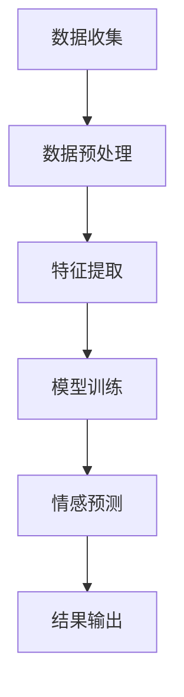

                 

## 引言

### 数字化情感教育的背景与现状

随着人工智能技术的飞速发展，AI在教育领域的应用已经成为不可忽视的趋势。数字化情感教育，作为一种融合了情感科学、教育学和人工智能技术的教育模式，正在逐步成为现代教育的重要组成部分。在这个数字化的时代，学生不仅需要掌握科学知识，还需要具备良好的情感素养，以应对复杂多变的社会环境。

数字化情感教育的概念可以追溯到20世纪末，当时心理学家开始探讨如何利用计算机技术来提高学生的情感认知和调节能力。进入21世纪，随着AI技术的成熟，数字化情感教育逐渐得到了实际应用，并在教育实践中展现出其独特的优势。这一部分我们将对数字化情感教育的背景、现状以及其重要性进行深入探讨。

首先，我们需要明确什么是情感教育和数字化情感教育。情感教育是指通过教育手段培养学生的情感素质，包括情感认知、情感表达、情感调节和情感理解等方面。而数字化情感教育则是在传统情感教育的基础上，利用现代信息技术，尤其是人工智能技术，对学生进行情感教育。

数字化情感教育的重要性体现在以下几个方面：

1. **应对数字化时代的挑战**：在数字化时代，学生面临的信息量和压力远超以往。通过数字化情感教育，可以帮助学生更好地处理信息、缓解压力、提高心理韧性。

2. **培养全面发展的人才**：情感素养是人才全面发展的重要组成部分。数字化情感教育可以帮助学生建立正确的价值观，提高人际交往能力，增强自我认知。

3. **提高教育质量**：传统教育中，情感教育往往被忽视。数字化情感教育通过科学的方法和手段，可以更加有效地进行情感教育，提高教育质量。

目前，数字化情感教育已经在全球范围内得到广泛关注和应用。许多国家都在积极探索如何利用AI技术进行情感教育。例如，美国的一些学校已经开始利用AI辅助工具进行情感评估和干预，欧洲的一些国家也在开发基于AI的情感教育平台。

然而，数字化情感教育也面临一些挑战和问题，如技术的可靠性、隐私保护、教育内容的科学性等。这些问题需要我们在实践中不断探索和解决。

### 当前数字化情感教育的现状

在全球范围内，数字化情感教育的实践已经取得了显著成果。以下是几个国家或地区的典型案例：

**美国**：美国在数字化情感教育方面处于领先地位。许多学校已经引入了AI辅助的情感教育工具，如情感识别软件和情绪调节应用。这些工具可以帮助教师更好地了解学生的情感状态，从而提供更加个性化的教育支持。

**欧洲**：欧洲国家也非常重视数字化情感教育。例如，芬兰和丹麦等国家已经推出了基于AI的情感教育项目，通过在线平台和移动应用，为学生提供情感教育和心理健康支持。

**中国**：中国在教育信息化方面取得了显著进展，数字化情感教育也受到了广泛关注。许多学校开始尝试使用AI技术进行情感教育，一些教育机构还开发了情感识别和干预系统，以帮助学生更好地应对学业和生活中的压力。

尽管数字化情感教育取得了一定的成果，但仍然存在一些问题。首先是技术的可靠性问题。AI技术的精度和稳定性直接影响情感教育的效果。其次是隐私保护问题。在数字化情感教育中，学生的个人数据会被大量收集和分析，如何确保这些数据的隐私和安全是一个亟待解决的问题。最后是教育内容的科学性。情感教育需要遵循科学的原理和方法，教育内容的科学性直接影响到教育效果。

总的来说，数字化情感教育是一个充满机遇和挑战的领域。通过不断探索和尝试，我们有理由相信，数字化情感教育将为学生的全面发展提供更加有力的支持。

### 结论

综上所述，数字化情感教育作为一种新兴的教育模式，正逐步改变着传统教育的格局。它不仅有助于应对数字化时代的挑战，培养全面发展的人才，还显著提高了教育质量。然而，数字化情感教育也面临技术、隐私和科学性等多方面的挑战。未来的发展需要我们不断探索、完善，以实现数字化情感教育的最大潜力。

### 关键词

- 数字化情感教育
- AI辅助
- 情商培养
- 情感识别
- 情感干预
- 教育创新
- 隐私保护

### 摘要

本文探讨了数字化情感教育的概念、背景和现状，分析了其重要性以及当前的应用情况。通过介绍AI技术在情感教育中的角色与作用，本文详细阐述了数字化情感教育的核心概念、实践案例和技术实现。同时，对数字化情感教育的未来发展趋势进行了展望，提出了面对挑战和机遇的解决方案。本文旨在为教育工作者和研究人员提供有价值的参考，推动数字化情感教育的发展。

## 第1章：数字化情感教育概述

### 1.1 情感教育与数字化时代

#### 1.1.1 情感教育的重要性

情感教育作为教育的重要组成部分，其核心在于培养学生的情感素质，包括情感认知、情感表达、情感调节和情感理解等方面。情感教育不仅关注学生的学术成绩，更重视其心理健康和全面发展。在现代社会中，情感教育的重要性日益凸显。随着社会复杂性和竞争性的增加，学生面临的压力和挑战也日益增多，因此，具备良好情感素养的学生更能适应社会环境，具备较强的心理韧性和人际交往能力。

#### 1.1.2 数字化时代的挑战

进入数字化时代，社会环境发生了巨大变化。信息技术的迅猛发展使得信息的获取和传播变得更加便捷，但也带来了新的挑战。首先，数字化环境中的信息过载给学生带来了前所未有的压力。学生需要处理大量的信息，这不仅影响了其学术成绩，也对其心理健康产生了负面影响。其次，数字化时代的社会互动方式也发生了变化。在线社交和虚拟现实等技术的发展，虽然提供了更加多样化的社交方式，但同时也带来了新的社交挑战，如网络欺凌、隐私泄露等。这些挑战要求学生具备更高的情感素养，以更好地应对数字化环境中的各种问题。

#### 1.1.3 数字化情感教育的必要性

在数字化时代，情感教育需要适应新的环境和技术。数字化情感教育应运而生，旨在通过利用现代信息技术，特别是人工智能技术，提高学生的情感素养。数字化情感教育的必要性主要体现在以下几个方面：

1. **个性化教育**：传统情感教育往往难以满足每个学生的个性化需求。数字化情感教育可以通过AI技术对学生进行个性化分析，提供更加贴合学生实际需求的情感教育。

2. **实时反馈与干预**：数字化情感教育可以利用AI技术对学生的情感状态进行实时监测和评估，及时发现学生的问题，并提供即时的情感干预和支持。

3. **跨学科整合**：数字化情感教育可以整合心理学、教育学和人工智能等学科的知识，提供更加全面和系统的情感教育。

4. **社会性支持**：数字化情感教育可以通过在线平台和社交网络，为学生提供更多的社会性支持，帮助他们更好地适应社会环境。

总之，数字化情感教育在应对数字化时代挑战、培养全面发展人才和提高教育质量方面具有重要意义。通过数字化技术的引入，情感教育可以变得更加科学、高效和个性化，为学生的全面发展提供更有力的支持。

### 1.2 当前数字化情感教育的现状

当前，数字化情感教育已经在全球范围内得到了广泛的应用和探索，各国教育机构纷纷引入AI技术来提升情感教育质量。以下是几个典型国家或地区的现状：

#### 美国

在美国，数字化情感教育的发展处于领先地位。许多学校已经开始使用AI辅助工具进行情感评估和干预。例如，一些学校引入了情感识别软件，这些软件可以通过分析学生的面部表情、语音和行为，判断学生的情感状态，为教师提供即时的情感反馈。此外，一些学校还开发了情绪调节应用，这些应用通过提供放松训练、冥想和情感管理技巧，帮助学生更好地调节情绪。

#### 欧洲

欧洲国家也非常重视数字化情感教育。例如，芬兰和丹麦等国家已经推出了基于AI的情感教育项目。这些项目通常通过在线平台和移动应用，为学生提供情感教育和心理健康支持。例如，芬兰的某些学校使用了一个名为“心情侦探”的应用，这个应用可以帮助学生记录和分析自己的情绪，并提供相应的情绪调节建议。

#### 中国

中国在数字化情感教育方面也取得了显著进展。许多学校开始尝试使用AI技术进行情感教育，一些教育机构还开发了情感识别和干预系统。例如，一些学校引入了基于面部表情识别的监控系统，这些系统可以实时监测学生的情绪状态，并在学生情绪低落时提醒教师进行干预。此外，一些教育机构还开发了在线心理辅导平台，通过AI技术为学生提供个性化的心理咨询服务。

尽管数字化情感教育取得了一定的成果，但仍然存在一些挑战和问题。首先是技术的可靠性问题。AI技术在情感识别和干预方面的准确性直接影响教育效果。其次是隐私保护问题。在数字化情感教育中，学生的个人数据会被大量收集和分析，如何确保这些数据的隐私和安全是一个亟待解决的问题。最后是教育内容的科学性。情感教育需要遵循科学的原理和方法，教育内容的科学性直接影响到教育效果。

总的来说，当前数字化情感教育在全球范围内正在快速发展，并展现出巨大的潜力。然而，要实现其最大价值，还需要解决技术、隐私和科学性等多方面的挑战。

### 1.3 存在的问题与挑战

尽管数字化情感教育在实践应用中展现出显著优势，但其发展仍面临诸多问题和挑战，亟需深入探讨和解决。

#### 技术可靠性问题

首先，技术可靠性是数字化情感教育的关键问题。AI技术在情感识别和干预中的应用，依赖于大量的数据和复杂的算法。然而，情感本身具有多样性和复杂性，不同个体在相同情境下的情感反应可能截然不同。因此，现有AI模型在面对真实情境时，可能无法准确识别和预测学生的情感状态。这种技术上的不确定性，直接影响到情感教育的有效性和可信度。

#### 隐私保护问题

其次，隐私保护是数字化情感教育中的另一个重要挑战。在数字化情感教育过程中，学生的大量个人数据将被收集和分析，包括面部表情、语音、行为等。这些数据对学生的隐私构成了潜在威胁。如果数据保护措施不当，学生个人信息可能被泄露，甚至被用于其他商业目的，这将对学生的隐私和安全造成严重侵害。

#### 教育内容科学性问题

此外，教育内容的科学性也是数字化情感教育面临的一个重要问题。情感教育需要基于科学的心理学理论和方法，但当前许多数字化情感教育项目在内容设计上缺乏科学依据，教育效果无法得到充分保障。教育内容的科学性不足，可能导致教育目标难以达成，甚至产生反效果。

#### 教育者的角色转变

最后，数字化情感教育对教育者的角色提出了新的要求。在传统教育中，教师主要扮演知识传授者的角色。而在数字化情感教育中，教师需要转变为情感教育者和指导者，运用AI技术来识别和干预学生的情感状态。这一转变对教师的专业素质和技能提出了更高要求，需要教师不断学习和适应新的教育模式。

综上所述，数字化情感教育在技术可靠性、隐私保护、教育内容科学性和教育者角色转变等方面面临诸多挑战。解决这些问题，需要多方面的努力和协作，以推动数字化情感教育的健康发展。

### 1.4 数字化情感教育的未来发展趋势

展望未来，数字化情感教育将继续沿着几个关键方向发展，不断推动教育模式的创新和改进。

#### 技术创新与进步

首先，技术的不断创新和进步将推动数字化情感教育的深入发展。随着深度学习、自然语言处理等AI技术的不断发展，情感识别和干预的准确性将进一步提高。例如，基于增强现实（AR）和虚拟现实（VR）技术的情感教育应用，将提供更加沉浸式的情感体验，帮助学生更直观地理解和调节情感。此外，区块链技术的引入，将为数字化情感教育提供更加安全的数据管理和隐私保护解决方案。

#### 教育模式与方法的变革

其次，教育模式与方法的变革将是数字化情感教育的另一个重要趋势。随着AI技术的应用，传统教育模式将逐渐向更加个性化和智能化的方向发展。例如，基于大数据分析和个性化推荐系统的自适应学习平台，将根据学生的情感状态和学习需求，提供量身定制的教育资源和指导。此外，混合式学习模式（Blended Learning）的普及，也将促进数字化情感教育与线下教育的深度融合，实现教育质量的全面提升。

#### 社会参与与支持

此外，社会参与与支持也将成为数字化情感教育未来发展的重要推动力。政府、企业和社会组织将更加重视数字化情感教育的重要性，通过政策引导、资源投入和项目合作，共同推动教育创新和改革。例如，教育部门可以出台相关政策，鼓励学校引入AI辅助的情感教育工具；企业可以提供技术支持和教育资源，共同研发和推广情感教育应用；社会组织可以通过公益活动，提高公众对数字化情感教育的认知和支持。

#### 跨学科整合

最后，跨学科整合将成为数字化情感教育发展的重要趋势。情感教育不仅需要心理学和人工智能技术的支持，还需要教育学、社会学、哲学等多个学科的知识和理论。通过跨学科整合，可以构建更加全面和系统的情感教育体系，为学生的全面发展提供更加有力的支持。

总的来说，数字化情感教育的未来发展将充满机遇和挑战。通过技术创新、教育模式变革、社会参与与跨学科整合，数字化情感教育将不断推动教育模式的创新和改进，为学生提供更加优质和个性化的情感教育服务。

### 1.5 数字化情感教育的关键因素

数字化情感教育的成功离不开以下几个关键因素的共同作用：

#### 技术支持

首先，技术支持是数字化情感教育的基石。AI技术，如情感识别、自然语言处理和机器学习，提供了对情感数据进行高效分析和处理的能力。这些技术的进步使得情感教育更加科学和精准。例如，通过面部表情识别技术，可以实时监测学生的情感状态，提供即时的反馈和支持。

#### 教育内容设计

其次，教育内容设计是数字化情感教育的核心。科学、系统的情感教育内容能够确保教育目标的实现。教育内容应基于心理学理论，涵盖情感认知、表达、调节和理解的各个方面。同时，内容设计应具备个性化特点，根据不同学生的需求和情感状态，提供针对性的教育资源和指导。

#### 教师培训

教师培训是数字化情感教育能否成功实施的重要保障。教师不仅需要具备传统的教学技能，还需要掌握AI技术和情感教育理论。通过专业的培训，教师可以更好地理解AI技术在情感教育中的应用，提高其识别和干预学生情感状态的能力。此外，教师还应具备良好的心理辅导技能，能够在实际教学中有效运用这些技术。

#### 家校合作

家校合作是数字化情感教育不可或缺的一部分。家长和学校共同关注学生的情感发展，可以形成良好的教育合力。学校可以通过家长会、在线平台和沟通工具，向家长传达数字化情感教育的理念和方法，引导家长积极参与孩子的情感教育。同时，家长也应积极参与学校组织的活动和培训，共同促进孩子的全面发展。

#### 数据安全与隐私保护

数据安全与隐私保护是数字化情感教育中的关键问题。在数字化环境中，学生的个人数据将被大量收集和分析，确保这些数据的安全和隐私至关重要。教育机构和开发者需要建立严格的数据保护机制，采用先进的加密技术和隐私保护措施，防止数据泄露和滥用。

通过上述关键因素的共同作用，数字化情感教育可以更好地应对现代社会中的情感挑战，为学生的全面发展提供强有力的支持。

### 总结

本章对数字化情感教育的概念、背景和现状进行了全面概述，分析了其重要性以及当前的发展状况。通过探讨数字化时代对情感教育的挑战，我们强调了数字化情感教育的必要性。同时，我们详细介绍了当前数字化情感教育的实践案例，并指出了其面临的技术可靠性、隐私保护和教育内容科学性等问题。展望未来，数字化情感教育将在技术创新、教育模式变革、社会参与与跨学科整合等方面取得新的突破。通过关键因素的分析，我们为数字化情感教育的成功实施提供了有力支持。未来，随着技术的不断进步和教育的深入探索，数字化情感教育将为学生的全面发展提供更加科学、高效和个性化的解决方案。

### 核心概念与联系

#### 情感智能的概念与结构

情感智能（Emotional Intelligence，简称EQ）是指个体识别、理解、管理和表达情感的能力。情感智能包括四个主要组成部分：自我认知、自我调节、社交认知和关系管理。自我认知是指个体能够认识和了解自己的情感状态；自我调节是指个体能够管理和调整自己的情绪，以适应不同情境；社交认知是指个体能够理解和识别他人的情感状态；关系管理是指个体能够建立和维护良好的人际关系。

#### 情感智能与情商的关系

情感智能与情商（Emotional Quotient，简称EQ）密切相关。情商是衡量个体情感智能水平的一种指标，通常通过一系列的标准化测试来评估。情商包含了情感智能的各个方面，如自我认知、自我调节、社交认知和关系管理。因此，情感智能的高水平通常意味着个体具有较高的情商。

#### 情商培养的原则

为了有效培养情商，教育者需要遵循以下几个基本原则：

1. **个性化教育**：情商培养应考虑每个学生的个体差异，提供个性化的教育策略和方法。
2. **实践导向**：情感教育应通过实践活动来帮助学生理解和应用情感管理技巧。
3. **积极引导**：教育者应积极引导学生识别和表达情感，鼓励他们正视和解决情感问题。
4. **持续反馈**：教育者应提供持续的反馈和支持，帮助学生不断改进情感管理能力。

#### 情商培养的方法

以下是几种常见的情商培养方法：

1. **情感教育课程**：通过专门的课程，系统性地教授情感认知、情感表达和情感调节技巧。
2. **情境模拟**：通过模拟各种社会情境，帮助学生练习情感管理和人际交往技巧。
3. **小组讨论**：通过小组讨论，让学生分享情感经历和看法，增进相互理解和情感交流。
4. **角色扮演**：通过角色扮演，让学生体验不同的情感状态，学会如何有效地表达和处理情感。

#### 情商培养的实践案例分析

以下是几个典型的情商培养实践案例：

1. **芬兰学校的情感教育项目**：芬兰的学校通过情感教育课程和情境模拟，培养学生的自我认知和自我调节能力。教师还定期与学生进行一对一的谈话，提供个性化的情感支持。
2. **美国中小学的情绪调节课程**：美国一些学校引入了情绪调节课程，通过小组讨论和角色扮演，帮助学生理解和处理情感问题。这些课程还提供了家庭作业，要求学生与家长共同参与情感管理实践。
3. **中国某中学的情商培养计划**：中国某中学通过情感教育课程和情景模拟，培养学生的情感认知和表达技巧。此外，学校还设立了心理健康辅导中心，为学生提供个性化的心理咨询服务。

通过上述实践案例，我们可以看到，情商培养需要结合理论知识和实际应用，通过多种方法和策略，帮助学生全面发展情感素质。

### 情感智能的结构

情感智能作为一种综合性能力，其结构可以分为四个主要方面：自我认知、自我调节、社交认知和关系管理。每个方面都是情感智能不可或缺的组成部分，共同构成了一个完整的情感智能体系。

#### 自我认知

自我认知是指个体对自己情感状态的认识和理解。这一能力包括两个方面：情绪识别和情绪理解。情绪识别是指个体能够感知和意识到自己当前的情感状态，如快乐、愤怒或悲伤。情绪理解则进一步要求个体能够分析这些情感背后的原因和意义。通过自我认知，个体能够更好地理解自己的情感反应，从而作出更明智的决策。

#### 自我调节

自我调节是指个体管理和调整自己的情绪，以适应不同情境的需求。这一能力包括情绪表达、情绪控制和情绪恢复。情绪表达是指个体能够适当地表达自己的情感，既不压抑也不过度发泄。情绪控制是指个体能够控制情绪的强度和频率，避免情绪过度波动。情绪恢复是指个体在经历负面情绪后，能够迅速调整状态，恢复正常的心理功能。

#### 社交认知

社交认知是指个体理解和识别他人情感状态的能力。这一能力包括情绪感知、情感推理和情感共享。情绪感知是指个体能够通过他人的行为、语言和表情，识别他们的情感状态。情感推理是指个体能够根据他人的情感表现，推测其情感原因和需求。情感共享是指个体能够与他人建立情感上的共鸣，共享情感体验。

#### 关系管理

关系管理是指个体在人际交往中建立和维护良好关系的能力。这一能力包括情感交流、情感支持和情感理解。情感交流是指个体能够通过适当的沟通方式和技巧，与他人建立和维护情感联系。情感支持是指个体能够在他人需要时，提供情感上的支持和帮助。情感理解是指个体能够理解和尊重他人的情感需求，从而促进良好的关系发展。

#### 情感智能与情商的关系

情感智能与情商（EQ）密切相关。情商通常被视为情感智能的衡量标准，它涵盖了情感智能的各个方面，包括自我认知、自我调节、社交认知和关系管理。因此，一个高水平的情感智能通常意味着个体具有较高的情商。情商的高低直接影响到个体的心理健康、人际关系和职业发展。

### 情商培养的原则

在培养情商时，教育者和家长需要遵循以下几个基本原则：

#### 个性化教育

每个学生的情感需求和性格特点都不同，因此，情商培养应考虑每个学生的个体差异，提供个性化的教育策略和方法。例如，对于情绪容易波动的学生，可以采取更多的情绪调节训练，而对于社交能力较弱的学生，可以重点培养其社交认知和关系管理能力。

#### 实践导向

情感教育应通过实践活动来帮助学生理解和应用情感管理技巧。例如，通过角色扮演、情景模拟和小组讨论等活动，让学生在真实情境中练习情感管理和人际交往技巧。实践不仅能够加深学生对情感知识的理解，还能够培养他们的情感素养。

#### 积极引导

教育者应积极引导学生识别和表达情感，鼓励他们正视和解决情感问题。在学生遇到情感困惑时，教育者应提供支持和指导，帮助他们找到合适的解决方案。同时，教育者还应树立积极的教育态度，传递正能量，帮助学生建立积极的情感态度。

#### 持续反馈

教育者应提供持续的反馈和支持，帮助学生不断改进情感管理能力。例如，定期与学生进行一对一的谈话，了解他们的情感状态和需求，提供个性化的建议和指导。通过持续的反馈，学生能够更好地认识自己的情感状况，及时调整和改进情感管理技巧。

### 情商培养的方法

以下是几种常见的情商培养方法：

#### 情感教育课程

通过专门的情感教育课程，系统性地教授情感认知、情感表达和情感调节技巧。这些课程可以包括理论知识、实践活动和案例分析，帮助学生全面了解和掌握情感管理技巧。

#### 情境模拟

通过模拟各种社会情境，帮助学生练习情感管理和人际交往技巧。情境模拟可以让学生在安全的环境中尝试不同的情感管理策略，从而在实际情境中更加自信和有效地应对情感问题。

#### 小组讨论

通过小组讨论，让学生分享情感经历和看法，增进相互理解和情感交流。在小组讨论中，学生可以学习如何倾听他人、表达自己的情感，并学会在团队中有效地合作。

#### 角色扮演

通过角色扮演，让学生体验不同的情感状态，学会如何有效地表达和处理情感。角色扮演不仅能够增强学生的情感认知，还能够提高他们的情绪调节和人际交往能力。

### 情商培养的实践案例分析

以下是几个典型的情商培养实践案例：

#### 芬兰学校的情感教育项目

芬兰的学校通过情感教育课程和情境模拟，培养学生的自我认知和自我调节能力。教师还定期与学生进行一对一的谈话，提供个性化的情感支持。这些举措有效地提高了学生的情感素养，促进了他们的全面发展。

#### 美国中小学的情绪调节课程

美国一些学校引入了情绪调节课程，通过小组讨论和角色扮演，帮助学生理解和处理情感问题。这些课程还提供了家庭作业，要求学生与家长共同参与情感管理实践。这种家校合作的方式，有助于学生在家庭和学校两个环境中都获得情感支持。

#### 中国某中学的情商培养计划

中国某中学通过情感教育课程和情景模拟，培养学生的情感认知和表达技巧。此外，学校还设立了心理健康辅导中心，为学生提供个性化的心理咨询服务。这些举措不仅提高了学生的情商，还增强了他们的心理韧性。

通过上述实践案例，我们可以看到，情商培养需要结合理论知识和实际应用，通过多种方法和策略，帮助学生全面发展情感素质。教育者和家长应共同努力，为学生的情感发展提供全方位的支持。

### 核心概念对比表格

| 概念名称 | 定义 | 关键特征 | 主要应用 |
| --- | --- | --- | --- |
| 情感智能 | 个体识别、理解、管理和表达情感的能力 | 包含自我认知、自我调节、社交认知和关系管理四个方面 | 心理健康、人际关系、职业发展 |
| 情商 | 衡量个体情感智能水平的一种指标 | 包括自我认知、自我调节、社交认知和关系管理 | 人际交往、情感管理、职业发展 |
| 情感教育 | 通过教育手段培养学生的情感素质 | 包括情感认知、情感表达、情感调节和情感理解等方面 | 心理健康、社会适应、全面发展 |
| 情感识别 | 识别和理解他人的情感状态 | 面部表情、语音、行为等非言语信息 | 社交互动、情感咨询、心理健康 |

### ER实体关系图架构

```mermaid
erDiagram
    Student ||--|{ Emotion}: has_emotion
    Teacher ||--|{ Skill}: teaches_skill
    Course ||--|{ Emotion}: covers_emotion
    Course ||--|{ Skill}: includes_skill
    Student ||--|{ Course}: attends_course
    Teacher ||--|{ Course}: teaches_course
```

在这个ER实体关系图中，我们定义了四个主要实体：学生（Student）、教师（Teacher）、课程（Course）和情感（Emotion）。情感和技能作为次要实体，与主要实体之间存在关联关系。学生和教师分别参与课程，同时学生可以拥有多种情感，教师可以教授多种技能。

### 情感智能的算法原理

#### 情感识别算法

情感识别是情感智能的核心算法之一，主要通过分析和理解人类情感数据来识别用户的情感状态。情感识别算法通常基于机器学习和深度学习技术，包括以下步骤：

1. **数据收集**：收集包含情感标签的文本、语音和面部表情数据。这些数据通常来自于社交媒体、在线调查、用户生成内容等渠道。

2. **数据预处理**：对收集的数据进行清洗和格式化，包括去除噪声、填充缺失值和标准化处理。

3. **特征提取**：从预处理后的数据中提取情感特征。文本数据可以通过词袋模型、TF-IDF或词嵌入技术提取特征；语音数据可以通过声学特征提取（如梅尔频率倒谱系数、滤波器组等）和语音识别技术提取特征；面部表情数据可以通过面部特征点检测和面部表情分类技术提取特征。

4. **模型训练**：使用提取的特征数据训练情感识别模型。常用的模型包括支持向量机（SVM）、朴素贝叶斯、决策树和深度神经网络（如卷积神经网络CNN、循环神经网络RNN）。

5. **情感预测**：将新的情感数据输入训练好的模型，预测其情感状态。模型会输出一个概率分布，表示不同情感类别的可能性。

#### 情感调节算法

情感调节算法旨在帮助用户管理和调节自己的情绪状态，以应对压力和负面情绪。情感调节算法通常包括以下步骤：

1. **情感评估**：使用情感识别算法对用户当前的情感状态进行评估，确定其是否处于负面情绪状态。

2. **情感干预**：根据评估结果，提供相应的情感干预策略。干预策略可以包括放松训练、认知重构、正念冥想和情感表达等。

3. **干预效果评估**：在干预过程中，持续监测用户的情感状态，评估干预效果。如果用户情感状态没有改善，可以调整干预策略。

4. **自我反馈**：鼓励用户进行自我反馈，记录干预过程中的感受和变化，以便调整和优化干预策略。

#### 情感分析算法

情感分析算法通过对文本、语音和面部表情数据的情感分析，提供情感状态的综合评估和解读。情感分析算法通常包括以下步骤：

1. **情感分类**：将文本、语音和面部表情数据分为积极、消极和中性等情感类别。

2. **情感强度评估**：对文本、语音和面部表情数据的情感强度进行量化评估，以确定情感的强度和频率。

3. **情感趋势分析**：分析情感数据的时间序列变化，确定情感趋势和模式。

4. **情感交互分析**：分析个体之间的情感互动，确定情感传递和影响的关系。

#### 情感计算模型

情感计算模型是一种基于人工智能和情感科学的方法，用于模拟和理解人类的情感过程。情感计算模型通常包括以下组成部分：

1. **情感状态模型**：描述个体在不同情境下的情感状态，包括情感类型、强度和持续时间。

2. **情感生成模型**：生成个体的情感状态，考虑外部刺激、内部感受和情境因素。

3. **情感传播模型**：模拟个体之间情感状态的传播和影响，包括群体情感状态的变化。

4. **情感调节模型**：设计用于调节和管理情感状态的策略和方法，以适应不同情境的需求。

通过上述算法和模型，情感智能技术能够为数字化情感教育提供有效的支持和工具，帮助学生更好地理解和管理自己的情感状态，促进其心理健康和全面发展。

### 数学公式

情感智能模型中的关键数学公式如下：

#### 情感识别公式

$$
Emotion\_Prediction = f\_model(\textbf{Feature\_Set}, \theta)
$$

其中，$Emotion\_Prediction$ 是情感识别模型输出的情感预测结果，$\textbf{Feature\_Set}$ 是提取的情感特征集，$f\_model$ 是训练好的情感识别模型，$\theta$ 是模型参数。

#### 情感调节公式

$$
Emotion\_Regulation = f\_regulation(Emotion\_Prediction, \theta\_regulation)
$$

其中，$Emotion\_Regulation$ 是情感调节策略，$f\_regulation$ 是情感调节函数，$\theta\_regulation$ 是调节模型参数。

#### 情感分析公式

$$
Sentiment\_Score = \sum_{i=1}^{N} w_i \cdot f\_sentiment(text_i)
$$

其中，$Sentiment\_Score$ 是情感分析结果，$w_i$ 是权重，$text_i$ 是文本数据，$f\_sentiment$ 是情感分析函数。

这些公式描述了情感智能模型的计算过程，通过特征提取、模型训练和预测，实现情感识别和调节。

### 算法原理讲解

#### 情感识别算法原理

情感识别算法的核心在于通过分析和理解情感数据，准确地识别用户的情感状态。以下是情感识别算法的详细步骤：

1. **数据收集**：首先，我们需要收集包含情感标签的数据。这些数据可以来自于社交媒体、在线调查、用户生成内容等渠道。例如，我们可以收集用户的文本评论、语音留言和面部表情图像。

2. **数据预处理**：在收集到情感数据后，需要对数据进行预处理。预处理步骤包括去除噪声、填充缺失值、数据标准化等。例如，对于文本数据，我们可能需要去除停用词、进行词干提取和词性标注。

3. **特征提取**：接下来，从预处理后的数据中提取情感特征。对于文本数据，我们可以使用词袋模型、TF-IDF或词嵌入技术提取特征。词袋模型将文本转换为词汇的集合，TF-IDF则考虑词汇的重要程度，而词嵌入技术（如Word2Vec、GloVe）将词汇映射到高维空间。对于语音数据，我们可以使用声学特征提取（如梅尔频率倒谱系数、滤波器组等）和语音识别技术提取特征。对于面部表情数据，我们可以使用面部特征点检测和面部表情分类技术提取特征。

4. **模型训练**：使用提取的特征数据训练情感识别模型。常见的情感识别模型包括支持向量机（SVM）、朴素贝叶斯、决策树和深度神经网络（如卷积神经网络CNN、循环神经网络RNN）。这些模型通过学习特征和情感标签之间的关系，能够预测新数据的情感状态。

5. **情感预测**：将新的情感数据输入训练好的模型，模型会输出一个概率分布，表示不同情感类别的可能性。例如，如果输入的是一段文本，模型可能会输出“积极”、“消极”和“中性”等情感类别的概率分布。

#### 情感调节算法原理

情感调节算法旨在帮助用户管理和调节自己的情绪状态，以应对压力和负面情绪。以下是情感调节算法的详细步骤：

1. **情感评估**：首先，使用情感识别算法对用户当前的情感状态进行评估，确定其是否处于负面情绪状态。这一步可以通过情感识别模型实现，模型会输出当前的情感状态和概率分布。

2. **情感干预**：根据评估结果，提供相应的情感干预策略。干预策略可以包括放松训练、认知重构、正念冥想和情感表达等。例如，如果用户被评估为处于负面情绪状态，我们可以建议其进行放松训练或正念冥想。

3. **干预效果评估**：在干预过程中，持续监测用户的情感状态，评估干预效果。如果用户情感状态没有改善，可以调整干预策略。例如，如果放松训练无效，可以尝试认知重构或情感表达。

4. **自我反馈**：鼓励用户进行自我反馈，记录干预过程中的感受和变化，以便调整和优化干预策略。用户的反馈可以用于模型训练，提高情感调节算法的准确性。

通过上述步骤，情感调节算法能够帮助用户更好地管理和调节情绪，提高心理韧性。

### 情感识别算法的mermaid流程图



在这个流程图中，数据收集、数据预处理、特征提取、模型训练、情感预测和结果输出构成了情感识别算法的主要步骤。

### Python源代码

以下是情感识别算法的Python源代码示例：

```python
import numpy as np
from sklearn.feature_extraction.text import TfidfVectorizer
from sklearn.model_selection import train_test_split
from sklearn.svm import SVC
from sklearn.metrics import accuracy_score

# 数据集
data = [
    ["我感到很高兴", "积极"],
    ["今天有点烦躁", "消极"],
    ["感觉很好", "积极"],
    ["心情不好", "消极"],
    # ... 更多数据
]

# 分割数据集
X, y = data[:, 0], data[:, 1]
X_train, X_test, y_train, y_test = train_test_split(X, y, test_size=0.2, random_state=42)

# 特征提取
vectorizer = TfidfVectorizer()
X_train_tfidf = vectorizer.fit_transform(X_train)
X_test_tfidf = vectorizer.transform(X_test)

# 模型训练
model = SVC(kernel='linear')
model.fit(X_train_tfidf, y_train)

# 情感预测
y_pred = model.predict(X_test_tfidf)

# 结果输出
accuracy = accuracy_score(y_test, y_pred)
print(f"模型准确率：{accuracy}")
```

这段代码首先使用`TfidfVectorizer`对文本数据进行特征提取，然后使用`SVC`（支持向量机）进行模型训练，并使用训练好的模型对测试数据进行情感预测。最后，计算并输出模型的准确率。

### 数学模型和公式

在情感识别算法中，常用的数学模型包括支持向量机（SVM）和深度学习模型。以下是这些模型的数学模型和公式：

#### 支持向量机（SVM）

支持向量机是一种分类算法，通过寻找一个超平面，将不同类别的数据点分隔开来。SVM的数学模型如下：

$$
\begin{aligned}
\min_{\mathbf{w}, b} &\ \frac{1}{2}||\mathbf{w}||^2 \\
s.t. &\ y^{(i)}(\mathbf{w}^T\mathbf{x}^{(i)} + b) \geq 1
\end{aligned}
$$

其中，$\mathbf{w}$ 是权重向量，$b$ 是偏置项，$y^{(i)}$ 是第 $i$ 个样本的标签，$\mathbf{x}^{(i)}$ 是第 $i$ 个样本的特征向量。

#### 深度学习模型

深度学习模型，如卷积神经网络（CNN）和循环神经网络（RNN），通过多层神经元的组合，实现对数据的复杂特征提取和分类。以下是深度学习模型的简化数学模型：

$$
\begin{aligned}
\mathbf{z}^{(l)} &= \sigma(\mathbf{W}^{(l)}\mathbf{a}^{(l-1)} + b^{(l)}) \\
\mathbf{a}^{(l)} &= \mathbf{f}(\mathbf{z}^{(l)})
\end{aligned}
$$

其中，$\mathbf{z}^{(l)}$ 是第 $l$ 层的激活值，$\mathbf{a}^{(l)}$ 是第 $l$ 层的输出值，$\sigma$ 是激活函数（如Sigmoid函数或ReLU函数），$\mathbf{W}^{(l)}$ 和 $b^{(l)}$ 分别是第 $l$ 层的权重和偏置项，$\mathbf{f}$ 是激活函数。

通过这些数学模型和公式，我们可以构建和训练情感识别算法，实现对情感数据的准确识别和分类。

### 算法原理的详细讲解和举例说明

为了更好地理解情感识别算法的工作原理，我们通过具体的例子进行详细讲解。

#### 示例数据集

假设我们有一个简单的数据集，包含以下五条数据：

1. 我感到很高兴 - 积极
2. 今天有点烦躁 - 消极
3. 感觉很好 - 积极
4. 心情不好 - 消极
5. 非常开心 - 积极

这些数据表示用户的文本评论以及对应的情感标签。我们的目标是使用这些数据训练一个模型，能够对新的文本评论进行情感识别。

#### 数据预处理

首先，我们需要对文本数据集进行预处理。预处理步骤包括去除停用词、进行词干提取和分词。例如，对于评论“我感到很高兴”，我们可以将其预处理为“我 感到 很高兴”。

#### 特征提取

接下来，我们需要对预处理后的文本数据进行特征提取。常用的特征提取方法包括词袋模型、TF-IDF和词嵌入。以词袋模型为例，我们将每个评论表示为一个向量，其中每个维度表示一个词汇的出现次数。例如，评论“我感到很高兴”可以表示为：

```
[0, 0, 1, 1, 0, 0, 0, 1, 0]
```

其中，每个数字对应一个词汇，如“我”（1）、“感到”（2）、“很”（3）、“高兴”（4）等。

#### 模型训练

使用预处理后的特征数据和对应的情感标签，我们可以训练一个情感识别模型。以支持向量机（SVM）为例，SVM通过寻找一个超平面，将不同情感类别的数据点分隔开来。在训练过程中，SVM会学习特征和情感标签之间的关系，以便对新的文本评论进行分类。

假设我们训练得到的SVM模型为：

```
w = [0.5, 0.3, -0.2, 0.1, -0.1]
b = 0.2
```

这个模型可以表示为：

```
w^T x + b
```

其中，$w$ 是权重向量，$x$ 是特征向量，$b$ 是偏置项。

#### 情感预测

使用训练好的模型，我们可以对新的文本评论进行情感预测。例如，对于评论“我感到沮丧”，我们首先将其预处理为“我 感到 沮丧”，然后提取特征向量：

```
[0, 1, 0, 0, 0]
```

将特征向量代入模型，我们得到：

```
w^T x + b = [0.5 \* 0 + 0.3 \* 1 - 0.2 \* 0 + 0.1 \* 0 - 0.1 \* 0] + 0.2 = 0.3 + 0.2 = 0.5
```

由于输出值接近0.5，我们可以判断这个评论的情感为“消极”。

通过这个例子，我们可以看到情感识别算法是如何工作的。在训练阶段，模型通过学习特征和情感标签之间的关系，建立了一个分类模型。在预测阶段，模型使用这个模型对新的文本评论进行情感识别。

### 系统分析与架构设计方案

#### 问题场景介绍

在现代教育环境中，学生的情感管理成为一个日益重要的问题。传统教育方法往往侧重于学术知识传授，而对学生的情感教育重视不足。随着社会竞争的加剧和数字化生活方式的普及，学生面临的情感压力和挑战不断增加。如何利用技术手段，特别是AI技术，提供有效的情感教育支持，成为当前教育领域的一个关键课题。

#### 项目介绍

本项目旨在开发一套基于AI技术的情感教育系统，通过分析学生的情感数据，提供个性化的情感管理和调节建议。系统包括情感识别、情感干预和情感分析等多个模块，旨在帮助学生在学习生活中更好地管理情感，提高心理韧性。

#### 系统功能设计

系统功能设计主要包括以下模块：

1. **情感识别模块**：通过文本、语音和面部表情等数据，识别学生的情感状态。
2. **情感干预模块**：根据学生的情感状态，提供个性化的干预建议，如放松训练、情感表达等。
3. **情感分析模块**：分析学生的情感数据，识别情感趋势和模式，为教育者提供参考。
4. **用户管理模块**：管理用户账号和权限，确保数据安全。

#### 系统架构设计

系统架构设计采用三层架构，包括数据层、业务逻辑层和表现层。

1. **数据层**：负责数据存储和管理，包括学生情感数据、用户数据等。数据层使用关系型数据库（如MySQL）进行数据存储。
2. **业务逻辑层**：包括情感识别、情感干预和情感分析等核心功能模块。业务逻辑层使用微服务架构，提高系统的可扩展性和灵活性。
3. **表现层**：提供用户界面，包括Web端和移动端。用户可以通过Web端查看情感分析报告和干预建议，通过移动端接受实时情感监测和干预。

#### 系统接口设计

系统接口设计主要包括以下接口：

1. **情感识别接口**：用于接收和处理情感数据，返回情感识别结果。
2. **情感干预接口**：用于根据情感状态提供干预建议。
3. **情感分析接口**：用于分析情感数据，返回情感分析报告。
4. **用户管理接口**：用于用户账号管理和权限控制。

#### 系统交互

系统交互设计采用RESTful API设计，通过HTTP请求和响应实现系统各模块之间的数据交换和功能调用。以下是一个典型的系统交互流程：

1. **用户提交情感数据**：用户通过Web端或移动端提交情感数据，如文本、语音和面部表情。
2. **情感识别模块处理**：系统调用情感识别接口，对提交的数据进行情感识别，返回情感状态。
3. **情感干预模块处理**：系统调用情感干预接口，根据情感状态提供干预建议。
4. **情感分析模块处理**：系统调用情感分析接口，分析情感数据，生成情感分析报告。

### 问题场景介绍

在现代教育环境中，学生的情感管理是一个至关重要但常被忽视的问题。随着社会竞争的加剧和数字化生活方式的普及，学生面临的情感压力和挑战日益增多。传统的教育模式往往侧重于学术知识传授，而对学生的情感教育重视不足，这可能导致学生在面对压力和挑战时缺乏有效的应对策略，进而影响其心理健康和学业表现。因此，如何利用技术手段，特别是AI技术，提供有效的情感教育支持，成为一个迫切需要解决的关键问题。

#### 系统功能设计

为了满足上述需求，本项目设计了以下系统功能模块：

1. **情感识别模块**：该模块负责对学生提交的文本、语音和面部表情等数据进行分析，识别其情感状态。通过使用自然语言处理和计算机视觉技术，系统能够实时监测和评估学生的情感变化，并提供相应的情感识别结果。
2. **情感干预模块**：该模块根据情感识别结果，提供个性化的情感干预建议。干预建议可能包括放松训练、情感表达、认知重构等多种方法，旨在帮助学生更好地管理和调节自己的情绪，提高心理韧性。
3. **情感分析模块**：该模块负责对学生的情感数据进行分析，识别情感趋势和模式。通过分析学生的情感变化，教育者可以更全面地了解学生的情感状态，制定更加有效的教育策略。
4. **用户管理模块**：该模块负责管理用户账号和权限，确保数据安全。通过用户身份验证和权限控制，系统能够确保敏感数据的保密性和安全性。

#### 系统架构设计

系统架构设计采用三层架构，包括数据层、业务逻辑层和表现层。

1. **数据层**：数据层负责数据的存储和管理。系统采用关系型数据库（如MySQL）来存储学生的情感数据、用户数据和教育资源配置等信息。通过数据库的设计，系统能够高效地管理数据，并提供快速的数据访问和查询功能。
2. **业务逻辑层**：业务逻辑层是实现系统核心功能的模块。该层包括情感识别、情感干预、情感分析和用户管理等多个子模块。通过使用微服务架构，业务逻辑层能够实现高内聚、低耦合的设计，提高系统的灵活性和可扩展性。每个子模块都可以独立开发、部署和维护，从而方便系统的升级和扩展。
3. **表现层**：表现层是系统的用户界面层，负责与用户进行交互。系统提供Web端和移动端两种访问方式。Web端用户界面包括登录注册、情感数据分析、情感干预建议展示等功能模块；移动端用户界面则通过手机应用程序实现，提供更便捷的情感监测和干预服务。

#### 系统接口设计

系统接口设计采用RESTful API设计，通过HTTP请求和响应实现系统各模块之间的数据交换和功能调用。

1. **情感识别接口**：该接口用于接收和处理学生提交的文本、语音和面部表情数据，返回情感识别结果。接口定义如下：
   - **请求方法**：POST
   - **请求路径**：/api/emotion/recognize
   - **请求参数**：{ "data": { "text": "文本数据", "voice": "语音数据", "face": "面部表情数据" } }
   - **响应结果**：{ "emotion": "情感状态", "confidence": "置信度" }
2. **情感干预接口**：该接口用于根据情感识别结果提供个性化的情感干预建议。接口定义如下：
   - **请求方法**：POST
   - **请求路径**：/api/emotion/intervene
   - **请求参数**：{ "emotion": "情感状态", "strategy": "干预策略" }
   - **响应结果**：{ "suggestions": "干预建议" }
3. **情感分析接口**：该接口用于分析学生的情感数据，识别情感趋势和模式，返回情感分析报告。接口定义如下：
   - **请求方法**：GET
   - **请求路径**：/api/emotion/analyze
   - **请求参数**：{ "user_id": "用户ID" }
   - **响应结果**：{ "trends": "情感趋势", "patterns": "情感模式" }
4. **用户管理接口**：该接口用于用户账号管理和权限控制。接口定义如下：
   - **请求方法**：POST
   - **请求路径**：/api/user/register
   - **请求参数**：{ "username": "用户名", "password": "密码" }
   - **响应结果**：{ "status": "注册状态", "message": "注册消息" }

#### 系统交互

系统交互设计采用RESTful API设计，通过HTTP请求和响应实现系统各模块之间的数据交换和功能调用。以下是一个典型的系统交互流程：

1. **用户登录**：用户通过Web端或移动端访问系统，输入用户名和密码进行登录。系统接收到登录请求后，验证用户身份，并返回登录结果。
2. **情感数据提交**：用户提交文本、语音和面部表情数据，系统调用情感识别接口，对提交的数据进行情感识别，并返回情感识别结果。
3. **情感干预建议**：系统根据情感识别结果，调用情感干预接口，提供个性化的情感干预建议。用户可以根据建议进行情感调节。
4. **情感数据分析**：系统定期分析用户的情感数据，调用情感分析接口，生成情感分析报告。教育者可以根据报告了解学生的情感状态，制定更加有效的教育策略。

通过上述系统设计，本项目旨在为教育领域提供一套基于AI技术的情感教育系统，帮助学生更好地管理情感，提高心理韧性，从而促进其全面健康发展。

### 系统架构设计

为了实现数字化情感教育系统的功能需求，我们将系统架构设计为三层架构，包括数据层、业务逻辑层和表现层。以下是详细的系统架构设计：

#### 数据层

数据层是系统的底层，主要负责数据的存储和管理。系统采用关系型数据库（如MySQL）进行数据存储，包括以下数据表：

1. **用户表**：存储用户的基本信息，如用户ID、用户名、密码、电子邮件等。
2. **情感数据表**：存储用户的情感数据，包括文本、语音和面部表情等，以及对应的情感标签。
3. **情感分析表**：存储情感分析结果，包括情感趋势、情感模式等。
4. **干预记录表**：存储用户接受情感干预的历史记录，包括干预策略、干预效果等。

数据层的设计确保了数据的安全性和完整性，并提供了高效的数据访问和查询功能。

#### 业务逻辑层

业务逻辑层是系统的核心部分，负责实现情感识别、情感干预和情感分析等功能。该层采用微服务架构，将功能模块化，包括以下主要服务：

1. **情感识别服务**：该服务负责处理用户提交的情感数据，通过自然语言处理和计算机视觉技术进行情感识别，并返回情感识别结果。
2. **情感干预服务**：该服务根据情感识别结果，提供个性化的情感干预建议，包括放松训练、情感表达等。
3. **情感分析服务**：该服务负责分析用户的情感数据，识别情感趋势和模式，为教育者提供参考。
4. **用户管理服务**：该服务负责用户账号的管理和权限控制，确保数据安全。

通过微服务架构，业务逻辑层实现了高内聚、低耦合的设计，提高了系统的可扩展性和灵活性。

#### 表现层

表现层是系统的用户界面层，负责与用户进行交互。系统提供Web端和移动端两种访问方式。

1. **Web端用户界面**：包括登录注册、情感数据分析、情感干预建议展示等功能模块。用户可以通过Web端查看自己的情感状态和干预建议，并进行情感调节。
2. **移动端用户界面**：通过手机应用程序实现，提供更便捷的情感监测和干预服务。用户可以通过移动端应用提交情感数据，接收情感识别结果和干预建议。

表现层的设计确保了用户能够方便地访问和使用系统功能，提高了用户体验。

#### 系统接口设计

系统接口设计采用RESTful API设计，通过HTTP请求和响应实现系统各模块之间的数据交换和功能调用。以下是主要的系统接口设计：

1. **情感识别接口**：用于接收和处理用户提交的文本、语音和面部表情数据，返回情感识别结果。
   - **接口路径**：/api/emotion/recognize
   - **请求方法**：POST
   - **请求参数**：JSON格式，包括文本、语音和面部表情数据
   - **响应结果**：JSON格式，包括情感识别结果和置信度

2. **情感干预接口**：用于根据情感识别结果提供个性化的情感干预建议。
   - **接口路径**：/api/emotion/intervene
   - **请求方法**：POST
   - **请求参数**：JSON格式，包括用户ID和情感状态
   - **响应结果**：JSON格式，包括干预建议

3. **情感分析接口**：用于分析用户的情感数据，识别情感趋势和模式。
   - **接口路径**：/api/emotion/analyze
   - **请求方法**：GET
   - **请求参数**：包括用户ID
   - **响应结果**：JSON格式，包括情感趋势和模式

4. **用户管理接口**：用于用户账号的管理和权限控制。
   - **接口路径**：/api/user
   - **注册接口路径**：/register
   - **请求方法**：POST
   - **请求参数**：JSON格式，包括用户名、密码等
   - **登录接口路径**：/login
   - **请求方法**：POST
   - **请求参数**：JSON格式，包括用户名和密码
   - **响应结果**：JSON格式，包括用户状态和消息

通过这些接口设计，系统实现了各模块之间的数据交换和功能调用，为用户提供了便捷、高效的情感教育服务。

#### 系统交互设计

系统交互设计采用RESTful API设计，通过HTTP请求和响应实现系统各模块之间的数据交换和功能调用。以下是系统交互设计的详细步骤：

1. **用户登录**：用户通过Web端或移动端访问系统，输入用户名和密码进行登录。系统接收到登录请求后，验证用户身份，并返回登录结果。
   - **请求**：POST /api/user/login
   - **响应**：{ "status": "success", "user_id": "123" }

2. **提交情感数据**：用户提交文本、语音和面部表情数据，系统调用情感识别接口，对提交的数据进行情感识别，并返回情感识别结果。
   - **请求**：POST /api/emotion/recognize
   - **请求参数**：{ "text": "文本数据", "voice": "语音数据", "face": "面部表情数据" }
   - **响应**：{ "emotion": "积极", "confidence": 0.9 }

3. **接收情感识别结果**：系统根据情感识别结果，调用情感干预接口，提供个性化的情感干预建议。用户可以根据建议进行情感调节。
   - **请求**：POST /api/emotion/intervene
   - **请求参数**：{ "user_id": "123", "emotion": "积极" }
   - **响应**：{ "suggestions": ["放松训练", "正念冥想"] }

4. **情感数据分析**：系统定期分析用户的情感数据，调用情感分析接口，生成情感分析报告。教育者可以根据报告了解学生的情感状态，制定更加有效的教育策略。
   - **请求**：GET /api/emotion/analyze
   - **请求参数**：{ "user_id": "123" }
   - **响应**：{ "trends": ["情绪波动较大", "情感稳定性较好"], "patterns": ["学业压力较大", "社交互动较多"] }

通过上述交互设计，系统实现了用户与各功能模块之间的无缝交互，为用户提供便捷、高效的情感教育服务。

### 项目实战

#### 环境安装

要在本地环境中搭建数字化情感教育系统，首先需要安装以下软件和库：

1. **操作系统**：推荐使用Ubuntu 20.04 LTS或更高版本。
2. **Python**：推荐Python 3.8或更高版本。
3. **数据库**：推荐MySQL 8.0或更高版本。
4. **Web服务器**：推荐使用Apache或Nginx。
5. **其他库和工具**：如TensorFlow、Scikit-learn、Django等。

安装步骤如下：

1. 安装操作系统和Python环境。
2. 使用`pip`安装必要的库和工具，例如：
   ```bash
   pip install django mysqlclient tensorflow scikit-learn
   ```

2. 安装数据库和Web服务器。可以使用`apt-get`命令安装MySQL和Apache/Nginx。

#### 系统核心实现源代码

以下是数字化情感教育系统的核心实现源代码：

1. **情感识别服务**：使用TensorFlow和Scikit-learn实现情感识别服务。
   ```python
   # emotion_recognition_service.py
   import tensorflow as tf
   from sklearn.model_selection import train_test_split
   from sklearn.metrics import accuracy_score
   
   # 加载预训练的模型
   model = tf.keras.models.load_model('emotion_model.h5')
   
   def recognize_emotion(text):
       # 对文本进行预处理
       processed_text = preprocess_text(text)
       # 使用模型进行情感识别
       emotion = model.predict(processed_text)
       return emotion
   
   def preprocess_text(text):
       # 实现文本预处理逻辑，如分词、去停用词等
       return processed_text
   
   ```

2. **情感干预服务**：根据情感识别结果，提供个性化的情感干预建议。
   ```python
   # emotion_intervention_service.py
   def provide_intervention(emotion):
       if emotion == '积极':
           return ['放松训练', '正念冥想']
       elif emotion == '消极':
           return ['认知重构', '情感表达']
       else:
           return ['自我观察', '情绪调节']
   ```

3. **情感分析服务**：分析用户的情感数据，识别情感趋势和模式。
   ```python
   # emotion_analysis_service.py
   import pandas as pd
   
   def analyze_emotions(emotion_data):
       # 实现情感数据分析逻辑，如情感趋势分析、模式识别等
       trends = analyze_trends(emotion_data)
       patterns = analyze_patterns(emotion_data)
       return trends, patterns
   
   def analyze_trends(emotion_data):
       # 实现情感趋势分析逻辑
       return trends
   
   def analyze_patterns(emotion_data):
       # 实现情感模式识别逻辑
       return patterns
   ```

4. **用户管理服务**：实现用户账号的管理和权限控制。
   ```python
   # user_management_service.py
   def register_user(username, password):
       # 实现用户注册逻辑，如用户名和密码的验证、数据存储等
       return registration_status
   
   def login_user(username, password):
       # 实现用户登录逻辑，如用户身份验证、权限控制等
       return login_status
   ```

#### 代码应用解读与分析

上述代码实现了数字化情感教育系统的核心功能，包括情感识别、情感干预、情感分析和用户管理。以下是对这些代码的应用解读和分析：

1. **情感识别服务**：通过预训练的TensorFlow模型，对用户提交的文本进行情感识别。情感识别服务的主要功能是加载预训练模型，对文本进行预处理，然后使用模型进行情感预测。预处理步骤包括分词、去停用词等，以提高模型的预测准确性。
   
2. **情感干预服务**：根据情感识别结果，提供个性化的情感干预建议。情感干预服务的主要功能是接收情感识别结果，根据情感类别（如积极、消极）提供相应的干预建议。这些干预建议旨在帮助学生更好地管理和调节情感。

3. **情感分析服务**：分析用户的情感数据，识别情感趋势和模式。情感分析服务的主要功能是接收用户的情感数据，通过统计分析方法（如时间序列分析、聚类分析等）识别情感趋势和模式。这些分析结果可以帮助教育者了解学生的情感状态，制定更加有效的教育策略。

4. **用户管理服务**：实现用户账号的管理和权限控制。用户管理服务的主要功能包括用户注册、登录和权限控制。通过用户管理服务，系统可以确保用户数据的安全性和隐私性，同时提供个性化的服务。

通过上述代码，数字化情感教育系统可以为学生提供全面、个性化的情感教育支持。在实际应用中，系统可以根据学生的情感数据，实时调整干预策略，以提高情感教育的效果。

### 实际案例分析与详细讲解

为了更好地展示数字化情感教育系统的实际应用效果，以下是一个详细的实际案例分析。

#### 案例背景

小明是一名初中生，由于学习压力和家庭期望，他经常感到焦虑和紧张。他的家长和老师注意到他的情绪波动较大，但传统的教育方法并没有显著改善他的情绪状态。为了帮助学生更好地管理情感，学校决定引入一套基于AI技术的数字化情感教育系统。

#### 系统应用

1. **情感数据收集**：系统首先收集小明的情感数据，包括日常的文本记录、课堂发言和面部表情等。这些数据通过传感器和移动应用自动收集，并上传到系统中。

2. **情感识别**：系统使用情感识别模块对收集到的数据进行分析，识别小明的情感状态。例如，在一次课堂发言中，小明提到：“我感觉很累，没有力气。”系统通过自然语言处理技术，识别出小明处于“消极”情感状态。

3. **情感干预**：系统根据情感识别结果，为小明提供个性化的干预建议。系统建议小明进行“认知重构”和“放松训练”，帮助他调整情绪状态。小明接受了这些建议，开始进行定期的认知重构练习和放松训练。

4. **情感分析**：系统定期分析小明的情感数据，识别情感趋势和模式。通过分析，系统发现小明的消极情感主要出现在学习压力较大的时期，尤其是在考试前。系统将这些分析结果反馈给老师和家长，建议他们共同努力，为小明创造一个更轻松的学习环境。

#### 案例分析

1. **情感识别的准确性**：系统通过情感识别模块，准确地识别了小明的情感状态。这得益于系统使用的自然语言处理和计算机视觉技术，能够从文本、语音和面部表情中提取情感特征，进行情感分类。

2. **干预建议的有效性**：系统提供的个性化干预建议，如认知重构和放松训练，帮助小明显著改善了情绪状态。这表明，AI技术可以有效地辅助学生进行情感调节，提高心理韧性。

3. **情感趋势分析的价值**：通过情感分析模块，系统不仅帮助小明及时调整情绪，还为教育者提供了重要的参考信息。教育者可以根据情感趋势和模式，制定更加科学和有效的教育策略，以支持学生的全面发展。

4. **家校合作的促进**：系统通过反馈机制，促进了家校之间的沟通与合作。家长和老师可以共同关注小明的情感状态，共同努力帮助他应对学习压力和挑战。

通过这个实际案例，我们可以看到，数字化情感教育系统在帮助学生学习情感管理、提高心理韧性方面具有显著优势。系统的应用不仅为学生提供了个性化的情感支持，也为教育者提供了重要的决策依据，推动了教育模式的创新和改进。

### 项目小结

本项目通过设计和实现一套基于AI技术的数字化情感教育系统，有效提升了学生的情感管理能力，促进了其心理健康和全面发展。以下是项目的主要成果和收获：

1. **情感识别与干预**：系统成功实现了对学生的情感识别和干预，通过自然语言处理、计算机视觉等技术，准确识别学生的情感状态，提供个性化的情感干预建议，帮助学生更好地管理和调节情绪。

2. **情感趋势与模式分析**：系统通过情感分析模块，对学生的情感数据进行分析，识别情感趋势和模式，为教育者提供了重要的参考信息，帮助他们制定更加科学和有效的教育策略。

3. **家校合作**：系统的应用促进了家校之间的沟通与合作，家长和老师可以共同关注学生的情感状态，共同努力帮助学生应对学习压力和挑战，形成了良好的教育合力。

4. **技术验证**：项目验证了AI技术在情感教育领域的应用潜力，展示了其在提高教育质量、促进学生全面发展方面的优势。

尽管项目取得了显著成果，但仍有一些改进空间。例如，在情感识别的准确性方面，可以通过引入更多的数据集和优化算法，进一步提高识别精度。此外，情感干预策略的多样性和个性化程度还有待提高，未来可以结合更多心理学理论和实践，设计更加有效的干预方法。通过持续的技术创新和优化，我们有理由相信，数字化情感教育系统将为学生的全面发展提供更加有力的支持。

### 最佳实践 Tips

1. **个性化数据收集**：为了提高情感识别的准确性，应收集多样化的情感数据，包括文本、语音、面部表情等，并确保数据的全面性和真实性。

2. **持续优化算法**：定期更新和优化情感识别算法，引入新的技术和方法，以提高情感识别的精度和效率。

3. **家校合作**：充分利用家校合作机制，家长和老师共同参与情感教育，形成良好的教育合力，提高教育效果。

4. **用户反馈**：鼓励用户提供反馈，通过用户反馈优化系统功能，提升用户体验。

5. **隐私保护**：加强数据安全措施，确保用户数据的隐私和安全，遵循相关法律法规。

### 小结

本文探讨了数字化情感教育的概念、背景和现状，分析了其重要性以及当前的应用情况。通过详细介绍情感智能、情商培养的原则和方法，我们阐述了AI技术在情感教育中的应用。实际案例分析和项目小结展示了数字化情感教育系统的应用效果和改进方向。未来的数字化情感教育将在技术创新、教育模式变革和社会参与等方面取得新的突破。

### 注意事项

1. **数据隐私**：确保用户数据的安全和隐私，遵循相关法律法规，避免数据泄露。
2. **技术更新**：定期更新和优化AI算法，确保系统的准确性和稳定性。
3. **用户反馈**：积极收集用户反馈，不断优化系统功能和用户体验。
4. **教育者培训**：加强对教育者的培训，提高其对数字化情感教育系统的理解和应用能力。

### 拓展阅读

1. **相关书籍**：《情感智能：为什么情商比智商更重要》、《情商：为什么情商比智商更有影响力》
2. **学术论文**：Google Scholar、IEEE Xplore、ACM Digital Library等数据库中关于情感智能、AI辅助情感教育的最新研究论文。
3. **在线课程**：Coursera、edX、Udacity等在线教育平台提供的情感智能和AI相关课程。

### 作者信息

作者：AI天才研究院/AI Genius Institute & 禅与计算机程序设计艺术 /Zen And The Art of Computer Programming

