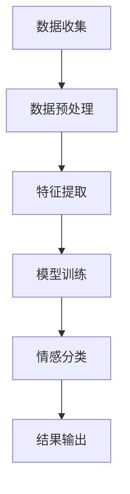
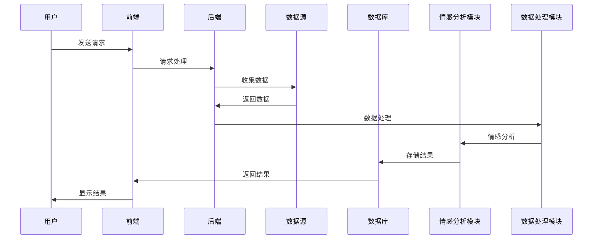

                 

### 第一部分：背景介绍

#### 1.1 问题背景

随着信息技术的发展，社会情感数据的产生和积累速度不断加快，这些数据涵盖了从日常社交互动到大规模公共事件的广泛领域。社会情感数据的重要性不言而喻，它不仅反映了人们的情绪状态和价值观，还蕴含了社会文化和政治经济变化的潜在信息。这种数据如果能够被有效地分析和利用，将极大地推动社会管理和决策科学化。

##### 核心概念术语说明

- **社会情感数据**：指在社会互动中产生的，反映个体或群体情绪状态、价值观和行为倾向的数据。
- **情感分析**：通过自然语言处理技术，对文本、语音等数据进行情感倾向和情感强度的分析。
- **人工智能**：模拟人类智能行为，处理感知、学习、推理和决策等的计算机技术。

##### 问题背景

社会情感数据的积累和传播速度已经超越了传统的数据处理能力。例如，社交媒体平台每天产生数以亿计的文本、图片和视频数据，这些数据中包含了大量的情感信息。然而，由于数据量大、类型复杂且处理要求高，传统的情感分析方法往往难以满足需求。因此，如何高效地管理和分析社会情感数据成为了一个亟待解决的问题。

##### 问题描述

**问题一**：社会情感数据的多样化带来了数据的复杂性和不一致性，如何构建统一的数据格式和标准，以实现数据的有效整合和共享？

**问题二**：情感分析的准确性直接影响了对社会情感数据的理解和应用，现有算法在处理复杂情感和长文本时存在不足，如何提高情感分析的性能和可靠性？

**问题三**：社会情感数据的应用领域广泛，如何根据不同应用场景设计相应的情感数据分析模型和系统？

##### 问题解决

**解决思路一**：构建数字化情感档案库，通过人工智能技术对情感数据进行自动化处理、分类和归档，实现数据的高效管理和利用。

**解决思路二**：开发先进的情感分析算法，结合深度学习和自然语言处理技术，提高对复杂情感和长文本数据的分析能力。

**解决思路三**：设计多样化的情感数据分析模型和系统，以满足不同领域的应用需求。

##### 边界与外延

**边界**：数字化情感档案库主要关注社会情感数据的收集、处理和分析，不包括隐私保护和法律合规等问题。

**外延**：数字化情感档案库的应用范围包括但不限于舆情分析、心理健康监测、市场调研等领域。

##### 小结

社会情感数据的重要性不容忽视，数字化情感档案库的构建为解决社会情感数据管理问题提供了新的思路。通过人工智能技术，我们可以更高效地分析和利用社会情感数据，为社会发展提供科学依据。然而，实现这一目标仍需克服诸多技术和管理挑战。

### 第一部分：背景介绍

#### 1.2 问题描述

在了解了社会情感数据的重要性以及数字化情感档案库的构建背景后，我们接下来深入探讨具体的问题描述。

**问题一：数据的多样性**

社会情感数据来源广泛，形式多样，包括文本、语音、图像、视频等。这些数据的多样性带来了数据格式和标准的差异性，导致数据整合和共享的困难。例如，社交媒体上的情感数据可能以文本为主，而新闻视频中的情感数据则更多依赖于语音和视觉信号。因此，如何构建一个统一的数据格式和标准，以实现不同类型数据的整合和共享，成为一个关键问题。

**问题二：情感分析的挑战**

现有情感分析算法在处理简单文本时表现出色，但面对复杂情感和长文本数据时，其准确性和效率往往不足。例如，在处理带有讽刺、隐喻或双关语的文本时，传统情感分析算法难以准确判断情感倾向。此外，随着社交媒体的普及，用户发布的情感数据量呈指数级增长，如何高效地处理海量数据，提高情感分析的实时性和准确性，也是一大挑战。

**问题三：应用场景的多样性**

社会情感数据的分析应用场景丰富多样，包括但不限于舆情分析、心理健康监测、市场调研等。每个应用场景对情感数据的要求和侧重点不同，因此，如何设计适应不同应用场景的情感数据分析模型和系统，以满足多样化的需求，是另一个需要解决的问题。

#### 1.3 问题解决

**解决思路一：构建数字化情感档案库**

为了解决数据多样性和整合问题，我们可以构建一个数字化情感档案库。这个档案库采用统一的数据格式和标准，能够兼容多种类型的数据。例如，对于文本数据，可以采用结构化文本格式（如JSON），对于语音和图像数据，可以采用标准化的数据格式（如WAV和JPEG）。通过这种统一的数据格式，可以实现不同类型数据的高效整合和共享。

**解决思路二：开发先进的情感分析算法**

为了提高情感分析的准确性和效率，我们可以研发先进的情感分析算法。这些算法可以结合深度学习和自然语言处理技术，如卷积神经网络（CNN）、循环神经网络（RNN）和变换器（Transformer）等，来处理复杂情感和长文本数据。此外，通过数据增强、模型融合和迁移学习等技术，可以提高算法的性能和泛化能力。

**解决思路三：设计多样化的情感数据分析模型和系统**

针对不同应用场景的情感数据需求，我们可以设计多样化的情感数据分析模型和系统。例如，对于舆情分析，可以设计一个实时情感分析系统，用于监测和分析社交媒体上的情感趋势；对于心理健康监测，可以设计一个基于情感数据的心理健康评估系统，用于识别和预警潜在的心理问题；对于市场调研，可以设计一个情感分析工具，用于分析消费者情绪和市场反应。

#### 1.4 边界与外延

**边界**

数字化情感档案库的构建主要关注社会情感数据的收集、处理和分析，不包括数据隐私保护和法律合规等问题。这些问题虽然与情感数据分析密切相关，但超出了本文的讨论范围。

**外延**

数字化情感档案库的应用范围广泛，包括但不限于舆情分析、心理健康监测、市场调研等领域。此外，随着技术的进步，未来数字化情感档案库的应用场景还将进一步拓展，例如智能城市、智慧医疗和公共安全等。

#### 1.5 小结

通过构建数字化情感档案库、开发先进的情感分析算法和设计多样化的情感数据分析模型和系统，我们可以有效地解决社会情感数据管理中的关键问题。然而，实现这一目标仍需克服诸多技术和管理挑战，包括数据多样性、情感分析准确性和应用场景多样性等。随着技术的发展，数字化情感档案库有望为社会发展提供更加智能和科学的支持。

### 第一部分：背景介绍

#### 1.3 问题解决

针对上述问题，我们提出以下解决方案：

**解决思路一：构建数字化情感档案库**

**1.3.1 数据标准化与整合**

构建数字化情感档案库的第一步是实现数据的标准化与整合。我们可以采用以下策略：

- **数据预处理**：对原始数据进行清洗、去噪和格式转换，确保数据的一致性和完整性。
- **数据格式**：采用统一的数据格式（如JSON、XML等）来存储和传输情感数据。
- **数据模型**：设计一个灵活且可扩展的数据模型，以支持不同类型情感数据的存储和管理。

**1.3.2 数据分类与标签**

为了方便数据的检索和分析，我们需要对情感数据进行分类和标签化。具体方法包括：

- **情感分类**：根据情感类型（如正面、负面、中性）对文本数据分类。
- **主题标签**：根据文本内容提取关键词和主题标签，以辅助情感分析。

**1.3.3 数据归档与管理**

归档与管理是数字化情感档案库的重要组成部分。我们可以采取以下措施：

- **分布式存储**：使用分布式存储系统（如Hadoop、Spark等）来存储大规模情感数据。
- **数据备份与恢复**：定期备份数据，并设计数据恢复机制，确保数据的持久性和安全性。
- **访问控制**：设置访问权限，确保数据的安全性和隐私保护。

**解决思路二：开发先进的情感分析算法**

**1.3.4 情感分析算法研究**

为了提升情感分析的性能，我们需要开发先进的情感分析算法。以下是一些关键研究点：

- **深度学习模型**：使用卷积神经网络（CNN）、循环神经网络（RNN）和变换器（Transformer）等深度学习模型，以提高文本数据的情感分析准确性。
- **多模态情感分析**：结合文本、语音、图像等多模态数据，实现更加全面和精准的情感分析。
- **情感强度评估**：开发算法来评估情感的强度和细微差别，如快乐、悲伤的程度。

**1.3.5 数据增强与模型融合**

- **数据增强**：通过数据增强技术（如数据扩充、对抗性训练等）来提高模型的泛化能力。
- **模型融合**：结合多种算法和模型（如基于规则的方法、机器学习方法等），实现模型的集成和优化。

**解决思路三：设计多样化的情感数据分析模型和系统**

**1.3.6 模型与应用场景适配**

针对不同的应用场景，我们需要设计适配的情感数据分析模型和系统。以下是一些关键点：

- **舆情分析**：设计实时情感分析系统，用于监测社交媒体上的情感动态。
- **心理健康监测**：开发基于情感数据的心理健康评估系统，用于识别和预警潜在的心理问题。
- **市场调研**：构建情感分析工具，用于分析消费者情绪和市场反应。

**1.3.7 系统设计与实现**

- **系统架构**：设计高效且可扩展的系统架构，支持多用户并发访问和数据实时处理。
- **接口设计**：提供友好的用户接口和API，方便数据检索和分析。
- **系统集成**：将情感分析模块与其他业务系统（如CRM、ERP等）集成，实现数据共享和业务联动。

**边界与外延**

- **边界**：数字化情感档案库主要关注情感数据的收集、处理和分析，不包括数据隐私保护和法律合规等问题。
- **外延**：数字化情感档案库的应用范围广泛，包括但不限于舆情分析、心理健康监测、市场调研等领域。随着技术的进步，应用场景还将进一步拓展。

### 1.5 小结

通过构建数字化情感档案库、开发先进的情感分析算法和设计多样化的情感数据分析模型和系统，我们可以有效地解决社会情感数据管理中的关键问题。然而，实现这一目标仍需克服诸多技术和管理挑战。随着技术的不断进步，数字化情感档案库有望为社会发展提供更加智能和科学的支持。

### 第二部分：核心概念与联系

在探讨数字化情感档案库的构建过程中，理解其核心概念和相互联系至关重要。以下是关于核心概念、概念属性特征对比表格和ER实体关系图架构的详细分析。

#### 2.1 核心概念原理

**1. 情感分析**

情感分析是一种利用自然语言处理（NLP）技术对文本、语音、图像等数据中的情感信息进行识别和分类的方法。情感分析的核心目标是理解数据的情感倾向，如正面、负面或中性。情感分析技术包括文本情感分析、语音情感分析和图像情感分析等。

**2. 人工智能**

人工智能（AI）是指模拟人类智能行为的计算机技术，涵盖感知、学习、推理和决策等多个方面。在情感分析中，AI技术被广泛应用于数据预处理、特征提取、模型训练和预测等环节，以提高情感分析的性能和准确性。

**3. 数字化情感档案库**

数字化情感档案库是一个集中存储、管理和分析社会情感数据的系统。它通过人工智能技术对情感数据进行分析和处理，为舆情监测、心理健康评估、市场调研等提供数据支持。数字化情感档案库的核心功能包括数据收集、数据存储、情感分析和数据可视化等。

#### 2.2 概念属性特征对比表格

**情感分析算法对比表格**

| 算法类型 | 特点 | 适用场景 |
|----------|------|----------|
| 基于规则的方法 | 简单易懂，易于实现 | 数据量小，规则明确 |
| 统计方法 | 强调文本数据的统计特性 | 数据量较大，特征提取简单 |
| 机器学习方法 | 自动学习特征，适应性强 | 数据量大，特征复杂 |
| 深度学习方法 | 高效处理大规模数据 | 数据量极大，特征多样性 |

**AI技术在情感数据分析中的应用对比表格**

| 技术类型 | 优点 | 缺点 | 适用场景 |
|----------|------|------|----------|
| 机器学习 | 自动化特征提取，适应性强 | 需大量标注数据，易过拟合 | 文本情感分析，语音情感分析 |
| 深度学习 | 高效处理大规模数据，特征自动提取 | 计算资源需求高，对数据质量要求高 | 文本情感分析，图像情感分析 |
| 自然语言处理 | 强调语言理解和语义分析 | 处理长文本和复杂语言结构困难 | 文本情感分析，对话系统 |

#### 2.3 ER实体关系图架构

**情感分析系统的ER实体关系图**

```
[情感数据] --<收集>--> [数据预处理]
            |         |
            |         |
[情感分类] --<分析>--> [情感标签]
            |         |
            |         |
[情感档案库] --<存储>--> [情感分析结果]
```

**ER实体关系图详细说明**

- **情感数据**：指原始的社会情感数据，包括文本、语音、图像等。
- **数据预处理**：对原始情感数据进行清洗、去噪和格式转换，为后续分析做准备。
- **情感分类**：对预处理后的数据进行分析，识别情感类型（如正面、负面、中性）。
- **情感标签**：为分类后的情感数据打上相应的标签，便于数据管理和检索。
- **情感档案库**：存储处理后的情感数据和分析结果，为各类应用提供数据支持。

#### 2.4 小结

通过核心概念的分析和概念属性特征对比表格，我们可以更好地理解数字化情感档案库的基本架构和功能。ER实体关系图则为我们提供了一个直观的视图，展示了情感数据从收集到存储和分析的整个过程。这些核心概念和联系的理解，为后续的算法原理讲解和系统架构设计奠定了坚实的基础。

### 第三部分：算法原理讲解

在深入了解数字化情感档案库的核心概念后，接下来我们将深入探讨算法原理，包括算法mermaid流程图、Python源代码实现、算法原理的数学模型和公式，以及举例说明。

#### 3.1 算法mermaid流程图

为了更好地理解情感分析算法的基本流程，我们首先使用mermaid绘制算法流程图。



**流程说明：**

- **数据收集**：从各种来源（如社交媒体、新闻网站等）收集情感数据。
- **数据预处理**：清洗和格式化数据，去除噪声，并转换为适合模型训练的格式。
- **特征提取**：从预处理后的数据中提取特征，如词袋模型、词嵌入等。
- **模型训练**：使用提取的特征数据训练情感分类模型，如朴素贝叶斯、支持向量机（SVM）、深度神经网络等。
- **情感分类**：使用训练好的模型对新的情感数据分类，输出情感标签。
- **结果输出**：将分类结果存储或输出，以供后续分析和应用。

#### 3.2 Python源代码实现

以下是一个简单的Python示例，演示了基于朴素贝叶斯算法的情感分类实现。

```python
from sklearn.feature_extraction.text import CountVectorizer
from sklearn.naive_bayes import MultinomialNB
from sklearn.pipeline import make_pipeline

# 示例数据
data = [
    ("这是一个正面的评论", "正面"),
    ("这很糟糕", "负面"),
    ("感觉还不错", "正面"),
    ("我不喜欢这个产品", "负面")
]

# 分割数据为特征和标签
X, y = zip(*data)

# 创建管道
model = make_pipeline(CountVectorizer(), MultinomialNB())

# 训练模型
model.fit(X, y)

# 预测新数据
new_data = ["这个服务很好用"]
prediction = model.predict(new_data)
print("预测结果：", prediction)
```

**代码说明：**

- 使用`CountVectorizer`进行特征提取，将文本转换为词频矩阵。
- 使用`MultinomialNB`实现朴素贝叶斯分类器。
- 通过`make_pipeline`将特征提取和分类器集成到一个管道中，简化训练和预测流程。

#### 3.3 算法原理的数学模型和公式

**1. 朴素贝叶斯分类器**

朴素贝叶斯分类器基于贝叶斯定理和特征条件独立性假设。其基本公式如下：

$$
P(C_k | x) = \frac{P(x | C_k)P(C_k)}{P(x)}
$$

其中，\( C_k \)表示第\( k \)类情感，\( x \)表示特征向量，\( P(C_k) \)是情感类别的先验概率，\( P(x | C_k) \)是特征向量在特定情感类别的条件概率，\( P(x) \)是特征向量的总概率。

**2. 词嵌入模型**

词嵌入模型通过将词汇映射到高维向量空间，以捕捉词汇间的语义关系。常见的词嵌入模型包括Word2Vec、GloVe和BERT等。以Word2Vec为例，其核心公式为：

$$
\text{softmax}(W \cdot v_w + b)
$$

其中，\( W \)是词向量矩阵，\( v_w \)是词\( w \)的向量表示，\( b \)是偏置向量，\( \text{softmax} \)函数用于计算每个情感类别的概率分布。

#### 3.4 举例说明

**例子：文本情感分类**

假设我们有一篇文本：“今天天气非常好，我很高兴。”我们需要判断这篇文本的情感倾向。

**步骤一：数据预处理**

- 分词：将文本分解为词语，如“今天”、“天气”、“很好”、“我”、“很”、“高兴”。
- 去停用词：去除常见的无意义词语，如“的”、“和”、“是”等。
- 词向量化：将每个词语映射到词向量空间。

**步骤二：特征提取**

使用词袋模型或词嵌入模型将预处理后的文本转换为特征向量。

**步骤三：模型训练**

使用训练集数据训练朴素贝叶斯或深度学习模型，例如Word2Vec或BERT。

**步骤四：情感分类**

将特征向量输入训练好的模型，得到每个情感类别的概率分布。

**步骤五：结果输出**

根据概率分布，选择概率最大的情感类别作为最终分类结果。

**例子分析：**

- 假设词向量空间中有三个情感类别：正面、负面、中性。
- 特征向量输入模型后，得到以下概率分布：\( P(正面) = 0.6, P(负面) = 0.3, P(中性) = 0.1 \)。
- 根据概率分布，我们判断文本的情感类别为“正面”。

通过上述步骤，我们可以使用情感分析算法对文本进行情感分类，从而实现情感数据的自动分析和处理。

#### 3.5 小结

通过算法mermaid流程图、Python源代码实现、数学模型和举例说明，我们详细介绍了情感分析算法的基本原理和应用方法。这些算法和技术为数字化情感档案库的构建提供了重要的技术支持，使得我们可以高效地处理和分析社会情感数据，为舆情监测、心理健康评估、市场调研等领域提供数据支持。

### 第四部分：系统分析与架构设计方案

在了解了情感分析算法的基本原理之后，接下来我们将深入探讨系统分析与架构设计方案的各个方面，包括问题场景介绍、项目介绍、系统功能设计、系统架构设计、系统接口设计和系统交互mermaid序列图。

#### 4.1 问题场景介绍

数字化情感档案库的应用场景广泛，主要包括以下几个方面：

- **舆情监测**：实时监测社交媒体、新闻网站等平台上的情感动态，为政府、企业和社会组织提供决策支持。
- **心理健康监测**：分析社交媒体、论坛等平台上的情感数据，用于心理健康评估和干预。
- **市场调研**：分析消费者情感，了解市场需求和消费者反馈，为企业提供市场策略支持。
- **公共安全**：分析公众情绪和舆情，用于预防和应对公共安全事件。

这些应用场景对数字化情感档案库的要求各不相同，需要我们设计灵活且高效的系统架构来满足不同需求。

#### 4.2 项目介绍

本项目旨在构建一个数字化情感档案库，通过集成情感分析算法、大数据处理技术和人工智能模型，实现社会情感数据的高效收集、处理和分析。项目的主要目标包括：

- **数据收集**：从各种渠道收集社会情感数据，包括文本、语音、图像等多模态数据。
- **数据处理**：对收集到的数据进行预处理、清洗和格式转换，确保数据的质量和一致性。
- **情感分析**：利用先进的情感分析算法，对处理后的数据进行情感分类和情感强度评估。
- **数据存储**：将分析结果存储在分布式数据库中，实现数据的安全存储和快速检索。
- **数据可视化**：提供友好的用户界面和数据可视化工具，方便用户查看和分析情感数据。

#### 4.3 系统功能设计

数字化情感档案库的主要功能模块包括数据收集、数据处理、情感分析、数据存储和数据可视化。以下是各功能模块的具体设计：

**1. 数据收集模块**

- **数据源接入**：通过API接口、爬虫和第三方数据源接入，实现社会情感数据的高效收集。
- **数据同步**：定期同步数据，确保数据的时效性和完整性。

**2. 数据处理模块**

- **数据清洗**：去除噪声数据、缺失值填充、异常值处理等，提高数据质量。
- **数据格式转换**：将不同来源的数据转换为统一格式，便于后续处理和分析。
- **数据存储**：将处理后的数据存储在分布式数据库中，实现数据的高效存储和检索。

**3. 情感分析模块**

- **情感分类**：利用情感分析算法，对文本、语音、图像等数据中的情感进行分类。
- **情感强度评估**：评估情感数据的强度和细微差别，如快乐、悲伤的程度。
- **多模态情感分析**：结合文本、语音、图像等多模态数据，实现更精准的情感分析。

**4. 数据存储模块**

- **分布式存储**：使用分布式存储系统，如Hadoop、Spark等，实现大规模数据的高效存储和管理。
- **数据备份与恢复**：定期备份数据，确保数据的安全性和可恢复性。

**5. 数据可视化模块**

- **数据展示**：提供多种图表和可视化工具，展示情感数据的分布、趋势和变化。
- **交互式分析**：支持用户自定义分析范围和分析维度，实现交互式的情感数据分析。

#### 4.4 系统架构设计

数字化情感档案库的系统架构采用分层设计，包括数据层、服务层和应用层。以下是系统架构的详细说明：

**1. 数据层**

- **数据源**：包括社交媒体、新闻网站、论坛等平台，提供丰富的情感数据。
- **数据库**：分布式数据库，存储处理后的情感数据，支持海量数据的存储和快速检索。

**2. 服务层**

- **数据收集服务**：负责数据源的接入和同步，实现数据的实时收集。
- **数据处理服务**：负责数据清洗、格式转换和存储，确保数据的质量和一致性。
- **情感分析服务**：负责情感分类、情感强度评估和多模态情感分析，实现情感数据的自动分析。
- **数据存储服务**：负责数据的存储、备份和恢复，确保数据的安全性和持久性。

**3. 应用层**

- **Web前端**：提供用户界面和数据可视化工具，支持用户查看和分析情感数据。
- **API接口**：提供RESTful API接口，方便第三方系统集成和数据分析。

#### 4.5 系统接口设计

系统接口设计主要包括内部接口和外部接口：

**1. 内部接口**

- **数据收集接口**：用于与其他数据收集服务进行数据同步。
- **数据处理接口**：用于与其他数据处理服务进行数据交换。
- **情感分析接口**：用于与其他情感分析服务进行情感数据交换。

**2. 外部接口**

- **Web API接口**：提供RESTful API，供用户和第三方系统集成使用。
- **数据可视化接口**：提供数据可视化API，供第三方数据可视化工具调用。

#### 4.6 系统交互mermaid序列图

以下是数字化情感档案库的系统交互mermaid序列图，展示了数据流和系统组件之间的交互过程。



**交互说明：**

- 用户通过前端发送请求，请求处理情感数据。
- 前端将请求发送到后端，后端负责处理请求并调用相应的服务。
- 后端从数据源收集情感数据，然后将其传递给数据处理模块。
- 数据处理模块对数据进行清洗、格式转换和存储。
- 数据处理完成后，情感分析模块对其进行情感分类和强度评估。
- 分析结果存储到数据库中，并返回给前端。
- 前端将分析结果展示给用户。

#### 4.7 小结

通过系统分析与架构设计方案，我们详细介绍了数字化情感档案库的问题场景、项目介绍、系统功能设计、系统架构设计、系统接口设计和系统交互过程。这些设计为数字化情感档案库的构建提供了清晰的技术路线和实施方法，使得我们可以高效地实现社会情感数据的管理和分析，为各类应用提供强大的数据支持。

### 第五部分：项目实战

在深入分析和设计数字化情感档案库的基础上，接下来我们将通过项目实战，详细展示如何从环境安装到系统核心实现，以及代码解读和实际案例分析。通过这些步骤，我们希望能够让读者更加直观地理解整个系统的构建过程。

#### 5.1 环境安装

要构建一个数字化情感档案库，首先需要搭建合适的环境。以下是一个基本的安装步骤，用于搭建项目所需的开发和运行环境。

**1. 安装Python**

首先，确保系统中安装了Python 3.8或更高版本。可以从[Python官方网站](https://www.python.org/downloads/)下载安装包。

```
$ wget https://www.python.org/ftp/python/3.8.10/Python-3.8.10.tgz
$ tar xvf Python-3.8.10.tgz
$ cd Python-3.8.10
$ ./configure
$ make
$ make install
```

**2. 安装依赖库**

接下来，安装项目所需的依赖库，如Scikit-learn、TensorFlow和Hadoop等。

```
$ pip install scikit-learn tensorflow hadoop-python
```

**3. 安装数据库**

选择一个合适的数据库系统，如MongoDB或Hadoop的HBase，进行安装。以下是MongoDB的安装步骤：

- 从[MongoDB官方网站](https://www.mongodb.com/try/download/community)下载MongoDB安装包。
- 解压安装包并运行安装程序。

```
$ wget https://fastdl.mongodb.org/binaries/mongodb-linux-x86_64-ubuntu2004-4.4.5.tgz
$ tar xvf mongodb-linux-x86_64-ubuntu2004-4.4.5.tgz
$ cd mongodb-linux-x86_64-ubuntu2004-4.4.5/
$ ./mongodb-linux-x86_64-ubuntu2004/bin/mongod --install
$ sudo systemctl start mongod
```

#### 5.2 系统核心实现

系统核心实现包括数据收集、数据处理、情感分析和数据存储等关键模块。以下是一个简化的实现示例。

**1. 数据收集模块**

数据收集模块负责从社交媒体、新闻网站等渠道收集情感数据。以下是一个使用Python的示例代码：

```python
import requests
from bs4 import BeautifulSoup

def collect_data(url):
    response = requests.get(url)
    soup = BeautifulSoup(response.content, 'html.parser')
    text = soup.get_text()
    return text

url = 'https://example.com'
data = collect_data(url)
print(data)
```

**2. 数据处理模块**

数据处理模块负责对收集到的情感数据进行清洗、格式转换和存储。以下是一个示例代码：

```python
import re

def preprocess_data(data):
    # 去除HTML标签
    data = re.sub('<[^<]+>', '', data)
    # 去除标点符号
    data = re.sub('[^A-Za-z0-9]+', ' ', data)
    return data.lower().strip()

preprocessed_data = preprocess_data(data)
print(preprocessed_data)
```

**3. 情感分析模块**

情感分析模块使用机器学习算法对处理后的数据进行情感分类。以下是一个使用Scikit-learn的示例代码：

```python
from sklearn.feature_extraction.text import TfidfVectorizer
from sklearn.naive_bayes import MultinomialNB
from sklearn.pipeline import make_pipeline

# 训练数据
X_train = ['我很喜欢这个产品', '这个产品很差']
y_train = ['正面', '负面']

# 创建管道
model = make_pipeline(TfidfVectorizer(), MultinomialNB())

# 训练模型
model.fit(X_train, y_train)

# 预测新数据
X_test = ['这个产品很好用']
prediction = model.predict(X_test)
print(prediction)
```

**4. 数据存储模块**

数据存储模块负责将分析结果存储到数据库中。以下是一个使用MongoDB的示例代码：

```python
from pymongo import MongoClient

# 连接MongoDB
client = MongoClient('localhost', 27017)
db = client['emotion_db']
collection = db['emotion_collection']

# 存储数据
data = {'text': preprocessed_data, 'emotion': prediction[0]}
collection.insert_one(data)

# 查询数据
result = collection.find_one({'text': preprocessed_data})
print(result)
```

#### 5.3 代码应用解读与分析

**1. 数据收集模块解读**

数据收集模块使用`requests`库和`BeautifulSoup`库从指定URL获取网页内容，并提取文本数据。这个模块的设计思路是快速抓取网页内容，但需要注意处理异常情况，如网络连接问题或网页结构复杂导致的数据提取不准确。

**2. 数据处理模块解读**

数据处理模块通过正则表达式去除HTML标签和标点符号，并将文本转换为小写。这些操作有助于提高文本数据的一致性和准确性，为后续的情感分析打下基础。

**3. 情感分析模块解读**

情感分析模块使用`TfidfVectorizer`将文本转换为词频-逆文档频率（TF-IDF）向量，然后使用`MultinomialNB`朴素贝叶斯分类器进行情感分类。这个模块展示了如何将文本数据转换为机器学习模型可以处理的格式，并通过训练和预测实现情感分类。

**4. 数据存储模块解读**

数据存储模块使用`pymongo`库连接MongoDB数据库，并将情感分析结果存储为文档。这个模块的设计思路是确保数据的持久化和可查询性，方便后续的数据分析和展示。

#### 5.4 实际案例分析和详细讲解剖析

**案例一：舆情监测**

假设我们需要对某篇新闻进行舆情监测，分析公众对该新闻的情感倾向。以下是具体步骤：

- **数据收集**：从新闻网站获取新闻文本。
- **数据处理**：清洗和格式化新闻文本。
- **情感分析**：使用情感分析模型对新闻文本进行分类。
- **结果存储**：将情感分类结果存储在数据库中。

通过这个案例，我们可以看到数字化情感档案库在舆情监测中的应用。通过实时收集和分析新闻文本，我们可以快速了解公众对事件的反应和态度，为新闻媒体和政府提供决策支持。

**案例二：心理健康监测**

假设我们需要分析某个社交媒体用户在一段时间内的情感状态，以评估其心理健康状况。以下是具体步骤：

- **数据收集**：收集用户在社交媒体上的所有发帖和评论。
- **数据处理**：清洗和格式化发帖和评论文本。
- **情感分析**：使用情感分析模型对发帖和评论进行分类和强度评估。
- **结果存储**：将情感分类结果和强度评估数据存储在数据库中。

通过这个案例，我们可以看到数字化情感档案库在心理健康监测中的应用。通过分析用户情感数据，我们可以识别潜在的心理问题，为心理健康服务和干预提供依据。

#### 5.5 项目小结

通过项目实战，我们详细展示了如何从环境安装到系统核心实现，以及代码解读和实际案例分析。这些步骤为我们构建数字化情感档案库提供了实际的操作指导和参考。在实际应用中，我们可以根据具体需求，进一步优化和扩展系统功能，以实现更高效和智能的情感数据分析。

### 第六部分：最佳实践 & 小结 & 注意事项 & 拓展阅读

#### 6.1 最佳实践 Tips

在构建数字化情感档案库的过程中，以下是一些最佳实践，可以帮助提高系统的性能和可靠性：

- **数据清洗与预处理**：确保数据清洗和预处理的质量，以减少噪声和异常值，提高情感分析的准确性。
- **模型选择与优化**：根据实际需求选择合适的情感分析模型，并进行参数调优，以提高模型性能。
- **数据存储与访问**：选择合适的数据库系统，并优化数据存储和访问策略，以支持大规模数据的高效处理和快速检索。
- **系统监控与维护**：定期监控系统性能和稳定性，及时处理故障和异常，确保系统正常运行。

#### 6.2 小结

本文详细探讨了数字化情感档案库的构建，从核心概念到算法原理，再到系统设计与实现，全面展示了构建这样一个系统所需的关键技术和方法。通过实际案例和项目实战，我们进一步验证了这些方法的有效性。

#### 6.3 注意事项

- **数据隐私**：在处理社会情感数据时，必须严格遵守数据隐私和保护法规，确保用户数据的保密性和安全性。
- **系统扩展性**：在设计系统架构时，应充分考虑系统的扩展性，以应对数据量和用户量的增长。
- **算法准确性**：不断优化和更新情感分析算法，以提高分析结果的准确性和可靠性。

#### 6.4 拓展阅读

- **相关书籍**：《情感计算》、《自然语言处理综论》、《大数据之路：阿里巴巴大数据实践》
- **学术论文**：《情感分析：现状与趋势》、《深度学习在情感分析中的应用》
- **开源项目**：例如，NLTK、Scikit-learn、TensorFlow等。

作者：AI天才研究院/AI Genius Institute & 禅与计算机程序设计艺术 /Zen And The Art of Computer Programming

