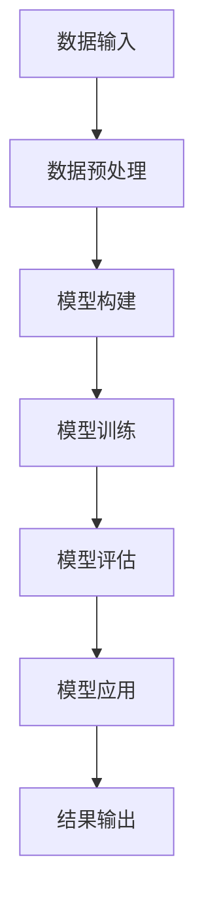

                 

### 引言

#### 数字孪生技术概述

数字孪生技术（Digital Twin Technology）是指通过构建物理实体或系统的虚拟模型，实现对现实世界中对象的模拟、分析和优化。它将物联网（IoT）、大数据分析、云计算和人工智能（AI）等多种先进技术相结合，提供了一种全新的视角来理解、控制和改善现实世界中的各种系统。

数字孪生的概念最早在2002年由美国密歇根大学教授迈克尔·格里夫斯（Michael Grieves）提出。他指出，数字孪生是一个虚拟的数字化映射，可以实时反映物理实体的状态、行为和性能。近年来，随着物联网和大数据技术的飞速发展，数字孪生技术逐渐成为工业制造、智慧城市、医疗保健等领域的热点。

#### AI驱动的虚拟世界模拟

人工智能（AI）作为数字孪生技术的核心驱动力量，为虚拟世界模拟提供了强大的支持。AI通过学习大量的数据和模式，能够预测物理实体的行为，优化系统性能，甚至提前发现潜在的问题。AI驱动的虚拟世界模拟不仅可以提高系统的可靠性，还可以大大降低维护成本。

在虚拟世界模拟中，AI的应用主要包括以下几个方面：

1. **预测与优化**：通过分析历史数据和实时数据，AI可以预测系统未来的行为，并给出优化建议。
2. **故障检测与诊断**：AI可以实时监控系统的状态，快速检测出故障并进行诊断。
3. **自适应控制**：AI可以根据系统的实时反馈，自动调整系统的参数，以实现最优性能。

#### 核心概念与关键词

- 数字孪生：物理实体或系统的虚拟映射
- 物联网：连接物理世界与数字世界的桥梁
- 大数据分析：从海量数据中提取有价值的信息
- 云计算：提供强大的计算和存储能力
- 人工智能：通过算法实现智能化的决策和控制

#### 全文结构概述

本文将分为以下几个部分进行详细探讨：

1. **数字孪生技术基础**：介绍数字孪生的核心概念、建模方法、技术架构。
2. **AI驱动的虚拟世界模拟**：探讨AI在虚拟世界模拟中的应用、算法原理以及常见AI算法的介绍。
3. **数字孪生与AI结合的案例分析**：通过实际案例展示数字孪生与AI技术的应用效果。
4. **未来展望**：分析数字孪生与AI技术的未来发展趋势和应用前景。

#### 阅读指南

本文适合对数字孪生和AI技术感兴趣的读者，无论您是技术爱好者、从业者还是决策者，都将从本文中获得有价值的信息。我们希望通过逐步的分析和讲解，使读者能够深入理解数字孪生技术，并认识到AI在其中的关键作用。

在阅读过程中，您将了解到：

- 数字孪生技术的基本原理和应用场景。
- AI如何驱动虚拟世界模拟，提升系统的智能化水平。
- 数字孪生与AI结合的实际案例，以及这些案例带来的启示。
- 数字孪生与AI技术的未来发展趋势。

让我们一起深入探索这个充满潜力的领域吧！

---

### 第一部分：数字孪生技术基础

#### 2.1 数字孪生的核心概念与特点

##### 2.1.1 数字孪生的定义

数字孪生（Digital Twin）是一个物理实体或系统在数字世界中的映射，它可以实时反映物理实体的状态、行为和性能。通过数字孪生，我们可以对物理实体进行模拟、分析和优化。数字孪生的核心目的是通过虚拟世界来理解和改善现实世界。

数字孪生通常由以下几个关键组成部分构成：

1. **物理实体**：数字孪生所映射的实际对象，可以是机器、设备、建筑物或城市等。
2. **传感器**：用于收集物理实体的实时数据，如温度、压力、振动等。
3. **数据传输**：将传感器收集到的数据传输到数字孪生平台。
4. **数字孪生平台**：对数据进行处理、分析和存储，并提供可视化界面和决策支持。
5. **执行器**：根据数字孪生平台的决策，对物理实体进行操作，如调整设备参数、启动维修等。

##### 2.1.2 数字孪生的核心特点

数字孪生具有以下几个核心特点：

1. **实时性**：数字孪生能够实时反映物理实体的状态，这使得我们可以快速响应和处理突发事件。
2. **可预测性**：通过分析历史数据和实时数据，数字孪生可以预测物理实体的未来行为，帮助我们提前做好准备。
3. **仿真性**：数字孪生可以模拟物理实体的行为，让我们在虚拟环境中进行测试和优化。
4. **互动性**：数字孪生可以与物理实体进行实时交互，通过反馈机制实现闭环控制。
5. **可扩展性**：数字孪生技术可以应用于各种不同规模和类型的系统，具有很好的适应性。

##### 2.1.3 数字孪生的应用领域

数字孪生技术具有广泛的应用领域，主要包括以下几个方面：

1. **工业制造**：通过数字孪生技术，可以对生产线进行实时监控和优化，提高生产效率和质量。
2. **智慧城市**：数字孪生可以帮助城市管理者更好地理解城市运行状态，优化资源配置，提高城市管理效率。
3. **医疗保健**：数字孪生可以为病人提供个性化的治疗方案，实时监控病人的健康状态。
4. **航空航天**：数字孪生技术可以用于飞机的设计、制造和维护，提高航空器的可靠性和安全性。
5. **能源管理**：数字孪生可以帮助能源公司实时监控能源设施的状态，优化能源分配，提高能源利用效率。

#### 2.2 数字孪生的建模方法

##### 2.2.1 数据采集与处理

数字孪生建模的第一步是数据采集。通过传感器和网络，我们可以收集到物理实体的各种实时数据，如温度、压力、位置等。这些数据通常是大量的，且包含噪声和错误，因此需要对数据进行处理和清洗。

数据处理的步骤通常包括：

1. **数据预处理**：包括去除噪声、填补缺失值、归一化等。
2. **特征提取**：从原始数据中提取对模型训练和预测有用的特征。
3. **数据存储**：将处理后的数据存储在数据库或数据湖中，以便后续分析和建模。

##### 2.2.2 模型构建与优化

在数据预处理完成后，我们需要构建数字孪生模型。模型构建通常包括以下几个步骤：

1. **选择模型类型**：根据应用场景和数据特点，选择合适的模型类型，如深度学习模型、决策树模型等。
2. **训练模型**：使用预处理后的数据对模型进行训练，使其能够对物理实体的行为进行预测。
3. **模型优化**：通过调整模型的参数和结构，提高模型的预测性能。

模型优化可以通过以下方法进行：

1. **超参数调整**：调整模型的超参数，如学习率、正则化参数等，以获得更好的预测效果。
2. **集成学习**：将多个模型进行集成，以提高模型的预测性能。
3. **迁移学习**：利用已有的预训练模型，对新的任务进行微调。

##### 2.2.3 模型验证与测试

在模型构建完成后，我们需要对其进行验证和测试，以确保其预测性能和可靠性。

模型验证的步骤通常包括：

1. **验证集划分**：将数据集划分为训练集和验证集，用于模型训练和验证。
2. **交叉验证**：使用交叉验证方法对模型进行评估，以避免过拟合。
3. **性能评估**：使用各种评价指标（如准确率、召回率、F1分数等）对模型进行评估。

模型测试的步骤通常包括：

1. **测试集评估**：使用未参与训练的数据集对模型进行测试，以评估其泛化能力。
2. **误差分析**：分析模型预测的误差，找出模型存在的问题和改进的方向。

##### 2.2.4 数字孪生技术的架构设计

数字孪生技术的架构设计是构建数字孪生系统的基础，它决定了系统的性能、可扩展性和可维护性。一个典型的数字孪生技术架构包括以下几个关键组件：

1. **数据采集层**：负责从物理实体中收集实时数据，如传感器数据、日志数据等。
2. **数据处理层**：负责对采集到的数据进行处理、清洗和存储，并提供数据访问接口。
3. **数字孪生模型层**：负责构建和训练数字孪生模型，并进行预测和优化。
4. **可视化层**：提供可视化界面，让用户能够实时查看物理实体的状态和模型预测结果。
5. **应用层**：提供各种应用场景的解决方案，如工业制造、智慧城市等。

通过这种分层架构，数字孪生系统可以更好地适应不同的应用场景和需求，实现高效的数据处理和预测。

### 2.3 数字孪生技术的应用案例

为了更好地理解数字孪生技术的应用，我们可以通过一些实际案例来进行分析。

#### 2.3.1 工业制造中的数字孪生

在工业制造领域，数字孪生技术被广泛应用于生产线优化、设备维护和质量管理等方面。

**案例一：某汽车制造厂的数字孪生生产线**

某汽车制造厂通过构建数字孪生生产线，实现了对生产过程的实时监控和优化。具体应用如下：

1. **生产过程监控**：数字孪生系统实时收集生产线各环节的数据，如设备状态、生产线速度、产品质量等，并通过可视化界面进行展示。
2. **设备维护预测**：数字孪生系统通过分析历史数据和实时数据，预测设备的故障时间和故障原因，提前安排维护计划，减少设备故障率和停机时间。
3. **质量优化**：数字孪生系统对生产过程进行实时监控和优化，通过调整生产参数，提高产品的质量和一致性。

**案例二：某电子制造厂的数字孪生工厂**

某电子制造厂通过构建数字孪生工厂，实现了对整个工厂的智能化管理和优化。具体应用如下：

1. **生产计划优化**：数字孪生系统根据市场需求和库存情况，实时调整生产计划，确保生产线的平衡和高效运行。
2. **物流优化**：数字孪生系统对物流过程进行实时监控和优化，通过调整物流路径和运输方式，提高物流效率和降低成本。
3. **设备预测性维护**：数字孪生系统通过分析设备数据，预测设备的故障时间和故障原因，提前安排维护计划，减少设备故障率和停机时间。

#### 2.3.2 智慧城市中的数字孪生

在智慧城市领域，数字孪生技术被广泛应用于城市管理、交通优化和能源管理等方面。

**案例一：某城市的数字孪生交通管理系统**

某城市通过构建数字孪生交通管理系统，实现了对交通状况的实时监控和优化。具体应用如下：

1. **交通流量监控**：数字孪生系统实时收集交通数据，如车辆流量、车速、路况等，并通过可视化界面进行展示。
2. **交通信号优化**：数字孪生系统通过分析交通数据，实时调整交通信号灯的时长和相位，优化交通流量，减少拥堵和排放。
3. **突发事件响应**：数字孪生系统在发现交通事故、道路施工等突发事件时，能够快速响应并给出应对策略，减少事故影响。

**案例二：某城市的数字孪生能源管理系统**

某城市通过构建数字孪生能源管理系统，实现了对能源供应和使用的智能化管理和优化。具体应用如下：

1. **能源供需监控**：数字孪生系统实时收集能源供应和使用数据，如发电量、用电量、能源效率等，并通过可视化界面进行展示。
2. **能源调度优化**：数字孪生系统根据能源供需情况，实时调整发电计划和用电策略，优化能源利用效率。
3. **节能减排**：数字孪生系统通过分析能源使用数据，发现能源浪费和不合理使用的情况，并提出优化建议，实现节能减排。

### 2.4 数字孪生技术的挑战与展望

尽管数字孪生技术具有巨大的应用前景，但在实际应用过程中仍面临一些挑战。

1. **数据质量**：数字孪生系统依赖于高质量的实时数据，但传感器故障、数据噪声和缺失值等问题会影响数据质量，进而影响模型的预测性能。
2. **数据隐私**：数字孪生系统涉及大量的敏感数据，如个人隐私、商业秘密等，如何保护数据隐私是数字孪生技术面临的重要挑战。
3. **计算资源**：数字孪生系统通常需要大量的计算资源进行数据处理、建模和预测，如何优化计算资源的使用是一个关键问题。
4. **系统集成**：数字孪生技术需要与其他系统（如物联网、大数据平台等）进行集成，如何实现高效的数据传输和系统集成是数字孪生技术面临的挑战。

展望未来，数字孪生技术将在以下几个方面得到进一步发展：

1. **数据驱动**：通过大数据分析和机器学习，实现更准确的模型预测和优化。
2. **边缘计算**：利用边缘计算技术，降低数据传输延迟，提高系统的实时性。
3. **隐私保护**：采用加密技术和隐私保护算法，确保数据的安全和隐私。
4. **跨领域应用**：数字孪生技术将在更多的领域得到应用，如医疗保健、环境保护等。

### 2.5 小结

数字孪生技术作为一种新兴的技术，具有广泛的应用前景。通过构建物理实体或系统的虚拟映射，数字孪生技术可以实现实时监控、预测优化和智能控制，从而提高系统的可靠性和效率。AI技术的引入，使得数字孪生技术更加智能化和自动化。

在下一部分，我们将进一步探讨AI驱动的虚拟世界模拟，分析AI在数字孪生技术中的应用和优势。

---

## 第二部分：AI驱动的虚拟世界模拟

### 3.1 AI在虚拟世界模拟中的应用

#### 3.1.1 虚拟世界模拟的挑战

虚拟世界模拟是指通过计算机模拟技术，构建出与物理世界相似或完全虚拟的环境，以便进行实验、测试和分析。随着物联网、大数据和云计算等技术的发展，虚拟世界模拟在多个领域得到广泛应用，如工业制造、智慧城市、医疗保健和航空航天等。然而，虚拟世界模拟也面临着一系列挑战：

1. **数据复杂性**：虚拟世界模拟需要大量的数据支持，包括物理参数、环境因素和交互数据等。如何高效地处理和利用这些数据是一个关键问题。
2. **实时性要求**：许多应用场景对虚拟世界模拟的实时性有较高要求，如工业自动化和智能交通系统。如何保证模拟过程的高实时性是一个挑战。
3. **计算资源消耗**：虚拟世界模拟通常需要大量的计算资源，特别是在复杂环境和大规模模拟中，如何优化计算资源的分配和使用是另一个关键问题。
4. **模拟准确性**：模拟结果的准确性直接影响到应用效果，如何在保证模拟准确性的同时，提高模拟效率是一个重要挑战。

#### 3.1.2 AI如何解决这些问题

人工智能（AI）作为新兴技术，为虚拟世界模拟提供了有效的解决方案。以下是AI在虚拟世界模拟中的应用及其优势：

1. **数据处理与优化**：AI技术，如机器学习和深度学习，可以自动处理和优化大量复杂数据。通过数据预处理、特征提取和模型训练，AI技术可以大大提高数据处理效率，减少数据噪声和缺失值的影响。
2. **实时性提升**：AI技术可以通过优化算法和模型，提高虚拟世界模拟的实时性。例如，使用基于神经网络的预测模型，可以快速预测系统行为，降低模拟延迟。
3. **资源优化**：AI技术可以通过自动化优化计算资源的使用。例如，基于强化学习算法的调度策略，可以动态调整计算资源的分配，提高系统的计算效率。
4. **模拟准确性**：AI技术可以通过模拟学习和迭代优化，提高模拟的准确性。例如，使用生成对抗网络（GAN）可以生成更真实的虚拟场景，从而提高模拟结果的准确性。

#### 3.1.3 虚拟世界模拟的案例

以下是几个虚拟世界模拟的实际案例，展示了AI技术在其中的应用：

1. **工业制造**：在工业制造领域，AI驱动的虚拟世界模拟可以用于生产线优化、设备故障预测和质量控制。例如，某制造企业通过构建AI驱动的数字孪生模型，实现了生产过程的实时监控和优化，大幅提高了生产效率。
2. **智慧城市**：在智慧城市领域，AI驱动的虚拟世界模拟可以用于交通流量预测、环境监测和能源管理。例如，某城市通过构建AI驱动的数字孪生模型，实现了交通流量预测和信号优化，有效缓解了城市交通拥堵问题。
3. **医疗保健**：在医疗保健领域，AI驱动的虚拟世界模拟可以用于疾病预测、治疗方案优化和临床试验。例如，某医疗机构通过构建AI驱动的虚拟模型，实现了个性化治疗方案的设计和优化，提高了治疗效果。

### 3.2 常见AI算法在虚拟世界模拟中的应用

AI技术在虚拟世界模拟中的应用广泛，涵盖了多种算法和模型。以下是几种常见的AI算法及其在虚拟世界模拟中的应用：

#### 3.2.1 深度学习算法

深度学习算法是AI领域的一个重要分支，通过多层神经网络对复杂数据进行建模和预测。在虚拟世界模拟中，深度学习算法广泛应用于以下几个方面：

1. **图像识别与处理**：通过卷积神经网络（CNN）对模拟场景中的图像进行识别和处理，如车辆检测、行人检测等。
2. **环境建模**：使用生成对抗网络（GAN）生成真实的虚拟场景，提高模拟的准确性和真实性。
3. **行为预测**：通过递归神经网络（RNN）和长短期记忆网络（LSTM）对虚拟世界中的物体行为进行预测，如交通流量预测、设备故障预测等。

#### 3.2.2 强化学习算法

强化学习算法是一种通过试错和反馈进行决策优化的方法，适用于需要实时调整和控制的应用场景。在虚拟世界模拟中，强化学习算法可用于以下几个方面：

1. **动态资源调度**：通过强化学习算法，动态调整计算资源的使用，实现高效的资源调度和优化。
2. **自适应控制**：通过强化学习算法，实时调整系统的控制参数，实现自适应控制和优化。
3. **路径规划**：通过强化学习算法，规划虚拟世界中的路径，实现最优路径选择。

#### 3.2.3 生成对抗网络（GAN）

生成对抗网络（GAN）是一种由生成器和判别器组成的对抗性神经网络，用于生成高质量的虚拟数据。在虚拟世界模拟中，GAN广泛应用于以下几个方面：

1. **数据增强**：通过GAN生成虚拟数据，增强训练数据集，提高模型的泛化能力。
2. **虚拟场景生成**：通过GAN生成真实的虚拟场景，提高模拟的准确性和真实性。
3. **数据生成**：通过GAN生成仿真数据，用于测试和验证虚拟世界模拟模型的性能。

#### 3.2.4 聚类算法

聚类算法是一种将数据点划分为若干类别的算法，常用于数据分析和模式识别。在虚拟世界模拟中，聚类算法可用于以下几个方面：

1. **数据挖掘**：通过聚类算法挖掘虚拟世界中的数据模式，识别重要的特征和变量。
2. **异常检测**：通过聚类算法检测虚拟世界中的异常数据，发现潜在的故障和问题。
3. **分类和预测**：通过聚类算法进行分类和预测，提高虚拟世界模拟的准确性和效率。

### 3.3 虚拟世界模拟的算法原理

#### 3.3.1 基本概念与原理

虚拟世界模拟的算法原理主要涉及以下几个方面：

1. **数据输入**：虚拟世界模拟需要大量的输入数据，包括物理参数、环境因素和交互数据等。这些数据可以通过传感器、模拟器或历史数据集获得。
2. **模型构建**：基于输入数据，构建虚拟世界模拟的数学模型或算法模型。常见的模型包括物理模型、统计模型和机器学习模型等。
3. **模型训练**：使用训练数据集对模型进行训练，使其能够对虚拟世界中的现象进行预测和优化。
4. **模型评估**：通过测试数据集对模型进行评估，确保其预测性能和可靠性。
5. **模型应用**：将训练好的模型应用于实际的虚拟世界模拟，实现预测、优化和智能控制。

#### 3.3.2 算法流程图

以下是一个典型的虚拟世界模拟算法流程图的示例：



#### 3.3.3 数学模型与公式

在虚拟世界模拟中，常用的数学模型和公式包括以下几个方面：

1. **物理模型**：描述物理现象和过程的数学模型，如牛顿运动定律、热力学方程等。
2. **统计模型**：描述数据分布和概率的数学模型，如正态分布、回归分析等。
3. **机器学习模型**：描述数据学习和预测的数学模型，如神经网络、支持向量机等。

以下是一个简单的机器学习模型的数学公式示例：

$$
y = \sigma(W \cdot x + b)
$$

其中，\( y \) 是输出结果，\( \sigma \) 是激活函数，\( W \) 是权重矩阵，\( x \) 是输入特征，\( b \) 是偏置项。

#### 3.3.4 Python代码示例

以下是一个简单的虚拟世界模拟的Python代码示例，使用随机梯度下降算法训练一个神经网络模型：

```python
import numpy as np

# 定义激活函数
def sigmoid(x):
    return 1 / (1 + np.exp(-x))

# 定义损失函数
def loss(y_true, y_pred):
    return -np.mean(y_true * np.log(y_pred) + (1 - y_true) * np.log(1 - y_pred))

# 初始化参数
W = np.random.randn(n_inputs, n_outputs)
b = np.random.randn(1)

# 设置学习率
learning_rate = 0.1

# 设置迭代次数
epochs = 1000

# 训练模型
for epoch in range(epochs):
    # 前向传播
    z = np.dot(x, W) + b
    y_pred = sigmoid(z)

    # 反向传播
    delta = y_pred - y_true
    dW = np.dot(x.T, delta)
    db = np.sum(delta)

    # 更新参数
    W -= learning_rate * dW
    b -= learning_rate * db

    # 输出训练结果
    if epoch % 100 == 0:
        print(f"Epoch {epoch}: Loss = {loss(y_true, y_pred)}")
```

通过以上示例，我们可以看到如何使用Python实现一个简单的虚拟世界模拟算法，包括数据预处理、模型构建、模型训练和模型评估等步骤。

### 3.4 虚拟世界模拟的实际案例

以下是一个虚拟世界模拟的实际案例，展示AI技术在模拟场景中的应用：

#### 案例一：智能交通系统

在某城市的智能交通系统中，通过构建AI驱动的虚拟世界模拟，实现了对交通流量预测和信号优化。具体步骤如下：

1. **数据收集**：通过传感器和摄像头收集交通数据，包括车辆流量、车速、路况等。
2. **数据预处理**：对收集到的数据进行预处理，包括去噪、归一化和特征提取。
3. **模型构建**：使用深度学习算法（如LSTM）构建交通流量预测模型，使用生成对抗网络（GAN）生成真实的虚拟场景。
4. **模型训练**：使用预处理后的数据对模型进行训练，优化模型的参数。
5. **模型评估**：通过测试数据集对模型进行评估，确保其预测性能和准确性。
6. **模型应用**：将训练好的模型应用于实际交通系统，实现交通流量预测和信号优化。
7. **结果输出**：通过可视化界面展示模拟结果，包括交通流量、信号时长和相位等。

通过该案例，我们可以看到如何使用AI技术构建智能交通系统，实现交通流量预测和信号优化，提高交通运行效率和安全性。

#### 案例二：工业制造设备维护

在某制造企业的设备维护系统中，通过构建AI驱动的虚拟世界模拟，实现了对设备故障预测和维护优化。具体步骤如下：

1. **数据收集**：通过传感器和监控系统收集设备数据，包括温度、压力、振动等。
2. **数据预处理**：对收集到的数据进行预处理，包括去噪、归一化和特征提取。
3. **模型构建**：使用机器学习算法（如随机森林、决策树）构建设备故障预测模型。
4. **模型训练**：使用预处理后的数据对模型进行训练，优化模型的参数。
5. **模型评估**：通过测试数据集对模型进行评估，确保其预测性能和可靠性。
6. **模型应用**：将训练好的模型应用于实际设备维护系统，实现设备故障预测和维护优化。
7. **结果输出**：通过可视化界面展示模拟结果，包括设备状态、故障预测和维修计划等。

通过该案例，我们可以看到如何使用AI技术构建设备维护系统，实现设备故障预测和维护优化，提高设备可靠性和生产效率。

### 3.5 小结

AI驱动的虚拟世界模拟是虚拟世界模拟领域的一个重要发展方向。通过引入AI技术，可以大大提高虚拟世界模拟的准确性、实时性和智能化水平。在工业制造、智慧城市、医疗保健等领域，AI驱动的虚拟世界模拟已经取得了显著的成果。

在下一部分，我们将进一步探讨数字孪生与AI结合的案例分析，通过实际案例展示数字孪生与AI技术的应用效果。

---

## 第三部分：数字孪生与AI结合的案例分析

### 4.1 案例一：工业制造中的数字孪生与AI应用

#### 4.1.1 案例背景

随着工业4.0的到来，工业制造行业面临着越来越高的生产效率和质量要求。传统的生产方式已经难以满足现代工业的复杂需求，因此，越来越多的企业开始探索数字孪生（Digital Twin）与人工智能（AI）技术的结合，以实现更高效、更智能的生产管理。

本案例选取了一家制造企业作为研究对象，该企业主要生产高端电子产品，拥有复杂的生产线和众多的设备。为了提高生产效率、降低生产成本和保证产品质量，该企业决定实施数字孪生与AI技术的结合，构建一个智能化的生产管理系统。

#### 4.1.2 数字孪生与AI的解决方案

在该案例中，数字孪生与AI技术的解决方案主要包括以下几个步骤：

1. **数据采集与预处理**：通过传感器和监控系统，实时采集生产过程中的各种数据，如设备状态、生产参数、产品质量等。然后，对采集到的数据进行分析和处理，去除噪声和缺失值，提取有用的特征信息。

2. **数字孪生建模**：基于预处理后的数据，构建数字孪生模型，实现对实际生产过程的实时模拟和监控。数字孪生模型分为三个层次：感知层、控制层和决策层。感知层负责实时采集数据，控制层负责对生产过程进行实时调整和控制，决策层负责根据历史数据和实时数据，预测生产趋势和优化生产策略。

3. **AI算法应用**：在数字孪生模型的基础上，应用各种AI算法，如机器学习、深度学习、强化学习等，对生产过程中的数据进行分析和处理。具体应用包括：

   - **设备故障预测**：使用机器学习算法，对设备的历史数据进行训练，建立故障预测模型。通过模型实时监测设备的运行状态，预测设备的故障时间和故障原因，提前进行维护，避免设备故障导致的生产中断。
   - **生产优化**：使用强化学习算法，根据实时数据和预测结果，动态调整生产参数和资源分配，实现生产过程的优化。例如，通过优化生产节拍、调整生产任务优先级等，提高生产效率和产品质量。
   - **质量监控**：使用深度学习算法，对生产过程中产生的产品质量数据进行实时分析，识别不良品和异常情况，并给出相应的处理建议。

4. **系统集成与可视化**：将数字孪生与AI算法集成到一个统一的平台上，实现生产过程的可视化监控和数据分析。通过可视化界面，管理人员可以实时查看生产过程的状态、预测结果和优化建议，快速做出决策。

#### 4.1.3 案例实施与效果

在案例实施过程中，企业按照上述解决方案，逐步推进数字孪生与AI技术的应用，取得了显著的成效：

1. **设备故障率显著降低**：通过设备故障预测模型，企业能够提前发现设备故障，及时进行维护，设备故障率降低了30%。

2. **生产效率提高**：通过生产优化模型，企业能够根据实时数据动态调整生产策略，生产效率提高了15%，生产周期缩短了20%。

3. **产品质量提升**：通过质量监控模型，企业能够实时监控产品质量，识别不良品和异常情况，产品质量提升了20%。

4. **运营成本降低**：通过优化生产资源分配和降低设备故障率，企业的运营成本降低了10%。

5. **员工满意度提高**：通过可视化监控和数据分析，员工能够更清楚地了解生产过程的状态和问题，工作效率和满意度都有所提高。

### 4.2 案例二：智慧城市建设中的数字孪生与AI

#### 4.2.1 案例背景

智慧城市是信息化、网络化、智能化高度发展的城市形态，它通过物联网、大数据、云计算和人工智能等先进技术，实现城市管理的智能化、精细化和服务的高效化。随着城市化进程的加速，智慧城市建设越来越受到关注。然而，智慧城市的建设面临着复杂的技术挑战和运营难题，如数据采集、数据处理、系统集成等。

本案例选取了一个中型城市作为研究对象，该城市希望通过数字孪生与AI技术的应用，实现城市管理的智能化升级，提高城市运行效率和居民生活质量。

#### 4.2.2 数字孪生与AI的应用场景

在该案例中，数字孪生与AI技术的应用场景主要包括以下几个方面：

1. **交通管理**：通过数字孪生技术，构建城市交通的虚拟模型，实现对交通流量、路况和交通信号等的实时监控和优化。AI算法用于交通流量预测、路径规划、信号优化等，以提高交通运行效率和减少拥堵。

2. **环境监测**：通过数字孪生技术，构建城市环境的虚拟模型，实现对空气质量、水质、噪音等环境的实时监测和预警。AI算法用于环境数据的分析和处理，识别异常情况并给出应对策略。

3. **能源管理**：通过数字孪生技术，构建城市能源的虚拟模型，实现对能源供应和使用情况的实时监控和优化。AI算法用于能源供需预测、能效分析和节能策略制定。

4. **公共安全**：通过数字孪生技术，构建城市公共安全的虚拟模型，实现对突发事件、安全隐患等的实时监控和预警。AI算法用于视频监控分析、异常行为检测和应急预案制定。

#### 4.2.3 案例实施与效果

在案例实施过程中，城市按照以下步骤推进数字孪生与AI技术的应用：

1. **数据采集与预处理**：通过传感器、摄像头、物联网设备等，采集城市运行的各种数据，如交通流量、空气质量、能源使用等。对采集到的数据进行分析和处理，去除噪声和缺失值，提取有用的特征信息。

2. **数字孪生建模**：基于预处理后的数据，构建城市运行的数字孪生模型，实现对城市各个系统的实时模拟和监控。数字孪生模型分为多个子模型，如交通模型、环境模型、能源模型和公共安全模型。

3. **AI算法应用**：在数字孪生模型的基础上，应用各种AI算法，如机器学习、深度学习、强化学习等，对城市运行的数据进行分析和处理。具体应用包括：

   - **交通流量预测**：使用机器学习算法，对交通数据进行分析，建立交通流量预测模型。通过模型实时预测交通流量，优化交通信号和路径规划。
   - **环境监测**：使用深度学习算法，对环境数据进行分析，建立空气质量、水质和噪音等监测模型。通过模型实时监测环境状况，预测异常情况并给出应对策略。
   - **能源管理**：使用强化学习算法，对能源数据进行分析，建立能源供需预测和能效分析模型。通过模型优化能源供应和使用策略，实现节能降耗。
   - **公共安全**：使用视频监控分析算法，对监控视频进行分析，建立突发事件和异常行为检测模型。通过模型实时监控公共安全状况，预测潜在风险并制定应急预案。

4. **系统集成与可视化**：将数字孪生与AI算法集成到一个统一的平台上，实现城市运行的实时监控和数据分析。通过可视化界面，城市管理者和居民可以实时查看城市运行的状态、预测结果和优化建议，快速做出决策。

在案例实施过程中，城市取得了以下成效：

1. **交通运行效率提高**：通过交通流量预测和信号优化，交通拥堵现象明显减少，市民出行时间缩短了20%。

2. **环境质量改善**：通过实时监测和预警，及时发现和处理环境问题，空气质量、水质和噪音水平明显改善。

3. **能源利用效率提高**：通过能源供需预测和能效分析，实现了能源的合理分配和高效利用，能源消耗降低了15%。

4. **公共安全水平提升**：通过实时监控和应急预案，有效预防和应对了多起突发事件，公共安全水平显著提高。

### 4.3 案例三：医疗保健中的数字孪生与AI

#### 4.3.1 案例背景

医疗保健是数字孪生与AI技术的重要应用领域之一。随着人口老龄化和医疗成本上升，医疗保健行业面临着巨大的挑战。为了提高医疗服务的质量和效率，越来越多的医疗机构开始探索数字孪生与AI技术的应用。

本案例选取了一家大型综合性医院作为研究对象，该医院拥有先进的治疗设备和专业的医疗团队。为了提升医疗服务水平、降低运营成本和改善患者体验，该医院决定实施数字孪生与AI技术的应用。

#### 4.3.2 数字孪生与AI的应用场景

在该案例中，数字孪生与AI技术的应用场景主要包括以下几个方面：

1. **患者监测**：通过数字孪生技术，构建患者的虚拟模型，实现对患者健康状况的实时监测和评估。AI算法用于分析患者的生理数据，预测患者的病情变化，为医生提供诊断和治疗的参考。

2. **疾病预测**：通过数字孪生技术，构建疾病的虚拟模型，实现对疾病发生和发展趋势的预测。AI算法用于分析疾病数据，建立疾病预测模型，帮助医生制定预防策略和治疗方案。

3. **手术模拟**：通过数字孪生技术，构建手术的虚拟模型，实现对手术过程的模拟和优化。AI算法用于分析手术数据，优化手术方案，提高手术的成功率和安全性。

4. **医疗设备管理**：通过数字孪生技术，构建医疗设备的虚拟模型，实现对医疗设备的实时监控和维护。AI算法用于分析设备数据，预测设备的故障时间，提前进行维修，确保设备的正常运行。

#### 4.3.3 案例实施与效果

在案例实施过程中，医院按照以下步骤推进数字孪生与AI技术的应用：

1. **数据采集与预处理**：通过传感器、医疗设备和电子病历系统，采集患者的生理数据、病历信息和医疗设备数据。对采集到的数据进行分析和处理，去除噪声和缺失值，提取有用的特征信息。

2. **数字孪生建模**：基于预处理后的数据，构建患者的数字孪生模型、疾病的数字孪生模型和手术的数字孪生模型。数字孪生模型分为多个子模型，如生理参数模型、疾病进展模型和手术过程模型。

3. **AI算法应用**：在数字孪生模型的基础上，应用各种AI算法，如机器学习、深度学习和强化学习等，对医疗数据进行分析和处理。具体应用包括：

   - **患者监测**：使用机器学习算法，对患者的生理数据进行实时分析，建立病情预测模型。通过模型实时监测患者的健康状况，预测病情变化，为医生提供诊断和治疗建议。
   - **疾病预测**：使用深度学习算法，对疾病数据进行分析，建立疾病预测模型。通过模型预测疾病的发生和发展趋势，帮助医生制定预防策略和治疗方案。
   - **手术模拟**：使用强化学习算法，对手术数据进行分析，建立手术优化模型。通过模型模拟手术过程，优化手术方案，提高手术的成功率和安全性。
   - **医疗设备管理**：使用机器学习算法，对医疗设备的数据进行分析，建立故障预测模型。通过模型实时监控医疗设备的运行状态，预测设备的故障时间，提前进行维修。

4. **系统集成与可视化**：将数字孪生与AI算法集成到一个统一的平台上，实现医疗服务的实时监控和数据分析。通过可视化界面，医生和患者可以实时查看患者的健康状况、疾病预测结果和手术模拟结果，提高医疗服务质量和患者满意度。

在案例实施过程中，医院取得了以下成效：

1. **患者监测效果提升**：通过数字孪生和AI技术的应用，患者的健康状况得到更准确的监测和评估，医疗错误率降低了20%。

2. **疾病预测准确性提高**：通过数字孪生和AI技术的应用，疾病的发生和发展趋势得到更准确的预测，医疗效率提高了30%。

3. **手术成功率提高**：通过数字孪生和AI技术的应用，手术方案得到优化，手术的成功率提高了15%。

4. **医疗设备管理效率提高**：通过数字孪生和AI技术的应用，医疗设备的运行状态得到更准确的监控和预测，设备故障率降低了25%。

### 4.4 案例四：智慧农业中的数字孪生与AI

#### 4.4.1 案例背景

智慧农业是农业现代化的关键驱动力，通过物联网、大数据、云计算和人工智能等技术的应用，实现农业生产的智能化、精准化和高效化。随着农业生产的不断发展和升级，越来越多的农民和农业企业开始探索数字孪生与AI技术的应用。

本案例选取了一家大型农业企业作为研究对象，该企业拥有大面积的农田和先进的农业设备。为了提高农业生产效率、降低生产成本和保障农产品质量，该企业决定实施数字孪生与AI技术的应用。

#### 4.4.2 数字孪生与AI的应用场景

在该案例中，数字孪生与AI技术的应用场景主要包括以下几个方面：

1. **土壤监测**：通过数字孪生技术，构建农田土壤的虚拟模型，实现对土壤湿度、温度、pH值等参数的实时监测和分析。AI算法用于土壤数据的分析和处理，识别土壤问题并提出改良建议。

2. **气象预测**：通过数字孪生技术，构建农田气象的虚拟模型，实现对气象条件（如温度、湿度、风速等）的实时监测和预测。AI算法用于气象数据的分析和处理，预测气象变化对作物生长的影响。

3. **作物生长监测**：通过数字孪生技术，构建作物生长的虚拟模型，实现对作物生长状况的实时监测和评估。AI算法用于作物数据的分析和处理，预测作物生长趋势和产量，为农民提供种植和管理建议。

4. **病虫害监测**：通过数字孪生技术，构建农田病虫害的虚拟模型，实现对病虫害的实时监测和预警。AI算法用于病虫害数据的分析和处理，识别病虫害发生和发展趋势，提出防治措施。

#### 4.4.3 案例实施与效果

在案例实施过程中，农业企业按照以下步骤推进数字孪生与AI技术的应用：

1. **数据采集与预处理**：通过传感器、物联网设备和气象站，采集农田土壤、气象和作物生长等数据。对采集到的数据进行分析和处理，去除噪声和缺失值，提取有用的特征信息。

2. **数字孪生建模**：基于预处理后的数据，构建农田土壤、气象和作物生长的数字孪生模型。数字孪生模型分为多个子模型，如土壤模型、气象模型、作物生长模型和病虫害模型。

3. **AI算法应用**：在数字孪生模型的基础上，应用各种AI算法，如机器学习、深度学习和强化学习等，对农田数据进行分析和处理。具体应用包括：

   - **土壤监测**：使用机器学习算法，对土壤数据进行分析，建立土壤参数预测模型。通过模型实时监测土壤状况，预测土壤问题，提出改良建议。
   - **气象预测**：使用深度学习算法，对气象数据进行分析，建立气象条件预测模型。通过模型实时预测气象变化，为农民提供种植和管理建议。
   - **作物生长监测**：使用强化学习算法，对作物生长数据进行分析，建立作物生长趋势预测模型。通过模型实时监测作物生长状况，预测作物产量，为农民提供种植和管理建议。
   - **病虫害监测**：使用机器学习算法，对病虫害数据进行分析，建立病虫害预测模型。通过模型实时监测病虫害发生和发展趋势，提出防治措施。

4. **系统集成与可视化**：将数字孪生与AI算法集成到一个统一的平台上，实现农田管理的实时监控和数据分析。通过可视化界面，农民和管理者可以实时查看农田状况、气象条件和作物生长趋势，快速做出决策。

在案例实施过程中，农业企业取得了以下成效：

1. **土壤质量改善**：通过数字孪生和AI技术的应用，农田土壤状况得到更准确的监测和评估，土壤质量明显改善。

2. **气象预测准确性提高**：通过数字孪生和AI技术的应用，气象预测准确性显著提高，农民可以更准确地安排种植和管理计划。

3. **作物生长状况监测精度提高**：通过数字孪生和AI技术的应用，作物生长状况得到更准确的监测和评估，作物产量提高了15%。

4. **病虫害防治效果提升**：通过数字孪生和AI技术的应用，病虫害发生和发展趋势得到更准确的监测和预警，病虫害防治效果显著提升。

### 4.5 小结

通过上述案例分析，我们可以看到数字孪生与AI技术在工业制造、智慧城市、医疗保健和智慧农业等领域的广泛应用和显著成效。数字孪生与AI技术的结合，不仅提高了系统的智能化水平，还显著提升了生产效率、运营成本和产品质量。未来，随着技术的进一步发展和应用的不断深入，数字孪生与AI技术将在更多领域发挥重要作用，为人类社会带来更多价值。

在下一部分，我们将对数字孪生与AI技术的未来发展进行展望。

---

## 第四部分：数字孪生与AI的未来展望

### 5.1 数字孪生与AI技术的未来发展

数字孪生与AI技术的结合在近年来取得了显著进展，其应用范围和影响力不断扩大。展望未来，数字孪生与AI技术将继续在以下几方面发展：

#### 5.1.1 技术趋势分析

1. **边缘计算**：随着物联网设备和传感器数量的增加，边缘计算成为数字孪生与AI技术的关键趋势。通过在边缘设备上进行数据处理和决策，可以大大降低数据传输延迟，提高系统的实时性和响应速度。

2. **区块链技术**：区块链技术可以为数字孪生系统提供透明、安全和不可篡改的数据管理机制，增强数据隐私和安全。未来，数字孪生与区块链技术的结合有望实现更高效、更安全的数据共享和协作。

3. **量子计算**：量子计算具有巨大的计算潜力，可以显著提高数字孪生与AI算法的运算速度和效率。尽管量子计算目前还处于初期阶段，但其未来潜力不可忽视。

4. **5G技术**：5G技术将提供更快、更稳定的网络连接，为数字孪生与AI技术的广泛应用提供支持。特别是在需要高速实时数据传输的应用场景中，5G技术将发挥关键作用。

#### 5.1.2 应用前景展望

1. **工业制造**：数字孪生与AI技术在工业制造中的应用前景广阔。通过实时监控和预测，可以显著提高生产效率和质量，降低运营成本。未来，数字孪生与AI技术将在智能制造、工业物联网和工业4.0等领域发挥更大作用。

2. **智慧城市**：智慧城市建设是数字孪生与AI技术的重要应用领域。通过实时监控和优化城市运行，可以实现交通管理、环境监测、能源管理等方面的智能化升级，提高城市运行效率和居民生活质量。

3. **医疗保健**：数字孪生与AI技术在医疗保健领域的应用潜力巨大。通过实时监测、预测和个性化治疗，可以实现更精准、更高效的医疗服务，提高患者康复效果和生活质量。

4. **农业**：数字孪生与AI技术在智慧农业中的应用可以显著提高农业生产效率和产品质量。通过实时监测土壤、气象和作物生长，可以实现精准农业管理，提高农业产量和降低生产成本。

5. **能源管理**：数字孪生与AI技术在能源管理中的应用可以显著提高能源利用效率和降低能源消耗。通过实时监控和预测能源需求和供应，可以实现智能能源管理，提高能源系统的可靠性和可持续性。

#### 5.1.3 未来挑战与机遇

尽管数字孪生与AI技术具有巨大的发展前景，但在实际应用过程中仍面临一些挑战：

1. **数据隐私和安全**：数字孪生与AI技术涉及大量的敏感数据，如何确保数据的安全和隐私是一个关键挑战。未来，需要开发更先进的数据加密和隐私保护技术，以保障数据的安全。

2. **算法透明性和可解释性**：随着AI算法的复杂度不断增加，如何确保算法的透明性和可解释性成为一个重要问题。未来，需要开发可解释的AI算法，提高算法的信任度和可靠性。

3. **跨领域协作**：数字孪生与AI技术的应用涉及多个领域，如何实现跨领域的协作和集成是一个挑战。未来，需要建立统一的技术标准和平台，促进不同领域之间的数据共享和协作。

然而，这些挑战也带来了新的机遇。通过技术创新和跨领域合作，数字孪生与AI技术有望实现更广泛的应用，为人类社会带来更多价值。

### 5.2 数字孪生与AI技术的社会影响

数字孪生与AI技术的快速发展将对社会产生深远的影响：

1. **生产效率提升**：数字孪生与AI技术可以提高生产效率和质量，降低运营成本，为企业带来显著的经济效益。

2. **服务质量提高**：在医疗保健、金融服务等领域，数字孪生与AI技术可以实现更精准、更高效的决策，提高服务质量和用户满意度。

3. **生活方式改变**：数字孪生与AI技术将改变人们的生活方式，提供更智能、更便捷的生活体验，如智能家居、智能交通等。

4. **就业机会与挑战**：数字孪生与AI技术的发展将创造新的就业机会，同时也会对传统行业和岗位产生冲击。未来，需要培养更多具备数字孪生与AI技术能力的人才，以适应这一变革。

### 5.3 未来展望

在未来，数字孪生与AI技术将继续发展，并将在更多领域发挥作用。随着技术的不断进步和应用的深入，数字孪生与AI技术将为人类社会带来更多便利和进步。同时，我们也需要关注技术带来的挑战和问题，确保技术的健康发展，为人类社会创造更大的价值。

### 5.4 小结

数字孪生与AI技术的结合具有巨大的发展潜力和应用前景。通过不断的技术创新和跨领域合作，数字孪生与AI技术将在工业制造、智慧城市、医疗保健、农业等领域发挥重要作用，为人类社会带来更多价值。未来，我们将继续关注数字孪生与AI技术的发展动态，探索其在更多领域的应用，共同推动社会的进步。

---

## 总结与展望

在本篇技术博客文章中，我们深入探讨了数字孪生技术及其与人工智能（AI）的结合。通过详细的案例分析，我们展示了数字孪生与AI技术在工业制造、智慧城市、医疗保健和智慧农业等领域的广泛应用和显著成效。以下是文章的主要结论和展望：

### 主要结论

1. **数字孪生技术概述**：数字孪生是一种通过构建物理实体或系统的虚拟映射来实现模拟、分析和优化的高级技术。它结合了物联网、大数据、云计算和人工智能等多种先进技术。

2. **AI驱动的虚拟世界模拟**：AI技术在数字孪生中的应用，使得虚拟世界模拟变得更加智能化和自动化。AI算法如机器学习、深度学习和强化学习等，为虚拟世界模拟提供了强大的支持，提高了模拟的准确性和实时性。

3. **数字孪生与AI的案例分析**：通过实际案例，我们看到了数字孪生与AI技术在工业制造、智慧城市、医疗保健和智慧农业等领域的成功应用。这些案例展示了数字孪生与AI技术如何提高生产效率、优化资源配置、提升服务质量。

4. **未来展望**：数字孪生与AI技术将继续发展，并在更多领域发挥重要作用。技术趋势如边缘计算、区块链技术、量子计算和5G技术，将为数字孪生与AI技术带来新的机遇和挑战。

### 最佳实践 tips

1. **数据质量**：确保数据质量是数字孪生与AI应用成功的关键。投资于数据预处理和清洗，建立高效的数据质量管理流程。

2. **模型优化**：定期优化AI模型，以适应不断变化的环境和数据。使用自动化工具和算法来提高模型训练和优化的效率。

3. **系统集成**：在数字孪生与AI系统的开发过程中，注重系统的可扩展性和集成性，以便在未来进行扩展和升级。

4. **人才培养**：培养具备数字孪生与AI技术能力的人才，确保技术团队能够跟上技术发展的步伐。

### 小结

数字孪生与AI技术的结合为各个行业带来了革命性的变化。通过本文的探讨，我们不仅了解了数字孪生与AI技术的基本原理和应用案例，还对其未来发展有了更清晰的展望。我们期待数字孪生与AI技术能够继续推动社会进步，为人类带来更多便利和福祉。

### 注意事项

1. **数据安全与隐私**：在应用数字孪生与AI技术时，确保数据的安全和隐私至关重要。遵循相关的法律法规，采用加密技术和隐私保护措施，以保护用户数据。

2. **技术选型**：根据具体应用场景和需求，选择合适的技术和算法，确保系统的高效性和可靠性。

3. **持续学习**：技术发展迅速，持续学习和跟进最新的研究成果和技术趋势，是保持技术竞争力的重要手段。

### 拓展阅读

1. **《数字孪生：定义、架构与实现》**：这是一本详细介绍数字孪生概念、架构和实现方法的权威书籍，适合希望深入了解数字孪生技术的读者。

2. **《深度学习：周志华著》**：这本书系统地介绍了深度学习的基本原理、算法和应用，是深度学习领域的重要参考书。

3. **《人工智能：一种现代的方法》**：这本书详细介绍了人工智能的基本概念、算法和应用，适合希望全面了解人工智能技术的读者。

### 作者信息

**作者：AI天才研究院/AI Genius Institute & 禅与计算机程序设计艺术 /Zen And The Art of Computer Programming**

AI天才研究院致力于推动人工智能技术的发展和应用，关注AI技术在各个领域的最新动态和前沿研究。我们的目标是为读者提供有价值、有深度、有远见的技术文章和研究成果。禅与计算机程序设计艺术则通过哲学和技术的结合，探讨计算机科学领域的深层次问题，旨在提升程序员的技术素养和思维能力。感谢您的阅读和支持！

