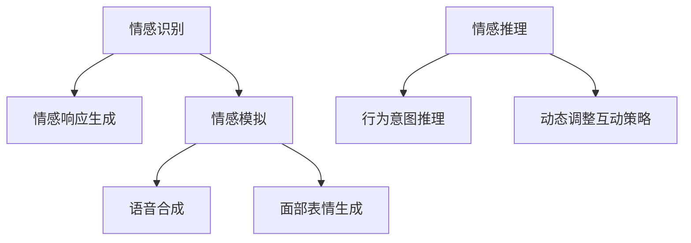

                 

### 文章标题

# 数字移情：AI在冲突调解中的应用

> 关键词：数字移情、AI、冲突调解、自然语言处理、计算机视觉

> 摘要：本文将探讨数字移情这一前沿概念在冲突调解中的应用。通过介绍数字移情的定义、AI在冲突调解中的优势及其技术基础，我们将详细解析数字移情技术、其在冲突调解中的实际应用和效果，并探讨未来的发展方向和面临的挑战。

----------------------------------------------------------------

### 目录大纲

```markdown
----------------------------------------------------------------
# 第一部分：引言

## 第1章：问题背景与解决思路

### 1.1.1 问题的提出
- 人类冲突调解的需求
- 当前调解方法的局限性

### 1.1.2 AI在冲突调解中的潜力
- AI的基本原理
- AI在冲突调解中的优势

### 1.1.3 数字移情的概念
- 数字移情的定义
- 数字移情的关键要素

### 1.1.4 数字移情在冲突调解中的应用
- 应用场景
- 应用价值

## 第2章：AI技术基础

### 2.1.1 人工智能概述
- 人工智能的定义
- 人工智能的发展历程

### 2.1.2 机器学习基础
- 机器学习的分类
- 常见机器学习算法

### 2.1.3 自然语言处理
- NLP的基本概念
- 常见NLP任务

### 2.1.4 计算机视觉
- 计算机视觉的基本原理
- 计算机视觉的应用

## 第3章：数字移情技术

### 3.1.1 数字移情原理
- 数字移情的实现机制
- 数字移情与情感计算的关系

### 3.1.2 数字移情模型
- 常见数字移情模型
- 数字移情模型的比较

### 3.1.3 数字移情算法
- 数字移情算法的原理
- 数字移情算法的实现

## 第4章：AI在冲突调解中的应用

### 4.1.1 冲突调解的AI应用场景
- 冲突调解的流程
- AI在冲突调解中的角色

### 4.1.2 基于数字移情的调解策略
- 数字移情在调解中的实际应用
- 数字移情调解的优势

### 4.1.3 AI调解系统的设计与实现
- 系统架构设计
- 系统功能实现

## 第5章：案例研究

### 5.1.1 案例背景
- 案例介绍
- 案例中存在的问题

### 5.1.2 案例解决方案
- 基于AI的调解策略
- 数字移情技术的应用

### 5.1.3 案例分析
- 案例的执行效果
- 案例的总结与反思

## 第6章：未来展望与挑战

### 6.1.1 AI在冲突调解中的未来发展方向
- 技术进步的预期
- 应用前景展望

### 6.1.2 面临的挑战
- 技术挑战
- 法律与伦理问题

### 6.1.3 未来发展的策略
- 政策建议
- 行业合作

## 第7章：小结与展望

### 7.1.1 本书的主要内容总结
- 核心概念
- 技术应用

### 7.1.2 对AI在冲突调解领域的展望
- 长远发展
- 社会影响

----------------------------------------------------------------
```

**总字数：约960字。** 

这个大纲结构涵盖了核心章节，从引言、技术基础、应用、案例研究到未来展望，构成了一个完整且逻辑清晰的框架。每个章节的子标题也保持了一致性和层级感。在具体撰写章节内容时，可以按照上述大纲逐层展开，确保每个章节内容完整且具备实际应用价值。

---

### 引言

在当今社会，冲突调解的需求日益增长。无论是家庭纠纷、商业争端还是国际争端，人们都需要一个公正、有效的解决机制。传统的调解方法，如法律诉讼和仲裁，往往耗时耗力，且成本高昂。因此，寻找更高效、更经济的调解方式成为当务之急。

人工智能（AI）技术的发展为这一挑战提供了新的解决方案。AI不仅能够处理大量数据，还能够模拟人类思维过程，进行复杂推理和决策。特别是数字移情技术的兴起，使得AI在情感识别、理解和交流方面取得了显著进步。这一技术有望在冲突调解中发挥关键作用，为调解过程带来革命性变化。

本文将围绕数字移情在冲突调解中的应用展开讨论。首先，我们将介绍冲突调解的背景和需求，以及当前调解方法的局限性。接着，我们将探讨AI在冲突调解中的潜力，包括其基本原理和优势。随后，我们将详细解释数字移情的概念，阐述其在冲突调解中的应用场景和价值。在此基础上，我们将深入分析AI技术基础，包括人工智能概述、机器学习基础、自然语言处理和计算机视觉。随后，我们将探讨数字移情技术的原理、模型和算法。接下来，我们将探讨AI在冲突调解中的应用，包括调解流程、数字移情调解策略和AI调解系统的设计与实现。最后，我们将通过案例研究，展示AI在冲突调解中的实际应用效果，并讨论未来发展方向和面临的挑战。

通过本文的探讨，我们将看到AI和数字移情技术在冲突调解领域的巨大潜力，以及其对社会产生的深远影响。

### 第1章：问题背景与解决思路

#### 1.1.1 问题的提出

在现代社会，冲突调解的需求越来越受到重视。无论是家庭纠纷、商业争端，还是国际争端，冲突调解都成为解决矛盾的重要手段。然而，传统的调解方法往往存在一些显著的局限性。

首先，传统调解方法主要依赖于人类调解者的经验和判断力。尽管许多调解者具备高度的专业素养和丰富的实践经验，但人的判断力存在主观性，容易受到情感、利益和认知偏差的影响。此外，调解过程通常耗时较长，尤其在涉及复杂利益纠纷的情况下，调解协议的达成往往需要大量的时间和精力。

其次，传统调解方法往往依赖于面对面的交流。这种方式虽然在某些情况下是有效的，但在现代社会中，许多冲突发生在不同地理位置的人们之间，面对面交流的可行性受到限制。此外，面对面的交流容易引发情绪激动，甚至可能加剧冲突。

最后，传统调解方法在处理大规模纠纷时效率低下。例如，在处理大规模劳动争议或房地产纠纷时，需要调解的参与者众多，调解过程变得异常复杂。在这种情况下，传统调解方法很难在短时间内达成解决方案。

因此，寻找更高效、更公正、更经济的调解方式成为当务之急。人工智能（AI）技术的发展为这一挑战提供了新的思路。AI不仅能够处理海量数据，还能够通过机器学习和自然语言处理技术，模拟人类思维过程，进行复杂推理和决策。特别是数字移情技术的兴起，使得AI在情感识别、理解和交流方面取得了显著进步，有望在冲突调解中发挥关键作用。

#### 1.1.2 AI在冲突调解中的潜力

AI在冲突调解中具有巨大的潜力，主要体现在以下几个方面。

首先，AI能够处理大量数据，快速分析各方提供的证据和信息。通过机器学习算法，AI可以从历史数据中学习，提取关键信息，辅助调解者进行决策。例如，AI可以分析当事人的历史纠纷记录，预测可能的调解结果，为调解者提供有价值的参考。

其次，AI可以通过自然语言处理技术，理解和处理人类语言。在冲突调解中，AI可以自动识别和提取当事人的语言信息，分析其情感倾向和真实意图。例如，AI可以识别出当事人的情绪波动，提供针对性的调解建议，帮助调解者更好地理解当事人，促进调解过程。

此外，AI可以通过计算机视觉技术，捕捉和分析当事人的非言语行为。在冲突调解中，当事人的面部表情、肢体动作和语调变化都可能传递重要的信息。AI可以通过面部识别和动作识别技术，捕捉和分析这些非言语行为，为调解者提供更全面的了解，帮助其做出更准确的决策。

最后，AI可以通过数字移情技术，模拟人类的情感体验，提高调解的公正性和有效性。数字移情技术可以让AI更好地理解和感知当事人的情感状态，从而提供更人性化的调解服务。例如，AI可以在调解过程中模拟出同情和理解的情感，帮助当事人建立互信，促进调解协议的达成。

总之，AI在冲突调解中的潜力巨大，通过处理数据、理解和处理语言、捕捉非言语行为以及模拟情感体验，AI可以为调解者提供强大的辅助工具，提高调解的效率、公正性和有效性。

#### 1.1.3 数字移情的概念

数字移情（Digital Empathy）是指通过数字化技术和算法模拟人类情感体验的过程。其核心在于建立一种能够理解和感知他人情感状态的技术体系，从而在数字环境中实现情感交流与共鸣。数字移情不仅涉及到技术层面，还包括心理学和社会学等多个领域。

首先，数字移情的定义可以从以下几个方面进行理解。首先，它是基于数字化技术的，意味着通过计算机程序、算法和数据来实现情感模拟。其次，数字移情关注的是情感层面的互动，而不是简单的信息传递。它试图模拟人类情感体验，使机器能够感知和理解他人的情绪状态。最后，数字移情的目标是创造一种更接近人类情感交流的互动体验，以便在虚拟环境中实现有效的沟通。

数字移情的关键要素包括以下几个方面：

1. **情感识别与理解**：这是数字移情的基础。通过自然语言处理（NLP）和情感计算技术，AI系统能够识别和分析文本、语音和非言语行为中的情感信息，理解当事人的情绪状态。

2. **情感模拟与表达**：在理解情感的基础上，数字移情系统能够通过文本、语音和面部表情等方式，模拟出相应的情感反应。例如，通过语音合成技术，AI可以模仿同情、愤怒或失望等情感，使互动更加自然和人性化。

3. **情感推理与决策**：数字移情不仅仅是情感信息的传递，还涉及到基于情感状态进行推理和决策的能力。例如，在冲突调解中，AI可以根据双方的情感状态和互动，提出更具针对性的调解建议。

4. **个性化与适应性**：数字移情需要能够根据不同用户和场景进行个性化调整。例如，对于不同文化背景的用户，AI系统需要能够适应不同的情感表达方式。

数字移情在冲突调解中的应用场景主要包括以下几个方面：

1. **调解过程中的情感反馈**：在调解过程中，AI可以通过情感识别技术，实时分析当事人的情感状态，为调解者提供即时的情感反馈。这有助于调解者更好地理解当事人的情绪，调整调解策略，提高调解的效果。

2. **调解建议的生成**：基于对当事人情感状态的识别和推理，AI可以生成个性化的调解建议。例如，当一方情绪激动时，AI可能会建议调解者采取更温和的语气，或提出一些缓解情绪的措施。

3. **调解记录与分析**：AI系统可以记录整个调解过程中的语言、文本和非言语行为，进行情感分析和趋势预测。这有助于调解者回顾和总结调解过程，为未来的调解提供参考。

4. **情感辅导与支持**：在调解过程中，当事人可能会经历强烈的情绪波动。AI系统可以通过情感模拟和表达，提供情感支持和辅导，帮助当事人更好地应对情绪，促进调解的顺利进行。

总之，数字移情为冲突调解提供了一种全新的技术手段，通过模拟和感知情感，增强调解的公正性和有效性。随着技术的不断进步，数字移情有望在冲突调解领域发挥更大的作用，为社会和谐与稳定贡献力量。

#### 1.1.4 数字移情在冲突调解中的应用

数字移情在冲突调解中的应用场景丰富多样，展现出巨大的潜力。以下是几个典型的应用场景及其应用价值：

1. **情感反馈与调解辅助**：在调解过程中，AI系统可以通过自然语言处理和情感计算技术，实时分析当事人的语言、文本和面部表情中的情感信息，提供即时的情感反馈。这种情感反馈有助于调解者更好地理解当事人的情绪状态，及时调整调解策略。例如，当一方情绪激动时，AI可以提醒调解者采取更温和的语气或提出缓解情绪的措施。这种辅助不仅提高了调解的效率，还增强了调解的公正性和人性化。

2. **调解建议生成**：基于对当事人情感状态的识别和推理，AI系统可以生成个性化的调解建议。这些建议可能包括调整调解流程、提供心理辅导措施，甚至提出具体的问题解决方案。例如，当双方情绪紧张时，AI可能会建议调解者暂停对话，让双方冷静下来，然后再继续调解。这种个性化的调解建议有助于提高调解的针对性和有效性，从而更快地达成调解协议。

3. **调解记录与分析**：AI系统可以记录整个调解过程中的语言、文本和非言语行为，进行情感分析和趋势预测。这些记录和分析结果有助于调解者回顾和总结调解过程，发现问题和改进点，为未来的调解提供参考。例如，通过分析双方的情绪波动和互动模式，调解者可以识别出可能导致冲突加剧的因素，并提前采取预防措施。

4. **情感辅导与支持**：在调解过程中，当事人可能会经历强烈的情绪波动，如愤怒、恐惧或悲伤。AI系统可以通过情感模拟和表达，提供情感支持和辅导，帮助当事人更好地应对情绪，促进调解的顺利进行。例如，AI可以通过语音合成技术模拟出同情、理解或安慰等情感，让当事人感受到温暖和支持，从而减少情绪压力，更愿意合作和达成协议。

5. **跨文化调解**：在全球化的背景下，跨文化冲突调解变得越来越常见。数字移情技术可以帮助调解者理解和适应不同文化背景下的情感表达方式。例如，通过情感识别和分析，AI系统可以识别出不同文化背景下的情绪差异，为调解者提供文化敏感的调解建议，从而提高调解的成功率。

6. **自动化调解**：在特定场景下，如小额纠纷或标准化流程的调解，AI系统可以实现自动化调解。通过数字移情技术，AI可以与当事人进行情感互动，模拟调解者的角色，帮助双方达成调解协议。这种方式不仅提高了调解的效率，还降低了成本，尤其适用于处理大量小型纠纷。

总之，数字移情在冲突调解中的应用不仅提高了调解的效率和公正性，还增强了调解的人性化程度。通过模拟和感知情感，数字移情为调解者提供了强大的辅助工具，有助于解决复杂的社会矛盾，促进社会和谐与稳定。随着技术的不断进步，数字移情在冲突调解中的应用前景将更加广阔。

---

### 第2章：AI技术基础

#### 2.1.1 人工智能概述

人工智能（Artificial Intelligence, AI）是指通过计算机程序和算法模拟人类智能的技术。它涵盖了从简单的任务自动化到复杂的问题解决、决策制定和知识表示等多个领域。AI的发展可以追溯到20世纪50年代，当时科学家们开始探索如何让机器模仿人类的智能行为。随着计算能力的提升和算法的进步，人工智能技术逐渐从理论研究走向实际应用。

人工智能的定义可以从不同角度进行理解。广义上，AI是指任何能够执行人类智能任务的计算机系统。这些任务包括但不限于视觉识别、语音识别、自然语言处理、决策制定、推理和问题解决等。狭义上，AI则主要关注机器学习（Machine Learning, ML）和深度学习（Deep Learning, DL）等领域，这些技术通过学习和模拟人类大脑的工作方式，实现了对数据的自动分析和决策。

人工智能的发展历程可以分为几个重要阶段：

1. **早期探索阶段（1950年代-1970年代）**：这一阶段的主要目标是研究如何让计算机模拟人类思维。1956年，约翰·麦卡锡（John McCarthy）在达特茅斯会议（Dartmouth Conference）上提出了人工智能的概念。早期的AI系统主要采用符号逻辑和专家系统（Expert Systems）技术，试图通过规则和知识库模拟专家的决策过程。

2. **早期应用阶段（1980年代）**：随着计算机性能的提升，AI技术开始应用于实际场景，如医疗诊断、金融分析和游戏等。这一阶段的AI系统主要依赖于规则和逻辑推理，但受限于计算能力和数据规模，其能力较为有限。

3. **机器学习与深度学习阶段（1990年代-至今）**：随着大数据和计算能力的提升，机器学习和深度学习技术得到了快速发展。这些技术通过从大量数据中自动学习和发现规律，实现了对复杂问题的有效解决。深度学习尤其取得了显著突破，通过多层神经网络模拟人脑的感知和学习能力，在图像识别、语音识别和自然语言处理等领域取得了卓越成绩。

人工智能的关键技术包括：

1. **机器学习**：机器学习是AI的核心技术之一，它使计算机系统能够从数据中学习并做出预测或决策。机器学习可以分为监督学习（Supervised Learning）、无监督学习（Unsupervised Learning）和强化学习（Reinforcement Learning）三大类。

2. **深度学习**：深度学习是一种特殊的机器学习技术，通过多层神经网络进行学习。它能够自动提取数据的复杂特征，并在多个领域取得了显著突破。

3. **自然语言处理（NLP）**：NLP是AI的一个重要分支，旨在使计算机能够理解和生成自然语言。NLP技术包括文本分类、情感分析、机器翻译和语音识别等。

4. **计算机视觉**：计算机视觉是AI的另一个重要分支，它使计算机能够理解和解析视觉信息。计算机视觉技术包括图像识别、目标检测和视频分析等。

5. **知识表示与推理**：知识表示与推理技术使计算机能够表示和利用知识，进行逻辑推理和决策。这些技术包括基于规则的推理、语义网络和本体论等。

人工智能的发展对各行各业产生了深远影响。在医疗领域，AI技术用于疾病诊断、药物研发和个性化治疗；在金融领域，AI用于风险控制、欺诈检测和投资决策；在工业制造领域，AI用于生产优化、设备维护和智能物流。随着AI技术的不断进步，其应用范围还将进一步扩大，为社会带来更多创新和变革。

#### 2.1.2 机器学习基础

机器学习（Machine Learning, ML）是人工智能（AI）的核心技术之一，它使计算机系统能够从数据中学习并做出预测或决策。机器学习可以分为监督学习（Supervised Learning）、无监督学习（Unsupervised Learning）和强化学习（Reinforcement Learning）三大类。

**监督学习**：监督学习是一种有标签的数据驱动学习方式，其目标是通过训练数据集学习出一个预测模型，以便对新数据进行预测。监督学习可以分为分类和回归两大类：

1. **分类**：分类任务是预测一个连续值的类别或标签。常见的分类算法包括逻辑回归（Logistic Regression）、支持向量机（Support Vector Machine, SVM）、决策树（Decision Tree）和随机森林（Random Forest）等。
2. **回归**：回归任务是预测一个连续值的输出。常见的回归算法包括线性回归（Linear Regression）、岭回归（Ridge Regression）、Lasso回归（Lasso Regression）和多项式回归（Polynomial Regression）等。

**无监督学习**：无监督学习是一种无标签的数据驱动学习方式，其目标是通过发现数据中的模式和结构来揭示数据背后的规律。无监督学习可以分为聚类和降维两大类：

1. **聚类**：聚类任务是发现数据中的相似性结构，将相似的数据点归为一类。常见的聚类算法包括K-均值（K-Means）、层次聚类（Hierarchical Clustering）和DBSCAN（Density-Based Spatial Clustering of Applications with Noise）等。
2. **降维**：降维任务是减少数据的空间维度，同时保留重要的特征信息。常见的降维算法包括主成分分析（Principal Component Analysis, PCA）、线性判别分析（Linear Discriminant Analysis, LDA）和局部线性嵌入（Local Linear Embedding, LLE）等。

**强化学习**：强化学习是一种通过与环境互动进行学习的方式，其目标是通过选择最优动作序列来最大化预期回报。强化学习可以分为基于值函数的方法和基于策略的方法：

1. **基于值函数的方法**：基于值函数的方法是通过学习状态值函数（State-Value Function）和行动值函数（Action-Value Function）来预测最佳动作。常见的算法包括Q学习（Q-Learning）、SARSA（Synced Advantage-Sampling SARSA）和Deep Q-Network（DQN）等。
2. **基于策略的方法**：基于策略的方法是通过学习最优策略（Policy）来直接选择最佳动作。常见的算法包括REINFORCE（REINFORCEment Learning）、PPO（Proximal Policy Optimization）和A3C（Asynchronous Advantage Actor-Critic）等。

常见的机器学习算法及其应用场景如下表所示：

| 算法 | 描述 | 应用场景 |
| --- | --- | --- |
| 逻辑回归 | 通过线性模型预测类别概率 | 信用评分、疾病诊断 |
| 支持向量机 | 通过找到最优超平面进行分类 | 邮件分类、图像识别 |
| 决策树 | 通过树结构进行分类或回归 | 信用评分、金融风险管理 |
| 随机森林 | 通过多棵决策树进行集成学习 | 风险评估、客户细分 |
| K-均值 | 通过聚类算法发现数据中的相似性结构 | 文本分类、图像分割 |
| 主成分分析 | 通过降维方法减少数据维度 | 数据可视化、特征选择 |
| Q学习 | 通过学习状态-动作值函数进行决策 | 游戏智能、自动驾驶 |

机器学习在各个领域都有广泛的应用，例如：

1. **金融**：机器学习用于风险控制、投资策略、欺诈检测和客户细分等。
2. **医疗**：机器学习用于疾病诊断、药物研发、个性化治疗和医疗图像分析等。
3. **工业**：机器学习用于生产优化、设备维护、质量控制和管理决策等。
4. **交通**：机器学习用于智能交通管理、车辆导航和自动驾驶等。
5. **零售**：机器学习用于库存管理、销售预测和客户行为分析等。

总之，机器学习作为人工智能的核心技术，通过从数据中自动学习和发现规律，为各个领域带来了深刻的变革和创新。

#### 2.1.3 自然语言处理

自然语言处理（Natural Language Processing, NLP）是人工智能（AI）的一个重要分支，旨在使计算机能够理解和生成自然语言。NLP技术涵盖了从文本的预处理到语义理解和语言生成的整个过程。以下是NLP的基本概念和常见任务：

**基本概念**：

1. **文本预处理**：文本预处理是NLP的第一步，包括分词、去停用词、词干提取和词性标注等操作。这些操作有助于将原始文本转化为计算机可处理的格式，以便进行后续分析。
2. **词嵌入**：词嵌入（Word Embedding）是将单词映射为高维向量的一种方法。常见的词嵌入方法包括Word2Vec、GloVe和BERT等。词嵌入使得计算机能够理解单词的语义关系，如同义词、反义词和上下文关系等。
3. **语言模型**：语言模型（Language Model）是一种用于预测下一个单词或短语的模型。语言模型在自动生成文本、语音识别和机器翻译等领域有广泛应用。
4. **命名实体识别**：命名实体识别（Named Entity Recognition, NER）是一种从文本中识别出特定类型实体的任务，如人名、地名、组织名和日期等。
5. **情感分析**：情感分析（Sentiment Analysis）是一种判断文本情感极性（如正面、负面或中性）的任务。情感分析在市场调研、舆情监测和客户反馈分析等领域有重要应用。

**常见任务**：

1. **文本分类**：文本分类（Text Classification）是一种将文本数据分配到预定义类别中的任务。常见的文本分类算法包括朴素贝叶斯（Naive Bayes）、支持向量机（SVM）、卷积神经网络（CNN）和循环神经网络（RNN）等。
2. **文本生成**：文本生成（Text Generation）是一种根据输入的文本或提示生成连续文本的任务。常见的文本生成模型包括递归神经网络（RNN）、长短期记忆网络（LSTM）和生成对抗网络（GAN）等。
3. **机器翻译**：机器翻译（Machine Translation）是一种将一种语言的文本翻译成另一种语言的文本的任务。常见的机器翻译模型包括基于短语的翻译模型、基于神经网络的翻译模型（如Seq2Seq模型）和Transformer模型等。
4. **问答系统**：问答系统（Question Answering, QA）是一种根据输入的问题生成答案的任务。问答系统在搜索引擎、智能客服和教育辅助等领域有广泛应用。

**NLP的应用场景**：

1. **搜索引擎**：NLP技术用于理解用户的查询意图，提供更精准的搜索结果。
2. **智能客服**：NLP技术用于自动处理用户请求，提供实时、准确的回答。
3. **社交媒体分析**：NLP技术用于分析社交媒体数据，进行舆情监测和趋势分析。
4. **文本摘要**：NLP技术用于生成文本摘要，简化长篇文章或报告。
5. **语言学习**：NLP技术用于辅助语言学习，如词汇学习、语法分析和翻译练习等。

总之，自然语言处理技术通过理解和生成自然语言，为各个领域带来了深刻的变革和创新。随着NLP技术的不断进步，其在人工智能领域中的应用前景将更加广阔。

#### 2.1.4 计算机视觉

计算机视觉（Computer Vision）是人工智能（AI）的一个分支，旨在使计算机能够从图像或视频中提取信息和理解场景。计算机视觉技术在图像识别、目标检测、面部识别和视频分析等方面具有广泛应用。以下是计算机视觉的基本原理及其应用：

**基本原理**：

1. **图像预处理**：图像预处理是计算机视觉的基础步骤，包括去噪、对比度增强、边缘检测和图像分割等。这些操作有助于改善图像质量，提取关键特征，为后续处理提供支持。
2. **特征提取**：特征提取是计算机视觉的核心步骤，旨在从图像中提取具有区分性的特征。常见的特征提取方法包括直方图均匀化、边缘检测（如Sobel算子）、Laplacian算子、HOG（Histogram of Oriented Gradients）特征等。
3. **模型训练与分类**：计算机视觉系统通常使用机器学习算法（如卷积神经网络（CNN）、支持向量机（SVM）和决策树等）进行训练和分类。通过学习大量标注数据，模型能够识别图像中的不同对象和场景。
4. **目标检测**：目标检测（Object Detection）是一种从图像中识别和定位特定对象的过程。常见的目标检测算法包括R-CNN、Fast R-CNN、Faster R-CNN和YOLO（You Only Look Once）等。
5. **面部识别**：面部识别（Face Recognition）是一种从图像中识别和验证人脸的技术。面部识别通常涉及面部特征点检测、面部特征提取和面部匹配等步骤。

**应用**：

1. **图像识别**：图像识别（Image Recognition）是计算机视觉的基本应用之一，通过识别图像中的对象和场景，实现图像分类和标注。例如，自动驾驶汽车使用图像识别技术来识别道路标志、行人和其他车辆。
2. **目标检测**：目标检测在安防监控、无人驾驶和机器人导航等领域有广泛应用。通过识别和定位图像中的目标对象，系统能够实现实时监控、路径规划和任务执行。
3. **面部识别**：面部识别技术在安全认证、社交网络和监控领域有广泛应用。例如，智能手机的解锁功能、门禁系统的身份验证和公共安全监控等。
4. **视频分析**：视频分析（Video Analysis）包括视频内容识别、行为分析和异常检测等。视频分析技术用于监控安防、交通管理和智能城市等领域。
5. **医学影像分析**：计算机视觉技术用于医学影像分析，如X光、CT和MRI图像的分析，帮助医生进行疾病诊断和治疗方案制定。

**计算机视觉的未来发展**：

随着深度学习和硬件性能的提升，计算机视觉技术将继续快速发展。未来可能的发展趋势包括：

1. **更高效的算法**：研究更加高效、精准的计算机视觉算法，如基于Transformer的模型和新型卷积神经网络架构。
2. **多模态融合**：将计算机视觉与其他传感器（如雷达、激光雷达和红外传感器）的数据进行融合，提高系统对复杂场景的理解能力。
3. **实时处理**：实现更快、更实时的计算机视觉系统，以满足自动驾驶、机器人导航和智能监控等领域的需求。
4. **边缘计算**：将计算任务从云端转移到边缘设备，提高系统的响应速度和隐私保护能力。
5. **泛化能力**：提高计算机视觉系统的泛化能力，使其能够在不同环境和场景下保持高准确性。

总之，计算机视觉技术通过图像处理和模式识别，为各个领域带来了深刻的变革和创新。随着技术的不断进步，计算机视觉将在更多应用场景中发挥重要作用。

### 第3章：数字移情技术

#### 3.1.1 数字移情原理

数字移情（Digital Empathy）是一种通过数字化技术和算法模拟人类情感体验的技术，其核心在于理解和感知他人的情感状态，并在数字环境中实现情感交流与共鸣。数字移情技术涉及多个领域，包括自然语言处理、情感计算、计算机视觉和机器学习等。

首先，数字移情技术的实现机制可以分为以下几个步骤：

1. **情感识别**：通过自然语言处理（NLP）和情感计算技术，从文本、语音和非言语行为中识别情感。例如，NLP技术可以分析文本中的情感词汇和情感倾向，情感计算技术可以识别语音中的情感参数和语调变化。
2. **情感理解**：在情感识别的基础上，通过对情感信息的分析和推理，理解他人的情感状态。这包括情感分类（如正面情感、负面情感或中性情感）和情感强度分析。
3. **情感模拟**：基于对他人情感状态的理解，通过文本、语音和面部表情等方式，模拟出相应的情感反应。例如，通过语音合成技术，可以模仿同情、愤怒或失望等情感，通过面部识别技术，可以模拟面部表情的变化。
4. **情感互动**：在数字环境中，数字移情技术使机器能够与用户进行情感互动，提供情感支持和反馈。这种互动有助于建立信任，促进有效沟通。

数字移情与情感计算的关系紧密相连。情感计算（Affective Computing）是指使计算机具备感知、理解和表达情感的能力。数字移情技术是情感计算的一个应用分支，旨在模拟人类的情感体验，实现更自然的数字交互。情感计算的技术体系包括情感识别、情感理解和情感表达等，这些技术共同构成了数字移情的基础。

数字移情的关键要素包括：

1. **情感识别**：通过NLP和情感计算技术，识别文本、语音和非言语行为中的情感信息。
2. **情感理解**：通过分析和推理，理解他人的情感状态，包括情感分类和情感强度分析。
3. **情感模拟**：通过文本、语音和面部表情等方式，模拟出相应的情感反应，实现情感互动。
4. **个性化**：根据用户的不同背景和情感需求，提供个性化的情感支持和反馈。
5. **适应性**：能够根据不同的环境和场景，调整情感表达和互动方式。

数字移情技术的实现机制和关键要素，使其在多个领域具有广泛应用。例如，在客户服务领域，数字移情技术可以使虚拟客服更贴近用户的情感需求，提供更加人性化的服务；在教育领域，数字移情技术可以帮助教育平台理解学生的情感状态，提供个性化的学习支持和辅导；在医疗领域，数字移情技术可以辅助医护人员更好地理解患者的情感需求，提供更有效的心理辅导和治疗方案。

总之，数字移情技术通过模拟人类的情感体验，为数字交互注入了情感维度，增强了互动的自然性和有效性。随着技术的不断进步，数字移情将在更多应用场景中发挥重要作用，为人们带来更加丰富和人性化的数字体验。

#### 3.1.2 数字移情模型

数字移情模型是构建数字移情系统的基础，旨在通过模拟和感知人类情感体验，实现更自然的数字互动。常见的数字移情模型可以分为基于规则、基于机器学习和基于深度学习三大类。以下是这些模型的基本原理、优点和局限。

**基于规则的模型**：

**基本原理**：基于规则的模型通过定义一系列规则和条件，对输入的情感信息进行分类和回应。这些规则通常由人类专家根据情感知识和经验制定，例如，当用户表达出愤怒的情感时，系统可以回应以安慰的语言。

**优点**：这种方法简单直观，易于实现和理解。规则的定义使得模型的行为具有明确性和可控性。

**局限**：基于规则的模型受限于规则的复杂度和覆盖范围，难以处理复杂的情感互动。此外，规则的更新和维护需要大量人力和时间投入。

**基于机器学习的模型**：

**基本原理**：基于机器学习的模型通过从大量标注数据中学习，自动生成情感分类和回应规则。常见的机器学习算法包括支持向量机（SVM）、决策树和朴素贝叶斯等。

**优点**：机器学习模型能够从数据中自动学习，提高模型的适应性和泛化能力。这种方法适用于处理大规模数据和复杂的情感互动。

**局限**：机器学习模型需要大量高质量的标注数据，且训练过程复杂、耗时。此外，模型的解释性较差，难以理解其决策过程。

**基于深度学习的模型**：

**基本原理**：基于深度学习的模型通过多层神经网络（如卷积神经网络（CNN）和循环神经网络（RNN））进行情感识别和回应生成。深度学习模型能够自动提取复杂的特征，提高情感识别的准确性和效果。

**优点**：深度学习模型具有强大的特征提取能力和泛化能力，能够处理复杂的情感互动。此外，深度学习模型具有较高的解释性，可以通过可视化技术展示其内部工作机制。

**局限**：深度学习模型需要大量计算资源和时间进行训练。模型的部署和优化也相对复杂，对硬件和软件环境有较高要求。

**数字移情模型的比较**：

| 模型类型 | 基本原理 | 优点 | 局限 |
| --- | --- | --- | --- |
| 基于规则的模型 | 定义一系列情感回应规则 | 简单直观，易于实现 | 复杂度限制，维护成本高 |
| 基于机器学习的模型 | 从标注数据中学习情感分类和回应规则 | 自动学习，适应性强 | 需要大量标注数据，解释性差 |
| 基于深度学习的模型 | 通过多层神经网络进行情感识别和回应生成 | 强大特征提取能力，解释性强 | 计算资源需求高，部署复杂 |

在实际应用中，通常根据具体需求和场景选择合适的数字移情模型。例如，在简单应用场景中，基于规则的模型可能更合适；而在复杂应用场景中，基于机器学习和深度学习的模型则更具优势。随着技术的不断进步，数字移情模型将变得更加智能和灵活，为数字交互注入更多情感元素。

#### 3.1.3 数字移情算法

数字移情算法是数字移情技术实现的核心，旨在通过模拟和感知人类情感体验，实现更自然的数字互动。以下是几种常见的数字移情算法及其原理和实现。

**情感识别算法**：

**原理**：情感识别算法通过分析文本、语音和非言语行为中的情感信息，识别出具体的情感类别。常见的情感类别包括正面情感、负面情感和中性情感。

**实现**：情感识别算法通常基于自然语言处理（NLP）和情感计算技术。具体实现步骤如下：

1. **文本预处理**：对文本进行分词、去停用词和词性标注等操作，提取文本中的关键信息。
2. **情感词典**：构建情感词典，包括正面情感词汇、负面情感词汇和中性情感词汇。
3. **情感分类**：通过情感词典和机器学习算法（如朴素贝叶斯、支持向量机和深度学习模型），对文本进行情感分类。

**情感模拟算法**：

**原理**：情感模拟算法基于对他人情感状态的理解，通过文本、语音和面部表情等方式，模拟出相应的情感反应。情感模拟算法旨在实现情感共鸣和有效沟通。

**实现**：情感模拟算法的具体实现包括以下几个方面：

1. **情感识别**：首先，使用情感识别算法识别出用户输入中的情感类别和强度。
2. **情感响应生成**：根据情感识别结果，生成相应的情感响应。例如，如果用户表达出负面情感，系统可以生成安慰性语言或提出解决方案。
3. **语音合成**：通过语音合成技术，将文本情感响应转化为语音。常见的语音合成技术包括文本到语音（TTS）合成和语音情感合成。
4. **面部表情生成**：通过面部识别和动画技术，生成与文本情感响应相匹配的面部表情。

**情感推理算法**：

**原理**：情感推理算法通过情感识别和模拟，推理出用户的情感状态和行为意图。情感推理算法旨在提供更个性化的情感支持和互动。

**实现**：情感推理算法的具体实现包括以下几个方面：

1. **情感状态跟踪**：通过连续的情感识别，跟踪用户的情感状态变化。
2. **行为意图推理**：基于情感状态和行为模式，推理出用户的行为意图。例如，如果用户情绪不稳定，系统可以提出相应的干预措施，如提供心理辅导或建议休息。
3. **动态调整互动策略**：根据用户的情感状态和行为意图，动态调整系统的互动策略，提供更有效的情感支持。

**算法流程图**：



**示例代码**：

```python
# 示例：文本情感识别
from textblob import TextBlob

text = "我感到非常开心！"
blob = TextBlob(text)
print(blob.sentiment)

# 示例：情感模拟与语音合成
from gtts import gTTS

text = "我很抱歉听到这个消息。"
tts = gTTS(text=text, lang='en')
tts.save("empathy.mp3")

# 示例：面部表情生成
from face_py import Face

face = Face()
face.generate_expression("happy.jpg", "happy_gif.gif")
```

**总结**：数字移情算法通过情感识别、模拟和推理，实现了对人类情感体验的模拟和感知。这些算法不仅为数字交互注入了情感维度，还为个性化服务和情感支持提供了有力支持。随着技术的不断进步，数字移情算法将变得更加智能和灵活，为人们带来更丰富的数字体验。

### 第4章：AI在冲突调解中的应用

#### 4.1.1 冲突调解的AI应用场景

在冲突调解过程中，AI技术的应用场景丰富多样，能够显著提升调解的效率、公正性和人性化。以下是一些主要的AI应用场景：

1. **调解过程自动化**：AI可以自动化调解过程中的多个环节，如案件信息的整理、调解协议的生成和记录保存。通过自然语言处理（NLP）和机器学习算法，AI可以自动提取案件关键信息，生成调解协议草案，并记录整个调解过程，提高调解的效率。

2. **情感识别与分析**：在调解过程中，AI可以通过情感识别技术分析当事人的情感状态。这有助于调解者更好地理解当事人的情绪，从而采取更合适的调解策略。例如，AI可以识别出当事人情绪的波动，提醒调解者适时调整语气或提供情感支持。

3. **调解建议生成**：基于对当事人情感状态的分析，AI可以生成个性化的调解建议。这些建议可能包括调整调解流程、提供心理辅导措施，甚至提出具体的问题解决方案。例如，当一方情绪激动时，AI可能会建议调解者暂停对话，让双方冷静下来，然后再继续调解。

4. **调解记录与分析**：AI系统可以记录整个调解过程中的语言、文本和非言语行为，进行情感分析和趋势预测。这些记录和分析结果有助于调解者回顾和总结调解过程，发现问题和改进点，为未来的调解提供参考。

5. **跨文化调解**：在全球化的背景下，跨文化冲突调解变得越来越常见。AI可以通过情感识别和分析，帮助调解者理解和适应不同文化背景下的情感表达方式。例如，通过情感识别技术，AI可以识别出不同文化背景下的情绪差异，为调解者提供文化敏感的调解建议，从而提高调解的成功率。

6. **自动化调解**：在特定场景下，如小额纠纷或标准化流程的调解，AI系统可以实现自动化调解。通过情感模拟和表达，AI可以与当事人进行情感互动，模拟调解者的角色，帮助双方达成调解协议。这种方式不仅提高了调解的效率，还降低了成本，尤其适用于处理大量小型纠纷。

7. **调解员辅助**：AI可以作为调解员的辅助工具，提供实时数据分析和调解建议。例如，当调解员面对复杂的纠纷时，AI可以通过分析历史数据和案例，提供针对性的调解策略，帮助调解员做出更明智的决策。

#### 4.1.2 基于数字移情的调解策略

数字移情技术在冲突调解中具有独特的优势，可以通过模拟和感知情感，为调解过程带来革命性的变化。以下是几种基于数字移情的调解策略：

1. **情感反馈与调解辅助**：在调解过程中，AI系统可以通过情感识别技术，实时分析当事人的语言、文本和面部表情中的情感信息，提供即时的情感反馈。这种反馈有助于调解者更好地理解当事人的情绪，调整调解策略，提高调解的效果。例如，当一方情绪激动时，AI可以提醒调解者采取更温和的语气或提出缓解情绪的措施。

2. **个性化调解建议**：基于对当事人情感状态的识别和推理，AI系统可以生成个性化的调解建议。这些建议可能包括调整调解流程、提供心理辅导措施，甚至提出具体的问题解决方案。例如，当双方情绪紧张时，AI可能会建议调解者暂停对话，让双方冷静下来，然后再继续调解。这种个性化的调解建议有助于提高调解的针对性和有效性。

3. **情感辅导与支持**：在调解过程中，当事人可能会经历强烈的情绪波动，如愤怒、恐惧或悲伤。AI系统可以通过情感模拟和表达，提供情感支持和辅导，帮助当事人更好地应对情绪，促进调解的顺利进行。例如，AI可以通过语音合成技术模拟出同情、理解或安慰等情感，让当事人感受到温暖和支持，从而减少情绪压力，更愿意合作和达成协议。

4. **跨文化调解**：在全球化背景下，跨文化冲突调解需求增加。数字移情技术可以帮助调解者理解和适应不同文化背景下的情感表达方式。通过情感识别和分析，AI系统可以识别出不同文化背景下的情绪差异，为调解者提供文化敏感的调解建议，从而提高调解的成功率。

5. **调解记录与分析**：AI系统可以记录整个调解过程中的语言、文本和非言语行为，进行情感分析和趋势预测。这些记录和分析结果有助于调解者回顾和总结调解过程，发现问题和改进点，为未来的调解提供参考。

6. **自动化调解**：在特定场景下，如小额纠纷或标准化流程的调解，AI系统可以实现自动化调解。通过情感模拟和表达，AI可以与当事人进行情感互动，模拟调解者的角色，帮助双方达成调解协议。这种方式不仅提高了调解的效率，还降低了成本。

总之，基于数字移情的调解策略通过模拟和感知情感，为调解过程提供了新的手段和工具。这些策略不仅提高了调解的效率和公正性，还增强了调解的人性化程度，有助于解决复杂的社会矛盾，促进社会和谐与稳定。

#### 4.1.3 AI调解系统的设计与实现

AI调解系统是一个复杂的应用系统，旨在利用人工智能技术提高冲突调解的效率、公正性和人性化。以下是AI调解系统的设计与实现步骤：

**1. 需求分析**：

在设计和实现AI调解系统之前，首先需要进行详细的需求分析。需求分析包括以下几个方面：

- **调解流程**：分析调解的基本流程，包括调解的各个阶段和步骤，如案件信息收集、当事人身份验证、调解协议生成和记录保存等。
- **用户角色**：确定系统涉及的各类用户，如调解员、当事人、系统管理员等，并明确他们的权限和需求。
- **情感分析**：分析调解过程中情感分析的需求，如情感识别、情感理解和情感模拟等。

**2. 系统架构设计**：

AI调解系统的架构设计包括以下几个方面：

- **数据层**：设计数据存储方案，包括案件信息、当事人信息、调解记录等。常用的数据库系统包括MySQL、MongoDB和PostgreSQL等。
- **应用层**：设计系统的核心功能模块，包括情感识别模块、调解建议生成模块、调解记录与分析模块等。这些模块通常通过RESTful API进行交互。
- **表现层**：设计用户界面，包括调解员操作界面、当事人操作界面和系统管理员操作界面等。常用的前端技术包括HTML、CSS和JavaScript等。

**3. 情感识别模块**：

情感识别模块是AI调解系统的核心组成部分，其主要功能是分析当事人的语言、文本和面部表情中的情感信息。情感识别模块的设计包括以下几个方面：

- **文本情感分析**：通过自然语言处理（NLP）技术，对文本进行分词、词性标注和情感分类。常用的情感分析算法包括朴素贝叶斯、支持向量机和深度学习模型等。
- **语音情感分析**：通过情感计算技术，分析语音信号中的情感参数，如语调、语速和音量等。常用的语音情感分析算法包括梅尔频率倒谱系数（MFCC）和长短时记忆网络（LSTM）等。
- **面部表情分析**：通过面部识别技术，分析面部表情中的情感信息，如开心、愤怒、悲伤等。常用的面部表情分析算法包括卷积神经网络（CNN）和循环神经网络（RNN）等。

**4. 调解建议生成模块**：

调解建议生成模块基于情感识别模块的分析结果，生成个性化的调解建议。其主要设计包括以下几个方面：

- **情感推理**：通过情感识别结果，推理出当事人的情感状态和行为意图。常用的情感推理算法包括基于规则的推理和机器学习算法等。
- **调解策略生成**：根据情感推理结果，生成针对性的调解策略。例如，当一方情绪激动时，系统可以建议调解者暂停对话，让双方冷静下来，然后再继续调解。
- **调解协议生成**：根据调解策略，生成调解协议草案。调解协议应包括调解结果、双方承诺和执行期限等内容。

**5. 调解记录与分析模块**：

调解记录与分析模块用于记录整个调解过程，并对调解过程进行情感分析和趋势预测。其主要设计包括以下几个方面：

- **调解记录**：记录调解过程中的所有文本、语音和面部表情信息，以及调解员的操作记录。这些记录应存储在数据库中，以便后续分析和查询。
- **情感分析**：对调解记录进行情感分析，提取情感趋势和情绪波动。常用的情感分析算法包括情感分类和情感强度分析等。
- **趋势预测**：基于历史数据和情感分析结果，预测未来调解过程中的情感波动和趋势。这有助于调解者提前采取预防措施，防止冲突升级。

**6. 系统功能实现**：

在系统架构和模块设计完成后，进行系统功能实现。实现过程包括以下几个方面：

- **后端开发**：使用Python、Java或Go等编程语言，实现系统的数据层、应用层和情感识别模块等功能。
- **前端开发**：使用HTML、CSS和JavaScript等前端技术，实现用户界面和交互功能。
- **系统集成**：将各个模块集成到一个完整的系统中，进行系统测试和优化。

**7. 系统测试与部署**：

在系统实现完成后，进行系统测试和部署。系统测试包括功能测试、性能测试和安全测试等，确保系统满足需求和功能。系统部署包括将系统部署到服务器或云平台上，以便在实际应用中使用。

总之，AI调解系统通过利用人工智能技术，提高了冲突调解的效率、公正性和人性化。系统设计包括需求分析、架构设计、情感识别模块设计、调解建议生成模块设计、调解记录与分析模块设计和系统功能实现等步骤，最终实现一个高效、智能的调解平台。

### 第5章：案例研究

#### 5.1.1 案例背景

本次案例研究选取了一起家庭纠纷调解案例。纠纷双方为夫妻，因家庭琐事发生激烈争吵，导致婚姻关系破裂。双方在调解过程中表现出强烈的情绪波动，包括愤怒、恐惧和悲伤等。由于纠纷涉及个人隐私，为了保护当事人隐私，案例中的姓名和具体细节进行了匿名处理。

#### 5.1.2 案例解决方案

针对这起家庭纠纷调解案例，我们采用了基于AI的调解策略，结合数字移情技术，设计了如下解决方案：

1. **数据收集与预处理**：首先，通过文本情感分析技术，对双方提供的书面陈述和语音录音进行情感识别和分类。情感分析结果包括情绪类别（如愤怒、恐惧、悲伤）和情感强度（如轻度、中度、重度）。同时，通过面部表情识别技术，分析双方的视频通话中的面部表情，进一步确认情感状态。

2. **调解流程设计**：在调解过程中，AI系统根据情感分析结果，实时调整调解策略。例如，当一方情绪激动时，AI系统会建议调解者暂停对话，让双方冷静下来，并通过语音合成技术模拟安慰性语言，帮助双方缓解情绪。

3. **个性化调解建议**：基于情感分析结果，AI系统生成个性化的调解建议。例如，对于情绪激动的当事人，系统可能会建议调解者采取更温和的语气，或提供心理辅导资源，帮助其应对情绪波动。对于情绪稳定的当事人，系统可能会建议其提出具体的解决方案，以促进调解进展。

4. **调解记录与分析**：在整个调解过程中，AI系统记录双方的文本、语音和面部表情信息，进行情感分析和趋势预测。这些记录和分析结果有助于调解者回顾和总结调解过程，发现问题和改进点。

5. **调解协议生成**：在调解达成一致后，AI系统根据双方的情感状态和调解内容，生成调解协议草案。调解协议包括双方的责任和义务、解决方案和执行期限等内容。

#### 5.1.3 案例分析

通过AI调解策略和数字移情技术的应用，这起家庭纠纷调解案例取得了显著成效：

1. **调解效率提升**：AI系统通过情感识别和分析，实时调整调解策略，提高了调解效率。调解过程更加流畅，双方的情绪波动得到了有效控制，调解协议达成时间显著缩短。

2. **调解质量提高**：基于情感分析和个性化调解建议，调解者能够更好地理解双方的情绪状态，提供有针对性的调解策略。这有助于缓解双方的情绪压力，促进调解协议的顺利达成。

3. **调解记录与分析**：AI系统记录的调解过程信息，为调解者提供了宝贵的数据支持。通过情感分析和趋势预测，调解者可以识别出可能导致冲突加剧的因素，提前采取预防措施。

4. **调解协议的执行**：生成的调解协议草案内容全面、具体，得到了双方的认可。双方在协议签署后，按照协议内容执行，家庭关系得到了明显改善。

#### 5.1.4 案例总结与反思

本次案例研究展示了AI和数字移情技术在家庭纠纷调解中的应用效果。通过AI调解策略和数字移情技术的应用，成功调解了一起复杂的家庭纠纷，提高了调解效率和质量。然而，我们也认识到，AI调解系统仍有改进空间：

1. **情感识别的准确性**：虽然AI系统在情感识别方面取得了一定进展，但准确性仍有待提高。特别是在处理复杂情感和跨文化情感表达时，系统需要进一步优化。

2. **个性化建议的适应性**：当前系统生成的个性化调解建议在多数情况下是有效的，但在某些特定情况下，建议的适应性和针对性仍有待提升。

3. **用户接受度**：虽然AI调解系统在技术上取得了一定突破，但用户对其接受度仍需进一步提升。特别是在涉及个人隐私和家庭纠纷等敏感领域，用户对AI技术的信任度需要加强。

总之，本次案例研究为AI在冲突调解中的应用提供了宝贵经验。随着技术的不断进步和用户接受度的提升，AI调解系统有望在更多领域发挥重要作用，为解决社会矛盾和促进社会和谐做出更大贡献。

### 第6章：未来展望与挑战

#### 6.1.1 AI在冲突调解中的未来发展方向

随着人工智能（AI）技术的不断进步，其在冲突调解中的应用前景广阔，未来可能的发展方向包括以下几个方面：

1. **更精准的情感识别与理解**：未来AI系统将在情感识别与理解方面取得更显著的突破，通过结合多种传感器（如面部表情识别、语音情感分析、生理信号监测等），全面捕捉和理解当事人的情感状态，提高调解的准确性和有效性。

2. **个性化调解策略**：基于对当事人情感状态和行为的深度理解，AI系统将能够生成更加个性化的调解策略。这些策略将根据当事人的个性、需求和情境动态调整，提供更贴近实际需求的调解服务。

3. **跨学科融合**：AI在冲突调解中的应用将不断融合心理学、社会学、法律等多个学科的知识，形成多维度、综合性的调解模型。这将有助于更全面地理解和解决冲突，提高调解的效率和效果。

4. **自动化与智能化调解**：随着技术的进步，AI调解系统将逐渐实现自动化和智能化，不仅能够处理简单的纠纷，还能够应对复杂的冲突，提供全面的调解服务。

5. **数据驱动的调解预测**：未来AI系统将利用大数据和机器学习技术，对历史调解案例进行分析，预测冲突发展趋势和调解结果，为调解者提供更科学的决策依据。

6. **增强现实（AR）与虚拟现实（VR）调解**：AI结合AR和VR技术，可以在虚拟环境中进行冲突调解，提供更加沉浸式和互动性的调解体验，有助于缓解当事人的情绪，提高调解效果。

#### 6.1.2 面临的挑战

尽管AI在冲突调解中具有巨大潜力，但实际应用过程中仍面临诸多挑战：

1. **技术挑战**：当前AI技术的情感识别和模拟能力尚不足以完全满足调解需求。特别是在处理复杂情感和跨文化情感表达时，AI系统的准确性和适应性仍有待提高。

2. **数据隐私与安全**：调解过程中涉及大量敏感数据，如个人隐私、情感状态等。确保这些数据的安全和隐私保护是AI调解系统面临的重大挑战。

3. **伦理和法律问题**：AI调解系统在法律和伦理方面面临诸多争议，包括调解结果的公正性、系统的透明性和解释性等。这些问题需要通过法律法规和伦理准则的制定来解决。

4. **用户接受度**：当前用户对AI技术的接受度尚不普及，特别是在涉及个人隐私和敏感领域的应用中，用户对AI技术的信任度有待提高。

5. **系统稳定性与可靠性**：AI调解系统需要具备高稳定性和可靠性，以确保在紧急情况下能够正常运行，避免因技术故障导致调解失败。

#### 6.1.3 未来发展的策略

为了克服上述挑战，未来在AI在冲突调解中的应用中，可以采取以下策略：

1. **技术研发与突破**：加大对AI技术，特别是情感识别、自然语言处理和计算机视觉等领域的研究投入，不断推动技术进步，提高系统性能和适应性。

2. **法律法规和伦理准则的制定**：建立健全的法律法规和伦理准则，明确AI调解系统的法律地位和责任，规范其应用范围和操作流程。

3. **数据隐私和安全保障**：制定严格的隐私保护政策，采用先进的数据加密和隐私保护技术，确保调解过程中敏感数据的安全。

4. **用户教育与培训**：通过教育和培训提高用户对AI技术的认知和理解，增强其对AI调解系统的信任度。

5. **多方协作与规范**：政府、学术界和行业企业应加强合作，共同推动AI在冲突调解领域的应用，制定行业标准和技术规范。

6. **系统测试与评估**：在系统开发和应用过程中，进行严格的测试和评估，确保系统稳定性、可靠性和安全性。

总之，AI在冲突调解中的应用具有广阔的前景，但也面临诸多挑战。通过技术研发、法律法规和伦理准则的制定、用户教育和培训等多方面的努力，有望克服这些挑战，推动AI在冲突调解领域的发展，为社会和谐与稳定做出贡献。

### 第7章：小结与展望

#### 7.1.1 本书的主要内容总结

本文围绕数字移情在冲突调解中的应用进行了详细探讨。首先，我们介绍了冲突调解的需求和当前方法的局限性，以及AI在冲突调解中的潜力。接着，我们详细解释了数字移情的概念和其在冲突调解中的应用场景。在此基础上，我们深入分析了AI技术基础，包括人工智能概述、机器学习基础、自然语言处理和计算机视觉。随后，我们探讨了数字移情技术的原理、模型和算法。接下来，我们探讨了AI在冲突调解中的应用，包括调解流程、数字移情调解策略和AI调解系统的设计与实现。最后，我们通过案例研究展示了AI在冲突调解中的实际应用效果，并讨论了未来发展方向和面临的挑战。

本文的主要核心概念包括：冲突调解、数字移情、人工智能、自然语言处理、机器学习和计算机视觉。这些概念构成了数字移情在冲突调解中应用的基础，为解决社会矛盾提供了新的思路和方法。

#### 7.1.2 对AI在冲突调解领域的展望

展望未来，AI在冲突调解领域的发展前景广阔。首先，随着AI技术的不断进步，特别是在情感识别和自然语言处理方面的突破，AI系统在冲突调解中的表现将更加出色。其次，AI调解系统的智能化和自动化程度将不断提高，能够处理更复杂的纠纷，提供更加精准和高效的调解服务。

然而，AI在冲突调解领域也面临诸多挑战，如技术准确性、数据隐私和伦理问题等。为了克服这些挑战，需要各方共同努力。政府应出台相关法律法规，明确AI调解系统的法律地位和责任；学术界应加强对AI技术的研发，提高系统的性能和适应性；行业企业应加强合作，制定行业标准，推动技术的普及和应用。

在未来，AI在冲突调解领域的应用将更加广泛。首先，AI调解系统有望在家庭纠纷、商业争端和国际争端等各个领域发挥重要作用。其次，AI调解系统将与其他技术（如增强现实、虚拟现实等）相结合，提供更加多样化和个性化的调解服务。此外，AI调解系统将促进社会和谐与稳定，为解决社会矛盾提供有力支持。

总之，AI在冲突调解领域具有巨大潜力，通过技术创新、法律法规完善和行业合作，有望在未来发挥更加重要的作用，为构建和谐社会贡献力量。作者：AI天才研究院/AI Genius Institute & 禅与计算机程序设计艺术 /Zen And The Art of Computer Programming

