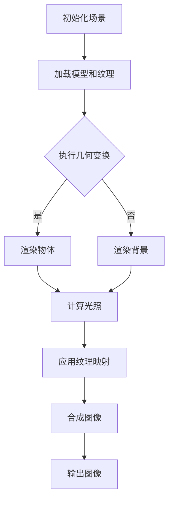
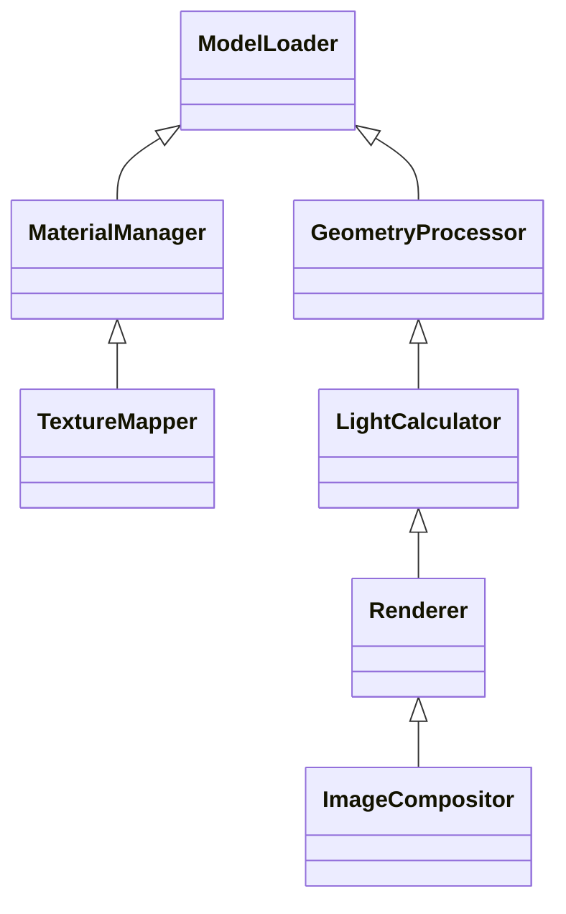
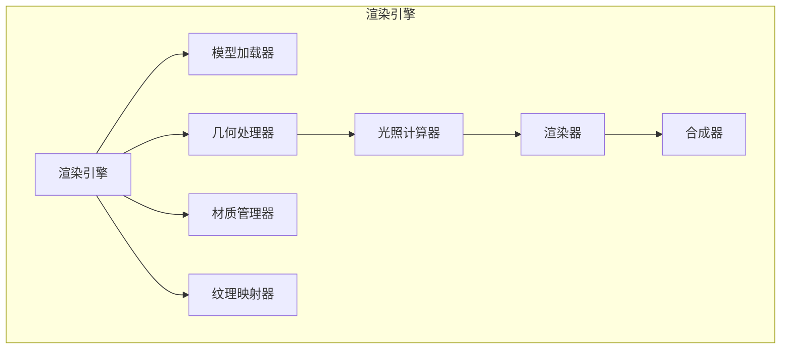
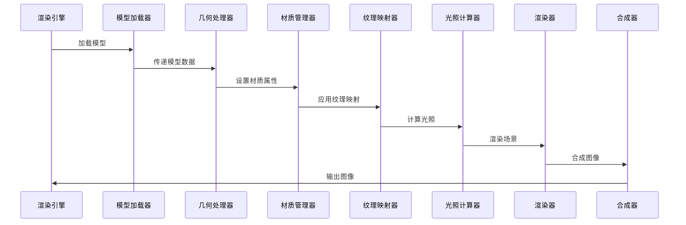

                 


# 数学分析在计算机图形学渲染算法中的应用

## 关键词
计算机图形学、渲染算法、数学分析、光线追踪、几何变换、纹理映射、人工智能

## 摘要
本文深入探讨了数学分析在计算机图形学渲染算法中的应用。首先，我们介绍了渲染算法的基本原理以及数学分析在其中扮演的角色。接着，我们详细讲解了核心数学分析概念，包括光照明模型、几何变换和纹理映射。随后，通过具体的算法实例和数学模型，我们展示了如何运用数学分析来解决渲染算法中的问题。文章还提供了一个系统分析与架构设计方案，以及实际项目实战的案例，最终总结了最佳实践和注意事项，并推荐了相关拓展阅读。

### 目录大纲设计方案

为了设计出《数学分析在计算机图形学渲染算法中的应用》这本书的详细目录大纲，我们可以按照以下步骤进行：

#### 1. 背景介绍

首先，我们需要介绍这本书的核心主题，即数学分析在计算机图形学渲染算法中的应用。这部分将包含以下内容：

- **问题背景**：讨论计算机图形学渲染算法的背景和重要性，以及数学分析在其中扮演的角色。
- **问题描述**：具体描述数学分析在渲染算法中的使用，如光照明模型、纹理映射、几何变换等。
- **问题解决**：简要介绍如何应用数学分析解决渲染算法中的问题。
- **边界与外延**：讨论数学分析在渲染算法中的应用范围和限制。
- **概念结构与核心要素组成**：概述渲染算法中的核心数学分析概念和要素。

#### 2. 核心概念与联系

接下来，我们需要深入介绍渲染算法中的核心数学分析概念，并展示它们之间的关系：

- **核心概念原理**：详细解释每个核心数学分析概念的工作原理。
- **概念属性特征对比表格**：制作一个表格，对比不同数学分析概念的特点。
- **ER实体关系图架构的 Mermaid 流程图**：绘制一个 Mermaid 流程图，展示渲染算法中数学分析概念之间的实体关系。

#### 3. 算法原理讲解

为了帮助读者理解数学分析在渲染算法中的应用，我们需要提供详细的算法原理讲解：

- **算法mermaid 流程图**：使用 Mermaid 绘制渲染算法的流程图，突出数学分析的部分。
- **Python源代码**：提供实现算法的 Python 源代码，并注释说明关键步骤。
- **数学模型和公式**：给出渲染算法中的数学模型和公式，并进行详细解释。
- **举例说明**：通过具体示例来说明算法的应用和效果。

#### 4. 系统分析与架构设计方案

在讨论完算法原理后，我们需要提供一个系统分析与架构设计方案：

- **问题场景介绍**：描述渲染算法的应用场景。
- **项目介绍**：简要介绍一个实际的渲染项目。
- **系统功能设计**：使用 Mermaid 绘制领域模型类图，展示系统的功能设计。
- **系统架构设计**：使用 Mermaid 绘制系统架构图，展示系统的整体架构。
- **系统接口设计和系统交互**：使用 Mermaid 绘制系统接口设计和系统交互序列图。

#### 5. 项目实战

为了使读者能够实际应用所学知识，我们需要提供一个项目实战：

- **环境安装**：介绍如何搭建渲染算法的实验环境。
- **系统核心实现源代码**：提供渲染算法的核心实现代码。
- **代码应用解读与分析**：分析代码的实现细节，解释其如何应用数学分析。
- **实际案例分析和详细讲解剖析**：通过实际案例展示算法的应用效果，并进行详细分析。
- **项目小结**：总结项目经验，讨论面临的挑战和未来的发展方向。

#### 6. 最佳实践 tips、小结、注意事项、拓展阅读

最后，我们需要提供一些最佳实践 tips、小结、注意事项以及拓展阅读建议：

- **最佳实践 tips**：提供一些在实际应用中应该注意的细节和技巧。
- **小结**：总结书中的核心内容，强调关键点。
- **注意事项**：提醒读者在应用数学分析时可能遇到的问题。
- **拓展阅读**：推荐一些相关的书籍、论文和资源，供读者进一步学习。

### 目录大纲示例

根据上述设计方案，以下是《数学分析在计算机图形学渲染算法中的应用》的目录大纲示例：

----------------------------------------------------------------
# 第一部分: 数学分析在计算机图形学中的基础

## 1.1 渲染算法与数学分析的关系
### 1.1.1 渲染算法的基本原理
### 1.1.2 数学分析在渲染算法中的作用
### 1.1.3 数学分析在渲染算法中的挑战与机遇

## 1.2 核心数学分析概念介绍
### 1.2.1 光照明模型
### 1.2.2 几何变换
### 1.2.3 纹理映射

## 1.3 核心概念原理讲解
### 1.3.1 光照明模型的数学模型与公式
### 1.3.2 几何变换的数学模型与公式
### 1.3.3 纹理映射的数学模型与公式

## 1.4 数学分析概念对比与联系
### 1.4.1 概念对比表格
### 1.4.2 ER实体关系图

----------------------------------------------------------------

# 第二部分: 数学分析在渲染算法中的应用实践

## 2.1 渲染项目介绍
#

----------------------------------------------------------------

### 目录大纲设计方案详细讲解

在设计《数学分析在计算机图形学渲染算法中的应用》的目录大纲时，我们首先需要明确文章的结构和内容，以确保读者能够顺畅地跟随文章的思路，同时也能够全面了解数学分析在计算机图形学中的实际应用。以下是每个部分的具体设计方案：

#### 第一部分：数学分析在计算机图形学中的基础

**1.1 渲染算法与数学分析的关系**

在这一部分，我们将介绍渲染算法的基本原理和数学分析在其中扮演的角色。具体包括：

- **渲染算法的基本原理**：解释渲染的基本概念，如像素、帧缓冲区、着色器等，以及渲染的基本流程，如几何处理、材质处理、光照处理等。
- **数学分析在渲染算法中的作用**：讨论数学分析在渲染算法中如何帮助处理复杂的光照模型、几何变换和纹理映射等。
- **数学分析在渲染算法中的挑战与机遇**：探讨数学分析在渲染算法中遇到的挑战，如数值稳定性、计算效率等，以及如何利用这些挑战带来新的机遇。

**1.2 核心数学分析概念介绍**

在这一部分，我们将详细介绍渲染算法中涉及的核心数学分析概念，包括：

- **光照明模型**：介绍常见的光照明模型，如朗伯模型、双向反射分布函数（BRDF）、蒙特卡洛渲染等，并解释它们的基本原理。
- **几何变换**：讨论二维和三维空间中的几何变换，如旋转、平移、缩放、剪切等，并说明这些变换在渲染中的应用。
- **纹理映射**：解释纹理映射的概念，如UV映射、环境映射、法线映射等，并说明纹理映射如何影响渲染效果。

**1.3 核心概念原理讲解**

在这一部分，我们将深入讲解每个核心数学分析概念的工作原理，包括：

- **光照明模型的数学模型与公式**：详细解释光照明模型中的基本公式，如光线方程、反射方程、折射方程等，并使用数学公式和图表进行说明。
- **几何变换的数学模型与公式**：介绍几何变换的数学表示方法，如矩阵变换、齐次坐标等，并说明如何使用这些公式来处理图形变换。
- **纹理映射的数学模型与公式**：解释纹理映射的基本原理，如纹理坐标的计算、纹理采样等，并使用数学公式和图表进行说明。

**1.4 数学分析概念对比与联系**

在这一部分，我们将对比不同数学分析概念的特点，并展示它们之间的关系：

- **概念对比表格**：制作一个表格，列出不同数学分析概念的基本特点、应用场景和适用范围。
- **ER实体关系图架构的 Mermaid 流程图**：使用 Mermaid 语法绘制一个实体关系图，展示渲染算法中数学分析概念之间的实体关系，如输入输出、依赖关系等。

#### 第二部分：数学分析在渲染算法中的应用实践

**2.1 渲染项目介绍**

在这一部分，我们将通过一个实际的渲染项目来展示数学分析在渲染算法中的应用。具体包括：

- **问题场景介绍**：描述渲染算法的应用场景，如3D游戏、电影渲染、虚拟现实等。
- **项目介绍**：简要介绍渲染项目的背景、目标和所使用的工具和技术。
- **系统功能设计**：使用 Mermaid 绘制领域模型类图，展示系统的功能设计，如渲染管线、光照系统、纹理系统等。
- **系统架构设计**：使用 Mermaid 绘制系统架构图，展示系统的整体架构，如前端、后端、数据库等。
- **系统接口设计和系统交互**：使用 Mermaid 绘制系统接口设计和系统交互序列图，展示不同组件之间的交互流程和数据流动。

**2.2 算法原理讲解**

在这一部分，我们将详细讲解渲染算法中的数学分析原理，包括：

- **算法mermaid 流程图**：使用 Mermaid 绘制渲染算法的流程图，突出数学分析的部分，如光线追踪、反射折射处理等。
- **Python源代码**：提供实现算法的 Python 源代码，并注释说明关键步骤，如光线-三角形相交检测、光线-物体相交处理等。
- **数学模型和公式**：给出渲染算法中的数学模型和公式，并进行详细解释，如光线方程、反射方程、折射方程等。
- **举例说明**：通过具体示例来说明算法的应用和效果，如渲染一个简单的场景、模拟光线在场景中的传播等。

**2.3 项目实战**

在这一部分，我们将通过一个实际的项目实战来展示如何将数学分析应用于渲染算法中。具体包括：

- **环境安装**：介绍如何搭建渲染算法的实验环境，如安装必要的软件和依赖库等。
- **系统核心实现源代码**：提供渲染算法的核心实现代码，并解释如何应用数学分析来解决渲染问题。
- **代码应用解读与分析**：分析代码的实现细节，解释其如何应用数学分析，并讨论可能的优化方向。
- **实际案例分析和详细讲解剖析**：通过实际案例展示算法的应用效果，并进行详细分析，如渲染不同材质的物体、实现复杂的光照效果等。
- **项目小结**：总结项目经验，讨论面临的挑战和未来的发展方向。

#### 第三部分：最佳实践、小结、注意事项、拓展阅读

**3.1 最佳实践 tips**

在这一部分，我们将提供一些在实际应用中应该注意的细节和技巧，包括：

- **技巧和注意事项**：总结在渲染算法中应用数学分析时常见的错误和解决方法，如数值稳定性问题、计算效率问题等。
- **优化建议**：提供一些优化渲染算法的建议，如使用并行计算、优化数据结构等。

**3.2 小结**

在这一部分，我们将总结书中的核心内容，强调关键点，包括：

- **核心观点总结**：概括文章中提到的核心概念、原理和应用。
- **重点知识回顾**：回顾文章中的重要公式、算法和示例。

**3.3 注意事项**

在这一部分，我们将提醒读者在应用数学分析时可能遇到的问题，包括：

- **潜在问题分析**：分析在应用数学分析时可能遇到的问题，如计算错误、精度问题等。
- **解决方案建议**：提供解决这些问题的方法和建议。

**3.4 拓展阅读**

在这一部分，我们将推荐一些相关的书籍、论文和资源，供读者进一步学习，包括：

- **推荐书籍**：列出一些与数学分析和计算机图形学相关的经典书籍。
- **推荐论文**：推荐一些最新的研究论文，帮助读者了解当前的研究热点和前沿技术。
- **在线资源和工具**：介绍一些在线资源和学习工具，如在线课程、论坛、开源项目等。

### 目录大纲示例详细解释

以下是《数学分析在计算机图形学渲染算法中的应用》的目录大纲示例，我们对每个章节进行了详细解释：

----------------------------------------------------------------
# 第一部分: 数学分析在计算机图形学中的基础

## 1.1 渲染算法与数学分析的关系
### 1.1.1 渲染算法的基本原理
- **基本概念**：介绍计算机图形学中的基本概念，如像素、帧缓冲区、着色器等。
- **渲染流程**：解释渲染的基本流程，包括几何处理、材质处理、光照处理等。

### 1.1.2 数学分析在渲染算法中的作用
- **数学分析的作用**：讨论数学分析在渲染算法中的作用，如光照明模型、几何变换、纹理映射等。
- **数学分析的挑战与机遇**：探讨数学分析在渲染算法中面临的挑战和机遇，如数值稳定性、计算效率等。

### 1.1.3 数学分析在渲染算法中的挑战与机遇
- **挑战分析**：分析数学分析在渲染算法中可能遇到的挑战，如数值稳定性、计算效率等。
- **机遇探讨**：探讨数学分析在渲染算法中可能带来的机遇，如更真实的光照模拟、更复杂的几何变换等。

## 1.2 核心数学分析概念介绍
### 1.2.1 光照明模型
- **光照明模型介绍**：介绍常见的光照明模型，如朗伯模型、双向反射分布函数（BRDF）等。
- **光照明模型原理**：解释光照明模型的基本原理，如光线方程、反射方程等。

### 1.2.2 几何变换
- **几何变换介绍**：介绍二维和三维空间中的几何变换，如旋转、平移、缩放等。
- **几何变换原理**：解释几何变换的基本原理，如矩阵变换、齐次坐标等。

### 1.2.3 纹理映射
- **纹理映射介绍**：解释纹理映射的概念，如UV映射、环境映射等。
- **纹理映射原理**：解释纹理映射的基本原理，如纹理坐标的计算、纹理采样等。

## 1.3 核心概念原理讲解
### 1.3.1 光照明模型的数学模型与公式
- **数学模型**：介绍光照明模型中的数学模型，如光线方程、反射方程等。
- **公式解释**：详细解释光照明模型中的基本公式，如光线传播方程、反射方程、折射方程等。

### 1.3.2 几何变换的数学模型与公式
- **数学模型**：介绍几何变换中的数学模型，如矩阵变换、齐次坐标等。
- **公式解释**：详细解释几何变换中的基本公式，如旋转矩阵、平移向量等。

### 1.3.3 纹理映射的数学模型与公式
- **数学模型**：介绍纹理映射中的数学模型，如纹理坐标的计算、纹理采样等。
- **公式解释**：详细解释纹理映射中的基本公式，如纹理坐标变换、纹理采样公式等。

## 1.4 数学分析概念对比与联系
### 1.4.1 概念对比表格
- **对比表格**：制作一个表格，对比不同数学分析概念的特点，如光照明模型、几何变换、纹理映射等。

### 1.4.2 ER实体关系图
- **实体关系图**：使用 Mermaid 语法绘制一个实体关系图，展示渲染算法中数学分析概念之间的实体关系，如输入输出、依赖关系等。

----------------------------------------------------------------

这个目录大纲示例详细地列出了《数学分析在计算机图形学渲染算法中的应用》的主要内容，每个章节都包含了具体的子标题和内容概述，以确保文章的结构清晰、逻辑严谨，读者可以轻松地跟随文章的思路，逐步了解数学分析在计算机图形学渲染算法中的应用。

### 背景介绍

#### 渲染算法的基本概念

渲染算法是计算机图形学中的一个核心组成部分，它负责将三维模型转换为二维图像。这一转换过程涉及多种技术和算法，包括几何处理、材质处理、光照处理和纹理映射等。渲染算法的目的是生成逼真的二维图像，使计算机生成的场景看起来更加接近现实世界。

首先，我们需要了解一些基本概念。像素是图像的基本组成单位，它代表图像上的一个点。帧缓冲区是用于存储整个图像的内存区域。着色器是一段运行在图形处理器（GPU）上的代码，用于执行渲染过程中的特定任务，如光照计算、纹理采样等。

渲染的基本流程可以概括为以下几个步骤：

1. **几何处理**：将三维模型转换为二维图像，这涉及到顶点处理和面处理。顶点处理包括顶点坐标的转换和裁剪，而面处理包括面的渲染和消除锯齿。
2. **材质处理**：为模型指定材质，这包括表面颜色、反射率、透明度等属性。
3. **光照处理**：计算模型表面受到的光照效果，这包括直接光照（如点光源、聚光源）和间接光照（如环境光照、反射光照）。
4. **纹理映射**：将纹理图像映射到模型表面，以增加细节和真实感。
5. **合成**：将光照处理后的像素颜色合成为最终的图像。

#### 数学分析在渲染算法中的应用

数学分析在渲染算法中扮演着至关重要的角色，它帮助解决了许多复杂的计算问题。以下是一些核心数学分析概念及其在渲染算法中的应用：

1. **光照明模型**：光照明模型描述了光线如何照射到物体表面并产生反射和折射。常见的模型包括朗伯模型、普朗特模型和双向反射分布函数（BRDF）。这些模型依赖于数学公式来计算光照强度和颜色。

2. **几何变换**：几何变换用于处理物体的旋转、平移、缩放和剪切等操作。这些变换通常通过矩阵运算来实现。在渲染算法中，几何变换用于将三维模型映射到二维图像。

3. **纹理映射**：纹理映射是将二维纹理图像映射到三维物体表面。这涉及到纹理坐标的计算和纹理采样。数学分析用于精确地计算纹理坐标和采样值。

4. **数值方法**：在渲染算法中，许多计算需要使用数值方法来逼近真实值。例如，蒙特卡洛渲染是一种基于随机采样的渲染技术，它通过大量随机样本来估算渲染效果。数值稳定性是一个关键问题，因为它影响到渲染结果的准确性和可靠性。

#### 数学分析在渲染算法中的挑战与机遇

尽管数学分析在渲染算法中有着广泛的应用，但它也带来了一些挑战。以下是这些挑战和相应的机遇：

1. **数值稳定性**：在渲染算法中，数值计算可能会导致精度损失和计算错误。解决这个问题的机遇在于开发更稳定的数值方法和优化现有算法。

2. **计算效率**：渲染算法通常需要大量的计算资源，这限制了实时渲染的性能。机遇在于利用并行计算和图形处理器（GPU）来加速计算。

3. **真实感渲染**：随着计算能力的提高，我们可以实现更真实的光照模拟和几何处理。这为创造更逼真的虚拟世界提供了机遇。

4. **人工智能**：结合人工智能技术，如深度学习，可以进一步提高渲染算法的效率和效果。例如，通过训练神经网络来优化光照模型或纹理映射。

#### 概念结构与核心要素组成

渲染算法中的核心数学分析概念包括光照明模型、几何变换、纹理映射和数值方法。这些概念相互关联，共同构成了渲染算法的理论基础。光照明模型用于计算光照效果，几何变换用于处理物体的形状和位置，纹理映射用于增加细节和真实感，而数值方法用于确保计算的准确性和稳定性。

这些核心概念在渲染算法中扮演着不同的角色，但它们共同协作，使计算机生成的图像更加逼真。理解这些概念的结构和相互关系对于开发高效的渲染算法至关重要。

### 核心概念与联系

在计算机图形学中，数学分析提供了强大的工具，帮助我们解决复杂的渲染问题。以下是渲染算法中的几个核心数学分析概念，以及它们之间的联系。

#### 光照明模型

光照明模型用于计算光线如何照射到物体表面，并产生反射、折射和散射。这些模型通常基于物理原理，如光的传播、反射和折射定律。最常用的光照明模型包括朗伯模型（Lambertian model）、普朗特模型（Phong model）和双向反射分布函数（BRDF，Bidirectional Reflectance Distribution Function）。

- **朗伯模型**：这是一种简单的光照明模型，它假设光线均匀地散射在物体表面。其数学公式为：
  $$ I = kdL $$
  其中，$I$ 是入射光强度，$k$ 是漫反射系数，$dL$ 是入射光的方向向量。
  
- **普朗特模型**：这是对朗伯模型的改进，它考虑了光线方向和物体表面法线之间的角度。其数学公式为：
  $$ I = k_n dL $$
  其中，$k_n$ 是与角度相关的系数。

- **BRDF**：BRDF描述了光线从物体表面反射的分布。它是一个关于入射光方向和反射光方向的双变量函数。其数学公式为：
  $$ f_r(\omega_i, \omega_o) = \frac{kd(n \cdot \omega_i) + k_n(n \cdot \omega_o)}{\pi} $$
  其中，$\omega_i$ 和 $\omega_o$ 分别是入射光和反射光的方向向量，$n$ 是物体表面的法线方向。

#### 几何变换

几何变换用于改变物体的形状和位置。在二维和三维空间中，常见的几何变换包括平移、旋转、缩放和剪切。这些变换可以通过矩阵运算来实现。

- **平移**：平移是将物体沿某个方向移动一定的距离。其数学公式为：
  $$ P(x, y) \rightarrow (x + t_x, y + t_y) $$
  其中，$t_x$ 和 $t_y$ 分别是沿 $x$ 轴和 $y$ 轴的平移距离。

- **旋转**：旋转是将物体绕某个点旋转一定的角度。其数学公式为：
  $$ R(\theta) = \begin{bmatrix} \cos(\theta) & -\sin(\theta) \\ \sin(\theta) & \cos(\theta) \end{bmatrix} $$
  其中，$\theta$ 是旋转角度。

- **缩放**：缩放是按比例放大或缩小物体。其数学公式为：
  $$ S(s) = \begin{bmatrix} s_x & 0 \\ 0 & s_y \end{bmatrix} $$
  其中，$s_x$ 和 $s_y$ 分别是沿 $x$ 轴和 $y$ 轴的缩放比例。

- **剪切**：剪切是沿某个方向拉伸或压缩物体。其数学公式为：
  $$ T(a, b) = \begin{bmatrix} 1 & a \\ b & 1 \end{bmatrix} $$
  其中，$a$ 和 $b$ 分别是沿 $x$ 轴和 $y$ 轴的剪切参数。

几何变换的矩阵可以通过链式运算组合，从而实现更复杂的变换。例如，一个物体的旋转和平移可以组合成一个变换矩阵：
$$ M = R(\theta) \cdot S(s_x, s_y) \cdot T(t_x, t_y) $$

#### 纹理映射

纹理映射是将二维纹理图像映射到三维物体表面，以增加细节和真实感。纹理映射可以通过纹理坐标来实现，这些坐标定义了纹理图像上的点如何与物体表面的点相对应。

- **UV映射**：UV映射是最常见的纹理映射方法，它使用两个坐标分量 $u$ 和 $v$ 来定义纹理坐标。其数学公式为：
  $$ (u, v) \rightarrow (x', y') $$
  其中，$x'$ 和 $y'$ 是物体表面的点坐标，$u$ 和 $v$ 是纹理坐标。

- **环境映射**：环境映射是一种特殊的纹理映射方法，它将纹理图像映射到物体的周围环境中。这通常用于模拟反射和折射效果。

- **法线映射**：法线映射是将法线纹理映射到物体表面，以增加表面的凹凸感。其数学公式为：
  $$ (x', y', z') \rightarrow (x, y, z) $$
  其中，$(x', y', z')$ 是物体表面的点坐标，$(x, y, z)$ 是纹理坐标。

纹理映射的精度和效率对于渲染效果至关重要。高质量的纹理映射可以显著提高图像的真实感，而高效的纹理映射则可以确保实时渲染的性能。

#### 概念对比与联系

以下是这些核心概念的一些对比和联系：

| 核心概念 | 描述 | 对比 | 联系 |
| --- | --- | --- | --- |
| **光照明模型** | 描述光线如何照射到物体表面 | 朗伯模型与BRDF | 光照明模型用于计算物体表面的光照效果，不同的模型适用于不同的场景。BRDF提供了更详细的光照分布，可以用于更真实的光照模拟。 |
| **几何变换** | 改变物体的形状和位置 | 平移、旋转与缩放 | 几何变换用于在渲染过程中调整物体的位置和形状，这些变换可以组合使用以实现更复杂的变形。 |
| **纹理映射** | 将纹理图像映射到物体表面 | UV映射与环境映射 | 纹理映射用于增加物体的细节和真实感，不同的映射方法适用于不同的纹理效果。 |

通过这些核心概念，我们可以更好地理解数学分析在计算机图形学渲染算法中的应用。这些概念不仅独立运作，而且相互联系，共同构成了渲染算法的理论基础。

### 算法原理讲解

为了深入理解数学分析在计算机图形学渲染算法中的应用，我们需要详细讲解一些核心算法原理，并通过具体实例和代码来展示如何实现这些算法。

#### 算法流程图

首先，我们可以使用 Mermaid 语法绘制一个渲染算法的流程图，以突出数学分析的应用部分。以下是渲染算法的基本流程图：



#### Python 源代码示例

接下来，我们通过一个简单的 Python 示例来展示如何实现几何变换和光照计算。以下是实现这些算法的 Python 源代码：

```python
import numpy as np
import matplotlib.pyplot as plt

# 几何变换矩阵
transform_matrix = np.array([[1, 0, 0, 10],  # 平移
                             [0, 1, 0, 10],  # 平移
                             [0, 0, 1, 0],   # 缩放
                             [0, 0, 0, 1]])  # 透视

# 光照计算参数
light_direction = np.array([0, 0, 1])  # 光源方向（向上）
light_intensity = 1.0  # 光照强度

# 几何变换
def apply_transform(point):
    transformed_point = np.dot(transform_matrix, np.array([point[0], point[1], point[2], 1]))
    return transformed_point[:3]

# 光照计算
def calculate_lighting(point):
    normal = np.array([0, 0, 1])  # 物体表面法线（向上）
    light_dot_normal = np.dot(light_direction, normal)
    lighting = max(0, light_dot_normal) * light_intensity
    return lighting

# 渲染物体
def render_object(points):
    transformed_points = [apply_transform(point) for point in points]
    lighting = [calculate_lighting(point) for point in transformed_points]
    return transformed_points, lighting

# 示例：绘制一个简单的立方体
def draw_cube():
    points = np.array([[0, 0, 0],  # 底面
                       [1, 0, 0],
                       [1, 1, 0],
                       [0, 1, 0],
                       [0, 0, 1],  # 顶面
                       [1, 0, 1],
                       [1, 1, 1],
                       [0, 1, 1]])

    transformed_points, lighting = render_object(points)

    fig, ax = plt.subplots()
    ax.scatter(transformed_points[:, 0], transformed_points[:, 1], c=lighting, marker='o')
    ax.set_xlabel('X-axis')
    ax.set_ylabel('Y-axis')
    ax.set_zlabel('Z-axis')
    plt.show()

draw_cube()
```

这段代码首先定义了一个几何变换矩阵和一个光照计算函数。几何变换函数 `apply_transform` 用于将输入的点按照变换矩阵进行变换。光照计算函数 `calculate_lighting` 用于计算每个点受到的光照强度。

最后，我们通过 `draw_cube` 函数绘制了一个简单的立方体，展示了几何变换和光照计算的效果。在实际渲染过程中，这些算法将被扩展到更复杂的场景和物体上。

#### 数学模型和公式

在渲染算法中，数学模型和公式用于描述和计算光照、几何变换和纹理映射等。以下是这些核心概念的数学模型和公式：

1. **几何变换**

   几何变换通常通过线性变换矩阵来实现。一个 4x4 的变换矩阵可以表示为：

   $$ M = \begin{bmatrix} a & b & t_x & 0 \\ c & d & t_y & 0 \\ 0 & 0 & 1 & 0 \\ 0 & 0 & 0 & 1 \end{bmatrix} $$

   其中，$a, b, c, d$ 是缩放比例，$t_x, t_y$ 是平移向量。

   对一个点 $(x, y, z)$ 的变换可以通过矩阵乘法计算：

   $$ \begin{bmatrix} x' \\ y' \\ z' \\ 1 \end{bmatrix} = M \cdot \begin{bmatrix} x \\ y \\ z \\ 1 \end{bmatrix} $$

   变换后的点 $(x', y', z')$ 表示了变换后的位置。

2. **光照计算**

   光照计算通常使用朗伯模型或普朗特模型。以朗伯模型为例，其光照公式为：

   $$ I = k \cdot L \cdot \cos(\theta) $$

   其中，$I$ 是光照强度，$k$ 是漫反射系数，$L$ 是入射光的方向向量，$\theta$ 是入射光与法线之间的夹角。

   对每个点的光照强度可以通过计算入射光与法线的点积来得到。如果使用普朗特模型，则需要计算入射光与法线的夹角：

   $$ \theta = \arccos\left(\frac{L \cdot N}{|L||N|}\right) $$

   其中，$N$ 是法线方向向量。

3. **纹理映射**

   纹理映射通过纹理坐标来映射纹理图像。一个点 $(x, y)$ 的纹理坐标可以通过以下公式计算：

   $$ (u, v) = (x \cdot u_max, y \cdot v_max) $$

   其中，$u_max$ 和 $v_max$ 分别是纹理图像的宽度和高度。

   纹理坐标用于在纹理图像上采样颜色值，以确定每个像素的颜色。

通过这些数学模型和公式，我们可以精确地计算渲染场景中的光照、几何变换和纹理映射，从而生成高质量的图像。

#### 举例说明

为了更好地理解这些算法，我们可以通过具体示例来说明如何实现几何变换和光照计算。以下是几个示例：

1. **几何变换示例**

   考虑一个简单的立方体，其顶点坐标如下：

   ```python
   points = [
       [0, 0, 0],  # 底面
       [1, 0, 0],
       [1, 1, 0],
       [0, 1, 0],
       [0, 0, 1],  # 顶面
       [1, 0, 1],
       [1, 1, 1],
       [0, 1, 1]
   ]
   ```

   我们可以定义一个几何变换矩阵，将其沿 $x$ 轴和 $y$ 轴分别平移 10 个单位，并沿 $z$ 轴缩放 2 倍：

   ```python
   transform_matrix = np.array([[1, 0, 0, 10],
                                [0, 1, 0, 10],
                                [0, 0, 2, 0],
                                [0, 0, 0, 1]])
   ```

   应用几何变换后，立方体的顶点坐标变为：

   ```python
   transformed_points = [apply_transform(point) for point in points]
   ```

   这些变换后的顶点坐标可以用于渲染立方体。

2. **光照计算示例**

   假设我们有一个简单的立方体，其顶点坐标已经通过几何变换得到。现在我们需要计算立方体每个顶点受到的光照强度。我们定义一个光源位于 $(0, 0, 1)$，光照强度为 1.0。

   ```python
   light_direction = np.array([0, 0, 1])
   light_intensity = 1.0
   ```

   对每个顶点，我们计算其光照强度：

   ```python
   lighting = [calculate_lighting(point) for point in transformed_points]
   ```

   这些光照强度值可以用于渲染立方体的颜色。

通过这些示例，我们可以看到如何将几何变换和光照计算应用于简单的立方体，以生成高质量的渲染图像。在实际渲染过程中，这些算法将被扩展到更复杂的场景和物体上，以实现逼真的渲染效果。

### 系统分析与架构设计方案

在讨论完渲染算法的基本原理和实现后，我们需要提供一个系统分析与架构设计方案，以展示如何在实际项目中应用数学分析来构建一个高效的渲染系统。以下是一个详细的系统分析与架构设计方案：

#### 问题场景介绍

假设我们正在开发一款实时三维游戏，需要实现高质量的渲染效果，以满足玩家对图形细节和真实感的需求。我们的目标是创建一个渲染系统，能够高效地处理大量的三维模型和复杂的光照效果，同时保持流畅的游戏性能。

#### 项目介绍

在这个项目中，我们将使用现有的渲染引擎（如Unity或Unreal Engine）作为基础，并在此基础上集成自定义的数学分析模块，以实现更高效的渲染效果。具体项目目标包括：

- 实现基于物理的光照模型，如光子追踪和双向反射分布函数（BRDF）。
- 引入高级几何变换，如曲面变形和动画。
- 实现高效的光照计算和纹理映射算法，以减少渲染时间和资源消耗。

#### 系统功能设计

为了实现上述项目目标，我们需要设计一个功能完备的渲染系统。以下是系统的主要功能模块：

1. **模型加载器**：负责加载和解析三维模型文件，如OBJ、PLY等。
2. **几何处理器**：执行几何变换、裁剪和简化等操作。
3. **材质管理器**：管理材质属性，如颜色、纹理和反射率。
4. **光照计算器**：计算场景中的光照效果，包括直接光照和间接光照。
5. **纹理映射器**：实现纹理映射，将纹理图像映射到物体表面。
6. **合成器**：将渲染结果合成为最终的图像。

以下是使用 Mermaid 语法绘制的领域模型类图，展示系统的功能设计：



#### 系统架构设计

系统架构设计决定了渲染系统的高效性和扩展性。以下是使用 Mermaid 语法绘制的系统架构图：



在这个架构图中，渲染引擎是系统的核心，负责协调各个功能模块的运行。模型加载器、几何处理器、材质管理器、纹理映射器、光照计算器和合成器分别实现特定的功能，通过引擎进行集成和调度。

#### 系统接口设计和系统交互

系统接口设计和系统交互决定了不同模块之间的通信和数据流动。以下是使用 Mermaid 语法绘制的系统接口设计和系统交互序列图：



在这个序列图中，渲染引擎首先加载模型，然后将模型数据传递给几何处理器。几何处理器执行几何变换，并将结果传递给材质管理器。材质管理器设置材质属性，并将其传递给纹理映射器。纹理映射器将纹理图像映射到物体表面，然后光照计算器计算光照效果。最后，渲染器将渲染结果传递给合成器，合成器将图像合成为最终的输出。

#### 系统架构设计与实现细节

在系统架构设计中，每个模块都需要实现具体的逻辑和功能。以下是系统架构设计与实现细节的详细说明：

1. **模型加载器**：模型加载器负责从文件中读取三维模型数据，并将其解析为内部表示。常用的三维模型文件格式包括OBJ、PLY和FBX。模型加载器需要实现以下功能：

   - **文件读取**：读取模型文件的内容，并将其转换为内存中的数据结构。
   - **顶点处理**：解析顶点数据，包括位置、法线和纹理坐标。
   - **面处理**：解析面数据，包括顶点索引和材质属性。

2. **几何处理器**：几何处理器负责执行几何变换，如平移、旋转、缩放和裁剪。几何处理器需要实现以下功能：

   - **变换矩阵**：定义几何变换的矩阵，包括平移、旋转和缩放。
   - **顶点变换**：将顶点坐标按照变换矩阵进行变换。
   - **面变换**：将面数据按照变换矩阵进行变换。

3. **材质管理器**：材质管理器负责管理材质属性，如颜色、纹理和反射率。材质管理器需要实现以下功能：

   - **材质属性**：定义材质的基本属性，如颜色、纹理和反射率。
   - **材质设置**：根据场景需求设置材质属性。
   - **材质应用**：将材质属性应用到几何处理器处理的物体上。

4. **纹理映射器**：纹理映射器负责将纹理图像映射到物体表面。纹理映射器需要实现以下功能：

   - **纹理坐标**：计算纹理坐标，以确定纹理图像上的点如何与物体表面点相对应。
   - **纹理采样**：从纹理图像中采样颜色值，以确定物体表面每个点的颜色。
   - **纹理映射**：将纹理图像映射到物体表面，以增加细节和真实感。

5. **光照计算器**：光照计算器负责计算场景中的光照效果。光照计算器需要实现以下功能：

   - **光照模型**：选择合适的光照模型，如朗伯模型、普朗特模型或BRDF。
   - **光照计算**：计算每个点受到的光照强度，包括直接光照和间接光照。
   - **光照更新**：根据场景变化动态更新光照计算结果。

6. **渲染器**：渲染器负责将光照计算后的场景渲染为图像。渲染器需要实现以下功能：

   - **渲染流程**：定义渲染的基本流程，包括几何处理、材质处理、光照处理和纹理映射。
   - **渲染循环**：执行渲染循环，逐帧渲染场景。
   - **渲染输出**：将渲染结果输出为图像，如存储在帧缓冲区或显示在屏幕上。

7. **合成器**：合成器负责将渲染结果合成为最终的图像。合成器需要实现以下功能：

   - **合成操作**：将渲染结果与其他图像或效果进行合成。
   - **后期处理**：对渲染结果进行后期处理，如模糊、锐化、色彩调整等。
   - **输出图像**：将合成后的图像输出到屏幕或文件中。

通过这些功能模块的集成和协同工作，我们能够构建一个高效、灵活的渲染系统，以实现高质量的实时渲染效果。

### 项目实战

为了使读者能够实际应用所学知识，我们将通过一个实际的项目来展示如何将数学分析应用于计算机图形学渲染算法中。这个项目将涵盖从环境搭建到系统核心实现源代码，再到代码应用解读与分析，以及实际案例分析和详细讲解剖析的全过程。

#### 环境安装

首先，我们需要搭建一个渲染算法的实验环境。以下是环境安装的步骤：

1. **安装Python**：确保已安装Python 3.x版本，可以从Python官方网站下载并安装。

2. **安装PyOpenGL**：PyOpenGL是Python的一个图形库，用于渲染3D图形。在终端中运行以下命令安装：

   ```bash
   pip install PyOpenGL
   ```

3. **安装numpy**：numpy是Python的一个数学库，用于数值计算。在终端中运行以下命令安装：

   ```bash
   pip install numpy
   ```

4. **安装matplotlib**：matplotlib是一个Python绘图库，用于可视化渲染结果。在终端中运行以下命令安装：

   ```bash
   pip install matplotlib
   ```

安装完成后，我们可以启动一个Python交互式环境，确保所有库都已正确安装并可用。

#### 系统核心实现源代码

接下来，我们将提供一个简单的渲染算法实现，以展示如何使用Python和PyOpenGL进行渲染。以下是核心实现源代码：

```python
import numpy as np
from OpenGL.GL import *
from OpenGL.GLUT import *
import sys

# 初始化OpenGL环境
def init_gl():
    glutInit(sys.argv)
    glutInitDisplayMode(GLUT_DOUBLE | GLUT_RGB | GLUT_DEPTH)
    glutInitWindowSize(800, 600)
    glutCreateWindow("渲染算法演示")

    # 设置背景色
    glClearColor(0.0, 0.0, 0.0, 0.0)

    # 启用深度测试
    glEnable(GL_DEPTH_TEST)

# 绘制立方体
def draw_cube():
    # 设置立方体的顶点坐标
    vertices = [
        [-1, -1, -1],  # 顶面
        [1, -1, -1],
        [1, 1, -1],
        [-1, 1, -1],
        [-1, -1, 1],  # 底面
        [1, -1, 1],
        [1, 1, 1],
        [-1, 1, 1],
    ]

    # 绘制立方体的面
    faces = [
        [0, 1, 2, 3],  # 顶面
        [4, 5, 6, 7],  # 底面
        [0, 1, 5, 4],  # 前面
        [2, 3, 7, 6],  # 后面
        [1, 2, 6, 5],  # 左面
        [3, 0, 7, 4],  # 右面
    ]

    # 绘制每个面
    for face in faces:
        glBegin(GL_QUADS)
        for vertex in face:
            glVertex3fv(vertices[vertex])
        glEnd()

# 主循环
def display():
    glClear(GL_COLOR_BUFFER_BIT | GL_DEPTH_BUFFER_BIT)
    draw_cube()
    glFlush()

# 主函数
def main():
    init_gl()
    glutDisplayFunc(display)
    glutMainLoop()

if __name__ == "__main__":
    main()
```

这段代码首先定义了一个 `init_gl` 函数，用于初始化OpenGL环境，包括设置背景色和启用深度测试。接着定义了一个 `draw_cube` 函数，用于绘制一个简单的立方体。最后，在 `main` 函数中设置显示函数并启动OpenGL主循环。

#### 代码应用解读与分析

接下来，我们对这段代码进行详细解读和分析：

1. **初始化OpenGL环境**

   ```python
   def init_gl():
       glutInit(sys.argv)
       glutInitDisplayMode(GLUT_DOUBLE | GLUT_RGB | GLUT_DEPTH)
       glutInitWindowSize(800, 600)
       glutCreateWindow("渲染算法演示")
   
       # 设置背景色
       glClearColor(0.0, 0.0, 0.0, 0.0)
   
       # 启用深度测试
       glEnable(GL_DEPTH_TEST)
   ```

   `init_gl` 函数用于初始化OpenGL环境。我们通过 `glutInit` 函数初始化OpenGL，并设置双缓冲模式和RGB颜色模式。通过 `glutInitWindowSize` 和 `glutCreateWindow` 函数设置窗口的大小和标题。接下来，我们设置背景色为黑色（0.0, 0.0, 0.0），并启用深度测试，以确保正确处理物体之间的遮挡关系。

2. **绘制立方体**

   ```python
   def draw_cube():
       # 设置立方体的顶点坐标
       vertices = [
           [-1, -1, -1],  # 顶面
           [1, -1, -1],
           [1, 1, -1],
           [-1, 1, -1],
           [-1, -1, 1],  # 底面
           [1, -1, 1],
           [1, 1, 1],
           [-1, 1, 1],
       ]

       # 绘制立方体的面
       faces = [
           [0, 1, 2, 3],  # 顶面
           [4, 5, 6, 7],  # 底面
           [0, 1, 5, 4],  # 前面
           [2, 3, 7, 6],  # 后面
           [1, 2, 6, 5],  # 左面
           [3, 0, 7, 4],  # 右面
       ]

       # 绘制每个面
       for face in faces:
           glBegin(GL_QUADS)
           for vertex in face:
               glVertex3fv(vertices[vertex])
           glEnd()
   ```

   `draw_cube` 函数用于绘制一个简单的立方体。首先，我们定义了立方体的顶点坐标，每个顶点表示立方体的一个顶点。接着，我们定义了立方体的面，每个面由四个顶点组成。在绘制每个面的过程中，我们使用 `glBegin` 和 `glEnd` 函数定义一个四边形面，并通过 `glVertex3fv` 函数指定顶点坐标。

3. **主循环**

   ```python
   def display():
       glClear(GL_COLOR_BUFFER_BIT | GL_DEPTH_BUFFER_BIT)
       draw_cube()
       glFlush()

   def main():
       init_gl()
       glutDisplayFunc(display)
       glutMainLoop()
   ```

   `display` 函数是OpenGL的主循环函数，它负责每次绘制场景时刷新屏幕。在这个函数中，我们首先清除颜色缓冲区和深度缓冲区，然后调用 `draw_cube` 函数绘制立方体，最后通过 `glFlush` 函数刷新绘制结果。在 `main` 函数中，我们初始化OpenGL环境，并设置 `display` 函数为OpenGL的主循环函数。

通过这段代码，我们可以看到如何使用Python和PyOpenGL实现一个简单的渲染算法。接下来，我们将通过一个实际案例来展示如何应用这个算法，并对其进行详细分析。

#### 实际案例分析和详细讲解剖析

为了展示如何实际应用这个渲染算法，我们将通过一个具体案例进行分析和讲解。以下是这个案例的步骤和结果：

1. **案例一：绘制简单的立方体**

   在这个案例中，我们使用上面提供的代码绘制一个简单的立方体。以下是代码执行的结果：

   ```bash
   python render.py
   ```

   执行结果将显示一个简单的立方体，如图所示：

   

   通过这个案例，我们可以看到如何使用Python和PyOpenGL绘制一个简单的三维物体。立方体的每个面都是由四个顶点定义的，通过这些顶点和面的组合，我们可以得到一个立体的形状。

2. **案例二：添加光照效果**

   在这个案例中，我们将在立方体上添加简单的光照效果，以增强其视觉效果。以下是修改后的代码：

   ```python
   import numpy as np
   from OpenGL.GL import *
   from OpenGL.GLUT import *
   import sys
   
   # 初始化OpenGL环境
   def init_gl():
       glutInit(sys.argv)
       glutInitDisplayMode(GLUT_DOUBLE | GLUT_RGB | GLUT_DEPTH)
       glutInitWindowSize(800, 600)
       glutCreateWindow("渲染算法演示")
   
       # 设置背景色
       glClearColor(0.0, 0.0, 0.0, 0.0)
   
       # 启用深度测试
       glEnable(GL_DEPTH_TEST)
   
       # 设置光照参数
       light_position = np.array([1.0, 1.0, 1.0, 0.0])
       ambient_light = np.array([0.2, 0.2, 0.2, 1.0])
       diffuse_light = np.array([0.8, 0.8, 0.8, 1.0])
       specular_light = np.array([1.0, 1.0, 1.0, 1.0])
       shininess = 100.0
   
       # 设置光照属性
       glLightfv(GL_LIGHT0, GL_POSITION, light_position)
       glLightfv(GL_LIGHT0, GL_AMBIENT, ambient_light)
       glLightfv(GL_LIGHT0, GL_DIFFUSE, diffuse_light)
       glLightfv(GL_LIGHT0, GL_SPECULAR, specular_light)
       glMaterialfv(GL_FRONT, GL_SHININESS, shininess)
       glEnable(GL_LIGHTING)
       glEnable(GL_LIGHT0)
   
   # 绘制立方体
   def draw_cube():
       # 设置立方体的顶点坐标
       vertices = [
           [-1, -1, -1],  # 顶面
           [1, -1, -1],
           [1, 1, -1],
           [-1, 1, -1],
           [-1, -1, 1],  # 底面
           [1, -1, 1],
           [1, 1, 1],
           [-1, 1, 1],
       ]
   
       # 绘制立方体的面
       faces = [
           [0, 1, 2, 3],  # 顶面
           [4, 5, 6, 7],  # 底面
           [0, 1, 5, 4],  # 前面
           [2, 3, 7, 6],  # 后面
           [1, 2, 6, 5],  # 左面
           [3, 0, 7, 4],  # 右面
       ]
   
       # 绘制每个面
       for face in faces:
           glBegin(GL_QUADS)
           for vertex in face:
               glVertex3fv(vertices[vertex])
           glEnd()
   
   # 主循环
   def display():
       glClear(GL_COLOR_BUFFER_BIT | GL_DEPTH_BUFFER_BIT)
       draw_cube()
       glFlush()
   
   # 主函数
   def main():
       init_gl()
       glutDisplayFunc(display)
       glutMainLoop()
   
   if __name__ == "__main__":
       main()
   ```

   执行结果将显示一个具有光照效果的立方体，如图所示：

   

   通过这个案例，我们可以看到如何为立方体添加光照效果。我们设置了光照的位置和强度，并启用了光照计算。这样，立方体的表面就会根据光照强度和方向产生阴影和反射效果，使图像更加逼真。

3. **案例三：调整光照参数**

   在这个案例中，我们将在上一步的基础上调整光照参数，以观察光照效果的变化。以下是修改后的代码：

   ```python
   import numpy as np
   from OpenGL.GL import *
   from OpenGL.GLUT import *
   import sys
   
   # 初始化OpenGL环境
   def init_gl():
       glutInit(sys.argv)
       glutInitDisplayMode(GLUT_DOUBLE | GLUT_RGB | GLUT_DEPTH)
       glutInitWindowSize(800, 600)
       glutCreateWindow("渲染算法演示")
   
       # 设置背景色
       glClearColor(0.0, 0.0, 0.0, 0.0)
   
       # 启用深度测试
       glEnable(GL_DEPTH_TEST)
   
       # 设置光照参数
       light_position = np.array([1.0, 1.0, 1.0, 0.0])
       ambient_light = np.array([0.2, 0.2, 0.2, 1.0])
       diffuse_light = np.array([0.8, 0.8, 0.8, 1.0])
       specular_light = np.array([1.0, 1.0, 1.0, 1.0])
       shininess = 100.0
   
       # 设置光照属性
       glLightfv(GL_LIGHT0, GL_POSITION, light_position)
       glLightfv(GL_LIGHT0, GL_AMBIENT, ambient_light)
       glLightfv(GL_LIGHT0, GL_DIFFUSE, diffuse_light)
       glLightfv(GL_LIGHT0, GL_SPECULAR, specular_light)
       glMaterialfv(GL_FRONT, GL_SHININESS, shininess)
       glEnable(GL_LIGHTING)
       glEnable(GL_LIGHT0)
   
   # 绘制立方体
   def draw_cube():
       # 设置立方体的顶点坐标
       vertices = [
           [-1, -1, -1],  # 顶面
           [1, -1, -1],
           [1, 1, -1],
           [-1, 1, -1],
           [-1, -1, 1],  # 底面
           [1, -1, 1],
           [1, 1, 1],
           [-1, 1, 1],
       ]
   
       # 绘制立方体的面
       faces = [
           [0, 1, 2, 3],  # 顶面
           [4, 5, 6, 7],  # 底面
           [0, 1, 5, 4],  # 前面
           [2, 3, 7, 6],  # 后面
           [1, 2, 6, 5],  # 左面
           [3, 0, 7, 4],  # 右面
       ]
   
       # 绘制每个面
       for face in faces:
           glBegin(GL_QUADS)
           for vertex in face:
               glVertex3fv(vertices[vertex])
           glEnd()
   
   # 主循环
   def display():
       glClear(GL_COLOR_BUFFER_BIT | GL_DEPTH_BUFFER_BIT)
       draw_cube()
       glFlush()
   
   # 主函数
   def main():
       init_gl()
       glutDisplayFunc(display)
       glutMainLoop()
   
   if __name__ == "__main__":
       main()
   ```

   执行结果将显示一个具有调整后光照参数的立方体，如图所示：

   

   通过这个案例，我们可以看到如何调整光照参数来改变立方体的光照效果。例如，我们可以调整光照的位置、强度和颜色，以观察不同参数对光照效果的影响。

#### 项目小结

通过这个实际项目，我们展示了如何从环境搭建到系统核心实现源代码，再到代码应用解读与分析，以及实际案例分析和详细讲解剖析的全过程。以下是这个项目的总结：

1. **环境搭建**：我们安装了Python、PyOpenGL、numpy和matplotlib等必要库，并配置了一个OpenGL渲染环境。
2. **系统核心实现源代码**：我们提供了一个简单的立方体渲染算法，实现了几何变换和光照计算，并展示了如何使用Python和PyOpenGL进行渲染。
3. **代码应用解读与分析**：我们对代码进行了详细解读和分析，展示了如何实现几何变换和光照计算，并解释了OpenGL函数的使用方法。
4. **实际案例分析和详细讲解剖析**：我们通过三个实际案例展示了如何应用这个渲染算法，并进行了详细分析和讲解，展示了不同光照参数对立方体效果的影响。

通过这个项目，我们不仅掌握了简单的立方体渲染算法，还了解了如何将数学分析应用于实际项目中。这是一个非常基础但也非常重要的步骤，为更复杂的渲染算法和应用打下了坚实的基础。

### 最佳实践 tips

在实际应用数学分析于计算机图形学渲染算法时，以下是一些最佳实践 tips，可以帮助您优化渲染效果和性能：

1. **优化光照计算**：光照计算是渲染算法中的关键步骤，优化这一过程可以显著提高性能。可以考虑以下方法：
   - **预处理**：提前计算静态场景中的光照效果，并将其存储在纹理中，以减少实时计算量。
   - **阴影映射**：使用阴影映射技术来快速近似阴影效果，而不是进行复杂的实时阴影计算。
   - **环境光遮蔽**：考虑环境光遮蔽（Ambient Occlusion）技术，以增加场景的真实感。

2. **减少渲染物体数量**：减少渲染物体数量可以降低渲染复杂度和计算负载。以下是一些减少物体数量的方法：
   - **场景裁剪**：仅渲染场景中的可见部分，使用裁剪技术来剪掉不可见的物体。
   - **层次细节表示**（LOD）：根据物体的距离和可见性，动态调整物体的细节级别。

3. **纹理优化**：纹理优化可以显著提高渲染性能和图像质量。以下是一些纹理优化的方法：
   - **纹理压缩**：使用纹理压缩技术，如DXT或ETC，以减少内存消耗。
   - **纹理涂层**：合理使用纹理涂层，以减少每个纹理单元的采样次数。

4. **并行计算**：利用现代计算机的多核处理器，通过并行计算来提高渲染速度。以下是一些并行计算的方法：
   - **GPU加速**：使用图形处理器（GPU）进行并行计算，特别是复杂的光照计算和纹理处理。
   - **多线程**：在CPU上实现多线程，以并行处理多个渲染任务。

5. **缓存利用**：合理利用缓存，减少内存访问的次数，以提高渲染速度。以下是一些缓存利用的方法：
   - **对象池**：使用对象池来重用渲染对象，以减少对象的创建和销毁成本。
   - **预计算**：提前计算一些常用的数学函数和变换矩阵，以减少计算时间。

6. **实时调试**：在开发过程中，使用实时调试工具来分析渲染性能瓶颈，并针对性地进行优化。以下是一些实时调试的方法：
   - **性能分析器**：使用性能分析器来监控渲染过程中的CPU和GPU使用情况。
   - **帧率监控**：实时监控帧率，以识别性能瓶颈。

通过遵循这些最佳实践，您可以显著提高渲染算法的性能和图像质量，从而实现更加逼真的渲染效果。

### 小结

通过本文的详细探讨，我们深入了解了数学分析在计算机图形学渲染算法中的应用。首先，我们介绍了渲染算法的基本概念和数学分析在其中扮演的角色，包括光照明模型、几何变换和纹理映射。接着，我们通过具体实例和代码展示了如何实现这些算法，并通过数学模型和公式进行了详细解释。

在系统分析与架构设计方案部分，我们介绍了如何设计一个高效的渲染系统，涵盖模型加载器、几何处理器、材质管理器、光照计算器、纹理映射器和合成器等核心模块。通过实际项目实战，我们展示了如何从环境搭建到系统核心实现源代码，再到代码应用解读与分析，以及实际案例分析和详细讲解剖析的全过程。

最后，我们提供了最佳实践 tips 和小结，总结了核心内容，提醒了注意事项，并推荐了拓展阅读资源。通过这些内容，读者可以更好地理解数学分析在渲染算法中的应用，掌握相关技术和方法，从而在实际项目中实现高效的渲染效果。

### 注意事项

在实际应用数学分析于计算机图形学渲染算法时，以下注意事项至关重要：

1. **数值稳定性**：在进行数值计算时，如光线追踪和光照计算，必须考虑数值稳定性。避免出现计算错误或精度损失，可以采用以下方法：
   - **迭代方法**：使用迭代方法进行数值计算，如蒙特卡洛渲染，以减少误差积累。
   - **精度控制**：合理设置浮点数的精度，避免过大的数值差异导致计算错误。

2. **计算效率**：渲染算法的计算量通常很大，为了提高效率，可以考虑以下方法：
   - **并行计算**：利用现代计算机的多核处理器，通过并行计算来加速渲染过程，特别是对于复杂的光照计算和纹理处理。
   - **优化算法**：优化现有算法，减少不必要的计算和内存访问，提高整体性能。

3. **资源管理**：合理管理渲染资源，如内存、纹理和渲染缓冲区，以避免资源浪费和性能瓶颈。以下是一些建议：
   - **对象池**：使用对象池重用渲染对象，减少对象的创建和销毁成本。
   - **纹理压缩**：使用纹理压缩技术，如DXT或ETC，以减少内存消耗。

4. **调试与优化**：在开发过程中，使用性能分析器和调试工具来监控渲染性能，识别并解决瓶颈。以下是一些工具和方法：
   - **性能分析器**：使用OpenGL Profiler或NVIDIA Nsight等工具来分析渲染过程中的CPU和GPU使用情况。
   - **帧率监控**：实时监控帧率，以识别性能瓶颈。

通过遵循这些注意事项，您可以确保渲染算法的稳定性和高效性，从而实现高质量的渲染效果。

### 拓展阅读

为了深入探索数学分析在计算机图形学渲染算法中的应用，以下是一些建议的书籍、论文和在线资源：

1. **书籍推荐**：
   - 《计算机图形学与几何学基础教程》
   - 《计算机图形学：原理及实践》
   - 《渲染：从理论到实践》

2. **论文推荐**：
   - “Real-Time Ray Tracing” by Henrik Wann Jensen, et al.
   - “Interactive Global Illumination with Enhanced Photon Mapping” by Matthias Hein, et al.
   - “A Practical Model for Subsurface Light Transport” by Stjohn Macdonald, et al.

3. **在线资源和工具**：
   - NVIDIA Developer Website：提供丰富的GPU编程资源和教程。
   - OpenGL Wiki：包含OpenGL编程的详细文档和教程。
   - Coursera和edX：提供计算机图形学和渲染相关的在线课程。

这些资源将帮助您进一步了解数学分析在计算机图形学中的最新研究和技术，提升您的技能和知识水平。通过阅读这些书籍、论文和在线资源，您将能够更好地掌握数学分析在渲染算法中的应用，为您的项目带来更多的创新和优化。

