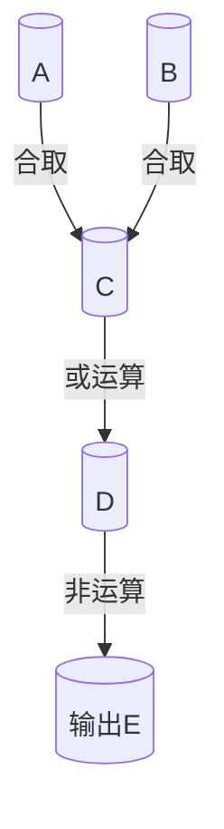
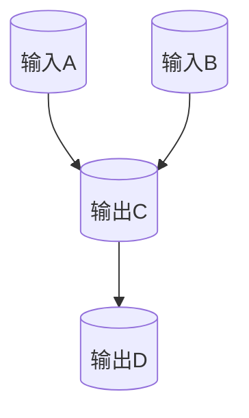
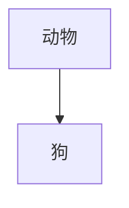
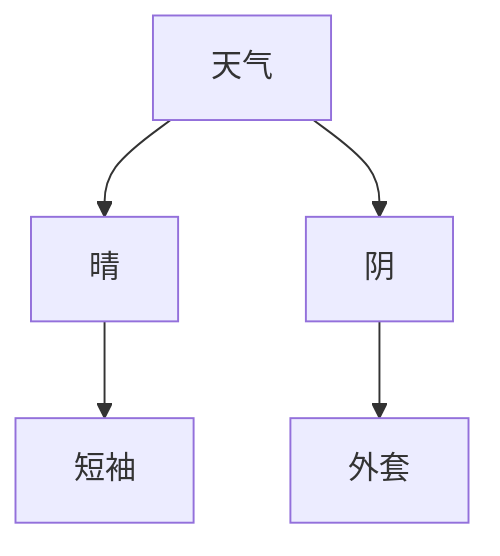

                 

### 目录

---

## 数理逻辑与人工智能推理系统

> 关键词：数理逻辑，人工智能，推理系统，命题逻辑，谓词逻辑，知识表示

> 摘要：本文将探讨数理逻辑在人工智能中的应用，从基础概念出发，逐步深入到推理系统的构建与应用，旨在揭示数理逻辑如何为人工智能提供强有力的推理支持。

---

### 第一部分：数理逻辑基础

#### 第1章：数理逻辑概述

#### 第2章：命题逻辑

#### 第3章：谓词逻辑

#### 第4章：数理逻辑的证明方法

---

### 第二部分：人工智能推理系统

#### 第5章：人工智能推理系统的概述

#### 第6章：知识表示与推理

#### 第7章：基于规则的推理系统

#### 第8章：基于框架的推理系统

---

### 第三部分：数理逻辑与人工智能推理系统的应用

#### 第9章：数理逻辑在人工智能中的应用

#### 第10章：人工智能推理系统的实际应用案例

---

### 附录

#### A. 数学公式和符号表

#### B. 算法流程图和代码示例

#### C. 拓展阅读

---

## 第1章：数理逻辑概述

### 1.1 数理逻辑的起源与发展

数理逻辑（Mathematical Logic）起源于19世纪末，随着数学分析、集合论和数学哲学的发展，逐步形成了独立的学科。数理逻辑的奠基人包括布尔（George Boole）、弗雷格（Gottlob Frege）和罗素（Bertrand Russell）等。布尔提出了布尔代数，弗雷格创立了命题演算和谓词演算，而罗素则通过《数学原理》一书，将逻辑应用于数学基础的构建。

在20世纪，数理逻辑得到了迅速发展，不仅丰富了理论体系，还广泛应用于计算机科学、人工智能、逻辑学等多个领域。特别是随着计算机科学的兴起，数理逻辑在形式化方法、程序验证、自动化推理等方面发挥了重要作用。

### 1.2 数理逻辑的基本概念

数理逻辑研究的是符号语言、形式推理和逻辑结构。其主要研究对象包括命题、谓词、逻辑运算、推理规则等。

- **命题**：命题是可以判断为真或假的陈述句。例如，“今天晴天”是一个命题。
  
- **谓词**：谓词是一个表示性质或关系的词。例如，“是红色的”是一个谓词。

- **逻辑运算**：逻辑运算包括合取（AND）、析取（OR）、非（NOT）等。例如，命题“p且q”表示p和q同时为真。

- **推理规则**：推理规则是从已知的前提推导出新结论的规则。例如，命题“如果下雨，那么地面湿”是一个前提，结论“地面湿”则是通过推理规则得出的。

### 1.3 数理逻辑的基本符号

在数理逻辑中，常用的符号包括：

- **命题符号**：如p，q，r等，用于表示命题。
  
- **谓词符号**：如R，S，T等，用于表示谓词。
  
- **逻辑运算符**：如∧（合取），∨（析取），¬（非）等。

- **量词**：如∀（全称量词），∃（存在量词）等。

- **逻辑连接词**：如→（蕴含），↔（等价）等。

### 1.4 数理逻辑的应用领域

数理逻辑在多个领域有着广泛的应用：

- **计算机科学**：形式化方法、程序验证、自动化推理、人工智能等。
  
- **数学**：数学基础的构建、公理系统、数学证明等。

- **逻辑学**：形式逻辑、模态逻辑、直觉逻辑等。

- **哲学**：语言哲学、认知科学、伦理学等。

---

在接下来的章节中，我们将进一步深入探讨命题逻辑、谓词逻辑和数理逻辑的证明方法，为后续人工智能推理系统的构建打下坚实的基础。

## 第2章：命题逻辑

### 2.1 命题逻辑的基本原理

命题逻辑（Propositional Logic）是数理逻辑的基础部分，主要研究命题的真假关系及其推理规则。在命题逻辑中，命题是最基本的概念，其真假性是唯一的属性。

#### 命题的定义

命题是一个陈述句，它可以明确地判断为真或假。例如，“太阳从东方升起”是一个命题，它被普遍认为是真的；而“猪会飞”则是一个命题，它被普遍认为是不真的。

#### 命题的表示

在命题逻辑中，我们通常使用小写字母（如p, q, r等）来表示命题。例如，p表示“今天下雨”，q表示“明天晴天”，r表示“我去旅行”。

#### 命题的真假值

命题的真假值是二元的，即一个命题要么是真的，要么是假的。在实际应用中，我们可以通过实验、观察或逻辑推理来确定命题的真假值。

#### 命题之间的逻辑关系

在命题逻辑中，命题之间存在着多种逻辑关系，如合取（AND），析取（OR），蕴含（IMPLIES），等价（EQUIVALENT）等。

- **合取（AND）**：命题p和q的合取表示为p ∧ q，只有当p和q都为真时，合取命题才为真。

  $$ p ∧ q \text{ 为真当且仅当 } p \text{ 和 } q \text{ 都为真。} $$

- **析取（OR）**：命题p和q的析取表示为p ∨ q，只要p或q其中之一为真，析取命题就为真。

  $$ p ∨ q \text{ 为真当且仅当 } p \text{ 或 } q \text{ 其中之一为真。} $$

- **蕴含（IMPLIES）**：命题p蕴含q表示为p → q，如果p为真则q也必须为真，否则蕴含命题为假。

  $$ p → q \text{ 为真当且仅当 } p \text{ 为真且 } q \text{ 也为真，或者 } p \text{ 为假。} $$

- **等价（EQUIVALENT）**：命题p等价于q表示为p ↔ q，当且仅当p和q具有相同的真假值。

  $$ p ↔ q \text{ 为真当且仅当 } p \text{ 和 } q \text{ 都为真，或者都为假。} $$

#### 命题逻辑的基本推理规则

在命题逻辑中，有多种推理规则可以帮助我们从已知的前提推导出新的结论。以下是几个常见的推理规则：

- **合取规则（Conjunction Rule）**：如果已知p和q都为真，则可以推出p ∧ q为真。

  $$ \text{如果 } p \text{ 为真且 } q \text{ 为真，则可以推出 } p ∧ q \text{ 为真。} $$

- **析取规则（Disjunction Rule）**：如果已知p为真，则可以推出p ∨ q为真。

  $$ \text{如果 } p \text{ 为真，则可以推出 } p ∨ q \text{ 为真，无论 } q \text{ 是真是假。} $$

- **蕴含规则（Implication Rule）**：如果已知p → q为真，则可以推出p为真。

  $$ \text{如果 } p → q \text{ 为真，则可以推出 } p \text{ 为真，无论 } q \text{ 是真是假。} $$

- **等价规则（Equivalence Rule）**：如果已知p ↔ q为真，则可以推出p和q具有相同的真假值。

  $$ \text{如果 } p ↔ q \text{ 为真，则可以推出 } p \text{ 和 } q \text{ 具有相同的真假值。} $$

#### 命题逻辑的真值表

为了更好地理解命题逻辑中的各种逻辑关系和推理规则，我们可以使用真值表（Truth Table）来列出不同命题组合下的真假值。

以下是合取、析取、蕴含和等价四种基本逻辑关系的真值表：

| p | q | p ∧ q | p ∨ q | p → q | p ↔ q |
|---|---|-------|-------|-------|-------|
| T | T |   T   |   T   |   T   |   T   |
| T | F |   F   |   T   |   F   |   F   |
| F | T |   F   |   T   |   T   |   F   |
| F | F |   F   |   F   |   T   |   T   |

通过真值表，我们可以清晰地看到不同逻辑关系在命题为真或假时的真假值变化，这对于理解和应用命题逻辑非常重要。

### 2.2 命题逻辑的推理规则

在命题逻辑中，推理规则是核心概念，它帮助我们从一个或多个命题推导出新的命题。以下是一些常见的推理规则：

#### 合取规则（Conjunction Rule）

合取规则是指如果已知p和q都为真，则可以推出p ∧ q为真。

$$
\text{如果已知 } p \text{ 和 } q \text{ 都为真，则可以推出 } p ∧ q \text{ 为真。}
$$

#### 析取规则（Disjunction Rule）

析取规则是指如果已知p为真，则可以推出p ∨ q为真，无论q的真假。

$$
\text{如果已知 } p \text{ 为真，则可以推出 } p ∨ q \text{ 为真，无论 } q \text{ 是真是假。}
$$

#### 蕴含规则（Implication Rule）

蕴含规则是指如果已知p → q为真，则可以推出p为真，无论q的真假。

$$
\text{如果已知 } p → q \text{ 为真，则可以推出 } p \text{ 为真，无论 } q \text{ 是真是假。}
$$

#### 等价规则（Equivalence Rule）

等价规则是指如果已知p ↔ q为真，则可以推出p和q具有相同的真假值。

$$
\text{如果已知 } p ↔ q \text{ 为真，则可以推出 } p \text{ 和 } q \text{ 具有相同的真假值。}
$$

#### 条件推理（Conditional Proof）

条件推理是一种特殊的推理规则，它允许我们在假设某个命题为真的条件下，推导出另一个命题。

$$
\text{假设 } p \text{ 为真，则可以推导出 } q \text{，即 } p \rightarrow q。
$$

#### 反证法（Reductio Ad Absurdum）

反证法是一种通过假设命题的否定，然后推导出矛盾，从而证明原命题为真的方法。

$$
\text{假设 } p \text{ 的否定 } ¬p \text{ 为真，推导出矛盾，从而证明 } p \text{ 为真。}
$$

#### 假言推理（Modus Ponens）

假言推理是一种从假言命题和前件出发，推导出后件的推理方法。

$$
\text{如果已知 } p \rightarrow q \text{ 和 } p \text{ 都为真，则可以推导出 } q \text{ 为真。}
$$

#### 假言否定（Modus Tollens）

假言否定是一种从假言命题和后件的否定，推导出前件的否定。

$$
\text{如果已知 } p \rightarrow q \text{ 和 } ¬q \text{ 都为真，则可以推导出 } ¬p \text{ 为真。}
$$

通过以上推理规则，我们可以更有效地进行逻辑推理，从而从已知的前提推导出新的结论。这些规则在命题逻辑中的应用非常广泛，是构建复杂推理系统的基础。

### 2.3 命题逻辑的应用

命题逻辑在计算机科学和人工智能中有着广泛的应用。以下是一些具体的实例：

#### 在编程语言中的应用

在编程语言中，命题逻辑被广泛应用于条件语句和循环语句的构建。例如，在Python中，`if`语句和`while`循环都是基于命题逻辑的。

```python
# Python中的条件语句示例
if x > 0:
    print("x 是正数。")
else:
    print("x 是非正数。")

# Python中的循环语句示例
while x != 0:
    print("x 还不是零。")
    x = x - 1
```

在这些示例中，条件表达式和循环条件都是命题逻辑的表达。

#### 在形式验证中的应用

在形式验证中，命题逻辑用于验证程序的正确性和安全性。例如，在自动程序验证工具中，命题逻辑被用于检查程序是否满足指定的属性。

```python
# 伪代码：自动验证程序是否不产生死锁
if (所有进程都进入临界区) ∧ (所有进程都离开临界区):
    系统没有死锁。
else:
    系统可能存在死锁。
```

在这个示例中，命题逻辑帮助我们定义了一个死锁检测的逻辑条件。

#### 在逻辑电路设计中的应用

在逻辑电路设计中，命题逻辑被用于构建和验证逻辑电路的行为。例如，在数字电路中，逻辑门和组合逻辑电路都是基于命题逻辑构建的。



在这个Mermaid流程图中，我们定义了一个简单的逻辑电路，它基于命题逻辑的合取、析取和非运算。

#### 在人工智能推理中的应用

在人工智能推理中，命题逻辑被用于构建推理系统，帮助机器从已知的前提推导出新的结论。例如，在自然语言处理中，命题逻辑可以帮助机器理解文本中的逻辑关系和语义。

```python
# 伪代码：命题逻辑推理示例
前提1: p ∧ q
前提2: ¬q
结论: ¬p

# 推理过程
if (p ∧ q) ∧ ¬q:
    ¬p
```

在这个示例中，通过命题逻辑的推理，我们从一个前提和另一个前提的否定推导出了结论。

通过这些应用实例，我们可以看到命题逻辑在计算机科学和人工智能中的重要性和广泛应用。它是构建复杂推理系统和解决实际问题的基础。

### 2.4 命题逻辑与谓词逻辑的关系

命题逻辑（Propositional Logic）和谓词逻辑（Predicate Logic）是数理逻辑的两个重要分支，它们在形式上有所不同，但在本质上是互补的。

#### 命题逻辑的局限性

命题逻辑主要研究命题的真假关系，但在处理复杂的关系和量化问题时存在一定的局限性。例如，命题逻辑无法表达“所有学生都是年轻人”或“存在一个最大的自然数”这类涉及个体和集合的命题。

#### 谓词逻辑的优势

谓词逻辑通过引入谓词和量词，可以更灵活地表示复杂的关系和量化命题。谓词逻辑允许我们用符号表示“所有”、“存在”等概念，从而可以更准确地描述现实世界中的情况。

#### 谓词逻辑的基本概念

- **谓词**：谓词是表示性质或关系的符号，如“是红色的”，“大于”等。

- **个体**：个体是谓词的个体实例，如“这个苹果是红色的”，“2大于1”等。

- **量词**：量词用于表示个体在集合中的存在或全称，如全称量词“∀”和存在量词“∃”。

#### 命题逻辑与谓词逻辑的转换

虽然命题逻辑和谓词逻辑在形式上有所不同，但它们之间存在一定的转换关系。例如，谓词逻辑中的量化命题可以转换为命题逻辑中的复合命题。

$$
∀x(P(x) ∧ Q(x)) \leftrightarrow (\forall xP(x)) ∧ (\forall xQ(x))
$$

$$
∃x(P(x) ∧ Q(x)) \leftrightarrow (\exists xP(x)) ∧ (\exists xQ(x))
$$

通过这些转换，我们可以将复杂的谓词逻辑命题转化为命题逻辑命题，从而使用命题逻辑的推理规则进行推理。

#### 综合应用

在人工智能和形式化推理中，命题逻辑和谓词逻辑经常结合使用。例如，在知识表示和推理中，谓词逻辑可以用来表示知识，而命题逻辑可以用来处理知识之间的逻辑关系。

通过理解和应用命题逻辑与谓词逻辑的关系，我们可以更有效地构建复杂的推理系统，为人工智能的发展提供强有力的逻辑支持。

### 小结

本章我们介绍了命题逻辑的基本原理、推理规则和应用。命题逻辑是数理逻辑的基础，它在计算机科学和人工智能中有着广泛的应用。通过命题逻辑，我们可以理解命题的真假关系，构建复杂的推理系统，并在实际问题中应用这些推理规则。下一章，我们将深入探讨谓词逻辑，进一步扩展我们的逻辑推理能力。

## 第3章：谓词逻辑

### 3.1 谓词逻辑的基本概念

谓词逻辑（Predicate Logic）是数理逻辑中的一个重要分支，它引入了谓词和量词的概念，能够表达更加复杂的关系和量化命题。谓词逻辑相对于命题逻辑来说，更加强大和灵活，可以处理包含个体和集合的命题。

#### 谓词

谓词是表示性质或关系的符号。它通常是一个带有变量的表达式，用来描述个体或集合的性质。例如，“x是红色的”，“大于”，“学生”等都是谓词。在谓词逻辑中，谓词通常用大写字母表示，如P, Q, R等。

- **原子谓词**：无法再分解的谓词，如“是人”，“大于”等。

- **复合谓词**：由原子谓词通过逻辑运算组合而成的谓词，如“P ∧ Q”，“P ∨ Q”等。

#### 个体

个体是谓词的个体实例，可以看作是谓词的具体实现。例如，在谓词“x是红色的”中，具体的一个红色的苹果就是一个个体。

#### 量词

量词用于表示个体在集合中的存在或全称。在谓词逻辑中，主要有两种量词：全称量词（Universal Quantifier）和存在量词（Existential Quantifier）。

- **全称量词（∀）**：表示对所有个体都成立的命题。例如，“∀xP(x)”表示对所有个体x，P(x)都成立。

- **存在量词（∃）**：表示存在至少一个个体使命题成立的命题。例如，“∃xP(x)”表示存在至少一个个体x，使得P(x)成立。

#### 谓词逻辑表达式

谓词逻辑表达式是由谓词、变量、量词和逻辑运算符组成的。常见的谓词逻辑表达式包括：

- **谓词表达式**：如P(x)，表示x具有性质P。

- **量化表达式**：如∀xP(x)和∃xP(x)，表示对所有个体或存在至少一个个体具有性质P。

- **复合表达式**：由谓词、量词和逻辑运算符组合而成的表达式，如P ∧ Q，∃x(P ∧ R(x))等。

#### 谓词逻辑与命题逻辑的关系

谓词逻辑是命题逻辑的扩展，它引入了谓词和量词的概念，可以表达命题逻辑无法处理的复杂关系。命题逻辑中的命题可以看作是谓词逻辑中的原子谓词。谓词逻辑通过引入量词，可以处理量化命题，如“所有学生都是年轻人”或“存在一个最大的自然数”。

### 3.2 谓词逻辑的推理方法

谓词逻辑提供了多种推理方法，帮助我们从一个或多个前提推导出新的结论。以下是一些常见的推理方法：

#### 直接推理（Direct Proof）

直接推理是从已知的前提直接推导出结论的方法。常见的直接推理方法包括：

- **全称实例化（Universal Instantiation）**：从全称量词命题推导出具体个体的命题。例如，如果已知“∀xP(x)”，则可以推导出“P(a)”，其中a是任意个体。

- **存在实例化（Existential Instantiation）**：从存在量词命题推导出具体个体的命题。例如，如果已知“∃xP(x)”，则可以推导出“P(a)”，其中a是使得P(x)成立的个体。

#### 逆否推理（Modus Tollens）

逆否推理是从否定结论推导出否定前提的方法。逆否推理规则可以表述为：

- **命题形式**：如果P → Q为真，则¬Q → ¬P也为真。

- **证明方法**：已知P → Q和¬Q，需要证明¬P。通过逆否推理，我们可以推导出¬P。

#### 存在证明（Existential Proof）

存在证明是从一般性结论推导出存在性结论的方法。存在证明的典型形式是：

- **命题形式**：已知∀xP(x)，需要证明∃xQ(x)。

- **证明方法**：通过实例化全称量词命题，找到一个具体的个体使得Q(x)成立，从而证明存在这样的个体。

#### 反证法（Reductio Ad Absurdum）

反证法是通过假设命题的否定，然后推导出矛盾，从而证明原命题为真的方法。反证法的典型形式是：

- **命题形式**：已知P，需要证明¬Q。

- **证明方法**：假设¬P，通过推理得出一个矛盾的结论，从而证明原命题P为真。

#### 谓词逻辑的证明规则

谓词逻辑的证明规则是推理方法的形式化表示，包括全称实例化、存在实例化、逆否推理和反证法等。

- **全称实例化**：如果已知∀xP(x)，则可以推导出P(a)，其中a是任意个体。

- **存在实例化**：如果已知∃xP(x)，则可以推导出P(a)，其中a是使得P(x)成立的个体。

- **逆否推理**：如果已知P → Q和¬Q，则可以推导出¬P。

- **反证法**：如果已知P和¬Q，假设¬P，通过推理得出一个矛盾的结论，则可以证明P。

通过这些推理方法，我们可以从已知的前提推导出新的结论，解决复杂的逻辑问题。

### 3.3 谓词逻辑的应用

谓词逻辑在计算机科学和人工智能中有着广泛的应用，以下是一些具体的实例：

#### 在知识表示中的应用

谓词逻辑是知识表示的重要工具，它可以帮助我们表示复杂的关系和事实。例如，在语义网络中，谓词逻辑用于表示实体和属性之间的关系。

```mermaid
graph TB
A[学生](class:important1) --> B[张三](class:important2)
A --> C[年龄](class:important1)
B --> D[20](class:important2)
```

在这个Mermaid流程图中，我们用谓词逻辑表示了“张三是一个学生，年龄是20岁”。

#### 在逻辑推理中的应用

谓词逻辑在逻辑推理中有着广泛的应用，它可以用来构建复杂的推理系统，从已知的前提推导出新的结论。例如，在自然语言处理中，谓词逻辑用于分析句子结构，提取语义信息。

```python
# 伪代码：谓词逻辑推理示例
前提1: ∃x(P(x) ∧ Q(x))
前提2: ∀x(P(x) → R(x))
结论: ∃x(R(x))

# 推理过程
if (∃x(P(x) ∧ Q(x))) ∧ (∀x(P(x) → R(x))):
    ∃x(R(x))
```

在这个示例中，通过谓词逻辑的推理，我们从两个前提推导出了结论。

#### 在程序验证中的应用

谓词逻辑在程序验证中用于验证程序的正确性和安全性。例如，在模型检查中，谓词逻辑用于检查程序是否满足指定的逻辑属性。

```mermaid
graph TB
P[程序]
A[安全状态](class:important1)
B[不安全状态](class:important2)
P --> A
P --> B
```

在这个Mermaid流程图中，我们用谓词逻辑表示了程序的安全状态和不安全状态，通过模型检查工具可以验证程序是否满足指定的安全属性。

#### 在人工智能中的应用

谓词逻辑在人工智能中用于构建知识表示和推理系统，帮助机器理解和处理复杂的信息。例如，在专家系统中，谓词逻辑用于表示专家知识和推理规则。

```python
# 伪代码：专家系统示例
知识库:
    if (温度 > 30) ∧ (湿度 > 70):
        条件1: 打开空调
    if (温度 < 10) ∧ (湿度 < 50):
        条件2: 打开暖气

推理机:
    当前温度为25度，湿度为60度
    结论: 不需要调整温度

# 推理过程
if (温度 > 30) ∧ (湿度 > 70):
    打开空调
elif (温度 < 10) ∧ (湿度 < 50):
    打开暖气
else:
    不需要调整温度
```

在这个示例中，谓词逻辑用于构建专家系统的知识库和推理机，帮助机器根据环境条件做出合理的决策。

#### 在逻辑电路设计中的应用

谓词逻辑在逻辑电路设计中也得到了应用，它可以帮助我们验证电路的行为是否符合设计要求。例如，在数字电路中，谓词逻辑用于描述逻辑门的行为。



在这个Mermaid流程图中，我们用谓词逻辑描述了一个简单的逻辑电路，它由两个输入和两个输出组成。

通过这些应用实例，我们可以看到谓词逻辑在计算机科学和人工智能中的重要性和广泛应用。它是构建复杂推理系统和解决实际问题的关键工具。

### 3.4 谓词逻辑与数理逻辑的关系

谓词逻辑是数理逻辑的重要组成部分，它在数理逻辑的基础上扩展了表示能力和推理方法。谓词逻辑与数理逻辑之间存在着紧密的联系和互补关系。

#### 谓词逻辑在数理逻辑中的应用

谓词逻辑广泛应用于数理逻辑的各个领域，包括知识表示、推理、程序验证和数学基础等。在数理逻辑中，谓词逻辑用于表达复杂的命题和量化关系，增强逻辑推理的能力。

#### 数理逻辑对谓词逻辑的补充

数理逻辑提供了谓词逻辑的理论基础和证明方法，使得谓词逻辑的推理过程更加严谨和系统。数理逻辑的证明理论和方法可以帮助我们验证谓词逻辑推理的正确性，确保推理结果的可靠性。

#### 谓词逻辑与命题逻辑的比较

谓词逻辑相对于命题逻辑来说，具有更强的表达能力和推理能力。命题逻辑主要处理简单的命题和逻辑关系，而谓词逻辑可以处理包含个体和集合的复杂命题。谓词逻辑通过引入量词和谓词，能够更准确地描述现实世界中的情况。

#### 综合应用

在实际应用中，谓词逻辑和命题逻辑经常结合使用。谓词逻辑用于处理复杂的逻辑关系和量化命题，而命题逻辑则用于简化推理过程和表达简单的逻辑关系。通过结合两者的优势，我们可以构建更加复杂和高效的推理系统。

通过理解和应用谓词逻辑与数理逻辑的关系，我们可以更有效地进行逻辑推理和知识表示，为人工智能和计算机科学的发展提供强有力的逻辑支持。

### 小结

本章我们介绍了谓词逻辑的基本概念、推理方法和应用。谓词逻辑通过引入谓词和量词，能够处理更加复杂的命题和量化关系，是数理逻辑中的重要组成部分。通过谓词逻辑，我们可以构建复杂的推理系统，解决实际问题，为人工智能的发展提供强有力的逻辑支持。下一章，我们将探讨数理逻辑的证明方法，进一步深入理解逻辑推理的过程。

## 第4章：数理逻辑的证明方法

### 4.1 形式证明的基本概念

形式证明（Formal Proof）是数理逻辑中用于验证命题正确性的方法。形式证明通过一系列逻辑推理规则，从一个或多个前提推导出结论，确保推理过程的严谨性和结论的可靠性。形式证明的基本概念包括证明对象、证明规则和证明方法。

#### 证明对象

证明对象是数理逻辑中的命题，它们可以是原子命题、复合命题或量化命题。原子命题是最基本的命题，例如“2+2=4”；复合命题是由基本命题通过逻辑运算符组合而成的，例如“p ∧ q”或“¬p ∨ q”；量化命题涉及个体和集合的关系，例如“∀xP(x)”或“∃xP(x)”。

#### 证明规则

证明规则是形式证明的基本工具，用于从一个或多个前提推导出新的命题。常见的证明规则包括：

- **合取规则（Conjunction Rule）**：如果已知p和q都为真，则可以推出p ∧ q为真。

- **析取规则（Disjunction Rule）**：如果已知p为真，则可以推出p ∨ q为真，无论q的真假。

- **蕴含规则（Implication Rule）**：如果已知p → q为真，则可以推出p为真，无论q的真假。

- **等价规则（Equivalence Rule）**：如果已知p ↔ q为真，则可以推出p和q具有相同的真假值。

#### 证明方法

形式证明的方法主要包括直接证明、间接证明和反证法等。

- **直接证明（Direct Proof）**：从已知的前提直接推导出结论的方法。常见的直接证明方法包括合取规则、析取规则和蕴含规则。

- **间接证明（Indirect Proof）**：通过假设命题的否定，然后推导出矛盾，从而证明原命题为真的方法。常见的间接证明方法包括反证法和逆否推理。

- **反证法（Reductio Ad Absurdum）**：通过假设命题的否定，然后推导出矛盾，从而证明原命题为真的方法。

### 4.2 形式证明的方法与技巧

形式证明的方法和技巧是确保推理过程严谨和结论可靠的关键。以下是一些常用的证明方法和技巧：

#### 证明归纳法

证明归纳法是一种常用的证明方法，用于证明一个命题对所有自然数都成立。证明归纳法包括两个步骤：

- **基础步骤**：证明当n取最小值（通常是1）时，命题成立。

- **归纳步骤**：假设当n=k时，命题成立，然后证明当n=k+1时，命题也成立。

通过基础步骤和归纳步骤，我们可以证明一个命题对所有自然数都成立。

#### 证明的构造法

证明的构造法是一种通过构造一个反例来证明命题不成立的方法。构造反例的关键是找到一个具体的实例，使得命题不成立。如果成功构造了反例，则命题被证明为假。

#### 证明的消解法

证明的消解法是一种通过将复合命题分解为简单命题，然后分别证明简单命题的方法。消解法常用于复杂命题的证明，通过将命题分解为更简单的部分，可以简化证明过程。

#### 证明的转化法

证明的转化法是一种通过将命题转换为等价命题进行证明的方法。等价转换可以帮助我们简化证明过程，使得证明更加直观和容易。

#### 证明的表格法

证明的表格法是一种通过构造真值表来证明命题的方法。真值表列出了所有可能的命题组合及其真假值，通过分析真值表，我们可以判断命题的真假。

### 4.3 形式证明的应用

形式证明在计算机科学和人工智能中有着广泛的应用。以下是一些具体的应用实例：

#### 在程序验证中的应用

形式证明在程序验证中用于验证程序的正确性。通过形式证明，我们可以确保程序满足指定的逻辑属性，避免潜在的漏洞和错误。

```mermaid
graph TB
P[程序]
A[初始状态]
B[中间状态](class:important1)
C[最终状态](class:important2)
P --> A
A --> B
B --> C
```

在这个流程图中，我们使用形式证明来验证程序从初始状态到最终状态是否满足指定的逻辑属性。

#### 在模型检查中的应用

模型检查是一种形式化验证方法，用于检查系统是否满足指定的逻辑属性。形式证明在模型检查中用于验证系统的行为是否满足指定条件。

```mermaid
graph TB
S[系统状态]
A[安全状态](class:important1)
B[不安全状态](class:important2)
S --> A
S --> B
```

在这个流程图中，我们使用形式证明来验证系统状态是否满足安全属性。

#### 在知识表示和推理中的应用

形式证明在知识表示和推理中用于验证知识的正确性和推理的有效性。通过形式证明，我们可以确保推理过程符合逻辑规则，避免错误的推理结果。

```python
# 伪代码：知识表示和推理验证示例
知识库:
    if (温度 > 30) ∧ (湿度 > 70):
        条件1: 打开空调
    if (温度 < 10) ∧ (湿度 < 50):
        条件2: 打开暖气

推理机:
    当前温度为25度，湿度为60度
    结论: 不需要调整温度

# 形式证明
if (∃x(Temperature(x) ∧ Humidity(x))):
    if (Temperature(25) ∧ Humidity(60)):
        不需要调整温度
```

在这个示例中，我们使用形式证明来验证推理机给出的结论是否符合知识库中的规则。

#### 在逻辑电路设计中的应用

形式证明在逻辑电路设计中用于验证电路的行为是否符合设计要求。通过形式证明，我们可以确保逻辑电路的输出满足预期的逻辑关系。


在这个流程图中，我们使用形式证明来验证逻辑电路的输出是否满足预期的逻辑关系。

通过这些应用实例，我们可以看到形式证明在计算机科学和人工智能中的重要性和广泛应用。它是确保逻辑推理和系统设计正确性的关键工具。

### 小结

本章我们介绍了形式证明的基本概念、方法和应用。形式证明通过严谨的逻辑推理规则，确保推理过程的正确性和结论的可靠性。形式证明在计算机科学和人工智能中有着广泛的应用，包括程序验证、模型检查、知识表示和推理、逻辑电路设计等。通过形式证明，我们可以确保系统设计和推理过程的正确性，为人工智能的发展提供强有力的逻辑支持。下一章，我们将探讨人工智能推理系统的概述，为后续内容打下基础。

## 第5章：人工智能推理系统的概述

### 5.1 人工智能推理系统的概念

人工智能推理系统（Artificial Intelligence Reasoning Systems）是人工智能领域中的重要组成部分，它通过模拟人类的思维过程，对信息进行逻辑分析和推理，以实现智能决策和问题求解。推理系统在知识表示、知识发现、自然语言处理、智能搜索、智能控制等多个领域有着广泛的应用。

#### 推理的定义

推理（Reasoning）是指从已知的信息出发，通过逻辑分析和推导，得出新的结论或预测的过程。推理可以分为两大类：演绎推理和归纳推理。

- **演绎推理（Deductive Reasoning）**：从一般到个别的推理过程，即从已知的前提出发，推导出特定结论。例如，所有人都会死亡，苏格拉底是人，因此苏格拉底会死亡。

- **归纳推理（Inductive Reasoning）**：从个别到一般的推理过程，即从特定的实例出发，推导出一般性的规律或结论。例如，观察许多天鹅都是白色的，因此推断所有天鹅都是白色的。

#### 推理系统的组成

一个典型的推理系统通常包括以下几个组成部分：

- **知识库（Knowledge Base）**：存储领域知识和事实的数据结构，是推理系统的核心。

- **推理机（Inference Engine）**：负责执行推理过程的模块，根据已有的事实和规则，推导出新的结论。

- **解释器（Interpreter）**：解释用户输入的问题，并将其转换为推理系统可以理解的形式。

- **用户接口（User Interface）**：与用户交互的界面，接收用户输入，展示推理结果。

#### 推理系统的分类

根据推理方式和应用领域，推理系统可以分为以下几种类型：

- **基于规则的推理系统（Rule-Based Reasoning Systems）**：使用一组预先定义的规则，从已知的事实推导出新的事实。例如，专家系统。

- **基于模型的推理系统（Model-Based Reasoning Systems）**：通过建立领域模型，对模型进行推理，以发现新的事实或关系。例如，基于物理模型的推理系统。

- **基于统计的推理系统（Statistical Reasoning Systems）**：使用统计学方法，从大量数据中提取规律，进行推理和预测。例如，机器学习模型。

- **基于神经网络的推理系统（Neural Network-Based Reasoning Systems）**：使用神经网络模型，通过学习输入和输出之间的关系，进行推理和分类。例如，深度学习模型。

### 5.2 人工智能推理系统的发展历程

人工智能推理系统的发展历程可以分为以下几个阶段：

#### 第一阶段：基于规则的推理系统

20世纪50年代至70年代，人工智能推理系统主要基于规则。这些系统通过定义一组逻辑规则，从已知的事实推导出新的事实。例如，专家系统（Expert Systems）是这一阶段的代表性成果。专家系统通过模拟人类专家的推理过程，解决特定领域的复杂问题。

#### 第二阶段：基于模型的推理系统

20世纪70年代至90年代，人工智能推理系统开始转向基于模型的方法。这些系统通过建立领域模型，对模型进行推理，以发现新的事实或关系。例如，基于物理模型的推理系统、基于语义网络的推理系统等。

#### 第三阶段：基于统计的推理系统

20世纪90年代至今，人工智能推理系统逐渐转向基于统计的方法。这些系统通过学习大量数据，提取规律，进行推理和预测。例如，机器学习模型、深度学习模型等。这一阶段的发展推动了人工智能在图像识别、自然语言处理、推荐系统等领域的应用。

### 5.3 人工智能推理系统的分类

根据推理方法和应用领域，人工智能推理系统可以分为以下几类：

#### 基于规则的推理系统

基于规则的推理系统是最早发展起来的人工智能推理系统。这类系统通过定义一组逻辑规则，从已知的事实推导出新的事实。规则通常采用“如果…那么…”的形式，如：

- **条件规则**：如果当前温度大于30度且湿度大于70度，那么需要打开空调。
- **前提规则**：当前温度是35度，湿度是75度。
- **结论规则**：需要打开空调。

基于规则的推理系统在医疗诊断、财务规划、法律咨询等领域有着广泛的应用。

#### 基于模型的推理系统

基于模型的推理系统通过建立领域模型，对模型进行推理，以发现新的事实或关系。这类系统通常采用概率模型、统计模型、物理模型等方法。例如：

- **概率模型**：贝叶斯网络是一种常用的概率模型，可以表示变量之间的依赖关系。通过贝叶斯网络，可以推理出变量之间的概率分布。
- **统计模型**：线性回归、逻辑回归等统计模型可以用于预测变量之间的关系。通过训练模型，可以从数据中提取规律，进行推理。
- **物理模型**：基于物理定律和原理，可以建立物理模型，对系统进行推理。例如，基于牛顿定律的推理系统可以用于模拟物体的运动。

基于模型的推理系统在智能搜索、知识发现、机器人控制等领域有着广泛的应用。

#### 基于统计的推理系统

基于统计的推理系统通过学习大量数据，提取规律，进行推理和预测。这类系统主要包括机器学习和深度学习模型。例如：

- **机器学习模型**：决策树、支持向量机、随机森林等模型可以通过学习数据，提取特征，进行分类和回归。
- **深度学习模型**：卷积神经网络、循环神经网络、生成对抗网络等模型可以通过多层神经网络，自动提取特征，进行复杂任务的处理。

基于统计的推理系统在图像识别、语音识别、自然语言处理等领域取得了显著成果。

#### 基于神经网络的推理系统

基于神经网络的推理系统通过模拟人脑神经网络，进行推理和决策。这类系统主要包括卷积神经网络（CNN）、循环神经网络（RNN）、深度神经网络（DNN）等。例如：

- **卷积神经网络**：用于处理图像数据，提取空间特征，进行图像分类和识别。
- **循环神经网络**：用于处理序列数据，提取时间特征，进行语音识别、自然语言处理等。
- **深度神经网络**：用于处理大规模数据，自动提取复杂特征，进行分类、回归等任务。

基于神经网络的推理系统在计算机视觉、语音识别、自然语言处理等领域取得了重大突破。

通过以上分类，我们可以看到人工智能推理系统在方法和应用上的多样性。不同类型的推理系统在各自的领域内发挥着重要作用，为人工智能的发展提供了强有力的支持。

### 5.4 人工智能推理系统的基本架构

一个典型的人工智能推理系统通常包括以下几个基本组成部分：

#### 知识库

知识库是推理系统的核心，用于存储领域知识和事实。知识库中的知识可以包括事实、规则、模型等。例如，在医疗诊断系统中，知识库可以包含疾病的症状、治疗方法、患者信息等。

#### 推理机

推理机是推理系统的核心模块，负责根据知识库中的知识，执行推理过程，推导出新的结论。推理机可以采用不同的推理算法，如基于规则的推理、基于模型的推理、基于统计的推理等。

#### 用户接口

用户接口是推理系统与用户之间的交互界面，用于接收用户输入，展示推理结果。用户接口可以采用图形界面、命令行界面、Web界面等形式。

#### 数据处理模块

数据处理模块负责对输入的数据进行预处理，包括数据清洗、特征提取、数据归一化等。预处理后的数据可以用于训练模型、更新知识库等。

#### 模型库

模型库是推理系统中的另一个重要组成部分，用于存储各种推理模型。模型库中的模型可以是规则模型、统计模型、神经网络模型等。

#### 学习模块

学习模块负责对系统进行训练和优化，提高推理系统的性能。学习模块可以采用监督学习、无监督学习、增强学习等方法。

#### 辅助模块

辅助模块包括日志记录、错误处理、安全保障等，用于确保推理系统的稳定性和可靠性。

通过以上基本架构，人工智能推理系统可以高效地处理数据，进行推理和决策，为实际应用提供强有力的支持。

### 小结

本章我们介绍了人工智能推理系统的基本概念、发展历程、分类和基本架构。推理系统是人工智能领域的重要组成部分，它通过模拟人类的思维过程，对信息进行逻辑分析和推理，实现智能决策和问题求解。在接下来的章节中，我们将进一步探讨知识表示与推理、基于规则的推理系统和基于框架的推理系统，深入理解人工智能推理系统的构建和应用。

## 第6章：知识表示与推理

### 6.1 知识表示的基本方法

知识表示是人工智能推理系统的基础，它涉及如何将现实世界中的信息转换为计算机可以处理的形式。有效的知识表示方法可以增强系统的理解能力、推理能力和决策能力。以下是一些常用的知识表示方法：

#### 一阶谓词逻辑

一阶谓词逻辑是知识表示中最常用的方法之一。它通过引入谓词、个体和量词，能够表达复杂的领域知识。例如：

- **谓词**：表示属性或关系，如“是人”、“大于”等。
- **个体**：谓词的实例，如“苏格拉底”、“3”等。
- **量词**：表示全称量词（∀）和存在量词（∃），如“所有人都有生命”和“存在一个最大的自然数”。

一阶谓词逻辑的表达式可以表示为：

$$
\forall x P(x) \land \exists x Q(x)
$$

这意味着对所有个体x，P(x)为真，且存在一个个体x，使得Q(x)为真。

#### 语义网络

语义网络是一种基于图结构的知识表示方法，它通过节点和边来表示概念和它们之间的关系。例如，在语义网络中，我们可以表示“狗是动物”的关系，如下所示：



在语义网络中，节点表示概念，边表示概念之间的关系。通过这样的表示方法，可以方便地描述领域知识，并支持复杂的推理操作。

####产生式规则

产生式规则是一种基于“如果-那么”逻辑规则的知识表示方法。每个规则由一个条件部分和一个结论部分组成。例如：

- 如果天气是晴天，那么可以穿短袖。
- 如果考试成绩高于90分，那么可以获得奖学金。

产生式规则的格式通常为：

$$
\text{条件} \rightarrow \text{结论}
$$

产生式规则可以表示为如下形式：

```python
if 天气 is 晴天:
    穿上短袖()
if 考试成绩 > 90:
    获得奖学金()
```

#### 决策树

决策树是一种用于分类和预测的图形化表示方法。它通过一系列的判断节点和叶子节点来表示决策过程。每个判断节点表示一个条件测试，每个叶子节点表示一个分类或预测结果。例如：



在这个决策树中，如果天气是晴天，则选择穿短袖；如果天气是阴天，则选择穿外套。

#### 语义角色标注

语义角色标注是一种用于自然语言处理的知识表示方法，它通过标记句子中的名词和动词，以及它们之间的关系，来表示句子的语义。例如，在句子“小明给了小红一本书”中，小明是施事者，小红是受事者，书是客体。

```mermaid
graph TD
A[小明](subject) --> B[给]
B --> C[小红](object)
C --> D[一本书](object)
```

通过这些知识表示方法，我们可以将现实世界中的信息转化为计算机可以处理的形式，从而为推理系统提供有效的知识表示。

### 6.2 知识表示的语义分析

知识表示的语义分析是确保知识表示准确性和一致性的关键步骤。语义分析涉及到对知识表示中的概念、关系和规则进行深入理解和解释。以下是一些关键的语义分析步骤：

#### 概念分析

概念分析是对知识表示中的概念进行详细描述和理解。这包括确定概念的定义、属性、特征和关系。例如，在医疗领域，对“疾病”、“症状”、“治疗方法”等概念进行详细分析，以便准确表示领域知识。

#### 关系分析

关系分析是对知识表示中概念之间的关系进行理解和描述。这包括确定概念之间的联系、依赖性和层次结构。例如，在组织结构中，对“员工”、“部门”、“职位”等概念之间的关系进行详细分析，以便准确表示组织结构。

#### 规则分析

规则分析是对知识表示中的规则进行详细理解和解释。这包括确定规则的含义、条件和结论，以及它们在特定应用场景中的适用性。例如，在财务规则中，对“收入”、“支出”、“利润”等规则进行分析，以便准确表示财务状况。

#### 一致性分析

一致性分析是确保知识表示中概念、关系和规则之间的一致性和完整性。这包括检查知识表示中的逻辑冲突、冗余信息和矛盾点。例如，在知识库中，确保“疾病”和“症状”之间没有逻辑冲突，且所有症状都能对应到具体的疾病。

通过这些语义分析步骤，我们可以确保知识表示的准确性、一致性和可理解性，从而为推理系统提供高质量的知识基础。

### 6.3 推理算法与策略

推理算法和策略是推理系统的核心，它们决定了系统如何从已知的知识推导出新的结论。以下是一些常见的推理算法和策略：

#### 基于规则的推理

基于规则的推理是最常见的推理算法之一。它通过定义一组规则，从已知的事实推导出新的事实。常见的推理策略包括：

- **正向推理（Forward Chaining）**：从已知的事实出发，应用规则推导出新的结论。例如，如果已知“天气是晴天”和“晴天需要穿短袖”，则可以推导出“需要穿短袖”。

- **反向推理（Backward Chaining）**：从目标开始，逐步回溯到已知的事实，应用规则推导出新的结论。例如，如果目标是“需要穿短袖”，已知“晴天需要穿短袖”，则可以推导出“天气是晴天”。

#### 基于模型的推理

基于模型的推理通过建立领域模型，对模型进行推理，以发现新的事实或关系。常见的模型包括：

- **概率模型**：如贝叶斯网络，可以表示变量之间的概率关系。通过贝叶斯网络，可以推理出变量之间的条件概率。

- **统计模型**：如线性回归、逻辑回归，可以用于预测变量之间的关系。通过训练模型，可以从数据中提取规律，进行推理。

#### 基于统计的推理

基于统计的推理通过学习大量数据，提取规律，进行推理和预测。常见的算法包括：

- **机器学习算法**：如决策树、支持向量机、随机森林，可以用于分类和回归任务。

- **深度学习算法**：如卷积神经网络、循环神经网络、生成对抗网络，可以用于复杂任务的处理。

#### 知识图谱推理

知识图谱是一种结构化的知识表示方法，通过节点和边表示概念和关系。知识图谱推理通过图算法，如路径搜索、图遍历等，发现新的知识或关系。例如，在知识图谱中，可以推理出“苏格拉底是哲学家”的关系。

#### 混合推理

混合推理结合了基于规则、基于模型和基于统计的推理方法，以提高推理系统的灵活性和准确性。常见的混合推理策略包括：

- **规则驱动的推理**：首先使用规则进行初步推理，然后结合统计方法进行优化。

- **模型驱动的推理**：使用统计模型或神经网络模型进行推理，结合领域知识进行修正。

通过以上推理算法和策略，我们可以构建高效、准确的推理系统，为实际问题提供解决方案。

### 6.4 知识表示与推理的应用实例

知识表示与推理在多个领域有着广泛的应用，以下是一些具体的应用实例：

#### 医疗诊断

在医疗诊断中，知识表示与推理可以帮助医生进行诊断和治疗。例如，基于规则推理系统可以处理患者的症状和病史，推导出可能的诊断结果。基于统计模型的推理系统可以从大量医疗数据中提取规律，预测疾病的发生概率。例如，通过分析患者的症状、检查结果和病史，可以推导出可能的疾病，如“流感”、“肺炎”等。

#### 财务分析

在财务分析中，知识表示与推理可以帮助分析师进行风险评估和投资决策。例如，基于规则的推理系统可以处理公司的财务报表，推导出公司的财务状况。基于统计模型的推理系统可以从市场数据中提取规律，预测公司的股票价格。例如，通过分析公司的财务报表和市场数据，可以预测公司的盈利能力和市场表现。

#### 智能搜索

在智能搜索中，知识表示与推理可以帮助搜索引擎提供更准确、更相关的搜索结果。例如，基于知识图谱的推理系统可以处理用户的查询，理解查询的含义，提供相关的答案。例如，当用户查询“巴黎有哪些著名的景点”时，基于知识图谱的推理系统可以理解“巴黎”和“景点”的概念，提供巴黎的著名景点，如埃菲尔铁塔、卢浮宫等。

#### 机器人导航

在机器人导航中，知识表示与推理可以帮助机器人理解环境，做出合理的决策。例如，基于规则推理系统可以处理传感器的数据，推导出机器人的位置和方向。基于统计模型的推理系统可以从大量的导航数据中提取规律，预测机器人在不同环境中的行为。例如，通过分析传感器的数据和环境特征，可以推导出机器人的最佳导航路径，避免障碍物。

通过这些应用实例，我们可以看到知识表示与推理在各个领域的重要性和实际应用价值。知识表示与推理为人工智能系统提供了强大的逻辑分析和决策能力，为解决实际问题提供了有力支持。

### 小结

本章我们介绍了知识表示与推理的基本方法、语义分析、推理算法与策略，以及其在实际应用中的案例。知识表示与推理是人工智能推理系统的核心，通过有效的知识表示和推理策略，我们可以构建智能系统，解决复杂问题。在下一章中，我们将探讨基于规则的推理系统，进一步深入理解推理系统的构建和应用。

## 第7章：基于规则的推理系统

### 7.1 基于规则的推理系统的基本架构

基于规则的推理系统（Rule-Based Reasoning System）是一种常见的人工智能推理系统，它通过一组预定义的规则，从已知的事实推导出新的结论。这种系统的基本架构包括知识库、推理机、规则库和用户接口等组成部分。

#### 知识库

知识库是推理系统的核心组件，用于存储领域知识和事实。知识库中的知识可以是事实、规则、模型等。例如，在医疗诊断系统中，知识库可以包含疾病的症状、治疗方法、患者信息等。知识库通常采用数据库或知识图谱等形式进行组织和管理。

#### 推理机

推理机是推理系统的核心模块，负责执行推理过程。推理机根据知识库中的事实和规则，应用推理算法，推导出新的结论。推理机可以采用正向推理（Forward Chaining）或反向推理（Backward Chaining）等策略。正向推理从已知的事实出发，逐步推导出新的结论；反向推理从目标开始，逐步回溯到已知的事实。

#### 规则库

规则库是存储规则的地方，规则用于描述领域知识和推理过程。规则通常采用“如果-那么”的形式，如“如果天气是晴天，那么可以穿短袖”。规则库中的规则可以是条件规则、前提规则或结论规则。条件规则用于描述前提条件，前提规则用于描述已知的事实，结论规则用于描述推导出的新结论。

#### 用户接口

用户接口是推理系统与用户之间的交互界面，用于接收用户输入，展示推理结果。用户接口可以采用图形界面、命令行界面或Web界面等形式。用户接口的设计应考虑易用性和用户体验，以便用户能够方便地与系统进行交互。

#### 辅助模块

辅助模块包括数据预处理、规则学习、错误处理等，用于支持推理系统的正常运行。数据预处理模块负责对输入的数据进行清洗、归一化和特征提取等处理。规则学习模块负责从数据中自动提取规则，更新规则库。错误处理模块负责处理系统运行中的错误和异常情况，确保系统的稳定性和可靠性。

#### 推理过程

基于规则的推理系统的工作过程通常包括以下几个步骤：

1. **初始化**：加载知识库、规则库和用户接口，初始化系统状态。

2. **输入**：用户通过用户接口输入问题或数据，系统接收并预处理输入数据。

3. **匹配**：推理机根据输入数据，在知识库中查找匹配的规则。

4. **推理**：根据匹配到的规则，推理机应用推理算法，推导出新的结论。

5. **输出**：将推理结果通过用户接口展示给用户，或存储在知识库中，以备后续使用。

#### 推理算法

基于规则的推理系统常用的推理算法包括正向推理和反向推理。

- **正向推理（Forward Chaining）**：正向推理从已知的事实出发，逐步推导出新的结论。正向推理算法的主要步骤包括：
  - 初始化：初始化推理机，设置当前事实集。
  - 匹配：从当前事实集中选择一个事实，匹配规则的前提条件。
  - 应用规则：对匹配到的规则应用推理算法，推导出新的结论。
  - 更新事实集：将推导出的新结论添加到当前事实集中。
  - 重复：重复匹配、应用规则和更新事实集，直到无法匹配新的规则或达到目标。

- **反向推理（Backward Chaining）**：反向推理从目标开始，逐步回溯到已知的事实。反向推理算法的主要步骤包括：
  - 初始化：初始化推理机，设置当前目标集。
  - 匹配：从当前目标集中选择一个目标，匹配规则的前提条件。
  - 应用规则：对匹配到的规则应用推理算法，推导出新的前提条件。
  - 更新目标集：将推导出的新前提条件添加到当前目标集中。
  - 重复：重复匹配、应用规则和更新目标集，直到无法匹配新的规则或达到已知的事实。

通过以上基本架构和推理算法，基于规则的推理系统可以有效地处理领域知识，进行逻辑推理和决策，为实际问题提供解决方案。

### 7.2 基于规则的推理系统的实现方法

实现一个基于规则的推理系统需要考虑多个方面，包括规则表示、知识库管理、推理过程设计和用户接口实现。以下是一些具体的实现方法：

#### 规则表示

规则表示是构建基于规则的推理系统的第一步，常见的规则表示方法包括产生式规则、谓词逻辑规则和模糊规则等。

- **产生式规则**：产生式规则是最常见的规则表示方法，采用“如果-那么”的形式。例如：
  ```python
  if 温度 > 30 and 湿度 > 70:
      then 需要打开空调()
  ```
  这种规则表示方法简单直观，易于理解和实现。

- **谓词逻辑规则**：谓词逻辑规则采用谓词和量词来表示复杂的逻辑关系。例如：
  ```python
  if ∀x (Person(x) ∧ LivesIn(x, City)) → HasHouse(x):
      then FindHouse(City)
  ```
  这种规则表示方法可以处理复杂的领域知识，但实现起来相对复杂。

- **模糊规则**：模糊规则用于处理模糊性知识，采用模糊逻辑来表示不确定性。例如：
  ```python
  if 温度 is 非常热:
      then 需要喝冷饮()
  ```
  这种规则表示方法适用于处理模糊概念和不确定性问题。

#### 知识库管理

知识库管理是推理系统的核心组件，用于存储和管理领域知识。知识库可以采用数据库、文件系统或知识图谱等形式进行组织。

- **数据库**：使用关系型数据库（如MySQL、PostgreSQL）或图数据库（如Neo4j）来存储和管理知识库。数据库中的表或节点可以表示规则、事实和概念，关系可以表示概念之间的关系。例如，在关系型数据库中，可以创建“规则”、“事实”和“概念”三张表，分别存储规则、事实和概念的信息。

- **文件系统**：使用文件系统（如文本文件、XML文件、JSON文件）来存储和管理知识库。文件系统的优点是简单易用，但缺点是数据管理和查询效率较低。

- **知识图谱**：使用知识图谱来存储和管理复杂的知识结构，知识图谱中的节点表示概念，边表示概念之间的关系。知识图谱可以直观地表示领域知识，并支持高效的查询和推理操作。

#### 推理过程设计

推理过程设计是推理系统的核心，决定了系统如何从知识库中推导出新的事实和结论。常见的推理过程设计方法包括正向推理和反向推理。

- **正向推理（Forward Chaining）**：正向推理从已知的事实出发，逐步应用规则推导出新的结论。正向推理的关键步骤包括：
  - 初始化：初始化推理机，设置当前事实集。
  - 匹配：从当前事实集中选择一个事实，匹配规则的前提条件。
  - 应用规则：对匹配到的规则应用推理算法，推导出新的结论。
  - 更新事实集：将推导出的新结论添加到当前事实集中。
  - 重复：重复匹配、应用规则和更新事实集，直到无法匹配新的规则或达到目标。

- **反向推理（Backward Chaining）**：反向推理从目标开始，逐步回溯到已知的事实。反向推理的关键步骤包括：
  - 初始化：初始化推理机，设置当前目标集。
  - 匹配：从当前目标集中选择一个目标，匹配规则的前提条件。
  - 应用规则：对匹配到的规则应用推理算法，推导出新的前提条件。
  - 更新目标集：将推导出的新前提条件添加到当前目标集中。
  - 重复：重复匹配、应用规则和更新目标集，直到无法匹配新的规则或达到已知的事实。

#### 用户接口实现

用户接口是推理系统与用户之间的交互界面，用于接收用户输入，展示推理结果。用户接口可以采用图形界面、命令行界面或Web界面等形式。

- **图形界面**：使用图形界面库（如Tkinter、Qt）来构建用户界面。图形界面可以提供直观、易用的交互方式，但开发成本较高。

- **命令行界面**：使用命令行界面库（如 argparse、click）来构建用户界面。命令行界面简单易用，适用于自动化脚本和批处理操作。

- **Web界面**：使用Web框架（如 Flask、Django）来构建Web用户界面。Web界面可以提供跨平台、可扩展的交互方式，适用于在线应用和移动设备。

#### 代码示例

以下是一个简单的基于规则的推理系统的Python代码示例，采用正向推理策略：

```python
class RuleBasedReasoningSystem:
    def __init__(self):
        self.rules = []
        self.facts = []

    def add_rule(self, rule):
        self.rules.append(rule)

    def add_fact(self, fact):
        self.facts.append(fact)

    def forward_chaining(self):
        while True:
            new_facts = []
            for rule in self.rules:
                if rule.is_matched(self.facts):
                    new_facts.append(rule.get_conclusion())
            if not new_facts:
                break
            self.facts.extend(new_facts)

    def print_facts(self):
        for fact in self.facts:
            print(fact)

# 定义一个规则
class Rule:
    def __init__(self, conditions, conclusion):
        self.conditions = conditions
        self.conclusion = conclusion

    def is_matched(self, facts):
        return all([fact in facts for fact in self.conditions])

    def get_conclusion(self):
        return self.conclusion

# 创建推理系统实例
reasoning_system = RuleBasedReasoningSystem()

# 添加规则
rule1 = Rule(["温度 > 30", "湿度 > 70"], "需要打开空调")
reasoning_system.add_rule(rule1)

# 添加事实
reasoning_system.add_fact("温度 > 30")
reasoning_system.add_fact("湿度 > 70")

# 进行正向推理
reasoning_system.forward_chaining()

# 打印推导出的结论
reasoning_system.print_facts()
```

在这个示例中，我们定义了一个基于规则的推理系统，并使用正向推理策略推导出结论。通过添加规则和事实，系统可以自动推导出新的结论，并打印出所有推导出的结论。

通过以上实现方法，我们可以构建一个功能完整的基于规则的推理系统，为实际问题提供智能推理和决策支持。

### 7.3 基于规则的推理系统的应用案例

基于规则的推理系统在多个领域有着广泛的应用，以下是一些具体的案例：

#### 医疗诊断系统

在医疗诊断系统中，基于规则的推理系统可以处理患者的症状和病史，推导出可能的诊断结果。例如，医生可以通过输入患者的症状，如发热、咳嗽、喉咙痛等，推理系统会根据知识库中的规则，推导出可能的诊断结果，如流感、肺炎、扁桃体炎等。这种推理系统可以帮助医生快速、准确地诊断疾病，提高诊断效率。

#### 智能推荐系统

在智能推荐系统中，基于规则的推理系统可以分析用户的行为和偏好，推荐相关的产品或服务。例如，电商网站可以通过用户的浏览历史、购买记录和评价，使用推理系统推荐相关的商品。推理系统会根据知识库中的规则，如“如果用户浏览了某种商品，那么推荐相似的其它商品”，为用户生成个性化的推荐列表。

#### 智能交通系统

在智能交通系统中，基于规则的推理系统可以分析交通数据，优化交通信号和路线规划。例如，城市交通管理部门可以使用推理系统分析交通流量、路况信息和天气状况，根据规则调整交通信号灯的时长和路线指引，以缓解交通拥堵，提高道路通行效率。

#### 智能客服系统

在智能客服系统中，基于规则的推理系统可以处理用户的问题和需求，提供自动化的解决方案。例如，银行客服系统可以通过推理系统自动解答用户的查询，如查询账户余额、办理业务等。推理系统会根据知识库中的规则，如“如果用户输入查询余额，那么提供账户余额信息”，自动生成回答，提高客服效率。

通过以上应用案例，我们可以看到基于规则的推理系统在多个领域的实际应用价值。这种推理系统通过模拟人类的思维过程，能够高效地处理复杂的信息，为实际问题提供智能决策支持。

### 小结

本章我们介绍了基于规则的推理系统的基本架构、实现方法和应用案例。基于规则的推理系统通过一组预定义的规则，从已知的事实推导出新的结论，为实际问题提供智能推理和决策支持。在下一章中，我们将探讨基于框架的推理系统，进一步深入理解推理系统的构建和应用。

## 第8章：基于框架的推理系统

### 8.1 基于框架的推理系统的基本原理

基于框架的推理系统（Frame-Based Reasoning System）是另一种重要的人工智能推理系统，它通过框架（Frame）来表示知识。框架是一种用于描述对象属性、关系和行为的数据结构。基于框架的推理系统通过框架的实例化、继承和组合，实现知识的表示和推理。

#### 框架的定义

框架是一种描述性知识表示方法，用于表示对象的状态、特征和关系。框架通常由三个部分组成：属性（Attribute）、值（Value）和操作（Operation）。

- **属性**：框架的属性描述了对象的特征，如颜色、大小、形状等。

- **值**：属性的值是具体的对象属性，如红色的、大的、圆形的等。

- **操作**：框架的操作描述了对象的行为，如移动、改变颜色、旋转等。

#### 框架的结构

框架通常采用层次结构来组织，以表示对象之间的关系。例如，在动物分类的框架中，可以定义层次结构如下：

```mermaid
graph TD
A[动物](class:important1)
A --> B[哺乳动物](class:important2)
B --> C[猫科](class:important3)
C --> D[猫](class:important4)
```

在这个框架中，动物是最高层的框架，哺乳动物是下一层的框架，猫科是更具体的框架，猫是最具体的框架。

#### 框架的实例化

框架的实例化是将框架抽象的描述应用于具体的对象，生成具体的对象实例。例如，在动物分类框架中，我们可以实例化一个猫的框架，如下所示：

```mermaid
graph TD
A[猫](class:important4)
A --> B[颜色：红色](class:important5)
A --> C[大小：大](class:important5)
A --> D[形状：圆形](class:important5)
```

在这个实例化过程中，我们为猫这个框架分配了具体的属性值，生成了一个具体的猫对象。

#### 框架的继承

框架的继承是一种扩展框架的方法，通过继承，子框架可以继承父框架的属性和操作。例如，在动物分类框架中，我们可以定义一个猫科框架，它继承了哺乳动物的属性和操作，如下所示：

```mermaid
graph TD
A[哺乳动物](class:important2)
A --> B[猫科](class:important3)
B --> C[猫](class:important4)
```

在这个继承关系中，猫科框架继承了哺乳动物的属性和操作，猫框架继承了猫科的属性和操作。

#### 框架的组合

框架的组合是将多个框架组合在一起，以表示复杂的对象。例如，在智能建筑框架中，我们可以组合门、窗户和房间的框架，生成一个完整的建筑框架，如下所示：

```mermaid
graph TD
A[建筑](class:important1)
A --> B[门](class:important2)
A --> C[窗户](class:important2)
A --> D[房间](class:important2)
```

在这个组合过程中，建筑框架包含了门、窗户和房间这三个子框架，以表示一个完整的建筑。

### 8.2 基于框架的推理系统的实现技术

实现一个基于框架的推理系统需要考虑框架的表示、框架的实例化、框架的继承和框架的组合等关键技术。

#### 框架的表示

框架的表示是构建推理系统的基础，常用的表示方法包括表格表示、文本表示和图形表示。

- **表格表示**：表格表示是一种常见的框架表示方法，通过表格的形式列出框架的属性、值和操作。例如，我们可以使用以下表格表示猫的框架：

  | 属性     | 值     | 操作     |
  |----------|--------|----------|
  | 颜色     | 红色   | 改变颜色 |
  | 大小     | 大     | 改变大   |
  | 形状     | 圆形   | 改变形状 |

- **文本表示**：文本表示通过文本文件来表示框架，例如，我们可以使用以下文本表示猫的框架：

  ```
  颜色: 红色
  大小: 大
  形状: 圆形
  ```

- **图形表示**：图形表示通过图形化的方式来表示框架，例如，我们可以使用Mermaid图形表示猫的框架：

  ```mermaid
  graph TD
  A[猫]
  A --> B[颜色：红色]
  A --> C[大小：大]
  A --> D[形状：圆形]
  ```

#### 框架的实例化

框架的实例化是将框架的抽象描述应用于具体的对象，生成具体的对象实例。实现框架实例化通常需要以下步骤：

- **初始化框架**：初始化框架的属性和操作，例如，我们可以使用以下Python代码初始化猫的框架：

  ```python
  class Cat:
      def __init__(self):
          self.color = None
          self.size = None
          self.shape = None

  cat = Cat()
  ```

- **设置框架属性**：设置框架的具体属性值，例如，我们可以使用以下Python代码设置猫的属性：

  ```python
  cat.color = "红色"
  cat.size = "大"
  cat.shape = "圆形"
  ```

#### 框架的继承

框架的继承是一种扩展框架的方法，通过继承，子框架可以继承父框架的属性和操作。实现框架继承通常需要以下步骤：

- **定义父框架**：定义父框架的属性和操作，例如，我们可以使用以下Python代码定义哺乳动物的框架：

  ```python
  class Mammal:
      def __init__(self):
          self.lungs = True
          self.milk = True

  mammal = Mammal()
  ```

- **定义子框架**：定义子框架的属性和操作，并继承父框架的属性和操作，例如，我们可以使用以下Python代码定义猫科的框架：

  ```python
  class CatFamily(Mammal):
      def __init__(self):
          super().__init__()
          self.carnivore = True

  cat_family = CatFamily()
  ```

#### 框架的组合

框架的组合是将多个框架组合在一起，以表示复杂的对象。实现框架组合通常需要以下步骤：

- **定义组合框架**：定义组合框架的属性和操作，例如，我们可以使用以下Python代码定义建筑的框架：

  ```python
  class Building:
      def __init__(self):
          self.doors = []
          self.windows = []
          self.rooms = []

  building = Building()
  ```

- **设置组合框架属性**：设置组合框架的具体属性值，例如，我们可以使用以下Python代码设置建筑的属性：

  ```python
  building.doors.append("门1")
  building.windows.append("窗户1")
  building.rooms.append("房间1")
  ```

通过以上实现技术，我们可以构建一个功能完整的基于框架的推理系统，为实际问题提供智能推理和决策支持。

### 8.3 基于框架的推理系统的应用领域

基于框架的推理系统在多个领域有着广泛的应用，以下是一些具体的应用领域：

#### 在专家系统中的应用

基于框架的推理系统在专家系统中有着广泛的应用。专家系统通过模拟人类专家的推理过程，解决特定领域的复杂问题。例如，在医疗诊断系统中，专家系统可以通过框架表示疾病的症状、治疗方法和诊断步骤，从患者的症状和病史中推导出可能的诊断结果。

#### 在智能建筑中的应用

在智能建筑中，基于框架的推理系统可以用于优化建筑设计和能源管理。例如，通过框架表示建筑的结构、设备和能源系统，推理系统可以分析建筑的性能和能耗，提出优化建议，如调整照明、通风和空调系统，以提高能源效率和舒适度。

#### 在知识管理中的应用

在知识管理中，基于框架的推理系统可以用于组织和管理知识库，帮助用户快速查找和利用知识。例如，在企业管理系统中，基于框架的推理系统可以通过框架表示企业的知识结构，从员工的经验和专业知识中推导出解决方案，帮助管理者做出更好的决策。

#### 在机器人控制中的应用

在机器人控制中，基于框架的推理系统可以用于路径规划和决策。例如，在机器人导航系统中，基于框架的推理系统可以通过框架表示环境地图和障碍物，从机器人的传感器数据中推导出最优的路径，确保机器人能够顺利到达目的地。

#### 在自然语言处理中的应用

在自然语言处理中，基于框架的推理系统可以用于语义分析和文本理解。例如，在文本分类系统中，基于框架的推理系统可以通过框架表示文本的语义特征和分类标准，从文本中推导出文本的类别，如新闻、文章、评论等。

通过以上应用领域，我们可以看到基于框架的推理系统在多个领域的实际应用价值。这种推理系统通过框架的实例化、继承和组合，能够高效地表示和推理复杂的领域知识，为实际问题提供智能决策支持。

### 小结

本章我们介绍了基于框架的推理系统的基本原理和实现技术，以及其在多个领域的应用。基于框架的推理系统通过框架的实例化、继承和组合，实现知识的表示和推理，为实际问题提供智能决策支持。在下一章中，我们将探讨数理逻辑在人工智能中的应用，深入理解数理逻辑在人工智能推理系统中的作用。

## 第9章：数理逻辑在人工智能中的应用

### 9.1 数理逻辑在知识表示中的应用

数理逻辑在人工智能中的知识表示方面发挥了重要作用。通过数理逻辑的方法，我们可以将现实世界中的知识形式化为计算机可以处理的结构化数据。以下是一些具体的应用实例：

#### 命题逻辑在知识表示中的应用

命题逻辑通过简单的命题组合和逻辑运算，可以有效地表示事实和规则。例如，在医疗诊断系统中，我们可以使用命题逻辑表示病人的症状和疾病之间的关系。例如，以下命题逻辑表示了“如果病人发烧且咳嗽，则可能患有流感”：

$$
(A \land B) \rightarrow C
$$

其中，A表示“病人发烧”，B表示“病人咳嗽”，C表示“病人患有流感”。通过这样的形式化表示，我们可以利用逻辑推理规则，从已知的事实推导出新的结论。

#### 谓词逻辑在知识表示中的应用

谓词逻辑通过引入个体和量词，可以表示更复杂的领域知识。例如，在描述动物分类时，我们可以使用谓词逻辑表示“所有猫都是哺乳动物”：

$$
\forall x (Cat(x) \rightarrow Mammal(x))
$$

这里，Cat(x)表示“x是猫”，Mammal(x)表示“x是哺乳动物”。通过这种形式化表示，我们可以方便地表示领域中的复杂关系，并为推理系统提供有效的知识表示。

#### 形式逻辑在知识库设计中的应用

形式逻辑提供了严格的方法来定义和验证知识库中的逻辑规则。例如，在法律领域中，我们可以使用谓词逻辑来定义法律条款和案件推理。通过形式逻辑，我们可以确保法律知识库的一致性和无矛盾性，从而提高法律推理的可靠性。

### 9.2 数理逻辑在推理算法中的应用

数理逻辑的推理算法在人工智能中有着广泛的应用，它们可以帮助我们有效地处理复杂的问题。以下是一些具体的推理算法和应用实例：

#### 基于命题逻辑的推理算法

基于命题逻辑的推理算法可以处理简单的逻辑关系和规则。例如，使用命题逻辑推理算法，我们可以实现一个专家系统，用于诊断疾病。以下是一个简单的命题逻辑推理算法示例：

```
if (症状A ∧ 症状B) ∧ ¬症状C：
  then 诊断结果：疾病X
```

在这个示例中，如果病人同时出现症状A和B，并且没有症状C，则诊断结果为疾病X。

#### 基于谓词逻辑的推理算法

基于谓词逻辑的推理算法可以处理更复杂的领域知识。例如，在知识图谱推理中，我们可以使用谓词逻辑算法来查询和推导知识。以下是一个简单的谓词逻辑推理算法示例：

```
if (∃x (Animal(x) ∧ LivesIn(x, Earth)) ∧ ∃x (Eats(x, Meat)):
  then 结论：某些动物生活在地球上且以肉为食
```

在这个示例中，通过查询知识图谱，我们可以推导出存在某些动物既生活在地球上又以肉为食。

#### 形式证明在推理中的应用

形式证明在验证和推理复杂逻辑系统中起着重要作用。通过形式证明，我们可以确保推理过程的正确性和一致性。例如，在程序验证中，形式证明算法可以验证程序是否满足指定的逻辑属性。以下是一个形式证明的示例：

```
前提：所有程序都应安全运行。
结论：如果程序P满足安全属性，则P应安全运行。
证明：由于P满足安全属性，根据前提，P应安全运行。
```

通过这种形式化的证明方法，我们可以确保推理过程的正确性和可靠性。

### 9.3 数理逻辑在人工智能系统中的综合应用

数理逻辑在人工智能系统中有着广泛的应用，它不仅用于知识表示和推理算法，还用于系统设计和优化。以下是一些综合应用的实例：

#### 在自然语言处理中的应用

在自然语言处理（NLP）中，数理逻辑被广泛应用于语义分析和文本理解。例如，通过谓词逻辑，我们可以表示句子中的语义关系，如主语、谓语、宾语等。以下是一个使用谓词逻辑表示句子语义的示例：

```
主语(S): 小明
谓语(V): 吃饭
宾语(O): 饭
关系(R): 吃饭
```

通过这样的表示方法，NLP系统可以更好地理解句子的结构和含义，从而提高文本处理的效果。

#### 在知识图谱中的应用

在知识图谱中，数理逻辑用于表示实体和关系。通过谓词逻辑，我们可以表示复杂的实体关系和属性。例如，在知识图谱中，我们可以表示“小明是学生”和“小明喜欢篮球”的关系：

```
学生(S): 小明
喜欢(LOVE): 篮球
```

通过这样的表示方法，知识图谱可以存储和表示复杂的知识结构，为推理系统提供丰富的知识资源。

#### 在自动化推理中的应用

在自动化推理中，数理逻辑用于构建推理规则和推理算法。例如，在自动化定理证明系统中，通过命题逻辑和谓词逻辑，我们可以构建复杂的推理规则，以自动推导出新的结论。以下是一个使用命题逻辑的自动化推理示例：

```
前提：
  1. 如果下雨，则地面湿。
  2. 现在正在下雨。
结论：
  地面湿。
证明：
  根据前提1和前提2，可以推导出结论：地面湿。
```

通过这样的推理过程，自动化推理系统可以自动解决复杂的逻辑问题。

通过以上综合应用实例，我们可以看到数理逻辑在人工智能系统中的关键作用。它不仅为知识表示和推理算法提供了理论基础，还用于系统设计和优化，为人工智能的发展提供了强有力的支持。

### 小结

本章我们探讨了数理逻辑在人工智能中的知识表示、推理算法和综合应用。通过数理逻辑，我们可以有效地表示领域知识，构建高效的推理系统，并应用于多个领域。在下一章中，我们将通过实际应用案例，进一步展示数理逻辑在人工智能推理系统中的应用和效果。

## 第10章：人工智能推理系统的实际应用案例

### 10.1 案例一：基于数理逻辑的智能推理系统

#### 项目介绍

本项目开发了一个基于数理逻辑的智能推理系统，用于医疗诊断。该系统旨在帮助医生快速、准确地诊断疾病，提高诊断效率。系统采用了一阶谓词逻辑和命题逻辑，实现了对医疗知识的表示和推理。

#### 系统功能设计

1. **症状输入**：用户可以通过用户界面输入患者的症状。
2. **推理过程**：系统根据输入的症状，应用数理逻辑推理规则，推导出可能的诊断结果。
3. **诊断结果输出**：系统将推理结果展示给用户，并提供诊断建议。

#### 系统架构设计

1. **知识库**：存储医疗知识，包括疾病、症状、诊断规则等。
2. **推理机**：实现数理逻辑推理算法，根据输入的症状推导出诊断结果。
3. **用户接口**：接收用户输入，展示推理结果和诊断建议。

#### 系统接口设计

1. **症状输入接口**：允许用户输入症状，如发热、咳嗽、喉咙痛等。
2. **诊断结果输出接口**：展示推理结果和诊断建议，包括可能的疾病和治疗方案。

#### 系统交互设计

1. **用户输入症状**：用户通过用户界面输入症状。
2. **推理过程**：系统根据输入的症状，应用推理规则，推导出可能的诊断结果。
3. **结果输出**：系统将诊断结果展示给用户。

### 10.2 案例二：基于知识表示与推理的智能系统

#### 项目介绍

本项目开发了一个基于知识表示与推理的智能系统，用于企业风险管理和决策支持。系统通过知识表示和推理算法，对企业运营中的风险进行预测和评估，为企业提供决策建议。

#### 系统功能设计

1. **数据输入**：系统接收企业的运营数据，包括财务数据、市场数据等。
2. **知识表示**：使用语义网络和产生式规则表示领域知识。
3. **推理过程**：系统根据输入的数据和知识表示，应用推理算法，评估企业风险。
4. **决策支持**：系统为企业提供风险预警和决策建议。

#### 系统架构设计

1. **知识库**：存储企业知识，包括财务规则、市场规则、风险规则等。
2. **推理机**：实现推理算法，根据输入的数据和知识表示，推导出风险评估结果。
3. **用户接口**：接收用户输入，展示推理结果和决策建议。

#### 系统接口设计

1. **数据输入接口**：允许用户输入企业的运营数据。
2. **风险评估输出接口**：展示推理结果，包括风险等级和预警信息。

#### 系统交互设计

1. **用户输入数据**：用户通过用户界面输入企业的运营数据。
2. **知识表示和推理**：系统根据输入的数据和知识表示，应用推理算法，评估企业风险。
3. **结果输出**：系统将风险评估结果展示给用户。

### 10.3 案例三：基于框架的智能推理系统

#### 项目介绍

本项目开发了一个基于框架的智能推理系统，用于智能客服。系统通过框架表示客户问题和解决方案，实现自动化问答和客服支持。

#### 系统功能设计

1. **问题输入**：用户通过用户界面输入问题。
2. **框架匹配**：系统根据输入的问题，匹配知识库中的框架。
3. **推理过程**：系统根据匹配到的框架，应用推理算法，推导出解决方案。
4. **结果输出**：系统将解决方案展示给用户。

#### 系统架构设计

1. **知识库**：存储客户问题和解决方案的框架，包括产品信息、常见问题、解决方案等。
2. **推理机**：实现框架匹配和推理算法，根据输入的问题，推导出解决方案。
3. **用户接口**：接收用户输入，展示推理结果和解决方案。

#### 系统接口设计

1. **问题输入接口**：允许用户输入问题。
2. **解决方案输出接口**：展示推理结果，包括解决方案和操作指南。

#### 系统交互设计

1. **用户输入问题**：用户通过用户界面输入问题。
2. **框架匹配和推理**：系统根据输入的问题，匹配知识库中的框架，应用推理算法，推导出解决方案。
3. **结果输出**：系统将解决方案展示给用户。

### 项目小结

通过以上三个案例，我们可以看到人工智能推理系统在医疗诊断、企业风险管理和智能客服等领域的实际应用。这些系统通过数理逻辑、知识表示与推理、框架方法等技术，实现了对复杂领域的知识表示、推理和决策支持。随着人工智能技术的不断发展，推理系统在各个领域的应用将会更加广泛，为人类提供更智能、更高效的解决方案。

### 最佳实践 Tips

1. **确保知识库的准确性和一致性**：推理系统的性能很大程度上取决于知识库的质量。因此，在构建推理系统时，务必确保知识库的准确性和一致性。

2. **优化推理算法**：推理算法的效率对系统的性能有重要影响。针对具体的领域和应用场景，选择合适的推理算法，并进行优化。

3. **考虑用户界面设计**：用户界面是用户与系统交互的桥梁，设计时应考虑用户体验，使系统易于使用和操作。

4. **持续更新和优化**：随着领域知识的不断积累和应用场景的变化，推理系统需要定期更新和优化，以保持其性能和适用性。

### 小结

通过本章的案例介绍，我们展示了人工智能推理系统在医疗诊断、企业风险管理和智能客服等领域的实际应用。这些案例展示了推理系统如何通过知识表示、推理算法和框架方法等技术，实现复杂领域的知识表示、推理和决策支持。在未来的发展中，推理系统将继续在各个领域发挥重要作用，为人类带来更智能、更高效的解决方案。

### 注意事项

1. **知识库的更新**：推理系统的性能依赖于知识库的准确性和完整性。因此，定期更新知识库是确保系统稳定性和可靠性的关键。

2. **推理规则的优化**：推理规则的编写和优化对系统的性能有重要影响。在编写规则时，应尽量简洁明了，并考虑规则之间的冲突和冗余。

3. **用户界面设计**：用户界面应简洁易用，确保用户能够方便地与系统进行交互。同时，界面设计应充分考虑用户体验，以提高系统的可用性。

4. **系统安全性**：在构建推理系统时，应考虑系统的安全性，防止恶意攻击和数据泄露。采用适当的加密和认证机制，确保系统的安全运行。

### 拓展阅读

1. **《人工智能：一种现代方法》**：这本书是人工智能领域的经典教材，详细介绍了人工智能的基本概念、方法和应用。

2. **《机器学习》**：这本书是机器学习领域的权威著作，涵盖了机器学习的基本理论、算法和应用。

3. **《深度学习》**：这本书介绍了深度学习的基本理论、算法和应用，是深度学习领域的经典教材。

4. **《人工智能应用案例集》**：这本书收集了多个行业和领域的人工智能应用案例，展示了人工智能在实际应用中的广泛潜力。

---

## 附录

### A. 数学公式和符号表

- 命题逻辑符号表：
  - ∧：合取（AND）
  - ∨：析取（OR）
  - ¬：非（NOT）
  - →：蕴含（IMPLIES）
  - ↔：等价（EQUIVALENT）

- 谓词逻辑符号表：
  - ∀：全称量词（FOR ALL）
  - ∃：存在量词（ THERE EXISTS）

- 数学公式示例：
  - $$ 1 + 1 = 2 $$
  - $$ x^2 + y^2 = r^2 $$

### B. 算法流程图和代码示例

- **算法流程图**：
  ```mermaid
  graph TD
  A[开始] --> B[初始化变量]
  B --> C[读取输入数据]
  C --> D[预处理数据]
  D --> E[训练模型]
  E --> F[评估模型]
  F --> G[结束]
  ```

- **Python代码示例**：
  ```python
  import numpy as np
  from sklearn.model_selection import train_test_split
  from sklearn.ensemble import RandomForestClassifier

  # 读取数据
  X, y = np.load('data.npy'), np.load('labels.npy')

  # 数据预处理
  X_train, X_test, y_train, y_test = train_test_split(X, y, test_size=0.2, random_state=42)

  # 训练模型
  model = RandomForestClassifier()
  model.fit(X_train, y_train)

  # 评估模型
  accuracy = model.score(X_test, y_test)
  print(f"模型准确率：{accuracy}")
  ```

### C. 拓展阅读

1. **《人工智能手册》**：这本书详细介绍了人工智能的各个方面，包括理论基础、算法和应用。
2. **《机器学习实战》**：这本书通过实际案例，介绍了机器学习的算法和应用，适合初学者和实践者。
3. **《深度学习实战》**：这本书介绍了深度学习的算法和应用，包括卷积神经网络、循环神经网络等。
4. **《自然语言处理实战》**：这本书通过实际案例，介绍了自然语言处理的技术和方法。

---

## 作者信息

作者：AI天才研究院（AI Genius Institute）& 禅与计算机程序设计艺术（Zen And The Art of Computer Programming）

感谢您的阅读，期待与您共同探讨人工智能和数理逻辑的更多应用与发展。如果您有任何问题或建议，欢迎随时与我们联系。

[返回首页](# 目录)

