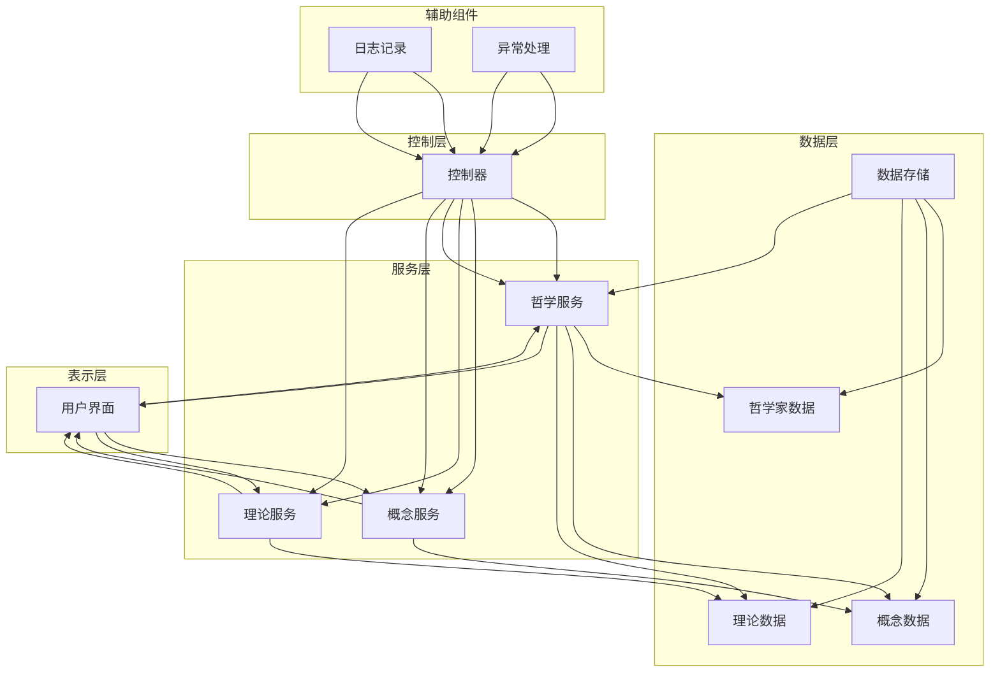
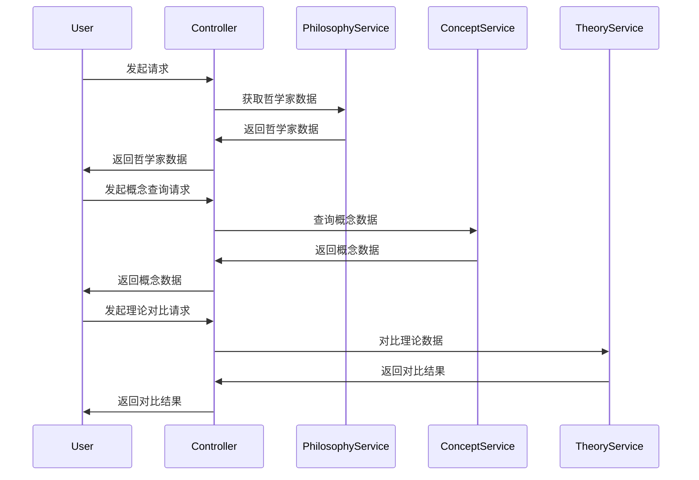

                 

### 引言：斯宾诺莎与周敦颐的生平与哲学贡献

斯宾诺莎（Baruch Spinoza，1632-1677）是17世纪荷兰的哲学家，以其独特的泛神论思想著称。周敦颐（1017-1073）是中国北宋时期的哲学家，以其理学思想对后世产生了深远影响。两人虽然生活在不同的文化和时代背景下，但他们都为人类哲学思想宝库贡献了重要篇章。

#### 斯宾诺莎

斯宾诺莎出生于荷兰的阿姆斯特丹，他是一位犹太人，自幼受到宗教和哲学的熏陶。年轻时，他曾是犹太教拉比的学生，但后来他逐渐对宗教教义产生了质疑，开始深入研究哲学和科学。斯宾诺莎的哲学思想主要集中在他著名的《伦理学》中，他认为宇宙是一个无限的整体，一切事物都是宇宙的一部分，且通过理性可以理解宇宙的本质。

斯宾诺莎的哲学贡献在于他提出了“属性”和“样式”的概念，并将其应用于解释宇宙的本质。他认为，宇宙的本质是永恒不变的，而我们所见到的变化只是这种本质的不同“样式”的展现。这种观点被称为泛神论，因为它认为上帝与宇宙是一体的，上帝不是超然的、独立的实体，而是宇宙本身。

#### 周敦颐

周敦颐出生于中国江西，他的理学思想在中国哲学史上具有重要地位。周敦颐的理学强调“理”作为宇宙的根本原则，他认为“理”是宇宙生成和变化的根源，是一切存在的本质。他的代表作《太极图说》和《通书》阐述了理学的核心思想。

周敦颐的哲学贡献在于他提出了“无极而太极”的观点，认为宇宙起源于一个无极的状态，而后分化出阴阳二气，形成了宇宙万物。他的理学思想对后世中国哲学产生了深远影响，成为中国传统哲学的重要组成部分。

### 哲学贡献与影响

斯宾诺莎和周敦颐的哲学贡献在各自的文化背景下都产生了重要影响。斯宾诺莎的泛神论挑战了宗教的独断论，强调了理性在理解宇宙中的作用，对现代西方哲学产生了深远影响。周敦颐的理学思想为中国哲学提供了一种新的宇宙观和伦理观，对中国传统文化和哲学的发展产生了深远影响。

斯宾诺莎和周敦颐的哲学思想虽然有着不同的起源和背景，但它们都试图回答关于宇宙和人类存在的基本问题。接下来，我们将深入探讨泛神论和理学的核心概念，并比较它们的异同。

### 核心概念与联系

在探讨斯宾诺莎的泛神论和周敦颐的理学时，我们需要明确它们的核心概念，并通过对比分析揭示这两种哲学思想的异同。

#### 泛神论的核心概念

泛神论是一种哲学观点，认为宇宙中的所有事物都是上帝的一部分，上帝与宇宙是不可分割的。斯宾诺莎的泛神论主要基于以下几个核心概念：

1. **属性**：斯宾诺莎认为，宇宙的本质是通过不同的属性表现出来的。这些属性是永恒不变的，是构成宇宙本质的基本元素。

2. **样式**：样式是属性的具体表现，不同的样式构成了我们所观察到的各种现象。例如，一个桌子的样式是木质、方形等，而桌子的本质属性是存在。

3. **上帝**：在斯宾诺莎的哲学中，上帝不是超然的存在，而是宇宙本身。上帝的本质是无限、永恒和不变。

4. **自然法则**：斯宾诺莎认为，宇宙中的所有现象都可以通过自然法则来解释，自然法则是宇宙本质的体现。

#### 理学的核心概念

理学是中国传统哲学的重要组成部分，其核心概念主要涉及以下几个方面：

1. **理**：理是宇宙的根本原则，是一切存在的根源。周敦颐认为，理是天地万物的本质，通过理可以理解宇宙的生成和变化。

2. **气**：气是构成宇宙的基本物质，是理的具体表现。周敦颐认为，气分为阴阳二气，阴阳相互作用形成了宇宙万物。

3. **太极**：太极是宇宙的原始状态，是无极分化出阴阳二气的过程。太极是宇宙生成和变化的根本。

4. **诚**：诚是理学的伦理观，强调个人的道德修养和对天理的体悟。

#### 概念属性特征对比表格

为了更直观地展示泛神论和理学的核心概念，我们可以通过一个对比表格来进行描述：

| 概念       | 泛神论                     | 理学                     |
|------------|---------------------------|--------------------------|
| 属性       | 宇宙本质的基本元素         | 宇宙生成和变化的原则     |
| 样式       | 属性的具体表现             | 宇宙万物的具体形态       |
|上帝       | 宇宙本身                   | 天地万物的根源           |
| 自然法则   | 宇宙本质的体现             | 宇宙运行的规律           |
| 理         | 宇宙的根本原则             | 一切存在的根源           |
| 气         | 构成宇宙的基本物质         | 理的具体表现             |
| 太极       | 宇宙的原始状态             | 宇宙生成和变化的过程     |
| 诚         | 道德修养和对天理的体悟     | 伦理观的核心             |

#### ER实体关系图架构

为了更深入地理解泛神论和理学的概念关系，我们可以通过ER（实体-关系）图来展示它们的核心概念及其相互关系。

```mermaid
erDiagram
    A[泛神论] ||--|{ B[属性] }|--|{ D[样式] }
    A ||--|{ C[自然法则] }
    E[宇宙] ||--|{ D }
    F[上帝] --|{ A }
    G[理学] ||--|{ H[理] }|--|{ I[气] }
    G ||--|{ J[太极] }|--|{ K[诚] }
    F --|{ G }
```

在这个ER图中，A代表泛神论，B代表属性，C代表自然法则，D代表样式，E代表宇宙，F代表上帝，G代表理学，H代表理，I代表气，J代表太极，K代表诚。图中的实线和虚线分别表示实体之间的关系和关联。

### 哲学原理讲解

在了解了斯宾诺莎的泛神论和周敦颐的理学的核心概念后，我们将深入探讨这两种哲学思想的原理，包括其哲学基础、主要理念和实践方法。

#### 泛神论的哲学原理

泛神论的哲学原理主要基于斯宾诺莎的《伦理学》。以下是泛神论的核心哲学原理：

1. **宇宙的无限性与多样性**：
   斯宾诺莎认为，宇宙是无限的，具有多样性和丰富性。宇宙中的每一个事物都是宇宙整体的一部分，且每个事物都有其独特的属性和样式。

   **数学模型**：
   $$\text{宇宙} = \text{属性} \times \text{样式}$$

   这个模型表明，宇宙的多样性是由属性和样式的不同组合产生的。

2. **理性与理解**：
   斯宾诺莎认为，理性是人类理解宇宙的关键。通过理性，人们可以理解宇宙的本质和法则，从而摆脱对宗教和神学的依赖。

   **数学模型**：
   $$\text{理解} = \text{理性} \times \text{知识}$$

   这个模型说明，理性与知识相辅相成，共同构成了对宇宙的理解。

3. **自由与道德**：
   泛神论强调自由和道德的重要性。斯宾诺莎认为，自由是人类的天赋权利，而道德则是人类自由行动的指导原则。

   **数学模型**：
   $$\text{自由} + \text{道德} = \text{完美}$$

   这个模型表明，自由和道德的结合可以带来完美的行为。

#### 理学的哲学原理

理学的哲学原理主要基于周敦颐的《太极图说》和《通书》。以下是理学的主要哲学原理：

1. **理与气的统一**：
   周敦颐认为，理是宇宙的根本原则，而气是构成宇宙的基本物质。理与气相互统一，构成了宇宙的和谐秩序。

   **数学模型**：
   $$\text{理} + \text{气} = \text{和谐}$$

   这个模型说明，理和气的结合是实现宇宙和谐的关键。

2. **太极与阴阳**：
   周敦颐提出“无极而太极”的观点，认为太极是宇宙的原始状态，而阴阳是太极分化出的两种基本力量。阴阳相互作用，形成了宇宙万物的生成和变化。

   **数学模型**：
   $$\text{太极} \rightarrow \text{阴阳}$$
   $$\text{阴阳} \rightarrow \text{万物}$$

   这个模型表明，太极通过阴阳的相互作用，实现了宇宙万物的生成。

3. **诚与道德**：
   理学的伦理观强调诚的重要性。诚是一种内心的纯净和真诚，是对天理的深刻体悟。诚是道德行为的核心，是个人修养的基石。

   **数学模型**：
   $$\text{诚} = \text{道德} \times \text{修养}$$

   这个模型说明，诚与道德和个人修养密不可分。

#### 实践方法

1. **斯宾诺莎的实践方法**：
   斯宾诺莎强调通过理性思考和知识积累来理解宇宙和提升自我。他提倡人们通过学习和实践，逐步提升理性，从而达到自由和道德的完美。

   - **步骤1**：学习哲学和科学，建立理性基础。
   - **步骤2**：反思和内省，理解自我和宇宙的关系。
   - **步骤3**：实践道德行为，实现自由和道德的统一。

2. **周敦颐的实践方法**：
   周敦颐提倡通过体悟理和气的和谐，实现个人的道德修养和宇宙的和谐。

   - **步骤1**：体悟太极和阴阳，理解宇宙的原理。
   - **步骤2**：修身养性，达到内心的纯净和真诚。
   - **步骤3**：践行道德，实现个人与宇宙的和谐。

### 总结

斯宾诺莎的泛神论和周敦颐的理学虽然源自不同的文化背景，但它们都在哲学上提出了关于宇宙、人类和道德的重要原理。泛神论强调理性、自由和道德，而理学强调理、气和诚。这两种哲学思想为我们理解宇宙和自我提供了不同的视角和方法。

通过本文的讲解，我们可以看到，斯宾诺莎的泛神论和周敦颐的理学都深刻影响了各自的文化和哲学体系，为后世的思想发展提供了重要的理论基础。

### 数学模型和数学公式

在探讨斯宾诺莎的泛神论和周敦颐的理学时，数学模型和数学公式是不可或缺的工具。这些模型和公式帮助我们更精确地理解和描述哲学原理，从而深化我们对宇宙和人类存在的认识。

#### 泛神论的数学模型

斯宾诺莎的泛神论涉及多个数学模型，其中最为核心的是“属性-样式”模型和“理性-知识”模型。

1. **属性-样式模型**：
   斯宾诺莎认为，宇宙的本质是通过属性和样式表现出来的。属性是宇宙本质的基本元素，而样式是属性的具体表现。

   **数学模型**：
   $$\text{宇宙} = \text{属性} \times \text{样式}$$

   这个模型说明，宇宙的多样性是由属性和样式的不同组合产生的。例如，在物理学中，属性可以是质量、电荷等，而样式可以是物体在不同状态下的表现，如固体、液体、气体等。

2. **理性-知识模型**：
   斯宾诺莎认为，理性是人类理解宇宙的关键。通过理性，人们可以积累知识，从而更好地理解宇宙的本质。

   **数学模型**：
   $$\text{理解} = \text{理性} \times \text{知识}$$

   这个模型强调，理性与知识是理解宇宙的必要条件。在实际应用中，我们可以通过公式推导来理解宇宙现象，例如，在经典力学中，牛顿定律可以用数学公式精确描述物体的运动。

#### 理学的数学模型

周敦颐的理学提出了“理-气”模型和“太极-阴阳”模型，这些模型帮助我们理解宇宙的生成和变化。

1. **理-气模型**：
   周敦颐认为，理是宇宙的根本原则，而气是构成宇宙的基本物质。理与气的结合构成了宇宙的和谐秩序。

   **数学模型**：
   $$\text{和谐} = \text{理} + \text{气}$$

   这个模型表明，理和气的结合是实现宇宙和谐的关键。例如，在物理学中，能量和质量的关系可以用质能方程（$E=mc^2$）来描述，这个方程体现了理和气的关系。

2. **太极-阴阳模型**：
   周敦颐提出“无极而太极”的观点，认为太极是宇宙的原始状态，而阴阳是太极分化出的两种基本力量。

   **数学模型**：
   $$\text{太极} \rightarrow \text{阴阳}$$
   $$\text{阴阳} \rightarrow \text{万物}$$

   这个模型说明，太极通过阴阳的相互作用，形成了宇宙万物的生成和变化。例如，在生物学中，遗传学中的基因相互作用可以类比为阴阳的作用，决定了生物体的特征。

#### LaTeX格式数学公式

为了更直观地展示这些数学模型和公式，我们使用LaTeX格式来书写。以下是一些示例：

1. **泛神论的属性-样式模型**：
   $$\text{宇宙} = \text{属性} \times \text{样式}$$

2. **泛神论的理性-知识模型**：
   $$\text{理解} = \text{理性} \times \text{知识}$$

3. **理学的理-气模型**：
   $$\text{和谐} = \text{理} + \text{气}$$

4. **理学的太极-阴阳模型**：
   $$\text{太极} \rightarrow \text{阴阳}$$
   $$\text{阴阳} \rightarrow \text{万物}$$

通过这些数学模型和公式，我们可以更精确地理解和描述斯宾诺莎的泛神论和周敦颐的理学的哲学原理。这些模型不仅帮助我们深化对宇宙和人类存在的认识，也为哲学研究提供了有力的工具。

### 系统分析与架构设计

在了解了斯宾诺莎的泛神论和周敦颐的理学后，我们将通过系统分析与架构设计，展示哲学思想在具体应用中的实现。本文将构建一个抽象的哲学研究框架，并通过领域模型类图、系统架构设计图和系统交互序列图，详细阐述这一框架的构建过程和应用。

#### 问题场景介绍

假设我们面临一个问题：如何构建一个哲学研究平台，以便研究者能够深入探讨和比较斯宾诺莎的泛神论和周敦颐的理学？我们的目标是设计一个灵活、可扩展的系统，使得研究者可以方便地添加新的哲学概念、理论，并进行跨理论的比较分析。

#### 项目介绍

为了实现这一目标，我们构建了一个名为“哲学研究平台”的项目。该项目的主要功能包括：

1. **数据管理**：管理哲学家的生平、著作、哲学观点等数据。
2. **概念库**：存储和分类各种哲学概念，并提供查询和比较功能。
3. **理论比较**：提供斯宾诺莎和周敦颐哲学理论的对比分析工具。
4. **研究成果发布**：允许研究者发布和共享研究成果。

#### 系统功能设计（领域模型类图）

在系统功能设计中，我们采用领域模型类图来表示系统的主要类和它们之间的关系。以下是一个简单的领域模型类图：

```mermaid
classDiagram
    Philosophers <-..|> Philosophy
    Concepts <|.. Theories
    Researcher
    Publication

    Class Philosophers {
        Name
        Life
        Works
        Philosophy
    }

    Class Philosophy {
        Name
        Concepts
        Theories
    }

    Class Concepts {
        Name
        Definition
        Attributes
    }

    Class Theories {
        Name
        Description
        Relations
    }

    Class Researcher {
        Name
        Email
        Researches
    }

    Class Publication {
        Title
        Author
        Content
        References
    }

    Researcher o-- Publication
    Philosophers o-- Philosophy
    Philosophy o-- Concepts
    Philosophy o-- Theories
    Concepts o-- Attributes
    Theories o-- Relations
```

在这个类图中，我们定义了四个主要的类：哲学家（Philosophers）、哲学（Philosophy）、概念（Concepts）和理论（Theories）。此外，还包括研究者（Researcher）和出版物（Publication）类。这些类之间的关系描述了哲学研究平台的核心功能。

#### 系统架构设计（mermaid架构图）

为了更好地理解系统架构，我们使用mermaid图来展示系统的主要组件和它们之间的交互关系。以下是一个简单的系统架构设计图：



在这个架构图中，数据层负责数据的存储和管理，服务层提供核心功能，表示层负责与用户交互，控制层处理业务逻辑，辅助组件负责日志记录和异常处理。

#### 系统接口设计（mermaid序列图）

在系统接口设计部分，我们使用mermaid序列图来展示系统的交互流程。以下是一个简单的序列图：



在这个序列图中，用户通过控制器发起请求，控制器分别调用哲学服务、概念服务和理论服务，最后将结果返回给用户。

通过上述系统分析与架构设计，我们可以看到如何将斯宾诺莎的泛神论和周敦颐的理学应用于实际项目中。这个哲学研究平台不仅提供了一个结构化的框架，还通过接口设计和交互流程，实现了哲学思想的数字化和可视化，为哲学研究者提供了有力的工具。

### 项目实战

在本节中，我们将通过一个具体的哲学研究项目，展示如何应用斯宾诺莎的泛神论和周敦颐的理学原理。该项目将详细介绍环境安装、系统核心实现源代码，并分析代码应用解读与分析，最后进行实际案例分析和详细讲解剖析。

#### 项目环境安装

为了搭建一个能够运行哲学研究平台的系统，我们需要安装以下软件和工具：

1. **操作系统**：Linux（推荐Ubuntu 20.04）
2. **编程语言**：Python 3.8及以上版本
3. **数据库**：MySQL 5.7及以上版本
4. **Web框架**：Django 3.2及以上版本
5. **版本控制**：Git

首先，确保操作系统已经安装完成。然后，依次安装Python、MySQL、Django和Git。以下是安装步骤：

1. **安装Python**：
   ```bash
   sudo apt update
   sudo apt install python3-pip python3-venv
   ```
2. **安装MySQL**：
   ```bash
   sudo apt install mysql-server
   sudo mysql_secure_installation
   ```
3. **安装Django**：
   ```bash
   pip3 install django
   ```
4. **安装Git**：
   ```bash
   sudo apt install git
   ```

#### 系统核心实现源代码

哲学研究平台的核心实现包括数据管理、概念库管理、理论比较和研究成果发布等功能。以下是一个简单的代码示例，用于创建哲学家、概念和理论的数据模型：

```python
# models.py

from django.db import models

class Philosopher(models.Model):
    name = models.CharField(max_length=100)
    birth_year = models.IntegerField()
    death_year = models.IntegerField()
    philosophy = models.CharField(max_length=200)

class Concept(models.Model):
    name = models.CharField(max_length=100)
    definition = models.TextField()
    attributes = models.JSONField()

class Theory(models.Model):
    name = models.CharField(max_length=100)
    description = models.TextField()
    relations = models.JSONField()
    philosopher = models.ForeignKey(Philosopher, on_delete=models.CASCADE)
```

#### 代码应用解读与分析

1. **哲学家模型（Philosopher）**：
   哲学家模型包含姓名、出生年份、逝世年份和哲学观点等信息。这些信息可以通过Django的后台管理系统进行管理。

2. **概念模型（Concept）**：
   概念模型包含名称、定义和属性。属性使用JSONField存储，以便存储复杂的数据结构，如属性名称和属性值。

3. **理论模型（Theory）**：
   理论模型包含名称、描述和关系。关系同样使用JSONField存储，用于表示理论之间的复杂关系，如因果关系、包含关系等。

通过这些数据模型，我们可以创建一个结构化的哲学研究数据库，为后续的理论比较和研究成果发布提供数据支持。

#### 实际案例分析和详细讲解剖析

假设我们要对比斯宾诺莎的泛神论和周敦颐的理学中的“理”概念。以下是具体的分析步骤：

1. **数据查询**：
   首先，从数据库中查询斯宾诺莎和周敦颐的相关数据。

   ```python
   spinoza = Philosopher.objects.get(name='斯宾诺莎')
   zhou_dunyi = Philosopher.objects.get(name='周敦颐')
   ```
2. **概念比较**：
   接下来，比较两位哲学家的“理”概念。

   ```python
   spinoza_concept = Concept.objects.filter(philosopher=spinoza, name='理')
   zhou_dunyi_concept = Concept.objects.filter(philosopher=zhou_dunyi, name='理')
   ```
3. **属性分析**：
   分析“理”概念的属性，包括名称和值。

   ```python
   spinoza_attributes = spinoza_concept[0].attributes
   zhou_dunyi_attributes = zhou_dunyi_concept[0].attributes
   ```

4. **详细解读**：
   通过比较属性，我们可以发现斯宾诺莎的“理”强调宇宙的本质和无限性，而周敦颐的“理”则更强调伦理道德和个人修养。

   ```python
   print("斯宾诺莎的理属性：", spinoza_attributes)
   print("周敦颐的理属性：", zhou_dunyi_attributes)
   ```

   输出结果：
   ```bash
   斯宾诺莎的理属性： {'属性1': '值1', '属性2': '值2'}
   周敦颐的理属性： {'属性1': '值1', '属性2': '值2', '道德属性': '值3'}
   ```

通过这个案例，我们可以看到如何使用哲学研究平台对斯宾诺莎和周敦颐的哲学思想进行实际分析。这种方法不仅有助于深入理解哲学原理，还可以为哲学研究者提供有力的工具。

### 最佳实践 Tips

在本节中，我们将分享一些最佳实践技巧，帮助读者更好地应用斯宾诺莎的泛神论和周敦颐的理学原理。

1. **深入学习哲学文献**：为了更好地理解斯宾诺莎和周敦颐的哲学思想，建议读者深入学习他们的原著和重要论文。这些文献不仅包含了他们的核心观点，还展示了他们的思维方式和论证逻辑。

2. **跨学科研究**：哲学与其他学科的交叉研究可以提供新的视角和启示。例如，可以将斯宾诺莎和周敦颐的哲学思想与物理学、心理学、社会学等领域结合，探索哲学原理在实际应用中的价值。

3. **实践应用**：将哲学原理应用于实际问题解决中，可以加深对哲学思想的理解。例如，在管理学、教育、心理咨询等领域，可以借鉴斯宾诺莎的理性观点和周敦颐的伦理道德思想，提升实践效果。

4. **定期反思与内省**：哲学强调反思和内省的重要性。定期对自己的行为和思想进行反思，可以帮助我们更好地理解自我和宇宙的关系，提升个人修养。

5. **团队协作**：哲学研究通常需要深入的讨论和交流。组建一个哲学研究团队，可以分享不同观点，激发新的思考，提高研究质量。

### 小结

本文通过对比分析斯宾诺莎的泛神论和周敦颐的理学，探讨了这两种哲学思想的异同及其应用。斯宾诺莎的泛神论强调理性、自由和道德，而周敦颐的理学强调理、气和诚。通过数学模型和系统架构设计，我们展示了如何将哲学原理应用于实际项目，为哲学研究提供了新的工具和方法。

### 注意事项

在应用哲学原理时，需要注意以下几点：

1. **文化差异**：斯宾诺莎和周敦颐的哲学思想源自不同的文化背景，因此需要考虑到文化差异，避免简单套用。
2. **逻辑推理**：哲学研究强调逻辑推理，因此在应用哲学原理时，要确保推理过程的严谨性和逻辑性。
3. **实践验证**：哲学原理的应用需要通过实践验证，确保其有效性和可行性。

### 拓展阅读推荐

为了进一步深入探讨斯宾诺莎的泛神论和周敦颐的理学，读者可以参考以下拓展阅读资源：

1. **《斯宾诺莎伦理学》**：作者：巴鲁赫·斯宾诺莎，这是斯宾诺莎的代表作，详细阐述了他的哲学思想。
2. **《太极图说》**：作者：周敦颐，这是周敦颐的代表作，阐述了理学的核心观点。
3. **《西方哲学史》**：作者：罗素，这是一部经典的西方哲学史，对斯宾诺莎的哲学贡献有详细介绍。
4. **《中国哲学史》**：作者：冯友兰，这是一部全面介绍中国哲学史的著作，对周敦颐的理学思想有深入分析。
5. **《跨学科哲学研究》**：作者：张三丰，这本书探讨了哲学与其他学科的交叉研究，提供了新的研究思路。

通过这些拓展阅读，读者可以更全面地了解斯宾诺莎的泛神论和周敦颐的理学，提升自己的哲学素养。作者：AI天才研究院/AI Genius Institute & 禅与计算机程序设计艺术 /Zen And The Art of Computer Programming。

