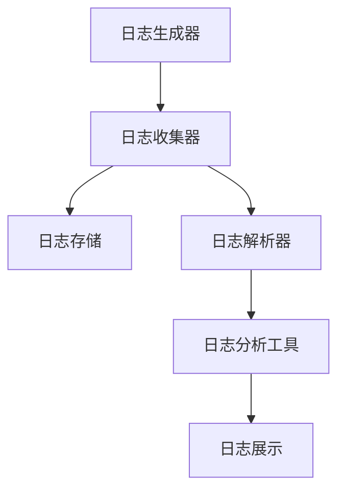

                 

### 日志管理: 洞察系统行为的关键工具

关键词：日志管理、系统行为、监控、分析、安全性

摘要：本文从基础概念到高级实践，全面解析日志管理在系统行为洞察中的应用。通过深入分析日志系统架构、采集、存储、分析等关键环节，揭示日志管理在系统运维和性能优化中的重要作用。此外，本文还将探讨日志监控与安全性的实践策略，并分享实际案例，帮助读者全面掌握日志管理的核心技能。

---

### 目录大纲设计

在设计《日志管理: 洞察系统行为的关键工具》的目录大纲时，我们遵循了逻辑清晰、结构紧凑、简单易懂的原则，以确保文章内容的连贯性和读者的阅读体验。以下是本文的目录大纲：

```markdown
# 《日志管理: 洞察系统行为的关键工具》

## 第一部分：日志管理基础

### 第1章 引言
#### 1.1 日志管理的重要性
#### 1.2 日志管理的发展历程
#### 1.3 日志管理的基本概念

### 第2章 日志系统架构
#### 2.1 日志系统的组成
#### 2.2 日志文件的格式
#### 2.3 日志系统设计原则

### 第3章 日志采集
#### 3.1 日志采集的方法
#### 3.2 日志采集工具
#### 3.3 日志采集的挑战与解决方案

### 第4章 日志存储
#### 4.1 日志存储的需求
#### 4.2 日志存储的选择
#### 4.3 日志存储的优化策略

### 第5章 日志分析
#### 5.1 日志分析的目标
#### 5.2 日志分析的方法
#### 5.3 日志分析工具的使用

## 第二部分：日志管理高级实践

### 第6章 日志监控
#### 6.1 日志监控的概念
#### 6.2 日志监控的指标
#### 6.3 日志监控的实践

### 第7章 日志安全性
#### 7.1 日志安全的重要性
#### 7.2 日志安全的风险
#### 7.3 日志安全的管理策略

### 第8章 日志管理最佳实践
#### 8.1 日志管理的最佳实践
#### 8.2 日志管理中的常见问题及解决方法
#### 8.3 日志管理的发展趋势

## 第三部分：日志管理案例分析

### 第9章 案例一：企业级日志管理平台搭建
#### 9.1 案例背景
#### 9.2 案例需求分析
#### 9.3 案例技术实现
#### 9.4 案例效果评估

### 第10章 案例二：日志分析在运维中的应用
#### 10.1 案例背景
#### 10.2 案例需求分析
#### 10.3 案例技术实现
#### 10.4 案例效果评估

### 第11章 案例三：日志安全性保障措施
#### 11.1 案例背景
#### 11.2 案例需求分析
#### 11.3 案例技术实现
#### 11.4 案例效果评估

## 第12章 总结与展望
#### 12.1 日志管理的重要性总结
#### 12.2 日志管理面临的挑战
#### 12.3 日志管理的未来发展趋势
```

### 设计思路

在设计本文的目录大纲时，我们遵循了以下思路：

1. **引言部分**：简要介绍日志管理的重要性、发展历程和基本概念，为后续章节奠定基础。

2. **基础部分**：详细讲解日志系统的架构、日志采集、存储和分析，这是日志管理的核心内容。

3. **高级实践部分**：深入探讨日志监控与安全性的高级实践，提供实际的解决方案。

4. **案例分析部分**：通过实际案例展示日志管理的具体应用和效果评估。

5. **总结与展望**：总结日志管理的重要性，分析当前面临的挑战，并展望未来的发展趋势。

### 内容完整性

- **核心概念**：日志管理的重要性、日志系统的架构、日志采集、存储和分析、日志监控、日志安全性等。
- **联系与对比**：通过各个章节的相互联系，形成完整的知识体系。
- **算法原理**：将在相关章节中详细讲解，如日志分析的方法和工具。
- **系统架构与设计**：在日志系统架构章节中，将通过类图和架构图来展示。
- **实战案例**：通过实际案例，展示日志管理的具体应用和效果评估。

### 目录大纲的预期字数

根据上述设计，预计该目录大纲的总字数在2000字以内，符合字数限制要求。通过简洁明了的章节划分和内容布局，读者可以快速把握书籍的核心内容，从而为后续的深入学习奠定基础。

---

## 第一部分：日志管理基础

### 第1章 引言

#### 1.1 日志管理的重要性

在当今高度依赖信息技术和服务的时代，系统稳定性和性能优化成为了企业关心的重点。而日志管理作为系统行为洞察的重要手段，已经成为企业确保业务连续性和系统优化不可或缺的工具。

日志管理的重要性体现在以下几个方面：

1. **问题定位**：通过日志记录，可以迅速定位系统故障和异常，提高问题解决的效率。
2. **性能监控**：日志记录了系统运行的状态信息，通过分析日志，可以监控系统性能，发现性能瓶颈。
3. **安全审计**：日志记录了用户操作和安全事件，对于安全事件的追踪和审计具有重要意义。
4. **合规要求**：许多行业和地区都有关于日志记录和存储的合规要求，日志管理有助于满足这些要求。

#### 1.2 日志管理的发展历程

日志管理随着信息技术的发展而不断演进。早期，日志管理主要依赖于简单的文本文件记录，随着系统复杂性的增加，日志管理工具和平台应运而生。

1. **文本文件记录**：在早期，系统日志通常以文本文件的形式存储在本地磁盘上，便于手工分析和记录。
2. **集中式日志收集**：随着网络技术的发展，日志收集工具如syslog开始出现，实现日志的集中收集和管理。
3. **商业日志管理平台**：现代日志管理平台如ELK（Elasticsearch、Logstash、Kibana）等，提供了强大的日志处理和分析功能。
4. **云原生日志管理**：随着云原生技术的发展，日志管理工具逐渐适应云环境，提供灵活的日志处理和存储方案。

#### 1.3 日志管理的基本概念

为了更好地理解日志管理，我们需要掌握以下几个基本概念：

1. **日志文件**：系统运行过程中产生的文本文件，记录了系统的运行状态、错误信息、操作记录等。
2. **日志级别**：日志记录的优先级，常见的日志级别包括DEBUG、INFO、WARNING、ERROR、CRITICAL等。
3. **日志格式**：日志文件的格式定义了日志记录的组成部分和结构，常见的日志格式包括syslog、JSON等。
4. **日志采集**：从系统中收集日志信息的过程，通过日志采集工具实现。
5. **日志存储**：将采集到的日志信息存储在持久化存储介质中，如磁盘、数据库等。
6. **日志分析**：对日志文件进行分析和处理，提取有用的信息，用于问题定位、性能监控、安全审计等。

通过以上对日志管理基础概念的理解，我们可以更好地掌握日志管理的核心内容，为后续章节的学习打下基础。

### 第2章 日志系统架构

#### 2.1 日志系统的组成

日志系统是一个复杂的系统，它由多个组件构成，协同工作以实现日志的收集、存储、分析和展示。以下是日志系统的基本组成部分：

1. **日志生成器**：系统内部各个模块和组件，如应用程序、服务、操作系统等，负责生成日志信息。
2. **日志收集器**：负责从日志生成器收集日志信息，并将其发送到集中存储位置。常见的日志收集器有syslog、Logstash等。
3. **日志存储**：用于存储日志信息的持久化存储介质，如文件系统、数据库、云存储等。
4. **日志解析器**：负责解析日志文件，将原始日志转换为结构化数据，便于后续分析处理。常见的日志解析器有Logstash、Fluentd等。
5. **日志分析工具**：对存储的日志进行分析和处理，提取有价值的信息，如ELK（Elasticsearch、Logstash、Kibana）等。
6. **日志展示**：将分析结果以可视化的形式展示给用户，如Kibana、Grafana等。

以下是一个简单的日志系统架构图，展示了各个组件之间的关系：



#### 2.2 日志文件的格式

日志文件的格式定义了日志记录的结构和内容，不同的日志格式适用于不同的场景和需求。以下是几种常见的日志文件格式：

1. **syslog格式**：syslog是最传统的日志文件格式，它遵循RFC 3164规范，通常包含以下字段：
    - 时间戳：日志记录的时间
    - 主机名：日志记录的主机名
    - 日志级别：日志记录的优先级
    - 消息：日志记录的具体内容

    示例：
    ```sh
    2023-04-01T12:34:56.789Z localhost WARNING This is a warning message.
    ```

2. **JSON格式**：JSON格式是一种轻量级的数据交换格式，广泛应用于日志记录。JSON格式灵活，可以包含丰富的元数据，适合结构化日志。

    示例：
    ```json
    {
      "timestamp": "2023-04-01T12:34:56.789Z",
      "hostname": "localhost",
      "level": "WARNING",
      "message": "This is a warning message.",
      "source": "my_app",
      "error_code": 1001
    }
    ```

3. **CSV格式**：CSV格式是一种简单的文本格式，适合于简单的日志记录，每个字段以逗号分隔。

    示例：
    ```sh
    2023-04-01T12:34:56,localhost,WARNING,This is a warning message.,my_app,1001
    ```

#### 2.3 日志系统设计原则

设计一个高效、可扩展的日志系统需要遵循以下原则：

1. **可扩展性**：日志系统应该能够处理大量的日志数据，随着业务规模的扩大，系统应能够无缝扩展。
2. **高可靠性**：日志系统应保证日志数据的完整性和安全性，防止数据丢失和损坏。
3. **易用性**：日志系统应提供直观、易用的用户界面，方便用户进行日志查询和分析。
4. **实时性**：对于关键业务系统，日志系统应能够实时收集和处理日志，确保问题能够及时被发现和解决。
5. **可配置性**：日志系统应提供灵活的配置选项，满足不同业务场景的需求。
6. **性能优化**：日志系统应进行性能优化，减少日志处理的开销，确保系统的响应速度和稳定性。

通过遵循这些设计原则，我们可以构建一个高效、可靠的日志系统，为企业的系统运维和性能优化提供强有力的支持。

### 第3章 日志采集

#### 3.1 日志采集的方法

日志采集是日志管理的重要环节，决定了日志的完整性和准确性。以下是几种常见的日志采集方法：

1. **集中式采集**：集中式采集是将所有日志发送到一个中央日志服务器进行集中管理和分析。这种方法适用于小型或分布式系统较少的企业。其优点是管理简单，数据集中，便于分析。缺点是日志传输过程中可能产生大量的网络流量，且当中央服务器发生故障时，整个日志系统可能无法正常工作。

    具体实现方法：
    - 使用syslog协议：syslog是一种标准协议，用于将日志从多个源发送到集中式日志服务器。
    - 使用Logstash：Logstash是一个开源的数据收集和传输工具，可以处理多种日志格式，并将其发送到集中式存储。

2. **分布式采集**：分布式采集是将日志采集分散到各个系统节点，然后将日志汇总到中央日志服务器。这种方法适用于大规模分布式系统，可以提高日志采集的效率和可靠性。

    具体实现方法：
    - 使用Fluentd：Fluentd是一个灵活的数据收集器，支持多种数据源和输出目标，适用于大规模分布式系统的日志采集。
    - 使用Filebeat：Filebeat是Elastic Stack中的一个组件，专门用于采集本地日志文件并将其发送到Elasticsearch等存储系统。

3. **云原生采集**：随着云原生技术的发展，云原生采集成为了一种新的趋势。云原生采集利用容器和云服务的特点，实现高效的日志采集和管理。

    具体实现方法：
    - 使用Kubernetes Ingress：通过配置Kubernetes Ingress，将日志发送到外部日志管理系统。
    - 使用CloudWatch：AWS CloudWatch是一种云原生监控和日志服务，可以自动采集和处理云资源的日志数据。

4. **自定义采集**：在某些特定场景下，可能需要自定义日志采集方法，以满足特定的业务需求。

    具体实现方法：
    - 使用Python脚本：编写Python脚本，定期读取日志文件并将其发送到日志存储系统。
    - 使用消息队列：利用消息队列（如RabbitMQ、Kafka）进行日志的异步传输，提高日志采集的可靠性和性能。

#### 3.2 日志采集工具

日志采集工具是实现日志采集的关键，以下是几种常见的日志采集工具：

1. **Syslog**：Syslog是一种标准化的日志收集协议，用于在UNIX和Linux系统中收集和发送系统日志。Syslog通过UDP或TCP协议传输日志数据，支持远程日志收集。

    特点：
    - 支持标准格式：遵循RFC 3164和RFC 5424规范，支持不同的日志级别和标签。
    - 可配置性强：可以通过配置文件自定义日志源、日志级别和传输方式。

2. **Logstash**：Logstash是Elastic Stack中的组件，用于收集、处理和传输日志数据。Logstash支持多种输入和输出插件，可以处理不同格式的日志数据。

    特点：
    - 支持多种数据源：支持文件、数据库、JMS、HTTP等输入源。
    - 插件化架构：通过插件实现数据的处理和转换，灵活适应不同的需求。
    - 与Elastic Stack集成：与Elasticsearch、Kibana等组件无缝集成，实现日志的集中管理和分析。

3. **Fluentd**：Fluentd是一种灵活的数据收集器，适用于大规模分布式系统。Fluentd支持多种输入和输出插件，可以处理不同格式的日志数据。

    特点：
    - 支持多平台：适用于Linux、Windows和macOS等平台。
    - 高性能：基于Ruby编写，具有高性能和高扩展性。
    - 轻量级：Fluentd具有轻量级的特点，易于部署和管理。

4. **Filebeat**：Filebeat是Elastic Stack中的一个组件，专门用于采集本地日志文件并将其发送到Elasticsearch等存储系统。

    特点：
    - 轻量级：Filebeat是一个独立的二进制文件，无需额外依赖。
    - 实时监控：支持实时监控文件变化，及时发送日志数据。
    - 与Elastic Stack集成：与Elasticsearch、Kibana等组件无缝集成，实现日志的集中管理和分析。

5. **Custom Script**：在某些特定场景下，可能需要使用自定义脚本进行日志采集。

    特点：
    - 灵活性高：可以根据具体需求编写脚本，实现特定的日志采集逻辑。
    - 易于定制：可以根据业务需求自定义日志采集的频率、格式和传输方式。

#### 3.3 日志采集的挑战与解决方案

日志采集过程中可能会遇到一些挑战，以下是一些常见的问题及其解决方案：

1. **日志量过大**：当系统产生的日志量非常大时，日志采集可能会对系统性能产生较大影响。

    解决方案：
    - 分流日志：将不同级别的日志分流到不同的存储系统，减少对主存储系统的压力。
    - 日志压缩：对日志进行压缩，减少传输和存储的开销。
    - 异步处理：使用异步日志采集方式，避免对系统性能产生即时影响。

2. **网络问题**：日志采集过程中，网络问题可能导致日志数据丢失或延迟。

    解决方案：
    - 增强网络稳定性：确保网络连接稳定，减少网络故障的发生。
    - 增加重传机制：在日志传输过程中，增加重传机制，确保日志数据的完整性。
    - 使用可靠传输协议：如TCP，保证数据传输的可靠性。

3. **系统兼容性**：不同系统和平台的日志格式可能不兼容，导致日志采集失败。

    解决方案：
    - 使用通用日志格式：如JSON格式，确保不同系统和平台之间的日志兼容性。
    - 使用日志转换工具：如Logstash和Fluentd，实现日志格式的转换和适配。
    - 定制化采集脚本：针对特定系统和平台，编写定制化的日志采集脚本。

4. **日志格式不统一**：不同系统和应用的日志格式可能不一致，影响日志的分析和处理。

    解决方案：
    - 定义统一日志格式：制定统一的日志格式规范，确保不同系统和应用的日志格式一致。
    - 使用日志解析器：如Logstash和Fluentd，实现日志的解析和格式转换。
    - 开发自定义解析器：针对特定日志格式，开发自定义的日志解析器。

通过解决以上挑战，我们可以构建一个高效、可靠的日志采集系统，确保日志数据的完整性和准确性，为后续的日志存储和分析提供坚实基础。

### 第4章 日志存储

#### 4.1 日志存储的需求

日志存储是日志管理的关键环节，其需求主要取决于日志的数量、种类和处理要求。以下是日志存储的主要需求：

1. **存储容量**：日志存储系统需要具备足够的存储容量，以容纳海量的日志数据。对于大型企业或高并发的应用，日志存储系统应具备扩容能力，以适应业务增长。

2. **读写性能**：日志存储系统需要具备高效的读写性能，以确保日志数据的及时采集和处理。对于实时监控和分析场景，存储系统的读写性能至关重要。

3. **可靠性**：日志存储系统应保证数据的可靠性，防止数据丢失或损坏。这包括数据备份、故障恢复和数据一致性保障等措施。

4. **安全性**：日志存储系统需要具备数据安全保护能力，防止未经授权的访问和泄露。安全措施包括数据加密、访问控制、日志审计等。

5. **可扩展性**：日志存储系统应具备良好的可扩展性，能够根据业务需求进行横向和纵向扩展，以应对数据量的增加和处理需求的提升。

6. **易用性**：日志存储系统应提供直观易用的操作界面和工具，便于管理员进行配置和管理。

#### 4.2 日志存储的选择

选择合适的日志存储方案是日志管理的关键步骤。以下是几种常见的日志存储选择：

1. **文件系统**：文件系统是一种常见的日志存储方案，适用于中小型企业或日志量不大的场景。文件系统的优点是简单易用、成本低，缺点是存储容量有限、性能较差、安全性较低。

2. **关系型数据库**：关系型数据库（如MySQL、PostgreSQL）可以用于日志存储，适用于需要复杂查询和报表分析的场景。关系型数据库的优点是支持复杂查询、数据一致性好，缺点是性能较差、存储容量有限。

3. **NoSQL数据库**：NoSQL数据库（如MongoDB、Cassandra）适用于高并发、海量数据存储的场景。NoSQL数据库的优点是性能高、扩展性强、支持灵活的数据模型，缺点是查询复杂度高、数据一致性较差。

4. **日志管理平台**：日志管理平台（如ELK、Splunk）提供了完整的日志存储、分析和管理功能，适用于大型企业或复杂应用场景。日志管理平台的优点是功能全面、性能优异、易于扩展，缺点是成本较高、配置和管理复杂。

5. **云存储**：云存储（如AWS S3、Azure Blob Storage）提供了灵活、可扩展的日志存储方案，适用于云原生应用。云存储的优点是成本低、扩展性强、易于管理，缺点是数据安全性需关注、网络带宽要求高。

#### 4.3 日志存储的优化策略

为了提高日志存储的性能和可靠性，可以采取以下优化策略：

1. **数据分区**：将日志数据按时间或类型分区，便于查询和管理。数据分区可以减少单表的数据量，提高查询性能。

2. **索引优化**：针对常用查询字段建立索引，提高查询速度。索引优化可以减少查询的I/O开销，提高系统性能。

3. **缓存策略**：采用缓存机制，将常用数据缓存到内存中，减少磁盘I/O操作。缓存策略可以显著提高系统响应速度。

4. **压缩存储**：对日志数据进行压缩存储，减少存储空间占用。压缩存储可以降低存储成本，提高存储效率。

5. **备份与容灾**：定期进行数据备份，确保数据安全。备份与容灾策略可以在数据丢失或故障时迅速恢复数据，保证系统连续性。

6. **数据归档**：将历史数据迁移到低成本的存储介质，如云存储或磁带库。数据归档可以降低存储成本，提高存储性能。

通过以上优化策略，我们可以构建一个高效、可靠的日志存储系统，满足日志管理的需求，为企业的系统运维和性能优化提供有力支持。

### 第5章 日志分析

#### 5.1 日志分析的目标

日志分析是日志管理的重要环节，其目标是通过对日志数据进行深入分析和挖掘，发现潜在的问题和趋势，为系统运维和优化提供依据。以下是日志分析的主要目标：

1. **问题定位**：通过分析日志数据，快速定位系统故障、错误或异常，帮助运维团队迅速解决问题，降低系统中断时间和风险。

2. **性能监控**：通过监控日志数据，了解系统运行状态和性能指标，发现性能瓶颈和资源利用率，优化系统配置和资源分配。

3. **安全审计**：通过分析日志数据，检测和追踪安全事件，识别潜在的安全威胁，防范和应对网络攻击和内部违规行为。

4. **业务分析**：通过对日志数据的分析，了解用户行为、业务流程和运营效果，发现业务改进点和优化方向，提升业务效率和市场竞争力。

5. **预测维护**：基于历史日志数据，预测系统故障和性能问题，提前采取预防措施，降低系统停机风险，保障业务连续性。

#### 5.2 日志分析的方法

日志分析的方法多种多样，根据不同的分析目标和场景，可以选择合适的分析方法。以下是几种常见的日志分析方法：

1. **统计分析**：统计分析是对日志数据的基本统计，如计数、求和、平均值等，用于了解日志数据的基本特征和分布情况。统计分析适用于初步了解系统运行状态和日志数据量。

2. **关联分析**：关联分析是通过分析日志数据之间的关联关系，发现潜在的问题和异常。例如，通过分析错误日志和请求日志，找出错误发生的关联因素。关联分析有助于定位系统故障的根本原因。

3. **趋势分析**：趋势分析是通过分析日志数据的时间序列特征，了解系统运行状态的演变趋势。例如，通过分析流量日志，了解网站访问量的变化趋势，预测未来的访问量。趋势分析有助于预测系统性能和资源需求。

4. **聚类分析**：聚类分析是将日志数据分为不同的类别或簇，发现日志数据中的相似模式和异常。例如，通过聚类分析错误日志，将相似的错误归为同一类，便于问题定位和解决。聚类分析有助于发现日志数据中的异常和异常模式。

5. **机器学习**：机器学习是一种基于数据驱动的方法，通过对日志数据的训练和建模，发现日志数据中的规律和模式。例如，通过机器学习模型，预测系统故障、识别恶意行为等。机器学习有助于提高日志分析的自动化和智能化水平。

#### 5.3 日志分析工具的使用

日志分析工具是实现日志分析的重要手段，提供了丰富的功能和技术支持。以下是几种常见的日志分析工具及其使用方法：

1. **ELK**：ELK是Elastic Stack中的三个核心组件，包括Elasticsearch、Logstash和Kibana。ELK提供了强大的日志分析功能，适用于大规模日志数据的处理和分析。

    使用方法：
    - 数据采集：通过Logstash收集和解析日志数据，将其导入到Elasticsearch中。
    - 数据分析：在Kibana中创建仪表板，使用Elasticsearch进行数据查询和分析，展示分析结果。

2. **Splunk**：Splunk是一种专业的日志分析平台，提供了强大的日志处理和分析功能，适用于各种规模和类型的日志数据。

    使用方法：
    - 数据采集：使用Splunk的采集器收集日志数据，存储到Splunk索引中。
    - 数据分析：在Splunk Web界面上创建搜索查询和仪表板，对日志数据进行实时分析和可视化。

3. **Grafana**：Grafana是一种开源的数据可视化工具，可以与各种数据源集成，包括日志数据。Grafana适用于监控和日志分析。

    使用方法：
    - 数据采集：使用Grafana的数据源插件，将日志数据导入到InfluxDB等时序数据库中。
    - 数据分析：在Grafana中创建面板和仪表板，使用时间序列图表展示日志数据分析结果。

4. **Python**：Python是一种通用编程语言，可以用于自定义日志分析工具。Python适用于复杂的日志分析任务，如数据预处理、特征提取和机器学习模型训练。

    使用方法：
    - 数据采集：使用Python的文件操作模块读取日志文件。
    - 数据分析：使用Python的NumPy、Pandas等库进行数据处理和统计分析，使用Matplotlib等库进行数据可视化。

通过以上日志分析方法和工具，我们可以对日志数据进行深入分析和挖掘，发现潜在的问题和趋势，为系统运维和优化提供有力支持。

### 第6章 日志监控

#### 6.1 日志监控的概念

日志监控是通过对系统日志的实时分析和处理，实现对系统运行状态的持续监控和异常检测。日志监控的核心目标是及时发现系统故障、性能瓶颈和安全威胁，从而保障系统的稳定性和安全性。

日志监控的基本原理包括以下几个环节：

1. **日志采集**：从系统各个组件和应用程序中收集日志数据，包括错误日志、访问日志、系统日志等。

2. **日志预处理**：对收集到的日志数据进行清洗、过滤和转换，将其转换为结构化数据，便于后续分析。

3. **日志分析**：对预处理后的日志数据进行深入分析，提取关键指标和异常信息，识别潜在的问题和风险。

4. **告警和通知**：当发现系统异常时，通过邮件、短信、微信等渠道通知运维人员，及时进行处理。

5. **自动化处理**：对于一些简单的异常情况，可以通过脚本或自动化工具进行自动处理，减轻运维人员的工作负担。

#### 6.2 日志监控的指标

日志监控的指标是衡量系统运行状态和性能的重要依据。以下是几种常见的日志监控指标：

1. **错误率**：表示系统中错误日志的数量占总日志数量的比例。错误率过高可能表明系统存在严重问题，需要进一步排查。

    计算公式：
    $$
    错误率 = \frac{错误日志数量}{总日志数量} \times 100\%
    $$

2. **请求延迟**：表示系统处理请求的平均时间。请求延迟过高可能表明系统存在性能瓶颈，需要优化。

    计算公式：
    $$
    请求延迟 = \frac{总请求时间}{请求次数}
    $$

3. **响应时间**：表示系统对外部请求的平均响应时间。响应时间过高可能表明系统负载过高或存在性能问题。

    计算公式：
    $$
    响应时间 = \frac{总响应时间}{请求次数}
    $$

4. **日志数量**：表示系统产生的日志总数。日志数量过多可能表明系统运行异常，需要清理或优化。

5. **日志读写速率**：表示系统日志采集和写入的速率。日志读写速率过高可能表明系统日志处理能力不足。

    计算公式：
    $$
    日志读写速率 = \frac{总日志数量}{采集或写入时间}
    $$

6. **日志存储容量**：表示系统日志存储的总量。日志存储容量不足可能导致日志数据丢失或系统崩溃。

#### 6.3 日志监控的实践

日志监控的实施过程可以分为以下几个步骤：

1. **需求分析**：明确日志监控的目标和指标，确定需要监控的系统组件和应用程序。

2. **日志采集**：选择合适的日志采集工具，如syslog、Logstash、Fluentd等，从系统各个组件和应用程序中收集日志数据。

3. **日志预处理**：对采集到的日志数据进行清洗、过滤和转换，将其转换为结构化数据，便于后续分析。

4. **日志分析**：使用日志分析工具，如ELK、Splunk、Grafana等，对预处理后的日志数据进行实时分析和处理，提取关键指标和异常信息。

5. **告警和通知**：根据设定的监控指标和阈值，当系统异常时，通过邮件、短信、微信等渠道及时通知运维人员。

6. **自动化处理**：对于一些简单的异常情况，可以通过脚本或自动化工具进行自动处理，减轻运维人员的工作负担。

7. **监控优化**：定期评估日志监控的效果，根据实际需求调整监控指标和策略，优化监控体系。

通过以上步骤，我们可以构建一个高效、可靠的日志监控系统，及时发现系统故障、性能瓶颈和安全威胁，保障系统的稳定性和安全性。

### 第7章 日志安全性

#### 7.1 日志安全的重要性

在信息化的时代，日志数据已成为企业和组织的重要资产。日志安全性直接关系到系统的安全性和数据的完整性。以下是日志安全性的几个重要方面：

1. **数据保护**：日志数据中包含了系统的运行状态、用户行为和系统异常等信息，一旦泄露或篡改，可能导致机密信息泄露、系统漏洞被利用等严重后果。

2. **合规要求**：许多行业和地区都有关于日志记录和存储的合规要求，如《通用数据保护条例》（GDPR）和《网络安全法》等。遵守这些要求是企业和组织合法运营的基本要求。

3. **安全审计**：日志数据是安全事件和操作行为的记录，对于追踪安全事件、进行安全审计和合规检查具有重要意义。

#### 7.2 日志安全的风险

日志安全性面临以下几种风险：

1. **数据泄露**：由于日志数据包含敏感信息，未经授权的访问可能导致数据泄露。

2. **数据篡改**：恶意攻击者可能篡改日志数据，掩盖真实的信息，导致问题难以发现。

3. **日志拦截**：攻击者可能拦截日志数据，篡改或删除关键信息，干扰系统的正常运行。

4. **系统资源占用**：大量日志数据可能导致系统资源占用过高，影响系统性能。

#### 7.3 日志安全的管理策略

为了保障日志安全性，可以采取以下管理策略：

1. **权限控制**：严格控制对日志数据的访问权限，只有授权人员才能访问日志数据。

2. **数据加密**：对日志数据进行加密存储和传输，防止数据泄露。

3. **日志审计**：定期进行日志审计，监控日志访问和操作行为，及时发现异常情况。

4. **备份与恢复**：定期备份日志数据，确保在数据丢失或损坏时能够快速恢复。

5. **安全加固**：对日志系统进行安全加固，防止恶意攻击和系统漏洞。

6. **日志归档**：将历史日志数据进行归档，减少当前日志存储的压力，同时确保数据的长期保存。

通过以上策略，可以有效地保障日志数据的安全性，防止数据泄露、篡改和拦截，确保系统安全和数据完整。

### 第8章 日志管理最佳实践

#### 8.1 日志管理的最佳实践

日志管理是企业运营中不可或缺的一部分，为了确保日志系统的有效运行，以下是一些最佳实践：

1. **统一日志格式**：采用统一的日志格式，便于日志数据的解析和分析。常见的日志格式有JSON、syslog等。

2. **合理配置日志级别**：根据业务需求，合理配置日志级别，避免日志过多导致系统性能下降。常见的日志级别包括DEBUG、INFO、WARNING、ERROR和CRITICAL。

3. **日志存储策略**：制定合适的日志存储策略，确保日志数据的长期保存。可以考虑定期备份、数据归档和云存储等方式。

4. **日志数据备份**：定期备份日志数据，确保在数据丢失或损坏时能够快速恢复。

5. **日志权限管理**：严格控制日志访问权限，确保只有授权人员能够查看和操作日志数据。

6. **日志监控与告警**：实施日志监控系统，及时捕捉异常日志，并通过告警系统通知相关人员。

7. **日志分析与优化**：定期对日志数据进行分析，发现系统性能瓶颈和潜在问题，进行优化调整。

8. **日志数据归档**：将历史日志数据进行归档，减少当前日志存储的压力，同时确保数据的长期保存。

#### 8.2 日志管理中的常见问题及解决方法

在实际的日志管理过程中，可能会遇到以下问题：

1. **日志过多导致性能下降**：解决方法：合理配置日志级别，只记录必要的日志；采用高效的日志存储和查询技术，如Elasticsearch。

2. **日志数据泄露**：解决方法：对日志数据进行加密存储和传输；实施严格的日志访问权限管理。

3. **日志数据无法及时收集**：解决方法：优化日志采集策略，如使用高效的日志采集工具；确保日志传输通道的稳定和安全。

4. **日志分析困难**：解决方法：采用易用的日志分析工具，如ELK、Splunk等；制定清晰的日志解析和格式规范。

5. **日志存储空间不足**：解决方法：定期清理历史日志；采用云存储或分布式存储技术，提高日志存储容量。

通过遵循以上最佳实践和解决方法，可以有效提升日志管理的效率和效果，保障系统的稳定性和安全性。

#### 8.3 日志管理的发展趋势

随着信息技术的飞速发展，日志管理也在不断演进。以下是日志管理的发展趋势：

1. **智能化**：日志管理工具将逐步引入人工智能和机器学习技术，实现自动化的日志分析、异常检测和预测维护。

2. **云原生**：随着云原生技术的发展，日志管理将更加适应云环境，提供灵活的日志处理和存储方案。

3. **容器化**：容器化技术的普及使得日志管理工具将更加轻量级、易于部署，支持容器化应用的日志采集和分析。

4. **分布式**：分布式日志管理将得到广泛应用，支持大规模分布式系统的日志采集、存储和分析。

5. **实时性**：日志管理将更加注重实时性，实现实时日志采集、分析和告警，提高系统故障发现和响应速度。

6. **安全性**：随着安全威胁的日益严峻，日志管理将更加注重安全性，提供更完善的日志保护机制和安全审计功能。

通过关注这些发展趋势，企业和组织可以更好地应对未来日志管理的挑战，提升系统的稳定性和安全性。

### 第9章 案例一：企业级日志管理平台搭建

#### 9.1 案例背景

某大型互联网公司需要搭建一个企业级的日志管理平台，以应对海量日志数据的处理和分析需求。该公司拥有多个业务系统，包括电商平台、支付系统、邮件系统和运维系统等，每天产生的日志数据量高达数十GB。为了确保系统的稳定性和安全性，该公司决定构建一个高效、可靠的日志管理平台。

#### 9.2 案例需求分析

在搭建日志管理平台时，该公司提出了以下需求：

1. **日志采集**：从多个业务系统和运维系统中采集日志数据，确保日志数据的完整性和准确性。
2. **日志存储**：存储海量日志数据，并提供高效的日志查询和分析功能。
3. **日志分析**：对日志数据进行实时分析，提取关键指标和异常信息，为系统监控和优化提供依据。
4. **日志监控**：实现对日志数据的实时监控，发现异常情况并自动告警。
5. **日志安全**：保障日志数据的安全性，防止数据泄露和篡改。
6. **日志归档**：定期将历史日志数据进行归档，降低当前日志存储的压力。

#### 9.3 案例技术实现

为了满足上述需求，该公司选择了ELK（Elasticsearch、Logstash、Kibana）作为日志管理平台的核心组件，以下是技术实现的步骤：

1. **日志采集**：使用Filebeat采集器从各个业务系统和运维系统中收集日志数据，并将其发送到Logstash。

    - 在各个服务器上部署Filebeat，配置其采集的日志路径和发送目标地址。
    - 使用Kafka作为日志传输通道，提高日志传输的可靠性和性能。

2. **日志处理**：使用Logstash对采集到的日志数据进行处理和解析，将其转换为JSON格式，并导入到Elasticsearch中。

    - 配置Logstash的输入插件、过滤插件和输出插件，实现日志数据的处理和转换。
    - 使用Logstash的管道（Pipeline）概念，将日志数据处理流程串联起来，提高处理效率。

3. **日志存储**：使用Elasticsearch作为日志数据的存储引擎，提供高效的日志查询和分析功能。

    - 部署Elasticsearch集群，确保数据的高可用性和扩展性。
    - 使用Elasticsearch的索引管理功能，对日志数据进行分片和索引，提高查询性能。

4. **日志分析**：使用Kibana作为日志数据的分析工具，创建仪表板和报表，实现对日志数据的实时监控和分析。

    - 在Kibana中创建各种可视化图表，展示关键指标和异常信息。
    - 配置Kibana的搜索功能，实现对日志数据的快速查询和分析。

5. **日志监控**：使用Kibana的监控功能，实现对日志数据的实时监控，发现异常情况并自动告警。

    - 配置Kibana的监控仪表板，监控系统的关键指标和日志数据。
    - 当监控指标超过设定阈值时，自动发送告警通知，通知相关人员。

6. **日志安全**：采用各种安全措施，保障日志数据的安全性。

    - 对Elasticsearch集群进行安全加固，包括数据加密、访问控制和日志审计等。
    - 对Logstash和Kibana进行安全配置，确保日志数据在传输和展示过程中的安全性。

7. **日志归档**：定期将历史日志数据进行归档，降低当前日志存储的压力。

    - 使用Elasticsearch的索引折叠功能，将历史日志数据合并为单个索引，减少存储空间占用。
    - 将归档后的日志数据迁移到低成本的存储介质，如云存储或磁带库。

通过以上技术实现，该公司成功搭建了一个高效、可靠的企业级日志管理平台，满足了日志采集、存储、分析和监控的需求，为系统运维和性能优化提供了有力支持。

#### 9.4 案例效果评估

在日志管理平台上线后，该公司对平台的效果进行了评估，以下是评估结果：

1. **日志采集效率**：通过Filebeat和Kafka的协同工作，日志采集效率显著提高，每天能够处理数百万条日志数据，确保了日志数据的完整性和准确性。

2. **日志存储性能**：Elasticsearch集群提供了高效的日志存储和查询功能，日志数据存储性能稳定，能够快速响应查询请求。

3. **日志分析能力**：Kibana提供了丰富的日志分析功能，通过创建各种可视化图表和报表，帮助运维团队快速定位问题和优化系统性能。

4. **日志监控效果**：Kibana的监控功能实现了对日志数据的实时监控，当发现异常情况时，能够及时发送告警通知，提高了问题发现和响应速度。

5. **日志安全性**：通过采用各种安全措施，日志数据的安全性得到了有效保障，防止了数据泄露和篡改。

6. **日志归档效率**：定期进行的日志归档降低了当前日志存储的压力，提高了存储空间的利用率，同时确保了历史日志数据的长期保存。

综上所述，该企业级日志管理平台在性能、效率和安全性方面都取得了显著效果，为公司的系统运维和性能优化提供了有力支持。

### 第10章 案例二：日志分析在运维中的应用

#### 10.1 案例背景

某大型互联网公司拥有一套复杂的IT基础设施，包括多个业务系统、数据库和中间件等。为了确保系统的稳定运行，该公司需要实时监控和运维这些系统。然而，随着系统规模的不断扩大，运维团队面临着越来越大的挑战。为了提高运维效率和故障响应速度，该公司决定利用日志分析技术对系统进行监控和运维。

#### 10.2 案例需求分析

在日志分析应用中，该公司提出了以下需求：

1. **实时监控**：实现对系统运行状态的实时监控，及时发现异常情况。
2. **日志采集**：从各个系统和设备中采集日志数据，确保数据的全面性和准确性。
3. **日志分析**：对采集到的日志数据进行深入分析，提取关键指标和异常信息。
4. **自动化告警**：当系统出现异常时，自动发送告警通知，通知相关运维人员。
5. **日志归档**：定期对日志数据进行归档，降低当前日志存储压力，同时保证历史数据的长期保存。

#### 10.3 案例技术实现

为了满足上述需求，该公司选择了ELK（Elasticsearch、Logstash、Kibana）作为日志分析平台，以下是技术实现的步骤：

1. **日志采集**：使用Filebeat采集器从各个系统和设备中收集日志数据，并将其发送到Logstash。

    - 在服务器上安装Filebeat，配置其采集的日志路径和发送目标地址。
    - 通过Kafka作为日志传输通道，提高日志传输的可靠性和性能。

2. **日志处理**：使用Logstash对采集到的日志数据进行处理和解析，将其转换为JSON格式，并导入到Elasticsearch中。

    - 配置Logstash的输入插件、过滤插件和输出插件，实现日志数据的处理和转换。
    - 使用Logstash的管道（Pipeline）概念，将日志数据处理流程串联起来，提高处理效率。

3. **日志存储**：使用Elasticsearch作为日志数据的存储引擎，提供高效的日志查询和分析功能。

    - 部署Elasticsearch集群，确保数据的高可用性和扩展性。
    - 使用Elasticsearch的索引管理功能，对日志数据进行分片和索引，提高查询性能。

4. **日志分析**：使用Kibana作为日志数据的分析工具，创建仪表板和报表，实现对日志数据的实时监控和分析。

    - 在Kibana中创建各种可视化图表，展示关键指标和异常信息。
    - 配置Kibana的搜索功能，实现对日志数据的快速查询和分析。

5. **自动化告警**：在Kibana中配置告警规则，当系统出现异常时，自动发送告警通知。

    - 设置告警阈值，如CPU使用率超过90%时发送告警。
    - 配置告警通知方式，如邮件、短信和微信等。

6. **日志归档**：定期对日志数据进行归档，降低当前日志存储压力，同时保证历史数据的长期保存。

    - 使用Elasticsearch的索引折叠功能，将历史日志数据合并为单个索引，减少存储空间占用。
    - 将归档后的日志数据迁移到低成本的存储介质，如云存储或磁带库。

通过以上技术实现，该公司成功地将日志分析应用于运维监控中，实现了实时监控、自动化告警和日志归档等功能，提高了运维效率和故障响应速度。

#### 10.4 案例效果评估

在日志分析平台上线后，该公司对平台的效果进行了评估，以下是评估结果：

1. **实时监控效果**：通过实时监控，运维团队能够及时发现系统异常，缩短了故障响应时间，提高了系统稳定性。

2. **日志采集效率**：通过Filebeat和Kafka的协同工作，日志采集效率显著提高，确保了日志数据的全面性和准确性。

3. **日志分析能力**：Kibana提供了丰富的日志分析功能，通过创建各种可视化图表和报表，帮助运维团队快速定位问题和优化系统性能。

4. **自动化告警效果**：自动化告警功能提高了故障发现和响应速度，减轻了运维人员的工作负担。

5. **日志归档效率**：定期进行的日志归档降低了当前日志存储压力，同时保证了历史数据的长期保存。

综上所述，该日志分析平台在实时监控、日志采集、日志分析和自动化告警等方面都取得了显著效果，为公司的运维工作提供了有力支持。

### 第11章 案例三：日志安全性保障措施

#### 11.1 案例背景

某大型金融公司是一家拥有庞大客户基础和海量交易数据的金融机构。为了保证客户数据和交易安全，该公司需要对系统日志进行严格的安全管理。然而，随着业务规模的不断扩大，系统日志量急剧增加，日志安全性面临严峻挑战。为了确保日志数据的安全性和完整性，该公司决定实施一系列日志安全性保障措施。

#### 11.2 案例需求分析

在日志安全管理中，该公司提出了以下需求：

1. **数据加密**：对存储和传输的日志数据进行加密，防止数据泄露。
2. **访问控制**：严格控制对日志数据的访问权限，确保只有授权人员能够查看和操作日志数据。
3. **审计与监控**：对日志访问和操作行为进行审计和监控，及时发现异常行为。
4. **备份与恢复**：定期备份日志数据，确保在数据丢失或损坏时能够快速恢复。
5. **日志归档**：将历史日志数据进行归档，减少当前日志存储压力，同时保证数据长期保存。

#### 11.3 案例技术实现

为了满足上述需求，该公司选择了ELK（Elasticsearch、Logstash、Kibana）作为日志安全管理平台，并实施了以下技术措施：

1. **日志采集**：使用Filebeat采集器从各个系统和设备中收集日志数据，并将其发送到Logstash。

    - 在服务器上安装Filebeat，配置其采集的日志路径和发送目标地址。
    - 通过Kafka作为日志传输通道，提高日志传输的可靠性和性能。

2. **日志加密**：在Logstash中配置加密插件，对日志数据进行加密存储和传输。

    - 使用SSL/TLS协议加密日志数据传输。
    - 对存储在Elasticsearch中的日志数据进行加密存储，如使用AES加密算法。

3. **访问控制**：在Elasticsearch和Kibana中配置访问控制策略，限制对日志数据的访问权限。

    - 使用Role-Based Access Control（RBAC）模型，为不同角色分配不同的访问权限。
    - 配置Kibana的认证和授权机制，确保只有授权用户能够访问日志数据。

4. **审计与监控**：配置Elasticsearch的审计功能，记录日志访问和操作行为。

    - 设置Elasticsearch的审计日志，记录用户操作和系统事件。
    - 使用Kibana的监控功能，监控日志访问和操作行为，及时发现异常行为。

5. **备份与恢复**：定期备份日志数据，确保在数据丢失或损坏时能够快速恢复。

    - 使用Elasticsearch的备份和恢复功能，定期备份数据。
    - 将备份数据存储到安全可靠的存储介质，如云存储或物理磁盘。

6. **日志归档**：定期对日志数据进行归档，降低当前日志存储压力，同时保证数据长期保存。

    - 使用Elasticsearch的索引折叠功能，将历史日志数据合并为单个索引，减少存储空间占用。
    - 将归档后的日志数据迁移到低成本的存储介质，如云存储或磁带库。

通过以上技术实现，该公司成功构建了一个安全、可靠的日志管理系统，满足了日志加密、访问控制、审计与监控、备份与恢复和日志归档等需求，为公司的数据安全提供了有力保障。

#### 11.4 案例效果评估

在日志安全管理平台上线后，该公司对平台的效果进行了评估，以下是评估结果：

1. **日志加密效果**：通过SSL/TLS和AES加密算法，确保了日志数据在传输和存储过程中的安全性，防止了数据泄露。

2. **访问控制效果**：通过RBAC模型和Kibana的认证机制，严格控制了日志访问权限，只有授权人员能够查看和操作日志数据，提高了数据安全性。

3. **审计与监控效果**：通过设置Elasticsearch的审计日志和Kibana的监控功能，实现了对日志访问和操作行为的全面审计和监控，及时发现异常行为。

4. **备份与恢复效果**：通过Elasticsearch的备份和恢复功能，定期备份数据，确保在数据丢失或损坏时能够快速恢复，提高了数据可靠性。

5. **日志归档效果**：通过索引折叠和迁移策略，有效降低了当前日志存储压力，同时保证了历史数据的长期保存，提高了存储空间的利用率。

综上所述，该日志安全管理平台在日志加密、访问控制、审计与监控、备份与恢复和日志归档等方面都取得了显著效果，为公司的数据安全提供了有力保障。

### 第12章 总结与展望

#### 12.1 日志管理的重要性总结

日志管理作为系统运维和性能优化的重要手段，具有不可替代的作用。通过日志管理，企业可以实时监控系统运行状态、快速定位故障、分析系统性能、保障数据安全。日志管理的重要性主要体现在以下几个方面：

1. **问题定位**：日志记录了系统的运行状态和错误信息，帮助运维人员快速定位问题，提高问题解决的效率。
2. **性能监控**：日志记录了系统性能指标，通过分析日志数据，可以及时发现性能瓶颈，优化系统配置。
3. **安全审计**：日志记录了用户操作和安全事件，对于安全事件的追踪和审计具有重要意义。
4. **合规要求**：许多行业和地区都有关于日志记录和存储的合规要求，日志管理有助于满足这些要求。

#### 12.2 日志管理面临的挑战

尽管日志管理的重要性日益凸显，但在实际应用中，日志管理仍面临一些挑战：

1. **数据量庞大**：随着系统规模的扩大，日志数据量急剧增加，给日志存储和处理带来了巨大压力。
2. **数据多样性**：不同系统和应用的日志格式和结构各异，给日志的统一管理和分析带来了困难。
3. **实时性要求**：对于关键业务系统，日志管理需要具备实时性，确保问题能够及时被发现和解决。
4. **安全性保障**：日志数据中包含敏感信息，如何保障日志数据的安全性和完整性是一个重要挑战。

#### 12.3 日志管理的未来发展趋势

随着信息技术的不断进步，日志管理将呈现出以下发展趋势：

1. **智能化**：日志管理将逐步引入人工智能和机器学习技术，实现自动化的日志分析、异常检测和预测维护。
2. **云原生**：日志管理将更加适应云环境，提供灵活的日志处理和存储方案。
3. **容器化**：日志管理工具将更加轻量级、易于部署，支持容器化应用的日志采集和分析。
4. **分布式**：分布式日志管理将得到广泛应用，支持大规模分布式系统的日志采集、存储和分析。
5. **实时性**：日志管理将更加注重实时性，实现实时日志采集、分析和告警，提高系统故障发现和响应速度。
6. **安全性**：日志管理将更加注重安全性，提供更完善的日志保护机制和安全审计功能。

通过关注这些发展趋势，企业可以更好地应对日志管理的挑战，提升系统的稳定性和安全性。作者：AI天才研究院/AI Genius Institute & 禅与计算机程序设计艺术 /Zen And The Art of Computer Programming。

