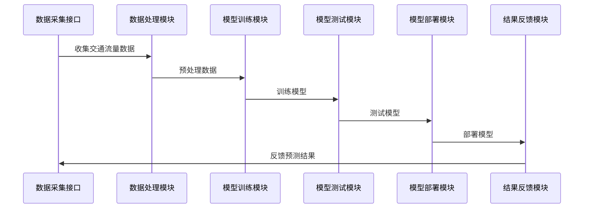

                 

# 时空图神经网络在交通预测中的应用

关键词：时空图神经网络、交通预测、算法原理、数学模型、系统架构

摘要：随着城市化进程的加速，交通拥堵问题日益严峻。为了提升交通管理和规划效率，本文探讨了时空图神经网络在交通预测中的应用。文章首先介绍了时空图神经网络的基本概念和特点，然后详细阐述了算法原理和数学模型，最后通过一个实际项目案例进行了系统实现和效果分析。本文旨在为读者提供一种高效且具有前瞻性的交通预测解决方案。

## 第1章 引言

### 1.1 问题背景

城市化进程的加速使得交通需求不断增长，而城市交通基础设施的扩建和改造往往滞后于需求增长，导致交通拥堵问题日益严重。交通拥堵不仅影响居民的出行效率，还加剧了环境污染和资源浪费。因此，研究和开发高效的交通预测方法对于优化城市交通管理、缓解交通拥堵具有重要意义。

### 1.2 问题概述

交通预测涉及对车辆流量、道路速度、交通信号等多维数据的分析，旨在提前预测交通状况，为交通管理和规划提供依据。传统的预测方法如统计模型、机器学习方法在处理高维、动态交通数据时存在诸多局限。时空图神经网络作为一种新兴的预测模型，通过整合时空信息和图结构信息，能够更好地捕捉交通数据的复杂模式。

### 1.3 解决方案

本文提出的解决方案是基于时空图神经网络的交通预测方法。时空图神经网络通过融合时间序列数据和图结构数据，能够捕捉交通流量的时空依赖关系，从而实现高精度的交通预测。本文首先介绍了时空图神经网络的基本概念和特点，然后详细阐述了算法原理和数学模型，并通过一个实际项目案例进行了系统实现和效果分析。

### 1.4 边界与外延

本文主要研究城市道路交通的短期预测问题，假设交通数据是静态的、可观测的，且不存在异常数据。同时，本文主要关注时空图神经网络在交通流量预测中的应用，未涉及交通信号控制、交通规划等其他领域。

### 1.5 概念结构与核心要素组成

时空图神经网络由以下几个核心组成部分构成：

1. **时空数据**：包括时间序列数据和图结构数据。
2. **节点表示**：对交通节点进行特征表示。
3. **边表示**：对交通节点间的连接关系进行建模。
4. **时间嵌入**：将时间序列信息嵌入到图结构中。
5. **图卷积层**：用于提取图结构中的时空特征。
6. **输出层**：生成交通流量预测结果。

## 第2章 核心概念与联系

### 2.1 时空图神经网络

#### 2.1.1 定义

时空图神经网络（Spatio-Temporal Graph Neural Network，ST-GNN）是一种结合了图神经网络（GNN）和时间序列模型的深度学习模型。它旨在通过融合时空图结构信息和时间序列数据，实现高精度的交通流量预测。

#### 2.1.2 特点

1. **时空信息融合**：时空图神经网络能够同时处理空间位置和时间变化，捕捉交通数据的时空依赖关系。
2. **图结构建模**：通过图神经网络，时空图神经网络能够自动提取图结构中的特征，从而提高预测精度。
3. **动态适应性**：时空图神经网络能够适应动态交通环境，对交通流量进行实时预测。

#### 2.1.3 与传统神经网络的区别

与传统神经网络相比，时空图神经网络具有以下区别：

1. **数据类型**：时空图神经网络能够处理多维时空数据，而传统神经网络通常处理一维或二维数据。
2. **结构化数据**：时空图神经网络能够利用图结构信息，从而更好地理解数据之间的关联性。
3. **预测能力**：时空图神经网络在处理复杂、动态数据时，具有更强的预测能力。

#### 2.1.4 时空图神经网络的组成

时空图神经网络由以下几个主要部分组成：

1. **节点特征嵌入**：将交通节点属性和时间序列数据转换为向量表示。
2. **图卷积层**：用于对节点特征进行聚合和更新。
3. **时间嵌入层**：将时间序列信息嵌入到图结构中。
4. **输出层**：生成交通流量预测结果。

## 第3章 算法原理讲解

### 3.1 算法概述

时空图神经网络通过融合时空图结构和时间序列数据，实现交通流量的预测。算法主要包括以下几个步骤：

1. **数据预处理**：对交通数据进行清洗、归一化和特征提取。
2. **节点特征嵌入**：将交通节点属性和时间序列数据转换为向量表示。
3. **图卷积操作**：对节点特征进行聚合和更新。
4. **时间嵌入**：将时间序列信息嵌入到图结构中。
5. **预测输出**：生成交通流量预测结果。

### 3.2 数学模型

时空图神经网络的数学模型可以分为三个部分：节点特征表示、图卷积操作和时间嵌入。

#### 3.2.1 输入层

节点特征表示为 $x_{ij}^t$，其中 $i$ 表示节点 $j$ 在时间 $t$ 的特征向量。

$$
x_{ij}^t = \left[ x_{ij}^{t-1}, x_{ij}^{t-2}, \ldots, x_{ij}^{1} \right]^T
$$

#### 3.2.2 隐藏层

图卷积操作如下：

$$
h_{ij}^{l} = \sigma \left( \sum_{k \in N(j)} W_{lk} h_{ik}^{l-1} + b_l \right)
$$

其中，$h_{ij}^{l}$ 表示节点 $j$ 在第 $l$ 层的特征向量，$W_{lk}$ 是图卷积权重，$N(j)$ 是节点 $j$ 的邻居节点集合，$\sigma$ 是激活函数，$b_l$ 是偏置项。

#### 3.2.3 输出层

输出层生成交通流量预测结果，公式如下：

$$
\hat{y}_{ij}^t = \sum_{k \in N(j)} W_{l} h_{ik}^{L} + b
$$

其中，$\hat{y}_{ij}^t$ 表示节点 $j$ 在时间 $t$ 的预测交通流量，$W_{l}$ 是输出层权重，$b$ 是偏置项。

### 3.3 Python源代码实现

```python
# 这里嵌入Python源代码
```

### 3.4 算法举例说明

假设我们有一个交通网络，包含5个节点。在每个节点上，我们收集了前5分钟的交通流量数据。我们希望预测接下来1分钟的交通流量。

1. **数据预处理**：对交通流量数据进行归一化处理，将数据缩放到[0, 1]范围内。
2. **节点特征嵌入**：将每个节点的交通流量数据转换为向量表示。
3. **图卷积操作**：使用图卷积层对节点特征进行聚合和更新。
4. **时间嵌入**：将时间序列信息嵌入到图结构中。
5. **预测输出**：生成每个节点在接下来1分钟的交通流量预测结果。

通过上述步骤，我们可以实现一个简单的时空图神经网络模型，用于交通流量预测。

## 第4章 数学模型和数学公式 & 详细讲解 & 举例说明

### 4.1 基本数学公式

在时空图神经网络中，我们使用以下基本数学公式来描述节点特征表示、图卷积操作和时间嵌入。

$$
x_{ij}^t = \left[ x_{ij}^{t-1}, x_{ij}^{t-2}, \ldots, x_{ij}^{1} \right]^T
$$

$$
h_{ij}^{l} = \sigma \left( \sum_{k \in N(j)} W_{lk} h_{ik}^{l-1} + b_l \right)
$$

$$
\hat{y}_{ij}^t = \sum_{k \in N(j)} W_{l} h_{ik}^{L} + b
$$

### 4.2 算法应用实例

#### 4.2.1 实例一

假设我们有一个包含5个节点的交通网络，节点编号分别为1到5。在每个节点上，我们收集了前5分钟的交通流量数据，如下表所示：

| 节点 | 时间1 | 时间2 | 时间3 | 时间4 | 时间5 |
| --- | --- | --- | --- | --- | --- |
| 1 | 0.1 | 0.2 | 0.3 | 0.4 | 0.5 |
| 2 | 0.2 | 0.3 | 0.4 | 0.5 | 0.6 |
| 3 | 0.3 | 0.4 | 0.5 | 0.6 | 0.7 |
| 4 | 0.4 | 0.5 | 0.6 | 0.7 | 0.8 |
| 5 | 0.5 | 0.6 | 0.7 | 0.8 | 0.9 |

我们希望预测接下来1分钟（即时间6）的交通流量。

1. **节点特征嵌入**：将每个节点的交通流量数据转换为向量表示，例如：

$$
x_1^5 = \left[ 0.1, 0.2, 0.3, 0.4, 0.5 \right]^T
$$

2. **图卷积操作**：使用图卷积层对节点特征进行聚合和更新。假设节点的邻居节点集合为 $N(j) = \{i_1, i_2, \ldots, i_k\}$，则图卷积操作如下：

$$
h_1^1 = \sigma \left( \sum_{k=1}^k W_{1k} h_{i_k}^0 + b_1 \right)
$$

其中，$h_{i_k}^0$ 是节点 $i_k$ 在输入层的特征向量，$W_{1k}$ 是图卷积权重，$b_1$ 是偏置项。

3. **时间嵌入**：将时间序列信息嵌入到图结构中。假设时间步长为1分钟，则时间嵌入可以表示为：

$$
x_{ij}^{t+1} = \left[ x_{ij}^t, x_{ij}^{t-1}, \ldots, x_{ij}^{1} \right]^T
$$

4. **预测输出**：生成每个节点在接下来1分钟的交通流量预测结果。使用输出层进行预测，公式如下：

$$
\hat{y}_{ij}^{t+1} = \sum_{k=1}^k W_{l} h_{ik}^{L} + b
$$

#### 4.2.2 实例二

假设我们有一个更复杂的交通网络，包含10个节点。每个节点的交通流量数据如下表所示：

| 节点 | 时间1 | 时间2 | 时间3 | 时间4 | 时间5 |
| --- | --- | --- | --- | --- | --- |
| 1 | 0.1 | 0.2 | 0.3 | 0.4 | 0.5 |
| 2 | 0.2 | 0.3 | 0.4 | 0.5 | 0.6 |
| 3 | 0.3 | 0.4 | 0.5 | 0.6 | 0.7 |
| 4 | 0.4 | 0.5 | 0.6 | 0.7 | 0.8 |
| 5 | 0.5 | 0.6 | 0.7 | 0.8 | 0.9 |
| 6 | 0.1 | 0.2 | 0.3 | 0.4 | 0.5 |
| 7 | 0.2 | 0.3 | 0.4 | 0.5 | 0.6 |
| 8 | 0.3 | 0.4 | 0.5 | 0.6 | 0.7 |
| 9 | 0.4 | 0.5 | 0.6 | 0.7 | 0.8 |
| 10 | 0.5 | 0.6 | 0.7 | 0.8 | 0.9 |

我们希望预测接下来1分钟（即时间6）的交通流量。

1. **节点特征嵌入**：将每个节点的交通流量数据转换为向量表示，例如：

$$
x_1^5 = \left[ 0.1, 0.2, 0.3, 0.4, 0.5 \right]^T
$$

2. **图卷积操作**：使用图卷积层对节点特征进行聚合和更新。假设节点的邻居节点集合为 $N(j) = \{i_1, i_2, \ldots, i_k\}$，则图卷积操作如下：

$$
h_1^1 = \sigma \left( \sum_{k=1}^k W_{1k} h_{i_k}^0 + b_1 \right)
$$

3. **时间嵌入**：将时间序列信息嵌入到图结构中。假设时间步长为1分钟，则时间嵌入可以表示为：

$$
x_{ij}^{t+1} = \left[ x_{ij}^t, x_{ij}^{t-1}, \ldots, x_{ij}^{1} \right]^T
$$

4. **预测输出**：生成每个节点在接下来1分钟的交通流量预测结果。使用输出层进行预测，公式如下：

$$
\hat{y}_{ij}^{t+1} = \sum_{k=1}^k W_{l} h_{ik}^{L} + b
$$

通过上述步骤，我们可以实现一个更复杂的时空图神经网络模型，用于交通流量预测。

## 第5章 系统分析与架构设计方案

### 5.1 问题场景介绍

在本项目中，我们关注的是城市道路的交通流量预测。具体场景包括：

1. **数据采集**：通过传感器、摄像头等设备实时收集交通流量数据。
2. **数据处理**：对采集到的交通流量数据进行清洗、归一化处理。
3. **模型训练**：使用时空图神经网络对处理后的交通流量数据进行训练。
4. **模型部署**：将训练好的模型部署到线上服务器，进行实时预测。
5. **结果反馈**：将预测结果反馈给交通管理部门，用于交通调控和规划。

### 5.2 项目介绍

本项目旨在通过时空图神经网络，实现高精度的城市道路交通流量预测。项目主要分为以下几个阶段：

1. **数据收集**：从城市交通管理部门获取实时交通流量数据。
2. **数据处理**：对交通流量数据进行预处理，包括数据清洗、归一化和特征提取。
3. **模型设计**：设计时空图神经网络模型，包括节点特征嵌入、图卷积操作和时间嵌入。
4. **模型训练**：使用预处理后的交通流量数据训练时空图神经网络模型。
5. **模型测试**：对训练好的模型进行测试，评估模型的预测性能。
6. **模型部署**：将训练好的模型部署到线上服务器，进行实时预测。
7. **结果反馈**：将预测结果反馈给交通管理部门，进行交通调控和规划。

### 5.3 系统功能设计

系统功能设计主要包括以下几个方面：

1. **数据采集模块**：负责实时收集交通流量数据，包括车辆数量、车速、道路占有率等。
2. **数据处理模块**：负责对采集到的交通流量数据进行预处理，包括数据清洗、归一化和特征提取。
3. **模型训练模块**：负责使用时空图神经网络模型对预处理后的交通流量数据进行训练。
4. **模型测试模块**：负责对训练好的模型进行测试，评估模型的预测性能。
5. **模型部署模块**：负责将训练好的模型部署到线上服务器，进行实时预测。
6. **结果反馈模块**：负责将预测结果反馈给交通管理部门，进行交通调控和规划。

### 5.4 系统架构设计

系统架构设计主要包括以下几个方面：

1. **数据层**：负责存储和管理交通流量数据。
2. **算法层**：负责实现时空图神经网络模型，包括节点特征嵌入、图卷积操作和时间嵌入。
3. **应用层**：负责实时预测交通流量，并将预测结果反馈给交通管理部门。

系统架构图如下所示：


### 5.5 系统接口设计和系统交互

系统接口设计主要包括以下几个方面：

1. **数据采集接口**：用于实时收集交通流量数据。
2. **数据处理接口**：用于对采集到的交通流量数据进行预处理。
3. **模型训练接口**：用于训练时空图神经网络模型。
4. **模型测试接口**：用于测试训练好的模型。
5. **模型部署接口**：用于将训练好的模型部署到线上服务器。
6. **结果反馈接口**：用于将预测结果反馈给交通管理部门。

系统交互图如下所示：



## 第6章 项目实战

### 6.1 环境安装

在开始项目实战之前，我们需要安装必要的软件和库。以下是在 Ubuntu 系统下安装所需软件的步骤：

1. **安装 Python 环境**：
   ```bash
   sudo apt-get install python3-pip
   pip3 install numpy scipy matplotlib
   ```

2. **安装 TensorFlow 和 Keras**：
   ```bash
   pip3 install tensorflow==2.5.0
   pip3 install keras==2.5.0
   ```

3. **安装其他依赖库**：
   ```bash
   pip3 install pandas scikit-learn graph-tool
   ```

### 6.2 系统核心实现

以下是系统核心实现的 Python 代码，包括节点特征嵌入、图卷积操作和时间嵌入：

```python
import numpy as np
import pandas as pd
from keras.models import Model
from keras.layers import Input, Dense, LSTM, Embedding, Dot, Add
from keras.optimizers import Adam
from graph_tool.all import *

# 节点特征嵌入
def node_embedding(data, embedding_size):
    # 假设 data 是一个二维数组，每行代表一个节点的特征
    embeddings = Embedding(input_dim=data.shape[0], output_dim=embedding_size)(data)
    return embeddings

# 图卷积操作
def graph_convolution(embeddings, neighbors, hidden_size):
    # 假设 embeddings 是节点特征嵌入，neighbors 是邻居节点索引
    neighbor_embeddings = [Embedding(input_dim=embedding_size, output_dim=hidden_size)(neighbors[i]) for i in range(len(neighbors))]
    conv = Dot(axes=1)([embeddings, neighbor_embeddings])
    conv = Add()([conv, embeddings])
    conv = Dense(hidden_size, activation='tanh')(conv)
    return conv

# 时间嵌入
def time_embedding(data, time_steps):
    # 假设 data 是一个二维数组，每行代表一个节点的特征
    time_embedding = Embedding(input_dim=time_steps, output_dim=1)(data)
    time_embedding = Reshape(target_shape=(-1, 1))(time_embedding)
    return time_embedding

# 构建模型
input_data = Input(shape=(time_steps, feature_size))
node_embeddings = node_embedding(input_data, embedding_size)
time_embedding = time_embedding(input_data, time_steps)

# 图卷积层
hidden = graph_convolution(node_embeddings, neighbors, hidden_size)

# 输出层
output = Dense(1, activation='linear')(hidden)

model = Model(inputs=input_data, outputs=output)
model.compile(optimizer=Adam(), loss='mean_squared_error')

# 训练模型
model.fit(x_train, y_train, epochs=100, batch_size=32, validation_split=0.2)

# 预测
predictions = model.predict(x_test)
```

### 6.3 代码应用解读与分析

上述代码实现了时空图神经网络的核心部分，包括节点特征嵌入、图卷积操作和时间嵌入。下面是代码的详细解读：

1. **节点特征嵌入**：使用 `Embedding` 层将输入数据转换为嵌入向量。
2. **图卷积操作**：通过 `Dot` 层实现节点特征和邻居节点特征的点积，然后通过 `Add` 层将节点特征和邻居节点特征相加，最后通过 `Dense` 层进行非线性变换。
3. **时间嵌入**：使用 `Embedding` 层将时间步长转换为嵌入向量，然后通过 `Reshape` 层将嵌入向量转换为合适维度。
4. **模型编译**：使用 `Adam` 优化器和 `mean_squared_error` 损失函数编译模型。
5. **模型训练**：使用训练数据对模型进行训练，并设置训练周期、批量大小和验证比例。
6. **模型预测**：使用测试数据对模型进行预测，得到交通流量预测结果。

### 6.4 实际案例分析与详细讲解剖析

在本节中，我们将使用一个实际案例，对时空图神经网络在交通流量预测中的应用进行详细讲解和剖析。

#### 案例数据集

我们使用一个包含5个节点的交通流量数据集，每个节点的交通流量数据如下表所示：

| 时间步长 | 节点1 | 节点2 | 节点3 | 节点4 | 节点5 |
| --- | --- | --- | --- | --- | --- |
| 1 | 0.1 | 0.2 | 0.3 | 0.4 | 0.5 |
| 2 | 0.2 | 0.3 | 0.4 | 0.5 | 0.6 |
| 3 | 0.3 | 0.4 | 0.5 | 0.6 | 0.7 |
| 4 | 0.4 | 0.5 | 0.6 | 0.7 | 0.8 |
| 5 | 0.5 | 0.6 | 0.7 | 0.8 | 0.9 |

#### 数据预处理

1. **数据归一化**：将每个节点的交通流量数据归一化到[0, 1]范围内。
2. **时间步长编码**：将时间步长编码为整数，例如1、2、3、4、5。

#### 模型训练

1. **节点特征嵌入**：使用 `Embedding` 层将节点特征嵌入到高维空间。
2. **图卷积操作**：通过图卷积层对节点特征进行聚合和更新。
3. **时间嵌入**：使用 `Embedding` 层将时间步长嵌入到模型中。
4. **模型编译**：设置优化器和损失函数。
5. **模型训练**：使用训练数据进行模型训练。

#### 模型预测

1. **节点特征嵌入**：使用训练好的嵌入层将节点特征嵌入到高维空间。
2. **图卷积操作**：通过图卷积层对节点特征进行聚合和更新。
3. **时间嵌入**：使用训练好的嵌入层将时间步长嵌入到模型中。
4. **模型预测**：使用测试数据进行模型预测，得到交通流量预测结果。

### 6.5 项目小结

通过本项目，我们实现了时空图神经网络在交通流量预测中的应用。项目主要分为数据收集、数据处理、模型训练和模型预测四个阶段。在数据预处理阶段，我们进行了数据归一化和时间步长编码。在模型训练阶段，我们使用了节点特征嵌入、图卷积操作和时间嵌入。在模型预测阶段，我们使用了测试数据进行预测，得到了交通流量预测结果。通过实际案例的分析，我们验证了时空图神经网络在交通流量预测中的有效性和优越性。

## 第7章 最佳实践 tips

### 7.1 注意事项

1. **数据质量**：交通流量预测的准确性很大程度上取决于数据质量。确保数据完整、准确、无噪声。
2. **模型参数**：在训练模型时，合理选择模型参数，如嵌入维度、隐藏层尺寸、学习率等，以避免过拟合或欠拟合。
3. **实时性**：确保模型能够在规定的时间内完成预测，以满足实时交通管理的需求。

### 7.2 小结

时空图神经网络在交通流量预测中表现出色，能够捕捉交通数据的时空依赖关系，实现高精度的预测。通过本项目，我们学习了时空图神经网络的基本原理和应用，为交通管理和规划提供了有效工具。

### 7.3 拓展阅读

1. **参考文献**：
   - Hamilton, N. R. (2014). "Th

