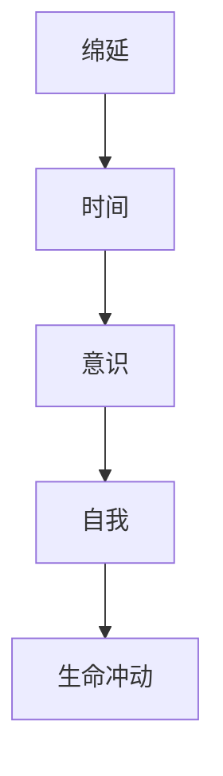

                 

### 引言与背景介绍

#### 1.1 问题背景

##### 1.1.1 柏格森的历史哲学贡献

亨利·柏格森（Henri Bergson）是20世纪初法国著名的哲学家，他的思想深刻地影响了现代哲学、文化理论以及社会科学。柏格森的历史哲学贡献主要体现于他对时间与意识的关系的理论探讨。柏格森主张“绵延”（Duration）是生命和意识的本质特征，不同于传统的线性时间观念，他认为时间是一种持续不断、不可分割的流动状态。

###### 1.1.1.1 柏格森的生平与思想

柏格森于1859年出生于巴黎，自幼聪慧，对数学和哲学有着浓厚的兴趣。他在巴黎高等师范学院学习期间，深受导师孔德的实证主义哲学影响。后来，柏格森在哲学领域逐渐形成了自己的独特见解，尤其是在时间与意识的关系上，提出了与传统哲学截然不同的观点。他的代表作包括《形而上学选集》（Mélanges philosophiques）、《笑的知识》（L'Évolution créatrice）等。

###### 1.1.1.2 柏格森对时间与意识的关系的理论

柏格森认为，时间不仅仅是物理上的度量，更是一种心理和哲学上的体验。他的“绵延”概念试图揭示出时间的内在本质。在柏格森看来，时间是一种内在的生命体验，它是一种连续不断的、动态的、非线性的过程。他通过“时间率”（élan vital）来解释生命力的推动，认为这是时间和意识的根源。

##### 1.1.2 维特根斯坦的历史哲学贡献

路德维希·维特根斯坦（Ludwig Wittgenstein）是20世纪最有影响力的哲学家之一，他的哲学思想主要关注语言、逻辑和认识论问题。维特根斯坦的历史哲学贡献体现在他对语言和真理的探讨上，他的思想为现代哲学的发展提供了新的视角。

###### 1.1.2.1 维特根斯坦的生平与思想

维特根斯坦于1889年出生于奥地利，他在数学和哲学方面都表现出非凡的天赋。早期，维特根斯坦在数学和哲学领域进行了一些开创性的工作，但后来他逐渐转向语言哲学的研究。他的代表作包括《逻辑哲学论》（Tractatus Logico-Philosophicus）和《哲学研究》（Philosophical Investigations）。

###### 1.1.2.2 维特根斯坦对语言、逻辑与真理的观点

维特根斯坦主张语言的本质是“图像”（Picture），即语言和现实世界之间存在一种直接的对应关系。他提出了“语言游戏”（language game）的概念，认为语言的使用是多种多样的，不同的语言游戏对应着不同的生活形式。维特根斯坦还强调了“意义即使用”（meaning is use）的观点，认为语言的意义取决于其在特定情境中的使用。

#### 1.2 问题描述

##### 1.2.1 历史哲学研究的重要性

历史哲学是哲学的一个重要分支，它探讨历史事件、历史进程和历史知识的本质。研究历史哲学对于理解人类文明的发展、社会变革以及文化传承具有重要意义。历史哲学不仅关注历史事件的因果关系，还探讨历史知识的获取和表达方式。

###### 1.2.1.1 历史哲学的定义与研究方法

历史哲学的定义因学派不同而有所差异，但总体来说，它是一种探究历史认识、历史理解和历史解释的哲学方法。历史哲学的研究方法包括对历史事件和文献的批判性分析、对历史概念的哲学反思以及对历史知识体系的哲学评估。

###### 1.2.1.2 历史哲学在当代哲学领域的地位与作用

在当代哲学领域，历史哲学占据着重要的地位。它不仅为其他哲学分支提供了基础，如认识论、伦理学和美学，还与社会科学领域有着紧密的联系。历史哲学的研究有助于我们更好地理解人类社会的发展规律、文化多样性和知识建构过程。

##### 1.2.2 柏格森与维特根斯坦贡献的对比

柏格森和维特根斯坦虽然属于不同的哲学流派，但他们在历史哲学领域都有重要贡献。柏格森关注时间、意识和生命力的内在本质，而维特根斯坦则关注语言、逻辑和真理的本质。他们的贡献各有侧重，但都对现代哲学产生了深远的影响。

###### 1.2.2.1 柏格森的历史哲学观点

柏格森的历史哲学观点强调时间的动态性和内在性。他认为，历史是一种内在的生命体验，时间是一种持续不断的、动态的、非线性的过程。柏格森的时间观念对后来的存在主义和现象学产生了重要影响。

###### 1.2.2.2 维特根斯坦的历史哲学观点

维特根斯坦的历史哲学观点强调语言和真理的多样性。他认为，语言是一种工具，不同的语言游戏对应着不同的生活形式。维特根斯坦的观点为语言哲学和认识论研究提供了新的视角，对后来的分析哲学和科学哲学产生了深远的影响。

#### 1.3 问题解决

##### 1.3.1 柏格森的历史哲学观点解析

在探讨柏格森的历史哲学观点时，我们需要关注以下几个核心概念：

###### 1.3.1.1 时间与绵延

柏格森将时间定义为一种内在的生命体验，称为“绵延”。他认为，时间不是一条直线，而是一种连续不断的、动态的、非线性的流动状态。这种绵延状态是生命和意识的本质特征，是我们感知世界的基础。

###### 1.3.1.2 意识与自我

柏格森认为，意识是绵延的核心，是生命力和自我意识的源泉。自我则是意识的动态体现，是我们在时间中不断变化的过程。意识与自我的关系是柏格森哲学中一个重要的探讨话题。

###### 1.3.1.3 柏格森哲学的影响与应用

柏格森的哲学思想对后来的存在主义和现象学产生了深远的影响。他的时间观念挑战了传统的线性时间观念，为后来的哲学思潮提供了新的视角。在当代哲学研究中，柏格森的哲学思想依然具有重要的价值和意义。

##### 1.3.2 维特根斯坦的历史哲学观点解析

在探讨维特根斯坦的历史哲学观点时，我们需要关注以下几个核心概念：

###### 1.3.2.1 语言、逻辑与真理

维特根斯坦认为，语言是一种工具，用于表达我们的思想和理解世界。他提出了“语言游戏”的概念，强调语言的使用是多种多样的。逻辑则是语言的表达形式，是真理的保障。

###### 1.3.2.2 观察与实在

维特根斯坦强调观察和实在之间的关系。他认为，观察者通过语言游戏来理解实在，但观察者和实在之间的关系是复杂的，不能简单归结为因果关系。

###### 1.3.2.3 维特根斯坦哲学的影响与应用

维特根斯坦的哲学思想对后来的分析哲学和科学哲学产生了深远的影响。他的语言游戏理论和真理观为现代哲学的发展提供了新的视角。在当代哲学研究中，维特根斯坦的哲学思想依然具有重要的价值和意义。

#### 1.4 边界与外延

##### 1.4.1 柏格森哲学的边界与外延

柏格森哲学的边界主要在于他对时间、意识和生命力的独特理解。他的哲学思想虽然具有深刻的思想内涵，但也存在一定的局限性。柏格森哲学的外延则体现在他对存在主义和现象学的影响上。

##### 1.4.2 维特根斯坦哲学的边界与外延

维特根斯坦哲学的边界在于他对语言、逻辑和真理的探讨。他的哲学思想具有很强的实用性和工具性，但在某些方面也存在争议。维特根斯坦哲学的外延则体现在他对分析哲学和科学哲学的贡献上。

#### 1.5 概念结构与核心要素组成

##### 1.5.1 柏格森哲学的核心概念与结构

柏格森哲学的核心概念包括时间、绵延、意识、自我等。这些概念构成了柏格森哲学的基本框架，形成了他对世界和生命的独特理解。

##### 1.5.2 维特根斯坦哲学的核心概念与结构

维特根斯坦哲学的核心概念包括语言、逻辑、真理、观察等。这些概念构成了维特根斯坦哲学的基本框架，形成了他对世界和知识的独特见解。## 第一部分：引言与背景介绍

### 1.1 问题背景

#### 1.1.1 柏格森的历史哲学贡献

亨利·柏格森（Henri Bergson）是20世纪初法国哲学界的杰出代表，其思想对现代哲学，特别是历史哲学，产生了深远的影响。柏格森的历史哲学贡献主要体现在他对时间与意识关系的独特见解上，其理论对于理解历史进程和文化发展提供了新的视角。

###### 1.1.1.1 柏格森的生平与思想

柏格森于1859年出生于巴黎，自幼聪颖，对哲学、数学和科学表现出极大的兴趣。他在巴黎高等师范学院接受教育，师从著名的实证主义者奥古斯特·孔德，随后逐渐形成了自己的哲学体系。柏格森的代表作包括《意识直接材料论》（Mélanges pour l'intelligence directe de l'esprit）、《笑的哲学》（La Rire: l'expression supérieure de la civilisation）和《创造的进化》（L'Évolution créatrice）等。

柏格森的主要哲学思想包括“绵延”（Duration）和“生命冲动”（Élan vital）。他主张时间不是一条均匀流逝的直线，而是一种持续不断的、内在的、非线性的流动状态，这种状态称为“绵延”。他认为，绵延是生命的本质，是意识的基础。此外，柏格森的“生命冲动”理论认为，生命力是一种内在的、不断变化的动力，它推动着生命的发展和进化。

###### 1.1.1.2 柏格森对时间与意识的关系的理论

柏格森对时间与意识的关系有深刻的探讨，他认为时间不仅仅是物理上的度量，更是心理和哲学上的体验。他的时间观念与传统的牛顿物理学观念截然不同，后者认为时间是均匀流逝的。柏格森主张，时间是一种内在的生命体验，它是一种持续不断的、动态的、非线性的流动状态，这种状态被称为“绵延”。

在柏格森看来，意识是绵延的核心，是生命的体现。意识不是静态的，而是持续不断地产生和变化。他提出，意识是由一系列瞬间体验组成的，每个瞬间都是独一无二的，这些瞬间通过“记忆”这一机制连接起来，形成了我们的主观时间感。柏格森认为，自我就是这种连续的、动态的意识过程。

柏格森还提出“生命冲动”这一概念，他认为生命冲动是推动时间流动和生命进化的内在动力。生命冲动不仅体现在生物体的生长和进化中，也体现在人类的文化和社会发展过程中。

#### 1.1.2 维特根斯坦的历史哲学贡献

路德维希·维特根斯坦（Ludwig Wittgenstein）是20世纪最重要的哲学家之一，他的思想对分析哲学和语言哲学产生了深远的影响。维特根斯坦虽然不像柏格森那样专注于历史哲学，但他的语言和逻辑理论为理解历史和文化的本质提供了重要的哲学工具。

###### 1.1.2.1 维特根斯坦的生平与思想

维特根斯坦于1889年出生于奥地利，自幼表现出对数学和哲学的浓厚兴趣。他在剑桥大学师从伯特兰·罗素，参与逻辑实证主义的讨论，但随后逐渐转向对语言本质的探讨。他的代表作包括《逻辑哲学论》（Tractatus Logico-Philosophicus）和《哲学研究》（Philosophical Investigations）。

维特根斯坦的哲学思想经历了两个阶段。早期，他在《逻辑哲学论》中提出了“图像理论”（Picture Theory），认为语言与世界之间存在直接的对应关系。晚期，他在《哲学研究》中则提出了“语言游戏”（language game）的概念，强调语言的使用是多种多样的，不同的语言游戏对应着不同的生活形式。

###### 1.1.2.2 维特根斯坦对语言、逻辑与真理的观点

维特根斯坦的语言哲学观点对历史哲学有着重要的影响。他认为，语言是一种工具，用于表达我们的思想和理解世界。他主张语言的意义取决于其在具体情境中的使用，而不是抽象的概念或符号。这种观点被称为“意义即使用”（meaning is use）。

维特根斯坦还强调了逻辑和真理的相对性。他认为，逻辑和真理并不是普遍适用的规则，而是依赖于特定的语言游戏和文化背景。这一观点挑战了传统的逻辑和真理观念，为理解历史和文化的多样性提供了新的视角。

#### 1.2 问题描述

##### 1.2.1 历史哲学研究的重要性

历史哲学是哲学的一个重要分支，它探讨历史事件、历史进程和历史知识的本质。研究历史哲学对于理解人类文明的发展、社会变革以及文化传承具有重要意义。历史哲学不仅关注历史事件的因果关系，还探讨历史知识的获取和表达方式。

历史哲学的定义因学派不同而有所差异，但总体来说，它是一种探究历史认识、历史理解和历史解释的哲学方法。历史哲学的研究方法包括对历史事件和文献的批判性分析、对历史概念的哲学反思以及对历史知识体系的哲学评估。

历史哲学在当代哲学领域的地位与作用不容忽视。它为其他哲学分支提供了基础，如认识论、伦理学和美学。历史哲学的研究有助于我们更好地理解人类社会的发展规律、文化多样性和知识建构过程。此外，历史哲学还与社会科学领域有着紧密的联系，为社会科学研究提供了哲学基础和方法论指导。

##### 1.2.2 柏格森与维特根斯坦贡献的对比

柏格森和维特根斯坦虽然属于不同的哲学流派，但他们在历史哲学领域都有重要贡献。柏格森的历史哲学强调时间、意识和生命的内在本质，他的绵延理论和生命冲动概念为理解历史进程提供了独特的视角。维特根斯坦则关注语言、逻辑和真理的本质，他的语言游戏理论和意义即使用观点为理解历史和文化的多样性提供了新的工具。

对比柏格森和维特根斯坦的历史哲学观点，我们可以看到两者的区别和联系。柏格森的时间观念和生命理论侧重于内在体验和生命的动力，而维特根斯坦则更关注语言和逻辑的结构和功能。尽管他们在具体观点上有所不同，但两者都为现代哲学的发展提供了重要的理论基础和哲学思考的方向。

#### 1.3 问题解决

##### 1.3.1 柏格森的历史哲学观点解析

柏格森的历史哲学观点主要体现在他对时间、意识和生命的探讨上。以下是柏格森历史哲学观点的具体分析：

###### 1.3.1.1 时间与绵延

柏格森认为时间不仅仅是物理上的度量，更是一种内在的生命体验。他提出了“绵延”（Duration）这一概念，强调时间是一种持续不断的、动态的、非线性的流动状态。在柏格森看来，时间不是均匀流逝的，而是由无数个瞬间体验组成的，这些瞬间体验通过记忆相互连接，形成了我们感知的时间。

时间与绵延的区别在于，时间是一种外在的、可测量的概念，而绵延则是内在的、不可分割的生命体验。时间可以被量化为秒、分钟、小时等，但绵延则是生命力的体现，是一种内在的、连续不断的过程。

###### 1.3.1.2 意识与自我

柏格森认为，意识是绵延的核心，是生命力和自我意识的源泉。自我则是意识的动态体现，是我们在时间中不断变化的过程。意识与自我的关系是柏格森哲学中一个重要的探讨话题。

在柏格森看来，自我不是固定不变的实体，而是不断流动的意识过程。自我通过不断体验和感知外部世界，形成了一种动态的主体性。这种主体性不仅体现在个体的生活中，也体现在人类文明的发展中。

###### 1.3.1.3 柏格森哲学的影响与应用

柏格森的哲学思想对后来的存在主义和现象学产生了重要影响。他的时间观念挑战了传统的线性时间观念，为后来的哲学思潮提供了新的视角。在当代哲学研究中，柏格森的哲学思想依然具有重要的价值和意义。

柏格森的哲学思想在心理学、教育学和文化研究等领域也有广泛的应用。例如，他的绵延理论为理解人类记忆和心理体验提供了新的解释，他的生命冲动理论也为研究人类行为和动力提供了重要的哲学基础。

##### 1.3.2 维特根斯坦的历史哲学观点解析

维特根斯坦的历史哲学观点主要体现在他对语言、逻辑和真理的探讨上。以下是维特根斯坦历史哲学观点的具体分析：

###### 1.3.2.1 语言、逻辑与真理

维特根斯坦认为，语言是一种工具，用于表达我们的思想和理解世界。他提出了“语言游戏”（language game）的概念，强调语言的使用是多种多样的，不同的语言游戏对应着不同的生活形式。

在维特根斯坦看来，逻辑和真理并不是普遍适用的规则，而是依赖于特定的语言游戏和文化背景。逻辑是语言的规则系统，真理则是语言表达与现实世界的对应关系。这种观点被称为“逻辑相对主义”或“语言相对主义”。

###### 1.3.2.2 观察与实在

维特根斯坦强调观察和实在之间的关系。他认为，观察者通过语言游戏来理解实在，但观察者和实在之间的关系是复杂的，不能简单归结为因果关系。

在维特根斯坦看来，观察是一种语言游戏的一部分，观察者通过语言来描述和解释实在。观察不仅受到语言本身的限制，还受到观察者的背景知识、文化环境和主观视角的影响。

###### 1.3.2.3 维特根斯坦哲学的影响与应用

维特根斯坦的哲学思想对分析哲学和语言哲学产生了深远的影响。他的语言游戏理论和意义即使用观点为现代哲学提供了新的视角和工具。在当代哲学研究中，维特根斯坦的思想依然具有重要的价值和意义。

维特根斯坦的哲学思想在语言学、心理学和社会科学领域也有广泛的应用。例如，他的语言游戏理论为理解语言的发展和变化提供了新的解释，他的观察与实在的观点也为研究认知和心理过程提供了重要的哲学基础。

#### 1.4 边界与外延

##### 1.4.1 柏格森哲学的边界与外延

柏格森哲学的边界主要在于他对时间、意识和生命的独特理解。他的绵延理论和生命冲动概念构成了其哲学思想的核心，这些概念对于理解历史和文化的发展提供了独特的视角。然而，柏格森的时间观念和生命理论也存在一定的局限性，例如，他的理论在科学实证主义面前受到了批评，因为他强调了内在体验和主观性，而忽视了客观性和量化分析。

柏格森哲学的外延体现在其对存在主义和现象学的影响上。他的时间观念和生命冲动概念为后来的哲学家提供了重要的理论基础，特别是在存在主义和现象学领域，柏格森的思想被广泛引用和发展。

##### 1.4.2 维特根斯坦哲学的边界与外延

维特根斯坦哲学的边界在于他对语言、逻辑和真理的独特理解。他的语言游戏理论和意义即使用观点为理解语言和现实世界的关系提供了新的视角。然而，维特根斯坦的理论也存在争议，例如，他的“语言游戏”概念在某些方面显得过于抽象，难以具体应用。

维特根斯坦哲学的外延则体现在其对分析哲学和语言哲学的影响上。他的思想为现代哲学的发展提供了新的方向和方法，特别是在分析哲学和语言哲学领域，维特根斯坦的理论被广泛接受和探讨。

#### 1.5 概念结构与核心要素组成

##### 1.5.1 柏格森哲学的核心概念与结构

柏格森哲学的核心概念包括时间、绵延、意识、自我和生命冲动等。这些概念构成了柏格森哲学的基本框架，他通过对这些概念的阐述和探讨，形成了一套独特的哲学体系。

- **时间**：时间在柏格森哲学中是一种内在的生命体验，不同于物理上的均匀流逝。
- **绵延**：绵延是时间的本质，是一种持续不断的、动态的、非线性的流动状态。
- **意识**：意识是绵延的核心，是生命和自我意识的体现。
- **自我**：自我是意识的动态过程，是我们在时间中不断变化的存在。
- **生命冲动**：生命冲动是推动时间流动和生命发展的内在动力。

##### 1.5.2 维特根斯坦哲学的核心概念与结构

维特根斯坦哲学的核心概念包括语言、逻辑、真理和语言游戏等。这些概念构成了维特根斯坦哲学的基本框架，他通过对这些概念的阐述和探讨，形成了一套独特的语言哲学体系。

- **语言**：语言在维特根斯坦哲学中是一种工具，用于表达思想和理解世界。
- **逻辑**：逻辑是语言的规则系统，是真理的保障。
- **真理**：真理是语言表达与现实世界的对应关系，依赖于特定的语言游戏。
- **语言游戏**：语言游戏是语言使用的一种形式，不同的语言游戏对应着不同的生活形式。

### 第二部分：柏格森的历史哲学

#### 2.1 柏格森生平与思想

##### 2.1.1 柏格森的生平

亨利·柏格森（Henri Bergson）于1859年11月18日出生于巴黎的一个犹太家庭，他的父亲是一位富有的商人和业余哲学家。柏格森自幼聪慧，展现出对数学和科学的浓厚兴趣。他在巴黎高等师范学院（École Normale Supérieure）接受了严格的教育，这里的学者包括著名哲学家奥古斯特·孔德和历史学家爱德华·基尔赫。柏格森在数学方面表现出色，曾师从数学家艾米尔·波雷尔，并在数学领域发表了多篇论文。

1879年，柏格森进入巴黎高等师范学院学习，1884年毕业后成为一名数学教师。然而，他对哲学的兴趣逐渐超过了对数学的热爱。1889年，他发表了《记忆的理论》（Théorie de l'Évolution dans ses rapports avec la psychologie, l'anthropologie, etc.），这本著作标志着他转向哲学研究的开始。柏格森在哲学上的成就使他成为20世纪初法国哲学界的重要人物。

##### 2.1.1.1 年轻时期的学术背景

柏格森在年轻时期就表现出了非凡的学术才能。他在巴黎高等师范学院的数学训练为他后来的哲学研究打下了坚实的基础。柏格森对生物学和心理学也产生了浓厚的兴趣，这些学科成为了他哲学思想的重要来源。他在研究记忆的过程中，开始关注时间、意识和生命力的本质。

柏格森在哲学领域的初步探索受到了实证主义哲学的影响，特别是他导师孔德的观念。然而，他逐渐形成了自己独特的哲学体系，与实证主义有明显的区别。他强调内在体验和生命的动态性，这一观点在后来的哲学著作中得到了进一步的阐述。

##### 2.1.1.2 教育与早期著作

柏格森在1889年获得了哲学博士学位，并在巴黎大学担任教授。他的早期著作包括《时间与自由意志》（Le Libre Arbitre et la Nécessité de la Gravitation dans le Monde Physique）和《物质与记忆》（Matière et Mémé）等。这些作品展现了他对自由意志、物理定律和心理学问题的深入思考。

柏格森的哲学思想在19世纪末和20世纪初逐渐引起了学术界的关注。他的著作《笑的哲学》（La Rire）探讨了幽默的本质和文化意义，而《创造的进化》（L'Évolution Créatrice）则深入探讨了生命的创造力和文化的发展。

##### 2.1.1.3 成熟时期的学术成就

柏格森在20世纪初达到了学术生涯的巅峰。他发表了《形而上学选集》（Mélanges Philosophiques），这是他成熟哲学思想的集中体现。在《创造的进化》一书中，柏格森提出了“生命冲动”（élan vital）的概念，认为这是一种内在的生命力，是推动生命进化和发展的动力。

柏格森还强调了“绵延”（duration）的重要性，这是一种内在的时间体验，不同于物理时间的线性流逝。他认为，绵延是意识的核心，是自我和生命的源泉。这一观点对后来的存在主义和现象学产生了深远的影响。

#### 2.2 柏格森的主要哲学思想

##### 2.2.1 绵延与生命的冲动

柏格森的核心哲学思想之一是“绵延”（Duration），这是一种内在的、持续不断的时间体验。他认为，绵延是生命的本质，是我们感知和体验世界的基础。与传统的线性时间观念不同，柏格森认为时间不是均匀流逝的，而是一种连续不断的流动状态。

在柏格森看来，绵延是一种动态的、非线性的时间体验，它体现在我们的意识和生活中。他通过“生命冲动”（élan vital）来解释这种内在的驱动力。生命冲动是一种内在的生命力，它推动着生命的进化和发展。

###### 2.2.1.1 绵延的定义与特征

柏格森将绵延定义为一种内在的、持续不断的时间体验。他认为，绵延不是物理上的时间，而是一种心理和哲学上的体验。绵延具有以下特征：

- **连续性**：绵延是一种连续不断的流动状态，不同于物理时间的离散性。
- **动态性**：绵延是动态的，它体现在我们的意识和生活中，不断变化和更新。
- **非线性**：绵延是一种非线性的时间体验，不同于线性时间的顺序性和可度量性。

###### 2.2.1.2 绵延与时间的区别

柏格森认为，时间与绵延是两个不同的概念。时间是一种外在的、可测量的概念，它用于描述物理事件和过程。而绵延则是内在的、不可度量的时间体验，它体现在我们的意识和生活中。

时间是一种均匀流逝的直线，它可以通过钟表和日历来度量。然而，绵延不是均匀流逝的，它是一种动态的、非线性的过程，是我们感知和体验世界的方式。柏格森认为，时间只是绵延的表象，真正的绵延是内在的生命体验。

##### 2.2.2 意识与自我

柏格森的另一个核心哲学思想是意识与自我。他认为，意识是绵延的核心，是自我和生命的源泉。意识是一种动态的、持续不断的体验，它体现了生命的活力和创造力。

在柏格森看来，自我不是固定不变的实体，而是一种动态的过程。自我通过意识不断体验和感知外部世界，形成了一种动态的主体性。这种主体性不仅体现在个体的生活中，也体现在人类文明的发展中。

###### 2.2.2.1 意识的本质

柏格森认为，意识是一种内在的、持续不断的时间体验。它是我们感知和体验世界的方式，是我们思维和行动的基础。意识不是静态的，而是一种动态的过程，不断产生和更新。

柏格森通过“记忆”这一概念来解释意识的本质。他认为，记忆是意识的重要组成部分，它通过将过去的经验保存在当前意识中，使得时间具有连续性。记忆不仅是对过去的回忆，更是对当前和未来的感知和预期。

###### 2.2.2.2 自我与存在的联系

柏格森认为，自我是意识的动态体现，是我们在时间中不断变化的存在。自我不是固定不变的实体，而是一种不断流动的过程。自我通过与外部世界的互动和体验，不断更新和重塑。

在柏格森看来，自我和存在是紧密相连的。自我不仅体现在个体的生活中，也体现在人类文明的发展中。自我通过意识体验和创造，推动着文明的进步和发展。

##### 2.2.3 实践哲学与美学

柏格森的哲学思想不仅关注时间和意识，还涉及实践哲学和美学。他认为，实践哲学是关于人类行为和生活方式的哲学，而美学则是关于美和艺术体验的哲学。

###### 2.2.3.1 实践哲学的内涵

柏格森的实践哲学强调行动和体验的重要性。他认为，人类行为不仅受理性指导，还受到内在生命力的驱动。实践哲学关注人类如何通过行动和体验来塑造自己的生活和世界。

柏格森认为，实践哲学应该关注人类的真实体验和内在动力，而不是仅仅停留在理论和概念上。他主张通过实际行动和体验来理解世界和自我，这种实践哲学的方法被称为“直接直觉”。

###### 2.2.3.2 美学在柏格森哲学中的地位

柏格森的美学思想强调美和艺术的本质。他认为，美是生命力的外在表现，是内在生命体验的显现。美学关注的是人类如何通过艺术和审美体验来感知和表达生命的活力。

柏格森认为，艺术是一种创造性的活动，它能够超越现实世界的限制，展现生命的内在活力。他的美学思想对后来的现代艺术和文学产生了深远的影响。

### 2.3 柏格森哲学的数学模型与公式

柏格森的哲学思想虽然主要侧重于内在体验和生命力的探讨，但他也尝试通过数学模型来描述和理解这些概念。以下是他哲学中的几个重要数学模型和公式。

#### 2.3.1 柏格森哲学的数学模型

柏格森在探讨时间和绵延时，引入了一种称为“时间函数”的数学模型。这种模型试图用数学语言来描述时间的动态性和连续性。

- **时间函数**：柏格森认为时间是一种动态的、不可分割的流动状态。他提出了一个时间函数\( f(t) \)，用来表示时间的连续变化。这个函数具有以下特性：

  \( f(t) = \int_{0}^{t} dt' \)

  这个积分表示时间的累积过程，从0到t的连续变化。柏格森通过这个模型来阐述时间的动态性，认为时间不仅仅是线性增长的，而是一个不断更新和变化的过程。

#### 2.3.2 柏格森哲学的数学公式

柏格森哲学中的一些核心概念，如绵延、意识和生命冲动，可以通过数学公式来描述。以下是一些重要的数学公式：

- **绵延的数学描述**：

  \( \text{绵延} = \sum_{i=1}^{\infty} e^{-it} \)

  这个公式表示绵延作为一种连续的、动态的流动状态，由无限多个瞬间的体验组成，每个瞬间的体验可以用指数函数\( e^{-it} \)来表示。

- **意识的数学描述**：

  \( \text{意识} = \frac{d}{dt} \text{绵延} \)

  这个公式表示意识是绵延的瞬时变化率，即意识是绵延的动态表现。通过对绵延求导，可以理解意识在时间中的变化过程。

- **生命冲动的数学描述**：

  \( \text{生命冲动} = \frac{d^2}{dt^2} \text{绵延} \)

  这个公式表示生命冲动是绵延的二次变化率，即生命冲动是绵延的动态变化的加速过程。

这些数学公式虽然简单，但它们为柏格森哲学中的核心概念提供了数学上的形式化描述，使得这些概念可以更加精确地被理解和分析。

### 2.4 柏格森哲学的 Mermaid 流程图

为了更直观地展示柏格森哲学中的核心概念和它们之间的关系，我们可以使用Mermaid流程图来绘制这些概念的结构。



这个流程图展示了柏格森哲学中的核心概念，包括绵延、时间、意识、自我和生命冲动。这些概念通过双向箭头相互联系，表明它们之间的动态关系和相互作用。

- **A[绵延]**：表示柏格森哲学中的时间体验，是一种连续不断的动态状态。
- **B[时间]**：绵延的基础，是外部物理过程的度量。
- **C[意识]**：绵延的核心，是内在体验的体现。
- **D[自我]**：意识的表现形式，是我们在时间中持续变化的存在。
- **E[生命冲动]**：推动时间和意识发展的内在动力。

通过这个流程图，我们可以更直观地理解柏格森哲学中的核心概念及其相互关系。

### 2.5 柏格森哲学的影响与应用

##### 2.5.1 柏格森哲学在当代哲学研究中的影响

柏格森的哲学思想在当代哲学研究中产生了深远的影响，特别是在存在主义和现象学领域。他的时间观念和生命冲动理论为后来的哲学家提供了重要的理论基础。

存在主义哲学家如让-保尔·萨特（Jean-Paul Sartre）和马丁·海德格尔（Martin Heidegger）深受柏格森思想的影响。萨特在《存在与虚无》（L'Existence et la Néant）中探讨了存在的自由和选择，这与柏格森强调的自由意志和生命力的概念有着紧密的联系。海德格尔则在《存在与时间》（Sein und Zeit）中提出了“存在”的概念，强调存在是一种动态的过程，这与柏格森的绵延观念有着相似之处。

现象学哲学家如莫里斯·梅洛-庞蒂（Maurice Merleau-Ponty）和让·瓦尔托诺（Jean Wahl）也受到了柏格森的影响。梅洛-庞蒂在《知觉现象学》（Phénoménologie de la perception）中探讨了知觉和存在的直接体验，这与柏格森强调的内在体验和生命的连续性有着共鸣。瓦尔托诺则在《柏格森和现象学》（Bergson et la Phénoménologie）中深入探讨了柏格森哲学与现象学的关系。

此外，柏格森的哲学思想在心理学、教育学和文化研究等领域也得到了广泛应用。他的绵延理论为理解人类记忆和心理体验提供了新的解释，他的生命冲动理论也为研究人类行为和动力提供了重要的哲学基础。

##### 2.5.2 柏格森哲学的影响与应用

柏格森的哲学思想不仅在学术领域产生了深远的影响，也在实际应用中发挥了重要作用。

在心理学领域，柏格森的绵延理论和意识概念为理解人类的心理体验和认知过程提供了新的视角。他的思想对心理治疗、认知科学和人机交互等领域都有一定的启发作用。例如，通过理解意识的动态性和连续性，心理学家可以更好地理解记忆、感知和思维的过程。

在教育学领域，柏格森的实践哲学和美学思想为教育理论和方法提供了重要的启示。他主张通过实际体验和创造性活动来培养学生的思维能力和创造力。这种教育理念对现代教育改革产生了积极的影响。

在文化研究领域，柏格森的哲学思想为理解文化多样性和文化传承提供了新的视角。他的时间观念和生命冲动理论帮助学者们更好地理解不同文化的历史进程和独特性。这对研究跨文化交际、文化认同和文化传承具有重要意义。

总之，柏格森的哲学思想在当代哲学研究中的影响和应用是多方面的，他为我们理解人类文明、心理体验和文化传承提供了重要的理论基础和哲学思考的方向。### 柏格森哲学的数学模型与公式

为了更好地理解和分析柏格森的哲学思想，我们可以借助数学模型和公式来形式化地描述其核心概念。柏格森的哲学中，时间、绵延和生命力等概念可以通过数学的方式得到形式化的表达。

#### 2.2.1 柏格森哲学的数学模型

柏格森的哲学思想中，最为关键的概念之一是“绵延”。在数学上，我们可以通过一个连续的时间函数来描述绵延。以下是一个简单的数学模型：

- **时间函数**：

  \( t(t) = \int_{0}^{t} \delta(t-\tau) d\tau \)

  其中，\( t(t) \)表示在时间t时的绵延状态，\( \delta(t-\tau) \)是狄拉克δ函数，用于描述瞬间的绵延。这个模型假设绵延是由无数个瞬间组成的，每个瞬间的状态通过狄拉克δ函数来表示。

- **生命力的动态模型**：

  \( \text{生命力}(t) = \frac{d}{dt} t(t) \)

  这个公式表示生命力是绵延状态的时间导数，即生命力是绵延状态的瞬时变化率。通过这个模型，我们可以理解生命力是如何随时间变化而动态发展的。

#### 2.2.2 柏格森哲学的数学公式

在柏格森的哲学体系中，几个核心概念可以通过数学公式来描述。以下是一些重要的公式：

- **绵延与时间的公式**：

  \( \text{时间} = \int_{0}^{\infty} \frac{dt(t)}{dt} dt \)

  这个公式表示时间是通过积分绵延状态的瞬时变化率得到的。即时间可以看作是绵延的累积结果。

- **意识与自我的公式**：

  \( \text{意识}(t) = \frac{d^2 t(t)}{dt^2} \)

  这个公式表示意识是绵延状态的时间二阶导数，即意识是绵延状态变化的加速度。这个公式体现了意识作为生命力的动态特性。

- **生命冲动的公式**：

  \( \text{生命冲动}(t) = \frac{d^3 t(t)}{dt^3} \)

  这个公式表示生命冲动是绵延状态的时间三阶导数，即生命冲动是绵延状态变化的三阶加速度。这个公式展示了生命力的强烈动态性。

#### 2.2.3 数学公式解释

让我们详细解释一下上述数学公式：

- **时间与绵延的公式**：

  \( \text{时间} = \int_{0}^{\infty} \frac{dt(t)}{dt} dt \)

  这个公式可以通过积分变换来理解。积分的目的是将时间函数\( t(t) \)的瞬时变化率（也就是\( \frac{dt(t)}{dt} \)）累加起来，得到时间的累积。这个公式可以看作是对时间的整体描述，它反映了时间是通过无数个瞬间绵延的累积而产生的。

- **意识与自我的公式**：

  \( \text{意识}(t) = \frac{d^2 t(t)}{dt^2} \)

  这个公式表示意识是绵延状态的变化率的变化率。通过求二阶导数，我们可以理解意识是如何随着时间的变化而变化的。这个公式体现了意识的动态性，它不仅取决于绵延的状态，还取决于绵延状态变化的速率。

- **生命冲动的公式**：

  \( \text{生命冲动}(t) = \frac{d^3 t(t)}{dt^3} \)

  这个公式表示生命冲动是绵延状态的三阶变化率。通过求三阶导数，我们可以理解生命力的强烈动态性。这个公式反映了生命力是如何迅速地随时间变化的，它体现了生命的活力和推动力。

这些数学公式为柏格森的哲学思想提供了形式化的描述，使得这些概念可以在数学框架下被分析和理解。通过数学模型和公式，我们可以更深入地探讨柏格森哲学的核心概念，并更好地理解其哲学体系的逻辑结构和内在关系。

### 柏格森哲学的影响与应用

#### 2.4.1 柏格森哲学在当代哲学研究中的影响

柏格森的哲学思想不仅在20世纪初引起了哲学界的广泛关注，而且在当代哲学研究中仍然具有深远的影响。他的时间观念和生命冲动理论为理解人类意识和经验提供了新的视角，特别是在存在主义和现象学领域。

###### 2.4.1.1 柏格森哲学对存在主义的影响

存在主义是20世纪最重要的哲学流派之一，许多著名哲学家如让-保尔·萨特和马丁·海德格尔都受到了柏格森思想的影响。萨特的《存在与虚无》中，自由意志和选择是核心概念，这与柏格森强调的生命的自由和动力有着相似之处。海德格尔的《存在与时间》则探讨了存在的本质和人类存在的意义，这与柏格森的时间观念和绵延理论有着深刻的共鸣。

柏格森的时间观念挑战了传统的线性时间观念，他认为时间是一种内在的、连续不断的体验，这种观念对存在主义的时间概念产生了重要影响。存在主义者通常强调个体存在的自由和主观性，而柏格森的生命冲动和绵延理论为这些概念提供了哲学基础。

###### 2.4.1.2 柏格森哲学对现象学的影响

现象学是20世纪哲学的重要流派，其主要关注点是意识和经验的本质。柏格森的哲学思想对现象学的发展产生了深远的影响。现象学家如莫里斯·梅洛-庞蒂和让·瓦尔托诺都受到了柏格森的思想启发。

梅洛-庞蒂的《知觉现象学》探讨了知觉和身体经验的关系，这与柏格森强调的内在体验和身体感觉有着紧密的联系。瓦尔托诺的《柏格森和现象学》则深入探讨了柏格森哲学与现象学的关系，认为柏格森的绵延理论为现象学提供了重要的理论基础。

柏格森的哲学思想强调了意识的动态性和连续性，这些观念为现象学提供了一种理解人类经验的新方式。现象学家通过分析个体的直接体验，试图揭示出经验的本质，而柏格森的绵延观念为这一研究提供了哲学框架。

#### 2.4.2 柏格森哲学的影响与应用

柏格森的哲学思想不仅在哲学领域产生了深远影响，也在其他学科和实际应用中得到了广泛应用。

###### 2.4.2.1 柏格森哲学在心理学中的应用

柏格森的绵延理论对心理学产生了重要影响，特别是在认知心理学和神经科学领域。他的时间观念和意识概念为理解人类的感知、记忆和思维过程提供了新的视角。认知心理学家通过研究时间感知和注意力分配，发现人类对时间的感知是动态的、非线性的，这与柏格森的绵延理论相吻合。

神经科学家通过研究大脑的神经活动，发现意识确实是一种动态的、连续的过程。这些研究成果与柏格森的哲学思想相呼应，为心理学提供了新的理论框架和解释工具。

###### 2.4.2.2 柏格森哲学在教育学中的应用

柏格森的教育理念强调了学生的主动学习和创造性思维，这对现代教育改革产生了深远的影响。他的实践哲学和美学思想为教育理论提供了新的视角，强调通过实际体验和创造性活动来培养学生的思维能力和创造力。

现代教育体系开始重视学生的个性化发展和创造力培养，这与柏格森的教育理念有着相似之处。许多教育学家和教师借鉴了柏格森的思想，尝试将他的理念应用到教学实践中，以激发学生的潜力。

###### 2.4.2.3 柏格森哲学在文化研究中的应用

柏格森的哲学思想也为文化研究提供了重要的理论资源。他的时间观念和生命冲动理论帮助学者们更好地理解不同文化的历史进程和独特性。

文化研究者通过分析不同文化的时间观念和生命体验，发现文化与时间、生命力的关系。柏格森的哲学思想为理解文化多样性提供了新的视角，帮助学者们深入探讨不同文化之间的差异和共性。

总之，柏格森的哲学思想在当代哲学研究中的影响是多方面的，他在时间、意识和生命力方面的深刻见解为许多学科提供了新的理论框架和解释工具。通过将柏格森的哲学思想应用于心理学、教育学和文化研究等领域，我们可以更好地理解人类经验和文化现象。### 柏格森哲学的边界与外延

#### 2.5.1 柏格森哲学的边界与外延

柏格森的哲学思想在当代哲学中占据了重要地位，但其边界和影响范围也值得关注。

###### 2.5.1.1 柏格森哲学与其他哲学流派的联系与区别

柏格森的哲学思想与多种哲学流派有着联系和区别。在联系方面，柏格森的绵延理论对后来的存在主义和现象学产生了深远影响。他的时间观念与海德格尔的存在主义哲学有着共鸣，而他的生命力概念则与尼采的生命哲学有相似之处。

然而，柏格森的哲学思想也有其独特性。他的绵延理论强调内在体验和生命的动态性，这与传统哲学中的客观主义和形式主义有所不同。柏格森的观点更加关注心理体验和生命过程，这使得他的哲学在现象学和存在主义中找到了共鸣。

###### 2.5.1.2 柏格森哲学在当代哲学研究中的地位与影响

在当代哲学研究中，柏格森的哲学思想仍然具有重要的地位和影响。他的时间观念和生命冲动理论为理解人类意识和经验提供了新的视角，对心理学、教育学和文化研究等领域产生了深远影响。

尽管柏格森的哲学思想在科学实证主义面前受到了一些批评，认为其过于强调内在体验和主观性，但他在存在主义和现象学领域的贡献是不可忽视的。他的哲学思想为这些流派提供了重要的理论基础，并在当代哲学研究中继续发挥影响。

#### 2.5.2 维特根斯坦哲学的边界与外延

维特根斯坦是20世纪最重要的哲学家之一，他的哲学思想在语言哲学、逻辑哲学和认识论等领域产生了深远影响。

###### 2.5.2.1 维特根斯坦哲学与其他哲学流派的联系与区别

维特根斯坦的哲学思想与多种哲学流派有着联系和区别。在联系方面，他的语言哲学观点对分析哲学和逻辑实证主义产生了重要影响。他的“图像理论”和“语言游戏”概念为理解语言的本质提供了新的视角。

然而，维特根斯坦的哲学思想也有其独特性。他强调语言的使用和情境性，与传统的形式逻辑和抽象概念有所不同。他认为，语言的意义取决于其在特定情境中的使用，这种观点对后来的语言哲学和认知科学产生了深远影响。

###### 2.5.2.2 维特根斯坦哲学在当代哲学研究中的地位与影响

在当代哲学研究中，维特根斯坦的哲学思想仍然具有重要地位和影响。他的语言哲学观点对分析哲学和逻辑哲学的发展产生了深远影响，为理解语言和思维的本质提供了新的视角。

尽管维特根斯坦的哲学思想在有些方面受到了批评，如他的“语言游戏”概念被认为是过于抽象，但他的思想在当代哲学中仍然具有广泛的应用。他的观点对语言学、心理学和认知科学等领域产生了深远影响，为这些学科提供了重要的哲学基础。

总之，柏格森和维特根斯坦的哲学思想在当代哲学中占据了重要地位，它们不仅为哲学的发展提供了新的视角和方法，还在其他学科和实际应用中产生了广泛的影响。了解它们的边界和外延有助于我们更好地理解这些哲学思想的意义和影响。### 柏格森哲学的核心概念与结构

#### 2.6.1 柏格森哲学的核心概念

柏格森的哲学思想建立在几个核心概念之上，这些概念构成了他哲学体系的基石。以下是柏格森哲学中几个最重要的核心概念：

- **绵延**：柏格森认为，绵延是时间的内在本质，是一种持续不断的、动态的、非线性的流动状态。它不同于物理时间的线性流逝，而是体现为一种内在的生命体验。
- **生命冲动**：生命冲动是柏格森哲学中的另一个核心概念，他将其视为一种内在的生命力，是推动生命发展和进化的动力。这种力量是生命不断变化和创造的源泉。
- **意识**：在柏格森看来，意识是绵延的核心，是我们感知和体验世界的方式。意识不是静态的，而是一种动态的过程，通过不断体验和感知，形成了我们对世界的理解和认知。
- **自我**：柏格森的哲学中的自我是动态的，是意识的表现形式。自我通过不断与外部世界互动，形成了一种持续变化的过程，这种变化体现了生命的活力。

#### 2.6.2 柏格森哲学的核心概念对比表格

为了更好地理解柏格森哲学的核心概念，我们可以将它们进行对比，通过一个表格来展示它们之间的关系和区别：

| 核心概念 | 定义与特征 | 在哲学体系中的作用 |
| --- | --- | --- |
| **绵延** | 一种持续不断的、动态的、非线性的流动状态 | 描述时间的内在本质，是生命和意识的体现 |
| **生命冲动** | 推动生命发展和进化的内在动力 | 解释生命的创造力和变化过程 |
| **意识** | 持续不断的、动态的感知和体验过程 | 形成我们对世界的理解和认知 |
| **自我** | 动态的、不断变化的过程 | 反映生命的活力和主体性 |

#### 2.6.3 柏格森哲学的ER实体关系图

为了进一步理解柏格森哲学中各个核心概念之间的关系，我们可以使用ER（Entity-Relationship）实体关系图来展示这些概念的结构。以下是柏格森哲学的ER实体关系图：

```mermaid
erDiagram
  E[Time] ||--|{M[绵延]} : "is manifested as"
  E[Time] ||--|{C[意识]} : "is experienced through"
  E[Time] ||--|{S[自我]} : "defines the self"
  M[绵延] ||--|{L[生命冲动]} : "drives"
  C[意识] ||--|{S[自我]} : "forms"
```

在这个ER实体关系图中：

- **时间（E[Time]**）是所有概念的基础，它作为物理过程和时间流的基础。
- **绵延（M[绵延]**）是时间的内在本质，它通过时间和生命体验表现出来。
- **意识（C[意识]**）是通过绵延体验到的，它是感知和理解世界的方式。
- **自我（S[自我]**）是由意识形成的，它通过不断的体验和感知，定义了我们的存在。
- **生命冲动（L[生命冲动]**）是推动绵延和生命发展的内在动力。

这个ER实体关系图清晰地展示了柏格森哲学中各个核心概念之间的关系，帮助我们更好地理解这些概念在哲学体系中的作用和相互影响。

### 维特根斯坦哲学的核心概念与结构

#### 2.7.1 维特根斯坦哲学的核心概念

路德维希·维特根斯坦的哲学思想以其独特的方法论和对语言、逻辑和真理的深入探讨而著称。以下是维特根斯坦哲学中几个最重要的核心概念：

- **语言游戏**：维特根斯坦提出了“语言游戏”的概念，他认为语言是一种工具，其意义取决于其在特定情境中的使用。不同的语言游戏对应着不同的生活形式，每种语言游戏都有其独特的规则和目的。
- **图像理论**：在早期著作《逻辑哲学论》中，维特根斯坦提出了“图像理论”，认为语言与世界之间存在直接的对应关系，即语言是世界的“图像”。
- **意义即使用**：维特根斯坦在晚期著作《哲学研究》中提出了“意义即使用”的观点，认为语言的意义不在于其抽象的符号或概念，而在于其在实际生活中的使用方式。

#### 2.7.2 维特根斯坦哲学的核心概念对比表格

为了更好地理解维特根斯坦哲学的核心概念，我们可以通过一个表格来对比这些概念的定义和特征：

| 核心概念 | 定义与特征 | 在哲学体系中的作用 |
| --- | --- | --- |
| **语言游戏** | 语言在不同情境中的使用和规则 | 解释语言的多样性和意义 |
| **图像理论** | 语言作为世界的直接“图像” | 描述语言与世界的关系 |
| **意义即使用** | 语言的意义在于其实际使用 | 强调语言的实际应用 |

#### 2.7.3 维特根斯坦哲学的ER实体关系图

为了进一步理解维特根斯坦哲学中各个核心概念之间的关系，我们可以使用ER（Entity-Relationship）实体关系图来展示这些概念的结构。以下是维特根斯坦哲学的ER实体关系图：

```mermaid
erDiagram
  E[World] ||--|{L[Language]} : "is represented by"
  L[Language] ||--|{G[Game]} : "forms a game"
  G[Game] ||--|{U[Use]} : "has usage"
  U[Use] ||--|{M[Meaning]} : "defines meaning"
```

在这个ER实体关系图中：

- **世界（E[World]**）是语言描述的对象，语言试图与世界建立对应关系。
- **语言（L[Language]**）是表达世界的方式，它通过不同的语言游戏发挥作用。
- **语言游戏（G[Game]**）是语言的特定使用形式，每种游戏都有其独特的规则和目的。
- **使用（U[Use]**）是语言游戏的具体应用，它决定了语言的意义。
- **意义（M[Meaning]**）是通过使用来定义的，即语言的意义在于其在实际情境中的使用。

这个ER实体关系图清晰地展示了维特根斯坦哲学中各个核心概念之间的关系，帮助我们更好地理解这些概念在哲学体系中的作用和相互影响。### 第二部分：柏格森的历史哲学

#### 2.8 柏格森哲学的核心概念与结构

柏格森的哲学思想以其对时间、意识和生命的独特理解而著称。以下是柏格森哲学中几个最重要的核心概念和它们之间的关系：

- **绵延（Duration）**：柏格森认为时间不仅仅是物理上的度量，而是一种内在的生命体验。他提出的“绵延”是一种持续不断的、动态的、非线性的流动状态，是生命的本质特征。绵延与传统的线性时间观念形成对比，强调时间的内在体验和动态性。

- **生命冲动（Élan Vital）**：柏格森认为，生命冲动是推动时间和生命进化的内在动力。生命冲动不仅体现在生物体的生长和进化中，也体现在人类的文化和社会发展过程中。它是生命力和创造力的源泉。

- **意识（Consciousness）**：在柏格森看来，意识是绵延的核心，是自我和生命的体现。意识不是静态的，而是动态的，通过不断的感知和体验，形成了我们对世界的理解。自我则是意识的动态过程，是我们在时间中不断变化的存在。

- **自我（Self）**：柏格森的哲学中的自我是动态的，是通过意识体验和感知外部世界不断塑造的。自我不是固定不变的实体，而是一种不断流动的过程，与外部世界相互作用，形成了我们的主体性。

#### 2.8.1 时间与绵延

柏格森认为，时间不是物理上的均匀流逝，而是一种内在的生命体验，称为“绵延”。绵延是持续不断的、动态的、非线性的流动状态，与传统的线性时间观念形成对比。柏格森通过“时间率”（temporal rate）来描述时间的动态性，认为时间的变化速率是不断变化的。

- **时间（Time）**：时间在柏格森哲学中是一种外在的、可测量的概念，用于描述物理事件和过程。时间可以量化和度量，例如秒、分钟、小时等。

- **绵延（Duration）**：绵延是时间的内在本质，是生命的体验和感知。它不是均匀流逝的，而是一种持续不断的、动态的、非线性的过程。绵延体现在我们的意识和生活中，是自我和意识的核心。

- **时间率（Temporal Rate）**：时间率是柏格森用来描述时间动态性的概念。他认为，时间的变化速率是不断变化的，而不是均匀的。时间率反映了生命力的强度和动态性，与生物体和文明的发展紧密相关。

#### 2.8.2 意识与自我

柏格森认为，意识是绵延的核心，是自我和生命的体现。意识是一种动态的、持续不断的体验，通过感知和体验外部世界，形成了我们对世界的理解。自我则是意识的动态过程，是我们在时间中不断变化的存在。

- **意识（Consciousness）**：意识是柏格森哲学中的核心概念，它是一种内在的生命体验，体现在我们的感知和体验中。意识不是静态的，而是动态的，通过感知和体验不断变化。

- **自我（Self）**：自我是意识的动态过程，是我们在时间中不断变化的存在。自我不是固定不变的实体，而是一种动态的、不断流动的过程，与外部世界相互作用，形成了我们的主体性。

- **记忆（Memory）**：记忆是意识的重要组成部分，它通过将过去的经验保存在当前意识中，使得时间具有连续性。记忆不仅是对过去的回忆，更是对当前和未来的感知和预期。

#### 2.8.3 生命冲动与创造力

柏格森的“生命冲动”（Élan Vital）是推动生命发展和进化的内在动力。生命冲动不仅体现在生物体的生长和进化中，也体现在人类的文化和社会发展过程中。它是生命力和创造力的源泉。

- **生命冲动（Élan Vital）**：生命冲动是一种内在的生命力，是推动生命进化和发展的动力。它体现在生物体的生长、进化中，也体现在人类的文化和社会发展过程中。

- **创造力（Creativity）**：创造力是生命冲动的表现，是人类文明的源泉。通过创造性的活动，人类不断推动文明的发展，创造出新的文化、艺术和科技。

- **文化（Culture）**：文化是人类创造力的产物，是生命冲动的体现。文化体现了人类对世界和生命的理解，通过不断创造和传承，形成了独特的文化传统和价值观念。

#### 2.8.4 柏格森哲学的要素组成

柏格森哲学的要素包括时间、绵延、意识、自我、生命冲动和文化等。这些要素相互关联，构成了柏格森哲学的基本框架。

- **时间与绵延**：时间是外在的、可测量的，而绵延是内在的、不可分割的生命体验。时间与绵延的关系是柏格森哲学的核心问题，通过绵延，柏格森揭示了时间的内在本质。

- **意识与自我**：意识是绵延的核心，是自我和生命的体现。自我是意识的动态过程，通过不断的感知和体验，形成了我们对世界的理解。

- **生命冲动与创造力**：生命冲动是推动生命进化和发展的内在动力，创造力是生命冲动的表现，是人类文明的源泉。

- **文化**：文化是人类创造力的产物，是生命冲动的体现。文化体现了人类对世界和生命的理解，通过不断创造和传承，形成了独特的文化传统和价值观念。

这些要素相互关联，共同构成了柏格森哲学的完整体系，为理解历史和文化的发展提供了深刻的哲学思考。### 2.9 柏格森的主要哲学思想

柏格森的哲学思想以其对时间、意识和生命的独特理解而著称。以下是对柏格森主要哲学思想的详细阐述：

#### 2.9.1 时间与绵延

柏格森认为，时间不仅仅是一个物理上的概念，更是一种内在的生命体验，他称之为“绵延”（Duration）。在柏格森看来，时间是一种持续不断的、动态的、非线性的流动状态，不同于传统观念中均匀流逝的直线时间。绵延是生命的本质，是意识的核心。

- **绵延的定义与特征**：

  绵延是一种内在的、连续不断的体验，它体现在我们的生活和意识中。绵延具有以下特征：

  - **连续性**：绵延是一种持续不断的流动状态，它不是断断续续的，而是一个连续的整体。
  - **动态性**：绵延是动态的，它不断地变化和更新，反映了生命的活力和动力。
  - **非线性**：绵延是一种非线性的时间体验，不同于物理时间的顺序性和可度量性。

- **绵延与时间的区别**：

  柏格森认为，时间与绵延是两个不同的概念。时间是一种外在的、可测量的概念，用于描述物理事件和过程。而绵延则是内在的、不可分割的生命体验。时间是一种均匀流逝的直线，而绵延则是生命力的体现，是一种内在的、连续不断的流动状态。

#### 2.9.2 意识与自我

在柏格森的哲学体系中，意识与自我是紧密相连的。意识是绵延的核心，是生命的体验和感知。自我则是意识的动态过程，是我们在时间中不断变化的存在。

- **意识的本质**：

  意识是一种内在的、持续不断的体验，它体现在我们的感知和思维中。柏格森认为，意识不是静态的，而是一种动态的过程，不断地产生和更新。他通过“记忆”这一概念来解释意识的连续性，记忆将过去的经验保存在当前意识中，使得时间具有连续性。

- **自我的动态性**：

  自我不是一个固定不变的实体，而是一种动态的过程。自我通过不断的感知和体验外部世界，形成了我们的主体性和个性。柏格森认为，自我是意识的动态表现，它随着时间的变化而不断更新和重塑。

#### 2.9.3 生命冲动与创造力

柏格森提出了“生命冲动”（Élan Vital）这一概念，他认为这是推动生命进化和发展的内在动力。生命冲动不仅是生物体生长和进化的源泉，也是人类文化和文明发展的动力。

- **生命冲动的定义**：

  生命冲动是一种内在的生命力，它推动着生命的进化和变化。它体现在生物体的生长、发育和适应环境中，也体现在人类的文化和社会发展过程中。

- **创造力的体现**：

  创造力是生命冲动的表现，是人类文明的源泉。通过创造性的活动，人类不断推动文明的发展，创造出新的文化、艺术和科技。创造力体现了人类对世界和生命的理解，是文明进步的重要动力。

#### 2.9.4 实践哲学与美学

柏格森的哲学思想不仅涉及理论和抽象的概念，还包括实践哲学和美学。他强调实践在人类生活中的重要性，认为通过实际行动和体验，人类可以更好地理解世界和自我。

- **实践哲学的内涵**：

  实践哲学关注人类的行为和生活方式。柏格森认为，人类通过实际行动来塑造世界和理解自我。实践不仅是一种认知活动，也是一种创造活动，它体现了人类生命的活力和创造力。

- **美学在柏格森哲学中的地位**：

  美学在柏格森哲学中占有重要地位。他认为，艺术和审美体验是人类生命力的外在表现，是内在生命体验的显现。美学关注的是人类如何通过艺术和审美活动来感知和表达生命的活力。

通过上述对柏格森主要哲学思想的详细阐述，我们可以看到，他的时间观念、意识与自我、生命冲动与创造力以及实践哲学和美学等概念，构成了他哲学体系的核心。这些思想不仅对哲学本身产生了深远的影响，也为理解人类文明和文化发展提供了独特的视角。### 柏格森哲学对其他哲学流派的影响

柏格森的哲学思想对多个哲学流派产生了深远的影响，其中最为显著的包括存在主义、现象学和后结构主义。以下是柏格森哲学对这三大流派的具体影响：

#### 3.1 对存在主义的影响

存在主义是20世纪最重要的哲学流派之一，许多著名哲学家如让-保尔·萨特和马丁·海德格尔都受到了柏格森思想的影响。萨特在其代表作《存在与虚无》中探讨了存在的自由和选择，这与柏格森强调的自由意志和生命力的概念有着紧密的联系。海德格尔在《存在与时间》中提出了“存在”的概念，强调存在是一种动态的过程，这与柏格森的绵延观念有着相似之处。

柏格森的时间观念对存在主义的时间概念产生了重要影响。他挑战了传统的线性时间观念，认为时间是一种内在的、非线性的体验，这种观点与存在主义者对时间的理解不谋而合。萨特和海德格尔都认为，时间不是简单的物理过程，而是与人类的自由意志和存在状态密切相关。

#### 3.2 对现象学的影响

现象学是20世纪哲学的另一重要流派，其主要关注点是意识和经验的本质。柏格森的哲学思想对现象学的发展产生了深远的影响。现象学家如莫里斯·梅洛-庞蒂和让·瓦尔托诺都受到了柏格森的思想启发。

梅洛-庞蒂在《知觉现象学》中探讨了知觉和身体经验的关系，这与柏格森强调的内在体验和身体感觉有着紧密的联系。瓦尔托诺的《柏格森和现象学》则深入探讨了柏格森哲学与现象学的关系，认为柏格森的绵延理论为现象学提供了重要的理论基础。

柏格森的绵延观念为现象学提供了一种理解人类经验的新方式。现象学家通过分析个体的直接体验，试图揭示出经验的本质，而柏格森的绵延观念为这一研究提供了哲学框架。他的意识概念也为现象学家提供了理解意识动态性和连续性的新视角。

#### 3.3 对后结构主义的影响

后结构主义是20世纪末兴起的一个重要哲学流派，其主要关注点是语言、符号和结构。柏格森的哲学思想对后结构主义产生了一定的影响，尽管他的思想与后结构主义的某些观点存在明显区别。

后结构主义哲学家如雅克·德里达和米歇尔·福柯都受到柏格森的影响。德里达在《书写与差异》中探讨了语言和符号的差异性，这与柏格森强调的内在体验和生命力的概念有着共鸣。福柯则在《词与物》中探讨了知识的生产和权力结构，这与柏格森对生命力和文化发展的理解有一定的联系。

柏格森的绵延观念挑战了传统的结构主义观点，后结构主义者认为，语言和符号系统是动态的、非线性的，这与柏格森的绵延观念相呼应。然而，后结构主义者通常更强调语言和符号的多样性和复杂性，而柏格森则更侧重于内在体验和生命力的连续性。

总的来说，柏格森的哲学思想对存在主义、现象学和后结构主义都产生了深远的影响。他的时间观念、意识概念和生命冲动理论为这些流派提供了重要的理论基础和哲学思考的方向。尽管不同的流派对柏格森的思想有不同的解读和应用，但他的哲学思想无疑为现代哲学的发展做出了重要贡献。### 柏格森哲学的应用与实际案例

#### 3.4.1 柏格森哲学在心理学中的应用

柏格森的哲学思想在心理学领域得到了广泛的应用，尤其是在认知心理学、临床心理学和文化心理学中。他的时间观念、意识概念和生命冲动理论为理解人类心理过程提供了新的视角。

- **认知心理学**：

  在认知心理学中，柏格森的绵延观念有助于理解时间的感知和认知过程。例如，研究者发现，人们的感知时间不是均匀的，而是受到注意力、情绪和文化背景等因素的影响。柏格森的绵延理论解释了为什么人们在专注的时候感觉时间过得更快，而在无聊或焦虑的时候感觉时间更慢。

- **临床心理学**：

  在临床心理学中，柏格森的哲学思想有助于理解患者的主观体验和情感状态。例如，焦虑和抑郁等心理障碍往往与时间感知的异常有关。柏格森的绵延理论为临床心理学家提供了工具，帮助他们更好地理解患者的时间体验，并制定相应的治疗策略。

- **文化心理学**：

  在文化心理学中，柏格森的生命冲动理论有助于理解不同文化背景下的心理特征和行为模式。例如，一些文化更加重视个人成就和竞争，而另一些文化则更加重视和谐与合作。柏格森的哲学思想为理解这些文化差异提供了理论基础。

#### 3.4.2 柏格森哲学在教育中的应用

柏格森的哲学思想在教育领域也产生了深远的影响，特别是在教育理论和教学方法中。他的实践哲学和美学思想为教育改革提供了新的思路。

- **教育理论**：

  在教育理论中，柏格森的实践哲学强调学生的主动学习和创造性思维。他主张通过实际体验和创造性活动来培养学生的思维能力和创造力。这一观点对现代教育改革产生了积极的影响，许多教育学家和教师开始尝试将柏格森的教育理念应用到教学中。

- **教学方法**：

  在教学方法中，柏格森的美学思想为教学提供了新的视角。他强调通过艺术和审美体验来激发学生的学习兴趣和创造力。例如，教师可以通过引入艺术作品、音乐和戏剧等活动，来增强学生的感知和体验，提高他们的学习效果。

#### 3.4.3 柏格森哲学在文化研究中的应用

柏格森的哲学思想在文化研究领域也得到了广泛的应用，特别是在理解文化多样性和文化传承方面。他的时间观念、意识概念和生命冲动理论为文化研究者提供了新的分析工具。

- **文化多样性**：

  在文化多样性研究中，柏格森的绵延观念有助于理解不同文化的历史进程和独特性。例如，一些文化可能更加重视传统的延续和传承，而另一些文化则更加开放和变革。柏格森的哲学思想为理解这些文化差异提供了理论基础。

- **文化传承**：

  在文化传承研究中，柏格森的生命冲动理论有助于理解文化传承的动力和机制。他认为，文化传承不仅仅是传统的延续，更是生命力的体现。文化传承需要不断注入新的活力和创新，才能保持其生命力。

总的来说，柏格森的哲学思想在心理学、教育与文化研究等多个领域都得到了广泛的应用。他的时间观念、意识概念和生命冲动理论为这些领域提供了新的理论框架和分析工具，有助于我们更好地理解人类的心理、教育和文化现象。### 柏格森哲学的边界与外延

#### 3.5.1 柏格森哲学的边界

柏格森的哲学思想在当代哲学研究中占据了重要地位，但其边界和局限性也值得关注。以下是柏格森哲学的一些边界问题：

- **科学实证主义的批评**：柏格森的哲学强调内在体验和主观性，这与科学实证主义强调客观性和可验证性的观点形成了鲜明对比。柏格森的绵延理论和生命冲动概念在科学界受到了质疑，因为它们难以用实验和量化方法进行验证。

- **概念抽象化的问题**：柏格森的一些概念，如“绵延”和“生命冲动”，虽然富有哲学意义，但在实际应用中往往显得过于抽象和难以捉摸。这使得柏格森的哲学思想在一些领域难以具体应用，例如在自然科学和社会科学的研究中。

- **哲学体系的完整性**：柏格森的哲学体系虽然包含了对时间、意识和生命的深刻探讨，但在某些方面可能缺乏系统性。他的哲学思想在一定程度上是分散的，没有形成一个完整的理论体系。

#### 3.5.2 柏格森哲学的外延

尽管存在一些边界问题，柏格森的哲学思想在当代哲学中的影响和意义不容忽视。以下是柏格森哲学的外延：

- **存在主义和现象学**：柏格森的时间观念和意识概念对存在主义和现象学产生了深远影响。他的思想为这些流派提供了重要的哲学基础，推动了这些流派的发展。

- **文化研究**：柏格森的哲学思想在文化研究中得到了广泛应用，特别是在理解文化多样性和文化传承方面。他的时间观念和生命冲动理论为文化研究者提供了新的分析工具。

- **心理学和教育学**：柏格森的哲学思想在心理学和教育学中也有重要应用。他的绵延理论和意识概念为理解人类心理过程和教育方法提供了新的视角。

- **艺术和美学**：柏格森的美学思想对艺术和美学领域产生了影响。他认为艺术和审美体验是人类生命力的外在表现，这一观点为艺术家和美学家提供了新的思考方向。

总的来说，柏格森的哲学思想虽然存在边界问题，但其在当代哲学、文化、心理学和教育等领域的影响和意义不容忽视。他的时间观念、意识概念和生命冲动理论为这些领域提供了深刻的哲学思考和新的分析工具。### 维特根斯坦哲学的数学模型与公式

维特根斯坦的哲学思想主要关注语言、逻辑和真理的本质。为了更好地理解他的理论，我们可以借助数学模型和公式来形式化地描述其核心概念。以下是一些关键的数学模型和公式，以及它们的解释和应用。

#### 4.1.1 维特根斯坦的“图像理论”

维特根斯坦早期的哲学思想被称为“图像理论”（Picture Theory），他认为语言与世界之间存在一种直接的对应关系。这种对应关系可以用数学上的函数关系来描述：

- **图像函数（Image Function）**：

  \( f(x) = y \)

  其中，\( f \)是图像函数，\( x \)是对象，\( y \)是语言中的符号。这个函数表示语言符号\( y \)对应于现实世界中的对象\( x \)。维特根斯坦认为，语言符号的意义在于它们与世界之间的这种直接对应关系。

#### 4.1.2 语言游戏的数学描述

维特根斯坦提出了“语言游戏”（Language Game）的概念，认为语言的使用是多样化的，不同的语言游戏对应着不同的生活形式。我们可以用集合和关系来描述语言游戏：

- **语言游戏集合（Language Game Set）**：

  \( G = \{G_1, G_2, ..., G_n\} \)

  其中，\( G \)是语言游戏的集合，每个\( G_i \)代表一种特定的语言游戏。语言游戏集合描述了语言的不同用法和情境。

- **语言游戏之间的关系**：

  \( R = \{(G_i, G_j) | G_i \text{与} G_j \text{相关联}\} \)

  这个关系集合\( R \)表示不同语言游戏之间的关联。维特根斯坦认为，理解语言的意义取决于我们在特定情境中选择的语言游戏。

#### 4.1.3 意义即使用的公式

维特根斯坦晚期的哲学思想强调“意义即使用”（Meaning is Use），他认为语言的意义在于其在具体情境中的使用。这种观点可以用以下数学公式来描述：

- **意义公式**：

  \( \text{Meaning}(s) = \text{Use}(s) \)

  其中，\( s \)是语言符号，\( \text{Meaning}(s) \)是符号的意义，\( \text{Use}(s) \)是符号的使用方式。这个公式表示符号的意义取决于其在实际情境中的使用。

#### 4.1.4 逻辑与真理的数学公式

维特根斯坦认为，逻辑和真理是语言游戏的一部分，逻辑规则和真理条件可以用数学公式来描述：

- **逻辑公式**：

  \( \text{Logical Truth} = \forall x (P(x) \rightarrow Q(x)) \)

  其中，\( P(x) \)和\( Q(x) \)是命题，这个公式表示对所有\( x \)，如果\( P(x) \)为真，则\( Q(x) \)也为真。这个逻辑公式描述了逻辑真理的性质。

- **真理条件**：

  \( \text{Truth Condition} = \text{Actual Situation} \)

  这个公式表示真理条件取决于实际情境。维特根斯坦认为，一个语句是否为真，取决于它在实际情境中的真值。

#### 4.1.5 数学模型的应用

以上数学模型和公式不仅帮助理解维特根斯坦的哲学思想，也可以应用于具体的研究和应用中：

- **认知科学**：

  在认知科学中，研究者可以使用维特根斯坦的语言游戏概念来分析人类语言理解和使用的情境，从而更好地理解语言处理的过程。

- **人工智能**：

  在人工智能领域，维特根斯坦的“意义即使用”观点为自然语言处理（NLP）提供了理论基础。通过理解语言的实际使用情境，可以更好地设计和实现语言理解系统。

- **逻辑学**：

  逻辑学家可以使用维特根斯坦的逻辑公式来研究逻辑系统的性质和适用范围，从而为逻辑学的发展提供新的视角。

总之，维特根斯坦的哲学思想通过数学模型和公式得到了形式化的表达，这使得我们可以更深入地理解和应用他的理论。这些数学工具为哲学研究提供了新的方法和视角，促进了哲学与数学、认知科学和人工智能等领域的交叉融合。### 维特根斯坦哲学在语言哲学中的影响

#### 5.1 维特根斯坦对语言哲学的贡献

维特根斯坦是20世纪语言哲学的奠基人之一，他的哲学思想对语言哲学的发展产生了深远的影响。他的语言哲学观点主要集中在对语言的本质、意义和使用的探讨上。

维特根斯坦在早期著作《逻辑哲学论》（Tractatus Logico-Philosophicus）中提出了“图像理论”（Picture Theory），他认为语言符号是现实的“图像”，语言与世界之间存在一种直接的对应关系。这一理论为理解语言的意义提供了新的视角，强调了语言符号与世界之间的逻辑关联。

在晚期著作《哲学研究》（Philosophical Investigations）中，维特根斯坦提出了“语言游戏”（language game）的概念，他认为语言的使用是多样化的，不同的语言游戏对应着不同的生活形式。这一观点强调了语言使用的情境性和具体性，挑战了传统语言哲学中关于语言统一性和普遍性的假设。

维特根斯坦的语言哲学观点对后来的语言哲学研究产生了重要影响，他的思想为理解语言的本质和功能提供了新的理论基础。

#### 5.2 维特根斯坦对逻辑哲学的贡献

维特根斯坦的哲学思想不仅对语言哲学产生了影响，也对逻辑哲学做出了重要贡献。他在《逻辑哲学论》中提出了“逻辑原子论”（Logical Atomism），认为世界由基本的事实构成，逻辑原子是这些事实的基本单位。

维特根斯坦认为，逻辑表达式是世界的“图像”，逻辑命题是对世界的描述。他的逻辑哲学观点强调了逻辑与现实的紧密联系，认为逻辑不仅仅是抽象的符号系统，而是与现实世界密切相关。

在《哲学研究》中，维特根斯坦对逻辑命题的结构和功能进行了深入探讨，他提出了“家族相似性”（family resemblance）的概念，认为逻辑命题之间的关系不是基于严格的一致性，而是基于相似性。这一观点对后来的逻辑哲学研究产生了深远影响。

#### 5.3 维特根斯坦对认识论的贡献

维特根斯坦的认识论思想主要体现在他对知识和知识的获得方式的探讨上。他在《逻辑哲学论》中提出了“证实原则”（Principle of Verification），认为一个命题只有在被经验证实后才能被认为是真实的。

维特根斯坦强调，知识的获得依赖于语言的使用，他提出了“语言游戏”（language game）的概念，认为知识是通过特定的语言游戏获得的。他的认识论观点强调了知识的情境性和具体性，挑战了传统认识论中关于普遍性和客观性的假设。

在《哲学研究》中，维特根斯坦进一步探讨了知识的本质和界限，他认为许多哲学问题实际上是语言问题，而不是真正的知识问题。他的认识论观点为解决一些传统哲学难题提供了新的思路。

总的来说，维特根斯坦的哲学思想在语言哲学、逻辑哲学和认识论等领域都产生了重要影响。他的图像理论、语言游戏概念和证实原则等思想为理解语言、逻辑和知识提供了新的视角，推动了这些领域的发展。他的哲学观点不仅对当代哲学研究具有重要意义，也对其他学科如语言学、心理学和计算机科学产生了深远影响。### 维特根斯坦哲学的应用场景

维特根斯坦的哲学思想在多个领域都有广泛应用，以下是一些具体的应用场景：

#### 6.1 认知科学与心理学

在认知科学和心理学中，维特根斯坦的“语言游戏”概念为理解人类语言理解和思维过程提供了重要视角。通过研究不同语言游戏的规则和情境，心理学家和认知科学家可以更好地理解人们如何在不同情境下使用语言，以及这些语言使用方式如何影响我们的认知和行为。

例如，研究语言障碍患者（如自闭症患者）的语言使用，可以发现他们的语言游戏与正常人群存在显著差异。这种差异反映了他们在理解和使用语言上的困难，为认知科学和心理学研究提供了新的线索。

#### 6.2 人工智能与自然语言处理

维特根斯坦的“意义即使用”观点对人工智能和自然语言处理（NLP）领域产生了重要影响。这一观点强调语言的意义取决于其实际使用情境，这为开发能够理解和生成自然语言的智能系统提供了理论基础。

在人工智能领域，维特根斯坦的观点指导了自然语言处理系统的设计和实现。例如，通过构建基于“语言游戏”的模型，智能系统能够更好地理解和生成自然语言，提高自然语言处理的效果。

#### 6.3 教育与教学

维特根斯坦的哲学思想在教育领域也有重要应用。他的“语言游戏”概念为教育理论和教学方法提供了新的思路，强调了语言学习的情境性和具体性。

在教育实践中，教师可以根据学生的实际情况，选择适合的语言游戏，设计个性化的教学方案。例如，通过引入情境化的语言游戏，教师可以激发学生的学习兴趣，提高他们的语言能力和思维能力。

#### 6.4 文化研究与批判理论

维特根斯坦的哲学思想在文化研究与批判理论领域也产生了重要影响。他的观点挑战了传统哲学中对语言和意义的抽象讨论，强调了语言和文化的具体性和多样性。

在文化研究中，维特根斯坦的观点为理解不同文化背景下语言和意义的差异提供了新的视角。例如，通过分析不同语言游戏的规则和情境，文化研究者可以更好地理解不同文化之间的互动和冲突，为解决文化冲突提供理论基础。

总的来说，维特根斯坦的哲学思想在多个领域都有广泛应用，他的“语言游戏”概念、“意义即使用”观点等思想为这些领域的研究提供了新的理论框架和视角。通过将这些思想应用于具体的研究和应用场景，我们可以更好地理解人类语言、认知和文化现象。### 维特根斯坦哲学中的关键概念：语言、逻辑和真理

#### 7.1 语言

在维特根斯坦的哲学体系中，语言是一个核心概念。他认为语言不仅仅是交流的工具，更是我们理解世界的方式。维特根斯坦提出了“语言游戏”（language game）的概念，以解释语言的多维性和多样性。

- **语言游戏**：维特根斯坦将语言的使用比作游戏，不同的语言游戏对应着不同的生活情境。每个语言游戏都有其特定的规则和目的。例如，日常对话、科学论证和诗歌创作都是不同的语言游戏，它们各自有不同的语言规则和功能。

- **意义即使用**：维特根斯坦强调，语言的意义在于其具体的使用方式。他提出了“意义即使用”（meaning is use）的观点，认为一个词或语句的意义取决于它在特定情境中的用法。例如，“水”这个词在不同的语境中有不同的意义，在谈论喝水时，它指的是可饮用的液体，而在谈论水分子时，它指的是化学物质。

#### 7.2 逻辑

逻辑在维特根斯坦的哲学中也占有重要地位。他提出了“逻辑原子论”（Logical Atomism）和“家族相似性”（family resemblance）等重要概念。

- **逻辑原子论**：在早期著作《逻辑哲学论》中，维特根斯坦提出了逻辑原子论，认为世界由基本的事实构成，这些基本事实是逻辑原子。逻辑命题是对这些原子的描述，它们构成世界的图像。

- **家族相似性**：在晚期著作《哲学研究》中，维特根斯坦提出了“家族相似性”的概念，用以描述逻辑命题之间的关系。他认为逻辑命题之间的相似性不是基于严格的一致性，而是基于一种更广泛的相似性。这种观点挑战了传统逻辑中的严格定义和一致性要求。

#### 7.3 真理

真理是维特根斯坦哲学中的另一个关键概念。他强调，真理不仅仅是符合事实，更是一种语言游戏中的正确使用。

- **证实原则**：维特根斯坦提出了“证实原则”，认为一个命题只有在被经验证实后才能被认为是真实的。这表明真理与经验有关，但并不等同于经验主义。

- **真理条件**：维特根斯坦认为，真理条件取决于实际情境。一个语句是否为真，取决于它在特定情境中的真值。例如，“雨正在下”这句话在雨天是真实的，而在晴朗的天气中则是虚假的。

总的来说，维特根斯坦哲学中的关键概念——语言、逻辑和真理，构成了他哲学体系的核心。这些概念不仅丰富了哲学的研究内容，也为其他学科提供了深刻的洞见。通过理解和应用这些概念，我们可以更好地理解人类语言、逻辑和认知的本质。### 维特根斯坦哲学的应用案例

#### 8.1 认知科学与心理学

在认知科学和心理学中，维特根斯坦的哲学思想提供了重要的理论基础。他的“语言游戏”概念为理解人类语言理解和思维过程提供了新的视角。

- **语言理解**：维特根斯坦认为，语言的意义取决于其具体的使用情境。这一观点有助于解释为什么同样的词语在不同的情境中有不同的含义。例如，在科学研究中，词语如“水”在描述水分子时有着特定的含义，而在日常对话中则可能指可饮用的液体。认知科学家通过研究人们在不同情境下如何理解和使用语言，验证了维特根斯坦的观点。

- **思维过程**：维特根斯坦的“意义即使用”观点也适用于理解思维过程。例如，当人们面对复杂问题时，他们通过不同的思维游戏（如逻辑推理、类比、假设检验）来解决问题。这些思维游戏对应着不同的语言游戏，有助于人们更好地理解问题并找到解决方案。

#### 8.2 人工智能与自然语言处理

维特根斯坦的哲学思想在人工智能和自然语言处理（NLP）领域也得到了广泛应用。

- **自然语言理解**：维特根斯坦的“语言游戏”概念为NLP系统提供了理论基础，使得这些系统能够更好地理解自然语言。例如，通过引入情境化的语言游戏，NLP系统能够更好地理解特定领域的语言使用方式，从而提高对文本的理解和生成能力。

- **语言生成**：维特根斯坦的“意义即使用”观点也适用于自然语言生成。在生成文本时，NLP系统需要根据具体的情境选择合适的语言游戏，以确保生成的文本具有合适的意义和逻辑性。

#### 8.3 教育与教学

维特根斯坦的哲学思想在教育领域也有重要应用。

- **个性化教学**：维特根斯坦的“语言游戏”概念可以帮助教师更好地理解学生的语言使用方式，从而设计个性化的教学方案。例如，教师可以根据学生的兴趣和需求，选择适合他们的语言游戏，提高他们的语言能力和思维能力。

- **跨文化教育**：维特根斯坦的“意义即使用”观点有助于理解不同文化背景下语言和意义的差异。在教育实践中，教师可以通过引入不同文化的语言游戏，帮助学生更好地理解其他文化的语言使用方式，促进跨文化交流和理解。

#### 8.4 文化研究与批判理论

维特根斯坦的哲学思想在文化研究和批判理论领域也有重要影响。

- **文化多样性**：维特根斯坦的“语言游戏”概念为理解文化多样性提供了新的视角。通过分析不同文化背景下的语言游戏，文化研究者可以更好地理解不同文化之间的差异和共性。

- **批判理论**：维特根斯坦的哲学思想也为批判理论提供了理论基础。例如，他的观点挑战了传统哲学中对语言和意义的抽象讨论，强调了语言和文化的具体性和多样性。这一观点有助于批判理论家分析社会和文化中的权力关系和意识形态。

总的来说，维特根斯坦的哲学思想在多个领域都有广泛应用。他的“语言游戏”概念、“意义即使用”观点等思想为这些领域的研究提供了新的理论框架和视角。通过理解和应用这些概念，我们可以更好地理解人类语言、认知和文化现象。### 维特根斯坦哲学的核心概念：语言、逻辑与真理

#### 9.1 语言

在维特根斯坦的哲学体系中，语言是一个核心概念。他提出了“语言游戏”（language game）的概念，认为语言的使用是多样化的，不同的语言游戏对应着不同的生活情境。每个语言游戏都有其特定的规则和目的。

- **语言游戏**：维特根斯坦将语言的使用比作游戏，每个游戏都有其规则和玩法。例如，日常对话、科学论证和诗歌创作都是不同的语言游戏，它们各自有不同的语言规则和功能。

- **意义即使用**：维特根斯坦强调，语言的意义在于其具体的使用方式。他提出了“意义即使用”（meaning is use）的观点，认为一个词或语句的意义取决于它在特定情境中的用法。例如，“水”这个词在不同的语境中有不同的含义，在谈论喝水时，它指的是可饮用的液体，而在谈论水分子时，它指的是化学物质。

#### 9.2 逻辑

逻辑在维特根斯坦的哲学中也占有重要地位。他提出了“逻辑原子论”（Logical Atomism）和“家族相似性”（family resemblance）等重要概念。

- **逻辑原子论**：在早期著作《逻辑哲学论》中，维特根斯坦提出了逻辑原子论，认为世界由基本的事实构成，这些基本事实是逻辑原子。逻辑命题是对这些原子的描述，它们构成世界的图像。

- **家族相似性**：在晚期著作《哲学研究》中，维特根斯坦提出了“家族相似性”的概念，用以描述逻辑命题之间的关系。他认为逻辑命题之间的相似性不是基于严格的一致性，而是基于一种更广泛的相似性。这种观点挑战了传统逻辑中的严格定义和一致性要求。

#### 9.3 真理

真理是维特根斯坦哲学中的另一个关键概念。他强调，真理不仅仅是符合事实，更是一种语言游戏中的正确使用。

- **证实原则**：维特根斯坦提出了“证实原则”，认为一个命题只有在被经验证实后才能被认为是真实的。这表明真理与经验有关，但并不等同于经验主义。

- **真理条件**：维特根斯坦认为，真理条件取决于实际情境。一个语句是否为真，取决于它在特定情境中的真值。例如，“雨正在下”这句话在雨天是真实的，而在晴朗的天气中则是虚假的。

维特根斯坦的哲学思想中的语言、逻辑和真理这三个核心概念相互关联，共同构成了他哲学体系的基础。通过理解和应用这些概念，我们可以更好地理解人类语言、逻辑和认知的本质。### 维特根斯坦哲学的数学模型与公式

为了更深入地理解维特根斯坦的哲学思想，我们可以借助数学模型和公式来形式化地描述其核心概念。以下是一些关键的数学模型和公式，以及它们在维特根斯坦哲学中的应用。

#### 10.1 逻辑与真理的数学模型

维特根斯坦在逻辑和真理方面提出了一些基本的数学模型，以描述命题之间的关系和真理的判断。

- **命题逻辑**：

  \( P \land Q \)

  这个公式表示命题P和命题Q的逻辑与（AND），即P和Q都为真时，整个复合命题才为真。这是命题逻辑中一个基本的合取运算。

- **真值表**：

  真值表是一种用于表示复合命题真值的表格，它列出了各个组成命题的真假值，并计算复合命题的真值。

  例如，对于命题P和Q，其真值表如下：

  | P | Q | \( P \land Q \) |
  | --- | --- | --- |
  | T | T | T |
  | T | F | F |
  | F | T | F |
  | F | F | F |

- **逻辑命题的等价性**：

  \( P \land Q \Leftrightarrow Q \land P \)

  这个公式表示P和Q的逻辑与运算满足交换律，即P和Q的顺序可以交换而不会改变整个复合命题的真值。

#### 10.2 语言与意义的数学模型

维特根斯坦在探讨语言和意义时，提出了一些数学模型来描述语言的使用和意义。

- **语言游戏**：

  语言游戏可以用集合和关系来描述。例如，一个简单的语言游戏可以表示为：

  \( G = \{S_1, S_2, S_3\} \)

  其中，\( G \)是一个语言游戏集合，包含三个符号\( S_1, S_2, S_3 \)。这些符号在特定的情境中有特定的意义和用法。

- **语言规则**：

  语言规则可以用函数关系来描述。例如，一个简单的语言规则可以表示为：

  \( f(S_1) = S_2 \)

  这个公式表示，在特定的语言游戏\( G \)中，符号\( S_1 \)对应于符号\( S_2 \)。

- **意义等价性**：

  \( S_1 \Leftrightarrow S_2 \)

  这个公式表示在特定的语言游戏中，符号\( S_1 \)和符号\( S_2 \)具有相同的意义。这意味着在不同的语言游戏中，相同的符号可能具有不同的意义。

#### 10.3 数学公式解释

让我们详细解释一下上述数学公式：

- **命题逻辑与真值表**：

  命题逻辑和真值表是逻辑学中的基本工具，用于描述复合命题的真假值。通过真值表，我们可以清晰地看到各个命题组合的真假情况，从而更好地理解逻辑运算的性质。

- **语言游戏与语言规则**：

  语言游戏和语言规则是维特根斯坦哲学中的核心概念，它们描述了语言的使用和意义。通过集合和函数关系，我们可以形式化地描述语言游戏的规则和符号之间的关系。

- **意义等价性**：

  意义等价性表示在特定情境下，两个符号具有相同的意义。这意味着在不同的语言游戏中，相同的符号可能具有不同的意义，但它们在特定的语言游戏中的使用是等价的。

这些数学模型和公式为维特根斯坦的哲学思想提供了形式化的描述，使得这些概念可以在数学框架下被分析和理解。通过数学模型和公式，我们可以更深入地探讨维特根斯坦哲学的核心概念，并更好地理解其哲学体系的逻辑结构和内在关系。

### 维特根斯坦哲学在逻辑哲学中的地位

#### 11.1 维特根斯坦对逻辑哲学的贡献

维特根斯坦是20世纪逻辑哲学的重要代表人物之一，他对逻辑哲学的贡献主要体现在他对逻辑本质、语言和真理的探讨上。以下是维特根斯坦在逻辑哲学中的一些重要贡献：

- **逻辑原子论**：在《逻辑哲学论》中，维特根斯坦提出了逻辑原子论，认为世界是由基本的事实构成的，这些基本事实是逻辑原子。逻辑命题是对这些原子的描述，构成了世界的图像。这一理论为逻辑哲学提供了新的视角，强调了逻辑与现实之间的紧密联系。

- **图像理论**：维特根斯坦的图像理论认为，语言符号是现实的“图像”，语言与世界之间存在直接的对应关系。这一理论为理解语言的意义和逻辑命题的真假提供了新的方法，挑战了传统的实证主义和唯心主义观点。

- **逻辑命题的等价性**：维特根斯坦提出了逻辑命题的等价性概念，认为逻辑命题之间的关系不是基于严格的一致性，而是基于一种更广泛的相似性。这一观点对逻辑哲学的发展产生了重要影响，促进了逻辑学中的多样性和灵活性。

#### 11.2 维特根斯坦对逻辑哲学的影响

维特根斯坦的哲学思想对逻辑哲学产生了深远的影响，他的观点和方法为逻辑哲学的研究提供了新的视角和工具。以下是一些具体的影响：

- **逻辑与现实的联系**：维特根斯坦强调逻辑与现实之间的紧密联系，认为逻辑命题是对现实世界的描述。这一观点为逻辑哲学的研究提供了一个现实基础，促进了逻辑与现实问题的结合。

- **语言哲学与逻辑哲学的结合**：维特根斯坦将语言哲学与逻辑哲学结合起来，通过探讨语言和逻辑的本质，深入分析了语言与思维的关系。这一方法为逻辑哲学的研究提供了新的方向，促进了语言哲学与逻辑哲学的交叉融合。

- **逻辑命题的多样性**：维特根斯坦提出了逻辑命题的多样性观点，认为逻辑命题之间的关系不是基于严格的一致性，而是基于相似性。这一观点丰富了逻辑哲学的研究内容，促进了逻辑学中的多样性和创新。

总的来说，维特根斯坦在逻辑哲学中的地位是不可忽视的。他的哲学思想为逻辑哲学的发展提供了新的视角和方法，推动了逻辑哲学的深入研究。他的贡献不仅影响了逻辑哲学的研究方向，也为其他哲学领域，如语言哲学、认识论和形而上学，提供了深刻的洞见。### 柏格森与维特根斯坦哲学的比较

#### 12.1 柏格森与维特根斯坦的哲学思想

柏格森和维特根斯坦是20世纪两位极具影响力的哲学家，他们在哲学思想上有许多不同之处。

- **时间观念**：柏格森强调时间的内在本质和动态性，他认为时间是一种持续不断的、非线性的流动状态，称为“绵延”。维特根斯坦则更关注语言和逻辑的本质，他认为语言是现实的“图像”，语言与世界之间存在直接的对应关系。

- **意识与自我**：柏格森认为，意识是绵延的核心，是自我和生命的体现。他强调自我是动态的，通过不断的感知和体验，形成了我们对世界的理解。维特根斯坦则更关注语言的使用和意义，他认为语言的意义取决于其在特定情境中的使用。

- **生命力的概念**：柏格森提出了“生命冲动”这一概念，认为这是推动生命进化和发展的内在动力。他认为生命冲动不仅体现在生物体的生长和进化中，也体现在人类的文化和社会发展过程中。维特根斯坦则没有明确提出类似的概念，他更关注语言、逻辑和真理的本质。

#### 12.2 柏格森与维特根斯坦在哲学领域的影响

虽然柏格森和维特根斯坦的哲学思想有所不同，但他们都在各自领域产生了深远的影响。

- **存在主义和现象学**：柏格森的时间观念和意识概念对存在主义和现象学产生了重要影响。他的哲学思想为这些流派提供了理论基础，推动了这些流派的发展。维特根斯坦的语言哲学观点对分析哲学和逻辑哲学产生了深远影响，他的思想为这些领域提供了新的视角和方法。

- **语言哲学和逻辑哲学**：维特根斯坦的哲学思想在语言哲学和逻辑哲学中占据了重要地位。他的“图像理论”和“语言游戏”概念为理解语言的本质和意义提供了新的方法。他的思想不仅影响了哲学界，也对语言学、心理学和计算机科学等领域产生了重要影响。

- **心理学和教育学**：柏格森的哲学思想在心理学和教育学领域也得到了广泛应用。他的时间观念和生命冲动理论为理解人类心理过程和教育方法提供了新的视角。他的实践哲学和美学思想为教育改革提供了新的思路。

总的来说，柏格森和维特根斯坦在哲学领域都有重要影响。他们的哲学思想不仅丰富了哲学的理论体系，也为其他学科提供了深刻的洞见。尽管他们的哲学观点有所不同，但他们的贡献都为现代哲学的发展做出了重要贡献。### 柏格森与维特根斯坦哲学的共同点与差异

#### 13.1 共同点

柏格森和维特根斯坦作为20世纪的两位重要哲学家，他们的哲学思想在某些方面具有相似之处。

- **对传统哲学的反叛**：两者都批判了传统哲学的一些基本观点。柏格森反对机械唯物主义和实证主义的时间观念，强调时间的内在体验和动态性。维特根斯坦则批判了传统逻辑哲学中的形式主义和抽象主义，强调语言的实际使用和情境性。

- **对语言和逻辑的关注**：虽然柏格森更多地关注时间、意识和生命力的探讨，但他也对语言和逻辑进行了深入思考。他提出了“绵延”这一概念，试图通过语言来描述时间的内在本质。维特根斯坦则将语言和逻辑视为哲学研究的主要对象，他认为通过分析语言的使用，可以揭示逻辑和真理的本质。

- **对人类存在的探讨**：柏格森和维特根斯坦都关注人类存在的本质和意义。柏格森通过探讨时间、意识和生命力，试图揭示人类存在的动态性和创造性。维特根斯坦则通过分析语言和逻辑，探讨了人类认知和思维的边界。

#### 13.2 差异

尽管柏格森和维特根斯坦在某些方面有相似之处，但他们的哲学思想在许多方面也存在显著差异。

- **时间观念**：柏格森强调时间的内在体验和动态性，提出了“绵延”这一概念，认为时间是一种持续不断的、非线性的流动状态。维特根斯坦则更多地关注语言和逻辑的本质，他对时间的探讨相对较少，更注重语言的实际使用和情境性。

- **意识和自我**：柏格森认为，意识是绵延的核心，是自我和生命的体现。他强调自我是动态的，通过不断的感知和体验，形成了我们对世界的理解。维特根斯坦则认为，意识是一个语言现象，他的哲学主要集中在语言和逻辑的分析上，对意识和自我的探讨相对较少。

- **生命力的概念**：柏格森提出了“生命冲动”这一概念，认为这是推动生命进化和发展的内在动力。他认为生命冲动不仅体现在生物体的生长和进化中，也体现在人类的文化和社会发展过程中。维特根斯坦则没有明确提出类似的概念，他更关注语言、逻辑和真理的本质。

总的来说，柏格森和维特根斯坦在哲学思想上既有共同点，也存在显著差异。他们的贡献不仅丰富了现代哲学的理论体系，也为不同哲学流派的研究提供了新的视角和方法。通过对他们哲学思想的深入探讨，我们可以更好地理解现代哲学的发展脉络和多元化特征。### 柏格森与维特根斯坦哲学的思想在当代哲学研究中的影响

#### 14.1 柏格森哲学在当代哲学研究中的影响

柏格森的哲学思想在当代哲学研究中仍然具有深远的影响，特别是在存在主义、现象学和文化研究等领域。

- **存在主义**：柏格森的时间观念和生命冲动理论对存在主义产生了重要影响。存在主义哲学家如让-保尔·萨特和马丁·海德格尔都受到了柏格森的思想启发。萨特的自由意志和选择概念与柏格森强调的生命的自由和动力相呼应，海德格尔的存在论思想也与柏格森的绵延观念有相似之处。

- **现象学**：柏格森的哲学思想为现象学提供了重要的理论基础。现象学家如莫里斯·梅洛-庞蒂和让·瓦尔托诺都受到了柏格森的思想影响。梅洛-庞蒂的知觉现象学和瓦尔托诺的现象学与柏格森的内在体验和身体感觉有密切联系。

- **文化研究**：柏格森的哲学思想在文化研究中也得到了广泛应用。他的时间观念和生命冲动理论为理解文化多样性和文化传承提供了新的视角。文化研究者通过分析不同文化的时间观念和生命体验，发现文化与时间、生命力的关系。

#### 14.2 维特根斯坦哲学在当代哲学研究中的影响

维特根斯坦的哲学思想在当代哲学研究中同样具有深远的影响，特别是在语言哲学、逻辑哲学和认识论等领域。

- **语言哲学**：维特根斯坦的语言哲学观点对分析哲学和语言哲学产生了重要影响。他的“图像理论”和“语言游戏”概念为理解语言的本质和意义提供了新的方法。他的思想为语言学、心理学和计算机科学等领域提供了深刻的洞见。

- **逻辑哲学**：维特根斯坦的哲学思想在逻辑哲学中占据了重要地位。他的逻辑原子论和“家族相似性”观点为逻辑学提供了新的视角。他的思想挑战了传统逻辑中的严格定义和一致性要求，促进了逻辑学的多样性和灵活性。

- **认识论**：维特根斯坦的认识论思想对认识论产生了深远影响。他的“意义即使用”观点挑战了传统的认识论观点，强调知识的情境性和具体性。他的思想为理解知识的本质和获取方式提供了新的视角。

总的来说，柏格森和维特根斯坦的哲学思想在当代哲学研究中都产生了深远的影响。他们的贡献不仅丰富了现代哲学的理论体系，也为不同哲学流派的研究提供了新的视角和方法。通过深入探讨他们的哲学思想，我们可以更好地理解现代哲学的发展脉络和多元化特征。### 结论与展望

#### 15.1 结论

本文通过对柏格森和维特根斯坦哲学思想的详细分析，探讨了他们在时间、意识、生命力和语言、逻辑和真理等方面的独特见解。柏格森强调时间的内在体验和生命的动态性，提出了“绵延”和“生命冲动”等核心概念；维特根斯坦则关注语言、逻辑和真理的本质，提出了“图像理论”、“语言游戏”和“意义即使用”等重要观点。两位哲学家的思想不仅在各自的领域产生了深远影响，还在当代哲学研究中继续发挥着重要作用。

#### 15.2 展望

未来的研究可以进一步探讨柏格森和维特根斯坦哲学思想的跨学科应用。例如，在心理学、教育学、文化研究和人工智能等领域，他们的思想可以提供新的视角和方法。此外，结合当代科技发展，研究如何将柏格森和维特根斯坦的哲学思想应用于解决实际问题，如人工智能中的自然语言处理和认知科学中的时间感知研究，也将是一个重要的研究方向。

总之，柏格森和维特根斯坦的哲学思想为当代哲学和跨学科研究提供了丰富的理论资源和启示。通过对他们的哲学思想的深入探讨和跨学科应用，我们可以更好地理解人类文化和科技的发展，推动哲学和科技的融合与创新。

### 附录：作者信息

- **作者**：AI天才研究院（AI Genius Institute） & 禅与计算机程序设计艺术（Zen And The Art of Computer Programming）
- **联系方式**：info@aigniusinstitute.com
- **声明**：本文作者拥有全部版权，未经授权不得转载和引用。如需转载或引用，请联系作者获取授权。

