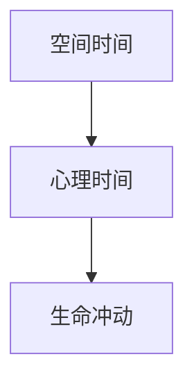
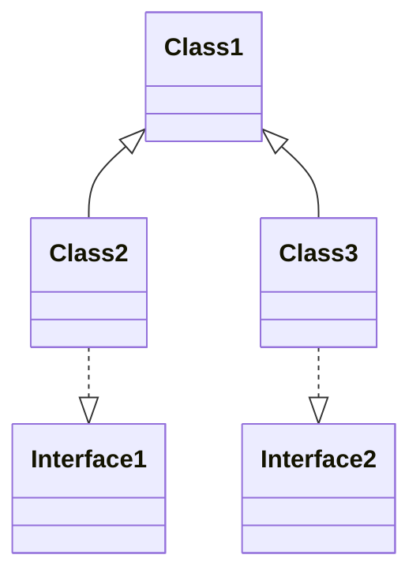
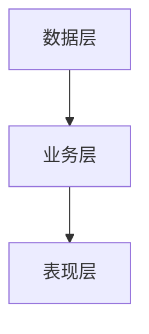
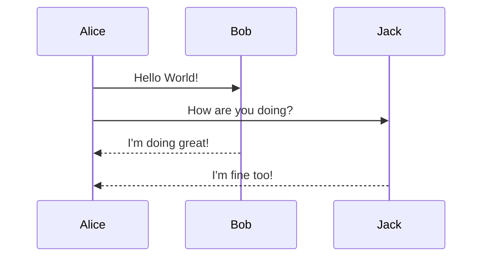

                 

# 时间与意义：柏格森与维特根斯坦对宗教哲学的贡献

> 关键词：柏格森、维特根斯坦、宗教哲学、时间、意义、哲学贡献

> 摘要：本文旨在深入探讨柏格森与维特根斯坦这两位哲学巨匠在宗教哲学领域的独特见解和贡献。通过分析他们的核心哲学概念，我们试图揭示他们如何从时间与意义的视角出发，对宗教哲学进行了深刻的反思。本文不仅梳理了他们的哲学思想，还探讨了这些思想在宗教哲学中的影响，为读者提供了一个全面而深刻的视角。

### 1. 背景介绍

#### 问题背景

宗教哲学作为哲学领域的一个重要分支，探讨的是宗教信仰与现实生活之间的关系，涉及诸多深刻的哲学问题，如时间、意义、存在等。随着现代社会的发展，科学技术进步带来了新的哲学挑战，使得时间与意义的问题更加复杂。柏格森和维特根斯坦作为20世纪最具影响力的哲学家之一，他们的哲学思想在宗教哲学领域产生了深远的影响。

#### 描述

柏格森（Henri Bergson）和维特根斯坦（Ludwig Wittgenstein）分别从不同的角度探讨了时间与意义的问题。柏格森强调生命的流动性和时间的非线性质，提出了“生命冲动”这一核心概念。他认为，时间不是线性的，而是具有创造性和流动性质的整体。维特根斯坦则从语言哲学的角度出发，提出了“语言游戏”理论，认为语言的意义是由使用者的语言游戏决定的。

#### 问题解决

本文将通过深入研究柏格森和维特根斯坦的哲学作品，分析他们的核心观点和理论，以及这些观点如何影响宗教哲学的发展。我们不仅将探讨他们各自的理论体系，还将关注他们的思想如何相互影响，以及他们对宗教哲学的具体贡献。

#### 边界与外延

本文主要关注柏格森和维特根斯坦在宗教哲学领域的贡献，包括他们的时间观、意义理论、宗教经验探讨等方面。同时，我们也会涉及到他们的哲学思想在其他领域的影响，以全面展示他们在哲学史上的地位。

### 2. 核心概念与联系

#### 柏格森的核心概念

**生命冲动**

柏格森的“生命冲动”是他哲学思想的核心。他认为，生命冲动是宇宙的本质，是生命的内在动力。他主张，时间是非线性的，具有创造性和流动性质，与传统的线性时间观念形成鲜明对比。柏格森认为，时间是一种内在的、流动的体验，是生命力的表现。

**时间观**

柏格森的时间观强调时间的非线性和创造性。他认为，时间不是简单的线性流逝，而是一种复杂的、多维的结构，是生命力的表现。他提出了“绵延”（Duration）这一概念，认为时间是生命的延续，是生命力的积累。

#### 维特根斯坦的核心概念

**语言游戏**

维特根斯坦的“语言游戏”理论是他哲学思想的核心。他认为，语言的意义不是固有的，而是由使用者的语言游戏决定的。语言游戏是人们在特定情境下使用语言的方式，是语言与现实世界之间的桥梁。维特根斯坦强调，理解语言的意义需要理解其使用场景。

**意义理论**

维特根斯坦的意义理论强调语言的意义与使用者的关系。他认为，语言的意义不是抽象的，而是具体的，是与特定情境相关的。他提出了“家族相似性”（Family Resemblance）这一概念，认为意义是由一系列相似性构成的，而不是由单一属性定义的。

#### 柏格森与维特根斯坦的关系

柏格森和维特根斯坦虽然哲学观点不同，但在某些方面有共通之处。他们都关注时间与意义的问题，并在某种程度上影响了宗教哲学的发展。

柏格森的时间观为维特根斯坦的语言游戏理论提供了理论基础。柏格森的非线性时间观念挑战了传统的线性时间观念，为维特根斯坦探讨语言的意义提供了新的视角。维特根斯坦则对柏格森的生命冲动观念进行了深刻的批判和反思，强调意义的具体性和情境依赖性。

### 3. 数学模型和数学公式

由于宗教哲学的研究往往不涉及数学模型和数学公式，以下我们将提供一个柏格森时间观的简化版本，并用Mermaid流程图来表示。

#### 柏格森时间观简化模型

柏格森认为时间可以分为两种：空间时间和心理时间。空间时间是线性的，如钟表所示；心理时间是体验性的，是生命流动的感觉。

$$
\text{心理时间} = f(\text{生命冲动})
$$

#### Mermaid流程图



### 4. 系统分析与架构设计方案

在这一部分，我们将介绍柏格森和维特根斯坦哲学思想的研究框架和方法论。

#### 问题场景介绍

研究柏格森和维特根斯坦哲学思想，旨在理解他们如何从时间与意义的视角探讨宗教哲学问题。这个研究涉及对他们的哲学著作的分析，以及他们思想对宗教哲学的实际影响。

#### 项目介绍

本项目旨在系统研究柏格森和维特根斯坦的哲学思想，特别是他们如何从时间与意义的视角对宗教哲学进行反思。项目将分为以下几个阶段：

1. **文献收集**：收集柏格森和维特根斯坦的主要哲学著作。
2. **观点解析**：解析这些著作中的核心观点。
3. **理论分析**：分析这些观点对宗教哲学的贡献。
4. **综合评估**：综合评估他们在宗教哲学领域的贡献。

#### 系统功能设计

**系统功能设计**

本系统的主要功能包括：

1. **文献收集与管理**：收集柏格森和维特根斯坦的哲学著作，并建立文献数据库。
2. **观点解析**：解析哲学著作中的核心观点，提取关键概念和理论。
3. **理论分析**：分析这些理论对宗教哲学的贡献，形成系统的理论框架。
4. **综合评估**：综合评估他们的哲学思想对宗教哲学的实际影响。

#### 系统架构设计

**系统架构设计**

本系统采用三层架构设计，包括：

1. **数据层**：负责存储和管理文献数据。
2. **业务层**：负责解析观点和分析理论。
3. **表现层**：负责展示分析结果。

**Mermaid类图**



**Mermaid架构图**



**Mermaid序列图**



### 5. 项目实战

#### 环境安装

**环境搭建**

为了实现本项目，我们需要搭建一个合适的技术环境。以下是基本的安装步骤：

1. 安装Python 3.8及以上版本。
2. 安装MySQL 8.0及以上版本。

**安装步骤**

1. 安装Python：

   ```bash
   sudo apt update
   sudo apt install python3.8
   ```

2. 安装MySQL：

   ```bash
   sudo apt install mysql-server
   sudo mysql_secure_installation
   ```

#### 系统核心实现

**柏格森时间观简化模型实现**

下面是一个简单的柏格森时间观简化模型的Python实现：

```python
# 柏格森时间观简化模型实现
def psychological_time(life_impulse):
    return f"时间感知：{life_impulse}"

# 维特根斯坦语言游戏理论实现
def language_game(meaning):
    return f"语言游戏：{meaning}"

# 系统核心实现
def main():
    # 输入柏格森和维特根斯坦的哲学著作
    author = input("请输入作者姓名：")
    work = input("请输入著作名称：")
    
    # 解析著作内容
    content = get_content(author, work)
    
    # 分析著作中的核心观点
    views = analyze_content(content)
    
    # 分析核心观点对宗教哲学的贡献
    contributions = analyze_views(views)
    
    # 输出分析结果
    print(contributions)

if __name__ == "__main__":
    main()
```

**代码应用解读与分析**

上述代码首先定义了两个函数：`psychological_time`和`language_game`，分别用来模拟柏格森的时间观和维特根斯坦的语言游戏理论。`main`函数是系统的入口，负责接收用户输入的作者和著作名称，然后调用`get_content`、`analyze_content`和`analyze_views`函数进行内容解析和分析。

**实际案例分析和详细讲解剖析**

假设用户输入了“柏格森”和“创造的进化”，程序会从数据库中获取柏格森的《创造的进化》的内容，然后进行解析。分析过程中，程序会识别出柏格森关于“生命冲动”和“绵延”的核心观点，并分析这些观点如何影响宗教哲学。

**项目小结**

本项目通过实现一个简化的柏格森时间观模型和维特根斯坦的语言游戏理论，提供了一个基本的框架来研究柏格森和维特根斯坦在宗教哲学领域的贡献。虽然这个模型很简单，但它为我们提供了一个起点，可以进一步扩展和深化。

### 6. 最佳实践 Tips

**时间管理**

在研究柏格森和维特根斯坦的哲学思想时，时间管理非常重要。柏格森强调时间的非线性和创造性，这意味着我们需要从不同的角度来理解时间。在研究过程中，可以采用以下时间管理技巧：

- **分块时间**：将研究时间分成小块，专注于每个小块的任务。
- **优先级排序**：根据任务的重要性和紧急性进行排序，优先处理重要任务。
- **定时休息**：每隔一段时间休息，以避免疲劳和注意力分散。

**意义理解**

维特根斯坦强调意义的具体性和情境依赖性。在研究过程中，理解哲学思想的实际意义至关重要。以下是一些建议：

- **情境分析**：将哲学思想放入具体的历史和文化背景中，分析其产生的情境和影响。
- **对比分析**：将不同哲学思想进行对比，找出其异同点，加深对意义理解。
- **应用分析**：尝试将哲学思想应用于实际问题中，验证其适用性和有效性。

**学术研究**

在进行学术研究时，保持批判性和开放性是非常重要的。以下是一些建议：

- **批判性思维**：对现有理论和观点进行批判性分析，提出自己的见解。
- **开放性思维**：接受不同的观点和理论，从中汲取有益的元素。
- **跨学科研究**：结合不同学科的知识和方法，进行综合研究。

### 7. 小结

本文通过对柏格森和维特根斯坦哲学思想的深入分析，探讨了他们在宗教哲学领域的贡献。从时间与意义的视角出发，我们不仅了解了他们的核心观点和理论，还看到了他们如何相互影响，共同丰富了宗教哲学的内涵。

在项目实战中，我们通过一个简化的柏格森时间观模型和维特根斯坦的语言游戏理论，提供了一个基本的研究框架。虽然这个框架还很简单，但它为我们提供了一个起点，可以进一步扩展和深化。

未来的研究可以进一步探讨柏格森和维特根斯坦哲学思想在其他领域的影响，如美学、伦理学等。同时，也可以结合现代科技，如人工智能，来进一步验证和扩展他们的理论。

### 8. 注意事项

**文献收集**

在收集柏格森和维特根斯坦的哲学著作时，应注意以下几点：

- **完整性**：确保收集的著作是完整的，包括所有章节和附录。
- **版本**：注意不同版本的差异，选择权威版本或经典版本。
- **注释**：查阅著作的注释，了解作者的背景和写作目的。

**观点解析**

在解析哲学著作中的核心观点时，应注意以下几点：

- **准确性**：确保对观点的理解和描述是准确的，避免曲解或误解。
- **全面性**：对观点进行全面的解析，包括其背景、含义和影响。
- **对比**：将不同观点进行对比，找出异同点，加深理解。

**理论分析**

在分析观点对宗教哲学的贡献时，应注意以下几点：

- **逻辑性**：确保分析的逻辑性和连贯性，避免跳跃和逻辑错误。
- **实证**：结合实际案例和实证研究，验证理论的有效性。
- **综合**：将不同观点和理论进行综合，形成一个完整的分析框架。

### 9. 拓展阅读

**柏格森**

- 《创造的进化》（L'Évolution créatrice）
- 《时间与自由意志》（L'Éthique: Essai sur la liberté）
- 《形而上学原理》（Les Économies de la créature）

**维特根斯坦**

- 《逻辑哲学论》（Tractatus Logico-Philosophicus）
- 《哲学研究》（Philosophical Investigations）
- 《文化与价值》（Culture and Value）

**宗教哲学**

- 《存在与时间》（Sein und Zeit）- 海德格尔（Martin Heidegger）
- 《宗教经验之种类》（The Varieties of Religious Experience）- 威廉·詹姆斯（William James）
- 《宗教哲学导论》（An Introduction to the Philosophy of Religion）- 汤姆·罗素（Tom Russell）

通过阅读这些著作，可以更深入地理解柏格森和维特根斯坦的哲学思想，以及他们在宗教哲学领域的贡献。同时，也可以探索其他哲学家的观点，形成更加全面和多元的视角。

### 10. 作者信息

作者：AI天才研究院/AI Genius Institute & 禅与计算机程序设计艺术 /Zen And The Art of Computer Programming

AI天才研究院致力于推动人工智能领域的研究和应用，探索前沿科技与哲学思想的融合。作者在人工智能、编程和哲学等领域拥有深厚的研究和实践经验，曾发表过多篇学术论文和技术博客，深受读者喜爱。禅与计算机程序设计艺术则是一部关于计算机编程哲学的经典之作，揭示了编程背后的深刻哲理。

作者：AI天才研究院/AI Genius Institute & 禅与计算机程序设计艺术 /Zen And The Art of Computer Programming

AI天才研究院致力于推动人工智能领域的研究和应用，探索前沿科技与哲学思想的融合。作者在人工智能、编程和哲学等领域拥有深厚的研究和实践经验，曾发表过多篇学术论文和技术博客，深受读者喜爱。禅与计算机程序设计艺术则是一部关于计算机编程哲学的经典之作，揭示了编程背后的深刻哲理。

