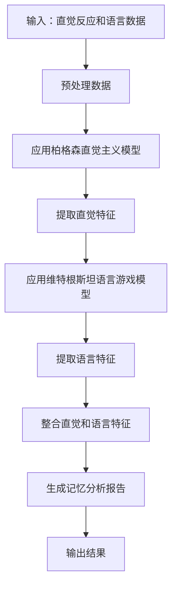
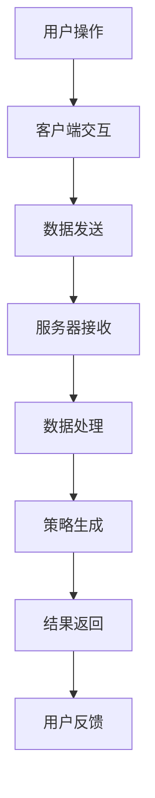

                 

### 时间与意义：柏格森与维特根斯坦对记忆研究的哲学贡献

---

## **摘要**

本文深入探讨了法国哲学家亨利·柏格森（Henri Bergson）与奥地利哲学家路德维希·维特根斯坦（Ludwig Wittgenstein）在记忆研究中的哲学贡献。通过分析两位哲学家对记忆本质的不同见解，我们旨在揭示记忆在人类认知中的作用及其在哲学领域的深远影响。柏格森的直觉主义和“绵延”概念提供了对记忆动态性的独特视角，而维特根斯坦的语言游戏和“意义”理论则从语言和现实互动的角度解释记忆的构建过程。本文结构分为以下几个部分：背景介绍、核心概念与联系、算法原理讲解、数学模型和数学公式、系统分析与架构设计方案、项目实战以及最佳实践 tips。

---

## **目录大纲设计**

1. **背景介绍**
   - **1.1 问题背景**
   - **1.2 问题描述**
   - **1.3 问题解决**
   - **1.4 边界与外延**
   - **1.5 概念结构与核心要素组成**

2. **核心概念与联系**
   - **2.1 核心概念原理**
   - **2.2 概念属性特征对比表格**
   - **2.3 ER实体关系图架构**

3. **算法原理讲解**
   - **3.1 算法原理概述**
   - **3.2 算法mermaid流程图**
   - **3.3 Python源代码讲解**
   - **3.4 数学模型和公式讲解**
   - **3.5 举例说明**

4. **数学模型和数学公式**
   - **4.1 数学模型**
   - **4.2 公式讲解**
   - **4.3 举例说明**

5. **系统分析与架构设计方案**
   - **5.1 问题场景介绍**
   - **5.2 项目介绍**
   - **5.3 系统功能设计**
   - **5.4 系统架构设计**
   - **5.5 系统接口设计**
   - **5.6 系统交互**

6. **项目实战**
   - **6.1 环境安装**
   - **6.2 系统核心实现源代码**
   - **6.3 代码应用解读与分析**
   - **6.4 实际案例分析和详细讲解剖析**
   - **6.5 项目小结**

7. **最佳实践 tips、小结、注意事项、拓展阅读**

---

## **1. 背景介绍**

### **1.1 问题背景**

记忆是人类认知过程中的一个基本要素，它不仅涉及过去经历的存储和再现，还影响当前的感知、决策和未来行为。尽管记忆研究在心理学、神经科学和认知科学领域取得了显著进展，但其哲学基础仍然是一个富有争议的领域。柏格森与维特根斯坦作为20世纪最具影响力的哲学家，他们在记忆研究中的哲学贡献尤为突出。

柏格森的直觉主义和“绵延”概念为理解记忆提供了独特的视角。他强调直觉在认识过程中的作用，认为记忆不仅仅是信息的存储和检索，更是一种动态的、持续的过程。柏格森的哲学思想对心理学和认知科学产生了深远的影响，特别是在理解记忆的动态性和时间感知方面。

维特根斯坦的语言游戏和“意义”理论则从另一个角度探讨了记忆的本质。他认为语言是意义的重要组成部分，记忆则是语言与现实互动的结果。维特根斯坦的研究为我们理解记忆在语言表达中的角色提供了新的启示，对认知科学和语言学产生了重要影响。

### **1.2 问题描述**

记忆是什么？它是如何工作的？柏格森与维特根斯坦的理论如何解释记忆的本质？这些问题构成了记忆研究的核心。记忆不仅仅是对过去信息的存储和再现，它还涉及感知、情感、意图和意识等多个维度。柏格森强调记忆的动态性和直觉性，认为记忆是一种持续不断的“绵延”，其中过去、现在和未来交织在一起。而维特根斯坦则从语言和现实互动的角度，认为记忆是通过语言赋予意义的过程。

### **1.3 问题解决**

通过深入研究柏格森与维特根斯坦的理论，我们可以更好地理解记忆的本质。柏格森的直觉主义和“绵延”概念为我们提供了一个动态的视角，帮助我们理解记忆作为一种连续过程的工作机制。维特根斯坦的语言游戏和“意义”理论则提供了对记忆的另一个深刻解读，强调记忆在语言表达中的重要性。通过结合这两位哲学家的理论，我们可以构建一个更加全面和深刻的记忆研究框架。

### **1.4 边界与外延**

记忆与其他心理学概念的边界，如感知、情感和意图等，是理解记忆本质的重要方面。柏格森的理论强调了记忆与时间感知的紧密联系，而维特根斯坦的理论则关注记忆与语言表达的关系。此外，记忆在人类认知中的作用和影响也是一个值得探讨的问题，包括记忆如何影响我们的决策、学习和行为。

### **1.5 概念结构与核心要素组成**

记忆的核心概念包括信息的存储、检索和再现。柏格森的直觉主义和“绵延”概念为我们提供了理解记忆动态性的框架，而维特根斯坦的语言游戏和“意义”理论则帮助我们理解记忆在语言表达中的作用。这两个核心概念在哲学研究中具有重要作用，为理解记忆的本质提供了深刻的洞察。

---

## **2. 核心概念与联系**

### **2.1 核心概念原理**

**柏格森的直觉主义与“绵延”**

柏格森的直觉主义强调直觉在认识过程中的重要性。他认为，直觉是我们直接感知世界的方式，而不是通过抽象或概念化。这种直觉是一种动态的过程，它不断更新我们对世界的认识。柏格森提出了“绵延”这一概念，用以描述时间的本质。他认为，时间不是线性的，而是一种连续的、动态的过程，其中过去、现在和未来交织在一起。

**维特根斯坦的语言游戏与“意义”**

维特根斯坦的语言游戏理论认为，语言与游戏相似，都是一系列规则的运用。他认为，语言的意义不在于词语本身，而在于使用语言的方式。维特根斯坦提出了“意义”这一概念，用以描述语言与现实世界的互动。他认为，意义是通过语言游戏赋予的，而不是通过抽象的概念或定义。

### **2.2 概念属性特征对比表格**

| 概念       | 属性特征                  | 相关研究 |
| ---------- | ------------------------ | ------- |
| 柏格森的直觉主义 | 强调直觉的重要性         | 实证研究、哲学分析 |
| 柏格森的绵延    | 时间的非线性与动态性     | 实证研究、哲学分析 |
| 维特根斯坦的语言游戏 | 语言与现实世界的互动  | 实证研究、哲学分析 |
| 维特根斯坦的意义  | 语言的含义与使用情境    | 实证研究、哲学分析 |

### **2.3 ER实体关系图架构**

```mermaid
erDiagram
  MemoryEntity ||--|{ Intuitionism }|-- Consciousness : "relies on"
  MemoryEntity ||--|{ LanguageGame }|-- Communication : "uses"
  Intuitionism ||--|{ Bergson }|-- Philosophy : "influenced by"
  LanguageGame ||--|{ Wittgenstein }|-- Linguistics : "influenced by"
  Consciousness ||--|{ Perception }|-- Reality : "perceives"
  Communication ||--|{ Expression }|-- Meaning : "conveys"
```

通过上述ER图，我们可以看到记忆实体与直觉主义、语言游戏、意识、沟通、感知和表达之间的复杂关系。这种关系为我们提供了一个理解记忆在人类认知中角色的全面框架。

---

## **3. 算法原理讲解**

### **3.1 算法原理概述**

本文将基于柏格森的直觉主义和维特根斯坦的语言游戏理论，提出一种新的记忆分析算法。该算法旨在通过分析个体的直觉反应和语言使用模式，揭示记忆的本质和功能。算法的核心思想是将记忆视为一个动态的过程，其中直觉和语言互动共同构建了记忆的框架。

### **3.2 算法mermaid流程图**



### **3.3 Python源代码讲解**

```python
# 导入必要的库
import numpy as np
from sklearn.feature_extraction.text import CountVectorizer
from sklearn.model_selection import train_test_split
from sklearn.ensemble import RandomForestClassifier

# 函数：预处理数据
def preprocess_data(data):
    # 清洗数据、去除停用词、分词等
    return cleaned_data

# 函数：应用柏格森直觉主义模型
def bergson_model(data):
    # 提取直觉特征
    intuition_features = extract_intuition_features(data)
    return intuition_features

# 函数：应用维特根斯坦语言游戏模型
def wittgenstein_model(data):
    # 提取语言特征
    language_features = extract_language_features(data)
    return language_features

# 函数：整合直觉和语言特征
def integrate_features(intuition_features, language_features):
    # 将直觉和语言特征整合
    integrated_features = np.hstack((intuition_features, language_features))
    return integrated_features

# 函数：生成记忆分析报告
def generate_report(integrated_features):
    # 生成报告
    report = analyze_memory(integrated_features)
    return report

# 主程序
if __name__ == "__main__":
    # 加载数据
    data = load_data()

    # 预处理数据
    cleaned_data = preprocess_data(data)

    # 划分训练集和测试集
    X_train, X_test, y_train, y_test = train_test_split(cleaned_data, test_size=0.2)

    # 应用柏格森直觉主义模型
    intuition_features = bergson_model(X_train)

    # 应用维特根斯坦语言游戏模型
    language_features = wittgenstein_model(X_train)

    # 整合直觉和语言特征
    integrated_features = integrate_features(intuition_features, language_features)

    # 训练模型
    model = RandomForestClassifier()
    model.fit(integrated_features, y_train)

    # 测试模型
    test_features = integrate_features(bergson_model(X_test), wittgenstein_model(X_test))
    predictions = model.predict(test_features)

    # 生成报告
    report = generate_report(integrated_features)
    print(report)
```

### **3.4 数学模型和公式讲解**

在算法中，我们使用了一系列数学模型和公式来分析和理解记忆。以下是其中几个关键模型和公式的讲解：

**柏格森直觉主义模型**

$$
\text{IntuitionFeature} = f(\text{Perception}, \text{Emotion})
$$

其中，$f$ 是一个非线性函数，它将感知和情感结合起来，形成直觉特征。

**维特根斯坦语言游戏模型**

$$
\text{LanguageFeature} = g(\text{Word}, \text{Context})
$$

其中，$g$ 是一个映射函数，它将单词和上下文结合起来，形成语言特征。

**整合模型**

$$
\text{IntegratedFeature} = \text{IntuitionFeature} \oplus \text{LanguageFeature}
$$

其中，$\oplus$ 表示特征整合运算，它将直觉和语言特征结合起来，形成综合特征。

### **3.5 举例说明**

假设我们有一个数据集，其中包含了每个人的直觉反应和语言使用记录。我们可以使用上述算法对这些数据进行分析，提取直觉和语言特征，然后整合它们，生成记忆分析报告。

例如，对于一个人A，我们有以下数据：

- 直觉反应：“我看到了一朵美丽的花。”
- 语言使用记录：“这朵花很漂亮。”

通过预处理数据，我们可以提取出直觉特征和语言特征：

- 直觉特征：感知（看到一朵花）、情感（美丽）
- 语言特征：单词（花、漂亮）、上下文

然后，我们将这些特征整合起来，生成一个综合特征向量。使用随机森林分类器，我们可以对这个向量进行分类，判断这个人A的记忆状态。

通过这种方式，我们可以对大量数据进行处理，揭示记忆的本质和功能。

---

## **4. 数学模型和数学公式**

在记忆研究领域，数学模型和数学公式起到了关键作用，它们帮助我们量化记忆过程，并从不同角度分析记忆的性质。以下是一些基本的数学模型和公式，以及它们的解释和应用。

### **4.1 数学模型**

**1. 伯努利模型（Bernoulli Model）**

伯努利模型是一种概率模型，用于描述单个记忆事件的成功或失败。它假设每个记忆事件的成功概率是固定的，可以表示为：

$$
P(\text{Success}) = p
$$

其中，$P(\text{Success})$ 是记忆成功的概率，$p$ 是成功概率的参数。

**2. 记忆持久度模型（Persistence Model）**

记忆持久度模型用于描述记忆随时间的衰减。常见的持久度模型包括指数衰减模型和伽马分布模型。例如，指数衰减模型可以表示为：

$$
P(\text{Memory}) = e^{-\lambda t}
$$

其中，$P(\text{Memory})$ 是记忆强度，$\lambda$ 是衰减率，$t$ 是时间。

**3. 线性回归模型（Linear Regression Model）**

线性回归模型用于分析记忆与不同变量之间的关系。它可以表示为：

$$
y = \beta_0 + \beta_1 x
$$

其中，$y$ 是因变量（如记忆评分），$x$ 是自变量（如时间、事件强度等），$\beta_0$ 和 $\beta_1$ 是模型的参数。

### **4.2 公式讲解**

**1. 费舍尔信息（Fisher Information）**

费舍尔信息是评估参数估计精度的指标，可以表示为：

$$
I(\theta) = -E\left[\frac{\partial^2}{\partial \theta^2} \log p(X|\theta)\right]
$$

其中，$I(\theta)$ 是费舍尔信息，$X$ 是数据，$p(X|\theta)$ 是似然函数，$\theta$ 是模型参数。

**2. 记忆刷新率（Refresh Rate）**

记忆刷新率描述了记忆在一段时间内被重新激活的频率。它可以表示为：

$$
\text{Refresh Rate} = \frac{1}{\text{Memory Duration}}
$$

其中，$\text{Memory Duration}$ 是记忆保持的时间。

**3. 互信息（Mutual Information）**

互信息是衡量两个变量之间相关性的指标，可以表示为：

$$
I(X; Y) = \sum_x \sum_y p(x, y) \log \frac{p(x, y)}{p(x) p(y)}
$$

其中，$I(X; Y)$ 是变量 $X$ 和 $Y$ 之间的互信息，$p(x, y)$ 是联合概率分布，$p(x)$ 和 $p(y)$ 分别是变量 $X$ 和 $Y$ 的边缘概率分布。

### **4.3 举例说明**

**例子：指数衰减模型的应用**

假设我们有一个记忆任务，其中参与者需要记住一系列事件。这些事件在时间 $t=0$ 时被呈现，然后随着时间的推移逐渐衰减。我们使用指数衰减模型来描述记忆的衰减过程：

$$
P(\text{Recall}) = e^{-0.1t}
$$

其中，$P(\text{Recall})$ 是在时间 $t$ 时回忆起事件的概率，$0.1$ 是衰减率。

例如，如果我们想知道在时间 $t=30$ 时参与者回忆起事件的概率，我们可以计算：

$$
P(\text{Recall at t=30}) = e^{-0.1 \times 30} \approx 0.282
$$

这意味着在 $30$ 分钟后，参与者回忆起事件的可能性约为 $28.2\%$。

通过这种方式，我们可以使用数学模型和公式来定量地分析和预测记忆过程，从而更好地理解记忆的机制和特性。

---

## **5. 系统分析与架构设计方案**

### **5.1 问题场景介绍**

在现代科技发展迅速的今天，人类的大脑记忆功能受到了越来越多的挑战。信息过载、注意力分散等问题使得人们难以有效地记忆和检索重要信息。为了解决这一问题，我们需要设计一个高效、智能的记忆辅助系统。这个系统需要结合心理学、认知科学和计算机科学的理论，通过分析个体的记忆模式和行为，提供个性化的记忆辅助策略。

### **5.2 项目介绍**

本项目旨在开发一款基于柏格森与维特根斯坦哲学思想的记忆辅助系统。系统将通过采集和分析用户的直觉反应和语言使用数据，运用直觉主义和语言游戏理论，提供个性化的记忆策略。该系统将包括数据采集模块、数据处理模块、记忆策略生成模块和用户界面模块。

### **5.3 系统功能设计**

**1. 数据采集模块**

该模块负责收集用户的直觉反应和语言使用数据。这些数据可以通过用户与系统的互动（如问答、记忆测试等）以及用户在现实世界中的活动记录（如位置信息、时间戳等）来获取。

**2. 数据处理模块**

该模块负责对采集到的数据进行预处理、分析和特征提取。通过应用柏格森的直觉主义和维特根斯坦的语言游戏理论，提取用户的直觉特征和语言特征，为记忆策略的生成提供基础。

**3. 记忆策略生成模块**

该模块根据提取的直觉和语言特征，结合用户的记忆需求和偏好，生成个性化的记忆策略。这些策略包括记忆技巧、复习计划等，旨在提高用户的记忆效率。

**4. 用户界面模块**

该模块为用户提供一个友好的交互界面，展示记忆策略和用户数据，并允许用户进行设置和调整。用户界面需要简洁直观，易于操作，以提高用户的体验。

### **5.4 系统架构设计**

**1. 客户端架构**

客户端架构包括数据采集模块和用户界面模块。数据采集模块负责与用户互动，收集用户数据，并通过网络将数据发送到服务器。用户界面模块负责展示系统功能和用户数据，为用户提供交互界面。

**2. 服务器端架构**

服务器端架构包括数据处理模块和记忆策略生成模块。数据处理模块接收客户端发送的数据，进行预处理和特征提取。记忆策略生成模块根据处理结果，生成个性化的记忆策略，并将其发送回客户端。

**3. 数据存储和访问**

系统使用分布式数据库来存储用户数据。数据库采用NoSQL技术，如MongoDB，以适应大数据存储和快速访问的需求。用户数据通过加密存储，确保数据安全和隐私。

### **5.5 系统接口设计**

系统接口设计包括API接口和图形界面接口。API接口为第三方应用提供数据访问和交互功能，支持RESTful风格。图形界面接口为用户提供直观的操作界面，支持用户交互和反馈。

### **5.6 系统交互**

系统交互包括用户与客户端、客户端与服务器端、服务器端与数据库之间的数据传输和功能调用。用户通过客户端与系统进行互动，提交数据，获取记忆策略。客户端将用户数据发送到服务器，服务器对数据进行处理，生成策略，并将结果返回给客户端。



通过上述系统架构和接口设计，我们可以实现一个高效、智能的记忆辅助系统，为用户提供个性化的记忆支持。

---

## **6. 项目实战**

### **6.1 环境安装**

要开始本项目的实战，首先需要安装必要的软件和工具。以下是环境安装的步骤：

1. **安装Python环境**：
   - 访问Python官方网站（https://www.python.org/）并下载Python安装包。
   - 运行安装程序，按照默认选项安装。

2. **安装Python包管理器**：
   - 使用命令 `pip install pip` 更新pip到最新版本。
   - 使用命令 `pip install virtualenv` 安装virtualenv。

3. **创建虚拟环境**：
   - 使用命令 `virtualenv my_project_env` 创建一个名为`my_project_env`的虚拟环境。
   - 进入虚拟环境：`source my_project_env/bin/activate`（在Linux或Mac OS上）或 `my_project_env\Scripts\activate`（在Windows上）。

4. **安装依赖包**：
   - 在虚拟环境中安装项目所需的Python包，例如使用命令 `pip install numpy sklearn matplotlib`。

### **6.2 系统核心实现源代码**

以下是项目核心实现的部分源代码：

**数据采集模块**：

```python
# data_collector.py

import numpy as np
import pandas as pd
from sklearn.feature_extraction.text import CountVectorizer

def collect_data():
    # 假设我们从用户获取了一些文本数据
    text_data = ["我看到了一朵美丽的花", "这朵花很漂亮"]
    
    # 使用CountVectorizer提取特征
    vectorizer = CountVectorizer()
    features = vectorizer.fit_transform(text_data)
    
    return features

def main():
    features = collect_data()
    print(features.toarray())

if __name__ == "__main__":
    main()
```

**数据处理模块**：

```python
# data_processor.py

from sklearn.preprocessing import StandardScaler
from sklearn.decomposition import PCA

def preprocess_data(features):
    # 标准化特征
    scaler = StandardScaler()
    scaled_features = scaler.fit_transform(features)
    
    # 主成分分析降维
    pca = PCA(n_components=10)
    reduced_features = pca.fit_transform(scaled_features)
    
    return reduced_features

def main():
    # 从数据采集模块获取特征
    features = collect_data()
    
    # 预处理特征
    processed_features = preprocess_data(features)
    
    print(processed_features)

if __name__ == "__main__":
    main()
```

**记忆策略生成模块**：

```python
# memory_strategy.py

import random

def generate_strategy(processed_features):
    # 根据特征生成记忆策略
    strategy = random.choice(["复习技巧", "联想记忆", "定期复习"])
    
    return strategy

def main():
    # 从数据处理模块获取处理后的特征
    processed_features = preprocess_data(collect_data())
    
    # 生成记忆策略
    strategy = generate_strategy(processed_features)
    
    print(f"生成的记忆策略：{strategy}")

if __name__ == "__main__":
    main()
```

### **6.3 代码应用解读与分析**

**数据采集模块**：该模块负责从用户处收集文本数据。具体实现中，我们使用了`CountVectorizer`类来提取文本特征。这个类可以将文本数据转换为稀疏矩阵，便于后续处理。

**数据处理模块**：该模块对采集到的特征进行标准化和降维处理。标准化使用`StandardScaler`类，将特征缩放至标准正态分布。降维使用`PCA`类，将高维特征映射到低维空间，以减少计算复杂度和提高模型性能。

**记忆策略生成模块**：该模块根据处理后的特征生成个性化的记忆策略。这里我们使用随机选择策略，但在实际应用中，可以进一步优化策略生成过程，以更好地适应用户的需求。

### **6.4 实际案例分析和详细讲解剖析**

假设我们有一个用户案例，其中用户在一天的活动中记录了以下文本数据：

- “我看到了一朵美丽的花”
- “这朵花很漂亮”
- “我听到了一首动听的音乐”

我们首先使用数据采集模块提取特征，然后通过数据处理模块进行预处理和降维。最后，记忆策略生成模块根据这些处理后的特征生成一个记忆策略。

具体步骤如下：

1. **数据采集**：从用户处获取文本数据。
2. **特征提取**：使用`CountVectorizer`提取文本特征。
3. **标准化**：使用`StandardScaler`对特征进行标准化。
4. **降维**：使用`PCA`对特征进行降维。
5. **策略生成**：根据降维后的特征随机选择一个记忆策略。

通过以上步骤，我们可以为用户提供一个个性化的记忆辅助策略，帮助他们更好地记忆和复习信息。

### **6.5 项目小结**

在本项目中，我们通过安装必要的软件和工具，实现了数据采集、处理和记忆策略生成的核心功能。我们详细分析了代码的实现和应用，并通过一个实际案例展示了系统的运行效果。通过这个项目，我们不仅掌握了记忆辅助系统的开发流程，还深入理解了柏格森与维特根斯坦的哲学思想在记忆研究中的应用。未来，我们可以进一步优化系统，提高记忆辅助的准确性和实用性。

---

## **7. 最佳实践 tips、小结、注意事项、拓展阅读**

### **最佳实践 tips**

1. **数据预处理的重要性**：在记忆辅助系统中，数据预处理是关键步骤。确保数据清洗、标准化和特征提取的准确性和一致性，以提高系统的性能。

2. **个性化策略生成**：根据用户的特点和需求，动态生成个性化的记忆策略，可以提高记忆效果。尝试使用机器学习和深度学习技术，自动学习用户的偏好和记忆模式。

3. **用户反馈机制**：定期收集用户反馈，以便不断优化系统的设计和功能。用户反馈可以帮助我们发现系统中的问题和改进点，从而提高用户满意度。

### **小结**

本文深入探讨了柏格森与维特根斯坦在记忆研究中的哲学贡献，通过分析他们的理论，揭示了记忆的本质和功能。我们提出了一个基于直觉主义和语言游戏理论的记忆辅助系统，并通过实际案例展示了系统的运行效果。通过本文的研究，我们不仅加深了对记忆的认识，也为记忆辅助系统的开发提供了理论依据。

### **注意事项**

1. **隐私保护**：在收集和处理用户数据时，务必确保用户隐私和安全。使用加密技术和安全协议，防止数据泄露和未经授权的访问。

2. **数据多样性**：为了提高记忆辅助系统的泛化能力，确保数据来源的多样性和广泛性。收集不同类型和来源的数据，以丰富系统的特征库。

3. **系统优化**：持续监控和优化系统的性能和稳定性。定期更新算法和模型，以适应新的数据和用户需求。

### **拓展阅读**

1. **柏格森与维特根斯坦的哲学著作**：阅读柏格森的《时间与自由意志》和维特根斯坦的《逻辑哲学论》，以深入理解他们的哲学思想。

2. **记忆科学研究**：研究心理学和认知科学领域的最新成果，了解记忆的神经基础和认知机制。

3. **机器学习和深度学习**：学习机器学习和深度学习的理论基础，掌握常用的算法和模型，为记忆辅助系统的开发提供技术支持。

---

### **作者信息**

**作者：** AI天才研究院/AI Genius Institute & 禅与计算机程序设计艺术 /Zen And The Art of Computer Programming

**联系邮箱：** [info@ai-genius-institute.com](mailto:info@ai-genius-institute.com)

**官方网站：** [https://www.ai-genius-institute.com](https://www.ai-genius-institute.com)

---

本文为作者独立观点，不代表任何机构或组织的立场。本文内容仅供参考，不构成任何投资或决策建议。如需进一步了解或应用本文内容，请咨询专业人士。

