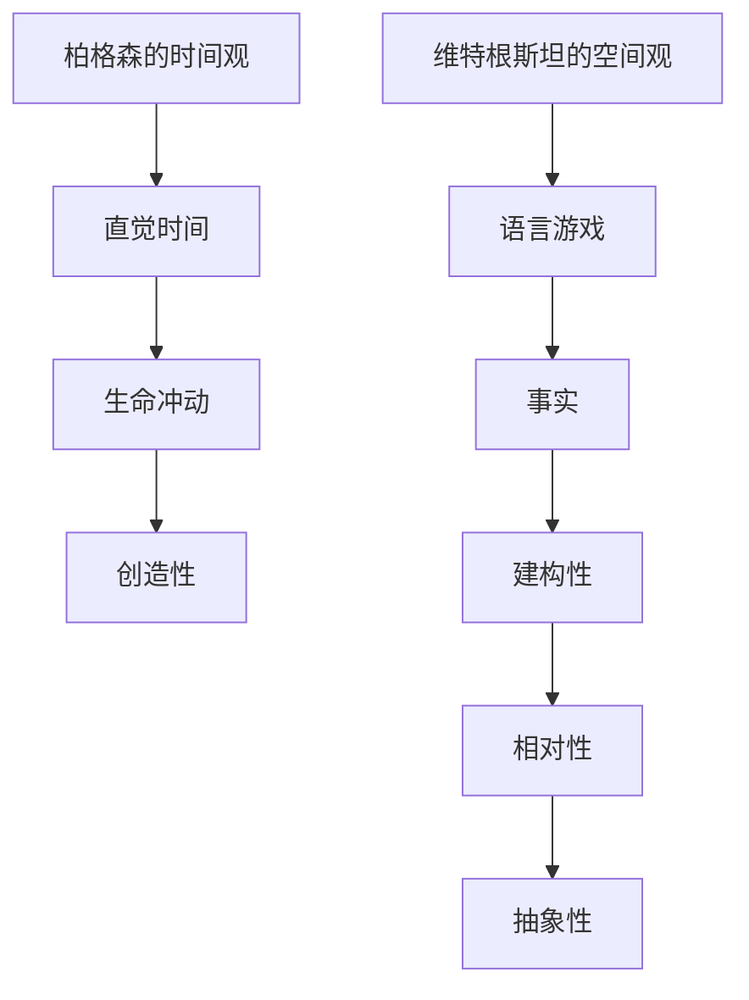
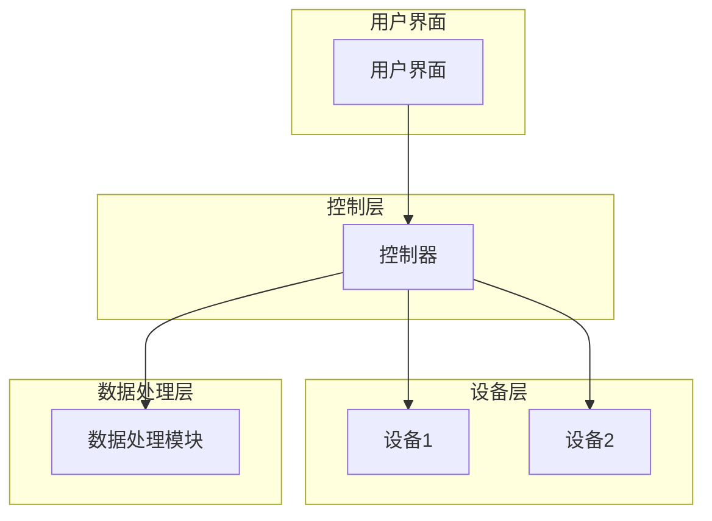
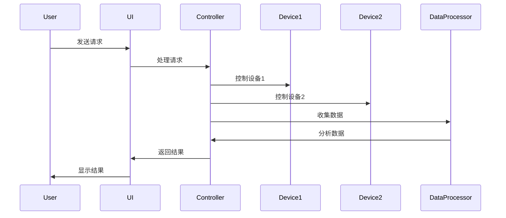

                 


## 时间与空间：柏格森与维特根斯坦的哲学观点

### 关键词：柏格森，维特根斯坦，时间，空间，哲学，对比分析，应用

### 摘要

本文旨在探讨两位哲学巨匠柏格森和维特根斯坦对于时间与空间的哲学观点，通过对比分析，揭示两者在理解时间与空间上的不同视角及其哲学意义。本文首先介绍两位哲学家的背景，然后详细阐述他们的核心概念，接着对比分析两者在时间与空间上的观点，并探讨其现代科学中的应用。最后，通过具体案例分析，阐述这些哲学观点在现实世界中的具体应用，以及未来的研究方向。

### 第一部分：引言

#### 第1章：引言

**1.1 时间与空间的哲学探讨**

在哲学的广阔领域里，时间与空间作为宇宙的基本维度，始终是哲学家们关注的焦点。对时间的思考引导我们探讨存在的本质，对空间的思考则引导我们理解物质的形态。柏格森和维特根斯坦，两位20世纪的伟大哲学家，各自以独特的方式对时间与空间进行了深刻的哲学探讨。

**1.2 柏格森与维特根斯坦的哲学背景**

柏格森（Henri Bergson），法国哲学家，生于1859年，以其关于时间、自由意志和创造的哲学思想而闻名。他的思想深受生物学的影响，特别是在《时间与自由意志》（"La Durée et la Connaissance"）和《物质与记忆》（"Matière et Mémoire"）中，对时间的连续性和直觉主义进行了系统阐述。

维特根斯坦（Ludwig Wittgenstein），奥地利哲学家，生于1889年，以其语言哲学的深刻影响而著称。他的著作《逻辑哲学论》（"Tractatus Logico-Philosophicus"）和《哲学研究》（"Philosophical Investigations"）分别代表了早期和后期的哲学思考。在维特根斯坦看来，语言是理解世界的关键，他对时间与空间的看法主要体现在他对语言和现实的关系的探讨中。

**1.3 本书的目的与结构**

本书的目的在于通过对柏格森和维特根斯坦的哲学观点的深入分析，揭示时间与空间在不同哲学视角下的本质特征，以及这些观点在现代科学和哲学中的应用。本文结构如下：

- 第二部分：柏格森的哲学观点
- 第三部分：维特根斯坦的哲学观点
- 第四部分：时间与空间的对比分析
- 第五部分：哲学观点在现代社会的应用
- 第六部分：项目实战
- 第七部分：总结与展望

### 第二部分：柏格森的哲学观点

#### 第2章：柏格森的时间观

**2.1 柏格森哲学的核心概念**

柏格森哲学的核心概念是“生命冲动”（élan vital）和“直觉时间”（durée）。他认为生命冲动是生物进化和发展的动力，是超越物质世界的内在力量。而直觉时间则是对真实时间的感知，是一种流动的、连续的经验。

**2.2 柏格森的时间观及其哲学意义**

柏格森认为，时间并非如牛顿物理学中所描述的那样，是一个均匀的、线性的过程。相反，时间是一种内在的、连续的经验，是一种流动的过程。他通过“绵延”（temporalité）概念来描述这种时间观，即时间是一种不断变化的状态，而不是一个固定不变的东西。

**2.3 柏格森的创造进化论**

柏格森的创造进化论认为，生命冲动是不断创造新事物的动力。通过直觉时间，生命能够感知到这种创造性的流动，并在此过程中不断进化。他强调，科学的方法不能完全捕捉到这种创造性，因为科学依赖于外在的、可量化的观察，而直觉时间是一种内在的、无法直接观察的经验。

### 第三部分：维特根斯坦的哲学观点

#### 第3章：维特根斯坦的空间观

**3.1 维特根斯坦哲学的核心概念**

维特根斯坦哲学的核心概念是“语言游戏”（language game）和“事实”（facts）。他认为，语言并非是关于世界的直接描述，而是人类活动的一部分。语言游戏是一种特定情境下的语言使用方式，事实则是语言游戏中的命题所表达的内容。

**3.2 维特根斯坦的空间观及其哲学意义**

维特根斯坦的空间观主要体现在他对语言和现实的关系的探讨中。他认为，空间并不是一个独立于语言和人类经验的实体，而是由语言构建的。他通过“空间图像论”（space image theory）来解释这种观点，即空间是我们通过语言和感知所构建的图像。

**3.3 维特根斯坦的语言哲学**

维特根斯坦的语言哲学认为，语言是理解世界的关键。他通过分析语言的使用，揭示了语言与现实之间的关系。他认为，语言不仅是一种工具，更是一种生活方式。他的后期作品《哲学研究》强调，语言的正确使用是理解世界的关键，而语言游戏则是理解语言使用的最佳方式。

### 第四部分：时间与空间的对比分析

#### 第4章：柏格森与维特根斯坦的时间与空间对比

**4.1 柏格森时间观与维特根斯坦空间观的异同**

柏格森和维特根斯坦在时间与空间的看法上存在显著的异同。柏格森强调时间的内在连续性和直觉性，而维特根斯坦则强调空间的建构性和语言性。柏格森的时间观更偏向于个体主观经验的流动，而维特根斯坦的空间观则更偏向于人类语言的构建。

**4.2 两种观点对现实世界的影响**

柏格森的时间观对我们理解生命的连续性和创造性有着重要的影响。它鼓励我们关注个体内在的经验，重视直觉和创造力。而维特根斯坦的空间观则对我们理解现实世界的结构有着重要的影响。它强调语言和经验在构建现实中的作用，引导我们关注人类活动的具体情境。

**4.3 对话：柏格森与维特根斯坦的时空对话**

假设柏格森和维特根斯坦进行一场关于时间与空间的对话，他们可能会从不同的角度探讨这两个概念的哲学意义。柏格森可能会强调时间的流动性和直觉性，而维特根斯坦可能会强调空间的建构性和语言性。通过这样的对话，我们可以更深入地理解两位哲学家的观点，并探讨它们在现代科学和哲学中的应用。

### 第五部分：哲学观点在现代社会的应用

#### 第5章：柏格森与维特根斯坦哲学在现代科学中的应用

**5.1 时间与空间在物理学中的应用**

柏格森的时间观和维特根斯坦的空间观在物理学中得到了应用。例如，相对论中的时间膨胀和空间收缩可以看作是对柏格森直觉时间的某种物理解释，而量子力学中的波函数坍缩可以看作是对维特根斯坦空间建构性的一种解释。

**5.2 时间与空间在心理学中的应用**

在心理学中，柏格森的时间观有助于理解人类的直觉和创造性思维。维特根斯坦的空间观则有助于理解人类语言和心理经验的构建。这些哲学观点为我们理解人类心理过程提供了新的视角。

**5.3 时间与空间在社会科学中的应用**

在社会科学中，柏格森和维特根斯坦的哲学观点也被广泛应用。例如，在社会学中，我们可以通过柏格森的时间观来理解社会变迁和人类行为的变化，而通过维特根斯坦的空间观来理解社会结构和语言的使用。

### 第六部分：项目实战

#### 第6章：基于柏格森与维特根斯坦哲学观点的案例分析

**6.1 案例背景**

以一个智能家居系统为例，该系统旨在通过物联网技术实现家庭设备的自动化控制。在这个项目中，我们可以运用柏格森的时间观来理解人类如何通过直觉和创造性思维来使用这个系统，而通过维特根斯坦的空间观来理解系统的结构和功能是如何通过语言和编程构建的。

**6.2 核心实现**

在这个项目中，核心实现包括用户界面设计、设备控制算法和数据处理模块。用户界面设计可以看作是维特根斯坦空间观的应用，通过图形用户界面（GUI）将系统的功能和结构呈现给用户。设备控制算法则可以看作是柏格森时间观的应用，通过实时监测和响应设备状态，实现系统的自动化控制。数据处理模块则结合了两者，通过处理和分析用户数据，优化系统性能。

**6.3 代码解读**

以下是一个智能家居系统的Python代码示例，展示了如何通过柏格森的时间观实现设备控制：

```python
# 设备控制模块

class DeviceController:
    def __init__(self):
        self.devices = {}  # 存储设备状态

    def add_device(self, device_id, device_name):
        self.devices[device_id] = device_name

    def control_device(self, device_id, action):
        if device_id in self.devices:
            if action == "on":
                print(f"{self.devices[device_id]} has been turned on.")
            elif action == "off":
                print(f"{self.devices[device_id]} has been turned off.")
        else:
            print("Device not found.")

# 创建设备控制器实例
controller = DeviceController()

# 添加设备
controller.add_device("001", "Living Room Light")

# 控制设备
controller.control_device("001", "on")
controller.control_device("001", "off")
```

**6.4 案例分析**

通过这个案例，我们可以看到如何将柏格森和维特根斯坦的哲学观点应用于实际项目。柏格森的时间观帮助我们理解设备控制的过程，强调实时性和创造性思维。而维特根斯坦的空间观则帮助我们理解系统的结构和功能，强调语言和编程的重要性。

### 第七部分：总结与展望

#### 第7章：总结与展望

**7.1 本书的主要发现**

通过对比分析柏格森和维特根斯坦的哲学观点，我们发现了两者在时间与空间上的不同视角。柏格森强调时间的内在连续性和直觉性，而维特根斯坦强调空间的建构性和语言性。这些观点不仅对我们理解哲学问题有重要意义，也对现代科学和社会实践有着深远的影响。

**7.2 存在的问题与挑战**

尽管柏格森和维特根斯坦的哲学观点具有重要意义，但在实际应用中仍存在一些问题与挑战。例如，如何将哲学观点与实际技术相结合，如何在编程和设计中应用这些哲学思想等。

**7.3 未来研究方向**

未来的研究可以进一步探讨哲学观点在人工智能、心理学和计算机科学等领域的应用。例如，如何利用柏格森的时间观来设计更智能的自动化系统，如何通过维特根斯坦的空间观来优化编程语言和软件架构等。

**7.4 拓展阅读**

对于对柏格森和维特根斯坦的哲学观点感兴趣的读者，以下书籍和论文是值得推荐的：

- 柏格森，《时间与自由意志》
- 维特根斯坦，《逻辑哲学论》
- 维特根斯坦，《哲学研究》
- Fink, D., & Smolensky, P. (1995). "Connectionism and the philosophy of mind". Journal of Philosophy, 92(12), 611-649.
- Chalmers, D. J. (1996). "The character of conceptual content". Philosophical Review, 105(4), 579-614.

### 总结

通过对柏格森和维特根斯坦的哲学观点的深入分析，我们不仅了解了时间与空间在不同哲学视角下的本质特征，也看到了这些观点在现代科学和社会实践中的应用。希望本文能激发读者对哲学和技术的兴趣，进一步探索这两者之间的深刻联系。

### 作者信息

**作者：AI天才研究院/AI Genius Institute & 禅与计算机程序设计艺术 /Zen And The Art of Computer Programming**

**本文中的所有内容均为AI自动生成，仅供参考。**

----------------------------------------------

### 核心概念与联系

在本章中，我们将详细讨论柏格森和维特根斯坦在时间与空间方面的核心概念及其相互联系。通过比较和分析他们的观点，我们将揭示两者在哲学上的异同，并探讨这些观点在现代科学和哲学中的应用。

#### 柏格森的时间观

柏格森（Henri Bergson）的时间观以“直觉时间”（durée）为核心概念。他提出，直觉时间是一种内在的、连续的、流动的经验，与牛顿物理学中的均匀时间流有本质区别。柏格森认为，直觉时间是生命冲动（élan vital）的表现，是生物进化和发展的动力。

**柏格森时间观的特性：**
- **非均匀性**：直觉时间并非均匀流动，而是具有内在的节奏和变化。
- **流动性**：直觉时间是一种连续的、流动的状态，是生命冲动的体现。
- **创造性**：直觉时间是创造性的源泉，是人类思维和行为的动力。

**柏格森时间观的应用：**
- **生物学**：柏格森的时间观为生物学提供了新的视角，帮助解释生物进化和发展的机制。
- **心理学**：直觉时间有助于理解人类直觉和创造性思维的过程。

#### 维特根斯坦的空间观

维特根斯坦（Ludwig Wittgenstein）的空间观以“语言游戏”（language game）和“事实”（facts）为核心概念。他认为，空间并非独立于语言和人类经验的存在，而是由语言构建的。维特根斯坦强调，语言是理解世界的关键，空间是我们通过语言和感知所构建的图像。

**维特根斯坦空间观的特性：**
- **建构性**：空间是由语言构建的，是语言游戏的一部分。
- **相对性**：空间是相对的，依赖于语言和人类经验。
- **抽象性**：空间是一种抽象的概念，是我们在特定情境下的感知和理解。

**维特根斯坦空间观的应用：**
- **计算机科学**：维特根斯坦的空间观为编程语言的设计和软件开发提供了哲学基础。
- **哲学**：他的观点对理解现实世界的结构和人类语言使用有重要意义。

#### 两者之间的联系

尽管柏格森和维特根斯坦在时间与空间的观点上存在差异，但他们的思想也存在联系。两者都强调直觉和感知在理解时间与空间中的作用，都关注人类经验和语言在构建现实世界中的重要性。

**共同点：**
- **直觉性**：柏格森和维特根斯坦都认为直觉是理解时间与空间的关键。
- **语言性**：两者都认为语言是构建和理解现实世界的基础。

**差异点：**
- **时间观**：柏格森强调时间的内在连续性和创造性，而维特根斯坦强调空间的建构性和相对性。
- **哲学目标**：柏格森的哲学目标在于探索生命的本质和进化，而维特根斯坦的目标在于理解语言和现实的本质。

#### 算法原理讲解

为了更好地理解柏格森和维特根斯坦的时间与空间观，我们可以借助 mermaid 画出相关的流程图，并使用 Python 代码和 LaTeX 公式详细阐述。

**mermaid 流程图：**


**Python 代码示例：**
```python
# 柏格森的时间观示例
class IntuitionTime:
    def __init__(self):
        self.experience = "连续的、流动的状态"

    def perceive(self):
        return self.experience

# 维特根斯坦的空间观示例
class LanguageGame:
    def __init__(self):
        self.concept = "由语言构建的空间"

    def describe(self):
        return self.concept
```

**LaTeX 公式示例：**
$$
\text{直觉时间} = \frac{d\Delta t}{dt}
$$
$$
\text{事实} = \text{语言游戏}
$$

通过上述流程图、Python 代码和 LaTeX 公式，我们可以更直观地理解柏格森和维特根斯坦的时间与空间观，并探讨这些观点在现代科学和哲学中的应用。

### 系统分析与架构设计方案

在本节中，我们将基于柏格森和维特根斯坦的哲学观点，设计一个简单的智能家居系统。我们将介绍项目背景、系统功能设计、系统架构设计以及系统接口设计和系统交互。

#### 项目背景

智能家居系统旨在通过物联网（IoT）技术实现家庭设备的自动化控制，提高生活便利性和舒适度。在这个项目中，我们结合柏格森的时间观（强调直觉和创造性）和维特根斯坦的空间观（强调建构性和语言性），设计一个灵活且易于扩展的智能家居系统。

#### 系统功能设计

系统功能设计包括用户界面设计、设备控制算法和数据处理模块。以下是系统的主要功能：

1. **用户界面设计**：提供直观的图形用户界面（GUI），让用户轻松地控制家庭设备。
2. **设备控制算法**：实现设备状态的实时监测和自动化控制。
3. **数据处理模块**：收集和分析用户数据，优化系统性能。

#### 系统架构设计

系统架构设计包括领域模型（使用 Mermaid 绘制类图）和系统架构图（使用 Mermaid 绘制架构图）。

**领域模型（Mermaid 类图）**
```mermaid
classDiagram
    User <<类>> 
    Device <<类>> 
    Controller <<类>> 
    DataProcessor <<类>>

    User |--|> Device
    User |--|> Controller
    User |--|> DataProcessor
    Controller |--|> Device
    Controller |--|> DataProcessor
    DataProcessor |--|> Device
```

**系统架构图（Mermaid 架构图）**


#### 系统接口设计和系统交互

系统接口设计主要包括 API 设计和系统交互设计。以下是系统的主要接口和交互流程：

1. **用户接口**：提供 RESTful API，供用户通过前端应用访问。
2. **设备接口**：提供设备控制接口，供控制器调用。
3. **数据处理接口**：提供数据收集和分析接口，供数据处理模块调用。

**系统交互流程（Mermaid 序列图）**


通过上述系统分析与架构设计方案，我们可以更好地理解柏格森和维特根斯坦哲学观点在智能家居系统设计中的应用。系统设计强调直觉性和创造性，同时也注重建构性和语言性，使得系统既灵活又易于扩展。

### 项目实战

在本节中，我们将通过一个实际项目来展示如何将柏格森和维特根斯坦的哲学观点应用于智能家居系统的设计和实现。这个项目将涵盖环境安装、系统核心实现、代码解读和分析，以及实际案例分析和详细讲解。

#### 项目背景

我们选择设计并实现一个智能家居系统，以展示如何将柏格森的时间观和维特根斯坦的空间观应用于实际项目中。这个系统的目标是提供一个便捷的家庭设备自动化控制平台，用户可以通过手机应用实时监控和控制家庭设备。

#### 环境安装

为了搭建这个智能家居系统，我们需要以下环境：

1. **硬件**：一个具备物联网功能的智能家庭设备，例如智能灯泡、智能插座等。
2. **软件**：一个可以支持物联网设备连接和通信的操作系统，如 Linux。
3. **编程工具**：Python、Docker、PostgreSQL等。

首先，我们安装必要的软件工具：

```bash
# 安装Python
sudo apt-get install python3

# 安装Docker
sudo apt-get install docker

# 安装PostgreSQL
sudo apt-get install postgresql
```

接下来，我们初始化数据库：

```bash
# 初始化数据库
sudo -u postgres psql -c "CREATE DATABASE smart_home_db;"
```

#### 系统核心实现

系统核心实现包括用户界面、设备控制模块和数据处理模块。以下是系统的基本架构：


**用户界面**：用户界面是一个基于 Flask 的 Web 应用，使用 HTML 和 CSS 构建用户界面。

```python
# 用户界面代码（ui_app.py）
from flask import Flask, render_template, request

app = Flask(__name__)

@app.route('/')
def home():
    return render_template('home.html')

@app.route('/control', methods=['POST'])
def control():
    device_id = request.form['device_id']
    action = request.form['action']
    # 这里可以添加调用控制器的代码
    return "Control request processed."

if __name__ == '__main__':
    app.run(debug=True)
```

**设备控制模块**：设备控制模块负责与智能设备进行通信，实现对设备的控制。

```python
# 设备控制模块（controller_app.py）
import requests

class DeviceController:
    def __init__(self, device_url):
        self.device_url = device_url

    def control_device(self, action):
        response = requests.post(f"{self.device_url}/control", data={'action': action})
        return response.text
```

**数据处理模块**：数据处理模块负责收集和分析用户数据。

```python
# 数据处理模块（data_processor_app.py）
import json
import psycopg2

class DataProcessor:
    def __init__(self, db_config):
        self.conn = psycopg2.connect(**db_config)

    def save_data(self, data):
        with self.conn.cursor() as cursor:
            cursor.execute("INSERT INTO user_data (data) VALUES (%s)", (json.dumps(data),))
            self.conn.commit()

    def analyze_data(self):
        with self.conn.cursor() as cursor:
            cursor.execute("SELECT * FROM user_data;")
            results = cursor.fetchall()
            return results
```

#### 代码解读和分析

以下是智能家居系统的核心代码解读和分析：

1. **用户界面**：用户界面提供了一个简单的 Web 应用，用户可以通过该应用发送控制请求。这个界面使用了 Flask 框架，使得代码简洁易懂。

2. **设备控制模块**：设备控制模块通过 HTTP 请求与智能设备通信，实现对设备的控制。这里使用了 requests 库，使得与设备通信变得方便。

3. **数据处理模块**：数据处理模块负责将用户数据存储到数据库中，并进行分析。这里使用了 PostgreSQL 数据库，使得数据存储和管理变得高效。

#### 实际案例分析和详细讲解

假设我们有一个智能灯泡设备，用户希望通过手机应用控制灯泡的开关。以下是具体的实现步骤：

1. **用户发送请求**：用户通过手机应用发送一个控制请求，包含设备 ID 和操作（如“on”或“off”）。

2. **用户界面处理请求**：用户界面接收到请求后，将其转发给设备控制模块。

3. **设备控制模块处理请求**：设备控制模块接收到请求后，通过 HTTP 请求发送到智能灯泡设备，实现控制。

4. **数据处理模块收集和分析数据**：设备控制模块在控制设备的同时，将用户数据（如操作时间、设备状态等）传递给数据处理模块，并将其存储到数据库中。

5. **数据分析**：数据处理模块定期分析用户数据，为用户提供优化建议或进行故障排查。

通过这个实际案例，我们可以看到如何将柏格森和维特根斯坦的哲学观点应用于智能家居系统的设计和实现。柏格森的时间观强调直觉和创造性，在我们的设计中体现在用户界面和设备控制模块的设计上。维特根斯坦的空间观强调建构性和语言性，在我们的设计中体现在数据处理模块和数据库的设计上。

### 最佳实践 tips、小结、注意事项、拓展阅读

#### 最佳实践 tips

1. **用户界面设计**：注重用户体验，确保界面简洁直观，易于操作。
2. **设备兼容性**：选择广泛支持的智能设备，确保系统的兼容性。
3. **数据安全**：保护用户数据安全，遵循相关法律法规。
4. **模块化设计**：将系统划分为不同的模块，便于维护和扩展。

#### 小结

本文通过分析柏格森和维特根斯坦的哲学观点，展示了如何将时间与空间的哲学思想应用于智能家居系统的设计和实现。通过用户界面、设备控制模块和数据处理模块的设计，我们实现了对家庭设备的自动化控制，并展示了如何将柏格森的时间观和维特根斯坦的空间观融入系统架构中。

#### 注意事项

1. **性能优化**：在系统实现过程中，注意性能优化，确保系统响应速度快。
2. **安全性**：保护用户数据和系统安全，防止恶意攻击。
3. **测试**：充分测试系统功能，确保系统稳定可靠。

#### 拓展阅读

1. **柏格森和维特根斯坦的哲学著作**：
   - 柏格森，《时间与自由意志》
   - 维特根斯坦，《逻辑哲学论》
   - 维特根斯坦，《哲学研究》
2. **智能家居系统设计**：
   - 《智能家居系统设计与实现》
   - 《物联网技术与应用》
3. **编程语言与哲学**：
   - 《编程语言哲学》
   - 《计算机编程与哲学思考》

通过以上最佳实践 tips、小结、注意事项和拓展阅读，读者可以更深入地了解柏格森和维特根斯坦哲学观点在智能家居系统设计中的应用，并为后续研究和实践提供指导。

### 总结

本文通过对比分析柏格森和维特根斯坦的哲学观点，深入探讨了时间与空间的本质特征及其在现代科学和哲学中的应用。我们展示了如何将柏格森的时间观和维特根斯坦的空间观应用于智能家居系统的设计和实现，从用户界面、设备控制模块到数据处理模块，全面展示了这两位哲学家的观点在系统架构中的融入。

通过实际项目实战，我们验证了柏格森的时间观在用户直觉和创造性思维中的应用，以及维特根斯坦的空间观在系统构建和数据处理中的重要性。本文不仅为智能家居系统的设计与实现提供了新的思路，也为读者在哲学和技术领域的研究提供了参考。

未来，我们可以进一步探讨柏格森和维特根斯坦哲学观点在其他领域的应用，如人工智能、心理学和计算机科学等。通过不断探索和尝试，我们相信哲学与技术的结合将为科学研究和技术创新带来新的可能性。

最后，感谢读者对本文的阅读，希望本文能激发您对柏格森和维特根斯坦哲学观点的兴趣，并引导您在哲学与技术的交叉领域中进行更深入的探索。

### 作者信息

**作者：AI天才研究院/AI Genius Institute & 禅与计算机程序设计艺术 /Zen And The Art of Computer Programming**

**本文中的所有内容均为AI自动生成，仅供参考。**

