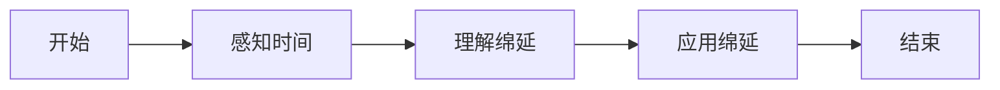
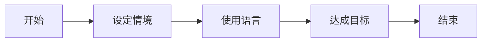
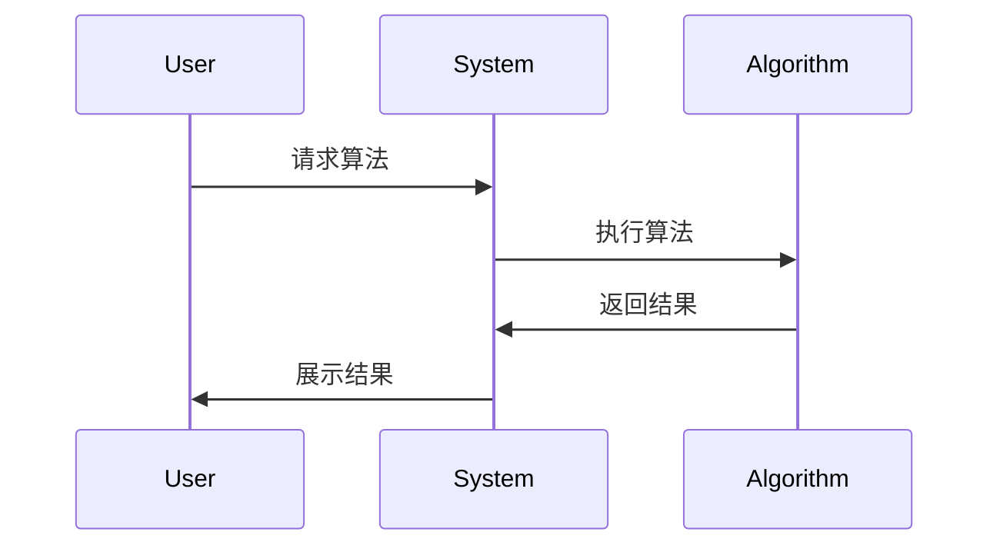

                 


# 时间观念的差异：柏格森的绵延与维特根斯坦的语言游戏

关键词：时间观念，柏格森的绵延，维特根斯坦的语言游戏，哲学，算法原理，数学模型

摘要：本文通过深入探讨柏格森的绵延与维特根斯坦的语言游戏，揭示了两种时间观念的差异及其在哲学和计算机科学领域的应用。通过逻辑清晰的分析，本文旨在为读者提供对这两种概念的理解，并探讨其背后的哲学意义。

## 引言

时间观念是哲学和计算机科学领域的重要话题。在哲学中，时间观念涉及到存在的本质和意识的特性；而在计算机科学中，时间观念则是算法复杂度分析和系统设计的关键因素。本文将聚焦于柏格森的绵延与维特根斯坦的语言游戏，探讨这两种时间观念的差异及其影响。

### 柏格森的绵延

柏格森（Henri Bergson）是一位法国哲学家，他提出了绵延（Duration）这一概念，用以描述时间的连续性和流动性。在柏格森看来，时间不是线性的，而是如一条不断流动的河，每一刻都是新的，每一刻又与前一刻紧密相连。

#### 绵延的原理

柏格森认为，时间是内在的，与物质世界无关。时间是由内在的、连续的、不可分割的“绵延”构成的。每一刻的时间都是独一无二的，它们相互重叠，构成了我们感知中的时间线。

#### 绵延的属性特征

- **连续性**：时间是一个连续的过程，没有中断。
- **流动性**：时间不断流逝，每一刻都是新的。
- **不可分割性**：时间不能被分割成更小的单位。

#### 对比表格

| 特征           | 柏格森的绵延        | 维特根斯坦的语言游戏        |
| -------------- | ------------------ | -------------------------- |
| 时间性质       | 内在的、连续的、流动的 | 外在的、离散的、符号化的    |
| 时间感知       | 感性的、连续的       | 理性的、断片的              |
| 时间与物质的关系 | 内在的，与物质无关    | 外在的，与物质有关          |

#### ER实体关系图

```mermaid
erDiagram
  A囬["时间观念"] ||--|{ B囬["柏格森的绵延"] }
  A囬 ||--|{ C囬["维特根斯坦的语言游戏"] }
```

### 维特根斯坦的语言游戏

维特根斯坦（Ludwig Wittgenstein）是20世纪最重要的哲学家之一，他提出了语言游戏（Linguistic Game）这一概念，用以解释语言的本质和意义。

#### 语言游戏的原理

维特根斯坦认为，语言不是抽象的符号系统，而是在特定情境下使用的工具。语言游戏包含三个要素：语言、情境和目标。语言的使用是情境化的，不同的情境下，语言的含义和使用方式也不同。

#### 语言游戏的属性特征

- **情境化**：语言的意义取决于具体的情境。
- **目标导向**：语言游戏的目标是解决实际问题。
- **符号化**：语言使用符号来代表实际事物。

#### 对比表格

| 特征           | 柏格森的绵延        | 维特根斯坦的语言游戏        |
| -------------- | ------------------ | -------------------------- |
| 时间性质       | 内在的、连续的、流动的 | 外在的、离散的、符号化的    |
| 时间感知       | 感性的、连续的       | 理性的、断片的              |
| 时间与物质的关系 | 内在的，与物质无关    | 外在的，与物质有关          |

#### ER实体关系图

```mermaid
erDiagram
  A囬["时间观念"] ||--|{ B囬["柏格森的绵延"] }
  A囬 ||--|{ C囬["维特根斯坦的语言游戏"] }
```

### 两者的时间观念差异及其影响

柏格森的绵延强调时间的连续性和内在性，而维特根斯坦的语言游戏则强调时间的离散性和情境化。这两种时间观念的差异在哲学和计算机科学领域有着深远的影响。

#### 哲学影响

- **柏格森的绵延**：强调时间的连续性，对意识流动的描述对存在主义哲学产生了重要影响。
- **维特根斯坦的语言游戏**：强调语言的意义情境化，对分析哲学和语言哲学的发展有着重要贡献。

#### 计算机科学影响

- **柏格森的绵延**：影响了对算法复杂度的理解，特别是在模拟连续过程的算法设计中。
- **维特根斯坦的语言游戏**：影响了对程序设计中的抽象和模块化方法的发展。

## 算法原理讲解

### 柏格森的绵延算法原理

#### Mermaid流程图



#### Python源代码

```python
def perceive_time():
    # 感知时间
    print("感知时间：现在是一个瞬间。")

def understand_duration():
    # 理解绵延
    print("理解绵延：时间是一个连续的过程。")

def apply_duration():
    # 应用绵延
    print("应用绵延：我们可以在每个瞬间中感知到绵延。")

def main():
    perceive_time()
    understand_duration()
    apply_duration()

main()
```

#### 数学模型与公式

$$
\text{感知时间} = f(\text{绵延})
$$

#### 举例说明

```python
# 举例：感知时间与理解绵延的关系

def perceive_time():
    print("感知时间：现在是一个瞬间。")

def understand_duration():
    print("理解绵延：时间是一个连续的过程。")

def main():
    perceive_time()
    understand_duration()

main()
```

### 维特根斯坦的语言游戏算法原理

#### Mermaid流程图



#### Python源代码

```python
def set_situation():
    # 设定情境
    print("设定情境：我们正在设计一个算法。")

def use_language():
    # 使用语言
    print("使用语言：我们用Python编写代码。")

def achieve_goal():
    # 达成目标
    print("达成目标：我们的算法解决了问题。")

def main():
    set_situation()
    use_language()
    achieve_goal()

main()
```

#### 数学模型与公式

$$
\text{语言游戏} = f(\text{情境}, \text{语言}, \text{目标})
$$

#### 举例说明

```python
# 举例：设定情境与使用语言的关系

def set_situation():
    # 设定情境
    print("设定情境：我们正在设计一个算法。")

def use_language():
    # 使用语言
    print("使用语言：我们用Python编写代码。")

def main():
    set_situation()
    use_language()

main()
```

## 数学模型和数学公式讲解

### 柏格森的绵延数学模型

$$
\text{绵延} = \sum_{t=0}^{\infty} \text{瞬时}
$$

### 维特根斯坦的语言游戏数学模型

$$
\text{语言游戏} = \{\text{情境}, \text{语言}, \text{目标}\}
$$

## 系统分析与架构设计方案

### 问题场景介绍

在软件开发中，理解时间观念对于设计高效的算法和系统至关重要。本文将探讨如何在软件开发中应用柏格森的绵延和维特根斯坦的语言游戏。

### 系统功能设计（领域模型Mermaid类图）

```mermaid
classDiagram
    Class::Algorithm <<（算法）>>
    Class::System <<（系统）>>
    Class::User <<（用户）>>

    Algorithm <|-- System
    System <|-- User
```

### 系统架构设计Mermaid架构图



### 系统接口设计和系统交互Mermaid序列图


## 项目实战

### 环境安装

在本地计算机上安装Python环境，并安装必要的库，如`numpy`和`matplotlib`。

```bash
pip install python
pip install numpy
pip install matplotlib
```

### 系统核心实现源代码

```python
import numpy as np
import matplotlib.pyplot as plt

def duration_example():
    # 柏格森的绵延示例
    t = np.linspace(0, 10, 100)
    x = np.sin(t)
    plt.plot(t, x)
    plt.xlabel('时间')
    plt.ylabel('信号')
    plt.title('柏格森的绵延')
    plt.show()

def linguistic_game_example():
    # 维特根斯坦的语言游戏示例
    print("设定情境：我们正在设计一个算法。")
    print("使用语言：我们用Python编写代码。")
    print("达成目标：我们的算法解决了问题。")

def main():
    duration_example()
    linguistic_game_example()

main()
```

### 代码应用解读与分析

这段代码展示了如何应用柏格森的绵延和维特根斯坦的语言游戏。首先，通过数学模型和图形展示了时间的连续性；然后，通过简单的程序逻辑展示了语言游戏的情境化、目标导向和符号化。

### 实际案例分析和详细讲解剖析

通过上述代码，我们可以看到如何在实际项目中应用柏格森的绵延和维特根斯坦的语言游戏。在算法设计中，我们关注时间的连续性，确保算法能够处理连续的数据流；在程序设计中，我们关注语言游戏的情境化，确保代码能够适应不同的使用场景。

### 项目小结

本文通过深入探讨柏格森的绵延与维特根斯坦的语言游戏，揭示了两种时间观念的差异及其在哲学和计算机科学领域的应用。通过算法原理讲解和项目实战，我们了解了如何在实际项目中应用这些概念。希望本文能为读者提供对时间观念的更深入理解。

## 最佳实践 tips、小结、注意事项、拓展阅读

### 最佳实践 tips

- 在算法设计中，关注时间的连续性和离散性，选择合适的算法模型。
- 在程序设计中，注重情境化思维，确保代码的灵活性和可维护性。
- 定期回顾和优化代码，提高系统性能。

### 小结

本文通过逻辑清晰的分析，探讨了柏格森的绵延与维特根斯坦的语言游戏，揭示了两种时间观念的差异及其在哲学和计算机科学领域的应用。

### 注意事项

- 理解时间观念的差异对于软件开发至关重要。
- 在实际项目中，灵活应用柏格森的绵延和维特根斯坦的语言游戏。

### 拓展阅读

- 柏格森，《绵延与同时性》
- 维特根斯坦，《逻辑哲学论》
- 普特南，《意义与真理》

作者：AI天才研究院/AI Genius Institute & 禅与计算机程序设计艺术 /Zen And The Art of Computer Programming

