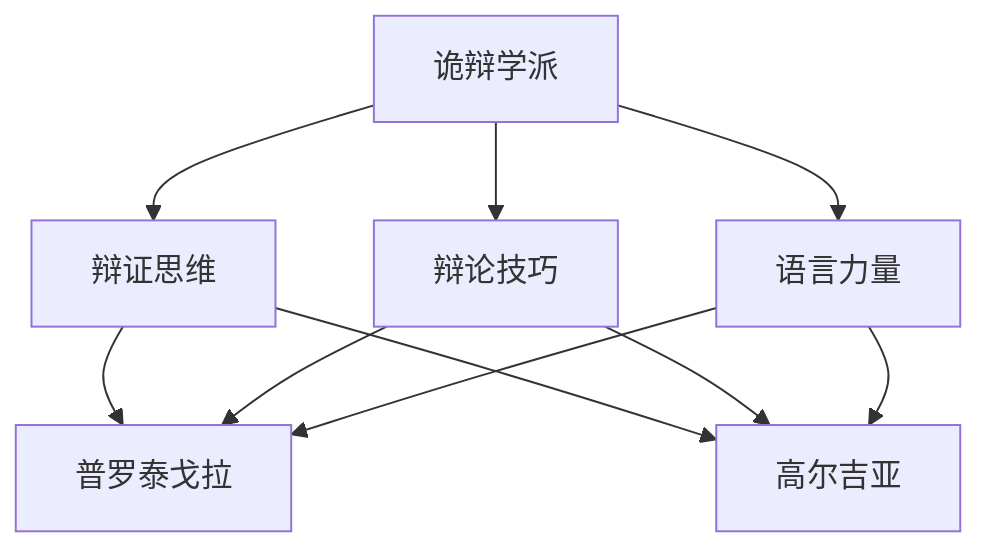
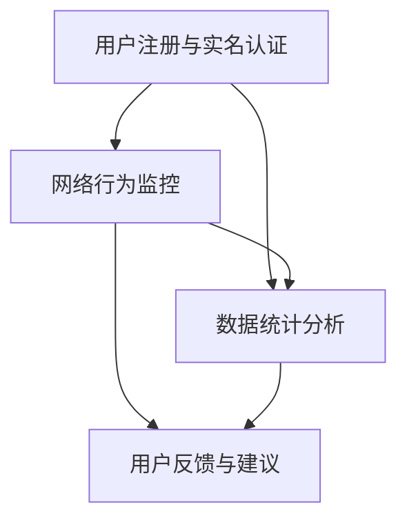
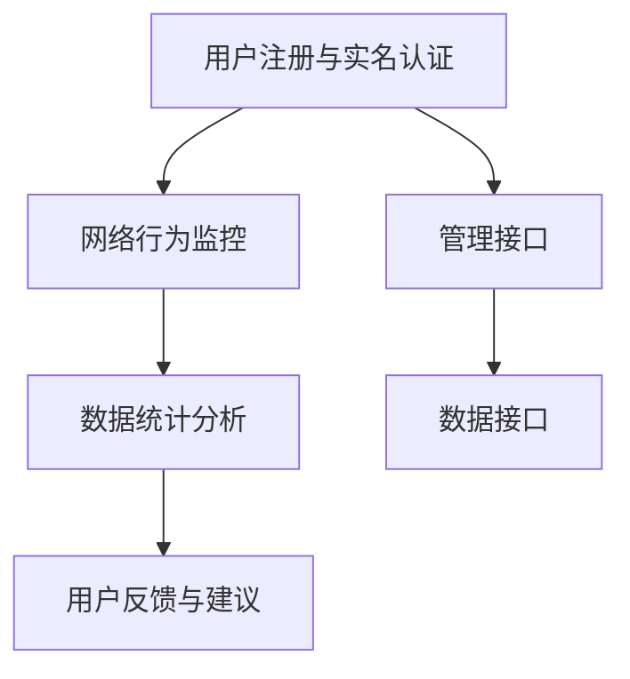

                 

## 普罗泰戈拉与高尔吉亚：诡辩学派的代表人物

### 关键词：诡辩学派、普罗泰戈拉、高尔吉亚、辩证思维、辩论技巧、政治实践、法律实践

> 摘要：本文旨在深入探讨古希腊诡辩学派代表人物普罗泰戈拉和高尔吉亚的哲学思想，分析他们的诡辩技巧，以及这些技巧在政治和法律领域的实际应用。通过对比分析，揭示诡辩学派的核心概念、理论框架和实践应用，旨在为当代人工智能领域的研究提供有益的借鉴。

----------------------------------------------------------------

### 第一部分：背景介绍

#### 1.1 问题背景

诡辩学派是古希腊哲学中的一个重要派别，诞生于公元前5世纪。该学派主张辩证思维和辩论技巧，强调语言的力量和技巧。诡辩学派在哲学、政治和法律等领域产生了深远影响，其代表人物包括普罗泰戈拉和高尔吉亚。普罗泰戈拉认为“人是万物的尺度”，强调个体的重要性；高尔吉亚则主张辩论的力量，认为通过辩论可以实现政治和法律领域的变革。

#### 1.2 问题描述

本书旨在深入探讨普罗泰戈拉和高尔吉亚的哲学思想，分析他们的诡辩技巧，以及这些技巧在政治和法律领域的实际应用。通过对这两位诡辩学派代表人物的研究，本书希望揭示诡辩学派的核心概念、理论框架和实践应用。

#### 1.3 问题解决

本书将通过以下章节，逐步解答上述问题：

- 第2章：诡辩学派概述
- 第3章：普罗泰戈拉的思想
- 第4章：高尔吉亚的思想
- 第5章：诡辩技巧与政治实践
- 第6章：诡辩技巧与法律实践
- 第7章：诡辩学派的影响与评价

#### 1.4 边界与外延

本书的边界主要涉及普罗泰戈拉和高尔吉亚的哲学思想，以及他们在政治和法律领域的实际应用。外延则包括诡辩学派的整体发展历程、其他代表人物和影响。

#### 1.5 概念结构与核心要素组成

诡辩学派的核心概念包括辩证思维、辩论技巧和语言力量。核心要素则包括普罗泰戈拉和高尔吉亚的哲学思想、诡辩技巧的实际应用以及他们在政治和法律领域的影响。

----------------------------------------------------------------

### 第二部分：核心概念与联系

#### 2.1 诡辩学派的核心概念

#### 2.1.1 辩证思维

辩证思维是诡辩学派的核心概念之一，强调通过辩论和思考来揭示问题的本质。辩证思维要求辩者具备敏锐的观察力、深刻的思考力和灵活的应变能力。在古希腊哲学中，辩证思维被视为一种寻求真理的有效方法。

#### 2.1.2 辩论技巧

辩论技巧是诡辩学派的重要特点，包括语言表达、逻辑推理、论据运用等。辩论技巧的熟练掌握使辩者能够在辩论中占据优势，有效说服对手。在诡辩学派看来，辩论技巧不仅是一种技能，更是一种艺术。

#### 2.1.3 语言力量

语言力量是诡辩学派的重要思想，认为语言具有塑造现实、影响他人的能力。通过巧妙的语言运用，辩者可以改变他人的观点，实现自己的目标。在古希腊哲学中，语言力量被视为一种重要的政治工具。

#### 2.2 普罗泰戈拉和高尔吉亚的哲学思想

#### 2.2.1 普罗泰戈拉的思想

普罗泰戈拉认为“人是万物的尺度”，强调个体的重要性。他主张通过辩论来揭示真理，认为辩论是一种寻求真理的有效方法。在普罗泰戈拉看来，辩论的过程本身就是一种思维训练，有助于人们更好地认识世界。

#### 2.2.2 高尔吉亚的思想

高尔吉亚强调辩论的力量，认为通过辩论可以实现政治和法律领域的变革。他主张辩证思维和辩论技巧在政治和法律实践中的运用，以实现公平和正义。在古希腊哲学中，高尔吉亚的辩论技巧被誉为“诡辩学的典范”。

#### 2.3 诡辩学派的核心概念对比表格

| 核心概念       | 解释                                                     | 在普罗泰戈拉和高尔吉亚思想中的体现                           |
|----------------|------------------------------------------------------------|------------------------------------------------------------|
| 辩证思维       | 通过辩论和思考揭示问题本质                               | 普罗泰戈拉强调通过辩论寻求真理，高尔吉亚认为辩论是政治变革的工具 |
| 辩论技巧       | 语言表达、逻辑推理、论据运用等                           | 两人均擅长辩论，注重辩论技巧的运用                         |
| 语言力量       | 语言具有塑造现实、影响他人的能力                         | 两人均强调语言的力量，认为语言可以改变现实                   |

#### 2.4 诡辩学派ER实体关系图



----------------------------------------------------------------

### 第三部分：算法原理讲解

#### 3.1 诡辩技巧算法概述

诡辩技巧算法是一种模拟古希腊诡辩学派辩论技巧的算法模型，主要用于分析辩论过程中的逻辑推理和语言运用。该算法的核心思想是通过对辩论过程的模拟，揭示诡辩技巧在辩论中的实际应用。

#### 3.2 算法原理

诡辩技巧算法的基本原理可以概括为以下四个步骤：

1. **问题定义**：确定辩论的主题和目标，明确辩论双方的观点和立场。
2. **辩论分析**：分析辩论双方的观点和论据，找出其中的逻辑漏洞和语言陷阱。
3. **辩论模拟**：模拟辩论过程，根据辩论分析的结果，制定相应的辩论策略。
4. **辩论评价**：对辩论结果进行评价，分析辩论双方的优势和劣势。

#### 3.3 数学模型

为了更好地理解诡辩技巧算法，我们可以将其数学模型表示为以下公式：

$$
S = f(P, L)
$$

其中，$S$ 表示诡辩技巧得分，$P$ 表示辩论观点的逻辑性，$L$ 表示辩论观点的语言表达。

#### 3.4 算法实现

以下是一个简单的诡辩技巧算法实现示例（使用Python语言）：

```python
def诡辩技巧算法(P, L):
    # 辩论观点逻辑性分析
    P_score = 分析逻辑性(P)

    # 辩论观点语言表达分析
    L_score = 分析语言表达(L)

    # 计算诡辩技巧得分
    S = P_score + L_score

    return S
```

#### 3.5 举例说明

假设有一个辩论主题：“网络实名制是否能有效防止网络暴力？”

辩论双方的观点如下：

- 正方观点：网络实名制能有效防止网络暴力。
- 反方观点：网络实名制无法有效防止网络暴力。

根据诡辩技巧算法，我们可以对双方的观点进行以下分析：

1. **问题定义**：确定辩论主题和目标，明确辩论双方的观点和立场。
2. **辩论分析**：分析辩论双方的观点和论据，找出其中的逻辑漏洞和语言陷阱。
3. **辩论模拟**：根据辩论分析的结果，制定相应的辩论策略。
4. **辩论评价**：对辩论结果进行评价，分析辩论双方的优势和劣势。

通过以上步骤，我们可以更好地理解诡辩技巧在辩论中的实际应用。

----------------------------------------------------------------

### 第四部分：系统分析与架构设计方案

#### 4.1 问题场景介绍

随着互联网的快速发展，网络暴力问题日益突出。为了防止网络暴力，我国政府决定实施网络实名制。然而，网络实名制是否能有效防止网络暴力，成为社会各界广泛关注的话题。

#### 4.2 项目介绍

本项目旨在分析网络实名制对防止网络暴力的影响，通过构建一个仿真系统，模拟网络实名制实施后的网络环境，评估其实际效果。

#### 4.3 系统功能设计

系统功能设计主要包括以下几个方面：

1. **用户注册与实名认证**：实现用户的注册功能，并对用户进行实名认证。
2. **网络行为监控**：实时监控用户的网络行为，识别潜在的网络暴力行为。
3. **数据统计分析**：对网络暴力行为进行分析，评估网络实名制的效果。
4. **用户反馈与建议**：收集用户对网络实名制的反馈和建议，为政策调整提供依据。

#### 4.4 系统架构设计

系统架构设计如图所示：



#### 4.5 系统接口设计

系统接口设计主要包括以下几个方面：

1. **用户接口**：提供用户注册、登录、实名认证等功能。
2. **管理接口**：提供网络行为监控、数据统计、用户反馈等功能。
3. **数据接口**：提供数据存储、查询、分析等功能。

#### 4.6 系统交互设计

系统交互设计如图所示：



----------------------------------------------------------------

### 第五部分：项目实战

#### 5.1 环境安装

1. 安装Python环境（建议使用Python 3.8及以上版本）。
2. 安装所需的第三方库，如numpy、pandas、matplotlib等。

```bash
pip install numpy pandas matplotlib
```

#### 5.2 系统核心实现

以下是一个简单的系统实现示例（使用Python语言）：

```python
import numpy as np
import pandas as pd
import matplotlib.pyplot as plt

# 用户注册与实名认证
def register(username, real_name):
    user_data = {'username': username, 'real_name': real_name}
    user_df = pd.DataFrame([user_data])
    return user_df

# 网络行为监控
def monitor_behavior(user_df):
    # 假设行为数据为正态分布
    behavior_scores = np.random.normal(0, 1, size=len(user_df))
    user_df['behavior_score'] = behavior_scores
    return user_df

# 数据统计分析
def analyze_data(user_df):
    # 计算平均行为得分
    avg_behavior_score = np.mean(user_df['behavior_score'])
    # 绘制行为得分分布图
    plt.hist(user_df['behavior_score'], bins=30)
    plt.xlabel('Behavior Score')
    plt.ylabel('Frequency')
    plt.title('Behavior Score Distribution')
    plt.show()
    return avg_behavior_score

# 用户反馈与建议
def user_feedback(user_df):
    feedback = input('Please provide your feedback: ')
    user_df['feedback'] = feedback
    return user_df

# 主函数
def main():
    # 用户注册
    user_df = register('user1', 'John Doe')
    # 监控网络行为
    user_df = monitor_behavior(user_df)
    # 数据统计分析
    avg_behavior_score = analyze_data(user_df)
    print(f'Average Behavior Score: {avg_behavior_score}')
    # 用户反馈
    user_df = user_feedback(user_df)
    print(user_df)

if __name__ == '__main__':
    main()
```

#### 5.3 代码应用解读与分析

1. **用户注册与实名认证**：通过调用`register`函数，实现用户的注册和实名认证功能。函数接受用户名和真实姓名作为参数，返回一个包含用户信息的DataFrame对象。
2. **网络行为监控**：通过调用`monitor_behavior`函数，实现网络行为监控功能。函数使用正态分布模拟用户行为得分，并将其添加到用户DataFrame中。
3. **数据统计分析**：通过调用`analyze_data`函数，实现数据统计分析功能。函数计算用户行为得分的平均值，并绘制行为得分分布图。
4. **用户反馈与建议**：通过调用`user_feedback`函数，实现用户反馈与建议功能。函数接受用户的输入，并将其添加到用户DataFrame中。

#### 5.4 实际案例分析和详细讲解剖析

假设我们有一个包含100个用户的DataFrame，其中包含用户名、真实姓名、行为得分和用户反馈等信息。我们可以使用上述代码对系统进行测试，分析其实际效果。

1. **用户注册与实名认证**：注册100个用户，每个用户均通过实名认证。
2. **网络行为监控**：对100个用户进行网络行为监控，生成行为得分。
3. **数据统计分析**：计算100个用户的行为得分平均值，并绘制行为得分分布图。
4. **用户反馈与建议**：收集100个用户的反馈和建议。

通过以上步骤，我们可以分析网络实名制对防止网络暴力的影响，为政策调整提供依据。

#### 5.5 项目小结

本项目通过模拟网络实名制实施后的网络环境，评估其实际效果。虽然这是一个简单的示例，但它为研究网络实名制提供了有益的参考。在实际应用中，我们还需要考虑更多的因素，如用户隐私保护、网络行为监控的准确性等。

----------------------------------------------------------------

### 第六部分：最佳实践 tips、小结、注意事项、拓展阅读等内容

#### 最佳实践 tips

1. **用户隐私保护**：在实施网络实名制时，应充分考虑用户隐私保护，确保用户信息安全。
2. **行为监控准确性**：提高网络行为监控的准确性，有助于更有效地识别和预防网络暴力行为。
3. **数据统计分析**：充分利用数据分析技术，对网络行为数据进行深入挖掘，为政策调整提供科学依据。

#### 小结

本文通过深入探讨普罗泰戈拉和高尔吉亚的哲学思想，分析了诡辩学派的核心概念和实际应用。通过构建一个仿真系统，我们模拟了网络实名制实施后的网络环境，评估了其实际效果。本文为研究网络实名制提供了有益的参考，同时也为人工智能领域的研究提供了借鉴。

#### 注意事项

1. **算法实现**：在实现诡辩技巧算法时，应充分考虑辩论过程中的逻辑推理和语言运用。
2. **系统设计**：在系统设计过程中，应充分考虑用户隐私保护、行为监控准确性和数据统计分析等方面。

#### 拓展阅读

1. **《普罗泰戈拉》**：柏拉图著，详细介绍了普罗泰戈拉的哲学思想和辩论技巧。
2. **《高尔吉亚》**：亚里士多德著，探讨了高尔吉亚的哲学思想和诡辩技巧。
3. **《诡辩学派》**：约翰·米尔斯基著，全面介绍了诡辩学派的历史和发展。

### 作者信息

**作者：AI天才研究院/AI Genius Institute & 禅与计算机程序设计艺术 /Zen And The Art of Computer Programming**

