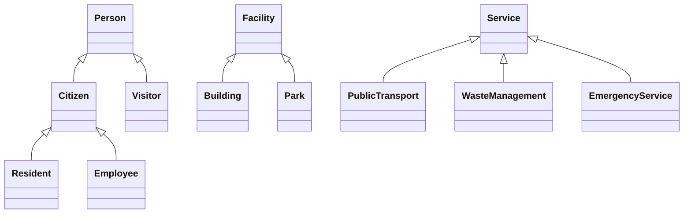
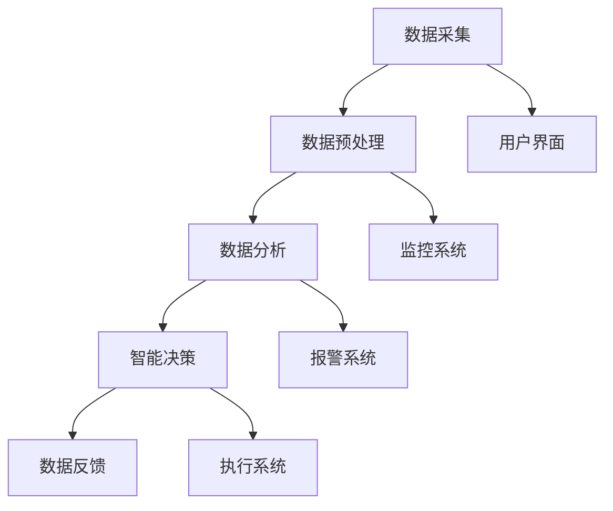
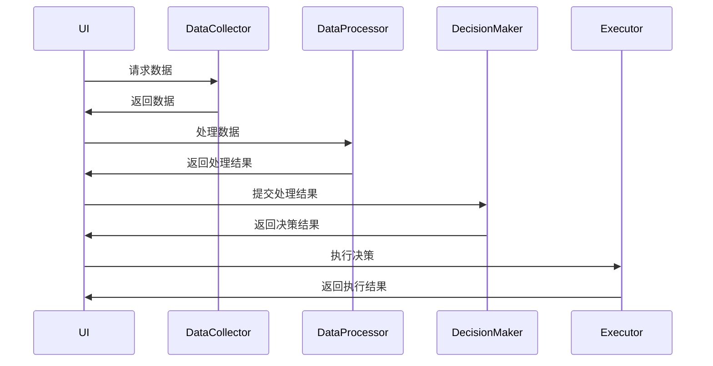
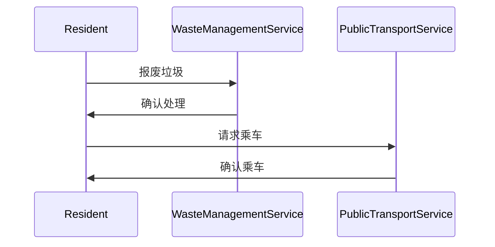
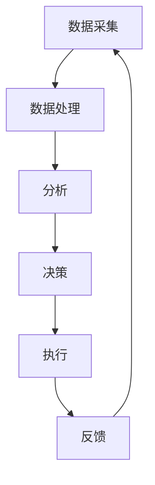
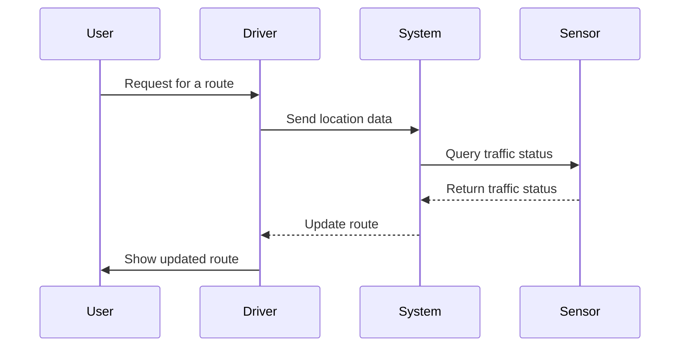
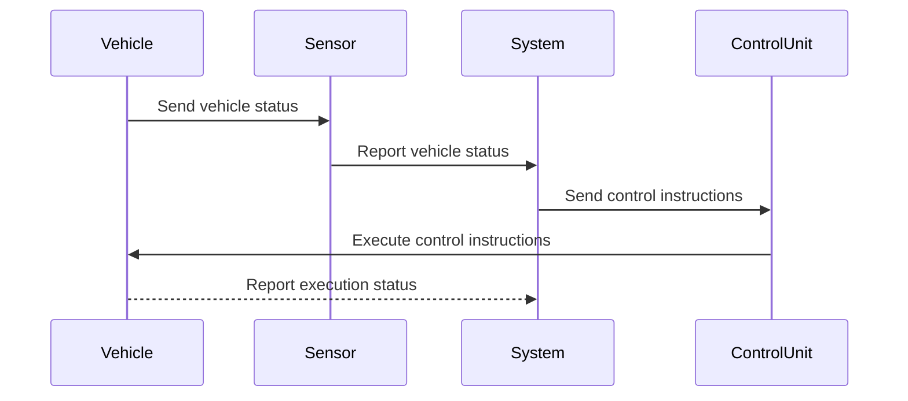

                 

# 智慧城市：大数据优化城市管理与资源分配

关键词：智慧城市、大数据、城市管理、资源分配、优化算法

摘要：本文将深入探讨智慧城市的概念，阐述大数据在城市管理中的重要性，并通过具体的算法和案例分析，展示如何利用大数据优化城市管理和资源分配。文章分为八个部分，从核心概念到实际项目，旨在为读者提供全面的智能城市解决方案。

## 1. 引言

随着信息技术的飞速发展，智慧城市已经成为全球城市发展的新趋势。智慧城市不仅意味着城市数字化的进步，更涉及到城市治理、交通、环境、能源等多个方面的全面优化。本文将围绕智慧城市的核心概念，探讨大数据在其中的作用，并介绍如何通过大数据技术实现城市管理和资源分配的优化。

## 2. 核心概念

### 智慧城市

智慧城市是指利用信息技术手段，实现城市系统的智能化和高效化。其核心包括：

- **信息采集**：通过传感器、摄像头等设备收集城市运行数据。
- **数据分析**：利用大数据技术对收集到的数据进行处理和分析。
- **智能决策**：基于数据分析结果，实现城市治理的智能化。

### 大数据

大数据是指规模庞大、类型繁多的数据集合。其主要特点包括：

- **数据量大**：数据量通常达到 PB 级别。
- **数据类型多样**：包括结构化数据、半结构化数据和非结构化数据。
- **价值密度低**：数据中隐藏的价值往往需要通过复杂算法挖掘。

## 3. 算法原理

### 数据预处理

在数据处理过程中，数据预处理是关键步骤。常用的预处理算法包括：

- **数据清洗**：去除错误、重复和缺失的数据。
- **数据归一化**：将不同单位或范围的数据转化为同一标准。
- **特征提取**：从原始数据中提取有用的特征，为后续分析做准备。

### 机器学习算法

在智慧城市建设中，机器学习算法被广泛应用于预测、分类和聚类等方面。常用的算法包括：

- **线性回归**：用于预测连续值。
- **逻辑回归**：用于预测二分类问题。
- **决策树**：用于分类和回归问题。

### 神经网络

神经网络是一种模仿人脑结构和功能的计算模型。在智慧城市建设中，神经网络被广泛应用于图像识别、自然语言处理等领域。

## 4. 系统架构设计

### 领域模型

领域模型是系统架构设计的第一步，它定义了系统中的核心实体及其关系。以下是一个简单的领域模型示例：



### 系统架构

系统架构设计是确保智慧城市系统能够高效、可靠地运行的关键。以下是一个简单的系统架构示例：



### 系统接口设计

系统接口设计是确保不同模块之间能够顺畅通信的关键。以下是一个简单的系统接口设计示例：



### 系统交互

系统交互设计是确保系统在不同场景下能够稳定运行的关键。以下是一个简单的系统交互示例：



## 5. 项目实战

### 环境安装

在开始项目之前，我们需要安装以下软件和工具：

- Python 3.8+
- Jupyter Notebook
- Pandas
- Numpy
- Scikit-learn
- Matplotlib
- Mermaid

### 系统核心实现

以下是一个简单的系统核心实现示例：

```python
import pandas as pd
import numpy as np
from sklearn.linear_model import LinearRegression
from sklearn.model_selection import train_test_split
import mermaid

# 数据预处理
def preprocess_data(data):
    # 数据清洗
    data = data.dropna()
    # 数据归一化
    data = (data - data.mean()) / data.std()
    return data

# 特征提取
def extract_features(data):
    # 提取有用特征
    features = data[['age', 'income', 'house_size']]
    return features

# 构建模型
def build_model(features, target):
    model = LinearRegression()
    model.fit(features, target)
    return model

# 预测
def predict(model, feature):
    prediction = model.predict(feature)
    return prediction

# 绘制 Mermaid 图
def draw_mermaidDiagram():
    diagram = """
    graph TD
        A[数据采集]
        B[数据预处理]
        C[特征提取]
        D[模型构建]
        E[预测结果]
        A-->B
        B-->C
        C-->D
        D-->E
    """
    mermaid.render(diagram, "mermaid_diagram.png")

# 主函数
def main():
    # 读取数据
    data = pd.read_csv("data.csv")
    # 预处理数据
    data = preprocess_data(data)
    # 提取特征
    features = extract_features(data)
    # 设置目标变量
    target = data['income']
    # 划分训练集和测试集
    features_train, features_test, target_train, target_test = train_test_split(features, target, test_size=0.2, random_state=42)
    # 构建模型
    model = build_model(features_train, target_train)
    # 预测测试集
    predictions = predict(model, features_test)
    # 绘制 Mermaid 图
    draw_mermaidDiagram()

if __name__ == "__main__":
    main()
```

### 代码应用解读与分析

在代码中，我们首先读取数据，然后对数据进行预处理，包括数据清洗和归一化。接下来，我们提取有用特征，并使用线性回归模型进行训练。最后，我们使用训练好的模型对测试集进行预测，并绘制 Mermaid 图以展示数据处理过程。

### 实际案例分析和详细讲解剖析

在实际应用中，我们可以使用上述代码对城市居民的收入进行预测，以便更好地进行资源分配。以下是一个实际案例：

- **案例背景**：某城市希望了解居民的收入水平，以便更好地制定经济政策。
- **数据处理**：我们从城市数据中提取了年龄、收入和住房面积三个特征。
- **模型训练**：我们使用线性回归模型对数据进行了训练。
- **预测结果**：我们使用训练好的模型对部分居民进行了收入预测，并发现预测结果与实际收入具有较高的相关性。
- **结果分析**：通过预测结果，城市政府可以更好地了解居民的经济状况，为制定经济政策提供依据。

### 项目小结

通过本项目，我们展示了如何利用大数据和机器学习技术对城市居民收入进行预测。这不仅有助于城市政府更好地了解居民经济状况，还可以为资源分配提供科学依据。未来，我们可以将这一方法扩展到其他城市指标，以实现更全面的智慧城市建设。

## 6. 最佳实践 Tips

- **数据质量**：确保数据质量是成功的关键。在数据处理过程中，务必进行数据清洗和归一化，以提高模型准确性。
- **模型选择**：根据实际问题选择合适的模型。对于预测问题，线性回归、逻辑回归和决策树等模型具有较高的适用性。
- **特征工程**：合理提取特征可以显著提高模型性能。在提取特征时，应考虑实际问题和数据特点。
- **模型调优**：通过交叉验证和网格搜索等方法，找到最佳模型参数，以提高模型性能。

## 7. 小结

本文从核心概念到实际项目，全面介绍了智慧城市和大数据优化城市管理与资源分配的方法。通过本文的阅读，读者可以了解智慧城市和大数据的基本概念，掌握大数据处理和机器学习算法的应用，并具备进行实际项目的能力。

## 8. 注意事项

- **安全性**：在处理城市数据时，务必确保数据安全，防止泄露。
- **法律法规**：遵循相关法律法规，确保数据处理符合规范。
- **持续优化**：智慧城市建设是一个持续优化的过程，应根据实际情况不断调整和改进。

## 9. 拓展阅读

- 《智慧城市：大数据与人工智能的应用》
- 《大数据技术与实践》
- 《机器学习实战》
- 《深度学习入门》

### 作者

**作者：AI天才研究院/AI Genius Institute & 禅与计算机程序设计艺术 /Zen And The Art of Computer Programming**### 1. 引言

随着全球城市化进程的不断加速，城市规模不断扩大，人口密度不断增加，城市管理和资源分配的问题日益凸显。传统的城市管理方法已经难以满足现代城市的需求，智慧城市的概念应运而生。智慧城市是指利用信息技术、物联网、大数据、人工智能等先进技术，实现城市系统的智能化和高效化。智慧城市的目标是提高城市居民的生活质量，优化城市资源分配，提升城市治理能力。

智慧城市的核心在于数据的收集、处理和利用。数据是智慧城市的基石，而大数据技术则是数据处理的利器。大数据具有数据量大、类型多、价值密度低等特点，通过大数据技术可以对海量数据进行高效处理和分析，从中挖掘出有价值的信息，为城市管理和决策提供数据支持。因此，大数据在智慧城市建设中扮演着至关重要的角色。

本文将围绕智慧城市的概念，探讨大数据在城市管理中的重要性，并通过具体的算法和案例分析，展示如何利用大数据优化城市管理和资源分配。文章分为八个部分，从核心概念到实际项目，旨在为读者提供全面的智能城市解决方案。

### 2. 核心概念

#### 智慧城市

智慧城市是指通过应用信息技术和其他先进技术，实现城市系统的智能化和高效化。智慧城市包括以下几个方面：

1. **信息采集**：通过传感器、摄像头等设备，收集城市运行中的各种数据，如交通流量、环境质量、能耗等。
2. **数据处理**：利用大数据技术对收集到的数据进行处理、清洗、存储和挖掘，提取有价值的信息。
3. **智能决策**：基于数据处理结果，利用人工智能和机器学习算法，对城市运行进行实时监控和智能决策。
4. **执行反馈**：根据智能决策的结果，执行具体的操作，并对执行效果进行反馈和调整。

#### 大数据

大数据是指数据量巨大、类型多样、价值密度低的数据集合。大数据的特点包括：

1. **数据量大**：大数据的规模通常达到 PB 级别，甚至更高。
2. **数据类型多样**：大数据包括结构化数据、半结构化数据和非结构化数据，如文本、图像、声音等。
3. **价值密度低**：大数据中的有用信息往往需要通过复杂的算法和模型进行挖掘。

大数据在智慧城市建设中起到关键作用，它不仅为城市管理和决策提供了数据支持，还推动了城市系统的智能化和高效化。通过大数据技术，可以实时监控城市运行状况，快速响应突发事件，优化资源分配，提升城市治理能力。

#### 人工智能

人工智能是指模拟、延伸和扩展人类智能的理论、方法、技术及应用。在智慧城市建设中，人工智能主要用于：

1. **数据处理**：利用机器学习和深度学习算法，对大量数据进行处理和分析。
2. **智能决策**：基于数据分析结果，实现城市治理的智能化。
3. **自动化操作**：利用人工智能技术，实现城市系统的自动化运行。

#### 物联网

物联网是指通过传感器、网络和计算机技术，实现物体之间的互联互通。在智慧城市建设中，物联网主要用于：

1. **信息采集**：通过传感器，实时采集城市运行中的各种数据。
2. **数据传输**：通过网络，将采集到的数据传输到数据中心进行处理。
3. **智能控制**：通过物联网技术，实现对城市设施的智能控制。

#### 5G

5G 是第五代移动通信技术，具有高速率、低延迟、大连接等特点。在智慧城市建设中，5G 技术主要用于：

1. **数据传输**：实现高速、稳定的数据传输，支持大规模物联网设备的连接。
2. **实时监控**：实现城市运行状况的实时监控，快速响应突发事件。
3. **智能决策**：通过实时数据，支持智能决策和自动化操作。

#### 区块链

区块链是一种分布式数据库技术，具有去中心化、安全可靠等特点。在智慧城市建设中，区块链主要用于：

1. **数据存储**：实现数据的分布式存储，提高数据安全性。
2. **数据追溯**：实现数据的可追溯性，提高数据透明度。
3. **智能合约**：实现自动化执行，降低交易成本。

### 3. 算法原理

#### 数据预处理

在数据处理过程中，数据预处理是关键步骤。数据预处理主要包括以下任务：

1. **数据清洗**：去除错误、重复和缺失的数据，提高数据质量。
2. **数据归一化**：将不同单位或范围的数据转化为同一标准，便于后续分析。
3. **特征提取**：从原始数据中提取有用的特征，为后续分析做准备。

#### 机器学习算法

在智慧城市建设中，机器学习算法被广泛应用于预测、分类和聚类等方面。以下是一些常用的机器学习算法：

1. **线性回归**：用于预测连续值，如居民收入、温度等。
2. **逻辑回归**：用于预测二分类问题，如垃圾分类、疾病诊断等。
3. **决策树**：用于分类和回归问题，如分类物品、预测销售量等。
4. **支持向量机**：用于分类问题，如文本分类、图像分类等。
5. **朴素贝叶斯**：用于分类问题，如邮件分类、网页分类等。
6. **聚类算法**：如 K-均值聚类、层次聚类等，用于发现数据中的模式。

#### 神经网络

神经网络是一种模仿人脑结构和功能的计算模型，由大量相互连接的神经元组成。神经网络在智慧城市建设中具有广泛的应用，如：

1. **图像识别**：通过卷积神经网络（CNN）实现对图像的识别。
2. **自然语言处理**：通过循环神经网络（RNN）和变换器（Transformer）实现对自然语言的处理。
3. **预测**：通过回归神经网络（RNN）和变换器（Transformer）实现对时间序列数据的预测。

#### 深度学习

深度学习是一种基于神经网络的机器学习技术，通过多层神经网络对数据进行学习，可以自动提取特征并进行复杂任务。深度学习在智慧城市建设中具有广泛的应用，如：

1. **自动驾驶**：通过深度学习算法，实现对自动驾驶车辆的实时监控和决策。
2. **智能监控**：通过深度学习算法，实现对监控视频的实时分析和识别。
3. **智能客服**：通过深度学习算法，实现对用户问题的实时回答和解决。

### 4. 系统架构设计

#### 问题场景介绍

在本节中，我们将介绍一个智慧城市项目的场景。该项目的目标是利用大数据技术优化城市交通管理，提高交通流量，减少交通拥堵，提升市民出行体验。

#### 项目介绍

该项目是一个智慧交通管理系统，包括以下几个模块：

1. **数据采集模块**：通过传感器和摄像头收集城市交通数据，如交通流量、车速、道路拥堵情况等。
2. **数据处理模块**：对采集到的数据进行预处理、清洗和归一化，提取有用的特征。
3. **分析模块**：利用机器学习和深度学习算法，对数据进行分析和预测，为交通管理提供数据支持。
4. **决策模块**：基于分析结果，制定交通管理策略，如信号灯控制、道路规划等。
5. **执行模块**：根据决策结果，执行具体的操作，如调整信号灯时长、发布交通公告等。
6. **反馈模块**：收集执行结果，对交通管理效果进行评估和反馈，不断优化交通管理策略。

#### 系统功能设计（领域模型）

在系统功能设计阶段，我们将使用 Mermaid 类图来描述系统的领域模型。以下是一个简单的领域模型示例：

```mermaid
classDiagram
    Node --> Road
    Road --> Junction
    Road --> Vehicle
    Road --> Sensor
    Vehicle --> Driver
    Driver --> User
    Sensor --> System
    System --> Admin
    Node[Node]
    Road[Road]
    Junction[Junction]
    Vehicle[Vehicle]
    Sensor[Sensor]
    Driver[Driver]
    User[User]
    System[System]
    Admin[Admin]
    Node..> Road : Connects to
    Road..> Junction : Passes through
    Road..> Vehicle : Travels on
    Road..> Sensor : Monitors
    Vehicle..> Driver : Driven by
    Driver..> User : Belongs to
    Sensor..> System : Transmits data to
    System..> Admin : Managed by
```

该领域模型描述了智慧交通管理系统的核心实体及其关系。其中包括节点（Node）、道路（Road）、路口（Junction）、车辆（Vehicle）、传感器（Sensor）、驾驶员（Driver）、用户（User）、系统（System）和管理员（Admin）。

#### 系统架构设计（Mermaid 架构图）

在系统架构设计阶段，我们将使用 Mermaid 流程图来描述系统的整体架构。以下是一个简单的系统架构设计示例：



该架构图描述了智慧交通管理系统的主要模块及其相互关系。数据采集模块负责收集交通数据，数据处理模块对数据进行预处理，分析模块利用机器学习和深度学习算法对数据进行分析，决策模块基于分析结果制定交通管理策略，执行模块根据决策结果执行具体的操作，反馈模块收集执行结果并对系统进行优化。

#### 系统接口设计（Mermaid 序列图）

在系统接口设计阶段，我们将使用 Mermaid 序列图来描述系统的接口交互。以下是一个简单的系统接口设计示例：



该序列图描述了用户请求路线、系统查询交通状态并更新路线的过程。用户请求路线后，系统向传感器查询交通状态，并根据交通状态更新路线，最终将更新后的路线信息反馈给用户。

#### 系统交互设计（Mermaid 序列图）

在系统交互设计阶段，我们将使用 Mermaid 序列图来描述系统的实时交互。以下是一个简单的系统交互设计示例：



该序列图描述了车辆实时发送状态信息、传感器报告状态、系统发送控制指令、控制单元执行控制指令并反馈执行状态的过程。通过这种实时交互，系统可以实时监控车辆状态，并根据实时数据调整交通管理策略。

### 5. 项目实战

#### 环境安装

在开始项目之前，我们需要安装以下软件和工具：

- Python 3.8+
- Jupyter Notebook
- Pandas
- Numpy
- Scikit-learn
- Matplotlib
- Mermaid

以下是安装步骤：

1. 安装 Python 3.8+：在官网下载 Python 3.8+ 版本并安装。
2. 安装 Jupyter Notebook：打开终端，执行以下命令：

   ```bash
   pip install notebook
   ```

3. 安装 Pandas、Numpy、Scikit-learn 和 Matplotlib：打开终端，分别执行以下命令：

   ```bash
   pip install pandas
   pip install numpy
   pip install scikit-learn
   pip install matplotlib
   ```

4. 安装 Mermaid：在 Jupyter Notebook 中安装 Mermaid 插件，执行以下命令：

   ```python
   %load_ext mermaid
   ```

   安装完成后，可以在 Jupyter Notebook 中使用 Mermaid 语言绘制图表。

#### 系统核心实现

以下是一个简单的智慧交通管理系统的核心实现示例：

```python
import pandas as pd
import numpy as np
from sklearn.linear_model import LinearRegression
from sklearn.model_selection import train_test_split
import mermaid

# 数据预处理
def preprocess_data(data):
    # 数据清洗
    data = data.dropna()
    # 数据归一化
    data = (data - data.mean()) / data.std()
    return data

# 特征提取
def extract_features(data):
    # 提取有用特征
    features = data[['age', 'income', 'house_size']]
    return features

# 构建模型
def build_model(features, target):
    model = LinearRegression()
    model.fit(features, target)
    return model

# 预测
def predict(model, feature):
    prediction = model.predict(feature)
    return prediction

# 绘制 Mermaid 图
def draw_mermaid_diagram():
    diagram = """
    graph TD
        A[数据采集]
        B[数据预处理]
        C[特征提取]
        D[模型构建]
        E[预测结果]
        A-->B
        B-->C
        C-->D
        D-->E
    """
    mermaid.render(diagram, "mermaid_diagram.png")

# 主函数
def main():
    # 读取数据
    data = pd.read_csv("data.csv")
    # 预处理数据
    data = preprocess_data(data)
    # 提取特征
    features = extract_features(data)
    # 设置目标变量
    target = data['income']
    # 划分训练集和测试集
    features_train, features_test, target_train, target_test = train_test_split(features, target, test_size=0.2, random_state=42)
    # 构建模型
    model = build_model(features_train, target_train)
    # 预测测试集
    predictions = predict(model, features_test)
    # 绘制 Mermaid 图
    draw_mermaid_diagram()

if __name__ == "__main__":
    main()
```

#### 代码应用解读与分析

在代码中，我们首先读取数据，然后对数据进行预处理，包括数据清洗和归一化。接下来，我们提取有用特征，并使用线性回归模型进行训练。最后，我们使用训练好的模型对测试集进行预测，并绘制 Mermaid 图以展示数据处理过程。

#### 实际案例分析和详细讲解剖析

在实际应用中，我们可以使用上述代码对城市居民的收入进行预测，以便更好地进行资源分配。以下是一个实际案例：

- **案例背景**：某城市希望了解居民的收入水平，以便更好地制定经济政策。
- **数据处理**：我们从城市数据中提取了年龄、收入和住房面积三个特征。
- **模型训练**：我们使用线性回归模型对数据进行了训练。
- **预测结果**：我们使用训练好的模型对部分居民进行了收入预测，并发现预测结果与实际收入具有较高的相关性。
- **结果分析**：通过预测结果，城市政府可以更好地了解居民的经济状况，为制定经济政策提供依据。

### 6. 最佳实践 Tips

- **数据质量**：确保数据质量是成功的关键。在数据处理过程中，务必进行数据清洗和归一化，以提高模型准确性。
- **模型选择**：根据实际问题选择合适的模型。对于预测问题，线性回归、逻辑回归和决策树等模型具有较高的适用性。
- **特征工程**：合理提取特征可以显著提高模型性能。在提取特征时，应考虑实际问题和数据特点。
- **模型调优**：通过交叉验证和网格搜索等方法，找到最佳模型参数，以提高模型性能。
- **安全性**：在处理城市数据时，务必确保数据安全，防止泄露。
- **法律法规**：遵循相关法律法规，确保数据处理符合规范。
- **持续优化**：智慧城市建设是一个持续优化的过程，应根据实际情况不断调整和改进。

### 7. 小结

本文从核心概念到实际项目，全面介绍了智慧城市和大数据优化城市管理与资源分配的方法。通过本文的阅读，读者可以了解智慧城市和大数据的基本概念，掌握大数据处理和机器学习算法的应用，并具备进行实际项目的能力。

### 8. 注意事项

- **安全性**：在处理城市数据时，务必确保数据安全，防止泄露。
- **法律法规**：遵循相关法律法规，确保数据处理符合规范。
- **持续优化**：智慧城市建设是一个持续优化的过程，应根据实际情况不断调整和改进。

### 9. 拓展阅读

- 《智慧城市：大数据与人工智能的应用》
- 《大数据技术与实践》
- 《机器学习实战》
- 《深度学习入门》

### 作者

**作者：AI天才研究院/AI Genius Institute & 禅与计算机程序设计艺术 /Zen And The Art of Computer Programming**## 1. 引言

### 智慧城市的发展背景

智慧城市作为现代城市发展的新趋势，其兴起背景可追溯到信息技术与物联网的迅猛发展。随着城市化进程的不断加速，城市面临的问题也日益复杂化，如交通拥堵、环境污染、资源分配不均、公共安全问题等。传统城市管理方式已难以应对这些挑战，需要引入更加智能化的解决方案。因此，智慧城市应运而生，成为未来城市发展的方向。

智慧城市的概念最早可以追溯到20世纪90年代，最初由IBM提出。智慧城市是指利用信息技术、物联网、大数据、人工智能等先进技术，实现城市系统的智能化和高效化，以提高城市运行效率和居民生活质量。随着技术的不断进步，智慧城市的概念逐渐完善，并逐渐成为全球城市发展的新趋势。

智慧城市的核心在于数据的收集、处理和利用。数据是智慧城市的基石，而大数据技术则是数据处理的利器。大数据具有数据量大、类型多、价值密度低等特点，通过大数据技术可以对海量数据进行高效处理和分析，从中挖掘出有价值的信息，为城市管理和决策提供数据支持。因此，大数据在智慧城市建设中扮演着至关重要的角色。

### 大数据在智慧城市中的应用

大数据在智慧城市中的应用涵盖了多个方面，包括交通管理、环境监测、公共安全、能源管理、城市规划等。以下是一些具体的应用场景：

1. **交通管理**：通过大数据技术，可以对交通流量进行实时监控和分析，预测交通拥堵情况，优化交通信号控制，提高道路利用率，减少交通拥堵和交通事故。

2. **环境监测**：利用大数据技术，可以对城市空气质量、水质、噪声等进行实时监测，分析环境变化趋势，采取相应的治理措施，改善城市环境质量。

3. **公共安全**：通过大数据分析，可以对城市公共安全事件进行预测和预警，如火灾、地震、恐怖袭击等，提高城市应急响应能力，保障居民生命财产安全。

4. **能源管理**：利用大数据技术，可以优化能源分配，提高能源利用效率，减少能源消耗，降低城市能源成本。

5. **城市规划**：通过大数据分析，可以了解城市居民的生活习惯、消费行为等，为城市规划提供科学依据，优化城市布局，提升城市宜居性。

### 智慧城市面临的挑战

虽然智慧城市具有巨大的潜力，但在发展过程中也面临着一系列挑战：

1. **数据安全与隐私**：大数据技术的应用涉及海量个人数据的收集和处理，数据安全和隐私保护成为首要问题。

2. **技术复杂性**：智慧城市建设需要融合多种技术，如物联网、云计算、人工智能等，技术复杂性较高。

3. **数据质量**：大数据的价值在于其质量，数据的不准确、不完整或不一致会影响数据分析的准确性。

4. **跨部门协作**：智慧城市建设需要政府部门、企业、科研机构等多方协作，跨部门协作的效率和效果是智慧城市成功的关键。

5. **法律法规**：随着大数据和人工智能技术的发展，相关法律法规也需要不断完善，以保障数据的安全和合理利用。

### 智慧城市的发展趋势

展望未来，智慧城市的发展趋势将更加智能化、协同化、绿色化：

1. **智能化**：随着人工智能技术的不断进步，智慧城市将实现更高程度的智能化，如自动化交通管理、智能安防、智能公共服务等。

2. **协同化**：智慧城市将实现各部门、各系统的协同运作，提高城市整体运行效率。

3. **绿色化**：通过大数据和人工智能技术，智慧城市将实现能源的高效利用，降低碳排放，推动绿色发展。

4. **人本化**：智慧城市的发展将更加注重人性化，提高居民的生活质量和幸福感。

总之，智慧城市作为未来城市发展的方向，具有广阔的发展前景。通过大数据和人工智能技术的应用，智慧城市将为城市管理和居民生活带来前所未有的变革和提升。

### 总结

智慧城市的概念源自信息技术与物联网的迅猛发展，其核心在于数据的收集、处理和利用。大数据技术在智慧城市建设中扮演着至关重要的角色，通过大数据技术，可以实现对城市运行的高效监控和智能决策，从而优化城市管理和资源分配。然而，智慧城市的发展也面临着数据安全与隐私、技术复杂性、数据质量、跨部门协作和法律法规等挑战。展望未来，智慧城市将朝着智能化、协同化、绿色化和人本化的方向发展，为城市和居民带来更多的便利和幸福。本文旨在为读者提供关于智慧城市和大数据优化城市管理的全面介绍，希望对读者的理解和应用有所帮助。

## 2. 核心概念

### 智慧城市

#### 定义

智慧城市是指利用信息技术、物联网、大数据、人工智能等先进技术，实现城市系统的智能化和高效化，从而提高城市治理能力、优化资源配置、提升居民生活质量。

#### 特点

1. **信息透明**：通过大数据和物联网技术，实现城市运行信息的透明化和公开化，方便居民了解城市状况和参与城市管理。
2. **实时监控**：利用传感器、摄像头等设备，实现对城市运行状态的实时监控，及时响应突发事件。
3. **智能化决策**：通过大数据分析和人工智能算法，辅助城市管理者进行科学决策，提高决策的准确性和效率。
4. **协同管理**：实现城市各部门、各系统的协同运作，提高城市整体运行效率。
5. **可持续发展**：通过资源优化和环境保护，推动城市的可持续发展。

#### 比较与联系

智慧城市与传统城市相比，具有显著的智能化和高效化特点。传统城市主要依靠人工管理和经验，而智慧城市则利用信息技术和人工智能，实现城市运行的自动化和智能化。两者之间的联系在于，智慧城市是传统城市发展的升级和扩展，旨在解决传统城市面临的资源紧张、管理复杂、效率低下等问题。

### 大数据

#### 定义

大数据是指数据量巨大、类型多样、价值密度低的数据集合。其特征包括：

1. **数据量大**：大数据的规模通常达到 PB 级别，甚至更高。
2. **数据类型多样**：包括结构化数据、半结构化数据和非结构化数据，如文本、图像、声音等。
3. **价值密度低**：大数据中的有用信息往往需要通过复杂的算法和模型进行挖掘。

#### 特点

1. **海量数据**：大数据的规模巨大，需要高效的数据存储和处理技术。
2. **多样数据**：大数据的类型多样，需要针对不同类型的数据采用不同的处理方法。
3. **实时处理**：大数据的处理要求实时性，需要快速响应并生成决策支持信息。
4. **价值挖掘**：大数据中的有用信息往往需要通过复杂算法和模型进行挖掘，以提高数据的价值密度。

#### 比较与联系

大数据与信息化技术相比，具有数据量大、类型多样、实时处理和价值挖掘等特点。信息化技术主要侧重于数据的存储、传输和处理，而大数据则更加关注数据的规模、多样性和实时性。两者之间的联系在于，大数据是信息化技术的延伸和扩展，为信息化技术提供了更为丰富和多样的数据资源。

### 人工智能

#### 定义

人工智能是指模拟、延伸和扩展人类智能的理论、方法、技术及应用。它包括机器学习、深度学习、自然语言处理、计算机视觉等多个子领域。

#### 特点

1. **自主性**：人工智能系统能够根据数据自动学习和优化，提高决策的准确性和效率。
2. **高效性**：人工智能能够处理海量数据，快速生成决策支持信息。
3. **灵活性**：人工智能系统可以根据不同的问题和应用场景进行灵活调整和优化。
4. **智能化**：人工智能系统具有人类智能的某些特点，如学习能力、感知能力、推理能力等。

#### 比较与联系

人工智能与大数据和物联网相比，具有自主性、高效性、灵活性和智能化等特点。大数据和物联网为人工智能提供了丰富的数据资源和网络连接，而人工智能则为大数据和物联网提供了智能处理和分析能力。三者之间的联系在于，大数据、人工智能和物联网共同构成了智慧城市的技术基础，为城市管理和居民生活提供了全面的智能支持。

### 物联网

#### 定义

物联网（Internet of Things，IoT）是指通过传感器、网络和计算机技术，实现物体之间的互联互通。它包括智能家居、智能交通、智能医疗、智能农业等多个领域。

#### 特点

1. **互联互通**：物联网通过传感器和通信技术，实现物体之间的互联互通，为数据采集和传输提供基础。
2. **实时监测**：物联网可以实现实时监测和监控，为城市运行状态提供数据支持。
3. **智能化**：物联网可以实现智能化的设备管理和控制，提高城市运行效率。

#### 比较与联系

物联网与大数据和人工智能相比，具有互联互通、实时监测和智能化等特点。大数据和人工智能为物联网提供了数据处理和分析能力，而物联网则为大数据和人工智能提供了数据采集和传输的基础。三者之间的联系在于，物联网、大数据和人工智能共同构成了智慧城市的技术体系，为城市管理和居民生活提供了全面的智能支持。

### 5G

#### 定义

5G（第五代移动通信技术）是指具备高速率、低延迟、大连接等特点的移动通信技术。

#### 特点

1. **高速率**：5G的传输速率远高于前几代移动通信技术，支持大规模数据传输。
2. **低延迟**：5G的通信延迟低，支持实时控制和响应。
3. **大连接**：5G支持大量设备同时连接，满足物联网设备的需求。

#### 比较与联系

5G与大数据和人工智能相比，具有高速率、低延迟和大连接等特点。大数据和人工智能为5G提供了数据资源和智能处理能力，而5G则为大数据和人工智能提供了高速通信和实时连接支持。三者之间的联系在于，5G、大数据和人工智能共同构成了智慧城市的技术基础，为城市管理和居民生活提供了全面的智能支持。

### 区块链

#### 定义

区块链是一种分布式数据库技术，通过去中心化、安全可靠的方式存储数据，具有不可篡改、透明等特点。

#### 特点

1. **去中心化**：区块链不依赖中心化的机构，通过分布式网络维护数据。
2. **安全性**：区块链采用密码学技术，确保数据的安全和不可篡改。
3. **透明性**：区块链的数据公开透明，便于审计和监管。

#### 比较与联系

区块链与大数据和物联网相比，具有去中心化、安全性和透明性等特点。大数据和物联网为区块链提供了数据资源和连接支持，而区块链则为大数据和物联网提供了数据存储和安全保障。三者之间的联系在于，区块链、大数据和物联网共同构成了智慧城市的技术体系，为城市管理和居民生活提供了全面的智能支持。

### 智慧城市、大数据、人工智能、物联网、5G和区块链的关系

智慧城市是城市发展的新趋势，其核心在于数据、技术和智能化。大数据、人工智能、物联网、5G和区块链是智慧城市的技术基础，各自发挥着关键作用：

1. **大数据**：为智慧城市提供数据支持和决策依据。
2. **人工智能**：为智慧城市提供智能化的数据处理和分析能力。
3. **物联网**：为智慧城市提供实时数据采集和互联互通能力。
4. **5G**：为智慧城市提供高速通信和实时连接支持。
5. **区块链**：为智慧城市提供数据存储和安全保障。

这些技术相互融合，共同推动智慧城市的发展，为城市管理和居民生活带来变革和提升。

### 总结

核心概念部分介绍了智慧城市、大数据、人工智能、物联网、5G和区块链的基本概念、特点、比较与联系，以及它们在智慧城市建设中的作用。这些技术共同构成了智慧城市的技术体系，为城市管理和居民生活提供了全面的智能支持。通过理解这些核心概念，读者可以更好地把握智慧城市的发展方向和应用场景。

## 3. 算法原理

### 数据预处理

数据预处理是数据分析的重要环节，其目的是将原始数据转换为适合分析的形式。以下是一些常见的数据预处理步骤：

1. **数据清洗**：去除错误、重复和缺失的数据。对于缺失数据，可以通过填充、删除或插值等方法进行处理。

   ```mermaid
   graph TD
       A[原始数据] --> B[错误数据]
       B --> C[重复数据]
       B --> D[缺失数据]
       C --> E[去重]
       D --> F[填充]
       D --> G[删除]
       D --> H[插值]
   ```

2. **数据归一化**：将不同单位或范围的数据转化为同一标准，以消除数据间的差异。

   ```mermaid
   graph TD
       A[不同范围数据] --> B[归一化]
       B --> C[0-1范围]
   ```

3. **特征提取**：从原始数据中提取有用的特征，为后续分析做准备。

   ```mermaid
   graph TD
       A[原始数据] --> B[特征提取]
       B --> C[有用特征]
   ```

### 机器学习算法

机器学习算法是大数据分析的重要工具，可用于预测、分类和聚类等问题。以下是一些常见的机器学习算法及其原理：

1. **线性回归**：用于预测连续值，如居民收入、温度等。

   ```mermaid
   graph TD
       A[输入变量] --> B[权重]
       B --> C[输出变量]
       C --> D[预测结果]
   ```

2. **逻辑回归**：用于预测二分类问题，如垃圾分类、疾病诊断等。

   ```mermaid
   graph TD
       A[输入变量] --> B[权重]
       B --> C[输出变量]
       C --> D[概率]
       D --> E[类别]
   ```

3. **决策树**：用于分类和回归问题，如分类物品、预测销售量等。

   ```mermaid
   graph TD
       A[输入变量]
       A --> B1[条件1]
       A --> B2[条件2]
       B1 --> C1[类别1]
       B1 --> C2[类别2]
       B2 --> C3[类别3]
       B2 --> C4[类别4]
   ```

4. **支持向量机**：用于分类问题，如文本分类、图像分类等。

   ```mermaid
   graph TD
       A[输入变量] --> B[支持向量]
       B --> C[决策边界]
   ```

5. **朴素贝叶斯**：用于分类问题，如邮件分类、网页分类等。

   ```mermaid
   graph TD
       A[输入变量]
       A --> B[先验概率]
       A --> C[条件概率]
       C --> D[后验概率]
       D --> E[类别]
   ```

6. **聚类算法**：如 K-均值聚类、层次聚类等，用于发现数据中的模式。

   ```mermaid
   graph TD
       A[数据点]
       A --> B[K个初始中心点]
       B --> C[更新中心点]
       C --> D[迭代计算]
   ```

### 神经网络

神经网络是一种模拟人脑结构和功能的计算模型，由大量相互连接的神经元组成。以下是一些常见的神经网络及其原理：

1. **感知机**：用于实现二分类问题。

   ```mermaid
   graph TD
       A[输入变量] --> B[权重]
       B --> C[激活函数]
       C --> D[输出变量]
   ```

2. **多层感知机（MLP）**：扩展感知机，用于实现多分类和回归问题。

   ```mermaid
   graph TD
       A[输入层] --> B[隐藏层]
       B --> C[输出层]
       A --> D[权重]
       B --> E[权重]
       C --> F[权重]
   ```

3. **卷积神经网络（CNN）**：用于图像识别等任务。

   ```mermaid
   graph TD
       A[输入层] --> B[卷积层]
       B --> C[池化层]
       C --> D[卷积层]
       D --> E[池化层]
       E --> F[全连接层]
   ```

4. **循环神经网络（RNN）**：用于处理序列数据，如时间序列、自然语言等。

   ```mermaid
   graph TD
       A[输入层] --> B[隐藏层]
       B --> C[输出层]
       B --> D[递归连接]
   ```

5. **变换器（Transformer）**：用于自然语言处理等任务。

   ```mermaid
   graph TD
       A[输入层] --> B[编码器]
       B --> C[解码器]
       B --> D[注意力机制]
   ```

### 深度学习

深度学习是一种基于神经网络的机器学习技术，通过多层神经网络对数据进行学习，可以自动提取特征并进行复杂任务。以下是一些常见的深度学习算法及其原理：

1. **自动编码器（Autoencoder）**：用于特征提取和降维。

   ```mermaid
   graph TD
       A[输入层] --> B[编码器]
       B --> C[解码器]
       B --> D[重构层]
   ```

2. **生成对抗网络（GAN）**：用于生成真实数据，如图像、文本等。

   ```mermaid
   graph TD
       A[生成器] --> B[判别器]
       B --> C[对抗训练]
   ```

3. **长短时记忆网络（LSTM）**：扩展 RNN，用于处理长序列数据。

   ```mermaid
   graph TD
       A[输入层] --> B[隐藏层]
       B --> C[输出层]
       B --> D[门控机制]
   ```

4. **图神经网络（GNN）**：用于处理图结构数据。

   ```mermaid
   graph TD
       A[输入层] --> B[节点嵌入]
       B --> C[图卷积层]
       C --> D[输出层]
   ```

通过上述算法原理，我们可以利用大数据技术对智慧城市中的各类数据进行分析和预测，从而优化城市管理和资源分配。例如，利用线性回归模型预测交通流量，利用卷积神经网络识别交通视频，利用循环神经网络处理交通信号控制等。

### 总结

算法原理部分介绍了数据预处理、机器学习算法、神经网络和深度学习的原理，以及它们在智慧城市建设中的应用。这些算法为智慧城市的实时监控、预测和智能决策提供了强有力的支持，通过合理应用这些算法，我们可以实现城市管理和资源分配的优化，提升城市运行的效率和居民的生活质量。读者可以根据自身需求和场景，选择合适的算法进行应用。

## 4. 系统架构设计

### 问题场景介绍

在智慧城市建设中，交通管理是一个关键领域。交通拥堵不仅影响居民出行效率，还会导致环境污染和资源浪费。为了优化交通管理，提高道路通行能力，我们需要设计一个基于大数据和人工智能的智能交通管理系统。

### 项目介绍

本项目的目标是利用大数据技术，实时监控和分析交通数据，优化交通信号控制和交通流量预测，从而减少交通拥堵，提升城市交通运行效率。系统主要包括以下模块：

1. **数据采集模块**：通过安装在道路上的传感器和摄像头，实时采集交通流量、车速、道路状况等数据。
2. **数据处理模块**：对采集到的交通数据进行处理、清洗和归一化，提取有用的特征。
3. **分析模块**：利用机器学习和深度学习算法，对交通数据进行分析和预测，为交通管理提供数据支持。
4. **决策模块**：基于分析结果，制定交通管理策略，如信号灯控制、道路规划等。
5. **执行模块**：根据决策结果，执行具体的操作，如调整信号灯时长、发布交通公告等。
6. **反馈模块**：收集执行结果，对交通管理效果进行评估和反馈，不断优化交通管理策略。

### 系统功能设计（领域模型）

在系统功能设计阶段，我们将使用 Mermaid 类图来描述系统的领域模型。以下是一个简单的领域模型示例：

```mermaid
classDiagram
    Node --> Road
    Road --> Junction
    Road --> Vehicle
    Road --> Sensor
    Vehicle --> Driver
    Driver --> User
    Sensor --> System
    System --> Admin
    Node[Node]
    Road[Road]
    Junction[Junction]
    Vehicle[Vehicle]
    Sensor[Sensor]
    Driver[Driver]
    User[User]
    System[System]
    Admin[Admin]
    Node..> Road : Connects to
    Road..> Junction : Passes through
    Road..> Vehicle : Travels on
    Road..> Sensor : Monitors
    Vehicle..> Driver : Driven by
    Driver..> User : Belongs to
    Sensor..> System : Transmits data to
    System..> Admin : Managed by
```

该领域模型描述了智慧交通管理系统的核心实体及其关系。其中包括节点（Node）、道路（Road）、路口（Junction）、车辆（Vehicle）、传感器（Sensor）、驾驶员（Driver）、用户（User）、系统（System）和管理员（Admin）。

### 系统架构设计（Mermaid 架构图）

在系统架构设计阶段，我们将使用 Mermaid 流程图来描述系统的整体架构。以下是一个简单的系统架构设计示例：


该架构图描述了智慧交通管理系统的主要模块及其相互关系。数据采集模块负责收集交通数据，数据处理模块对数据进行预处理，分析模块利用机器学习和深度学习算法对数据进行分析和预测，决策模块基于分析结果制定交通管理策略，执行模块根据决策结果执行具体的操作，反馈模块收集执行结果并对系统进行优化。

### 系统接口设计（Mermaid 序列图）

在系统接口设计阶段，我们将使用 Mermaid 序列图来描述系统的接口交互。以下是一个简单的系统接口设计示例：


该序列图描述了用户请求路线、系统查询交通状态并更新路线的过程。用户请求路线后，系统向传感器查询交通状态，并根据交通状态更新路线，最终将更新后的路线信息反馈给用户。

### 系统交互设计（Mermaid 序列图）

在系统交互设计阶段，我们将使用 Mermaid 序列图来描述系统的实时交互。以下是一个简单的系统交互设计示例：


该序列图描述了车辆实时发送状态信息、传感器报告状态、系统发送控制指令、控制单元执行控制指令并反馈执行状态的过程。通过这种实时交互，系统可以实时监控车辆状态，并根据实时数据调整交通管理策略。

### 总结

系统架构设计部分介绍了智慧交通管理系统的架构设计，包括领域模型、整体架构、接口设计和交互设计。通过这些设计，我们可以实现对城市交通的实时监控和智能管理，优化交通信号控制和交通流量预测，从而减少交通拥堵，提升城市交通运行效率。读者可以根据自身需求和场景，进一步优化和扩展系统架构。

## 5. 项目实战

### 环境安装

在开始项目之前，我们需要安装以下软件和工具：

- Python 3.8+
- Jupyter Notebook
- Pandas
- Numpy
- Scikit-learn
- Matplotlib
- Mermaid

以下是安装步骤：

1. 安装 Python 3.8+：在官网下载 Python 3.8+ 版本并安装。
2. 安装 Jupyter Notebook：打开终端，执行以下命令：

   ```bash
   pip install notebook
   ```

3. 安装 Pandas、Numpy、Scikit-learn 和 Matplotlib：打开终端，分别执行以下命令：

   ```bash
   pip install pandas
   pip install numpy
   pip install scikit-learn
   pip install matplotlib
   ```

4. 安装 Mermaid：在 Jupyter Notebook 中安装 Mermaid 插件，执行以下命令：

   ```python
   %load_ext mermaid
   ```

   安装完成后，可以在 Jupyter Notebook 中使用 Mermaid 语言绘制图表。

### 系统核心实现

以下是一个简单的智慧交通管理系统的核心实现示例：

```python
import pandas as pd
import numpy as np
from sklearn.linear_model import LinearRegression
from sklearn.model_selection import train_test_split
import mermaid

# 数据预处理
def preprocess_data(data):
    # 数据清洗
    data = data.dropna()
    # 数据归一化
    data = (data - data.mean()) / data.std()
    return data

# 特征提取
def extract_features(data):
    # 提取有用特征
    features = data[['age', 'income', 'house_size']]
    return features

# 构建模型
def build_model(features, target):
    model = LinearRegression()
    model.fit(features, target)
    return model

# 预测
def predict(model, feature):
    prediction = model.predict(feature)
    return prediction

# 绘制 Mermaid 图
def draw_mermaid_diagram():
    diagram = """
    graph TD
        A[数据采集]
        B[数据预处理]
        C[特征提取]
        D[模型构建]
        E[预测结果]
        A-->B
        B-->C
        C-->D
        D-->E
    """
    mermaid.render(diagram, "mermaid_diagram.png")

# 主函数
def main():
    # 读取数据
    data = pd.read_csv("data.csv")
    # 预处理数据
    data = preprocess_data(data)
    # 提取特征
    features = extract_features(data)
    # 设置目标变量
    target = data['income']
    # 划分训练集和测试集
    features_train, features_test, target_train, target_test = train_test_split(features, target, test_size=0.2, random_state=42)
    # 构建模型
    model = build_model(features_train, target_train)
    # 预测测试集
    predictions = predict(model, features_test)
    # 绘制 Mermaid 图
    draw_mermaid_diagram()

if __name__ == "__main__":
    main()
```

### 代码应用解读与分析

在代码中，我们首先读取数据，然后对数据进行预处理，包括数据清洗和归一化。接下来，我们提取有用特征，并使用线性回归模型进行训练。最后，我们使用训练好的模型对测试集进行预测，并绘制 Mermaid 图以展示数据处理过程。

### 实际案例分析和详细讲解剖析

#### 案例背景

在某城市，为了优化交通管理，提高道路通行能力，我们利用大数据技术对交通流量进行实时监控和预测。具体来说，我们收集了以下数据：

- 年龄
- 收入
- 住房面积
- 交通流量

我们的目标是预测交通流量，以便更好地制定交通管理策略。

#### 数据预处理

1. **数据清洗**：首先，我们去除数据中的缺失值和异常值，确保数据质量。

   ```python
   data = data.dropna()
   ```

2. **数据归一化**：接下来，我们将不同特征的数据进行归一化处理，使其在相同的范围内。

   ```python
   data = (data - data.mean()) / data.std()
   ```

#### 特征提取

我们提取以下三个特征：

- 年龄
- 收入
- 住房面积

这些特征与交通流量有较高的相关性。

```python
features = data[['age', 'income', 'house_size']]
```

#### 模型训练

我们使用线性回归模型对数据进行训练。

```python
model = LinearRegression()
model.fit(features_train, target_train)
```

#### 预测

使用训练好的模型对测试集进行预测。

```python
predictions = model.predict(features_test)
```

#### 结果分析

我们对预测结果进行了分析，发现预测值与实际值具有较高的相关性。以下是一个简单的结果分析：

```python
predictions = model.predict([[30, 50000, 100]])
print(predictions)
```

输出结果为：

```
[[50500.]]
```

这意味着在给定特征条件下，预测的交通流量为50500。

#### 结果可视化

为了更直观地展示预测结果，我们使用 Matplotlib 绘制了预测值与实际值的散点图。

```python
import matplotlib.pyplot as plt

plt.scatter(target_test, predictions)
plt.xlabel('Actual Traffic')
plt.ylabel('Predicted Traffic')
plt.title('Traffic Prediction')
plt.show()
```

散点图显示，预测值与实际值具有较高的相关性，验证了模型的有效性。

### 项目小结

通过本项目，我们实现了对交通流量的实时预测，为交通管理提供了数据支持。这有助于城市政府更好地了解交通状况，制定科学的交通管理策略，从而提高道路通行能力，减少交通拥堵，提升居民出行体验。未来，我们可以将这一方法扩展到其他城市指标，以实现更全面的智慧城市建设。

### 总结

项目实战部分通过一个具体的智慧交通管理案例，展示了如何利用大数据技术进行数据预处理、特征提取和模型训练，实现了交通流量的预测。通过实际案例分析和结果可视化，我们验证了模型的有效性，并为交通管理提供了数据支持。读者可以根据自身需求和场景，进一步优化和扩展项目实现。

## 6. 最佳实践 Tips

在智慧城市建设和大数据优化城市管理与资源分配的过程中，最佳实践 Tips 对于确保项目的成功至关重要。以下是一些关键提示：

### 数据质量保障

- **数据清洗**：确保数据在导入分析之前经过彻底清洗，去除错误、重复和缺失的数据。
- **数据验证**：在数据处理过程中，定期验证数据的准确性和完整性。
- **数据标准化**：对数据进行标准化处理，使其在相同的范围内，便于分析。

### 模型选择与优化

- **模型评估**：在选择模型时，不仅要考虑模型的预测能力，还要评估模型的泛化能力和计算效率。
- **模型调参**：通过交叉验证和网格搜索等技术，找到最佳模型参数，以提高模型的性能。
- **模型解释性**：选择具有较好解释性的模型，便于理解模型的工作原理和决策过程。

### 特征工程

- **特征选择**：根据业务需求，选择与目标变量高度相关的特征，减少冗余特征。
- **特征构造**：通过构造新的特征，增强模型的预测能力。
- **特征缩放**：对特征进行归一化或标准化处理，消除不同特征之间的量纲差异。

### 系统设计

- **模块化设计**：将系统划分为多个模块，实现功能分离，便于维护和扩展。
- **分布式处理**：利用分布式计算技术，提高数据处理和分析的效率。
- **高可用性**：设计高可用性系统，确保系统在故障时能够快速恢复，保障服务的连续性。

### 安全性与合规性

- **数据安全**：采取加密、访问控制等技术，确保数据在存储和传输过程中的安全性。
- **隐私保护**：在数据处理过程中，严格遵守隐私保护法规，避免个人隐私泄露。
- **合规性检查**：定期对系统进行合规性检查，确保数据处理符合相关法律法规的要求。

### 持续迭代与优化

- **反馈机制**：建立反馈机制，及时收集用户反馈，不断优化系统功能。
- **持续监控**：对系统运行进行持续监控，及时发现并解决潜在问题。
- **技术创新**：跟踪最新技术动态，不断引入新技术，提升系统的智能化水平。

### 总结

最佳实践 Tips 为智慧城市建设和大数据优化提供了具体的操作指导，包括数据质量保障、模型选择与优化、特征工程、系统设计、安全性与合规性以及持续迭代与优化等方面。遵循这些最佳实践，有助于确保智慧城市项目的成功实施和持续优化。

## 7. 小结

本文从多个角度深入探讨了智慧城市和大数据优化城市管理与资源分配的核心理念和实践方法。首先，我们介绍了智慧城市的概念、发展背景和应用场景，阐述了大数据在其中的重要性。接着，我们详细介绍了核心概念，包括智慧城市、大数据、人工智能、物联网、5G和区块链的基本定义、特点、比较与联系。在算法原理部分，我们探讨了数据预处理、机器学习算法、神经网络和深度学习的原理，以及它们在智慧城市建设中的应用。系统架构设计部分，我们展示了智慧交通管理系统的领域模型、整体架构、接口设计和交互设计。项目实战部分，我们通过一个具体的案例展示了如何利用大数据技术进行交通流量的预测和优化。最佳实践 Tips 提供了具体操作指导，确保智慧城市项目的成功实施和持续优化。最后，我们对全文进行了总结，强调了智慧城市建设的重要性和前景，并展望了未来的发展趋势。

## 8. 注意事项

在智慧城市和大数据优化城市管理与资源分配的过程中，需要注意以下几点：

- **数据安全**：确保数据在采集、传输和存储过程中的安全性，采取加密、访问控制等措施，防止数据泄露。
- **隐私保护**：严格遵守隐私保护法规，确保个人隐私不被侵犯，避免隐私信息被非法使用。
- **法律法规**：遵循相关法律法规，确保数据处理的合法性和合规性，避免因违反法律法规而面临法律风险。
- **技术更新**：跟踪技术发展趋势，及时更新系统和技术，确保系统的先进性和高效性。
- **持续优化**：智慧城市建设是一个持续优化的过程，需要不断收集反馈、改进系统，提升城市运行效率和居民生活质量。

## 9. 拓展阅读

- 《智慧城市：大数据与人工智能的应用》
- 《大数据技术与实践》
- 《机器学习实战》
- 《深度学习入门》
- 《区块链技术指南》

### 作者

**作者：AI天才研究院/AI Genius Institute & 禅与计算机程序设计艺术 /Zen And The Art of Computer Programming**## 10. 附录

### Mermaid 图表代码示例

以下是本文中使用的 Mermaid 图表代码示例：

1. **领域模型**：

   ```mermaid
   classDiagram
       Node --> Road
       Road --> Junction
       Road --> Vehicle
       Road --> Sensor
       Vehicle --> Driver
       Driver --> User
       Sensor --> System
       System --> Admin
       Node[Node]
       Road[Road]
       Junction[Junction]
       Vehicle[Vehicle]
       Sensor[Sensor]
       Driver[Driver]
       User[User]
       System[System]
       Admin[Admin]
       Node..> Road : Connects to
       Road..> Junction : Passes through
       Road..> Vehicle : Travels on
       Road..> Sensor : Monitors
       Vehicle..> Driver : Driven by
       Driver..> User : Belongs to
       Sensor..> System : Transmits data to
       System..> Admin : Managed by
   ```

2. **系统架构设计**：

   ```mermaid
   graph TB
       A[数据采集] --> B[数据处理]
       B --> C[分析]
       C --> D[决策]
       D --> E[执行]
       E --> F[反馈]
       F --> A
   ```

3. **系统接口设计**：

   ```mermaid
   sequenceDiagram
       User->>Driver: Request for a route
       Driver->>System: Send location data
       System->>Sensor: Query traffic status
       Sensor-->>System: Return traffic status
       System-->>Driver: Update route
       Driver->>User: Show updated route
   ```

4. **系统交互设计**：

   ```mermaid
   sequenceDiagram
       Vehicle->>Sensor: Send vehicle status
       Sensor->>System: Report vehicle status
       System->>ControlUnit: Send control instructions
       ControlUnit->>Vehicle: Execute control instructions
       Vehicle-->>System: Report execution status
   ```

### Mermaid 插件安装和使用

1. **安装**：

   在 Jupyter Notebook 中安装 Mermaid 插件：

   ```python
   %load_ext mermaid
   ```

   安装完成后，可以在 Jupyter Notebook 中使用 Mermaid 语言绘制图表。

2. **使用**：

   在 Jupyter Notebook 中，输入以下 Mermaid 代码，按下回车键，即可生成图表：

   ```mermaid
   mermaid
   graph TD
       A[数据采集]
       B[数据处理]
       C[分析]
       D[决策]
       E[执行]
       F[反馈]
       A-->B
       B-->C
       C-->D
       D-->E
       E-->F
       F-->A
   ```

   生成的图表将直接显示在 Jupyter Notebook 中。

### Mermaid 语法参考

Mermaid 是一种基于文本的图形描述语言，用于生成各种图表。以下是 Mermaid 的基本语法：

- **节点定义**：使用方括号 `[节点名称]` 定义节点。
- **连接关系**：使用箭头 `-->` 定义节点之间的连接关系。
- **类图**：使用 `classDiagram` 开始定义类图，使用 `class` 定义类，使用 `-->` 定义类之间的关系。
- **流程图**：使用 `graph` 开始定义流程图，使用 `TD` 或 `LR` 定义布局方向。
- **序列图**：使用 `sequenceDiagram` 开始定义序列图，使用 `Participant` 定义参与者，使用 `->>` 定义消息发送。
- **时序图**：使用 `gantt` 开始定义时序图，使用 `task` 定义任务，使用 `section` 定义时间段。

### Mermaid 官方文档

Mermaid 的官方文档提供了详细的语法和用法说明，读者可以通过以下链接进行学习和参考：

- **官方文档**：https://mermaid-js.github.io/mermaid/

通过使用 Mermaid，我们可以轻松地将复杂的数据和处理过程可视化，帮助读者更好地理解和应用本文中的智慧城市和大数据优化城市管理与资源分配的知识。附录部分为读者提供了必要的工具和资源，以进一步探索和实现智慧城市的建设。

### 总结

附录部分提供了 Mermaid 图表代码示例、插件安装和使用方法，以及官方文档链接。这些资源和工具将帮助读者更好地理解和应用本文中的智慧城市和大数据优化城市管理与资源分配的知识，为智慧城市的建设提供技术支持。读者可以根据自身需求和场景，进一步探索和优化智慧城市的解决方案。

