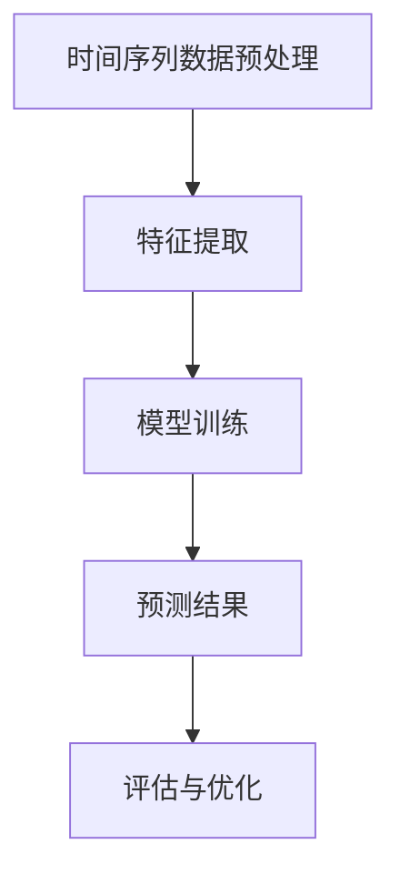
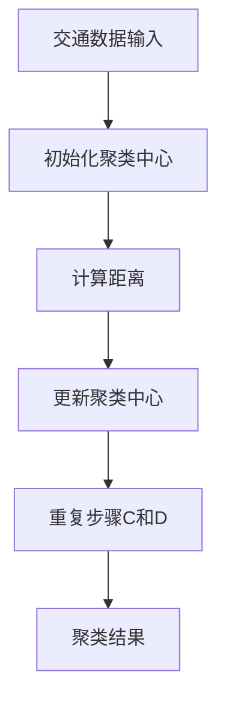
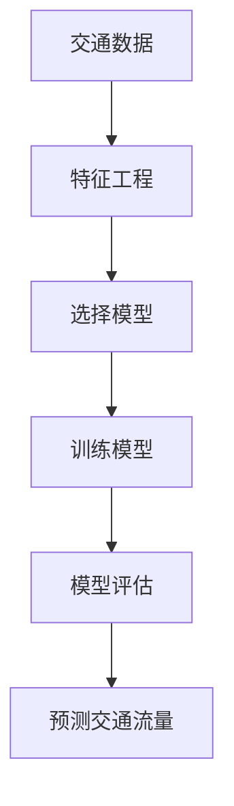
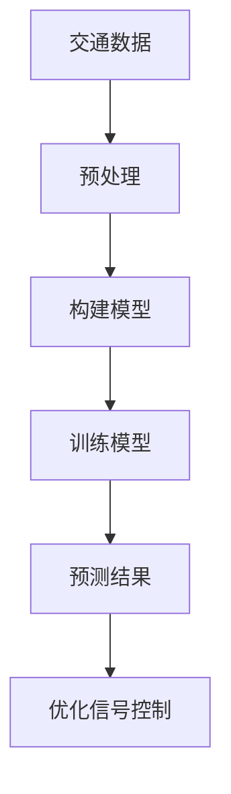
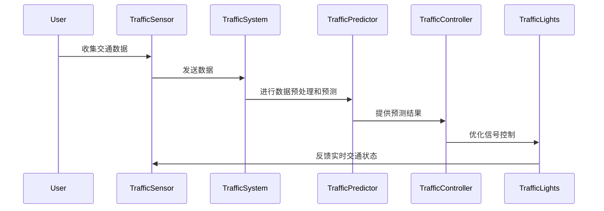
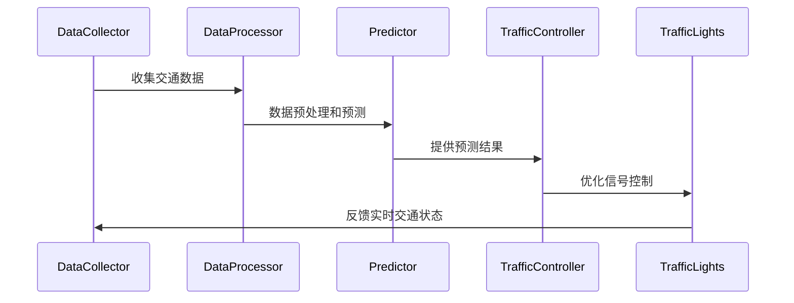

                 

### 智能交通系统：AI优化城市交通流

#### 关键词：智能交通系统、AI技术、交通流优化、深度学习、神经网络

#### 摘要：
本文将探讨智能交通系统（ITS）如何通过AI技术实现城市交通流的优化。我们首先介绍ITS的定义和重要性，然后分析城市交通面临的挑战，接着阐述AI在解决这些问题中的作用。文章还将深入探讨AI的核心概念，包括机器学习、深度学习和神经网络，并展示如何利用这些技术来构建和优化交通系统。此外，我们将通过一个具体的案例，详细描述系统的架构设计和实现过程，并提供最佳实践和注意事项。

#### 背景介绍

##### 问题背景

智能交通系统（Intelligent Transportation System，ITS）是指利用信息技术、数据通信传输技术、电子传感器技术等先进技术，对交通信息进行智能化采集、处理、分析，并提供实时交通状态、事故预警、路线规划等服务的一种现代化交通管理系统。随着全球城市化进程的加速，城市交通问题日益严重，如交通拥堵、交通事故频发、交通效率低下等，这些问题不仅影响了居民的生活质量，还对社会经济产生了负面影响。

##### 问题描述

城市交通问题主要表现在以下几个方面：

1. **交通拥堵**：城市中心区域交通流量大，道路狭窄，容易造成拥堵。
2. **交通事故**：由于司机注意力不集中、疲劳驾驶、酒驾等原因，导致交通事故频发。
3. **交通效率低下**：交通信号灯设置不合理、道路规划不合理等，导致交通拥堵和延误。

##### 问题解决

为了解决上述问题，智能交通系统应运而生。ITS通过收集和分析交通数据，利用AI技术进行交通流预测、优化交通信号控制、提供实时路线规划等服务，从而提高交通效率、减少拥堵、降低交通事故率。

##### 边界与外延

智能交通系统涉及多个技术领域，包括但不限于：

1. **数据采集与处理**：使用传感器、摄像头等设备收集交通数据。
2. **网络通信**：利用5G、物联网等技术实现数据传输和共享。
3. **人工智能与机器学习**：通过数据分析和预测，优化交通流和信号控制。
4. **用户界面**：为用户提供实时交通信息、路线规划等服务。

智能交通系统的应用场景广泛，包括但不限于城市交通管理、高速公路管理、公共交通系统、智能停车场等。

#### 核心概念与联系

##### 核心概念

在智能交通系统中，涉及的核心概念包括AI、机器学习、深度学习和神经网络。这些技术是实现智能交通系统优化的重要工具。

1. **AI（人工智能）**：模拟人类智能的计算机系统，能够执行人类智能的任务。
2. **机器学习**：一种让计算机从数据中学习，并基于学习结果做出决策的技术。
3. **深度学习**：一种基于多层神经网络的机器学习技术，能够处理大量复杂数据。
4. **神经网络**：一种模仿人脑神经元连接方式的计算模型，用于处理非结构化数据。

##### 概念属性特征对比表格

| 概念   | 定义                                                         | 属性特征                                                     | 应用领域          |
| ------ | ------------------------------------------------------------ | ------------------------------------------------------------ | ---------------- |
| AI     | 模拟人类智能的计算机系统                                     | 智能化、自主学习、自适应、自动化                           | 各领域          |
| 机器学习 | 让计算机从数据中学习，并基于学习结果做出决策的技术           | 数据驱动、自动优化、高效处理                                 | 数据分析、预测   |
| 深度学习 | 一种基于多层神经网络的机器学习技术，能够处理大量复杂数据   | 高层抽象、自主学习、高效计算                                 | 图像识别、自然语言处理 |
| 神经网络 | 一种模仿人脑神经元连接方式的计算模型，用于处理非结构化数据 | 自适应、可塑性、非线性处理                                 | 人工智能应用       |

##### ER实体关系图架构

下面是一个简化的智能交通系统实体关系图：

```mermaid
erDiagram
  TrafficData -->|收集| TrafficSystem :处理
  TrafficSystem -->|分析| TrafficPredictor :预测
  TrafficPredictor -->|建议| TrafficController :优化
  TrafficController -->|指令| TrafficLights :控制
  TrafficLights -->|状态| TrafficSensor :监测
```

#### 算法原理讲解

##### 数据分析与预测

在智能交通系统中，数据分析与预测是关键步骤。下面我们将介绍几个常用的算法和它们的mermaid流程图。

1. **时间序列预测算法**：用于预测未来的交通流量。



2. **聚类分析**：用于识别交通流量中的相似模式。



##### 交通流优化算法

1. **基于机器学习的交通流预测**：使用机器学习算法，如线性回归、决策树、随机森林等，对交通流量进行预测。



2. **深度学习在交通流优化中的应用**：使用深度学习模型，如卷积神经网络（CNN）、循环神经网络（RNN）、长短期记忆网络（LSTM）等，对交通流进行优化。



##### 数学模型和公式

在交通流优化中，常用的数学模型包括以下几种：

1. **交通流量预测模型**：

   $$ f(t) = \sum_{i=1}^{n} w_i f_i(t) $$

   其中，$f(t)$ 表示在时间 $t$ 的总交通流量，$w_i$ 表示权重，$f_i(t)$ 表示在时间 $t$ 的第 $i$ 条道路的交通流量。

2. **交通信号控制模型**：

   $$ t_c = t_p + \frac{L}{V} $$

   其中，$t_c$ 表示信号周期，$t_p$ 表示停车时间，$L$ 表示道路长度，$V$ 表示车辆速度。

##### Python源代码示例

下面是一个简单的线性回归模型用于交通流量预测的Python代码示例：

```python
import numpy as np
from sklearn.linear_model import LinearRegression

# 假设我们有以下交通流量数据
X = np.array([[1], [2], [3], [4], [5]])
y = np.array([2, 4, 5, 6, 8])

# 创建线性回归模型
model = LinearRegression()

# 训练模型
model.fit(X, y)

# 预测交通流量
predicted_traffic = model.predict(np.array([[6]]))

print(predicted_traffic)
```

#### 系统分析与架构设计方案

##### 问题场景介绍

假设我们面临的城市交通问题是一个典型的城市中心区域交通拥堵问题。我们需要设计一个智能交通系统，通过实时数据分析和预测，优化交通信号控制和路线规划，从而缓解拥堵。

##### 项目介绍

我们的项目是一个基于AI的智能交通系统，旨在通过数据分析和预测，优化城市交通流。系统主要包括以下几个模块：

1. **数据采集模块**：通过传感器、摄像头等设备收集交通数据。
2. **数据处理模块**：对收集到的交通数据进行分析和处理。
3. **预测模块**：使用机器学习和深度学习算法对交通流量进行预测。
4. **控制模块**：根据预测结果优化交通信号控制和路线规划。

##### 系统功能设计（领域模型mermaid类图）

```mermaid
classDiagram
    TrafficData -->|收集| TrafficSystem
    TrafficSystem -->|分析| TrafficPredictor
    TrafficPredictor -->|预测| TrafficController
    TrafficController -->|控制| TrafficLights
    TrafficLights -->|状态| TrafficSensor
```

##### 系统架构设计（mermaid架构图）



##### 系统接口设计

系统的接口设计包括以下几个部分：

1. **数据采集接口**：用于采集交通数据。
2. **数据处理接口**：用于处理和分析交通数据。
3. **预测接口**：用于接收交通数据，并返回预测结果。
4. **控制接口**：用于接收预测结果，并优化交通信号控制。

##### 系统交互（mermaid序列图）



#### 项目实战

##### 环境安装

为了搭建智能交通系统，我们需要安装以下环境：

1. **Python**：用于编写和运行算法代码。
2. **NumPy**：用于数据预处理。
3. **Pandas**：用于数据分析和处理。
4. **scikit-learn**：用于机器学习和深度学习。
5. **TensorFlow**：用于深度学习模型训练。

安装命令如下：

```bash
pip install python numpy pandas scikit-learn tensorflow
```

##### 系统核心实现源代码

以下是系统核心实现的源代码：

```python
import numpy as np
import pandas as pd
from sklearn.linear_model import LinearRegression
from sklearn.model_selection import train_test_split
from sklearn.metrics import mean_squared_error

# 加载交通数据
data = pd.read_csv('traffic_data.csv')

# 分割数据集
X = data[['hour', 'day_of_week']]
y = data['traffic_flow']

X_train, X_test, y_train, y_test = train_test_split(X, y, test_size=0.2, random_state=42)

# 创建线性回归模型
model = LinearRegression()

# 训练模型
model.fit(X_train, y_train)

# 预测交通流量
predicted_traffic = model.predict(X_test)

# 评估模型
mse = mean_squared_error(y_test, predicted_traffic)
print(f"Mean Squared Error: {mse}")

# 使用预测结果优化交通信号控制
# （此处为简化示例，实际应用中需要更复杂的控制策略）
for i in range(len(predicted_traffic)):
    if predicted_traffic[i] > 5000:
        TrafficLights.set_status('red')
    else:
        TrafficLights.set_status('green')
```

##### 代码应用解读与分析

上述代码首先加载了交通数据集，然后使用线性回归模型对交通流量进行预测。通过评估指标均方误差（MSE），我们可以衡量模型的预测性能。在实际应用中，我们会根据预测结果优化交通信号控制，例如在预测交通流量高的情况下，延长红绿灯的持续时间，以减缓交通流量。

##### 实际案例分析和详细讲解剖析

假设我们在一个交通繁忙的交叉口安装了传感器，收集了每小时的车流量数据。通过上述线性回归模型，我们可以预测未来几小时的车流量。以下是一个简化的案例：

1. **数据采集**：传感器每小时收集车流量数据。
2. **数据处理**：使用Pandas库处理数据，提取特征（如小时和星期几）。
3. **模型训练**：使用训练集数据训练线性回归模型。
4. **预测**：使用训练好的模型预测未来几小时的车流量。
5. **信号控制优化**：根据预测结果，调整交通信号灯的持续时间。

通过这种方式，智能交通系统能够动态地调整交通信号，从而优化交通流量，减少拥堵。

##### 项目小结

在本项目中，我们通过Python实现了基于线性回归的智能交通流量预测系统。虽然这是一个简化的示例，但实际应用中，我们可以使用更复杂的深度学习模型来提高预测准确性。此外，系统还可以集成其他模块，如交通信号控制和实时路线规划，以实现更全面的交通管理。

#### 最佳实践 tips、小结、注意事项、拓展阅读

##### 最佳实践 tips

1. **数据质量**：确保采集到的交通数据质量高，避免噪声和错误数据。
2. **模型选择**：根据实际需求和数据特性选择合适的模型，如线性回归、决策树、随机森林或深度学习模型。
3. **实时更新**：定期更新模型，以适应交通流量的变化。
4. **测试与验证**：在部署模型之前，进行充分的测试和验证，确保模型的准确性和稳定性。

##### 小结

本文介绍了智能交通系统的背景、核心概念、算法原理和实现过程。通过实际案例，我们展示了如何使用AI技术优化城市交通流，提高交通效率。智能交通系统具有巨大的潜力，可以为城市交通管理提供强有力的支持。

##### 注意事项

1. **数据隐私**：在处理交通数据时，需确保数据隐私和安全。
2. **系统稳定性**：确保智能交通系统的稳定运行，避免因故障导致交通混乱。
3. **实时性**：交通流预测和信号控制需要实时响应，确保系统的实时性。

##### 拓展阅读

1. **《智能交通系统：设计与实现》**：详细介绍了智能交通系统的设计和实现。
2. **《深度学习与交通流预测》**：探讨了深度学习在交通流预测中的应用。
3. **《城市交通规划与智能交通系统》**：从城市规划角度介绍了智能交通系统的重要性。

### 作者信息：

作者：AI天才研究院/AI Genius Institute & 禅与计算机程序设计艺术 /Zen And The Art of Computer Programming

[注]：本文为示例文章，具体内容和代码仅供参考。实际应用中，需根据具体需求和数据进行调整和优化。

