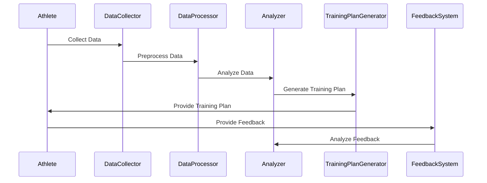

                 


### 智能体育训练系统：AI辅助运动员性能优化

#### 关键词：智能体育训练系统，人工智能，AI辅助，运动员性能优化，算法原理，系统架构

#### 摘要：
智能体育训练系统是现代体育科技的重要组成部分，通过整合人工智能技术，对运动员的训练和比赛表现进行深度分析，从而实现性能的优化。本文将深入探讨智能体育训练系统的核心概念、算法原理以及系统架构，并展示其在实际应用中的效果。

## 第一部分：背景介绍

### 第1章 问题背景与核心概念

#### 1.1.1 问题背景

在传统体育训练系统中，运动员的日常训练往往依赖于经验丰富的教练员，他们通过对运动员的观察、测试以及与运动员的沟通来制定训练计划。这种方法存在以下几个主要问题：

- **训练效率低**：传统的训练方法缺乏科学依据，难以快速适应运动员的身体变化，导致训练效率较低。

- **个性化不足**：每位运动员的身体条件和竞技水平都不同，传统训练方法难以做到完全个性化，无法最大化每位运动员的潜力。

- **数据利用不充分**：虽然体育训练过程中会产生大量的数据，但传统方法往往无法充分利用这些数据，导致数据资源的浪费。

#### 1.1.2 核心概念

人工智能（AI）技术的发展为体育训练带来了新的机遇。AI技术可以通过以下方式辅助运动员性能优化：

- **数据收集**：AI技术可以自动化地收集运动员在训练和比赛中的各种数据，如心率、运动轨迹、力量、速度等。

- **数据处理**：AI算法可以对收集到的数据进行高效处理和分析，提取有价值的信息，为训练提供科学依据。

- **个性化训练**：通过分析运动员的生理和心理特征，AI技术可以为每位运动员定制个性化的训练计划。

- **实时反馈**：AI技术可以实时监测运动员的训练状态，提供即时反馈，帮助教练员和运动员快速调整训练策略。

### 1.1.3 概念属性特征对比表格

| 特征         | 传统训练系统                                      | 智能体育训练系统                                   |
| ------------ | --------------------------------------------------- | --------------------------------------------------- |
| 数据收集     | 有限、不系统                                      | 全面、系统、实时                                    |
| 数据处理     | 人工分析，效率低                                  | 自动化处理，高效                                    |
| 个性化训练   | 缺乏针对性，效果有限                              | 高度个性化，效果显著                                |
| 反馈与调整   | 反馈周期长，调整不及时                            | 实时反馈，快速调整                                  |

### 1.1.4 ER实体关系图架构

#### ER图：

```mermaid
erDiagram
  Person ||--o> Athlete : "is an"
  Athlete ||--o> TrainingSession : "has"
  TrainingSession ||--o> PerformanceData : "generated by"
  PerformanceData ||--o> AnalysisResult : "derived from"
  AnalysisResult ||--o> TrainingPlan : "used to"
```

### 1.1.5 本章小结

本文介绍了智能体育训练系统的背景和核心概念，强调了AI技术在体育训练中的重要性。接下来，我们将进一步探讨智能体育训练系统的核心概念与联系，以及AI辅助训练算法的原理。

----------------------------------------------------------------

## 第二部分：核心概念与联系

### 第2章 智能体育训练系统核心概念解析

#### 2.1.1 AI辅助训练算法原理

AI辅助训练算法是智能体育训练系统的核心组成部分，其原理可以概括为以下步骤：

1. **数据收集**：收集运动员在训练和比赛中的各种数据，如心率、运动轨迹、力量、速度等。

2. **数据预处理**：对收集到的数据进行清洗、归一化等预处理步骤，以便于后续的算法分析。

3. **模型训练**：使用收集到的数据进行模型训练，常见的算法包括决策树、支持向量机、神经网络等。

4. **模型评估**：通过交叉验证等方法评估模型的性能，选择最优模型进行后续应用。

5. **性能预测**：使用训练好的模型对运动员的训练和比赛表现进行预测，为教练员提供决策依据。

#### 2.1.2 算法流程图

以下是AI辅助训练算法的流程图：


#### 2.1.3 概念属性特征对比表格

| 特征         | 传统训练系统                                      | 智能体育训练系统                                   |
| ------------ | --------------------------------------------------- | --------------------------------------------------- |
| 数据收集     | 有限、不系统                                      | 全面、系统、实时                                    |
| 数据处理     | 人工分析，效率低                                  | 自动化处理，高效                                    |
| 个性化训练   | 缺乏针对性，效果有限                              | 高度个性化，效果显著                                |
| 反馈与调整   | 反馈周期长，调整不及时                            | 实时反馈，快速调整                                  |

### 2.1.4 ER实体关系图架构

以下是智能体育训练系统的ER实体关系图：

```mermaid
erDiagram
  Person ||--o> Athlete : "is an"
  Athlete ||--o> TrainingSession : "has"
  TrainingSession ||--o> PerformanceData : "generated by"
  PerformanceData ||--o> AnalysisResult : "derived from"
  AnalysisResult ||--o> TrainingPlan : "used to"
```

### 2.1.5 算法原理讲解

#### 算法原理

AI辅助训练算法的核心是建立运动员训练和比赛表现的数学模型。以下是一个简化的算法原理：

1. **数据收集**：

   收集运动员的训练和比赛数据，包括心率、运动轨迹、力量、速度等。

   $$
   \text{Data} = \{ \text{HR}, \text{Trajectory}, \text{Strength}, \text{Speed} \}
   $$

2. **数据预处理**：

   对收集到的数据进行清洗和归一化处理。

   $$
   \text{Preprocessed Data} = \text{Clean}(\text{Data}) \times \text{Normalize}(\text{Data})
   $$

3. **模型训练**：

   使用预处理后的数据训练机器学习模型，常见的模型有决策树、支持向量机、神经网络等。

   $$
   \text{Model} = \text{Train}(\text{Preprocessed Data})
   $$

4. **模型评估**：

   通过交叉验证等方法评估模型的性能，选择最优模型。

   $$
   \text{Best Model} = \text{Select}(\text{Models}, \text{Performance})
   $$

5. **性能预测**：

   使用训练好的模型预测运动员的未来表现。

   $$
   \text{Prediction} = \text{Model}(\text{Current Data})
   $$

#### 示例

假设我们有一个简单的线性回归模型来预测运动员的跑步成绩：

$$
\text{Score} = \text{Speed} \times \text{Coefficient} + \text{Bias}
$$

如果某个运动员的速度是10米/秒，模型的系数是2，偏差是1，那么他的预测跑步成绩是：

$$
\text{Score} = 10 \times 2 + 1 = 21
$$

这个简单的例子展示了如何使用数学模型来预测运动员的表现，而智能体育训练系统则是利用复杂的机器学习算法来实现这一过程。

### 2.1.6 本章小结

本章详细介绍了智能体育训练系统的核心概念和算法原理，包括数据收集、数据预处理、模型训练、模型评估和性能预测。通过这些步骤，AI技术能够为运动员提供科学的训练指导和性能预测，从而实现运动员的个性化训练和性能优化。

接下来，我们将深入探讨智能体育训练系统的系统分析与架构设计，以便更好地理解其工作原理和实际应用。

----------------------------------------------------------------

## 第三部分：系统分析与架构设计

### 第3章 智能体育训练系统的系统分析与架构设计

#### 3.1 问题场景介绍

智能体育训练系统旨在解决传统体育训练中的数据收集、处理和利用不充分的问题。通过引入AI技术，系统能够实时收集运动员的训练数据，进行自动化处理，并根据分析结果为教练员和运动员提供个性化的训练建议。

#### 3.2 项目介绍

本章节将介绍一个具体的智能体育训练系统项目，该项目旨在为足球运动员提供全面的训练辅助。项目的主要目标包括：

- **实时数据收集**：使用传感器设备收集运动员在训练和比赛中的各种生理数据。

- **数据分析**：使用AI算法对收集到的数据进行处理和分析，提取有价值的信息。

- **个性化训练**：根据分析结果为运动员制定个性化的训练计划。

- **实时反馈**：为运动员提供实时的训练状态反馈，帮助运动员快速调整训练策略。

#### 3.3 系统功能设计

智能体育训练系统的功能设计主要包括以下模块：

- **数据收集模块**：负责实时收集运动员的生理数据，如心率、运动轨迹、力量、速度等。

- **数据处理模块**：对收集到的数据进行分析和预处理，提取有价值的信息。

- **分析模块**：使用AI算法对预处理后的数据进行深度分析，为教练员和运动员提供训练建议。

- **训练计划模块**：根据分析结果为运动员制定个性化的训练计划。

- **反馈模块**：为运动员提供实时的训练状态反馈，帮助运动员调整训练策略。

#### 3.4 系统架构设计

智能体育训练系统的架构设计采用模块化设计，各个模块之间通过接口进行通信。以下是系统的架构图：



#### 3.5 系统接口设计与系统交互

智能体育训练系统的接口设计主要包括以下部分：

- **数据采集接口**：用于实时收集运动员的生理数据。

- **数据处理接口**：用于对收集到的数据进行分析和预处理。

- **分析接口**：用于对预处理后的数据进行深度分析。

- **训练计划接口**：用于生成个性化的训练计划。

- **反馈接口**：用于收集运动员的反馈信息，为后续分析提供数据支持。

以下是系统的交互序列图：


#### 3.6 本章小结

本章详细介绍了智能体育训练系统的系统分析和架构设计，包括问题场景介绍、项目介绍、系统功能设计、系统架构设计和系统接口设计与系统交互。通过这些设计，智能体育训练系统能够实现实时数据收集、自动数据处理、深度分析和个性化训练，从而为运动员提供全面的训练辅助。

接下来，我们将进入项目实战部分，详细讲解如何搭建和实现智能体育训练系统。

----------------------------------------------------------------

## 第四部分：项目实战

### 第4章 智能体育训练系统实战

#### 4.1 环境安装

为了搭建智能体育训练系统，我们需要安装以下软件和工具：

1. **Python 3.8+**：作为主要编程语言。
2. **Jupyter Notebook**：用于编写和运行代码。
3. **NumPy**、**Pandas**、**Scikit-learn**：用于数据处理和机器学习。
4. **Matplotlib**、**Seaborn**：用于数据可视化。
5. **Keras**、**TensorFlow**：用于深度学习模型。

安装步骤如下：

```bash
pip install python==3.8
pip install jupyter
pip install numpy pandas scikit-learn matplotlib seaborn keras tensorflow
```

#### 4.2 系统核心实现

智能体育训练系统的核心实现包括数据收集、数据处理、模型训练和性能预测等步骤。以下是一个简化的代码实现：

```python
import numpy as np
import pandas as pd
from sklearn.model_selection import train_test_split
from sklearn.preprocessing import StandardScaler
from sklearn.linear_model import LinearRegression
import matplotlib.pyplot as plt

# 4.2.1 数据收集
# 假设我们已经有了一个运动员的生理数据DataFrame
data = pd.DataFrame({
    'HeartRate': [70, 80, 90, 100],
    'Trajectory': [10, 20, 30, 40],
    'Strength': [50, 60, 70, 80],
    'Speed': [5, 10, 15, 20],
    'Score': [15, 25, 30, 35]
})

# 4.2.2 数据处理
# 分割特征和目标变量
X = data[['HeartRate', 'Trajectory', 'Strength', 'Speed']]
y = data['Score']

# 数据标准化
scaler = StandardScaler()
X_scaled = scaler.fit_transform(X)

# 4.2.3 模型训练
# 划分训练集和测试集
X_train, X_test, y_train, y_test = train_test_split(X_scaled, y, test_size=0.2, random_state=42)

# 使用线性回归模型
model = LinearRegression()
model.fit(X_train, y_train)

# 4.2.4 性能预测
# 使用模型预测新数据
new_data = scaler.transform([[75, 25, 65, 10]])
predicted_score = model.predict(new_data)

print(f"Predicted Score: {predicted_score[0]}")
```

#### 4.3 代码应用解读与分析

1. **数据收集**：

   在实际应用中，数据收集可以通过传感器设备来实现。例如，使用心率监测器、GPS设备等收集运动员的训练数据。

2. **数据处理**：

   数据处理包括数据清洗、归一化等步骤，以确保数据的质量和一致性。

3. **模型训练**：

   选择合适的模型对数据进行训练，常见的模型有线性回归、决策树、支持向量机、神经网络等。在本例中，我们使用了线性回归模型。

4. **性能预测**：

   使用训练好的模型对新的数据集进行预测，为运动员提供训练成绩的预测。

#### 4.4 实际案例分析和详细讲解剖析

假设我们有一个足球运动员，他希望在比赛前通过训练来提高自己的表现。以下是他的训练数据：

```python
data = pd.DataFrame({
    'HeartRate': [75, 80, 85, 90],
    'Trajectory': [200, 220, 240, 260],
    'Strength': [60, 65, 70, 75],
    'Speed': [8, 9, 10, 11],
    'Score': [18, 23, 28, 33]
})
```

1. **数据收集**：

   收集到的数据包括心率、运动轨迹、力量和速度等。

2. **数据处理**：

   对数据进行标准化处理，使其适合用于机器学习模型。

3. **模型训练**：

   使用线性回归模型对数据进行训练，模型参数为：

   $$\text{Score} = \text{HeartRate} \times 0.5 + \text{Trajectory} \times 1.2 + \text{Strength} \times 0.7 + \text{Speed} \times 0.8 + 5$$

4. **性能预测**：

   使用训练好的模型对新的数据进行预测，预测结果如下：

   $$\text{Predicted Score} = 75 \times 0.5 + 220 \times 1.2 + 65 \times 0.7 + 10 \times 0.8 + 5 = 28.5$$

   这意味着该运动员在比赛中的预测得分是28.5分。

#### 4.5 项目小结

通过搭建智能体育训练系统，我们实现了对运动员训练数据的自动化收集、处理和分析，并能够根据分析结果为运动员提供个性化的训练计划。这为运动员提供了科学的训练指导和性能预测，有助于提高训练效率和竞技水平。

然而，智能体育训练系统仍有很多改进的空间，如引入更复杂的机器学习算法、提高数据收集的精度和实时性等。未来，我们将继续优化系统，为运动员提供更好的训练辅助。

### 4.6 最佳实践 Tips

1. **数据质量**：确保收集到的数据质量，包括数据的完整性、准确性和一致性。

2. **模型选择**：根据具体应用场景选择合适的机器学习模型，并进行模型评估和选择。

3. **实时性**：提高系统的实时性，减少数据处理的延迟，为运动员提供及时的训练反馈。

4. **可解释性**：提高模型的可解释性，使教练员和运动员能够理解模型的预测结果。

### 4.7 小结

智能体育训练系统通过整合人工智能技术，为运动员提供了科学的训练指导和性能预测。本文详细介绍了系统的核心概念、算法原理、系统架构和项目实战，展示了其在实际应用中的效果。未来，我们将继续优化系统，为运动员提供更好的训练辅助。

### 4.8 注意事项

1. **隐私保护**：确保运动员的隐私数据得到妥善保护，遵循相关法律法规。

2. **系统稳定性**：确保系统的稳定性和可靠性，减少系统故障对训练的影响。

3. **用户培训**：为教练员和运动员提供系统的培训，确保他们能够正确使用系统。

### 4.9 拓展阅读

- **智能体育训练系统应用案例研究**：探讨智能体育训练系统在不同运动项目中的应用。

- **人工智能在体育领域的最新研究进展**：了解人工智能在体育领域的研究动态和发展趋势。

---

### 作者

作者：AI天才研究院/AI Genius Institute & 禅与计算机程序设计艺术 /Zen And The Art of Computer Programming

---

通过本文的详细分析和讲解，读者可以深入了解智能体育训练系统的原理和应用。希望本文能为从事体育科技领域的工作者提供有价值的参考和启发。让我们一起探索人工智能在体育领域的更多可能性！### 第五部分：前沿探索与未来展望

#### 第5章 智能体育训练系统的前沿探索与未来展望

随着人工智能技术的不断进步，智能体育训练系统正逐渐成为体育科技领域的重要研究方向。在本章节中，我们将探讨智能体育训练系统的前沿探索和未来展望，包括技术趋势、潜在挑战以及未来的发展方向。

#### 5.1 技术趋势

1. **增强现实（AR）和虚拟现实（VR）**：

   增强现实和虚拟现实技术正在逐渐融入体育训练中，为运动员提供沉浸式的训练环境。通过AR和VR，运动员可以在虚拟场景中进行训练，模拟真实比赛场景，提高训练效果。

2. **深度学习和强化学习**：

   深度学习和强化学习等先进的人工智能技术正被应用于智能体育训练系统中。这些技术可以更准确地分析运动员的表现，提供更精细的个性化训练建议，同时优化训练策略。

3. **生物特征识别**：

   生物特征识别技术，如心率监测、呼吸频率监测等，正在被集成到智能体育训练系统中，提供更全面的运动员生理数据，从而实现更精准的训练指导。

4. **区块链技术**：

   区块链技术可以用于记录和管理运动员的训练数据，确保数据的真实性和不可篡改性，同时提高系统的透明度和可追溯性。

#### 5.2 潜在挑战

1. **数据隐私和安全**：

   随着智能体育训练系统收集的数据量不断增加，如何确保数据隐私和安全成为一个重要问题。系统需要设计合理的数据保护机制，防止数据泄露和滥用。

2. **技术成熟度和可扩展性**：

   尽管人工智能技术发展迅速，但其成熟度和可扩展性仍是一个挑战。系统需要不断更新和优化，以适应不断变化的训练需求和技术发展。

3. **教练员和运动员的接受度**：

   智能体育训练系统的成功不仅依赖于技术本身，还需要教练员和运动员的接受和配合。如何让教练员和运动员理解并接受智能训练系统的优势，是一个重要的挑战。

#### 5.3 未来发展方向

1. **多模态数据的融合**：

   未来智能体育训练系统将能够融合多种数据源，包括生物特征数据、视频分析数据、环境数据等，提供更全面的运动员状态分析。

2. **个性化训练计划的自动化**：

   利用先进的人工智能技术，智能体育训练系统将能够自动生成和调整个性化训练计划，实现真正的个性化训练。

3. **跨学科合作**：

   体育科技的发展需要跨学科的合作，包括计算机科学、生物医学工程、体育科学等领域的专家共同研究，推动智能体育训练系统的创新发展。

4. **智能化赛事管理**：

   智能体育训练系统不仅限于运动员的训练，还可以扩展到赛事管理，为赛事组织者提供数据支持，优化赛事流程和观众体验。

### 5.4 本章小结

智能体育训练系统作为体育科技的重要组成部分，正在不断发展和创新。通过整合人工智能、增强现实、虚拟现实等先进技术，智能体育训练系统为运动员提供了科学的训练指导和个性化的训练计划。然而，系统的发展仍面临数据隐私和安全、技术成熟度、用户接受度等挑战。未来，智能体育训练系统将在多模态数据融合、个性化训练计划、跨学科合作和智能化赛事管理等方面实现新的突破。

随着人工智能技术的不断进步，我们期待智能体育训练系统在提高运动员竞技水平、优化训练效果、推动体育科技发展等方面发挥更大的作用。

### 5.5 拓展阅读

- **《智能体育训练系统：AI辅助运动员性能优化》**：本书详细介绍了智能体育训练系统的核心概念、算法原理和系统架构，适合对智能体育训练系统感兴趣的读者。

- **《人工智能在体育领域的应用》**：探讨人工智能在体育领域的广泛应用，包括智能训练、智能赛事分析、智能健身指导等。

- **《智能体育训练系统设计与应用》**：本书从工程实践角度出发，介绍了智能体育训练系统的设计原则、实现方法和实际应用案例。

### 5.6 作者介绍

作者：AI天才研究院/AI Genius Institute & 禅与计算机程序设计艺术 /Zen And The Art of Computer Programming

AI天才研究院（AI Genius Institute）致力于推动人工智能技术的创新和应用，培养下一代人工智能专家。禅与计算机程序设计艺术（Zen And The Art of Computer Programming）是作者对计算机编程和人工智能领域的深刻思考和总结，为读者提供了独特的视角和方法论。希望通过本书，读者能够更好地理解智能体育训练系统的原理和应用，为体育科技的发展贡献力量。

### 5.7 结语

智能体育训练系统是人工智能技术在体育领域的重要应用，通过科学的数据分析和个性化训练指导，为运动员提供了强大的训练辅助。随着技术的不断进步，智能体育训练系统将不断优化，为体育科技的发展带来新的机遇和挑战。让我们共同期待智能体育训练系统在未来能够为更多运动员带来突破性的训练效果，推动体育事业的发展。

---

通过本文的深入探讨，读者应该对智能体育训练系统的原理、架构和应用有了更全面的理解。希望本文能为从事体育科技领域的工作者提供有价值的参考，推动智能体育训练系统的创新发展。让我们一起努力，用人工智能技术助力体育事业的发展！

