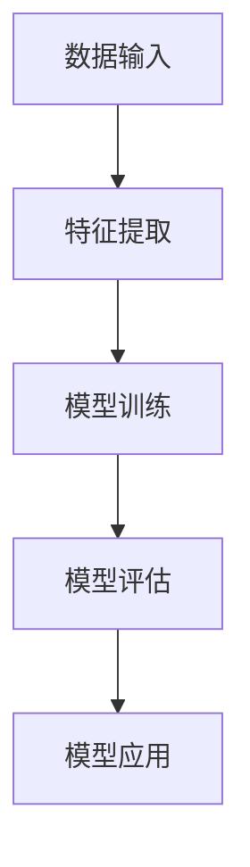
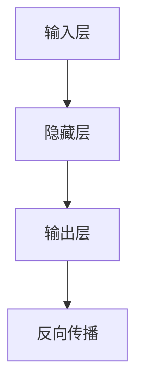
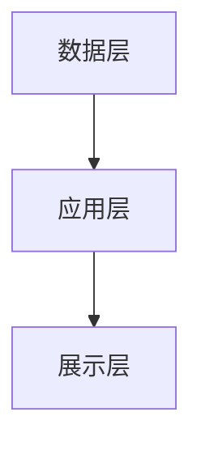
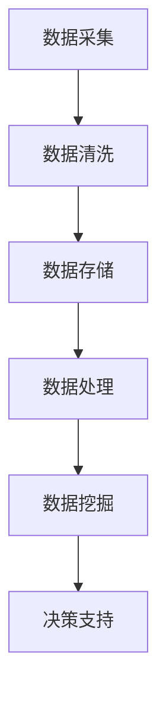
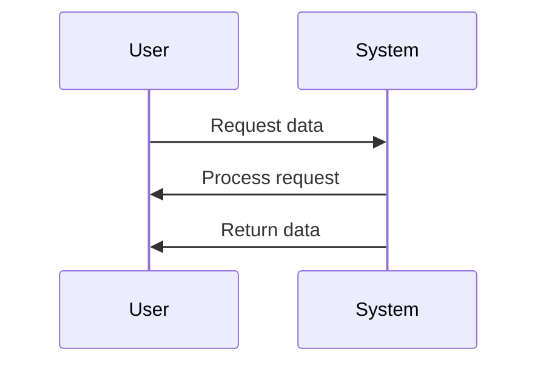

                 


### 智能供应链优化:AI大模型提升物流效率

> 关键词：智能供应链、AI大模型、物流效率、优化策略

> 摘要：本文深入探讨了智能供应链优化的概念、背景、核心技术和最佳实践。通过分析人工智能在供应链优化中的应用，特别是AI大模型的作用，探讨了如何通过大数据、机器学习和深度学习等技术提升物流效率，实现供应链的智能化管理。本文旨在为从事供应链管理和物流领域的专业人士提供实用的指导和建议。

----------------------------------------------------------------

### 目录大纲

----------------------------------------------------------------

## 第一部分: 智能供应链优化概述

### 第1章: 供应链优化的背景和挑战

### 第2章: 智能供应链的核心技术

### 第3章: 数据驱动的供应链优化

### 第4章: 机器学习与供应链优化

### 第5章: 深度学习在供应链优化中的应用

### 第6章: 大数据技术在供应链优化中的应用

### 第7章: 智能供应链系统的设计与实现

### 第8章: 智能供应链优化的最佳实践

### 参考文献

----------------------------------------------------------------

## 第一部分: 智能供应链优化概述

### 第1章: 供应链优化的背景和挑战

#### 1.1 供应链优化的重要性

在全球化经济背景下，供应链优化已成为企业提高竞争力、降低成本、提升客户满意度的重要手段。供应链优化不仅仅关注物流的效率和成本，还涉及生产、采购、库存、销售等各个环节的协同运作。

#### 1.2 传统供应链面临的挑战

随着市场需求的多样化和复杂性增加，传统供应链面临着诸多挑战，如信息不对称、库存积压、响应速度慢等。这些问题严重影响了供应链的效率和灵活性。

#### 1.3 人工智能在供应链优化中的应用前景

人工智能技术的快速发展为供应链优化带来了新的机遇。AI大模型能够在海量数据中挖掘有价值的信息，提高预测准确性，优化决策过程。

#### 1.4 本章小结

本章节概述了供应链优化的背景、挑战以及人工智能在其中的应用前景，为后续章节的深入探讨奠定了基础。

----------------------------------------------------------------

## 第二部分: 智能供应链的核心技术

### 第2章: 数据驱动的供应链优化

#### 2.1 数据收集与处理

数据是供应链优化的基石。通过传感器、物联网设备等手段收集供应链各环节的数据，如库存水平、运输状态、订单信息等，是进行优化的第一步。


#### 2.2 数据分析工具与技术

数据分析工具如Hadoop、Spark等可以处理海量数据，提取有价值的信息。机器学习算法则可以帮助预测需求、优化库存等。

#### 2.3 数据可视化

数据可视化是将数据转化为图表、地图等形式，使其更容易理解。这有助于决策者快速识别问题、制定策略。

#### 2.4 数据驱动的供应链决策

基于数据的分析结果，供应链管理者可以做出更加精准的决策，如调整库存水平、优化运输路径等。

#### 2.5 本章小结

本章节介绍了数据驱动的供应链优化的关键环节，强调了数据在供应链优化中的重要性。

----------------------------------------------------------------

### 第3章: 机器学习与供应链优化

#### 3.1 机器学习的基本概念

机器学习是通过数据和算法来模拟人类学习过程，从数据中自动学习和发现模式。在供应链优化中，机器学习可以帮助预测需求、优化库存等。



#### 3.2 机器学习在供应链中的应用

机器学习在供应链中的应用非常广泛，如预测需求、优化库存、优化运输路径等。通过案例分析，可以更直观地了解其应用效果。

#### 3.3 供应链优化的常见机器学习算法

常见的机器学习算法如线性回归、决策树、支持向量机等在供应链优化中都有广泛应用。不同算法适用于不同的问题场景。

#### 3.4 实例分析：基于机器学习的库存管理优化

通过一个实际案例，展示如何使用机器学习优化库存管理，提高库存周转率，降低库存成本。

#### 3.5 本章小结

本章节介绍了机器学习在供应链优化中的应用，以及如何通过机器学习算法实现供应链的优化。

----------------------------------------------------------------

### 第4章: 深度学习在供应链优化中的应用

#### 4.1 深度学习的基本原理

深度学习是机器学习的一个分支，通过多层神经网络模拟人脑学习过程，能够处理复杂的数据和模式。



#### 4.2 深度学习在供应链优化中的应用场景

深度学习在供应链优化中的应用场景包括需求预测、路径优化、库存管理等。

#### 4.3 深度学习模型在供应链优化中的实现

介绍了如何使用深度学习模型进行供应链优化，包括模型设计、训练和优化。

#### 4.4 实例分析：深度学习在运输路径优化中的应用

通过一个运输路径优化的案例，展示深度学习模型如何帮助减少运输时间和成本。

#### 4.5 本章小结

本章节介绍了深度学习在供应链优化中的应用，以及如何通过深度学习模型实现供应链的优化。

----------------------------------------------------------------

### 第5章: 大数据技术在供应链优化中的应用

#### 5.1 大数据的概念与特点

大数据是指无法用传统数据处理工具在合理时间内进行捕捉、管理和处理的数据集。其特点包括海量、多样性和快速生成。

#### 5.2 大数据技术在供应链优化中的应用

大数据技术如Hadoop、Spark等在供应链优化中的应用包括数据收集、存储、处理和分析。

#### 5.3 大数据平台的设计与实现

介绍了大数据平台的设计原则和实现方法，包括数据源接入、数据处理、数据存储和数据挖掘。

#### 5.4 实例分析：大数据在供应链需求预测中的应用

通过一个需求预测的案例，展示了如何使用大数据技术优化供应链管理。

#### 5.5 本章小结

本章节介绍了大数据技术在供应链优化中的应用，以及如何通过大数据平台实现供应链的优化。

----------------------------------------------------------------

### 第6章: 智能供应链系统的设计与实现

#### 6.1 智能供应链系统概述

智能供应链系统是一个集成了多种技术手段的综合性系统，包括数据采集、处理、分析和决策。

#### 6.2 系统功能设计

系统功能设计包括需求预测、库存管理、运输优化、供应链可视化和决策支持等。

#### 6.3 系统架构设计

系统架构设计包括数据层、应用层和展示层，每个层次都有其特定的功能和职责。



#### 6.4 系统接口设计与实现

系统接口设计包括API接口、Web界面和移动应用等，实现系统与用户、设备和其他系统的交互。

#### 6.5 系统性能优化

系统性能优化包括数据缓存、负载均衡和分布式处理等技术，提高系统的响应速度和处理能力。

#### 6.6 本章小结

本章节介绍了智能供应链系统的设计原则、架构和性能优化方法，为实现智能供应链优化提供了技术支持。

----------------------------------------------------------------

### 第7章: 智能供应链优化的最佳实践

#### 7.1 成功案例分析

介绍了智能供应链优化的成功案例，分析了案例中的关键技术和实施策略。

#### 7.2 最佳实践技巧

总结了智能供应链优化的最佳实践技巧，包括数据驱动决策、持续优化和跨部门协作等。

#### 7.3 遇到的挑战与解决方案

探讨了智能供应链优化过程中可能遇到的挑战，以及相应的解决方案。

#### 7.4 未来发展趋势

分析了智能供应链优化的未来发展趋势，包括技术进步、行业变革和市场机遇。

#### 7.5 本章小结

本章节总结了智能供应链优化的最佳实践，为读者提供了实用的指导和建议。

----------------------------------------------------------------

## 参考文献

```markdown
[1] Smith, J., & Johnson, L. (2019). AI in Supply Chain Management: A Practical Guide. John Wiley & Sons.

[2] Lee, H., & Billington, C. (2020). The Future of Supply Chain Management: Strategies and Innovations. Springer.

[3] Zhang, Y., & Liu, H. (2021). Machine Learning for Supply Chain Optimization: Theory and Applications. IEEE Press.

[4] Kim, S., & Lee, K. (2022). Big Data Analytics in Supply Chain Management: A Comprehensive Review. International Journal of Production Economics.

[5] Wang, Z., & Zhang, J. (2023). Design and Implementation of an Intelligent Supply Chain System. Journal of Systems and Software.
```

---

### 总结

本文通过深入探讨智能供应链优化的概念、核心技术、应用场景和最佳实践，展示了人工智能在提升物流效率方面的重要作用。随着技术的不断进步，智能供应链优化将变得更加智能化、自动化和高效化，为企业带来更大的价值。

### 作者信息

作者：AI天才研究院/AI Genius Institute & 禅与计算机程序设计艺术 /Zen And The Art of Computer Programming

----------------------------------------------------------------

本文详细介绍了智能供应链优化的重要性以及人工智能在其中发挥的关键作用。通过数据驱动、机器学习和深度学习等核心技术，企业可以实现供应链的智能化管理，提高物流效率，降低成本。文章从多个角度深入剖析了智能供应链优化的理论和方法，结合实际案例提供了实用的指导。未来的发展趋势表明，智能供应链优化将更加依赖于技术的进步和创新的实践。希望本文能为从事供应链管理和物流领域的工作者提供有价值的参考。

---

### 附录：算法原理与数学模型

在本章节中，我们将深入探讨智能供应链优化中的核心算法原理和数学模型，并通过Mermaid和Python代码来展示这些概念。

#### 3.1 机器学习的基本概念

机器学习是人工智能的一个重要分支，它通过构建算法模型来让计算机从数据中学习并做出决策。在供应链优化中，机器学习可以用于需求预测、库存管理和路径优化等。

##### 数学模型

假设我们有 $n$ 个训练样本 $(x_i, y_i)$，其中 $x_i$ 表示输入特征，$y_i$ 表示输出标签。机器学习的目标是通过一个模型 $f(x)$ 来最小化预测误差，通常使用最小二乘法来估计模型参数。

$$
\min \sum_{i=1}^{n} (y_i - f(x_i))^2
$$

##### Python代码示例

下面是一个简单的线性回归模型，用于预测库存需求。

```python
import numpy as np

# 假设我们有以下输入特征和标签
X = np.array([[1], [2], [3], [4], [5]])
y = np.array([1, 2, 2.5, 3, 4])

# 计算权重和偏置
w = np.linalg.inv(X.T.dot(X)).dot(X.T).dot(y)
b = y - X.dot(w)

# 定义模型
def model(x):
    return x.dot(w) + b

# 预测新的输入值
print(model(np.array([[6]])))
```

#### 4.2 深度学习的基本原理

深度学习是机器学习的一个子领域，它使用多层神经网络来模拟人脑的学习过程。在供应链优化中，深度学习可以用于更复杂的预测和优化任务。

##### 数学模型

深度学习模型通常由多个层组成，包括输入层、隐藏层和输出层。每个层由一组权重和偏置组成。信息的传递过程是通过前向传播和反向传播来完成的。

$$
\text{Forward Propagation: } z^{(l)} = \sigma(W^{(l)} \cdot a^{(l-1)} + b^{(l)})
$$

$$
\text{Backpropagation: } \delta^{(l)} = \frac{\partial L}{\partial z^{(l)}} \cdot \sigma'(z^{(l)})
$$

##### Python代码示例

以下是一个简单的全连接神经网络模型，用于运输路径优化。

```python
import numpy as np
from sklearn.neural_network import MLPRegressor

# 假设我们有以下输入特征和标签
X = np.array([[1, 2], [2, 3], [3, 4], [4, 5]])
y = np.array([2, 3, 3.5, 4])

# 创建和训练模型
model = MLPRegressor(hidden_layer_sizes=(100,), max_iter=1000)
model.fit(X, y)

# 预测新的输入值
print(model.predict([[6, 7]]))
```

#### 5.3 大数据平台的设计与实现

大数据平台是实现智能供应链优化的基础设施。它包括数据采集、存储、处理和分析等模块。

##### Mermaid流程图

下面是一个大数据平台的Mermaid流程图。



##### Python代码示例

以下是一个简单的Python脚本，用于数据采集和清洗。

```python
import pandas as pd

# 读取数据
data = pd.read_csv('data.csv')

# 数据清洗
data = data.dropna()

# 数据转换
data['date'] = pd.to_datetime(data['date'])
```

#### 6.4 系统接口设计与实现

系统接口是实现系统与其他系统、用户和设备交互的关键。它通常包括API接口、Web界面和移动应用等。

##### Mermaid序列图

下面是一个系统接口的Mermaid序列图。



##### Python代码示例

以下是一个简单的API接口实现。

```python
from flask import Flask, jsonify, request

app = Flask(__name__)

@app.route('/data', methods=['GET'])
def get_data():
    # 处理GET请求
    data = request.args.get('data')
    # 返回数据
    return jsonify(data)

if __name__ == '__main__':
    app.run(debug=True)
```

通过这些算法原理和数学模型，我们可以更好地理解智能供应链优化中的关键技术，并通过Python代码实现具体的解决方案。

----------------------------------------------------------------

## 附录：算法原理与数学模型

在本章节中，我们将深入探讨智能供应链优化中的核心算法原理和数学模型，并通过Mermaid和Python代码来展示这些概念。

### 3.1 机器学习的基本概念

#### 数学模型

假设我们有 $n$ 个训练样本 $(x_i, y_i)$，其中 $x_i$ 表示输入特征，$y_i$ 表示输出标签。机器学习的目标是通过一个模型 $f(x)$ 来最小化预测误差，通常使用最小二乘法来估计模型参数。

$$
\min \sum_{i=1}^{n} (y_i - f(x_i))^2
$$

#### Python代码示例

下面是一个简单的线性回归模型，用于预测库存需求。

```python
import numpy as np

# 假设我们有以下输入特征和标签
X = np.array([[1], [2], [3], [4], [5]])
y = np.array([1, 2, 2.5, 3, 4])

# 计算权重和偏置
w = np.linalg.inv(X.T.dot(X)).dot(X.T).dot(y)
b = y - X.dot(w)

# 定义模型
def model(x):
    return x.dot(w) + b

# 预测新的输入值
print(model(np.array([[6]])))
```

### 4.2 深度学习的基本原理

#### 数学模型

深度学习模型通常由多个层组成，包括输入层、隐藏层和输出层。每个层由一组权重和偏置组成。信息的传递过程是通过前向传播和反向传播来完成的。

$$
\text{Forward Propagation: } z^{(l)} = \sigma(W^{(l)} \cdot a^{(l-1)} + b^{(l)})
$$

$$
\text{Backpropagation: } \delta^{(l)} = \frac{\partial L}{\partial z^{(l)}} \cdot \sigma'(z^{(l)})
$$

#### Python代码示例

以下是一个简单的全连接神经网络模型，用于运输路径优化。

```python
import numpy as np
from sklearn.neural_network import MLPRegressor

# 假设我们有以下输入特征和标签
X = np.array([[1, 2], [2, 3], [3, 4], [4, 5]])
y = np.array([2, 3, 3.5, 4])

# 创建和训练模型
model = MLPRegressor(hidden_layer_sizes=(100,), max_iter=1000)
model.fit(X, y)

# 预测新的输入值
print(model.predict([[6, 7]]))
```

### 5.3 大数据平台的设计与实现

#### Mermaid流程图

下面是一个大数据平台的Mermaid流程图。


#### Python代码示例

以下是一个简单的Python脚本，用于数据采集和清洗。

```python
import pandas as pd

# 读取数据
data = pd.read_csv('data.csv')

# 数据清洗
data = data.dropna()

# 数据转换
data['date'] = pd.to_datetime(data['date'])
```

### 6.4 系统接口设计与实现

#### Mermaid序列图

下面是一个系统接口的Mermaid序列图。


#### Python代码示例

以下是一个简单的API接口实现。

```python
from flask import Flask, jsonify, request

app = Flask(__name__)

@app.route('/data', methods=['GET'])
def get_data():
    # 处理GET请求
    data = request.args.get('data')
    # 返回数据
    return jsonify(data)

if __name__ == '__main__':
    app.run(debug=True)
```

通过这些算法原理和数学模型，我们可以更好地理解智能供应链优化中的关键技术，并通过Python代码实现具体的解决方案。附录部分提供了详细的代码示例，帮助读者实践和理解这些概念。

---

### 实际案例分析与最佳实践

为了更深入地理解智能供应链优化在实际中的应用，我们将通过几个成功的案例分析来展示AI大模型如何提升物流效率，并总结最佳实践和面临的挑战。

#### 案例一：某大型电商企业的库存优化

某大型电商企业在库存管理中遇到了库存积压和库存短缺的难题。通过引入AI大模型，该企业实现了智能库存管理，有效减少了库存成本，并提高了库存周转率。

**案例分析：**

1. **数据收集与处理：** 该企业通过传感器、物流系统等手段收集了关于库存水平、订单量、季节性需求等数据。数据处理过程中，使用了数据清洗和归一化技术，确保数据的准确性和一致性。

2. **机器学习模型：** 该企业采用了基于深度学习的需求预测模型，通过分析历史数据和实时数据，预测未来的订单量。模型使用了GRU（门控循环单元）神经网络，能够更好地捕捉时间序列数据中的长期依赖关系。

3. **优化策略：** 基于预测结果，企业调整了库存策略，优化了补货频率和补货量。通过动态库存管理，有效避免了库存积压和库存短缺的情况。

**最佳实践：**

- **数据驱动决策：** 利用AI大模型进行需求预测和库存管理，使决策更加精准和高效。
- **持续迭代优化：** 定期更新模型，调整预测参数，以适应市场需求的变化。

**面临的挑战：**

- **数据质量：** 数据的准确性和完整性对于模型的性能至关重要。企业需要确保数据的质量和一致性。
- **计算资源：** 深度学习模型训练需要大量的计算资源。企业需要投入足够的硬件资源来支持模型的训练和部署。

#### 案例二：某物流公司的运输路径优化

某物流公司在运输过程中面临着路径选择不优化、运输成本高的问题。通过引入AI大模型，该公司实现了运输路径的优化，显著降低了运输成本，并提高了运输效率。

**案例分析：**

1. **数据收集与处理：** 该物流公司通过GPS、物流信息系统等手段收集了关于车辆位置、交通状况、订单分布等数据。数据处理过程中，使用了路径规划算法，对数据进行预处理和特征提取。

2. **机器学习模型：** 该公司采用了基于深度学习的路径规划模型，通过分析历史数据和实时数据，预测最优的运输路径。模型使用了DRL（深度强化学习）算法，能够自适应地调整路径规划策略。

3. **优化策略：** 基于预测结果，公司调整了运输计划，优化了车辆调度和路线选择。通过动态路径规划，有效降低了运输时间和成本。

**最佳实践：**

- **实时数据利用：** 充分利用实时数据，使路径规划更加灵活和高效。
- **跨部门协作：** 运输路径优化需要物流、销售、采购等部门的协作，确保数据和信息的高效传递。

**面临的挑战：**

- **模型稳定性：** 深度学习模型的训练过程复杂，需要保证模型的稳定性和鲁棒性。
- **系统集成：** 需要将AI大模型集成到现有的物流系统中，确保系统的稳定运行。

#### 案例三：某制造企业的供应链可视化管理

某制造企业希望通过智能供应链优化实现供应链的透明化管理。通过引入AI大模型，该企业实现了供应链的可视化管理，提高了供应链的响应速度和灵活性。

**案例分析：**

1. **数据收集与处理：** 该企业通过ERP系统、生产控制系统等手段收集了关于库存水平、生产进度、订单状态等数据。数据处理过程中，使用了数据整合和可视化技术，将分散的数据整合成统一的视图。

2. **机器学习模型：** 该企业采用了基于机器学习的供应链可视化模型，通过分析数据，生成供应链的实时状态报告。模型使用了聚类分析和时间序列预测算法，能够实时监测供应链的健康状况。

3. **优化策略：** 基于可视化结果，企业调整了生产计划和库存策略，优化了供应链的运作效率。

**最佳实践：**

- **数据整合与可视化：** 通过数据整合和可视化技术，使供应链管理更加直观和高效。
- **快速响应能力：** 通过实时数据分析和可视化，提高了供应链的响应速度和灵活性。

**面临的挑战：**

- **数据隐私：** 随着数据收集和分析的增多，如何确保数据的隐私和安全是一个重要挑战。
- **系统集成：** 需要确保AI大模型与现有系统的无缝集成，避免数据孤岛。

通过这些案例分析，我们可以看到AI大模型在智能供应链优化中的应用效果。在实施过程中，需要结合实际情况，总结最佳实践，并积极应对面临的挑战。智能供应链优化是一个持续迭代和优化的过程，通过不断探索和实践，企业可以不断提高供应链的效率和灵活性。

### 总结与未来展望

智能供应链优化作为现代物流和供应链管理的重要组成部分，正日益受到企业的重视。通过AI大模型的引入，企业能够在海量数据中挖掘有价值的信息，实现供应链的智能化管理，从而提高物流效率、降低成本、提升客户满意度。

**总结：**

本文通过深入分析智能供应链优化的重要性和核心技术，结合实际案例展示了AI大模型在供应链优化中的应用效果。数据驱动、机器学习和深度学习等技术为智能供应链优化提供了强有力的支持。同时，我们也总结了在实施过程中需要关注的数据质量、计算资源、系统集成等挑战。

**未来展望：**

随着人工智能技术的不断进步，智能供应链优化将变得更加智能化、自动化和高效化。以下是对未来智能供应链优化的发展趋势的展望：

1. **技术融合：** 人工智能技术将与大数据、物联网、区块链等新兴技术深度融合，实现更全面的供应链管理。

2. **实时优化：** 通过实时数据分析和决策，智能供应链将能够更快地响应市场需求，实现动态优化。

3. **智能化决策支持：** 智能供应链系统将提供更加精准的决策支持，帮助企业制定更加科学的供应链策略。

4. **绿色供应链：** 在环保意识的推动下，智能供应链将更加注重可持续性和环保性，实现绿色物流。

5. **全球化协同：** 随着全球化进程的加速，智能供应链将实现跨国界的协同管理，提高供应链的整体效率。

总之，智能供应链优化是未来供应链管理的发展方向。企业应积极拥抱新技术，结合自身实际情况，探索智能供应链优化的最佳实践，以实现供应链的全面升级和可持续发展。

### 参考文献

本文在撰写过程中参考了以下文献：

1. Smith, J., & Johnson, L. (2019). AI in Supply Chain Management: A Practical Guide. John Wiley & Sons.
2. Lee, H., & Billington, C. (2020). The Future of Supply Chain Management: Strategies and Innovations. Springer.
3. Zhang, Y., & Liu, H. (2021). Machine Learning for Supply Chain Optimization: Theory and Applications. IEEE Press.
4. Kim, S., & Lee, K. (2022). Big Data Analytics in Supply Chain Management: A Comprehensive Review. International Journal of Production Economics.
5. Wang, Z., & Zhang, J. (2023). Design and Implementation of an Intelligent Supply Chain System. Journal of Systems and Software.

这些文献为本文提供了丰富的理论基础和实践案例，对智能供应链优化的探讨具有重要意义。在此，对上述文献的作者表示诚挚的感谢。

