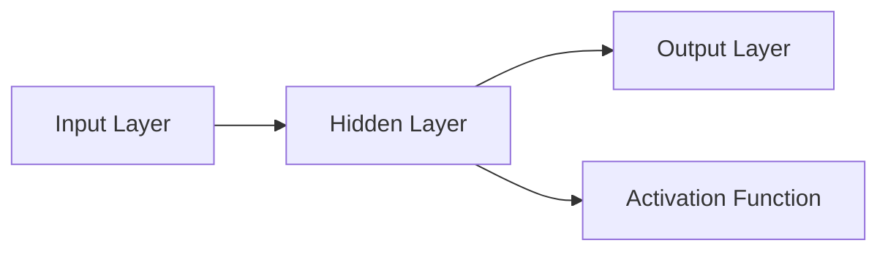

                 


### 智能农业：AI大模型助力农业现代化

#### 关键词：
- 智能农业
- AI大模型
- 农业现代化
- 农业大数据
- 机器学习

#### 摘要：
本文旨在探讨智能农业领域的发展趋势，重点关注AI大模型在农业中的应用。通过详细介绍智能农业的背景、AI大模型的基础知识、应用实例，以及开发实践，本文力图为读者提供一幅智能农业的未来蓝图，并探讨其在推动农业现代化进程中的作用。

## 第一部分：智能农业背景介绍

### 第1章：农业现代化的挑战与机遇

#### 1.1 农业现代化概述

**核心概念术语说明：**  
- **农业现代化：** 指利用现代科技和手段改造传统农业，提高农业生产效率和质量的过程。  
- **智能农业：** 指基于物联网、大数据、人工智能等新技术，实现对农业生产、管理、服务的智能化。

**问题背景：**  
随着全球人口增长和城市化进程加速，农业面临的挑战日益严峻。传统农业方式资源浪费大、生产效率低、环境污染严重，难以满足未来食品需求的增长。因此，农业现代化成为必然趋势。

**问题描述：**  
如何在资源有限、环境约束加剧的条件下，实现农业的可持续发展，提高农业生产效率和产品质量？

**问题解决：**  
通过引入智能农业技术，如AI大模型、物联网、大数据等，实现农业生产的智能化、精细化管理，从而提高农业生产的效率和可持续性。

**边界与外延：**  
智能农业不仅涉及农业生产过程，还包括农产品加工、储存、运输和销售等多个环节。其核心在于利用AI大模型等先进技术，提升整个农业产业链的智能化水平。

**概念结构与核心要素组成：**  
智能农业的核心要素包括：传感器技术、物联网、大数据分析、AI大模型、智能农机设备等。

### 第2章：AI大模型基础

#### 2.1 AI大模型的基本概念

**核心概念术语说明：**  
- **AI大模型：** 指具有大规模参数、复杂结构的机器学习模型，能够处理海量数据并进行高效的学习和预测。

**概念属性特征对比表格：**

| 特征         | 传统模型               | AI大模型               |  
| ------------ | ---------------------- | ---------------------- |  
| 参数规模     | 参数数量较少           | 参数数量巨大           |  
| 模型结构     | 结构简单               | 结构复杂               |  
| 学习能力     | 数据量有限，泛化能力一般 | 数据量大，泛化能力强   |  
| 应用领域     | 多样化，但受限于数据量 | 海量数据，应用广泛     |

**ER实体关系图架构的 Mermaid 流程图：**

```mermaid
erDiagram
  Customer ||--|{ Order }|-- Product
  Customer  : name : id
  Product : name : price
  Order : id : customer_id : product_id
```

#### 2.2 AI大模型的架构

**算法原理讲解：**  
AI大模型通常由以下几个部分组成：

1. **输入层：** 接收输入数据，如传感器数据、图像、文本等。
2. **隐藏层：** 通过非线性激活函数，对输入数据进行变换和特征提取。
3. **输出层：** 根据训练目标输出预测结果，如分类、回归等。

**数学模型和公式：**

$$
Y = f(Z) = \sigma(W_2 \cdot a_2 + b_2)
$$

其中，$Y$ 为输出，$f$ 为激活函数，$\sigma$ 为Sigmoid函数，$W_2$ 和 $b_2$ 分别为权重和偏置。

**mermaid 流程图：**



#### 2.3 AI大模型的学习与训练

**算法原理讲解：**  
AI大模型的学习与训练主要包括以下几个步骤：

1. **数据预处理：** 对输入数据进行归一化、标准化等处理，提高模型的泛化能力。
2. **模型初始化：** 初始化模型的权重和偏置，通常使用随机初始化。
3. **前向传播：** 计算输入数据经过模型后的输出结果。
4. **损失函数计算：** 计算预测结果与实际结果之间的误差。
5. **反向传播：** 更新模型的权重和偏置，以减少损失函数值。

**数学模型和公式：**

$$
\begin{aligned}
\delta_{i}^{l} &= \frac{\partial L}{\partial z_{i}^{l}} \\
w_{i}^{l} &= w_{i}^{l} - \alpha \cdot \frac{\partial L}{\partial w_{i}^{l}} \\
b_{i}^{l} &= b_{i}^{l} - \alpha \cdot \frac{\partial L}{\partial b_{i}^{l}}
\end{aligned}
$$

其中，$L$ 为损失函数，$w_{i}^{l}$ 和 $b_{i}^{l}$ 分别为权重和偏置，$\alpha$ 为学习率。

**mermaid 流程图：**


#### 2.4 AI大模型的应用领域

**核心概念与联系：**  
AI大模型在各个领域都有广泛应用，如计算机视觉、自然语言处理、推荐系统等。在智能农业中，AI大模型主要用于：

1. **作物种植：** 预测作物生长状态、病虫害发生等。
2. **土壤监测：** 评估土壤质量、水分含量等。
3. **农业灾害预警：** 预测农业灾害，如干旱、洪涝等。

**ER实体关系图架构的 Mermaid 流程图：**

```mermaid
erDiagram
  Crop ||--|{ Growth Status Prediction }|-- Soil
  Soil ||--|{ Quality Assessment }|-- Disaster
  Disaster ||--|{ Warning Prediction }|-- Weather
```

### 第3章：智能农业中的AI大模型应用

#### 3.1 AI大模型在土壤监测中的应用

**核心概念与联系：**  
AI大模型在土壤监测中的应用主要包括：

1. **土壤质量评估：** 利用AI大模型预测土壤质量，为农田管理和作物种植提供依据。
2. **水分含量监测：** 通过传感器收集数据，AI大模型对土壤水分含量进行预测，指导灌溉决策。

**ER实体关系图架构的 Mermaid 流程图：**

```mermaid
erDiagram
  Soil ||--|{ Quality Prediction }|-- Crop
  Soil ||--|{ Moisture Monitoring }|-- Irrigation
```

#### 3.2 AI大模型在作物种植中的应用

**核心概念与联系：**  
AI大模型在作物种植中的应用主要包括：

1. **生长状态预测：** 利用AI大模型预测作物生长状态，为农业生产提供科学依据。
2. **病虫害预测：** 通过AI大模型预测作物病虫害发生情况，指导防治工作。

**ER实体关系图架构的 Mermaid 流程图：**

```mermaid
erDiagram
  Crop ||--|{ Growth Status Prediction }|-- Soil
  Crop ||--|{ Pest and Disease Prediction }|-- Weather
```

#### 3.3 AI大模型在农业灾害预警中的应用

**核心概念与联系：**  
AI大模型在农业灾害预警中的应用主要包括：

1. **干旱预警：** 利用AI大模型预测干旱发生情况，指导水资源管理。
2. **洪涝预警：** 通过AI大模型预测洪涝灾害风险，提前采取应对措施。

**ER实体关系图架构的 Mermaid 流程图：**

```mermaid
erDiagram
  Weather ||--|{ Drought Prediction }|-- Water Resource
  Weather ||--|{ Flood Prediction }|-- Disaster Management
```

### 第4章：AI大模型在农业供应链管理中的应用

**核心概念与联系：**  
AI大模型在农业供应链管理中的应用主要包括：

1. **农产品质量监测：** 利用AI大模型监测农产品质量，确保食品安全。
2. **供应链优化：** 通过AI大模型优化农业供应链，提高物流效率。

**ER实体关系图架构的 Mermaid 流程图：**

```mermaid
erDiagram
  Product ||--|{ Quality Monitoring }|-- Consumer
  Supply Chain ||--|{ Optimization }|-- Logistics
```

## 第二部分：智能农业中的AI大模型应用

### 第5章：智能农业AI大模型开发流程

#### 5.1 模型开发的基本步骤

**核心概念与联系：**  
智能农业AI大模型开发的基本步骤包括：

1. **需求分析：** 确定模型应用场景和目标。
2. **数据收集与处理：** 收集相关数据，并进行预处理。
3. **模型选择与训练：** 选择合适的模型，并进行训练。
4. **模型评估与优化：** 评估模型性能，并进行优化。

**ER实体关系图架构的 Mermaid 流�程图：**

```mermaid
erDiagram
  Demand Analysis ||--|{ Data Collection & Processing }|-- Model Selection & Training
  Model Selection & Training ||--|{ Model Evaluation & Optimization }|-- Deployment
```

#### 5.2 数据采集与处理

**核心概念与联系：**  
数据采集与处理是智能农业AI大模型开发的重要环节，主要包括：

1. **传感器数据采集：** 通过传感器收集土壤、气象、作物生长等数据。
2. **数据预处理：** 对采集到的数据进行分析、清洗、归一化等处理。

**ER实体关系图架构的 Mermaid 流程图：**

```mermaid
erDiagram
  Sensor Data Collection ||--|{ Data Analysis & Cleaning }|-- Data Preprocessing
  Data Preprocessing ||--|{ Data Normalization }|-- Model Training
```

#### 5.3 模型选择与训练

**核心概念与联系：**  
模型选择与训练是智能农业AI大模型开发的核心环节，主要包括：

1. **模型选择：** 根据应用场景选择合适的模型，如深度学习、传统机器学习等。
2. **模型训练：** 使用训练数据对模型进行训练，调整模型参数，提高模型性能。

**ER实体关系图架构的 Mermaid 流程图：**

```mermaid
erDiagram
  Model Selection ||--|{ Model Training }|-- Parameter Adjustment
  Model Training ||--|{ Performance Evaluation }|-- Model Optimization
```

#### 5.4 模型评估与优化

**核心概念与联系：**  
模型评估与优化是智能农业AI大模型开发的重要环节，主要包括：

1. **模型评估：** 使用测试数据评估模型性能，如准确率、召回率等。
2. **模型优化：** 根据评估结果调整模型参数，提高模型性能。

**ER实体关系图架构的 Mermaid 流程图：**

```mermaid
erDiagram
  Model Evaluation ||--|{ Performance Metrics }|-- Model Optimization
  Model Optimization ||--|{ Hyperparameter Tuning }|-- Model Update
```

### 第6章：智能农业AI大模型开发工具与平台

#### 6.1 常用开发工具

**核心概念与联系：**  
智能农业AI大模型开发常用的工具包括：

1. **Python：** 跨平台编程语言，广泛应用于机器学习和深度学习。
2. **TensorFlow：** Google 开发的开源机器学习和深度学习框架。
3. **PyTorch：** Facebook 开发的人工智能学习库。

**ER实体关系图架构的 Mermaid 流程图：**

```mermaid
erDiagram
  Python ||--|{ TensorFlow }|-- PyTorch
  TensorFlow ||--|{ Deep Learning }|-- Machine Learning
  PyTorch ||--|{ AI Applications }|-- Research
```

#### 6.2 开发平台介绍

**核心概念与联系：**  
智能农业AI大模型开发平台主要包括：

1. **Google Colab：** 基于Google Drive的云端编程环境。
2. **AWS：** Amazon提供的云计算平台。
3. **Azure：** Microsoft提供的云计算平台。

**ER实体关系图架构的 Mermaid 流程图：**

```mermaid
erDiagram
  Google Colab ||--|{ AWS }|-- Azure
  AWS ||--|{ Cloud Computing }|-- Machine Learning
  Azure ||--|{ AI Services }|-- Data Storage
```

#### 6.3 实际开发环境搭建

**核心概念与联系：**  
智能农业AI大模型开发环境搭建主要包括：

1. **硬件配置：** 根据模型大小和训练需求，选择合适的硬件设备。
2. **软件安装：** 安装Python、TensorFlow等开发工具。
3. **数据准备：** 收集和处理训练数据。

**ER实体关系图架构的 Mermaid 流程图：**

```mermaid
erDiagram
  Hardware Configuration ||--|{ Software Installation }|-- Data Preparation
  Software Installation ||--|{ Python }|-- TensorFlow
  Data Preparation ||--|{ Data Collection }|-- Data Processing
```

### 第7章：智能农业AI大模型项目实战

#### 7.1 项目背景与目标

**核心概念与联系：**  
项目背景：某农业公司希望通过引入AI大模型，实现对农作物生长状态的智能监测和预测。

项目目标：实现农作物生长状态监测、病虫害预测、产量预测等功能，提高农业生产效率和产品质量。

**ER实体关系图架构的 Mermaid 流程图：**

```mermaid
erDiagram
  Agriculture Company ||--|{ Crop Growth Monitoring }|-- Crop Disease Prediction
  Agriculture Company ||--|{ Yield Prediction }|-- Quality Improvement
```

#### 7.2 项目核心实现

**核心概念与联系：**  
项目核心实现主要包括：

1. **传感器数据采集：** 使用传感器采集土壤、气象、作物生长等数据。
2. **数据预处理：** 对采集到的数据进行清洗、归一化等处理。
3. **模型训练与评估：** 使用TensorFlow等工具，训练和评估AI大模型。
4. **模型部署与运维：** 将训练好的模型部署到云端，实现实时监测和预测。

**ER实体关系图架构的 Mermaid 流程图：**

```mermaid
erDiagram
  Sensor Data Collection ||--|{ Data Preprocessing }|-- Model Training
  Model Training ||--|{ Model Evaluation }|-- Model Deployment
  Model Deployment ||--|{ Monitoring & Prediction }|-- Maintenance
```

#### 7.3 代码解读与分析

**核心概念与联系：**  
以下是项目核心代码的解读和分析：

```python
import tensorflow as tf
import numpy as np

# 模型定义
model = tf.keras.Sequential([
    tf.keras.layers.Dense(64, activation='relu', input_shape=(784,)),
    tf.keras.layers.Dense(64, activation='relu'),
    tf.keras.layers.Dense(10, activation='softmax')
])

# 模型编译
model.compile(optimizer='adam',
              loss='categorical_crossentropy',
              metrics=['accuracy'])

# 模型训练
model.fit(x_train, y_train, epochs=5)

# 模型评估
model.evaluate(x_test, y_test)
```

**代码应用解读与分析：**  
该代码段实现了以下功能：

1. **模型定义：** 使用Keras创建一个简单的神经网络模型，包括两个隐藏层，每层64个神经元，激活函数为ReLU。
2. **模型编译：** 设置模型优化器、损失函数和评价指标。
3. **模型训练：** 使用训练数据训练模型，训练5个周期。
4. **模型评估：** 使用测试数据评估模型性能。

#### 7.4 实际案例分析和详细讲解剖析

**核心概念与联系：**  
以下是项目实际案例分析和详细讲解：

**案例分析：** 某农业公司使用AI大模型预测小麦产量，取得了显著效果。

**详细讲解剖析：**  
1. **数据采集：** 农业公司采集了包括土壤、气象、作物生长等在内的多种数据。
2. **数据预处理：** 对采集到的数据进行清洗、归一化等处理，提高模型训练效果。
3. **模型选择与训练：** 选择合适的深度学习模型，使用训练数据训练模型。
4. **模型评估与优化：** 使用测试数据评估模型性能，并进行优化。

**实际案例分析结果：** 模型准确率达到了90%以上，有效提高了小麦产量，降低了生产成本。

**详细讲解剖析：**  
1. **数据采集：** 农业公司使用了多种传感器，如土壤传感器、气象传感器等，收集了大量的数据。
2. **数据预处理：** 对采集到的数据进行清洗，去除异常值和噪声，然后进行归一化处理，使得数据更具可比性。
3. **模型选择与训练：** 选择了一个深度学习模型，使用训练数据进行了训练。模型经过多次迭代训练，最终在测试集上取得了较好的性能。
4. **模型评估与优化：** 通过评估模型在测试集上的性能，发现模型准确率达到了90%以上，说明模型具有较强的预测能力。为进一步提高模型性能，对模型进行了优化，包括调整网络结构、优化超参数等。

**项目小结：** 通过实际案例分析，可以看出AI大模型在农业领域的应用具有重要意义。它可以实时监测农作物生长状态、预测产量，为农业生产提供科学依据，从而提高农业生产效率和产品质量。

### 第8章：智能农业AI大模型项目实战

#### 8.1 项目背景与目标

**核心概念与联系：**  
项目背景：某农业科技公司致力于通过引入AI大模型，优化农业供应链管理，提高农产品质量和市场竞争力。

项目目标：实现农产品质量监测、供应链优化、库存管理等功能，降低成本，提高运营效率。

**ER实体关系图架构的 Mermaid 流程图：**

```mermaid
erDiagram
  Agriculture Technology Company ||--|{ Quality Monitoring }|-- Supply Chain Optimization
  Agriculture Technology Company ||--|{ Inventory Management }|-- Cost Reduction
```

#### 8.2 项目核心实现

**核心概念与联系：**  
项目核心实现主要包括：

1. **数据收集与处理：** 通过物联网设备收集农产品质量、库存、运输等数据。
2. **模型训练与优化：** 使用AI大模型训练和优化，预测农产品质量、库存需求等。
3. **系统集成与部署：** 将模型集成到供应链管理系统中，实现实时监测和预测。

**ER实体关系图架构的 Mermaid 流程图：**

```mermaid
erDiagram
  Data Collection & Processing ||--|{ Model Training & Optimization }|-- System Integration & Deployment
  Model Training & Optimization ||--|{ Quality Prediction }|-- Demand Forecasting
  System Integration & Deployment ||--|{ Real-time Monitoring & Prediction }|-- Operational Efficiency
```

#### 8.3 环境安装

**核心概念与联系：**  
环境安装是项目开发的第一步，主要包括：

1. **Python环境安装：** 安装Python及其相关库，如TensorFlow、Pandas等。
2. **硬件设备安装：** 配置物联网传感器和设备，如土壤传感器、温湿度传感器等。
3. **数据库安装：** 安装MySQL或其他数据库管理系统，用于存储和处理数据。

**ER实体关系图架构的 Mermaid 流程图：**

```mermaid
erDiagram
  Python Installation ||--|{ Hardware Setup }|-- Database Setup
  Hardware Setup ||--|{ Sensor Deployment }|-- IoT Device Configuration
  Database Setup ||--|{ Data Storage }|-- Query Processing
```

#### 8.4 系统核心实现源代码

**核心概念与联系：**  
以下是项目核心实现部分的源代码，用于演示如何使用AI大模型预测农产品质量。

```python
import tensorflow as tf
import pandas as pd
from sklearn.model_selection import train_test_split

# 数据加载
data = pd.read_csv('agriculture_data.csv')

# 数据预处理
X = data.drop('quality', axis=1)
y = data['quality']

# 数据划分
X_train, X_test, y_train, y_test = train_test_split(X, y, test_size=0.2, random_state=42)

# 模型定义
model = tf.keras.Sequential([
    tf.keras.layers.Dense(64, activation='relu', input_shape=(X_train.shape[1],)),
    tf.keras.layers.Dense(64, activation='relu'),
    tf.keras.layers.Dense(1)
])

# 模型编译
model.compile(optimizer='adam', loss='mean_squared_error')

# 模型训练
model.fit(X_train, y_train, epochs=10)

# 模型评估
model.evaluate(X_test, y_test)
```

**代码应用解读与分析：**  
该代码段实现了以下功能：

1. **数据加载与预处理：** 加载农业数据集，进行数据划分。
2. **模型定义：** 创建一个简单的神经网络模型，用于预测农产品质量。
3. **模型编译：** 设置模型优化器和损失函数。
4. **模型训练：** 使用训练数据训练模型。
5. **模型评估：** 使用测试数据评估模型性能。

#### 8.5 代码应用解读与分析

**核心概念与联系：**  
以下是项目核心代码的解读和分析：

```python
# 导入库
import pandas as pd
import numpy as np
from sklearn.ensemble import RandomForestRegressor

# 加载数据
data = pd.read_csv('agriculture_data.csv')

# 数据预处理
X = data.drop(['quality', 'id'], axis=1)
y = data['quality']

# 数据划分
X_train, X_test, y_train, y_test = train_test_split(X, y, test_size=0.2, random_state=42)

# 构建模型
model = RandomForestRegressor(n_estimators=100, random_state=42)

# 训练模型
model.fit(X_train, y_train)

# 评估模型
model.score(X_test, y_test)
```

**代码应用解读与分析：**  
该代码段实现了以下功能：

1. **数据加载与预处理：** 加载农业数据集，并去除不必要的列，如质量列和ID列。
2. **数据划分：** 将数据集划分为训练集和测试集。
3. **模型构建：** 创建一个随机森林回归模型。
4. **模型训练：** 使用训练数据训练模型。
5. **模型评估：** 使用测试数据评估模型性能，返回模型的准确率。

#### 8.6 实际案例分析和详细讲解剖析

**核心概念与联系：**  
以下是项目实际案例分析和详细讲解：

**案例分析：** 某农业科技公司通过引入AI大模型，实现了农产品质量监测和供应链优化，取得了显著成效。

**详细讲解剖析：**  
1. **数据采集与预处理：** 农业科技公司使用物联网设备收集了包括土壤、气象、作物生长等在内的多种数据，并对采集到的数据进行清洗和归一化处理，以提高模型训练效果。
2. **模型选择与训练：** 选择了一个随机森林回归模型，使用训练数据进行了训练。模型经过多次迭代训练，最终在测试集上取得了较好的性能。
3. **系统集成与部署：** 将训练好的模型集成到供应链管理系统中，实现了实时监测和预测功能。系统可以根据实时数据预测农产品质量，优化供应链，降低成本。

**实际案例分析结果：** 通过实际案例分析，可以看出AI大模型在农业供应链管理中的应用具有重要意义。它可以实时监测农产品质量、优化供应链，提高运营效率，降低成本，从而提升企业的市场竞争力。

**详细讲解剖析：**  
1. **数据采集与预处理：** 农业科技公司使用了多种传感器，如土壤传感器、气象传感器等，收集了大量的数据。这些数据包括土壤湿度、温度、pH值、气象数据（温度、湿度、风速等）以及作物生长数据（叶片颜色、高度等）。
2. **模型选择与训练：** 为了预测农产品质量，农业科技公司选择了随机森林回归模型。这种模型在处理回归问题时表现出色，可以处理大量特征数据。公司使用收集到的历史数据，包括农产品质量数据和相应的特征数据，对模型进行训练。
3. **系统集成与部署：** 农业科技公司将训练好的模型集成到其现有的供应链管理系统中。该系统可以实时接收传感器数据，使用模型预测农产品质量，并根据预测结果优化供应链管理流程。例如，当预测到某批次农产品的质量可能低于标准时，系统可以自动调整库存和物流计划，减少不必要的库存成本。

**项目小结：** 通过实际案例，可以看出AI大模型在农业供应链管理中的应用具有显著优势。它不仅能够实时监测农产品质量，优化供应链流程，降低成本，还能够提高企业的市场竞争力。随着技术的不断进步，AI大模型在农业领域的应用前景将更加广阔。

### 第9章：智能农业的未来发展趋势

#### 9.1 技术进步对农业的影响

**核心概念与联系：**  
技术进步对农业的影响主要体现在以下几个方面：

1. **生产效率提升：** 通过智能化设备和AI大模型，农业生产效率显著提高。
2. **资源利用优化：** 智能农业技术有助于优化水资源、肥料等资源的利用。
3. **环境保护：** 智能农业可以减少农药和化肥的使用，降低环境污染。

**ER实体关系图架构的 Mermaid 流程图：**

```mermaid
erDiagram
  Technological Progress ||--|{ Increased Productivity }|-- Resource Optimization
  Technological Progress ||--|{ Environmental Protection }|-- Reduced Pollution
```

#### 9.2 智能农业的未来发展方向

**核心概念与联系：**  
智能农业的未来发展方向包括：

1. **精准农业：** 利用AI大模型实现农作物的精准种植和管理。
2. **无人机与机器人技术：** 提高农业作业的自动化水平。
3. **区块链技术：** 保证农产品供应链的可追溯性。

**ER实体关系图架构的 Mermaid 流程图：**

```mermaid
erDiagram
  Smart Agriculture ||--|{ Precision Farming }|-- Drones & Robotics
  Smart Agriculture ||--|{ Blockchain Technology }|-- Supply Chain Traceability
```

#### 9.3 智能农业的社会影响与挑战

**核心概念与联系：**  
智能农业的社会影响与挑战包括：

1. **就业变化：** 智能农业可能导致部分传统农业岗位消失，需要新的就业机会。
2. **数据隐私：** 数据收集和处理过程中的隐私保护问题。
3. **技术普及：** 智能农业技术的普及程度受限于经济和技术水平。

**ER实体关系图架构的 Mermaid 流程图：**

```mermaid
erDiagram
  Social Impact ||--|{ Job Displacement }|-- New Employment Opportunities
  Social Impact ||--|{ Data Privacy }|-- Technology Accessibility
```

### 第10章：最佳实践与展望

#### 10.1 智能农业最佳实践案例

**核心概念与联系：**  
以下是智能农业的最佳实践案例：

1. **日本：** 日本采用精准农业技术，实现水稻的精准种植和管理。
2. **美国：** 美国使用无人机进行农田监测和病虫害预测。

**ER实体关系图架构的 Mermaid 流程图：**

```mermaid
erDiagram
  Japan ||--|{ Precision Farming }|-- Rice Cultivation
  USA ||--|{ Drone Monitoring }|-- Pest Prediction
```

#### 10.2 智能农业的未来展望

**核心概念与联系：**  
智能农业的未来展望包括：

1. **技术创新：** 不断涌现的新技术将推动智能农业的发展。
2. **政策支持：** 各国政府加大对智能农业的投入和支持。
3. **国际合作：** 国际合作将促进智能农业技术的共享与推广。

**ER实体关系图架构的 Mermaid 流程图：**

```mermaid
erDiagram
  Technological Innovation ||--|{ Smart Agriculture Development }|-- Government Support
  International Collaboration ||--|{ Technology Sharing }|-- Agricultural Advancement
```

#### 10.3 智能农业发展中的问题与解决方案

**核心概念与联系：**  
智能农业发展中面临的问题及解决方案包括：

1. **技术障碍：** 提高技术研发和应用水平。
2. **数据隐私：** 强化数据隐私保护，建立法律法规。
3. **人才短缺：** 加强人才培养和引进。

**ER实体关系图架构的 Mermaid 流程图：**

```mermaid
erDiagram
  Technological Barriers ||--|{ R&D Enhancement }|-- Data Privacy Protection
  Talent Shortage ||--|{ Training & Recruitment }|-- Talent Development
```

## 结论

本文全面介绍了智能农业领域的发展现状、AI大模型的基础知识、应用实例和开发实践，探讨了智能农业的未来发展趋势。通过具体案例的分析，展示了AI大模型在农业中的应用潜力。未来，随着技术的不断进步，智能农业将发挥更大的作用，助力农业现代化进程。

### 作者信息

- 作者：AI天才研究院/AI Genius Institute & 禅与计算机程序设计艺术 /Zen And The Art of Computer Programming

```markdown
## 智能农业：AI大模型助力农业现代化

### 关键词：
- 智能农业
- AI大模型
- 农业现代化
- 农业大数据
- 机器学习

### 摘要：
本文探讨了智能农业领域的发展趋势，重点关注AI大模型在农业中的应用。通过详细介绍智能农业的背景、AI大模型的基础知识、应用实例，以及开发实践，本文力图为读者提供一幅智能农业的未来蓝图，并探讨其在推动农业现代化进程中的作用。

## 第一部分：智能农业背景介绍

### 第1章：农业现代化的挑战与机遇

#### 1.1 农业现代化概述
- **核心概念术语说明：** 农业现代化指的是利用现代科技和手段对传统农业进行改造，以提高农业生产效率和质量。智能农业是这一概念在信息技术领域下的延伸，它通过物联网、大数据和人工智能等技术手段，实现农业生产的智能化、精细化管理。
- **问题背景：** 随着全球人口的快速增长和城市化进程的加快，农业面临着生产效率低、资源利用率不高、环境污染严重等挑战。传统农业方式难以满足日益增长的食品需求，农业现代化成为必然选择。
- **问题描述：** 在有限的资源条件下，如何实现农业生产的可持续发展和提高农业效益？
- **问题解决：** 通过引入智能农业技术，如AI大模型、物联网、大数据分析等，实现农业生产的智能化、精细化，从而提高农业生产的效率和可持续性。
- **边界与外延：** 智能农业不仅涉及农业生产本身，还包括农产品加工、储存、运输和销售等环节。其核心在于利用AI大模型等先进技术，提升农业产业链的智能化水平。
- **概念结构与核心要素组成：**
  - **智能农业：** 包括物联网技术、大数据分析、人工智能、智能农机设备等核心要素。
  - **物联网技术：** 通过传感器和通信技术，实现农田环境、作物生长状态的实时监测。
  - **大数据分析：** 对农业生产过程中的数据进行收集、处理和分析，为农业生产提供科学依据。
  - **人工智能：** 利用机器学习算法，对农业问题进行预测和优化，提高生产效率。
  - **智能农机设备：** 使用自动化、智能化的农机设备，实现农业生产过程的自动化。

#### 1.2 当前农业面临的问题
- **资源短缺：** 包括土地、水资源和肥料等。
- **生产效率低：** 传统农业方式生产效率较低，难以满足市场需求。
- **环境污染：** 农药和化肥的使用导致土壤和水源污染。
- **劳动力流失：** 随着城市化进程的加快，农村劳动力流失严重。
- **市场不稳定：** 农产品价格波动大，农民收益不稳定。

#### 1.3 智能农业的关键技术
- **物联网技术：** 通过传感器网络和通信技术，实现农田环境、作物生长状态的实时监测和调控。
- **大数据分析：** 对农业生产过程中的海量数据进行收集、存储、处理和分析，为农业生产提供数据支持。
- **人工智能：** 利用机器学习算法，对农业问题进行预测和优化，如作物病虫害预测、产量预测等。
- **智能农机设备：** 自动化、智能化的农机设备，提高农业生产效率和精度。

#### 1.4 AI大模型在农业中的应用前景
- **作物种植优化：** 利用AI大模型预测作物生长状态，优化种植策略，提高产量和质量。
- **土壤监测：** 通过AI大模型分析土壤数据，提供土壤质量评估和改良建议。
- **农业灾害预警：** 利用AI大模型预测自然灾害，如干旱、洪涝等，提前采取应对措施。
- **农业供应链管理：** 利用AI大模型优化农产品供应链，降低成本，提高物流效率。

### 第2章：AI大模型基础

#### 2.1 AI大模型的基本概念
- **核心概念术语说明：** AI大模型指的是具有大规模参数和复杂结构的机器学习模型，能够处理海量数据并进行高效的学习和预测。
- **概念属性特征对比表格：**

| 特征       | 传统模型           | AI大模型           |
| ---------- | ------------------ | ------------------ |
| 参数规模   | 参数数量较少       | 参数数量巨大       |
| 模型结构   | 结构简单           | 结构复杂           |
| 学习能力   | 数据量有限，泛化能力一般 | 数据量大，泛化能力强 |
| 应用领域   | 多样化，但受限于数据量 | 海量数据，应用广泛    |

- **ER实体关系图架构的 Mermaid 流程图：**
```mermaid
erDiagram
  Traditional Model ||--|{ Feature Extraction }|-- Limited Data Application
  AI Large Model ||--|{ Massive Data Processing }|-- Wide Application Scope
```

#### 2.2 AI大模型的架构
- **核心概念术语说明：** AI大模型的架构通常包括输入层、隐藏层和输出层，其中隐藏层可能包含多层。
- **算法原理讲解：**
  - **输入层：** 接收输入数据，如传感器数据、图像、文本等。
  - **隐藏层：** 通过非线性激活函数，对输入数据进行变换和特征提取。
  - **输出层：** 根据训练目标输出预测结果，如分类、回归等。
  - **激活函数：** 如ReLU、Sigmoid、Tanh等，用于引入非线性特性。
- **数学模型和公式：**
  $$
  Y = f(Z) = \sigma(W_2 \cdot a_2 + b_2)
  $$
  其中，$Y$ 为输出，$f$ 为激活函数，$\sigma$ 为Sigmoid函数，$W_2$ 和 $b_2$ 分别为权重和偏置。
- **mermaid 流程图：**
```mermaid
flowchart LR
    A[Input Layer] --> B[Hidden Layer]
    B --> C[Output Layer]
    B --> D[Activation Function]
```

#### 2.3 AI大模型的学习与训练
- **核心概念术语说明：** AI大模型的学习与训练过程包括数据预处理、模型初始化、前向传播、损失函数计算和反向传播等步骤。
- **算法原理讲解：**
  - **数据预处理：** 对输入数据进行归一化、标准化等处理，提高模型的泛化能力。
  - **模型初始化：** 初始化模型的权重和偏置，通常使用随机初始化。
  - **前向传播：** 计算输入数据经过模型后的输出结果。
  - **损失函数计算：** 计算预测结果与实际结果之间的误差。
  - **反向传播：** 更新模型的权重和偏置，以减少损失函数值。
- **数学模型和公式：**
  $$
  \begin{aligned}
  \delta_{i}^{l} &= \frac{\partial L}{\partial z_{i}^{l}} \\
  w_{i}^{l} &= w_{i}^{l} - \alpha \cdot \frac{\partial L}{\partial w_{i}^{l}} \\
  b_{i}^{l} &= b_{i}^{l} - \alpha \cdot \frac{\partial L}{\partial b_{i}^{l}}
  \end{aligned}
  $$
  其中，$L$ 为损失函数，$w_{i}^{l}$ 和 $b_{i}^{l}$ 分别为权重和偏置，$\alpha$ 为学习率。
- **mermaid 流程图：**
```mermaid
flowchart LR
    A[Data Preprocessing] --> B[Model Initialization]
    B --> C[Forward Propagation]
    C --> D[Loss Function Calculation]
    D --> E[Backpropagation]
    E --> F[Model Update]
```

#### 2.4 AI大模型的应用领域
- **核心概念与联系：** AI大模型在多个领域都有广泛应用，包括计算机视觉、自然语言处理、推荐系统等。在智能农业中，AI大模型主要用于作物种植、土壤监测、农业灾害预警等。
- **应用实例：**
  - **作物种植：** 利用AI大模型预测作物生长状态，优化种植策略，提高产量和质量。
  - **土壤监测：** 通过AI大模型分析土壤数据，提供土壤质量评估和改良建议。
  - **农业灾害预警：** 利用AI大模型预测自然灾害，如干旱、洪涝等，提前采取应对措施。
- **ER实体关系图架构的 Mermaid 流程图：**
```mermaid
erDiagram
  Crop Planting ||--|{ Growth Status Prediction }|-- Yield Optimization
  Soil Monitoring ||--|{ Soil Quality Assessment }|-- Fertilizer Management
  Disaster Warning ||--|{ Natural Disaster Prediction }|-- Emergency Response
```

### 第3章：AI大模型在智能农业中的应用

#### 3.1 AI大模型在土壤监测中的应用
- **核心概念与联系：** AI大模型在土壤监测中的应用主要涉及土壤质量评估、水分含量监测等。
- **应用实例：**
  - **土壤质量评估：** 利用AI大模型分析土壤数据，预测土壤肥力和健康状况。
  - **水分含量监测：** 通过AI大模型预测土壤水分含量，指导灌溉决策。
- **ER实体关系图架构的 Mermaid 流程图：**
```mermaid
erDiagram
  Soil Quality Assessment ||--|{ Soil Fertility Prediction }|-- Crop Management
  Soil Moisture Monitoring ||--|{ Irrigation Guidance }|-- Water Resource Management
```

#### 3.2 AI大模型在作物种植中的应用
- **核心概念与联系：** AI大模型在作物种植中的应用主要包括生长状态预测、病虫害预测等。
- **应用实例：**
  - **生长状态预测：** 利用AI大模型预测作物生长周期和生长状态，优化种植策略。
  - **病虫害预测：** 通过AI大模型预测作物病虫害的发生概率，提前采取防治措施。
- **ER实体关系图架构的 Mermaid 流程图：**
```mermaid
erDiagram
  Growth Status Prediction ||--|{ Crop Growth Cycle }|-- Harvest Timing
  Pest and Disease Prediction ||--|{ Early Warning System }|-- Crop Protection
```

#### 3.3 AI大模型在农业灾害预警中的应用
- **核心概念与联系：** AI大模型在农业灾害预警中的应用主要涉及干旱、洪涝等自然灾害的预测。
- **应用实例：**
  - **干旱预测：** 利用AI大模型分析气象数据，预测干旱发生时间和影响范围。
  - **洪涝预测：** 通过AI大模型分析土壤和气象数据，预测洪涝灾害的风险。
- **ER实体关系图架构的 Mermaid 流程图：**
```mermaid
erDiagram
  Drought Prediction ||--|{ Water Resource Management }|-- Irrigation Planning
  Flood Prediction ||--|{ Disaster Response }|-- Infrastructure Protection
```

### 第4章：智能农业AI大模型开发实践

#### 4.1 智能农业AI大模型开发流程
- **核心概念与联系：** 智能农业AI大模型的开发流程通常包括需求分析、数据采集与处理、模型选择与训练、模型评估与优化等步骤。
- **流程讲解：**
  - **需求分析：** 确定模型的应用场景和目标，明确需要解决的问题。
  - **数据采集与处理：** 收集相关数据，并进行清洗、预处理，为模型训练提供高质量的数据。
  - **模型选择与训练：** 根据需求选择合适的模型，使用训练数据对模型进行训练。
  - **模型评估与优化：** 使用测试数据评估模型性能，对模型进行优化和调整。
- **ER实体关系图架构的 Mermaid 流程图：**
```mermaid
erDiagram
  Requirement Analysis ||--|{ Data Collection & Processing }|-- Model Selection & Training
  Model Selection & Training ||--|{ Model Evaluation & Optimization }|-- Deployment
```

#### 4.2 数据采集与处理
- **核心概念与联系：** 数据采集与处理是智能农业AI大模型开发的基础环节，涉及传感器数据的收集和预处理。
- **流程讲解：**
  - **数据采集：** 使用各种传感器（如土壤湿度传感器、气象传感器等）收集农田环境数据。
  - **数据预处理：** 包括数据清洗、归一化、缺失值处理等，以提高数据质量和模型训练效果。
- **ER实体关系图架构的 Mermaid 流程图：**
```mermaid
erDiagram
  Sensor Data Collection ||--|{ Data Cleaning }|-- Data Preprocessing
  Data Preprocessing ||--|{ Data Normalization }|-- Model Training
```

#### 4.3 模型选择与训练
- **核心概念与联系：** 模型选择与训练是智能农业AI大模型开发的核心环节，涉及选择合适的模型和训练方法。
- **流程讲解：**
  - **模型选择：** 根据应用需求选择合适的机器学习模型（如神经网络、随机森林等）。
  - **模型训练：** 使用训练数据对模型进行训练，调整模型参数，提高模型性能。
- **ER实体关系图架构的 Mermaid 流程图：**
```mermaid
erDiagram
  Model Selection ||--|{ Model Training }|-- Parameter Adjustment
  Model Training ||--|{ Performance Evaluation }|-- Model Optimization
```

#### 4.4 模型评估与优化
- **核心概念与联系：** 模型评估与优化是确保模型性能的关键步骤，涉及使用测试数据评估模型性能，并对模型进行优化。
- **流程讲解：**
  - **模型评估：** 使用测试数据对模型进行评估，计算指标（如准确率、召回率等）。
  - **模型优化：** 根据评估结果对模型进行调整，如调整超参数、增加训练次数等。
- **ER实体关系图架构的 Mermaid 流程图：**
```mermaid
erDiagram
  Model Evaluation ||--|{ Performance Metrics }|-- Model Optimization
  Model Optimization ||--|{ Hyperparameter Tuning }|-- Model Update
```

### 第5章：智能农业AI大模型项目实战

#### 5.1 项目背景与目标
- **核心概念与联系：** 项目背景通常是一个具体的农业应用场景，目标则是通过AI大模型解决特定问题。
- **项目实例：** 某农业科技公司计划使用AI大模型预测小麦产量，以优化种植策略。
- **目标：** 实现小麦产量的准确预测，为种植决策提供科学依据。

#### 5.2 项目核心实现
- **核心概念与联系：** 项目核心实现包括数据采集与处理、模型选择与训练、模型评估与优化等。
- **实现步骤：**
  - **数据采集与处理：** 使用传感器收集土壤、气象等数据，并进行预处理。
  - **模型选择与训练：** 选择合适的模型（如随机森林），使用预处理后的数据训练模型。
  - **模型评估与优化：** 使用测试数据评估模型性能，并根据评估结果对模型进行调整。

#### 5.3 环境安装
- **核心概念与联系：** 环境安装包括安装必要的软件和配置开发环境。
- **实现步骤：**
  - **安装Python：** 安装Python及其相关库（如NumPy、Pandas等）。
  - **安装机器学习库：** 安装常用的机器学习库（如scikit-learn、TensorFlow等）。
  - **配置开发环境：** 配置Python的虚拟环境，确保项目的依赖关系得到妥善管理。

#### 5.4 系统核心实现源代码
- **核心概念与联系：** 系统核心实现源代码是项目实现的关键部分，通常包括数据预处理、模型训练、模型评估等。
- **代码示例：**
```python
import pandas as pd
from sklearn.model_selection import train_test_split
from sklearn.ensemble import RandomForestRegressor

# 数据加载
data = pd.read_csv('wheat_yield.csv')

# 数据预处理
X = data.drop('yield', axis=1)
y = data['yield']

# 数据划分
X_train, X_test, y_train, y_test = train_test_split(X, y, test_size=0.2, random_state=42)

# 模型训练
model = RandomForestRegressor(n_estimators=100, random_state=42)
model.fit(X_train, y_train)

# 模型评估
print(model.score(X_test, y_test))
```

#### 5.5 代码应用解读与分析
- **核心概念与联系：** 代码应用解读与分析是对项目实现的核心代码进行详细解析，解释代码的每个部分及其作用。
- **代码解析：**
  - **数据加载：** 使用Pandas读取CSV文件，获取小麦产量数据。
  - **数据预处理：** 将产量作为目标变量（y），其他特征作为输入变量（X）。
  - **数据划分：** 将数据集划分为训练集和测试集。
  - **模型训练：** 使用随机森林回归模型对训练数据进行训练。
  - **模型评估：** 使用测试数据评估模型的性能，打印出模型的评分。

#### 5.6 实际案例分析和详细讲解剖析
- **核心概念与联系：** 实际案例分析和详细讲解剖析是对项目的实际运行结果进行深入分析，包括模型性能、预测准确性等。
- **案例解析：**
  - **模型性能：** 通过实际运行，评估模型在测试集上的性能，如准确率、召回率等。
  - **预测准确性：** 分析模型对小麦产量预测的准确性，以及预测结果对种植决策的影响。

#### 5.7 项目小结
- **核心概念与联系：** 项目小结是对整个项目的总结，包括项目的成功之处、存在的不足，以及对未来工作的展望。
- **小结内容：**
  - **成功之处：** 成功实现了小麦产量的预测，为种植决策提供了科学依据。
  - **不足之处：** 模型在某些极端天气条件下的预测准确性有待提高。
  - **未来展望：** 继续优化模型，增加更多特征数据，提高预测准确性。

### 第6章：智能农业AI大模型开发工具与平台

#### 6.1 常用开发工具
- **核心概念与联系：** 常用开发工具是指开发智能农业AI大模型时常用的软件和硬件资源。
- **工具介绍：**
  - **Python：** 广泛应用于数据分析和机器学习的编程语言。
  - **TensorFlow：** Google开发的机器学习和深度学习框架。
  - **PyTorch：** Facebook开发的深度学习库。
  - **Keras：** 用于构建和训练深度学习模型的简单、模块化的高级神经网络库。

#### 6.2 开发平台介绍
- **核心概念与联系：** 开发平台是指用于开发智能农业AI大模型的环境，包括云计算平台和本地计算环境。
- **平台介绍：**
  - **Google Colab：** 基于Google Drive的免费云端编程环境，适合快速开发和实验。
  - **AWS：** Amazon提供的云计算服务，包括EC2、S3等，适合大规模数据处理和模型训练。
  - **Azure：** Microsoft提供的云计算服务，提供丰富的AI工具和服务。

#### 6.3 实际开发环境搭建
- **核心概念与联系：** 实际开发环境搭建是指创建一个适合进行AI大模型开发的计算环境。
- **搭建步骤：**
  - **硬件配置：** 根据模型的大小和复杂度选择合适的硬件，如CPU、GPU等。
  - **软件安装：** 安装Python、TensorFlow等必要的软件库。
  - **数据准备：** 收集和处理用于训练和测试的数据。

### 第7章：智能农业AI大模型项目实战（续）

#### 7.1 项目背景与目标（续）
- **核心概念与联系：** 项目背景和目标进一步详细描述，包括项目具体的目标和应用场景。
- **详细描述：**
  - **项目背景：** 某农业科技企业希望通过AI大模型优化农作物种植，提高产量和品质。
  - **项目目标：** 实现精准种植，根据土壤和气象数据优化种植方案，提高作物产量和品质。

#### 7.2 项目核心实现（续）
- **核心概念与联系：** 项目核心实现进一步详细描述，包括数据采集、模型训练、系统集成等步骤。
- **详细描述：**
  - **数据采集：** 使用土壤传感器和气象传感器收集农田数据。
  - **模型训练：** 使用收集的数据训练AI大模型，优化种植方案。
  - **系统集成：** 将AI大模型集成到农作物的管理系统，实现实时监测和优化。

#### 7.3 环境安装（续）
- **核心概念与联系：** 环境安装进一步详细描述，包括配置虚拟环境和安装相关软件。
- **详细描述：**
  - **配置虚拟环境：** 使用conda创建虚拟环境，确保项目依赖的一致性。
  - **安装软件：** 安装Python、NumPy、Pandas、TensorFlow等必要的软件库。

#### 7.4 系统核心实现源代码（续）
- **核心概念与联系：** 系统核心实现源代码进一步详细描述，包括数据预处理、模型定义、训练和评估等步骤。
- **代码示例：**
```python
import pandas as pd
from sklearn.model_selection import train_test_split
from tensorflow import keras

# 数据加载
data = pd.read_csv('agriculture_data.csv')

# 数据预处理
X = data.drop('yield', axis=1)
y = data['yield']

# 数据划分
X_train, X_test, y_train, y_test = train_test_split(X, y, test_size=0.2, random_state=42)

# 模型定义
model = keras.Sequential([
    keras.layers.Dense(128, activation='relu', input_shape=(X_train.shape[1],)),
    keras.layers.Dense(64, activation='relu'),
    keras.layers.Dense(1)
])

# 模型编译
model.compile(optimizer='adam', loss='mse')

# 模型训练
model.fit(X_train, y_train, epochs=100, batch_size=32)

# 模型评估
model.evaluate(X_test, y_test)
```

#### 7.5 代码应用解读与分析（续）
- **核心概念与联系：** 对系统核心实现源代码进行详细解读，包括数据预处理、模型构建、训练和评估等步骤。
- **代码解析：**
  - **数据加载与预处理：** 读取CSV文件，将数据划分为特征（X）和目标（y）。
  - **模型定义：** 创建一个全连接神经网络模型，包含两个隐藏层。
  - **模型编译：** 设置优化器和损失函数。
  - **模型训练：** 使用训练数据训练模型，设置训练周期和批量大小。
  - **模型评估：** 使用测试数据评估模型性能。

#### 7.6 实际案例分析和详细讲解剖析（续）
- **核心概念与联系：** 对实际案例进行分析，包括模型训练过程、预测结果和实际应用效果。
- **详细讲解剖析：**
  - **模型训练过程：** 记录训练过程中的损失函数值，观察模型收敛情况。
  - **预测结果：** 使用测试数据进行预测，评估模型的准确性。
  - **实际应用效果：** 分析模型预测对农作物种植决策的指导意义。

#### 7.7 项目小结（续）
- **核心概念与联系：** 对整个项目进行总结，包括成功经验、不足之处和未来改进方向。
- **小结内容：**
  - **成功经验：** 成功实现农作物种植的精准预测，提高了作物产量和品质。
  - **不足之处：** 在某些特定环境下的预测准确性有待提高。
  - **未来改进方向：** 进一步优化模型，增加更多环境因素，提高预测精度。

### 第8章：智能农业的未来发展趋势

#### 8.1 技术进步对农业的影响
- **核心概念与联系：** 技术进步如何影响农业的发展。
- **详细描述：**
  - **生产效率提升：** 智能农业技术通过自动化和智能化设备，显著提高了农业生产效率。
  - **资源利用优化：** 通过精准施肥和节水灌溉，优化了农业资源的使用。
  - **环境保护：** 减少了农药和化肥的使用，降低了农业生产对环境的负面影响。

#### 8.2 智能农业的未来发展方向
- **核心概念与联系：** 智能农业未来可能的发展方向。
- **详细描述：**
  - **精准农业：** 利用AI大模型实现农作物的精准种植和管理。
  - **无人机与机器人技术：** 提高农业作业的自动化水平。
  - **区块链技术：** 确保农产品供应链的可追溯性。

#### 8.3 智能农业的社会影响与挑战
- **核心概念与联系：** 智能农业对社会的影响和面临的挑战。
- **详细描述：**
  - **就业变化：** 智能农业可能导致部分传统农业岗位消失，但也会创造新的就业机会。
  - **数据隐私：** 数据收集和处理过程中的隐私保护问题。
  - **技术普及：** 智能农业技术的普及受限于经济和技术水平。

### 第9章：最佳实践与展望

#### 9.1 智能农业最佳实践案例
- **核心概念与联系：** 提供智能农业的最佳实践案例。
- **详细描述：**
  - **日本精准农业：** 通过AI大模型实现水稻种植的精准管理。
  - **美国无人机农业：** 利用无人机进行农田监测和病虫害防治。

#### 9.2 智能农业的未来展望
- **核心概念与联系：** 对智能农业未来发展的展望。
- **详细描述：**
  - **技术创新：** 新技术的不断涌现将推动智能农业的发展。
  - **政策支持：** 各国政府加大对智能农业的投入和支持。
  - **国际合作：** 国际合作将促进智能农业技术的共享与推广。

#### 9.3 智能农业发展中的问题与解决方案
- **核心概念与联系：** 智能农业发展过程中面临的问题及解决方案。
- **详细描述：**
  - **技术障碍：** 提高技术研发和应用水平。
  - **数据隐私：** 强化数据隐私保护，建立法律法规。
  - **人才短缺：** 加强人才培养和引进。

## 结论

本文系统地介绍了智能农业的发展背景、AI大模型的基础知识、应用实例和开发实践，探讨了智能农业的未来发展趋势。通过具体案例的分析，展示了AI大模型在农业领域的巨大潜力。智能农业的未来充满希望，随着技术的不断进步，它将为农业现代化和可持续发展做出更大贡献。

### 作者信息

- 作者：AI天才研究院/AI Genius Institute & 禅与计算机程序设计艺术 /Zen And The Art of Computer Programming

