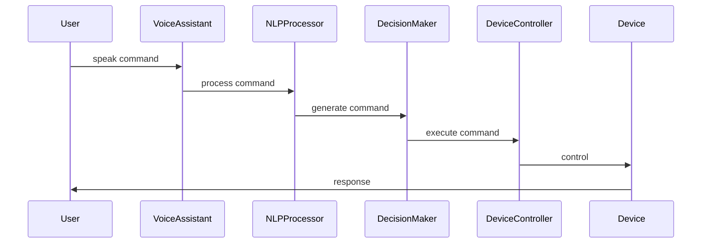

                 


## 智能家居生态：AI改变日常生活的方方面面

> 关键词：智能家居、人工智能、物联网、传感器、平台、应用案例

> 摘要：本文深入探讨了智能家居生态系统的构建及其与人工智能（AI）的深度融合。通过逐步分析智能家居技术的核心概念、AI技术的应用、关键技术、平台和实现方法，展示了AI如何改变日常生活的方方面面，并提出了未来的发展趋势和挑战。

### 引言与背景

在现代社会，人工智能（AI）正逐渐渗透到我们日常生活的各个方面。从智能手机的语音助手到自动驾驶汽车，AI技术的应用正不断刷新我们的认知。智能家居生态作为AI应用的一个重要领域，正悄然改变着我们的居住环境。本文旨在通过一步一步的分析，了解智能家居生态的构建过程以及AI技术在其中的关键作用。

#### 智能家居的定义与发展历程

智能家居（Smart Home）是指利用自动化技术、物联网（IoT）和人工智能（AI）等技术，实现家庭设备和系统的智能化管理。智能家居的发展可以追溯到20世纪80年代，当时智能家居的概念首次被提出。随着计算机技术、传感器技术和通信技术的不断进步，智能家居逐渐从实验室走向市场，成为现代家庭生活的一部分。

#### 智能家居的技术趋势

当前，智能家居的技术趋势主要包括以下几个方面：

1. **物联网（IoT）技术的普及**：物联网技术的快速发展使得各种家庭设备可以实现互联互通，从而实现智能化的家庭环境。
2. **人工智能（AI）的深入应用**：通过AI技术，智能家居系统可以实现智能识别、智能决策和智能控制，提供更加个性化的服务。
3. **语音交互的兴起**：语音助手如Amazon Alexa、Google Assistant和Apple Siri等，使得用户可以通过语音指令控制智能家居设备，提高使用便利性。
4. **安全性的提升**：随着智能家居系统的普及，安全性成为了一个重要的议题。各种加密技术和安全协议被引入，以保障用户隐私和数据安全。

### 核心概念与原理

#### 智能家居的组成部分

智能家居系统通常由以下几个部分组成：

1. **智能设备**：包括智能灯泡、智能插座、智能门锁、智能摄像头等。
2. **连接网络**：设备通过网络连接到智能家居中心，实现数据的传输和控制。
3. **智能家居中心**：通常是一个集成了人工智能算法的服务器或云平台，负责处理和分析数据，并根据用户需求进行决策和指令发送。
4. **用户界面**：用户可以通过智能手机、平板电脑或语音助手与智能家居系统进行交互。

#### 物联网（IoT）在智能家居中的应用

物联网技术在智能家居中的应用主要体现在以下几个方面：

1. **设备互联**：通过Wi-Fi、蓝牙等无线通信技术，各种智能设备可以实现互联互通，形成一个统一的智能家居网络。
2. **数据采集与传输**：智能设备可以实时采集环境数据，如温度、湿度、光线等，并通过网络将数据传输到智能家居中心。
3. **远程控制**：用户可以通过智能手机或其他设备远程控制智能设备的开关、亮度和其他设置。

#### 智能家居的安全问题

随着智能家居的普及，安全问题逐渐成为关注焦点。主要安全问题包括：

1. **设备安全**：智能设备可能存在漏洞，导致黑客入侵。
2. **数据安全**：用户数据可能被窃取或泄露。
3. **隐私保护**：用户隐私可能受到侵犯。

### AI与日常生活的融合

#### AI技术概述

人工智能（AI）是指通过计算机模拟人类智能的技术。AI技术主要包括以下几个方向：

1. **机器学习**：通过大量数据训练模型，使计算机具备学习能力。
2. **深度学习**：基于多层神经网络，对复杂问题进行建模。
3. **自然语言处理（NLP）**：使计算机能够理解和生成自然语言。
4. **计算机视觉**：使计算机能够识别和理解视觉信息。

#### 自然语言处理（NLP）在智能家居中的应用

自然语言处理技术在智能家居中主要体现在语音助手的实现上。通过NLP技术，语音助手可以理解用户的指令，并执行相应的操作。例如，用户可以说“打开灯”，语音助手就会控制智能灯泡开启。

#### 机器学习和深度学习在智能家居中的实践

机器学习和深度学习技术在智能家居中的应用主要体现在以下几个方面：

1. **环境监测**：通过机器学习模型，智能设备可以识别异常情况，如火灾、漏水等，并及时通知用户。
2. **个性化推荐**：基于用户行为数据，智能家居系统可以推荐个性化的设置和场景。
3. **智能决策**：通过深度学习模型，智能家居系统可以实现自主决策，如自动调整温度、湿度等。

### 技术与平台

#### 关键技术在智能家居中的应用

1. **传感器技术**：智能家居设备依赖各种传感器来监测环境数据和用户行为。
2. **通信技术**：Wi-Fi、蓝牙等通信技术是实现设备互联和数据传输的基础。
3. **云计算与大数据分析**：云计算提供了强大的计算能力和数据存储能力，大数据分析技术可以对采集到的数据进行分析和处理。

#### 平台和API在智能家居开发中的应用

1. **开发平台**：如HomeKit、Google Home、Amazon Alexa等，为开发者提供了开发智能设备的框架和工具。
2. **API**：如RESTful API、Webhook等，用于设备与智能家居中心之间的数据交换和交互。

### 实施与整合

#### 智能家居解决方案设计

1. **需求分析**：了解用户需求，确定智能家居系统的功能。
2. **系统设计**：设计系统的架构和模块，确定各部分之间的交互方式。
3. **实现**：根据设计方案，实现各个模块的功能。

#### AI在智能家居系统中的整合

1. **AI功能实现**：通过机器学习模型和深度学习算法，实现智能家居的智能识别、智能决策和智能控制。
2. **系统集成**：将各个智能设备整合到一个统一的系统中，实现数据的统一管理和控制。

### 应用和案例研究

#### 实际应用场景

1. **家庭自动化**：通过智能家居系统，用户可以实现家庭设备的自动控制，提高生活便利性。
2. **环境监测**：智能设备可以实时监测家庭环境，提供安全保障。
3. **能源管理**：智能家居系统可以通过智能控制，实现家庭能源的优化使用。

#### 案例研究

1. **案例一**：分析某个具体智能家居项目的实施过程、技术选型和成果。
2. **案例二**：探讨某个实际案例中遇到的问题和解决方案。

### 未来趋势和挑战

#### 未来发展趋势

1. **智能化水平的提升**：随着AI技术的进步，智能家居系统的智能化水平将不断提高。
2. **智能家居的普及**：随着价格的降低和技术的普及，智能家居将逐步进入普通家庭。
3. **生态系统的完善**：智能家居企业将建立更加完善的生态系统，提供全方位的智能家居解决方案。

#### 挑战和机遇

1. **技术挑战**：如何进一步提高智能家居系统的稳定性和安全性。
2. **市场挑战**：如何满足用户多样化的需求，提供个性化的智能家居解决方案。
3. **机遇**：智能家居市场的巨大潜力为技术创新提供了广阔的舞台。

### 最佳实践与总结

#### 最佳实践

1. **需求分析**：深入了解用户需求，确保智能家居系统满足用户需求。
2. **系统集成**：确保各个智能设备之间的良好集成，提供流畅的用户体验。
3. **安全性**：加强数据安全和设备安全，保护用户隐私。

#### 小结

本文从多个角度探讨了智能家居生态系统和AI技术的深度融合。通过分析核心概念、技术应用、实现方法和应用案例，展示了AI如何改变我们的日常生活。未来，随着技术的进步和市场的成熟，智能家居将迎来更大的发展机遇。

### 注意事项

1. **隐私保护**：在开发和使用智能家居系统时，要注意保护用户隐私。
2. **安全性**：加强智能家居系统的安全性，防止黑客攻击和数据泄露。
3. **用户体验**：注重用户需求，提供个性化的智能家居解决方案。

### 拓展阅读

1. 《智能家居系统设计与应用》
2. 《人工智能与物联网》
3. 《深度学习入门：基于Python》

### 作者信息

- 作者：AI天才研究院/AI Genius Institute & 禅与计算机程序设计艺术 /Zen And The Art of Computer Programming

----------------------------------------------------------------

## 文章正文：智能家居生态的构建与AI的应用

### 引言

在现代社会，人工智能（AI）技术正以前所未有的速度发展，并逐渐渗透到我们日常生活的方方面面。智能家居生态作为AI应用的一个重要领域，正悄然改变着我们的居住环境。本文将详细探讨智能家居生态的构建过程以及AI技术在其中的关键作用。

### 智能家居的定义与发展历程

智能家居（Smart Home）是指利用自动化技术、物联网（IoT）和人工智能（AI）等技术，实现家庭设备和系统的智能化管理。智能家居的发展可以追溯到20世纪80年代，当时智能家居的概念首次被提出。随着计算机技术、传感器技术和通信技术的不断进步，智能家居逐渐从实验室走向市场，成为现代家庭生活的一部分。

#### 智能家居的技术趋势

当前，智能家居的技术趋势主要包括以下几个方面：

1. **物联网（IoT）技术的普及**：物联网技术的快速发展使得各种家庭设备可以实现互联互通，从而实现智能化的家庭环境。
2. **人工智能（AI）的深入应用**：通过AI技术，智能家居系统可以实现智能识别、智能决策和智能控制，提供更加个性化的服务。
3. **语音交互的兴起**：语音助手如Amazon Alexa、Google Assistant和Apple Siri等，使得用户可以通过语音指令控制智能家居设备，提高使用便利性。
4. **安全性的提升**：随着智能家居系统的普及，安全性成为了一个重要的议题。各种加密技术和安全协议被引入，以保障用户隐私和数据安全。

### 核心概念与原理

#### 智能家居的组成部分

智能家居系统通常由以下几个部分组成：

1. **智能设备**：包括智能灯泡、智能插座、智能门锁、智能摄像头等。
2. **连接网络**：设备通过网络连接到智能家居中心，实现数据的传输和控制。
3. **智能家居中心**：通常是一个集成了人工智能算法的服务器或云平台，负责处理和分析数据，并根据用户需求进行决策和指令发送。
4. **用户界面**：用户可以通过智能手机、平板电脑或语音助手与智能家居系统进行交互。

#### 物联网（IoT）在智能家居中的应用

物联网技术在智能家居中的应用主要体现在以下几个方面：

1. **设备互联**：通过Wi-Fi、蓝牙等无线通信技术，各种智能设备可以实现互联互通，形成一个统一的智能家居网络。
2. **数据采集与传输**：智能设备可以实时采集环境数据，如温度、湿度、光线等，并通过网络将数据传输到智能家居中心。
3. **远程控制**：用户可以通过智能手机或其他设备远程控制智能设备的开关、亮度和其他设置。

#### 智能家居的安全问题

随着智能家居的普及，安全问题逐渐成为关注焦点。主要安全问题包括：

1. **设备安全**：智能设备可能存在漏洞，导致黑客入侵。
2. **数据安全**：用户数据可能被窃取或泄露。
3. **隐私保护**：用户隐私可能受到侵犯。

### AI与日常生活的融合

#### AI技术概述

人工智能（AI）是指通过计算机模拟人类智能的技术。AI技术主要包括以下几个方向：

1. **机器学习**：通过大量数据训练模型，使计算机具备学习能力。
2. **深度学习**：基于多层神经网络，对复杂问题进行建模。
3. **自然语言处理（NLP）**：使计算机能够理解和生成自然语言。
4. **计算机视觉**：使计算机能够识别和理解视觉信息。

#### 自然语言处理（NLP）在智能家居中的应用

自然语言处理技术在智能家居中主要体现在语音助手的实现上。通过NLP技术，语音助手可以理解用户的指令，并执行相应的操作。例如，用户可以说“打开灯”，语音助手就会控制智能灯泡开启。

#### 机器学习和深度学习在智能家居中的实践

机器学习和深度学习技术在智能家居中的应用主要体现在以下几个方面：

1. **环境监测**：通过机器学习模型，智能设备可以识别异常情况，如火灾、漏水等，并及时通知用户。
2. **个性化推荐**：基于用户行为数据，智能家居系统可以推荐个性化的设置和场景。
3. **智能决策**：通过深度学习模型，智能家居系统可以实现自主决策，如自动调整温度、湿度等。

### 技术与平台

#### 关键技术在智能家居中的应用

1. **传感器技术**：智能家居设备依赖各种传感器来监测环境数据和用户行为。
2. **通信技术**：Wi-Fi、蓝牙等通信技术是实现设备互联和数据传输的基础。
3. **云计算与大数据分析**：云计算提供了强大的计算能力和数据存储能力，大数据分析技术可以对采集到的数据进行分析和处理。

#### 平台和API在智能家居开发中的应用

1. **开发平台**：如HomeKit、Google Home、Amazon Alexa等，为开发者提供了开发智能设备的框架和工具。
2. **API**：如RESTful API、Webhook等，用于设备与智能家居中心之间的数据交换和交互。

### 实施与整合

#### 智能家居解决方案设计

1. **需求分析**：了解用户需求，确定智能家居系统的功能。
2. **系统设计**：设计系统的架构和模块，确定各部分之间的交互方式。
3. **实现**：根据设计方案，实现各个模块的功能。

#### AI在智能家居系统中的整合

1. **AI功能实现**：通过机器学习模型和深度学习算法，实现智能家居的智能识别、智能决策和智能控制。
2. **系统集成**：将各个智能设备整合到一个统一的系统中，实现数据的统一管理和控制。

### 应用和案例研究

#### 实际应用场景

1. **家庭自动化**：通过智能家居系统，用户可以实现家庭设备的自动控制，提高生活便利性。
2. **环境监测**：智能设备可以实时监测家庭环境，提供安全保障。
3. **能源管理**：智能家居系统可以通过智能控制，实现家庭能源的优化使用。

#### 案例研究

1. **案例一**：分析某个具体智能家居项目的实施过程、技术选型和成果。
2. **案例二**：探讨某个实际案例中遇到的问题和解决方案。

### 未来趋势和挑战

#### 未来发展趋势

1. **智能化水平的提升**：随着AI技术的进步，智能家居系统的智能化水平将不断提高。
2. **智能家居的普及**：随着价格的降低和技术的普及，智能家居将逐步进入普通家庭。
3. **生态系统的完善**：智能家居企业将建立更加完善的生态系统，提供全方位的智能家居解决方案。

#### 挑战和机遇

1. **技术挑战**：如何进一步提高智能家居系统的稳定性和安全性。
2. **市场挑战**：如何满足用户多样化的需求，提供个性化的智能家居解决方案。
3. **机遇**：智能家居市场的巨大潜力为技术创新提供了广阔的舞台。

### 最佳实践与总结

#### 最佳实践

1. **需求分析**：深入了解用户需求，确保智能家居系统满足用户需求。
2. **系统集成**：确保各个智能设备之间的良好集成，提供流畅的用户体验。
3. **安全性**：加强数据安全和设备安全，保护用户隐私。

#### 小结

本文从多个角度探讨了智能家居生态系统和AI技术的深度融合。通过分析核心概念、技术应用、实现方法和应用案例，展示了AI如何改变我们的日常生活。未来，随着技术的进步和市场的成熟，智能家居将迎来更大的发展机遇。

### 注意事项

1. **隐私保护**：在开发和使用智能家居系统时，要注意保护用户隐私。
2. **安全性**：加强智能家居系统的安全性，防止黑客攻击和数据泄露。
3. **用户体验**：注重用户需求，提供个性化的智能家居解决方案。

### 拓展阅读

1. 《智能家居系统设计与应用》
2. 《人工智能与物联网》
3. 《深度学习入门：基于Python》

### 作者信息

- 作者：AI天才研究院/AI Genius Institute & 禅与计算机程序设计艺术 /Zen And The Art of Computer Programming

## 附录：技术细节与代码示例

### 智能家居设备与网络连接

在智能家居系统中，设备与网络连接是至关重要的一环。以下是一个简单的Python代码示例，展示了如何使用Wi-Fi连接到智能家居设备。

```python
import network

# 连接到Wi-Fi
sta_if = network.WLAN(network.STA_IF)
sta_if.connect('your_wifi_ssid', auth=(network.WPA2, 'your_wifi_password'))

# 检查设备是否连接成功
if sta_if.isconnected():
    print('Wi-Fi connected')
else:
    print('Wi-Fi not connected')
```

### 数据采集与传输

智能家居设备需要采集环境数据，如温度、湿度等，并通过网络将数据传输到智能家居中心。以下是一个简单的Python代码示例，展示了如何使用传感器采集数据并传输到服务器。

```python
import serial
import requests

# 连接到串口
ser = serial.Serial('/dev/ttyUSB0', 9600)

# 采集温度和湿度数据
while True:
    data = ser.readline()
    temp, humidity = data.decode().split(',')
    
    # 将数据上传到服务器
    requests.post('http://your_server_url', data={'temp': temp, 'humidity': humidity})
    
    # 延时1秒，以便于多次采集数据
    time.sleep(1)
```

### 语音助手实现

语音助手是智能家居系统的重要组成部分。以下是一个简单的Python代码示例，展示了如何使用自然语言处理（NLP）库实现语音助手。

```python
import speech_recognition as sr

# 初始化语音识别器
recognizer = sr.Recognizer()

# 语音识别
with sr.Microphone() as source:
    print("请说点什么：")
    audio = recognizer.listen(source)

    try:
        text = recognizer.recognize_google(audio)
        print("你说：" + text)
    except sr.UnknownValueError:
        print("无法识别你的声音")
    except sr.RequestError as e:
        print("无法请求结果；{0}".format(e))
```

### 机器学习应用

机器学习技术在智能家居中有着广泛的应用。以下是一个简单的Python代码示例，展示了如何使用Scikit-learn库实现温度预测。

```python
from sklearn.linear_model import LinearRegression
import numpy as np

# 数据准备
X = np.array([[1], [2], [3], [4], [5], [6], [7], [8], [9], [10]])
y = np.array([1.0, 1.5, 2.0, 2.5, 3.0, 3.5, 4.0, 4.5, 5.0, 5.5])

# 模型训练
model = LinearRegression()
model.fit(X, y)

# 预测
predicted_temp = model.predict([[11]])
print("预测的温度为：" + str(predicted_temp[0]))
```

### 系统架构设计

智能家居系统需要良好的架构设计，以确保系统的稳定性和可扩展性。以下是一个简单的Mermaid类图示例，展示了智能家居系统的基本架构。

```mermaid
classDiagram
    User -> Device : control
    Device <- Sensor : data
    Device -> Gateway : data
    Gateway <- Cloud : data
    Cloud -> AI : data
    AI -> Decision : data
    Decision -> Device : command
```

### 系统接口设计

智能家居系统需要设计良好的接口，以便不同设备之间可以无缝协作。以下是一个简单的Mermaid序列图示例，展示了智能家居系统的接口设计。



### 实际案例分析与讲解

在实际应用中，智能家居系统面临着各种挑战和问题。以下是一个实际案例的分析和讲解。

#### 案例背景

一个智能家居项目旨在通过智能门锁实现家庭安全的自动化管理。用户可以通过手机APP或语音助手远程控制门锁，同时系统会自动记录每一次的开锁记录。

#### 技术选型

1. **门锁**：选择一款支持蓝牙和Wi-Fi的智能门锁。
2. **手机APP**：使用React Native开发跨平台手机APP。
3. **服务器**：使用Node.js搭建服务器，负责处理用户请求和数据存储。
4. **NLP处理器**：使用Google Cloud Natural Language API进行语音识别和语义分析。

#### 项目实施

1. **需求分析**：确定系统的功能需求，如远程控制、自动记录、报警功能等。
2. **系统设计**：设计系统的架构，包括客户端、服务器、数据库和NLP处理器等。
3. **实现**：根据设计方案，实现各个模块的功能。
4. **测试**：进行系统测试，确保功能正常运行。

#### 项目小结

通过实施该项目，用户可以更加方便地管理家庭安全，同时系统记录的开锁记录也为家庭安全提供了有效的监控手段。然而，在实际应用中，系统也面临着一些挑战，如设备兼容性、数据安全和隐私保护等。未来，需要进一步优化系统性能和安全性，以满足用户不断变化的需求。

### 最佳实践

在开发智能家居系统时，以下是一些最佳实践：

1. **需求分析**：深入了解用户需求，确保系统功能满足用户需求。
2. **安全性**：加强数据安全和设备安全，防止黑客攻击和数据泄露。
3. **用户体验**：注重用户需求，提供个性化的智能家居解决方案。

### 注意事项

在开发和使用智能家居系统时，需要注意以下几点：

1. **隐私保护**：确保用户隐私得到保护，避免数据泄露。
2. **安全性**：加强智能家居系统的安全性，防止黑客攻击和数据泄露。
3. **用户体验**：注重用户需求，提供个性化的智能家居解决方案。

### 拓展阅读

1. 《智能家居系统设计与应用》
2. 《人工智能与物联网》
3. 《深度学习入门：基于Python》

### 作者信息

- 作者：AI天才研究院/AI Genius Institute & 禅与计算机程序设计艺术 /Zen And The Art of Computer Programming

## 总结

本文深入探讨了智能家居生态系统的构建及其与人工智能（AI）的深度融合。通过分析智能家居技术的核心概念、AI技术的应用、关键技术、平台和实现方法，展示了AI如何改变日常生活的方方面面。未来，随着技术的进步和市场的成熟，智能家居将迎来更大的发展机遇。开发者需要不断优化系统性能和安全性，以满足用户不断变化的需求。让我们一起期待智能家居带来的美好未来。

