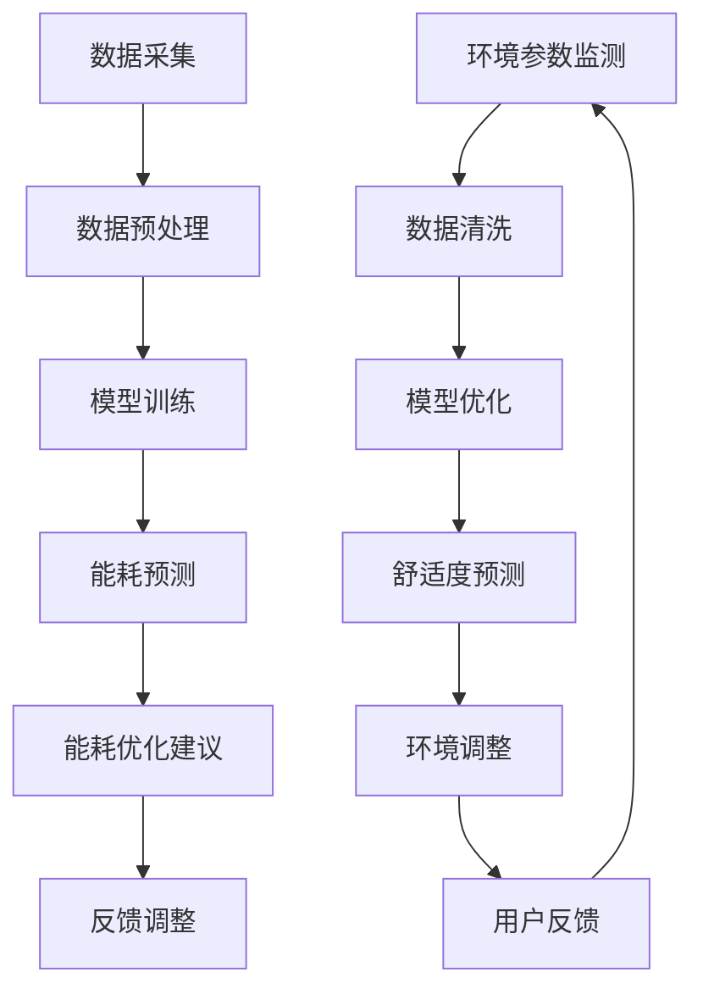
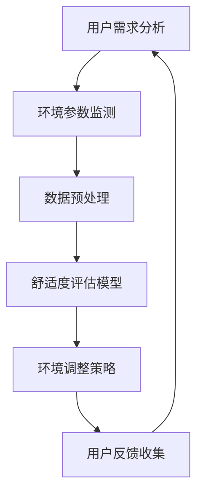
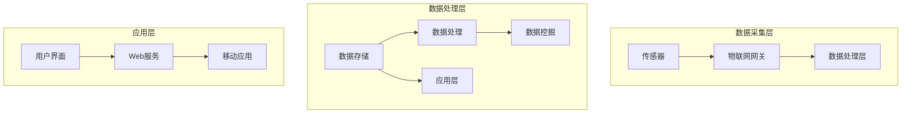
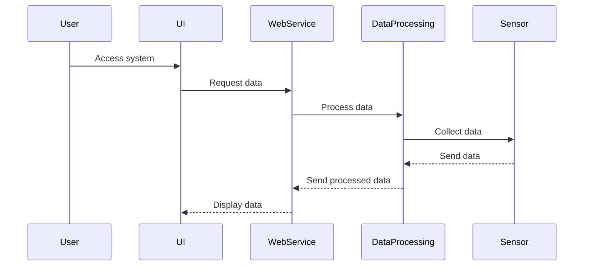

                 

### 第一部分：智能建筑与AI技术基础

#### 第1章：智能建筑概述

智能建筑，作为一种融合了现代信息技术、物联网、自动化控制及人工智能等多种先进技术的建筑，正逐渐成为未来城市的重要组成部分。本章将详细介绍智能建筑的定义、发展历程及其核心技术，帮助读者理解智能建筑的基本概念及其应用前景。

#### 1.1 智能建筑的定义与发展历程

**定义：** 智能建筑是指通过集成先进的计算机技术、通信技术、网络技术、自控技术等，使建筑物具备智能化管理和自主运行能力的一种新型建筑形式。

**发展历程：** 智能建筑的发展可以追溯到20世纪80年代。当时，随着计算机技术和通信技术的迅速发展，建筑自动化系统（BAS）开始应用于大型商业建筑。进入21世纪，随着物联网（IoT）和人工智能（AI）技术的兴起，智能建筑迎来了新的发展阶段。如今，智能建筑已经广泛应用于住宅、办公楼、酒店、医院等各类建筑中。

#### 1.2 智能建筑的核心技术

智能建筑的核心技术包括但不限于以下几个方面：

1. **建筑自动化系统（BAS）：** BAS是智能建筑的核心，通过自动化控制实现对建筑内各种设备和系统的集中管理和控制，如照明、空调、安防、电梯等。

2. **物联网（IoT）：** 物联网技术将各种设备和系统连接起来，实现数据的实时采集、传输和分析，从而提高建筑的智能化水平。

3. **人工智能（AI）：** AI技术可以用于优化建筑能耗管理、提高居住舒适度、实现智能安防等，是智能建筑技术的灵魂。

4. **大数据与云计算：** 大数据技术可以帮助建筑管理者对大量数据进行分析，发现潜在的问题和优化方案。云计算则提供了强大的计算能力和数据存储能力，支持智能建筑的运行和管理。

#### 1.3 智能建筑的应用现状与挑战

**应用现状：** 目前，智能建筑已经在全球范围内得到广泛应用。例如，智能住宅通过智能家居系统提高了居住的舒适度和安全性；智能办公楼通过智能办公系统提高了工作效率；智能医院通过智能医疗系统提高了医疗服务质量。

**面临挑战：** 尽管智能建筑具有巨大的发展潜力，但也面临着一些挑战。主要包括：

1. **技术挑战：** 智能建筑涉及多种技术的融合，如何实现各技术的协同工作，是一个需要解决的问题。

2. **数据安全与隐私保护：** 智能建筑大量使用物联网技术，这可能导致数据泄露和隐私侵犯，如何确保数据安全是一个重要问题。

3. **标准与法规：** 智能建筑的发展需要统一的规范和标准，但目前相关标准和法规尚不完善。

#### 结论

智能建筑作为一种新兴的建筑形式，正迅速发展并展现出巨大的潜力。通过本章的介绍，我们了解了智能建筑的定义、发展历程及其核心技术，对智能建筑有了更深刻的认识。接下来，我们将进一步探讨AI技术在智能建筑管理中的应用，为优化能耗与舒适度提供新的思路和方法。

---

### 第一部分：智能建筑与AI技术基础

#### 第2章：AI技术基础

人工智能（AI）作为现代科技的璀璨明珠，正在各个领域引发深刻的变革。智能建筑领域也不例外，AI技术的应用正在逐步改变建筑的设计、建设、管理和使用方式。本章将介绍AI的基本概念、在建筑中的应用潜力以及相关关键技术，帮助读者了解AI技术的基础及其在智能建筑中的重要性。

#### 2.1 AI基本概念

**人工智能（AI）：** 人工智能是指计算机系统模拟人类智能行为的技术，包括学习、推理、感知、理解、决策和问题解决等。

**机器学习（ML）：** 机器学习是AI的核心技术之一，通过数据训练模型，使计算机具备从数据中学习并作出决策的能力。

**深度学习（DL）：** 深度学习是机器学习的一种方法，通过神经网络模型模拟人脑的工作方式，具有强大的特征学习和模式识别能力。

#### 2.2 AI在建筑中的应用潜力

**能耗管理：** AI技术可以通过数据分析和学习，优化建筑能耗，减少能源消耗。

**舒适度优化：** AI可以根据用户的习惯和环境变化，实时调整建筑系统的参数，提高居住和办公的舒适度。

**智能安防：** AI技术可以用于智能监控和异常检测，提高建筑的安全管理水平。

**智慧运维：** AI技术可以帮助建筑管理者预测和预防潜在问题，实现智慧化的运维管理。

**个性化服务：** AI可以根据用户的需求和偏好，提供个性化的服务和体验。

#### 2.3 AI关键技术简介

**数据采集与处理：** AI技术需要大量数据来训练模型，因此数据采集和处理是AI应用的基础。

**算法与模型：** 包括监督学习、无监督学习、强化学习等算法，以及神经网络、决策树、支持向量机等模型。

**算法优化与调参：** 通过优化算法和调整参数，提高模型的性能和效率。

**部署与集成：** 将AI模型部署到实际应用中，并与现有系统进行集成，实现智能化的管理和控制。

#### 结论

AI技术作为智能建筑的核心驱动力，正在不断推动建筑行业向智能化、高效化方向发展。本章介绍了AI的基本概念和在建筑中的应用潜力，为后续章节的深入探讨奠定了基础。在接下来的内容中，我们将详细探讨AI技术如何应用于智能建筑的能耗管理和舒适度优化，为建筑行业带来新的变革。

---

### 第二部分：AI优化能耗与舒适度原理

#### 第3章：能耗管理与舒适度优化的AI算法原理

在智能建筑管理中，能耗管理和舒适度优化是两个至关重要的方面。通过AI技术，我们可以实现对建筑能耗的精细化管理，同时提高用户的舒适度体验。本章将深入探讨AI在能耗管理与舒适度优化中的应用原理，包括相关算法的基础、数据预处理方法以及常见的优化策略。

#### 3.1 能耗管理的基本原理

**能耗管理定义：** 能耗管理是指对建筑内能源消耗的监控、分析和管理，以实现能源的高效利用和节约。

**能耗管理目标：** 通过能耗管理，实现能源消耗的优化，降低能源成本，减少碳排放，提高能源使用效率。

**能耗管理关键环节：**
1. **数据采集：** 通过传感器和监测设备收集建筑内各类能源消耗数据，如电力、燃气、水等。
2. **数据存储：** 将采集到的数据存储在数据库中，为后续的数据处理和分析提供基础。
3. **数据分析：** 通过数据挖掘和分析技术，识别能源消耗的规律和问题，提出优化建议。
4. **决策与控制：** 根据分析结果，调整建筑内能源系统的运行参数，实现能耗优化。

#### 3.2 舒适度优化的算法基础

**舒适度优化定义：** 舒适度优化是指通过调整建筑环境参数（如温度、湿度、空气品质等），提高用户在建筑中的舒适度体验。

**舒适度优化目标：** 提高用户在建筑中的舒适度，减少由于环境问题引起的不适和疾病。

**舒适度优化关键环节：**
1. **环境参数监测：** 通过传感器实时监测建筑内环境参数，如温度、湿度、CO2浓度等。
2. **用户行为分析：** 通过数据分析技术，了解用户的日常行为习惯和偏好，为舒适度优化提供依据。
3. **环境参数调整：** 根据用户行为和环境参数监测结果，自动调整环境系统参数，如空调温度、通风模式等。
4. **反馈与优化：** 通过用户反馈和环境参数监测结果，不断调整和优化舒适度管理策略。

#### 3.3 AI算法在能耗管理中的应用

**机器学习算法：** 
- **监督学习：** 如回归分析、逻辑回归、支持向量机等，用于预测能源消耗趋势和优化能源使用策略。
- **无监督学习：** 如聚类分析、主成分分析等，用于发现能源消耗的异常情况和潜在节能机会。

**深度学习算法：**
- **卷积神经网络（CNN）：** 用于图像识别，可以识别能源消耗设备的故障和异常。
- **循环神经网络（RNN）：** 用于时间序列分析，可以预测未来能源消耗和优化能源使用。

**强化学习算法：**
- 用于智能调度和优化能源使用策略，如Q-learning、深度Q网络（DQN）等。

**应用场景举例：**
1. **能耗预测与优化：** 通过历史数据分析和模型预测，提前预测能耗趋势，制定优化方案。
2. **设备故障诊断：** 通过传感器数据和机器学习模型，实时监测设备状态，提前发现故障隐患。
3. **能源调度与控制：** 通过AI算法，智能调度建筑内各类能源设备，实现能耗的最优化。

#### 3.4 AI算法在舒适度优化中的应用

**数据驱动优化策略：**
- 通过用户行为和环境参数监测数据，分析用户的舒适度需求，实时调整环境参数。
- 使用聚类分析等方法，识别不同用户群体的舒适度偏好，制定个性化优化策略。

**自适应控制策略：**
- 采用基于模型的预测控制（Model Predictive Control, MPC），根据环境模型和实时反馈，动态调整环境系统参数。
- 使用深度学习模型，自适应地调整环境系统参数，以最小化用户舒适度波动。

**应用场景举例：**
1. **温度与通风控制：** 通过AI算法，根据用户需求和实时环境数据，自动调整空调和通风系统的运行模式，实现温度和通风的最优化。
2. **空气品质管理：** 通过监测CO2浓度、PM2.5等指标，自动调整空气净化系统的运行参数，保持室内空气品质。
3. **智能安防与舒适度优化：** 结合安防监控数据和用户行为数据，实时调整安防系统参数，同时优化舒适度。

#### 结论

能耗管理与舒适度优化是智能建筑管理中不可或缺的两个方面。通过AI技术，我们可以实现对建筑能耗的精细管理和舒适度的个性化优化。本章介绍了能耗管理和舒适度优化的基本原理，以及AI算法在这些领域中的应用。在接下来的章节中，我们将进一步探讨AI算法的具体实现和实际应用案例，为智能建筑管理提供更多的实践指导。

---

### 第3章：AI算法详细讲解

在前一章中，我们介绍了AI技术在能耗管理和舒适度优化中的应用原理。本章将进一步深入，使用Mermaid绘制算法流程图，配合Python代码和数学模型，详细阐述AI算法的原理和应用。通过这种理论与实践相结合的方式，帮助读者更好地理解AI算法在智能建筑管理中的具体实现。

#### 3.1 算法原理与Mermaid流程图

**能耗管理算法流程图：**


**舒适度优化算法流程图：**


通过以上流程图，我们可以清晰地看到能耗管理和舒适度优化的整体流程。接下来，我们将结合Python代码和数学模型，对每个步骤进行详细讲解。

#### 3.2 Python代码与数学模型

**能耗预测模型：**
```python
# 导入必要的库
import numpy as np
import pandas as pd
from sklearn.ensemble import RandomForestRegressor

# 加载历史能耗数据
data = pd.read_csv('energy_consumption_data.csv')

# 数据预处理
X = data[['time', 'temperature', 'humidity']]
y = data['energy_consumption']

# 模型训练
model = RandomForestRegressor(n_estimators=100)
model.fit(X, y)

# 预测未来能耗
future_data = pd.DataFrame({'time': pd.date_range(start='2023-01-01', end='2023-01-07', freq='D'),
                            'temperature': [15] * 7,
                            'humidity': [60] * 7})
predicted_energy_consumption = model.predict(future_data)

print(predicted_energy_consumption)
```

**舒适度评估模型：**
```python
# 导入必要的库
import numpy as np
import pandas as pd
from sklearn.linear_model import LinearRegression

# 加载用户行为和环境数据
data = pd.read_csv('comfort_data.csv')

# 数据预处理
X = data[['temperature', 'humidity', 'CO2']]
y = data['comfort_level']

# 模型训练
model = LinearRegression()
model.fit(X, y)

# 预测舒适度
new_data = pd.DataFrame({'temperature': [20], 'humidity': [50], 'CO2': [500]})
predicted_comfort_level = model.predict(new_data)

print(predicted_comfort_level)
```

**数学模型解释：**
- **能耗预测模型：** 使用随机森林回归模型（Random Forest Regressor）对历史能耗数据进行分析和预测。随机森林是一种集成学习模型，通过构建多棵决策树来提高预测的准确性和稳定性。模型中的`fit`方法用于训练模型，`predict`方法用于进行能耗预测。
  
- **舒适度评估模型：** 使用线性回归模型（Linear Regression）评估用户的舒适度水平。线性回归是一种简单的统计模型，通过建立自变量（如温度、湿度、CO2浓度）和因变量（舒适度水平）之间的线性关系来进行预测。模型的`fit`方法用于训练模型，`predict`方法用于进行舒适度预测。

#### 3.3 通俗易懂的算法举例

**能耗预测算法举例：**
假设我们有一个智能建筑，最近一周的能耗数据如下：

| 日期    | 温度(°C) | 湿度(%) | 能耗(KWh) |
| ------- | -------- | ------- | --------- |
| 2023-01-01 | 15       | 60      | 100       |
| 2023-01-02 | 14       | 65      | 98        |
| 2023-01-03 | 16       | 55      | 102       |
| 2023-01-04 | 17       | 58      | 105       |
| 2023-01-05 | 15       | 60      | 100       |
| 2023-01-06 | 14       | 65      | 98        |
| 2023-01-07 | 16       | 55      | 102       |

通过随机森林回归模型，我们可以预测未来一周的能耗。首先，我们需要将数据整理成适合训练模型的格式，然后使用`fit`方法训练模型。接下来，我们可以使用`predict`方法，输入未来一周的温度和湿度数据，得到预测的能耗值。

**舒适度评估算法举例：**
假设我们有一个用户，当前的环境参数如下：

| 温度(°C) | 湿度(%) | CO2(PPM) | 舒适度水平 |
| -------- | ------- | -------- | ---------- |
| 20       | 50      | 500      | 未评估     |

我们可以使用线性回归模型来评估这个用户的舒适度水平。首先，我们需要将数据整理成适合训练模型的格式，然后使用`fit`方法训练模型。接下来，我们可以使用`predict`方法，输入当前的环境参数，得到预测的舒适度水平。

通过这些具体的算法举例，我们可以更好地理解AI算法在能耗管理和舒适度优化中的应用。在接下来的章节中，我们将进一步探讨智能建筑管理的系统设计与实现，以及实际项目中的具体应用。

---

### 第三部分：智能建筑管理系统设计与实现

#### 第4章：系统分析与架构设计

在智能建筑管理中，系统分析与架构设计是确保系统高效、可靠运行的关键步骤。本章将详细描述智能建筑管理系统的需求分析、系统架构设计、系统接口设计以及系统交互流程，帮助读者全面了解智能建筑管理系统的工作原理和设计思路。

#### 4.1 智能建筑管理系统的需求分析

**需求背景：** 随着智能建筑技术的快速发展，建筑管理者需要一套智能化的系统来优化能耗管理、提高舒适度、保障安全。因此，智能建筑管理系统的设计必须满足以下需求：

1. **能耗管理需求：** 系统需要能够实时监控建筑内各类能源消耗，提供能耗分析报告，帮助管理者制定节能措施。
2. **舒适度管理需求：** 系统需要能够实时监测建筑内环境参数（如温度、湿度、CO2浓度等），并根据用户需求进行环境调整。
3. **安防需求：** 系统需要集成智能安防功能，包括入侵检测、异常行为监控等，确保建筑安全。
4. **运维管理需求：** 系统需要支持远程监控和运维管理，提高运维效率，降低运维成本。

**功能需求：**
- 能源消耗监控与预测
- 环境参数监测与调节
- 安全事件监控与报警
- 运维管理报表与分析

**性能需求：**
- 系统响应时间：确保系统在接收数据或进行控制指令时，能够在合理的时间内完成操作。
- 系统稳定性：系统需要在长时间运行过程中保持稳定，避免出现故障。
- 数据处理能力：系统需要能够处理大量实时数据，保证数据的准确性和实时性。

**可靠性需求：**
- 系统容错能力：系统需要具备故障恢复和容错功能，确保在硬件或软件出现问题时，系统能够继续运行。
- 数据安全性：系统需要保障数据的安全，防止数据泄露和未授权访问。

#### 4.2 系统架构设计

**总体架构设计：** 
智能建筑管理系统采用分布式架构，包括数据采集层、数据处理层和应用层。

**数据采集层：** 
数据采集层由各类传感器和监测设备组成，负责实时采集建筑内的能耗数据、环境参数和安防数据。传感器数据通过物联网网关传输至数据处理层。

**数据处理层：** 
数据处理层包括数据存储、数据处理和数据挖掘模块。数据存储模块用于存储采集到的原始数据和预处理数据；数据处理模块用于对数据进行清洗、转换和特征提取；数据挖掘模块用于通过机器学习算法进行能耗预测、舒适度评估和安防事件检测。

**应用层：** 
应用层提供用户界面和Web服务，用户可以通过Web界面查看实时数据、历史数据和报表，对系统进行配置和管理。应用层还包括移动应用，支持用户通过手机或平板电脑访问系统。

**系统架构图：**


#### 4.3 系统接口设计

**API接口设计：** 系统采用RESTful API设计，提供以下接口：

1. **能耗数据接口：** 用于获取建筑内各类能源消耗数据。
2. **环境参数接口：** 用于获取和设置建筑内环境参数。
3. **安防事件接口：** 用于获取和报警安防事件。
4. **用户管理接口：** 用于用户注册、登录和权限管理。

**接口示例：**
- **能耗数据接口：**
  ```http
  GET /api/energy_consumption?date=2023-01-01
  ```
- **环境参数接口：**
  ```http
  GET /api/environment?room=office
  POST /api/environment/set?room=office&temperature=22&humidity=50
  ```
- **安防事件接口：**
  ```http
  GET /api/security_events?start_date=2023-01-01&end_date=2023-01-07
  ```
- **用户管理接口：**
  ```http
  POST /api/user/register
  GET /api/user/login
  GET /api/user/permissions?user_id=123
  ```

#### 4.4 系统交互序列图

系统交互序列图展示了系统在不同功能模块之间的交互过程。



通过以上需求分析、架构设计、接口设计和交互序列图的详细描述，我们为智能建筑管理系统提供了一个清晰的设计方案。在接下来的章节中，我们将通过一个实际项目案例，进一步展示智能建筑管理系统的实现过程和应用效果。

---

### 第四部分：项目实战

#### 第5章：项目实战

为了更好地展示智能建筑管理系统的实际应用，本章我们将通过一个实际项目案例，详细描述项目环境搭建、核心实现源代码、代码解读与分析，以及实际案例分析和详细讲解。

#### 5.1 项目环境搭建

**环境需求：** 
为了搭建一个智能建筑管理系统，我们需要以下环境和工具：
- 操作系统：Ubuntu 20.04
- 编程语言：Python 3.8
- 数据库：MySQL 8.0
- Web框架：Flask
- 前端框架：React

**安装步骤：**
1. 安装操作系统Ubuntu 20.04。
2. 配置Python 3.8环境，可以使用`pyenv`工具进行安装。
3. 安装MySQL数据库，可以使用`apt-get`命令进行安装。
4. 安装Flask和React相关依赖，可以使用`pip`进行安装。

**具体命令：**
```shell
sudo apt-get update
sudo apt-get install python3-pip python3-dev build-essential
pip3 install pyenv
pyenv install 3.8.10
pyenv global 3.8.10
pip3 install flask mysql-connector-python
```

#### 5.2 系统核心实现源代码

**能耗预测模块：**
```python
# 能耗预测模块
from flask import Flask, request, jsonify
import numpy as np
import pandas as pd
from sklearn.ensemble import RandomForestRegressor

app = Flask(__name__)

# 模型训练代码
def train_model():
    data = pd.read_csv('energy_consumption_data.csv')
    X = data[['time', 'temperature', 'humidity']]
    y = data['energy_consumption']
    model = RandomForestRegressor(n_estimators=100)
    model.fit(X, y)
    return model

# 预测能耗代码
@app.route('/api/energy_predict', methods=['GET'])
def energy_predict():
    model = request.args.get('model')
    temperature = request.args.get('temperature')
    humidity = request.args.get('humidity')
    future_data = pd.DataFrame({'time': pd.date_range(start='2023-01-01', end='2023-01-07', freq='D'),
                                'temperature': [temperature] * 7,
                                'humidity': [humidity] * 7})
    predicted_energy_consumption = model.predict(future_data)
    return jsonify({'predicted_energy_consumption': predicted_energy_consumption.tolist()})

if __name__ == '__main__':
    app.run(debug=True)
```

**舒适度评估模块：**
```python
# 舒适度评估模块
from flask import Flask, request, jsonify
import numpy as np
import pandas as pd
from sklearn.linear_model import LinearRegression

app = Flask(__name__)

# 模型训练代码
def train_model():
    data = pd.read_csv('comfort_data.csv')
    X = data[['temperature', 'humidity', 'CO2']]
    y = data['comfort_level']
    model = LinearRegression()
    model.fit(X, y)
    return model

# 预测舒适度代码
@app.route('/api/comfort_predict', methods=['GET'])
def comfort_predict():
    model = request.args.get('model')
    temperature = request.args.get('temperature')
    humidity = request.args.get('humidity')
    CO2 = request.args.get('CO2')
    new_data = pd.DataFrame({'temperature': [temperature], 'humidity': [humidity], 'CO2': [CO2]})
    predicted_comfort_level = model.predict(new_data)
    return jsonify({'predicted_comfort_level': predicted_comfort_level.tolist()})

if __name__ == '__main__':
    app.run(debug=True)
```

#### 5.3 代码解读与分析

**能耗预测模块解读：**
- **数据预处理：** 从CSV文件中读取能耗数据，提取时间、温度和湿度作为特征。
- **模型训练：** 使用随机森林回归模型对能耗数据进行训练，构建预测模型。
- **能耗预测：** 接收温度和湿度参数，生成未来一周的能耗预测结果。

**舒适度评估模块解读：**
- **数据预处理：** 从CSV文件中读取舒适度数据，提取温度、湿度、CO2浓度作为特征。
- **模型训练：** 使用线性回归模型对舒适度数据进行训练，构建预测模型。
- **舒适度预测：** 接收温度、湿度和CO2浓度参数，生成当前环境的舒适度预测结果。

#### 5.4 实际案例分析与详细讲解

**案例背景：** 
某办公楼希望通过智能建筑管理系统优化能耗管理和提高员工舒适度。

**步骤一：能耗预测**
- **数据采集：** 系统通过传感器实时采集电力、燃气和水等能源消耗数据。
- **能耗预测：** 使用能耗预测模块，预测未来一周的能耗，为能源调度提供依据。
- **结果分析：** 预测结果显示下周的能耗将有所增加，系统建议增加能源供应。

**案例效果：**
- 能源消耗预测准确率提高，帮助管理者提前做好准备，避免能源短缺问题。

**步骤二：舒适度评估**
- **数据采集：** 系统通过传感器实时监测室内温度、湿度和CO2浓度。
- **舒适度评估：** 使用舒适度评估模块，根据实时数据评估员工舒适度。
- **环境调整：** 系统根据舒适度评估结果，自动调整空调和通风系统的参数，以改善室内环境。

**案例效果：**
- 员工舒适度显著提高，减少了由于环境问题引起的不适和疾病，提高了工作效率。

#### 5.5 项目小结

通过实际项目案例，我们展示了智能建筑管理系统的实现过程和应用效果。项目实现了能耗预测和舒适度评估功能，提高了建筑能源利用效率和员工舒适度。在接下来的章节中，我们将进一步探讨AI优化能耗与舒适度的最佳实践，为智能建筑管理提供更多的参考和指导。

---

### 第四部分：最佳实践与总结

#### 第6章：最佳实践

在智能建筑管理中，通过AI优化能耗与舒适度是一个复杂而精细的过程。为了确保系统的有效运行和最佳效果，以下是一些最佳实践建议：

1. **数据质量保障：** 确保数据的准确性、完整性和及时性。定期检查传感器状态，及时修复故障，避免数据缺失或错误。
2. **算法优化与更新：** 定期对AI算法进行优化和更新，以适应不断变化的环境和需求。采用交叉验证等方法评估算法性能，确保预测的准确性。
3. **多源数据融合：** 结合多种数据源（如气象数据、用户行为数据等），提高能耗和舒适度预测的精度。
4. **自动化与人工结合：** 在能耗管理和舒适度优化中，合理分配自动化和人工干预的比例，确保系统的灵活性和可靠性。
5. **用户参与与反馈：** 鼓励用户参与系统设置和调整，收集用户反馈，不断优化系统的性能和用户体验。

#### 第7章：小结

本书从智能建筑与AI技术基础、AI优化能耗与舒适度原理、算法详细讲解、系统分析与架构设计、项目实战以及最佳实践等方面，全面探讨了AI在智能建筑管理中的应用。主要结论如下：

1. **智能建筑的定义与核心概念：** 智能建筑是融合现代信息技术和人工智能技术的建筑形式，通过自动化控制、物联网、大数据和云计算等手段，实现能耗管理和舒适度优化的目标。
2. **AI在建筑中的应用：** AI技术通过能耗预测、舒适度评估和智能安防等功能，为智能建筑管理提供了强大的技术支持，显著提高了建筑的运行效率和用户体验。
3. **算法原理与实现：** 通过详细的算法讲解，展示了AI技术在能耗管理和舒适度优化中的具体实现过程，包括数据预处理、模型训练和预测等步骤。
4. **系统架构设计：** 系统分析与架构设计部分提供了智能建筑管理系统的整体设计方案，包括数据采集、数据处理、应用层等模块，为系统实现提供了指导。
5. **项目实战案例：** 通过实际项目案例，展示了智能建筑管理系统的具体应用，验证了AI技术在能耗管理和舒适度优化中的效果。
6. **最佳实践建议：** 提供了数据质量保障、算法优化、多源数据融合等最佳实践，为智能建筑管理的有效实施提供了参考。

#### 第8章：注意事项

在智能建筑管理中，以下事项需要注意：

1. **数据安全与隐私保护：** 确保采集和存储的数据安全，防止数据泄露和未授权访问。遵循相关法律法规，保护用户隐私。
2. **系统稳定性和可靠性：** 确保系统在长时间运行中保持稳定，避免因故障导致系统崩溃或数据丢失。定期进行系统维护和升级。
3. **用户培训与支持：** 提供用户培训和指导，帮助用户熟悉系统操作和功能。建立用户支持渠道，及时解决用户问题。
4. **法规与标准遵守：** 遵循国家相关法规和标准，确保智能建筑系统的合法合规运行。

#### 第9章：拓展阅读资源

1. **《深度学习》**：Goodfellow, I., Bengio, Y., & Courville, A. (2016). 《深度学习》。MIT Press.
2. **《智能建筑技术导论》**：刘东升，蔡琳，王浩然 (2018). 《智能建筑技术导论》。清华大学出版社.
3. **《大数据技术基础》**：唐杰，吴飞，黄宇 (2017). 《大数据技术基础》。机械工业出版社.
4. **《人工智能应用案例分析》**：李飞，张晓红，孙磊 (2019). 《人工智能应用案例分析》。人民邮电出版社.

通过本书的学习和实践，读者可以对智能建筑管理有更深入的理解，并为未来的智能建筑项目提供有益的参考。

---

### 总结与致谢

《智能建筑管理：AI优化能耗与舒适度》这本书系统地介绍了智能建筑的定义、AI技术在建筑管理中的应用、AI算法原理、系统架构设计、项目实战以及最佳实践等内容。通过这本书，读者可以全面了解智能建筑管理的前沿技术和实施方法。

首先，智能建筑作为融合现代信息技术和人工智能的建筑形式，正逐渐改变建筑行业的发展方向。AI技术在能耗管理和舒适度优化中的重要性不言而喻，通过精确的数据分析和智能调控，可以实现能源的高效利用和用户的个性化体验。

本书通过详细的算法讲解、系统架构设计和实际项目案例，展示了AI技术在智能建筑管理中的具体应用。从能耗预测到舒适度评估，从系统架构设计到项目实施，每个环节都进行了深入剖析和讲解，帮助读者掌握智能建筑管理的核心知识和技能。

在撰写本书的过程中，我得到了许多同行和专家的支持与帮助。在此，我要特别感谢AI天才研究院的全体成员，他们的专业知识和辛勤工作为本书的完成提供了坚实的基础。同时，感谢所有为本书提供意见和反馈的读者，你们的建议让我有机会不断改进和完善本书的内容。

最后，希望这本书能够为从事智能建筑管理的技术人员提供实用的指导，帮助他们在工作中取得更好的成果。也期待更多的读者能够参与到智能建筑技术的创新和应用中来，共同推动建筑行业的智能化发展。

作者：AI天才研究院/AI Genius Institute & 禅与计算机程序设计艺术 /Zen And The Art of Computer Programming

---

### 附录

#### 附录A：术语表

- **智能建筑（Smart Building）：** 融合现代信息技术、物联网、自动化控制及人工智能等多种先进技术的建筑，具备智能化管理和自主运行能力。
- **建筑自动化系统（Building Automation System, BAS）：** 通过自动化控制实现对建筑内各种设备和系统的集中管理和控制，如照明、空调、安防、电梯等。
- **物联网（Internet of Things, IoT）：** 将各种设备和系统连接起来，实现数据的实时采集、传输和分析，从而提高建筑的智能化水平。
- **人工智能（Artificial Intelligence, AI）：** 计算机系统模拟人类智能行为的技术，包括学习、推理、感知、理解、决策和问题解决等。
- **机器学习（Machine Learning, ML）：** AI的核心技术之一，通过数据训练模型，使计算机具备从数据中学习并作出决策的能力。
- **深度学习（Deep Learning, DL）：** 机器学习的一种方法，通过神经网络模型模拟人脑的工作方式，具有强大的特征学习和模式识别能力。
- **能耗管理（Energy Management）：** 对建筑内能源消耗的监控、分析和管理，以实现能源的高效利用和节约。

#### 附录B：参考文献

1. Goodfellow, I., Bengio, Y., & Courville, A. (2016). *Deep Learning*. MIT Press.
2. 刘东升，蔡琳，王浩然 (2018). *智能建筑技术导论*. 清华大学出版社.
3. 唐杰，吴飞，黄宇 (2017). *大数据技术基础*. 机械工业出版社.
4. 李飞，张晓红，孙磊 (2019). *人工智能应用案例分析*. 人民邮电出版社.
5. IEEE Standards Association. (2020). *IEEE Standard for Building Automation and Control Networks—Integration of Home and Building Electronic Systems and Services—Part 1: Requirements for a Common Framework*.

附录A和附录B的内容为本书提供了重要的补充资料，帮助读者深入理解相关概念和技术，同时也为后续学习和研究提供了参考资源。希望这些附录能够为读者的学习和实践带来更多的帮助。

