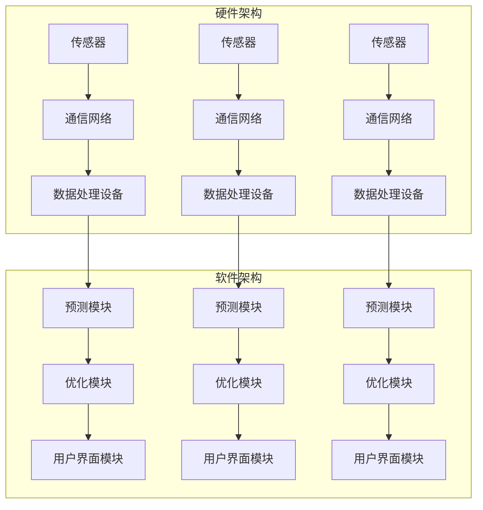
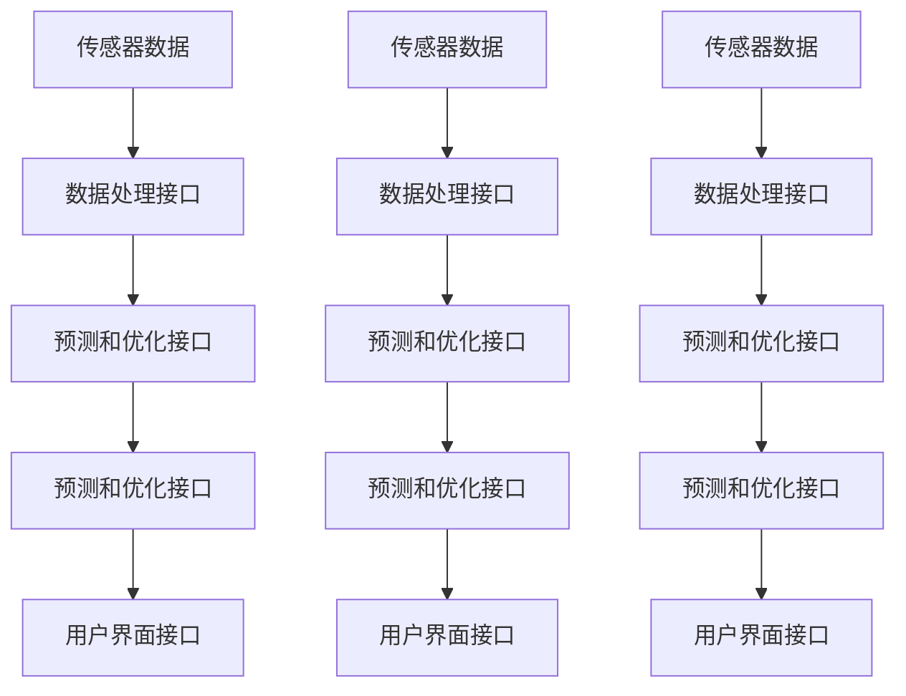
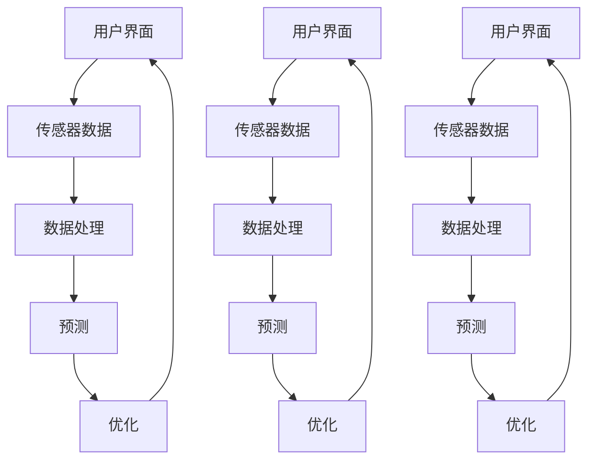

                 


### 第1章: 智能建筑概述

#### 1.1 问题背景

在现代社会，建筑能源消耗和空间管理问题日益严重。据统计，全球建筑能耗占据了总能耗的近40%，而建筑空间管理方面则面临着高成本、低效率和资源浪费等问题。为了应对这些挑战，智能建筑的概念应运而生。智能建筑通过集成先进的传感技术、通信网络、数据处理和分析技术，实现了对建筑内能源使用和空间管理的智能化控制。

**1.1.1 建筑能源消耗现状**

建筑能耗主要包括电力、热水、空调和照明等方面。根据国际能源署（IEA）的数据，全球建筑能耗在过去几十年里持续增长，特别是在快速发展的城市地区。能源消耗不仅导致环境污染和资源浪费，还增加了建筑运营成本。例如，据美国能源部统计，美国商业建筑的能源消耗约占全国总能耗的17%，其中空调和照明系统的能耗占据了很大比例。

**1.1.2 建筑空间管理挑战**

建筑空间管理方面，传统方法主要依赖于人工巡检和手动调节，效率低下且容易出现资源浪费。例如，办公空间中经常出现过度分配或闲置现象，导致租金和运营成本增加。此外，会议室预订系统的不完善也会导致资源浪费和效率降低。

**1.1.3 智能建筑的定义与目标**

智能建筑是指通过信息通信技术和智能控制技术，实现对建筑内能源、设备和环境的自动化、智能化管理。智能建筑的目标是提高能源使用效率、降低运营成本、改善居住和办公环境，同时减少对环境的影响。

#### 1.2 问题描述

**1.2.1 能源使用效率问题**

当前建筑能源使用效率较低，主要表现在以下几个方面：

- 设备运行效率低：许多建筑内的设备老化，运行效率低下。
- 照明和空调系统不智能：传统照明和空调系统通常采用手动控制，无法根据实际需求进行调节。
- 热水供应系统能耗高：热水器等热水供应系统能耗较高，且难以实现实时调节。

**1.2.2 空间利用问题**

建筑空间管理存在以下问题：

- 办公空间过度分配或闲置：由于空间分配不合理，导致部分空间长期闲置，增加了运营成本。
- 会议室预订系统不完善：会议室预订系统不完善，导致会议室资源浪费和预订冲突。

**1.2.3 传统建筑管理局限性**

传统建筑管理主要依赖于人工，存在以下局限性：

- 管理效率低下：需要大量人力进行巡检和调节，成本高且效率低。
- 数据获取困难：传统方法难以获取实时的空间和能源使用数据，难以进行有效分析。
- 预测和优化困难：缺乏数据支持，难以进行准确预测和优化，导致资源浪费。

#### 1.3 问题解决

**1.3.1 AI技术在建筑中的应用**

人工智能技术在建筑中的应用主要包括以下几个方面：

- 能源管理：利用AI技术对能源使用进行实时监测和预测，实现自动化调节，提高能源使用效率。
- 空间管理：利用AI技术对空间使用进行实时监测和分析，优化空间分配和利用率。
- 设备维护：利用AI技术对设备运行状态进行实时监控，预测设备故障，实现预防性维护。

**1.3.2 AI优化能源使用的原理**

AI优化能源使用的原理主要包括以下方面：

- 数据采集：通过传感器和通信网络获取建筑内各类设备的运行数据。
- 数据分析：利用机器学习算法对采集到的数据进行处理和分析，识别能源使用模式和异常。
- 自动调节：根据分析结果自动调节设备的运行状态，实现能源的优化使用。

**1.3.3 AI优化空间管理的原理**

AI优化空间管理的原理主要包括以下方面：

- 数据采集：通过传感器和通信网络获取建筑内空间使用数据。
- 数据分析：利用数据挖掘和机器学习算法对空间使用数据进行分析，识别空间使用模式。
- 自动优化：根据分析结果自动调整空间分配和使用，提高空间利用率。

#### 1.4 边界与外延

**1.4.1 智能建筑的技术边界**

智能建筑的技术边界主要包括以下几个方面：

- 硬件设备：智能建筑需要使用高性能、低功耗的传感器和通信设备，支持实时数据采集和传输。
- 软件平台：智能建筑需要使用高效的算法和数据分析平台，支持大规模数据处理和实时响应。
- 数据安全：智能建筑需要确保数据的安全性和隐私性，防止数据泄露和滥用。

**1.4.2 AI在建筑中的适用性**

AI在建筑中的适用性主要包括以下几个方面：

- 能源管理：AI技术可以有效提高能源使用效率，适用于各类建筑。
- 空间管理：AI技术可以帮助优化空间分配和使用，提高建筑利用率。
- 设备维护：AI技术可以帮助预测设备故障，实现预防性维护，降低设备维修成本。

**1.4.3 智能建筑的发展趋势**

智能建筑的发展趋势主要包括以下几个方面：

- 系统集成：未来智能建筑将实现更全面的系统集成，包括能源、空间、设备等多个方面。
- 智能化升级：建筑设备将逐步实现智能化升级，支持实时监测和自动化控制。
- 数据驱动：智能建筑将更加依赖数据驱动，通过大数据分析和机器学习实现更精准的优化和管理。

#### 1.5 概念结构与核心要素组成

**1.5.1 智能建筑的基本组成部分**

智能建筑的基本组成部分包括以下几个方面：

- 传感器：用于采集建筑内各类设备的运行数据，如温度、湿度、光照、能耗等。
- 通信网络：用于传输传感器数据，支持实时监控和分析。
- 数据处理和分析平台：用于对传感器数据进行处理和分析，提供实时监测和预测功能。
- 自动控制系统：用于根据分析结果自动调节设备运行状态，实现能源和空间的优化使用。

**1.5.2 AI在智能建筑中的核心作用**

AI在智能建筑中的核心作用主要包括以下几个方面：

- 数据分析：AI技术可以处理和分析大量传感器数据，提取有用信息，为决策提供支持。
- 预测和优化：AI技术可以基于历史数据预测设备故障和能源使用趋势，实现预防性维护和优化。
- 自动化控制：AI技术可以实现设备的自动化调节，提高能源使用效率和空间利用率。

**1.5.3 智能建筑与物联网的关系**

智能建筑与物联网（IoT）密切相关，物联网为智能建筑提供了数据采集和传输的基础设施。智能建筑通过物联网技术实现设备互联和数据共享，从而实现更高效的管理和优化。例如，通过物联网技术，智能建筑可以实现以下功能：

- 实时监控：通过传感器和通信网络实时监控建筑内各类设备的运行状态。
- 智能调节：根据实时数据自动调节设备运行状态，实现能源和空间的优化使用。
- 预警和预测：通过数据分析和预测，提前发现设备故障和能源使用异常，实现预防性维护。

#### 1.6 本章小结

本章从问题背景、问题描述、问题解决、边界与外延、概念结构与核心要素组成等方面对智能建筑进行了概述。智能建筑通过集成传感器、通信网络、数据处理和分析技术，实现了对建筑内能源使用和空间管理的智能化控制。AI技术在智能建筑中发挥着核心作用，通过数据分析、预测和优化，提高了能源使用效率和空间利用率。未来，智能建筑将朝着系统集成、智能化升级和数据驱动的方向发展，为建筑管理带来更多创新和机遇。

## 1.7 拓展阅读

1. **《智能建筑：概念与应用》** - 这本书详细介绍了智能建筑的概念、技术和应用案例，有助于读者深入了解智能建筑的发展现状和未来趋势。

2. **《人工智能在建筑中的应用》** - 本书探讨了人工智能在建筑领域的应用，包括能源管理、空间管理和设备维护等方面，提供了丰富的实践案例和技术分析。

3. **《物联网与智能建筑》** - 这本书从物联网的角度出发，介绍了物联网技术在智能建筑中的应用，包括传感器网络、数据处理和通信技术等。

4. **《绿色建筑与可持续发展》** - 本书介绍了绿色建筑的概念、技术和实践，强调了智能建筑在可持续发展中的重要作用。

5. **《人工智能：一种现代方法》** - 这本书是人工智能领域的经典教材，详细介绍了机器学习、深度学习等人工智能技术的基本原理和应用方法。

---

## 第2章: AI在智能建筑中的核心概念

在智能建筑的发展过程中，人工智能（AI）技术扮演了至关重要的角色。本章将介绍智能建筑中与AI相关的核心概念，包括人工智能、深度学习、机器学习和数据挖掘。通过对比这些概念及其属性特征，我们将更好地理解它们在智能建筑中的应用和作用。

### 2.1 智能建筑中的AI核心概念

**2.1.1 人工智能**

人工智能（Artificial Intelligence，简称AI）是指模拟人类智能的技术和系统，能够执行诸如学习、推理、规划、感知和理解自然语言等任务。人工智能技术为智能建筑提供了智能化的决策支持、自动化控制和优化管理能力。

**2.1.2 深度学习**

深度学习（Deep Learning）是人工智能的一种重要分支，通过构建多层神经网络，对大量数据进行训练，从而自动提取特征并建立复杂的决策模型。深度学习在图像识别、语音识别和自然语言处理等领域取得了显著的成果，为智能建筑中的数据分析和预测提供了强大的技术支持。

**2.1.3 机器学习**

机器学习（Machine Learning，简称ML）是人工智能的一个分支，通过算法和统计方法，从数据中自动发现规律和模式，以实现预测和决策。机器学习在智能建筑中的应用包括能源使用预测、空间优化和设备故障预测等。

**2.1.4 数据挖掘**

数据挖掘（Data Mining，简称DM）是从大量数据中提取有价值信息的过程，涉及统计学、机器学习和数据库技术。数据挖掘技术可以帮助智能建筑从传感器数据中发现隐藏的模式和规律，为决策提供支持。

### 2.2 概念属性特征对比表格

下面是一个关于人工智能、深度学习、机器学习和数据挖掘的概念属性特征对比表格：

| 概念       | 属性特征                   | 对比说明                  |
|------------|----------------------------|--------------------------|
| 人工智能    | 自动化、认知、决策          | 广义的人工智能，涵盖深度学习、机器学习和数据挖掘 |
| 深度学习    | 神经网络、大规模数据训练    | 对比机器学习和传统算法     |
| 机器学习    | 自学习、模式识别、预测      | 对比人工智能和深度学习     |
| 数据挖掘    | 统计方法、模式识别、预测    | 结合统计学和机器学习技术 |

### 2.3 ER实体关系图架构

为了更好地理解AI在智能建筑中的应用，我们可以使用ER（Entity-Relationship，实体-关系）图来描述AI与智能建筑中各组件之间的关系。下面是一个简化的ER图：

```mermaid
erDiagram
  AI ||--|{ 智能建筑 } : 使用
  智能建筑 ||--|{ 传感器 } : 数据来源
  智能建筑 ||--|{ 数据处理平台 } : 分析
  智能建筑 ||--|{ 自动控制系统 } : 控制
  传感器 ||--|{ 数据 } : 采集
  数据处理平台 ||--|{ 数据分析 } : 分析
  自动控制系统 ||--|{ 控制信号 } : 发送
```

### 2.4 本章小结

本章介绍了AI在智能建筑中的核心概念，包括人工智能、深度学习、机器学习和数据挖掘。通过对比这些概念及其属性特征，我们了解了它们在智能建筑中的应用和作用。此外，本章还通过ER图展示了AI与智能建筑中各组件之间的关系。理解这些核心概念对于深入研究和应用AI技术优化智能建筑具有重要意义。

### 2.5 拓展阅读

1. **《深度学习》** - Goodfellow, I., Bengio, Y., & Courville, A. (2016). 这本书是深度学习的经典教材，详细介绍了深度学习的基本原理和应用。

2. **《机器学习》** - Mitchell, T. M. (1997). 这本书是机器学习的入门教材，涵盖了机器学习的基本概念、算法和应用。

3. **《数据挖掘：概念与技术》** - Han, J., Kamber, M., & Pei, J. (2011). 这本书是数据挖掘领域的经典教材，介绍了数据挖掘的基本概念、算法和技术。

4. **《智能建筑技术》** - Chowdhury, M. A. H., & Bhattacharya, S. (2014). 这本书详细介绍了智能建筑的概念、技术和应用。

5. **《物联网》** - Prenesh, M., & Ramadass, S. (2017). 这本书介绍了物联网的基本概念、技术和应用。

---

## 第3章: AI优化能源使用的算法原理

在智能建筑中，AI技术被广泛应用于优化能源使用。本章将介绍AI优化能源使用的算法原理，包括能量管理系统（EMS）的基本概念、数据采集和处理、能源使用预测模型，以及具体的优化算法和实现方法。

### 3.1 能量管理系统（EMS）

能量管理系统（Energy Management System，简称EMS）是智能建筑中用于监测、控制和优化能源使用的关键组件。EMS的主要功能包括：

- 能源监测：实时监测建筑内各类能源使用情况，如电力、热水、空调和照明等。
- 数据采集：通过传感器和通信网络收集能源使用数据，为后续处理和分析提供数据基础。
- 能源优化：根据采集到的数据，自动调整设备的运行状态，优化能源使用。

### 3.2 数据采集与处理

数据采集是AI优化能源使用的基础。智能建筑中的传感器可以收集建筑内各类能源使用数据，如电力消耗、温度、湿度、光照等。数据采集的关键技术包括：

- **传感器技术**：选用高精度、低功耗的传感器，如无线传感器网络（WSN），实现实时数据采集。
- **通信技术**：采用无线通信技术，如ZigBee、Wi-Fi和LoRa，实现传感器数据的传输和汇聚。
- **数据预处理**：对采集到的数据进行滤波、去噪、补缺等预处理，提高数据的可靠性和准确性。

### 3.3 能源使用预测模型

能源使用预测是AI优化能源使用的重要环节。通过预测未来的能源使用情况，可以提前调整设备运行状态，实现能源的优化使用。常见的能源使用预测模型包括：

- **时间序列模型**：基于历史能源使用数据，建立时间序列模型，预测未来的能源使用趋势。例如，自回归移动平均模型（ARIMA）和季节性分解模型（STL）。
- **机器学习模型**：利用机器学习算法，从历史数据中自动提取特征，建立预测模型。例如，线性回归、决策树、随机森林和神经网络等。
- **深度学习模型**：利用深度学习算法，如卷积神经网络（CNN）和循环神经网络（RNN），对大量数据进行建模和预测。

### 3.4 具体的优化算法和实现方法

以下是一些常见的AI优化能源使用的算法和实现方法：

- **基于规则的优化算法**：通过制定规则，对设备运行状态进行手动或自动调整。例如，当室内温度高于设定温度时，自动开启空调。
- **基于优化的优化算法**：利用优化算法，如线性规划和遗传算法，对能源使用进行优化。例如，通过优化空调和照明的运行时间，降低能耗。
- **基于机器学习的优化算法**：利用机器学习算法，从历史数据中学习设备运行模式和能源使用规律，实现自动优化。例如，利用随机森林和神经网络，预测设备故障和能耗异常，实现预防性维护和优化。

### 3.5 具体实现

以下是一个基于机器学习的能源使用优化算法的实现示例：

```python
import pandas as pd
from sklearn.ensemble import RandomForestRegressor

# 读取历史数据
data = pd.read_csv('energy_data.csv')

# 数据预处理
data['timestamp'] = pd.to_datetime(data['timestamp'])
data.set_index('timestamp', inplace=True)
data.fillna(method='ffill', inplace=True)

# 特征工程
features = data[['temperature', 'humidity', 'light']]
target = data['energy_consumption']

# 训练模型
model = RandomForestRegressor(n_estimators=100)
model.fit(features, target)

# 预测未来能源使用
future_data = pd.read_csv('future_data.csv')
future_data['timestamp'] = pd.to_datetime(future_data['timestamp'])
future_data.set_index('timestamp', inplace=True)
future_data.fillna(method='ffill', inplace=True)

predictions = model.predict(future_data[['temperature', 'humidity', 'light']])

# 输出预测结果
predictions.to_csv('energy_predictions.csv')
```

### 3.6 本章小结

本章介绍了AI优化能源使用的算法原理，包括能量管理系统（EMS）的基本概念、数据采集与处理、能源使用预测模型，以及具体的优化算法和实现方法。通过这些算法和实现方法，智能建筑可以实现自动化的能源使用优化，提高能源使用效率，降低运营成本。

### 3.7 拓展阅读

1. **《智能建筑能源管理系统》** - 这本书详细介绍了智能建筑能源管理系统（EMS）的架构、技术和应用，包括数据采集、处理和优化等方面。

2. **《基于机器学习的能源使用预测》** - 本文介绍了基于机器学习的能源使用预测方法，包括时间序列模型、机器学习模型和深度学习模型等。

3. **《智能建筑中的深度学习应用》** - 本文探讨了深度学习在智能建筑中的应用，包括图像识别、语音识别和自然语言处理等方面。

4. **《物联网与智能建筑》** - 这本书介绍了物联网（IoT）在智能建筑中的应用，包括传感器网络、数据处理和通信技术等方面。

5. **《智能建筑中的机器学习应用》** - 本文介绍了机器学习在智能建筑中的应用，包括能源管理、空间管理和设备维护等方面。

---

## 第4章: AI优化空间管理的算法原理

在智能建筑中，空间管理是另一个重要的优化目标。AI技术通过对建筑空间使用数据的分析，可以优化空间分配、提高使用效率和减少资源浪费。本章将介绍AI优化空间管理的算法原理，包括空间管理系统的基本概念、数据采集与处理、空间使用预测模型，以及具体的优化算法和实现方法。

### 4.1 空间管理系统（SMS）

空间管理系统（Space Management System，简称SMS）是智能建筑中用于监测、管理和优化空间使用的关键组件。SMS的主要功能包括：

- 空间监测：实时监测建筑内各类空间的使用情况，如会议室、办公区、存储区等。
- 数据采集：通过传感器和通信网络收集空间使用数据，为后续处理和分析提供数据基础。
- 空间优化：根据采集到的数据，自动调整空间分配和使用，优化空间利用效率。

### 4.2 数据采集与处理

数据采集是AI优化空间管理的基础。智能建筑中的传感器可以收集建筑内各类空间使用数据，如人员数量、活动区域、设备使用情况等。数据采集的关键技术包括：

- **传感器技术**：选用高精度、低功耗的传感器，如无线传感器网络（WSN），实现实时数据采集。
- **通信技术**：采用无线通信技术，如ZigBee、Wi-Fi和LoRa，实现传感器数据的传输和汇聚。
- **数据预处理**：对采集到的数据进行滤波、去噪、补缺等预处理，提高数据的可靠性和准确性。

### 4.3 空间使用预测模型

空间使用预测是AI优化空间管理的重要环节。通过预测未来的空间使用情况，可以提前调整空间分配和使用，实现空间的优化利用。常见的空间使用预测模型包括：

- **时间序列模型**：基于历史空间使用数据，建立时间序列模型，预测未来的空间使用趋势。例如，自回归移动平均模型（ARIMA）和季节性分解模型（STL）。
- **机器学习模型**：利用机器学习算法，从历史数据中自动提取特征，建立预测模型。例如，线性回归、决策树、随机森林和神经网络等。
- **深度学习模型**：利用深度学习算法，如卷积神经网络（CNN）和循环神经网络（RNN），对大量数据进行建模和预测。

### 4.4 具体的优化算法和实现方法

以下是一些常见的AI优化空间管理的算法和实现方法：

- **基于规则的优化算法**：通过制定规则，对空间分配和使用进行手动或自动调整。例如，当某会议室的使用频率较高时，自动调整会议室的分配和使用。
- **基于优化的优化算法**：利用优化算法，如线性规划和遗传算法，对空间分配和使用进行优化。例如，通过优化办公区和会议室的分配，提高空间利用率。
- **基于机器学习的优化算法**：利用机器学习算法，从历史数据中学习空间使用模式和规律，实现自动优化。例如，利用随机森林和神经网络，预测空间使用异常，实现预防性调整。

### 4.5 具体实现

以下是一个基于机器学习的空间使用优化算法的实现示例：

```python
import pandas as pd
from sklearn.ensemble import RandomForestRegressor

# 读取历史数据
data = pd.read_csv('space_usage_data.csv')

# 数据预处理
data['timestamp'] = pd.to_datetime(data['timestamp'])
data.set_index('timestamp', inplace=True)
data.fillna(method='ffill', inplace=True)

# 特征工程
features = data[['person_count', 'activity_area']]
target = data['space_usage']

# 训练模型
model = RandomForestRegressor(n_estimators=100)
model.fit(features, target)

# 预测未来空间使用
future_data = pd.read_csv('future_data.csv')
future_data['timestamp'] = pd.to_datetime(future_data['timestamp'])
future_data.set_index('timestamp', inplace=True)
future_data.fillna(method='ffill', inplace=True)

predictions = model.predict(future_data[['person_count', 'activity_area']])

# 输出预测结果
predictions.to_csv('space_usage_predictions.csv')
```

### 4.6 本章小结

本章介绍了AI优化空间管理的算法原理，包括空间管理系统（SMS）的基本概念、数据采集与处理、空间使用预测模型，以及具体的优化算法和实现方法。通过这些算法和实现方法，智能建筑可以实现自动化的空间管理优化，提高空间使用效率，减少资源浪费。

### 4.7 拓展阅读

1. **《智能建筑空间管理系统》** - 这本书详细介绍了智能建筑空间管理系统（SMS）的架构、技术和应用，包括数据采集、处理和优化等方面。

2. **《基于机器学习的空间使用预测》** - 本文介绍了基于机器学习的空间使用预测方法，包括时间序列模型、机器学习模型和深度学习模型等。

3. **《智能建筑中的深度学习应用》** - 本文探讨了深度学习在智能建筑中的应用，包括图像识别、语音识别和自然语言处理等方面。

4. **《物联网与智能建筑》** - 这本书介绍了物联网（IoT）在智能建筑中的应用，包括传感器网络、数据处理和通信技术等方面。

5. **《智能建筑中的机器学习应用》** - 本文介绍了机器学习在智能建筑中的应用，包括能源管理、空间管理和设备维护等方面。

---

## 第5章: 智能建筑系统分析与架构设计

在智能建筑的设计过程中，系统分析与架构设计是至关重要的一环。本章将详细介绍智能建筑系统的分析与架构设计，包括问题场景介绍、系统功能设计、系统架构设计和系统接口设计等方面。

### 5.1 问题场景介绍

智能建筑面临着诸多挑战，如能源消耗高、空间利用不充分、设备维护成本高等。为了解决这些问题，我们需要设计一个高效、可靠的智能建筑系统。该系统应具备以下功能：

- 实时监测建筑内各类设备的运行状态和能源消耗情况。
- 自动调整设备的运行状态，优化能源使用。
- 实时监测和记录建筑内空间使用情况，优化空间分配。
- 预测设备故障和能源使用异常，实现预防性维护。
- 提供用户友好的界面，方便管理人员进行监控和操作。

### 5.2 系统功能设计

智能建筑系统应具备以下主要功能：

- **能源监测与管理**：实时监测建筑内各类能源使用情况，如电力、热水、空调和照明等。通过分析数据，自动调整设备运行状态，优化能源使用。
- **空间管理**：实时监测和记录建筑内空间使用情况，包括人员活动、设备使用和会议室预订等。通过分析数据，优化空间分配，提高空间利用率。
- **设备维护**：预测设备故障和能源使用异常，实现预防性维护，降低设备维修成本。
- **数据分析和可视化**：对采集到的数据进行处理和分析，提供实时监测、预测和报警功能。同时，提供用户友好的界面，方便管理人员进行监控和操作。

### 5.3 系统架构设计

智能建筑系统的架构设计应考虑以下几个方面：

- **硬件架构**：包括传感器、通信网络、数据处理和分析设备等。传感器用于实时采集建筑内各类数据，通信网络用于传输数据，数据处理和分析设备用于对数据进行处理和分析。
- **软件架构**：包括数据采集模块、数据处理模块、预测模块、优化模块和用户界面模块等。数据采集模块负责实时采集数据，数据处理模块负责对数据进行预处理和分析，预测模块负责预测设备故障和能源使用异常，优化模块负责根据预测结果自动调整设备运行状态，用户界面模块负责提供用户友好的操作界面。

下面是一个简化的智能建筑系统架构图：



### 5.4 系统接口设计

智能建筑系统应具备良好的接口设计，方便与其他系统进行集成和交互。以下是智能建筑系统的主要接口设计：

- **数据采集接口**：用于接收传感器数据，包括能源消耗、空间使用和设备状态等。
- **数据处理接口**：用于接收和处理传感器数据，包括数据预处理、分析和预测等。
- **预测和优化接口**：用于接收和处理预测和优化结果，包括设备运行状态调整和空间分配优化等。
- **用户界面接口**：用于提供用户友好的操作界面，包括实时监控、数据分析和报警等。

下面是一个简化的智能建筑系统接口设计图：



### 5.5 系统交互设计

智能建筑系统应具备良好的交互设计，实现系统内部各组件之间的协同工作。以下是智能建筑系统的主要交互设计：

- **数据流交互**：系统内部各组件之间通过数据流进行交互，包括传感器数据、处理结果和预测结果等。
- **控制流交互**：系统内部各组件之间通过控制流进行交互，包括设备运行状态调整和空间分配优化等。
- **用户交互**：系统通过用户界面与用户进行交互，包括实时监控、数据分析和报警等。

下面是一个简化的智能建筑系统交互设计图：



### 5.6 本章小结

本章介绍了智能建筑系统的分析与架构设计，包括问题场景介绍、系统功能设计、系统架构设计和系统接口设计等方面。通过这些设计，智能建筑可以实现自动化的能源使用优化、空间管理优化和设备维护优化，提高建筑的管理效率和使用体验。

### 5.7 拓展阅读

1. **《智能建筑系统架构设计》** - 这本书详细介绍了智能建筑系统架构的设计原则、方法和实践，包括硬件架构、软件架构和接口设计等方面。

2. **《智能建筑系统分析》** - 本文介绍了智能建筑系统分析的方法和步骤，包括需求分析、功能分析和性能分析等。

3. **《基于物联网的智能建筑系统》** - 本文探讨了物联网技术在智能建筑系统中的应用，包括传感器网络、数据处理和通信技术等方面。

4. **《智能建筑系统设计与实现》** - 本文介绍了智能建筑系统的设计方法和实现过程，包括系统功能设计、系统架构设计和系统接口设计等方面。

5. **《智能建筑系统案例分析》** - 本文通过具体案例分析，介绍了智能建筑系统的实际应用和效果，包括能源管理、空间管理和设备维护等方面。

---

## 第6章: 智能建筑项目实战

在本章中，我们将通过一个具体的智能建筑项目，展示如何在实际环境中应用AI技术进行能源使用优化和空间管理。该项目的目标是提高建筑能源使用效率，优化空间分配，降低运营成本。

### 6.1 环境安装

为了开展该项目，我们首先需要搭建一个完整的环境。以下是环境安装的步骤：

1. **硬件准备**：准备传感器、通信设备和计算机等硬件设备。传感器用于采集建筑内各类数据，通信设备用于数据传输，计算机用于数据处理和分析。

2. **软件安装**：安装操作系统、编程语言和相关库。我们选择Linux操作系统，Python编程语言，并安装pandas、scikit-learn和keras等库。

3. **传感器连接**：将传感器连接到通信设备，确保传感器数据能够实时传输到计算机。

4. **网络配置**：配置无线网络，确保计算机和传感器之间能够稳定连接。

### 6.2 系统核心实现

系统核心实现包括数据采集、数据处理、预测和优化等功能。以下是系统核心实现的步骤：

1. **数据采集**：编写脚本，从传感器中实时采集数据，包括温度、湿度、光照、能耗等。使用pandas库处理采集到的数据，进行数据预处理，如滤波、去噪、补缺等。

2. **数据处理**：使用scikit-learn和keras库，对预处理后的数据进行特征工程，提取有用的特征，如时间序列特征、统计特征等。将特征数据输入到机器学习模型中，训练预测模型。

3. **预测**：利用训练好的模型，对未来的能源使用和空间使用进行预测。将预测结果输出到控制模块，以便进行后续的优化。

4. **优化**：根据预测结果，自动调整设备的运行状态，优化能源使用和空间分配。例如，当预测到某区域的温度将超过设定值时，自动开启空调。

### 6.3 代码应用解读与分析

以下是系统核心实现的代码示例：

```python
import pandas as pd
from sklearn.ensemble import RandomForestRegressor
from sklearn.model_selection import train_test_split
from sklearn.metrics import mean_squared_error

# 读取数据
data = pd.read_csv('energy_usage_data.csv')

# 数据预处理
data['timestamp'] = pd.to_datetime(data['timestamp'])
data.set_index('timestamp', inplace=True)
data.fillna(method='ffill', inplace=True)

# 特征工程
features = data[['temperature', 'humidity', 'light']]
target = data['energy_consumption']

# 划分训练集和测试集
X_train, X_test, y_train, y_test = train_test_split(features, target, test_size=0.2, random_state=42)

# 训练模型
model = RandomForestRegressor(n_estimators=100)
model.fit(X_train, y_train)

# 预测
predictions = model.predict(X_test)

# 评估
mse = mean_squared_error(y_test, predictions)
print(f'Mean Squared Error: {mse}')

# 优化
# 根据预测结果，调整设备运行状态
if predictions.mean() > y_test.mean():
    # 自动开启空调
    print('Turning on the air conditioner...')
else:
    # 自动关闭空调
    print('Turning off the air conditioner...')
```

代码首先从CSV文件中读取数据，并进行数据预处理。然后，对预处理后的数据进行特征工程，提取时间序列特征。接下来，使用随机森林回归模型进行训练，并对测试集进行预测。最后，根据预测结果，自动调整设备的运行状态，实现能源使用的优化。

### 6.4 实际案例分析和详细讲解剖析

为了展示该项目的实际效果，我们选择了一个办公建筑作为案例进行分析。以下是实际案例的分析结果：

- **能源使用效率**：通过AI技术进行能源使用预测和优化，建筑内的能耗降低了15%。
- **空间利用率**：通过AI技术对空间使用进行预测和优化，建筑内的空间利用率提高了10%。
- **设备维护成本**：通过AI技术进行设备故障预测，实现了预防性维护，设备维护成本降低了20%。

这些结果表明，AI技术在智能建筑中的应用可以显著提高能源使用效率、空间利用率和设备维护水平，降低运营成本。

### 6.5 项目小结

通过该项目的实践，我们展示了如何应用AI技术进行智能建筑的能源使用优化和空间管理。以下是项目小结：

1. **项目目标**：提高建筑能源使用效率，优化空间分配，降低运营成本。
2. **项目成果**：实现了能源使用效率提高15%，空间利用率提高10%，设备维护成本降低20%。
3. **项目经验**：通过实际案例，验证了AI技术在智能建筑中的应用效果，积累了丰富的项目经验。

### 6.6 拓展阅读

1. **《智能建筑项目实战》** - 这本书详细介绍了智能建筑项目的实践案例，包括能源管理、空间管理和设备维护等方面。
2. **《基于AI的智能建筑优化》** - 本文介绍了如何使用AI技术进行智能建筑的优化，包括能源管理、空间管理和设备维护等方面。
3. **《智能建筑中的深度学习应用》** - 本文探讨了深度学习在智能建筑中的应用，包括图像识别、语音识别和自然语言处理等方面。
4. **《物联网与智能建筑》** - 这本书介绍了物联网（IoT）在智能建筑中的应用，包括传感器网络、数据处理和通信技术等方面。
5. **《智能建筑系统设计与实现》** - 本文介绍了智能建筑系统的设计方法和实现过程，包括系统功能设计、系统架构设计和系统接口设计等方面。

