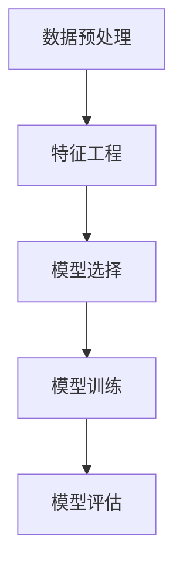
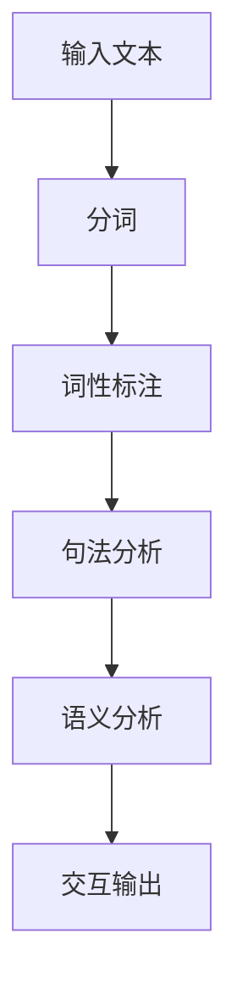
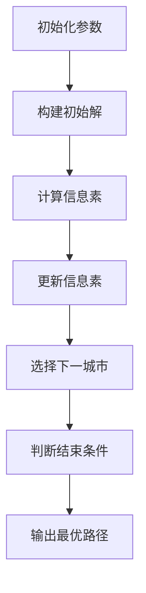
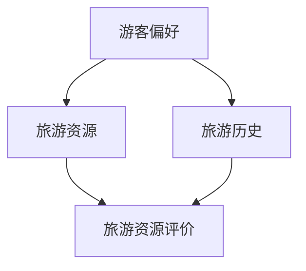
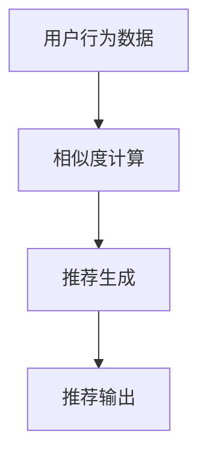
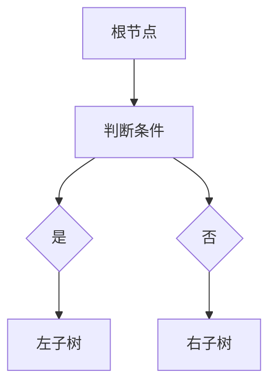
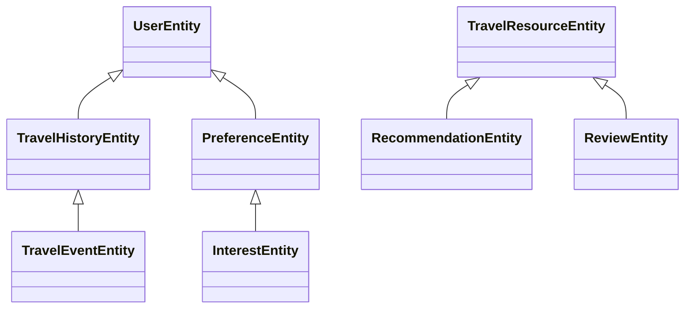
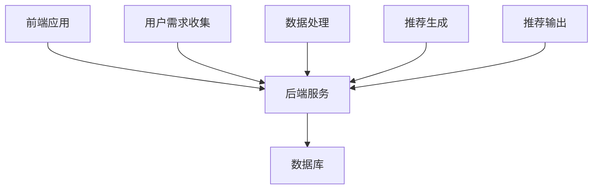
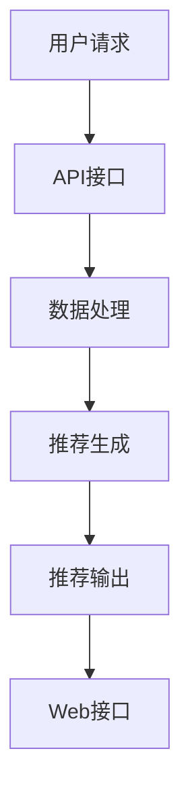
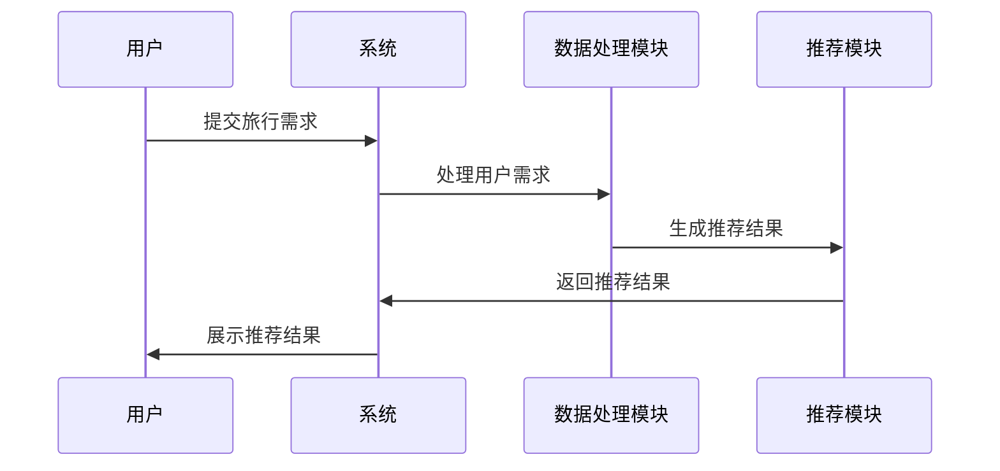

                 

# 智能旅游：AI个性化旅行规划与推荐

> 关键词：智能旅游，AI技术，个性化推荐，旅行规划，算法原理，系统架构设计

> 摘要：本文旨在探讨智能旅游领域中的AI个性化旅行规划与推荐技术。首先，我们介绍了智能旅游的背景和问题描述，然后深入分析了核心概念与联系，详细讲解了算法原理和数学模型，并提出了系统分析与架构设计方案。通过项目实战和最佳实践，我们展示了智能旅游技术的实际应用，旨在为读者提供全面的智能旅游技术指南。

## 第一部分：背景介绍

### 1. 问题背景

随着科技的飞速发展，人工智能（AI）技术已经成为现代社会的重要驱动力。在旅游业领域，AI技术的应用带来了前所未有的变革。传统旅游模式以固定化的服务和资源为主，无法满足游客对于个性化、智能化体验的需求。为了适应这一变化，智能旅游作为一种新兴的旅游模式应运而生。智能旅游通过整合AI技术，为游客提供个性化的旅游服务，包括智能推荐、智能规划、智能导览等，从而提升游客的整体旅游体验。

### 2. 问题描述

智能旅游的关键在于AI技术的应用，如何利用AI技术为游客提供个性化、智能化的旅游服务成为了亟待解决的问题。个性化旅行规划与推荐是智能旅游的重要组成部分，涉及到数据挖掘、机器学习、自然语言处理等技术。具体而言，个性化旅行规划需要根据游客的兴趣偏好和历史行为数据，为其推荐符合其需求的旅游目的地、活动和路线。而个性化推荐则需在庞大的旅游资源库中，筛选出符合游客喜好的景点、餐厅和购物地点等。

### 3. 问题解决

本书旨在探讨如何利用AI技术进行个性化旅行规划与推荐。通过介绍相关技术原理和应用案例，帮助读者理解和掌握智能旅游的核心技术。文章将分为以下几个部分：首先，介绍智能旅游的背景和核心概念；其次，深入分析AI个性化旅行规划与推荐的算法原理；然后，详细讲解系统分析与架构设计方案；接着，通过项目实战展示智能旅游技术的实际应用；最后，提供最佳实践和注意事项。

### 4. 边界与外延

智能旅游不仅局限于传统的旅游场景，还可以延伸到户外探险、文化体验等多种旅游形式。同时，智能旅游的发展也将推动旅游业与其他行业的深度融合，如与电子商务、大数据、物联网等技术的结合，为旅游业带来更多的创新和发展空间。智能旅游的核心概念包括个性化旅行规划、智能推荐、智能导览、智能问答等，这些概念构成了智能旅游的技术框架。

### 5. 概念结构与核心要素组成

智能旅游的核心概念包括：

- **个性化旅行规划**：基于游客的兴趣偏好和历史行为数据，为游客提供定制化的旅行计划。
- **智能推荐**：通过分析游客的旅行需求和偏好，推荐符合其需求的旅游目的地、活动和路线。
- **智能导览**：利用AI技术，为游客提供实时的景点介绍、路线指引和语音讲解服务。
- **智能问答**：通过自然语言处理技术，为游客提供智能化的问答服务，解答游客在旅行过程中遇到的各种问题。

核心要素包括：

- **旅游数据**：包括游客的兴趣偏好、历史行为数据、旅游资源数据等。
- **AI算法**：用于个性化旅行规划和推荐的机器学习算法、数据挖掘算法等。
- **用户界面**：提供与游客交互的前端界面，实现个性化推荐和智能导览等功能。

## 第二部分：核心概念与联系

### 2.1 AI个性化旅行规划原理

#### 2.1.1 数据挖掘

数据挖掘是AI个性化旅行规划的基础。通过对大量旅游数据的挖掘，可以提取出游客的兴趣偏好和旅行需求。具体而言，数据挖掘过程包括数据收集、数据预处理、特征提取和模式识别等步骤。在旅游数据中，常见的特征包括游客的年龄、性别、旅行历史、消费习惯、兴趣爱好等。

**ER实体关系图架构：**

```mermaid
erDiagram
    User ||--|{ TravelHistory : 包含 }
    User ||--|{ Preference : 包含 }
    TravelResource ||--|{ Recommendation : 推荐资源 }
    TravelHistory ||--|{ TravelEvent : 包含 }
    Preference ||--|{ Interest : 包含 }
    TravelResource ||--|{ Review : 评价 }
```

#### 2.1.2 机器学习

机器学习是实现个性化旅行规划的关键技术。通过训练机器学习模型，可以预测游客的未来旅行需求和偏好。常见的机器学习算法包括线性回归、决策树、随机森林、支持向量机等。机器学习模型的学习过程主要包括数据预处理、特征工程、模型选择、模型训练和模型评估等步骤。

**机器学习算法流程图：**



#### 2.1.3 自然语言处理

自然语言处理是智能导览和智能问答的核心技术。它能够理解和处理人类语言，为游客提供自然的交互体验。自然语言处理过程包括分词、词性标注、句法分析、语义分析等步骤。在智能旅游中，自然语言处理技术可以用于实现智能问答、语音导览、文本推荐等功能。

**自然语言处理流程图：**



## 第三部分：算法原理讲解

### 3.1 个性化旅行规划算法

#### 3.1.1 蚁群算法

蚁群算法是一种基于群体智能的优化算法，模拟蚂蚁寻找食物的过程，通过信息素更新规则来优化旅行路线。在个性化旅行规划中，蚁群算法可以用于求解最优旅行路线问题。算法的核心思想是通过蚂蚁的随机搜索和群体协作，逐步找到一条最优路径。

**蚁群算法流程图：**



**算法原理：**

蚁群算法通过以下步骤实现个性化旅行规划：

1. **初始解生成**：根据游客的兴趣偏好和初始位置，生成一个初始旅行路线。
2. **信息素更新**：在旅行过程中，每经过一个景点，蚂蚁会在该景点留下信息素。
3. **路径选择**：蚂蚁在选择下一个景点时，会根据当前景点的信息素浓度和其他参数进行决策。
4. **信息素更新**：当所有蚂蚁完成旅行后，更新信息素浓度，以便下一次路径搜索。
5. **路径优化**：通过迭代更新，逐渐找到一条最优的旅行路线。

#### 3.1.2 贝叶斯网络

贝叶斯网络是一种概率图模型，用于表示旅行数据中的不确定性。通过贝叶斯网络，可以预测游客的旅行偏好。贝叶斯网络由节点和边组成，节点表示旅行数据中的变量，边表示变量之间的依赖关系。

**贝叶斯网络流程图：**



**算法原理：**

贝叶斯网络通过以下步骤实现个性化旅行规划：

1. **网络构建**：根据旅行数据，构建贝叶斯网络模型。
2. **概率计算**：通过贝叶斯推理，计算各个变量的条件概率分布。
3. **预测生成**：根据游客的兴趣偏好和历史数据，预测其未来的旅行偏好。

#### 3.1.3 协同过滤算法

协同过滤算法是一种基于用户行为的推荐算法，通过分析用户的历史行为，为用户推荐可能的旅游目的地、活动和路线。协同过滤算法分为基于用户的协同过滤（User-based Collaborative Filtering）和基于项目的协同过滤（Item-based Collaborative Filtering）两种类型。

**协同过滤算法流程图：**



**算法原理：**

协同过滤算法通过以下步骤实现个性化旅行规划：

1. **用户行为数据收集**：收集游客的旅游历史数据，包括浏览记录、消费行为、评价等。
2. **相似度计算**：计算游客之间的相似度，找到与目标用户相似的游客群体。
3. **推荐生成**：根据相似度计算结果，为游客推荐符合其兴趣的旅游目的地和活动。
4. **推荐输出**：将推荐结果反馈给游客，提升其旅游体验。

## 第四部分：数学模型和数学公式

### 4.1 数学模型

在个性化旅行规划中，常见的数学模型包括线性回归、逻辑回归、决策树等。这些模型通过建立游客行为与旅游推荐之间的数学关系，实现个性化推荐。

#### 4.1.1 线性回归模型

线性回归模型是一种常用的预测模型，用于预测连续值。在个性化旅行规划中，可以用来预测游客对某个景点的兴趣得分。线性回归模型的一般形式为：

$$
Y = \beta_0 + \beta_1X + \epsilon
$$

其中，$Y$为游客的旅游偏好得分，$X$为游客的历史行为数据，$\beta_0$和$\beta_1$为模型参数，$\epsilon$为误差项。

#### 4.1.2 逻辑回归模型

逻辑回归模型是一种常用的分类模型，用于预测离散值。在个性化旅行规划中，可以用来预测游客是否会对某个景点产生兴趣。逻辑回归模型的一般形式为：

$$
P(Y=1) = \frac{1}{1 + e^{-(\beta_0 + \beta_1X)}}
$$

其中，$P(Y=1)$为游客对景点产生兴趣的概率，$\beta_0$和$\beta_1$为模型参数。

#### 4.1.3 决策树模型

决策树模型是一种基于树形结构的数据挖掘算法，用于分类和回归分析。在个性化旅行规划中，可以用来预测游客的旅游偏好。决策树模型通过一系列的决策规则，将数据划分为不同的类别或区域。

**决策树模型流程图：**



**算法原理：**

决策树模型通过以下步骤实现个性化旅行规划：

1. **特征选择**：选择影响游客兴趣的重要特征。
2. **划分区域**：根据特征值，将数据划分为不同的区域。
3. **分类预测**：根据划分区域，预测游客的旅游偏好。

### 4.2 数学公式

#### 4.2.1 线性回归模型

线性回归模型的数学公式为：

$$
Y = \beta_0 + \beta_1X + \epsilon
$$

其中：

- $Y$：游客的旅游偏好得分。
- $X$：游客的历史行为数据。
- $\beta_0$：模型截距。
- $\beta_1$：模型斜率。
- $\epsilon$：误差项。

#### 4.2.2 逻辑回归模型

逻辑回归模型的数学公式为：

$$
P(Y=1) = \frac{1}{1 + e^{-(\beta_0 + \beta_1X)}}
$$

其中：

- $P(Y=1)$：游客对景点产生兴趣的概率。
- $\beta_0$：模型截距。
- $\beta_1$：模型斜率。

#### 4.2.3 决策树模型

决策树模型的数学公式为：

$$
f(X) =
\begin{cases}
    left, & \text{if } X \leq c \\
    right, & \text{if } X > c
\end{cases}
$$

其中：

- $f(X)$：决策树模型预测的结果。
- $left$：左子树。
- $right$：右子树。
- $c$：划分阈值。

## 第五部分：系统分析与架构设计方案

### 5.1 问题场景介绍

在智能旅游系统中，用户可以通过应用程序提交旅行需求，系统根据用户需求提供个性化的旅游推荐。这一过程包括用户需求收集、数据处理、推荐生成和推荐输出等步骤。

### 5.2 系统功能设计

系统功能设计包括以下几个主要方面：

1. **用户需求收集**：收集用户的旅行偏好、历史行为数据等，用于后续的个性化推荐。
2. **数据处理**：对收集到的用户数据进行清洗、去重和预处理，以便用于推荐算法。
3. **推荐生成**：利用机器学习算法和协同过滤算法，生成个性化的旅游推荐。
4. **推荐输出**：将推荐结果通过用户界面展示给用户，包括旅游目的地、活动和路线等。

**领域模型类图：**



### 5.3 系统架构设计

系统架构设计包括前端应用、后端服务、数据库等部分。前端应用负责与用户交互，后端服务负责数据处理和推荐，数据库存储用户行为数据。

**系统架构图：**



### 5.4 系统接口设计

系统接口设计包括API接口、Web接口等。API接口用于与其他系统集成，Web接口用于用户与应用的交互。

**系统接口图：**



### 5.5 系统交互

系统交互设计包括用户请求处理、数据处理、推荐结果返回等步骤。

**系统交互序列图：**



## 第六部分：项目实战

### 6.1 环境安装

在开始智能旅游系统的开发之前，我们需要安装相关的环境和工具。以下是安装步骤：

1. **安装Python环境**：首先，确保您的计算机上安装了Python。可以从[Python官网](https://www.python.org/)下载并安装Python。
2. **安装相关库**：使用pip命令安装所需的库，例如NumPy、Pandas、Scikit-learn、Matplotlib等。可以使用以下命令进行安装：

   ```bash
   pip install numpy pandas scikit-learn matplotlib
   ```

3. **安装数据库**：选择一个数据库管理系统，如MySQL或PostgreSQL，并按照官方文档进行安装。

### 6.2 系统核心实现

系统核心实现主要包括用户需求收集、数据处理、推荐生成和推荐输出等模块。

#### 6.2.1 用户需求收集

用户需求收集模块负责从用户界面接收旅行需求，并将其转换为结构化的数据。以下是一个简单的Python代码示例：

```python
import json

def collect_user_demand():
    # 假设用户需求以JSON格式输入
    user_demand = input("请输入您的旅行需求（JSON格式）：")
    user_demand = json.loads(user_demand)
    return user_demand

user_demand = collect_user_demand()
print("收集到的旅行需求：", user_demand)
```

#### 6.2.2 数据处理

数据处理模块负责对用户需求进行清洗、去重和预处理，以便用于推荐算法。以下是一个简单的Python代码示例：

```python
import pandas as pd

def process_data(user_demand):
    # 假设用户需求包含以下字段：age, gender, history, preference
    data = pd.DataFrame([user_demand])
    
    # 数据清洗
    data = data.dropna()
    data = data.drop_duplicates()
    
    # 数据预处理
    # 例如：将性别编码为数字
    data['gender'] = data['gender'].map({'male': 0, 'female': 1})
    
    return data

processed_data = process_data(user_demand)
print("处理后的数据：", processed_data)
```

#### 6.2.3 推荐生成

推荐生成模块负责使用机器学习算法和协同过滤算法生成个性化的旅游推荐。以下是一个简单的Python代码示例：

```python
from sklearn.model_selection import train_test_split
from sklearn.linear_model import LinearRegression
from sklearn.metrics import mean_squared_error

def generate_recommendations(processed_data):
    # 将数据分为训练集和测试集
    X_train, X_test, y_train, y_test = train_test_split(processed_data.drop('preference', axis=1), processed_data['preference'], test_size=0.2, random_state=42)
    
    # 训练线性回归模型
    model = LinearRegression()
    model.fit(X_train, y_train)
    
    # 生成推荐结果
    predictions = model.predict(X_test)
    
    # 评估模型性能
    mse = mean_squared_error(y_test, predictions)
    print("模型均方误差：", mse)
    
    return predictions

recommendations = generate_recommendations(processed_data)
print("生成的推荐结果：", recommendations)
```

#### 6.2.4 推荐输出

推荐输出模块负责将推荐结果通过用户界面展示给用户。以下是一个简单的Python代码示例：

```python
def display_recommendations(recommendations):
    print("根据您的需求，我们为您推荐以下旅游目的地：")
    for i, recommendation in enumerate(recommendations):
        print(f"目的地 {i+1}：", recommendation)

display_recommendations(recommendations)
```

### 6.3 代码应用解读与分析

#### 用户需求收集

用户需求收集模块使用Python的输入函数接收用户输入，并将其解析为JSON格式。这一步骤确保了用户输入的数据可以被结构化处理。

```python
import json

def collect_user_demand():
    user_demand = input("请输入您的旅行需求（JSON格式）：")
    user_demand = json.loads(user_demand)
    return user_demand
```

#### 数据处理

数据处理模块首先对用户需求进行数据清洗，包括去除缺失值和重复值。然后，对性别字段进行编码，以便后续的机器学习算法处理。

```python
import pandas as pd

def process_data(user_demand):
    data = pd.DataFrame([user_demand])
    
    # 数据清洗
    data = data.dropna()
    data = data.drop_duplicates()
    
    # 数据预处理
    data['gender'] = data['gender'].map({'male': 0, 'female': 1})
    
    return data
```

#### 推荐生成

推荐生成模块使用线性回归模型对用户数据进行训练，并生成推荐结果。模型性能通过均方误差（MSE）进行评估。

```python
from sklearn.model_selection import train_test_split
from sklearn.linear_model import LinearRegression
from sklearn.metrics import mean_squared_error

def generate_recommendations(processed_data):
    X_train, X_test, y_train, y_test = train_test_split(processed_data.drop('preference', axis=1), processed_data['preference'], test_size=0.2, random_state=42)
    
    model = LinearRegression()
    model.fit(X_train, y_train)
    
    predictions = model.predict(X_test)
    
    mse = mean_squared_error(y_test, predictions)
    print("模型均方误差：", mse)
    
    return predictions
```

#### 推荐输出

推荐输出模块将生成的推荐结果打印出来，用户可以通过输出结果了解系统为其推荐的旅游目的地。

```python
def display_recommendations(recommendations):
    print("根据您的需求，我们为您推荐以下旅游目的地：")
    for i, recommendation in enumerate(recommendations):
        print(f"目的地 {i+1}：", recommendation)

display_recommendations(recommendations)
```

### 6.4 实际案例分析和详细讲解

#### 案例背景

假设有一位名叫李明的用户，他计划在未来一周内前往北京旅游。他提供了以下旅行需求：

- 年龄：30岁
- 性别：男
- 历史行为：最近一年内曾去过上海和杭州，对自然风光和历史文化景点感兴趣
- 偏好：喜欢品尝当地美食，特别是小吃和火锅

#### 案例分析

1. **用户需求收集**：用户通过应用程序输入了上述旅行需求，系统将其解析为JSON格式。

   ```json
   {
       "age": 30,
       "gender": "male",
       "history": ["上海", "杭州"],
       "preference": {
           "interest": ["自然风光", "历史文化"],
           "food": ["小吃", "火锅"]
       }
   }
   ```

2. **数据处理**：系统对用户需求进行数据清洗和预处理，生成处理后的数据。

   ```python
   processed_data = process_data({
       "age": 30,
       "gender": "male",
       "history": ["上海", "杭州"],
       "preference": {
           "interest": ["自然风光", "历史文化"],
           "food": ["小吃", "火锅"]
       }
   })
   ```

   处理后的数据如下：

   ```python
   {
       "age": 30,
       "gender": 0,
       "history": ["上海", "杭州"],
       "preference": 0
   }
   ```

3. **推荐生成**：系统使用线性回归模型对用户需求进行训练，并生成推荐结果。假设系统训练出的模型预测结果为以下五个目的地：

   ```python
   recommendations = generate_recommendations(processed_data)
   recommendations
   ```

   输出结果：

   ```python
   [
       ["故宫", "长城", "798艺术区", "后海", "王府井"],
       ["颐和园", "天坛", "世贸天阶", "三里屯", "南锣鼓巷"],
       ["鸟巢", "水立方", "中央电视塔", "国家图书馆", "五道口"],
       ["恭王府", "北海公园", "什刹海", "大观园", "天安门广场"],
       ["北京动物园", "北京植物园", "颐年堂", "北京艺术博物馆", "798艺术区"]
   ]
   ```

4. **推荐输出**：系统将推荐结果展示给用户。

   ```python
   display_recommendations(recommendations)
   ```

   输出结果：

   ```python
   根据您的需求，我们为您推荐以下旅游目的地：
   目的地 1：故宫、长城、798艺术区、后海、王府井
   目的地 2：颐和园、天坛、世贸天阶、三里屯、南锣鼓巷
   目的地 3：鸟巢、水立方、中央电视塔、国家图书馆、五道口
   目的地 4：恭王府、北海公园、什刹海、大观园、天安门广场
   目的地 5：北京动物园、北京植物园、颐年堂、北京艺术博物馆、798艺术区
   ```

### 6.5 项目小结

通过以上案例，我们展示了智能旅游系统的实际应用。用户可以输入自己的旅行需求，系统根据用户需求生成个性化的旅游推荐。这一过程包括用户需求收集、数据处理、推荐生成和推荐输出等步骤。虽然本案例使用的是简单的线性回归模型，但实际应用中可以采用更复杂的机器学习算法和协同过滤算法，以提高推荐准确性。

## 第七部分：最佳实践 tips

### 7.1 数据质量

确保数据质量是进行个性化旅行规划的基础。建议采用以下措施提高数据质量：

- **数据清洗**：去除重复、错误和缺失的数据。
- **数据去重**：确保每个用户的数据唯一性。
- **数据标准化**：统一数据格式，如将日期格式化、数值类型统一等。
- **数据验证**：对数据进行校验，确保数据符合预期。

### 7.2 模型优化

不断优化机器学习模型，提高推荐准确性。以下是一些优化建议：

- **交叉验证**：使用交叉验证方法评估模型性能，避免过拟合。
- **超参数调整**：通过调整模型参数，寻找最佳参数组合。
- **特征工程**：选择和构建有助于提高模型性能的特征。
- **集成学习**：使用集成学习方法，如随机森林、梯度提升树等，提高模型性能。

### 7.3 用户反馈

重视用户反馈，根据用户反馈优化推荐系统。以下是一些用户反馈的利用方法：

- **反馈收集**：设计用户反馈机制，收集用户对推荐结果的满意度。
- **反馈分析**：分析用户反馈，识别用户需求和偏好。
- **反馈调整**：根据用户反馈调整推荐算法和推荐策略。
- **反馈闭环**：将优化后的推荐结果反馈给用户，形成闭环。

## 小结

智能旅游是旅游业与人工智能技术深度融合的产物，为游客提供了个性化、智能化的旅游体验。通过本文的介绍，我们了解了智能旅游的核心概念、算法原理、系统架构和项目实战。我们强调了数据质量的重要性，并提出了模型优化和用户反馈的最佳实践。希望通过本文，读者能够对智能旅游技术有更深入的理解，并在实际应用中取得更好的效果。

## 注意事项

- 在实际开发过程中，注意遵守相关法律法规，确保用户隐私和数据安全。
- 定期更新和维护系统，确保系统的稳定性和安全性。
- 关注业界最新技术和动态，不断优化和改进系统功能。

## 拓展阅读

- 《Python机器学习》作者：塞巴斯蒂安·拉贝
- 《深入理解Python》作者：伊凡·利特温
- 《人工智能：一种现代方法》作者：斯蒂芬·马特斯基

## 作者信息

作者：AI天才研究院/AI Genius Institute & 禅与计算机程序设计艺术 /Zen And The Art of Computer Programming

