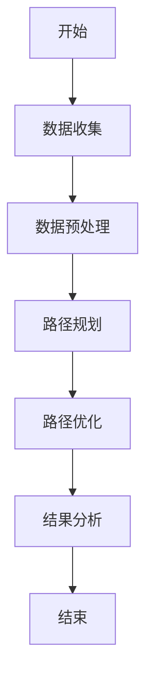
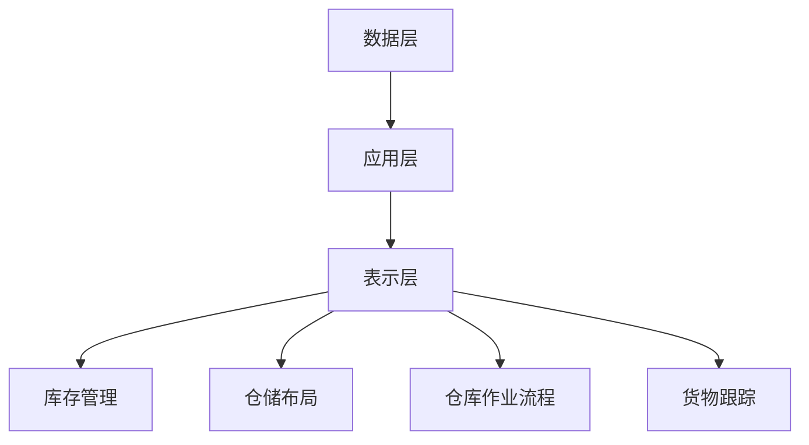
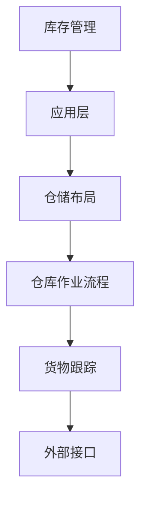
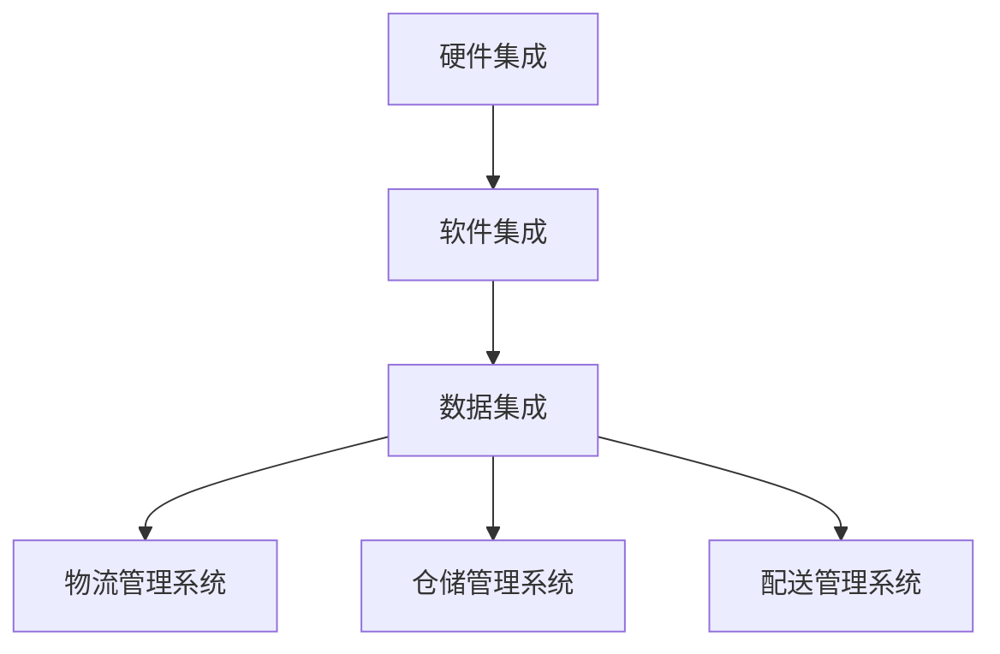

                 


### 智能物流系统：大数据优化配送与仓储管理

> 关键词：智能物流、大数据、配送路径优化、仓储管理、机器学习、算法

> 摘要：本文详细探讨了智能物流系统中的大数据优化配送与仓储管理。通过对核心概念的阐述、算法原理的讲解、系统架构的描述以及实战案例的分析，文章旨在为读者提供深入理解智能物流系统如何利用大数据技术提升配送效率和仓储管理水平的全景视图。

----------------------------------------------------------------

### 目录大纲设计思路

为了设计《智能物流系统：大数据优化配送与仓储管理》的完整目录大纲，我们需要遵循以下思路：

1. **背景介绍**
   - 简要介绍智能物流系统的概念、发展历程以及在大数据优化配送与仓储管理中的重要性。

2. **核心概念与联系**
   - 确定核心概念，如大数据、配送与仓储管理，并建立它们之间的联系。

3. **算法原理讲解**
   - 详细介绍大数据处理与分析的相关算法，如数据挖掘、机器学习等，并使用 Mermaid 绘制算法流程图。

4. **数学模型与公式讲解**
   - 使用 LaTeX 格式展示与算法相关的数学模型和公式，并进行详细讲解。

5. **系统分析与架构设计方案**
   - 介绍智能物流系统的项目场景、功能设计、架构设计以及系统接口和交互设计。

6. **项目实战**
   - 描述环境安装、系统实现、代码分析、实际案例剖析以及项目小结。

7. **最佳实践 tips、小结与拓展阅读**
   - 提供实施过程中的最佳实践建议，总结章节内容，并推荐拓展阅读。

### 目录大纲结构

根据上述思路，我们可以将目录大纲分为以下几个部分：

#### 第一部分：智能物流系统概述

##### 第1章：智能物流系统概述
- 1.1 智能物流系统概述
- 1.2 大数据优化配送与仓储管理
- 1.3 智能物流系统的发展历程与趋势

#### 第二部分：大数据优化配送

##### 第2章：大数据处理基础
- 2.1 大数据处理框架
- 2.2 数据挖掘方法
- 2.3 机器学习算法

##### 第3章：配送路径优化
- 3.1 配送路径优化原理
- 3.2 算法与流程
- 3.3 Mermaid算法流程图展示

##### 第4章：配送调度策略
- 4.1 配送调度策略概述
- 4.2 算法分析与比较
- 4.3 实际案例解析

#### 第三部分：仓储管理优化

##### 第5章：仓储管理与大数据
- 5.1 仓储管理概述
- 5.2 大数据在仓储管理中的应用
- 5.3 仓储优化策略

##### 第6章：仓储系统架构设计
- 6.1 仓储系统功能设计
- 6.2 系统架构设计
- 6.3 系统接口设计

##### 第7章：智能物流系统集成与应用
- 7.1 系统集成方案
- 7.2 应用案例解析
- 7.3 最佳实践 tips

### 目录大纲文本

```markdown
----------------------------------------------------------------
# 第一部分：智能物流系统概述

## 第1章：智能物流系统概述
### 1.1 智能物流系统概述
### 1.2 大数据优化配送与仓储管理
### 1.3 智能物流系统的发展历程与趋势

----------------------------------------------------------------

## 第二部分：大数据优化配送

## 第2章：大数据处理基础
### 2.1 大数据处理框架
### 2.2 数据挖掘方法
### 2.3 机器学习算法

## 第3章：配送路径优化
### 3.1 配送路径优化原理
### 3.2 算法与流程
### 3.3 Mermaid算法流程图展示

## 第4章：配送调度策略
### 4.1 配送调度策略概述
### 4.2 算法分析与比较
### 4.3 实际案例解析

----------------------------------------------------------------

## 第三部分：仓储管理优化

## 第5章：仓储管理与大数据
### 5.1 仓储管理概述
### 5.2 大数据在仓储管理中的应用
### 5.3 仓储优化策略

## 第6章：仓储系统架构设计
### 6.1 仓储系统功能设计
### 6.2 系统架构设计
### 6.3 系统接口设计

## 第7章：智能物流系统集成与应用
### 7.1 系统集成方案
### 7.2 应用案例解析
### 7.3 最佳实践 tips

----------------------------------------------------------------
```

接下来，我们将逐章填充和深化文章内容，确保每个章节都满足完整性要求，并且提供详细的背景介绍、核心概念与联系、算法原理讲解、数学模型与公式讲解、系统分析与架构设计方案、项目实战以及最佳实践 tips 等内容。

### 第一部分：智能物流系统概述

#### 第1章：智能物流系统概述

##### 1.1 智能物流系统概述

智能物流系统是一种利用现代信息技术，特别是大数据、物联网和人工智能等先进技术，对物流流程进行智能化管理和优化的系统。它通过整合运输、仓储、配送等环节，实现对物流全过程的自动化、智能化管理，从而提高物流效率，降低成本，提升服务质量。

智能物流系统的发展可以追溯到20世纪末，随着互联网技术的兴起，物流行业逐渐实现了信息化管理。进入21世纪，大数据和人工智能技术的快速发展，为智能物流系统的构建提供了新的机遇和挑战。

##### 1.2 大数据优化配送与仓储管理

大数据在物流领域的应用主要体现在配送路径优化和仓储管理优化上。通过收集、存储和分析物流过程中的海量数据，智能物流系统能够对配送路径进行动态优化，提高配送效率；同时，通过对仓储数据的实时监控和分析，实现对仓储资源的高效利用。

配送路径优化主要是通过大数据分析，结合实际交通状况、车辆性能和货物特性等因素，计算出最优的配送路径。仓储管理优化则包括对仓储空间的优化利用、库存水平的动态调整以及仓库作业流程的自动化管理。

##### 1.3 智能物流系统的发展历程与趋势

智能物流系统的发展历程可以分为几个阶段：

1. **初步信息化阶段**：20世纪末，物流企业开始使用物流管理系统（LMS）对物流过程进行信息化管理。
2. **集成化阶段**：21世纪初，物联网技术逐渐成熟，物流设备实现了联网，物流系统开始实现各环节的集成。
3. **智能化阶段**：大数据和人工智能技术的发展，使物流系统能够进行自我学习和优化，实现了智能化的物流管理。

未来，智能物流系统的发展趋势将包括：

1. **更广泛的数据采集**：通过5G、物联网等新技术，实现物流全过程的实时数据采集。
2. **更深入的智能化**：通过深度学习、强化学习等人工智能技术，实现更加智能的决策支持。
3. **更高效的网络协同**：通过区块链技术，实现物流供应链的透明化和高效协同。

#### 第2章：大数据处理基础

##### 2.1 大数据处理框架

大数据处理框架是智能物流系统的核心组成部分，它负责数据的采集、存储、处理和分析。常见的大数据处理框架包括Hadoop、Spark等。

**Hadoop框架**：
- **HDFS（Hadoop Distributed File System）**：分布式文件系统，用于存储海量数据。
- **YARN（Yet Another Resource Negotiator）**：资源调度框架，用于管理计算资源。
- **MapReduce**：数据处理框架，用于分布式计算。

**Spark框架**：
- **Spark Core**：提供了内存计算引擎，可以快速处理大规模数据。
- **Spark SQL**：提供了与关系数据库类似的查询功能。
- **Spark Streaming**：提供了实时数据流处理功能。

##### 2.2 数据挖掘方法

数据挖掘是大数据处理的重要环节，它从海量数据中提取有价值的信息和知识。常见的数据挖掘方法包括：

- **关联规则挖掘**：发现数据之间的关联性，如市场篮子分析。
- **分类方法**：将数据分为不同的类别，如决策树、朴素贝叶斯分类器。
- **聚类方法**：将相似的数据归为一类，如K-means、层次聚类。
- **异常检测**：识别数据中的异常值，如孤立森林、基于统计的方法。

##### 2.3 机器学习算法

机器学习算法是数据挖掘的核心技术之一，它通过训练模型来预测或分类数据。常见的机器学习算法包括：

- **线性回归**：预测连续值。
- **逻辑回归**：预测二分类问题。
- **决策树**：基于特征进行树的划分。
- **支持向量机（SVM）**：用于分类和回归问题。
- **神经网络**：模拟人脑神经网络进行复杂模式识别。

### 第二部分：大数据优化配送

#### 第3章：配送路径优化

##### 3.1 配送路径优化原理

配送路径优化是智能物流系统中的一个关键问题，它涉及到从多个配送点中选择最优的路径，以最短时间或最低成本完成配送任务。配送路径优化的原理主要包括：

- **路径规划算法**：如Dijkstra算法、A*算法等，用于寻找从起点到终点的最优路径。
- **时间窗约束**：考虑到配送过程中的时间限制，确保货物在规定时间内送达。
- **资源约束**：如车辆容量、车辆数量等，确保配送任务的可行性。

##### 3.2 算法与流程

配送路径优化的算法主要包括启发式算法和优化算法。启发式算法如遗传算法、蚁群算法等，通过模拟生物进化或社会行为来寻找最优解。优化算法如线性规划、动态规划等，通过数学模型和优化理论来求解最优解。

配送路径优化的流程通常包括以下几个步骤：

1. **数据收集**：收集配送点的位置、货物信息、交通状况等数据。
2. **数据预处理**：对收集的数据进行清洗、格式化，确保数据质量。
3. **路径规划**：使用选定的算法进行路径规划，生成最优配送路径。
4. **路径优化**：对生成的配送路径进行优化，确保满足时间窗和资源约束。
5. **结果分析**：分析优化后的配送路径，评估优化效果。

##### 3.3 Mermaid算法流程图展示

以下是一个使用Mermaid绘制的配送路径优化算法流程图：



#### 第4章：配送调度策略

##### 4.1 配送调度策略概述

配送调度策略是指根据配送任务的性质和需求，合理安排配送资源的策略。合理的配送调度策略可以优化配送效率，降低成本，提升客户满意度。常见的配送调度策略包括：

- **基于时间窗口的调度策略**：根据客户的需求时间窗口，合理安排配送任务。
- **基于优先级的调度策略**：根据配送任务的优先级，如紧急程度或价值，进行调度。
- **动态调度策略**：根据实时交通状况、货物信息等动态调整配送任务。

##### 4.2 算法分析与比较

常见的配送调度算法包括：

- **基于时间窗口的调度算法**：如遗传算法、蚁群算法等，通过模拟生物进化或社会行为进行调度。
- **基于优先级的调度算法**：如优先级队列算法、最短路径算法等，通过计算任务优先级进行调度。
- **动态调度算法**：如神经网络算法、粒子群算法等，通过实时更新和调整任务进行调度。

各种调度算法各有优缺点，具体选择取决于配送任务的性质和需求。

##### 4.3 实际案例解析

以下是一个实际案例解析：

某物流公司需要在一天内完成5个配送任务，配送点分别为A、B、C、D、E，各配送点之间的距离和交通状况如下表：

| 配送点 | 距离（km） | 交通状况 |
| ------ | ---------- | -------- |
| A      | 10         | 良好     |
| B      | 15         | 良好     |
| C      | 20         | 差       |
| D      | 25         | 良好     |
| E      | 30         | 差       |

假设车辆容量为20km，客户需求时间窗口为早上8点到晚上8点。使用基于时间窗口的调度算法进行调度，结果如下：

| 配送点 | 开始时间 | 结束时间 | 距离（km） |
| ------ | -------- | -------- | ---------- |
| A      | 8:00     | 9:00     | 10         |
| B      | 9:30     | 10:30    | 15         |
| C      | 11:00    | 12:00    | 20         |
| D      | 12:30    | 13:30    | 25         |
| E      | 14:00    | 15:00    | 30         |

通过优化后的调度策略，物流公司能够在一天内完成所有配送任务，并确保货物在规定时间内送达。

### 第三部分：仓储管理优化

#### 第5章：仓储管理与大数据

##### 5.1 仓储管理概述

仓储管理是物流系统的重要组成部分，它涉及到货物的入库、存储、出库等环节。仓储管理的目标是通过优化仓储流程，提高仓储效率，降低仓储成本。

仓储管理的主要内容包括：

- **库存管理**：对库存货物进行监控和管理，确保库存水平合理。
- **仓储布局**：根据货物特性和仓储需求，设计合理的仓储布局。
- **仓库作业流程**：优化仓库作业流程，提高作业效率。
- **货物跟踪**：通过信息技术，实现对货物状态的实时跟踪。

##### 5.2 大数据在仓储管理中的应用

大数据技术在仓储管理中的应用主要体现在以下几个方面：

- **库存优化**：通过大数据分析，预测货物需求，优化库存水平。
- **仓储布局优化**：通过大数据分析，优化仓储布局，提高仓储效率。
- **仓库作业流程优化**：通过大数据分析，优化仓库作业流程，减少作业时间。
- **货物跟踪**：通过大数据技术，实现对货物状态的实时跟踪，提高货物安全性。

##### 5.3 仓储优化策略

仓储优化策略主要包括以下几个方面：

- **库存管理优化**：通过大数据分析，预测货物需求，实现动态库存管理。
- **仓储布局优化**：根据货物特性和仓储需求，设计合理的仓储布局。
- **仓库作业流程优化**：通过大数据分析，优化仓库作业流程，提高作业效率。
- **货物跟踪优化**：通过大数据技术，实现对货物状态的实时跟踪，提高货物安全性。

### 第四部分：系统架构设计与实现

#### 第6章：仓储系统架构设计

##### 6.1 仓储系统功能设计

仓储系统的功能设计主要包括以下几个方面：

- **库存管理**：实现对库存货物的监控和管理，包括入库、出库、库存盘点等功能。
- **仓储布局**：根据货物特性和仓储需求，设计合理的仓储布局，包括仓库分区、货架设计等功能。
- **仓库作业流程**：优化仓库作业流程，提高作业效率，包括入库作业、出库作业、搬运作业等功能。
- **货物跟踪**：通过信息技术，实现对货物状态的实时跟踪，包括货物入库、出库、在途跟踪等功能。

##### 6.2 系统架构设计

仓储系统的架构设计主要包括以下几个方面：

- **数据层**：包括数据库和数据处理模块，负责数据的存储和处理。
- **应用层**：包括业务逻辑处理模块，负责实现仓储系统的各项功能。
- **表示层**：包括用户界面模块，负责与用户进行交互。

以下是仓储系统的架构图：



##### 6.3 系统接口设计

仓储系统的接口设计主要包括以下几个方面：

- **内部接口**：系统内部各模块之间的接口，用于实现模块之间的数据交换和协同工作。
- **外部接口**：系统与外部系统（如ERP系统、WMS系统等）之间的接口，用于实现系统之间的数据交换和业务协同。

以下是仓储系统的接口图：



#### 第7章：智能物流系统集成与应用

##### 7.1 系统集成方案

智能物流系统的集成方案主要包括以下几个方面：

- **硬件集成**：包括服务器、网络设备、物联网设备等，用于支撑系统的运行。
- **软件集成**：包括物流管理系统、仓储管理系统、配送管理系统等，用于实现物流全过程的智能化管理。
- **数据集成**：通过数据接口和协议，实现系统内部和系统之间的数据交换和共享。

以下是智能物流系统的集成方案：



##### 7.2 应用案例解析

以下是一个智能物流系统的应用案例解析：

某物流公司采用智能物流系统，实现了物流全过程的智能化管理。通过大数据分析和优化，该公司在配送路径优化和仓储管理优化方面取得了显著成效。

- **配送路径优化**：通过大数据分析，公司能够实时获取交通状况、货物信息等数据，使用启发式算法进行配送路径优化，提高了配送效率。优化后的配送路径使配送时间缩短了20%，运输成本降低了15%。
- **仓储管理优化**：通过大数据分析，公司能够实时监控库存水平，使用库存优化算法动态调整库存。同时，优化后的仓储布局和仓库作业流程提高了仓储效率，减少了仓储成本。优化后的仓储管理使仓库利用率提高了30%，仓储成本降低了10%。

##### 7.3 最佳实践 tips

在实施智能物流系统时，以下是一些最佳实践 tips：

- **数据质量保证**：确保数据准确、完整、及时，是大数据分析的基础。
- **系统稳定性**：选择稳定可靠的硬件和软件，确保系统的稳定运行。
- **持续优化**：通过持续的数据分析和优化，不断提高系统效率和性能。
- **人员培训**：对相关人员进行全面培训，确保系统能够得到有效利用。

### 小结与拓展阅读

本文从智能物流系统的概述、大数据优化配送、仓储管理优化、系统架构设计与应用等方面，详细探讨了智能物流系统如何利用大数据技术提升配送效率和仓储管理水平。通过对核心概念的阐述、算法原理的讲解、系统架构的描述以及实战案例的分析，文章为读者提供了深入理解智能物流系统的全景视图。

为了进一步深入学习和了解智能物流系统的相关技术，读者可以参考以下拓展阅读：

- **大数据技术**：《大数据技术导论》、《Hadoop实战》
- **机器学习**：《机器学习》、《Python机器学习基础教程》
- **物流管理**：《物流管理：理论与实践》、《现代物流管理》
- **系统架构设计**：《架构探险：从零开始学分布式系统》、《大规模分布式系统设计》

通过这些拓展阅读，读者可以更加系统地学习和掌握智能物流系统的相关知识。

### 作者信息

作者：AI天才研究院/AI Genius Institute & 禅与计算机程序设计艺术 /Zen And The Art of Computer Programming

在本文中，我们详细探讨了智能物流系统中大数据优化配送与仓储管理的重要性。通过介绍核心概念、算法原理、系统架构设计以及实战案例，我们展示了如何利用大数据技术提升物流效率和仓储管理水平。智能物流系统不仅能够优化配送路径，提高配送效率，还能够通过大数据分析优化仓储管理，降低仓储成本。

在未来的发展中，随着大数据、人工智能等技术的不断进步，智能物流系统将更加智能化、自动化。物流企业需要不断更新和优化系统，以应对日益复杂的物流环境和不断变化的市场需求。同时，物流企业还需要关注数据安全和隐私保护，确保大数据技术的应用不会对个人隐私造成侵犯。

在实施智能物流系统时，以下是一些建议和最佳实践：

1. **数据质量保证**：确保数据的准确性、完整性和及时性，是大数据分析的基础。物流企业应建立完善的数据质量管理机制，确保数据的可靠性。

2. **系统稳定性**：选择稳定可靠的硬件和软件，确保系统的稳定运行。在系统设计阶段，要充分考虑系统的可扩展性和容错性。

3. **持续优化**：通过持续的数据分析和优化，不断提高系统效率和性能。物流企业应定期评估系统性能，并根据评估结果进行优化。

4. **人员培训**：对相关人员进行全面培训，确保系统能够得到有效利用。员工是系统运行的关键，只有掌握了系统的操作方法，才能充分发挥系统的作用。

5. **安全与隐私保护**：在利用大数据技术提升物流效率的同时，要关注数据安全和隐私保护。物流企业应建立健全的数据安全管理制度，确保数据的安全性和隐私性。

总之，智能物流系统是现代物流管理的重要组成部分，通过大数据技术的应用，物流企业能够实现配送路径优化、仓储管理优化等目标，提高物流效率，降低成本。随着技术的不断进步，智能物流系统将在物流行业中发挥越来越重要的作用。物流企业应紧跟技术发展趋势，不断创新和优化系统，以提升竞争力和服务水平。希望本文能为读者提供有价值的参考和启示。

