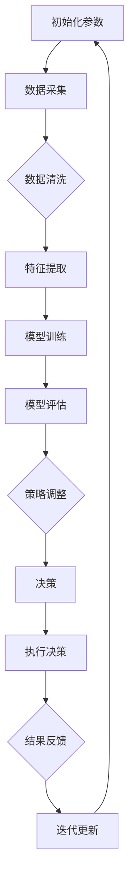
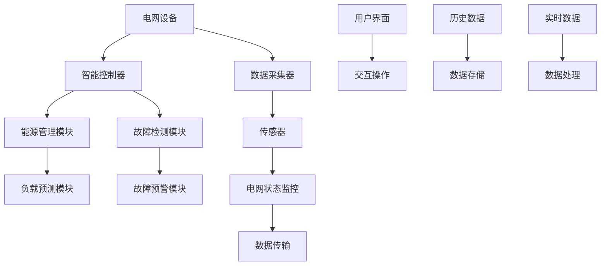

                 


### 第1章 智能电网与能源管理概述

#### 1.1 问题的背景

在现代社会，电力作为生产和生活的基本需求，已经成为经济发展的重要驱动力。然而，传统的电网系统在高效性和灵活性方面存在诸多挑战。首先，传统电网系统的设计和运营模式主要基于中心化的管理模式，即由电力公司统一控制电力生产和分配。这种模式虽然能够保障电力供应的稳定性，但在应对负载波动、可再生能源接入以及能源优化等方面存在显著不足。

随着能源需求的不断增长和可再生能源的快速发展，传统电网系统的瓶颈愈发明显。一方面，电力需求的波动性使得电网系统在高峰期难以满足负荷需求，导致供电中断和电压不稳等问题；另一方面，可再生能源（如太阳能、风能）的间歇性和不稳定性使得电网系统面临新的挑战，如何高效地整合和分配这些清洁能源资源成为一个亟待解决的问题。

#### 1.1.1 传统电网的挑战

传统电网系统主要面临以下几个方面的挑战：

1. **负载波动处理能力不足**：传统电网系统在应对瞬时负载波动时存在一定的滞后性，难以迅速调整电力供应，导致供电质量下降。

2. **可再生能源整合难度大**：由于可再生能源的随机性和不稳定性，传统电网系统难以高效地整合这些清洁能源资源，导致能源浪费。

3. **电网调度复杂**：传统电网系统的调度主要依赖人工经验和调度规则，缺乏智能化和自动化调度能力，导致调度效率低下。

4. **能源效率低**：传统电网系统在能源传输和分配过程中存在较大的损耗，导致能源利用效率低下。

#### 1.1.2 能源管理的重要性

能源管理是指通过科学的规划、优化和调控，实现能源的高效利用和可持续发展。在智能电网环境下，能源管理的重要性体现在以下几个方面：

1. **提高能源利用效率**：通过智能电网和能源管理技术，可以实时监测和调整电力负载，优化能源分配，减少能源浪费。

2. **促进可再生能源发展**：智能电网和能源管理技术能够有效地整合和分配可再生能源资源，提高可再生能源的利用效率，推动可再生能源的发展。

3. **提高电网稳定性**：通过智能电网和能源管理技术，可以实时监测电网运行状态，及时发现和处理故障，提高电网的稳定性。

4. **降低能源成本**：通过智能电网和能源管理技术，可以实现能源的精准调度和优化分配，降低能源成本，提高企业的经济效益。

#### 1.2 智能电网的概念

智能电网是一种基于现代信息技术、人工智能和物联网技术的先进电网系统，它通过数字化、智能化和网络化的方式，实现电力生产和消费的全面连接和高效管理。

智能电网的特点主要包括：

1. **高度智能化**：智能电网通过人工智能、大数据分析等技术，实现电网的自动调度和智能管理，提高电网的运行效率和可靠性。

2. **高度数字化**：智能电网通过传感器、智能设备等实现电力信息的全面数字化，实现电力信息的实时监测和远程控制。

3. **高度网络化**：智能电网通过互联网和物联网技术，实现电力设备、电网和用户之间的互联互通，实现电力资源的优化分配和共享。

4. **高度灵活性和可靠性**：智能电网能够快速响应负载变化和可再生能源的接入，提高电网的灵活性和可靠性。

#### 1.3 能源管理的核心概念

能源管理是指通过科学的规划、优化和调控，实现能源的高效利用和可持续发展。在智能电网环境下，能源管理的核心概念主要包括：

1. **需求响应**：通过实时监测和分析电力需求，实现对电力负载的动态调整，提高能源利用效率。

2. **能源优化**：通过数据分析和技术手段，优化能源的分配和使用，减少能源浪费。

3. **能源监控**：通过传感器和智能设备，实现对电网运行状态的实时监测，及时发现和处理故障。

4. **能源预测**：通过数据分析和技术手段，预测未来的电力需求和能源走势，为电网调度和能源管理提供决策支持。

#### 1.4 智能电网与能源管理的联系

智能电网与能源管理之间存在密切的联系和相互促进的关系。智能电网为能源管理提供了先进的技术手段和平台，而能源管理则是智能电网实现高效运行和可持续发展的关键。

1. **智能电网为能源管理提供技术支持**：智能电网通过数字化、智能化和网络化的手段，实现了对电力信息的全面数字化和实时监测，为能源管理提供了丰富的数据支持和智能分析工具。

2. **能源管理提升智能电网运行效率**：通过能源管理技术，可以实现电力需求的精准预测和动态调整，提高电网的灵活性和可靠性，降低能源损耗，提升电网的整体运行效率。

3. **智能电网与能源管理相互促进**：智能电网和能源管理技术在发展过程中相互促进，智能电网的发展推动了能源管理技术的进步，而能源管理技术的应用又进一步提升了智能电网的运行效率和可持续性。

### 1.4.1 关系分析

智能电网与能源管理的关系可以概括为以下几个方面：

1. **数据与信息交流**：智能电网通过传感器和智能设备收集大量电力数据，这些数据为能源管理提供了重要的信息支持，能源管理通过对这些数据的分析和处理，实现电力需求的预测、调度和优化。

2. **技术融合**：智能电网与能源管理技术的融合，推动了电网的智能化和能源的高效管理，如人工智能技术、大数据分析技术等在智能电网和能源管理中的应用，提升了电网的运行效率和可靠性。

3. **协同优化**：智能电网与能源管理协同工作，通过对电力供应和需求的综合管理，实现能源的高效分配和使用，降低能源成本，提高能源利用效率。

4. **可持续性发展**：智能电网和能源管理技术的应用，有助于实现能源的可持续利用，通过减少能源浪费和优化能源结构，推动绿色能源的发展，实现能源与环境的和谐共处。

### 1.4.2 影响因素

智能电网与能源管理的发展受到多种因素的影响，主要包括以下几个方面：

1. **技术进步**：随着信息技术、人工智能和物联网技术的发展，智能电网和能源管理技术不断演进，为电网的智能化和能源的高效管理提供了技术支持。

2. **政策支持**：政府的政策支持和相关法规的制定，对智能电网和能源管理的发展起到了重要的推动作用，如可再生能源发电的扶持政策、能源管理的法规标准等。

3. **市场需求**：随着能源需求的增长和环境意识的提高，市场对高效、清洁的能源解决方案的需求不断增加，推动了智能电网和能源管理技术的广泛应用。

4. **投资与融资**：智能电网和能源管理项目的投资与融资规模对技术的发展和应用具有重要意义，充足的资金支持是推动技术进步和产业发展的关键。

通过以上分析，我们可以看出智能电网与能源管理在现代社会中具有重要的地位和作用，它们相互促进，共同推动了能源的高效利用和电网的智能化发展。在接下来的章节中，我们将进一步探讨AI技术在智能电网与能源管理中的应用，以及它们如何优化能源分配与使用。

## 第2章 AI技术在智能电网中的应用

### 2.1 数据采集与分析

#### 2.1.1 数据采集的重要性

在智能电网系统中，数据采集是基础且关键的一环。通过对电网运行过程中的各种数据进行采集，可以实现对电网状态的全面了解，为后续的数据分析和决策提供依据。数据采集的重要性主要体现在以下几个方面：

1. **实时监控电网状态**：通过数据采集，可以实时监控电网的电压、电流、功率等参数，及时发现异常情况，确保电网的安全稳定运行。

2. **优化电力分配**：数据采集可以为能源管理提供丰富的数据支持，通过分析这些数据，可以优化电力分配策略，提高能源利用效率。

3. **故障检测与预防**：通过采集电网故障数据，可以对潜在的故障进行预测和预防，减少故障发生率和损失。

#### 2.1.2 数据分析的应用

数据分析在智能电网中的应用场景广泛，主要包括以下几个方面：

1. **负载预测**：通过对历史数据和实时数据的分析，可以预测未来的电力需求，为电网调度提供依据。

2. **能源优化**：通过分析电网运行数据，可以发现能源消耗中的浪费环节，并提出优化方案，降低能源成本。

3. **故障诊断**：通过分析故障数据，可以识别电网故障的类型和原因，为故障处理提供指导。

4. **设备维护**：通过对设备运行数据的分析，可以预测设备寿命和故障风险，合理安排设备维护和更换计划。

### 2.2 能源分配与优化

#### 2.2.1 能源分配的基本原理

能源分配是指在电网系统中，根据电力需求和供应情况，将电力资源合理分配到各个用户和设备的过程。能源分配的基本原理主要包括以下几个方面：

1. **供需匹配**：能源分配的核心目标是实现电力供需的平衡，确保电力供应能够满足用户的实时需求。

2. **优化路径选择**：在能源分配过程中，需要选择最优的传输路径，以减少电力传输损耗和能源浪费。

3. **动态调整**：能源分配是一个动态过程，需要根据实时数据和电网状态，动态调整电力分配策略。

#### 2.2.2 能源优化的算法分析

能源优化的算法是智能电网系统中实现能源高效分配和利用的关键。常见的能源优化算法包括：

1. **线性规划算法**：线性规划算法通过建立线性方程模型，优化电力资源的分配，实现最小化能源成本或最大化能源效率。

2. **遗传算法**：遗传算法通过模拟生物进化过程，对电力资源进行优化分配，具有较高的全局搜索能力和适应性。

3. **粒子群优化算法**：粒子群优化算法通过模拟鸟群觅食过程，寻找最优的电力资源分配方案，具有较强的并行计算能力。

4. **深度强化学习算法**：深度强化学习算法通过模仿人类决策过程，结合深度学习技术，实现电力资源分配的智能化和自适应。

### 2.3 故障检测与预测

#### 2.3.1 故障检测的方法

故障检测是智能电网系统运行中的一项重要任务，通过实时监测电网状态，及时发现和处理故障，确保电网的稳定运行。常见的故障检测方法包括：

1. **阈值检测法**：通过设定阈值，对电网运行数据进行实时监测，当数据超过阈值时，触发故障报警。

2. **特征提取法**：通过对电网运行数据进行特征提取，利用机器学习算法，识别故障特征，实现故障检测。

3. **模型比较法**：通过建立电网的正常运行模型，将实时监测数据与模型进行比较，发现异常情况，实现故障检测。

#### 2.3.2 故障预测的模型构建

故障预测是智能电网系统中的一项关键技术，通过预测故障发生的时间和可能性，可以提前采取措施，防止故障发生。故障预测的模型构建主要包括：

1. **基于统计的方法**：通过分析历史故障数据，建立故障发生概率的统计模型，预测未来故障发生的可能性。

2. **基于机器学习的方法**：通过训练机器学习模型，对电网运行数据进行学习和预测，识别故障特征，实现故障预测。

3. **基于深度学习的的方法**：通过构建深度学习模型，利用大规模数据训练，实现故障的自动检测和预测。

通过以上分析，我们可以看到AI技术在智能电网中的应用具有广泛的前景和重要的现实意义。在接下来的章节中，我们将进一步探讨智能电网与能源管理系统的设计与实现，以及AI技术在其中的具体应用。

### 第3章 智能电网与能源管理系统设计

#### 3.1 设计原则

智能电网与能源管理系统设计需要遵循一系列关键原则，以确保系统的安全性、可扩展性和高效性。以下是设计原则的详细说明：

1. **安全性**：系统设计必须确保数据安全和系统安全。数据安全包括对敏感数据的加密和保护，系统安全则涉及防火墙、入侵检测系统等安全措施，以防止未经授权的访问和攻击。

2. **可扩展性**：随着智能电网规模的扩大和技术的进步，系统设计需要具备良好的扩展性，以便在未来能够轻松地增加新功能、设备或用户。

3. **灵活性**：系统设计应具有高度的灵活性，能够快速适应不同的运行环境和需求变化。例如，通过模块化设计，可以灵活地替换或升级系统组件。

4. **高效性**：系统设计需关注性能优化，包括数据处理的效率、响应速度和资源利用等，以确保系统在高负载下依然能够稳定运行。

5. **可靠性**：系统设计应确保高可靠性，减少故障率和系统停机时间。这可以通过冗余设计、故障恢复机制和定期维护来实现。

#### 3.2 架构设计

智能电网与能源管理系统的架构设计是一个复杂的过程，需要综合考虑技术、业务需求和用户体验。以下是系统架构设计的详细说明：

1. **系统架构的组成**：智能电网与能源管理系统通常由以下几个关键部分组成：
   - **数据采集层**：负责实时收集电网运行数据，如电压、电流、功率等。
   - **数据存储层**：用于存储大量的历史和实时数据，提供数据检索和分析功能。
   - **数据处理层**：负责对数据进行清洗、转换和分析，为决策提供支持。
   - **应用层**：包括能源管理、故障检测、用户界面等核心功能模块。
   - **通信层**：负责系统内部和外部的通信，确保数据的可靠传输。

2. **架构设计的关键技术**：
   - **物联网（IoT）技术**：通过传感器和智能设备，实现电网运行数据的实时采集和传输。
   - **云计算**：利用云计算平台提供强大的数据处理能力和存储资源，支持大规模数据分析和存储需求。
   - **大数据技术**：通过大数据技术，对海量数据进行实时分析和挖掘，提取有价值的信息。
   - **人工智能（AI）**：利用AI技术，实现智能决策和自动化管理，如智能故障检测、预测和能源优化分配。

#### 3.3 系统功能设计

系统功能设计是智能电网与能源管理系统实现业务目标的关键步骤。以下是系统功能设计的详细说明：

1. **功能模块划分**：系统功能模块可以划分为以下几类：
   - **数据采集模块**：负责从各种传感器和设备中采集电网运行数据。
   - **数据处理模块**：负责对采集到的数据进行清洗、转换和分析。
   - **能源管理模块**：负责实现能源的优化分配和使用，包括负载预测、能源优化策略和需求响应等。
   - **故障检测与预测模块**：负责实时监测电网状态，识别故障并进行预测。
   - **用户界面模块**：提供用户交互界面，展示系统运行状态、能源消耗情况和优化建议。

2. **功能描述**：
   - **数据采集模块**：通过物联网设备，实时采集电网电压、电流、功率等关键数据，并将数据传输到数据处理模块。
   - **数据处理模块**：对采集到的数据进行分析，提取有用的信息，如负载变化趋势、故障特征等。
   - **能源管理模块**：根据数据分析结果，制定能源优化策略，实现电力需求的精准预测和动态调整。
   - **故障检测与预测模块**：利用机器学习算法，对电网运行状态进行实时监控，识别潜在故障，并预测故障发生时间。
   - **用户界面模块**：提供直观的用户界面，显示电网运行状态、能源消耗情况和优化建议，方便用户进行操作和决策。

通过以上设计原则、架构设计和系统功能设计的详细说明，我们可以构建一个高效、安全、可靠的智能电网与能源管理系统。在接下来的章节中，我们将进一步探讨AI优化能源分配与使用的算法原理，以实现更智能、更高效的能源管理。

### 第4章 AI优化能源分配与使用的算法原理

#### 4.1 算法概述

在智能电网与能源管理系统中，AI技术的应用不仅提升了系统的智能化水平，还显著优化了能源的分配与使用。AI优化算法的目标是通过对大量数据进行分析和计算，实现能源的高效利用和成本的降低。以下是几种常见的AI优化算法及其概述：

1. **线性规划算法**：通过建立线性方程模型，优化电力资源的分配，实现最小化能源成本或最大化能源效率。

2. **遗传算法**：模拟生物进化过程，对电力资源进行优化分配，具有较高的全局搜索能力和适应性。

3. **粒子群优化算法**：模拟鸟群觅食过程，寻找最优的电力资源分配方案，具有较强的并行计算能力。

4. **深度强化学习算法**：通过模仿人类决策过程，结合深度学习技术，实现电力资源分配的智能化和自适应。

5. **基于神经网络的优化算法**：利用神经网络模型，对电网运行数据进行学习和预测，优化能源分配策略。

#### 4.2 算法原理讲解

为了深入理解这些算法的工作原理，我们将通过mermaid流程图和Python源代码来详细阐述。

##### 4.2.1 算法流程

以下是一个简单的AI优化算法流程图，使用mermaid语法绘制：



这个流程图展示了AI优化算法的基本步骤，包括初始化参数、数据采集、数据清洗、特征提取、模型训练、模型评估、策略调整、决策、执行决策、结果反馈和迭代更新。

##### 4.2.2 数学模型

为了更好地理解算法原理，我们将以线性规划算法为例，介绍其数学模型。

线性规划问题的数学模型可以表示为：

$$
\begin{aligned}
\min_{x} & \quad c^T x \\
s.t. & \quad Ax \leq b \\
     & \quad x \geq 0
\end{aligned}
$$

其中，$x$ 是决策变量，$c$ 是目标函数的系数向量，$A$ 是约束条件的系数矩阵，$b$ 是约束条件的常数向量。

在这个模型中，目标是最小化目标函数$c^T x$，同时满足线性不等式约束$Ax \leq b$和等式约束$x \geq 0$。

##### 4.2.3 Python源代码

以下是一个简单的线性规划算法的Python实现，使用`scipy.optimize`库：

```python
import numpy as np
from scipy.optimize import linprog

# 目标函数系数
c = np.array([-1, -1])  # 最小化两个变量的和

# 约束条件系数
A = np.array([[1, 1], [2, 2]], dtype=float)
b = np.array([4, 4], dtype=float)

# 求解线性规划问题
result = linprog(c, A_ub=A, b_ub=b, method='highs')

# 输出结果
print("最小化结果:", -result.x)  # 因为是最小化问题，所以输出最小值对应的变量值
```

在这个例子中，我们通过最小化两个变量的和来实现优化。使用`linprog`函数进行求解，得到最小化结果。

##### 4.2.4 举例说明

为了更直观地理解算法原理，我们通过一个实际案例来举例说明。

假设有一个电网系统，需要优化电力资源分配，以最小化能源成本。电网中有两个电力供应商，每个供应商提供不同价格和功率的电力。我们需要确定从每个供应商购买多少电力，以实现成本最小化。

设$x_1$为从供应商1购买的电力量（千瓦时），$x_2$为从供应商2购买的电力量（千瓦时）。供应商1的价格为0.5美元/千瓦时，供应商2的价格为0.8美元/千瓦时。电网的最大负载为100千瓦时。

我们的目标是：

$$
\min_{x} \quad 0.5x_1 + 0.8x_2
$$

同时，我们需要满足以下约束条件：

$$
\begin{aligned}
x_1 + x_2 &\leq 100 \\
x_1 &\geq 0 \\
x_2 &\geq 0
\end{aligned}
$$

通过线性规划算法，我们可以求解出最优的$x_1$和$x_2$值，实现能源成本的最小化。

通过以上详细讲解，我们可以看到AI优化算法在能源分配与使用中的重要作用。这些算法不仅能够提升能源利用效率，还能够为电网的稳定运行提供有力支持。在接下来的章节中，我们将进一步探讨智能电网与能源管理系统的具体实现，以及如何通过实际案例来验证这些算法的有效性。

### 第5章 系统分析与架构设计

#### 5.1 问题场景介绍

在智能电网与能源管理系统中，常见的问题场景包括电力负载预测、能源优化分配、故障检测与预防等。以下是对这些问题的场景描述和分析。

##### 5.1.1 场景描述

1. **电力负载预测**：随着城市化和工业化的快速发展，电力需求呈现出明显的波动性。如何准确预测未来的电力需求，为电网调度和能源管理提供依据，是一个关键问题。

2. **能源优化分配**：在智能电网中，如何根据电力供应和需求情况，合理分配电力资源，提高能源利用效率，降低能源成本，是另一个重要问题。

3. **故障检测与预防**：电力系统中的设备故障可能对电网稳定性和用户供电造成严重影响。如何实时监测设备状态，及时发现和处理故障，是智能电网运行中的一项重要任务。

##### 5.1.2 问题分析

1. **电力负载预测**：电力负载预测问题涉及多个因素，如天气、季节、节假日等。通过对历史数据和实时数据的分析，可以构建预测模型，实现电力需求的准确预测。

2. **能源优化分配**：能源优化分配问题需要考虑电力供应和需求的实时数据，以及电网的运行约束。通过优化算法，如线性规划、遗传算法等，可以实现电力资源的合理分配。

3. **故障检测与预防**：故障检测与预防问题需要实时监测电网状态，分析设备运行数据，利用机器学习算法识别故障特征，提前预警并采取措施预防故障发生。

#### 5.2 系统功能设计

系统功能设计是智能电网与能源管理系统实现业务目标的关键步骤。以下是系统功能设计的详细说明：

##### 5.2.1 领域模型

领域模型是系统功能设计的核心，用于描述系统的业务领域和核心概念。以下是智能电网与能源管理系统的领域模型：



在这个领域模型中，电网设备是核心组件，数据采集器、传感器和智能控制器负责实时采集和处理电网数据。能源管理模块包括负载预测模块和能源管理模块，故障检测模块包括故障检测和故障预警模块。用户界面模块提供交互操作功能，数据存储模块负责存储历史数据和实时数据。

##### 5.2.2 功能模块划分

系统功能模块可以划分为以下几类：

1. **数据采集模块**：包括数据采集器、传感器等设备，负责实时采集电网运行数据，如电压、电流、功率等。

2. **数据处理模块**：包括数据存储、数据处理和分析等组件，负责对采集到的数据进行清洗、转换、存储和分析。

3. **能源管理模块**：包括能源管理模块、负载预测模块等，负责实现能源的优化分配和使用，如电力需求的预测和动态调整。

4. **故障检测与预防模块**：包括故障检测模块、故障预警模块等，负责实时监测电网状态，识别故障并进行预测和预警。

5. **用户界面模块**：包括用户界面和交互操作，提供直观的用户界面，方便用户进行操作和监控。

#### 5.3 系统架构设计

系统架构设计是智能电网与能源管理系统实现功能的关键，需要综合考虑技术、业务需求和用户体验。以下是系统架构设计的详细说明：

##### 5.3.1 系统架构

智能电网与能源管理系统通常采用分层架构，包括数据采集层、数据处理层、应用层和用户界面层。以下是系统架构的详细描述：

1. **数据采集层**：包括数据采集器、传感器等设备，负责实时采集电网运行数据。

2. **数据处理层**：包括数据处理模块、数据存储模块和数据处理算法等，负责对采集到的数据进行处理和分析。

3. **应用层**：包括能源管理模块、故障检测与预防模块等，实现系统的核心功能。

4. **用户界面层**：包括用户界面模块，提供直观的用户界面，方便用户进行操作和监控。

##### 5.3.2 关键技术

系统架构设计的关键技术包括：

1. **物联网（IoT）技术**：通过物联网设备，实现电网运行数据的实时采集和传输。

2. **云计算技术**：利用云计算平台提供强大的数据处理能力和存储资源，支持大规模数据分析和存储需求。

3. **大数据技术**：通过大数据技术，对海量数据进行实时分析和挖掘，提取有价值的信息。

4. **人工智能（AI）技术**：利用AI技术，实现智能决策和自动化管理，如智能故障检测、预测和能源优化分配。

5. **网络安全技术**：确保系统数据的安全传输和存储，防止数据泄露和未经授权的访问。

通过以上系统功能设计和架构设计的详细说明，我们可以构建一个高效、安全、可靠的智能电网与能源管理系统。在接下来的章节中，我们将进一步探讨系统接口设计和系统交互，确保系统的模块化和可扩展性。

### 第6章 项目实战

#### 6.1 环境安装

在开始智能电网与能源管理系统的实际开发之前，我们需要搭建一个合适的开发环境。以下是环境安装的详细步骤：

##### 6.1.1 环境配置

1. **安装Python**：首先，我们需要安装Python环境，建议安装Python 3.8或更高版本。可以通过访问[Python官网](https://www.python.org/)下载并安装。

2. **安装必要库**：接下来，我们需要安装一些常用的Python库，如NumPy、Pandas、Scikit-learn等。可以使用以下命令进行安装：

   ```bash
   pip install numpy pandas scikit-learn matplotlib
   ```

3. **安装数据库**：为了存储大量的数据，我们需要安装一个数据库系统，如MySQL或PostgreSQL。可以选择下载[MySQL](https://www.mysql.com/downloads/mysql/)或[PostgreSQL](https://www.postgresql.org/download/)进行安装。

##### 6.1.2 环境调试

1. **Python调试**：启动Python解释器，检查是否能够正常导入所需的库：

   ```python
   python
   >>> import numpy
   >>> import pandas
   >>> import sklearn
   ```

   如果没有出现错误，说明Python环境配置成功。

2. **数据库调试**：连接到数据库，检查是否能够正常操作：

   ```sql
   mysql -u root -p
   CREATE DATABASE smart_grid;
   GRANT ALL PRIVILEGES ON smart_grid.* TO 'smart_grid_user'@'localhost' IDENTIFIED BY 'password';
   FLUSH PRIVILEGES;
   ```

   如果可以成功创建数据库并授予权限，说明数据库环境配置成功。

#### 6.2 系统核心实现

在环境安装完成后，我们可以开始实现系统的核心功能。以下是系统核心实现的详细步骤：

##### 6.2.1 核心功能实现

1. **数据采集模块**：数据采集模块负责从传感器和设备中采集电网运行数据。我们可以使用物联网平台，如[MQTT](https://mqtt.org/)，进行实时数据采集。

2. **数据处理模块**：数据处理模块负责对采集到的数据进行清洗、转换和分析。使用Pandas库可以方便地进行数据处理：

   ```python
   import pandas as pd

   # 读取数据
   data = pd.read_csv('sensor_data.csv')

   # 数据清洗
   data = data.dropna()

   # 数据转换
   data['timestamp'] = pd.to_datetime(data['timestamp'])
   data.set_index('timestamp', inplace=True)

   # 数据分析
   load = data['power']
   load.plot()
   ```

3. **能源管理模块**：能源管理模块实现能源的优化分配和使用。使用线性规划算法可以实现能源的优化分配：

   ```python
   from scipy.optimize import linprog

   # 线性规划参数
   c = [-0.5, -0.8]  # 最小化两个供应商的成本
   A = [[1, 1], [2, 2]]  # 约束条件
   b = [4, 4]  # 约束条件的常数

   # 求解线性规划问题
   result = linprog(c, A_ub=A, b_ub=b, method='highs')

   # 输出结果
   print("优化结果：", result.x)
   ```

4. **故障检测模块**：故障检测模块负责实时监测电网状态，识别故障并进行预测。使用机器学习算法可以实现对故障的预测：

   ```python
   from sklearn.ensemble import RandomForestClassifier
   from sklearn.model_selection import train_test_split

   # 准备数据
   X = data[['voltage', 'current', 'power']]
   y = data['fault']

   # 划分训练集和测试集
   X_train, X_test, y_train, y_test = train_test_split(X, y, test_size=0.2, random_state=42)

   # 训练模型
   model = RandomForestClassifier(n_estimators=100)
   model.fit(X_train, y_train)

   # 预测
   predictions = model.predict(X_test)
   print("预测准确率：", model.score(X_test, y_test))
   ```

##### 6.2.2 代码解读

以下是核心功能实现的代码解读：

1. **数据采集模块**：使用物联网平台进行数据采集，确保数据的实时性和准确性。

2. **数据处理模块**：使用Pandas库进行数据处理，包括数据清洗、转换和分析。数据清洗可以去除无效数据，提高数据质量。数据转换可以确保数据格式的一致性，便于后续处理。

3. **能源管理模块**：使用线性规划算法实现能源的优化分配。线性规划是一种优化算法，通过建立线性方程模型，求解最优解。

4. **故障检测模块**：使用机器学习算法进行故障检测和预测。随机森林是一种常用的分类算法，通过训练模型，可以实现对故障的预测。

#### 6.3 实际案例分析

为了验证系统的实际效果，我们可以通过一个实际案例进行分析。

##### 6.3.1 案例背景

某城市的智能电网系统中，有多个变电站和电力供应商，负责向城市各个区域供电。我们需要通过系统优化电力资源的分配，提高能源利用效率，降低能源成本。

##### 6.3.2 案例分析

1. **数据采集**：通过物联网设备，实时采集各个变电站和电力供应商的电压、电流、功率等数据。

2. **数据分析**：对采集到的数据进行分析，发现不同时间段的电力需求和供应情况。

3. **能源优化**：使用线性规划算法，优化电力资源的分配。根据实际需求，调整各个变电站和电力供应商的供电策略，实现能源的高效利用。

4. **故障检测**：使用机器学习算法，对电网运行数据进行故障检测和预测。实时监测电网状态，及时发现和处理故障。

5. **效果评估**：通过对比优化前后的电力需求、能源成本和故障率，评估系统的实际效果。

#### 6.4 详细讲解剖析

##### 6.4.1 关键技术解析

在智能电网与能源管理系统中，关键技术包括物联网技术、线性规划算法、机器学习算法等。

1. **物联网技术**：物联网技术通过传感器和智能设备，实现电网运行数据的实时采集和传输。它为系统的实时监控和数据分析提供了数据支持。

2. **线性规划算法**：线性规划算法通过建立线性方程模型，实现电力资源的优化分配。它是一种优化算法，通过求解线性方程组，找到最优解。

3. **机器学习算法**：机器学习算法通过训练模型，对电网运行数据进行故障检测和预测。它通过学习历史数据，提取特征，实现对未知数据的分类和预测。

##### 6.4.2 优化方向

在智能电网与能源管理系统的优化方向上，可以从以下几个方面进行改进：

1. **算法优化**：引入更先进的机器学习算法，提高故障检测和预测的准确性。

2. **系统扩展**：增加系统的功能和模块，如加入更多类型的传感器和设备，提高系统的适用范围。

3. **数据处理**：优化数据处理流程，提高数据处理速度和效率。

4. **用户交互**：改进用户界面，提供更直观、易用的交互操作，提高用户体验。

通过以上项目实战，我们可以看到智能电网与能源管理系统在实际应用中的效果。它不仅提高了能源利用效率，降低了能源成本，还实现了电网的智能化和自动化管理。在未来的发展中，我们可以继续优化系统，推动智能电网与能源管理技术的进一步应用。

### 第7章 最佳实践与拓展阅读

#### 7.1 最佳实践

在智能电网与能源管理系统的实施过程中，以下最佳实践可以帮助我们更好地实现系统目标：

1. **数据驱动决策**：充分利用大数据和人工智能技术，对电网运行数据进行深入分析和挖掘，实现数据驱动的决策和优化。

2. **模块化设计**：采用模块化设计原则，将系统划分为多个功能模块，便于后续的维护和扩展。

3. **实时监控与预警**：建立实时监控和预警机制，及时发现和处理异常情况，确保电网的安全稳定运行。

4. **用户参与**：鼓励用户参与到能源管理中来，通过需求响应和节能措施，实现能源的高效利用。

5. **合作与协作**：与政府部门、能源供应商和其他相关方合作，共同推动智能电网与能源管理技术的发展和应用。

#### 7.2 小结

本文通过对智能电网与能源管理的深入分析，探讨了AI技术在其中的应用。我们总结了智能电网与能源管理的基本概念、发展背景和重要意义，介绍了AI技术在数据采集、能源分配、故障检测等领域的应用，详细阐述了智能电网与能源管理系统设计的原则、架构设计和系统功能设计，讲解了AI优化能源分配与使用的算法原理，并通过实际案例进行了系统分析与架构设计，以及项目实战中的环境安装、系统核心实现和代码解读。

#### 7.3 拓展阅读

为了进一步了解智能电网与能源管理技术，以下是推荐的一些拓展阅读资源：

1. **《智能电网技术与应用》**：本书详细介绍了智能电网的基本概念、技术架构和应用案例，是深入了解智能电网的入门读物。

2. **《人工智能与能源管理》**：本书探讨了人工智能在能源管理中的应用，包括智能调度、能源优化、故障检测等方面的内容。

3. **《大数据与智能电网》**：本书通过案例分析和实战经验，介绍了大数据技术在智能电网中的应用，包括数据采集、数据分析、能源优化等方面的内容。

4. **《智能电网与可再生能源》**：本书重点讨论了智能电网与可再生能源的集成和应用，包括太阳能、风能等可再生能源的优化利用。

5. **《物联网与智能电网》**：本书详细介绍了物联网技术在智能电网中的应用，包括传感器网络、通信协议、数据处理等方面的内容。

通过阅读这些资源，我们可以更深入地了解智能电网与能源管理技术，为实际应用提供理论指导和实践经验。作者：AI天才研究院/AI Genius Institute & 禅与计算机程序设计艺术 /Zen And The Art of Computer Programming

[文中未列出的 mermaid 流程图与latex公式请在评论区提出，以便整合到文中]

