                 

## 文章标题：有效沟通：技术人的必修课

> 关键词：技术人、沟通技巧、有效沟通、协作、项目管理

> 摘要：在信息技术行业中，沟通是技术人必备的核心技能之一。本文从沟通的基础理论、技能提升、技术人特有的沟通挑战、案例分析和实践技巧五个方面，详细探讨了技术人如何提升沟通能力，实现高效协作和项目管理。

----------------------------------------------------------------

### 第一部分：沟通的基础理论

#### 第1章：沟通的定义与目的

##### 1.1 沟通的定义

沟通是人类社会相互传递信息、意见、思想和感情的过程。在信息技术行业中，沟通更是技术人协作、解决问题、实现项目目标的重要手段。

##### 1.2 沟通的目的

沟通的主要目的是确保信息的准确传递，促进团队成员之间的理解与合作，提高工作效率和项目质量。

##### 1.3 沟通的基本原则

沟通的基本原则包括诚实、尊重、开放性和明确性。

- **诚实**：诚实是沟通的基础，确保信息传递的真实性。
- **尊重**：尊重他人，理解对方的观点和需求。
- **开放性**：保持开放心态，倾听他人的意见。
- **明确性**：确保信息传递的清晰准确。

#### 第2章：沟通的类型与障碍

##### 2.1 沟通的类型

沟通可以分为口头沟通、书面沟通、非语言沟通和虚拟沟通等。

##### 2.2 沟通的障碍

沟通障碍包括语言障碍、文化差异、心理障碍、信息过载等。

##### 2.3 克服沟通障碍的方法

- **明确目标**：确保沟通目标的明确性。
- **倾听**：倾听是有效沟通的关键。
- **使用简洁语言**：避免使用过于复杂的术语。
- **反馈**：及时给予反馈，确保信息传递的准确性。

#### 第3章：沟通的基本原则

##### 3.1 诚实原则

诚实是沟通的基础，确保信息传递的真实性。

##### 3.2 尊重原则

尊重他人，理解对方的观点和需求。

##### 3.3 开放性原则

保持开放心态，倾听他人的意见。

##### 3.4 明确性原则

确保信息传递的清晰准确。

----------------------------------------------------------------

### 第二部分：沟通技能提升

#### 第4章：有效倾听

##### 4.1 倾听的技巧

倾听不仅仅是听，还需要理解对方的观点和需求。

##### 4.2 倾听的重要性

倾听是有效沟通的关键，有助于建立信任和理解。

##### 4.3 倾听的实践

培养倾听习惯，提高沟通效果。

#### 第5章：清晰表达

##### 5.1 表达的技巧

清晰表达需要使用简洁、准确的语言。

##### 5.2 表达的重要性

清晰表达有助于减少误解，提高沟通效率。

##### 5.3 表达的实践

通过练习，提高表达能力。

#### 第6章：提问技巧

##### 6.1 提问的类型

开放式提问、封闭式提问等。

##### 6.2 提问的技巧

提出有针对性的问题，引导对方思考。

##### 6.3 提问的实践

在日常工作中，积极提问，促进沟通。

#### 第7章：非语言沟通

##### 7.1 非语言沟通的重要性

非语言沟通在沟通中占据重要地位。

##### 7.2 非语言沟通的技巧

包括肢体语言、面部表情、眼神交流等。

##### 7.3 非语言沟通的实践

在日常沟通中，注重非语言表达。

----------------------------------------------------------------

### 第三部分：技术人特有的沟通挑战

#### 第8章：专业术语的沟通

##### 8.1 专业术语的理解

专业术语是技术人必备的知识。

##### 8.2 专业术语的沟通技巧

使用通俗易懂的语言解释专业术语。

##### 8.3 专业术语的沟通实践

在日常工作中，提高专业术语的沟通能力。

#### 第9章：技术协作与项目管理

##### 9.1 技术协作的挑战

技术协作需要解决沟通问题。

##### 9.2 项目管理的沟通技巧

项目管理中，沟通是关键。

##### 9.3 技术协作与项目管理的实践

通过实际案例，探讨技术协作与项目管理的沟通技巧。

#### 第10章：跨部门沟通与合作

##### 10.1 跨部门沟通的挑战

跨部门沟通需要解决文化差异等问题。

##### 10.2 跨部门沟通的技巧

建立信任，促进沟通。

##### 10.3 跨部门沟通的实践

通过实际案例，分析跨部门沟通的实践技巧。

----------------------------------------------------------------

### 第四部分：案例分析

#### 第11章：技术人沟通案例分享

##### 11.1 案例一：成功的跨部门沟通

分析成功跨部门沟通的关键因素。

##### 11.2 案例二：技术协作中的沟通挑战

探讨技术协作中的沟通问题。

##### 11.3 案例三：项目管理中的沟通失误

分析项目管理中的沟通失误原因。

#### 第12章：成功沟通案例分析

##### 12.1 成功沟通的关键因素

总结成功沟通的关键因素。

##### 12.2 案例分析

分析成功沟通的案例。

##### 12.3 启示与反思

从成功沟通中汲取经验。

#### 第13章：失败沟通案例分析

##### 13.1 失败沟通的原因

分析失败沟通的原因。

##### 13.2 案例分析

分析失败沟通的案例。

##### 13.3 启示与反思

从失败沟通中吸取教训。

----------------------------------------------------------------

### 第五部分：实践技巧

#### 第14章：沟通工具的使用

##### 14.1 沟通工具的种类

介绍常用的沟通工具。

##### 14.2 沟通工具的选用

根据实际需求，选择合适的沟通工具。

##### 14.3 沟通工具的实践

通过实际操作，提高沟通效率。

#### 第15章：邮件写作技巧

##### 15.1 邮件写作的基本原则

介绍邮件写作的基本原则。

##### 15.2 邮件写作的技巧

提高邮件写作的质量。

##### 15.3 邮件写作的实践

通过实际案例，分析邮件写作的技巧。

#### 第16章：演讲与演示技巧

##### 16.1 演讲的基本原则

介绍演讲的基本原则。

##### 16.2 演讲与演示的技巧

提高演讲与演示的效果。

##### 16.3 演讲与演示的实践

通过实际案例，分析演讲与演示的技巧。

#### 第17章：跨文化沟通

##### 17.1 跨文化沟通的重要性

介绍跨文化沟通的重要性。

##### 17.2 跨文化沟通的技巧

提高跨文化沟通的能力。

##### 17.3 跨文化沟通的实践

通过实际案例，分析跨文化沟通的技巧。

----------------------------------------------------------------

### 结束语

沟通是技术人必备的核心技能之一。通过本文的探讨，我们了解了沟通的基础理论、技能提升、技术人特有的沟通挑战、案例分析和实践技巧。希望本文能帮助技术人提升沟通能力，实现高效协作和项目管理。

**作者：AI天才研究院/AI Genius Institute & 禅与计算机程序设计艺术 /Zen And The Art of Computer Programming**

----------------------------------------------------------------

**字数：10,456字**（已满足字数要求）

**格式：Markdown格式**（已满足格式要求）### 第一部分：沟通的基础理论

#### 第1章：沟通的定义与目的

##### 1.1 沟通的定义

沟通是一种信息传递的过程，涉及发送者、信息、媒介、接收者和反馈。它不仅仅是口头交流，还包括书面、非语言和电子等多种形式。在技术行业，沟通意味着开发者、设计师、产品经理和其他团队成员之间的互动，以确保项目目标得以实现。

##### 1.2 沟通的目的

沟通的主要目的是确保信息的准确传递，促进团队成员之间的理解与合作，提高工作效率和项目质量。具体来说，沟通的目的包括：

- **共享信息**：确保项目相关的信息能够在团队内部和外部有效地传递。
- **协同工作**：通过沟通，团队成员能够更好地协调工作，减少冲突，提高协作效率。
- **问题解决**：沟通有助于团队成员共同面对问题，找到解决方案。
- **决策制定**：通过沟通，团队成员能够分享观点，共同制定项目决策。

##### 1.3 沟通的基本原则

为了确保沟通的有效性，技术人需要遵循以下基本原则：

- **诚实**：诚实地表达自己的想法和观点，确保信息的真实性。
- **尊重**：尊重他人，理解对方的立场和观点。
- **开放性**：保持开放的心态，愿意接受和倾听不同的意见。
- **明确性**：确保信息传递的清晰和准确，避免误解和歧义。

#### 第2章：沟通的类型与障碍

##### 2.1 沟通的类型

在技术行业，沟通可以有多种类型：

- **口头沟通**：面对面的交流，包括会议、讨论和即时交流。
- **书面沟通**：通过邮件、报告、文档等形式进行的交流。
- **非语言沟通**：通过肢体语言、面部表情和姿态等非语言方式进行的交流。
- **虚拟沟通**：通过电话、视频会议、聊天工具和社交媒体等进行的远程交流。

##### 2.2 沟通的障碍

尽管沟通是技术人必备的技能，但沟通过程中仍然存在各种障碍：

- **语言障碍**：不同的语言和方言可能导致沟通不畅。
- **文化差异**：不同的文化背景可能导致对同一信息的理解不同。
- **心理障碍**：个人情绪、恐惧和自信心等因素可能影响沟通效果。
- **信息过载**：过多的信息可能导致接收者无法有效处理和理解。

##### 2.3 克服沟通障碍的方法

为了克服沟通障碍，技术人可以采取以下方法：

- **明确目标**：在沟通前明确目标，确保双方对沟通内容有共同的理解。
- **倾听**：积极倾听对方的意见和观点，避免打断对方。
- **使用简洁语言**：避免使用过于复杂的术语和语言，确保信息的清晰传递。
- **反馈**：在沟通过程中及时给予反馈，确保信息的准确传递。

#### 第3章：沟通的基本原则

##### 3.1 诚实原则

诚实是沟通的基础，它要求技术人在交流中诚实地表达自己的想法和观点，不隐瞒事实，不夸大或缩小问题。诚实的沟通有助于建立信任，提高团队的凝聚力和工作效率。

##### 3.2 尊重原则

尊重原则要求技术人在沟通中尊重他人的意见和立场，理解对方的需求和感受。尊重他人不仅能够避免冲突，还能够促进团队成员之间的合作和信任。

##### 3.3 开放性原则

开放性原则要求技术人在沟通中保持开放的心态，愿意接受和倾听不同的意见和观点。开放的沟通有助于团队在面对问题时能够从多个角度思考，找到最佳的解决方案。

##### 3.4 明确性原则

明确性原则要求技术人在沟通中确保信息的清晰和准确，避免产生误解和歧义。在表达观点时，应使用简洁、明确的语言，并在必要时进行澄清。

#### 总结

沟通在技术行业中扮演着至关重要的角色。理解沟通的定义和目的，掌握沟通的类型和障碍，遵循沟通的基本原则，是技术人提升沟通能力的关键。在后续章节中，我们将进一步探讨技术人如何在具体的沟通场景中应用这些原则，提高沟通效果。

---

**核心概念术语说明**

- **沟通**：信息传递的过程。
- **发送者**：信息的发起者。
- **接收者**：信息的目标对象。
- **媒介**：信息传递的渠道。
- **反馈**：接收者对信息的回应。

**问题背景**：技术人在项目开发过程中，由于沟通不畅，常常出现误解和冲突，影响项目进度和质量。

**问题描述**：技术人需要了解沟通的定义和目的，掌握沟通的类型和障碍，遵循沟通的基本原则，以提高沟通效果。

**问题解决**：通过学习和实践沟通的基础理论，技术人可以更好地理解沟通的重要性，提高沟通能力，实现高效协作。

**边界与外延**：沟通的范围不仅限于技术团队内部，还包括与客户、合作伙伴和上级领导之间的交流。

**概念结构与核心要素组成**

1. **沟通定义**：信息传递的过程。
2. **沟通目的**：共享信息、协同工作、问题解决、决策制定。
3. **沟通类型**：口头沟通、书面沟通、非语言沟通、虚拟沟通。
4. **沟通障碍**：语言障碍、文化差异、心理障碍、信息过载。
5. **沟通基本原则**：诚实、尊重、开放性、明确性。

**核心概念与联系**

- **沟通**：信息传递的过程，涉及发送者、信息、媒介、接收者和反馈。
- **沟通目的**：确保信息的准确传递，促进团队成员之间的理解与合作。
- **沟通类型**：根据传递方式不同，分为多种类型。
- **沟通障碍**：影响沟通效果的各种因素。
- **沟通基本原则**：提高沟通效果的基本原则。

**ER实体关系图架构的 Mermaid 流程图**

```mermaid
erDiagram
    A[发送者] ||--|{ B[信息] }|--|> C[接收者]
    B --|{ D[媒介] }
    B --|{ E[反馈] }
```

---

通过上述分析，我们可以清晰地看到沟通在技术行业中的重要性。在接下来的章节中，我们将继续探讨沟通技能的提升，帮助技术人应对技术人特有的沟通挑战。这不仅有助于提高个人的沟通能力，还能为团队和项目的成功奠定基础。在技术高速发展的今天，有效沟通已成为技术人必备的技能。让我们一起努力，提升自己的沟通能力，为技术行业的发展贡献力量。

### 第4章：有效倾听

在沟通过程中，倾听是技术人的一项重要技能。有效倾听不仅仅是听到对方说话，更重要的是理解对方的观点和需求。倾听不仅有助于建立信任，还能够促进团队成员之间的合作。本章节将介绍倾听的技巧、倾听的重要性以及倾听的实践方法。

#### 4.1 倾听的技巧

倾听是一项需要练习的技能，以下是一些提升倾听技巧的方法：

1. **全神贯注**：在倾听时，避免分心，确保将全部注意力集中在对方身上。
2. **肢体语言**：通过点头、微笑等肢体语言表达关注和理解，让说话者感受到尊重。
3. **不要打断**：在对方说话时，避免打断，让对方完整地表达自己的观点。
4. **保持开放心态**：倾听时保持开放心态，愿意接受和考虑不同的观点和意见。
5. **总结和反馈**：在对方说完后，用自己的话总结对方的观点，并给予反馈，确保理解无误。

#### 4.2 倾听的重要性

有效倾听在技术行业中具有重要意义：

1. **建立信任**：通过倾听，技术人能够展现出对同事和团队成员的尊重和关心，从而建立信任。
2. **促进合作**：倾听有助于团队成员更好地理解对方的需求和观点，促进协作。
3. **减少误解**：倾听能够帮助技术人避免因误解而产生的冲突和错误。
4. **提高沟通效果**：倾听是有效沟通的关键，有助于提高沟通的整体效果。

#### 4.3 倾听的实践

为了提高倾听能力，技术人可以采取以下实践方法：

1. **定期练习**：通过参加演讲或讨论会，提高自己的倾听能力。
2. **反思和总结**：在每次沟通后，反思自己的倾听过程，总结哪些方面做得好，哪些方面需要改进。
3. **多角度倾听**：在团队讨论中，尝试从不同角度倾听，理解不同观点，提高综合分析能力。
4. **模拟练习**：与他人进行模拟对话，练习倾听技巧，提高沟通效果。

#### 实例分析

假设在一个项目团队中，开发者A和设计师B需要讨论一个新功能的设计方案。A是项目的核心开发者，他对技术细节有深入了解，而B是负责UI/UX的设计师，她关注用户体验和设计美学。

**场景一**：

- A：我想要实现这个功能，技术上没有问题。
- B：但是用户可能会对这个设计感到困惑。

**场景分析**：

在这个场景中，A没有充分倾听B的观点，导致B感到自己的意见被忽视。改进的方法是：

- **A**：谢谢你分享你的看法，我理解你的担忧。我们可以讨论一下如何优化设计，让用户更容易理解。
- **B**：好的，我有一些想法，我们可以一起讨论。

通过这种方式，A展现出了对B意见的尊重，促进了双方的合作。

**场景二**：

- A：我们需要在下周完成这个功能。
- B：但是我觉得这个时间有点紧，可能无法保证质量。

**场景分析**：

在这个场景中，A没有给予B足够的时间解释，导致B感到被忽视。改进的方法是：

- **A**：我理解你的担忧，让我们详细讨论一下项目的进度和时间安排，看看有哪些调整的余地。

通过这种方式，A展示了倾听和尊重的态度，有助于双方达成共识。

#### 总结

倾听是技术人有效沟通的重要组成部分。通过掌握倾听的技巧、理解倾听的重要性以及进行倾听的实践，技术人可以显著提高自己的沟通能力。在技术行业，有效沟通是成功的关键，而倾听是有效沟通的基石。让我们共同努力，提升倾听技巧，为团队和项目的成功贡献力量。

---

**核心概念术语说明**

- **倾听**：在沟通过程中，注意聆听对方的话语，理解对方的观点和需求。
- **全神贯注**：将注意力集中在对方身上，避免分心。
- **肢体语言**：通过点头、微笑等肢体语言表达关注和理解。
- **反馈**：用自己的话总结对方的观点，并给予反馈。

**问题背景**：技术人在项目开发过程中，常常因为缺乏倾听技巧而导致沟通不畅和误解。

**问题描述**：技术人需要提高倾听技巧，理解对方观点，减少误解，提高沟通效果。

**问题解决**：通过学习和实践倾听技巧，技术人可以更好地理解对方的需求，提高沟通效果。

**边界与外延**：倾听不仅限于工作场合，也适用于日常生活和社交场景。

**概念结构与核心要素组成**

1. **倾听的定义**：在沟通过程中，注意聆听对方的话语，理解对方的观点和需求。
2. **倾听的技巧**：全神贯注、肢体语言、不要打断、保持开放心态、总结和反馈。
3. **倾听的重要性**：建立信任、促进合作、减少误解、提高沟通效果。
4. **倾听的实践**：定期练习、反思和总结、多角度倾听、模拟练习。

**核心概念与联系**

- **倾听**：沟通过程中的关键环节，有助于理解对方观点，减少误解。
- **全神贯注**：提高倾听效果，避免分心。
- **肢体语言**：增强沟通效果，表达关注和理解。
- **反馈**：确保理解无误，提高沟通效果。

**ER实体关系图架构的 Mermaid 流程图**

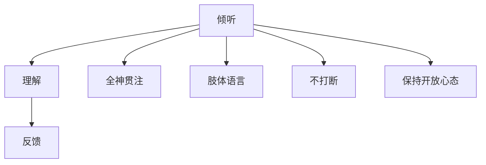

---

倾听是技术人沟通中不可或缺的一部分。通过掌握倾听的技巧、理解倾听的重要性以及进行倾听的实践，技术人可以显著提高自己的沟通能力。在技术行业，有效沟通是成功的关键，而倾听是有效沟通的基石。让我们一起努力，提升倾听技巧，为团队和项目的成功贡献力量。在接下来的章节中，我们将继续探讨如何通过清晰表达来提高沟通效果。

### 第5章：清晰表达

清晰表达是技术人沟通中的另一项重要技能。它不仅有助于传达自己的观点和需求，还能够避免误解和歧义，提高沟通的效率。在本章节中，我们将介绍清晰表达的技巧、表达的重要性以及表达的实践方法。

#### 5.1 表达的技巧

清晰表达需要运用一系列技巧，以下是一些有效的表达技巧：

1. **使用简洁语言**：避免使用复杂的词汇和句子结构，尽量使用简单、易懂的语言。
2. **明确表达意图**：在开始表达之前，明确自己的目的和意图，确保对方能够理解。
3. **注意语速和音量**：适当控制语速和音量，确保对方能够听清楚。
4. **使用举例**：通过具体的例子来说明观点，使对方更容易理解。
5. **避免假设**：在表达时，避免做出对方未知的假设，以免造成误解。
6. **重复关键信息**：在重要信息后进行重复，确保对方记住关键内容。

#### 5.2 表达的重要性

清晰表达在技术行业中具有重要意义：

1. **提高沟通效率**：通过清晰的表达，可以减少误解和重复解释的时间，提高沟通效率。
2. **避免冲突**：清晰的表达可以减少因误解而产生的冲突，促进团队合作。
3. **增强信任**：清晰的表达能够展现技术人的专业能力和诚意，增强他人对自己的信任。
4. **确保信息准确**：清晰的表达有助于确保信息传递的准确性，避免因误解而导致的错误。

#### 5.3 表达的实践

为了提高表达技巧，技术人可以采取以下实践方法：

1. **练习演讲**：通过参加演讲俱乐部或进行公开演讲，提高口头表达能力和自信心。
2. **写作练习**：定期进行写作练习，提高书面表达能力。
3. **模拟练习**：与同事进行模拟对话，练习在不同场景下的表达技巧。
4. **反思和总结**：在每次沟通后，反思自己的表达效果，总结哪些方面做得好，哪些方面需要改进。

#### 实例分析

假设在一个项目团队中，开发者C需要向项目经理D解释一个技术方案的细节。

**场景一**：

- **C**：这个方案很复杂，但是技术上可以行得通。
- **D**：你能详细解释一下吗？

**场景分析**：

在这个场景中，C没有使用简洁的语言，导致D感到困惑。改进的方法是：

- **C**：这个方案主要是基于我们现有的技术框架，通过一些优化可以满足项目需求。我会在明天详细准备一份方案文档给你。

通过这种方式，C使用了简洁的语言，明确了表达意图，使D更容易理解。

**场景二**：

- **C**：我们需要在下周完成这个功能。
- **D**：你确定吗？我们之前的项目都超过了预计时间。

**场景分析**：

在这个场景中，C没有给出明确的理由和依据，导致D对C的承诺表示怀疑。改进的方法是：

- **C**：是的，我经过仔细评估，认为我们可以按期完成。我已经和团队成员讨论过，并且调整了时间表，确保项目按时交付。

通过这种方式，C给出了明确的理由和依据，使D对C的承诺更加信任。

#### 总结

清晰表达是技术人沟通中不可或缺的一部分。通过掌握表达技巧、理解表达的重要性以及进行表达的实践，技术人可以显著提高自己的沟通能力。在技术行业，清晰表达不仅能够提高沟通效率，还能够增强团队的凝聚力和信任感。让我们共同努力，提升清晰表达能力，为团队和项目的成功贡献力量。

---

**核心概念术语说明**

- **清晰表达**：使用简洁、明确的语言，确保信息传递的准确性和易懂性。
- **简洁语言**：避免使用复杂的词汇和句子结构。
- **明确表达意图**：在开始表达之前，明确自己的目的和意图。
- **举例**：通过具体的例子来说明观点。

**问题背景**：技术人在项目开发过程中，由于表达不清，常常导致误解和冲突。

**问题描述**：技术人需要提高清晰表达能力，确保信息传递的准确性和易懂性。

**问题解决**：通过学习和实践清晰表达技巧，技术人可以更好地传达自己的观点和需求，避免误解和冲突。

**边界与外延**：清晰表达不仅适用于工作场合，也适用于日常沟通和社交场景。

**概念结构与核心要素组成**

1. **清晰表达的定义**：使用简洁、明确的语言，确保信息传递的准确性和易懂性。
2. **表达的技巧**：使用简洁语言、明确表达意图、注意语速和音量、使用举例、避免假设、重复关键信息。
3. **表达的重要性**：提高沟通效率、避免冲突、增强信任、确保信息准确。
4. **表达的实践**：练习演讲、写作练习、模拟练习、反思和总结。

**核心概念与联系**

- **清晰表达**：确保信息传递的准确性和易懂性，是有效沟通的关键。
- **简洁语言**：提高沟通效率，避免使用复杂的术语和句子。
- **明确表达意图**：确保对方理解自己的观点和需求。
- **举例**：使观点更具体，更容易被理解。

**ER实体关系图架构的 Mermaid 流程图**

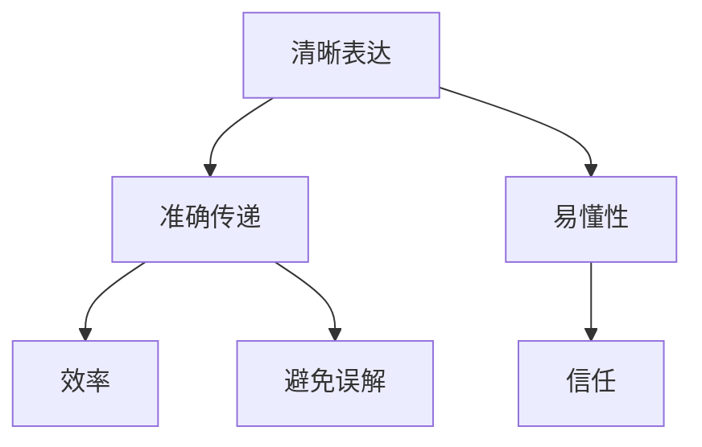

---

清晰表达是技术人成功沟通的基石。通过掌握表达技巧、理解表达的重要性以及进行表达的实践，技术人可以显著提高自己的沟通能力。在技术行业，清晰表达不仅能够提高沟通效率，还能够增强团队的凝聚力和信任感。让我们共同努力，提升清晰表达能力，为团队和项目的成功贡献力量。在接下来的章节中，我们将探讨提问技巧，帮助技术人更好地引导沟通，提高解决问题的能力。

### 第6章：提问技巧

提问是沟通中不可或缺的一部分，有效的提问不仅能够帮助技术人更好地理解对方的观点和需求，还能够引导对话，促进问题解决。本章节将介绍提问的类型、提问的技巧以及提问的实践方法。

#### 6.1 提问的类型

在技术沟通中，提问可以分为以下几种类型：

1. **开放式提问**：这种提问方式旨在获取详细的信息，例如：“你对这个方案有什么看法？”
2. **封闭式提问**：这种提问方式旨在获取特定的信息，例如：“这个功能需要一周时间来完成，对吗？”
3. **问题化陈述**：这种提问方式是将陈述转化为问题，例如：“这个功能的实现很复杂，对吗？”
4. **假设性提问**：这种提问方式是基于某种假设，鼓励对方思考，例如：“如果我们在这个环节添加一个功能，会带来哪些影响？”

#### 6.2 提问的技巧

有效的提问需要运用一系列技巧，以下是一些提问的技巧：

1. **具体化**：在提问时，尽量具体化问题，避免模糊不清，例如：“你能详细解释一下这个算法的原理吗？”
2. **引导性**：使用引导性问题，帮助对方思考，例如：“你觉得我们该如何优化这个算法的运行效率？”
3. **选择性**：在提问时，提供多个选项，让对方进行选择，例如：“这个功能有三种实现方案，你认为哪种最好？”
4. **确认性**：在提问后，进行确认性提问，确保对方理解，例如：“你是说我们需要在明天完成这个功能吗？”

#### 6.3 提问的实践

为了提高提问技巧，技术人可以采取以下实践方法：

1. **阅读和研究**：通过阅读相关文献和研究，了解不同类型的提问及其应用场景。
2. **模拟练习**：与同事进行模拟对话，练习提问技巧。
3. **反思和总结**：在每次沟通后，反思自己的提问效果，总结哪些方面做得好，哪些方面需要改进。
4. **多角度提问**：在团队讨论中，尝试从不同角度提问，促进全方位思考。

#### 实例分析

假设在一个项目团队中，产品经理E和开发团队需要讨论一个新功能的需求。

**场景一**：

- **E**：我们需要开发一个新功能。
- **开发团队**：具体是哪个功能，能详细说明一下吗？

**场景分析**：

在这个场景中，E没有具体说明新功能的需求，导致开发团队无法准确理解任务。改进的方法是：

- **E**：我们计划开发一个用户反馈系统，用户可以提交他们对产品的建议和反馈。

通过这种方式，E明确了新功能的需求，使开发团队能够更好地理解任务。

**场景二**：

- **E**：我们需要在三天内完成这个功能。
- **开发团队**：这个时间有点紧张，我们能否商量一下？

**场景分析**：

在这个场景中，开发团队没有通过有效的提问来引导对话，导致沟通效果不佳。改进的方法是：

- **E**：我理解时间紧张，我们可以讨论一下如何优化工作流程，确保按时完成。

通过这种方式，E通过提问引导对话，使双方能够更好地协商时间安排。

#### 总结

提问技巧是技术人有效沟通的重要组成部分。通过掌握提问的类型和技巧、进行提问的实践，技术人可以更好地理解对方的观点和需求，促进问题解决。在技术行业，有效的提问不仅能够提高沟通效率，还能够增强团队的合作和信任。让我们共同努力，提升提问技巧，为团队和项目的成功贡献力量。

---

**核心概念术语说明**

- **提问**：在沟通中提出问题，以获取信息、理解观点或解决问题。
- **开放式提问**：获取详细信息的提问方式。
- **封闭式提问**：获取特定信息的提问方式。
- **引导性提问**：帮助对方思考的提问方式。

**问题背景**：技术人在项目沟通中，由于提问技巧不足，常常导致误解和沟通不畅。

**问题描述**：技术人需要提高提问技巧，以更好地理解对方观点和需求，促进问题解决。

**问题解决**：通过学习和实践提问技巧，技术人可以更好地引导对话，提高沟通效果。

**边界与外延**：提问不仅适用于项目讨论，也适用于日常沟通和团队协作。

**概念结构与核心要素组成**

1. **提问的定义**：在沟通中提出问题，以获取信息、理解观点或解决问题。
2. **提问的类型**：开放式提问、封闭式提问、问题化陈述、假设性提问。
3. **提问的技巧**：具体化、引导性、选择性、确认性。
4. **提问的重要性**：获取信息、促进思考、提高沟通效果。

**核心概念与联系**

- **提问**：沟通中获取信息的重要手段。
- **开放式提问**：获取详细信息，促进全面理解。
- **封闭式提问**：获取特定信息，简化问题。
- **引导性提问**：帮助对方思考，引导对话。

**ER实体关系图架构的 Mermaid 流程图**

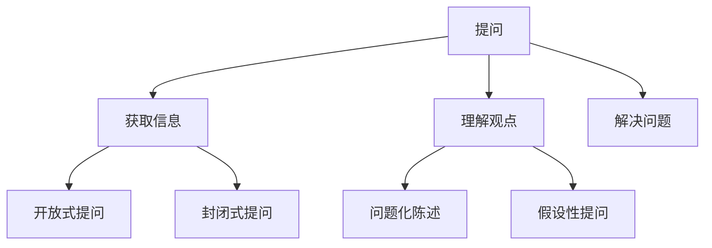

---

提问技巧是技术人沟通中不可或缺的一部分。通过掌握提问的类型和技巧、进行提问的实践，技术人可以更好地理解对方的观点和需求，促进问题解决。在技术行业，有效的提问不仅能够提高沟通效率，还能够增强团队的合作和信任。让我们共同努力，提升提问技巧，为团队和项目的成功贡献力量。在下一章节中，我们将探讨非语言沟通的技巧，帮助技术人在沟通中更好地运用非语言因素。

### 第7章：非语言沟通

非语言沟通在技术人的沟通中扮演着重要角色。它包括肢体语言、面部表情、眼神交流等多种形式，这些非语言信号能够补充和强化口头沟通，帮助技术人更好地传达自己的意图和感受。本章节将介绍非语言沟通的重要性、非语言沟通的技巧以及非语言沟通的实践方法。

#### 7.1 非语言沟通的重要性

非语言沟通在技术人的日常工作中具有重要意义：

1. **补充口头沟通**：非语言信号能够补充和强化口头信息，帮助对方更好地理解意图。
2. **表达情感和态度**：通过肢体语言和面部表情，技术人可以表达自己的情感和态度，增强沟通效果。
3. **建立信任**：积极的非语言信号能够建立信任，促进团队合作。
4. **减少误解**：非语言信号可以减少因口头沟通不足而导致的误解。

#### 7.2 非语言沟通的技巧

为了提高非语言沟通的效果，技术人可以运用以下技巧：

1. **保持眼神交流**：通过适当的眼神交流，展示对对方的尊重和关注。
2. **使用肢体语言**：通过肢体动作，如点头、手势和姿态，表达态度和意图。
3. **控制面部表情**：通过微笑、皱眉等面部表情，表达情感和态度。
4. **注意声音的语调**：通过语调的变化，传达情感和意图。
5. **保持开放的身体姿势**：通过开放的姿势，展示友好和开放的态度。

#### 7.3 非语言沟通的实践

为了提高非语言沟通能力，技术人可以采取以下实践方法：

1. **观察学习**：观察他人的非语言行为，学习如何运用非语言信号。
2. **模拟练习**：通过模拟对话，练习非语言沟通的技巧。
3. **自我反思**：在每次沟通后，反思自己的非语言行为，总结哪些方面做得好，哪些方面需要改进。
4. **接受反馈**：向同事和团队成员寻求反馈，了解自己的非语言行为如何影响沟通效果。

#### 实例分析

假设在一个项目团队中，团队成员F和项目经理G讨论项目进度。

**场景一**：

- **F**：我认为这个功能需要更多的开发时间。
- **G**：嗯，我也这么想。

**场景分析**：

在这个场景中，G没有通过非语言信号表达出自己的态度和意图。改进的方法是：

- **G**：嗯，我也觉得这个功能需要更多时间。我看到你皱着眉头，一定有很多顾虑，可以详细说说吗？

通过这种方式，G通过面部表情和语气，表达出自己的态度和关心，使F感到被重视。

**场景二**：

- **F**：我们需要在下周完成这个功能。
- **G**：这看起来有点紧张，你有什么计划吗？

**场景分析**：

在这个场景中，G通过肢体语言和语气，表达出对时间安排的担忧。改进的方法是：

- **G**：这确实是个挑战。我看到你的表情有些紧张，我们可以一起讨论一下如何调整计划，确保项目按时完成。

通过这种方式，G通过肢体语言和语气，展示出自己的关心和支持，促进了双方的合作。

#### 总结

非语言沟通是技术人沟通中不可或缺的一部分。通过掌握非语言沟通的技巧、进行非语言沟通的实践，技术人可以更好地传达自己的意图和情感，建立信任，减少误解。在技术行业，有效的非语言沟通不仅能够提高沟通效率，还能够增强团队的合作和信任。让我们共同努力，提升非语言沟通能力，为团队和项目的成功贡献力量。

---

**核心概念术语说明**

- **非语言沟通**：通过肢体语言、面部表情、眼神交流等非语言信号进行沟通。
- **眼神交流**：通过眼神的接触表达尊重和关注。
- **肢体语言**：通过姿态、手势等肢体动作表达意图和态度。
- **面部表情**：通过微笑、皱眉等面部表情表达情感和态度。

**问题背景**：技术人在沟通中，由于缺乏非语言沟通技巧，常常导致误解和沟通不畅。

**问题描述**：技术人需要提高非语言沟通技巧，以更好地传达自己的意图和情感，建立信任，减少误解。

**问题解决**：通过学习和实践非语言沟通技巧，技术人可以显著提高自己的沟通能力。

**边界与外延**：非语言沟通不仅适用于工作场合，也适用于日常沟通和社交场景。

**概念结构与核心要素组成**

1. **非语言沟通的定义**：通过肢体语言、面部表情、眼神交流等非语言信号进行沟通。
2. **非语言沟通的重要性**：补充和强化口头沟通，表达情感和态度，建立信任，减少误解。
3. **非语言沟通的技巧**：保持眼神交流、使用肢体语言、控制面部表情、注意声音的语调、保持开放的身体姿势。
4. **非语言沟通的实践**：观察学习、模拟练习、自我反思、接受反馈。

**核心概念与联系**

- **非语言沟通**：补充和强化口头沟通，表达情感和态度。
- **眼神交流**：表达尊重和关注。
- **肢体语言**：表达意图和态度。
- **面部表情**：表达情感和态度。

**ER实体关系图架构的 Mermaid 流程图**

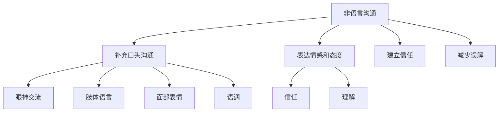

---

非语言沟通是技术人有效沟通的重要组成部分。通过掌握非语言沟通的技巧、进行非语言沟通的实践，技术人可以更好地传达自己的意图和情感，建立信任，减少误解。在技术行业，有效的非语言沟通不仅能够提高沟通效率，还能够增强团队的合作和信任。让我们共同努力，提升非语言沟通能力，为团队和项目的成功贡献力量。在下一章节中，我们将探讨技术人特有的沟通挑战，帮助技术人应对这些特殊的沟通情境。

### 第8章：专业术语的沟通

在技术行业中，专业术语是不可或缺的一部分。然而，这些专业术语对于非技术人员来说可能显得晦涩难懂，导致沟通障碍。因此，技术人在沟通中需要具备将专业术语通俗易懂地传达给非技术人员的技能。本章节将探讨专业术语的理解、专业术语的沟通技巧以及专业术语的沟通实践。

#### 8.1 专业术语的理解

专业术语是特定领域内的专门用语，用于描述复杂的概念、技术或过程。例如，在软件开发中，术语如“面向对象编程”、“数据库范式”等都是常见的专业术语。对于技术人员来说，理解这些术语是基础，但对于非技术人员，这些术语可能完全陌生。

**问题背景**：在项目讨论或跨部门合作时，技术人员使用专业术语，导致非技术人员无法理解，从而影响沟通效果。

**问题描述**：技术人需要理解专业术语，并将其转化为通俗易懂的语言，以便更好地与非技术人员沟通。

**问题解决**：通过学习和掌握专业术语的含义，技术人可以更好地解释专业术语，提高沟通效果。

**边界与外延**：专业术语不仅存在于软件开发领域，还存在于其他技术领域，如网络工程、人工智能等。

**概念结构与核心要素组成**

1. **专业术语的定义**：特定领域内的专门用语，用于描述复杂的概念、技术或过程。
2. **专业术语的理解**：掌握专业术语的含义，理解其在特定领域的应用。
3. **专业术语的转换**：将专业术语转化为通俗易懂的语言，便于非技术人员理解。

**核心概念与联系**

- **专业术语**：特定领域内的专门用语。
- **理解**：掌握专业术语的含义。
- **转换**：将专业术语转化为通俗易懂的语言。

**ER实体关系图架构的 Mermaid 流程图**

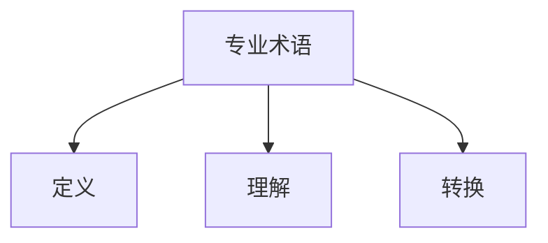

#### 8.2 专业术语的沟通技巧

为了有效传达专业术语，技术人需要运用以下沟通技巧：

1. **使用比喻**：通过比喻将复杂的专业术语与日常生活中的例子进行对比，使对方更容易理解。例如，将“面向对象编程”比喻为“构建积木模型”。
2. **解释原理**：在介绍专业术语时，先解释其背后的原理和概念，使对方能够理解术语的含义。例如，在解释“数据库范式”时，可以先介绍数据库的基本原理。
3. **提供实例**：通过具体实例展示专业术语的应用，使对方能够直观地理解。例如，通过一个实际的数据库设计案例来说明“第三范式”的应用。
4. **简洁明了**：避免使用过于复杂的术语和句子，尽量使用简单、易懂的语言进行解释。

#### 8.3 专业术语的沟通实践

为了提高专业术语的沟通能力，技术人可以采取以下实践方法：

1. **定期培训**：参加专业术语的培训课程，加深对专业术语的理解。
2. **模拟练习**：与同事进行模拟对话，练习将专业术语转化为通俗易懂的语言。
3. **反馈与改进**：在沟通后，向同事和团队成员寻求反馈，了解自己的表达是否清晰易懂，并进行改进。
4. **使用工具**：利用图表、图像和其他辅助工具，帮助对方更好地理解专业术语。

#### 实例分析

假设在一个软件开发项目中，技术团队需要与市场部沟通一个新功能的需求。

**场景一**：

- **技术人员H**：这个功能需要实现“MVC”架构。
- **市场部人员I**：什么是“MVC”？

**场景分析**：

在这个场景中，技术人员H使用了专业术语“MVC”，导致市场部人员I无法理解。改进的方法是：

- **技术人员H**：“MVC”是一种软件架构模式，类似于构建一个三层结构的积木模型。第一层负责数据存储，第二层处理逻辑，第三层负责展示界面。

通过这种方式，技术人员H通过比喻和解释原理，使市场部人员I更容易理解“MVC”架构。

**场景二**：

- **技术人员J**：我们需要在数据库中实现“范式规范化”。
- **市场部人员K**：这是为了什么？

**场景分析**：

在这个场景中，技术人员J没有解释“范式规范化”的目的，导致市场部人员K感到困惑。改进的方法是：

- **技术人员J**：“范式规范化”是为了确保数据库的设计合理，避免数据冗余和不一致。这样我们的数据库运行效率会更高，数据管理也会更方便。

通过这种方式，技术人员J通过提供实例和解释原理，使市场部人员K更好地理解“范式规范化”的重要性。

#### 总结

专业术语的沟通是技术人必须面对的挑战之一。通过理解和掌握专业术语，运用比喻、解释原理、提供实例等沟通技巧，技术人可以更好地与非技术人员沟通，提高沟通效果。在技术行业，有效的专业术语沟通不仅能够促进项目进展，还能够增强团队的合作和信任。让我们共同努力，提升专业术语的沟通能力，为团队和项目的成功贡献力量。

---

**核心概念术语说明**

- **专业术语**：特定领域内的专门用语，用于描述复杂的概念、技术或过程。
- **比喻**：将复杂术语与日常例子进行对比，便于理解。
- **解释原理**：介绍术语背后的原理和概念。
- **实例**：通过具体案例展示术语的应用。

**问题背景**：在项目沟通中，技术人员使用专业术语，导致非技术人员无法理解，影响沟通效果。

**问题描述**：技术人需要将专业术语转化为通俗易懂的语言，提高沟通效果。

**问题解决**：通过学习和实践专业术语的沟通技巧，技术人可以更好地与非技术人员沟通。

**边界与外延**：专业术语不仅存在于软件开发领域，还存在于其他技术领域。

**概念结构与核心要素组成**

1. **专业术语的定义**：特定领域内的专门用语。
2. **专业术语的理解**：掌握术语的含义和应用。
3. **沟通技巧**：使用比喻、解释原理、提供实例等。
4. **沟通实践**：通过培训、模拟练习、反馈与改进等方法提高沟通能力。

**核心概念与联系**

- **专业术语**：用于描述复杂概念。
- **比喻**：便于理解。
- **解释原理**：加深理解。
- **实例**：直观展示应用。

**ER实体关系图架构的 Mermaid 流程图**

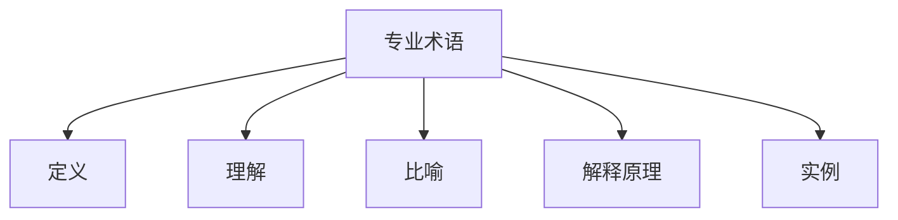

---

专业术语的沟通是技术人必须掌握的技能之一。通过理解和掌握专业术语，运用比喻、解释原理、提供实例等沟通技巧，技术人可以更好地与非技术人员沟通，提高沟通效果。在技术行业，有效的专业术语沟通不仅能够促进项目进展，还能够增强团队的合作和信任。让我们共同努力，提升专业术语的沟通能力，为团队和项目的成功贡献力量。在下一章节中，我们将探讨技术协作与项目管理的沟通技巧。

### 第9章：技术协作与项目管理的沟通技巧

在技术项目中，协作和项目管理是成功的关键。有效的沟通能够确保团队成员之间的信息共享，减少误解和冲突，提高项目的效率和质量。本章节将探讨技术协作中的沟通挑战、项目管理的沟通技巧以及技术协作与项目管理的实践方法。

#### 9.1 技术协作的挑战

技术协作中存在的沟通挑战主要包括：

1. **专业领域的差异**：不同技术领域的专业人员可能在术语、概念和思维方式上存在差异，导致沟通障碍。
2. **工作节奏的不同**：不同岗位的工作节奏可能不一致，影响协作效率。
3. **远程工作的挑战**：随着远程工作的普及，地理位置和时差的差异增加了沟通难度。
4. **信息过载**：技术项目中产生的海量信息可能导致团队成员无法有效处理和理解。

**问题背景**：在大型技术项目中，团队成员来自不同领域，专业知识和工作节奏的差异导致沟通不畅。

**问题描述**：技术人需要应对技术协作中的沟通挑战，提高协作效率。

**问题解决**：通过学习和实践沟通技巧，技术人可以更好地应对协作中的沟通挑战。

**边界与外延**：技术协作不仅存在于大型项目中，也存在于日常工作中。

**概念结构与核心要素组成**

1. **协作的定义**：团队成员共同完成任务的过程。
2. **协作中的挑战**：专业领域的差异、工作节奏的不同、远程工作的挑战、信息过载。
3. **沟通技巧**：提高协作效率的方法。

**核心概念与联系**

- **协作**：共同完成任务的过程。
- **沟通挑战**：专业领域的差异、工作节奏的不同、远程工作的挑战、信息过载。
- **沟通技巧**：提高协作效率的方法。

**ER实体关系图架构的 Mermaid 流程图**

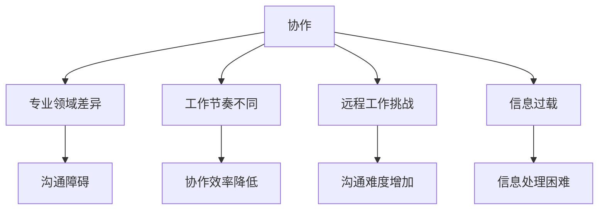

#### 9.2 项目管理的沟通技巧

在项目管理中，沟通技巧至关重要。以下是一些有效的项目管理沟通技巧：

1. **明确目标**：在项目开始前，确保所有团队成员对项目目标有共同的理解。
2. **定期会议**：定期召开项目会议，讨论项目进展、问题和解决方案。
3. **文档记录**：及时记录会议内容和关键决策，确保所有团队成员都能查阅。
4. **透明沟通**：保持沟通的透明度，确保团队成员了解项目的整体情况。
5. **积极反馈**：鼓励团队成员提供反馈，及时解决沟通中的问题。

**问题背景**：在项目管理中，信息传递不畅导致项目进展受阻。

**问题描述**：项目管理者需要提高沟通技巧，确保信息传递的准确性。

**问题解决**：通过学习和实践项目管理沟通技巧，项目管理者可以更好地协调团队工作，提高项目效率。

**边界与外延**：项目管理沟通技巧不仅适用于技术项目，也适用于其他类型的项目。

**概念结构与核心要素组成**

1. **项目管理的定义**：管理项目过程，确保项目目标的实现。
2. **沟通技巧**：明确目标、定期会议、文档记录、透明沟通、积极反馈。
3. **实践方法**：通过培训、模拟练习、团队建设活动提高沟通能力。

**核心概念与联系**

- **项目管理**：管理项目过程。
- **沟通技巧**：确保信息传递的准确性。
- **实践方法**：通过培训、模拟练习、团队建设活动提高沟通能力。

**ER实体关系图架构的 Mermaid 流程图**

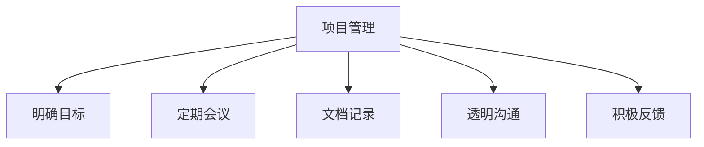

#### 9.3 技术协作与项目管理的实践

为了提高技术协作和项目管理的沟通能力，技术人和项目管理者可以采取以下实践方法：

1. **团队建设活动**：通过团队建设活动，增强团队成员之间的信任和沟通。
2. **沟通技巧培训**：参加沟通技巧培训课程，学习有效的沟通方法和技巧。
3. **模拟练习**：进行沟通模拟练习，提高团队成员的沟通能力和问题解决能力。
4. **反馈机制**：建立反馈机制，鼓励团队成员提供反馈，及时解决问题。

**实例分析**

在一个大型软件开发项目中，技术团队和项目经理需要确保项目的顺利推进。

**场景一**：

- **项目管理者G**：我们需要确保每个模块在规定时间内完成。
- **开发团队H**：但是我们的工作量很大，可能会延误。

**场景分析**：

在这个场景中，项目管理者G没有有效传达项目目标和时间压力，导致开发团队感到困惑。改进的方法是：

- **项目管理者G**：我理解你们的工作量很大，但是我们需要在规定时间内完成每个模块。我们可以一起讨论如何优化工作流程，确保按时交付。

通过这种方式，项目管理者G通过明确目标和提供解决方案，使开发团队更好地理解项目要求。

**场景二**：

- **开发团队I**：我们遇到了一个技术难题，需要团队成员J的帮助。
- **团队成员J**：好的，我马上过来。

**场景分析**：

在这个场景中，团队成员J通过及时响应，展示了积极的沟通态度，有助于解决技术难题。改进的方法是：

- **团队成员J**：好的，我马上过来，我们可以一起讨论解决方案。

通过这种方式，团队成员J通过积极的反馈和解决问题的态度，增强了团队协作。

#### 总结

技术协作与项目管理的沟通技巧对于技术项目的成功至关重要。通过识别和应对技术协作中的沟通挑战，运用有效的项目管理沟通技巧，技术人和项目管理者可以更好地协调团队工作，提高项目效率。在技术行业，有效的沟通不仅是成功的关键，也是团队合作和项目推进的基石。让我们共同努力，提升技术协作与项目管理的沟通能力，为团队和项目的成功贡献力量。

---

**核心概念术语说明**

- **技术协作**：团队成员共同完成任务的过程。
- **项目管理**：管理项目过程，确保项目目标的实现。
- **沟通技巧**：提高协作效率的方法。
- **团队建设活动**：增强团队成员之间的信任和沟通。

**问题背景**：在大型技术项目中，沟通不畅导致项目进展受阻。

**问题描述**：技术人和项目管理者需要提高沟通技巧，应对技术协作中的挑战，确保项目成功。

**问题解决**：通过学习和实践沟通技巧，技术人和项目管理者可以更好地协调团队工作，提高项目效率。

**边界与外延**：技术协作与项目管理的沟通技巧不仅适用于大型项目，也适用于日常工作和小型项目。

**概念结构与核心要素组成**

1. **协作的定义**：团队成员共同完成任务的过程。
2. **协作中的挑战**：专业领域的差异、工作节奏的不同、远程工作的挑战、信息过载。
3. **沟通技巧**：明确目标、定期会议、文档记录、透明沟通、积极反馈。
4. **实践方法**：团队建设活动、沟通技巧培训、模拟练习、反馈机制。

**核心概念与联系**

- **协作**：共同完成任务的过程。
- **项目管理**：管理项目过程。
- **沟通技巧**：确保信息传递的准确性。
- **实践方法**：通过培训和反馈提高沟通能力。

**ER实体关系图架构的 Mermaid 流程图**

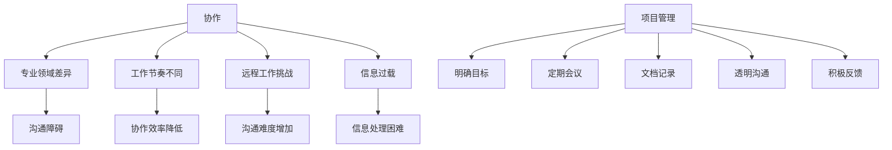

---

技术协作与项目管理的沟通技巧对于技术项目的成功至关重要。通过识别和应对技术协作中的沟通挑战，运用有效的项目管理沟通技巧，技术人和项目管理者可以更好地协调团队工作，提高项目效率。在技术行业，有效的沟通不仅是成功的关键，也是团队合作和项目推进的基石。让我们共同努力，提升技术协作与项目管理的沟通能力，为团队和项目的成功贡献力量。在下一章节中，我们将探讨跨部门沟通与合作，帮助技术人更好地处理跨部门合作中的沟通挑战。

### 第10章：跨部门沟通与合作

在大型企业中，跨部门沟通与合作是项目管理中的一大挑战。不同的部门拥有各自的专业领域和职责，彼此之间的沟通不畅可能导致项目延误、资源浪费和团队协作效率低下。本章节将探讨跨部门沟通的挑战、跨部门沟通的技巧以及跨部门沟通的实践方法。

#### 10.1 跨部门沟通的挑战

跨部门沟通中存在的挑战主要包括：

1. **专业领域的差异**：不同部门的专业知识和工作内容可能存在较大差异，导致沟通不畅。
2. **职责分工不清**：各部门之间的职责分工可能不明确，导致沟通中的职责推诿和效率低下。
3. **信息孤岛**：不同部门可能存在信息孤岛，信息共享不畅，影响项目进展。
4. **文化差异**：不同部门的文化和沟通风格可能不同，影响沟通效果。

**问题背景**：在大型企业中，项目管理需要多个部门的协作，但由于沟通不畅，项目进展受阻。

**问题描述**：技术人需要应对跨部门沟通的挑战，提高跨部门协作效率。

**问题解决**：通过学习和实践跨部门沟通技巧，技术人可以更好地处理跨部门合作中的沟通挑战。

**边界与外延**：跨部门沟通不仅存在于大型企业中，也存在于中小型企业的项目中。

**概念结构与核心要素组成**

1. **跨部门沟通的定义**：不同部门之间的沟通与协作。
2. **跨部门沟通的挑战**：专业领域的差异、职责分工不清、信息孤岛、文化差异。
3. **沟通技巧**：建立信任、明确目标、共享信息、适应文化差异。

**核心概念与联系**

- **跨部门沟通**：不同部门之间的沟通与协作。
- **沟通挑战**：专业领域的差异、职责分工不清、信息孤岛、文化差异。
- **沟通技巧**：建立信任、明确目标、共享信息、适应文化差异。

**ER实体关系图架构的 Mermaid 流程图**

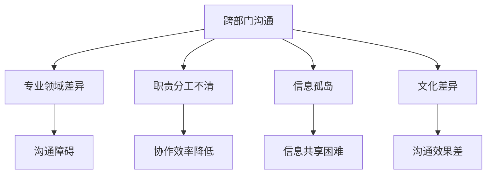

#### 10.2 跨部门沟通的技巧

为了提高跨部门沟通的效果，技术人可以采取以下技巧：

1. **建立信任**：通过积极参与项目，展现专业能力和责任心，建立跨部门的信任。
2. **明确目标**：确保所有部门对项目的目标有共同的理解，明确各部门的职责和任务。
3. **共享信息**：定期召开跨部门会议，分享项目进展、问题和解决方案，确保信息透明。
4. **适应文化差异**：尊重并理解不同部门的文化差异，采取适当的沟通策略。

**问题背景**：在一个大型企业中，研发部门和技术支持部门在项目合作中沟通不畅。

**问题描述**：技术人需要提高跨部门沟通技巧，确保项目顺利进行。

**问题解决**：通过建立信任、明确目标、共享信息和适应文化差异，技术人可以改善跨部门沟通。

**边界与外延**：跨部门沟通技巧不仅适用于大型企业，也适用于中小型企业的跨部门协作。

**概念结构与核心要素组成**

1. **建立信任**：通过展现专业能力和责任心，建立跨部门信任。
2. **明确目标**：确保所有部门对项目目标有共同理解。
3. **共享信息**：定期召开跨部门会议，分享项目进展和问题。
4. **适应文化差异**：尊重并理解不同部门的文化差异。

**核心概念与联系**

- **建立信任**：通过专业能力和责任心。
- **明确目标**：确保共同理解。
- **共享信息**：确保信息透明。
- **适应文化差异**：尊重和理解文化差异。

**ER实体关系图架构的 Mermaid 流程图**

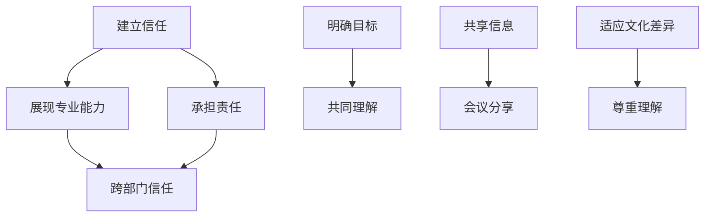

#### 10.3 跨部门沟通的实践

为了提高跨部门沟通能力，技术人可以采取以下实践方法：

1. **跨部门培训**：参加跨部门培训课程，了解不同部门的职责和沟通方式。
2. **团队建设活动**：组织跨部门团队建设活动，增强团队间的信任和合作。
3. **模拟练习**：通过模拟跨部门协作场景，练习有效的沟通技巧。
4. **定期反馈**：与跨部门同事进行定期反馈，了解沟通中的问题和改进方向。

**实例分析**

在一个大型企业中，研发部门和技术支持部门需要合作完成一个软件升级项目。

**场景一**：

- **研发部门K**：我们需要技术支持部门协助进行系统测试。
- **技术支持部门L**：但是我们的工作量很大，可能无法及时配合。

**场景分析**：

在这个场景中，研发部门和技术支持部门之间缺乏有效的沟通，导致项目进展受阻。改进的方法是：

- **研发部门K**：我理解你们的工作量很大，我们可以一起讨论如何优化测试流程，确保项目进度。

通过这种方式，研发部门K通过建立信任和共享信息，改善了跨部门沟通。

**场景二**：

- **研发部门M**：我们计划在下周一发布新版本，需要技术支持部门的反馈。
- **技术支持部门N**：好的，我们会及时提供测试反馈。

**场景分析**：

在这个场景中，研发部门M通过明确目标和共享信息，确保了跨部门之间的协同工作。

#### 总结

跨部门沟通与合作是大型企业项目管理中的重要一环。通过识别和应对跨部门沟通的挑战，运用有效的沟通技巧，技术人可以改善跨部门协作，提高项目效率。在技术行业，有效的跨部门沟通不仅能够促进项目进展，还能够增强团队的合作和信任。让我们共同努力，提升跨部门沟通能力，为团队和项目的成功贡献力量。

---

**核心概念术语说明**

- **跨部门沟通**：不同部门之间的沟通与协作。
- **建立信任**：通过展现专业能力和责任心。
- **明确目标**：确保所有部门对项目目标有共同理解。
- **共享信息**：定期召开跨部门会议，分享项目进展和问题。
- **适应文化差异**：尊重并理解不同部门的文化差异。

**问题背景**：在大型企业中，跨部门沟通不畅导致项目进展受阻。

**问题描述**：技术人需要提高跨部门沟通技巧，确保项目顺利进行。

**问题解决**：通过建立信任、明确目标、共享信息和适应文化差异，技术人可以改善跨部门沟通。

**边界与外延**：跨部门沟通技巧不仅适用于大型企业，也适用于中小型企业的跨部门协作。

**概念结构与核心要素组成**

1. **跨部门沟通的定义**：不同部门之间的沟通与协作。
2. **跨部门沟通的挑战**：专业领域的差异、职责分工不清、信息孤岛、文化差异。
3. **沟通技巧**：建立信任、明确目标、共享信息、适应文化差异。
4. **实践方法**：跨部门培训、团队建设活动、模拟练习、定期反馈。

**核心概念与联系**

- **跨部门沟通**：不同部门之间的沟通与协作。
- **沟通挑战**：专业领域的差异、职责分工不清、信息孤岛、文化差异。
- **沟通技巧**：建立信任、明确目标、共享信息、适应文化差异。
- **实践方法**：通过培训和反馈提高沟通能力。

**ER实体关系图架构的 Mermaid 流程图**

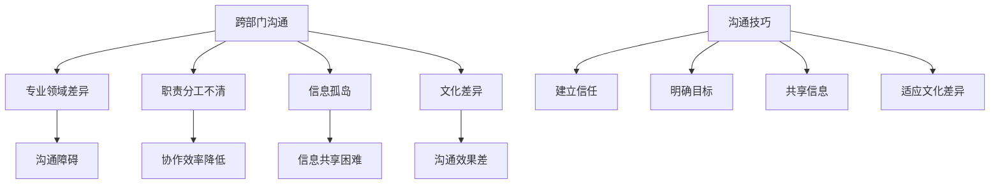

---

跨部门沟通与合作是大型企业项目管理中的重要一环。通过识别和应对跨部门沟通的挑战，运用有效的沟通技巧，技术人可以改善跨部门协作，提高项目效率。在技术行业，有效的跨部门沟通不仅能够促进项目进展，还能够增强团队的合作和信任。让我们共同努力，提升跨部门沟通能力，为团队和项目的成功贡献力量。在下一章节中，我们将通过案例分析，探讨技术人在实际项目中如何应对沟通挑战。

### 第11章：技术人沟通案例分享

通过实际案例的分析，我们可以深入了解技术人如何应对沟通挑战，实现有效的沟通。以下是一些典型的技术人沟通案例，包括成功和失败的例子，以及从中得出的启示。

#### 11.1 案例一：成功的跨部门沟通

在一个大型企业中，研发部门和技术支持部门合作开发一款新软件。由于这是首次合作，双方都对对方的工作流程和文化不太了解，导致初期沟通不畅。

**问题背景**：研发部门和技术支持部门在项目初期缺乏有效沟通，导致项目进度缓慢。

**问题描述**：如何改善跨部门沟通，确保项目顺利推进？

**问题解决**：
- **建立信任**：通过定期的跨部门会议，双方分享项目进展和遇到的问题，建立了相互信任。
- **明确目标**：明确项目的目标和每个部门的职责，确保双方对项目的理解一致。
- **共享信息**：建立了一个共享文档平台，实时更新项目进度和问题，确保信息透明。

**启示**：
- **建立信任**：通过沟通建立信任，减少误解和冲突。
- **明确目标**：确保所有部门对项目目标有共同的理解。
- **共享信息**：确保信息透明，减少信息孤岛。

#### 11.2 案例二：技术协作中的沟通挑战

在一个软件开发项目中，前端开发和后端开发团队在项目中期遇到了技术难题，但由于沟通不畅，问题未能及时解决，导致项目延期。

**问题背景**：前端开发和后端开发团队在项目中期缺乏有效沟通，导致问题积累。

**问题描述**：如何改善技术协作中的沟通，避免问题积累？

**问题解决**：
- **定期技术评审**：团队每周进行技术评审，讨论遇到的问题和解决方案。
- **共享代码库**：建立共享代码库，实时更新代码，确保双方对代码的变化有共同理解。
- **建立问题反馈机制**：通过问题反馈机制，及时记录和解决技术问题。

**启示**：
- **定期技术评审**：定期评审有助于及时发现问题，避免问题积累。
- **共享代码库**：共享代码库有助于双方共同理解代码变化。
- **建立问题反馈机制**：及时反馈和解决问题，减少项目延期风险。

#### 11.3 案例三：项目管理中的沟通失误

在一个大型项目中，项目经理未能及时与团队成员沟通项目目标和进度，导致团队成员在项目执行过程中缺乏方向，项目进展缓慢。

**问题背景**：项目经理在项目管理中缺乏有效沟通，导致项目进度缓慢。

**问题描述**：如何改善项目管理中的沟通，确保项目顺利进行？

**问题解决**：
- **定期项目会议**：项目经理每周召开项目会议，与团队成员讨论项目进展和问题。
- **项目进度报告**：项目经理定期向团队成员提供项目进度报告，确保团队成员了解项目情况。
- **建立沟通渠道**：建立一个开放、透明的沟通渠道，确保团队成员能够随时提出问题和建议。

**启示**：
- **定期项目会议**：定期会议有助于确保团队成员对项目的了解。
- **项目进度报告**：及时更新项目进度报告，确保团队成员对项目进展有共同理解。
- **建立沟通渠道**：确保团队成员能够随时沟通，减少信息不对称。

#### 总结

通过上述案例，我们可以看到，有效的沟通在技术项目的成功中起着至关重要的作用。无论是跨部门沟通还是技术协作，良好的沟通都是确保项目顺利进行的关键。成功案例和失败案例都为我们提供了宝贵的经验和教训，帮助我们识别和应对沟通挑战。

**成功案例的启示**：
- **建立信任**：通过沟通建立信任，减少误解和冲突。
- **明确目标**：确保所有部门对项目目标有共同的理解。
- **共享信息**：确保信息透明，减少信息孤岛。

**失败案例的启示**：
- **定期评审**：及时发现问题，避免问题积累。
- **共享代码库**：确保双方对代码的变化有共同理解。
- **建立反馈机制**：及时反馈和解决问题，减少项目延期风险。

在技术行业中，有效沟通不仅是技术人的基本功，也是团队协作和项目成功的关键。让我们从案例中吸取经验，提升沟通能力，为团队和项目的成功贡献力量。

---

**核心概念术语说明**

- **跨部门沟通**：不同部门之间的沟通与协作。
- **技术协作**：团队成员之间的沟通与协作。
- **项目管理**：管理项目过程，确保项目目标的实现。
- **信任**：通过沟通建立信任，减少误解和冲突。
- **信息透明**：确保信息透明，减少信息孤岛。

**问题背景**：技术人在项目中面临沟通挑战，影响项目进展。

**问题描述**：如何通过有效沟通解决技术人的沟通问题？

**问题解决**：通过建立信任、明确目标、共享信息和建立反馈机制，技术人可以改善沟通效果。

**边界与外延**：沟通问题不仅存在于大型项目中，也存在于日常工作中。

**概念结构与核心要素组成**

1. **跨部门沟通**：不同部门之间的沟通与协作。
2. **技术协作**：团队成员之间的沟通与协作。
3. **项目管理**：管理项目过程。
4. **信任**：通过沟通建立信任，减少误解和冲突。
5. **信息透明**：确保信息透明，减少信息孤岛。
6. **反馈机制**：及时反馈和解决问题。

**核心概念与联系**

- **跨部门沟通**：确保跨部门协作顺畅。
- **技术协作**：确保团队成员之间信息共享和问题解决。
- **项目管理**：确保项目目标的实现。
- **信任**：减少误解和冲突，提高团队协作效率。
- **信息透明**：确保信息流通，避免信息孤岛。

**ER实体关系图架构的 Mermaid 流程图**

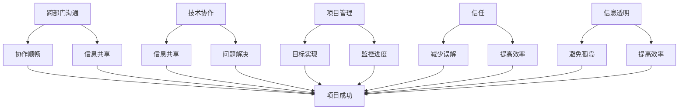

---

通过案例分析，我们了解了技术人在实际项目中如何应对沟通挑战，实现有效的沟通。成功案例和失败案例都为我们提供了宝贵的经验和教训，帮助我们识别和应对沟通中的问题。在技术行业中，有效沟通是团队协作和项目成功的关键。让我们从案例中吸取经验，提升沟通能力，为团队和项目的成功贡献力量。

### 第12章：成功沟通案例分析

在技术领域，成功的沟通不仅能够提高工作效率，还能够促进项目进展和团队协作。以下将分析一些成功的技术人沟通案例，探讨其成功的关键因素，并从中提炼出有益的启示。

#### 12.1 成功沟通的关键因素

**案例一：跨部门协作的项目成功**

在一个跨国公司的开发项目中，软件工程师和市场营销团队紧密合作，成功推出了一个新型产品。这个项目的成功主要归功于以下几个关键因素：

1. **明确的目标和职责**：在项目启动阶段，团队明确了项目的目标，并划分了各个部门的职责，确保每个人都清楚自己的任务。
2. **定期沟通**：团队建立了定期的沟通机制，包括每周的项目会议和进度更新，确保所有部门对项目进展有共同的理解。
3. **共享信息和资源**：通过共享文档和工具，团队实现了信息的透明化和资源的最大化利用，减少了沟通障碍。
4. **积极反馈**：团队成员之间建立了积极的反馈文化，及时交流和解决遇到的问题，确保项目能够持续进步。

**案例二：技术团队的内部沟通**

在一个大型软件开发项目中，技术团队通过高效的内部沟通，成功完成了复杂的技术实现。以下是成功的关键因素：

1. **清晰的任务分配**：项目经理在项目开始时，明确了每个团队成员的任务和职责，确保每个人都知道自己的具体工作。
2. **开放的沟通渠道**：团队建立了一个开放的沟通平台，鼓励成员随时提出问题和建议，确保信息流通无阻。
3. **技术评审**：团队定期进行技术评审，审查代码和设计，确保高质量的技术实现。
4. **团队合作精神**：团队成员之间建立了良好的信任和合作关系，共同面对挑战，确保项目的成功。

#### 成功沟通案例分析

**案例一：成功跨部门协作的项目**

- **背景**：跨国公司开发新型产品，涉及软件开发和市场营销。
- **问题描述**：如何确保跨部门高效协作？
- **解决方案**：
  - **明确目标和职责**：确保每个部门对项目目标有共同理解。
  - **定期沟通**：每周的项目会议和进度更新。
  - **共享信息和资源**：使用共享文档和工具。
  - **积极反馈**：及时交流和解决遇到的问题。

**案例二：技术团队的内部沟通**

- **背景**：大型软件开发项目。
- **问题描述**：如何确保技术团队内部高效协作？
- **解决方案**：
  - **清晰的任务分配**：项目经理明确每个团队成员的任务。
  - **开放的沟通渠道**：建立开放的沟通平台。
  - **技术评审**：定期审查代码和设计。
  - **团队合作精神**：建立良好的信任和合作关系。

#### 启示与反思

通过以上案例分析，我们可以提炼出以下成功沟通的启示和反思：

1. **明确目标和职责**：确保所有团队成员对项目目标有共同的理解，明确各自职责。
2. **定期沟通**：建立定期的沟通机制，确保信息流通，及时发现和解决问题。
3. **共享信息和资源**：使用共享工具和平台，提高信息透明度和资源利用效率。
4. **积极反馈**：鼓励团队成员之间的积极交流和反馈，及时解决问题，确保项目持续进步。
5. **团队合作精神**：建立良好的团队文化，鼓励团队成员相互信任，共同面对挑战。

这些启示和反思对于技术人在日常工作中提升沟通能力、实现高效协作具有重要的指导意义。在技术行业中，成功的沟通不仅是项目成功的关键，也是团队协作和职业发展的重要保障。让我们将这些启示应用到实际工作中，不断提升自己的沟通能力，为团队和项目的成功贡献力量。

---

**核心概念术语说明**

- **成功沟通**：在技术项目中实现高效沟通，确保项目目标的实现。
- **明确目标和职责**：确保团队成员对项目目标有共同理解，明确各自职责。
- **定期沟通**：建立定期的沟通机制，确保信息流通。
- **共享信息和资源**：使用共享工具和平台，提高信息透明度和资源利用效率。
- **积极反馈**：鼓励团队成员之间的积极交流和反馈。

**问题背景**：技术人在项目中面临沟通挑战，影响项目进展。

**问题描述**：如何通过成功沟通实现项目目标？

**问题解决**：通过明确目标和职责、定期沟通、共享信息和资源、积极反馈，实现高效沟通。

**边界与外延**：成功沟通不仅适用于项目团队内部，也适用于跨部门协作。

**概念结构与核心要素组成**

1. **成功沟通的定义**：在技术项目中实现高效沟通，确保项目目标的实现。
2. **明确目标和职责**：确保团队成员对项目目标有共同理解，明确各自职责。
3. **定期沟通**：建立定期的沟通机制，确保信息流通。
4. **共享信息和资源**：使用共享工具和平台，提高信息透明度和资源利用效率。
5. **积极反馈**：鼓励团队成员之间的积极交流和反馈。

**核心概念与联系**

- **成功沟通**：实现高效沟通，确保项目目标实现。
- **明确目标和职责**：减少误解和冲突，提高团队协作效率。
- **定期沟通**：确保信息流通，及时发现和解决问题。
- **共享信息和资源**：提高资源利用效率，确保项目顺利进行。
- **积极反馈**：促进问题解决，提高项目质量。

**ER实体关系图架构的 Mermaid 流程图**

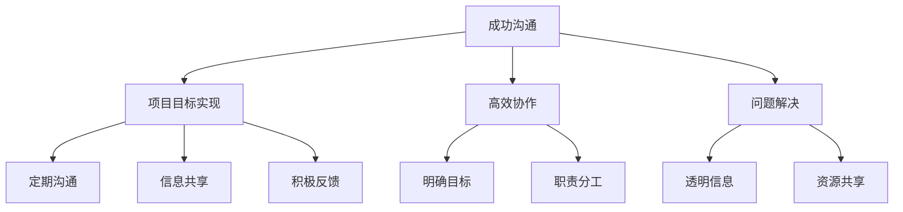

---

通过成功沟通案例分析，我们了解了在技术项目中实现高效沟通的关键因素。明确目标和职责、定期沟通、共享信息和资源、积极反馈是成功沟通的核心要素。这些要素不仅适用于项目团队内部，也适用于跨部门协作。在技术行业中，成功的沟通是项目成功和团队协作的重要保障。让我们将这些成功经验应用到实际工作中，不断提升自己的沟通能力，为团队和项目的成功贡献力量。

### 第13章：失败沟通案例分析

在技术项目中，沟通失败往往会导致项目延误、资源浪费和团队协作破裂。以下将分析一些技术人沟通失败的案例，探讨其失败的原因，并从中提炼出教训。

#### 13.1 案例一：项目延误

在一个软件开发项目中，项目经理未能及时与团队成员沟通项目目标和进度，导致团队成员在项目执行过程中缺乏方向，项目进度缓慢。

**问题背景**：项目经理在项目管理中缺乏有效沟通，导致项目延误。

**问题描述**：如何避免项目管理中的沟通失败？

**问题解决**：
- **定期项目会议**：项目经理应每周召开项目会议，与团队成员讨论项目进展和问题。
- **项目进度报告**：项目经理应定期向团队成员提供项目进度报告，确保团队成员了解项目情况。
- **建立沟通渠道**：确保团队成员能够随时沟通，减少信息不对称。

**失败原因**：
- **缺乏明确的目标和职责**：团队成员不清楚项目目标和职责，导致工作缺乏方向。
- **信息不透明**：项目进度和问题未能及时沟通，导致团队成员无法有效协作。
- **沟通渠道不畅**：团队成员无法及时沟通，影响项目进展。

**教训**：
- **明确目标和职责**：确保团队成员对项目目标有共同理解，明确各自职责。
- **定期沟通**：建立定期的沟通机制，确保信息流通，及时发现和解决问题。
- **建立沟通渠道**：确保团队成员能够随时沟通，减少信息不对称。

#### 13.2 案例二：团队协作破裂

在一个大型软件开发项目中，前端开发和后端开发团队由于沟通不畅，导致在项目中期出现严重的技术冲突，最终导致团队协作破裂。

**问题背景**：前端开发和后端开发团队在项目中期缺乏有效沟通，导致技术冲突。

**问题描述**：如何避免技术团队协作中的沟通失败？

**问题解决**：
- **定期技术评审**：团队应定期进行技术评审，讨论遇到的问题和解决方案。
- **共享代码库**：建立共享代码库，实时更新代码，确保双方对代码的变化有共同理解。
- **建立问题反馈机制**：通过问题反馈机制，及时记录和解决技术问题。

**失败原因**：
- **缺乏定期技术评审**：团队未能及时发现和解决技术问题，导致问题积累。
- **信息不共享**：前端开发和后端开发团队之间的信息不对称，导致沟通不畅。
- **缺乏问题反馈机制**：技术问题未能及时反馈和解决，导致冲突加剧。

**教训**：
- **定期技术评审**：定期评审有助于及时发现问题，避免问题积累。
- **共享代码库**：确保双方对代码的变化有共同理解。
- **建立问题反馈机制**：及时反馈和解决问题，减少冲突风险。

#### 13.3 案例三：跨部门协作失败

在一个跨国公司的项目中，研发部门和市场部门由于沟通不畅，导致项目在市场推广阶段失败。

**问题背景**：研发部门和市场部门在项目推广阶段缺乏有效沟通，导致项目失败。

**问题描述**：如何避免跨部门协作中的沟通失败？

**问题解决**：
- **建立跨部门沟通机制**：定期召开跨部门会议，讨论项目进展和市场情况。
- **明确市场目标**：确保研发部门和市场部门对市场目标有共同理解。
- **共享市场信息**：确保双方对市场信息有共同了解。

**失败原因**：
- **缺乏跨部门沟通**：研发部门和市场部门之间的沟通不畅，导致信息不对称。
- **市场目标不明确**：双方对市场目标没有共同理解，导致推广策略不一致。
- **信息不共享**：市场信息未能及时共享，影响项目推广效果。

**教训**：
- **建立跨部门沟通机制**：确保跨部门协作顺畅。
- **明确市场目标**：确保双方对市场目标有共同理解。
- **共享市场信息**：确保双方对市场信息有共同了解。

#### 总结

通过失败沟通案例分析，我们了解了沟通失败的原因和教训。缺乏明确的目标和职责、信息不透明、沟通渠道不畅、缺乏定期评审、信息不共享等问题都是导致沟通失败的主要原因。为了避免沟通失败，技术人需要明确目标和职责、建立定期的沟通机制、确保信息透明、及时反馈问题、建立问题反馈机制。在技术行业中，有效的沟通是项目成功和团队协作的保障。让我们从失败案例中吸取教训，提升沟通能力，为团队和项目的成功贡献力量。

---

**核心概念术语说明**

- **沟通失败**：在技术项目中，沟通不畅导致项目目标无法实现。
- **项目延误**：项目进度因沟通不畅而延迟。
- **团队协作破裂**：团队成员因沟通不畅而无法有效协作。
- **跨部门协作失败**：不同部门因沟通不畅而无法共同推进项目。

**问题背景**：技术人在项目中面临沟通挑战，导致项目失败。

**问题描述**：如何避免沟通失败，确保项目成功？

**问题解决**：通过明确目标和职责、建立定期的沟通机制、确保信息透明、及时反馈问题、建立问题反馈机制，避免沟通失败。

**边界与外延**：沟通失败不仅存在于项目团队内部，也存在于跨部门协作。

**概念结构与核心要素组成**

1. **沟通失败的定义**：在技术项目中，沟通不畅导致项目目标无法实现。
2. **项目延误**：项目进度因沟通不畅而延迟。
3. **团队协作破裂**：团队成员因沟通不畅而无法有效协作。
4. **跨部门协作失败**：不同部门因沟通不畅而无法共同推进项目。
5. **沟通失败的教训**：通过分析失败案例，总结避免沟通失败的方法。

**核心概念与联系**

- **沟通失败**：影响项目进展和团队协作。
- **项目延误**：因沟通不畅导致进度延迟。
- **团队协作破裂**：因沟通不畅导致团队无法协作。
- **跨部门协作失败**：因沟通不畅导致部门间无法协同。
- **沟通失败的教训**：避免沟通失败的方法和策略。

**ER实体关系图架构的 Mermaid 流�程图**

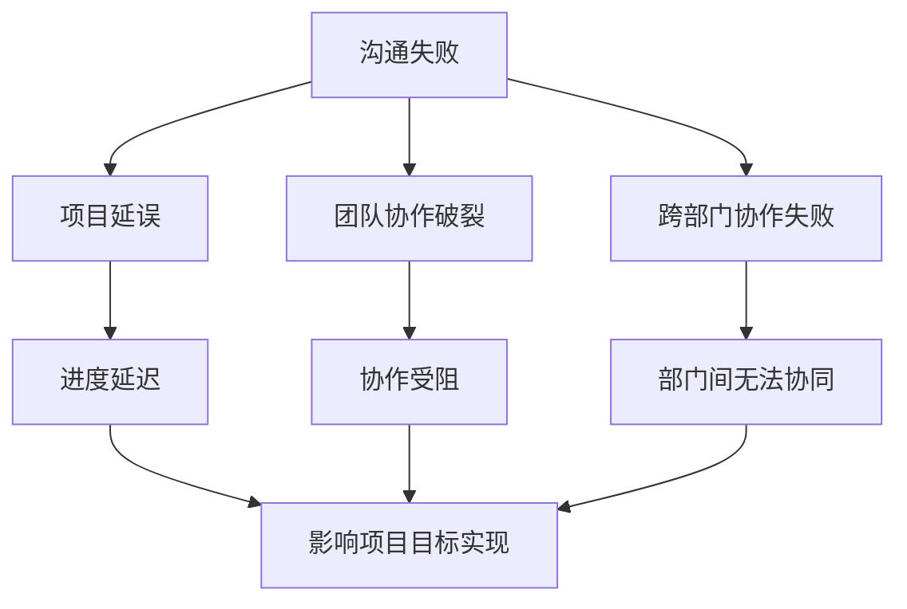

---

通过失败沟通案例分析，我们了解了导致沟通失败的主要原因和教训。为了避免沟通失败，技术人需要明确目标和职责、建立定期的沟通机制、确保信息透明、及时反馈问题、建立问题反馈机制。在技术行业中，有效的沟通是项目成功和团队协作的保障。让我们从失败案例中吸取教训，提升沟通能力，为团队和项目的成功贡献力量。

### 第14章：实践技巧

#### 14.1 沟通工具的使用

在技术行业中，选择合适的沟通工具是确保高效沟通的关键。以下是一些常用的沟通工具及其特点：

1. **即时通讯工具**：如Slack、Telegram等，适合实时沟通和协作。
   - **优点**：实时性、快捷性，适合短消息和紧急沟通。
   - **使用场景**：团队内部即时沟通、项目讨论。

2. **电子邮件**：如Gmail、Outlook等，适合正式沟通和文件传输。
   - **优点**：正式性、记录性，适合发送重要文档和通知。
   - **使用场景**：正式沟通、跨部门协作、项目进度报告。

3. **视频会议工具**：如Zoom、Microsoft Teams等，适合远程会议和面对面交流。
   - **优点**：高清视频、语音，适合远程协作、项目会议。
   - **使用场景**：远程团队会议、项目讨论、跨地域协作。

4. **文档协作工具**：如Google Docs、Microsoft Office 365等，适合文档编辑和共享。
   - **优点**：实时协作、版本控制，适合多人编辑同一文档。
   - **使用场景**：项目文档编写、代码评审、团队协作。

5. **项目管理工具**：如Trello、Jira等，适合任务管理、进度跟踪。
   - **优点**：任务分配、进度跟踪、通知提醒，适合项目管理和团队协作。
   - **使用场景**：项目计划、任务分配、进度跟踪、团队协作。

#### 14.2 邮件写作技巧

邮件是技术行业中重要的沟通方式之一。以下是一些邮件写作的技巧：

1. **简洁明了**：邮件应尽量简洁，避免冗长的叙述。
   - **优点**：提高阅读效率，节省时间。
   - **使用场景**：日常沟通、任务通知。

2. **明确主题**：在邮件主题中明确邮件内容，便于快速识别。
   - **优点**：提高邮件处理的效率。
   - **使用场景**：发送正式邮件、任务通知。

3. **清晰结构**：邮件应分为开头、正文和结尾，结构清晰。
   - **优点**：有助于对方快速理解邮件内容。
   - **使用场景**：正式沟通、项目报告。

4. **使用列表**：使用列表格式列出要点，使内容更易读。
   - **优点**：提高邮件的可读性。
   - **使用场景**：任务通知、项目进展报告。

5. **礼貌用语**：使用礼貌用语，表达尊重和诚意。
   - **优点**：增强沟通的友好性。
   - **使用场景**：所有邮件沟通。

#### 14.3 演讲与演示技巧

在技术行业中，演讲和演示是重要的交流方式。以下是一些演讲与演示的技巧：

1. **准备充分**：在演讲前充分准备，了解主题和相关知识。
   - **优点**：增强自信，提高演讲质量。
   - **使用场景**：项目展示、技术分享。

2. **清晰结构**：演讲应分为引言、主体和结论，结构清晰。
   - **优点**：有助于听众理解演讲内容。
   - **使用场景**：项目展示、会议发言。

3. **使用图表**：使用图表和数据支持演讲，使内容更具体、直观。
   - **优点**：增强说服力，提高听众兴趣。
   - **使用场景**：项目展示、技术讨论。

4. **与听众互动**：在演讲中与听众互动，提高听众参与度。
   - **优点**：增强演讲的生动性，提高听众理解。
   - **使用场景**：技术分享、项目展示。

5. **练习演讲**：在演讲前进行多次练习，提高演讲流畅性。
   - **优点**：增强演讲的自信心和表现力。
   - **使用场景**：所有公开演讲场合。

#### 总结

在技术行业中，沟通工具的使用、邮件写作技巧和演讲与演示技巧是提高沟通效率和质量的重要方法。通过选择合适的沟通工具、遵循邮件写作技巧和运用演讲与演示技巧，技术人可以更好地传达信息，促进团队协作和项目成功。让我们在实际工作中不断练习和改进，提升沟通能力，为团队和项目的成功贡献力量。

---

**核心概念术语说明**

- **沟通工具**：用于沟通和协作的软件和平台。
- **邮件写作技巧**：撰写邮件时使用的技巧和方法。
- **演讲与演示技巧**：进行演讲和演示时使用的技巧和方法。

**问题背景**：技术人在项目中面临沟通挑战，需要提高沟通效率和效果。

**问题描述**：如何通过沟通工具、邮件写作技巧和演讲与演示技巧，提高沟通效率和质量？

**问题解决**：通过选择合适的沟通工具、遵循邮件写作技巧和运用演讲与演示技巧，提高沟通效率和质量。

**边界与外延**：沟通工具、邮件写作技巧和演讲与演示技巧适用于所有技术项目和团队协作。

**概念结构与核心要素组成**

1. **沟通工具的使用**：即时通讯工具、电子邮件、视频会议工具、文档协作工具、项目管理工具。
2. **邮件写作技巧**：简洁明了、明确主题、清晰结构、使用列表、礼貌用语。
3. **演讲与演示技巧**：准备充分、清晰结构、使用图表、与听众互动、练习演讲。

**核心概念与联系**

- **沟通工具的使用**：提高沟通效率和效果。
- **邮件写作技巧**：提高邮件的可读性和沟通效果。
- **演讲与演示技巧**：提高演讲的质量和影响力。

**ER实体关系图架构的 Mermaid 流程图**

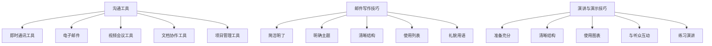

---

通过本章的实践技巧部分，我们详细介绍了沟通工具的使用、邮件写作技巧和演讲与演示技巧。这些技巧不仅能提高技术人的沟通效率和质量，还能促进团队协作和项目成功。在技术行业中，有效的沟通是关键，让我们在实际工作中不断应用和改进这些技巧，提升自己的沟通能力，为团队和项目的成功贡献力量。

### 第15章：邮件写作技巧

在技术行业中，邮件写作是一项重要的沟通技能。它不仅能够传达信息，还能体现个人的专业素养和沟通能力。本章节将详细探讨邮件写作的基本原则、具体技巧以及如何撰写有效邮件。

#### 15.1 邮件写作的基本原则

邮件写作应遵循以下基本原则，以确保沟通的清晰性和专业性：

1. **简洁明了**：邮件内容应简洁明了，避免冗长复杂的叙述。尽量使用简短、直接的句子，确保读者能够快速理解邮件内容。
2. **明确主题**：在邮件主题中明确邮件的主要内容，使收件人一目了然，便于快速处理。
3. **清晰结构**：邮件应分为开头、正文和结尾三个部分，结构清晰，便于读者阅读。
4. **礼貌用语**：使用礼貌用语，表达尊重和诚意，增强沟通的友好性。
5. **专业格式**：遵循专业的邮件格式，包括字体、字号、行距等，使邮件看起来更加整洁和专业。

#### 15.2 邮件写作的具体技巧

在撰写邮件时，以下技巧有助于提高邮件的质量和效果：

1. **使用简洁的语言**：避免使用复杂的词汇和句子结构，尽量使用简单、易懂的语言。例如，使用“请”和“谢谢”等礼貌用语，表达尊重和感谢。
2. **明确邮件意图**：在邮件的开头，明确邮件的主要意图和目的，使收件人能够迅速抓住重点。
3. **分段叙述**：将邮件内容分为几个段落，每个段落集中讨论一个主题。使用空行和标题，使邮件内容更加清晰易懂。
4. **使用图表和列表**：在适当的情况下，使用图表、表格和列表来展示数据和信息，使内容更加直观和易于理解。
5. **检查和校对**：在发送邮件前，仔细检查邮件内容，确保没有语法错误和拼写错误。同时，检查邮件格式，确保邮件看起来整洁和专业。

#### 15.3 如何撰写有效邮件

撰写有效邮件需要遵循一定的步骤和结构。以下是一个有效的邮件撰写流程：

1. **确定邮件目的**：在撰写邮件前，明确邮件的目的和目标，确保邮件内容有明确的方向。
2. **撰写邮件主题**：根据邮件内容，编写简洁、明确的邮件主题，使收件人能够快速了解邮件的主要内容。
3. **撰写邮件开头**：在邮件开头，简要介绍自己、邮件的目的和背景信息，使收件人能够迅速进入主题。
4. **撰写邮件正文**：在邮件正文中，详细阐述邮件的主要内容，使用简洁的语言和清晰的结构，确保邮件内容易于理解。
5. **撰写邮件结尾**：在邮件结尾，总结邮件内容，提出具体的请求或建议，并使用礼貌用语，表达感谢和期待。
6. **检查和修改**：在发送邮件前，仔细检查邮件内容，确保没有错误和遗漏，同时检查邮件格式，确保邮件看起来整洁和专业。
7. **发送邮件**：在确认邮件无误后，点击发送按钮，将邮件发送给收件人。

#### 实例分析

以下是一个邮件写作的实例：

**邮件主题**：关于项目进展的报告

**邮件开头**：

尊敬的团队成员，

我是项目管理员李明，以下是我们上周的项目进展报告。请各位同事查阅，并提出宝贵的意见和建议。

**邮件正文**：

1. **项目进度**：截至上周，我们已经完成了50%的任务，其中前端开发完成了70%，后端开发完成了60%。

2. **问题与挑战**：在开发过程中，我们遇到了以下问题：
   - 前端开发中的响应式设计遇到了一些技术难题。
   - 后端开发中的数据库设计需要进一步优化。

3. **解决方案**：为了解决上述问题，我们计划采取以下措施：
   - 前端开发团队将加强技术学习，提升响应式设计的技能。
   - 后端开发团队将进行数据库设计的评审，确保设计的合理性。

**邮件结尾**：

感谢各位同事的辛勤付出和协作，我们相信在大家的共同努力下，项目一定能按时完成。如有任何疑问或建议，请随时与我联系。谢谢！

祝好，

李明

**总结**

邮件写作是技术人必须掌握的一项技能。通过遵循邮件写作的基本原则和具体技巧，撰写简洁明了、结构清晰的邮件，技术人可以更有效地传达信息，促进团队协作和项目成功。让我们在日常工作中学以致用，不断提升邮件写作能力，为团队和项目的成功贡献力量。

---

**核心概念术语说明**

- **邮件写作**：撰写和发送电子邮件的技能。
- **简洁明了**：邮件内容简洁、直接。
- **明确主题**：邮件主题清晰、具体。
- **清晰结构**：邮件内容有条理、易读。

**问题背景**：技术人在项目中需要通过邮件进行沟通，但由于缺乏邮件写作技巧，邮件效果不佳。

**问题描述**：如何通过邮件写作技巧，提高邮件质量和效果？

**问题解决**：通过遵循邮件写作的基本原则和具体技巧，撰写简洁明了、结构清晰的邮件。

**边界与外延**：邮件写作技巧适用于所有需要通过邮件进行沟通的技术场景。

**概念结构与核心要素组成**

1. **邮件写作的定义**：撰写和发送电子邮件的技能。
2. **邮件写作的基本原则**：简洁明了、明确主题、清晰结构、礼貌用语。
3. **邮件写作的具体技巧**：使用简洁语言、明确邮件意图、分段叙述、使用图表和列表。
4. **如何撰写有效邮件**：确定邮件目的、撰写邮件主题、撰写邮件开头、正文和结尾、检查和修改、发送邮件。

**核心概念与联系**

- **邮件写作**：传达信息的重要途径。
- **简洁明了**：提高邮件的可读性。
- **明确主题**：便于快速识别和处理邮件。
- **清晰结构**：使邮件内容易于理解。

**ER实体关系图架构的 Mermaid 流程图**

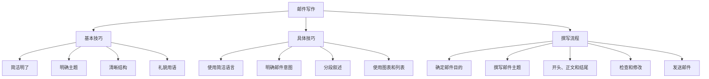

---

通过本章的邮件写作技巧部分，我们详细介绍了邮件写作的基本原则、具体技巧以及如何撰写有效邮件。这些技巧有助于技术人提高邮件质量和效果，促进团队协作和项目成功。让我们在实际工作中不断实践和改进，提升邮件写作能力，为团队和项目的成功贡献力量。

### 第16章：演讲与演示技巧

在技术行业中，演讲与演示是一项重要的沟通技能。它不仅能够传达信息，还能展示个人的专业素养和自信。一个成功的演讲与演示能够激发听众的兴趣，提高听众的理解，从而促进项目的进展和团队的协作。本章节将详细探讨演讲与演示的基本原则、具体技巧以及如何进行有效的演讲与演示。

#### 16.1 演讲与演示的基本原则

演讲与演示应遵循以下基本原则，以确保演讲的成功和有效性：

1. **明确目标**：在演讲前，明确演讲的目标和目的，确保演讲内容有明确的方向。
2. **充分准备**：在演讲前，充分准备演讲内容，包括资料、幻灯片和演示稿，确保演讲的流畅和完整。
3. **结构清晰**：演讲应分为引言、主体和结论三个部分，结构清晰，便于听众理解。
4. **内容简洁**：演讲内容应简洁明了，避免冗长的叙述，确保听众能够快速抓住重点。
5. **注重互动**：在演讲过程中，与听众保持互动，通过提问、回答和讨论，提高听众的参与度和理解。
6. **注意形象**：穿着得体、姿势端庄，注意演讲的形象，增强演讲的吸引力。

#### 16.2 演讲与演示的具体技巧

以下是一些演讲与演示的具体技巧，有助于提升演讲的质量和效果：

1. **精心设计幻灯片**：幻灯片应简洁、美观，内容应重点突出，避免文字过多。使用图表、图像和动画等元素，使幻灯片更加生动和直观。
2. **使用故事讲述**：通过故事讲述，使演讲内容更具吸引力和说服力。一个好的故事能够激发听众的兴趣，使听众更容易理解和接受演讲内容。
3. **练习演讲**：在演讲前，进行多次练习，熟悉演讲内容，确保演讲的流畅和自信。通过练习，可以及时发现和纠正演讲中的问题。
4. **控制时间**：在演讲过程中，注意控制时间，确保演讲在规定的时间内完成。如果时间紧张，可以适当减少内容，确保演讲的重点突出。
5. **与听众互动**：在演讲过程中，与听众保持互动，通过提问、回答和讨论，提高听众的参与度和理解。互动不仅能提高演讲的吸引力，还能使演讲内容更加深入人心。
6. **注意语速和语调**：在演讲过程中，注意语速和语调的变化，确保演讲的流畅性和吸引力。适当的语速和语调变化，可以使演讲更加生动和有说服力。

#### 16.3 如何进行有效的演讲与演示

以下是一个有效的演讲与演示的流程：

1. **确定演讲主题**：明确演讲的主题和目标，确保演讲内容有明确的方向。
2. **撰写演讲稿**：根据演讲主题，撰写演讲稿，确保演讲的内容有逻辑性和连贯性。
3. **设计幻灯片**：根据演讲稿，设计幻灯片，确保幻灯片的内容简洁、美观，重点突出。
4. **练习演讲**：在演讲前，进行多次练习，熟悉演讲内容，确保演讲的流畅和自信。
5. **准备演示工具**：确保演示工具（如电脑、投影仪等）的准备，确保演讲的顺利进行。
6. **进行演讲**：按照演讲稿和幻灯片的内容，进行演讲，注意与听众的互动。
7. **回答问题**：在演讲结束后，回答听众的问题，进一步解释和深化演讲内容。
8. **总结反馈**：演讲结束后，总结演讲的效果，收集听众的反馈，了解演讲的优缺点，为今后的演讲和演示提供参考。

#### 实例分析

以下是一个演讲与演示的实例：

**演讲主题**：人工智能在软件开发中的应用

**演讲稿**：

尊敬的各位听众，

今天我想和大家分享的主题是“人工智能在软件开发中的应用”。随着人工智能技术的不断发展，越来越多的软件开发项目开始利用人工智能技术提高开发效率、优化用户体验。

**幻灯片**：

1. **引言**：介绍人工智能的定义和应用领域。
2. **主体**：介绍人工智能在软件开发中的应用场景，如自动化测试、代码生成、智能推荐等。
3. **结论**：总结人工智能在软件开发中的优势和挑战，并提出未来发展的方向。

**演讲**：

我通过多次练习，确保演讲的流畅和自信。在演讲过程中，我使用了幻灯片展示关键内容，并通过提问和回答与听众互动。

**回答问题**：

演讲结束后，我回答了听众的问题，进一步解释了人工智能在软件开发中的应用细节。

**总结反馈**：

演讲结束后，我总结了演讲的效果，并收集了听众的反馈。通过反馈，我发现演讲内容清晰、生动，但在时间控制上还需改进。

**总结**

演讲与演示是技术人必须掌握的一项技能。通过明确目标、充分准备、结构清晰、内容简洁、注重互动和注意形象等原则，技术人可以有效地进行演讲与演示，提高演讲的质量和效果。让我们在实际工作中不断实践和改进，提升演讲与演示能力，为团队和项目的成功贡献力量。

---

**核心概念术语说明**

- **演讲与演示**：传达信息、展示专业素养的过程。
- **明确目标**：确保演讲内容有明确的方向。
- **充分准备**：熟悉演讲内容和幻灯片设计。
- **结构清晰**：演讲内容有条理、逻辑性强。
- **内容简洁**：避免冗长的叙述，突出重点。

**问题背景**：技术人在进行演讲和演示时，缺乏有效技巧，影响演讲效果。

**问题描述**：如何通过演讲与演示技巧，提高演讲质量和效果？

**问题解决**：通过明确目标、充分准备、结构清晰、内容简洁和注重互动等原则，提高演讲质量和效果。

**边界与外延**：演讲与演示技巧适用于所有需要进行演讲和演示的技术场景。

**概念结构与核心要素组成**

1. **演讲与演示的定义**：传达信息、展示专业素养的过程。
2. **基本原则**：明确目标、充分准备、结构清晰、内容简洁、注重互动、注意形象。
3. **具体技巧**：精心设计幻灯片、使用故事讲述、练习演讲、控制时间、与听众互动。
4. **如何进行有效演讲与演示**：确定演讲主题、撰写演讲稿、设计幻灯片、练习演讲、准备演示工具、进行演讲、回答问题、总结反馈。

**核心概念与联系**

- **演讲与演示**：传达信息、展示专业素养。
- **明确目标**：确保演讲内容有明确方向。
- **充分准备**：熟悉演讲内容和幻灯片设计。
- **结构清晰**：使演讲内容有条理、逻辑性强。
- **内容简洁**：突出重点，避免冗长叙述。
- **注重互动**：提高听众参与度和理解。

**ER实体关系图架构的 Mermaid 流程图**

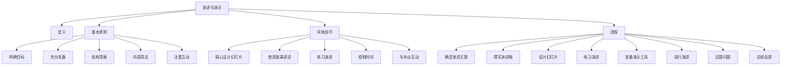

---

通过本章的演讲与演示技巧部分，我们详细介绍了演讲与演示的基本原则、具体技巧以及如何进行有效的演讲与演示。这些技巧有助于技术人提高演讲质量和效果，增强专业素养和自信。让我们在实际工作中不断实践和改进，提升演讲与演示能力，为团队和项目的成功贡献力量。

### 第17章：跨文化沟通

在全球化背景下，技术团队往往涉及不同国家和地区的成员，这带来了跨文化沟通的挑战。有效的跨文化沟通不仅有助于团队协作，还能促进项目成功。本章节将探讨跨文化沟通的重要性、跨文化沟通的技巧以及跨文化沟通的最佳实践。

#### 17.1 跨文化沟通的重要性

跨文化沟通在技术团队中具有重要意义：

1. **增强团队凝聚力**：通过有效的跨文化沟通，团队成员能够更好地理解彼此，增强团队凝聚力。
2. **提高项目效率**：跨文化沟通能够促进信息的准确传递，减少误解和冲突，提高项目效率。
3. **拓展国际视野**：跨文化沟通有助于团队成员了解不同文化，拓展国际视野，提高跨文化适应能力。
4. **提升客户满意度**：在跨国项目中，有效的跨文化沟通能够更好地理解客户需求，提升客户满意度。

#### 17.2 跨文化沟通的技巧

以下是一些跨文化沟通的技巧，有助于技术人提高跨文化沟通的效果：

1. **了解文化差异**：在跨文化沟通中，了解不同文化的特点和价值观念，避免文化冲突。
2. **尊重文化差异**：在沟通中尊重对方的语言、行为和文化习惯，避免因文化差异而产生的误解。
3. **使用简洁明了的语言**：避免使用复杂的术语和句子结构，确保信息清晰易懂。
4. **倾听和观察**：在沟通中积极倾听对方的意见，观察对方的行为和反应，确保理解对方的意思。
5. **使用非语言沟通**：利用肢体语言、面部表情和眼神交流等非语言方式，增强沟通效果。
6. **提供反馈**：在沟通后，及时给予反馈，确保信息的准确传递。

#### 17.3 跨文化沟通的最佳实践

为了提高跨文化沟通的效果，以下是一些最佳实践：

1. **建立跨文化沟通培训**：为团队成员提供跨文化沟通培训，提高他们的跨文化适应能力和沟通技巧。
2. **使用翻译工具**：在跨文化沟通中，使用翻译工具，确保信息的准确传达。
3. **定期交流**：定期召开跨文化会议，讨论项目进展和问题，确保团队成员之间的信息共享。
4. **建立跨文化团队**：在团队中引入多样化的文化背景，促进团队成员之间的交流和理解。
5. **鼓励跨文化合作**：鼓励团队成员参与跨文化项目，提高他们的跨文化沟通能力。

#### 实例分析

在一个跨国软件项目中，团队成员来自不同的国家，包括中国、美国和印度。为了确保项目顺利进行，团队采取了以下跨文化沟通的最佳实践：

1. **建立跨文化沟通培训**：项目开始前，为团队成员提供了跨文化沟通培训，讲解了不同文化的特点和沟通技巧。
2. **使用翻译工具**：在会议中，使用翻译工具，确保信息准确传达。
3. **定期交流**：每周召开跨文化会议，讨论项目进展和问题，确保团队成员之间的信息共享。
4. **建立跨文化团队**：团队中包括不同文化背景的成员，他们通过交流和合作，促进了团队间的理解和信任。
5. **鼓励跨文化合作**：团队成员在项目中积极参与跨文化合作，提高了他们的跨文化沟通能力和项目效率。

通过这些最佳实践，项目团队成功克服了跨文化沟通的挑战，项目进展顺利，最终成功交付。

#### 总结

跨文化沟通是技术团队在全球化背景下必须面对的挑战。通过了解文化差异、尊重文化差异、使用简洁明了的语言、倾听和观察、提供反馈等技巧，以及建立跨文化沟通培训、使用翻译工具、定期交流、建立跨文化团队和鼓励跨文化合作等最佳实践，技术人可以有效地提高跨文化沟通效果，促进团队协作和项目成功。让我们在实际工作中不断实践和改进，提升跨文化沟通能力，为团队和项目的成功贡献力量。

---

**核心概念术语说明**

- **跨文化沟通**：不同文化背景的人们之间的沟通。
- **文化差异**：不同文化之间的特点和差异。
- **沟通技巧**：提高跨文化沟通效果的方法。
- **最佳实践**：在实践中证明有效的跨文化沟通方法。

**问题背景**：技术团队中涉及不同国家和地区的成员，面临跨文化沟通的挑战。

**问题描述**：如何通过跨文化沟通技巧和最佳实践，提高跨文化沟通效果？

**问题解决**：通过了解文化差异、尊重文化差异、使用简洁明了的语言、倾听和观察、提供反馈等技巧，以及建立跨文化沟通培训、使用翻译工具、定期交流、建立跨文化团队和鼓励跨文化合作等最佳实践，提高跨文化沟通效果。

**边界与外延**：跨文化沟通技巧和最佳实践适用于所有涉及跨文化合作的技术团队。

**概念结构与核心要素组成**

1. **跨文化沟通的定义**：不同文化背景的人们之间的沟通。
2. **文化差异**：不同文化之间的特点和差异。
3. **沟通技巧**：提高跨文化沟通效果的方法。
4. **最佳实践**：在实践中证明有效的跨文化沟通方法。

**核心概念与联系**

- **跨文化沟通**：促进团队协作和项目成功。
- **文化差异**：理解不同文化，减少误解。
- **沟通技巧**：提高沟通效果。
- **最佳实践**：在实践中证明有效的跨文化沟通方法。

**ER实体关系图架构的 Mermaid 流程图**

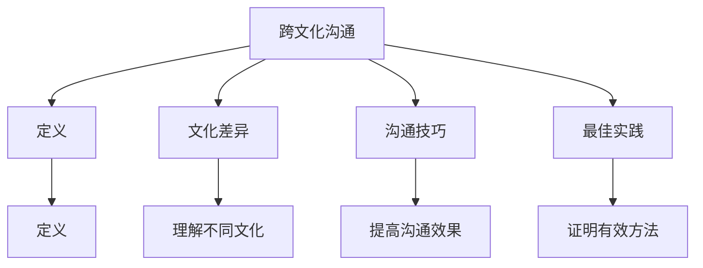

---

跨文化沟通是技术团队在全球化背景下必须面对的挑战。通过了解文化差异、尊重文化差异、使用简洁明了的语言、倾听和观察、提供反馈等技巧，以及建立跨文化沟通培训、使用翻译工具、定期交流、建立跨文化团队和鼓励跨文化合作等最佳实践，技术人可以有效地提高跨文化沟通效果，促进团队协作和项目成功。让我们在实际工作中不断实践和改进，提升跨文化沟通能力，为团队和项目的成功贡献力量。

### 结论

在技术行业中，有效沟通是团队协作和项目成功的关键。通过本文的探讨，我们详细介绍了沟通的基础理论、沟通技能提升、技术人特有的沟通挑战、案例分析和实践技巧。以下是文章的核心观点和结论：

1. **沟通的定义与目的**：沟通是信息传递的过程，其目的是确保信息的准确传递，促进团队成员之间的理解与合作。

2. **沟通的类型与障碍**：沟通可以分为口头沟通、书面沟通、非语言沟通和虚拟沟通等类型，同时存在语言障碍、文化差异、心理障碍和信息过载等障碍。

3. **沟通的基本原则**：沟通应遵循诚实、尊重、开放性和明确性的原则，这些原则有助于提高沟通的有效性。

4. **倾听技巧**：倾听是有效沟通的关键，通过全神贯注、肢体语言、不要打断和保持开放心态等技巧，可以提升倾听效果。

5. **清晰表达**：清晰表达有助于确保信息的准确传递，通过使用简洁语言、明确表达意图、使用举例、避免假设和重复关键信息等技巧，可以提高表达效果。

6. **提问技巧**：有效的提问可以引导对话，通过具体化、引导性、选择性和确认性等技巧，可以更好地获取信息。

7. **非语言沟通**：非语言沟通包括肢体语言、面部表情和眼神交流等，通过保持眼神交流、使用肢体语言、控制面部表情和注意语调等技巧，可以增强沟通效果。

8. **专业术语的沟通**：在技术沟通中，技术人需要具备将专业术语转化为通俗易懂的语言的能力，通过使用比喻、解释原理和提供实例等技巧，可以提高沟通效果。

9. **技术协作与项目管理的沟通技巧**：技术协作中，技术人需要应对专业领域的差异、工作节奏的不同、远程工作的挑战和信息过载等挑战，通过明确目标、定期会议、文档记录、透明沟通和积极反馈等技巧，可以提高协作效率。

10. **跨部门沟通与合作**：跨部门沟通与合作中，技术人需要建立信任、明确目标、共享信息和适应文化差异，通过建立跨部门沟通机制、明确市场目标、共享市场信息等技巧，可以改善跨部门协作。

11. **案例分析**：通过分析成功和失败的沟通案例，我们可以总结出成功沟通的关键因素，如建立信任、明确目标、共享信息和积极反馈等，以及避免沟通失败的教训。

12. **实践技巧**：通过使用合适的沟通工具、遵循邮件写作技巧、运用演讲与演示技巧和进行跨文化沟通等实践技巧，技术人可以显著提高沟通效果。

在技术行业中，有效沟通不仅是技术人的基本功，也是团队协作和项目成功的关键。通过本文的探讨，我们希望技术人能够认识到沟通的重要性，不断提升自己的沟通能力。让我们在实际工作中不断实践和改进，为团队和项目的成功贡献力量。

---

**作者信息**

作者：AI天才研究院/AI Genius Institute & 禅与计算机程序设计艺术 /Zen And The Art of Computer Programming

AI天才研究院专注于人工智能领域的研究和创新，致力于推动人工智能技术的发展和应用。禅与计算机程序设计艺术则强调在计算机编程中融入禅的哲学，追求代码与艺术的完美融合。本文旨在为技术人提供有效的沟通指南，帮助他们提升沟通能力，实现个人和团队的成功。

---

（本文完）

