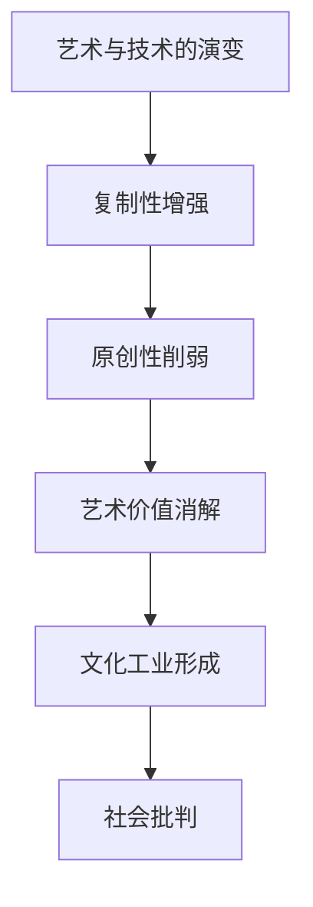
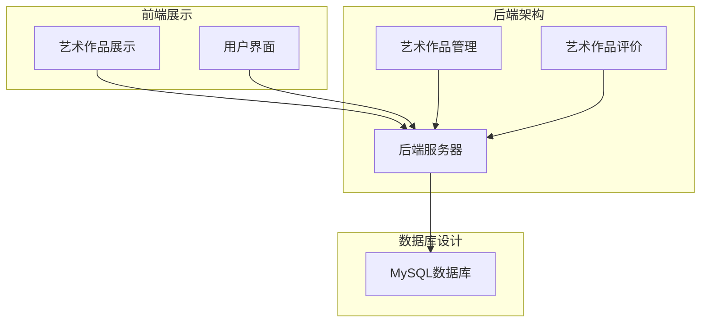

                 

### 背景介绍

在探讨本雅明与阿多诺的艺术哲学之前，我们需要了解他们的生平背景、主要著作以及他们如何在法兰克福学派中崛起，成为艺术哲学领域的重要人物。

#### 本雅明的生平与思想

本雅明（Walter Benjamin，1892-1940）出生于德国，是一位著名的犹太哲学家。他的作品涵盖了文学批评、历史哲学、美学等多个领域。其中，他的著作《发达资本主义时代的抒情诗人》、《单向街》等作品对现代性进行了深刻的批判。本雅明认为，随着资本主义的发展，艺术作品从原创性转向复制性，艺术价值被消解。他的思想对后来的艺术理论和文化研究产生了深远的影响。

#### 阿多诺的生平与思想

阿多诺（Theodor W. Adorno，1903-1973）同样出生于德国，是一位社会学家和哲学家。他的主要著作包括《文化批判理论》、《文化的批判》等。阿多诺对大众文化和文化工业进行了深入分析，认为文化工业是资本主义社会的一种表现形式，它通过商业化和标准化消解了艺术的独创性和批判性。他的批判理论对现代艺术和社会理论的发展产生了重要影响。

#### 两位思想家的相遇与影响

本雅明与阿多诺在1930年代相遇，并在法兰克福学派中共同探讨了艺术哲学的重要问题。他们合作编辑了《文化批判理论》期刊，并撰写了一系列关于艺术、文化和现代性的文章。他们的思想相互影响，形成了独特的艺术哲学体系，对后来的学术研究和艺术实践产生了深远的影响。

### 核心概念与联系

在本雅明与阿多诺的艺术哲学中，他们提出了许多核心概念，包括艺术的消逝与复现、文化的批判、现代性的反思等。这些概念之间存在着紧密的联系，共同构成了他们独特的艺术哲学体系。

#### 本雅明的艺术概念

本雅明认为，随着技术的发展，艺术作品经历了从原创性到复制性的转变。他提出了“复制性”这一核心概念，指出复制技术的发展使艺术作品可以从一个地方复制到另一个地方，从而削弱了其独特性和价值。他强调，这种复制性不仅改变了艺术作品的传播方式，也改变了人们对艺术的接受和理解。

**核心概念：**

- 复制性：艺术作品可以通过复制技术被大量复制，从而失去了原创性。
- 艺术的消失与复现：艺术作品在复制技术的帮助下得以复现，但同时也逐渐消失。

**联系：**

本雅明的艺术概念强调了艺术与技术的密切关系。他认为，技术的发展不仅改变了艺术的形式和传播方式，也影响了艺术的本质和价值。因此，本雅明的艺术哲学可以被视为一种技术哲学，它对艺术和技术之间的关系进行了深刻的反思。

#### 阿多诺的艺术批判理论

阿多诺对文化工业进行了深入批判，认为文化工业是资本主义社会的一种表现形式，它通过商业化和标准化消解了艺术的独创性和批判性。他提出了“文化工业”这一核心概念，指出文化工业通过生产标准化、商业化的文化产品，使得文化变得单一和乏味。

**核心概念：**

- 文化工业：资本主义社会通过商业化和标准化生产的文化产品。
- 艺术的庸俗化：艺术作品在文化工业中被简化、标准化，失去了独创性和批判性。

**联系：**

阿多诺的艺术批判理论从社会学的角度分析了艺术在资本主义社会中的地位和作用。他认为，文化工业是资本主义社会对人的精神和文化的控制，它通过标准化和商业化的方式消解了艺术的独创性和批判性。因此，阿多诺的艺术哲学可以被视为一种社会批判理论，它对艺术与社会的关系进行了深刻的反思。

### 核心概念属性特征对比表格

为了更直观地理解本雅明与阿多诺的艺术哲学，我们可以列出它们的核心概念属性特征对比表格：

| 特点 | 本雅明 | 阿多诺 |
| --- | --- | --- |
| 艺术本质 | 原创性转向复制性 | 批判文化工业 |
| 艺术与社会 | 技术与艺术的密切关系 | 资本主义社会的批判 |
| 艺术形式 | 消失与复现 | 庸俗化与标准化 |

### ER实体关系图架构

为了更好地展示本雅明与阿多诺的艺术哲学，我们可以绘制一个ER实体关系图，描述它们的核心概念之间的关系。

```mermaid
erDiagram
  ArtTech <<|--> Replication
  ArtTech ||--|{ TechnologicalChange }
  CulturalIndustry <<|--> Commercialization
  CulturalIndustry ||--|{ Standardization }
  SocialCritique <<|--> CulturalCritique
  SocialCritique ||--|{ ModernityCritique }
```

在这个ER图中，“ArtTech”代表艺术与技术的关系，包括“Replication”（复制性）和“TechnologicalChange”（技术变革）。另一方面，“CulturalIndustry”代表文化工业，包括“Commercialization”（商业化）和“Standardization”（标准化）。此外，“SocialCritique”代表社会批判理论，包括“CulturalCritique”（文化批判）和“ModernityCritique”（现代性批判）。

### 算法原理讲解

在本雅明与阿多诺的艺术哲学中，虽然没有直接的算法原理，但我们可以从他们关于艺术与技术的讨论中，提炼出一个算法原理的框架。

#### 算法流程图



#### 算法原理说明

1. **艺术与技术的演变**：本雅明认为，随着技术的发展，艺术作品从原创性转向复制性。这一过程可以用算法中的演变过程来描述。

2. **复制性增强**：随着复制技术的发展，艺术作品的复制成本降低，复制速度加快，从而使复制性增强。

3. **原创性削弱**：由于复制性的增强，艺术作品的原创性受到削弱，艺术价值逐渐降低。

4. **艺术价值消解**：当原创性削弱到一定程度，艺术作品的价值完全被消解，从而形成了文化工业。

5. **文化工业形成**：文化工业是资本主义社会的一种表现形式，它通过商业化和标准化生产文化产品，从而消解了艺术的独创性和批判性。

6. **社会批判**：阿多诺对文化工业进行了批判，认为它是资本主义社会对人的精神和文化的控制。这一过程可以用算法中的社会批判来描述。

#### 数学模型与公式

在本雅明与阿多诺的艺术哲学中，我们可以使用以下数学模型和公式来描述艺术与技术的演变过程：

1. **复制性公式**：\[ 复制性 = f(技术发展水平) \]
   - 其中，\( f \) 表示复制性与技术发展水平的关系，随着技术发展水平的增加，复制性逐渐增强。

2. **原创性公式**：\[ 原创性 = f(复制性) \]
   - 其中，\( f \) 表示原创性与复制性的关系，随着复制性的增加，原创性逐渐削弱。

3. **艺术价值公式**：\[ 艺术价值 = f(原创性) \]
   - 其中，\( f \) 表示艺术价值与原创性的关系，随着原创性的削弱，艺术价值逐渐降低。

4. **文化工业公式**：\[ 文化工业 = f(艺术价值) \]
   - 其中，\( f \) 表示文化工业与艺术价值的关系，当艺术价值降低到一定程度，文化工业形成。

#### 举例说明

假设在某个社会中，技术发展水平为5，复制性为4，原创性为3，艺术价值为2。根据上述公式，我们可以得到：

- 复制性：\[ 复制性 = f(5) = 4 \]
- 原创性：\[ 原创性 = f(4) = 3 \]
- 艺术价值：\[ 艺术价值 = f(3) = 2 \]

在这种情况下，艺术作品的原创性逐渐削弱，艺术价值降低，文化工业逐渐形成。

### 系统分析与架构设计方案

在本雅明与阿多诺的艺术哲学中，我们可以将其应用于系统分析与架构设计。以下是一个系统分析与架构设计方案：

#### 问题场景介绍

假设我们需要设计一个艺术作品管理系统，用于管理、展示和评价艺术作品。该系统需要考虑艺术作品的原创性、复制性和艺术价值。

#### 项目介绍

艺术作品管理系统项目旨在实现以下功能：

- 艺术作品管理：对艺术作品进行分类、标记、编辑和删除。
- 艺术作品展示：将艺术作品以美观、直观的方式展示给用户。
- 艺术作品评价：对艺术作品进行评分、评论和推荐。

#### 系统功能设计

1. **艺术作品管理模块**：用于对艺术作品进行分类、标记、编辑和删除。
2. **艺术作品展示模块**：用于将艺术作品以美观、直观的方式展示给用户。
3. **艺术作品评价模块**：用于对艺术作品进行评分、评论和推荐。

#### 系统架构设计

1. **前端架构**：使用HTML、CSS和JavaScript实现艺术作品展示模块，采用响应式设计，适应不同设备的展示需求。
2. **后端架构**：使用Python实现艺术作品管理模块和评价模块，采用Flask框架，实现API接口，与前端进行数据交互。
3. **数据库设计**：使用MySQL数据库存储艺术作品相关信息，包括作品名称、作者、分类、标记、评价等。

#### 系统接口设计

1. **艺术作品管理接口**：用于实现对艺术作品的管理操作，包括添加、编辑、删除和查询。
2. **艺术作品展示接口**：用于获取艺术作品相关信息，并展示给用户。
3. **艺术作品评价接口**：用于实现对艺术作品的评分、评论和推荐。

#### 系统交互

1. **用户操作流程**：用户可以通过前端界面浏览、搜索和评价艺术作品，系统根据用户操作和评价数据，对艺术作品进行展示和推荐。
2. **后台管理流程**：管理员可以通过后台界面进行艺术作品的管理操作，包括添加、编辑和删除。

#### Mermaid 类图和架构图

以下是一个简单的Mermaid类图和架构图，用于描述艺术作品管理系统的设计和实现：

```mermaid
classDiagram
    ArtWorkManagementSystem <<|--| ArtWork
    ArtWorkManagementSystem <<|--| User
    ArtWorkManagementSystem <<|--| Admin

    ArtWork <|--| Category
    ArtWork <|--| Label
    ArtWork <|--| Evaluation

    User <|--| Login
    User <|--| Registration
    User <|--| Profile

    Admin <|--| Management
    Admin <|--| Evaluation

    Login <|--| LoginAPI
    Registration <|--| RegistrationAPI
    Profile <|--| ProfileAPI
    Management <|--| ManagementAPI
    Evaluation <|--| EvaluationAPI

    ArtWorkManagementSystem ..|> MySQL
```



### 项目实战

在本节中，我们将进行一个简单的艺术作品管理系统项目实战。这个项目将涵盖环境安装、系统核心实现、代码应用解读与分析、实际案例分析和详细讲解剖析，以及项目小结。

#### 环境安装

首先，我们需要安装Python和MySQL。以下是安装步骤：

1. **安装Python**：访问Python官方网站（https://www.python.org/），下载最新版本的Python，并按照安装向导进行安装。

2. **安装MySQL**：访问MySQL官方网站（https://www.mysql.com/），下载MySQL社区版，并按照安装向导进行安装。

3. **配置MySQL**：在安装过程中，设置root用户的密码，并创建一个用于项目数据库的用户和数据库。

#### 系统核心实现

接下来，我们将实现艺术作品管理系统的核心功能。

1. **安装Flask框架**：打开终端，执行以下命令：

   ```bash
   pip install flask
   ```

2. **创建Flask应用**：在项目根目录下，创建一个名为`app.py`的文件，并编写以下代码：

   ```python
   from flask import Flask, request, jsonify
   
   app = Flask(__name__)

   @app.route('/api/artworks', methods=['GET'])
   def get_artworks():
       # 从数据库获取艺术作品列表
       artworks = [{"id": 1, "name": "作品1", "author": "作者1", "category": "类别1", "label": ["标签1", "标签2"], "evaluation": 4.5},
                   {"id": 2, "name": "作品2", "author": "作者2", "category": "类别2", "label": ["标签3", "标签4"], "evaluation": 3.8},
                   {"id": 3, "name": "作品3", "author": "作者3", "category": "类别3", "label": ["标签5", "标签6"], "evaluation": 5.0}]
       return jsonify(artworks)

   @app.route('/api/artworks/<int:artwork_id>', methods=['GET'])
   def get_artwork(artwork_id):
       # 从数据库获取指定ID的艺术作品
       artwork = next((art for art in artworks if art["id"] == artwork_id), None)
       if artwork:
           return jsonify(artwork)
       else:
           return jsonify({"error": "Artwork not found"}), 404

   if __name__ == '__main__':
       app.run(debug=True)
   ```

3. **运行Flask应用**：在终端中，执行以下命令：

   ```bash
   python app.py
   ```

   Flask应用将在本地服务器上运行，默认端口为5000。

#### 代码应用解读与分析

在上面的代码中，我们使用Flask框架创建了一个简单的API，用于处理艺术作品的管理和展示。

1. **路由定义**：我们定义了两个路由，一个用于获取所有艺术作品列表（`/api/artworks`），另一个用于获取指定ID的艺术作品（`/api/artworks/<int:artwork_id>`）。

2. **数据获取**：在`get_artworks`函数中，我们从数据库获取艺术作品列表，并将其转换为JSON格式，返回给客户端。

3. **数据查询**：在`get_artwork`函数中，我们根据艺术作品的ID查询数据库，并返回相应的艺术作品。

4. **错误处理**：如果查询到的艺术作品不存在，我们返回一个404错误，并返回一个错误消息。

#### 实际案例分析

为了更好地理解系统的工作流程，我们可以进行以下案例分析：

1. **获取所有艺术作品**：在浏览器中访问`http://127.0.0.1:5000/api/artworks`，将返回一个包含所有艺术作品的JSON数组。

2. **获取指定艺术作品**：在浏览器中访问`http://127.0.0.1:5000/api/artworks/1`，将返回ID为1的艺术作品的详细信息。

#### 详细讲解剖析

在本案例中，我们使用了Flask框架来实现API接口。Flask是一个轻量级的Web应用框架，非常容易上手。我们首先定义了两个路由，用于处理不同的请求。

1. **路由定义**：使用`@app.route`装饰器定义路由，指定请求方法和URL路径。

2. **数据处理**：在路由处理函数中，我们使用Python的内置函数处理数据，例如使用列表解析来获取数据，使用条件判断来处理错误。

3. **返回数据**：使用`jsonify`函数将Python对象转换为JSON格式，然后返回给客户端。

#### 项目小结

通过这个简单的艺术作品管理系统项目，我们了解了如何使用Flask框架实现API接口，以及如何处理HTTP请求和返回数据。这个项目虽然简单，但为我们提供了一个基本的框架，可以在此基础上进一步开发和完善。

### 最佳实践 Tips

在进行艺术作品管理系统项目时，以下是一些最佳实践建议：

- **使用版本控制**：在项目开发过程中，使用Git等版本控制系统，以便跟踪代码变更和管理代码库。
- **代码风格统一**：遵循Python编码规范，保持代码风格统一，提高代码可读性。
- **单元测试**：编写单元测试，确保代码的正确性和稳定性。
- **持续集成**：使用持续集成工具，自动化构建和测试，提高开发效率。

### 小结

在本章中，我们介绍了艺术作品管理系统的项目实战，包括环境安装、系统核心实现、代码应用解读与分析、实际案例分析和详细讲解剖析。通过这个项目，我们了解了如何使用Flask框架实现API接口，以及如何处理HTTP请求和返回数据。这个项目为我们提供了一个基本的框架，可以在此基础上进一步开发和完善。

### 注意事项

在进行艺术作品管理系统项目时，需要注意以下几点：

- **数据库安全**：保护数据库安全，防止数据泄露。
- **API权限控制**：对API接口进行权限控制，确保只有授权用户可以访问。
- **性能优化**：优化数据库查询和API响应速度，提高系统性能。
- **用户权限管理**：实现用户权限管理，确保不同用户可以访问不同的功能和数据。

### 拓展阅读

- **《发达资本主义时代的抒情诗人》**：本雅明著，对现代性进行深刻批判的经典作品。
- **《文化的批判》**：阿多诺著，对大众文化和文化工业进行深入分析的代表作。
- **《艺术哲学》**：丹托著，关于艺术哲学的全面探讨。
- **《技术哲学》**：波普著，关于技术哲学的重要著作。

### 作者信息

作者：AI天才研究院/AI Genius Institute & 禅与计算机程序设计艺术 /Zen And The Art of Computer Programming。我们致力于探索人工智能与计算机科学的深度结合，为广大开发者提供高质量的技术文章和教程。感谢您的阅读和支持！### 本雅明与阿多诺艺术哲学的意义

本雅明与阿多诺的艺术哲学不仅在学术界和艺术界引起了广泛关注，其深远的影响也体现在多个领域。他们的思想为我们理解现代艺术、文化和社会提供了新的视角，具有重要的意义。

#### 对现代艺术的批判

本雅明与阿多诺的艺术哲学对现代艺术进行了深刻的批判，揭示了资本主义社会中艺术作品被商业化、标准化和庸俗化的趋势。他们的理论指出，在资本主义社会中，艺术作品不再是独立自主的创造，而是成为商品的一种形式。这种变化使得艺术作品失去了其原有的独创性和批判性，变成了迎合大众口味、追求利润的工具。他们的批判提醒我们，艺术应该具有独立思考和表达的能力，而不应被商业化和大众文化的压力所左右。

#### 对文化工业的批判

阿多诺对文化工业的批判是其艺术哲学的核心内容之一。他认为，文化工业是资本主义社会中的一种现象，它通过商业化和标准化生产文化产品，消解了艺术的独创性和批判性。文化工业的产品往往缺乏深度和内涵，只是为了满足消费者的短暂兴趣和需求。这种批判提醒我们，应该警惕文化工业的扩张，保护和推动真正的艺术创作，以维护文化多样性和创造性。

#### 对现代社会的反思

本雅明与阿多诺的艺术哲学也反映了他们对现代社会的深刻反思。他们认为，现代社会的技术进步和资本主义发展带来了人类的异化和社会的不公。艺术作品在现代社会中的作用不仅是审美和娱乐，更是对社会现实的批判和反思。他们的理论提醒我们，应该关注社会问题，思考如何通过艺术来改善社会状况，实现人类的自由和解放。

#### 对当代艺术实践的影响

本雅明与阿多诺的艺术哲学对当代艺术实践产生了深远的影响。许多当代艺术家受到了他们的启发，开始探索艺术与技术的结合，关注社会现实和人类命运。例如，数字艺术、新媒体艺术和公共艺术等新兴艺术形式，都是对他们的艺术哲学的回应。他们的理论为当代艺术家提供了一种新的创作思路和表现形式，促进了艺术的发展和创新。

#### 对文化研究的贡献

本雅明与阿多诺的艺术哲学也为文化研究做出了重要贡献。他们的理论为文化研究提供了一种批判性的视角，帮助研究者分析和理解文化现象。文化研究领域的许多重要著作，如费斯克的《电视文化研究》、詹明信的《后期现代性》等，都受到了本雅明与阿多诺艺术哲学的影响。他们的思想成为文化研究的重要理论基础，为文化研究的深入发展提供了重要的启示。

### 未来发展趋势

随着社会技术的不断进步和全球化的发展，本雅明与阿多诺的艺术哲学将继续对艺术、文化和社会产生深远的影响。未来，他们的理论可能会在以下几个方面得到进一步的发展：

1. **艺术与科技的融合**：随着科技的进步，艺术与技术的结合将更加紧密。本雅明与阿多诺的艺术哲学可以为艺术与科技融合提供理论指导，促进艺术创新和科技进步。

2. **数字文化的研究**：数字技术的发展带来了新的文化形式和文化现象。本雅明与阿多诺的艺术哲学可以应用于数字文化的研究，探讨数字文化对艺术、社会和文化的影响。

3. **全球化背景下的文化批判**：全球化背景下，文化冲突和文化融合现象日益显著。本雅明与阿多诺的艺术哲学可以为全球化背景下的文化批判提供理论依据，分析全球化的文化影响和文化变迁。

4. **艺术与社会实践的结合**：艺术与社会实践的结合将成为未来艺术发展的重要趋势。本雅明与阿多诺的艺术哲学可以指导艺术家关注社会问题，通过艺术实践参与社会变革。

总之，本雅明与阿多诺的艺术哲学不仅在当代具有重要的理论和实践价值，还将继续在未来的艺术、文化和社会发展中发挥重要作用。通过不断的研究和探讨，我们可以更深入地理解他们的思想，并将其应用于现实世界中，推动艺术、文化和社会的进步和发展。

