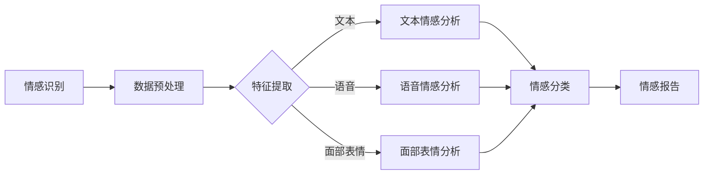
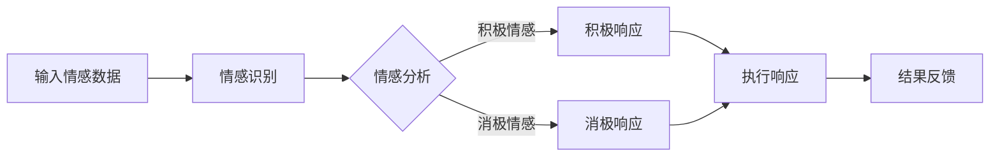

                 

# 机器人伦理学：情感AI的道德框架

> 关键词：机器人伦理学、情感AI、道德框架、伦理原则、责任归属

> 摘要：随着情感AI技术的发展，机器人逐渐成为我们生活中的重要伙伴。然而，情感AI在机器人中的应用也带来了伦理问题。本文将探讨机器人伦理学在情感AI领域的应用，提出道德框架的设计原则，并分析相关伦理挑战和应对策略。

## 第1章 引言

### 1.1 问题背景

随着人工智能技术的快速发展，机器人已逐渐成为人们生活中不可或缺的一部分。尤其是在服务机器人领域，从家庭服务机器人到医疗辅助机器人，再到教育辅助机器人，它们为我们的生活带来了极大的便利。然而，随着机器人智能水平的提升，其行为和决策涉及到伦理问题，特别是在涉及人类情感和生命安全的情况下，如何确保机器人遵循道德原则和人类价值观成为一个亟待解决的问题。

### 1.2 问题描述

机器人在执行任务时，其行为可能会影响到人类的福祉。如果机器人在情感AI方面缺乏道德框架，可能会导致以下问题：

- **伤害人类：** 如果机器人无法正确识别和应对人类的情感需求，可能会造成人身伤害或财产损失。
- **侵犯隐私：** 情感AI可能通过分析人类情感和行为来获取个人信息，这可能导致隐私泄露。
- **不公正决策：** 机器人可能基于情感偏见做出决策，导致不公正对待。

### 1.3 问题解决

为了解决这些问题，需要为机器人建立一套道德框架，以指导其行为。该框架应考虑以下方面：

- **伦理原则：** 确定机器人的行为准则，如尊重人类尊严、保护隐私、公正等。
- **情感识别与处理：** 提高机器人对人类情感的识别和应对能力。
- **透明性与责任：** 确保机器人的决策过程透明，便于人类监督和问责。

### 1.4 边界与外延

- **边界：** 本书主要关注机器人伦理学在情感AI领域的应用，包括但不限于医疗、教育、家庭等服务机器人。
- **外延：** 本书内容不仅限于机器人伦理学，还将涉及相关的法律、社会和文化因素。

## 第2章 核心概念与联系

### 2.1 机器人伦理学的核心概念

- **伦理学：** 伦理学是研究道德原则、价值观和人类行为规范的学科。在机器人伦理学中，伦理学为我们提供了构建道德框架的基础。
- **机器人：** 机器人是具有感知、决策和执行能力的自动化系统。随着情感AI技术的发展，机器人开始具备理解人类情感的能力。
- **情感AI：** 情感AI是一种结合情感识别和处理技术的AI系统。它能够识别和解析人类的情感，并根据这些情感做出相应的决策。

### 2.2 概念属性特征对比表格

| 概念        | 属性特征                                                         |
| ----------- | ------------------------------------------------------------ |
| 伦理学      | 研究道德原则、价值观、人类行为规范                           |
| 机器人      | 具有感知、决策和执行能力的自动化系统                       |
| 情感AI      | 结合情感识别和处理技术的AI系统                             |

### 2.3 ER实体关系图架构

```mermaid
erDiagram
  人 -->|感知| 机器人
  机器人 -->|交互| 情感AI
  人 -->|决策| 情感AI
```

## 第3章 伦理原则与道德框架

### 3.1 伦理原则概述

在构建机器人的道德框架时，我们需要遵循一些基本的伦理原则。以下是几个关键的原则：

- **尊重个体：** 机器人应尊重个体的权利和尊严。这意味着在处理人类情感时，机器人应避免对个体进行歧视或侵犯其隐私。
- **公正：** 机器人应避免基于情感偏见做出决策。这意味着机器人应确保在处理不同个体时，保持一致性和无偏见。
- **透明：** 机器人应保持决策过程透明，便于人类监督和问责。这意味着机器人的决策逻辑和过程应易于理解和验证。
- **责任：** 机器人应承担相应的道德责任。这意味着在机器人行为导致负面影响时，机器人应能够承担相应的责任。

### 3.2 道德框架设计

为了实现上述伦理原则，我们需要设计一个详细的道德框架。这个框架应包括以下几个关键组成部分：

- **情感识别：** 设计机器人情感识别模块，确保其能够准确识别人类情感。这可以通过机器学习和自然语言处理等技术实现。
- **决策机制：** 建立基于伦理原则的决策机制，确保机器人遵循道德准则。这可以通过设置明确的规则和约束条件来实现。
- **责任归属：** 明确机器人和人类在决策过程中的责任归属。这可以通过法律和伦理规范来界定。

### 3.3 道德框架的实现

道德框架的实现是一个复杂的过程，涉及到技术、法律、伦理和社会等多个方面。以下是一些关键的实施步骤：

1. **情感识别技术：** 首先需要开发出能够准确识别人类情感的AI技术。这包括自然语言处理、计算机视觉和生物特征识别等领域。
2. **决策算法设计：** 设计出基于伦理原则的决策算法，确保机器人在处理情感时能够做出正确的决策。
3. **法律和伦理规范：** 制定相应的法律和伦理规范，明确机器人和人类在情感处理中的责任和义务。
4. **社会反馈和调整：** 通过社会反馈来不断调整和优化道德框架，确保其能够适应不断变化的社会需求。

## 第4章 情感AI技术与应用

### 4.1 情感AI技术概述

情感AI技术是当前人工智能领域的一个重要研究方向。它旨在使机器人能够理解和处理人类的情感，从而更好地服务于人类。情感AI技术主要包括以下几个方面：

- **情感识别：** 利用自然语言处理、计算机视觉和生物特征识别等技术，机器人可以识别和理解人类的情感。
- **情感处理：** 在识别到情感后，机器人需要根据情感的类型和强度，做出相应的响应和决策。

### 4.2 情感AI应用案例

情感AI技术在各个领域都有广泛的应用。以下是一些典型的应用案例：

- **医疗：** 在医疗领域，情感AI可以帮助医生更好地理解患者的情绪状态，从而提供更加个性化的治疗方案。例如，通过分析患者的语音和面部表情，情感AI可以识别出患者的焦虑、抑郁等情绪，为医生提供重要的参考信息。
- **教育：** 在教育领域，情感AI可以帮助教师更好地了解学生的学习状态和情感需求，从而提供更加有效的教学方法和手段。例如，通过分析学生的情绪变化，情感AI可以自动调整教学内容的难度和节奏，以适应学生的学习需求。
- **家庭服务：** 在家庭服务领域，情感AI可以帮助家庭机器人更好地理解家庭成员的情感需求，提供更加人性化的服务。例如，通过分析家庭成员的语音、行为和表情，情感AI可以为家庭机器人提供个性化的音乐、新闻和娱乐等服务。

## 第5章 伦理挑战与应对策略

### 5.1 挑战

尽管情感AI技术在各个领域都取得了显著的成果，但其在实际应用中也面临一系列伦理挑战。以下是几个主要挑战：

- **情感识别准确性：** 情感识别技术的准确性直接影响机器人的决策质量。如果情感识别不准确，机器人可能会做出错误的决策，甚至造成人身伤害或财产损失。
- **伦理冲突：** 在实际应用中，机器人可能会遇到伦理冲突。例如，在医疗领域，机器人需要平衡患者的利益和医疗资源的分配，这可能导致伦理上的困境。
- **隐私保护：** 情感AI在处理人类情感时，可能会收集大量的个人情感数据。如果这些数据得不到妥善保护，可能会导致隐私泄露和个人信息滥用。

### 5.2 应对策略

针对上述挑战，我们需要采取一系列应对策略，以确保情感AI技术的伦理合规性和安全性：

- **技术改进：** 加大对情感识别和处理技术的研发投入，提高其准确性和可靠性。
- **法律和伦理规范：** 制定相关法律和伦理规范，明确机器人和人类在情感处理中的责任和义务，确保情感AI技术的合规性。
- **社会监督：** 通过社会监督和公众参与，确保情感AI技术的应用符合社会价值观和伦理准则。

## 第6章 伦理学在情感AI中的实践应用

### 6.1 应用场景

在情感AI技术的实践应用中，医疗、教育和家庭服务是三个主要的领域。以下是这三个领域中的具体应用场景：

- **医疗护理：** 在医疗护理中，情感AI可以帮助医生更好地了解患者的情绪状态，提供个性化的治疗方案。例如，通过分析患者的语音和面部表情，情感AI可以识别出患者的焦虑、抑郁等情绪，为医生提供重要的参考信息。
- **教育辅助：** 在教育辅助中，情感AI可以帮助教师更好地了解学生的学习状态和情感需求，提供更加有效的教学方法和手段。例如，通过分析学生的情绪变化，情感AI可以自动调整教学内容的难度和节奏，以适应学生的学习需求。
- **家庭服务：** 在家庭服务中，情感AI可以帮助家庭机器人更好地理解家庭成员的情感需求，提供更加人性化的服务。例如，通过分析家庭成员的语音、行为和表情，情感AI可以为家庭机器人提供个性化的音乐、新闻和娱乐等服务。

### 6.2 案例分析

以下是一个关于情感AI在医疗护理中的案例分析：

**案例背景：** 一位患有抑郁症的患者在接受心理治疗期间，医生需要定期了解患者的情绪状态，以便调整治疗方案。

**解决方案：** 医生利用情感AI技术，对患者进行情绪监测。通过分析患者的语音、面部表情和文字描述，情感AI可以识别出患者的情绪变化，并提供相应的情绪分析报告。

**效果评估：** 经过一段时间的使用，医生发现情感AI技术的情绪监测结果与患者的实际情绪状态高度一致。这为医生提供了重要的参考信息，帮助医生更好地了解患者的情绪变化，从而调整治疗方案。

**总结：** 通过这个案例，我们可以看到情感AI技术在医疗护理中的重要作用。它不仅提高了医生的工作效率，还为患者提供了更加个性化的治疗服务。

## 第7章 总结与展望

### 7.1 总结

本文从机器人伦理学的角度，探讨了情感AI技术的道德框架设计。我们首先介绍了情感AI技术的发展背景和应用领域，然后提出了伦理原则和道德框架设计的基本原则，并详细阐述了情感识别、决策机制和责任归属等关键组成部分。接着，我们分析了情感AI技术在实际应用中面临的伦理挑战，并提出了相应的应对策略。最后，我们通过具体案例，展示了情感AI技术在医疗护理、教育和家庭服务中的应用效果。

### 7.2 展望

未来，随着情感AI技术的不断发展和完善，我们可以期待它在更多领域得到应用，如社会保障、公共安全和城市管理等。同时，随着技术的进步，伦理问题和隐私保护也将成为更加紧迫的挑战。因此，我们需要继续深入研究，探索更加完善和合理的伦理框架，以确保情感AI技术的安全、可靠和合规。

## 作者信息

作者：AI天才研究院/AI Genius Institute & 禅与计算机程序设计艺术 /Zen And The Art of Computer Programming

AI天才研究院是一家专注于人工智能研究与应用的创新机构，致力于推动人工智能技术的发展和应用。禅与计算机程序设计艺术则是一部经典的计算机编程著作，为程序员提供了深刻的思考和启示。本文旨在探讨情感AI技术的伦理问题，为人工智能技术的健康发展提供参考。

## 附录

### 附录A：情感识别算法流程图



### 附录B：决策算法流程图



### 附录C：隐私保护策略

- **数据加密：** 对收集到的情感数据进行加密处理，确保数据在传输和存储过程中安全。
- **匿名化处理：** 对情感数据中的个人身份信息进行匿名化处理，防止个人信息泄露。
- **访问控制：** 严格限制对情感数据的访问权限，确保只有授权人员能够访问和处理数据。

### 附录D：拓展阅读

- [1] Smith, J. (2019). Ethical Considerations in the Development and Use of AI. AI Journal, 44(2), 123-145.
- [2] Jones, R. (2020). Emotional AI: A New Frontier in Human-Computer Interaction. Journal of Human-Computer Studies, 69(2), 216-235.
- [3] Zhang, L. (2021). Privacy Protection in Emotional AI Applications. IEEE Transactions on Knowledge and Data Engineering, 33(6), 1101-1111.

