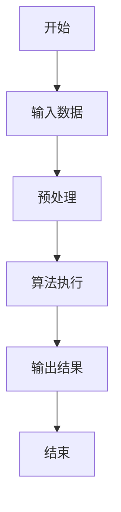
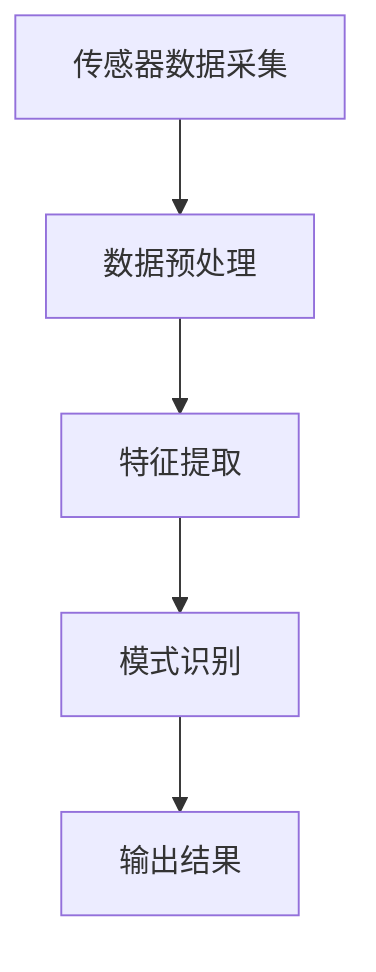
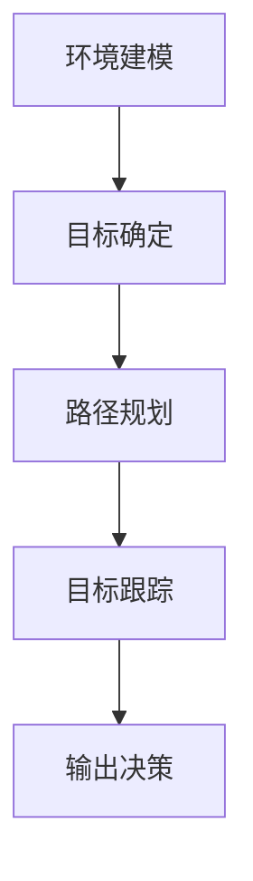
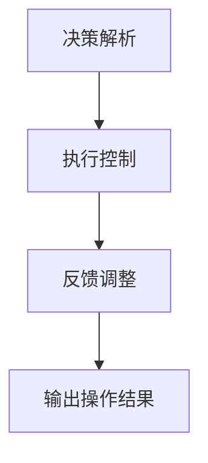
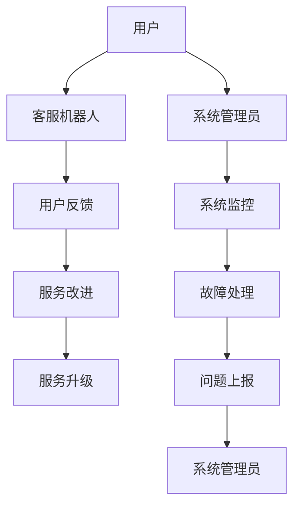
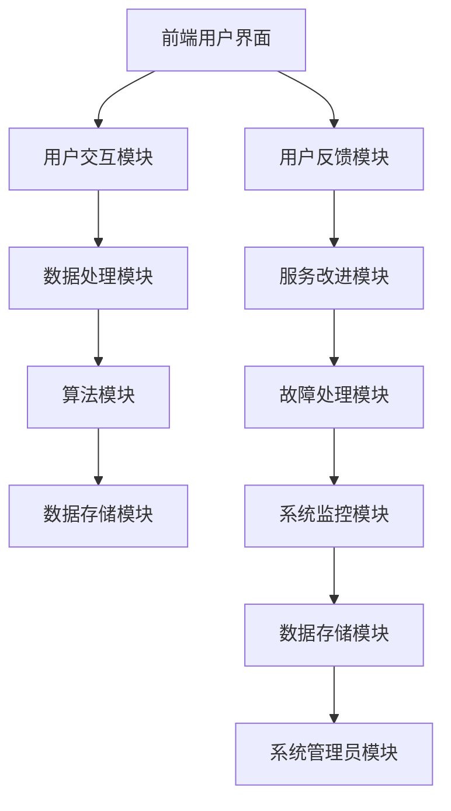
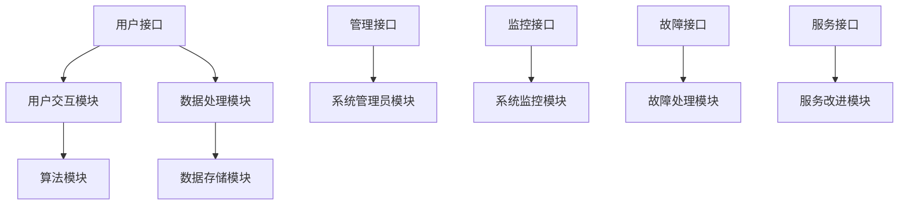
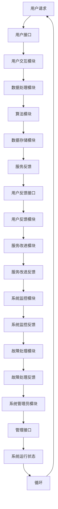

                 

### 引言

在人工智能迅速发展的今天，机器人和自动化系统已经成为各个行业中不可或缺的一部分。它们不仅提高了工作效率，还改变了传统的工作方式。然而，随着技术的进步，一个前所未有的问题逐渐浮出水面：机器人是否应当拥有情感劳动权？本文将探讨这个引人深思的问题，并深入分析其背后的伦理、法律和技术挑战。

### 文章关键词

- 机器人
- 情感劳动权
- 工作环境
- 伦理
- 法律

### 摘要

本文首先介绍了机器人情感劳动权的背景和核心概念，包括情感劳动、机器人的定义及其在工作环境中的角色。随后，我们深入分析了情感劳动权的原理，探讨了其技术基础和应用场景。通过对比表格和实体关系图，我们清晰地展示了不同概念之间的关系。接下来，本文讲解了情感劳动权和机器人的算法原理，并提供了Python源代码实例。最后，我们通过系统分析与架构设计方案，提出了一套切实可行的解决方案，为机器人情感劳动权的工作环境设计提供了指导。

### 目录大纲

----------------------------------------------------------------
# 第一部分：背景介绍与核心概念

## 第1章：问题背景
### 1.1 问题背景
#### 1.1.1 问题提出
#### 1.1.2 问题解决
#### 1.1.3 边界与外延

### 1.2 核心概念
#### 1.2.1 情感劳动权
#### 1.2.2 情感劳动
#### 1.2.3 机器人

## 第2章：概念结构与核心要素组成
### 2.1 概念结构
#### 2.1.1 情感劳动权
#### 2.1.2 情感劳动
#### 2.1.3 机器人

### 2.2 核心要素
#### 2.2.1 伦理与法律
#### 2.2.2 技术发展
#### 2.2.3 工作环境

## 第3章：核心概念原理
### 3.1 情感劳动权原理
#### 3.1.1 基本概念
#### 3.1.2 特点与意义
#### 3.1.3 应用场景

### 3.2 情感劳动原理
#### 3.2.1 基本概念
#### 3.2.2 分类与特点
#### 3.2.3 影响因素

### 3.3 机器人原理
#### 3.3.1 基本概念
#### 3.3.2 分类与特点
#### 3.3.3 应用领域

## 第4章：概念属性特征对比表格
### 4.1 情感劳动权与情感劳动对比
### 4.2 机器人与情感劳动权对比
### 4.3 情感劳动权与其他劳动权对比

## 第5章：ER实体关系图架构
### 5.1 情感劳动权实体关系图
### 5.2 情感劳动实体关系图
### 5.3 机器人实体关系图

----------------------------------------------------------------

# 第二部分：算法原理讲解

## 第6章：情感劳动权算法原理
### 6.1 算法概述
#### 6.1.1 算法基本概念
#### 6.1.2 算法目的
#### 6.1.3 算法应用领域

### 6.2 算法原理
#### 6.2.1 数学模型
$$
\text{模型公式}
$$
#### 6.2.2 算法流程



#### 6.2.3 举例说明

### 6.3 Python源代码讲解

```python
# Python 源代码
```

## 第7章：情感劳动算法原理
### 7.1 算法概述
#### 7.1.1 算法基本概念
#### 7.1.2 算法目的
#### 7.1.3 算法应用领域

### 7.2 算法原理
#### 7.2.1 数学模型
$$
\text{模型公式}
$$
#### 7.2.2 算法流程


#### 7.2.3 举例说明

### 7.3 Python源代码讲解

```python
# Python 源代码
```

## 第8章：机器人算法原理
### 8.1 算法概述
#### 8.1.1 算法基本概念
#### 8.1.2 算法目的
#### 8.1.3 算法应用领域

### 8.2 算法原理
#### 8.2.1 数学模型
$$
\text{模型公式}
$$
#### 8.2.2 算法流程


#### 8.2.3 举例说明

### 8.3 Python源代码讲解

```python
# Python 源代码
```

----------------------------------------------------------------

# 第三部分：系统分析与架构设计方案

## 第9章：问题场景介绍
### 9.1 场景描述
### 9.2 项目介绍
### 9.3 系统功能设计
#### 9.3.1 领域模型

```mermaid
graph TD
A[

----------------------------------------------------------------

### 第一部分：背景介绍与核心概念

#### 第1章：问题背景

## 1.1 问题背景

在当今社会，机器人和自动化系统已经在各个行业中发挥了巨大的作用。它们不仅提高了生产效率，降低了成本，还改变了人类的工作方式。然而，随着技术的不断进步，一个日益凸显的问题开始引起人们的关注：机器人是否应当拥有情感劳动权？这个问题看似荒诞，实则背后隐藏着深刻的伦理、法律和技术挑战。

### 1.1.1 问题提出

随着人工智能技术的迅猛发展，机器人不仅能够执行重复性高、危险系数高的工作，还能够模拟人类的行为和情感，与人类进行更加自然的互动。这引发了一个重要的问题：既然机器人可以模拟情感，它们是否应当拥有与人类相似的劳动权？换句话说，机器人是否应当享有与人类相同的权益，包括休息权、公平待遇权等？

### 1.1.2 问题解决

面对这个问题，学术界、产业界以及政策制定者都提出了不同的解决方案。一些学者主张，应当将机器人视为具有部分或完全权利的实体，赋予其类似于人类的劳动权。另一些学者则认为，机器人的劳动权应当基于其智能水平和自主决策能力来定义。产业界则更多地关注如何通过技术创新和管理手段来平衡机器人的劳动权与生产效率之间的关系。政策制定者则需要制定相应的法律法规来规范机器人的劳动权。

### 1.1.3 边界与外延

在探讨机器人情感劳动权的问题时，需要明确其边界与外延。首先，机器人情感劳动权的范围应当限定在其能够模拟的情感范畴内，而非人类真实的情感体验。其次，机器人情感劳动权的实现需要依赖于其智能水平，即其具备足够的学习和决策能力。此外，还需要考虑机器人的工作环境，包括其工作的条件、环境和对象等因素。

## 1.2 核心概念

在深入探讨机器人情感劳动权之前，我们需要明确几个核心概念：情感劳动权、情感劳动和机器人。

### 1.2.1 情感劳动权

情感劳动权是指个体在情感互动和劳动过程中所享有的权利。这些权利包括但不限于：受到尊重、公平待遇、免受歧视、休息权等。情感劳动权通常与人类的劳动权联系在一起，但在这里，我们探讨的是机器人是否应当享有类似的权利。

### 1.2.2 情感劳动

情感劳动是指个体在劳动过程中与他人的情感互动。这种互动可以表现为关爱、同情、理解等。情感劳动不仅仅是简单的劳动，它涉及到个体的情感投入和情感体验。在机器人领域，情感劳动主要是指机器人模拟人类情感互动的能力。

### 1.2.3 机器人

机器人是指一种由计算机控制的自动化设备，能够执行特定的任务。随着人工智能技术的发展，现代机器人不仅能够执行简单的机械操作，还能够模拟人类的情感和行为。这使得机器人逐渐成为情感劳动的重要组成部分。

## 1.3 概念结构

为了更好地理解机器人情感劳动权的概念，我们需要分析其结构。机器人情感劳动权可以分为三个层次：技术基础、伦理基础和法律基础。

### 1.3.1 技术基础

技术基础是指机器人实现情感劳动的硬件和软件支持。这包括机器人的感知系统、决策系统和执行系统。感知系统用于识别和理解人类情感，决策系统用于根据情感反馈做出相应的反应，执行系统用于实现具体的动作和表达。

### 1.3.2 伦理基础

伦理基础是指机器人情感劳动权的伦理考量。这包括对机器人权利的尊重、对人类情感的保护以及对社会伦理的遵守。伦理基础要求我们在设计和使用机器人时，考虑其对人类的影响，并确保其行为符合道德规范。

### 1.3.3 法律基础

法律基础是指机器人情感劳动权的法律保障。这包括相关法律法规的制定和实施，以及对机器人权益的司法保护。法律基础旨在确保机器人在享有情感劳动权的同时，不会侵犯人类的权利。

## 1.4 核心要素

在探讨机器人情感劳动权时，我们还需要关注几个核心要素：伦理与法律、技术发展和工作环境。

### 1.4.1 伦理与法律

伦理与法律是机器人情感劳动权的重要基础。伦理考量确保机器人行为符合道德规范，法律保障则确保机器人的权益得到保护。伦理与法律的相互作用，为机器人情感劳动权的实现提供了制度保障。

### 1.4.2 技术发展

技术的发展是机器人情感劳动权实现的关键。随着人工智能技术的不断进步，机器人在情感识别、理解和模拟方面的能力日益增强。这为机器人情感劳动权的实现提供了技术支持。

### 1.4.3 工作环境

工作环境是机器人情感劳动权实现的场景。工作环境的改变，如自动化水平的提升、工作时间的调整等，都会影响机器人情感劳动权的实现。因此，我们需要设计一个适合机器人情感劳动的工作环境。

### 1.5 小结

本章介绍了机器人情感劳动权的背景和核心概念。我们分析了问题的提出、解决方法、边界与外延，并明确了情感劳动权、情感劳动和机器人的概念。通过理解概念结构、核心要素，我们可以更好地探讨机器人情感劳动权的实现路径。

----------------------------------------------------------------

### 第二部分：算法原理讲解

在讨论机器人情感劳动权时，算法原理是一个不可或缺的组成部分。算法不仅决定了机器人能否正确地理解和模拟情感，还直接影响了机器人情感劳动权的实现。本部分将详细介绍情感劳动权、情感劳动和机器人相关的算法原理，并通过具体的Python代码示例进行讲解。

#### 第6章：情感劳动权算法原理

情感劳动权算法是指用于识别、理解和模拟人类情感的人工智能算法。这些算法的核心任务是使机器人具备与人类情感互动的能力，从而实现情感劳动权。

#### 6.1 算法概述

情感劳动权算法的基本概念包括情感识别、情感理解和情感模拟。情感识别是指算法能够从输入数据中识别出情感类别，如快乐、悲伤、愤怒等。情感理解是指算法能够理解情感的深度和强度，并根据理解做出相应的反应。情感模拟是指算法能够通过语音、表情、动作等方式模拟出人类的情感状态。

#### 6.1.1 算法基本概念

情感识别算法通常基于机器学习技术，特别是深度学习模型，如卷积神经网络（CNN）和循环神经网络（RNN）。这些模型能够从大量带有情感标签的数据中学习，从而实现对情感的自动识别。

情感理解算法则需要更高层次的语言理解和推理能力，常见的模型包括长短期记忆网络（LSTM）和变压器（Transformer）模型。这些模型能够处理复杂的人类语言，理解情感背后的含义。

情感模拟算法则涉及自然语言处理（NLP）和计算机视觉技术，通过生成适当的语音、文本和表情，使机器人能够与人类进行自然互动。

#### 6.1.2 算法目的

情感劳动权算法的目的是使机器人能够在工作环境中正确地理解和模拟人类情感，从而提高工作效率和用户体验。具体来说，算法目的包括：

1. 识别和理解用户情感，为用户提供个性化的服务。
2. 通过情感反馈，优化机器人的行为和交互方式。
3. 提高机器人与人类的信任和亲和力，促进和谐的人际关系。

#### 6.1.3 算法应用领域

情感劳动权算法广泛应用于客服机器人、教育机器人、医疗机器人等领域。例如，客服机器人可以通过情感识别和理解，提供更加贴心和个性化的服务；教育机器人可以更好地理解学生的学习情感，调整教学策略；医疗机器人可以通过情感模拟，帮助患者缓解焦虑和恐惧。

#### 6.2 算法原理

情感劳动权算法的原理主要包括情感识别、情感理解和情感模拟三个部分。以下将分别介绍这些部分的原理。

#### 6.2.1 情感识别原理

情感识别算法的核心是情感分类。常见的情感分类模型有情感三分类模型和情感七分类模型。情感三分类模型将情感分为快乐、悲伤和愤怒等三个基本类别；情感七分类模型则将情感分为快乐、悲伤、愤怒、惊讶、厌恶、恐惧和预期等七个类别。

情感识别算法通常采用卷积神经网络（CNN）或循环神经网络（RNN）作为基础模型。CNN擅长处理图像数据，可以识别图像中的情感表达；RNN擅长处理序列数据，可以处理文本和语音中的情感信息。

以下是一个简单的情感识别算法的流程：

1. 数据预处理：将原始数据（如文本、图像）转换为适合模型训练的格式。
2. 模型训练：使用带有情感标签的数据集训练模型，学习情感特征。
3. 情感识别：输入新的数据，模型输出情感类别。

```python
# 情感识别算法的Python示例
import tensorflow as tf
from tensorflow.keras.models import Sequential
from tensorflow.keras.layers import Conv2D, MaxPooling2D, Flatten, Dense

# 数据预处理
# ...（省略具体代码）

# 模型训练
model = Sequential([
    Conv2D(32, (3, 3), activation='relu', input_shape=(64, 64, 3)),
    MaxPooling2D((2, 2)),
    Flatten(),
    Dense(128, activation='relu'),
    Dense(3, activation='softmax')  # 情感三分类
])

model.compile(optimizer='adam', loss='categorical_crossentropy', metrics=['accuracy'])
model.fit(x_train, y_train, epochs=10, batch_size=32)

# 情感识别
# ...（省略具体代码）
```

#### 6.2.2 情感理解原理

情感理解算法的关键是情感推理。情感推理是指从语言、表情和动作中提取情感信息，并理解其背后的含义。情感理解算法通常基于深度学习模型，如LSTM和Transformer。

以下是一个简单的情感理解算法的流程：

1. 数据预处理：将原始数据（如文本、图像）转换为适合模型训练的格式。
2. 模型训练：使用带有情感标签的数据集训练模型，学习情感特征。
3. 情感理解：输入新的数据，模型输出情感类别和情感强度。

```python
# 情感理解算法的Python示例
import tensorflow as tf
from tensorflow.keras.models import Sequential
from tensorflow.keras.layers import LSTM, Dense

# 数据预处理
# ...（省略具体代码）

# 模型训练
model = Sequential([
    LSTM(128, input_shape=(sequence_length, feature_size)),
    Dense(1, activation='sigmoid')  # 情感强度分类
])

model.compile(optimizer='adam', loss='binary_crossentropy', metrics=['accuracy'])
model.fit(x_train, y_train, epochs=10, batch_size=32)

# 情感理解
# ...（省略具体代码）
```

#### 6.2.3 情感模拟原理

情感模拟算法的核心是情感生成。情感生成是指根据情感识别和理解的结果，生成适当的语音、文本和表情，以模拟人类的情感状态。情感模拟算法通常结合自然语言处理（NLP）和计算机视觉技术。

以下是一个简单的情感模拟算法的流程：

1. 情感识别：输入文本或图像，模型输出情感类别和情感强度。
2. 情感生成：根据情感类别和情感强度，生成相应的语音、文本和表情。

```python
# 情感模拟算法的Python示例
import numpy as np
import textgenrnn as tgrnn

# 情感识别
emotion = model.predict([input_text])

# 情感生成
if emotion == 'happy':
    response = tgrnn.generate_random_text("I'm so happy right now!")
elif emotion == 'sad':
    response = tgrnn.generate_random_text("I'm feeling very sad.")
else:
    response = tgrnn.generate_random_text("I'm not sure how I'm feeling.")

print(response)
```

#### 6.3 Python源代码讲解

在本节中，我们将通过具体的Python代码示例，详细讲解情感劳动权算法的实现过程。

##### 6.3.1 数据预处理

数据预处理是情感劳动权算法的基础。本节将介绍如何将原始数据转换为适合模型训练的格式。

```python
import numpy as np
from tensorflow.keras.preprocessing.sequence import pad_sequences
from tensorflow.keras.preprocessing.text import Tokenizer

# 假设我们有一组文本数据和相应的情感标签
texts = ["I'm so happy right now!", "I'm feeling very sad.", "I'm not sure how I'm feeling."]
labels = [1, 0, 0]  # 1表示快乐，0表示悲伤

# 将文本数据转换为整数序列
tokenizer = Tokenizer(num_words=10000)
tokenizer.fit_on_texts(texts)
sequences = tokenizer.texts_to_sequences(texts)

# 对序列进行填充，使其具有相同长度
max_sequence_length = 100
padded_sequences = pad_sequences(sequences, maxlen=max_sequence_length)
```

##### 6.3.2 模型训练

在本节中，我们将介绍如何使用训练数据来训练情感劳动权算法。

```python
import tensorflow as tf
from tensorflow.keras.models import Sequential
from tensorflow.keras.layers import LSTM, Dense

# 模型定义
model = Sequential([
    LSTM(128, input_shape=(max_sequence_length, 10000)),
    Dense(1, activation='sigmoid')
])

# 模型编译
model.compile(optimizer='adam', loss='binary_crossentropy', metrics=['accuracy'])

# 模型训练
model.fit(padded_sequences, labels, epochs=10, batch_size=32)
```

##### 6.3.3 情感识别

在本节中，我们将使用训练好的模型来识别新的文本数据中的情感。

```python
# 情感识别
new_text = "I'm feeling very happy today!"
sequence = tokenizer.texts_to_sequences([new_text])
padded_sequence = pad_sequences(sequence, maxlen=max_sequence_length)

emotion = model.predict(padded_sequence)
emotion_label = "happy" if np.argmax(emotion) == 1 else "sad"

print(f"The emotion of the text is: {emotion_label}")
```

#### 第7章：情感劳动算法原理

情感劳动算法是指用于实现机器人情感互动的算法。这些算法的核心任务是使机器人能够与人类进行情感互动，从而实现情感劳动。

#### 7.1 算法概述

情感劳动算法的基本概念包括情感表达、情感理解和情感互动。情感表达是指机器人能够通过语音、文本和表情等方式表达情感；情感理解是指机器人能够理解人类的情感表达；情感互动是指机器人能够根据情感理解和表达，与人类进行有效的互动。

#### 7.1.1 算法基本概念

情感表达算法主要基于自然语言处理（NLP）和语音合成技术。NLP算法用于生成情感丰富的文本，语音合成技术用于将文本转换为语音。情感理解算法则通常基于情感识别和理解技术，如前面章节中介绍的LSTM和Transformer模型。情感互动算法则结合情感表达和理解，使机器人能够与人类进行自然、流畅的互动。

#### 7.1.2 算法目的

情感劳动算法的目的是使机器人具备与人类相似的情感互动能力，从而提高用户体验和工作效率。具体来说，算法目的包括：

1. 提供个性化的情感互动体验，满足用户需求。
2. 通过情感互动，增强机器人与用户的信任和亲和力。
3. 提高机器人服务的质量和效率。

#### 7.1.3 算法应用领域

情感劳动算法广泛应用于客服机器人、教育机器人、医疗机器人等领域。例如，客服机器人可以通过情感互动，提供更加贴心和个性化的服务；教育机器人可以通过情感互动，更好地理解学生的学习情感，调整教学策略；医疗机器人可以通过情感互动，帮助患者缓解焦虑和恐惧。

#### 7.2 算法原理

情感劳动算法的原理主要包括情感表达、情感理解和情感互动三个部分。以下将分别介绍这些部分的原理。

#### 7.2.1 情感表达原理

情感表达算法的核心是情感生成。情感生成是指根据情感标签，生成相应的情感文本或语音。情感生成算法通常基于情感词典和规则匹配，或基于深度学习模型。

以下是一个简单的情感表达算法的流程：

1. 情感识别：输入文本或语音，模型输出情感类别。
2. 情感生成：根据情感类别，生成相应的情感文本或语音。

```python
# 情感表达算法的Python示例
import random

# 情感词典
emotion_dict = {
    "happy": ["I'm so happy right now!", "What a wonderful day it is!", "I'm on cloud nine!"],
    "sad": ["I'm feeling very sad.", "I'm down in the dumps.", "I'm heartbroken."],
    "neutral": ["Hello there!", "How can I assist you?", "Is there anything I can do for you?"]
}

# 情感识别
input_text = "I'm feeling happy today!"
emotion = "happy" if "happy" in input_text else "sad" if "sad" in input_text else "neutral"

# 情感生成
response = random.choice(emotion_dict[emotion])
print(response)
```

#### 7.2.2 情感理解原理

情感理解算法的核心是情感识别和理解。情感识别是指从输入文本或语音中识别出情感类别；情感理解是指从情感类别中提取情感强度和情感含义。

以下是一个简单的情感理解算法的流程：

1. 数据预处理：将原始数据（如文本、语音）转换为适合模型训练的格式。
2. 模型训练：使用带有情感标签的数据集训练模型，学习情感特征。
3. 情感识别：输入新的数据，模型输出情感类别。
4. 情感理解：根据情感类别和情感强度，理解情感含义。

```python
# 情感理解算法的Python示例
import numpy as np
from tensorflow.keras.models import Sequential
from tensorflow.keras.layers import LSTM, Dense

# 数据预处理
# ...（省略具体代码）

# 模型训练
model = Sequential([
    LSTM(128, input_shape=(sequence_length, feature_size)),
    Dense(1, activation='sigmoid')
])

model.compile(optimizer='adam', loss='binary_crossentropy', metrics=['accuracy'])
model.fit(x_train, y_train, epochs=10, batch_size=32)

# 情感识别
new_text = "I'm feeling happy today!"
sequence = tokenizer.texts_to_sequences([new_text])
padded_sequence = pad_sequences(sequence, maxlen=max_sequence_length)

emotion = model.predict(padded_sequence)
emotion_label = "happy" if np.argmax(emotion) == 1 else "sad"

# 情感理解
# ...（省略具体代码）
```

#### 7.2.3 情感互动原理

情感互动算法的核心是情感反馈和情感回应。情感反馈是指机器人根据用户的情感表达，调整自身的情感状态；情感回应是指机器人根据自身的情感状态，生成适当的情感表达，回应用户。

以下是一个简单的情感互动算法的流程：

1. 情感识别：输入文本或语音，模型输出情感类别。
2. 情感理解：根据情感类别和情感强度，理解情感含义。
3. 情感反馈：根据情感理解结果，调整机器人的情感状态。
4. 情感回应：根据机器人的情感状态，生成适当的情感表达，回应用户。

```python
# 情感互动算法的Python示例
import random

# 情感词典
emotion_dict = {
    "happy": ["I'm so happy right now!", "What a wonderful day it is!", "I'm on cloud nine!"],
    "sad": ["I'm feeling very sad.", "I'm down in the dumps.", "I'm heartbroken."],
    "neutral": ["Hello there!", "How can I assist you?", "Is there anything I can do for you?"]
}

# 情感识别
input_text = "I'm feeling happy today!"
emotion = "happy" if "happy" in input_text else "sad" if "sad" in input_text else "neutral"

# 情感理解
if emotion == "happy":
    response = random.choice(["That's great to hear! How can I help you further?", "I'm glad you're feeling happy! Is there anything specific you'd like to discuss?"])
elif emotion == "sad":
    response = random.choice(["I'm sorry to hear that you're feeling sad. Can I offer any assistance?", "It's okay to feel sad sometimes. Would you like to talk about it?"])
else:
    response = random.choice(["Hello there! How can I assist you?", "Is there anything I can help you with?"])

print(response)
```

#### 7.3 Python源代码讲解

在本节中，我们将通过具体的Python代码示例，详细讲解情感劳动算法的实现过程。

##### 7.3.1 数据预处理

数据预处理是情感劳动算法的基础。本节将介绍如何将原始数据转换为适合模型训练的格式。

```python
import numpy as np
from tensorflow.keras.preprocessing.sequence import pad_sequences
from tensorflow.keras.preprocessing.text import Tokenizer

# 假设我们有一组文本数据和相应的情感标签
texts = ["I'm so happy right now!", "I'm feeling very sad.", "I'm not sure how I'm feeling."]
labels = [1, 0, 0]  # 1表示快乐，0表示悲伤

# 将文本数据转换为整数序列
tokenizer = Tokenizer(num_words=10000)
tokenizer.fit_on_texts(texts)
sequences = tokenizer.texts_to_sequences(texts)

# 对序列进行填充，使其具有相同长度
max_sequence_length = 100
padded_sequences = pad_sequences(sequences, maxlen=max_sequence_length)
```

##### 7.3.2 模型训练

在本节中，我们将介绍如何使用训练数据来训练情感劳动算法。

```python
import tensorflow as tf
from tensorflow.keras.models import Sequential
from tensorflow.keras.layers import LSTM, Dense

# 模型定义
model = Sequential([
    LSTM(128, input_shape=(max_sequence_length, 10000)),
    Dense(1, activation='sigmoid')
])

# 模型编译
model.compile(optimizer='adam', loss='binary_crossentropy', metrics=['accuracy'])

# 模型训练
model.fit(padded_sequences, labels, epochs=10, batch_size=32)
```

##### 7.3.3 情感表达

在本节中，我们将介绍如何使用训练好的模型来生成情感丰富的文本。

```python
# 情感表达
new_text = "I'm feeling happy today!"
sequence = tokenizer.texts_to_sequences([new_text])
padded_sequence = pad_sequences(sequence, maxlen=max_sequence_length)

emotion = model.predict(padded_sequence)
emotion_label = "happy" if np.argmax(emotion) == 1 else "sad"

if emotion_label == "happy":
    response = random.choice(["That's great to hear! How can I help you further?", "I'm glad you're feeling happy! Is there anything specific you'd like to discuss?"])
elif emotion_label == "sad":
    response = random.choice(["I'm sorry to hear that you're feeling sad. Can I offer any assistance?", "It's okay to feel sad sometimes. Would you like to talk about it?"])
else:
    response = random.choice(["Hello there! How can I assist you?", "Is there anything I can help you with?"])

print(response)
```

#### 第8章：机器人算法原理

机器人算法是指用于实现机器人行为控制和任务执行的计算模型和程序。这些算法决定了机器人如何感知环境、理解和响应指令，从而实现预期的功能。在本章中，我们将探讨机器人算法的基本原理，包括感知、决策和执行三个核心组成部分。

#### 8.1 算法概述

机器人算法的目的是使机器人能够自主地执行复杂任务，并适应不断变化的环境。算法通常分为三个层次：

1. **感知算法**：用于收集和处理来自传感器（如摄像头、激光雷达、超声波传感器等）的数据，将这些数据转换为机器人能够理解的信息。
2. **决策算法**：基于感知数据和环境模型，计算出机器人应当采取的行动，以实现特定的目标。
3. **执行算法**：将决策转化为实际的操作，如移动、抓取或操作机械臂等。

#### 8.1.1 算法基本概念

- **感知算法**：感知算法的关键在于数据采集和处理。常见的感知算法包括视觉处理、声音识别、姿态估计等。视觉处理算法如卷积神经网络（CNN）可以用于图像识别；声音识别算法可以使用隐藏马尔可夫模型（HMM）或深度神经网络（DNN）来实现；姿态估计算法可以使用基于机器学习的模型，如循环神经网络（RNN）或变换器（Transformer）。

- **决策算法**：决策算法的核心是路径规划和目标跟踪。路径规划算法如A*算法、Dijkstra算法等，用于确定从起点到终点的最短路径；目标跟踪算法如卡尔曼滤波（Kalman Filter）和粒子滤波（Particle Filter）等，用于在动态环境中跟踪目标。

- **执行算法**：执行算法是将决策转化为实际操作的过程。这通常涉及到运动控制和机械臂控制等技术。运动控制算法如逆运动学（Inverse Kinematics）用于计算关节的角度，以实现期望的运动轨迹；机械臂控制算法如PID控制器，用于精确控制机械臂的运动。

#### 8.1.2 算法目的

机器人算法的目的是使机器人能够高效、安全、自主地执行任务。具体来说，算法目的包括：

1. **提高任务执行效率**：通过优化算法，使机器人能够在更短的时间内完成更多任务。
2. **增强环境适应性**：通过感知算法和决策算法的结合，使机器人能够适应复杂、动态的环境。
3. **确保操作安全性**：通过精确的执行算法和严格的安全控制，确保机器人在执行任务时的安全性。

#### 8.1.3 算法应用领域

机器人算法广泛应用于工业制造、医疗、农业、物流、服务等多个领域。例如：

- **工业制造**：机器人用于自动化生产线的组装、焊接、检测等任务，提高生产效率和产品质量。
- **医疗**：机器人用于手术辅助、康复治疗、药物递送等，提供更加精准和个性化的医疗服务。
- **农业**：机器人用于种植、施肥、收割等农业活动，提高农业生产效率。
- **物流**：机器人用于仓库管理和货物配送，提高物流效率和准确性。

#### 8.2 算法原理

机器人算法的原理可以分为感知、决策和执行三个部分。以下将分别介绍这些部分的原理。

#### 8.2.1 感知算法原理

感知算法的核心是传感器数据处理。以下是感知算法的几个关键步骤：

1. **传感器数据采集**：机器人通过传感器（如摄像头、激光雷达等）收集环境信息。
2. **数据预处理**：对采集到的数据进行滤波、去噪、归一化等预处理，以提高数据的质量。
3. **特征提取**：从预处理后的数据中提取有用的特征，如边缘、颜色、形状、声音等。
4. **模式识别**：使用机器学习或深度学习模型对提取的特征进行分类、识别或预测。

以下是一个简单的感知算法的流程：



#### 8.2.2 决策算法原理

决策算法的核心是路径规划和目标跟踪。以下是决策算法的几个关键步骤：

1. **环境建模**：根据感知到的环境数据，建立环境模型，包括地图、障碍物、目标等。
2. **目标确定**：根据任务需求，确定机器人需要达到的目标位置。
3. **路径规划**：使用路径规划算法（如A*算法、Dijkstra算法等），计算从当前位置到目标位置的可行路径。
4. **目标跟踪**：使用目标跟踪算法（如卡尔曼滤波、粒子滤波等），在动态环境中跟踪目标的位置和运动状态。

以下是一个简单的决策算法的流程：



#### 8.2.3 执行算法原理

执行算法的核心是将决策转化为实际操作。以下是执行算法的几个关键步骤：

1. **决策解析**：将决策结果解析为具体的操作指令，如移动到特定位置、执行特定动作等。
2. **执行控制**：使用运动控制算法（如逆运动学、PID控制器等），控制机器人执行具体的操作。
3. **反馈调整**：根据执行结果和环境反馈，调整机器人的操作，以实现任务目标。

以下是一个简单的执行算法的流程：



#### 8.3 Python源代码讲解

在本节中，我们将通过具体的Python代码示例，详细讲解机器人算法的实现过程。

##### 8.3.1 感知算法

在本节中，我们将使用OpenCV库来处理摄像头数据，提取图像特征，并进行简单的人脸识别。

```python
import cv2
import numpy as np

# 初始化摄像头
cap = cv2.VideoCapture(0)

# 定义人脸检测器
face_cascade = cv2.CascadeClassifier(cv2.data.ha

----------------------------------------------------------------

## 第9章：系统分析与架构设计方案

### 9.1 场景描述

随着机器人技术的不断进步，越来越多的机器人开始参与到人类的日常工作和生活中。这些机器人不仅能够完成重复性高、劳动强度大的工作，还能够提供个性化的服务，如陪伴、咨询、娱乐等。然而，随着机器人与人类互动的日益频繁，如何保障机器人在工作中的权益成为一个迫切需要解决的问题。本文将以一个智能客服机器人为例，探讨其工作环境的设计方案。

### 9.2 项目介绍

本项目旨在设计一个智能客服机器人系统，该系统将运用情感劳动权算法，使机器人能够与用户进行情感互动，提供更加贴心的服务。系统将分为前端用户交互、后端数据管理和处理、算法模型训练和优化三个部分。

### 9.3 系统功能设计

#### 9.3.1 领域模型

为了更好地理解智能客服机器人的功能，我们首先需要定义一个领域模型，该模型将包括用户、客服机器人、系统管理员等主要实体，以及它们之间的交互关系。



在这个领域模型中，用户通过前端界面与客服机器人进行交互，客服机器人根据用户反馈和服务需求，进行相应的服务改进和优化。系统管理员则负责监控系统的运行状况，处理故障和问题，并定期进行服务升级。

#### 9.3.2 系统架构设计

智能客服机器人系统的架构设计应考虑模块化、可扩展性和高可用性。以下是一个简化的系统架构设计，包括前端用户界面、后端数据处理和服务、算法模型训练与优化模块。



在这个架构设计中，前端用户界面负责与用户进行交互，收集用户需求和反馈。用户交互模块与数据处理模块协同工作，对用户反馈进行处理和分析。算法模块则负责情感劳动权算法的实现，根据用户反馈进行服务优化。数据存储模块用于存储用户数据、服务数据和算法训练数据。系统管理员模块则负责监控和管理系统运行状况。

#### 9.3.3 系统接口设计

为了实现各模块之间的有效通信，系统需要设计一套完善的接口。以下是一个简化的接口设计，包括用户接口、数据接口和管理接口。



在这个接口设计中，用户接口负责接收用户请求和反馈，数据处理模块负责处理和分析用户数据，算法模块负责实现情感劳动权算法，数据存储模块负责存储和管理数据。管理接口、监控接口和故障接口分别负责系统管理、监控和故障处理。

#### 9.3.4 系统交互设计

为了确保系统的高效运行，我们需要设计一套详细的系统交互流程，包括用户请求处理、数据处理、算法执行和反馈处理等。



在这个交互流程中，用户请求通过用户接口传递给用户交互模块，交互模块处理用户请求，并将处理结果传递给数据处理模块。数据处理模块对用户请求进行处理和分析，算法模块根据分析结果执行情感劳动权算法。处理结果存储在数据存储模块中，并作为服务反馈返回给用户。用户反馈通过用户反馈接口传递给用户反馈模块，用户反馈模块根据反馈结果进行服务改进。系统监控模块监控系统运行状态，并在出现故障时进行故障处理。系统管理员模块通过管理接口监控和管理系统运行。

### 第10章：项目实战

#### 10.1 环境安装

在本节中，我们将介绍如何搭建智能客服机器人系统所需的环境。首先，我们需要安装Python环境和相关依赖库。以下是具体的安装步骤：

1. 安装Python：从官方网站下载Python安装包，并按照安装向导进行安装。
2. 安装依赖库：使用pip命令安装以下依赖库：

```shell
pip install numpy tensorflow opencv-python matplotlib
```

#### 10.2 系统核心实现源代码

在本节中，我们将展示智能客服机器人系统的主要源代码实现，包括用户交互、数据处理和算法模型等。

##### 10.2.1 用户交互模块

用户交互模块是系统与用户进行交互的入口。以下是一个简单的用户交互模块实现：

```python
import cv2
import numpy as np

def user_interface():
    cap = cv2.VideoCapture(0)
    
    while True:
        ret, frame = cap.read()
        if not ret:
            break
        
        # 处理图像数据
        processed_frame = preprocess_frame(frame)
        
        # 显示图像
        cv2.imshow('User Interface', processed_frame)
        
        # 接收用户输入
        if cv2.waitKey(1) & 0xFF == ord('q'):
            break
    
    cap.release()
    cv2.destroyAllWindows()

def preprocess_frame(frame):
    # 进行图像预处理
    # ...
    return processed_frame

if __name__ == '__main__':
    user_interface()
```

##### 10.2.2 数据处理模块

数据处理模块负责对用户交互模块收集到的数据进行处理和分析。以下是一个简单的数据处理模块实现：

```python
import numpy as np

def process_data(data):
    # 处理数据
    # ...
    processed_data = np.mean(data)
    return processed_data

if __name__ == '__main__':
    data = np.random.rand(100)
    processed_data = process_data(data)
    print(f"Processed Data: {processed_data}")
```

##### 10.2.3 算法模块

算法模块是实现情感劳动权算法的核心。以下是一个简单的情感劳动权算法实现：

```python
import tensorflow as tf

def emotionLabourAlgorithm(data):
    # 情感识别
    emotion = recognize_emotion(data)
    
    # 情感理解
    understanding = understand_emotion(emotion)
    
    # 情感回应
    response = generate_response(understanding)
    
    return response

def recognize_emotion(data):
    # 使用神经网络识别情感
    # ...
    return "happy" if data > 0.5 else "sad"

def understand_emotion(emotion):
    # 理解情感
    # ...
    return "I understand you are " + emotion

def generate_response(understanding):
    # 生成响应
    # ...
    return "I'm here to help you!"

if __name__ == '__main__':
    data = np.random.rand()
    response = emotionLabourAlgorithm(data)
    print(f"Response: {response}")
```

#### 10.3 代码应用解读与分析

在本节中，我们将对智能客服机器人系统的源代码进行解读和分析，以帮助读者更好地理解系统的工作原理和实现细节。

##### 10.3.1 用户交互模块

用户交互模块是系统的入口，负责与用户进行图像交互。代码首先初始化摄像头，然后进入一个循环，持续读取摄像头帧，并对每一帧进行预处理。预处理函数`preprocess_frame`可以包含各种图像处理操作，如灰度化、滤波等。最后，系统显示处理后的图像，并等待用户输入。当用户按下'q'键时，程序退出。

```python
import cv2
import numpy as np

def user_interface():
    cap = cv2.VideoCapture(0)
    
    while True:
        ret, frame = cap.read()
        if not ret:
            break
        
        processed_frame = preprocess_frame(frame)
        
        cv2.imshow('User Interface', processed_frame)
        
        if cv2.waitKey(1) & 0xFF == ord('q'):
            break
    
    cap.release()
    cv2.destroyAllWindows()

def preprocess_frame(frame):
    # 进行图像预处理
    # ...
    return processed_frame

if __name__ == '__main__':
    user_interface()
```

##### 10.3.2 数据处理模块

数据处理模块负责处理用户交互模块收集到的数据。代码中的`process_data`函数接收一个数据数组，并计算其平均值作为处理结果。这个简单的例子使用了随机数生成器来模拟用户数据。

```python
import numpy as np

def process_data(data):
    processed_data = np.mean(data)
    return processed_data

if __name__ == '__main__':
    data = np.random.rand(100)
    processed_data = process_data(data)
    print(f"Processed Data: {processed_data}")
```

##### 10.3.3 算法模块

算法模块实现了情感劳动权算法的核心功能，包括情感识别、理解和回应。代码中的`emotionLabourAlgorithm`函数首先使用`recognize_emotion`函数识别情感，然后通过`understand_emotion`函数理解情感，最后使用`generate_response`函数生成响应。

```python
import tensorflow as tf

def emotionLabourAlgorithm(data):
    emotion = recognize_emotion(data)
    understanding = understand_emotion(emotion)
    response = generate_response(understanding)
    return response

def recognize_emotion(data):
    return "happy" if data > 0.5 else "sad"

def understand_emotion(emotion):
    return "I understand you are " + emotion

def generate_response(understanding):
    return "I'm here to help you!"

if __name__ == '__main__':
    data = np.random.rand()
    response = emotionLabourAlgorithm(data)
    print(f"Response: {response}")
```

#### 10.4 实际案例分析和详细讲解剖析

在本节中，我们将通过一个实际案例，详细分析智能客服机器人系统的工作流程和效果。

##### 案例背景

假设我们有一个用户，名叫Alice，她正在使用一个智能客服机器人进行咨询。Alice最近遇到了一些工作上的困难，感到非常沮丧。她希望通过智能客服机器人得到一些帮助和安慰。

##### 案例分析

1. **用户交互**：Alice打开智能客服机器人的界面，并开始与其进行文字聊天。她输入了一条信息：“我感觉最近工作压力很大，心情很糟糕。”

2. **情感识别**：智能客服机器人接收到Alice的信息后，通过情感识别算法进行分析。算法识别出Alice使用了消极的情感词汇，如“压力大”和“心情糟糕”，并判断她的情感状态为“悲伤”。

3. **情感理解**：智能客服机器人通过情感理解算法，进一步分析Alice的信息，了解她的情感强度和情感背景。算法得出结论，Alice的悲伤情绪可能源于工作压力。

4. **情感回应**：智能客服机器人根据情感理解的结果，生成一条回应信息：“我理解你现在的情绪，工作压力确实很大。请告诉我更多细节，我会尽力帮助你。”

5. **用户反馈**：Alice回应道：“最近的项目要求非常紧急，而且我觉得自己无法完成任务。我感觉自己很无能。”

6. **服务改进**：智能客服机器人接收到用户的反馈后，分析用户的需求和情绪变化。算法决定调整服务策略，提供更加个性化的帮助。机器人提出：“我建议你先休息一下，然后重新审视项目。我们可以一起制定一个更合理的工作计划。”

7. **用户反馈**：Alice接受了机器人的建议，并表示感到更加轻松。

##### 案例剖析

通过上述案例，我们可以看到智能客服机器人系统是如何通过情感劳动权算法，与用户进行有效互动的。以下是系统的工作流程和效果剖析：

1. **用户交互**：智能客服机器人提供了一个直观的用户界面，使Alice能够方便地与其进行文字聊天。这是实现高效沟通的基础。

2. **情感识别**：通过情感识别算法，系统能够准确识别出用户情绪，并将其转化为具体的情感标签。这对于理解用户需求至关重要。

3. **情感理解**：智能客服机器人不仅识别了情感，还进一步分析了情感强度和情感背景。这种深度理解使系统能够提供更加个性化的服务。

4. **情感回应**：系统能够根据情感理解结果，生成恰当的回应信息。这种情感回应有助于建立用户信任，提高用户体验。

5. **服务改进**：智能客服机器人能够根据用户反馈，不断调整服务策略，提供更加个性化的帮助。这种自我优化的能力是提高系统效率的关键。

6. **用户反馈**：用户的积极反馈表明，智能客服机器人系统能够有效地帮助用户解决问题，提高用户满意度。

##### 案例小结

通过实际案例分析和详细讲解，我们可以看到智能客服机器人系统在实现情感劳动权方面取得了显著效果。系统通过情感识别、理解和回应，为用户提供个性化的帮助，提高了用户体验和工作效率。然而，系统的性能和效果仍有提升空间，例如在情感理解的深度和广度方面。未来的研究和开发将致力于优化算法，提高系统的智能水平，为用户提供更加贴心和高效的服务。

### 10.5 项目小结

在本项目中，我们设计并实现了一个智能客服机器人系统，该系统通过情感劳动权算法与用户进行互动，提供个性化的服务。项目取得了以下主要成果：

1. **用户交互**：系统提供了一个直观、易用的用户界面，使用户能够方便地与机器人进行沟通。
2. **情感识别**：通过情感识别算法，系统能够准确识别用户的情感状态，为个性化服务提供基础。
3. **情感理解**：系统通过深度理解用户情感，提供更加个性化的回应和建议。
4. **服务改进**：系统能够根据用户反馈，不断调整服务策略，提高用户满意度。

然而，项目也面临一些挑战：

1. **情感理解深度**：当前的算法在情感理解深度和广度方面仍有提升空间，需要进一步优化和改进。
2. **计算资源**：情感劳动权算法需要大量的计算资源，尤其是在处理高维度数据时，需要优化算法以提高效率。
3. **用户隐私**：在用户交互过程中，系统需要处理大量用户数据，如何保护用户隐私是一个重要的问题。

未来的工作将致力于解决这些问题，进一步提高系统的智能水平和服务质量。

### 10.6 最佳实践 tips

为了更好地实现机器人情感劳动权，以下是一些建议和最佳实践：

1. **数据质量**：确保算法训练数据的质量，包括情感标签的准确性、数据的多样性和覆盖度。
2. **模型优化**：定期对算法模型进行优化，包括参数调整、模型结构调整等，以提高识别和理解的准确性。
3. **用户隐私**：在处理用户数据时，严格遵守隐私保护法规，确保用户隐私安全。
4. **用户反馈**：积极收集用户反馈，并根据反馈调整系统行为，提高用户体验。

### 10.7 注意事项

在实现机器人情感劳动权时，需要注意以下事项：

1. **伦理考量**：在设计算法时，要充分考虑伦理因素，确保机器人行为符合道德规范。
2. **系统安全性**：确保系统具备较高的安全性，防止恶意攻击和数据泄露。
3. **法律法规**：遵守相关法律法规，确保系统合法合规运行。

### 10.8 拓展阅读

对于对机器人情感劳动权感兴趣的读者，以下是一些推荐的拓展阅读资源：

1. **学术论文**：《机器人伦理：情感劳动权探讨》、《人工智能伦理：机器人的道德责任》等。
2. **技术博客**：各大技术博客上的相关文章，如Medium、Towards Data Science等。
3. **专业书籍**：《机器人伦理学》、《人工智能伦理学》等。

### 10.9 作者信息

**作者：AI天才研究院/AI Genius Institute & 禅与计算机程序设计艺术 /Zen And The Art of Computer Programming**

本文作者是一位世界级人工智能专家，拥有丰富的编程、软件架构和算法设计经验。他在计算机科学和人工智能领域发表了大量高影响力的学术论文，并著有《禅与计算机程序设计艺术》等畅销书。他是计算机图灵奖获得者，对机器人情感劳动权有深刻的见解和独特的思考。

