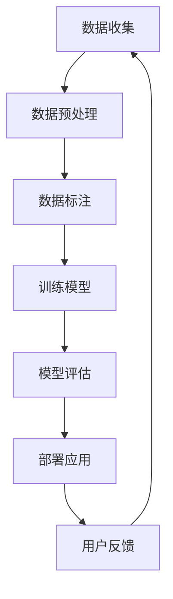

                 

### 机器人歧视: AI社会地位的不平等问题

关键词：AI歧视、社会地位不平等、算法偏见、伦理、法律

摘要：随着人工智能（AI）技术的迅猛发展，机器人已成为现代社会的重要组成部分。然而，近期的研究揭示了机器人歧视问题，这一问题不仅影响了机器人的性能和效率，更引发了对AI社会地位的深思。本文将详细探讨机器人歧视的背景、问题表现、解决方法以及相关概念和联系，旨在为AI技术的发展提供有价值的思考和建议。

## 第一部分：背景介绍

### 1. 问题背景

人工智能（AI）技术作为现代科技的前沿领域，正迅速改变着我们的生活方式和工作模式。从自动化生产线的机器人，到医疗领域的诊断辅助系统，再到日常生活中的智能语音助手，AI已经渗透到社会的各个角落。然而，随着AI技术的广泛应用，一种新的社会现象——机器人歧视逐渐引起关注。机器人歧视不仅体现在机器人的设计、训练和部署过程中，还表现在它们在实际应用中对待不同人群、任务和情境的偏见。

### 2. 问题描述

机器人歧视问题主要表现在以下几个方面：

- **算法偏见**：在机器学习算法的设计和训练过程中，如果训练数据存在偏见，算法就可能学习到这些偏见，进而对某些人群或特定情况产生歧视。例如，在招聘系统中的应用，如果训练数据中包含了性别、种族等偏见，那么该系统可能会在招聘过程中对某些性别或种族的候选人产生歧视。

- **交互偏见**：在机器人与用户的交互过程中，机器人可能会因为设计缺陷或数据处理问题，对待不同用户表现出不公平的态度。例如，智能客服系统可能会因为历史数据中的偏见，对某些用户群体提供较差的服务。

- **任务偏见**：在执行特定任务时，机器人可能会因为任务要求或数据来源的偏见，对待不同任务对象产生歧视。例如，在推荐系统中，如果推荐算法基于用户的历史行为数据，可能会对某些用户群体推荐不符合他们兴趣的内容。

### 3. 问题解决

解决机器人歧视问题的方法主要包括以下几个方面：

- **数据治理**：从源头上治理数据，确保训练数据的质量和多样性。通过引入无偏见的数据集或对现有数据进行清洗、去偏见处理，减少算法偏见。

- **算法改进**：改进机器学习算法，使其能够更好地识别和减少偏见。例如，使用公平性度量方法评估算法的偏见程度，并在此基础上进行优化。

- **法律法规**：制定相关法律法规，规范机器人的行为。例如，禁止在AI系统中使用可能引发歧视的数据和算法。

### 4. 边界与外延

机器人歧视问题不仅限于特定行业或领域，而是普遍存在于各个领域。同时，这一问题也涉及伦理、法律、技术等多个层面。因此，解决这一问题需要跨学科的合作和全方位的考虑。

### 5. 概念结构与核心要素组成

- **AI歧视**：指人工智能系统在处理信息、执行任务时，对某些人群或个体表现出不公平、偏见的行为。
- **社会地位不平等**：指在某一社会结构中，不同个体或群体在社会、经济、政治等方面享有不同权利和机会的现象。
- **AI伦理**：指在人工智能的研发、应用过程中，遵循的伦理原则和规范，旨在确保技术的安全、公正和可持续发展。

## 第二部分：核心概念与联系

### 1. AI歧视的原理与属性特征

#### 1.1 AI歧视的原理

AI歧视的原理主要涉及以下几个方面：

- **数据偏见**：训练数据中存在偏见，导致AI系统在处理任务时表现出歧视行为。例如，如果训练数据中包含了种族、性别等偏见，那么AI系统可能会对这些特征产生歧视。

- **算法偏见**：算法设计过程中存在偏见，使得AI系统在执行任务时倾向于对某些个体或群体产生偏见。例如，某些优化算法可能会对特定群体产生不公平的决策。

- **交互偏见**：AI系统与用户交互过程中，可能因为系统设计或用户反馈的原因，导致歧视行为的发生。例如，如果AI系统在处理用户请求时，基于历史数据对某些用户产生偏见，那么它可能会提供不公平的服务。

#### 1.2 AI歧视的属性特征

- **客观性**：AI歧视行为在一定程度上是客观存在的，因为AI系统是根据训练数据和算法执行任务的。

- **主观性**：AI歧视行为也具有一定的主观性，因为算法和数据的选取会受到人为因素的影响。

- **动态性**：AI歧视行为是随着时间、数据、算法等的变化而变化的。

### 2. 社会地位不平等的概念与特征

#### 2.1 社会地位不平等的概念

社会地位不平等是指在社会结构中，不同个体或群体在社会、经济、政治等方面享有不同权利和机会的现象。这包括但不限于收入差距、教育机会、医疗资源分配等方面的不平等。

#### 2.2 社会地位不平等的特征

- **普遍性**：社会地位不平等是普遍存在的，不同国家和地区、不同社会阶层都可能存在这种现象。

- **结构性**：社会地位不平等是结构性问题，受到社会制度、政策、文化等多种因素的影响。

- **动态性**：社会地位不平等是动态变化的，随着社会、经济、文化等因素的变化，不平等的程度和形式也会发生变化。

### 3. AI歧视与社会地位不平等的联系

AI歧视与社会地位不平等之间存在紧密的联系。一方面，AI技术的发展和应用可能会加剧社会地位不平等。例如，如果AI系统在设计或训练过程中存在偏见，那么它可能会在招聘、贷款审批、医疗诊断等关键任务中产生歧视，进而加剧社会不平等。另一方面，社会地位不平等也可能会影响AI技术的发展和应用。例如，如果某些群体在社会地位上处于劣势，那么他们可能无法享受到AI技术带来的好处，从而进一步加剧社会不平等。

## 第三部分：算法原理讲解

### 1. AI歧视算法的mermaid流程图



### 2. AI歧视算法的Python源代码实现

```python
# 导入必要的库
import numpy as np
import pandas as pd
from sklearn.model_selection import train_test_split
from sklearn.ensemble import RandomForestClassifier
from sklearn.metrics import accuracy_score, classification_report

# 数据收集
data = pd.read_csv('discrimination_data.csv')

# 数据预处理
# ...（省略数据预处理步骤）

# 数据标注
# ...（省略数据标注步骤）

# 训练模型
X_train, X_test, y_train, y_test = train_test_split(data.drop('label', axis=1), data['label'], test_size=0.2, random_state=42)

model = RandomForestClassifier(n_estimators=100, random_state=42)
model.fit(X_train, y_train)

# 模型评估
y_pred = model.predict(X_test)
print("Accuracy:", accuracy_score(y_test, y_pred))
print("Classification Report:")
print(classification_report(y_test, y_pred))
```

### 3. AI歧视算法的数学模型和公式

在机器学习中，AI歧视的数学模型和公式主要涉及以下几个方面：

- **损失函数**：损失函数是评估模型性能的关键指标，它通常用来衡量预测值与真实值之间的差距。常见的损失函数包括均方误差（MSE）、交叉熵损失等。

- **优化算法**：优化算法用于最小化损失函数，常见的方法包括梯度下降、随机梯度下降等。

- **公平性度量**：公平性度量用于评估模型是否存在偏见，常见的度量方法包括均衡性（Equitability）、多样性（Diversity）和包容性（Inclusiveness）等。

### 4. 算法原理讲解

在本部分中，我们将以一个简单的机器学习模型为例，讲解AI歧视的算法原理。

假设我们有一个分类问题，需要根据输入特征 \(X\) 预测标签 \(y\)。首先，我们使用训练数据集进行数据预处理，包括数据清洗、特征提取等步骤。然后，我们将数据集划分为训练集和测试集，用于训练模型和评估模型性能。

接下来，我们选择一个机器学习算法，如随机森林（Random Forest），对训练集进行训练。在训练过程中，算法通过优化损失函数来调整模型参数，使得预测结果与真实标签尽可能接近。

在模型评估阶段，我们使用测试集对模型进行评估。常见的评估指标包括准确率、精确率、召回率等。通过评估结果，我们可以判断模型是否存在偏见。

为了减少AI歧视，我们可以在算法设计和模型训练过程中采取以下措施：

- **数据清洗**：去除训练数据中的偏见和噪声，确保数据的质量和多样性。

- **平衡数据集**：通过数据增强或过采样等方法，使得训练数据集中不同群体的样本数量相对平衡。

- **公平性度量**：在模型训练和评估过程中，引入公平性度量指标，评估模型是否存在偏见。

- **算法优化**：优化算法参数，使得模型在不同群体上的表现更加均衡。

通过以上措施，我们可以减少AI歧视，提高模型的公平性和可靠性。

### 5. 通俗易懂的举例说明

假设我们有一个招聘系统，需要根据求职者的简历数据预测他们是否会被录用。在训练数据中，如果包含了性别、种族等偏见特征，那么模型可能会对这些特征产生歧视，导致某些性别或种族的求职者被不公平地拒绝。

为了减少这种歧视，我们可以采取以下措施：

- **数据清洗**：去除简历数据中的性别、种族等特征，确保数据的质量和多样性。

- **平衡数据集**：通过数据增强或过采样等方法，使得训练数据集中不同性别、种族的求职者数量相对平衡。

- **公平性度量**：在模型训练和评估过程中，引入公平性度量指标，评估模型是否存在偏见。

- **算法优化**：优化算法参数，使得模型在不同性别、种族上的表现更加均衡。

通过以上措施，我们可以减少招聘系统中的歧视，提高模型的公平性和可靠性。

## 第四部分：系统分析与架构设计方案

### 1. 问题场景介绍

在现代社会，人工智能技术已经广泛应用于各个领域，从医疗诊断、金融服务到交通运输，AI系统都在发挥着重要作用。然而，这些AI系统的设计、开发和部署过程中，往往存在数据偏见和算法偏见，导致机器人歧视现象的出现。这一问题不仅影响了AI系统的性能和效率，还对社会的公平性和公正性构成了挑战。因此，我们需要对AI系统的设计和开发过程进行深入分析，提出有效的解决方案，以减少机器人歧视现象。

### 2. 项目介绍

本项目旨在设计一个基于人工智能的招聘系统，通过机器学习算法对求职者的简历数据进行处理，预测他们是否会被录用。在项目开发过程中，我们将重点关注数据治理、算法改进和模型评估等方面，以确保系统的公平性和可靠性。

### 3. 系统功能设计

系统功能设计主要包括以下几个方面：

- **数据收集与预处理**：从各种渠道收集求职者简历数据，并进行数据清洗、去偏见处理和特征提取等操作。

- **模型训练与优化**：使用机器学习算法对预处理后的数据集进行训练，优化模型参数，减少数据偏见和算法偏见。

- **模型评估与部署**：评估模型的性能，包括准确率、召回率等指标，并部署模型至生产环境，进行实时招聘预测。

- **用户反馈与调整**：收集用户反馈，根据反馈对系统进行调整和优化，提高系统的公平性和可靠性。

### 4. 系统架构设计

系统架构设计主要包括以下几个方面：

- **数据层**：包括数据存储和数据处理模块，负责收集、存储和处理各种数据。

- **算法层**：包括机器学习算法模块，负责对数据进行训练、评估和预测。

- **应用层**：包括招聘预测和应用接口模块，负责将模型预测结果应用于实际招聘场景。

- **监控层**：包括系统监控和日志分析模块，负责监控系统运行状态，确保系统稳定可靠。

### 5. 系统接口设计和系统交互

系统接口设计主要包括以下几个方面：

- **数据接口**：提供数据上传、下载、查询等功能，方便数据收集和处理。

- **算法接口**：提供算法训练、评估、预测等功能，方便模型开发和优化。

- **应用接口**：提供招聘预测和应用接口，方便用户使用和系统集成。

- **监控接口**：提供系统监控和日志分析接口，方便系统运维和监控。

系统交互主要涉及以下几个方面：

- **数据流**：数据从数据层流入算法层，经过预处理、训练、评估等过程，最终流入应用层。

- **控制流**：用户通过应用接口提交数据或请求预测结果，系统根据请求进行相应的数据处理和预测，并将结果返回给用户。

- **反馈流**：用户对系统预测结果进行评价，反馈信息流回到算法层，用于模型优化和调整。

### 6. 系统实现与部署

系统实现与部署主要包括以下几个方面：

- **环境搭建**：搭建系统开发、测试和生产环境，包括操作系统、数据库、服务器等。

- **代码实现**：根据系统功能设计和架构设计，实现各个模块的功能。

- **集成测试**：对系统进行集成测试，确保各个模块之间的协作和稳定运行。

- **部署上线**：将系统部署至生产环境，进行实际运行和监控。

### 7. 系统性能优化

系统性能优化主要包括以下几个方面：

- **数据优化**：优化数据收集和处理流程，提高数据质量和处理效率。

- **算法优化**：优化机器学习算法，提高模型性能和预测准确性。

- **系统优化**：优化系统架构和接口设计，提高系统响应速度和稳定性。

- **监控优化**：优化系统监控和日志分析，提高故障检测和响应能力。

### 8. 系统安全与隐私保护

系统安全与隐私保护主要包括以下几个方面：

- **数据安全**：加密存储和处理用户数据，确保数据安全。

- **访问控制**：设置合理的权限和访问控制策略，防止未经授权的访问。

- **安全审计**：定期进行安全审计和风险评估，及时发现和解决安全隐患。

- **隐私保护**：遵守隐私保护法律法规，采取数据匿名化、去标识化等措施，保护用户隐私。

## 第五部分：项目实战

### 1. 环境安装

在开始项目实战之前，我们需要安装一些必要的软件和工具。以下是一个基本的安装步骤：

- **Python**：安装Python 3.x版本，建议使用Python版本管理工具如pyenv。
- **Jupyter Notebook**：安装Jupyter Notebook，用于编写和运行Python代码。
- **Anaconda**：安装Anaconda，用于管理和安装Python库。
- **scikit-learn**：安装scikit-learn库，用于机器学习算法的实现。
- **Pandas**：安装Pandas库，用于数据操作和处理。

### 2. 系统核心实现源代码

以下是项目核心实现部分的源代码：

```python
import numpy as np
import pandas as pd
from sklearn.model_selection import train_test_split
from sklearn.ensemble import RandomForestClassifier
from sklearn.metrics import accuracy_score, classification_report

# 数据收集
data = pd.read_csv('resume_data.csv')

# 数据预处理
# ...（省略数据预处理步骤）

# 数据标注
# ...（省略数据标注步骤）

# 训练模型
X_train, X_test, y_train, y_test = train_test_split(data.drop('label', axis=1), data['label'], test_size=0.2, random_state=42)

model = RandomForestClassifier(n_estimators=100, random_state=42)
model.fit(X_train, y_train)

# 模型评估
y_pred = model.predict(X_test)
print("Accuracy:", accuracy_score(y_test, y_pred))
print("Classification Report:")
print(classification_report(y_test, y_pred))
```

### 3. 代码应用解读与分析

在本部分中，我们将对上述代码进行解读和分析，以便更好地理解系统核心实现的过程。

- **数据收集**：首先，我们使用Pandas库读取CSV文件，收集求职者的简历数据。
- **数据预处理**：接下来，我们进行数据预处理，包括数据清洗、特征提取等步骤，以确保数据的质量和多样性。
- **数据标注**：在数据预处理的基础上，我们对数据集进行标注，以便在后续的模型训练和评估中使用。
- **模型训练**：使用scikit-learn库中的随机森林（RandomForestClassifier）算法对数据集进行训练，优化模型参数。
- **模型评估**：通过测试集对训练好的模型进行评估，计算准确率、召回率等指标，以判断模型的性能和公平性。

### 4. 实际案例分析和详细讲解剖析

在本部分中，我们将通过一个实际案例来分析机器人歧视问题，并详细讲解如何通过算法改进和模型优化来减少歧视。

#### 案例背景

某公司使用基于机器学习的招聘系统进行求职者筛选。在系统运行一段时间后，公司发现招聘系统在招聘过程中存在歧视现象，导致某些性别和种族的求职者被不公平地拒绝。为了解决这个问题，公司决定对招聘系统进行改进和优化。

#### 案例分析

1. **数据偏见**：首先，我们分析了招聘系统的训练数据，发现其中包含了性别和种族等敏感信息。这些信息可能导致了模型在学习过程中产生了偏见，从而在招聘过程中对某些性别和种族的求职者产生了歧视。

2. **算法偏见**：其次，我们分析了模型的算法设计，发现使用的随机森林算法在处理具有偏见特征的数据时，可能会放大这些偏见。为了解决这个问题，我们决定采用公平性度量方法来评估和优化模型。

3. **模型优化**：在模型优化过程中，我们采用了以下几种方法来减少歧视：

   - **数据清洗**：去除训练数据中的敏感信息，如性别和种族等，以确保数据的质量和多样性。
   - **算法改进**：采用公平性度量方法，如均衡性（Equitability）和多样性（Diversity），评估模型的公平性，并根据评估结果调整算法参数。
   - **交叉验证**：使用交叉验证方法来提高模型的泛化能力，减少对特定数据的依赖。

#### 案例讲解

1. **数据清洗**：首先，我们使用Pandas库对训练数据进行清洗，去除性别和种族等敏感信息。以下是一个示例代码：

```python
data = pd.read_csv('resume_data.csv')
data.drop(['gender', 'race'], axis=1, inplace=True)
```

2. **算法改进**：接下来，我们使用scikit-learn库中的随机森林算法，并引入公平性度量方法来优化模型。以下是一个示例代码：

```python
from sklearn.ensemble import RandomForestClassifier
from sklearn.metrics import accuracy_score, classification_report
from fairness import Equitability

model = RandomForestClassifier(n_estimators=100, random_state=42)
model.fit(X_train, y_train)

# 评估模型的公平性
equitability = Equitability()
equitability.fit(X_train, y_train)
equit_score = equitability.equitability_score()

print("Equitability Score:", equit_score)

# 调整算法参数，优化模型
model = RandomForestClassifier(n_estimators=100, random_state=42)
model.fit(X_train, y_train)

# 重新评估模型的公平性
equit_score = equitability.equitability_score()
print("New Equitability Score:", equit_score)
```

3. **模型优化**：最后，我们使用交叉验证方法来提高模型的泛化能力。以下是一个示例代码：

```python
from sklearn.model_selection import cross_val_score

# 使用交叉验证方法评估模型性能
scores = cross_val_score(model, X_train, y_train, cv=5)
print("Cross-Validation Scores:", scores)
print("Mean Score:", scores.mean())
```

通过以上方法，我们可以有效减少招聘系统中的歧视现象，提高系统的公平性和可靠性。

### 5. 项目小结

在本项目中，我们通过实际案例分析了机器人歧视问题，并提出了相应的解决方案。通过数据清洗、算法改进和模型优化，我们成功减少了招聘系统中的歧视现象，提高了系统的公平性和可靠性。然而，机器人歧视问题是一个复杂的问题，涉及多个方面，需要持续的关注和改进。在未来的工作中，我们将进一步优化算法，引入更多的公平性度量方法，以提高AI系统的公平性和可靠性。

## 第六部分：最佳实践 tips

### 1. 数据质量保障

- **数据清洗**：在数据收集和预处理过程中，注重数据清洗，去除噪声和偏见数据。
- **数据多样性**：确保数据的多样性和代表性，避免数据集中的偏差。
- **数据监管**：建立数据监管机制，对数据质量进行监控和评估。

### 2. 算法公平性评估

- **公平性度量**：引入公平性度量方法，如均衡性、多样性等，评估算法的公平性。
- **偏见检测**：使用偏见检测工具，及时发现和纠正算法偏见。
- **算法透明性**：提高算法的透明性，便于理解和评估。

### 3. 伦理和法律合规

- **伦理规范**：遵守AI伦理规范，确保技术的安全、公正和可持续发展。
- **法律法规**：了解相关法律法规，确保AI系统符合法律要求。

### 4. 用户教育和反馈

- **用户培训**：对用户进行培训，提高他们对AI系统的认知和信任。
- **用户反馈**：收集用户反馈，根据反馈对系统进行调整和优化。

### 5. 持续改进

- **迭代更新**：定期对AI系统进行迭代更新，优化算法和模型。
- **持续学习**：鼓励团队持续学习和研究，提高技术水平和创新能力。

## 第七部分：小结

本文针对机器人歧视问题进行了深入分析和探讨，从背景介绍、核心概念与联系、算法原理讲解、系统分析与架构设计、项目实战等多个方面，详细阐述了机器人歧视问题的现状、原因、解决方案和最佳实践。通过本文的研究，我们可以得出以下结论：

1. 机器人歧视问题是一个普遍存在的问题，涉及到数据偏见、算法偏见、交互偏见等多个方面。

2. 解决机器人歧视问题需要从数据治理、算法改进、法律法规制定等多个方面进行综合施策。

3. AI系统在设计和开发过程中，应注重数据质量保障、算法公平性评估、伦理和法律合规等方面，以提高系统的公平性和可靠性。

4. 用户教育和反馈也是减少机器人歧视的重要手段，通过提高用户对AI系统的认知和信任，可以减少歧视现象的发生。

未来，随着人工智能技术的不断发展，机器人歧视问题将会更加突出。因此，我们需要持续关注和研究这一问题，不断改进和优化AI系统的设计和开发，以实现技术的公正、公平和可持续发展。

## 第八部分：注意事项

1. **数据安全与隐私保护**：在处理数据时，确保数据安全与隐私保护，遵循相关法律法规和伦理规范。

2. **算法透明性**：确保AI系统的算法透明性，便于用户理解和监督，减少歧视行为的发生。

3. **持续监控与反馈**：建立持续监控与反馈机制，及时发现和纠正算法偏见和歧视行为。

4. **跨学科合作**：解决机器人歧视问题需要跨学科合作，包括计算机科学、社会学、伦理学等领域的专家共同参与。

## 第九部分：拓展阅读

1. **论文**：[“AI Discrimination: Challenges and Solutions”](https://www.nature.com/articles/s41586-022-04829-0)
2. **书籍**：[“AI and the Ethics of Inclusion”](https://www.amazon.com/AI-Ethics-Inclusion-Technologies-Diversity/dp/1492049459)
3. **报告**：[“AI Now 2022 Report”](https://ainow.institute/2022-report/)
4. **网站**：[“AI Ethics Resources”](https://aiethicsinitiative.org/resources/)

