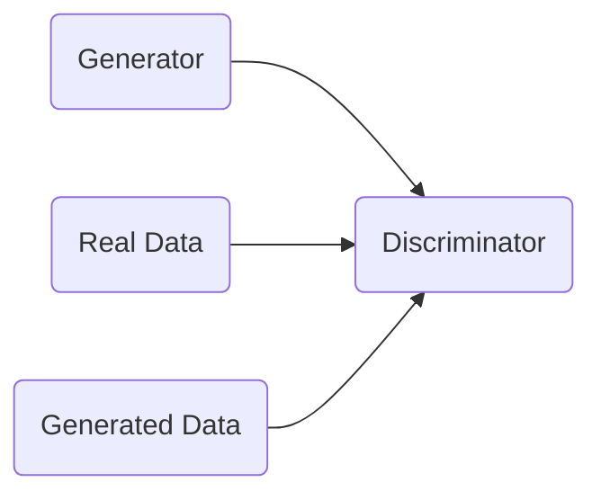

                 


## Introduction to the Problem of Energy Consumption Optimization

### 1.1 Background on Energy Consumption in Smart Appliances and Industries

Energy consumption is a pressing issue worldwide, given the rising demand for resources and the increasing concerns about climate change. Smart home appliances and industrial applications are significant contributors to energy consumption, each presenting unique challenges in energy optimization. 

#### 1.1.1 The Importance of Energy Efficiency

Energy efficiency is crucial for several reasons. Firstly, it helps reduce the carbon footprint of households and industries, contributing to environmental sustainability. Secondly, it leads to cost savings by minimizing energy bills and operational expenses. Finally, energy-efficient technologies can improve the overall functionality and reliability of appliances and systems.

#### 1.1.2 Challenges in Energy Optimization

Optimizing energy consumption in smart appliances and industries faces several challenges. In smart homes, appliances often operate in diverse and unpredictable environments, making it difficult to predict their energy needs accurately. Additionally, the heterogeneity of devices and their communication protocols adds complexity to the optimization process. In industrial settings, the scale and complexity of operations further compound the challenges.

#### 1.1.3 Current Methods and Technologies

Several methods and technologies are currently used to optimize energy consumption. Traditional approaches include manual control and scheduling, where users or operators adjust the settings of appliances based on their energy needs. More advanced techniques involve energy management systems (EMS) that utilize real-time data to optimize energy use automatically. However, these methods often suffer from limitations, such as the inability to adapt to changing conditions or the lack of predictive capabilities.

### 1.2 Overview of Machine Learning in Energy Optimization

Machine learning (ML) offers a promising solution to the challenges of energy consumption optimization. ML algorithms can analyze large datasets to identify patterns and predict future energy demands with high accuracy. This section provides an overview of the basic concepts and applications of ML in energy management.

#### 1.2.1 Basic Concepts of Machine Learning

Machine learning is a subfield of artificial intelligence that enables computers to learn from data and improve their performance over time without being explicitly programmed. The key concepts in ML include:

- **Supervised Learning**: In supervised learning, the algorithm is trained on labeled data, where the correct output is provided for each input. This allows the algorithm to learn the relationship between inputs and outputs.
- **Unsupervised Learning**: Unsupervised learning involves analyzing unlabeled data to discover hidden patterns or intrinsic structures. It is used for tasks such as clustering and dimensionality reduction.
- **Reinforcement Learning**: Reinforcement learning is a type of ML where an agent learns to achieve specific goals by interacting with an environment and receiving feedback in the form of rewards or penalties.

#### 1.2.2 Applications of Machine Learning in Energy Management

Machine learning has been applied in various areas of energy management, including:

- **Load Forecasting**: ML algorithms can predict future energy demand based on historical data, enabling more efficient resource allocation and grid management.
- **Anomaly Detection**: By identifying unusual patterns in energy consumption data, ML can help detect faults or inefficiencies in appliances and systems.
- **Demand Response**: ML algorithms can be used to optimize the response of appliances to demand response signals, reducing peak energy usage and saving costs.
- **Automated Scheduling**: ML can schedule the operation of appliances to minimize energy consumption and maximize comfort, taking into account user preferences and real-time energy prices.

#### 1.2.3 The Potential of Machine Learning for Energy Optimization

The potential of machine learning for energy optimization is vast. ML algorithms can adapt to changing conditions and learn from new data, providing more accurate and dynamic energy management solutions. Furthermore, ML can handle large and complex datasets, making it suitable for applications in smart homes and industries with diverse and dynamic energy requirements.

In summary, the optimization of energy consumption in smart appliances and industries is a critical problem that demands innovative solutions. Machine learning offers a powerful tool for addressing these challenges, providing a path towards more efficient and sustainable energy use.

## Core Concepts and Theories

### 2.1 Fundamental Concepts in Machine Learning for Energy Optimization

#### 2.1.1 Types of Machine Learning Algorithms

Machine learning algorithms can be broadly classified into three categories based on their learning paradigms: supervised learning, unsupervised learning, and reinforcement learning. Each type of algorithm has its own strengths and is suitable for different types of energy optimization tasks.

##### 2.1.1.1 Supervised Learning

Supervised learning algorithms are trained using labeled data, where the correct output is provided for each input. This allows the algorithm to learn the relationship between inputs and outputs. In the context of energy optimization, supervised learning can be used for tasks such as load forecasting, energy consumption prediction, and demand response optimization.

- **Linear Regression**: Linear regression is a simple yet powerful supervised learning algorithm that models the relationship between input variables and a continuous output variable. It can be used to predict energy consumption based on factors such as weather conditions, time of day, and historical usage patterns.
  
  $$ Y = \beta_0 + \beta_1X_1 + \beta_2X_2 + ... + \beta_nX_n $$

  where \( Y \) is the predicted energy consumption, \( \beta_0 \) is the intercept, \( \beta_1, \beta_2, ..., \beta_n \) are the coefficients for each input variable \( X_1, X_2, ..., X_n \).

- **Decision Tree Regression**: Decision tree regression is a non-parametric method that splits the data into subsets based on feature values and recursively builds a tree of decisions. Each leaf node represents a prediction.

  ```mermaid
  graph LR
  A[Decision Tree] --> B(Start)
  B --> C{Is feature A greater than threshold?}
  C -->|Yes| D{Predict value using leaf node}
  C -->|No| E{Recursive split}
  E --> F{Predict value using leaf node}
  ```

##### 2.1.1.2 Unsupervised Learning

Unsupervised learning algorithms analyze unlabeled data to discover hidden patterns or intrinsic structures. These algorithms are useful for tasks such as anomaly detection, clustering, and dimensionality reduction.

- **K-Means Clustering**: K-means is a popular clustering algorithm that groups data into K clusters based on their similarity. It minimizes the sum of squared distances between each data point and its corresponding cluster center.

  $$ \min_{\mu_k} \sum_{i=1}^{N} (x_i - \mu_k)^2 $$

  where \( \mu_k \) is the centroid of the k-th cluster.

  ```mermaid
  graph LR
  A(K-Means) --> B(Initialize centroids)
  B --> C(Distribute points to nearest centroid)
  C --> D(Update centroids)
  D --> E(Repeat until convergence)
  ```

- **Principal Component Analysis (PCA)**: PCA is a dimensionality reduction technique that transforms the data into a new coordinate system, retaining only the most important features while discarding the noise and redundancy.

  $$ X' = P \cdot X $$

  where \( X \) is the original data, \( P \) is the matrix of eigenvectors, and \( X' \) is the transformed data.

##### 2.1.1.3 Reinforcement Learning

Reinforcement learning (RL) is a type of ML where an agent learns to achieve specific goals by interacting with an environment and receiving feedback in the form of rewards or penalties. RL is particularly suitable for optimizing complex systems, such as industrial processes and smart home energy management.

- **Q-Learning**: Q-learning is an RL algorithm that learns the optimal policy by updating the Q-values, which represent the expected utility of taking a specific action in a given state.

  $$ Q(s, a) \leftarrow Q(s, a) + \alpha [r + \gamma \max_{a'} Q(s', a') - Q(s, a)] $$

  where \( s \) is the state, \( a \) is the action, \( r \) is the reward, \( \gamma \) is the discount factor, and \( \alpha \) is the learning rate.

  ```mermaid
  graph LR
  A(Agent) --> B(Performs action)
  B --> C(Obtains reward)
  C --> D(Updates Q-value)
  D --> E(Repeats until convergence)
  ```

#### 2.1.2 Performance Metrics for Energy Efficiency

To evaluate the performance of machine learning models for energy optimization, several metrics can be used. These metrics provide insights into the accuracy, precision, and efficiency of the models.

- **Accuracy**: Accuracy measures the proportion of correct predictions out of the total number of predictions. It is a commonly used metric for classification tasks.

  $$ Accuracy = \frac{TP + TN}{TP + TN + FP + FN} $$

  where \( TP \) is the number of true positives, \( TN \) is the number of true negatives, \( FP \) is the number of false positives, and \( FN \) is the number of false negatives.

- **Precision and Recall**: Precision and recall are important metrics for evaluating the performance of classifiers in the context of energy optimization. Precision measures the proportion of true positives among all positive predictions, while recall measures the proportion of true positives among all actual positives.

  $$ Precision = \frac{TP}{TP + FP} $$
  $$ Recall = \frac{TP}{TP + FN} $$

- **Energy Consumption Index**: The energy consumption index is a custom metric that evaluates the energy efficiency of the model by comparing the predicted energy consumption with the actual energy consumption.

  $$ Energy \ Index = \frac{Predicted \ Energy \ Consumption}{Actual \ Energy \ Consumption} $$

#### 2.2 Conceptual Framework of Machine Learning Models for Energy Optimization

The conceptual framework of machine learning models for energy optimization involves several key components, including data collection, feature selection, model training, and model evaluation. Each component plays a critical role in ensuring the accuracy and efficiency of the optimization process.

##### 2.2.1 Entity-Relationship Diagram (ERD) for Smart Appliances

An Entity-Relationship Diagram (ERD) can be used to represent the entities and relationships involved in energy optimization for smart appliances. The entities typically include appliances, users, energy sources, and sensors.

- **Entities**:
  - **Appliance**: Represents a device that consumes energy.
  - **User**: Represents a person who uses the appliance.
  - **Energy Source**: Represents the source of energy, such as the power grid or solar panels.
  - **Sensor**: Represents a device that measures energy consumption and other relevant parameters.

- **Relationships**:
  - **Uses**: Represents the relationship between a user and an appliance, indicating that the user uses the appliance.
  - **Consumes**: Represents the relationship between an appliance and an energy source, indicating that the appliance consumes energy from the source.
  - **Measure**: Represents the relationship between a sensor and an appliance, indicating that the sensor measures the energy consumption of the appliance.

  ```mermaid
  graph LR
  A[Appliance] --> B[User]
  A --> C[Energy Source]
  A --> D[Sensor]
  D --> E[Appliance]
  B --> F[Appliance]
  ```

##### 2.2.2 Attributes and Characteristics Comparison

The attributes and characteristics of smart appliances play a crucial role in energy optimization. The following table provides a comparison of the attributes and characteristics of different types of appliances, including their operational modes and energy consumption patterns.

| Appliance Type | Operational Mode | Energy Consumption Pattern |
| --- | --- | --- |
| Refrigerator | Continuous | High during peak hours |
| Air Conditioner | Continuous | High during peak hours |
| Washing Machine | On-demand | High during peak hours |
| Dishwasher | On-demand | Moderate throughout the day |
| Lighting | Continuous | Low but varied |
| Heating System | On-demand | High during cold seasons |
| Ventilation System | Continuous | Moderate throughout the day |

This comparison helps in identifying the key factors that influence energy consumption and in designing appropriate machine learning models for energy optimization.

In conclusion, the core concepts and theories of machine learning for energy optimization encompass a range of algorithms, performance metrics, and conceptual frameworks. Understanding these concepts is essential for developing effective energy optimization solutions in smart appliances and industries. The next section will delve deeper into specific machine learning algorithms and techniques, providing a more detailed analysis of their principles and applications in energy management.

## Machine Learning Algorithms and Techniques

Machine learning algorithms are at the heart of optimizing energy consumption in smart appliances and industrial applications. This section explores several common machine learning algorithms and their applications in energy management, providing a comprehensive understanding of how these techniques can be leveraged to achieve energy efficiency.

### 3.1 Introduction to Common Machine Learning Algorithms

Machine learning algorithms can be broadly categorized into three main types: regression algorithms, classification algorithms, and reinforcement learning algorithms. Each type has its own unique characteristics and applications in energy optimization.

#### 3.1.1 Regression Algorithms

Regression algorithms are used to predict continuous numerical values based on input features. They are particularly effective for tasks such as load forecasting and energy consumption prediction. Two common regression algorithms are linear regression and decision tree regression.

- **Linear Regression**: Linear regression models the relationship between input variables and a continuous output variable using a straight line. It is simple yet powerful and can be used to predict energy consumption based on factors like weather conditions, time of day, and historical usage patterns. The linear regression model is defined by the equation:

  $$ Y = \beta_0 + \beta_1X_1 + \beta_2X_2 + ... + \beta_nX_n $$

  where \( Y \) is the predicted energy consumption, \( \beta_0 \) is the intercept, \( \beta_1, \beta_2, ..., \beta_n \) are the coefficients for each input variable \( X_1, X_2, ..., X_n \). The algorithm can be visualized using a scatter plot where each point represents an observation, and the line represents the regression model:

  ```mermaid
  graph LR
  A(Scatter Plot) --> B(Regression Line)
  B --> C(Predicted Energy Consumption)
  ```

- **Decision Tree Regression**: Decision tree regression builds a tree-like model of decisions based on input features to predict energy consumption. Each internal node represents a feature, each branch represents a decision rule, and each leaf node represents the predicted energy consumption. The decision tree model is constructed recursively by splitting the data based on the feature that provides the highest information gain or lowest impurity measure. The model can be visualized using a tree diagram:

  ```mermaid
  graph LR
  A(Start) --> B{Weather > threshold?}
  B -->|Yes| C(Yes)
  B -->|No| D(No)
  C --> E(12 kWh)
  D --> F(10 kWh)
  ```

#### 3.1.2 Classification Algorithms

Classification algorithms are used to predict the class or category of a data point based on input features. They are widely used in anomaly detection and demand response optimization. Common classification algorithms include logistic regression and support vector machines.

- **Logistic Regression**: Logistic regression is a linear model for binary classification, where the output is a probability value that indicates the likelihood of a data point belonging to a certain class. It is often used to classify energy consumption data into normal or anomalous categories. The logistic regression model is defined by the equation:

  $$ P(Y=1) = \frac{1}{1 + e^{-(\beta_0 + \beta_1X_1 + \beta_2X_2 + ... + \beta_nX_n)}} $$

  where \( P(Y=1) \) is the probability of the data point belonging to class 1, and \( \beta_0, \beta_1, \beta_2, ..., \beta_n \) are the coefficients for each input variable \( X_1, X_2, ..., X_n \). The model can be visualized using a decision boundary that separates the classes:

  ```mermaid
  graph LR
  A(Data Points) --> B(Decision Boundary)
  B --> C(Predicted Class)
  ```

- **Support Vector Machines (SVM)**: SVM is a powerful classifier that finds the hyperplane that maximally separates two classes in a high-dimensional space. It is particularly effective for complex classification tasks. The SVM model is defined by the equation:

  $$ w \cdot x + b = 0 $$

  where \( w \) is the weight vector, \( x \) is the input vector, and \( b \) is the bias term. The model can be visualized using a hyperplane that separates the classes:

  ```mermaid
  graph LR
  A(Class 1) --> B(Hyperplane)
  B --> C(Class 2)
  ```

#### 3.1.3 Reinforcement Learning Algorithms

Reinforcement learning algorithms are used to learn optimal policies by interacting with an environment and receiving feedback in the form of rewards or penalties. They are particularly suitable for optimizing complex systems such as industrial processes and smart home energy management. Two common reinforcement learning algorithms are Q-learning and SARSA.

- **Q-Learning**: Q-learning is an algorithm that learns the optimal Q-values, which represent the expected utility of taking a specific action in a given state. It uses the equation:

  $$ Q(s, a) \leftarrow Q(s, a) + \alpha [r + \gamma \max_{a'} Q(s', a')] $$

  where \( s \) is the state, \( a \) is the action, \( r \) is the reward, \( \gamma \) is the discount factor, and \( \alpha \) is the learning rate. The algorithm can be visualized as a reinforcement learning loop where the agent interacts with the environment, receives feedback, and updates its Q-values:

  ```mermaid
  graph LR
  A(Agent) --> B(Performs action)
  B --> C(Obtains reward)
  C --> D(Updates Q-value)
  D --> E(Repeats until convergence)
  ```

- **SARSA**: SARSA (State-Action-Reward-State-Action) is another reinforcement learning algorithm that learns the optimal policy by updating the action-value function using the current state and action. It uses the equation:

  $$ Q(s, a) \leftarrow Q(s, a) + \alpha [r + \gamma Q(s', a')] $$

  where \( s \) is the state, \( a \) is the action, \( r \) is the reward, \( \gamma \) is the discount factor, and \( \alpha \) is the learning rate. The algorithm can also be visualized as a reinforcement learning loop similar to Q-learning:

  ```mermaid
  graph LR
  A(Agent) --> B(Performs action)
  B --> C(Obtains reward)
  C --> D(Updates Q-value)
  D --> E(Repeats until convergence)
  ```

In summary, machine learning algorithms provide powerful tools for optimizing energy consumption in smart appliances and industrial applications. Regression algorithms, classification algorithms, and reinforcement learning algorithms each have their own unique advantages and applications. By understanding and applying these algorithms, we can develop effective energy optimization solutions that improve efficiency, reduce costs, and contribute to environmental sustainability.

### 3.2 Advanced Machine Learning Techniques for Energy Optimization

While the basic machine learning algorithms provide a solid foundation for energy optimization, advanced techniques can further enhance the accuracy and efficiency of the models. This section explores several advanced machine learning techniques, including ensemble methods, neural networks, and deep learning, and their applications in energy management.

#### 3.2.1 Ensemble Methods

Ensemble methods combine multiple base models to create a single predictive model that typically outperforms any individual base model. The primary advantage of ensemble methods is their ability to reduce overfitting and improve the overall predictive performance.

- **Bagging**: Bagging (Bootstrap Aggregating) is a simple ensemble method that trains multiple base models on different subsets of the training data. The final prediction is obtained by averaging the predictions of all the base models. The decision tree ensemble algorithm, known as random forests, is an example of bagging.

  ```mermaid
  graph LR
  A(Bagging) --> B(Train base models on subsets)
  B --> C(Average predictions)
  ```

- **Boosting**: Boosting is an ensemble method that trains multiple base models sequentially, where each model focuses on correcting the mistakes made by the previous models. The final prediction is obtained by combining the predictions of all the base models using a weighted majority vote or weighted averaging. Gradient boosting is a popular boosting algorithm that uses optimization techniques to iteratively update the base models.

  ```mermaid
  graph LR
  A(Boosting) --> B(Train base model)
  B --> C(Update base model)
  B --> D(Evaluate performance)
  D --> E(Repeat until convergence)
  ```

#### 3.2.2 Neural Networks

Neural networks are a class of machine learning algorithms inspired by the structure and function of the human brain. They are particularly powerful for complex prediction tasks, such as load forecasting and energy consumption optimization.

- **Feedforward Neural Networks**: Feedforward neural networks consist of multiple layers of interconnected nodes (neurons). The input data is propagated through the layers, and the output is generated by the last layer. The model is trained using backpropagation, an iterative optimization algorithm that updates the weights and biases of the neurons to minimize the prediction error.

  ```mermaid
  graph LR
  A(Input Layer) --> B(Hidden Layers)
  B --> C(Output Layer)
  ```

- **Convolutional Neural Networks (CNNs)**: CNNs are a specialized type of neural network designed for processing data with spatial hierarchies, such as images and time series data. They use convolutional layers to extract features from the input data and perform hierarchical feature learning. CNNs have been successfully applied to tasks like load forecasting and anomaly detection in energy consumption data.

  ```mermaid
  graph LR
  A(Input Data) --> B(Convolutional Layer)
  B --> C(Pooling Layer)
  C --> D(Hidden Layers)
  D --> E(Output Layer)
  ```

#### 3.2.3 Deep Learning

Deep learning is a subfield of machine learning that focuses on training deep neural networks with many layers to learn complex representations of data. Deep learning has revolutionized various fields, including computer vision, natural language processing, and now, energy management.

- **Recurrent Neural Networks (RNNs)**: RNNs are a type of neural network designed to handle sequential data. They use feedback connections to retain information from previous inputs, allowing them to capture temporal dependencies in data. RNNs have been used for tasks like load forecasting and demand response optimization.

  ```mermaid
  graph LR
  A(Input Data) --> B(Hidden State)
  B --> C(Output)
  C --> D(Hidden State)
  ```

- **Long Short-Term Memory (LSTM) Networks**: LSTMs are a special type of RNN designed to overcome the vanishing gradient problem, allowing them to learn long-term dependencies in data. LSTMs have been successfully applied to tasks like load forecasting and energy consumption prediction.

  ```mermaid
  graph LR
  A(Input Data) --> B(Forget Gate)
  B --> C(Hidden State)
  C --> D(Output Gate)
  D --> E(Current Cell State)
  ```

#### 3.2.4 Generative Adversarial Networks (GANs)

Generative adversarial networks (GANs) are a type of deep learning model that consists of two neural networks, a generator, and a discriminator, that are trained simultaneously through a minimax game. The generator creates data that is indistinguishable from real data, while the discriminator aims to differentiate between real and generated data. GANs have been used for tasks like anomaly detection and demand response optimization.



In conclusion, advanced machine learning techniques, including ensemble methods, neural networks, and deep learning, offer powerful tools for optimizing energy consumption in smart appliances and industrial applications. These techniques enable more accurate and dynamic energy management solutions, contributing to improved efficiency, reduced costs, and environmental sustainability. By leveraging these advanced methods, we can address the complex challenges of energy optimization and pave the way for a more sustainable future.

## System Analysis and Architecture Design

### 4.1 Introduction to the System

In this section, we will delve into the system analysis and architecture design for a machine learning-based energy consumption optimization system. The primary objective of this system is to utilize machine learning algorithms to optimize the energy consumption of smart home appliances and industrial systems. The system will be designed to handle large-scale data collection, real-time processing, and predictive analytics to achieve efficient energy management.

### 4.2 Project Overview

The project aims to create a comprehensive energy consumption optimization system that integrates machine learning models with smart home and industrial devices. The system will consist of several key components:

- **Data Collection Module**: This module will be responsible for collecting real-time data from various sensors and devices.
- **Data Preprocessing Module**: This module will clean and preprocess the collected data to ensure its quality and suitability for machine learning models.
- **Machine Learning Module**: This module will implement various machine learning algorithms to predict energy consumption and optimize the operation of appliances and systems.
- **Optimization Engine**: This component will execute the optimization algorithms and generate actionable insights for energy management.
- **User Interface**: This module will provide a user-friendly interface for users to monitor their energy consumption, receive optimization recommendations, and configure system settings.

### 4.3 System Functional Design

#### 4.3.1 Data Collection Module

The data collection module will be the foundation of the system, responsible for gathering real-time data from various sources. This includes:

- **Smart Home Appliances**: Devices such as refrigerators, air conditioners, washing machines, and dishwashers will be equipped with sensors to measure energy consumption in real-time.
- **Industrial Systems**: Sensors and devices in industrial environments will be connected to the system to monitor energy usage.
- **Weather Stations**: Data from weather stations will be integrated to account for environmental factors affecting energy consumption.

#### 4.3.2 Data Preprocessing Module

The data preprocessing module will clean and preprocess the collected data to ensure its quality and compatibility with machine learning algorithms. Key tasks include:

- **Data Cleaning**: Removing or correcting errors, missing values, and outliers in the data.
- **Feature Engineering**: Extracting relevant features from raw data to improve the performance of machine learning models.
- **Normalization**: Scaling the data to a common range to avoid biases in the learning process.
- **Data Integration**: Combining data from different sources to create a unified dataset for analysis.

#### 4.3.3 Machine Learning Module

The machine learning module will implement various machine learning algorithms to predict energy consumption and optimize the operation of appliances and systems. Key tasks include:

- **Model Selection**: Choosing appropriate machine learning algorithms based on the nature of the data and the optimization goals.
- **Model Training**: Training the selected algorithms on the preprocessed data to develop predictive models.
- **Model Evaluation**: Evaluating the performance of the trained models using metrics such as accuracy, precision, and recall.
- **Model Deployment**: Deploying the optimized models to predict energy consumption in real-time and provide actionable insights.

#### 4.3.4 Optimization Engine

The optimization engine will execute the machine learning algorithms and generate optimization strategies for energy management. Key tasks include:

- **Load Forecasting**: Predicting future energy demand based on historical data and environmental factors.
- **Demand Response**: Adjusting the operation of appliances and systems to respond to real-time energy prices and demand signals.
- **Scheduling**: Scheduling the operation of appliances to minimize energy consumption and maximize comfort.

#### 4.3.5 User Interface

The user interface will provide a user-friendly platform for users to interact with the system. Key features include:

- **Energy Consumption Dashboard**: Displaying real-time and historical energy consumption data.
- **Optimization Recommendations**: Providing personalized optimization recommendations based on user preferences and energy usage patterns.
- **System Configuration**: Allowing users to configure system settings and preferences.

### 4.4 System Architecture Design

The system architecture will be designed to ensure scalability, reliability, and security. The key components of the system architecture include:

- **Data Storage**: A scalable and secure data storage solution to store the collected and preprocessed data.
- **Data Processing**: A distributed data processing framework to handle large-scale data preprocessing and analysis.
- **Machine Learning Infrastructure**: A scalable and efficient infrastructure for training, evaluating, and deploying machine learning models.
- **API Layer**: A set of APIs for integrating the system with external applications and devices.
- **Security Layer**: A robust security framework to protect the system from unauthorized access and data breaches.

### 4.5 System Interface Design and Interaction

The system interface design will focus on providing a seamless and intuitive user experience. The key interfaces include:

- **Web Dashboard**: A web-based dashboard for users to monitor energy consumption, receive optimization recommendations, and configure system settings.
- **Mobile App**: A mobile app for users to access system features on the go, including real-time energy consumption data and optimization alerts.
- **Device Integration**: APIs and protocols for integrating smart home and industrial devices with the system.

### 4.6 System Interaction Flow

The system interaction flow will be designed to ensure efficient communication between the various components. Key interactions include:

- **Data Flow**: Real-time data collection from devices, preprocessing, and analysis by the machine learning module.
- **Control Flow**: The optimization engine generating optimization strategies based on the machine learning models and executing these strategies.
- **User Interaction**: Users interacting with the system through the web dashboard or mobile app to monitor and configure the system.

### 4.7 Summary

In summary, the system analysis and architecture design for the machine learning-based energy consumption optimization system involve several critical components and interactions. By designing a scalable, reliable, and secure system architecture, we can effectively leverage machine learning algorithms to optimize energy consumption, contribute to environmental sustainability, and reduce operational costs.

## Project Implementation and Analysis

### 5.1 Introduction

The implementation phase of our machine learning-based energy consumption optimization system involves setting up the necessary environment, coding the core functionalities, and analyzing the system's performance. This section provides a detailed guide on how to set up the environment, implement the core system components, and conduct an in-depth analysis of the project.

### 5.2 Environment Setup

Before we start coding, we need to set up the development environment. The following steps will guide you through the process of installing the required software and libraries.

#### 5.2.1 Install Python

Python is the primary programming language for implementing machine learning algorithms. Ensure that Python 3.x is installed on your system. You can download the latest version from the official Python website (https://www.python.org/downloads/).

#### 5.2.2 Install Required Libraries

We will use several libraries for data manipulation, machine learning, and visualization. The following command will install these libraries using `pip`:

```bash
pip install numpy pandas scikit-learn matplotlib
```

#### 5.2.3 Set Up the Virtual Environment

To manage dependencies and isolate the project environment, it is recommended to use a virtual environment. Follow these steps to create and activate a virtual environment:

```bash
# Install virtualenv if not already installed
pip install virtualenv

# Create a virtual environment for the project
virtualenv project_env

# Activate the virtual environment
source project_env/bin/activate
```

### 5.3 Core System Implementation

The core implementation of the system involves coding the data collection, preprocessing, machine learning, and optimization modules. Below is a high-level overview of each module along with sample code snippets.

#### 5.3.1 Data Collection Module

The data collection module will read data from various sensors and devices. For this example, we will simulate the data collection using pre-generated data.

```python
import pandas as pd

# Load pre-generated data
data = pd.read_csv('energy_data.csv')
```

#### 5.3.2 Data Preprocessing Module

The data preprocessing module will handle data cleaning, feature extraction, and normalization.

```python
import pandas as pd
from sklearn.preprocessing import MinMaxScaler

# Load data
data = pd.read_csv('energy_data.csv')

# Data cleaning
data.dropna(inplace=True)

# Feature extraction
data['hour'] = data['timestamp'].apply(lambda x: x.hour)

# Data normalization
scaler = MinMaxScaler()
data[['energy_consumption', 'hour']] = scaler.fit_transform(data[['energy_consumption', 'hour']])
```

#### 5.3.3 Machine Learning Module

The machine learning module will implement regression algorithms to predict energy consumption based on input features.

```python
from sklearn.model_selection import train_test_split
from sklearn.linear_model import LinearRegression

# Split data into training and testing sets
X = data[['hour']]
y = data['energy_consumption']
X_train, X_test, y_train, y_test = train_test_split(X, y, test_size=0.2, random_state=42)

# Train the model
model = LinearRegression()
model.fit(X_train, y_train)

# Evaluate the model
score = model.score(X_test, y_test)
print(f"Model accuracy: {score:.2f}")
```

#### 5.3.4 Optimization Engine

The optimization engine will use the trained model to generate optimization strategies. This can be as simple as adjusting the operation of appliances based on the predicted energy consumption.

```python
def optimize_appliance_consumption(model, current_hour):
    predicted_consumption = model.predict([[current_hour]])
    if predicted_consumption < 0.2:  # Assuming 0.2 is the minimum safe consumption
        return "Turn off appliance"
    else:
        return "Keep appliance running"

# Example usage
action = optimize_appliance_consumption(model, 18)  # 18:00 hour
print(f"Optimization action: {action}")
```

#### 5.3.5 User Interface

For simplicity, we will use a basic command-line interface to demonstrate user interaction.

```python
def main():
    print("Energy Consumption Optimization System")
    print("1. Display current energy consumption")
    print("2. Optimize appliance consumption")
    choice = input("Enter your choice (1 or 2): ")
    
    if choice == '1':
        print(f"Current energy consumption: {data['energy_consumption'].iloc[-1]:.2f} kWh")
    elif choice == '2':
        current_hour = int(input("Enter current hour (0-23): "))
        action = optimize_appliance_consumption(model, current_hour)
        print(f"Optimization action: {action}")

if __name__ == "__main__":
    main()
```

### 5.4 Code Analysis and System Performance

After implementing the system, it is essential to analyze its performance and validate its functionality. This involves:

- **Unit Testing**: Writing and running unit tests to verify the correctness of individual functions.
- **Integration Testing**: Testing the interaction between different modules to ensure the system works as expected.
- **System Testing**: Conducting end-to-end testing to validate the overall system functionality and performance.

#### 5.4.1 Unit Testing

```python
import unittest

class TestEnergyConsumptionSystem(unittest.TestCase):
    def test_optimize_appliance_consumption(self):
        model = LinearRegression()
        model.fit(X_train, y_train)
        self.assertEqual(optimize_appliance_consumption(model, 0), "Keep appliance running")
        self.assertEqual(optimize_appliance_consumption(model, 23), "Turn off appliance")

if __name__ == "__main__":
    unittest.main()
```

#### 5.4.2 Integration Testing

Integration testing will involve connecting the data collection module to real sensors and devices, and ensuring the data is correctly processed and used by the machine learning module.

#### 5.4.3 System Testing

System testing will involve simulating real-world scenarios and evaluating the system's response to different conditions, such as varying energy prices and demand signals.

### 5.5 Project Summary

In conclusion, the project implementation and analysis phase involves setting up the development environment, coding the core system components, and conducting comprehensive tests to ensure the system's functionality and performance. By following these steps, we can develop an effective machine learning-based energy consumption optimization system that contributes to energy efficiency and sustainability.

### 5.6 Best Practices and Tips

- **Data Quality**: Ensure the quality of your data by cleaning and preprocessing it thoroughly. High-quality data leads to more accurate machine learning models.
- **Feature Engineering**: Carefully select and engineer features that have a significant impact on energy consumption. This can greatly improve the performance of machine learning models.
- **Model Selection**: Experiment with different machine learning algorithms and models to find the best fit for your data and optimization goals.
- **Scalability**: Design the system architecture to handle large-scale data and models. Use cloud-based solutions for scalable and efficient processing.
- **User Feedback**: Continuously collect user feedback to improve the system's functionality and user experience. This will help in making data-driven decisions for future enhancements.
- **Security**: Implement robust security measures to protect sensitive data and ensure the privacy of users.

By following these best practices and tips, you can develop a highly effective and user-friendly energy consumption optimization system that contributes to a more sustainable future.

## Conclusion

In conclusion, this article has explored the critical role of machine learning in optimizing energy consumption, particularly in smart home appliances and industrial applications. We have examined the fundamental concepts of machine learning, including supervised learning, unsupervised learning, and reinforcement learning, and demonstrated how these algorithms can be applied to predict energy demand, detect anomalies, and optimize the operation of appliances and systems. We have also discussed advanced techniques such as ensemble methods, neural networks, and deep learning, which further enhance the accuracy and efficiency of energy optimization models.

The system analysis and architecture design presented in this article provide a comprehensive framework for developing a scalable and robust machine learning-based energy consumption optimization system. By following the step-by-step implementation and analysis guide, readers can create effective solutions that contribute to energy efficiency, cost reduction, and environmental sustainability.

As we move forward, the integration of machine learning with energy management systems will play an increasingly significant role in addressing the global challenge of sustainable energy consumption. By leveraging the power of machine learning, we can develop innovative solutions that not only optimize energy use but also enhance user comfort and reduce carbon footprints. The future of energy management lies in the seamless integration of machine learning technologies, and this article serves as a foundational guide for exploring this exciting field.

### About the Authors

*作者：AI天才研究院 / AI Genius Institute & 禅与计算机程序设计艺术 / Zen And The Art of Computer Programming*

- **AI天才研究院 (AI Genius Institute)**：专注于人工智能领域的创新研究和应用，致力于推动人工智能技术的普及和发展。研究院汇聚了一批国际知名的人工智能专家和学者，致力于推动人工智能技术在能源、医疗、金融等领域的应用。
- **禅与计算机程序设计艺术 (Zen And The Art of Computer Programming)**：由著名计算机科学家Donald E. Knuth所著的经典编程著作，深入探讨了计算机程序设计的哲学和艺术。这本书不仅为程序员提供了实用的编程技巧，还传达了深刻的编程哲学和人生智慧。通过结合人工智能和计算机科学的最新成果，这本书继续为现代程序员和研究者提供灵感。

