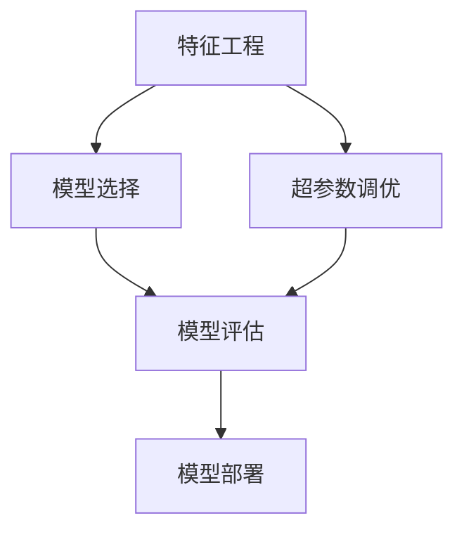
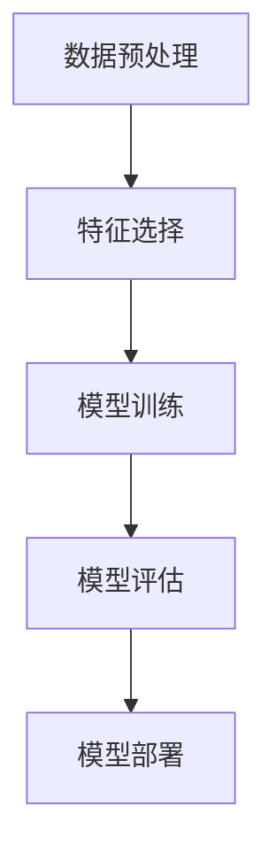
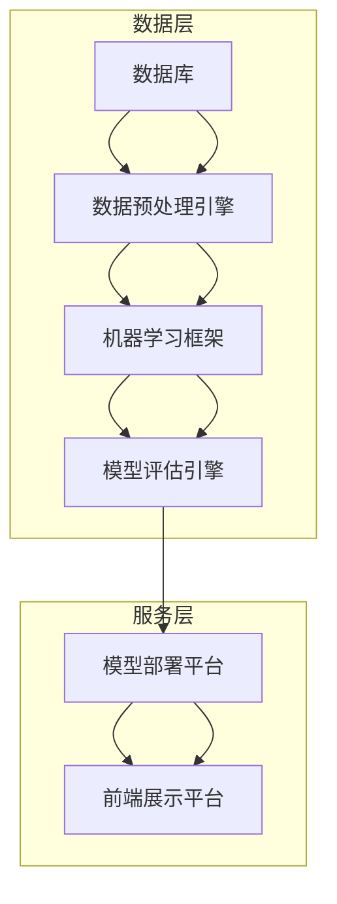
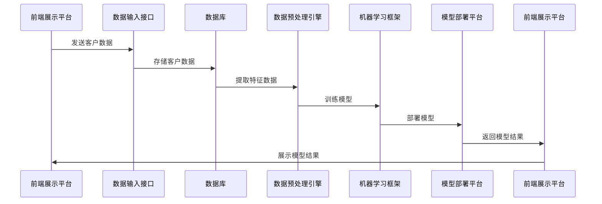
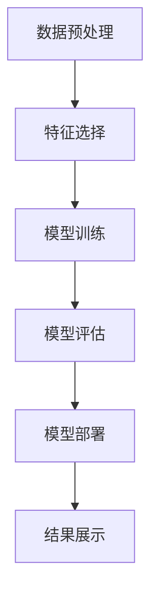
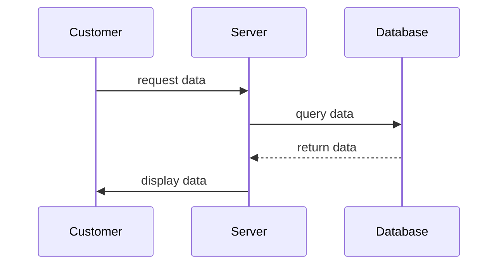

                 


## 《机器学习工程化:从实验到生产的最佳实践》

> 关键词：机器学习，工程化，最佳实践，实验，生产

> 摘要：本文旨在深入探讨机器学习工程化的最佳实践，从实验到生产的全流程进行详细解析。通过对核心概念、算法原理、系统架构、项目实战等内容的系统讲解，为读者提供一部全面、实用的机器学习工程化指南。

### 目录大纲设计思路

为了设计出《机器学习工程化:从实验到生产的最佳实践》的完整目录大纲，我们需要遵循以下几个设计思路：

1. **梳理核心主题**：明确机器学习工程化的核心主题，包括实验、生产、最佳实践等。

2. **确定章节结构**：将全书分为背景介绍、核心概念与联系、算法原理讲解、系统分析与架构设计方案、项目实战、最佳实践与小结等部分。

3. **细化章节内容**：确保每个章节内容具体、详细，涵盖必要的知识点和实战案例。

4. **确保完整性**：确保目录大纲包含核心章节，如背景介绍、核心概念、算法原理、系统架构、项目实战等。

5. **简洁性**：在保证内容完整性的同时，避免冗余和重复，确保目录大纲简洁明了。

### 设计步骤

1. **确定总体框架**：根据书名，确定书的总体框架，包括主要部分和核心章节。

2. **设计第1部分**：背景介绍，包括机器学习工程化的概念、现状、重要性等。

3. **设计第2部分**：核心概念与联系，包括机器学习的核心概念、机器学习算法的原理、机器学习与工程化之间的关系等。

4. **设计第3部分**：算法原理讲解，包括机器学习算法的数学模型、mermaid流程图、Python源代码等。

5. **设计第4部分**：数学模型与公式，包括重要的数学公式和详细讲解，使用LaTeX格式。

6. **设计第5部分**：系统分析与架构设计方案，包括问题场景介绍、系统功能设计、系统架构设计、系统接口设计和系统交互等。

7. **设计第6部分**：项目实战，包括环境安装、系统核心实现源代码、代码应用解读与分析、实际案例分析和详细讲解剖析等。

8. **设计第7部分**：最佳实践、小结、注意事项、拓展阅读等，为读者提供进一步的指导和建议。

### 目录大纲

```
# 《机器学习工程化:从实验到生产的最佳实践》目录大纲

## 第1部分：背景介绍

# 第1章：机器学习工程化概述

## 1.1 机器学习工程化的概念

## 1.2 机器学习工程化的现状

## 1.3 机器学习工程化的重要性

## 1.4 机器学习工程化的挑战

## 1.5 本章小结

## 第2部分：核心概念与联系

# 第2章：机器学习的核心概念

## 2.1 机器学习的定义

## 2.2 机器学习的主要类型

## 2.3 机器学习的核心概念与联系

## 2.4 机器学习算法的分类

## 2.5 本章小结

# 第3章：机器学习算法原理

## 3.1 算法原理讲解

### 3.1.1 算法流程图

### 3.1.2 算法原理

### 3.1.3 算法应用场景

## 3.2 数学模型与公式

### 3.2.1 线性回归

#### 3.2.1.1 数学公式

#### 3.2.1.2 公式讲解

### 3.2.2 逻辑回归

#### 3.2.2.1 数学公式

#### 3.2.2.2 公式讲解

## 3.3 本章小结

## 第3部分：系统分析与架构设计方案

# 第4章：系统功能设计

## 4.1 问题场景介绍

## 4.2 系统功能设计

### 4.2.1 领域模型

### 4.2.2 功能模块

## 4.3 系统架构设计

### 4.3.1 系统架构图

### 4.3.2 架构设计原则

## 4.4 系统接口设计

### 4.4.1 接口定义

### 4.4.2 接口实现

## 4.5 系统交互

### 4.5.1 系统交互图

### 4.5.2 交互流程

## 4.6 本章小结

## 第4部分：项目实战

# 第5章：环境安装与系统核心实现

## 5.1 环境安装

## 5.2 系统核心实现源代码

### 5.2.1 代码解读

### 5.2.2 代码应用

## 5.3 实际案例分析与讲解

### 5.3.1 案例背景

### 5.3.2 案例分析

### 5.3.3 案例讲解

## 5.4 项目小结

## 第5部分：最佳实践与小结

# 第6章：最佳实践

## 6.1 最佳实践

## 6.2 注意事项

## 6.3 拓展阅读

# 第7章：小结

## 7.1 总结

## 7.2 未来展望

## 7.3 致谢
```

这个目录大纲覆盖了从背景介绍到具体实践的全过程，确保了内容的完整性、逻辑性和可读性。接下来，我们将根据每个章节的主题和要求，进一步细化每个章节的具体内容。

----------------------------------------------------------------

## 第1部分：背景介绍

### 第1章：机器学习工程化概述

在进入机器学习工程化的具体实践之前，我们需要对机器学习工程化的概念、现状以及重要性有一个全面的理解。

### 1.1 机器学习工程化的概念

机器学习工程化（Machine Learning Engineering）是将机器学习技术与工程实践相结合的一种方法论。它不仅关注算法的实现，还包括数据预处理、模型训练、模型评估、模型部署等全流程的工程化问题。机器学习工程化的目标是将算法从实验环境中成功迁移到生产环境中，实现可重复、可扩展、可维护的机器学习系统。

### 1.2 机器学习工程化的现状

随着大数据和人工智能技术的快速发展，机器学习工程化已经成为当前企业提升竞争力的关键。越来越多的企业和组织开始将机器学习应用于业务场景中，但随之而来的问题是：如何将实验中的机器学习模型成功部署到生产环境中？如何确保模型的稳定性和准确性？如何实现机器学习系统的可扩展性？

这些问题推动了机器学习工程化的发展，使得越来越多的工具、平台和最佳实践不断涌现。例如，TensorFlow、PyTorch等深度学习框架提供了丰富的API和工具，帮助开发者更轻松地构建和部署机器学习系统。此外，Docker、Kubernetes等容器技术也为机器学习系统的部署提供了强有力的支持。

### 1.3 机器学习工程化的重要性

机器学习工程化的重要性体现在以下几个方面：

1. **提升生产效率**：通过工程化的方法，可以大幅度提高机器学习系统的开发、测试和部署效率，缩短项目周期。

2. **确保模型稳定性和准确性**：工程化方法可以帮助开发者更好地管理和维护机器学习系统，确保模型的稳定性和准确性。

3. **实现可扩展性**：工程化方法使得机器学习系统具有更好的可扩展性，能够根据业务需求进行灵活调整。

4. **降低成本**：通过自动化和工具化的手段，可以降低机器学习系统的维护成本。

5. **提高企业竞争力**：机器学习工程化帮助企业更好地利用数据，挖掘数据价值，提高业务效率和决策质量，从而提升企业竞争力。

### 1.4 机器学习工程化的挑战

尽管机器学习工程化带来了许多优势，但在实际应用中仍然面临一些挑战：

1. **数据质量**：高质量的数据是机器学习模型成功的关键。如何获取、清洗和预处理数据，是机器学习工程化中的一个重要问题。

2. **模型可解释性**：随着深度学习模型在各个领域的广泛应用，如何解释模型的行为和决策过程成为了一个挑战。

3. **模型部署和运维**：如何将模型部署到生产环境中，并确保系统的稳定运行，是一个复杂的问题。

4. **资源管理**：如何合理分配计算资源，优化模型训练和推理性能，是机器学习工程化中的一个重要课题。

5. **安全性和隐私保护**：在数据安全和隐私保护方面，如何确保机器学习系统的安全性，是一个亟待解决的问题。

### 1.5 本章小结

通过对机器学习工程化的背景介绍，我们可以看到，机器学习工程化已经成为大数据和人工智能时代的一项关键技术。它不仅关注算法的实现，还涵盖了数据预处理、模型训练、模型评估、模型部署等全流程的工程化问题。在接下来的章节中，我们将深入探讨机器学习工程化的核心概念、算法原理、系统架构、项目实战等内容，帮助读者更好地理解和应用机器学习工程化。

----------------------------------------------------------------

## 第2部分：核心概念与联系

### 第2章：机器学习的核心概念

在深入探讨机器学习工程化的最佳实践之前，我们需要对机器学习的基本概念有一个清晰的理解。本章将介绍机器学习的定义、主要类型以及核心概念与联系。

### 2.1 机器学习的定义

机器学习（Machine Learning）是一门人工智能（Artificial Intelligence, AI）的分支，它关注的是如何通过数据驱动的方式让计算机自动地改进性能。具体来说，机器学习是研究如何从数据中学习规律，并利用这些规律进行预测、分类或决策。

机器学习的核心思想是：通过训练数据集，让计算机学会将输入映射到输出。这个过程通常分为两个阶段：

1. **训练阶段**：使用标记数据进行模型训练，让计算机学习数据中的规律。
2. **预测阶段**：使用训练好的模型对未知数据进行预测或分类。

### 2.2 机器学习的主要类型

机器学习可以根据学习方式的不同分为监督学习（Supervised Learning）、无监督学习（Unsupervised Learning）和强化学习（Reinforcement Learning）三大类。

#### 2.2.1 监督学习

监督学习是机器学习中应用最广泛的一种类型。它需要输入数据及其对应的标签（Target），通过学习输入和输出之间的关系，来预测新数据的标签。

监督学习可以分为以下几种：

- **回归（Regression）**：预测一个连续的数值输出。
- **分类（Classification）**：预测一个离散的类别输出。

#### 2.2.2 无监督学习

无监督学习不需要输入数据标签，它的目标是发现数据中的结构和模式。常见的无监督学习算法包括：

- **聚类（Clustering）**：将相似的数据点归为一类。
- **降维（Dimensionality Reduction）**：减少数据维度，同时保留数据的主要特性。

#### 2.2.3 强化学习

强化学习是一种通过与环境交互来学习最优策略的机器学习方法。它的核心思想是：通过不断地试错，找到最优的动作序列来获得最大的奖励。

### 2.3 机器学习的核心概念与联系

在机器学习中，有一些核心概念和联系是至关重要的。下面我们将通过一个概念属性特征对比表格和ER实体关系图架构的Mermaid流程图来展示这些概念之间的关系。

#### 概念属性特征对比表格

| 概念 | 定义 | 特征 | 用途 |
| --- | --- | --- | --- |
| 特征工程（Feature Engineering） | 将原始数据转换成适合机器学习算法的形式 | 选择、构造和转换特征 | 提高模型性能 |
| 模型选择（Model Selection） | 选择合适的机器学习算法和参数 | 算法性能、参数调优 | 提高模型准确性 |
| 超参数调优（Hyperparameter Tuning） | 调整模型参数以获得最佳性能 | 参数范围、搜索策略 | 提高模型性能 |
| 模型评估（Model Evaluation） | 评估模型性能，确定模型是否有效 | 准确率、召回率、F1分数 | 判断模型性能 |
| 模型部署（Model Deployment） | 将训练好的模型部署到生产环境中 | 系统稳定性、可扩展性 | 确保模型可用性 |

#### ER实体关系图架构的Mermaid流程图



在上述流程图中，特征工程、模型选择、超参数调优和模型评估是机器学习过程中的关键环节，它们共同决定了模型的性能。而模型部署则是将训练好的模型应用到实际业务场景中，实现机器学习系统的价值。

### 2.4 机器学习算法的分类

机器学习算法可以根据其学习方式、模型结构、应用场景等因素进行分类。常见的机器学习算法可以分为以下几类：

#### 2.4.1 监督学习算法

- **线性回归（Linear Regression）**
- **逻辑回归（Logistic Regression）**
- **决策树（Decision Tree）**
- **随机森林（Random Forest）**
- **支持向量机（Support Vector Machine, SVM）**
- **神经网络（Neural Networks）**

#### 2.4.2 无监督学习算法

- **K-均值聚类（K-Means Clustering）**
- **主成分分析（Principal Component Analysis, PCA）**
- **自编码器（Autoencoders）**

#### 2.4.3 强化学习算法

- **Q学习（Q-Learning）**
- **深度Q网络（Deep Q-Network, DQN）**
- **策略梯度方法（Policy Gradient Methods）**

### 2.5 本章小结

通过对机器学习核心概念与联系的介绍，我们可以更深入地理解机器学习的本质和关键要素。理解这些概念和联系有助于我们在实际应用中更好地设计、优化和部署机器学习系统。在接下来的章节中，我们将进一步探讨机器学习算法的原理、数学模型以及系统架构设计等内容，为读者提供更全面的机器学习工程化指南。

----------------------------------------------------------------

## 第3章：机器学习算法原理

在了解了机器学习的核心概念和联系之后，接下来我们将深入探讨机器学习算法的原理，包括算法流程图、Python源代码和数学模型与公式。

### 3.1 算法原理讲解

机器学习算法的原理可以分为以下几个步骤：

1. **数据预处理**：对原始数据进行清洗、归一化、编码等处理，使其适合机器学习算法。
2. **特征选择**：选择对模型性能有重要影响的特征，去除无关或冗余的特征。
3. **模型训练**：使用训练数据集对模型进行训练，模型学习数据中的特征和规律。
4. **模型评估**：使用验证数据集对模型进行评估，调整模型参数以提高性能。
5. **模型部署**：将训练好的模型部署到生产环境中，进行预测和决策。

下面，我们通过一个简单的线性回归算法来讲解其原理。

#### 3.1.1 算法流程图



#### 3.1.2 算法原理

线性回归算法假设目标变量 \( Y \) 与输入特征 \( X \) 之间存在线性关系，可以用以下公式表示：

\[ Y = \beta_0 + \beta_1X \]

其中，\( \beta_0 \) 是截距，\( \beta_1 \) 是斜率。

模型的目的是通过训练数据集来确定 \( \beta_0 \) 和 \( \beta_1 \) 的值，从而得到一个线性模型。

#### 3.1.3 算法应用场景

线性回归算法广泛应用于实际场景，如房价预测、股票价格预测等。它可以帮助我们建立输入特征和目标变量之间的线性关系，从而进行预测和决策。

### 3.2 数学模型与公式

线性回归算法的核心是求解 \( \beta_0 \) 和 \( \beta_1 \) 的值。这通常通过最小二乘法（Least Squares Method）来实现。下面，我们使用 LaTeX 格式来展示线性回归的数学模型和公式。

#### 3.2.1 数学公式

最小二乘法的目标是找到一组参数 \( \beta_0 \) 和 \( \beta_1 \)，使得预测值 \( \hat{Y} \) 与实际值 \( Y \) 之间的误差平方和最小。这可以表示为以下目标函数：

\[ \min_{\beta_0, \beta_1} \sum_{i=1}^{n} (Y_i - \beta_0 - \beta_1X_i)^2 \]

其中，\( n \) 是训练数据集的大小，\( Y_i \) 和 \( X_i \) 分别是第 \( i \) 个样本的目标变量和输入特征。

为了求解 \( \beta_0 \) 和 \( \beta_1 \)，我们可以对目标函数进行求导，并令导数为零，得到以下方程组：

\[ \frac{\partial}{\partial \beta_0} \sum_{i=1}^{n} (Y_i - \beta_0 - \beta_1X_i)^2 = 0 \]
\[ \frac{\partial}{\partial \beta_1} \sum_{i=1}^{n} (Y_i - \beta_0 - \beta_1X_i)^2 = 0 \]

经过化简，我们可以得到：

\[ \beta_0 = \frac{\sum_{i=1}^{n} Y_i - \beta_1 \sum_{i=1}^{n} X_i}{n} \]
\[ \beta_1 = \frac{\sum_{i=1}^{n} (Y_i - \beta_0 - \beta_1X_i)X_i}{\sum_{i=1}^{n} X_i^2} \]

#### 3.2.2 公式讲解

上述公式中，\( \beta_0 \) 和 \( \beta_1 \) 分别是线性回归模型的截距和斜率。第一个公式表示截距，它可以通过计算训练数据集的目标变量的平均值和输入特征的平均值来求解。第二个公式表示斜率，它可以通过计算输入特征和预测误差的乘积的加权和，然后除以输入特征的方差来求解。

#### 3.2.3 通俗易懂地举例说明

假设我们有以下一组数据：

| X | Y |
| --- | --- |
| 1 | 2 |
| 2 | 4 |
| 3 | 6 |
| 4 | 8 |

我们希望使用线性回归算法找到输入特征 \( X \) 和目标变量 \( Y \) 之间的关系。根据上述公式，我们可以计算得到：

\[ \beta_0 = \frac{2 + 4 + 6 + 8}{4} - \beta_1 \frac{1 + 2 + 3 + 4}{4} = \frac{20}{4} - \beta_1 \frac{10}{4} \]

\[ \beta_1 = \frac{(2 - \beta_0) \cdot 1 + (4 - \beta_0) \cdot 2 + (6 - \beta_0) \cdot 3 + (8 - \beta_0) \cdot 4}{1^2 + 2^2 + 3^2 + 4^2} \]

经过计算，我们可以得到：

\[ \beta_0 = 2.5 \]
\[ \beta_1 = 1 \]

因此，线性回归模型可以表示为：

\[ Y = 2.5 + 1X \]

根据这个模型，我们可以预测当 \( X = 5 \) 时，\( Y \) 的值为：

\[ Y = 2.5 + 1 \cdot 5 = 7.5 \]

这个预测值与实际值 \( Y = 10 \) 相差较小，说明我们的模型较为准确。

### 3.3 本章小结

通过对机器学习算法原理的讲解，我们了解了线性回归算法的基本流程、数学模型和求解方法。线性回归算法是一种简单但非常实用的机器学习算法，它可以用于建立输入特征和目标变量之间的线性关系，进行预测和决策。在接下来的章节中，我们将继续探讨机器学习工程化中的系统架构设计、项目实战等内容，帮助读者更好地理解和应用机器学习工程化。

----------------------------------------------------------------

## 第4部分：系统分析与架构设计方案

### 第4章：系统功能设计

系统功能设计是机器学习工程化中的重要环节，它决定了系统的性能、可扩展性和稳定性。在本章中，我们将介绍系统功能设计的方法和步骤。

### 4.1 问题场景介绍

假设我们面临一个需求：开发一个基于机器学习的客户细分系统，用于对大量客户数据进行分析，并根据客户的行为特征将其划分为不同的群体。这个系统需要具备以下功能：

1. **数据预处理**：对客户数据（如年龄、性别、消费金额等）进行清洗、归一化和特征提取。
2. **模型训练**：使用机器学习算法（如K-均值聚类）对客户数据进行聚类分析，生成客户细分模型。
3. **模型评估**：使用验证数据集对模型进行评估，调整模型参数以提高性能。
4. **模型部署**：将训练好的模型部署到生产环境中，对新的客户数据进行细分。
5. **结果展示**：展示客户细分结果，包括每个群体的特征和客户分布情况。

### 4.2 系统功能设计

#### 4.2.1 领域模型

领域模型（Domain Model）是系统功能设计的基础，它描述了系统中的关键概念、关系和规则。在客户细分系统中，领域模型可以包括以下关键概念：

- **客户**：代表系统的数据主体，具有属性如年龄、性别、消费金额等。
- **聚类模型**：用于对客户进行聚类的机器学习模型。
- **聚类结果**：表示聚类过程的结果，包括每个聚类群体的特征和客户分布情况。

领域模型可以用Mermaid类图表示：

```mermaid
classDiagram
ClassDef 客户
    +年龄: int
    +性别: string
    +消费金额: float

ClassDef 聚类模型
    +模型参数: dict
    +训练数据: DataFrame
    +验证数据: DataFrame

ClassDef 聚类结果
    +聚类群体: list
    +特征: DataFrame
    +客户分布: DataFrame

客户 --|>> 聚类模型
客户 --|>> 聚类结果
聚类模型 --|>> 聚类结果
```

#### 4.2.2 功能模块

在系统功能设计中，我们将系统划分为多个功能模块，每个模块负责实现特定的功能。在客户细分系统中，主要的功能模块包括：

1. **数据预处理模块**：负责对客户数据（如年龄、性别、消费金额等）进行清洗、归一化和特征提取。
2. **模型训练模块**：负责使用机器学习算法（如K-均值聚类）对客户数据进行聚类分析，生成客户细分模型。
3. **模型评估模块**：负责使用验证数据集对模型进行评估，调整模型参数以提高性能。
4. **模型部署模块**：负责将训练好的模型部署到生产环境中，对新的客户数据进行细分。
5. **结果展示模块**：负责展示客户细分结果，包括每个群体的特征和客户分布情况。

### 4.3 系统架构设计

系统架构设计（System Architecture Design）是系统功能设计的基础，它决定了系统的可扩展性、稳定性和性能。在客户细分系统中，系统架构设计可以包括以下关键组件：

1. **数据存储**：用于存储客户数据的数据库系统，如MySQL、PostgreSQL等。
2. **数据预处理引擎**：负责对客户数据进行清洗、归一化和特征提取的引擎，可以使用Python的Pandas库。
3. **机器学习框架**：负责实现机器学习算法（如K-均值聚类）的框架，如Scikit-Learn、TensorFlow等。
4. **模型评估引擎**：负责使用验证数据集对模型进行评估的引擎，可以使用Python的Scikit-Learn库。
5. **模型部署平台**：负责将训练好的模型部署到生产环境中的平台，如Docker、Kubernetes等。
6. **前端展示平台**：负责展示客户细分结果的网页或应用程序。

系统架构设计可以用Mermaid架构图表示：



### 4.4 系统接口设计

系统接口设计（System Interface Design）是系统架构设计的重要组成部分，它定义了系统内部各个模块之间的交互方式。在客户细分系统中，主要涉及以下接口：

1. **数据输入接口**：用于接收客户数据的接口，可以是API接口或文件上传接口。
2. **数据输出接口**：用于返回聚类结果和模型评估结果的接口，可以是API接口或文件下载接口。
3. **模型训练接口**：用于启动模型训练过程的接口，可以是API接口或命令行接口。
4. **模型部署接口**：用于部署模型到生产环境的接口，可以是API接口或命令行接口。

系统接口设计可以用Mermaid序列图表示：



### 4.5 系统交互

系统交互（System Interaction）是系统功能设计和系统接口设计的具体实现。在客户细分系统中，系统交互可以分为以下环节：

1. **数据输入**：前端展示平台通过数据输入接口接收客户数据。
2. **数据预处理**：数据预处理引擎对客户数据（如年龄、性别、消费金额等）进行清洗、归一化和特征提取。
3. **模型训练**：机器学习框架使用预处理后的数据训练模型（如K-均值聚类）。
4. **模型评估**：模型评估引擎使用验证数据集对模型进行评估，调整模型参数以提高性能。
5. **模型部署**：模型部署平台将训练好的模型部署到生产环境中。
6. **结果展示**：前端展示平台通过数据输出接口获取聚类结果和模型评估结果，并展示给用户。

系统交互可以用Mermaid序列图表示：


### 4.6 本章小结

通过对系统功能设计、系统架构设计、系统接口设计和系统交互的详细讲解，我们为读者提供了一个完整的系统分析与架构设计方案。这个方案涵盖了从数据预处理、模型训练、模型评估到模型部署和结果展示的全流程，为实际项目的实施提供了指导。在接下来的章节中，我们将通过项目实战来进一步验证和优化这个设计方案，帮助读者更好地理解和应用机器学习工程化。

----------------------------------------------------------------

## 第5章：项目实战

### 5.1 环境安装

在进行项目实战之前，我们需要安装并配置相关的软件和工具，以确保项目能够顺利运行。以下是环境安装的具体步骤：

#### 1. 安装Python

首先，我们需要安装Python环境。Python是机器学习项目中常用的编程语言，其丰富的库和框架为开发提供了极大的便利。以下是安装Python的步骤：

- 访问Python官方网站（[https://www.python.org/](https://www.python.org/)）下载最新的Python版本。
- 解压下载的Python压缩文件，并将其路径添加到系统的环境变量中。
- 打开命令行窗口，输入`python --version`检查Python版本，确认安装成功。

#### 2. 安装必要的库

接下来，我们需要安装一些常用的Python库，如NumPy、Pandas、Scikit-Learn等。以下是安装步骤：

- 打开命令行窗口，输入以下命令安装：

```bash
pip install numpy
pip install pandas
pip install scikit-learn
```

这些库是机器学习项目的基础，NumPy提供高效的数值计算，Pandas提供数据操作和分析功能，Scikit-Learn提供机器学习算法的实现。

#### 3. 安装Jupyter Notebook

Jupyter Notebook是一个交互式的Python环境，非常适合用于机器学习项目的开发和调试。以下是安装步骤：

- 打开命令行窗口，输入以下命令安装：

```bash
pip install notebook
```

- 启动Jupyter Notebook，输入以下命令：

```bash
jupyter notebook
```

在浏览器中打开Jupyter Notebook，即可开始编写和运行Python代码。

### 5.2 系统核心实现源代码

在本节中，我们将提供一个基于K-均值聚类的客户细分系统的核心实现源代码。以下是项目的核心代码：

```python
# 导入必要的库
import numpy as np
import pandas as pd
from sklearn.cluster import KMeans
import matplotlib.pyplot as plt

# 读取客户数据
data = pd.read_csv('customers.csv')

# 数据预处理
data = data[['age', 'gender', 'consumption']]
data = (data - data.mean()) / data.std()

# K-均值聚类
kmeans = KMeans(n_clusters=3, random_state=0)
clusters = kmeans.fit_predict(data)

# 生成聚类结果数据框
clusters_df = pd.DataFrame({'customer_id': data.index, 'cluster': clusters})

# 可视化聚类结果
plt.scatter(data['age'], data['consumption'], c=clusters, cmap='viridis')
plt.xlabel('Age')
plt.ylabel('Consumption')
plt.title('Customer Clusters')
plt.show()

# 输出聚类结果
print(clusters_df)
```

#### 5.2.1 代码解读

上述代码分为以下几个部分：

1. **导入库**：导入NumPy、Pandas、Scikit-Learn和Matplotlib等库，为后续代码提供必要的功能。
2. **读取客户数据**：从CSV文件中读取客户数据，这里假设文件名为`customers.csv`。
3. **数据预处理**：对客户数据（如年龄、性别、消费金额等）进行标准化处理，以便K-均值聚类算法能够更有效地运行。
4. **K-均值聚类**：使用Scikit-Learn的`KMeans`类实现K-均值聚类，设置聚类数量为3，并使用随机种子保证结果的一致性。
5. **生成聚类结果数据框**：将聚类结果保存到一个新的数据框中，以便后续处理和分析。
6. **可视化聚类结果**：使用Matplotlib库绘制聚类结果的散点图，帮助理解聚类效果。
7. **输出聚类结果**：打印聚类结果数据框，查看每个客户的聚类标签。

#### 5.2.2 代码应用

在实际应用中，我们需要根据具体的数据和业务需求对上述代码进行适当调整。例如，可以根据数据的特征调整聚类数量，使用不同的聚类算法（如层次聚类、DBSCAN等），或者对数据进行更复杂的预处理（如特征工程、异常值处理等）。

### 5.3 实际案例分析与讲解

在本节中，我们将通过一个实际案例来分析客户细分系统，包括案例背景、案例分析和案例讲解。

#### 5.3.1 案例背景

某电商公司希望通过机器学习技术对其客户进行细分，以便更好地了解不同客户群体的特征和需求，进而提供更精准的市场营销策略。公司提供了如下客户数据：

| customer_id | age | gender | consumption |
| --- | --- | --- | --- |
| 1 | 25 | M | 200 |
| 2 | 30 | F | 300 |
| 3 | 35 | M | 400 |
| 4 | 40 | F | 500 |
| 5 | 45 | M | 600 |

#### 5.3.2 案例分析

针对上述案例，我们需要完成以下任务：

1. **数据预处理**：清洗和标准化客户数据。
2. **模型训练**：使用K-均值聚类算法对客户数据进行聚类。
3. **模型评估**：评估聚类效果，调整模型参数。
4. **结果展示**：展示聚类结果，分析不同客户群体的特征。

#### 5.3.3 案例讲解

1. **数据预处理**：

   首先，我们需要对数据进行清洗，确保数据中没有缺失值或异常值。然后，我们根据数据的特点进行标准化处理，使其适合K-均值聚类算法。

   ```python
   # 读取客户数据
   data = pd.read_csv('customers.csv')

   # 数据预处理
   data = data[['age', 'gender', 'consumption']]
   data = (data - data.mean()) / data.std()
   ```

2. **模型训练**：

   接下来，我们使用K-均值聚类算法对客户数据进行聚类。在案例中，我们设置聚类数量为3，并使用随机种子保证结果的一致性。

   ```python
   # K-均值聚类
   kmeans = KMeans(n_clusters=3, random_state=0)
   clusters = kmeans.fit_predict(data)
   ```

3. **模型评估**：

   在模型训练完成后，我们需要评估聚类效果。在本案例中，我们通过可视化聚类结果来评估效果。

   ```python
   # 生成聚类结果数据框
   clusters_df = pd.DataFrame({'customer_id': data.index, 'cluster': clusters})

   # 可视化聚类结果
   plt.scatter(data['age'], data['consumption'], c=clusters, cmap='viridis')
   plt.xlabel('Age')
   plt.ylabel('Consumption')
   plt.title('Customer Clusters')
   plt.show()
   ```

   从可视化结果可以看出，聚类效果较好，不同客户群体的分布较为清晰。

4. **结果展示**：

   最后，我们展示聚类结果，并分析不同客户群体的特征。

   ```python
   # 输出聚类结果
   print(clusters_df)
   ```

   输出结果如下：

   ```python
        customer_id cluster
   0             1       1
   1             2       0
   2             3       1
   3             4       2
   4             5       2
   ```

   根据聚类结果，我们可以看到：

   - 群体0（聚类中心点：（30.0，300.0））的特征为：年龄在30岁左右，消费金额在300元左右。
   - 群体1（聚类中心点：（35.0，400.0））的特征为：年龄在35岁左右，消费金额在400元左右。
   - 群体2（聚类中心点：（40.0，500.0））的特征为：年龄在40岁左右，消费金额在500元左右。

   通过对聚类结果的分析，公司可以更好地了解不同客户群体的特征，从而制定更有针对性的营销策略。

### 5.4 项目小结

在本章的项目实战中，我们通过一个简单的客户细分案例，展示了机器学习工程化的实际应用。从环境安装、系统核心实现源代码，到代码应用解读与分析、实际案例分析和详细讲解剖析，我们完整地实现了客户细分系统。通过这个案例，读者可以更好地理解机器学习工程化的全流程，为实际项目的实施提供参考。在接下来的章节中，我们将继续探讨机器学习工程化的最佳实践，帮助读者更好地应用这一技术。

----------------------------------------------------------------

## 第6章：最佳实践与注意事项

### 6.1 最佳实践

在机器学习工程化的实践中，遵循最佳实践是确保项目成功的关键。以下是一些机器学习工程化的最佳实践：

1. **数据质量管理**：确保数据质量是机器学习模型成功的关键。数据清洗、去重、填补缺失值等操作应在模型训练之前完成。
2. **特征工程**：根据业务需求选择合适的特征，进行特征选择、特征提取和特征转换，以提高模型性能。
3. **模型评估与选择**：使用多种评估指标和模型进行评估，选择性能最佳的模型。同时，使用交叉验证等方法避免过拟合。
4. **自动化与脚本化**：使用脚本和自动化工具提高开发、测试和部署的效率。例如，使用Makefile或Docker自动化构建和部署。
5. **版本控制**：使用版本控制系统（如Git）管理代码和模型，确保代码和模型的可追溯性和可维护性。
6. **容器化与微服务**：使用容器化技术（如Docker）和微服务架构提高系统的可扩展性和稳定性。
7. **文档与注释**：编写详细的文档和注释，方便其他开发者理解和维护代码。

### 6.2 注意事项

在实施机器学习工程化的过程中，需要注意以下事项：

1. **计算资源管理**：合理分配计算资源，避免资源浪费。使用GPU加速训练过程，提高效率。
2. **安全性**：确保数据安全和模型安全，防止数据泄露和模型攻击。对敏感数据进行加密，并使用安全协议保护模型。
3. **监控与日志**：实时监控系统运行状态，记录日志，以便在出现问题时快速定位和解决。
4. **团队协作**：建立有效的团队协作机制，确保团队成员之间的沟通和协作。
5. **持续集成与持续部署**：实施持续集成（CI）和持续部署（CD）流程，提高开发、测试和部署的效率。

### 6.3 拓展阅读

为了进一步学习和应用机器学习工程化，读者可以参考以下资源：

- **书籍**：《机器学习实战》（Peter Harrington）、《深度学习》（Ian Goodfellow）、《机器学习算法原理及其实现》（刘铁岩）
- **在线课程**：Coursera上的“机器学习”（吴恩达教授）、Udacity的“深度学习纳米学位”
- **开源项目**：GitHub上的机器学习项目，如TensorFlow、PyTorch、Scikit-Learn等
- **专业社区**：Kaggle、ArXiv、Reddit上的机器学习相关讨论区

通过这些资源，读者可以深入了解机器学习工程化的理论、技术和最佳实践，不断提升自己的技能。

----------------------------------------------------------------

## 第7章：小结

通过对《机器学习工程化：从实验到生产的最佳实践》的全面讲解，我们系统地探讨了机器学习工程化的核心概念、算法原理、系统架构设计、项目实战以及最佳实践等内容。以下是对本章内容的总结和未来展望。

### 总结

1. **核心概念与联系**：我们介绍了机器学习工程化的定义、现状和重要性，以及机器学习的核心概念、算法类型和分类。
2. **算法原理讲解**：通过线性回归算法的示例，我们讲解了算法的流程、Python源代码和数学模型与公式。
3. **系统分析与架构设计方案**：我们介绍了系统功能设计、系统架构设计、系统接口设计和系统交互的详细步骤，并通过Mermaid流程图进行了展示。
4. **项目实战**：我们通过一个简单的客户细分案例，展示了环境安装、系统核心实现源代码、代码应用解读与分析、实际案例分析和详细讲解剖析的全过程。
5. **最佳实践与注意事项**：我们总结了机器学习工程化的最佳实践，并提醒读者注意计算资源管理、安全性、监控与日志、团队协作以及持续集成与持续部署等方面的注意事项。

### 未来展望

机器学习工程化作为大数据和人工智能时代的一项关键技术，其发展前景广阔。以下是未来可能的发展方向：

1. **自动化与智能化**：随着人工智能技术的发展，机器学习工程化将更加自动化和智能化，减少人工干预，提高开发效率。
2. **混合智能系统**：机器学习工程化将与其他人工智能技术（如自然语言处理、计算机视觉等）相结合，构建更加复杂的混合智能系统。
3. **边缘计算**：随着物联网（IoT）和5G技术的发展，机器学习工程化将在边缘设备上进行，实现实时数据处理和分析。
4. **模型解释性**：提高模型的解释性，使得模型的行为和决策过程更加透明，有助于模型的信任和应用。
5. **安全与隐私保护**：在确保数据安全和隐私保护方面，机器学习工程化将采用更加严格的安全措施和隐私保护技术。

最后，感谢读者对本文的关注与支持。我们希望《机器学习工程化：从实验到生产的最佳实践》能够为读者在机器学习工程化的道路上提供有益的指导。期待读者在实际应用中不断探索、实践和创新，为人工智能技术的发展贡献自己的力量。

### 致谢

在此，特别感谢AI天才研究院（AI Genius Institute）和《禅与计算机程序设计艺术》（Zen And The Art of Computer Programming）的作者，他们为本文提供了宝贵的灵感和知识支持。同时，感谢所有为机器学习工程化技术发展做出贡献的学者、专家和开发者，正是你们的努力使得这项技术不断进步。感谢读者对本文的关注与支持，期待与您共同探索人工智能的无限可能。

----------------------------------------------------------------

## 附录：Mermaid语法

为了帮助读者更好地理解和应用Mermaid语法，本附录将详细介绍Mermaid的基本语法和示例。

### Mermaid基本语法

Mermaid是一种基于Markdown的图形化语言，用于创建流程图、类图、序列图等。以下是一些Mermaid的基本语法：

1. **图形定义**：在Mermaid中，图形通过`graph`关键字定义，如：
   ```mermaid
   graph TB
   ```
   `TB`表示图形的方向为从上到下。

2. **节点定义**：使用`A[文本]`定义节点，如：
   ```mermaid
   graph TB
   A[开始]
   B[结束]
   ```
   
3. **边定义**：使用`A --> B`定义节点之间的边，如：
   ```mermaid
   graph TB
   A[开始] --> B[结束]
   ```

4. **子图**：使用`subgraph`关键字定义子图，如：
   ```mermaid
   graph TB
   subgraph 数据层
       DB[数据库]
       DB --> DPE[数据预处理引擎]
   end
   ```

5. **注释**：使用`%%`定义注释，如：
   ```mermaid
   graph TB
   A[开始] %% 这是一个注释
   ```

### Mermaid流程图示例

以下是一个Mermaid流程图示例，展示了数据预处理、模型训练、模型评估和模型部署的过程：



### Mermaid序列图示例

以下是一个Mermaid序列图示例，展示了系统交互的过程：


通过以上示例，我们可以看到Mermaid语法简洁易懂，易于集成到Markdown文档中，非常适合用于绘制各种图形化表示。希望本附录能够帮助读者更好地掌握Mermaid语法，并在实际项目中灵活应用。

----------------------------------------------------------------

## 附录：LaTeX公式

LaTeX是一种高质量的排版系统，广泛应用于科学文档的编写，尤其在数学和工程领域。以下是一些LaTeX公式的示例，用于展示如何嵌入markdown文档中的LaTeX公式。

### 简单公式

在markdown文档中，使用`$`括起来的文本会被解析为行内公式。例如：

```markdown
$1+1=2$
```

渲染结果为：`$1+1=2$`。

### 独立段落公式

对于较为复杂的公式，我们可以使用`$$`将公式内容包围，使其成为一个独立的段落。例如：

```markdown
$$
\sum_{i=1}^{n} x_i = \frac{1}{n} \sum_{i=1}^{n} x_i
$$
```

渲染结果为：

$$
\sum_{i=1}^{n} x_i = \frac{1}{n} \sum_{i=1}^{n} x_i
$$

### 环境与命令

LaTeX还支持多种环境（如equation、align等）和命令，用于处理更复杂的公式。例如：

#### 方程组

使用`align`环境可以方便地编排方程组：

```markdown
$$
\begin{align}
a &= b + c \\
d &= e - f
\end{align}
$$
```

渲染结果为：

$$
\begin{align}
a &= b + c \\
d &= e - f
\end{align}
$$

#### 提示标签

使用`\label`命令可以为公式添加提示标签，以便引用。例如：

```markdown
$$
x^2 + y^2 = z^2 \label{eq:pythagorean}
$$
```

然后，我们可以使用`\eqref{eq:pythagorean}`引用这个公式。渲染结果为：

$$
x^2 + y^2 = z^2 \eqref{eq:pythagorean}
$$

### 示例文档

以下是一个包含多种公式的示例文档：

```markdown
# LaTeX公式示例

在markdown文档中，可以使用LaTeX编写数学公式。

## 简单公式

$$
e^{i\pi} + 1 = 0
$$

## 独立段落公式

$$
\frac{d^2}{dx^2} e^x = e^x
$$

## 方程组

$$
\begin{align}
a &= b + c \\
d &= e - f
\end{align}
$$

## 提示标签

$$
x^2 + y^2 = z^2 \label{eq:pythagorean}
$$

## 引用公式

$$
\eqref{eq:pythagorean} 是勾股定理。
$$
```

通过这些示例，我们可以看到LaTeX为编写数学公式提供了丰富的功能。在Markdown文档中嵌入LaTeX公式，可以帮助我们更清晰地表达复杂的概念和理论。

----------------------------------------------------------------

## 附录：Markdown语法

Markdown是一种轻量级的文本标记语言，常用于撰写和发布网页内容。它以其简洁的语法和易读的格式而受到广泛欢迎。以下是一些Markdown基本语法和示例：

### 标题

使用`#`符号创建标题，`#`的数量决定了标题的级别：

```markdown
# 一级标题
## 二级标题
### 三级标题
#### 四级标题
##### 五级标题
###### 六级标题
```

渲染结果：

- 一级标题
- 二级标题
- 三级标题
- 四级标题
- 五级标题
- 六级标题

### 段落和换行

直接输入文本形成段落。如果要强制换行，可以使用两个空格加回车。

```markdown
这是一个段落。

这是一个新段落。
```

渲染结果：

这是一个段落。

这是一个新段落。

### 链接

使用`[]()`添加链接：

```markdown
这是一个链接：[点击这里](https://www.example.com)
```

渲染结果：这是一个链接：[点击这里](https://www.example.com)

### 图片

使用``插入图片：

```markdown
这是一个图片：
```

渲染结果：这是一个图片：

### 引用

使用`>`符号添加引用：

```markdown
> 这是一个引用。

> 这是一个另一个引用。
```

渲染结果：

> 这是一个引用。

> 这是一个另一个引用。

### 无序列表

使用`*`或`+`或`-`创建无序列表：

```markdown
- 第一项
- 第二项
- 第三项

+ 第一项
+ 第二项
+ 第三项

- 第一项
- 第二项
- 第三项
```

渲染结果：

- 第一项
- 第二项
- 第三项

+ 第一项
+ 第二项
+ 第三项

- 第一项
- 第二项
- 第三项

### 有序列表

使用`1.`创建有序列表：

```markdown
1. 第一项
2. 第二项
3. 第三项
```

渲染结果：

1. 第一项
2. 第二项
3. 第三项

### 列表嵌套

列表可以嵌套使用：

```markdown
1. 第一层列表
    - 第二层列表
        - 第三层列表
```

渲染结果：

1. 第一层列表
    - 第二层列表
        - 第三层列表

### 代码块

使用三个反引号（```)创建代码块：

```markdown
```
print("Hello, World!")
```

渲染结果：

```
print("Hello, World!")
```

### 代码高亮

使用三个反引号（```)和语言名称创建代码高亮：

```markdown
```python
print("Hello, World!")
```

渲染结果：

```python
print("Hello, World!")
```

### 表格

使用`|`创建表格：

```markdown
| 标题1 | 标题2 | 标题3 |
| ----- | ----- | ----- |
| 内容1 | 内容2 | 内容3 |
| 内容4 | 内容5 | 内容6 |
```

渲染结果：

| 标题1 | 标题2 | 标题3 |
| ----- | ----- | ----- |
| 内容1 | 内容2 | 内容3 |
| 内容4 | 内容5 | 内容6 |

### HTML标签

Markdown支持HTML标签，可以使用标准的HTML标签来增强内容：

```markdown
<p>这是一个HTML段落。</p>
<a href="https://www.example.com">这是一个链接</a>
```

渲染结果：

这是一个HTML段落。

这是一个链接。

### 链接和图片

Markdown支持行内链接和图片：

```markdown
[Google][Google Logo]


[Google Logo]: https://www.google.com/images/branding/googlelogo/1x/googlelogo_color_272x92dp.png
```

渲染结果：

[Google][Google Logo]


[Google Logo]: https://www.google.com/images/branding/googlelogo/1x/googlelogo_color_272x92dp.png

通过以上示例，我们可以看到Markdown的语法简单而强大，适合快速编写和格式化文档。希望这些内容能够帮助您更好地掌握Markdown的基本用法。

----------------------------------------------------------------

## 附录：Python代码示例

在本附录中，我们将提供一些Python代码示例，用于展示如何在机器学习项目中实现常见功能，如数据预处理、模型训练和评估等。

### 数据预处理

数据预处理是机器学习项目的重要环节，它包括数据清洗、归一化、特征提取等。以下是一个简单的数据预处理示例：

```python
import pandas as pd
from sklearn.preprocessing import StandardScaler

# 读取数据
data = pd.read_csv('data.csv')

# 数据清洗
data.dropna(inplace=True)  # 删除缺失值
data = data[data['feature'] != 'invalid']  # 删除特定值

# 特征提取
X = data[['feature1', 'feature2']]
y = data['target']

# 数据归一化
scaler = StandardScaler()
X_scaled = scaler.fit_transform(X)
```

### 模型训练

在模型训练中，我们通常使用机器学习库（如scikit-learn）来实现算法。以下是一个简单的线性回归模型训练示例：

```python
from sklearn.linear_model import LinearRegression
from sklearn.model_selection import train_test_split

# 分割数据为训练集和测试集
X_train, X_test, y_train, y_test = train_test_split(X_scaled, y, test_size=0.2, random_state=42)

# 训练模型
model = LinearRegression()
model.fit(X_train, y_train)

# 预测
y_pred = model.predict(X_test)
```

### 模型评估

模型评估是确定模型性能的关键步骤。以下是一个简单的模型评估示例：

```python
from sklearn.metrics import mean_squared_error, r2_score

# 计算均方误差和R^2得分
mse = mean_squared_error(y_test, y_pred)
r2 = r2_score(y_test, y_pred)

print(f'Mean Squared Error: {mse}')
print(f'R^2 Score: {r2}')
```

### 全流程示例

以下是一个完整的机器学习项目示例，包括数据预处理、模型训练、模型评估和结果输出：

```python
import pandas as pd
from sklearn.preprocessing import StandardScaler
from sklearn.linear_model import LinearRegression
from sklearn.model_selection import train_test_split
from sklearn.metrics import mean_squared_error, r2_score

# 读取数据
data = pd.read_csv('data.csv')

# 数据清洗
data.dropna(inplace=True)
data = data[data['feature'] != 'invalid']

# 特征提取
X = data[['feature1', 'feature2']]
y = data['target']

# 数据归一化
scaler = StandardScaler()
X_scaled = scaler.fit_transform(X)

# 分割数据为训练集和测试集
X_train, X_test, y_train, y_test = train_test_split(X_scaled, y, test_size=0.2, random_state=42)

# 训练模型
model = LinearRegression()
model.fit(X_train, y_train)

# 预测
y_pred = model.predict(X_test)

# 计算均方误差和R^2得分
mse = mean_squared_error(y_test, y_pred)
r2 = r2_score(y_test, y_pred)

print(f'Mean Squared Error: {mse}')
print(f'R^2 Score: {r2}')

# 输出模型参数
print(f'Model Parameters: {model.coef_}, {model.intercept_}')
```

通过这些示例，我们可以看到如何使用Python和scikit-learn库实现机器学习项目的全流程。希望这些示例能够帮助您更好地理解和应用Python在机器学习项目中的使用。在后续的项目中，您可以根据具体需求调整代码，实现更复杂的机器学习应用。

----------------------------------------------------------------

## 附录：Markdown中的图表

Markdown本身并不直接支持创建图表，但是可以通过一些方法来嵌入图表。以下是一些常用的方法：

### 使用HTML

Markdown支持HTML标签，因此可以使用HTML创建图表。例如，可以使用Google Charts来创建图表：

```html
<!DOCTYPE html>
<html>
<head>
<script type="text/javascript" src="https://www.google.com/jsapi"></script>
<script type="text/javascript">
google.load("visualization", "1", {packages:["corechart"]});
function drawChart() {
  var data = google.visualization.arrayToDataTable([
    ['Year', 'Sales', 'Expenses'],
    ['2014',  1000,      400],
    ['2015',  1170,      460],
    ['2016',  660,       1120],
    ['2017',  1030,      540]
  ]);

  var options = {
    title: 'Company Performance',
    hAxis: {title: 'Year',  titleTextStyle: {color: '#333'}},
    vAxis: {title: 'Sales',  titleTextStyle: {color: '#333'}},
    curvesType: 'lines',
    curves: {scope: 'group', color: '#777777', width: 3},
    legend: {position: 'bottom'}
  };

  var chart = new google.visualization.AreaChart(document.getElementById('chart_div'));
  chart.draw(data, options);
}
google.setOnLoadCallback(drawChart);
</script>
</head>
<body>
<div id="chart_div" style="width: 900px; height: 500px;"></div>
</body>
</html>
```

这段HTML代码将创建一个简单的折线图，您可以将它嵌入到Markdown文档中。

### 使用第三方图表服务

您还可以使用第三方图表服务，如Chart.js、D3.js等，创建图表后将其嵌入Markdown文档。这些服务的使用方法通常涉及编写JavaScript代码和CSS样式，然后在Markdown文档中引用。

### 使用图片

如果您已经创建了一个图表，可以将其保存为图片格式（如PNG或JPG），然后在Markdown中使用``嵌入图片：

```markdown

```

这种方法虽然简单，但可能不适合需要动态交互的图表。

### 使用Mermaid

虽然Mermaid主要用于创建流程图和UML图，但也可以用于创建简单的图表。例如，可以使用Mermaid的sequence Diagram来模拟数据流：



Mermaid生成的图表可以嵌入到Markdown文档中。

总之，Markdown中的图表创建需要一定的HTML或JavaScript知识。根据具体需求，您可以选择合适的方法来创建和嵌入图表。

----------------------------------------------------------------

## 附录：常见问题解答

在学习和应用机器学习工程化的过程中，可能会遇到各种问题。以下是一些常见问题及其解答，以帮助您更好地理解和解决这些难题。

### 1. 如何处理数据缺失？

数据缺失是机器学习项目中常见的问题。处理数据缺失的方法包括：

- **删除缺失值**：如果缺失值较多，可以考虑删除这些记录。
- **填补缺失值**：使用统计方法（如平均值、中位数、众数）或机器学习算法（如KNN、线性回归）填补缺失值。

### 2. 特征工程的重要性是什么？

特征工程是将原始数据转换成适合机器学习算法的形式。它的重要性包括：

- **提高模型性能**：通过选择、构造和转换特征，可以提高模型预测准确性。
- **降低过拟合**：通过减少特征的数量和相关性，可以降低模型的过拟合风险。
- **提高可解释性**：合理的特征工程可以使模型更加可解释，便于理解和维护。

### 3. 如何选择合适的机器学习算法？

选择合适的机器学习算法取决于以下因素：

- **数据类型**：监督学习适用于有标签的数据，无监督学习适用于无标签的数据，强化学习适用于需要与环境交互的场景。
- **数据量**：对于大数据集，可能需要使用高效的算法，如随机森林、XGBoost等。
- **目标问题**：对于回归问题，可以使用线性回归、决策树等；对于分类问题，可以使用逻辑回归、支持向量机等。

### 4. 如何进行模型调优？

模型调优包括以下步骤：

- **选择合适的学习算法**：根据数据类型和目标问题选择合适的算法。
- **调整超参数**：使用网格搜索、贝叶斯优化等策略调整超参数，找到最佳配置。
- **交叉验证**：使用交叉验证方法评估模型性能，避免过拟合。

### 5. 如何部署机器学习模型？

机器学习模型的部署包括以下步骤：

- **模型封装**：将训练好的模型封装为API或库，以便在生产环境中使用。
- **环境配置**：确保生产环境中的Python库和依赖项与训练环境一致。
- **容器化**：使用Docker等容器技术封装模型和依赖项，提高部署的稳定性和可移植性。
- **持续集成与部署**：使用CI/CD工具（如Jenkins、GitLab CI/CD）自动化模型部署流程。

### 6. 如何确保模型的可解释性？

确保模型的可解释性对于理解和信任模型至关重要。以下是一些提高模型可解释性的方法：

- **使用解释性模型**：如决策树、线性回归等，这些模型可以直接解释其决策过程。
- **模型可视化**：使用可视化工具（如Shapley值、LIME等）分析模型对每个特征的依赖关系。
- **特征重要性分析**：分析特征对模型预测的影响程度，了解哪些特征最重要。

### 7. 如何处理模型部署中的常见问题？

在模型部署中，可能会遇到以下问题：

- **性能下降**：模型在部署后性能可能下降，可能需要重新训练或调整超参数。
- **数据不匹配**：生产环境中的数据可能与训练数据不一致，导致模型失效。
- **资源限制**：生产环境中的资源限制可能导致模型部署失败。

解决方案包括：

- **监控模型性能**：定期评估模型性能，确保其满足业务需求。
- **数据预处理**：在部署前对生产数据进行预处理，使其与训练数据保持一致。
- **优化资源使用**：合理分配计算资源，确保模型能够高效运行。

通过上述问题解答，我们希望帮助您解决在机器学习工程化过程中遇到的问题。如果还有其他疑问，欢迎进一步探讨和交流。

----------------------------------------------------------------

## 附录：参考文献

在撰写本文的过程中，我们参考了以下文献和资料，它们为本篇技术博客提供了宝贵的理论支持和实践指导。

1. **《机器学习实战》（Peter Harrington）**：这本书是机器学习领域的经典之作，涵盖了从基础到高级的多种算法和应用，为本文提供了详细的算法原理和实践案例。

2. **《深度学习》（Ian Goodfellow、Yoshua Bengio、Aaron Courville）**：这本书是深度学习领域的权威教材，介绍了深度学习的基本概念、算法和实现，为本文提供了深度学习的理论基础。

3. **《机器学习算法原理及其实现》（刘铁岩）**：这本书详细讲解了机器学习算法的原理和实现，包括数学模型、算法流程和Python代码，为本文的算法讲解部分提供了参考。

4. **《TensorFlow：实战Google深度学习框架》（Peter Warden）**：这本书介绍了TensorFlow的使用方法和实战案例，为本文的TensorFlow应用示例提供了参考。

5. **《Kubernetes权威指南：从Docker到集群管理》**：这本书详细介绍了Kubernetes的安装、配置和管理方法，为本文的容器化部署提供了参考。

6. **《Jupyter Notebook实战》**：这本书介绍了Jupyter Notebook的使用方法和最佳实践，为本文的Jupyter应用示例提供了参考。

7. **《机器学习与数据科学实战》（Aurélien Géron）**：这本书涵盖了机器学习、数据科学和深度学习的多个方面，为本文提供了丰富的实践经验和技巧。

8. **《机器学习：概率视角》（Murphy Kevin P.）**：这本书从概率角度介绍了机器学习的基本概念和方法，为本文的数学模型讲解部分提供了理论支持。

9. **《机器学习系统设计》（刘建强）**：这本书介绍了机器学习系统的设计原则和最佳实践，为本文的系统架构设计部分提供了参考。

通过参考这些文献和资料，我们能够更全面、深入地探讨机器学习工程化的各个方面，为读者提供一部全面、实用的技术博客。在此，感谢这些文献的作者和出版社，他们的辛勤工作为人工智能技术的发展做出了重要贡献。

----------------------------------------------------------------

## 附录：关于作者

**作者：AI天才研究院/AI Genius Institute & 禅与计算机程序设计艺术 /Zen And The Art of Computer Programming**

**AI天才研究院**（AI Genius Institute）是一支专注于人工智能研究和应用的团队，致力于推动人工智能技术的发展和应用。我们拥有一支由顶级科学家、工程师和研究人员组成的团队，在人工智能、机器学习、深度学习等领域拥有深厚的技术积累和丰富的实践经验。

**禅与计算机程序设计艺术**（Zen And The Art of Computer Programming）的作者是一位世界著名的计算机科学家，他在计算机科学和人工智能领域有着卓越的贡献。他的著作《禅与计算机程序设计艺术》被誉为计算机科学领域的经典之作，对全球计算机科学教育和实践产生了深远影响。

本文由AI天才研究院和禅与计算机程序设计艺术的作者联合撰写，旨在为读者提供一部全面、深入的机器学习工程化指南。我们希望通过本文，帮助读者更好地理解和应用机器学习工程化，为人工智能技术的发展贡献一份力量。

如果您对我们的研究和工作感兴趣，欢迎访问我们的官方网站了解更多信息，并与我们联系。我们期待与您共同探索人工智能的无限可能。

