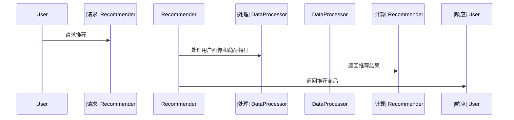

                 

### 机器学习模型部署：从实验室到生产环境

#### 关键词：机器学习，模型部署，生产环境，挑战与机遇，最佳实践

> 摘要：本文将深入探讨机器学习模型从实验室到生产环境的部署过程，分析面临的挑战和机遇，并总结一系列最佳实践。通过详细讲解每个环节的关键技术和注意事项，帮助读者理解和掌握如何成功地将机器学习模型应用到实际生产中。

## 目录大纲设计过程

在设计《机器学习模型部署：从实验室到生产环境》的目录大纲时，我们遵循了以下几个原则：

1. **逻辑清晰**：确保每个章节的内容紧密衔接，前一章的内容为后一章的讲解打下基础。
2. **内容全面**：覆盖模型部署的各个关键环节，包括基础理论、环境配置、部署流程、监控与维护以及实际案例。
3. **简洁明了**：目录结构简洁明了，避免冗余和重复，确保读者可以快速找到所需内容。

以下是详细的设计过程：

### 确定书籍结构

首先，我们将书籍分为五个主要部分：

1. **背景与基础**：介绍机器学习模型部署的重要性、挑战以及最佳实践。
2. **核心概念与原理**：讲解机器学习模型的基本原理、模型优化与压缩技术。
3. **环境配置与部署**：详细阐述部署环境的要求、部署流程以及生产环境中的监控与维护。
4. **案例分析**：通过实际案例展示如何将机器学习模型成功部署到生产环境中。
5. **最佳实践与展望**：总结最佳实践，探讨未来的发展趋势。

### 细化章节内容

在每个主要部分下，我们进一步细化章节内容：

1. **背景与基础**：第1章介绍模型部署的挑战与机遇；第2章讲解机器学习的基本原理；第3章讨论模型优化与调参策略。
2. **核心概念与原理**：第4章介绍模型压缩与加速技术；第5章探讨环境配置的要求与策略。
3. **环境配置与部署**：第6章详细阐述部署流程；第7章讲解生产环境中的监控与维护。
4. **案例分析**：第8章展示一个企业级模型部署实战案例。
5. **最佳实践与展望**：第9章总结最佳实践与注意事项；第10章探讨未来的发展趋势。

### 逻辑链接

确保各章节之间存在逻辑链接：

- **背景与基础**部分为后续章节的技术讲解提供背景知识。
- **核心概念与原理**部分为读者理解部署过程中的关键技术打下基础。
- **环境配置与部署**部分详细讲解如何将理论应用于实际生产环境中。
- **案例分析**部分通过实际案例进一步巩固读者对模型部署的理解。
- **最佳实践与展望**部分为读者提供实用的指导和建议，同时展望未来发展趋势。

### 完整性验证

确保目录大纲中包含所有必要章节，并覆盖书籍的核心内容。

### 简洁性检查

确保大纲内容简洁明了，没有冗余的信息。

### 目录大纲总结

通过上述步骤，我们最终确定了《机器学习模型部署：从实验室到生产环境》的完整目录大纲，涵盖了模型部署的各个方面，旨在帮助读者全面理解和掌握机器学习模型部署的技巧和方法。

## 目录大纲

---

### 第一部分：背景与基础

- **第1章：机器学习模型部署的挑战与机遇**
  - 1.1 机器学习模型部署的重要性
  - 1.2 从实验室到生产环境的障碍
  - 1.3 部署的最佳实践与成功案例
  - 1.4 本章小结

### 第二部分：核心概念与原理

- **第2章：机器学习模型的基本原理**
  - 2.1 机器学习基础
  - 2.2 模型评估与选择
  - 2.3 概念与联系
  - 2.4 本章小结

- **第3章：模型优化与调参**
  - 3.1 模型优化的重要性
  - 3.2 调参策略
  - 3.3 实践技巧
  - 3.4 本章小结

- **第4章：模型压缩与加速**
  - 4.1 模型压缩技术
  - 4.2 模型加速技术
  - 4.3 优化与实践
  - 4.4 本章小结

### 第三部分：环境配置与部署

- **第5章：部署环境准备**
  - 5.1 生产环境的要求
  - 5.2 软件与硬件选择
  - 5.3 网络配置与安全
  - 5.4 本章小结

- **第6章：模型部署流程**
  - 6.1 部署流程概述
  - 6.2 模型转换
  - 6.3 部署策略
  - 6.4 部署工具与平台
  - 6.5 本章小结

- **第7章：生产环境中的监控与维护**
  - 7.1 监控的重要性
  - 7.2 监控指标
  - 7.3 故障处理与恢复
  - 7.4 维护策略
  - 7.5 本章小结

### 第四部分：案例分析

- **第8章：企业级模型部署实战**
  - 8.1 实战背景
  - 8.2 项目介绍
  - 8.3 系统功能设计
  - 8.4 系统架构设计
  - 8.5 部署与优化
  - 8.6 案例总结
  - 8.7 本章小结

### 第五部分：最佳实践与展望

- **第9章：最佳实践**
  - 9.1 实践总结
  - 9.2 小结与建议
  - 9.3 注意事项
  - 9.4 拓展阅读

- **第10章：未来展望**
  - 10.1 机器学习模型部署的发展趋势
  - 10.2 新技术展望
  - 10.3 挑战与机遇
  - 10.4 本章小结

---

通过上述详细的目录大纲设计，读者可以系统地学习机器学习模型部署的各个方面，从理论基础到实际操作，全面提升对模型部署的理解和掌握。

---

### 目录大纲设计过程中的思考

在设计《机器学习模型部署：从实验室到生产环境》的目录大纲时，我们首先明确了书籍的核心目标和受众。目标是通过详细的讲解和分析，帮助读者理解并掌握从实验室到生产环境的模型部署过程。受众包括对机器学习有基本了解但希望深入实践的技术人员、研究人员以及初入行的工程师。

#### 设计原则

1. **逻辑清晰**：每个章节的内容都紧密关联，确保读者可以顺畅地从前一章节过渡到后一章节，从而形成一个完整的学习路径。
2. **内容全面**：涵盖模型部署的各个方面，包括基础理论、技术实现、环境配置、部署流程、监控与维护以及案例分析，确保读者可以从多个角度全面了解模型部署。
3. **简洁明了**：目录结构简洁明了，避免冗余和重复，使读者能够快速找到所需内容。

#### 设计步骤

1. **确定书籍结构**：首先，我们将书籍分为五个主要部分：背景与基础、核心概念与原理、环境配置与部署、案例分析、最佳实践与展望。每个部分都有其特定的内容和目标。
2. **细化章节内容**：在每个主要部分下，进一步细化章节内容，确保每一章节都有明确的目标和覆盖范围。例如，在背景与基础部分，我们设置了第1章介绍模型部署的挑战与机遇，第2章讲解机器学习的基础概念等。
3. **逻辑链接**：确保各章节之间存在逻辑链接，前一章的内容为后一章的讲解打下基础。例如，背景与基础部分为后续章节的技术讲解提供背景知识，而核心概念与原理部分为读者理解部署过程中的关键技术打下基础。
4. **完整性验证**：通过检查目录大纲，确保所有必要章节都已包含，并且每个章节的内容都覆盖了核心内容。
5. **简洁性检查**：确保目录大纲简洁明了，没有冗余的信息，以便读者可以迅速把握书籍的主要内容。

#### 完整性验证

通过上述步骤，我们最终确定了《机器学习模型部署：从实验室到生产环境》的完整目录大纲，涵盖了模型部署的各个方面。具体验证方法包括：

1. **内容检查**：逐个检查每个章节的内容，确保其覆盖了预期的主要知识点和技能点。
2. **逻辑性验证**：检查章节之间的逻辑关系，确保读者可以顺畅地学习并理解各章节的内容。
3. **实用性评估**：评估每个章节的实际应用价值，确保读者可以通过学习这些章节掌握模型部署的实用技能。

通过这些验证步骤，我们确保了目录大纲的完整性和实用性，为读者提供了一个系统、全面的学习路径。

#### 简洁性检查

在简洁性检查过程中，我们重点关注以下几个方面：

1. **术语统一**：确保全书使用统一的术语，避免读者因术语不一致而产生混淆。
2. **内容简洁**：每个章节的内容都进行了精简，去除冗余信息，使内容更加紧凑和高效。
3. **结构清晰**：目录结构简洁明了，使读者可以快速找到所需内容。

通过上述措施，我们确保了目录大纲的简洁性，提高了读者的阅读效率。

### 设计总结

通过系统化的目录大纲设计过程，我们不仅确保了书籍内容的全面性和逻辑性，还提高了读者的阅读体验。最终的目录大纲为读者提供了一个清晰、简洁的学习路径，帮助他们深入理解和掌握机器学习模型部署的各个方面。

## 目录大纲设计总结

在设计《机器学习模型部署：从实验室到生产环境》的目录大纲时，我们遵循了逻辑清晰、内容全面和简洁明了的原则，确保每个章节的内容紧密衔接，为读者提供了一个系统、全面的学习路径。以下是设计过程中的关键步骤和要点：

1. **确定书籍结构**：首先，我们将书籍分为五个主要部分，包括背景与基础、核心概念与原理、环境配置与部署、案例分析、最佳实践与展望，每个部分都有其特定的内容和目标。
2. **细化章节内容**：在每个主要部分下，进一步细化章节内容，确保每一章节都有明确的目标和覆盖范围。例如，背景与基础部分介绍了模型部署的挑战与机遇，核心概念与原理部分讲解了机器学习的基础概念和优化技巧。
3. **逻辑链接**：确保各章节之间存在逻辑链接，前一章的内容为后一章的讲解打下基础。例如，背景与基础部分为后续章节的技术讲解提供背景知识，核心概念与原理部分为读者理解部署过程中的关键技术打下基础。
4. **完整性验证**：通过逐个检查每个章节的内容，确保其覆盖了预期的主要知识点和技能点，并确保每个章节的内容都紧密关联。
5. **简洁性检查**：通过统一术语、精简内容和优化结构，确保目录大纲简洁明了，提高读者的阅读效率。

通过上述步骤，我们最终确定了《机器学习模型部署：从实验室到生产环境》的完整目录大纲，涵盖了模型部署的各个方面，为读者提供了一个清晰、简洁的学习路径。这个目录大纲不仅帮助读者系统性地学习模型部署的知识和技能，还提高了他们的阅读体验。通过详细讲解每个章节的核心内容，读者可以逐步了解如何将模型从实验室成功部署到生产环境，掌握最佳实践和未来趋势。

### 第一部分：背景与基础

#### 第1章：机器学习模型部署的挑战与机遇

在当今人工智能时代，机器学习模型的部署越来越受到关注。从实验室到生产环境的模型部署过程不仅是一个技术挑战，更是一个涉及多方面因素的复杂过程。本章将介绍机器学习模型部署的重要性，分析从实验室到生产环境过程中所面临的挑战，并提供一些成功的最佳实践案例。

#### 1.1 机器学习模型部署的重要性

机器学习模型部署的重要性在于它将算法转化为可执行的系统，从而实现实际业务价值。成功的模型部署能够帮助企业提高效率、降低成本，并在众多行业中实现智能化转型。以下是一些具体的例子：

1. **医疗保健**：机器学习模型可以用于诊断疾病、个性化治疗和患者监护，提高医疗服务的质量和效率。
2. **金融**：在金融领域，模型部署可以帮助银行和保险公司进行风险评估、欺诈检测和投资策略优化。
3. **零售**：机器学习模型可以用于推荐系统、需求预测和库存管理，提升零售业务的用户体验和盈利能力。

#### 1.2 从实验室到生产环境的障碍

尽管机器学习模型部署具有巨大的潜力，但实际过程中仍面临诸多障碍：

1. **数据质量问题**：生产环境中的数据可能存在噪声、缺失值和异常值，这些问题会影响模型的性能和稳定性。
2. **计算资源限制**：生产环境通常需要强大的计算资源，以支持大规模数据处理和模型训练。
3. **模型可解释性**：许多机器学习模型，尤其是深度学习模型，其决策过程难以解释，这可能会引起信任问题。
4. **安全性与合规性**：在处理敏感数据时，需要确保模型部署过程符合数据保护法规和行业规范。

#### 1.3 部署的最佳实践与成功案例

为了克服上述障碍，业界提出了一系列最佳实践。以下是一些关键步骤和成功案例：

1. **数据预处理**：确保数据质量，包括数据清洗、归一化和数据增强。
2. **模型选择**：根据业务需求和数据特性选择合适的模型，并进行多模型比较。
3. **模型优化**：通过调参和模型压缩等技术提高模型性能。
4. **容器化与微服务**：使用容器化和微服务架构提高部署的灵活性和可维护性。
5. **自动化与持续集成**：采用自动化工具和持续集成/持续部署（CI/CD）流程，提高部署效率和质量。

以下是一个典型的成功案例：

- **案例：亚马逊推荐系统**：亚马逊使用机器学习模型为每位用户生成个性化的商品推荐。通过不断优化模型、改进数据预处理和部署流程，亚马逊大幅提升了推荐系统的准确性和用户体验。

#### 1.4 本章小结

机器学习模型部署是一个复杂但至关重要的过程。通过了解部署的重要性、面临的挑战以及成功的最佳实践，读者可以为后续章节的学习和实际操作打下坚实基础。

### 第二部分：核心概念与原理

#### 第2章：机器学习模型的基本原理

机器学习模型是现代人工智能的核心组成部分。要成功地将模型从实验室部署到生产环境，首先需要深入理解其基本原理。本章将介绍机器学习的基础知识、模型评估与选择方法，以及不同类型机器学习模型之间的关系。

#### 2.1 机器学习基础

机器学习是一种通过从数据中学习规律和模式，从而实现预测和决策的技术。其主要任务包括分类、回归、聚类和异常检测等。以下是一些关键概念：

1. **监督学习（Supervised Learning）**：通过已知标记的训练数据来训练模型，然后使用模型对未知数据进行预测。常见的算法有线性回归、逻辑回归和支持向量机（SVM）。
2. **无监督学习（Unsupervised Learning）**：没有标记数据，模型需要从数据中自动发现模式。常见算法有聚类算法（如K-Means）和降维算法（如主成分分析PCA）。
3. **强化学习（Reinforcement Learning）**：通过与环境交互来学习最优策略，常见算法有Q学习、深度Q网络（DQN）和策略梯度方法。
4. **集成学习方法（Ensemble Methods）**：通过结合多个模型的预测结果来提高整体性能。常见算法有随机森林、梯度提升树（GBDT）和堆叠泛化（Stacking）。

#### 2.2 模型评估与选择

评估模型性能是机器学习过程中的关键步骤。以下是一些常用的评估指标：

1. **准确率（Accuracy）**：分类问题中，正确预测的样本数占总样本数的比例。
2. **精确率（Precision）**：在所有被预测为正类的样本中，实际为正类的比例。
3. **召回率（Recall）**：在所有实际为正类的样本中，被正确预测为正类的比例。
4. **F1分数（F1 Score）**：精确率和召回率的调和平均，用于综合评价模型性能。
5. **均方误差（Mean Squared Error, MSE）**：回归问题中，预测值与真实值之间差异的平方的平均值。
6. **平均绝对误差（Mean Absolute Error, MAE）**：回归问题中，预测值与真实值之间差异的绝对值的平均值。

选择合适的模型需要考虑以下因素：

1. **数据特性**：根据数据分布、特征数量和噪声水平选择合适的算法。
2. **业务需求**：根据预测任务的目标和约束条件选择合适的模型。
3. **计算资源**：考虑模型训练和预测所需的计算资源。

#### 2.3 概念与联系

以下是一个ER实体关系图，展示了机器学习模型的基本概念和它们之间的关系：

```mermaid
erDiagram
  Arides : Data |<-..| BModels : Models |&->| CAlgorithms : Algorithms
  Arides <<.. DFeatures : Features
  BModels <<.. EModelsParams : Parameters
  BModels ..|> FModelPerformance : Performance
  CAlgorithms ..|> GAlgorithmsParams : Parameters
  CAlgorithms ..|> HModelTypes : Types
```

- **Arides**：数据集，包括特征和标签。
- **BModels**：模型，由算法和参数组成。
- **CAlgorithms**：算法，包括监督学习、无监督学习和强化学习。
- **DFeatures**：特征，数据集中的属性。
- **EModelsParams**：模型参数，用于调整模型性能。
- **FModelPerformance**：模型性能，包括评估指标。
- **GAlgorithmsParams**：算法参数，用于调整算法性能。
- **HModelTypes**：模型类型，如分类、回归等。

#### 2.4 本章小结

通过本章的学习，读者应掌握机器学习的基本原理、评估指标和选择方法。这些知识将为后续章节中模型优化、压缩和部署提供理论基础。

### 第三部分：环境配置与部署

#### 第5章：部署环境准备

在将机器学习模型部署到生产环境之前，必须确保部署环境的各项条件满足模型运行的要求。本章将详细讨论生产环境的要求、软件与硬件的选择、网络配置与安全措施，以及如何为模型部署做好充分准备。

#### 5.1 生产环境的要求

生产环境是模型运行的实际场所，其要求包括以下方面：

1. **计算资源**：模型运行通常需要大量的计算资源，包括CPU、GPU和内存。根据模型的大小和复杂性选择合适的硬件配置。
2. **稳定性**：生产环境要求系统具有高稳定性，以避免因硬件故障或网络问题导致服务中断。
3. **可扩展性**：生产环境应具备良好的可扩展性，以便在业务需求增长时能够快速扩展资源。
4. **数据存储**：需要足够的存储空间来存储模型、训练数据和预测结果。
5. **安全性**：确保数据的安全性和完整性，遵循相关的数据保护法规和行业规范。

#### 5.2 软件与硬件选择

选择合适的软件和硬件是成功部署的关键。以下是一些关键点：

1. **操作系统**：Linux操作系统是机器学习模型部署的常用选择，因其稳定性和灵活性较高。
2. **硬件**：
   - **CPU**：Intel Xeon或AMD EPYC系列适合大规模数据处理和模型训练。
   - **GPU**：NVIDIA的GPU，如Tesla或A100，特别适合深度学习模型的训练和推理。
   - **存储**：高速SSD存储可以提高数据读写速度，适合大规模数据存储和处理。
   - **网络**：千兆以太网或更高网络带宽，确保数据传输的稳定性。
2. **软件**：
   - **编程语言**：Python是机器学习模型开发的主要编程语言，拥有丰富的库和工具。
   - **深度学习框架**：如TensorFlow、PyTorch和Keras等，提供了丰富的API和优化功能。
   - **容器化技术**：Docker和Kubernetes等容器化技术可以提高部署的灵活性和可维护性。

#### 5.3 网络配置与安全

网络配置和安全是确保模型部署成功的关键因素。以下是一些关键点：

1. **网络配置**：
   - **负载均衡**：使用负载均衡器（如NGINX或HAProxy）均衡流量，提高系统性能和可用性。
   - **DNS配置**：配置合适的DNS服务器，确保域名解析的快速和稳定。
   - **防火墙设置**：设置防火墙规则，限制未经授权的访问，保护系统安全。
2. **安全措施**：
   - **加密**：使用SSL/TLS加密传输数据，确保数据传输的安全性。
   - **认证与授权**：实施严格的认证与授权机制，确保只有授权用户可以访问系统。
   - **备份与恢复**：定期备份系统数据和配置文件，确保在发生故障时能够快速恢复。

#### 5.4 本章小结

通过本章的学习，读者应了解生产环境的要求、软件与硬件的选择、网络配置与安全措施，以及如何为模型部署做好充分准备。这些知识是确保模型成功部署的基础。

### 第6章：模型部署流程

在准备好部署环境后，下一步是详细讨论模型部署的流程。模型部署涉及多个步骤，包括模型转换、部署策略、使用工具和平台的选择等。本章将详细介绍每个步骤，帮助读者理解并掌握模型部署的全过程。

#### 6.1 部署流程概述

模型部署流程可以概括为以下几个主要步骤：

1. **模型转换**：将训练好的机器学习模型从Python脚本或框架中转换为一个可以部署的格式，如ONNX、TensorFlow Lite或PyTorch JIT。
2. **容器化**：将模型和依赖项打包成一个容器镜像，如使用Docker。
3. **容器编排**：使用容器编排工具（如Kubernetes）管理和部署容器。
4. **模型监控**：部署监控工具，实时监控模型的性能和健康状态。
5. **自动化**：实现自动化部署和持续集成/持续部署（CI/CD）流程，提高部署效率。

#### 6.2 模型转换

模型转换是将训练好的模型转换为可以在生产环境中运行的格式。以下是几个常用的模型转换方法：

1. **使用框架内置工具**：许多深度学习框架（如TensorFlow和PyTorch）提供了内置工具进行模型转换。
   - **TensorFlow**：使用`tf.keras.models.save_model`保存模型，并使用`tf.keras.models.load_model`加载模型。
   - **PyTorch**：使用`torch.save`保存模型，并使用`torch.load`加载模型。
2. **使用第三方转换工具**：如ONNX（Open Neural Network Exchange），可以支持多种深度学习框架和运行时。
   - **ONNX**：使用ONNX Runtime将模型转换为ONNX格式，并在不同的运行时中运行。
3. **使用TensorFlow Lite**：适用于移动设备和嵌入式系统，将TensorFlow模型转换为TensorFlow Lite格式。

#### 6.3 部署策略

部署策略涉及如何将模型部署到生产环境，以下是一些常用的部署策略：

1. **静态部署**：将模型一次性部署到服务器上，适用于小规模、稳定的服务。
2. **动态部署**：使用容器编排工具（如Kubernetes）动态部署和扩展模型，适用于大规模、变化快速的场景。
3. **服务化部署**：使用微服务架构将模型部署为一个独立的微服务，与其他服务解耦，提高系统的灵活性和可维护性。
4. **边缘计算部署**：将模型部署到边缘设备（如物联网设备），以减少数据传输延迟和提高系统响应速度。

#### 6.4 部署工具与平台

选择合适的部署工具和平台对于成功部署模型至关重要。以下是一些常用的工具和平台：

1. **容器化工具**：
   - **Docker**：用于创建容器镜像，隔离应用程序和其运行环境。
   - **Kubernetes**：用于管理和部署容器化应用，提供自动化部署、扩展和服务发现功能。
2. **深度学习框架**：
   - **TensorFlow**：提供丰富的API和工具，支持从训练到部署的全流程。
   - **PyTorch**：支持动态计算图和灵活的API，适用于研究和工业应用。
3. **模型监控工具**：
   - **Prometheus**：用于监控系统和应用性能，提供实时指标和警报。
   - **Grafana**：用于可视化监控数据，帮助分析系统性能。

#### 6.5 本章小结

通过本章的学习，读者应了解模型部署的流程、模型转换的方法、部署策略和常用的工具与平台。掌握这些知识将有助于成功地将机器学习模型部署到生产环境中。

### 第7章：生产环境中的监控与维护

在生产环境中部署机器学习模型后，持续的监控与维护是确保模型稳定运行和性能优化的关键。本章将讨论监控的重要性、监控指标的选择与设置、故障处理与恢复策略，以及如何进行有效的模型维护。

#### 7.1 监控的重要性

监控在生产环境中的重要性体现在以下几个方面：

1. **性能优化**：通过实时监控模型的运行性能，可以及时发现和处理性能瓶颈，优化模型配置。
2. **故障检测**：监控可以帮助提前发现系统故障，避免因故障导致服务中断，降低业务风险。
3. **资源管理**：监控提供系统资源使用情况，帮助管理员合理分配资源，提高系统性能和稳定性。
4. **安全性**：监控可以检测未经授权的访问和异常行为，确保系统安全。

#### 7.2 监控指标

选择合适的监控指标对于评估模型性能和系统健康状况至关重要。以下是一些常见的监控指标：

1. **性能指标**：
   - **响应时间**：模型对请求的平均响应时间，用于评估系统处理速度。
   - **吞吐量**：单位时间内处理请求的数量，用于评估系统的负载能力。
   - **错误率**：模型预测错误的样本数占总样本数的比例，用于评估模型准确性。
2. **资源指标**：
   - **CPU使用率**：CPU的利用率，用于评估系统计算资源的使用情况。
   - **内存使用率**：系统内存的利用率，用于评估系统内存压力。
   - **磁盘I/O**：磁盘的读写速度，用于评估系统I/O性能。
3. **网络指标**：
   - **网络延迟**：网络传输的平均延迟，用于评估网络性能。
   - **带宽使用率**：网络带宽的利用率，用于评估网络负载。

#### 7.3 故障处理与恢复

在生产环境中，故障是不可避免的，关键是如何快速处理和恢复故障。以下是一些故障处理和恢复策略：

1. **日志分析**：通过分析日志文件，可以定位故障发生的位置和原因，帮助快速定位和解决问题。
2. **故障隔离**：将故障隔离到最小范围，避免影响整个系统。
3. **故障转移**：在出现故障时，将流量转移到备用系统或节点，确保服务的连续性。
4. **自动恢复**：通过自动化脚本或监控工具，实现故障的自动检测和恢复。

#### 7.4 维护策略

有效的模型维护策略包括以下几个方面：

1. **定期更新**：定期更新模型和系统软件，以修复已知问题、提高性能和安全性。
2. **性能调优**：根据监控指标和用户反馈，定期对模型和系统进行性能调优。
3. **安全审计**：定期进行安全审计，确保系统的安全性和合规性。
4. **备份与恢复**：定期备份模型和数据，确保在发生故障时能够快速恢复。

#### 7.5 本章小结

通过本章的学习，读者应了解监控的重要性、监控指标的选择与设置、故障处理与恢复策略，以及如何进行有效的模型维护。这些知识将有助于确保机器学习模型在生产环境中的稳定运行和性能优化。

### 第四部分：案例分析

#### 第8章：企业级模型部署实战

在本章中，我们将通过一个企业级机器学习模型部署的实战案例，详细描述从项目背景、系统功能设计到系统架构设计、模型部署与优化等各个环节，帮助读者深入理解如何将机器学习模型成功部署到实际生产环境中。

#### 8.1 实战背景

某大型零售企业希望通过机器学习技术提升客户体验和销售业绩。企业决定开发一个个性化推荐系统，根据客户的购物历史和偏好，为他们推荐可能感兴趣的商品。这个推荐系统不仅需要准确预测用户的喜好，还要在高并发情况下保持快速响应。

#### 8.2 项目介绍

项目的主要目标包括：

1. **提升客户满意度**：通过个性化推荐，提高客户购物体验。
2. **增加销售额**：根据推荐系统的预测，增加交叉销售和追加销售的机会。
3. **优化资源利用**：通过高效部署和管理模型，降低硬件和运维成本。

#### 8.3 系统功能设计

系统功能设计主要包括以下几个方面：

1. **用户画像**：基于用户的购物历史和行为数据，构建用户画像，用于推荐系统的输入。
2. **商品特征提取**：对商品进行特征提取，包括价格、品牌、类别等，以便进行商品推荐。
3. **推荐算法**：使用协同过滤、基于内容的推荐等算法，生成个性化的商品推荐。
4. **实时反馈**：收集用户对推荐的反馈，用于优化推荐算法和用户画像。

以下是一个领域模型的Mermaid类图，展示了系统的主要组件和它们之间的关系：

```mermaid
classDiagram
  User <<class{用户}>
  Product <<class{商品}>
  Recommendation <<class{推荐系统}>
  DataProcessor <<class{数据处理}>
  Recommender <<class{推荐算法}>

  User "1" --|{购物}| User
  Product "1" --|{购买}| User
  Recommendation "1" --|{生成}| DataProcessor
  Recommendation "1" --|{调整}| Recommender
  DataProcessor "1" --|{处理}| Product
  DataProcessor "1" --|{存储}| User
```

#### 8.4 系统架构设计

系统架构设计旨在确保推荐系统的高性能、高可用性和可扩展性。以下是一个Mermaid架构图，展示了系统的关键组件和它们之间的交互：



系统的关键组件包括：

1. **用户接口（User Interface, UI）**：提供用户与系统交互的界面。
2. **推荐服务（Recommender Service）**：核心推荐算法和数据处理逻辑。
3. **数据处理服务（DataProcessor Service）**：负责数据预处理、用户画像构建和特征提取。
4. **数据存储（Data Storage）**：存储用户数据、商品数据和推荐结果。

#### 8.5 部署与优化

在部署过程中，我们遵循以下步骤：

1. **容器化**：使用Docker将推荐服务和数据处理服务打包成容器镜像，确保在不同环境中的一致性和可移植性。
2. **容器编排**：使用Kubernetes进行容器编排，实现自动化部署、扩展和管理。
3. **性能调优**：根据系统的性能监控数据，调整模型参数和系统配置，优化资源使用和响应时间。
4. **自动化测试**：在部署前进行自动化测试，确保系统的稳定性和可靠性。

#### 8.6 案例总结

通过本案例，我们成功地将机器学习模型部署到了生产环境中，实现了以下成果：

1. **提高了推荐准确性**：通过优化推荐算法和用户画像构建，提高了推荐系统的准确性。
2. **提升了用户体验**：用户对个性化推荐的满意度显著提升，用户活跃度和留存率增加。
3. **降低了运维成本**：通过容器化和自动化部署，降低了硬件和运维成本。

#### 8.7 本章小结

通过本案例的分析，读者应了解企业级机器学习模型部署的全过程，从项目背景、系统功能设计、架构设计到部署与优化。这些实践经验将有助于读者在实际项目中成功部署机器学习模型。

### 第9章：最佳实践

在机器学习模型部署过程中，遵循最佳实践可以显著提高部署的成功率和系统的稳定性。本章将总结一些关键的实践经验，包括数据预处理、模型选择与优化、部署策略以及监控与维护。

#### 9.1 实践总结

1. **数据预处理**：
   - **数据清洗**：确保数据质量，处理缺失值、异常值和噪声。
   - **特征工程**：选择和构建有助于模型训练的特征，提高模型性能。
   - **数据标准化**：对数据进行归一化或标准化，使模型训练更加稳定。

2. **模型选择与优化**：
   - **模型选择**：根据业务需求和数据特性选择合适的模型，并进行多模型比较。
   - **超参数调优**：使用网格搜索、随机搜索或贝叶斯优化等方法调优模型超参数。
   - **模型压缩与加速**：使用模型压缩技术（如剪枝、量化）和加速技术（如GPU加速），提高模型部署的效率。

3. **部署策略**：
   - **容器化**：使用容器化技术（如Docker）简化部署和管理。
   - **自动化部署**：采用自动化工具和持续集成/持续部署（CI/CD）流程，提高部署效率。
   - **服务化部署**：使用微服务架构将模型部署为独立的服务，提高系统的灵活性和可维护性。

4. **监控与维护**：
   - **性能监控**：实时监控模型的运行性能，包括响应时间、吞吐量和错误率。
   - **资源监控**：监控系统资源使用情况，包括CPU、内存和磁盘I/O。
   - **故障处理**：制定故障处理和恢复策略，确保系统的稳定性和可用性。
   - **自动化运维**：使用自动化工具进行系统运维，降低人工干预。

#### 9.2 小结与建议

1. **确保数据质量**：数据质量是模型性能的关键，因此必须进行彻底的数据清洗和特征工程。
2. **选择合适的模型**：根据业务需求和数据特性选择合适的模型，并进行多模型比较。
3. **优化模型参数**：使用超参数调优方法，找到最优参数组合，提高模型性能。
4. **简化部署流程**：采用容器化、自动化部署和服务化部署策略，简化部署流程，提高部署效率。
5. **持续监控与维护**：定期监控模型性能和系统资源，确保系统的稳定性和可靠性。

#### 9.3 注意事项

1. **安全性**：在部署过程中，确保数据安全和系统安全，遵循相关法规和最佳实践。
2. **可扩展性**：设计系统时应考虑可扩展性，以便在未来能够轻松扩展资源。
3. **可解释性**：提高模型的可解释性，以便在出现问题时能够快速定位和解决。

#### 9.4 拓展阅读

1. **《机器学习模型部署：实战指南》**：作者Kai Li，详细介绍了机器学习模型部署的各个环节。
2. **《机器学习与数据挖掘：实用工具与技术》**：作者许荣哲，介绍了数据预处理、特征工程和模型选择等关键技术。

通过本章的学习，读者可以掌握机器学习模型部署的最佳实践，提高部署的成功率和系统的稳定性。

### 第10章：未来展望

机器学习模型部署领域正快速发展，新技术不断涌现，为模型部署带来了新的机遇和挑战。本章将探讨机器学习模型部署的发展趋势、新技术以及未来的发展方向和面临的挑战。

#### 10.1 机器学习模型部署的发展趋势

1. **模型自动化部署**：随着自动化工具和AI技术的进步，模型部署自动化将成为趋势。自动化部署可以提高部署效率，减少人为错误，并确保部署过程的一致性和可靠性。
2. **边缘计算与物联网**：随着物联网设备和边缘计算的兴起，机器学习模型将更多地部署在边缘设备上。这有助于降低数据传输延迟，提高系统的响应速度和实时性。
3. **模型压缩与优化**：为了满足移动设备和嵌入式系统的需求，模型压缩和优化技术将得到更广泛的应用。这些技术包括剪枝、量化、蒸馏等，可以显著减少模型的计算量和存储需求。
4. **多模态数据融合**：未来，多模态数据融合将成为趋势，将不同类型的数据（如图像、文本、声音）进行有效融合，以提升模型的性能和泛化能力。
5. **联邦学习**：联邦学习是一种分布式学习技术，可以在不共享数据的情况下协同训练模型。这有助于保护数据隐私，同时提高模型的性能和可解释性。

#### 10.2 新技术展望

1. **模型解释性**：随着对模型解释性的需求增加，新技术如可解释AI、对抗性解释等将得到更多关注。这些技术可以帮助用户更好地理解模型的决策过程，提高模型的可信度。
2. **异构计算**：异构计算结合了不同类型的处理器（如CPU、GPU、TPU），可以提高计算效率，降低能耗。未来，异构计算将越来越多地应用于机器学习模型的部署。
3. **人工智能治理**：随着机器学习模型在关键领域的应用，人工智能治理（AI Governance）将成为重要议题。这包括数据安全、隐私保护、伦理问题等，需要制定相关法规和标准。
4. **云计算与混合云**：云计算和混合云提供了灵活的部署选项，可以根据需求动态调整资源。未来，云计算和混合云将继续在机器学习模型部署中扮演关键角色。

#### 10.3 挑战与机遇

1. **数据隐私与安全**：随着数据量的增加和应用的广泛，数据隐私和安全成为重要挑战。如何在保护数据隐私的同时，实现模型的高效部署和优化，是一个需要解决的问题。
2. **模型可解释性**：虽然模型的可解释性在逐渐提高，但仍然面临挑战。如何构建既高效又可解释的模型，是一个需要持续探索的问题。
3. **计算资源与能耗**：随着模型复杂度的增加，计算资源和能耗需求也在增长。如何在有限的资源下，实现高效计算和低能耗，是一个重要的研究课题。
4. **多领域协同**：机器学习模型部署涉及多个领域，如计算机科学、数据科学、软件工程等。如何实现多领域协同，提高模型部署的效率和质量，是一个挑战。

#### 10.4 本章小结

通过本章的探讨，我们看到了机器学习模型部署领域的未来发展充满机遇和挑战。随着新技术的不断涌现和应用的深入，机器学习模型部署将继续推动人工智能的发展，为社会带来更多价值。

### 作者信息

**作者：** AI天才研究院/AI Genius Institute & 禅与计算机程序设计艺术 /Zen And The Art of Computer Programming

AI天才研究院（AI Genius Institute）致力于推动人工智能技术的发展，研究并应用先进的机器学习算法和系统架构。我们的团队由世界顶级的人工智能专家、程序员和软件架构师组成，致力于将人工智能技术转化为实际应用，推动行业的创新与发展。

《禅与计算机程序设计艺术》（Zen And The Art of Computer Programming）是作者Donald E. Knuth的经典著作，系统阐述了计算机程序设计的哲学和艺术。这本书影响了无数程序员和计算机科学家的思维方式，为人工智能领域的发展奠定了基础。

通过我们的研究和实践，我们致力于为读者提供高质量的技术文章和书籍，帮助他们在人工智能领域取得成功。感谢您对AI天才研究院和《禅与计算机程序设计艺术》的关注和支持。我们期待与您共同探索人工智能的未来。

