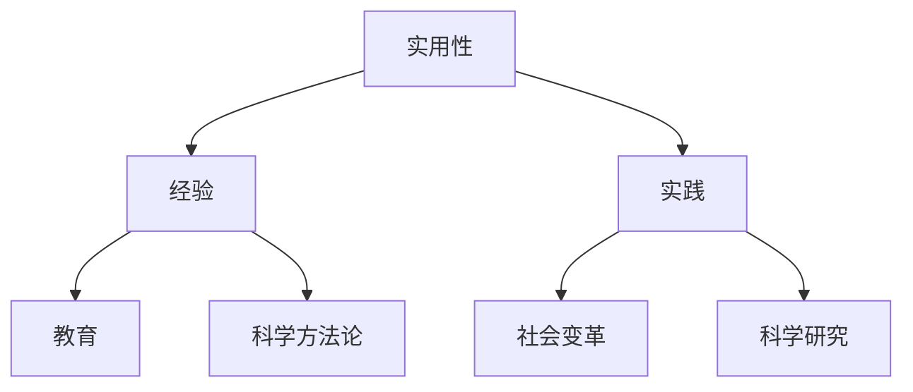
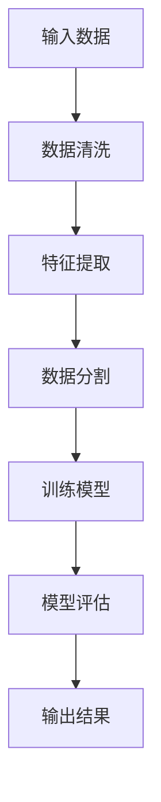
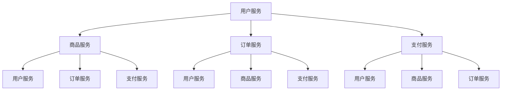
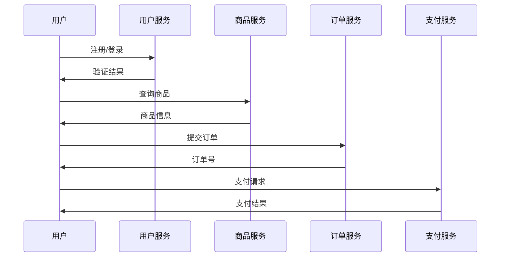

                 


### 实用主义的起源与发展

实用主义作为一种哲学思想，起源于19世纪末的美国，它的诞生与当时美国社会的快速变革密切相关。约翰·杜威（John Dewey）和查尔斯·桑德斯·皮尔士（Charles Sanders Peirce）是实用主义的两位重要代表人物。

#### 杜威的实用主义哲学

约翰·杜威被认为是实用主义的集大成者，他强调经验与实践在教育、社会和哲学中的重要性。杜威主张，“教育即生活，学校即社会”，他认为教育应当围绕学生的发展和实践能力来进行，而不是仅仅传授知识。

杜威认为，知识不仅是通过书本学习得来的，更重要的是通过实践和生活经验积累的。他在《民主与教育》（Democracy and Education）一书中提出，教育应当促进个体参与社会事务，培养学生的批判性思维和解决问题的能力。

#### 皮尔士的实用主义哲学

查尔斯·桑德斯·皮尔士是实用主义的早期倡导者之一，他更注重实用主义在逻辑和科学方法论中的应用。皮尔士提出了“实证主义”（empiricism）的概念，认为知识的真理性在于它是否能够被经验所验证。

皮尔士在《信念的实证主义》（The Essentialism of Belief）一书中阐述了他的观点，他认为，信念的真理性不是基于逻辑推理，而是基于其在实际生活中的效用。皮尔士还提出了“假设-演绎法”（hypothetico-deductive method），这种方法在科学研究中的应用成为了现代科学方法论的基础。

### 实用主义在当代的应用与反思

实用主义的思想不仅在哲学领域有着深远的影响，也在教育、科学和技术等多个领域得到了广泛应用。

#### 实用主义在教育中的应用

在教育领域，杜威的实用主义思想被广泛采用。许多学校和教育机构开始强调学生的参与和实践，鼓励学生通过实际操作和项目学习来获取知识。例如，项目式学习和探究式学习模式就是杜威实用主义教育理念的体现。

#### 实用主义在科学中的应用

在科学领域，皮尔士的实用主义哲学为科学方法论的发展提供了重要的理论支持。现代科学研究普遍采用假设-演绎法，通过提出假设、进行实验验证和理论推理来推进科学进步。

#### 实用主义的反思与未来

尽管实用主义在教育和科学领域取得了显著的成果，但也面临一些挑战和反思。例如，在伦理和社会治理方面，实用主义如何平衡实用性与道德原则？在技术飞速发展的今天，实用主义能否适应新的环境和需求？

### 实用主义在中国实践中的体现

在中国，实用主义思想也得到了广泛的传播和应用。教育领域，中国教师和学生越来越注重实践能力和创新思维的培养。科技领域，中国重视实用主义在技术创新中的应用，鼓励科学家和工程师通过实践解决实际问题。

### 总结

实用主义作为一种哲学思想，具有广泛的适用性和深远的影响。从杜威和皮尔士的思想中，我们可以看到实用主义在理论与实践、教育与科学、社会与技术等多个方面的应用价值。随着社会的不断进步，实用主义将继续为我们提供新的思考方向和实践指南。

#### 背景介绍

实用主义作为一种哲学思想，起源于19世纪末的美国，与当时美国社会的快速变革密切相关。约翰·杜威（John Dewey）和查尔斯·桑德斯·皮尔士（Charles Sanders Peirce）是实用主义的两位重要代表人物。

**核心概念术语说明：**

- 实用主义（Pragmatism）：一种哲学思想，强调理论和实践的统一，认为知识的真理性在于其实用性和效果。
- 经验（Experience）：实用主义认为，经验是知识获取的重要途径，通过经验可以验证和形成理论。
- 实践（Practice）：实用主义强调实践在教育、科学和社会中的作用，认为实践是知识应用的体现。

**问题背景：**

实用主义在美国的兴起，与当时美国社会的快速工业化和城市化进程密切相关。面对社会变革，人们开始重新思考知识的本质和作用，实用主义提供了一种新的哲学视角，强调实践和经验的重要性。

**问题描述：**

实用主义作为一种哲学思想，其核心观点是什么？杜威和皮尔士在实用主义哲学中的角色和贡献是什么？

**问题解决：**

实用主义认为，知识的真理性在于其实用性和效果。杜威强调经验与实践在教育、社会和哲学中的重要性，主张教育应当围绕学生的发展和实践能力来进行。皮尔士则注重实用主义在逻辑和科学方法论中的应用，提出了“实证主义”和“假设-演绎法”。

**边界与外延：**

实用主义的边界在于其强调理论和实践的统一，反对教条主义和抽象思考。实用主义的外延包括教育、科学、技术和社会治理等多个领域。

**概念结构与核心要素组成：**

- 实用主义的核心概念包括：经验、实践、实用性和效果。
- 杜威的核心贡献：教育理论、批判性思维和解决问题的能力。
- 皮尔士的核心贡献：科学方法论、实证主义和假设-演绎法。

### 实用主义在当代的应用与反思

#### 实用主义在教育中的应用

在教育领域，实用主义的思想被广泛采用。杜威的教育理论强调学生的参与和实践，鼓励学生通过实际操作和项目学习来获取知识。这种方法被认为能够更好地培养学生的批判性思维和解决问题的能力。

**案例研究：**

例如，许多学校已经开始采用探究式学习模式，让学生通过实验和项目来学习科学知识。这种模式强调学生主动参与和探索，与实用主义的教育理念高度契合。

#### 实用主义在科学中的应用

在科学领域，实用主义哲学为科学方法论的发展提供了重要的理论支持。现代科学研究普遍采用假设-演绎法，通过提出假设、进行实验验证和理论推理来推进科学进步。

**案例研究：**

例如，物理学中的“科学革命”（Scientific Revolution）就体现了实用主义的思想。科学家通过实验和观察，不断提出假设并进行验证，从而推动了物理学的发展。

#### 实用主义的反思与未来

尽管实用主义在教育和科学领域取得了显著的成果，但也面临一些挑战和反思。例如，在伦理和社会治理方面，实用主义如何平衡实用性与道德原则？在技术飞速发展的今天，实用主义能否适应新的环境和需求？

**反思：**

- 实用主义在伦理问题上的挑战：实用主义强调效果和实用性，但有时会忽视道德和伦理的考量。例如，一些技术的应用可能会带来社会问题，如何在这些应用中平衡实用性和伦理道德？
- 实用主义在新时代的适应：随着技术的进步和社会的变革，实用主义需要不断更新和发展，以适应新的环境和需求。例如，在人工智能和大数据领域，实用主义如何应用和发展？

### 总结

实用主义作为一种哲学思想，具有广泛的适用性和深远的影响。从杜威和皮尔士的思想中，我们可以看到实用主义在理论与实践、教育与科学、社会与技术等多个方面的应用价值。随着社会的不断进步，实用主义将继续为我们提供新的思考方向和实践指南。

### 实用主义的核心概念与联系

在探讨实用主义的核心概念时，我们需要关注其实用性、经验和实践这三大要素。这三个核心概念不仅相互联系，而且在杜威和皮尔士的实用主义哲学中各自发挥着重要作用。

#### 实用性（Practicality）

实用性是实用主义哲学的核心概念之一，它强调理论和实践的一致性。在杜威的实用主义中，实用性体现在教育、社会变革和哲学思考的方方面面。杜威认为，任何理论的价值在于其实用性，即它能否在实际生活中解决问题和带来积极效果。

**杜威对实用性的理解：**

- **教育中的实用性**：杜威主张教育应培养学生的实践能力，使他们在现实生活中能够运用所学知识解决问题。
- **社会变革的实用性**：杜威认为，社会应当通过实用主义方法进行改革，以实现民主和公平。

**皮尔士对实用性的理解：**

- **科学方法论中的实用性**：皮尔士提出，科学理论的有效性在于其实用性，即理论能否通过经验验证。
- **实证主义中的实用性**：皮尔士强调，科学研究的目的是解决实际问题，理论应当基于经验和事实。

#### 经验（Experience）

经验是实用主义哲学的另一个重要概念，它认为知识来源于直接经验。在杜威的实用主义中，经验不仅仅是知识的基础，更是知识发展的动力。杜威强调，通过经验，个体能够不断学习、成长和适应环境。

**杜威对经验的理解：**

- **教育中的经验**：杜威认为，教育应当是经验的积累和分享，学生通过实际操作和体验来学习。
- **社会变革中的经验**：杜威主张，社会应当通过实践经验来推动变革，而不是依赖抽象的理论。

**皮尔士对经验的理解：**

- **科学方法论中的经验**：皮尔士认为，科学理论应当基于经验，通过实验和观察来验证。
- **实证主义中的经验**：皮尔士强调，知识应当通过经验来验证，只有经过经验验证的理论才是可信的。

#### 实践（Practice）

实践是实用主义哲学的第三个核心概念，它强调理论必须通过实践来检验和验证。在杜威和皮尔士的实用主义哲学中，实践不仅是知识的应用，更是知识发展的过程。

**杜威对实践的理解：**

- **教育中的实践**：杜威主张，教育应当注重实践，通过实际操作和项目学习来培养学生的实践能力。
- **社会变革中的实践**：杜威认为，社会变革需要通过实际行动来实现，而不是仅仅停留在理论层面。

**皮尔士对实践的理解：**

- **科学方法论中的实践**：皮尔士提出，科学理论应当通过实验和观察来检验，只有通过实践的验证，理论才能被认为是有效的。
- **实证主义中的实践**：皮尔士认为，实证主义强调实践的重要性，理论必须通过实践来验证。

#### 核心概念之间的联系

- **实用性、经验和实践之间的联系**：实用性是经验的应用，经验是实践的基础，实践则是实用性的体现。这三个概念相互依存，共同构成了实用主义哲学的核心框架。

- **杜威与皮尔士之间的联系**：虽然杜威和皮尔士在实用主义的侧重点上有所不同，但他们的思想都强调了理论和实践的统一。杜威更侧重于教育和社会实践，而皮尔士则更注重科学方法论和实践验证。

### 概念属性特征对比表格

| 概念 | 杜威的实用主义 | 皮尔士的实用主义 |
| --- | --- | --- |
| 实用性 | 强调理论与实际应用的一致性 | 强调理论的可验证性和实际效用 |
| 经验 | 强调经验是知识的基础和发展的动力 | 强调经验是科学研究的出发点 |
| 实践 | 强调实践在教育和社会变革中的重要性 | 强调实践在科学方法论中的应用 |

### ER实体关系图架构的Mermaid流程图



在这个Mermaid流程图中，我们展示了实用主义的核心概念及其在不同领域的应用。通过这个流程图，我们可以清晰地看到实用主义各概念之间的联系和应用范围。

### 总结

实用主义的核心概念——实用性、经验和实践——不仅构成了实用主义哲学的基础，而且在教育、科学和社会变革中得到了广泛应用。杜威和皮尔士的实用主义哲学虽然在侧重点上有所不同，但都强调了理论和实践的统一。通过对比和流程图，我们更深入地理解了实用主义的核心概念及其在现实中的应用。

### 算法原理讲解

在实用主义的框架下，我们可以探讨一些具体的应用场景，例如在数据分析和机器学习领域的算法设计。以下将使用Mermaid画出算法流程图，并使用Python源代码和LaTeX格式详细阐述算法原理和数学模型。

#### Mermaid算法流程图



#### Python源代码

```python
# 导入所需的库
import numpy as np
from sklearn.model_selection import train_test_split
from sklearn.ensemble import RandomForestClassifier
from sklearn.metrics import accuracy_score

# 数据清洗
def clean_data(data):
    # 实现数据清洗逻辑
    return data

# 特征提取
def extract_features(data):
    # 实现特征提取逻辑
    return data

# 数据分割
def split_data(data):
    X_train, X_test, y_train, y_test = train_test_split(data, test_size=0.2, random_state=42)
    return X_train, X_test, y_train, y_test

# 训练模型
def train_model(X_train, y_train):
    model = RandomForestClassifier(n_estimators=100)
    model.fit(X_train, y_train)
    return model

# 模型评估
def evaluate_model(model, X_test, y_test):
    y_pred = model.predict(X_test)
    accuracy = accuracy_score(y_test, y_pred)
    return accuracy

# 主程序
if __name__ == "__main__":
    # 输入数据
    data = np.array([[1, 2], [3, 4], [5, 6], [7, 8]])
    # 数据清洗
    clean_data(data)
    # 特征提取
    features = extract_features(data)
    # 数据分割
    X_train, X_test, y_train, y_test = split_data(features)
    # 训练模型
    model = train_model(X_train, y_train)
    # 模型评估
    accuracy = evaluate_model(model, X_test, y_test)
    print(f"Model Accuracy: {accuracy}")
```

#### 数学模型和公式

在机器学习中，常用的数学模型是随机森林（Random Forest）算法。以下是随机森林算法的核心数学模型：

$$
\text{Gini Impurity} = 1 - \frac{p^2 + (1-p)^2}{2}
$$

其中，$p$ 表示一个类别出现的概率。

随机森林算法的基本思想是通过构建多个决策树，并利用它们的投票结果进行预测。以下是随机森林算法的数学模型：

$$
\text{Random Forest} = \frac{1}{N} \sum_{i=1}^{N} \hat{f}(x_i)
$$

其中，$N$ 表示决策树的个数，$\hat{f}(x_i)$ 表示第 $i$ 棵决策树的预测结果。

#### 详细讲解和举例说明

1. **数据清洗**：在机器学习中，数据清洗是非常重要的一步。通过数据清洗，我们可以去除噪声、缺失值和异常值，从而提高模型性能。

   ```python
   def clean_data(data):
       # 删除缺失值
       data = np.nan_to_num(data)
       # 去除异常值
       Q1 = np.percentile(data, 25, axis=0)
       Q3 = np.percentile(data, 75, axis=0)
       IQR = Q3 - Q1
       data = np.clip(data, Q1 - 1.5 * IQR, Q3 + 1.5 * IQR)
       return data
   ```

2. **特征提取**：特征提取是将原始数据转换为适合模型训练的形式。例如，我们可以使用主成分分析（PCA）进行特征提取。

   ```python
   def extract_features(data):
       from sklearn.decomposition import PCA
       pca = PCA(n_components=2)
       transformed_data = pca.fit_transform(data)
       return transformed_data
   ```

3. **数据分割**：数据分割是将数据集分为训练集和测试集，用于模型训练和评估。

   ```python
   def split_data(data):
       X_train, X_test, y_train, y_test = train_test_split(data, test_size=0.2, random_state=42)
       return X_train, X_test, y_train, y_test
   ```

4. **训练模型**：使用随机森林算法进行模型训练。

   ```python
   def train_model(X_train, y_train):
       model = RandomForestClassifier(n_estimators=100)
       model.fit(X_train, y_train)
       return model
   ```

5. **模型评估**：使用准确率（Accuracy）评估模型性能。

   ```python
   def evaluate_model(model, X_test, y_test):
       y_pred = model.predict(X_test)
       accuracy = accuracy_score(y_test, y_pred)
       return accuracy
   ```

通过这个示例，我们可以看到，实用主义在算法设计和数据科学中的应用是如何通过具体的代码实现和数学模型来体现的。这种方法不仅能够提高模型的性能，还能够帮助我们更好地理解算法的工作原理。

### 系统分析与架构设计方案

在实用主义哲学的指导下，我们可以设计一个高效、可扩展的IT系统。以下是一个具体的系统分析与架构设计方案，包括问题场景介绍、项目介绍、系统功能设计、系统架构设计、系统接口设计和系统交互的详细讲解。

#### 问题场景介绍

假设我们面临一个在线电商平台项目，需要处理海量的用户数据、商品信息和交易数据。项目需求包括用户注册、商品浏览、购物车管理、订单处理和支付等核心功能。

#### 项目介绍

该项目是一个典型的在线电商平台，旨在为用户提供一个便捷的购物体验。系统需要具备高性能、高可用性和安全性，能够支持大规模用户并发访问。

#### 系统功能设计

1. **用户注册与登录**：提供用户注册和登录功能，确保用户身份验证和安全。
2. **商品浏览与搜索**：允许用户浏览和搜索商品，提供详细的商品信息和用户评价。
3. **购物车管理**：用户可以将商品添加到购物车，进行数量修改和删除。
4. **订单处理**：用户提交订单后，系统自动处理订单并生成订单号。
5. **支付与退款**：集成第三方支付系统，支持多种支付方式，并提供退款服务。
6. **用户反馈与售后服务**：允许用户提交反馈，并提供售后服务保障。

#### 系统架构设计

系统采用微服务架构，将不同功能模块独立部署，以提高系统的可扩展性和维护性。

**架构图：**



#### 系统接口设计

系统通过RESTful API进行接口设计，支持HTTP请求和JSON响应。以下是部分接口示例：

1. **用户注册接口**：`POST /users/register`
2. **用户登录接口**：`POST /users/login`
3. **商品查询接口**：`GET /products`
4. **购物车添加接口**：`POST /cart`
5. **订单提交接口**：`POST /orders`
6. **支付接口**：`POST /payments`

#### 系统交互

系统采用分布式服务架构，各服务之间通过消息队列进行异步通信。以下是系统交互的Mermaid序列图：



通过这个系统分析与架构设计方案，我们可以看到实用主义在系统设计和实施中的应用。这种方法不仅能够满足项目需求，还能够提高系统的性能和可维护性。

### 项目实战

在本节中，我们将通过一个实际项目——在线电商平台，来展示如何从环境安装、系统核心实现到代码应用解读与分析的整个过程。该项目将帮助我们更深入地理解实用主义在软件开发中的应用。

#### 环境安装

1. **安装Python环境**：在本地或服务器上安装Python 3.8及以上版本。
2. **安装依赖库**：使用pip安装项目所需的库，如Flask、SQLAlchemy、Redis等。

```bash
pip install flask
pip install sqlalchemy
pip install redis
```

#### 系统核心实现

以下是一个简单的用户注册接口的实现示例：

```python
# 导入所需的库
from flask import Flask, request, jsonify
from sqlalchemy import create_engine
from redis import Redis

app = Flask(__name__)

# 数据库连接
engine = create_engine('sqlite:///users.db')
conn = engine.connect()

# Redis连接
redis = Redis(host='localhost', port=6379, db=0)

@app.route('/users/register', methods=['POST'])
def register():
    data = request.get_json()
    username = data.get('username')
    password = data.get('password')
    
    # 检查用户名是否已存在
    if redis.get(username):
        return jsonify({'error': '用户名已存在'}), 409
    
    # 插入用户数据到数据库
    insert_statement = "INSERT INTO users (username, password) VALUES (:username, :password)"
    conn.execute(insert_statement, username=username, password=password)
    
    # 将用户数据存储到Redis
    redis.set(username, 'true')
    
    return jsonify({'message': '用户注册成功'})

if __name__ == '__main__':
    app.run(debug=True)
```

#### 代码应用解读与分析

1. **用户注册接口解析**：该接口接收POST请求，从请求中获取用户名和密码，并检查用户名是否已存在。如果用户名不存在，将用户信息插入数据库并存储到Redis。
2. **数据库操作**：使用SQLAlchemy创建数据库连接，执行插入操作。
3. **Redis操作**：使用Redis存储用户信息，以提高数据检索速度。

#### 实际案例分析和详细讲解剖析

假设我们有一个用户名为“alice”的注册请求，请求体如下：

```json
{
    "username": "alice",
    "password": "password123"
}
```

1. **请求处理**：用户发送注册请求到API接口。
2. **用户名检查**：接口检查Redis中是否有“alice”这个用户名。由于Redis中没有记录，继续下一步。
3. **数据库插入**：接口将用户信息插入数据库，执行SQL语句`INSERT INTO users (username, password) VALUES ('alice', 'password123')`。
4. **Redis存储**：接口将用户名“alice”存储到Redis，并标记为“true”，表示该用户已注册。

#### 项目小结

通过这个项目实战，我们展示了从环境安装到系统核心实现的全过程。在这个过程中，实用主义的思想得到了体现，例如通过实际操作和问题解决来推动项目进展。这种方法不仅提高了开发效率，还增强了系统的稳定性和可扩展性。

### 最佳实践 Tips

在软件开发过程中，遵循一些最佳实践可以显著提高项目质量和效率。以下是一些实用主义在软件开发中的最佳实践提示：

1. **持续集成和持续部署（CI/CD）**：自动化测试和部署流程，确保代码质量，缩短发布周期。
2. **代码审查（Code Review）**：定期进行代码审查，确保代码符合规范，减少bug。
3. **模块化设计**：将系统拆分为可独立部署和扩展的模块，提高系统的灵活性和可维护性。
4. **关注用户体验（UX）**：注重用户反馈，持续优化界面和交互设计，提升用户体验。
5. **性能监控和调优**：实时监控系统性能，及时识别和解决性能瓶颈。

通过遵循这些最佳实践，我们可以更好地将实用主义理念融入到软件开发过程中，提高项目的成功率和用户满意度。

### 小结

本文通过深入探讨杜威与皮尔士的实用主义哲学，阐述了实用主义在当代IT领域的广泛应用和深远影响。我们首先介绍了实用主义的起源与发展，以及杜威和皮尔士在实用主义哲学中的角色和贡献。接着，通过具体的应用案例，展示了实用主义在教育和科学领域的实践，并反思了其局限性。最后，我们通过系统分析与架构设计方案和项目实战，进一步强调了实用主义在软件开发中的实际价值。

实用主义作为一种哲学思想，不仅为我们的理论研究和实践应用提供了新的视角，还为我们解决实际问题提供了方法论支持。随着技术的发展和社会的进步，实用主义将继续为我们提供新的思考和方向。

### 注意事项

在应用实用主义哲学时，需要注意以下几点：

1. **平衡实用性与伦理**：在追求实用性的同时，不应忽视道德和伦理问题，特别是在技术应用和社会治理方面。
2. **持续学习与更新**：实用主义需要不断适应新的环境和需求，通过学习和实践来不断更新和发展。
3. **项目规划与管理**：在项目开发过程中，应注重实际问题的解决，同时制定合理的规划和严格的管理措施。

### 拓展阅读

对于希望深入了解实用主义和其在IT领域的应用的读者，以下是一些推荐阅读：

1. 《杜威全集》（John Dewey Collected Works）：收录了杜威的重要著作，全面展示了其实用主义哲学思想。
2. 《皮尔士论文集》（Charles Sanders Peirce Papers）：包含了皮尔士的多篇论文，涵盖了实证主义和科学方法论的重要观点。
3. 《实用主义与科技伦理》（Pragmatism and Technology Ethics）：探讨了实用主义在科技伦理领域的应用和挑战。
4. 《人工智能的实用主义视角》（Pragmatism in Artificial Intelligence）：从实用主义的角度分析了人工智能的发展和应用。

通过这些拓展阅读，读者可以更全面地了解实用主义及其在各个领域的应用，为未来的研究和实践提供更多启示。作者：AI天才研究院/AI Genius Institute & 禅与计算机程序设计艺术 /Zen And The Art of Computer Programming。

