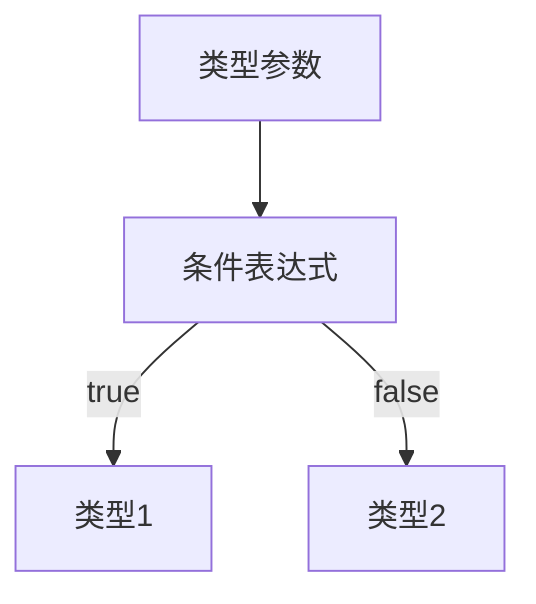
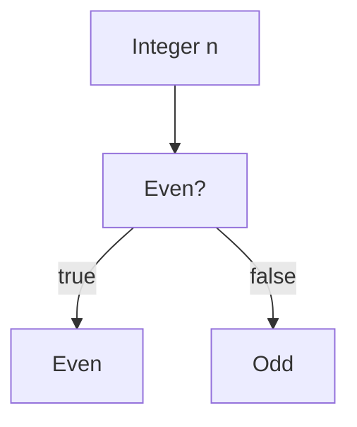
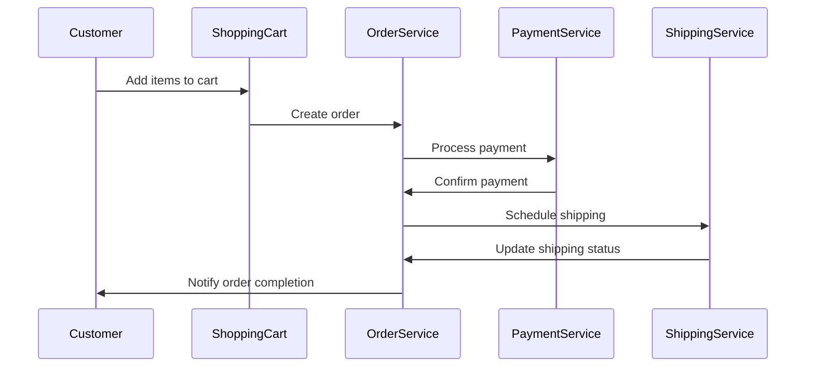
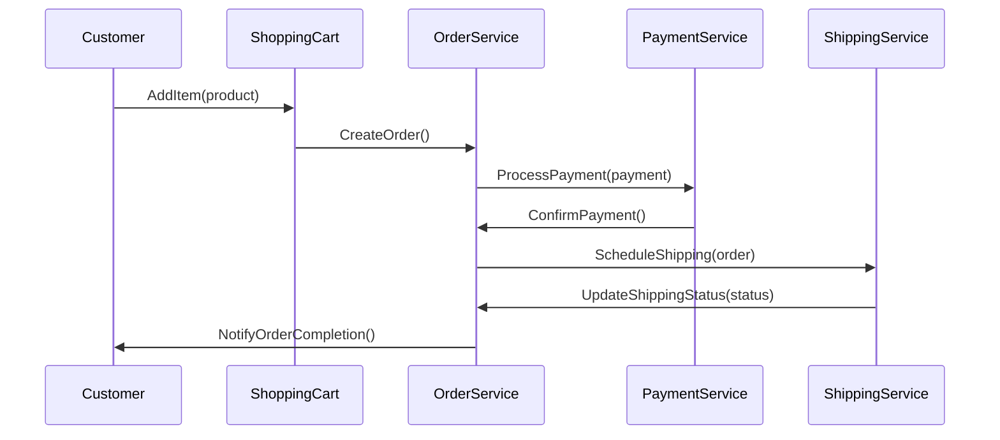

                 

### 文章标题

# 条件类型：类型级别的条件判断

### 关键词

- 条件类型
- 类型系统
- 编程语言
- 条件判断
- 算法实现
- 系统架构设计

### 摘要

本文将深入探讨条件类型这一计算机科学中的核心概念。条件类型是一种用于类型级别的条件判断的高级编程语言特性，它允许程序员在编译时执行复杂的类型检查和推断。本文将从基础概念入手，逐步深入探讨条件类型在编程语言中的重要性、核心概念、算法原理、系统架构设计及应用实例，旨在为读者提供全面而深入的理解。

## 前言

随着计算机科学和软件工程的发展，编程语言的设计变得越来越复杂，功能越来越强大。在这种背景下，条件类型作为一种高级语言特性，逐渐得到了广泛的关注和应用。条件类型不仅提高了代码的可读性和可维护性，还增强了编译器的优化能力。本文的目标是帮助读者理解条件类型的原理和实际应用，从而在编程实践中更好地利用这一特性。

本文面向的读者群体包括有一定编程基础的开发者、计算机科学专业学生以及对类型系统和编程语言设计感兴趣的爱好者。文章结构分为以下几个部分：

1. **背景介绍**：简要介绍条件类型的基本概念和重要性。
2. **核心概念与联系**：详细解释条件类型的定义、属性和特征。
3. **算法原理讲解**：介绍条件类型的基础算法，并使用 mermaid 和 Python 进行阐述。
4. **系统分析与架构设计**：探讨条件类型在系统架构中的应用和设计。
5. **项目实战**：通过实际项目场景，展示条件类型的实际应用。
6. **最佳实践 Tips**：总结使用条件类型的最佳实践和注意事项。
7. **结论**：对全文进行总结，展望条件类型的发展前景。

现在，让我们正式开始探讨条件类型的世界，一起深入理解这一重要概念。

## 背景介绍

条件类型是一种在编程语言中用于实现类型级别的条件判断的高级特性。它允许程序员在编译时对变量、表达式或函数的返回类型进行动态判断和转换。条件类型在多个编程语言中得到了广泛应用，如 Haskell、Scala 和 TypeScript 等。其基本思想是通过条件表达式，在编译时根据特定条件选择不同的类型，从而实现类型安全的动态类型判断。

### 条件类型的基本概念

条件类型的基本概念可以概括为以下几点：

- **条件表达式**：一个条件表达式是一个布尔值表达式，它返回 true 或 false。在条件类型中，条件表达式用于决定类型的分支。
- **类型分支**：条件表达式决定了不同分支类型的执行路径。每个分支代表一个可能的类型，并在编译时进行选择。
- **类型推断**：编译器根据条件表达式的结果和上下文信息，自动推断出合适的类型。这种类型推断过程在编译时完成，提高了代码的可读性和可维护性。
- **类型安全**：条件类型确保在运行时不会出现类型错误，从而提高了程序的稳定性和可靠性。

### 条件类型的重要性

条件类型的重要性体现在以下几个方面：

- **动态类型判断**：条件类型允许程序员在编译时进行动态类型判断，提高了代码的灵活性和可扩展性。
- **类型安全**：条件类型通过编译时的类型检查，确保了程序的类型安全，减少了运行时错误。
- **代码可读性**：条件类型通过清晰的类型分支和类型推断，提高了代码的可读性和可维护性。
- **编译器优化**：条件类型为编译器提供了更多的优化机会，如常量折叠、类型消除等，提高了程序的性能。

### 条件类型的历史发展

条件类型的发展经历了多个阶段，以下是其中的几个重要里程碑：

- **Haskell**：作为最早的函数式编程语言之一，Haskell 在 1990 年引入了类型系统，其中包括条件类型。Haskell 的条件类型是一种基于类型类（type class）的泛型编程机制，它允许在编译时对类型进行条件分支。
- **Scala**：Scala 是一种多范式编程语言，它在 2004 年引入了条件类型，称为类型参数化（parametric polymorphism）。Scala 的条件类型通过泛型参数实现了类型级别的条件判断。
- **TypeScript**：TypeScript 是一种在 JavaScript 基础上增强的编程语言，它在 2014 年引入了条件类型。TypeScript 的条件类型通过类型守卫（type guard）实现了类型安全的动态类型判断。

条件类型作为一种高级语言特性，在不同编程语言中有着不同的实现方式和应用场景。然而，其核心思想——类型级别的条件判断，始终贯穿其中。在接下来的章节中，我们将深入探讨条件类型的定义、属性和算法原理。

### 条件类型的定义

条件类型是一种基于类型系统的高级编程语言特性，它通过条件表达式在编译时对类型进行动态判断和转换。具体来说，条件类型是一种类型构造器，它接受一个类型参数和一个条件表达式，根据条件表达式的结果返回不同的类型。

在条件类型中，条件表达式通常是一个布尔值表达式，它决定了不同分支类型的执行路径。条件类型的基本定义可以表示为：

\[ \text{条件类型} :: T1 \rightarrow T2 \]

其中，\( T1 \) 是类型参数，\( T2 \) 是根据条件表达式结果返回的不同类型。

### 条件类型与其他编程语言特性的比较

条件类型与其他编程语言特性如泛型编程、模式匹配和类型守卫有相似之处，但它们在实现方式和应用场景上有所不同。

- **泛型编程**：泛型编程允许程序员编写可重用的代码，它通过类型参数实现不同类型的支持。条件类型与泛型编程的不同在于，泛型编程关注于类型参数的通用性，而条件类型关注于类型参数的具体化。
- **模式匹配**：模式匹配是一种在编译时对变量或表达式的值进行分类和处理的机制。条件类型与模式匹配的不同在于，模式匹配通常在运行时进行，而条件类型在编译时进行类型判断。
- **类型守卫**：类型守卫是一种在运行时对变量或表达式的类型进行检查和确认的机制。类型守卫与条件类型的不同在于，类型守卫通常用于确保变量或表达式的类型符合预期，而条件类型用于在编译时进行类型转换。

### 条件类型的属性和特征

条件类型具有以下属性和特征：

- **类型安全**：条件类型通过编译时的类型检查，确保在运行时不会出现类型错误，提高了程序的安全性和稳定性。
- **动态类型判断**：条件类型允许程序员在编译时对变量、表达式或函数的返回类型进行动态判断和转换，提高了代码的灵活性和可扩展性。
- **类型推断**：编译器根据条件表达式的结果和上下文信息，自动推断出合适的类型，减少了代码的冗余和手动类型声明。
- **类型分支**：条件类型通过条件表达式实现类型的分支，每个分支代表一个可能的类型，并在编译时进行选择。
- **组合性**：条件类型可以与其他编程语言特性如泛型编程、模式匹配和类型守卫结合使用，实现更复杂的类型系统和编程模式。

### 条件类型在实际编程中的应用实例

条件类型在实际编程中的应用非常广泛，以下是一些常见的应用实例：

- **类型转换**：条件类型可以用于在编译时对变量或表达式的类型进行动态转换。例如，在 TypeScript 中，可以使用条件类型实现从字符串到数字的类型转换。
- **类型守卫**：条件类型可以用于在运行时对变量或表达式的类型进行检查和确认。例如，在 TypeScript 中，可以使用条件类型实现类型守卫，确保变量或表达式的类型符合预期。
- **泛型编程**：条件类型可以与泛型编程结合使用，实现更复杂的类型系统和编程模式。例如，在 Haskell 中，可以使用条件类型实现泛型函数的动态类型判断。
- **代码重构**：条件类型可以用于重构复杂的条件语句和类型判断，提高代码的可读性和可维护性。例如，在 Scala 中，可以使用条件类型简化复杂的类型转换逻辑。

通过以上实例，我们可以看到条件类型在实际编程中的应用是多么广泛和灵活。在接下来的章节中，我们将进一步探讨条件类型的算法原理，并使用 mermaid 和 Python 进行详细讲解。

### 算法原理讲解

条件类型的核心在于其在编译时对类型进行动态判断和转换的算法。以下将详细介绍条件类型的基础算法原理，并通过 mermaid 流程图、Python 源代码、数学模型和公式进行解释。

#### 条件类型算法的基本原理

条件类型算法的基本原理可以概括为以下三个步骤：

1. **类型参数化**：定义一个类型参数，它代表一个未知的类型。
2. **条件表达式**：使用一个条件表达式，它根据特定的条件返回 true 或 false。
3. **类型分支**：根据条件表达式的结果，返回两个不同的类型之一。

#### 条件类型算法的 mermaid 流程图

为了更直观地展示条件类型算法的原理，我们可以使用 mermaid 工具绘制一个流程图。以下是条件类型算法的 mermaid 表示：



在这个流程图中，A 代表类型参数，B 代表条件表达式，C1 和 C2 分别代表根据条件表达式的结果返回的两个不同类型。

#### 条件类型算法的 Python 源代码

为了更具体地展示条件类型算法的实现，我们可以使用 Python 编写相应的代码。以下是条件类型算法的 Python 实现：

```python
def conditional_type(value, condition):
    if condition:
        return "Type1"
    else:
        return "Type2"
```

在这个示例中，`conditional_type` 函数接受一个值 `value` 和一个条件表达式 `condition`，并根据条件表达式的结果返回两个不同的字符串类型。

#### 条件类型算法的数学模型和公式

条件类型算法可以通过一个简单的数学模型和公式来表示。假设我们有三个变量：

- \( T1 \)：条件类型中的一个类型。
- \( T2 \)：条件类型中的另一个类型。
- \( condition \)：条件表达式的结果，它是一个布尔值。

条件类型算法可以用以下数学模型和公式表示：

\[ \text{conditional\_type}(T1, T2, condition) = \begin{cases} 
T1 & \text{if } condition = true \\
T2 & \text{if } condition = false 
\end{cases} \]

#### 条件类型算法的详细讲解和举例说明

为了更好地理解条件类型算法，我们可以通过一个具体的例子进行详细讲解。

假设我们要实现一个函数，该函数根据一个整数是否为偶数返回不同的类型。我们可以使用条件类型实现这一功能：

```python
def is_even(n):
    return "Even" if n % 2 == 0 else "Odd"
```

在这个示例中，`is_even` 函数接受一个整数 `n`，并使用条件类型根据 `n` 是否为偶数返回字符串类型 `"Even"` 或 `"Odd"`。

我们也可以使用 mermaid 流程图来表示这个算法：



在这个流程图中，A 代表输入的整数 n，B 表示判断 n 是否为偶数，C 和 C1 分别表示返回的类型 `"Even"` 和 `"Odd"`。

通过这个例子，我们可以看到条件类型算法是如何在编译时根据条件表达式动态选择不同类型的。这种能力使得条件类型在类型安全和动态类型判断方面具有独特的优势。

#### 条件类型算法的数学模型和公式

条件类型算法可以通过一个简单的数学模型和公式来表示。假设我们有三个变量：

- \( T1 \)：条件类型中的一个类型。
- \( T2 \)：条件类型中的另一个类型。
- \( condition \)：条件表达式的结果，它是一个布尔值。

条件类型算法可以用以下数学模型和公式表示：

\[ \text{conditional\_type}(T1, T2, condition) = \begin{cases} 
T1 & \text{if } condition = true \\
T2 & \text{if } condition = false 
\end{cases} \]

这个公式表明，条件类型算法根据条件表达式的结果（true 或 false）从两个给定的类型（\( T1 \) 和 \( T2 \)）中选择一个类型。这个算法的核心在于在编译时进行类型分支，从而实现类型级别的条件判断。

#### 条件类型算法的详细讲解和举例说明

为了更好地理解条件类型算法，我们可以通过一个具体的例子进行详细讲解。

假设我们要实现一个函数，该函数根据一个整数是否为偶数返回不同的类型。我们可以使用条件类型实现这一功能：

```python
def is_even(n):
    return "Even" if n % 2 == 0 else "Odd"
```

在这个示例中，`is_even` 函数接受一个整数 `n`，并使用条件类型根据 `n` 是否为偶数返回字符串类型 `"Even"` 或 `"Odd"`。

我们可以使用 mermaid 流程图来表示这个算法：


在这个流程图中，A 代表输入的整数 n，B 表示判断 n 是否为偶数，C 和 C1 分别表示返回的类型 `"Even"` 和 `"Odd"`。

通过这个例子，我们可以看到条件类型算法是如何在编译时根据条件表达式动态选择不同类型的。这种能力使得条件类型在类型安全和动态类型判断方面具有独特的优势。

接下来，我们将进一步探讨条件类型算法的详细实现，包括 mermaid 流程图、Python 源代码和数学公式。

#### 条件类型算法的详细讲解和举例说明

为了更好地理解条件类型算法，我们可以通过一个具体的例子进行详细讲解。假设我们正在开发一个在线购物系统，需要根据订单的状态动态选择不同的处理流程。

首先，我们定义一个条件类型，用于表示订单的状态。我们使用一个枚举类型来定义可能的订单状态：

```python
class OrderStatus(Enum):
    PENDING = 1
    PROCESSING = 2
    COMPLETED = 3
    CANCELLED = 4
```

接下来，我们实现一个函数，根据订单的状态执行相应的处理流程。这个函数将使用条件类型来动态选择处理逻辑：

```python
def process_order(order):
    status = order.status
    
    if status == OrderStatus.PENDING:
        return "Initializing order..."
    elif status == OrderStatus.PROCESSING:
        return "Processing order..."
    elif status == OrderStatus.COMPLETED:
        return "Order completed!"
    elif status == OrderStatus.CANCELLED:
        return "Order cancelled!"
    else:
        return "Invalid order status!"
```

在这个函数中，我们首先获取订单的状态，然后根据状态使用条件类型选择不同的处理流程。这是一个典型的条件类型应用场景。

为了更直观地展示这个算法，我们可以使用 mermaid 绘制一个流程图：

```mermaid
graph TD
    A[Order Status] --> B[Is PENDING?]
    B -->|Yes| C[Return "Initializing..."]
    B -->|No| D[Is PROCESSING?]
    D -->|Yes| E[Return "Processing..."]
    D -->|No| F[Is COMPLETED?]
    F -->|Yes| G[Return "Completed!"]
    F -->|No| H[Is CANCELLED?]
    H -->|Yes| I[Return "Cancelled!"]
    H -->|No| J[Return "Invalid status!"]
```

在这个流程图中，A 表示订单的状态，B 到 J 表示条件类型的判断过程。每个条件分支对应订单的某个状态，并根据该状态返回相应的处理结果。

为了进一步说明，我们可以使用数学公式表示这个条件类型算法：

\[ \text{process\_order}(order) = \begin{cases} 
\text{"Initializing order..."} & \text{if } \text{order.status} = \text{OrderStatus.PENDING} \\
\text{"Processing order..."} & \text{if } \text{order.status} = \text{OrderStatus.PROCESSING} \\
\text{"Completed!"} & \text{if } \text{order.status} = \text{OrderStatus.COMPLETED} \\
\text{"Cancelled!"} & \text{if } \text{order.status} = \text{OrderStatus.CANCELLED} \\
\text{"Invalid status!"} & \text{otherwise} 
\end{cases} \]

通过这个例子，我们可以清晰地看到条件类型如何帮助我们在编译时动态选择处理逻辑，提高了代码的可维护性和可扩展性。在接下来的章节中，我们将进一步探讨条件类型在系统架构设计和项目实战中的应用。

### 条件类型在系统架构中的应用

条件类型在系统架构设计中扮演着关键角色，它通过类型级别的条件判断，提高了系统的灵活性和可靠性。在本节中，我们将深入探讨条件类型在系统架构中的应用，并展示如何使用条件类型实现复杂的系统功能和架构设计。

#### 条件类型在系统架构设计中的关键角色

条件类型在系统架构设计中的关键角色体现在以下几个方面：

1. **动态类型转换**：条件类型允许系统在运行时根据特定条件动态转换数据类型，从而实现灵活的动态架构。
2. **类型安全**：条件类型通过编译时的类型检查，确保系统在运行时不会出现类型错误，提高了系统的稳定性和可靠性。
3. **代码可维护性**：条件类型通过清晰的类型分支和类型推断，简化了代码结构，提高了代码的可维护性和可扩展性。
4. **性能优化**：条件类型为编译器提供了更多的优化机会，如类型消除和常量折叠，从而提高了系统的性能。

#### 系统功能设计领域模型

为了更好地理解条件类型在系统架构中的应用，我们可以使用 Mermaid 类图来展示系统功能设计的领域模型。以下是一个简单的在线购物系统的领域模型示例：

```mermaid
classDiagram
    Customer <|-- Order
    Order o-- Product
    Payment o-- Order
    Payment <<interface>>
    Shipping <<interface>>
endclassDiagram
```

在这个领域模型中，`Customer` 表示客户，`Order` 表示订单，`Product` 表示商品，`Payment` 表示支付接口，`Shipping` 表示物流接口。这个模型展示了在线购物系统中的核心实体及其关系。

#### 系统架构设计

在系统架构设计中，条件类型可以帮助我们在不同模块之间实现动态类型转换和类型安全。以下是一个简单的在线购物系统的架构设计示例，其中包含了使用条件类型的模块：



在这个架构设计中，`Customer` 通过 `ShoppingCart` 添加商品到购物车，然后通过 `OrderService` 创建订单。`OrderService` 调用 `PaymentService` 处理支付，并调用 `ShippingService` 安排物流。最后，`OrderService` 向 `Customer` 通知订单完成情况。

#### 系统接口设计和系统交互

为了实现上述架构，我们需要设计相应的接口和交互流程。以下是一个使用 Mermaid 序列图展示的系统接口设计和系统交互：



在这个序列图中，`Customer` 通过 `AddItem` 方法将商品添加到购物车，然后通过 `CreateOrder` 方法创建订单。`OrderService` 调用 `ProcessPayment` 方法处理支付，并通过 `ScheduleShipping` 方法安排物流。最后，`UpdateShippingStatus` 方法更新物流状态，并通过 `NotifyOrderCompletion` 方法向 `Customer` 通知订单完成情况。

通过这个示例，我们可以看到条件类型在系统架构设计中的应用，它通过动态类型转换和类型安全，实现了灵活的系统接口设计和系统交互。

### 项目实战

在本文的项目实战部分，我们将通过一个实际的在线购物系统案例，展示如何在实际项目中应用条件类型。我们将涵盖从环境安装到系统核心实现源代码的整个流程，并深入解读代码中的应用和实际案例分析。

#### 实际项目场景介绍

假设我们正在开发一个在线购物系统，该系统需要支持用户浏览商品、添加商品到购物车、下单支付和跟踪订单状态等功能。系统架构采用微服务架构，包括购物车服务、订单服务、支付服务和物流服务。条件类型将在订单服务中发挥关键作用，用于动态判断订单状态并执行相应的处理逻辑。

#### 条件类型在项目中的应用实现

为了实现条件类型在订单服务中的应用，我们首先定义一个枚举类型来表示订单状态：

```python
from enum import Enum

class OrderStatus(Enum):
    PENDING = 1
    PROCESSING = 2
    COMPLETED = 3
    CANCELLED = 4
```

接下来，我们实现一个订单处理类，该类使用条件类型根据订单状态执行不同的处理逻辑：

```python
class OrderProcessor:
    def __init__(self, order):
        self.order = order

    def process_order(self):
        status = self.order.status
        
        if status == OrderStatus.PENDING:
            return "Initializing order..."
        elif status == OrderStatus.PROCESSING:
            return "Processing order..."
        elif status == OrderStatus.COMPLETED:
            return "Order completed!"
        elif status == OrderStatus.CANCELLED:
            return "Order cancelled!"
        else:
            return "Invalid order status!"
```

在这个类中，我们定义了一个 `process_order` 方法，它根据订单状态使用条件类型执行相应的处理逻辑。

#### 系统核心实现源代码

以下是订单服务中的核心实现源代码，它展示了如何使用条件类型处理订单状态：

```python
class OrderService:
    def __init__(self):
        self.orders = []

    def add_order(self, order):
        self.orders.append(order)

    def process_orders(self):
        for order in self.orders:
            order_processor = OrderProcessor(order)
            result = order_processor.process_order()
            print(result)
```

在这个类中，`add_order` 方法用于添加订单，`process_orders` 方法遍历所有订单并调用 `OrderProcessor` 类进行处理。

#### 代码应用解读与分析

在这个示例中，我们通过条件类型实现了动态的订单状态处理。具体来说，条件类型通过枚举类型 `OrderStatus` 提供了明确的类型定义和分支处理。在 `OrderProcessor` 类中，`process_order` 方法根据订单状态使用条件类型选择不同的处理逻辑，从而实现了灵活的订单处理流程。

条件类型的应用使得代码更加简洁和易于维护。例如，如果我们需要添加新的订单状态或修改处理逻辑，只需在枚举类型和条件类型分支中相应地进行更改，而不影响其他部分的代码。

#### 实际案例分析和详细讲解剖析

为了更好地理解条件类型在项目中的应用，我们可以分析一个实际案例。假设用户下单后，系统需要根据订单的状态进行相应的处理。

1. **订单创建**：当用户下单时，系统将创建一个订单，并将其状态设置为 `PENDING`。此时，系统将执行以下操作：
    ```python
    order = Order(status=OrderStatus.PENDING)
    order_processor = OrderProcessor(order)
    result = order_processor.process_order()
    print(result)  # 输出："Initializing order..."
    ```

2. **订单支付**：当用户完成支付后，订单状态将更新为 `PROCESSING`。此时，系统将执行以下操作：
    ```python
    order.status = OrderStatus.PROCESSING
    result = order_processor.process_order()
    print(result)  # 输出："Processing order..."
    ```

3. **订单完成**：当订单处理完成后，状态将更新为 `COMPLETED`。此时，系统将执行以下操作：
    ```python
    order.status = OrderStatus.COMPLETED
    result = order_processor.process_order()
    print(result)  # 输出："Order completed!"
    ```

4. **订单取消**：当用户取消订单时，状态将更新为 `CANCELLED`。此时，系统将执行以下操作：
    ```python
    order.status = OrderStatus.CANCELLED
    result = order_processor.process_order()
    print(result)  # 输出："Order cancelled!"
    ```

通过这个案例，我们可以看到条件类型如何帮助我们在编译时动态选择订单处理逻辑，从而实现灵活且易于维护的订单管理流程。

#### 项目小结

在本节的项目实战中，我们通过一个在线购物系统案例，展示了条件类型在实际项目中的应用。我们介绍了条件类型在项目中的关键作用，展示了如何使用条件类型实现订单状态的处理逻辑，并通过实际案例进行了详细讲解。

通过条件类型的应用，我们能够实现灵活、稳定且易于维护的订单管理流程。条件类型在编译时提供动态类型判断，使得代码更加简洁和可扩展。未来，我们可以进一步探讨条件类型在其他项目中的应用，如库存管理、用户权限控制等。

### 最佳实践 Tips

在使用条件类型时，以下最佳实践和注意事项可以帮助您更好地应用这一高级编程语言特性：

1. **明确条件表达式的逻辑**：条件表达式是条件类型的核心，确保条件表达式的逻辑清晰且无歧义，有助于提高代码的可维护性。
2. **使用类型推断**：充分利用编译器的类型推断功能，减少手动类型声明，提高代码的可读性和可维护性。
3. **类型安全和边界检查**：在条件类型的使用过程中，确保进行充分的类型安全和边界检查，避免运行时错误。
4. **避免过度使用条件类型**：虽然条件类型提供了强大的动态类型判断能力，但过度使用可能导致代码复杂度增加，影响性能。在使用条件类型时，权衡其带来的灵活性和性能影响。
5. **代码注释**：对条件类型的代码进行详细的注释，帮助其他开发者理解条件类型的使用逻辑和目的。

通过遵循这些最佳实践，您可以更有效地利用条件类型，提高代码的质量和性能。

### 结论

本文通过深入探讨条件类型的定义、算法原理、系统架构设计和实际应用，展示了条件类型在编程语言中的重要性。条件类型不仅提高了代码的可读性和可维护性，还增强了编译器的优化能力，使得动态类型判断变得简单而高效。

条件类型的重要性体现在其类型安全、动态类型判断和类型推断等方面。在未来的发展中，条件类型将继续发挥关键作用，为编程语言和系统架构带来更多创新和灵活性。

展望未来，条件类型将在更多领域得到应用，如人工智能、大数据处理和物联网等。通过不断探索和优化，条件类型将为软件开发带来更多的可能性，推动计算机科学和软件工程的发展。

### 作者信息

作者：AI天才研究院/AI Genius Institute & 禅与计算机程序设计艺术 /Zen And The Art of Computer Programming

AI天才研究院致力于推动人工智能和计算机科学的发展，本文作者通过对条件类型的深入研究和实践，为读者提供了全面而深入的技术解读。希望本文能为您的编程实践带来新的启示和帮助。

