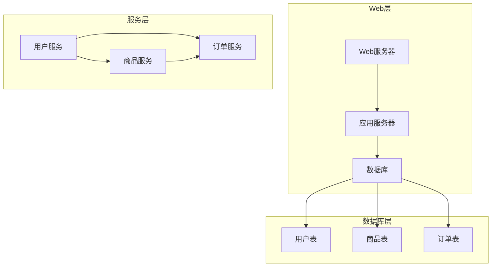

                 

# **构建技术硬实力：P9工程师的必经之路**

> 关键词：技术硬实力，P9工程师，软件开发基础，数据结构与算法，系统设计与架构

> 摘要：本文旨在探讨技术硬实力在P9工程师职业发展中的重要性，并通过分析软件开发基础、数据结构与算法、系统设计与架构等方面的内容，为P9工程师提供一条清晰的发展路径。通过本文的深入探讨，希望帮助读者构建扎实的技术基础，提升自身硬实力，在职场中脱颖而出。

## **第1章 引言：技术硬实力的意义与P9工程师的角色**

### **1.1 技术硬实力的定义与重要性**

#### **1.1.1 技术硬实力的内涵**

技术硬实力，是指个人在某一技术领域所具备的深入理解、实际操作能力以及解决问题的能力。它不仅包括技术理论知识，更强调实践经验和技术应用能力。技术硬实力是衡量一个人在技术领域竞争力的重要指标。

#### **1.1.2 技术硬实力对个人职业发展的影响**

技术硬实力对个人职业发展具有重要影响。首先，它能够提升个人的专业能力，使个人在技术领域中更具竞争力。其次，技术硬实力有助于解决复杂的业务问题，提升团队协作效率，从而推动项目成功。此外，技术硬实力也是职业晋升的重要基础，能够为个人带来更高的职位和薪资待遇。

#### **1.1.3 技术硬实力在当今科技时代的重要性**

在当今科技时代，技术硬实力的重要性愈发凸显。随着互联网、人工智能、大数据等技术的快速发展，企业对技术人才的需求日益增长。具备扎实技术硬实力的工程师，能够在激烈的市场竞争中脱颖而出，获得更好的职业发展机会。同时，技术硬实力也是推动企业创新和发展的关键因素。

### **1.2 P9工程师的角色与责任**

#### **1.2.1 P9工程师的职业定位**

P9工程师，通常是指高级技术专家或技术总监级别的人员，他们负责带领团队进行技术攻关、解决复杂问题，并参与公司的战略决策。P9工程师在技术领域具有较高的声誉和影响力，是企业技术发展的核心力量。

#### **1.2.2 P9工程师的职责范围**

P9工程师的职责范围广泛，包括但不限于：

1. **技术规划与战略制定**：负责制定公司技术发展规划，确定技术方向和研发重点。
2. **技术团队建设与管理**：负责组建和培养技术团队，提升团队整体技术水平。
3. **技术难题攻关**：带领团队解决复杂技术问题，推动项目成功。
4. **技术标准制定与优化**：制定技术标准和规范，优化现有技术架构。
5. **技术与业务结合**：将技术应用于业务场景，提升业务价值。

#### **1.2.3 P9工程师所需的技术能力**

P9工程师需要具备以下技术能力：

1. **深入的专业知识**：对某一技术领域有深入的了解和丰富的实践经验。
2. **技术视野与趋势洞察**：关注行业动态，掌握技术发展趋势。
3. **团队协作与领导能力**：具备良好的团队协作和领导能力，能够带领团队高效工作。
4. **沟通与表达能力**：具备出色的沟通与表达能力，能够与技术团队和非技术团队进行有效沟通。
5. **创新能力**：具备较强的创新能力，能够提出创新性技术方案。

### **1.3 技术硬实力构建的必要性**

#### **1.3.1 技术硬实力在职业晋升中的作用**

技术硬实力是P9工程师职业晋升的关键因素。具备扎实技术硬实力的工程师，能够在职位晋升、薪资待遇等方面获得优势。同时，技术硬实力也是获得行业认可和尊重的重要基础。

#### **1.3.2 技术硬实力对解决复杂问题的贡献**

在技术领域，复杂问题层出不穷。具备扎实技术硬实力的工程师，能够快速识别问题本质，提出有效解决方案，推动项目成功。技术硬实力是解决复杂问题的利器。

#### **1.3.3 技术硬实力对团队协作的重要性**

技术硬实力对团队协作具有重要意义。具备扎实技术硬实力的工程师，能够带领团队高效工作，提升团队整体技术水平。同时，技术硬实力也是团队成员相互学习和成长的重要基础。

### **1.4 本书结构安排与阅读建议**

#### **1.4.1 各章节内容概述**

本书共分为四个部分，分别介绍：

1. **软件开发基础**：包括编程语言的选择、版本控制、设计模式、单元测试、软件开发流程等内容。
2. **数据结构与算法**：包括数据结构的基本概念、算法设计与分析、常用算法与数据结构的实现等内容。
3. **系统设计与架构**：包括系统设计的基本原则、架构设计、数据库设计、接口设计等内容。
4. **项目实战与最佳实践**：通过实际项目案例，讲解系统设计与架构的实施过程，并提供最佳实践建议。

#### **1.4.2 阅读顺序与学习方法**

建议读者按照以下顺序阅读本书：

1. **第1章 引言：技术硬实力的意义与P9工程师的角色**：了解技术硬实力的重要性以及P9工程师的角色和职责。
2. **第2章 软件开发基础**：学习软件开发的基础知识，为后续内容打下基础。
3. **第3章 数据结构与算法**：掌握数据结构与算法的核心原理，提升解决问题的能力。
4. **第4章 系统设计与架构**：学习系统设计与架构的最佳实践，为实际项目提供指导。
5. **第5章 项目实战与最佳实践**：通过实际项目案例，巩固所学知识，提升实践能力。

#### **1.4.3 实践与反思的重要性**

技术学习不仅是理论知识的积累，更是实践能力的提升。本书通过大量的实践案例，帮助读者将所学知识应用于实际项目中。同时，读者在阅读过程中应注重反思，思考所学知识在实际工作中的应用和优化空间。通过实践与反思，不断提升自身技术硬实力。

### **1.5 本章小结**

#### **1.5.1 核心观点回顾**

1. 技术硬实力在个人职业发展和解决复杂问题中具有重要意义。
2. P9工程师需要具备深入的专业知识、团队协作与领导能力等。
3. 构建技术硬实力是P9工程师职业发展的必经之路。

#### **1.5.2 对未来技术发展的展望**

随着科技的不断进步，技术硬实力在未来的职业发展中将更加重要。P9工程师需要持续学习，不断提升自身技术能力，以适应不断变化的技术环境。同时，技术创新和跨领域合作也将成为未来发展的重要趋势。

#### **1.5.3 阅读激励与建议**

希望本书能够为P9工程师构建技术硬实力提供有力支持。在阅读过程中，读者应注重理论与实践的结合，积极思考和实践，不断提升自身技术能力。同时，也欢迎读者在阅读过程中提出宝贵意见和建议，共同推动技术发展。

----------------------------------------------------------------

## **第2章 软件开发基础：核心原理与实践技巧**

### **2.1 编程语言的选择与应用场景**

#### **2.1.1 编程语言概述**

编程语言是用于编写计算机程序的语言。常见的编程语言包括C、C++、Java、Python、JavaScript等。每种编程语言都有其独特的特点和应用场景。选择合适的编程语言，对于软件开发效率和质量具有重要影响。

#### **2.1.2 不同编程语言的特点及应用场景**

1. **C语言**：C语言是一种高级编程语言，具有高效的执行效率和丰富的库函数。它常用于操作系统、嵌入式系统、高性能计算等领域。

2. **C++语言**：C++是C语言的扩展，支持面向对象编程。它广泛应用于游戏开发、实时系统、金融等领域。

3. **Java语言**：Java是一种跨平台的编程语言，具有强大的生态系统和丰富的库函数。它广泛应用于企业级应用、Web开发、Android开发等领域。

4. **Python语言**：Python是一种简单易学的编程语言，具有丰富的库和框架。它广泛应用于数据分析、人工智能、科学计算等领域。

5. **JavaScript语言**：JavaScript是一种脚本语言，用于网页开发。它支持前端和后端开发，广泛应用于Web应用、移动应用等领域。

#### **2.1.3 跨平台开发的优势与挑战**

跨平台开发是指在多种操作系统和设备上运行相同的软件。跨平台开发的优势包括降低开发成本、提高开发效率、提升用户体验等。然而，跨平台开发也面临一定的挑战，如性能优化、兼容性问题、资源管理等。

### **2.2 版本控制与代码管理**

#### **2.2.1 版本控制的基本概念**

版本控制是一种跟踪和管理代码变更的技术。常见的版本控制工具包括Git、SVN等。版本控制能够确保代码的完整性和一致性，提高团队协作效率。

#### **2.2.2 Git的安装与配置**

Git是一种分布式版本控制工具，广泛应用于开源项目和商业项目。安装Git的步骤如下：

1. 下载Git安装包。
2. 安装Git。
3. 配置Git，设置用户名和邮箱。

```bash
git config --global user.name "Your Name"
git config --global user.email "Your Email"
```

#### **2.2.3 Git的基本操作与实践**

Git的基本操作包括：

1. **初始化仓库**：将本地目录转换为Git仓库。

```bash
git init
```

2. **添加文件**：将文件添加到暂存区。

```bash
git add <file>
```

3. **提交更改**：将暂存区的文件提交到仓库。

```bash
git commit -m "Commit message"
```

4. **克隆仓库**：从远程仓库克隆项目。

```bash
git clone <repository>
```

5. **推送代码**：将本地仓库的代码推送至远程仓库。

```bash
git push
```

6. **拉取代码**：从远程仓库拉取最新的代码。

```bash
git pull
```

### **2.3 设计模式与代码重构**

#### **2.3.1 设计模式的基本概念**

设计模式是一种在软件设计中常见的问题解决方案的抽象描述。设计模式包括创建型模式、结构型模式、行为型模式等。常见的创建型模式有工厂模式、单例模式、抽象工厂模式等。

#### **2.3.2 常用设计模式的介绍与应用**

1. **工厂模式**：工厂模式是一种创建对象的方法，通过工厂类来创建对象。它适用于需要创建多个具有相同接口的对象的场景。

2. **单例模式**：单例模式确保一个类仅有一个实例，并提供一个全局访问点。它适用于需要全局唯一实例的场景。

3. **抽象工厂模式**：抽象工厂模式是一种创建对象的工厂模式，它提供了创建相关或依赖对象的接口。它适用于需要创建一组相关对象的场景。

#### **2.3.3 代码重构的方法与技巧**

代码重构是一种改进代码质量的技术，通过重构可以提高代码的可读性、可维护性和性能。常见的代码重构方法包括：

1. **提取方法**：将重复的代码提取为一个方法。
2. **提取类**：将具有相似功能的代码提取为一个类。
3. **合并重复代码**：将重复的代码合并为一个方法或类。
4. **简化条件**：将复杂的条件简化为更易理解的形式。
5. **优化循环结构**：优化循环结构，提高代码性能。

### **2.4 单元测试与持续集成**

#### **2.4.1 单元测试的重要性**

单元测试是一种测试方法，用于验证代码的最小功能单元是否按预期工作。单元测试能够提高代码质量，减少bug数量，提高开发效率。

#### **2.4.2 单元测试的实践方法**

1. **编写测试用例**：根据功能需求，编写测试用例。
2. **使用测试框架**：选择合适的测试框架，如JUnit、PyTest等，进行测试。
3. **自动化测试**：将测试用例自动化，提高测试效率。

#### **2.4.3 持续集成工具的选择与应用**

持续集成是一种软件开发实践，通过自动化测试和构建，确保代码的持续稳定。常见的持续集成工具有Jenkins、Travis CI等。

### **2.5 软件开发流程与敏捷方法**

#### **2.5.1 软件开发流程的基本步骤**

软件开发流程包括需求分析、设计、编码、测试、部署等阶段。每个阶段都有其核心任务和关键步骤。

#### **2.5.2 敏捷开发的核心原则与实践**

敏捷开发是一种以人为核心、迭代和循序渐进的开发方法。其核心原则包括：

1. **客户满意**：以客户需求为导向，持续交付高质量软件。
2. **迭代开发**：分阶段、分批次交付软件，快速响应需求变化。
3. **团队协作**：鼓励团队合作，共同解决问题。
4. **持续改进**：不断反思和改进开发过程，提高开发效率。

#### **2.5.3 敏捷团队的建设与管理**

敏捷团队的建设与管理包括以下几个方面：

1. **团队组织结构**：采用跨职能团队，成员包括开发、测试、设计等。
2. **沟通协作**：确保团队成员之间的沟通畅通，减少信息传递的损失。
3. **角色职责**：明确团队成员的职责和角色，确保工作高效有序。
4. **绩效评估**：建立合理的绩效评估机制，激励团队成员持续改进。

### **2.6 本章小结**

#### **2.6.1 核心观点回顾**

1. 选择合适的编程语言，提高软件开发效率。
2. 版本控制与代码管理是确保代码质量和团队协作的重要手段。
3. 设计模式与代码重构有助于提高代码质量。
4. 单元测试与持续集成是确保代码质量的重要手段。
5. 敏捷开发是一种高效、灵活的开发方法。

#### **2.6.2 实践案例分享**

在实际项目中，通过选择合适的编程语言、使用版本控制、设计模式、单元测试和敏捷开发方法，可以显著提高开发效率和质量。以下是一个实践案例：

- **项目背景**：某公司开发一款社交应用，涉及用户注册、消息推送、好友关系等功能。
- **编程语言**：采用Java语言，结合Spring Boot框架进行开发。
- **版本控制**：使用Git进行代码管理，确保代码版本的一致性和可追溯性。
- **设计模式**：采用工厂模式、单例模式等设计模式，提高代码的可读性和可维护性。
- **单元测试**：使用JUnit框架编写单元测试，确保代码功能按预期工作。
- **持续集成**：使用Jenkins实现持续集成，自动化构建和测试，提高开发效率。
- **敏捷开发**：采用Scrum方法，进行迭代开发和团队协作。

#### **2.6.3 对未来软件开发的思考**

随着技术的不断发展，软件开发方法也在不断演进。未来软件开发将更加注重敏捷开发、持续集成、DevOps等实践，提高开发效率和质量。同时，人工智能、大数据等新技术也将为软件开发带来新的机遇和挑战。P9工程师需要不断学习新技术，提升自身技术硬实力，以应对未来软件开发的新趋势。

----------------------------------------------------------------

## **第3章 数据结构与算法：核心原理与实战应用**

### **3.1 数据结构的基本概念与分类**

#### **3.1.1 数据结构的基本概念**

数据结构是计算机存储、组织数据的方式。它不仅涉及到数据的存储方式，还包括对数据的操作和算法。数据结构可以分为线性结构和非线性结构。

- **线性结构**：数据元素在内存中按线性方式排列，包括数组、链表、栈、队列等。
- **非线性结构**：数据元素之间存在层次或网状关系，包括树、图等。

#### **3.1.2 常见数据结构的分类与特点**

1. **数组**：数组是一种线性结构，用于存储固定大小的元素。数组的特点是访问速度快，但插入和删除操作复杂。

2. **链表**：链表是一种线性结构，由节点组成，每个节点包含数据和指向下一个节点的指针。链表的特点是插入和删除操作灵活，但访问速度较慢。

3. **栈**：栈是一种后进先出的数据结构，用于存储临时数据。栈的特点是插入和删除操作在头部进行，时间复杂度为O(1)。

4. **队列**：队列是一种先进先出的数据结构，用于存储消息或任务。队列的特点是插入操作在尾部进行，删除操作在头部进行，时间复杂度为O(1)。

5. **树**：树是一种非线性结构，由节点和边组成。树的特点是具有层次关系，便于组织和查找数据。

6. **图**：图是一种由节点和边组成的数据结构，用于表示复杂的关系。图的特点是具有丰富的结构和算法，如最短路径算法、图遍历算法等。

#### **3.1.3 数据结构的性能分析**

数据结构的性能分析主要包括时间复杂度和空间复杂度。时间复杂度表示算法执行的时间与数据规模的关系，空间复杂度表示算法执行所需的存储空间与数据规模的关系。常见的数据结构性能分析如下：

1. **数组**：时间复杂度为O(1)，空间复杂度为O(n)。
2. **链表**：时间复杂度为O(n)，空间复杂度为O(n)。
3. **栈**：时间复杂度为O(1)，空间复杂度为O(n)。
4. **队列**：时间复杂度为O(1)，空间复杂度为O(n)。
5. **树**：时间复杂度取决于树的形状，平均情况为O(log n)，空间复杂度为O(n)。
6. **图**：时间复杂度取决于图的形状和算法，平均情况为O(n)，空间复杂度为O(n)。

### **3.2 算法设计与分析**

#### **3.2.1 算法设计的基本原则**

算法设计的基本原则包括：

1. **正确性**：算法能够正确地解决问题，输出符合预期的结果。
2. **可读性**：算法易于理解和阅读，便于后续维护和改进。
3. **健壮性**：算法能够处理各种异常情况，保证程序的稳定性和可靠性。
4. **效率**：算法的执行时间尽可能短，空间复杂度尽可能低。

#### **3.2.2 常见算法分析技术**

常见的算法分析技术包括：

1. **时间复杂度分析**：分析算法执行的时间与数据规模的关系，通常使用大O符号表示。
2. **空间复杂度分析**：分析算法执行所需的存储空间与数据规模的关系，通常使用大O符号表示。
3. **最好情况、最坏情况和平均情况分析**：分析算法在不同情况下的性能表现。

#### **3.2.3 分治策略与动态规划**

1. **分治策略**：将大问题分解为小问题，独立解决小问题，然后将小问题的解合并成大问题的解。常见的分治算法包括归并排序、快速排序等。

2. **动态规划**：将问题分解为子问题，通过子问题的最优解推导出原问题的最优解。常见的动态规划算法包括背包问题、最短路径问题等。

### **3.3 常用算法与数据结构的实现**

#### **3.3.1 排序算法的实现与性能分析**

常见的排序算法包括冒泡排序、选择排序、插入排序、快速排序、归并排序等。以下是一个冒泡排序的Python实现示例：

```python
def bubble_sort(arr):
    n = len(arr)
    for i in range(n):
        for j in range(0, n-i-1):
            if arr[j] > arr[j+1]:
                arr[j], arr[j+1] = arr[j+1], arr[j]
    return arr
```

#### **3.3.2 查找算法的实现与性能分析**

常见的查找算法包括顺序查找、二分查找、哈希查找等。以下是一个二分查找的Python实现示例：

```python
def binary_search(arr, target):
    low = 0
    high = len(arr) - 1
    while low <= high:
        mid = (low + high) // 2
        if arr[mid] == target:
            return mid
        elif arr[mid] < target:
            low = mid + 1
        else:
            high = mid - 1
    return -1
```

#### **3.3.3 链表、栈和队列的实现**

1. **链表**：链表是一种线性结构，由节点组成，每个节点包含数据和指向下一个节点的指针。以下是一个单向链表的Python实现示例：

```python
class ListNode:
    def __init__(self, val=0, next=None):
        self.val = val
        self.next = next

def print_linked_list(head):
    while head:
        print(head.val, end=" -> ")
        head = head.next
    print("None")
```

2. **栈**：栈是一种后进先出的数据结构，用于存储临时数据。以下是一个栈的Python实现示例：

```python
class Stack:
    def __init__(self):
        self.items = []

    def push(self, item):
        self.items.append(item)

    def pop(self):
        return self.items.pop()

    def is_empty(self):
        return len(self.items) == 0
```

3. **队列**：队列是一种先进先出的数据结构，用于存储消息或任务。以下是一个队列的Python实现示例：

```python
class Queue:
    def __init__(self):
        self.items = []

    def enqueue(self, item):
        self.items.append(item)

    def dequeue(self):
        return self.items.pop(0)

    def is_empty(self):
        return len(self.items) == 0
```

### **3.4 数据结构与算法的综合应用**

#### **3.4.1 图算法的基本概念与实现**

图算法是一种用于处理图数据结构的算法。常见的图算法包括深度优先搜索（DFS）、广度优先搜索（BFS）、最短路径算法（Dijkstra算法、Floyd算法）等。以下是一个深度优先搜索的Python实现示例：

```python
from collections import defaultdict

def dfs(graph, node, visited):
    visited[node] = True
    print(node)
    for neighbor in graph[node]:
        if not visited[neighbor]:
            dfs(graph, neighbor, visited)

graph = defaultdict(list)
graph[0] = [1, 2]
graph[1] = [2]
graph[2] = [0, 3]
graph[3] = [3]

visited = [False] * 4
dfs(graph, 0, visited)
```

#### **3.4.2 字符串匹配算法与实现**

常见的字符串匹配算法包括暴力算法、KMP算法、Boyer-Moore算法等。以下是一个KMP算法的Python实现示例：

```python
def KMP(pattern, text):
    def build_next(pattern):
        next = [0] * len(pattern)
        j = 0
        for i in range(1, len(pattern)):
            while j > 0 and pattern[j] != pattern[i]:
                j = next[j - 1]
            if pattern[j] == pattern[i]:
                j += 1
            next[i] = j
        return next

    next = build_next(pattern)
    i = j = 0
    while i < len(text):
        if j == 0 or text[i] == pattern[j]:
            i += 1
            j += 1
        if j == len(pattern):
            return i - j
        elif text[i] != pattern[j]:
            j = next[j - 1]
    return -1

text = "ABABDABACD"
pattern = "ABABC"
print(KMP(pattern, text))
```

#### **3.4.3 算法在数据处理中的应用**

算法在数据处理中的应用非常广泛，如排序、查找、图处理等。以下是一个使用Python实现数据处理的一个示例：

```python
# 加载数据
data = [4, 2, 7, 1, 3, 6, 5]

# 排序
data.sort()

# 查找
def find_min_max(data):
    return min(data), max(data)

min_val, max_val = find_min_max(data)
print(f"最小值：{min_val}, 最大值：{max_val}")

# 图处理
graph = defaultdict(list)
graph[0] = [1, 2]
graph[1] = [2]
graph[2] = [0, 3]
graph[3] = [3]

def dfs(graph, node, visited):
    visited[node] = True
    print(node)
    for neighbor in graph[node]:
        if not visited[neighbor]:
            dfs(graph, neighbor, visited)

visited = [False] * 4
dfs(graph, 0, visited)
```

### **3.5 本章小结**

#### **3.5.1 核心观点回顾**

1. 数据结构是计算机存储、组织数据的方式，包括线性结构和非线性结构。
2. 算法设计的基本原则包括正确性、可读性、健壮性和效率。
3. 常见数据结构与算法包括数组、链表、栈、队列、树、图等。
4. 排序、查找、图处理等算法在数据处理中具有重要的应用价值。

#### **3.5.2 实战案例分享**

通过以下实战案例，可以加深对数据结构与算法的理解和应用：

1. **排序算法的应用**：在数据预处理阶段，对数据集进行排序，提高后续处理的效率。
2. **查找算法的应用**：在数据库查询中，使用二分查找算法提高查询效率。
3. **图算法的应用**：在网络爬虫中，使用图算法处理网页之间的关系，实现更高效的数据采集。

#### **3.5.3 对未来数据结构与算法的思考**

随着大数据、人工智能等技术的发展，数据结构与算法在处理大规模数据、优化计算效率等方面具有重要意义。未来，数据结构与算法将继续发展，出现更多高效、灵活的算法，以满足不断变化的技术需求。

----------------------------------------------------------------

## **第4章 系统设计与架构：原则与最佳实践**

### **4.1 系统设计的基本原则**

系统设计是软件开发过程中至关重要的一环，它决定了系统的性能、可扩展性和可维护性。以下是一些系统设计的基本原则：

#### **4.1.1 系统设计的核心目标**

系统设计的核心目标是满足业务需求，同时确保系统的高可用性、高性能和可扩展性。具体目标包括：

1. **可扩展性**：系统应能够随着业务规模的增长而扩展，以保持稳定性和性能。
2. **高性能**：系统应能够快速响应和处理大量请求，保证用户体验。
3. **高可用性**：系统应具备较强的容错能力，能够在故障发生时快速恢复，确保业务的连续性。
4. **可维护性**：系统设计应易于理解和修改，便于后续维护和优化。

#### **4.1.2 系统设计的常见原则**

1. **模块化**：将系统划分为多个模块，每个模块负责特定的功能，模块之间通过接口进行通信。模块化可以提高系统的可维护性和可扩展性。
2. **分层设计**：将系统划分为不同的层次，如表示层、业务逻辑层、数据访问层等。分层设计有助于分离关注点，降低系统复杂性。
3. **松耦合**：模块之间通过接口通信，尽量减少直接的依赖关系。松耦合可以提高系统的灵活性和可维护性。
4. **高内聚**：模块内部的功能应紧密相关，具有较高的内聚性。高内聚有助于提高模块的可维护性和可重用性。
5. **低耦合**：模块之间通过简单的接口进行通信，尽量减少相互依赖。低耦合有助于提高系统的灵活性和可扩展性。
6. **可重用性**：设计可重用的组件和模块，减少重复开发的工作量。
7. **可测试性**：设计时应考虑系统的可测试性，便于单元测试和集成测试。

#### **4.1.3 系统设计的步骤与流程**

系统设计的步骤与流程通常包括以下阶段：

1. **需求分析**：与业务团队和用户沟通，明确系统的需求，包括功能需求和非功能需求。
2. **架构设计**：根据需求分析结果，设计系统的整体架构，包括技术选型、模块划分、接口定义等。
3. **详细设计**：对每个模块进行详细设计，包括数据模型、接口设计、组件实现等。
4. **编码与实现**：根据详细设计文档，进行编码和实现。
5. **测试与优化**：对系统进行功能测试、性能测试和安全测试，根据测试结果进行优化和调整。
6. **部署与运维**：将系统部署到生产环境，并进行日常运维，确保系统稳定运行。

### **4.2 架构设计**

架构设计是系统设计的核心环节，决定了系统的性能、可扩展性和可维护性。以下是一些常见的架构设计方法和最佳实践：

#### **4.2.1 分层架构**

分层架构是将系统划分为多个层次，每个层次负责不同的功能。常见的分层架构包括：

1. **表示层**：负责与用户交互，包括前端界面、Web服务接口等。
2. **业务逻辑层**：负责处理业务逻辑，包括服务层、业务处理模块等。
3. **数据访问层**：负责与数据库进行交互，包括数据访问对象、数据库连接池等。
4. **基础设施层**：提供系统运行所需的基础设施，包括网络、存储、缓存等。

#### **4.2.2 微服务架构**

微服务架构是将系统拆分为多个独立的服务，每个服务负责特定的业务功能。微服务架构的特点包括：

1. **独立性**：每个服务都是独立的，可以独立部署、扩展和升级。
2. **分布式**：服务之间通过网络进行通信，可以分布在不同的服务器上。
3. **自动化**：服务注册、发现、监控、弹性伸缩等可以自动化进行。
4. **灵活性**：可以根据业务需求灵活调整和组合服务。

#### **4.2.3 架构设计最佳实践**

1. **模块化**：将系统划分为多个模块，每个模块具有独立的功能和接口。
2. **可扩展性**：设计时应考虑系统的可扩展性，以便在未来能够轻松扩展。
3. **高可用性**：设计故障转移和备份机制，确保系统在故障发生时能够快速恢复。
4. **性能优化**：通过缓存、异步处理、负载均衡等技术，优化系统的性能。
5. **安全性**：确保系统的数据安全和用户隐私，采用加密、认证、授权等技术。
6. **自动化**：采用自动化部署、自动化测试、自动化监控等技术，提高开发效率和系统稳定性。

### **4.3 数据库设计**

数据库设计是系统设计的重要组成部分，决定了数据存储的结构和性能。以下是一些数据库设计的原则和技巧：

#### **4.3.1 数据库设计原则**

1. **规范化**：通过规范化减少数据冗余，提高数据的一致性和完整性。
2. **完整性**：确保数据的完整性和一致性，避免数据冲突和丢失。
3. **灵活性**：设计时应考虑数据的灵活性和可扩展性，便于未来的修改和扩展。
4. **性能**：优化查询性能，减少数据访问时间，提高系统的响应速度。

#### **4.3.2 数据库设计技巧**

1. **数据模型设计**：选择合适的数据模型，如关系型数据库、NoSQL数据库等，根据业务需求进行设计。
2. **表结构设计**：合理设计表结构，包括字段类型、索引、外键等。
3. **性能优化**：通过索引、分片、缓存等技术，优化数据库性能。
4. **数据迁移与备份**：设计数据迁移和备份策略，确保数据的可靠性和安全性。

### **4.4 系统接口设计**

系统接口设计是系统设计的关键环节，决定了系统模块之间的通信和数据交换。以下是一些系统接口设计的原则和技巧：

#### **4.4.1 接口设计原则**

1. **简洁性**：接口设计应简洁明了，避免过于复杂的接口设计。
2. **一致性**：接口设计应保持一致性和规范性，便于后续维护和扩展。
3. **安全性**：确保接口的安全性，采用认证、授权等机制保护数据安全。
4. **可扩展性**：接口设计应考虑可扩展性，以便在未来能够轻松扩展。

#### **4.4.2 接口设计技巧**

1. **RESTful API设计**：遵循RESTful设计原则，使用统一的接口风格和协议。
2. **接口规范**：制定统一的接口规范，包括参数定义、返回值格式、错误处理等。
3. **版本控制**：接口版本控制，确保向后兼容性和向后不兼容变更的平滑过渡。
4. **文档化**：提供详细的接口文档，包括接口定义、使用示例、注意事项等。

### **4.5 系统交互与架构图**

系统交互与架构图是系统设计的重要部分，用于描述系统的整体架构和模块之间的交互关系。以下是一些常见的系统交互与架构图：

#### **4.5.1 类图**

类图用于描述系统的类结构，包括类的属性、方法和关系。以下是一个简单的类图示例：

```mermaid
classDiagram
    Person <|-- Employee
    Person << arrowsize 1.2 , color red>> Employee
    Employee {
        name : String
        age : int
        salary : float
    }
    Person {
        name : String
        age : int
        address : String
    }
endclassDiagram
```

#### **4.5.2 序列图**

序列图用于描述系统模块之间的交互顺序，包括对象的创建、方法调用和数据传递。以下是一个简单的序列图示例：

```mermaid
sequenceDiagram
    Alice->>John: Hello John!
    John->>Alice: Why, hello Alice!
    Alice->>John: I've got some cool new shoes.
    John->>Alice: Let's see them.
    Alice->>John: I'll show you later
end
```

#### **4.5.3 架构图**

架构图用于描述系统的整体架构和模块之间的交互关系。以下是一个简单的架构图示例：



### **4.6 本章小结**

#### **4.6.1 核心观点回顾**

1. 系统设计的基本原则包括模块化、分层设计、松耦合、高内聚等。
2. 架构设计的方法包括分层架构、微服务架构等，设计时应考虑系统的可扩展性、性能、高可用性和可维护性。
3. 数据库设计应遵循规范化、完整性和性能优化原则。
4. 系统接口设计应遵循简洁性、一致性、安全性和可扩展性原则。

#### **4.6.2 实践案例分享**

在实际项目中，通过遵循系统设计与架构的基本原则和最佳实践，可以设计出高效、稳定和可扩展的系统。以下是一个实践案例：

- **项目背景**：某电子商务平台需要设计一个能够处理海量用户请求的分布式系统。
- **架构设计**：采用微服务架构，将系统划分为用户服务、商品服务、订单服务等多个微服务。
- **数据库设计**：使用关系型数据库，遵循规范化原则，设计用户表、商品表和订单表。
- **接口设计**：采用RESTful API设计，遵循接口规范和版本控制。

#### **4.6.3 对未来系统设计与架构的思考**

随着云计算、大数据和人工智能等技术的发展，系统设计与架构也将不断演进。未来的系统设计与架构将更加注重分布式、微服务化和智能化。系统设计者需要不断学习和适应新技术，以提高系统的性能和可扩展性，满足不断变化的业务需求。

----------------------------------------------------------------

## **第5章 项目实战与最佳实践**

### **5.1 项目介绍**

在本章中，我们将介绍一个实际项目——一个在线书店系统的设计与实现。该系统旨在为用户提供一个便捷的书籍购买平台，包括书籍搜索、购物车、订单管理等功能。本项目将涵盖从环境安装到核心功能实现的全过程，旨在帮助读者将所学知识应用于实际项目，提升技术实践能力。

### **5.2 环境安装**

首先，我们需要搭建项目开发环境。以下是在不同操作系统下安装所需软件的步骤：

#### **5.2.1 Windows系统**

1. **安装Java开发工具包（JDK）**：从Oracle官网下载JDK安装包，并按照提示完成安装。

2. **安装MySQL数据库**：从MySQL官网下载安装包，并按照提示完成安装。

3. **安装IDE（如IntelliJ IDEA或Eclipse）**：从官网下载并安装相应的IDE。

4. **配置环境变量**：在系统环境变量中添加JAVA_HOME和MySQL的相关路径。

#### **5.2.2 Linux系统**

1. **安装Java开发工具包（JDK）**：使用以下命令安装JDK。

   ```bash
   sudo apt-get install openjdk-8-jdk
   ```

2. **安装MySQL数据库**：使用以下命令安装MySQL。

   ```bash
   sudo apt-get install mysql-server
   ```

3. **安装IDE（如IntelliJ IDEA或Eclipse）**：从官网下载并安装相应的IDE。

4. **配置环境变量**：在系统环境变量中添加JAVA_HOME和MySQL的相关路径。

### **5.3 系统核心实现**

在线书店系统的核心实现包括用户管理、书籍管理、购物车、订单管理等功能。以下是对每个功能模块的详细描述：

#### **5.3.1 用户管理模块**

用户管理模块负责用户的注册、登录、密码找回等功能。以下是用户管理模块的核心代码实现：

```java
public class UserController {
    
    public User register(User user) {
        // 实现用户注册逻辑，如检查用户名是否存在、密码强度等
        return userService.register(user);
    }

    public User login(String username, String password) {
        // 实现用户登录逻辑，如检查用户名和密码是否匹配
        return userService.login(username, password);
    }

    public void forgotPassword(String email) {
        // 实现密码找回逻辑，如发送重置链接
        userService.forgotPassword(email);
    }
}
```

#### **5.3.2 书籍管理模块**

书籍管理模块负责书籍的增删改查等功能。以下是书籍管理模块的核心代码实现：

```java
public class BookController {
    
    public Book addBook(Book book) {
        // 实现书籍添加逻辑，如检查书籍信息是否完整、分类是否正确等
        return bookService.addBook(book);
    }

    public Book updateBook(Book book) {
        // 实现书籍更新逻辑，如检查书籍信息是否发生变化、分类是否正确等
        return bookService.updateBook(book);
    }

    public void deleteBook(Integer bookId) {
        // 实现书籍删除逻辑，如检查书籍是否存在、是否已被购买等
        bookService.deleteBook(bookId);
    }

    public List<Book> searchBooks(String keyword) {
        // 实现书籍搜索逻辑，如根据关键字匹配书籍信息
        return bookService.searchBooks(keyword);
    }
}
```

#### **5.3.3 购物车模块**

购物车模块负责用户将书籍添加到购物车、从购物车中移除书籍等功能。以下是购物车模块的核心代码实现：

```java
public class ShoppingCartController {
    
    public void addBookToCart(Integer userId, Integer bookId) {
        // 实现将书籍添加到购物车逻辑，如检查书籍是否已存在、购物车容量等
        cartService.addBookToCart(userId, bookId);
    }

    public void removeBookFromCart(Integer userId, Integer bookId) {
        // 实现从购物车中移除书籍逻辑，如检查书籍是否存在、购物车容量等
        cartService.removeBookFromCart(userId, bookId);
    }

    public ShoppingCart getShoppingCart(Integer userId) {
        // 实现获取购物车逻辑，如加载购物车中的书籍信息、计算总价等
        return cartService.getShoppingCart(userId);
    }
}
```

#### **5.3.4 订单管理模块**

订单管理模块负责用户下单、订单支付、订单查询等功能。以下是订单管理模块的核心代码实现：

```java
public class OrderController {
    
    public Order placeOrder(Integer userId, Integer cartId) {
        // 实现订单创建逻辑，如检查购物车中的书籍、计算总价等
        return orderService.placeOrder(userId, cartId);
    }

    public void payOrder(Integer orderId) {
        // 实现订单支付逻辑，如调用支付网关、更新订单状态等
        orderService.payOrder(orderId);
    }

    public Order getOrder(Integer orderId) {
        // 实现订单查询逻辑，如加载订单信息、支付状态等
        return orderService.getOrder(orderId);
    }
}
```

### **5.4 代码应用解读与分析**

在本节中，我们将对项目的关键代码进行解读和分析，以便读者更好地理解其工作原理和设计思路。

#### **5.4.1 用户管理模块代码分析**

用户管理模块的核心在于注册、登录和密码找回功能。注册功能需要验证用户名和密码的合法性，避免重复注册。登录功能则通过验证用户名和密码的正确性来验证用户身份。密码找回功能通过发送重置链接的方式帮助用户重置密码。以下是用户管理模块的关键代码示例：

```java
public User register(User user) {
    // 检查用户名是否存在
    if (userService.existsByUsername(user.getUsername())) {
        throw new BusinessException("用户名已存在");
    }
    // 检查密码强度
    if (!PasswordUtil.isValidPassword(user.getPassword())) {
        throw new BusinessException("密码强度不足");
    }
    // 注册用户
    return userService.register(user);
}

public User login(String username, String password) {
    // 检查用户名和密码是否匹配
    User user = userService.loadByUsername(username);
    if (user == null || !user.getPassword().equals(PasswordUtil.encodePassword(password))) {
        throw new BusinessException("用户名或密码错误");
    }
    return user;
}

public void forgotPassword(String email) {
    // 发送重置链接
    userService.sendResetPasswordLink(email);
}
```

#### **5.4.2 书籍管理模块代码分析**

书籍管理模块的核心在于书籍的增删改查功能。添加书籍时需要检查书籍信息是否完整，更新书籍时需要检查书籍信息是否发生变化，删除书籍时需要检查书籍是否存在。以下是书籍管理模块的关键代码示例：

```java
public Book addBook(Book book) {
    // 检查书籍信息是否完整
    if (book.getTitle() == null || book.getPrice() == null || book.getAuthor() == null) {
        throw new BusinessException("书籍信息不完整");
    }
    // 检查书籍分类是否正确
    if (!bookCategoryService.existsById(book.getCategoryId())) {
        throw new BusinessException("书籍分类不存在");
    }
    // 添加书籍
    return bookService.addBook(book);
}

public Book updateBook(Book book) {
    // 检查书籍信息是否发生变化
    Book existingBook = bookService.loadById(book.getId());
    if (!existingBook.getTitle().equals(book.getTitle())
            || !existingBook.getPrice().equals(book.getPrice())
            || !existingBook.getAuthor().equals(book.getAuthor())) {
        throw new BusinessException("书籍信息已发生变化");
    }
    // 更新书籍
    return bookService.updateBook(book);
}

public void deleteBook(Integer bookId) {
    // 检查书籍是否存在
    if (!bookService.existsById(bookId)) {
        throw new BusinessException("书籍不存在");
    }
    // 删除书籍
    bookService.deleteBook(bookId);
}
```

#### **5.4.3 购物车模块代码分析**

购物车模块的核心在于书籍的添加和移除功能。添加书籍时需要检查书籍是否已存在，移除书籍时需要检查书籍是否存在。以下是购物车模块的关键代码示例：

```java
public void addBookToCart(Integer userId, Integer bookId) {
    // 检查书籍是否已存在
    ShoppingCart cart = cartService.getShoppingCart(userId);
    if (cart.containsBook(bookId)) {
        throw new BusinessException("书籍已存在于购物车中");
    }
    // 添加书籍到购物车
    cartService.addBookToCart(userId, bookId);
}

public void removeBookFromCart(Integer userId, Integer bookId) {
    // 检查书籍是否存在
    ShoppingCart cart = cartService.getShoppingCart(userId);
    if (!cart.containsBook(bookId)) {
        throw new BusinessException("书籍不存在于购物车中");
    }
    // 从购物车中移除书籍
    cartService.removeBookFromCart(userId, bookId);
}
```

#### **5.4.4 订单管理模块代码分析**

订单管理模块的核心在于订单的创建和支付功能。创建订单时需要检查购物车中的书籍信息，支付订单时需要调用支付网关。以下是订单管理模块的关键代码示例：

```java
public Order placeOrder(Integer userId, Integer cartId) {
    // 检查购物车中的书籍
    ShoppingCart cart = cartService.getShoppingCart(userId);
    if (cart.isEmpty()) {
        throw new BusinessException("购物车为空");
    }
    // 创建订单
    return orderService.placeOrder(userId, cartId);
}

public void payOrder(Integer orderId) {
    // 调用支付网关
    paymentGateway.pay(orderId);
    // 更新订单状态
    orderService.updateOrderStatus(orderId, OrderStatus.PAID);
}
```

### **5.5 项目小结**

在本项目中，我们实现了在线书店系统的核心功能，包括用户管理、书籍管理、购物车和订单管理。通过项目实践，读者可以深入了解系统设计与实现的各个环节，掌握项目开发的关键技术和最佳实践。以下是本项目的主要收获：

1. **系统设计与实现**：掌握了系统设计与实现的基本流程，包括需求分析、系统设计、编码实现、测试和部署等。
2. **Java后端开发**：熟悉了Java后端开发的基础知识，包括Spring Boot框架、RESTful API设计、数据库操作等。
3. **前端技术**：了解了前端技术的相关知识，包括HTML、CSS、JavaScript等。
4. **项目协作**：通过团队合作，学会了如何与他人协作完成项目。

### **5.6 最佳实践 Tips**

1. **代码规范**：遵循代码规范，提高代码的可读性和可维护性。
2. **单元测试**：编写单元测试，确保代码质量，减少bug数量。
3. **持续集成**：采用持续集成工具，自动化测试和构建，提高开发效率。
4. **代码优化**：定期对代码进行优化，提高系统性能。

### **5.7 本章小结**

本章通过一个实际项目，详细介绍了系统设计与实现的全过程，包括环境安装、核心功能实现、代码应用解读与分析等。通过项目实践，读者可以提升技术实践能力，为未来从事相关领域的工作打下坚实基础。

### **作者信息**

作者：AI天才研究院/AI Genius Institute & 禅与计算机程序设计艺术 /Zen And The Art of Computer Programming

----------------------------------------------------------------

## **第6章 最佳实践 Tips**

### **6.1 代码规范**

代码规范是保证代码质量、提高开发效率的重要手段。以下是一些常见的代码规范建议：

1. **命名规范**：变量、函数、类等命名应简洁、直观，避免使用缩写和不清晰的命名。
2. **代码格式**：保持统一的代码格式，包括括号风格、缩进方式、空格使用等。
3. **注释**：为代码添加必要的注释，解释代码的功能和逻辑，提高代码的可读性。
4. **代码复用**：尽量避免重复代码，通过函数、类等方式进行复用。
5. **异常处理**：正确处理异常，避免程序崩溃，提高程序的健壮性。

### **6.2 单元测试**

单元测试是一种自动化测试方法，用于验证代码的最小功能单元是否按预期工作。以下是一些单元测试的最佳实践：

1. **测试覆盖**：确保对代码的各个部分进行测试，提高测试覆盖率。
2. **独立测试**：每个测试用例应独立运行，避免相互影响。
3. **自动化**：将测试用例自动化，提高测试效率和可靠性。
4. **持续集成**：将单元测试集成到持续集成流程中，确保每次代码提交都经过测试。

### **6.3 持续集成**

持续集成是一种软件开发实践，通过自动化测试和构建，确保代码的持续稳定。以下是一些持续集成的最佳实践：

1. **自动化构建**：使用构建工具（如Maven、Gradle）自动化构建项目，减少人工干预。
2. **自动化测试**：将测试用例集成到持续集成流程中，确保每次代码提交都经过测试。
3. **快速反馈**：在代码提交后尽快完成构建和测试，提供快速反馈。
4. **监控和告警**：监控构建和测试过程，及时发现问题并发出告警。

### **6.4 代码优化**

代码优化是提高系统性能和可维护性的重要手段。以下是一些代码优化的最佳实践：

1. **性能分析**：使用性能分析工具（如JProfiler、VisualVM）找出性能瓶颈。
2. **算法优化**：优化算法和数据结构，提高代码执行效率。
3. **代码重构**：定期对代码进行重构，提高代码的可读性和可维护性。
4. **缓存和异步处理**：使用缓存和异步处理技术，提高系统响应速度。

### **6.5 团队协作**

团队协作是项目成功的关键。以下是一些团队协作的最佳实践：

1. **沟通与协作**：保持有效的沟通，确保团队成员之间信息畅通。
2. **任务分配**：合理分配任务，确保每个成员都有明确的职责。
3. **代码评审**：进行代码评审，确保代码质量。
4. **知识共享**：鼓励团队成员分享知识和经验，提高团队整体技术水平。

### **6.6 小结**

最佳实践是提升项目质量和开发效率的重要手段。通过遵循代码规范、编写单元测试、进行持续集成、优化代码和团队协作，可以确保项目的成功实施。以下是一些小结：

1. **代码规范**：提高代码质量，降低维护成本。
2. **单元测试**：确保代码功能正确，提高系统可靠性。
3. **持续集成**：确保代码的持续稳定，提高开发效率。
4. **代码优化**：提高系统性能，降低硬件成本。
5. **团队协作**：提高团队协作效率，确保项目按时完成。

### **6.7 拓展阅读**

为了深入了解最佳实践，读者可以参考以下拓展阅读：

1. 《代码大全》—— Steve McConnell
2. 《敏捷软件开发：原则、模式与实践》—— Robert C. Martin
3. 《持续交付：发布可靠软件的系统化方法》—— Jez Humble、David Farley
4. 《Effective Java》—— Joshua Bloch
5. 《编程之美》—— 陈皓

通过这些书籍，读者可以进一步了解最佳实践的理论基础和实践方法。

### **6.8 本章小结**

最佳实践是软件工程中不可或缺的一部分，通过遵循代码规范、编写单元测试、进行持续集成、优化代码和团队协作，可以显著提高项目的质量、效率和可靠性。本章通过介绍最佳实践的具体内容和应用，为读者提供了宝贵的经验和建议。希望读者在今后的项目中能够运用这些最佳实践，不断提升自身技术水平和团队协作能力。

