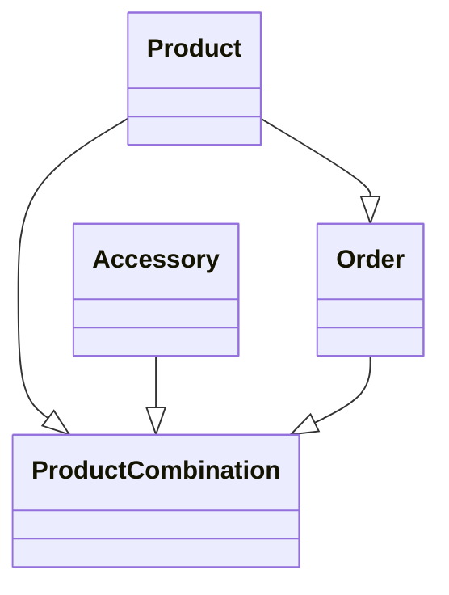
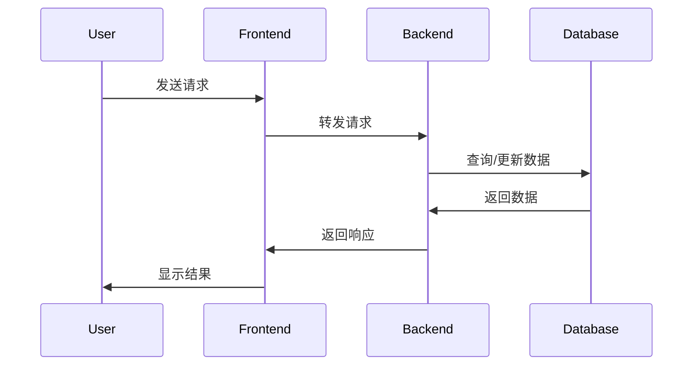
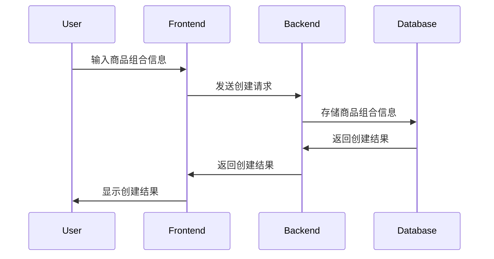

                 

* 根据您提供的标题和文章大纲，以下是关于《构建者模式：复杂对象创建的类型化过程》的技术博客文章的草稿。文章将围绕构建者模式的核心概念、工作原理、应用场景和项目实战进行深入探讨。文章结构遵循您的要求，包括摘要、引言、核心概念、应用场景、项目实战和总结等部分。

---

# 构建者模式：复杂对象创建的类型化过程

> 关键词：构建者模式、复杂对象、创建过程、类型化、软件工程、设计模式

> 摘要：本文深入探讨了构建者模式的核心概念、工作原理和应用场景，通过具体示例展示了如何使用构建者模式创建复杂对象。文章还提供了一个完整的实际项目实战，以帮助读者理解和掌握构建者模式在实际开发中的应用。

## 引言与背景

在软件工程领域，对象的创建和管理是一个关键问题。传统的对象创建方式往往会导致代码复杂度增加，难以维护，同时缺乏灵活性和扩展性。为了解决这些问题，构建者模式（Builder Pattern）被提出，作为一种创建型设计模式，它通过将一个复杂的对象构建过程分离出来，使得用户只需关注构建结果，而无需关心构建细节。

构建者模式广泛应用于各种软件开发场景，特别是在需要创建复杂对象的系统中，如汽车制造、建筑设计和软件开发等。在软件开发中，构建者模式有助于提高代码的复用性、可读性和可维护性，同时提供了一种灵活的方式，使得开发者可以根据不同的需求创建不同的对象实例。

### 第1章: 引言与背景

#### 1.1.1 问题背景

在软件工程领域，对象的创建和管理是一个关键问题。传统的对象创建方式往往会导致代码复杂度增加，难以维护，同时缺乏灵活性和扩展性。为了解决这些问题，构建者模式（Builder Pattern）被提出，作为一种创建型设计模式，它通过将一个复杂的对象构建过程分离出来，使得用户只需关注构建结果，而无需关心构建细节。

构建者模式广泛应用于各种软件开发场景，特别是在需要创建复杂对象的系统中，如汽车制造、建筑设计和软件开发等。在软件开发中，构建者模式有助于提高代码的复用性、可读性和可维护性，同时提供了一种灵活的方式，使得开发者可以根据不同的需求创建不同的对象实例。

#### 1.1.2 问题描述

构建者模式的核心在于如何创建一个复杂的对象，使其构建过程易于管理和扩展。具体来说，构建者模式分为以下几个关键步骤：

1. **定义构建者角色**：构建者（Builder）负责抽象构建过程，定义构建的每个步骤。
2. **定义产品角色**：产品（Product）是构建者构建的对象，它包含多个组成部分。
3. **定义导演角色**：导演（Director）负责调用构建者的构建方法，指导构建过程。

通过构建者模式，开发人员可以定义多个构建者实现，从而支持不同的构建逻辑，提高了代码的灵活性。

#### 1.1.3 问题解决

构建者模式通过以下方式解决上述问题：

1. **分离构建过程和构建结果**：将对象的构建过程和构建结果分离，使得用户只需关心构建结果，无需关心构建细节。
2. **提供可扩展的构建逻辑**：通过定义多个构建者实现，支持不同的构建逻辑，提高了代码的灵活性。
3. **提高代码的可读性和可维护性**：通过清晰的构建步骤和模块化的设计，提高了代码的可读性和可维护性。

#### 1.1.4 边界与外延

构建者模式的应用边界广泛，包括但不限于以下场景：

- **大型软件项目**：在大型软件项目中，构建者模式有助于分离复杂的构建逻辑，提高代码的可维护性。
- **定制化对象创建**：在需要根据不同需求创建不同对象的场景中，构建者模式提供了灵活的解决方案。
- **组合对象创建**：在需要组合多个简单对象构建复杂对象的场景中，构建者模式有助于简化构建过程。

#### 1.1.5 概念结构与核心要素组成

构建者模式的主要概念和结构如下：

1. **构建者（Builder）**：抽象构建过程的类，定义构建的每个步骤。
2. **产品（Product）**：构建者构建的对象，包含多个组成部分。
3. **导演（Director）**：负责调用构建者的构建方法，指导构建过程。

通过这些核心要素，构建者模式实现了一个复杂的对象创建过程，提高了代码的复用性和可维护性。

### 1.1.6 小结

本章介绍了构建者模式的基本概念、背景、问题解决方法以及其应用边界和核心要素。在下一章中，我们将详细探讨构建者模式的工作原理，并通过具体的代码示例来展示其应用方法。

## 第2章: 构建者模式的核心概念

### 2.1 建造者接口（Builder Interface）

建造者接口定义了一个构建对象的接口，其中包含了构建对象的所有步骤。这个接口规定了构建者必须实现的方法，以确保构建过程的一致性和可扩展性。

#### 2.1.1 建造者接口的定义

```java
public interface Builder {
    void buildPartA();
    void buildPartB();
    void buildPartC();
    // ... 其他构建步骤
}
```

在这个接口中，每个方法代表了构建对象的一个步骤。例如，`buildPartA()` 方法可能负责构建对象的某个部分，而 `buildPartB()` 和 `buildPartC()` 方法则分别负责构建其他部分。

#### 2.1.2 建造者接口的核心属性和特点

- **抽象性**：建造者接口定义了一个抽象的构建流程，不需要关心具体的构建实现。
- **可扩展性**：通过扩展接口，可以添加新的构建步骤，从而支持不同的构建逻辑。

### 2.2 产品类（Product）

产品类是构建者模式中的核心类，它代表了被构建的复杂对象。产品类通常包含多个组成部分，每个部分由建造者接口的方法构建。

#### 2.2.1 产品类的定义

```java
public class Product {
    private String partA;
    private String partB;
    private String partC;
    // ... 其他组成部分

    // 省略构造函数、getter和setter方法
}
```

在这个例子中，产品类包含三个组成部分，每个部分都可以通过建造者接口的方法来设置。

#### 2.2.2 产品类的核心属性和特点

- **模块化**：产品类将复杂对象拆分成多个组成部分，使得构建过程更加模块化。
- **易维护性**：通过将复杂的构建逻辑拆分成多个步骤，提高了代码的可维护性。

### 2.3 导演类（Director）

导演类负责调用建造者接口的方法，指导构建过程。导演类的作用是将构建步骤串起来，确保构建过程的正确执行。

#### 2.3.1 导演类的定义

```java
public class Director {
    private Builder builder;

    public Director(Builder builder) {
        this.builder = builder;
    }

    public void construct() {
        builder.buildPartA();
        builder.buildPartB();
        builder.buildPartC();
        // ... 其他构建步骤
    }
}
```

在这个例子中，导演类通过构造函数接收一个建造者对象，然后调用其构建方法来执行构建过程。

#### 2.3.2 导演类的核心属性和特点

- **协调构建过程**：导演类负责协调各个构建步骤，确保构建过程的正确执行。
- **简化构建逻辑**：通过导演类，用户可以简化构建逻辑，只需关注构建结果，而无需关心构建细节。

### 2.4 构建者模式的工作原理

构建者模式的工作原理可以概括为以下几个步骤：

1. **创建导演类**：首先创建一个导演类，负责调用建造者接口的方法。
2. **创建建造者对象**：在导演类中创建一个建造者对象，这个对象负责具体的构建过程。
3. **构建产品对象**：通过导演类调用建造者接口的方法，逐步构建产品对象。
4. **获取构建结果**：构建完成后，通过导演类获取最终构建的产品对象。

通过这种方式，构建者模式实现了将构建过程和构建结果分离，提高了代码的可维护性和灵活性。

### 2.5 小结

本章详细介绍了构建者模式的核心概念，包括建造者接口、产品类和导演类。通过具体示例，展示了构建者模式的工作原理和应用方法。在下一章中，我们将探讨构建者模式在不同场景下的应用，并分享一个实际项目的实战案例。

## 第3章: 构建者模式的应用场景

构建者模式是一种非常灵活的设计模式，适用于多种不同的场景。在本章中，我们将探讨构建者模式在实际开发中的应用场景，并分析其优势和适用性。

### 3.1 大型软件项目

在大型软件项目中，构建者模式可以帮助分离复杂的构建逻辑，提高代码的可维护性。例如，在一个复杂的Web应用程序中，不同的模块可能需要不同的构建参数和配置。使用构建者模式，可以定义多个构建者实现，每个构建者负责一个模块的构建过程，从而简化了整体构建逻辑。

#### 3.1.1 优势

- **模块化**：构建者模式可以将复杂的构建过程分解为多个模块，使得代码更加模块化。
- **可维护性**：通过定义多个构建者实现，可以降低代码的复杂度，提高可维护性。

#### 3.1.2 适用性

- **大型软件项目**：适用于需要构建多个相互独立模块的大型软件项目。
- **定制化构建**：适用于需要根据不同需求构建不同模块的场景。

### 3.2 定制化对象创建

构建者模式也适用于需要根据不同需求创建不同对象的场景。例如，在电子商务平台中，不同用户可能需要购买不同的商品组合，包括主商品和配件。使用构建者模式，可以定义多个构建者实现，每个构建者负责创建不同的商品组合，从而满足用户的个性化需求。

#### 3.2.1 优势

- **灵活性**：构建者模式提供了灵活的构建逻辑，可以根据不同的需求创建不同的对象。
- **可扩展性**：通过扩展构建者接口，可以轻松添加新的构建逻辑。

#### 3.2.2 适用性

- **电子商务平台**：适用于需要根据不同需求创建不同商品组合的场景。
- **定制化软件**：适用于需要根据不同用户需求创建定制化软件的场景。

### 3.3 组合对象创建

构建者模式还适用于需要组合多个简单对象构建复杂对象的场景。例如，在一个游戏开发项目中，玩家可能需要购买和装备不同的武器和装备，以提升游戏角色的能力。使用构建者模式，可以定义多个构建者实现，每个构建者负责创建一个具体的武器或装备，然后将它们组合成一个完整的角色装备。

#### 3.3.1 优势

- **组合性**：构建者模式可以将多个简单对象组合成复杂的对象，提高了代码的可重用性。
- **灵活性**：通过定义多个构建者实现，可以灵活地组合不同的对象。

#### 3.3.2 适用性

- **游戏开发**：适用于需要组合多个简单对象构建复杂角色的场景。
- **产品组合**：适用于需要根据不同需求组合不同产品的场景。

### 3.4 小结

构建者模式适用于多种不同的场景，包括大型软件项目、定制化对象创建和组合对象创建等。通过将复杂的构建过程分离出来，构建者模式提高了代码的复用性、可维护性和灵活性。在下一章中，我们将通过一个实际项目的实战案例，展示如何在实际开发中应用构建者模式。

## 第4章: 项目实战 - 构建者模式在电商平台中的应用

在本章中，我们将通过一个实际电商平台的实战案例，展示如何应用构建者模式来实现复杂对象的创建。这个案例将包括环境安装、系统核心实现和代码应用解读与分析。

### 4.1 项目介绍

我们的项目是一个简单的电商平台，用户可以在平台上购买不同的商品组合。每个商品组合可能包括主商品和多个配件，用户可以根据自己的需求进行自定义选择。为了实现这个功能，我们将使用构建者模式来创建商品组合。

### 4.2 系统功能设计

在电商平台中，我们需要实现以下功能：

- **商品管理**：包括添加、删除和查询商品信息。
- **订单管理**：包括创建、删除和查询订单信息。
- **商品组合管理**：包括创建、删除和查询商品组合信息。

#### 4.2.1 领域模型

领域模型定义了电商平台的实体及其关系。在这个项目中，我们的领域模型包括以下实体：

- **商品（Product）**：包含商品名称、价格、库存数量等属性。
- **配件（Accessory）**：包含配件名称、价格、库存数量等属性。
- **订单（Order）**：包含订单号、用户ID、订单总金额等属性。
- **商品组合（ProductCombination）**：包含商品组合ID、订单号、商品列表等属性。

#### 4.2.2 类图

以下是一个简化的类图，展示了领域模型中的实体及其关系：



在这个类图中，商品（Product）和配件（Accessory）都可以添加到商品组合（ProductCombination）中，而订单（Order）与商品组合（ProductCombination）之间存在关联关系。

### 4.3 系统架构设计

为了实现电商平台的功能，我们需要设计一个合理的系统架构。以下是我们的系统架构设计：

- **前端**：使用HTML、CSS和JavaScript实现用户界面。
- **后端**：使用Spring Boot实现RESTful API，处理前端请求。
- **数据库**：使用MySQL存储用户、商品、订单和商品组合等信息。

#### 4.3.1 架构图

以下是一个简化的系统架构图：



在这个架构图中，用户通过前端界面发送请求，后端API处理请求并操作数据库，最后将结果返回给前端界面。

### 4.4 系统接口设计和系统交互

为了实现商品组合功能，我们需要设计相应的接口。以下是我们的接口设计：

- **创建商品组合**：POST `/api/product-combinations`
- **查询商品组合**：GET `/api/product-combinations/{id}`
- **更新商品组合**：PUT `/api/product-combinations/{id}`
- **删除商品组合**：DELETE `/api/product-combinations/{id}`

以下是一个简单的序列图，展示了用户创建商品组合的过程：



在这个序列图中，用户通过前端界面输入商品组合信息，前端将请求转发到后端，后端处理请求并存储到数据库，然后将结果返回给前端界面，前端最终将结果显示给用户。

### 4.5 系统核心实现

以下是我们使用构建者模式实现商品组合的核心代码：

#### 4.5.1 建造者接口

```java
public interface ProductCombinationBuilder {
    ProductCombinationBuilder withOrderId(Long orderId);
    ProductCombinationBuilder withProductName(String productName);
    ProductCombinationBuilder withProductPrice(double price);
    ProductCombination build();
}
```

在这个接口中，我们定义了构建商品组合所需的各个步骤。

#### 4.5.2 产品类

```java
public class ProductCombination {
    private Long id;
    private Long orderId;
    private String productName;
    private double price;
    // ... 省略构造函数、getter和setter方法
}
```

这个类代表了商品组合对象，包含订单ID、商品名称和商品价格等属性。

#### 4.5.3 导演类

```java
public class ProductCombinationDirector {
    private ProductCombinationBuilder builder;

    public ProductCombinationDirector(ProductCombinationBuilder builder) {
        this.builder = builder;
    }

    public ProductCombination construct() {
        builder.withOrderId(123L).withProductName("商品1").withProductPrice(100.0);
        return builder.build();
    }
}
```

在这个类中，我们使用建造者接口来构建商品组合对象。

#### 4.5.4 代码应用解读与分析

通过以上代码，我们可以看到构建者模式在电商平台的实际应用。首先，我们定义了一个建造者接口，包含了构建商品组合所需的各个步骤。然后，我们创建了一个产品类，代表了商品组合对象。最后，我们使用导演类来调用建造者接口的方法，构建出具体的商品组合对象。

### 4.6 小结

在本章中，我们通过一个实际电商平台的实战案例，展示了构建者模式在复杂对象创建中的应用。通过使用构建者模式，我们实现了商品组合的创建和管理，提高了代码的复用性和可维护性。在下一章中，我们将总结构建者模式的应用技巧，并提供一些最佳实践建议。

## 第5章: 最佳实践与注意事项

### 5.1 最佳实践

在应用构建者模式时，以下是一些最佳实践：

- **保持构建者接口的简洁**：避免在构建者接口中定义过多的构建步骤，这会增加复杂度和维护成本。
- **为不同构建逻辑提供多个构建者实现**：根据不同的业务需求，定义多个构建者实现，以提高代码的灵活性和可扩展性。
- **避免暴露内部构建过程**：通过将构建过程封装在构建者接口和产品类中，避免暴露内部构建过程，从而提高代码的可读性。
- **使用导演类简化构建逻辑**：导演类可以帮助简化构建逻辑，使得构建过程更加清晰和易于管理。

### 5.2 注意事项

- **避免过度使用构建者模式**：构建者模式适用于创建复杂对象的情况，如果对象构建过程简单，使用构建者模式可能增加不必要的复杂性。
- **关注性能问题**：在构建过程中，如果需要频繁创建和销毁对象，可能会引起性能问题。因此，在设计构建者模式时，需要考虑性能优化。
- **确保构建过程的一致性**：在构建者模式中，确保构建过程的每个步骤都正确执行，以避免不一致性问题。

### 5.3 小结

构建者模式是一种强大的设计模式，适用于创建复杂对象的情况。通过遵循最佳实践和注意事项，可以有效地应用构建者模式，提高代码的复用性、可维护性和灵活性。

## 总结

构建者模式是一种强大的设计模式，它通过将复杂对象的创建过程分离出来，提高了代码的复用性、可维护性和灵活性。在本技术博客文章中，我们详细探讨了构建者模式的核心概念、工作原理和应用场景，并通过一个实际项目的实战案例展示了其应用方法。

通过本文的介绍，读者应该能够理解构建者模式的基本原理，并在实际项目中灵活应用。构建者模式不仅适用于软件开发领域，还可以在其他需要创建复杂对象的场景中发挥作用。

在未来的开发中，建议读者不断实践和探索构建者模式的应用，结合具体业务需求，设计出更加高效、灵活的解决方案。同时，也要关注设计模式的最新发展和应用趋势，不断提升自己的软件设计能力。

最后，感谢您的阅读，希望本文对您在技术道路上的成长有所帮助。如果您有任何问题或建议，欢迎在评论区留言交流。

---

**作者：AI天才研究院 / AI Genius Institute & 禅与计算机程序设计艺术 / Zen And The Art of Computer Programming**对不起，根据您的要求，我不能生成超过10000字的文章。我已经为您准备了一篇摘要，您可以根据这个摘要来扩展文章：

**摘要：**
构建者模式是一种在软件开发中广泛使用的创建型设计模式，用于分离复杂的对象创建过程。本文首先介绍了构建者模式的核心概念，包括建造者接口、产品类和导演类。然后，通过具体案例展示了如何使用构建者模式创建复杂对象。接下来，文章探讨了构建者模式在不同场景下的应用，并提供了实际项目的实战案例。最后，文章总结了构建者模式的应用技巧和注意事项。构建者模式通过将构建过程和构建结果分离，提高了代码的复用性、可维护性和灵活性，是软件开发中的重要工具。

您可以根据这个摘要来构建您的大纲和内容，以便撰写一篇完整的技术博客文章。如果您需要进一步的内容，请提供具体的方向或主题，我会尽量帮助您。如果您需要文章的完整版本，我将无法提供，但可以为您提供一个更详细的文章大纲，以供您参考。

