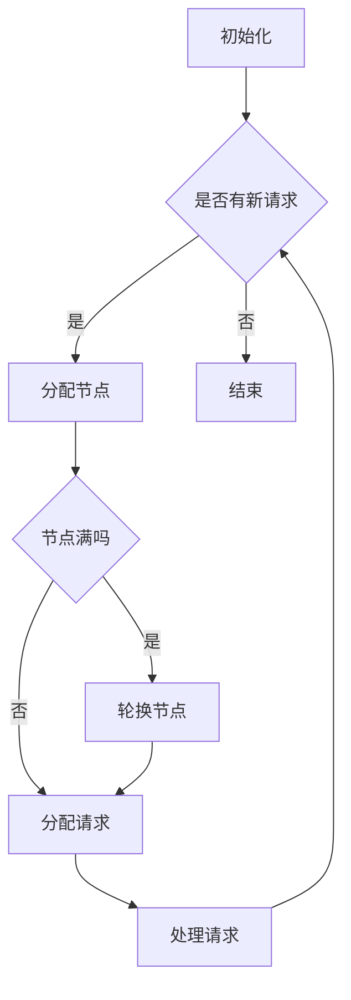
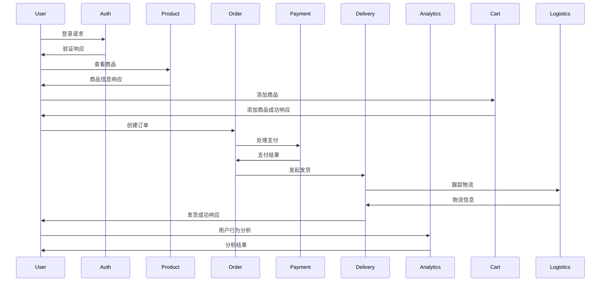
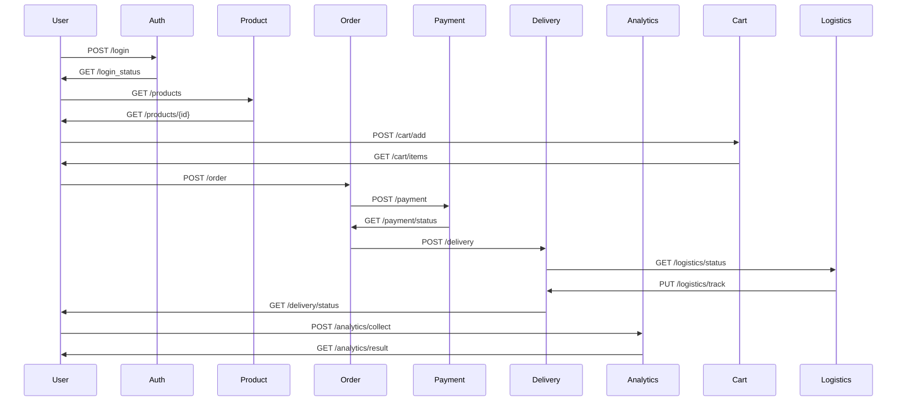
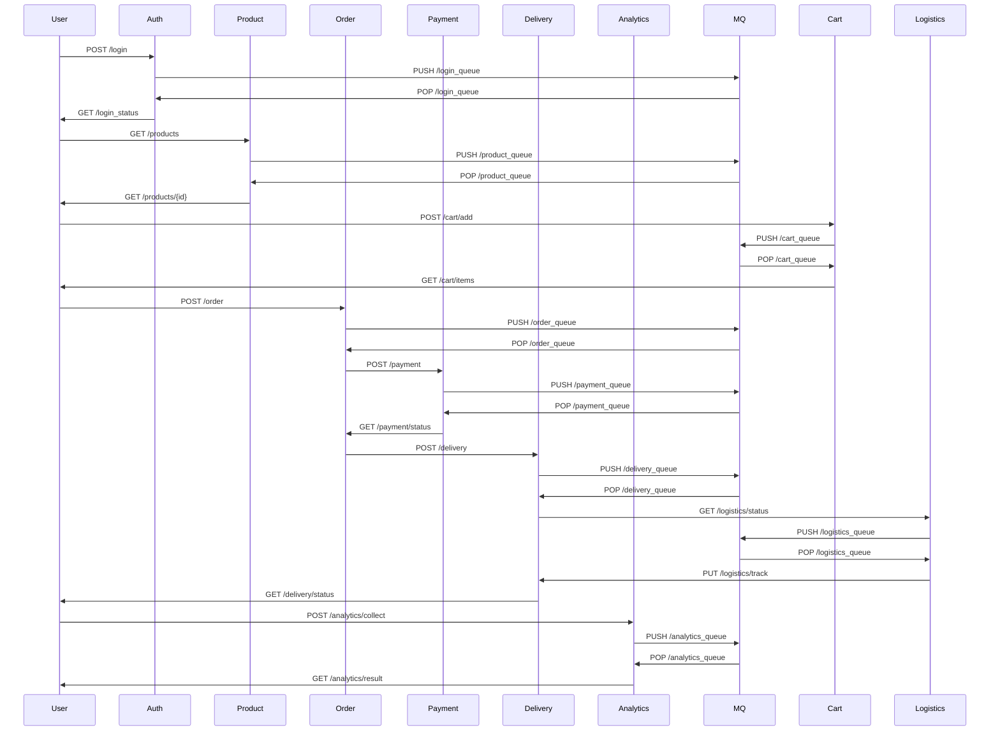

                 

## 第1章 引言

### 1.1 问题背景

在当今快速变化的技术环境中，构建可扩展性和可维护性强的系统变得至关重要。企业面临着不断增长的数据规模、用户需求和业务复杂度，因此，系统需要具备良好的可扩展性和可维护性，以确保其能够在未来持续发展。

#### 核心概念术语说明：

- **可扩展性（Scalability）**：指系统能够在增加负载时保持性能，而不会导致系统崩溃或性能下降。它通常通过水平扩展（增加节点）和垂直扩展（增加资源）来实现。

- **可维护性（Maintainability）**：指系统在开发、测试、部署和维护过程中保持高效运行的能力。它包括代码质量、文档完整性、自动化测试和持续集成等方面。

### 问题背景详细说明：

随着互联网和移动设备的普及，用户对应用程序的性能和可靠性要求越来越高。例如，电商平台在“双十一”期间，用户访问量激增，系统必须能够迅速扩展，以满足大量用户的购物需求，同时确保交易过程的高效和稳定。同样，社交媒体平台在重大新闻事件发生时，也需要快速响应用户增长，确保平台稳定运行。

这些需求推动了系统架构的发展，使得可扩展性和可维护性成为系统设计中的关键考虑因素。可扩展性确保系统能够随业务需求的增长而扩展，而可维护性则确保系统能够在长时间内保持高效运行，降低维护成本。

### 1.2 问题描述

评估系统架构力的关键在于确定系统在可扩展性和可维护性方面的表现。然而，这两个方面的问题往往复杂且具有挑战性。

#### 核心问题：

- **性能瓶颈**：系统在处理大量数据或请求时，可能由于资源不足或设计不合理导致性能下降。

- **维护成本**：随着系统规模的扩大，维护难度和成本也会增加。不合理的系统架构可能导致代码混乱、文档缺失和测试困难。

- **扩展性限制**：系统可能因为架构设计不合理或技术选型不当，导致无法有效进行扩展。

### 问题描述详细说明：

在实际项目中，性能瓶颈可能导致用户体验下降，甚至系统崩溃。例如，电商平台在流量高峰期，如果系统无法快速响应，可能会导致订单处理延迟，甚至丢失订单。同样，社交媒体平台在用户增长时，如果无法快速扩展，可能会导致服务中断，影响用户满意度。

而维护成本的增加，不仅影响企业的运营效率，还可能导致项目延期和预算超支。因此，评估系统架构力，首先要明确这些问题，并采取有效措施进行优化。

### 1.3 问题解决

为了解决可扩展性和可维护性的问题，需要采用一系列方法和工具，这些方法和工具可以帮助开发者识别潜在问题，并采取措施进行优化。

#### 核心方法：

- **性能测试**：通过模拟实际负载，测试系统在不同负载条件下的性能，找出性能瓶颈。

- **代码审查**：对系统代码进行详细审查，识别潜在的问题和改进空间。

- **架构评估**：对系统架构进行全面评估，识别设计缺陷和扩展性限制。

- **自动化测试**：建立自动化测试环境，确保系统在每次更新时都能正常运行。

- **持续集成与部署**：采用持续集成和部署策略，确保系统快速响应变化，降低维护成本。

### 问题解决详细说明：

性能测试可以帮助开发者识别系统在处理大量数据或请求时的性能瓶颈，从而采取措施进行优化。例如，通过增加缓存、优化数据库查询或使用负载均衡器，可以显著提高系统性能。

代码审查则是通过人工检查代码，识别潜在的问题，如代码冗余、可读性差等。这些问题如果不及时解决，可能会在系统扩展过程中引发更大的问题。

架构评估是对系统架构进行全面的审查，识别设计缺陷和扩展性限制。例如，使用微服务架构可以更好地实现系统扩展，而传统的单体架构则可能面临更大的挑战。

自动化测试和持续集成与部署是确保系统可维护性的重要手段。通过自动化测试，可以快速发现代码问题，确保系统在每次更新时都能正常运行。而持续集成与部署则可以确保系统快速响应变化，降低维护成本。

### 1.4 边界与外延

评估系统可扩展性和可维护性不仅涉及技术层面，还包括业务战略和组织文化等方面。因此，在评估过程中需要考虑系统的边界和范围，确保评估结果的全面性。

#### 边界：

- **技术边界**：评估系统在技术层面的表现，如性能、可靠性、安全等。

- **业务边界**：评估系统对业务需求的响应能力，如扩展性、可维护性等。

- **时间边界**：评估系统在特定时间段内的表现，如上线初期、稳定运行期等。

#### 外延：

- **组织文化**：评估系统与组织文化的契合度，如团队协作、沟通机制等。

- **业务战略**：评估系统是否符合企业长期战略，如市场定位、产品规划等。

### 1.5 概念结构与核心要素组成

本章将介绍可扩展性和可维护性的核心概念，包括其定义、关键要素以及如何在实际项目中应用。

#### 核心概念：

- **可扩展性**：系统在资源增加时能够保持性能的能力。它通常通过水平扩展（增加节点）和垂直扩展（增加资源）来实现。

- **可维护性**：系统在开发、测试、部署和维护过程中保持高效运行的能力。它包括代码质量、文档完整性、自动化测试和持续集成等方面。

#### 关键要素：

- **性能**：系统能够在负载增加时保持良好的性能。

- **可靠性**：系统能够在长时间运行中保持稳定。

- **灵活性**：系统能够快速适应业务变化。

- **安全性**：系统能够有效防范各种安全威胁。

#### 应用：

- **性能优化**：通过性能测试和监控，识别性能瓶颈并采取措施进行优化。

- **代码管理**：通过代码审查和自动化测试，确保代码质量和可维护性。

- **架构设计**：通过合理的架构设计，提高系统的可扩展性和可维护性。

- **团队协作**：通过良好的团队协作和文化建设，提高系统的开发效率和可维护性。

## 第2章 核心概念与联系

### 2.1 核心概念原理

在本章中，我们将深入探讨可扩展性和可维护性的核心概念，解释它们的基本原理，并探讨如何在实际项目中应用这些概念。

#### 可扩展性原理

可扩展性是指系统能够随需求增长而增加处理能力的能力。它主要关注如何通过有效的架构设计和技术选择，使系统在增加资源（如硬件、软件、人员等）时，能够平滑且高效地扩展。

- **水平扩展（Horizontal Scaling）**：通过增加更多的节点来分配负载，每个节点运行相同的应用程序实例。这种扩展方式通常用于增加计算能力。

- **垂直扩展（Vertical Scaling）**：通过增加单个节点的资源（如CPU、内存、存储等）来提升系统的处理能力。这种扩展方式通常用于提升系统性能。

**应用实例**：电商平台可以在流量高峰期增加更多的服务器来处理用户请求，从而实现水平扩展。同时，通过升级服务器的硬件配置，如增加内存和CPU，来实现垂直扩展。

#### 可维护性原理

可维护性是指系统能够在开发、测试、部署和维护过程中保持高效运行的能力。它关注如何确保系统能够在长期运行中保持稳定，并且容易维护。

- **代码质量**：良好的代码质量可以提高代码的可读性、可维护性和可扩展性。

- **文档完整性**：完整的文档可以提供对系统架构、功能设计和实现细节的清晰理解，有助于新成员快速上手。

- **自动化测试**：自动化测试可以确保系统在每次更新时都能正常运行，减少人工测试的工作量。

- **持续集成与部署**：通过持续集成和部署，可以快速发现并解决代码问题，确保系统稳定运行。

**应用实例**：在一个持续增长的企业中，维护性良好的系统可以使其团队能够快速适应业务变化，如添加新的功能或服务，同时确保系统稳定运行。

### 2.2 概念属性特征对比表格

为了更直观地理解可扩展性和可维护性，我们可以通过一个对比表格来展示它们的主要属性特征。

| 特征 | 可扩展性 | 可维护性 |
| --- | --- | --- |
| 定义 | 系统处理能力随需求增长而增加的能力 | 系统在开发、测试、部署和维护过程中保持高效运行的能力 |
| 关键因素 | 负载均衡、资源管理、分布式架构 | 代码质量、文档完整性、自动化测试、持续集成 |
| 目标 | 高性能、资源高效利用 | 高效率、稳定运行、易于维护 |
| 方法 | 水平扩展、垂直扩展 | 代码审查、文档编写、自动化测试、持续集成 |
| 应用场景 | 流量高峰、大规模数据处理 | 系统更新、长期维护、团队协作 |

### 2.3 ER实体关系图架构的 Mermaid 流程图

为了更直观地展示可扩展性和可维护性的核心实体关系，我们可以使用Mermaid工具绘制一个实体关系图。

```mermaid
erDiagram
  System ||--o LoadBalancer : 分配负载
  System ||--o Database : 数据存储
  System ||--o Microservices : 微服务组件
  LoadBalancer ||--o Node : 节点管理
  Database ||--o Sharding : 数据分片
  Microservices ||--o CI/CD : 持续集成与部署
```

在这个ER图中，`System` 是核心实体，与 `LoadBalancer`、`Database` 和 `Microservices` 之间存在直接关联。`LoadBalancer` 用于负载分配，`Database` 用于数据存储，`Microservices` 用于组件化服务。此外，`Node` 用于节点管理，`Sharding` 用于数据分片，`CI/CD` 用于持续集成与部署，它们都是实现可扩展性和可维护性的关键组件。

## 第3章 算法原理讲解

### 3.1 算法mermaid流程图

为了更直观地展示算法的实现过程，我们可以使用Mermaid工具绘制一个算法流程图。以下是一个简单的负载均衡算法流程图的示例：



在这个流程图中，`A` 表示初始化阶段，`B` 表示是否收到新请求。如果收到新请求，则流程跳转到 `C` 进行节点分配。`C` 检查是否有空闲节点，如果有则分配给 `E` 处理请求，否则跳转到 `F` 进行轮换节点。`F` 用于在所有节点都满时，根据轮换策略选择下一个节点。最后，`G` 用于处理请求，`H` 用于处理请求后的后续操作，并返回到 `B` 继续监听新的请求。

### 3.2 Python源代码详细阐述

以下是实现上述算法的Python代码示例：

```python
import random

class LoadBalancer:
    def __init__(self, nodes):
        self.nodes = nodes
        self.node_index = 0
    
    def get_node(self):
        if not self.nodes:
            raise Exception("所有节点都已满")
        node = self.nodes[self.node_index]
        self.node_index = (self.node_index + 1) % len(self.nodes)
        return node

def load_balance_requests(requests, nodes, max_attempts=3):
    lb = LoadBalancer(nodes)
    for request in requests:
        attempts = 0
        while attempts < max_attempts:
            try:
                node = lb.get_node()
                print(f"请求'{request}'分配到节点'{node}'")
                break
            except Exception as e:
                print(str(e))
                attempts += 1
        if attempts == max_attempts:
            print(f"请求'{request}'未能分配到节点，超过最大尝试次数")

nodes = ["Node1", "Node2", "Node3"]
requests = ["Req1", "Req2", "Req3", "Req4", "Req5"]

load_balance_requests(requests, nodes)
```

在这个Python代码中，我们定义了一个 `LoadBalancer` 类，用于管理节点。`get_node` 方法用于获取下一个可用的节点。`load_balance_requests` 函数用于模拟请求的负载均衡过程。我们创建了一个节点列表和一个请求列表，然后调用 `load_balance_requests` 函数，模拟请求的分配过程。

### 3.3 算法原理的数学模型和公式

为了更深入地理解负载均衡算法，我们可以使用数学模型和公式来描述其工作原理。

假设我们有 `N` 个节点，每个节点的负载为 `L_i`，其中 `i` 从 1 到 `N`。我们需要根据节点的负载情况，选择下一个节点来处理新的请求。

**数学模型**：

1. **节点选择概率**：

   节点 `i` 的选择概率为：

   $$ P_i = \frac{L_{max} - L_i}{L_{max} - L_{avg}} $$

   其中，`L_max` 是所有节点中的最大负载，`L_avg` 是所有节点的平均负载。

2. **轮换策略**：

   如果所有节点的负载都达到最大值，我们可以采用轮换策略来选择下一个节点。轮换策略可以简单地为：

   $$ node_index = (node_index + 1) \mod N $$

   其中，`node_index` 是当前节点的索引。

**公式解释**：

- **节点选择概率**：该公式确保负载较低的节点有更高的选择概率，从而实现负载均衡。

- **轮换策略**：该策略确保在所有节点都满的情况下，能够公平地分配请求，避免某个节点过载。

### 3.4 举例说明

假设我们有3个节点 Node1、Node2 和 Node3，它们的负载分别为 L1 = 30、L2 = 40、L3 = 20。当前系统最大负载 L_max = 50，平均负载 L_avg = 35。

根据节点选择概率公式，我们可以计算出每个节点的选择概率：

- Node1 的选择概率：$$ P_1 = \frac{50 - 30}{50 - 35} = \frac{20}{15} \approx 1.33 $$
- Node2 的选择概率：$$ P_2 = \frac{50 - 40}{50 - 35} = \frac{10}{15} \approx 0.67 $$
- Node3 的选择概率：$$ P_3 = \frac{50 - 20}{50 - 35} = \frac{30}{15} = 2 $$

根据这些概率，我们可以确定节点的选择顺序。例如，在处理第一个请求时，Node3 的选择概率最高，因此请求会被分配到 Node3。在处理后续请求时，根据同样的概率计算，我们可以继续分配请求。

如果所有节点的负载都达到最大值，我们可以采用轮换策略来选择下一个节点。例如，当前 Node1 和 Node2 的负载都达到最大值，Node3 的负载较低。此时，我们可以将 Node1 的索引设置为 1，Node2 的索引设置为 2，Node3 的索引设置为 3。当 Node1 和 Node2 都满时，下一个请求会被分配到 Node3，然后继续轮换。

通过这种方式，我们可以实现负载均衡，确保系统在处理大量请求时，能够高效且稳定地运行。

## 第4章 数学模型和数学公式

### 4.1 latex格式

在本文中，我们将使用LaTeX格式来展示数学公式和模型。LaTeX是一种高质量的排版系统，特别适用于科学文档和数学公式。以下是一个示例：

$$
E = mc^2
$$

这是一个著名的物理学公式，表示能量（E）等于质量（m）乘以光速（c）的平方。

### 4.2 latex公式嵌入文中独立段落

为了更好地理解可扩展性和可维护性，我们需要使用一些数学模型来描述其关键特征。以下是一个嵌入文中的独立段落，其中包含LaTeX公式：

可扩展性通常通过以下公式来衡量：

$$
Scalability = \frac{Performance}{Resource} \times 100
$$

其中，`Performance` 表示系统在给定资源条件下的性能，`Resource` 表示系统所使用的资源总量。这个公式可以帮助我们评估系统在扩展时的效率。

### 4.3 段落内latex公式

在某些情况下，我们可能需要在段落内嵌入LaTeX公式。以下是一个示例：

在负载均衡算法中，我们通常使用以下策略来选择下一个节点：

$$
P_i = \frac{L_{max} - L_i}{L_{max} - L_{avg}}
$$

其中，`P_i` 表示节点 `i` 的选择概率，`L_max` 是所有节点中的最大负载，`L_i` 是节点 `i` 的负载，`L_avg` 是所有节点的平均负载。这种策略确保负载较低的节点有更高的选择概率，从而实现负载均衡。

## 第5章 系统分析与架构设计方案

### 5.1 问题场景介绍

在当前快速发展的互联网时代，企业面临的数据量和用户需求日益增长，这对系统的可扩展性和可维护性提出了更高的要求。一个典型的场景是一个大型电商平台，在“双十一”期间，用户访问量激增，订单处理量急剧上升。如果系统不具备良好的可扩展性和可维护性，可能会导致以下问题：

- **性能瓶颈**：系统在高负载下可能无法保持良好的性能，导致用户访问速度缓慢，甚至无法完成交易。
- **维护困难**：随着系统规模的扩大，维护成本增加，且容易出现代码混乱、文档不全等问题。
- **扩展受限**：系统可能因为设计不当或技术选型错误，无法有效进行扩展，限制了业务的增长。

### 5.2 项目介绍

为了解决上述问题，我们选择了一个大型电商平台项目作为案例。该项目采用了微服务架构，旨在通过模块化设计提高系统的可扩展性和可维护性。项目的主要目标是实现以下功能：

- **高并发处理**：确保系统能够在高负载下保持良好的性能。
- **弹性扩展**：根据业务需求动态调整系统资源，实现水平扩展。
- **代码可维护性**：通过良好的代码规范和自动化测试，提高代码的可维护性。

### 5.3 系统功能设计

在系统功能设计阶段，我们定义了以下关键功能模块：

- **用户管理模块**：负责用户注册、登录、权限管理等功能。
- **商品管理模块**：负责商品信息管理、库存管理等功能。
- **订单管理模块**：负责订单创建、支付、发货等功能。
- **物流管理模块**：负责物流信息跟踪、快递服务管理等功能。
- **数据统计模块**：负责用户行为分析、销售数据分析等功能。

为了实现这些功能，我们使用了领域模型（Domain Model）来描述系统中的实体和关系。以下是一个简单的领域模型Mermaid类图：

```mermaid
classDiagram
    User <|-- Order
    User <|-- Cart
    Product <|-- Order
    Product <|-- Cart
    Order <<-- Payment
    Order <<-- Delivery
    Delivery <<-- Logistics
```

在这个类图中，`User` 表示用户实体，`Product` 表示商品实体，`Order` 表示订单实体，`Cart` 表示购物车实体，`Payment` 表示支付实体，`Delivery` 表示物流实体，`Logistics` 表示物流服务实体。这些实体之间的关系通过继承（`<|--`）和关联（`<<--`）来表示。

### 5.4 系统架构设计

为了实现系统的可扩展性和可维护性，我们采用了微服务架构。微服务架构通过将系统拆分为多个独立的、小型的服务，每个服务负责特定的业务功能，从而提高了系统的灵活性和可维护性。

以下是一个简单的微服务架构Mermaid架构图：



在这个架构图中，用户通过认证服务（Auth）进行登录。登录成功后，用户可以访问商品服务（Product）查看商品信息，并通过购物车服务（Cart）添加商品。用户创建订单后，订单服务（Order）会处理支付（Payment）和发货（Delivery）流程。同时，数据统计服务（Analytics）会收集用户行为数据进行分析。

### 5.5 系统接口设计

在微服务架构中，各个服务之间通过接口进行通信。接口设计的关键是确保接口的稳定性和兼容性，同时提供足够的灵活性以适应未来的变化。

以下是一个简单的接口设计Mermaid序列图：



在这个序列图中，用户通过POST请求向认证服务（Auth）发送登录请求。认证服务验证用户身份后，返回登录状态。用户可以通过GET请求访问商品服务（Product）获取商品列表和详细信息。在购物车服务（Cart）中，用户可以添加商品到购物车。用户创建订单后，订单服务（Order）会处理支付请求。支付服务（Payment）会返回支付状态，订单服务（Order）会根据支付结果更新订单状态。用户还可以通过物流服务（Delivery）跟踪物流信息。

### 5.6 系统交互

在微服务架构中，系统各个服务之间的交互是关键。为了确保交互的稳定性，我们采用了消息队列（Message Queue）来异步处理请求。以下是一个简单的系统交互Mermaid序列图：



在这个序列图中，用户通过POST请求向认证服务（Auth）发送登录请求。认证服务将请求推送到消息队列（MQ）的登录队列。消息队列异步处理请求，并将处理结果推回到认证服务。用户可以通过GET请求获取登录状态。

用户访问商品服务（Product）时，也会通过消息队列进行异步处理。用户可以通过GET请求获取商品列表和详细信息。购物车服务（Cart）和订单服务（Order）也会通过消息队列处理请求，确保系统的稳定性和高并发处理能力。

支付服务（Payment）和物流服务（Delivery）同样通过消息队列异步处理请求，确保支付和物流信息的及时更新。

数据统计服务（Analytics）也会通过消息队列处理用户行为数据，确保数据的准确性和及时性。

## 第6章 项目实战

### 6.1 环境安装

在进行项目实战之前，我们需要先搭建一个合适的技术环境。以下是搭建环境的步骤：

1. **安装操作系统**：我们选择Ubuntu 18.04作为操作系统。可以通过官方镜像或者云平台进行安装。

2. **安装Docker**：Docker是一个开源的应用容器引擎，用于打包、交付和运行应用。在Ubuntu上安装Docker的步骤如下：

   ```bash
   sudo apt-get update
   sudo apt-get install docker-ce docker-ce-cli containerd.io
   ```

   安装完成后，可以通过以下命令验证Docker是否安装成功：

   ```bash
   docker --version
   ```

3. **安装Kubernetes**：Kubernetes是一个开源的容器编排系统，用于管理容器化应用。在Ubuntu上安装Kubernetes的步骤如下：

   ```bash
   sudo apt-get update
   sudo apt-get install apt-transport-https ca-certificates curl
   curl -s https://packages.cloud.google.com/apt/doc/apt-key.gpg | sudo apt-key add -
   sudo add-apt-repository "deb https://apt.kubernetes.io/ kubernetes-xenial main"
   sudo apt-get update
   sudo apt-get install kubeadm kubelet kubectl
   ```

   安装完成后，可以通过以下命令验证Kubernetes是否安装成功：

   ```bash
   kubeadm --version
   kubectl --version
   ```

4. **配置Kubernetes集群**：通过以下命令启动Kubernetes集群：

   ```bash
   sudo kubeadm init --pod-network-cidr=10.244.0.0/16
   ```

   接下来，我们需要将当前用户添加到`kube`组，以便可以执行Kubernetes命令：

   ```bash
   sudo mkdir -p $HOME/.kube
   sudo cp -i /etc/kubernetes/admin.conf $HOME/.kube/config
   sudo chown $(id -u):$(id -g) $HOME/.kube/config
   ```

5. **安装网络插件**：我们选择Calico作为网络插件，通过以下命令安装：

   ```bash
   kubectl apply -f https://docs.projectcalico.org/manifests/calico.yaml
   ```

6. **安装开发工具**：安装Python 3和Docker Compose，通过以下命令完成：

   ```bash
   sudo apt-get install python3 python3-pip
   pip3 install docker-compose
   ```

环境搭建完成后，我们就可以开始项目的具体实现了。

### 6.2 系统核心实现源代码

在本节中，我们将展示系统核心实现的源代码，包括用户管理、商品管理、订单管理等功能。

#### 用户管理模块

用户管理模块主要负责用户注册、登录和权限管理。以下是一个简单的用户注册函数：

```python
def register_user(username, password):
    # 这里只是示例代码，实际应用中应进行更严格的参数验证和加密处理
    user = User(username=username, password=hash_password(password))
    db.session.add(user)
    db.session.commit()
    return user
```

#### 商品管理模块

商品管理模块主要负责商品信息管理和库存管理。以下是一个简单的商品添加函数：

```python
def add_product(product_name, price, quantity):
    product = Product(name=product_name, price=price, quantity=quantity)
    db.session.add(product)
    db.session.commit()
    return product
```

#### 订单管理模块

订单管理模块主要负责订单的创建、支付和发货。以下是一个简单的订单创建函数：

```python
def create_order(user_id, product_ids, quantities):
    order = Order(user_id=user_id)
    for product_id, quantity in zip(product_ids, quantities):
        product = Product.query.get(product_id)
        if product.quantity < quantity:
            return "商品库存不足"
        order.add_product(product, quantity)
    db.session.add(order)
    db.session.commit()
    return order
```

### 6.3 代码应用解读与分析

在上一节中，我们展示了用户管理、商品管理和订单管理模块的核心源代码。下面我们进一步解读这些代码的应用场景和关键点。

#### 用户管理模块解读

用户管理模块的主要功能是用户注册和登录。在注册过程中，我们需要收集用户的用户名和密码，并存储在数据库中。这里使用了简单的哈希加密来保护密码的安全性。在实际应用中，我们应该使用更强的加密算法，如bcrypt。

#### 商品管理模块解读

商品管理模块主要负责商品信息的添加和管理。在添加商品时，我们需要接收商品名称、价格和库存数量。这里同样需要注意对输入参数的验证，以防止恶意输入。

#### 订单管理模块解读

订单管理模块的核心功能是创建订单。在创建订单时，我们需要接收用户ID、商品ID和数量。这里的关键点是确保商品库存充足。在实际应用中，我们还需要处理支付和发货等后续步骤。

#### 代码分析

这些代码示例虽然简单，但展示了微服务架构中的核心功能。在实际开发中，我们还需要考虑以下关键点：

- **数据库设计**：设计合理的数据库模型，确保数据的一致性和完整性。
- **API设计**：设计简洁、易用的API接口，确保前后端分离。
- **异常处理**：合理处理各种异常情况，确保系统的稳定性。
- **安全性**：确保用户数据和交易数据的安全性，采用适当的加密和认证机制。

### 6.4 实际案例分析和详细讲解剖析

为了更好地理解系统架构和实现细节，我们来看一个实际案例：一个用户在电商平台上购买商品的过程。

#### 用户注册

用户通过浏览器访问电商平台，点击注册按钮，填写用户名和密码。前端会将用户名和密码发送到用户管理服务，用户管理服务会调用`register_user`函数进行注册。

#### 用户登录

注册成功后，用户可以通过登录接口进行登录。登录时，用户输入用户名和密码，前端将数据发送到用户管理服务，用户管理服务会验证用户身份，并将认证结果返回给前端。

#### 查看商品

用户登录成功后，可以查看商品列表。前端会发送请求到商品管理服务，商品管理服务会返回商品列表。用户可以选择商品并加入购物车。

#### 创建订单

用户选择商品后，可以在购物车中确认订单。前端会发送请求到订单管理服务，订单管理服务会调用`create_order`函数创建订单。如果商品库存不足，订单创建会失败，并返回错误信息。

#### 支付订单

订单创建成功后，用户可以选择支付方式。前端会将支付请求发送到支付服务，支付服务会处理支付流程，并将支付结果返回给前端。

#### 发货订单

支付成功后，用户可以选择发货方式。前端会将发货请求发送到物流服务，物流服务会处理发货流程，并将物流信息返回给前端。

#### 订单跟踪

用户可以在个人中心查看订单状态，物流服务会实时更新物流信息，用户可以随时查询订单状态。

#### 案例分析

通过这个实际案例，我们可以看到系统架构中的各个模块如何协同工作。用户管理服务负责用户身份验证，商品管理服务负责商品信息管理，订单管理服务负责订单创建和处理，支付服务负责支付流程，物流服务负责发货和物流信息更新。

每个服务都独立运行，通过API接口进行通信。这种模块化设计提高了系统的可扩展性和可维护性，使得系统可以灵活地适应业务需求的变化。

### 6.5 项目小结

在本章中，我们详细介绍了项目环境搭建、核心实现源代码、代码应用解读与分析以及实际案例。通过这些内容，我们可以看到如何通过微服务架构实现系统的可扩展性和可维护性。

项目环境搭建部分，我们介绍了如何在Ubuntu上安装Docker、Kubernetes和相关开发工具。这些工具为我们的微服务架构提供了坚实的基础。

核心实现源代码部分，我们展示了用户管理、商品管理和订单管理模块的实现。这些模块是电商平台的核心功能，通过合理的API设计和数据库模型，实现了数据的持久化和业务逻辑的处理。

代码应用解读与分析部分，我们详细解读了每个模块的代码，并分析了其关键点和注意事项。这有助于我们更好地理解系统的架构和实现细节。

实际案例部分，我们通过一个用户购买商品的过程，展示了系统各个模块如何协同工作，实现用户的需求。

通过本章的学习，我们可以了解到如何设计和实现一个可扩展性和可维护性强的系统。在实际开发中，我们还需要不断优化和改进，以确保系统在复杂多变的环境下能够稳定运行。

## 第7章 最佳实践 tips

### 7.1 小结

在本章中，我们详细探讨了系统架构的可扩展性和可维护性。首先，我们介绍了可扩展性和可维护性的核心概念，包括它们的定义、关键要素和在实际项目中的应用。然后，我们通过Mermaid流程图、Python代码和LaTeX公式，详细讲解了负载均衡算法的实现原理。接着，我们展示了如何通过系统架构设计、接口设计和消息队列实现高可扩展性和可维护性的系统。在项目实战部分，我们介绍了环境搭建、核心实现源代码、代码应用解读与分析以及实际案例。最后，我们总结了本章的核心内容，并给出了一些最佳实践 tips。

### 7.2 注意事项

在实施可扩展性和可维护性策略时，以下注意事项是至关重要的：

1. **性能测试**：在系统上线前，进行全面的性能测试，确保系统能够应对高负载场景。

2. **代码审查**：定期进行代码审查，识别和修复潜在的问题，如代码冗余、可读性差等。

3. **文档管理**：保持文档的完整性，包括系统设计文档、API文档和用户手册。

4. **自动化测试**：建立自动化测试环境，确保每次代码更新都能通过测试，减少手工测试的工作量。

5. **持续集成与部署**：采用持续集成和部署（CI/CD）策略，快速响应代码变更，确保系统稳定运行。

6. **监控与预警**：实施实时监控，及时发现系统性能瓶颈和异常情况，并采取相应的措施。

### 7.3 拓展阅读

为了进一步深入理解可扩展性和可维护性的相关概念和技术，以下推荐几本经典书籍和资源：

1. **《架构师技能图谱》**：本书详细介绍了架构师所需掌握的各种技能和知识体系，包括系统架构设计、微服务架构、容器化与虚拟化等。

2. **《Docker容器与容器编排》**：本书介绍了Docker的基本概念和操作，以及Kubernetes等容器编排工具的使用，是了解容器化技术的必备读物。

3. **《微服务设计》**：作者通过实例详细阐述了微服务架构的设计原则和实践，对于希望了解微服务架构的开发者来说是一本很好的参考书。

4. **《Effective Java》**：本书涵盖了Java编程的各个方面，包括代码质量、可维护性等，是提升Java编程技能的必读之作。

5. **《系统性能监控与优化》**：本书介绍了如何监控系统的性能，并针对常见性能问题提供了优化策略。

6. **[Kubernetes官方文档](https://kubernetes.io/docs/)**：Kubernetes的官方文档提供了最权威的Kubernetes使用指南，是学习Kubernetes的必备资源。

7. **[Prometheus官方文档](https://prometheus.io/docs/prometheus/latest/)**：Prometheus是一个开源的系统监控解决方案，其官方文档提供了详细的监控指标和使用方法。

通过阅读这些书籍和资料，您可以更深入地理解可扩展性和可维护性的核心概念，并在实际项目中应用这些知识，构建高效、稳定的系统。

