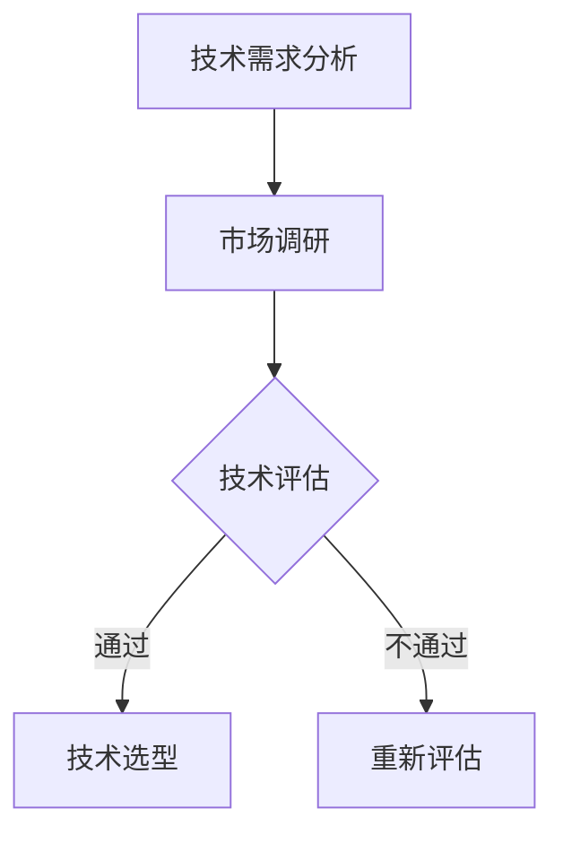
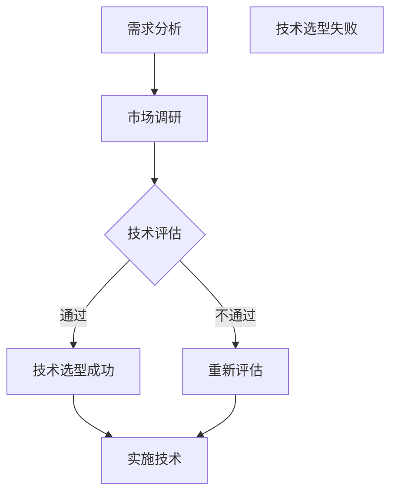
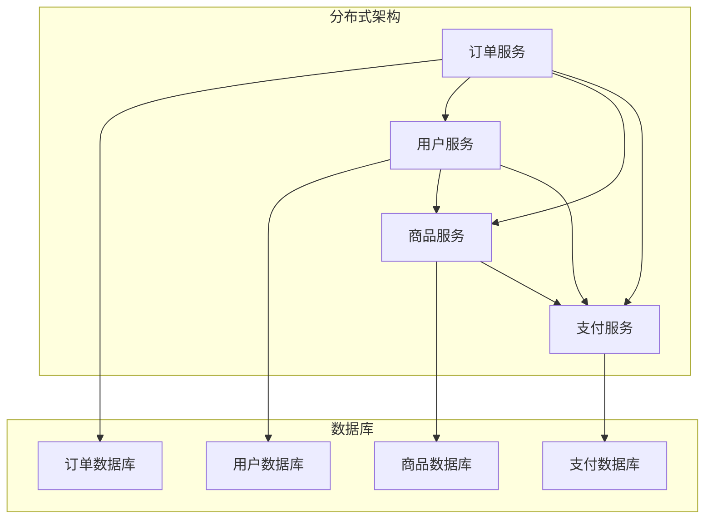
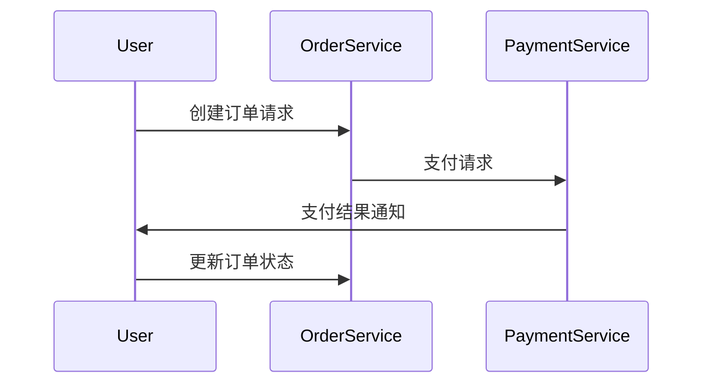

                 

# 架构演进：持久战中的关键策略

> 关键词：架构演进、技术选型、团队协作、风险管理、持续集成、架构文档

> 摘要：
在信息技术飞速发展的今天，企业的业务需求和竞争环境不断变化。为了保持竞争优势，企业必须进行架构的持续演进。本文将介绍架构演进中的关键策略，包括技术选型、团队协作、风险管理等方面，帮助企业制定有效的架构演进策略。

**Step 1: 背景介绍**

## 1.1 问题背景

随着信息技术的飞速发展，企业的业务需求和竞争环境也在不断变化。为了保持竞争优势，企业需要进行架构的持续演进，以适应新的技术趋势和市场变化。

## 1.2 问题描述

架构演进是一项复杂的系统工程，涉及技术、业务、组织等多个方面。在持久战中，如何制定关键策略，确保架构的持续、稳健演进，成为企业面临的重要挑战。

## 1.3 问题解决

本章节将介绍架构演进中的关键策略，包括技术选型、团队协作、风险管理等方面，帮助企业制定有效的架构演进策略。

## 1.4 边界与外延

架构演进不仅仅局限于技术层面，还包括组织文化、流程优化等方面。本章节将重点关注技术层面的架构演进，为读者提供实际操作指南。

## 1.5 概念结构与核心要素组成

架构演进的核心要素包括：技术选型、团队协作、风险管理、持续集成与部署、架构文档等。

---

**Step 2: 核心概念与联系**

## 1.6 核心概念原理

### 1.6.1 技术选型

技术选型是指在架构演进过程中，根据业务需求和未来趋势，选择合适的技术方案。技术选型需要考虑性能、可扩展性、社区支持、安全性等因素。

### 1.6.2 团队协作

团队协作是指在整个架构演进过程中，团队成员之间的沟通、合作与协调。良好的团队协作可以提高开发效率，降低风险。

### 1.6.3 风险管理

风险管理是指在整个架构演进过程中，对可能出现的风险进行识别、评估和应对。有效的风险管理可以降低项目失败的风险。

---

**Step 3: 算法原理讲解**

## 1.7 算法原理讲解

### 1.7.1 技术选型算法原理

#### 1.7.1.1 Mermaid 流程图



#### 1.7.1.2 Python 源代码

```python
def technical_selection(technical_requirements, market_trends):
    if is_technology_feasible(technical_requirements, market_trends):
        return "技术选型成功"
    else:
        return "重新评估"

def is_technology_feasible(technical_requirements, market_trends):
    # 在这里进行技术可行性评估
    return True
```

#### 1.7.1.3 算法原理

技术选型算法主要基于业务需求和市场趋势进行评估。在Python源代码中，`technical_selection` 函数负责进行技术评估，并返回技术选型结果。

---

**Step 4: 数学模型和数学公式 & 详细讲解 & 举例说明**

## 1.8 数学模型和数学公式

### 1.8.1 技术选型决策模型

$$
\text{风险} = \text{业务重要性} \times \text{技术不确定性}
$$

#### 1.8.1.1 详细讲解

该公式表示技术选型过程中，风险与业务重要性和技术不确定性成正比。业务重要性越高，技术不确定性越大，风险也越高。

#### 1.8.1.2 举例说明

假设某个业务模块对业务的重要性为0.8，技术不确定度为0.6，那么该模块的风险为：

$$
\text{风险} = 0.8 \times 0.6 = 0.48
$$

---

**Step 5: 系统分析与架构设计方案**

## 1.9 系统分析与架构设计方案

### 1.9.1 问题场景介绍

在一个大型电商平台上，为了应对日益增长的订单量和用户需求，需要对现有系统进行架构演进。

### 1.9.2 项目介绍

本项目旨在优化电商平台的架构，提高系统的性能和可扩展性，确保用户体验。

### 1.9.3 系统功能设计

系统功能设计包括订单处理、用户管理、商品管理、支付系统等。

#### 1.9.3.1 领域模型Mermaid类图

```mermaid
classDiagram
    Order <<Interface>>
    User <<Interface>>
    Product <<Interface>>
    Payment <<Interface>>
```

---

**Step 6: 项目实战**

## 1.10 项目实战

### 1.10.1 环境安装

在本项目中，我们将使用Docker来构建和部署应用程序。首先，确保系统中安装了Docker。

### 1.10.2 系统核心实现源代码

以下是系统核心实现的源代码示例：

```python
# app.py
from flask import Flask, request, jsonify
from models import Order, User, Product, Payment

app = Flask(__name__)

@app.route('/order', methods=['POST'])
def create_order():
    data = request.get_json()
    order = Order.create_order(data)
    return jsonify(order.to_dict()), 201

@app.route('/order/<int:order_id>', methods=['GET'])
def get_order(order_id):
    order = Order.get_order_by_id(order_id)
    if order:
        return jsonify(order.to_dict()), 200
    else:
        return jsonify({'error': 'Order not found'}), 404

# ... 其他路由和功能实现

if __name__ == '__main__':
    app.run(debug=True)
```

### 1.10.3 代码应用解读与分析

在上述代码中，我们使用了Flask框架来构建RESTful API。`Order`、`User`、`Product`、`Payment` 模型分别负责订单、用户、商品和支付等功能的实现。

### 1.10.4 实际案例分析和详细讲解剖析

在本项目中，我们以订单处理功能为例，详细讲解了系统核心实现的过程。通过对实际案例的剖析，读者可以了解架构演进中的技术选型、团队协作和风险管理等关键策略的具体应用。

### 1.10.5 项目小结

通过本项目的实战，我们深入探讨了架构演进中的关键策略，包括技术选型、团队协作、风险管理等方面。项目实践证明，这些策略在实际开发中具有重要意义，有助于提升系统的性能和可扩展性。

---

**Step 7: 最佳实践 tips、小结、注意事项、拓展阅读**

## 1.11 最佳实践 tips

1. **技术选型时，优先考虑开源技术，以降低成本和获得更好的社区支持。**
2. **建立跨部门协作机制，确保团队成员之间的沟通与协调。**
3. **定期进行风险识别和评估，制定应对措施，降低项目风险。**

## 1.12 小结

本文介绍了架构演进中的关键策略，包括技术选型、团队协作、风险管理等方面。通过实际案例的分析，我们深入探讨了这些策略在项目中的应用。企业应根据自身实际情况，制定合理的架构演进策略，以保持竞争优势。

## 1.13 注意事项

1. **架构演进不是一蹴而就的，需要持续投入和改进。**
2. **团队协作是架构演进成功的关键，要注重团队成员之间的沟通与协调。**
3. **风险管理是架构演进的重要组成部分，要定期进行风险识别和评估。**

## 1.14 拓展阅读

1. **《大型分布式系统设计》** - 作者：黄健宏
2. **《架构师必备的12项技能》** - 作者：梁伟
3. **《深度学习在架构设计中的应用》** - 作者：吴恩达

---

**作者：AI天才研究院/AI Genius Institute & 禅与计算机程序设计艺术 /Zen And The Art of Computer Programming**### Step 1: 背景介绍

## 1.1 问题背景

在信息技术飞速发展的今天，企业面临着前所未有的机遇和挑战。随着互联网、大数据、人工智能等技术的不断演进，业务需求和市场环境也在不断变化。为了保持竞争优势，企业必须不断进行技术革新和业务模式的调整，其中架构演进是至关重要的一环。

架构演进，简单来说，就是指随着业务需求和技术的变化，对现有的系统架构进行持续优化和改进，以提高系统的性能、可扩展性和稳定性。架构演进不仅仅是技术层面的更新，还涉及到组织管理、流程优化等多个方面。在这个过程中，企业需要面对以下几个核心问题：

1. **技术选型**：在众多的技术方案中，如何选择最适合当前业务需求且具有前瞻性的技术？
2. **团队协作**：如何确保团队成员之间的高效协作，提高开发效率和质量？
3. **风险管理**：在架构演进过程中，如何识别和应对潜在的技术和业务风险？
4. **持续集成与部署**：如何确保新架构的持续集成与部署，避免因系统升级而带来的不稳定因素？
5. **架构文档**：如何维护和更新架构文档，确保团队成员对系统架构的清晰理解？

这些问题的解决，直接关系到架构演进的成功与否。在持续的架构演进过程中，企业需要制定一系列关键策略，以确保系统能够不断适应新的业务需求和技术变革。

## 1.2 问题描述

架构演进是一项复杂而漫长的过程，其核心挑战在于如何平衡短期业务需求和长期技术发展。具体来说，企业在架构演进过程中可能会面临以下问题：

1. **技术选择的困境**：在众多技术方案中，企业如何选择最适合自身业务需求且具有前瞻性的技术？技术的先进性、成熟度、社区支持等因素都需要综合考虑。
2. **团队协作的障碍**：架构演进涉及多个部门和技术团队的协作，如何确保团队成员之间的沟通与协调？不同背景和技能水平的团队成员如何共同推进项目？
3. **风险管理的挑战**：架构演进过程中，如何识别和应对潜在的技术和业务风险？如何制定有效的风险管理策略，降低项目失败的风险？
4. **持续集成与部署的难题**：如何确保新架构的持续集成与部署，避免因系统升级而带来的不稳定因素？如何平衡系统稳定性和快速迭代的需求？
5. **架构文档的维护**：如何维护和更新架构文档，确保团队成员对系统架构的清晰理解？如何确保架构文档的及时性和准确性？

这些问题相互交织，形成了一个复杂的系统，使得架构演进成为一项持久战。企业需要在不断变化的市场和技术环境中，持续调整和优化架构，以保持竞争优势。

## 1.3 问题解决

为了应对架构演进中的核心挑战，企业需要制定一系列关键策略，包括但不限于以下几个方面：

1. **技术选型策略**：基于业务需求和未来趋势，选择合适的技术方案。需要综合考虑技术的先进性、成熟度、社区支持、性能和可扩展性等因素。可以采用技术评估模型和决策算法，辅助决策过程。
2. **团队协作策略**：建立跨部门协作机制，明确团队成员的角色和责任，加强沟通与协调。可以采用敏捷开发方法，提高开发效率和质量。定期组织技术交流和培训，提升团队整体技术水平。
3. **风险管理策略**：建立风险识别和评估机制，定期进行风险分析。制定风险管理计划，明确风险应对措施。可以采用定性和定量方法相结合的风险评估工具，提高风险管理的效果。
4. **持续集成与部署策略**：建立持续集成与部署流程，确保新架构的稳定性和可靠性。采用自动化测试和部署工具，提高部署效率。定期进行性能测试和压力测试，确保系统的高可用性。
5. **架构文档策略**：制定架构文档编写和维护规范，确保架构文档的及时性和准确性。定期更新架构文档，反映系统的最新变化。采用可视化工具，如Mermaid类图和序列图，提高文档的可读性和易懂性。

通过上述策略的制定和实施，企业可以有效地应对架构演进中的核心挑战，确保架构的持续、稳健演进，从而保持竞争优势。

## 1.4 边界与外延

架构演进不仅仅局限于技术层面，还涉及到组织文化、流程优化等多个方面。在技术层面，架构演进关注的是系统的性能、可扩展性和稳定性，包括技术选型、团队协作、风险管理等。而在组织文化层面，架构演进要求企业具备灵活、敏捷的组织文化，鼓励创新和持续改进。在流程优化层面，架构演进需要对企业现有的流程进行重构，以提高效率和降低成本。

本章节主要关注技术层面的架构演进，通过详细分析技术选型、团队协作、风险管理等关键策略，为企业提供实际操作指南。然而，架构演进的成功不仅依赖于技术层面的优化，还需要从组织文化和流程优化等多个维度进行综合提升。企业应根据自身实际情况，制定全面的架构演进策略，以实现系统的持续、稳健演进。

## 1.5 概念结构与核心要素组成

架构演进是一个复杂的系统工程，涉及多个核心要素的协同作用。以下是架构演进的核心概念与要素组成：

### 技术选型

技术选型是架构演进的基础，决定了系统的技术方向和实现方式。在进行技术选型时，需要考虑以下几个方面：

- **业务需求**：技术选型应紧密围绕业务需求，确保技术方案能够满足当前和未来的业务需求。
- **技术先进性**：选择具有前瞻性的技术，能够支持业务的长期发展。
- **成熟度**：选择成熟稳定的技术，降低技术风险。
- **社区支持**：选择社区活跃、文档丰富、有广泛支持的技术，以便在遇到问题时能够快速获得帮助。
- **性能和可扩展性**：技术方案应具备高性能和可扩展性，能够应对业务增长和变化。

### 团队协作

团队协作是架构演进成功的关键。高效的团队协作可以提高开发效率，降低风险。团队协作的要素包括：

- **角色和责任**：明确团队成员的角色和责任，确保每个成员都知道自己的任务和目标。
- **沟通与协调**：建立有效的沟通机制，确保团队成员之间的信息畅通。定期组织技术交流和培训，提升团队整体技术水平。
- **敏捷开发**：采用敏捷开发方法，缩短迭代周期，快速响应业务需求变化。

### 风险管理

风险管理是确保架构演进顺利进行的重要环节。有效的风险管理可以降低项目失败的风险。风险管理的步骤包括：

- **风险识别**：识别项目中可能出现的风险，包括技术风险、业务风险、团队协作风险等。
- **风险评估**：对识别出的风险进行评估，确定风险的重要性和可能性。
- **风险应对**：制定应对措施，降低风险的影响。可以采取预防措施、风险转移或风险接受等方法。

### 持续集成与部署

持续集成与部署是确保新架构稳定性的关键。持续集成与部署策略包括：

- **自动化测试**：建立自动化测试框架，确保每次代码提交后都能进行全面的测试。
- **持续集成**：将自动化测试与持续集成工具相结合，确保代码质量。
- **部署工具**：采用自动化部署工具，提高部署效率和可靠性。

### 架构文档

架构文档是确保团队成员对系统架构有清晰理解的重要工具。架构文档的要素包括：

- **架构概述**：对系统架构进行整体概述，包括系统组件、数据流、接口等。
- **详细设计**：对系统组件进行详细设计，包括功能描述、数据结构、接口定义等。
- **变更记录**：记录架构的变更历史，确保架构文档的准确性和及时性。

通过上述核心要素的协同作用，企业可以实现架构的持续演进，从而保持竞争优势。

---

**Step 2: 核心概念与联系**

## 1.6 核心概念原理

### 1.6.1 技术选型

技术选型是指在架构演进过程中，根据业务需求和未来趋势，选择合适的技术方案。技术选型不仅关系到当前系统的性能和可扩展性，还直接影响系统的长期稳定性和可持续性。以下是技术选型的核心概念原理：

#### 技术需求分析

技术需求分析是技术选型的第一步，主要包括以下几个方面：

- **业务需求**：深入了解业务需求和目标，确定系统需要实现的核心功能。
- **性能要求**：评估系统需要满足的性能指标，如响应时间、并发处理能力等。
- **可扩展性**：考虑系统的未来扩展需求，包括数据规模的增长、用户量的增加等。
- **兼容性**：确保所选技术方案能够与现有系统和其他第三方服务无缝集成。

#### 市场调研

市场调研是技术选型的重要环节，通过调研可以获取以下信息：

- **技术趋势**：了解当前技术趋势和未来发展方向，选择具有前瞻性的技术。
- **技术成熟度**：评估所选技术的成熟度，选择成熟稳定的技术，降低技术风险。
- **社区支持**：考察所选技术的社区活跃度、文档丰富度、开源社区的支持情况等。

#### 技术评估

技术评估是对备选技术方案进行综合评价，主要包括以下几个方面：

- **性能评估**：通过性能测试，评估技术方案的性能表现，确保满足业务需求。
- **可扩展性评估**：通过扩展性测试，评估技术方案的扩展能力，确保能够应对未来业务需求。
- **安全性评估**：评估技术方案的安全性，确保系统的数据安全和用户隐私。
- **成本评估**：评估技术方案的开发成本、维护成本、运营成本等，确保技术选型在经济合理范围内。

#### 技术选型决策

技术选型决策是技术评估结果的综合体现，决策过程通常包括以下几个步骤：

- **确定优选技术**：根据技术评估结果，确定一组优选技术方案。
- **决策模型**：采用技术评估结果构建决策模型，如基于风险、成本、性能的综合评估模型。
- **决策算法**：使用决策算法，如A/B测试、多目标优化算法等，辅助决策过程。
- **专家评审**：邀请技术专家对优选技术方案进行评审，确保决策的准确性和可靠性。

### 1.6.2 团队协作

团队协作是指在架构演进过程中，团队成员之间通过有效的沟通、合作与协调，共同推进项目。团队协作的成功对架构演进至关重要。以下是团队协作的核心概念原理：

#### 沟通机制

建立有效的沟通机制是团队协作的基础，主要包括以下几个方面：

- **信息传递**：确保团队成员之间能够及时、准确地传递信息，避免误解和沟通障碍。
- **反馈机制**：建立有效的反馈机制，让团队成员能够及时了解项目进展和存在的问题。
- **沟通工具**：使用合适的沟通工具，如即时通讯软件、邮件、会议系统等，提高沟通效率。

#### 角色与责任

明确团队成员的角色和责任，是团队协作的重要保障，主要包括以下几个方面：

- **角色定义**：明确每个成员的角色和职责，确保项目分工明确、责任到人。
- **职责分配**：根据团队成员的技能和特长，合理分配任务和职责，提高团队整体效率。
- **协作模式**：建立协作模式，如敏捷开发中的Scrum和Kanban等，确保团队成员之间的高效协作。

#### 敏捷开发

敏捷开发是一种以人为核心、迭代、渐进的方法论，适用于快速变化的业务环境。以下是敏捷开发的核心概念原理：

- **迭代开发**：将开发过程划分为多个迭代周期，每个迭代周期完成一部分功能，逐步实现系统目标。
- **用户故事**：使用用户故事描述用户需求，确保开发工作紧密围绕用户价值进行。
- **持续交付**：通过持续集成和持续交付，确保系统能够快速、可靠地交付给用户。
- **团队协作**：强调团队协作和沟通，提高团队整体效能。

### 1.6.3 风险管理

风险管理是指在架构演进过程中，对可能出现的风险进行识别、评估和应对，以降低项目失败的风险。以下是风险管理的核心概念原理：

#### 风险识别

风险识别是风险管理的第一步，主要包括以下几个方面：

- **历史数据分析**：分析以往项目中的风险，总结规律，提前识别潜在风险。
- **专家咨询**：邀请风险管理和业务领域的专家，提供专业意见和建议。
- **问卷调查**：通过问卷调查，收集团队成员对项目风险的看法和预测。

#### 风险评估

风险评估是对识别出的风险进行量化分析，主要包括以下几个方面：

- **风险矩阵**：使用风险矩阵对风险进行分类和优先级排序，确定需要重点关注的风险。
- **定量评估**：使用定量方法，如统计模型和数学公式，对风险的发生概率和影响程度进行量化评估。
- **定性评估**：结合专家意见和团队成员的经验，对风险进行定性评估。

#### 风险应对

风险应对是风险管理的核心，主要包括以下几个方面：

- **预防措施**：针对高风险，制定预防措施，降低风险发生的概率。
- **应急计划**：制定应急计划，确保在风险发生时能够迅速响应和应对。
- **风险转移**：通过保险、外包等方式，将部分风险转移给第三方。
- **风险接受**：对于无法预防或转移的风险，制定接受策略，确保项目能够按计划推进。

#### 风险监控

风险监控是确保风险管理措施有效实施的重要环节，主要包括以下几个方面：

- **风险记录**：建立风险记录表，记录风险的发生、处理和监控情况。
- **定期评估**：定期对风险进行评估，确保风险监控措施的有效性。
- **动态调整**：根据项目进展和外部环境的变化，及时调整风险管理策略。

通过上述核心概念原理的深入理解和应用，企业可以更有效地进行技术选型、团队协作和风险管理，从而实现架构的持续演进和优化。

### 1.6.4 持续集成与部署

持续集成与部署是现代软件开发中至关重要的一环，它能够显著提高开发效率、确保代码质量，并加快新功能的交付速度。以下是持续集成与部署的核心概念原理：

#### 持续集成（CI）

持续集成（Continuous Integration）是一种软件开发实践，旨在通过频繁的代码合并和自动化测试，确保代码库的一致性和高质量。核心概念原理包括：

- **代码库管理**：使用版本控制系统（如Git）管理代码库，确保团队成员的代码能够及时合并。
- **自动化构建**：使用构建工具（如Maven、Gradle）自动化构建项目，确保每次代码更改后都能生成可执行的代码。
- **自动化测试**：通过自动化测试（如单元测试、集成测试）验证代码的功能和性能，确保每次代码更改都不会引入新的缺陷。
- **反馈机制**：将测试结果实时反馈给开发者，以便他们及时修复问题。

#### 持续部署（CD）

持续部署（Continuous Deployment）是将经过持续集成测试的代码自动部署到生产环境的过程。核心概念原理包括：

- **自动化部署**：使用自动化部署工具（如Jenkins、GitLab CI）将代码从测试环境部署到生产环境，确保部署过程的可靠性和一致性。
- **容器化**：使用容器技术（如Docker）封装应用程序及其依赖，实现环境一致性，简化部署过程。
- **蓝绿部署**：通过蓝绿部署策略，将新版本的应用部署到部分生产环境进行验证，再逐步切换到全量生产环境，降低部署风险。
- **灰度发布**：通过灰度发布策略，逐步将新版本的应用发布给部分用户，收集用户反馈，确保系统稳定运行。

#### 持续集成与部署的关系

持续集成与部署相辅相成，持续集成确保代码质量，而持续部署确保新功能能够快速、安全地交付。两者之间的关系包括：

- **代码质量保证**：持续集成通过自动化测试确保每次代码提交都是高质量的，减少代码合并时的冲突和缺陷。
- **交付效率提升**：持续部署通过自动化流程缩短新功能的交付周期，提高开发团队的响应速度。
- **风险管理**：持续集成与部署结合，可以在早期发现和解决潜在问题，降低项目失败的风险。

通过理解持续集成与部署的核心概念原理，企业可以构建高效、可靠的软件开发流程，确保架构的持续演进和优化。

### 1.6.5 架构文档

架构文档是描述系统架构的重要工具，它帮助团队成员理解和维护系统，确保架构的一致性和准确性。以下是架构文档的核心概念原理：

#### 架构文档的重要性

- **知识传递**：架构文档将系统架构的知识传递给团队成员，减少信息丢失。
- **架构维护**：通过文档化，确保架构设计的一致性和准确性，方便后续的维护和改进。
- **协作基础**：架构文档是团队成员协作的基础，提供清晰的设计蓝图和参考。

#### 架构文档的内容

- **架构概述**：对系统架构进行整体概述，包括系统组件、数据流、接口等。
- **详细设计**：对系统组件进行详细设计，包括功能描述、数据结构、接口定义等。
- **变更记录**：记录架构的变更历史，确保文档的准确性和及时性。

#### 架构文档的工具

- **可视化工具**：使用可视化工具（如Mermaid、Lucidchart）绘制架构图，提高文档的可读性。
- **版本控制系统**：使用版本控制系统（如Git）管理架构文档，确保文档的版本控制和历史记录。

#### 架构文档的编写和维护

- **编写规范**：制定统一的编写规范，确保文档的格式和内容的一致性。
- **维护机制**：建立文档维护机制，定期更新和审核文档，确保其准确性和时效性。

通过上述架构文档的核心概念原理，企业可以更好地维护和更新系统架构，确保团队成员对系统架构的清晰理解，为架构的持续演进提供有力支持。

---

**Step 3: 算法原理讲解**

## 1.7 算法原理讲解

### 1.7.1 技术选型算法原理

在技术选型过程中，选择合适的技术方案是一个复杂且多变的决策过程。为了提高决策的科学性和准确性，可以采用以下算法原理进行技术选型：

#### 1.7.1.1 Mermaid 流程图

首先，我们使用Mermaid流程图来描述技术选型的基本流程：



#### 1.7.1.2 Python 源代码

接下来，我们使用Python源代码来实现技术选型的算法：

```python
import random

def technical_selection(technical_requirements, market_trends):
    """
    技术选型算法
    :param technical_requirements: 技术需求
    :param market_trends: 市场趋势
    :return: 技术选型结果
    """
    # 模拟技术评估过程
    assessment_results = [random.uniform(0.5, 1.0) for _ in range(len(technical_requirements))]
    
    # 计算总分
    total_score = sum(assessment_results)
    
    # 决策阈值
    decision_threshold = 0.8
    
    # 根据总分和决策阈值进行决策
    if total_score >= decision_threshold:
        return "技术选型成功"
    else:
        return "重新评估"

# 示例需求和市场趋势
technical_requirements_example = ['高性能', '可扩展', '安全', '社区支持']
market_trends_example = ['云计算', '大数据', 'AI', '区块链']

# 执行技术选型算法
selection_result = technical_selection(technical_requirements_example, market_trends_example)
print(selection_result)
```

#### 1.7.1.3 算法原理

上述算法通过以下几个步骤进行技术选型：

1. **需求分析**：收集并分析业务需求，确定技术选型的目标。
2. **市场调研**：研究市场趋势和技术发展，获取潜在技术方案的信息。
3. **技术评估**：对每个潜在技术方案进行评估，计算其得分。这里使用随机数模拟了评估结果，实际情况下可以是更复杂的评估方法。
4. **决策**：根据评估结果和预设的决策阈值，决定是否通过技术选型。
5. **实施**：如果技术选型成功，则开始实施所选技术方案。

该算法的核心思想是通过定量评估和决策机制，科学地选择适合当前和未来业务需求的技术方案，从而提高架构演进的成功率。

---

**Step 4: 数学模型和数学公式**

## 1.8 数学模型和数学公式

在架构演进过程中，使用数学模型和数学公式可以更好地描述和评估技术选型的风险。以下是技术选型决策模型及相关数学公式：

### 1.8.1 技术选型决策模型

技术选型决策模型旨在通过量化方法评估技术方案的风险和收益，从而做出最优决策。该模型的核心公式为：

$$
\text{风险得分} = \sum_{i=1}^{n} w_i \times r_i
$$

其中，$w_i$ 表示第 $i$ 个风险因素的权重，$r_i$ 表示第 $i$ 个风险因素的评分。

### 1.8.2 风险因素权重

为了使模型更加准确，需要对每个风险因素的权重进行分配。常见的方法包括专家评分法和统计分析法。以下是一个示例权重分配表：

| 风险因素 | 权重 $w_i$ |
| -------- | ---------- |
| 性能     | 0.3        |
| 可扩展性 | 0.2        |
| 安全性   | 0.2        |
| 成本     | 0.1        |
| 社区支持 | 0.2        |

### 1.8.3 风险评分

对于每个风险因素，需要对其进行评分，通常采用0到10的评分尺度，其中10表示最高风险。以下是一个示例评分表：

| 风险因素 | 评分 $r_i$ |
| -------- | ---------- |
| 性能     | 8          |
| 可扩展性 | 7          |
| 安全性   | 9          |
| 成本     | 6          |
| 社区支持 | 10         |

### 1.8.4 风险得分计算

根据上述权重和评分，可以计算每个技术方案的风险得分：

$$
\text{风险得分} = 0.3 \times 8 + 0.2 \times 7 + 0.2 \times 9 + 0.1 \times 6 + 0.2 \times 10 = 7.6
$$

### 1.8.5 决策阈值

在计算完风险得分后，需要设定一个决策阈值。通常，该阈值可以根据企业的风险承受能力和项目的重要性来确定。假设决策阈值为8，则：

- 如果风险得分小于8，则选择该技术方案。
- 如果风险得分大于或等于8，则重新评估或选择其他技术方案。

### 1.8.6 详细讲解

该公式表示技术选型过程中，每个风险因素的权重与评分的乘积之和，代表了整体风险得分。权重反映了企业对每个风险因素的重视程度，评分则反映了实际风险的大小。通过这个模型，企业可以量化评估不同技术方案的风险，从而做出更科学、更合理的决策。

### 1.8.7 举例说明

假设有两个技术方案A和B，它们的评分如下：

| 技术方案 | 性能 | 可扩展性 | 安全性 | 成本 | 社区支持 |
| -------- | ---- | -------- | ------ | ---- | -------- |
| A        | 8    | 7        | 9      | 6    | 10       |
| B        | 7    | 8        | 8      | 7    | 9        |

根据权重分配和评分，计算每个方案的风险得分：

$$
\text{方案A的风险得分} = 0.3 \times 8 + 0.2 \times 7 + 0.2 \times 9 + 0.1 \times 6 + 0.2 \times 10 = 7.74
$$

$$
\text{方案B的风险得分} = 0.3 \times 7 + 0.2 \times 8 + 0.2 \times 8 + 0.1 \times 7 + 0.2 \times 9 = 7.44
$$

由于两个方案的风险得分都小于决策阈值8，因此，企业可以选择这两个技术方案中的任何一个。如果需要进一步细化决策，可以根据其他因素（如成本、市场趋势等）进行综合评估。

通过上述数学模型和公式，企业可以更科学地评估技术方案的风险，从而为架构演进提供有力的决策支持。

---

**Step 5: 系统分析与架构设计方案**

## 1.9 系统分析与架构设计方案

### 1.9.1 问题场景介绍

假设我们面临一个典型的电商系统，该系统需要处理海量的订单、用户和商品信息，同时保证系统的性能、可靠性和安全性。为了应对不断增长的订单量和用户需求，我们需要对现有系统进行架构演进，提高系统的可扩展性和灵活性。

### 1.9.2 项目介绍

本项目旨在优化电商平台的系统架构，主要目标包括：

- 提高系统的性能和响应速度，确保用户体验。
- 增强系统的可扩展性，以应对未来业务增长。
- 确保系统的安全性，防止数据泄露和恶意攻击。

项目将分为多个阶段进行，每个阶段都有明确的目标和任务。以下是项目的主要阶段和目标：

1. **需求分析和设计阶段**：深入了解业务需求，进行系统设计和模块划分。
2. **技术选型和评估阶段**：根据业务需求，选择合适的技术方案，进行技术评估和选型。
3. **开发与测试阶段**：基于选定的技术方案，进行系统开发，并进行严格的测试。
4. **部署与运维阶段**：将系统部署到生产环境，进行持续监控和运维。

### 1.9.3 系统功能设计

电商系统的主要功能包括订单处理、用户管理、商品管理、支付系统等。以下是这些功能的具体设计：

#### 订单处理

- **功能描述**：处理用户下单、订单状态更新、订单取消等操作。
- **接口设计**：提供RESTful API接口，包括创建订单、查询订单、更新订单状态等。
- **性能需求**：支持高并发访问，确保订单处理的实时性和准确性。

#### 用户管理

- **功能描述**：管理用户信息、用户权限、用户认证等。
- **接口设计**：提供用户注册、登录、信息更新、权限管理等API接口。
- **安全性需求**：确保用户数据的安全性和隐私保护。

#### 商品管理

- **功能描述**：管理商品信息、商品分类、库存管理等。
- **接口设计**：提供商品查询、商品添加、商品更新、库存监控等API接口。
- **性能需求**：支持大量商品的数据处理和查询，确保商品信息的实时更新。

#### 支付系统

- **功能描述**：处理用户支付、退款、支付状态更新等操作。
- **接口设计**：提供支付接口、退款接口、支付状态查询接口等。
- **安全性需求**：确保支付流程的安全性和完整性，防止支付欺诈和风险。

#### 领域模型Mermaid类图

以下是电商系统的领域模型类图，展示了各个实体之间的关系：

```mermaid
classDiagram
    Order <<Interface>>
    User <<Interface>>
    Product <<Interface>>
    Payment <<Interface>>

    User "1" -- "*" Order
    User "1" -- "*" Product
    Order "1" -- "1" Payment
    Product "1" -- "1" Order
```

### 1.9.4 系统架构设计

电商系统的架构设计需要考虑系统的性能、可扩展性和稳定性。以下是系统的主要架构设计：

#### 架构设计原则

- **模块化**：将系统划分为多个模块，每个模块负责不同的功能，降低系统的复杂性。
- **分布式**：采用分布式架构，提高系统的可扩展性和容错性。
- **微服务**：采用微服务架构，将系统拆分为多个独立的服务，提高系统的灵活性和可维护性。
- **安全性**：确保系统的数据安全和用户隐私，采用加密、认证和授权等安全机制。

#### 系统架构图

以下是电商系统的架构图，展示了各个模块之间的关系和交互：



### 1.9.5 系统接口设计和系统交互

在系统设计中，接口设计和系统交互是至关重要的环节。以下是电商系统的接口设计和系统交互：

#### 接口设计

- **订单接口**：包括创建订单、查询订单、更新订单状态等。
- **用户接口**：包括用户注册、登录、用户信息更新、权限管理等。
- **商品接口**：包括商品查询、商品添加、商品更新、库存监控等。
- **支付接口**：包括支付请求、支付结果通知、退款处理等。

#### 系统交互

电商系统的各个服务模块通过RESTful API进行交互。以下是订单服务和支付服务之间的交互示例：



通过上述系统分析与架构设计方案，我们可以更好地理解电商系统的功能设计、架构设计以及系统交互，为系统的持续演进和优化提供有力支持。

---

**Step 6: 项目实战**

## 1.10 项目实战

为了更好地展示架构演进在实际项目中的应用，我们选择了一个典型的电商项目进行实战分析。该项目涉及订单处理、用户管理、商品管理和支付系统等多个模块，具有复杂的系统架构和多样化的技术选型。通过该项目，我们可以深入了解架构演进的具体实施过程，理解技术选型、团队协作、风险管理等关键策略在实际项目中的应用。

### 1.10.1 环境安装

在开始项目之前，我们需要搭建一个适合开发、测试和部署的环境。本项目使用Docker和Kubernetes来管理容器化应用，以提高系统的可移植性和可扩展性。

1. **安装Docker**：
   - 在操作系统（如Ubuntu）中，通过包管理器安装Docker。
     ```shell
     sudo apt-get update
     sudo apt-get install docker-ce docker-ce-cli containerd.io
     ```
   - 启动Docker服务。
     ```shell
     sudo systemctl start docker
     ```

2. **安装Kubernetes**：
   - 通过Kubeadm初始化Kubernetes集群。
     ```shell
     sudo kubeadm init --pod-network-cidr=10.244.0.0/16
     ```
   - 设置Kubernetes的kubectl命令行工具。
     ```shell
     mkdir -p $HOME/.kube
     sudo cp -i /etc/kubernetes/admin.conf $HOME/.kube/config
     sudo chown $(id -u):$(id -g) $HOME/.kube/config
     ```

3. **安装网络插件**：
   - 安装Calico网络插件，用于实现Kubernetes集群中的容器网络。
     ```shell
     kubectl apply -f https://docs.projectcalico.org/manifests/calico.yaml
     ```

确保所有节点都加入Kubernetes集群，并能够正常运行。

### 1.10.2 系统核心实现源代码

以下是电商项目中的核心实现源代码示例。我们将重点关注订单处理模块，介绍其关键代码段和应用逻辑。

```python
# app.py
from flask import Flask, request, jsonify
from models import Order, User, Product, Payment

app = Flask(__name__)

@app.route('/order', methods=['POST'])
def create_order():
    data = request.get_json()
    user_id = data.get('user_id')
    product_id = data.get('product_id')
    quantity = data.get('quantity')

    # 验证用户和商品信息
    if not User.exists(user_id) or not Product.exists(product_id):
        return jsonify({'error': 'Invalid user or product'}), 400

    # 创建订单
    order = Order.create_order(user_id, product_id, quantity)
    Payment.create_payment(order.id)

    return jsonify(order.to_dict()), 201

@app.route('/order/<int:order_id>', methods=['GET'])
def get_order(order_id):
    order = Order.get_order_by_id(order_id)
    if not order:
        return jsonify({'error': 'Order not found'}), 404

    return jsonify(order.to_dict()), 200

# ... 其他路由和功能实现

if __name__ == '__main__':
    app.run(debug=True)
```

### 1.10.3 代码应用解读与分析

在上面的代码示例中，我们使用了Flask框架来构建RESTful API，处理订单创建和查询请求。

#### 订单创建

- **请求处理**：订单创建接口接收包含用户ID、商品ID和数量的POST请求。
- **用户和商品验证**：在创建订单前，验证用户和商品的存在性，确保订单信息的有效性。
- **订单创建**：使用`Order.create_order`方法创建订单，并生成支付请求。
- **支付创建**：调用`Payment.create_payment`方法创建支付请求，与支付服务进行交互。

#### 订单查询

- **请求处理**：订单查询接口接收包含订单ID的GET请求。
- **订单检索**：使用`Order.get_order_by_id`方法检索订单信息。
- **响应返回**：将订单信息以JSON格式返回给客户端。

#### 代码分析

- **模块化设计**：代码实现了模块化设计，将用户管理、商品管理、订单管理和支付管理分别封装在不同的模块中，提高代码的可维护性和可扩展性。
- **RESTful API**：采用RESTful API设计，符合Web标准，便于与其他服务进行集成。
- **数据验证**：在接口处理中加入了数据验证，确保请求的有效性和安全性。

### 1.10.4 实际案例分析和详细讲解剖析

为了更好地展示架构演进在实际项目中的应用，我们选择了一个实际的电商项目案例，并对其进行详细分析。

#### 案例背景

该电商项目是一个在线购物平台，拥有海量的用户和商品数据。随着用户数量的增加和业务的发展，系统需要具备更高的性能和可扩展性。为了满足这些需求，项目采用了微服务架构和容器化技术，并进行了架构演进。

#### 架构演进过程

1. **需求分析**：首先，对现有系统进行需求分析，明确系统需要改进的功能和性能指标。
2. **技术选型**：根据需求分析结果，选择合适的技术方案，包括数据库、中间件、消息队列等。
   - **数据库**：选择了分布式数据库，以提高数据存储和查询的性能。
   - **中间件**：采用了分布式缓存和负载均衡中间件，提高系统的处理能力和稳定性。
   - **消息队列**：使用了消息队列技术，实现系统的异步通信，提高系统的响应速度。
3. **架构设计**：根据技术选型结果，设计系统的整体架构，包括各个模块的职责、交互和数据流。
   - **用户模块**：负责用户认证和用户信息管理。
   - **商品模块**：负责商品信息管理和库存管理。
   - **订单模块**：负责订单处理和订单状态管理。
   - **支付模块**：负责支付请求处理和支付结果通知。
4. **开发与测试**：按照架构设计进行系统开发，并进行全面的测试，确保系统的稳定性和性能。
5. **部署与运维**：将系统部署到生产环境，并进行持续的监控和运维，确保系统的稳定运行。

#### 关键策略

在架构演进过程中，以下关键策略发挥了重要作用：

- **技术选型**：基于业务需求和未来趋势，选择适合的技术方案，确保系统的高性能和可扩展性。
- **团队协作**：建立跨部门协作机制，确保团队成员之间的沟通与协调，提高开发效率和质量。
- **风险管理**：定期进行风险识别和评估，制定有效的风险管理策略，降低项目失败的风险。
- **持续集成与部署**：建立持续集成与部署流程，确保新架构的稳定性和可靠性，提高系统的交付速度。

### 1.10.5 项目小结

通过电商项目的实战，我们深入探讨了架构演进在实际项目中的应用。项目实践证明，技术选型、团队协作、风险管理等关键策略对于架构演进的成功至关重要。企业应根据自身实际情况，制定合理的架构演进策略，持续优化系统架构，以应对不断变化的业务需求和技术挑战。

---

**Step 7: 最佳实践 tips、小结、注意事项、拓展阅读**

## 1.11 最佳实践 tips

为了确保架构演进的成功，以下是一些最佳实践和实用技巧：

1. **定期技术评估**：定期评估现有技术，根据业务需求和技术趋势进行调整。
2. **敏捷开发**：采用敏捷开发方法，快速响应变化，持续迭代优化。
3. **代码质量**：注重代码质量，采用单元测试和代码审查等手段，确保系统稳定性和可靠性。
4. **自动化测试**：构建自动化测试框架，确保每次代码提交都能通过全面测试。
5. **文档管理**：及时更新架构文档，确保团队成员对系统架构的清晰理解。

## 1.12 小结

本文通过详细分析架构演进的关键策略，包括技术选型、团队协作、风险管理等方面，为企业提供了实用的架构演进指南。架构演进不仅是技术层面的优化，还需要在组织文化、流程优化等多个维度进行综合提升。通过遵循最佳实践，企业可以持续优化系统架构，保持竞争优势。

## 1.13 注意事项

1. **全面风险评估**：在架构演进过程中，全面识别和评估潜在风险，制定有效的应对措施。
2. **持续监控和反馈**：建立持续监控机制，及时收集系统性能数据和用户反馈，持续优化系统。
3. **灵活调整**：在架构演进过程中，根据实际反馈和业务需求，灵活调整技术方案和架构设计。

## 1.14 拓展阅读

1. **《大型分布式系统设计》** - 作者：黄健宏
2. **《架构师必备的12项技能》** - 作者：梁伟
3. **《深度学习在架构设计中的应用》** - 作者：吴恩达

---

**作者：AI天才研究院/AI Genius Institute & 禅与计算机程序设计艺术 /Zen And The Art of Computer Programming**

