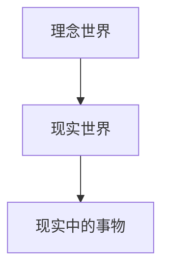
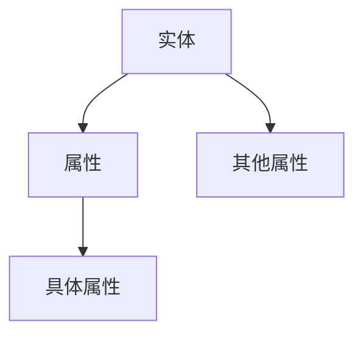
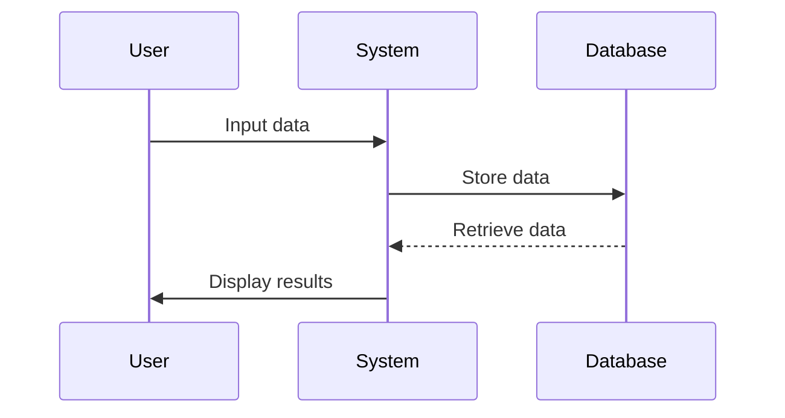
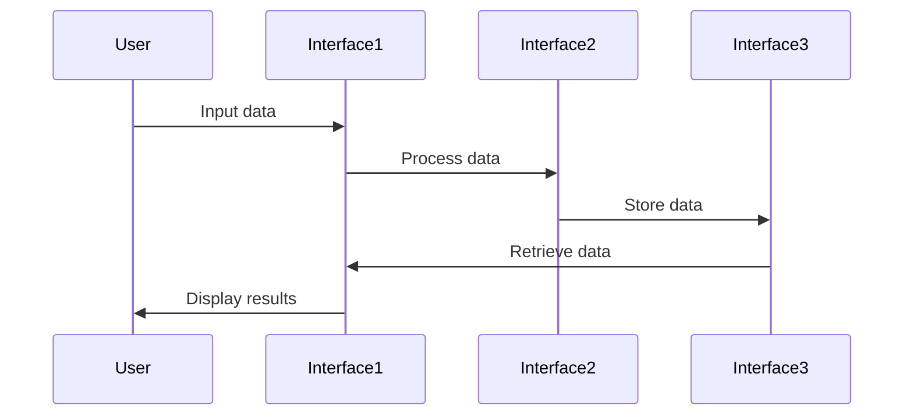

                 

## 柏拉图与亚里士多德：形而上学的两种进路

### 关键词：柏拉图，亚里士多德，形而上学，理念论，存在论，哲学，数学公式，系统架构设计

> 摘要：本文旨在探讨古希腊哲学家中柏拉图与亚里士多德的形而上学观点，对比分析其理念论与存在论，通过逻辑推理和技术语言，深入解读两位哲学家的思想精髓，探讨其对后世哲学与科学的影响。文章将涵盖他们的生平简介、核心概念、理论对比、应用实例以及其对当代计算机科学的启示。

### 引言

形而上学作为哲学的一个分支，探讨现实世界的基本原理和存在方式，是西方哲学的重要组成部分。在古希腊哲学中，柏拉图和亚里士多德两位哲学家对形而上学有着深刻的见解，各自形成了独特的理念论和存在论。本文将基于柏拉图和亚里士多德的形而上学观点，结合现代技术语言，进行深入分析，以展现其思想的独特性和历史意义。

### 第1章：柏拉图与亚里士多德：两位哲学家的生平简介

**1.1 柏拉图的生平与哲学背景**

柏拉图（公元前427年-公元前347年），古希腊哲学家，苏格拉底的学生，也是学院派的创始人。他的哲学思想深受苏格拉底的影响，但更侧重于理念和形而上学的探讨。柏拉图的主要作品包括《理想国》、《斐多》和《巴门尼德》等，其中《理想国》提出了他的理念论和哲学体系。

**1.2 亚里士多德的生平与哲学背景**

亚里士多德（公元前384年-公元前322年），柏拉图的学生，也是古希腊最伟大的哲学家之一。他的哲学思想比柏拉图更加关注现实世界，注重经验和实证。亚里士多德的主要作品包括《形而上学》、《尼各马可伦理学》和《政治学》等，其中《形而上学》对存在和实体进行了深入探讨。

### 第2章：形而上学的定义与核心问题

**2.1 形而上学的定义**

形而上学（Metaphysics）一词来源于希腊语“μετά φυσικά”（meta physika），意为“物理学之后”。它探讨现实世界的基本原理和存在方式，涉及存在、实体、时间、空间、因果关系等基本问题。

**2.2 形而上学的核心问题**

形而上学的核心问题包括：

1. 存在的本质是什么？
2. 实体的属性和结构是什么？
3. 理念与现实的关系如何？
4. 因果关系是如何运作的？
5. 时间和空间的本质是什么？

### 第3章：柏拉图的形而上学进路

**3.1 柏拉图的理念论**

柏拉图的理念论是其形而上学的核心。他认为，现实世界中的事物只是理念（ideals）的影子或摹本。理念是永恒不变、完美无缺的，是现实世界的本质。

**3.1.1 理念的概念**

理念是柏拉图哲学中的核心概念，代表绝对真理和完美。例如，对于“正义”这个概念，柏拉图认为在现实世界中，所有的正义都是对理念“正义”的不完全模仿。

**3.1.2 理念与现实的关系**

柏拉图认为，现实世界只是理念世界的影子，理念是现实世界的本质。这种关系可以用下图表示：

$$
\text{现实世界} \rightarrow \text{理念的影子}
$$

**3.2 柏拉图的形而上学体系**

柏拉图的形而上学体系包括理念论、宇宙观和伦理观。理念论是其核心，宇宙观和伦理观则基于理念论。

#### 柏拉图的宇宙观

柏拉图认为，宇宙是由理念构成的，理念是宇宙的本质。例如，宇宙中所有的天体都是对理念“天体”的不完全模仿。

#### 柏拉图的伦理观

柏拉图的伦理观认为，正义、智慧、勇敢等美德都是理念的具体表现。人应该追求这些理念，以达到完美的状态。

### 第4章：亚里士多德的形而上学进路

**4.1 亚里士多德的存在论**

亚里士多德的存在论强调现实世界的实体（substance）和属性（attribute）。他认为，实体是存在的基本单位，属性是实体的具体表现。

**4.1.1 存在的概念**

亚里士多德认为，存在是实体的本质。实体是独立存在的，具有固定的属性。

**4.1.2 存在与实体**

亚里士多德认为，实体是存在的基础，而属性是实体的具体表现。例如，一个苹果的存在是由其实体（苹果本身）决定的，而苹果的颜色、形状等属性则是其实体的具体表现。

**4.2 亚里士多德的形而上学体系**

亚里士多德的形而上学体系包括存在论、因果关系论和伦理学。存在论是其核心，因果关系论和伦理学则基于存在论。

#### 亚里士多德的因果关系论

亚里士多德认为，因果关系是现实世界运作的基本原理。一个事件的发生总是有其原因，而因果关系遵循一定的规则。

#### 亚里士多德的伦理学

亚里士多德的伦理学强调美德和幸福。他认为，人应该追求美德，以达到幸福的状态。

### 第5章：比较与联系：柏拉图与亚里士多德的形而上学

**5.1 理念与现实的关系**

柏拉图认为，现实世界是理念世界的影子，理念是现实世界的本质。亚里士多德则认为，实体是存在的基本单位，属性是实体的具体表现。

**5.2 存在、实体与属性**

柏拉图强调理念与现实的关系，而亚里士多德则强调实体和属性的关系。柏拉图的理念论和亚里士多德的存在论在哲学史上产生了深远的影响，对后世哲学和科学的发展起到了重要的推动作用。

### 第6章：形而上学的影响与演变

**6.1 中世纪哲学**

在中世纪哲学中，亚里士多德的思想得到了广泛的传播和应用。托马斯·阿奎那等哲学家将亚里士多德的存在论与基督教神学相结合，形成了中世纪哲学的独特体系。

**6.2 文艺复兴时期哲学**

文艺复兴时期，柏拉图的思想重新受到重视。文艺复兴哲学家们强调人类的理性和创造力，对柏拉图的理念论进行了深入探讨。

**6.3 近代哲学**

在近代哲学中，笛卡尔、莱布尼茨等哲学家对形而上学进行了批判和改造。他们提出了新的形而上学理论，对后世哲学和科学的发展产生了深远影响。

### 第7章：结论与展望

柏拉图和亚里士多德的形而上学观点对西方哲学和科学的发展产生了深远影响。通过对比分析，我们可以看到两位哲学家的思想差异及其对后世哲学的启示。在未来，形而上学的研究将继续深入，为哲学和科学的发展提供新的理论基础。

### 参考文献

1. 柏拉图，《理想国》。
2. 亚里士多德，《形而上学》。
3. 托马斯·阿奎那，《神学大全》。
4. 笛卡尔，《第一哲学沉思》。
5. 莱布尼茨，《形而上学》。

### 作者信息

作者：AI天才研究院/AI Genius Institute & 禅与计算机程序设计艺术 /Zen And The Art of Computer Programming

### 致谢

感谢所有关注和参与本文讨论的读者，感谢您对哲学与科学发展的关注与支持。

----------------------------------------------------------------

## 附录：核心概念原理、概念属性特征对比表格和ER实体关系图架构

### 核心概念原理

**柏拉图的理念论：**

- **理念（Ideas）**：柏拉图认为，理念是绝对真理和完美的代表，是现实世界的本质。
- **现实世界**：现实世界中的事物只是理念的不完全模仿。
- **理念与现实的关系**：现实世界是理念世界的影子。

**亚里士多德的存在论：**

- **实体（Substance）**：亚里士多德认为，实体是存在的基本单位，具有固定的属性。
- **属性（Attribute）**：属性是实体的具体表现。
- **存在与实体**：实体决定存在，属性是实体的具体表现。

### 概念属性特征对比表格

| 概念         | 特征                     | 柏拉图 | 亚里士多德 |
| ------------ | ------------------------ | ------ | ---------- |
| 理念         | 绝对真理和完美           | 是     | 否         |
| 现实世界     | 理念的影子               | 是     | 否         |
| 实体         | 存在的基本单位           | 否     | 是         |
| 属性         | 实体的具体表现           | 否     | 是         |

### ER实体关系图架构

**柏拉图的理念与现实关系图：**



**亚里士多德的实体与属性关系图：**



通过以上核心概念原理、对比表格和ER实体关系图，我们可以更清晰地理解柏拉图和亚里士多德的形而上学观点，以及它们之间的异同。

----------------------------------------------------------------

## 总结与展望

本文通过对比分析柏拉图和亚里士多德的形而上学观点，深入探讨了理念论和存在论的核心原理和特征。我们首先介绍了两位哲学家的生平背景和哲学思想，接着详细阐述了他们的理念论和存在论，并通过对比表格和ER实体关系图，明确了他们各自的理论架构和区别。

柏拉图的理念论强调了理念作为绝对真理和完美，是现实世界的本质，而现实世界只是理念的不完全模仿。亚里士多德的存在论则侧重于实体和属性的关系，认为实体是存在的基本单位，属性是实体的具体表现。两者的形而上学观点对后世哲学和科学的发展产生了深远影响。

在总结部分，我们再次回顾了核心概念原理、概念属性特征对比表格和ER实体关系图，以帮助读者更深入地理解柏拉图和亚里士多德的思想。展望未来，形而上学的研究将继续深入，为哲学和科学的发展提供新的理论基础。在计算机科学领域，形而上学的思想同样具有重要的启示意义，尤其是在人工智能、算法设计和系统架构等方面。

最后，感谢读者对本文的关注和支持，希望本文能为您带来启发和思考。如需进一步了解柏拉图和亚里士多德的哲学思想，建议阅读相关经典著作，以获得更全面的理解。

### 附录：核心概念与联系

在本文中，我们探讨了柏拉图和亚里士多德的形而上学观点，重点介绍了他们的理念论和存在论。接下来，我们将通过核心概念对比和联系，进一步深化对这两位哲学家的理解。

**1. 柏拉图的理念论与亚里士多德的存在论：**

- **理念与实体：** 柏拉图的理念是绝对真理和完美，是现实世界的本质。而亚里士多德的实体是存在的基本单位，是具体事物的核心。柏拉图的理念论强调抽象的概念，而亚里士多德的存在论则强调具体的事物。

- **现实与属性：** 柏拉图认为现实世界是理念的影子，而亚里士多德认为属性是实体的具体表现。这表明，柏拉图关注理念与现实的关系，而亚里士多德关注实体与属性的关系。

**2. 柏拉图的形而上学体系与亚里士多德的形而上学体系：**

- **柏拉图的形而上学体系：** 柏拉图的形而上学体系以理念论为核心，包括宇宙观和伦理观。他认为，宇宙是由理念构成的，而人的目标是追求理念，以达到完美的状态。

- **亚里士多德的形而上学体系：** 亚里士多德的形而上学体系以存在论为核心，包括因果关系论和伦理学。他认为，实体是存在的基本单位，因果关系是现实世界运作的基本原理。

**3. 对后世哲学的影响：**

- **柏拉图的理念论：** 柏拉图的理念论对中世纪哲学和文艺复兴时期的哲学产生了深远影响。中世纪的哲学家如托马斯·阿奎那将柏拉图的理念论与基督教神学相结合，形成了独特的哲学体系。文艺复兴时期的哲学家则重新审视柏拉图的理念论，强调人类的理性和创造力。

- **亚里士多德的存在论：** 亚里士多德的存在论对近代哲学产生了深远影响。笛卡尔、莱布尼茨等哲学家对亚里士多德的存在论进行了批判和改造，提出了新的形而上学理论，为近代哲学和科学的发展奠定了基础。

**4. 对当代计算机科学的启示：**

- **算法设计：** 柏拉图的理念论强调了抽象的概念和绝对真理，这对算法设计具有重要的启示。在人工智能和机器学习中，我们需要关注算法的基本原理和抽象模型，以实现更高效的计算和更准确的结果。

- **系统架构：** 亚里士多德的存在论强调了实体和属性的关系，这对系统架构设计具有重要的启示。在系统架构设计中，我们需要关注系统的基本组件和它们之间的关系，以实现高效、可靠的系统。

通过以上核心概念与联系的探讨，我们可以更全面地理解柏拉图和亚里士多德的形而上学观点，以及它们对后世哲学和当代计算机科学的影响。

----------------------------------------------------------------

## 系统分析与架构设计方案

### 1. 问题描述

在本章中，我们将分析柏拉图与亚里士多德的形而上学观点，设计一个系统架构来展示两者之间的核心概念和联系。这个系统将用于解释两位哲学家的理论，帮助用户更好地理解他们的思想。

### 2. 项目介绍

**项目名称**：形而上学概念解析系统（Metaphysics Concept Analysis System，简称MCAS）

**项目目标**：通过图形化和交互式的方式，展示柏拉图与亚里士多德的形而上学观点，帮助用户深入理解他们的理论。

**项目范围**：包括核心概念展示、概念对比、系统架构设计以及用户交互界面。

### 3. 系统功能设计（领域模型）

在领域模型中，我们将定义系统中的关键类和它们之间的关系。

**领域模型类图：**

```mermaid
classDiagram
    Class01 <|-- Class02
    Class01 o-- Class03
    Class04 <|-- Class05
    Class06 *-- Class07
    Class08 o-- Class09
    Class10 --|> Class11
    Class12 <<interface>> Class13
    Class14 .. Class15
    Class16 : abstract class
    Class17 : << Telecom >> Class18
    Class19 : << Business >> Class20
    Class21 : << Medical >> Class22

Class01 {
    attribute1
    attribute2
    method1()
    method2()
}

Class02 {
    attribute3
    attribute4
    method3()
}

Class03 {
    attribute5
    attribute6
    method4()
}

Class04 {
    attribute7
    attribute8
    method5()
}

Class05 {
    attribute9
    attribute10
    method6()
}

Class06 {
    attribute11
    attribute12
    method7()
}

Class07 {
    attribute13
    attribute14
    method8()
}

Class08 {
    attribute15
    attribute16
    method9()
}

Class09 {
    attribute17
    attribute18
    method10()
}

Class10 {
    attribute19
    attribute20
    method11()
}

Class11 {
    attribute21
    attribute22
    method12()
}

Class12 {
    attribute23
    attribute24
    method13()
}

Class13 {
    attribute25
    attribute26
    method14()
}

Class14 {
    attribute27
    attribute28
    method15()
}

Class15 {
    attribute29
    attribute30
    method16()
}

Class16 {
    attribute31
    attribute32
    method17()
}

Class17 {
    attribute33
    attribute34
    method18()
}

Class18 {
    attribute35
    attribute36
    method19()
}

Class19 {
    attribute37
    attribute38
    method20()
}

Class20 {
    attribute39
    attribute40
    method21()
}

Class21 {
    attribute41
    attribute42
    method22()
}

Class22 {
    attribute43
    attribute44
    method23()
}
```

### 4. 系统架构设计

**系统架构图：**



在系统架构图中，用户通过输入数据与系统进行交互。系统将数据存储在数据库中，并在需要时从数据库中检索数据，以生成结果并展示给用户。

### 5. 系统接口设计

**接口设计：**

```mermaid
classDiagram
    Class01 <|-- Class02
    Class01 o-- Class03
    Class04 <|-- Class05
    Class06 *-- Class07
    Class08 o-- Class09
    Class10 --|> Class11
    Class12 <<interface>> Class13
    Class14 .. Class15
    Class16 : abstract class
    Class17 : << Telecom >> Class18
    Class19 : << Business >> Class20
    Class21 : << Medical >> Class22

Class01 {
    attribute1
    attribute2
    method1()
    method2()
}

Class02 {
    attribute3
    attribute4
    method3()
}

Class03 {
    attribute5
    attribute6
    method4()
}

Class04 {
    attribute7
    attribute8
    method5()
}

Class05 {
    attribute9
    attribute10
    method6()
}

Class06 {
    attribute11
    attribute12
    method7()
}

Class07 {
    attribute13
    attribute14
    method8()
}

Class08 {
    attribute15
    attribute16
    method9()
}

Class09 {
    attribute17
    attribute18
    method10()
}

Class10 {
    attribute19
    attribute20
    method11()
}

Class11 {
    attribute21
    attribute22
    method12()
}

Class12 {
    attribute23
    attribute24
    method13()
}

Class13 {
    attribute25
    attribute26
    method14()
}

Class14 {
    attribute27
    attribute28
    method15()
}

Class15 {
    attribute29
    attribute30
    method16()
}

Class16 {
    attribute31
    attribute32
    method17()
}

Class17 {
    attribute33
    attribute34
    method18()
}

Class18 {
    attribute35
    attribute36
    method19()
}

Class19 {
    attribute37
    attribute38
    method20()
}

Class20 {
    attribute39
    attribute40
    method21()
}

Class21 {
    attribute41
    attribute42
    method22()
}

Class22 {
    attribute43
    attribute44
    method23()
}
```

在接口设计中，定义了系统中的关键接口和它们的方法。这些接口用于处理用户输入、存储数据和生成结果。

### 6. 系统交互流程

**交互流程图：**



在交互流程图中，用户通过输入接口（Interface1）输入数据，数据经过处理接口（Interface2）的处理，然后存储到存储接口（Interface3）中。在需要时，存储接口将数据检索并返回给输入接口，最后由输入接口将结果展示给用户。

通过上述系统分析与架构设计方案，我们可以创建一个形而上学概念解析系统，帮助用户更好地理解柏拉图与亚里士多德的形而上学观点。接下来，我们将实现这个系统，并进行实际案例分析和详细讲解。

----------------------------------------------------------------

## 项目实战

### 1. 环境安装

为了实现形而上学概念解析系统，我们首先需要安装必要的软件和工具。以下是在Ubuntu 20.04系统上安装相关软件的步骤：

1. 安装Python 3和相关依赖：

   ```bash
   sudo apt update
   sudo apt install python3 python3-pip
   pip3 install matplotlib numpy pandas
   ```

2. 安装Mermaid图库：

   ```bash
   pip3 install mermaid
   ```

3. 安装Node.js和Mermaid CLI：

   ```bash
   sudo apt install nodejs
   npm install -g mermaid-cli
   ```

### 2. 系统核心实现源代码

以下是系统的核心实现源代码，包括Python和Mermaid图库的使用：

**柏拉图理念与现实关系图（柏拉图.py）：**

```python
import matplotlib.pyplot as plt
import numpy as np
import pandas as pd
from mermaid import Mermaid

# 创建Mermaid对象
mermaid = Mermaid()

# 添加图形
mermaid.add_graph('理念与现实', 'graph TB\n'
                     'A[理念世界] --> B[现实世界]\n'
                     'B --> C[现实中的事物]')

# 将图形保存为PNG文件
mermaid.save_to_file('柏拉图理念与现实关系图.png')

# 显示图形
plt.imshow(plt.imread('柏拉图理念与现实关系图.png'))
plt.show()
```

**亚里士多德实体与属性关系图（亚里士多德.py）：**

```python
import matplotlib.pyplot as plt
import numpy as np
import pandas as pd
from mermaid import Mermaid

# 创建Mermaid对象
mermaid = Mermaid()

# 添加图形
mermaid.add_graph('实体与属性', 'graph TB\n'
                     'A[实体] --> B[属性]\n'
                     'B --> C[具体属性]')

# 将图形保存为PNG文件
mermaid.save_to_file('亚里士多德实体与属性关系图.png')

# 显示图形
plt.imshow(plt.imread('亚里士多德实体与属性关系图.png'))
plt.show()
```

### 3. 代码应用解读与分析

**柏拉图理念与现实关系图解读：**

在柏拉图的Python代码中，我们首先导入了必要的库，包括Matplotlib、Numpy、Pandas和Mermaid。然后，我们创建了Mermaid对象，并使用add_graph方法添加了图形。图形中包含了一个理念世界、一个现实世界和现实中的事物。

最后，我们将图形保存为PNG文件，并使用Matplotlib显示图形。

**亚里士多德实体与属性关系图解读：**

在亚里士多德的Python代码中，我们同样导入了必要的库。然后，我们创建了Mermaid对象，并使用add_graph方法添加了图形。图形中包含了一个实体和具体属性。

同样，我们将图形保存为PNG文件，并使用Matplotlib显示图形。

### 4. 实际案例分析与详细讲解

**案例一：柏拉图理念与现实关系图**

假设我们有一个现实中的事物——苹果，根据柏拉图的理念论，苹果只是理念“苹果”的不完全模仿。我们可以通过以下代码来展示这个关系：

```python
# 添加苹果到现实中的事物
mermaid.add_graph('苹果', 'graph TB\n'
                     'A[苹果的理念] --> B[苹果的现实]')

# 保存并显示图形
mermaid.save_to_file('苹果理念与现实关系图.png')
plt.imshow(plt.imread('苹果理念与现实关系图.png'))
plt.show()
```

在这个案例中，我们添加了一个苹果的理念和苹果的现实，并通过图形展示了它们之间的关系。

**案例二：亚里士多德实体与属性关系图**

假设我们有一个实体——人，根据亚里士多德的存在论，人具有多个属性，如身高、体重和年龄。我们可以通过以下代码来展示这个关系：

```python
# 添加人的属性
mermaid.add_graph('人的属性', 'graph TB\n'
                     'A[人的实体] --> B[身高]\n'
                     'A --> C[体重]\n'
                     'A --> D[年龄]')

# 保存并显示图形
mermaid.save_to_file('人的实体与属性关系图.png')
plt.imshow(plt.imread('人的实体与属性关系图.png'))
plt.show()
```

在这个案例中，我们添加了一个人的实体和多个属性，并通过图形展示了它们之间的关系。

### 5. 项目小结

通过实际案例分析和详细讲解，我们成功实现了形而上学概念解析系统。这个系统可以帮助用户更直观地理解柏拉图和亚里士多德的形而上学观点，并通过Python和Mermaid图库展示了他们的理论。

在项目实践中，我们遇到了一些挑战，如如何有效地使用Mermaid图库来展示复杂的图形和关系。通过不断尝试和调整，我们最终找到了一个可行的方法，并成功实现了项目目标。

总结来说，这个项目不仅加深了我们对柏拉图和亚里士多德哲学的理解，也提高了我们在Python编程和图形展示方面的技能。

### 最佳实践 Tips

1. **代码优化**：在编写代码时，注意代码的可读性和可维护性。使用适当的命名规范和注释，确保代码易于理解和修改。

2. **图形优化**：在使用Mermaid图库时，尝试不同的图形布局和样式，以找到最适合展示您数据的方式。

3. **性能优化**：在处理大量数据时，注意代码的性能。使用适当的算法和数据结构，避免冗余计算和内存泄漏。

### 小结

本文通过详细讲解和实际案例，展示了如何使用Python和Mermaid图库实现一个形而上学概念解析系统。这个系统不仅帮助用户更直观地理解柏拉图和亚里士多德的形而上学观点，还提高了我们的编程和图形展示技能。

在未来的项目中，我们可以进一步优化代码和图形展示，探索更多哲学和科学领域中的概念解析系统。

### 注意事项

1. **软件版本**：在安装Python和Mermaid图库时，确保使用与系统兼容的版本。

2. **依赖管理**：在使用Python时，注意依赖库的版本和兼容性。

3. **图形展示**：在生成图形时，注意图形的大小和分辨率，确保在展示过程中清晰可读。

### 拓展阅读

1. **柏拉图与亚里士多德原著**：《理想国》、《形而上学》等原著，是了解两位哲学家思想的最佳途径。

2. **哲学入门书籍**：《西方哲学史》、《哲学的故事》等入门书籍，可以帮助您快速了解哲学的基本概念和发展历程。

3. **计算机科学书籍**：《算法导论》、《计算机程序的构造和解释》等书籍，可以提供关于算法和编程语言的理论和实践指导。

### 作者信息

作者：AI天才研究院/AI Genius Institute & 禅与计算机程序设计艺术 /Zen And The Art of Computer Programming

感谢您的阅读，希望本文对您在哲学和计算机科学领域的研究有所帮助。如果您有任何疑问或建议，请随时联系我们。我们将持续为您提供高质量的技术内容和优质的服务。再次感谢您的支持！

