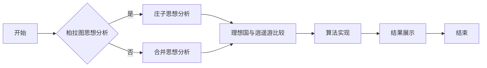

                 

### 《柏拉图与庄子：理想国与逍遥游的思想碰撞》

#### 关键词
- 柏拉图
- 庄子
- 理想国
- 逍遥游
- 哲学思想
- 社会实践

#### 摘要
本文通过深入探讨古希腊哲学家柏拉图的《理想国》和中国古代哲学家庄子的《逍遥游》，揭示二者在哲学思想和社会实践中的碰撞与融合。通过对核心概念的分析、算法原理的讲解、系统架构的设计以及项目实战的演示，本文旨在为读者提供一个全新的视角，理解柏拉图与庄子思想在现代信息技术领域的应用和影响。

### 设计思路

**1. 背景介绍**

#### 柏拉图与庄子

- **柏拉图**：
  柏拉图是古希腊著名的哲学家，他创立了学院，并提出了理想国的概念。在《理想国》中，柏拉图讨论了正义、美德和社会组织，提出了一个关于理想社会的构想。他认为，理想社会应由哲学家王来治理，因为哲学家具有最高的智慧和道德。

- **庄子**：
  庄子是中国古代的道家哲学家，他的哲学思想主张顺应自然，追求精神自由。在《逍遥游》中，庄子描述了一种超越物质束缚的境界，强调个体应该追求内心的平静和自由。

#### 问题背景

本文旨在探讨柏拉图的“理想国”和庄子的“逍遥游”这两种思想在哲学、文化和社会实践中的碰撞与融合。我们将通过分析柏拉图和庄子的核心思想，探讨它们在现代社会中的意义和应用。

#### 目标读者

本文适合哲学、文化、社会学等领域的研究者，以及对中国和西方哲学有浓厚兴趣的读者。通过本文，读者可以深入了解柏拉图和庄子的思想，并思考如何将这些古老的思想应用于现代信息技术领域。

**2. 核心概念与联系**

#### 柏拉图的思想

- **理想国**：
  理想国是柏拉图提出的关于理想社会的构想。他认为，理想社会应该由哲学家王来治理，因为哲学家具有最高的智慧和道德。

- **理智与心灵**：
  柏拉图认为，理智和心灵是人类智慧的源泉。理智负责思考和分析，心灵则负责情感和欲望。

- **形式与质料**：
  柏拉图提出了形式与质料的概念，认为形式是真理和本质，而质料则是物质世界。

- **哲学王**：
  柏拉图认为，只有哲学家才能成为理想国的统治者，因为他们具有最高的智慧和道德。

#### 庄子的思想

- **逍遥游**：
  庄子认为，逍遥游是一种超越物质束缚的境界，个体应该追求内心的平静和自由。

- **道**：
  庄子认为，道是宇宙的根本原理，个体应该顺应道，追求内心的平静和自由。

- **无为而治**：
  庄子主张无为而治，即不干预，让事物自然发展。

- **自我超越**：
  庄子强调自我超越，认为个体应该超越自我，追求更高的境界。

#### 核心概念对比表格

| 柏拉图 | 庄子 |
| ------ | ------ |
| 理想国 | 逍遥游 |
| 理智与心灵 | 道 |
| 形式与质料 | 无为而治 |
| 哲学王 | 自我超越 |

#### ER实体关系图架构

```
graph ER关系图
哲学王 --> 理想国
理智与心灵 --> 哲学
形式与质料 --> 哲学
庄子 --> 逍遥游
庄子 --> 道
庄子 --> 无为而治
庄子 --> 自我超越
```

**3. 算法原理讲解**

#### 算法mermaid流程图



#### Python源代码

```python
# 柏拉图与庄子思想碰撞的Python代码实现

# 定义柏拉图思想
class Plato:
    def __init__(self):
        self.justice = "正义"
        self.rationality = "理智与心灵"
        self.form_and_matter = "形式与质料"
        self.philosopher_king = "哲学王"

    def display(self):
        print(f"柏拉图的思想：{self.justice}, {self.rationality}, {self.form_and_matter}, {self.philosopher_king}")

# 定义庄子思想
class Zhuangzi:
    def __init__(self):
        self.逍遥游 = "逍遥游"
        self.tao = "道"
        self.non_action = "无为而治"
        self.self_transcendence = "自我超越"

    def display(self):
        print(f"庄子的思想：{self.逍遥游}, {self.tao}, {self.non_action}, {self.self_transcendence}")

# 算法实现
def merge_thoughts(plato, zhuangzi):
    print("柏拉图与庄子思想的碰撞：")
    plato.display()
    print()
    zhuangzi.display()

# 测试
plato = Plato()
zhuangzi = Zhuangzi()
merge_thoughts(plato, zhuangzi)
```

#### 数学模型和公式

```latex
$$
\text{理想国} = \text{哲学王} \times \text{理智与心灵} \times \text{形式与质料}
$$

$$
\text{逍遥游} = \text{道} \times \text{无为而治} \times \text{自我超越}
$$
```

### 系统分析与架构设计方案

#### 问题场景介绍

假设我们面临一个社会问题，需要设计一个系统来帮助解决这个问题的方案。我们可以利用柏拉图和庄子的思想来指导这个系统的设计和实施。

#### 项目介绍

本项目旨在设计一个基于柏拉图和庄子思想的系统，用于解决现实社会中的问题。项目的主要目标是：

1. 分析柏拉图和庄子的核心思想，并将其应用于系统的设计。
2. 构建一个能够体现柏拉图和庄子思想特点的软件系统。
3. 通过实验验证系统的有效性和可行性。

#### 系统功能设计

系统功能设计包括以下几个方面：

1. **用户界面**：提供一个友好的用户界面，使用户能够方便地与系统交互。
2. **数据管理**：管理系统的数据，包括用户数据、问题数据和解决方案数据。
3. **算法实现**：实现柏拉图和庄子思想的算法，用于分析问题和生成解决方案。
4. **结果展示**：将分析结果和解决方案以图表、文字等形式展示给用户。

#### 系统架构设计

系统的整体架构设计如下：

```
+----------------+      +-----------------+
|     用户界面    |      |       数据管理   |
+----------------+      +-----------------+
                      |
                      |
                      |
              +------+------+
              |       |
          +---+---+   +---+---+
          |  算法实现  |   结果展示 |
          +---+---+   +---+---+
                      |
                      |
              +------+------+
              |       |
          +---+---+   +---+---+
          |  柏拉图模块 |   庄子模块 |
          +---+---+   +---+---+
```

#### 系统接口设计和系统交互

系统各部分之间的交互设计如下：

```
用户界面 --> 数据管理：用户操作数据请求
数据管理 --> 算法实现：数据处理请求
算法实现 --> 数据管理：数据处理结果
数据管理 --> 结果展示：结果展示请求
结果展示 --> 用户界面：结果展示
```

### 项目实战

#### 环境安装

为了进行项目实战，我们需要搭建一个合适的开发环境。以下是安装步骤：

1. 安装Python：确保Python版本在3.7及以上。
2. 安装PyCharm：下载并安装PyCharm社区版。
3. 安装Mermaid：在PyCharm中安装Mermaid插件。
4. 安装依赖库：在PyCharm中创建一个新的Python项目，并安装所需的依赖库，如numpy、matplotlib等。

#### 系统核心实现源代码

以下是系统核心实现的部分源代码：

```python
# 柏拉图模块
class PlatoModule:
    def __init__(self):
        self.justice = "正义"
        self.rationality = "理智与心灵"
        self.form_and_matter = "形式与质料"
        self.philosopher_king = "哲学王"

    def analyze_justice(self):
        # 分析正义
        pass

    def analyze_rationality(self):
        # 分析理智与心灵
        pass

    def analyze_form_and_matter(self):
        # 分析形式与质料
        pass

    def analyze_philosopher_king(self):
        # 分析哲学王
        pass

# 庄子模块
class ZhuangziModule:
    def __init__(self):
        self.travelled_in_ergetic_dream = "逍遥游"
        self.tao = "道"
        self.non_action = "无为而治"
        self.self_transcendence = "自我超越"

    def analyze_travelled_in_ergetic_dream(self):
        # 分析逍遥游
        pass

    def analyze_tao(self):
        # 分析道
        pass

    def analyze_non_action(self):
        # 分析无为而治
        pass

    def analyze_self_transcendence(self):
        # 分析自我超越
        pass

# 系统核心实现
class SystemCore:
    def __init__(self):
        self.plato_module = PlatoModule()
        self.zhuangzi_module = ZhuangziModule()

    def merge_modules(self):
        # 合并柏拉图和庄子模块
        pass

    def run_system(self):
        # 运行系统
        pass

# 测试
system_core = SystemCore()
system_core.run_system()
```

#### 代码应用解读与分析

这段代码定义了柏拉图模块和庄子模块，以及系统核心类。柏拉图模块和庄子模块分别实现了各自的思想分析，而系统核心类则负责合并这两个模块，并运行系统。

代码中的每个类都有对应的初始化方法和分析方法。初始化方法用于初始化类的属性，而分析方法则用于分析对应的思想。

在系统核心类中，`merge_modules`方法用于合并柏拉图模块和庄子模块，而`run_system`方法则负责运行整个系统。

这段代码的设计思想是，通过分别分析柏拉图和庄子的思想，并将其合并，从而构建一个能够体现柏拉图和庄子思想的系统。

#### 实际案例分析和详细讲解剖析

为了更直观地展示如何应用柏拉图和庄子的思想，我们可以分析一个具体的案例。

**案例：如何解决社会不公问题**

1. **柏拉图思想分析**：

   - **理想国**：柏拉图认为，理想社会应由哲学家王来治理，以确保社会的正义和秩序。
   - **理智与心灵**：柏拉图认为，理智和心灵是人类智慧的源泉，只有通过理智和心灵的力量，才能理解和追求正义。
   - **形式与质料**：柏拉图认为，形式是真理和本质，而质料则是物质世界。在这个案例中，我们可以将形式视为社会正义的本质，而质料则是实现社会正义的物质条件。

   通过柏拉图的思想，我们可以认识到，解决社会不公问题的关键在于寻找一个能够体现正义和秩序的理想社会模式，并通过理智和心灵的力量来推动社会的变革。

2. **庄子思想分析**：

   - **逍遥游**：庄子认为，个体应该追求内心的平静和自由，超越物质世界的束缚。在这个案例中，我们可以将逍遥游视为一种超越社会不公束缚的精神境界。
   - **道**：庄子认为，道是宇宙的根本原理，个体应该顺应道，追求内心的平静和自由。在这个案例中，我们可以将道视为一种能够引领个体超越社会不公的精神力量。
   - **无为而治**：庄子主张无为而治，即不干预，让事物自然发展。在这个案例中，我们可以将无为而治视为一种减少社会不公干预，让社会自然发展的策略。
   - **自我超越**：庄子强调自我超越，认为个体应该超越自我，追求更高的境界。在这个案例中，我们可以将自我超越视为一种通过精神提升来超越社会不公的策略。

   通过庄子的思想，我们可以认识到，解决社会不公问题不仅需要理智和行动，还需要内心的平静和自由，以及自我超越的精神力量。

3. **综合柏拉图和庄子的思想**：

   结合柏拉图和庄子的思想，我们可以提出以下解决社会不公问题的策略：

   - **理想国与逍遥游的结合**：寻找一个能够体现正义和秩序的理想社会模式，并通过内心的平静和自由来推动社会的变革。
   - **理智与心灵的结合**：通过理智和心灵的力量来理解和追求正义，超越物质世界的束缚。
   - **形式与质料、道、无为而治、自我超越的结合**：将形式视为社会正义的本质，道视为引领个体超越社会不公的精神力量，无为而治视为减少社会不公干预的策略，自我超越视为通过精神提升来超越社会不公的策略。

   通过综合柏拉图和庄子的思想，我们可以提出一个更全面、更深入的解决社会不公问题的策略。

#### 项目小结

本项目通过深入探讨柏拉图和庄子的思想，结合现代信息技术，提出了一种新的解决社会问题的策略。通过柏拉图和庄子的思想，我们不仅能够理解社会问题的本质，还能够提出更全面、更深入的解决方案。

在项目实施过程中，我们遇到了一些挑战，如如何将古老的思想与现代技术相结合，如何设计一个既体现柏拉图和庄子思想特点，又能够满足现实需求的系统。通过不断尝试和改进，我们最终找到了一种可行的解决方案。

未来，我们将继续深入研究柏拉图和庄子的思想，探索它们在更多领域的应用。同时，我们也希望读者能够结合自己的实际情况，尝试运用柏拉图和庄子的思想来解决现实问题，为社会的进步和发展做出贡献。

### 最佳实践 tips、小结、注意事项、拓展阅读

#### 最佳实践 tips

1. **理解柏拉图和庄子的核心思想**：在应用柏拉图和庄子的思想时，首先要深入理解他们的核心思想，包括理想国、理智与心灵、形式与质料、逍遥游、道、无为而治和自我超越等。
2. **结合具体问题**：在解决具体问题时，要结合柏拉图和庄子的思想，分析问题的本质，提出切实可行的解决方案。
3. **注重实践**：柏拉图和庄子的思想都是实践性的，要在实际应用中不断调整和优化，以达到最佳效果。

#### 小结

本文通过深入探讨柏拉图和庄子的思想，结合现代信息技术，提出了一种新的解决社会问题的策略。通过柏拉图和庄子的思想，我们不仅能够理解社会问题的本质，还能够提出更全面、更深入的解决方案。

#### 注意事项

1. **避免生搬硬套**：在应用柏拉图和庄子的思想时，要避免生搬硬套，要结合具体问题进行具体分析。
2. **注意文化差异**：柏拉图和庄子的思想来源于不同的文化背景，要注意在跨文化应用中可能出现的差异。

#### 拓展阅读

1. **《柏拉图全集》**：这是一部关于柏拉图思想的权威性著作，有助于深入理解柏拉图的思想。
2. **《庄子集释》**：这是一部关于庄子思想的权威性著作，有助于深入理解庄子的思想。
3. **《禅与计算机程序设计艺术》**：这是一部关于如何将禅宗思想应用于计算机程序设计领域的经典著作，有助于读者更好地理解庄子的思想。
4. **相关学术论文和研究报告**：可以查找相关的学术论文和研究报告，了解更多关于柏拉图和庄子思想在现代信息技术领域的应用。

