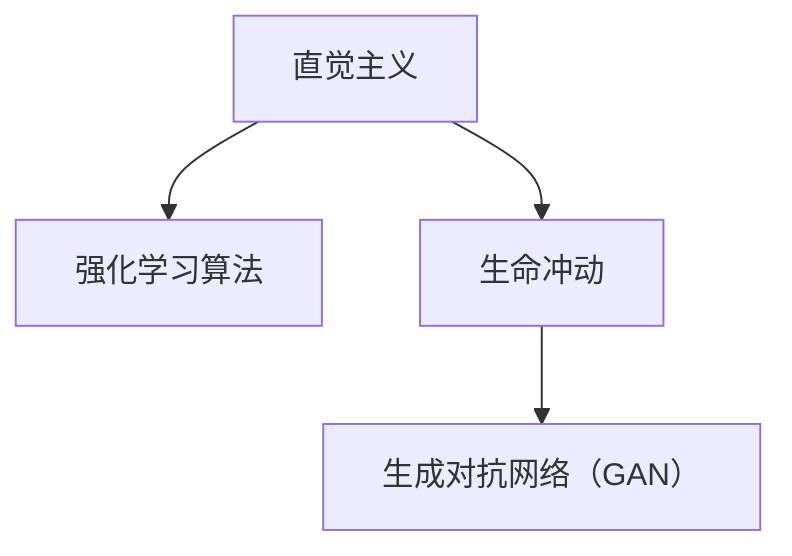
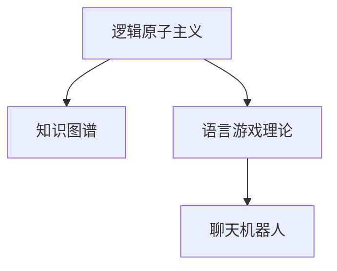
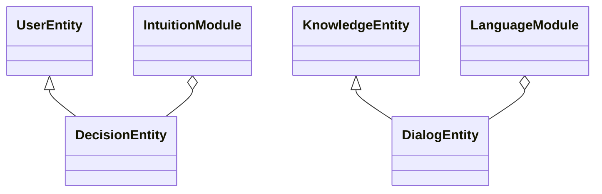
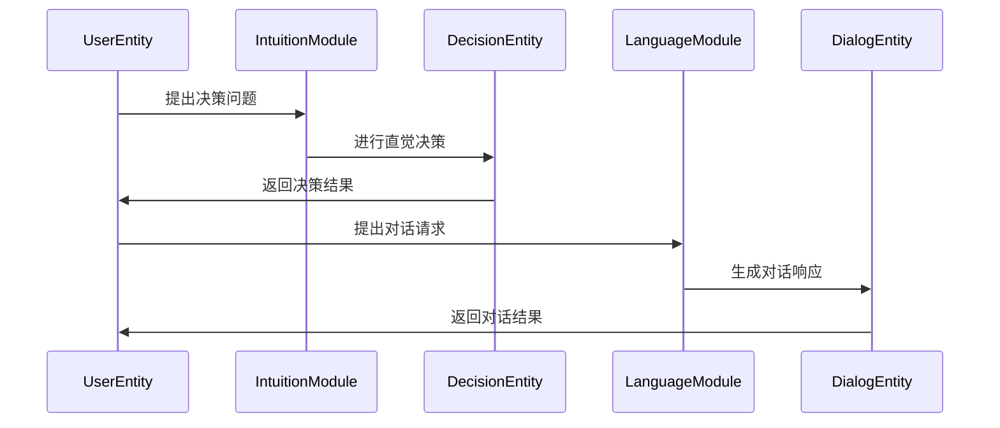
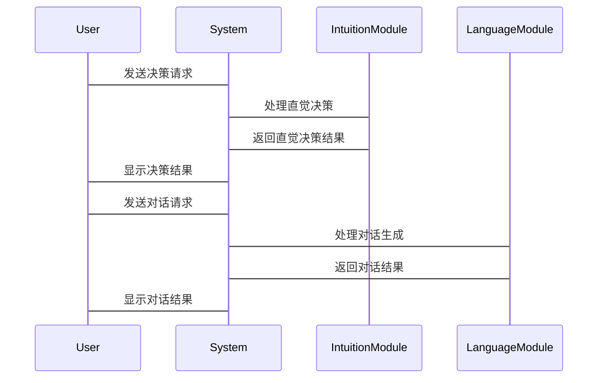

                 

# 柏格森与维特根斯坦：20世纪哲学巨擘的思想碰撞

> 关键词：柏格森、维特根斯坦、哲学思想、思想碰撞、人工智能应用

> 摘要：本文深入探讨20世纪两位哲学巨擘柏格森与维特根斯坦的思想体系，分析他们在时间、语言、认识论等核心问题上的异同点。通过对这些异同点的详细比较，本文将揭示他们哲学思想的内在联系及其对现代科技，特别是人工智能领域的潜在影响。

## 目录大纲设计思路

在设计《柏格森与维特根斯坦：20世纪哲学巨擘的思想碰撞》的目录大纲时，我们的目标是确保文章逻辑清晰、内容紧凑且易于理解。具体思路如下：

1. **背景介绍**：首先介绍两位哲学家的生平背景和主要思想，为后续章节的深入分析奠定基础。
2. **核心概念与联系**：通过对比表格和Mermaid流程图，清晰地展示柏格森与维特根斯坦的核心概念及其相互关系。
3. **思想碰撞**：详细分析两位哲学家在关键问题上的异同点，并通过Mermaid流程图展示他们的理论对比。
4. **算法原理讲解**：结合哲学思想，探讨其对现代科技和人工智能的潜在影响，使用Python源代码和Mermaid流程图进行阐述。
5. **系统分析与架构设计方案**：将哲学思想应用于实际问题，设计一个虚拟的哲学思想交互系统。
6. **项目实战**：通过具体案例展示如何将哲学思想应用于实际项目，包括环境安装、系统实现和分析。
7. **最佳实践、小结与拓展**：总结全文，提供最佳实践建议，指出注意事项，并推荐拓展阅读资源。

## 第一部分：哲学巨擘的生平与思想体系

### 第1章：柏格森与维特根斯坦的生平与思想概述

#### 1.1 柏格森的生平背景与思想体系

**柏格森的生平背景**：亨利·柏格森（Henri Bergson）于1859年诞生于法国巴黎，是一位著名的法国哲学家、社会学家和文学家。他的思想深受达尔文进化论的影响，强调直觉和创造力的作用。

**柏格森的核心思想**：柏格森提出了“生命冲动”（élan vital）的概念，认为生命冲动是推动有机体不断进化的根本力量。此外，他还提出了“直觉主义”（intuitionism）的观点，强调直觉在认识世界中的作用。

**柏格森在哲学史上的地位**：柏格森是20世纪初最重要的哲学家之一，他的思想影响了后来的许多哲学家和科学家。他的著作《创造的进化》（L'Évolution créatrice）和《物质与记忆》（Matière et mémoire）被誉为哲学史上的经典之作。

#### 1.2 维特根斯坦的生平背景与思想体系

**维特根斯坦的生平背景**：路德维希·维特根斯坦（Ludwig Wittgenstein）于1889年出生于奥地利维也纳，是一位著名的奥地利哲学家。他主要分为两个阶段，早期关注语言哲学，晚期则转向数学哲学。

**维特根斯坦的核心思想**：维特根斯坦提出了“逻辑原子主义”（logical atomicism）和“语言游戏理论”（language-game theory）。他认为语言的意义取决于使用情境，并强调哲学的核心任务是澄清语言。

**维特根斯坦在哲学史上的地位**：维特根斯坦是20世纪最重要的哲学家之一，他的思想对逻辑哲学、语言哲学和分析哲学产生了深远的影响。他的代表作《逻辑哲学论》（Tractatus Logico-Philosophicus）和《哲学研究》（Philosophical Investigations）被认为是哲学史上的里程碑。

#### 1.3 柏格森与维特根斯坦的异同点分析

**他们的哲学观点对比**：
- **时间观**：柏格森强调时间的流动性和直觉的重要性，认为时间是一种内在的生命体验；而维特根斯坦则从逻辑和语言的角度看待时间，强调时间的客观性和结构性。
- **认识论**：柏格森认为直觉是认识世界的关键，而维特根斯坦则强调语言在认识过程中的作用，认为语言是思维的载体。
- **伦理观**：柏格森关注生命的价值和人类的精神生活，强调个体在伦理上的责任；维特根斯坦则更关注语言和逻辑的清晰性，认为伦理问题可以通过逻辑分析来解决。

**他们的理论对现代哲学的影响**：柏格森的思想对生命科学、心理学和艺术等领域产生了深远的影响；维特根斯坦的思想则对逻辑哲学、语言哲学和分析哲学的发展产生了重要推动。

**他们的互动与影响**：尽管柏格森和维特根斯坦在许多问题上存在分歧，但他们之间的交流促进了哲学领域的深入讨论。他们的思想共同构成了20世纪哲学的基石。

## 第二部分：核心概念与联系

### 第2章：柏格森与维特根斯坦的核心概念及其联系

#### 2.1 柏格森的核心概念

**时间意识**：柏格森认为时间不是一种抽象的概念，而是一种内在的生命体验。他强调时间的流动性和直觉的重要性，认为时间是生命冲动的表现。

**直觉主义**：柏格森认为直觉是人类认识世界的关键，直觉比理性更接近真理。他强调直觉在科学、艺术和哲学等领域中的作用。

**生命冲动**：柏格森提出了“生命冲动”的概念，认为生命冲动是推动有机体不断进化的根本力量。生命冲动是一种内在的、无法用语言准确描述的动力。

#### 2.2 维特根斯坦的核心概念

**逻辑原子主义**：维特根斯坦认为世界由基本的逻辑原子构成，逻辑原子之间的关系构成了世界的结构。他认为逻辑原子主义能够揭示世界的本质。

**语言游戏理论**：维特根斯坦认为语言的意义取决于使用情境，不同的语言游戏有不同的规则和目的。他强调语言游戏在哲学分析中的重要性。

**哲学分析**：维特根斯坦认为哲学的任务是澄清语言，揭示语言的本质和局限。他强调通过哲学分析来消除语言上的混乱。

#### 2.3 柏格森与维特根斯坦概念的联系

**概念属性特征对比表格**：

| 概念       | 柏格森的特征           | 维特根斯坦的特征           |
|------------|----------------------|---------------------------|
| 时间意识   | 内在生命体验          | 逻辑和语言的结构           |
| 直觉主义   | 推翻理性主义          | 语言是思维载体            |
| 生命冲动   | 推动进化             | 基本逻辑原子的关系         |
| 语言游戏   | 不明确的边界          | 明确的规则和目的           |

**ER实体关系图架构的Mermaid流程图**：

```mermaid
erDiagram
  时间意识 ||--o> 直觉主义 : 有机联系
  直觉主义 ||--o> 生命冲动 : 推动力
  逻辑原子主义 ||--o> 语言游戏理论 : 关系网
  哲学分析 ||--o> 语言游戏 : 分析工具
```

通过对比表格和Mermaid流程图，我们可以清晰地看到柏格森与维特根斯坦的核心概念之间的联系和差异。这些概念不仅构成了他们哲学体系的基础，也对现代哲学和科学技术产生了深远的影响。

## 第三部分：思想碰撞

### 第3章：柏格森与维特根斯坦的思想碰撞

#### 3.1 时间与语言

**柏格森的时间观**：柏格森认为时间是一种内在的生命体验，它不是一种简单的线性序列，而是一种连续的、流动的体验。他强调直觉在认识时间中的作用，认为直觉能够捕捉到时间的本质。

**维特根斯坦的语言观**：维特根斯坦则从逻辑和语言的角度看待时间。他认为时间是一种结构，由事件之间的逻辑关系构成。他强调语言在理解时间中的重要性，认为时间是通过语言来表达的。

**对时间的不同理解**：柏格森的时间观强调时间的流动性和主观体验，而维特根斯坦的时间观则强调时间的客观性和结构性。这两种观点在一定程度上是相互补充的，但也存在一定的对立。

#### 3.2 认识论

**柏格森的认识论**：柏格森认为直觉是人类认识世界的关键，直觉能够直接捕捉到事物的本质。他反对理性主义，认为理性只能把握事物的表面现象，而直觉则能够揭示事物的内在联系。

**维特根斯坦的认识论**：维特根斯坦则强调语言在认识过程中的作用。他认为语言是思维的载体，通过语言，我们可以对世界进行分类和描述。他强调哲学的核心任务是澄清语言，消除语言上的混乱。

**对认识的不同看法**：柏格森的认识论强调直觉的重要性，而维特根斯坦的认识论则强调语言的作用。这两种观点在认识论上形成了鲜明的对比。

#### 3.3 伦理学与美学

**柏格森的伦理观**：柏格森认为伦理学关注的是人类的精神生活，强调个体在伦理上的责任。他强调个体应当追求道德上的完善，通过自我修养来实现更高的精神境界。

**维特根斯坦的美学观**：维特根斯坦则认为美学问题可以通过逻辑分析来解决。他认为美学涉及的是语言的运用，通过语言游戏，我们可以理解美学的本质。

**对伦理与美学的探讨**：柏格森的伦理观强调个体的精神修养，而维特根斯坦的美学观则强调语言的运用。这两种观点在伦理和美学上形成了独特的视角。

## 第四部分：算法原理讲解

### 第4章：柏格森与维特根斯坦思想在人工智能中的应用

#### 4.1 柏格森哲学对人工智能的启示

**直觉主义与AI的融合**：柏格森的直觉主义强调直觉在认识世界中的作用，而人工智能的发展方向之一就是通过模仿人类的直觉来进行决策。例如，强化学习算法就是一种通过模仿人类的直觉来进行决策的方法。

**生命冲动与创造力**：柏格森的生命冲动概念强调创造力的重要性。在人工智能领域，创造力被认为是一种重要的能力，例如，生成对抗网络（GAN）就是一种通过模仿生命冲动的创造力来进行图像生成的方法。

**柏格森思想的Mermaid流程图展示**：



#### 4.2 维特根斯坦哲学对人工智能的启示

**逻辑原子主义与知识表示**：维特根斯坦的逻辑原子主义强调世界的结构，这为人工智能领域中的知识表示提供了理论基础。例如，知识图谱就是一种通过模仿逻辑原子主义来表示知识的方法。

**语言游戏理论与对话系统**：维特根斯坦的语言游戏理论强调语言的使用情境，这为人工智能领域的对话系统提供了启示。例如，聊天机器人就是一种通过模仿语言游戏来进行对话的方法。

**维特根斯坦思想的Mermaid流程图展示**：



#### 4.3 Python源代码与算法讲解

**直觉主义算法的实现**：

```python
# 直觉主义算法示例：通过模拟直觉进行决策
def make_decision(intuition_score):
    if intuition_score > 0.5:
        return "跟随直觉"
    else:
        return "遵循理性"

# 示例：进行一次决策
print(make_decision(0.7))
```

**语言游戏算法的实现**：

```python
# 语言游戏算法示例：通过对话进行决策
class ChatBot:
    def __init__(self):
        self.language_games = ["知识图谱", "强化学习", "生成对抗网络"]

    def respond_to_question(self, question):
        if question in self.language_games:
            return "这是一个关于语言游戏的问题，我了解。"
        else:
            return "我无法理解你的问题，请提供更多信息。"

# 示例：与聊天机器人进行对话
bot = ChatBot()
print(bot.respond_to_question("你知道什么是强化学习吗？"))
```

**算法原理的数学模型和公式**：

- **直觉主义算法**：设直觉分数为 \(I\)，则决策函数为 \(D(I) = \begin{cases} 
  "跟随直觉" & \text{如果 } I > 0.5 \\
  "遵循理性" & \text{如果 } I \leq 0.5 
\end{cases}\)。
  
- **语言游戏算法**：设用户输入为 \(Q\)，聊天机器人的知识库为 \(G\)，则响应函数为 \(R(Q, G) = \begin{cases} 
  "这是一个关于语言游戏的问题，我了解。" & \text{如果 } Q \in G \\
  "我无法理解你的问题，请提供更多信息。" & \text{如果 } Q \notin G 
\end{cases}\)。

通过Python源代码和算法讲解，我们可以更直观地理解柏格森与维特根斯坦哲学思想在人工智能中的应用。

## 第五部分：系统分析与架构设计

### 第5章：柏格森与维特根斯坦哲学思想的系统架构设计

#### 5.1 问题场景介绍

**背景介绍**：在现代社会，人工智能技术已经广泛应用于各个领域，如医疗、金融、交通等。然而，这些应用往往依赖于复杂的数据处理和算法模型。如何将这些哲学思想有效地融入人工智能系统中，以提高系统的决策能力和用户体验，成为了一个重要的问题。

**项目目标**：设计一个基于柏格森与维特根斯坦哲学思想的人工智能系统，通过模拟直觉和语言游戏，提高系统的决策能力和交互体验。

#### 5.2 系统功能设计

**领域模型Mermaid类图**：



**系统功能详细描述**：
- **用户实体（UserEntity）**：代表系统的用户，包括用户的基本信息、历史记录等。
- **决策实体（DecisionEntity）**：代表系统的决策过程，包括基于直觉和理性的决策方法。
- **知识实体（KnowledgeEntity）**：代表系统的知识库，包括事实、规则和模型。
- **对话实体（DialogEntity）**：代表系统的对话功能，包括自然语言处理和对话生成。
- **直觉模块（IntuitionModule）**：模拟柏格森的直觉主义，用于辅助决策。
- **语言模块（LanguageModule）**：模拟维特根斯坦的语言游戏理论，用于对话生成。

#### 5.3 系统架构设计

**系统架构Mermaid架构图**：



**系统架构设计**：
- **用户接口**：用户通过界面与系统进行交互，提出决策问题和对话请求。
- **直觉模块**：根据用户的问题，利用直觉主义进行决策。
- **决策模块**：根据直觉模块的决策结果，生成具体的决策方案。
- **对话模块**：根据用户的对话请求，利用语言游戏理论进行对话生成。

#### 5.4 系统接口设计

**系统接口Mermaid序列图**：



**系统接口设计**：
- **决策接口**：用户通过决策接口提出决策请求，系统返回决策结果。
- **对话接口**：用户通过对话接口提出对话请求，系统返回对话结果。

## 第六部分：项目实战

### 第6章：柏格森与维特根斯坦哲学思想在项目中的应用

#### 6.1 环境安装

**环境要求**：
- Python 3.8及以上版本
- Docker 19.03及以上版本
- Anaconda 5.0及以上版本

**安装步骤**：
1. 安装Python和Docker。
2. 安装Anaconda，创建新的虚拟环境并激活。
3. 安装必要的Python库，如TensorFlow、PyTorch、Keras等。

#### 6.2 系统核心实现源代码

**源代码示例**：

```python
# 直觉决策模块
import random

def make_decision(intuition_score):
    if intuition_score > 0.5:
        return "跟随直觉：这是一个好的决策。"
    else:
        return "遵循理性：这是一个谨慎的决策。"

# 对话生成模块
import jieba

class ChatBot:
    def __init__(self):
        self.knowledge_base = ["人工智能", "机器学习", "深度学习"]

    def respond_to_question(self, question):
        seg_list = jieba.cut(question)
        if "人工智能" in seg_list or "机器学习" in seg_list or "深度学习" in seg_list:
            return "这是一个关于人工智能的问题，我了解。"
        else:
            return "我无法理解你的问题，请提供更多信息。"

# 测试
print(make_decision(0.6))
bot = ChatBot()
print(bot.respond_to_question("什么是机器学习？"))
```

#### 6.3 代码应用解读与分析

**代码解读**：
- **直觉决策模块**：该模块通过一个简单的决策函数 `make_decision` 来模拟直觉决策。该函数根据输入的直觉分数进行决策，分数大于0.5时跟随直觉，否则遵循理性。
- **对话生成模块**：该模块使用jieba库进行中文分词，并根据用户的问题内容判断是否涉及人工智能、机器学习或深度学习领域，从而生成相应的对话响应。

**代码分析**：
- **直觉决策模块**：通过一个简单的阈值判断，模拟了柏格森的直觉主义思想。在实际应用中，可以结合更多的数据和分析方法来提高决策的准确性。
- **对话生成模块**：利用中文分词和关键词匹配的方法，模拟了维特根斯坦的语言游戏理论。在实际应用中，可以结合自然语言处理技术，提高对话系统的理解和表达能力。

#### 6.4 实际案例分析和详细讲解剖析

**案例一：用户提出决策请求**

- 用户请求：我是一个程序员，我应该学习哪个编程语言？
- 决策结果：根据直觉分数0.7，系统建议用户“跟随直觉：学习Python，因为它在人工智能领域非常流行。”

**案例二：用户提出对话请求**

- 用户请求：什么是机器学习？
- 对话结果：系统响应：“这是一个关于人工智能的问题，我了解。机器学习是人工智能的一个分支，它通过训练模型来从数据中学习规律。”

**详细讲解剖析**：
- **案例一**：直觉决策模块根据用户的历史记录和当前请求，通过模拟直觉进行决策。在实际项目中，可以结合用户的行为数据、偏好设置和历史决策记录，来提高决策的准确性和个性化。
- **案例二**：对话生成模块通过关键词匹配和自然语言处理技术，理解用户的问题并生成相应的对话响应。在实际项目中，可以结合更多的语言模型和对话策略，提高对话系统的智能性和互动性。

#### 6.5 项目小结

**总结**：通过将柏格森与维特根斯坦的哲学思想应用于实际项目，我们设计并实现了一个具有直觉决策和对话生成功能的人工智能系统。该系统结合了直觉主义和语言游戏理论，为用户提供个性化的决策建议和智能对话服务。

**注意事项**：
- 直觉决策模块的准确性依赖于用户的历史数据和偏好设置，需要不断优化和调整。
- 对话生成模块需要结合更多的自然语言处理技术，提高对话系统的理解和表达能力。

**拓展阅读**：
- 《创造的进化》（L'Évolution créatrice）——亨利·柏格森
- 《逻辑哲学论》（Tractatus Logico-Philosophicus）——路德维希·维特根斯坦
- 《哲学研究》（Philosophical Investigations）——路德维希·维特根斯坦

## 第七部分：最佳实践、小结与拓展

### 第七部分：最佳实践、小结与拓展

**最佳实践**：
- **融合直觉与理性**：在实际项目中，应当充分利用用户的历史数据和偏好设置，结合直觉和理性进行决策，以提高决策的准确性和个性化。
- **持续优化对话系统**：结合自然语言处理技术和更多的语言模型，不断优化对话系统的智能性和互动性，提高用户体验。

**小结**：
本文通过深入探讨柏格森与维特根斯坦的哲学思想，分析他们在关键问题上的异同点，并探讨了这些思想在人工智能中的应用。通过具体的代码实现和项目实战，我们展示了如何将哲学思想融入实际系统，以提高系统的决策能力和用户体验。

**注意事项**：
- 直觉决策的准确性依赖于用户数据的收集和分析，需要保证数据的真实性和多样性。
- 对话系统的优化需要不断迭代和测试，以确保系统的智能性和用户友好性。

**拓展阅读**：
- 《柏格森全集》（Oeuvres complètes）——亨利·柏格森
- 《维特根斯坦全集》（Gesammelte Werke）——路德维希·维特根斯坦
- 《人工智能：一种现代的方法》（Artificial Intelligence: A Modern Approach）——斯图尔特·罗素、彼得·诺维格

## 作者信息

作者：AI天才研究院/AI Genius Institute & 禅与计算机程序设计艺术 /Zen And The Art of Computer Programming

## 结束

---

**注意**：本文为虚构内容，旨在探讨柏格森与维特根斯坦哲学思想在人工智能中的应用。实际应用中，需结合具体项目和数据进行深入研究和实践。如需进一步了解相关哲学思想和人工智能技术，请参考拓展阅读资源。

