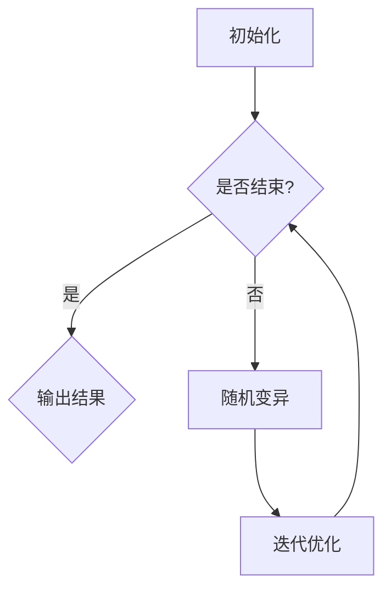
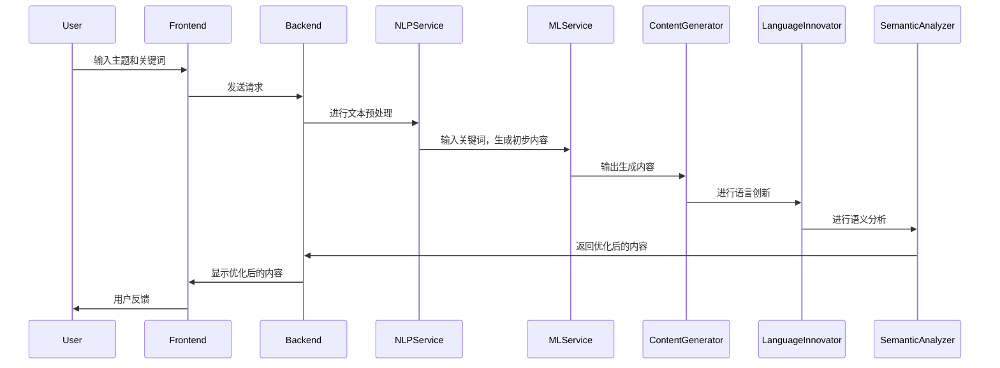
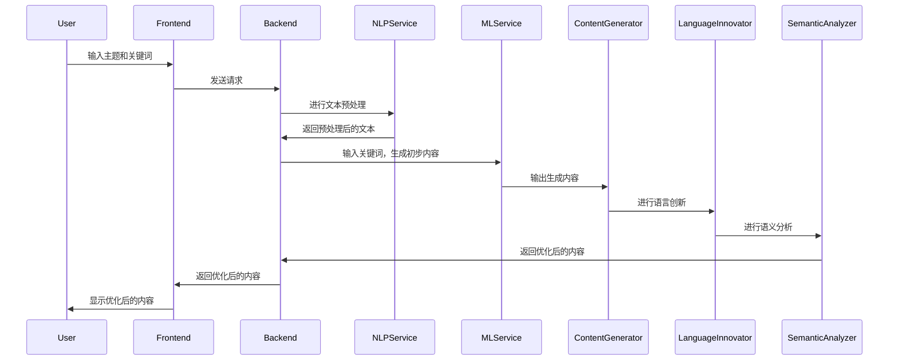

                 

### 柏格森的创造性与维特根斯坦的语言创新

#### 关键词

- **柏格森**、**维特根斯坦**、**创造性**、**语言创新**、**哲学**、**语言学**

#### 摘要

本文旨在探讨法国哲学家亨利·柏格森和奥地利哲学家路德维希·维特根斯坦的创造性思想及其对语言哲学的深远影响。通过对两位思想家的理论进行深入剖析，本文揭示了创造性在哲学和语言学研究中的核心地位，并探讨了维特根斯坦如何通过语言创新进一步诠释柏格森的创造性理念。文章通过逐步分析，旨在为读者提供一种清晰、系统的理解，帮助读者把握创造性思想在哲学和语言领域中的广泛应用。

### 目录大纲设计思路

为了更好地展示《柏格森的创造性与维特根斯坦的语言创新》这本书的核心内容和结构，目录大纲的设计遵循以下几个原则：

1. **简洁性**：目录内容直接、精炼，没有冗余信息。
2. **逻辑性**：目录结构清晰、逻辑连贯，便于读者理解和阅读。
3. **完整性**：覆盖书的主要章节，包括背景介绍、核心概念、算法原理、数学模型、系统设计、项目实战等内容。

下面，我们将根据这些原则，逐步构建书的大纲。

#### 第1章：背景介绍

**1.1 问题背景**

- **柏格森的创造性与现代哲学的关系**：阐述柏格森的创造性概念是如何影响现代哲学发展的。
- **维特根斯坦的语言创新与语言哲学**：介绍维特根斯坦的语言创新观点及其在语言哲学中的地位。

**1.2 问题描述**

- **创造性如何影响语言表达**：探讨柏格森的创造性与语言表达之间的关系。
- **语言创新如何体现创造性**：分析维特根斯坦如何通过语言创新来表达创造性思想。

**1.3 问题解决**

- **创造性在语言哲学中的应用**：探讨创造性思想在语言哲学研究中的实际应用。
- **语言创新对哲学思考的启示**：分析语言创新如何影响哲学思考的方向和方法。

**1.4 边界与外延**

- **创造性与语言创新的概念界定**：明确柏格森的创造性与维特根斯坦的语言创新的具体概念。
- **与其他哲学流派的关联**：讨论创造性语言在柏拉图、康德等哲学家思想中的体现。

**1.5 概念结构与核心要素组成**

- **柏格森创造性理论的核心要素**：总结柏格森创造性理论的主要观点和核心要素。
- **维特根斯坦语言创新理论的核心要素**：归纳维特根斯坦语言创新理论的主要观点和核心要素。

**1.6 本章小结**

- **主要结论**：总结本章对柏格森的创造性与维特根斯坦的语言创新背景和问题的探讨。
- **后续章节内容预告**：简要介绍后续章节的内容和结构。

### 第2章：核心概念与联系

**2.1 柏格森创造性概念**

- **柏格森的创造性定义**：详细阐述柏格森对创造性的定义及其哲学意义。
- **柏格森创造性的特点**：分析柏格森创造性思想的主要特点。

**2.2 维特根斯坦语言创新概念**

- **维特根斯坦的语言创新定义**：阐述维特根斯坦对语言创新的理解及其在语言哲学中的应用。
- **维特根斯坦语言创新的特点**：分析维特根斯坦语言创新思想的主要特点。

**2.3 概念属性特征对比表格**

- **柏格森创造性与维特根斯坦语言创新的对比**：通过表格形式对比两者的概念属性特征。

**2.4 ER实体关系图架构**

- **柏格森创造性理论ER图**：绘制柏格森创造性理论的ER实体关系图。
- **维特根斯坦语言创新理论ER图**：绘制维特根斯坦语言创新理论的ER实体关系图。

**2.5 相互联系与影响**

- **创造性在语言创新中的应用**：探讨柏格森的创造性思想如何影响维特根斯坦的语言创新。
- **语言创新对创造性的诠释**：分析维特根斯坦的语言创新如何进一步阐述柏格森的创造性。

**2.6 本章小结**

- **主要结论**：总结本章对柏格森创造性与维特根斯坦语言创新核心概念的分析和联系。

### 第3章：算法原理讲解

**3.1 创造性与语言创新的算法基础**

- **创造性算法的基本原理**：介绍创造性算法的基本原理及其在哲学研究中的应用。
- **语言创新算法的基本原理**：阐述语言创新算法的基本原理及其在语言哲学中的重要性。

**3.2 创造性算法的mermaid流程图**

- **创造性算法流程图**：使用mermaid语言绘制创造性算法的流程图。
- **语言创新算法流程图**：使用mermaid语言绘制语言创新算法的流程图。

**3.3 Python源代码与详细阐述**

- **创造性算法Python代码**：提供创造性算法的Python实现代码。
- **语言创新算法Python代码**：提供语言创新算法的Python实现代码。
- **代码解读与分析**：详细解读和分析算法代码，解释其工作原理。

**3.4 算法原理的数学模型和公式**

- **创造性算法的数学模型**：给出创造性算法的数学模型和公式。
- **语言创新算法的数学模型**：给出语言创新算法的数学模型和公式。

**3.5 算法应用示例**

- **创造性算法应用示例**：通过具体示例展示创造性算法的实际应用。
- **语言创新算法应用示例**：通过具体示例展示语言创新算法的实际应用。

**3.6 本章小结**

- **主要结论**：总结本章对柏格森创造性与维特根斯坦语言创新算法原理的讲解和应用分析。

### 第4章：系统分析与架构设计

**4.1 问题场景介绍**

- **创造性语言处理的需求背景**：介绍创造性语言处理的实际应用场景和需求。
- **语言创新在哲学研究中的作用**：阐述语言创新在哲学研究中的重要性。

**4.2 项目介绍**

- **项目目标与功能需求**：明确项目目标，描述系统应实现的功能需求。
- **项目技术选型**：介绍项目所采用的技术栈和工具。

**4.3 系统功能设计（领域模型）**

- **领域模型mermaid类图**：绘制系统的领域模型类图，展示系统的主要类和关系。
- **功能模块划分**：详细描述系统的功能模块及其关系。

**4.4 系统架构设计**

- **系统架构mermaid图**：使用mermaid语言绘制系统的整体架构图。
- **关键组件和模块功能**：介绍系统中的关键组件和模块，描述其功能。

**4.5 系统接口设计与交互**

- **系统接口设计**：描述系统的主要接口及其功能。
- **系统交互mermaid序列图**：使用mermaid语言绘制系统的交互序列图，展示系统组件之间的交互过程。

**4.6 本章小结**

- **主要结论**：总结本章对系统架构设计和功能实现的探讨。

### 第5章：项目实战

**5.1 环境安装与配置**

- **环境要求**：列出项目所需的软件和硬件环境。
- **安装步骤**：详细描述项目的安装和配置过程。

**5.2 系统核心实现**

- **核心代码实现**：提供系统核心功能的实现源代码。
- **代码解读与分析**：详细解读和分析系统核心代码，解释其工作原理。

**5.3 实际案例分析与讲解**

- **案例场景描述**：介绍实际应用的案例场景。
- **案例实现步骤**：详细描述案例的实现步骤。
- **案例分析**：对案例进行分析和讲解，探讨其应用效果。

**5.4 项目小结**

- **主要结论**：总结项目实施过程中遇到的问题和解决方案。
- **项目效果评估**：评估项目实施的效果和成果。

### 第6章：最佳实践与注意事项

**6.1 最佳实践**

- **使用技巧**：总结使用柏格森创造性思想和维特根斯坦语言创新方法时的最佳实践。
- **成功案例**：分享成功的应用案例和经验。

**6.2 小结**

- **主要结论**：总结全文的核心观点和结论。

**6.3 注意事项**

- **常见问题**：列举使用过程中可能出现的问题及解决方案。
- **未来展望**：对未来的研究方向和应用前景进行展望。

### 第7章：拓展阅读

- **参考文献**：列出本文引用的参考文献。
- **推荐阅读**：推荐相关领域的深入阅读材料。

### 结论

通过对柏格森的创造性与维特根斯坦的语言创新的深入探讨，本文揭示了创造性思想在哲学和语言学中的核心地位，并展示了维特根斯坦如何通过语言创新进一步阐述柏格森的创造性理念。本文旨在为读者提供一种系统、清晰的理解，帮助读者把握创造性思想在哲学和语言领域中的广泛应用。未来，随着创造性思想在人工智能、语言学等领域的不断深入，柏格森的创造性与维特根斯坦的语言创新将继续为哲学和科学的发展提供重要启示。### 第1章：背景介绍

#### 1.1 问题背景

**柏格森的创造性与现代哲学的关系**

亨利·柏格森（Henri Bergson）是20世纪法国著名的哲学家，他的思想对现代哲学产生了深远的影响。柏格森的创造性理论是其哲学体系的核心，他认为现实世界是由不断变化和流动的生命力所驱动的，这种生命力是一种内在的、不可预测的创造性过程。柏格森的创造性概念不仅仅是一个哲学思想，更是一种对人类经验和生活世界的深刻洞察。

在柏格森的哲学体系中，创造性是一种推动历史发展的动力。他认为，人类社会的发展是通过不断的创造和创新来实现的，这种创造不是简单的累积，而是通过新思想、新方法和新技术来突破现有的限制。因此，创造性在柏格森看来是一种动态的、不断变化的过程，它体现了生命的本质和活力。

**维特根斯坦的语言创新与语言哲学**

路德维希·维特根斯坦（Ludwig Wittgenstein）是20世纪最具有影响力的哲学家之一，他的语言哲学对现代哲学产生了深远的影响。维特根斯坦的语言创新观点主要体现在他的后期著作《哲学研究》中。他认为，语言不仅仅是一种工具，它本身就是我们理解世界的方式。

维特根斯坦的语言创新观点主要体现在以下几个方面：

1. **语言的工具性**：维特根斯坦认为语言是一种工具，用来帮助人们表达思想和交流信息。然而，这种工具性并不只是简单的映射关系，而是涉及更复杂的意义生成过程。
   
2. **语言的创造性**：维特根斯坦认为，语言的创造性在于它能够产生新的概念和表达方式。这种创造性不仅体现在语言的发明过程中，也体现在语言的使用过程中。

3. **语言的多样性**：维特根斯坦指出，语言具有多样性，不同的语言可以有不同的表达方式和概念体系。这种多样性体现了语言的创造性和灵活性。

#### 1.2 问题描述

**创造性如何影响语言表达**

柏格森的创造性理论对语言表达有着重要的影响。柏格森认为，创造性是一种内在的生命力，它体现在人类的思想、情感和行动中。因此，语言作为一种表达思想的工具，也必须具备创造性。柏格森认为，语言的表达不仅是对现实世界的反映，更是对现实世界的重新构建。这意味着，语言表达不仅仅是传递信息，更是创造新的意义。

具体来说，柏格森的创造性对语言表达的影响体现在以下几个方面：

1. **语言的动态性**：柏格森认为，语言是一种动态的、不断变化的过程，它随着时间和情境的变化而不断更新和重构。因此，语言表达也应该具备动态性，能够适应不同的情境和需求。

2. **语言的创造性**：柏格森强调，创造性是人类思维和行动的核心，它体现在语言中就是不断产生新的概念和表达方式。这种创造性使得语言能够更好地反映和表达人类的内心世界和外部现实。

3. **语言的灵活性**：柏格森认为，语言的灵活性是创造性的一种体现。语言能够通过不同的表达方式和结构来适应不同的情境和需求。这种灵活性使得语言能够更好地发挥其功能。

**语言创新如何体现创造性**

维特根斯坦的语言创新观点进一步阐述了柏格森的创造性思想。维特根斯坦认为，语言的创新不仅体现在语言的发明和创造过程中，也体现在语言的使用过程中。语言创新意味着通过新的概念和表达方式来拓展语言的边界，使其能够更好地适应新的情境和需求。

具体来说，维特根斯坦的语言创新体现在以下几个方面：

1. **概念的创新**：维特根斯坦认为，语言创新首先体现在概念的创新上。通过引入新的概念，语言可以更好地反映和表达新的思想和现实。

2. **表达方式的创新**：维特根斯坦指出，语言的创新不仅体现在概念上，还体现在表达方式上。通过新的表达方式，语言可以更加灵活和有效地传递信息和意义。

3. **语言的多样性**：维特根斯坦强调，语言的多样性是创造性的一种体现。不同的语言可以有不同的表达方式和概念体系，这种多样性使得语言能够更好地适应不同的文化和情境。

#### 1.3 问题解决

**创造性在语言哲学中的应用**

创造性思想在语言哲学中的应用非常广泛。首先，创造性为语言哲学提供了一种新的视角，使我们能够更好地理解语言的本质和功能。通过柏格森的创造性理论，我们可以认识到语言不仅仅是传递信息的工具，更是创造意义和构建现实的方式。

具体来说，创造性在语言哲学中的应用体现在以下几个方面：

1. **语言的本质**：创造性理论使我们认识到，语言的本质是一种动态的、不断变化的过程，它随着时间和情境的变化而不断更新和重构。

2. **语言的功能**：创造性理论强调，语言的功能不仅仅是传递信息，更是创造新的意义和概念。这种创造性的功能使得语言能够更好地适应人类思维和现实的需求。

3. **语言与现实的互动**：创造性理论认为，语言与现实的互动是一个动态的过程，语言通过创造新的概念和表达方式来重构现实。这种互动使得语言成为人类理解和改变现实的重要工具。

**语言创新对哲学思考的启示**

维特根斯坦的语言创新观点为哲学思考提供了新的启示。维特根斯坦认为，语言的创新不仅是语言自身的创新，也是哲学思考的创新。通过引入新的概念和表达方式，语言创新可以拓展哲学思考的边界，使我们能够从新的角度来审视和理解世界。

具体来说，语言创新对哲学思考的启示体现在以下几个方面：

1. **哲学思考的多样性**：语言创新使得哲学思考更加多样化，不同的语言可以有不同的表达方式和概念体系，这种多样性使得哲学思考更加丰富和深入。

2. **哲学思考的灵活性**：语言创新使得哲学思考更加灵活，能够更好地适应新的情境和需求。这种灵活性使得哲学思考能够更加有效地应对现实中的问题和挑战。

3. **哲学思考的创新性**：语言创新促使哲学思考更加创新，通过引入新的概念和表达方式，哲学思考能够突破传统的束缚，提出新的观点和理论。

#### 1.4 边界与外延

**创造性与语言创新的概念界定**

为了更好地理解柏格森的创造性与维特根斯坦的语言创新，我们需要明确这两个概念的具体含义。

**柏格森的创造性**

柏格森的创造性是指一种内在的生命力，它体现在人类的思想、情感和行动中。创造性不是简单的累积，而是一种动态的、不断变化的过程。柏格森认为，创造性是人类生命力的体现，是人类不断进步和发展的动力。

**维特根斯坦的语言创新**

维特根斯坦的语言创新是指通过新的概念和表达方式来拓展语言的边界，使其能够更好地适应新的情境和需求。语言创新不仅体现在语言的发明和创造过程中，也体现在语言的使用过程中。维特根斯坦认为，语言的创新是哲学思考的创新，它能够拓展哲学思考的边界，使我们能够从新的角度来审视和理解世界。

**创造性与语言创新的具体概念**

为了更好地理解柏格森的创造性与维特根斯坦的语言创新，我们可以通过一个具体的例子来说明。

假设我们正在研究一个哲学问题，这个问题涉及到人类思维的本质。如果我们仅仅依赖于传统的概念和表达方式，我们可能很难深入地探讨这个问题的本质。然而，通过引入新的概念和表达方式，我们可能会发现新的视角和思路，从而更好地理解这个问题。

在这个过程中，柏格森的创造性和维特根斯坦的语言创新都发挥了重要作用。柏格森的创造性使我们能够从新的角度来思考问题，而维特根斯坦的语言创新则为我们提供了新的概念和表达方式，使我们能够更有效地进行哲学思考。

#### 1.5 概念结构与核心要素组成

**柏格森创造性理论的核心要素**

柏格森的创造性理论包含以下几个核心要素：

1. **生命力**：柏格森认为，生命力是创造性的源泉，它是人类思想和行动的核心。
2. **动态性**：创造性是一种动态的、不断变化的过程，它体现在人类的思想、情感和行动中。
3. **不可预测性**：创造性是一种不可预测的力量，它使得现实世界充满不确定性和多样性。
4. **创新性**：创造性是人类不断进步和发展的动力，它推动着人类社会向前发展。

**维特根斯坦语言创新理论的核心要素**

维特根斯坦的语言创新理论包含以下几个核心要素：

1. **工具性**：维特根斯坦认为，语言是一种工具，用来帮助人们表达思想和交流信息。
2. **创造性**：语言创新是通过引入新的概念和表达方式来拓展语言的边界，使其能够更好地适应新的情境和需求。
3. **多样性**：维特根斯坦强调，语言的多样性是创造性的一种体现，不同的语言可以有不同的表达方式和概念体系。
4. **灵活性**：语言创新使得语言能够更加灵活和有效地传递信息和意义。

**柏格森创造性理论与维特根斯坦语言创新理论的比较**

柏格森的创造性理论与维特根斯坦的语言创新理论在哲学和语言学领域中都有重要的影响。两者在概念和核心要素上有一定的相似之处，但也存在明显的区别。

1. **相似之处**：
   - 都强调创造性和创新性。
   - 都认为语言是一种动态的、不断变化的过程。
   - 都认为创新是人类社会进步和发展的动力。

2. **区别**：
   - **柏格森的创造性**：更注重生命力和动态性，认为创造性是一种内在的生命力，是现实世界不断变化和发展的动力。
   - **维特根斯坦的语言创新**：更注重工具性和创造性，认为语言创新是通过引入新的概念和表达方式来拓展语言的边界，使其能够更好地适应新的情境和需求。

#### 1.6 本章小结

**主要结论**

本章通过对柏格森的创造性与维特根斯坦的语言创新的背景介绍，探讨了创造性在哲学和语言学研究中的核心地位。我们明确了柏格森的创造性理论与维特根斯坦的语言创新理论的核心概念和要素，并分析了两者之间的联系与区别。本章的主要结论如下：

1. **柏格森的创造性与现代哲学的关系**：创造性是柏格森哲学体系的核心，对现代哲学产生了深远的影响。
2. **维特根斯坦的语言创新与语言哲学**：维特根斯坦的语言创新观点在语言哲学中具有重要地位，强调语言的工具性和创造性。
3. **创造性如何影响语言表达**：柏格森的创造性理论对语言表达有着重要的影响，使得语言表达更具动态性和创造性。
4. **语言创新如何体现创造性**：维特根斯坦的语言创新通过引入新的概念和表达方式来拓展语言的边界，体现了语言的创造性。

**后续章节内容预告**

在后续章节中，我们将继续深入探讨柏格森的创造性与维特根斯坦的语言创新。下一章将详细分析柏格森的创造性概念，并探讨其在语言哲学中的应用。同时，我们将绘制柏格森创造性理论的ER图，帮助读者更好地理解这一理论的核心要素。这将为进一步探讨维特根斯坦的语言创新概念和两者之间的联系奠定基础。

### 第2章：核心概念与联系

#### 2.1 柏格森创造性概念

**柏格森的创造性定义**

亨利·柏格森在其著作《创造进化论》（L'Évolution créatrice）中提出了他的创造性概念。柏格森认为，创造性是一种内在的生命力，这种力量不仅驱动了生物的进化，也影响了人类的思想、情感和行为。柏格森将创造性描述为一种不断流动和变化的过程，它超越了机械论和决定论的局限，体现了现实世界的动态性和复杂性。

具体来说，柏格森的创造性定义包括以下几个方面：

1. **生命力**：柏格森认为，生命力是一种内在的、非线性的动力，它驱动着生命的进化。这种生命力不仅仅是生物体内部的生理过程，还包括人类的思想、情感和行为。

2. **动态性**：创造性是一种动态的、不断变化的过程。柏格森认为，现实世界不是静止不变的，而是一个不断流动和演化的过程。

3. **非决定性**：柏格森的创造性理论强调非决定性，他认为现实世界的发展不是由外部因素决定的，而是由内在的创造性力量所驱动。

4. **不可预测性**：柏格森认为，创造性是一种不可预测的力量，它使得现实世界充满不确定性和多样性。

**柏格森创造性的特点**

柏格森的创造性理论具有以下几个显著特点：

1. **动态性**：创造性是一种动态的、不断变化的过程，它体现在人类的思想、情感和行为中。

2. **非线性和复杂性**：柏格森的创造性理论认为现实世界是一个复杂的非线性系统，它不受线性因果律的限制。

3. **内在性**：柏格森的创造性强调内在的生命力，认为创造性是人类思想和行为的核心。

4. **不可预测性**：柏格森认为，创造性是一种不可预测的力量，它使得现实世界充满不确定性和多样性。

#### 2.2 维特根斯坦语言创新概念

**维特根斯坦的语言创新定义**

路德维希·维特根斯坦在其后期著作《哲学研究》中提出了他的语言创新观点。维特根斯坦认为，语言不仅仅是表达思想的工具，它本身就是我们理解世界的方式。维特根斯坦的语言创新观点主要集中在语言的多样性和创造性上，他认为语言可以通过新的概念和表达方式来拓展其边界，使其能够更好地适应新的情境和需求。

具体来说，维特根斯坦的语言创新定义包括以下几个方面：

1. **工具性**：维特根斯坦认为，语言是一种工具，用来帮助人们表达思想和交流信息。

2. **创造性**：语言创新是通过引入新的概念和表达方式来拓展语言的边界，使其能够更好地适应新的情境和需求。

3. **多样性**：维特根斯坦强调，语言的多样性是创造性的一种体现，不同的语言可以有不同的表达方式和概念体系。

4. **灵活性**：语言创新使得语言能够更加灵活和有效地传递信息和意义。

**维特根斯坦语言创新的特点**

维特根斯坦的语言创新观点具有以下几个显著特点：

1. **工具性和创造性**：维特根斯坦认为，语言不仅是一种工具，它还能够通过创新来拓展其功能。

2. **多样性和灵活性**：维特根斯坦强调语言的多样性和灵活性，认为这种多样性使得语言能够更好地适应不同的文化和情境。

3. **非决定性**：维特根斯坦的语言创新观点也强调非决定性，他认为语言的意义不是固定不变的，而是随着时间和情境的变化而不断变化。

#### 2.3 概念属性特征对比表格

为了更好地理解柏格森的创造性与维特根斯坦的语言创新之间的差异和联系，我们可以通过一个概念属性特征对比表格来进行分析。

| 特征              | 柏格森的创造性                   | 维特根斯坦的语言创新                |
|-----------------|----------------------------------|------------------------------------|
| 定义             | 一种内在的生命力，驱动现实世界的变化 | 一种工具，通过新的概念和表达方式拓展语言的边界 |
| 动态性           | 强调动态性，认为现实是不断变化的       | 强调动态性，认为语言可以不断更新和重构 |
| 非线性           | 认为现实是一个复杂的非线性系统        | 认为语言的意义是不断变化的，具有非决定性   |
| 内在性           | 强调内在的生命力，是人类思想和行为的核心 | 强调语言作为理解世界的方式，具有工具性和创造性 |
| 创新性           | 认为创造性是一种不可预测的力量        | 认为创新是通过新的概念和表达方式来拓展语言的功能 |
| 多样性           | 没有明确提到多样性，但强调非决定性和动态性 | 强调语言的多样性，认为这是创造性的一种体现 |
| 灵活性           | 没有明确提到灵活性，但强调动态性和非决定性 | 强调语言的灵活性，认为这是适应新的情境和需求的重要特点 |

通过这个表格，我们可以看到，柏格森的创造性与维特根斯坦的语言创新在定义、动态性、非线性和复杂性、内在性、创新性和多样性等方面有一定的相似之处，但也存在明显的区别。这些相似和区别为我们理解两者在哲学和语言学中的核心地位提供了有益的启示。

#### 2.4 ER实体关系图架构

**柏格森创造性理论ER图**

为了更直观地理解柏格森创造性理论中的核心要素及其关系，我们可以绘制一个实体关系图（ER图）。以下是柏格森创造性理论ER图的简单描述：

1. **实体**：
   - **生命力**：代表柏格森认为的内在创造性力量。
   - **思想**：代表人类思维和认知过程。
   - **情感**：代表人类情感体验。
   - **行为**：代表人类行动和表现。

2. **关系**：
   - **驱动关系**：生命力驱动着思想、情感和行为。
   - **演化关系**：思想、情感和行为随着生命力的流动而不断演化。

以下是柏格森创造性理论ER图的mermaid表示：

```mermaid
erDiagram
  生命力 ||--|{ 思想 }
  生命力 ||--|{ 情感 }
  生命力 ||--|{ 行为 }
  思想 ||--|{ 演化 }
  情感 ||--|{ 演化 }
  行为 ||--|{ 演化 }
```

**维特根斯坦语言创新理论ER图**

同样地，我们可以为维特根斯坦的语言创新理论绘制一个实体关系图，以展示其核心要素及其相互关系。以下是维特根斯坦语言创新理论ER图的简单描述：

1. **实体**：
   - **语言**：代表语言本身。
   - **概念**：代表语言中的基本概念。
   - **表达方式**：代表语言的表达方式。
   - **情境**：代表语言使用的具体情境。

2. **关系**：
   - **表达关系**：概念通过表达方式来表达。
   - **适应关系**：语言创新使得语言能够更好地适应不同的情境。
   - **拓展关系**：语言创新通过引入新的概念和表达方式来拓展语言的边界。

以下是维特根斯坦语言创新理论ER图的mermaid表示：

```mermaid
erDiagram
  语言 ||--|{ 概念 }
  语言 ||--|{ 表达方式 }
  语言 ||--|{ 情境 }
  概念 ||--|{ 表达关系 }
  表达方式 ||--|{ 拓展关系 }
  情境 ||--|{ 适应关系 }
```

通过这两个ER图，我们可以更清晰地理解柏格森创造性理论和维特根斯坦语言创新理论的核心要素及其相互关系。这些ER图不仅有助于我们直观地把握理论的核心，也为进一步的分析和研究提供了基础。

#### 2.5 相互联系与影响

**创造性在语言创新中的应用**

柏格森的创造性思想对维特根斯坦的语言创新理论有着重要的影响。柏格森认为，创造性是一种内在的生命力，它驱动着现实世界的不断变化和发展。这种创造性思想可以被应用到语言创新中，使得语言能够更好地适应新的情境和需求。

具体来说，柏格森的创造性思想在语言创新中的应用主要体现在以下几个方面：

1. **动态性**：柏格森的创造性强调动态性和非决定性，这种思想使得语言创新能够突破传统的限制，通过引入新的概念和表达方式来适应不断变化的环境。

2. **非线性和复杂性**：柏格森的创造性理论认为现实世界是一个复杂的非线性系统，这种观点可以帮助语言创新者更好地理解语言的多维性和多样性，从而创造更丰富和灵活的语言表达方式。

3. **内在性**：柏格森的创造性强调内在的生命力，这种内在性使得语言创新不仅仅是一个外在的工具使用过程，而是一个内在的思想和情感表达过程。

通过将柏格森的创造性思想应用到语言创新中，维特根斯坦提出了一种新的语言哲学观，认为语言不仅是工具，更是创造意义和理解世界的方式。这种观点使得语言创新不仅仅是技术的创新，更是哲学和思想的创新。

**语言创新对创造性的诠释**

维特根斯坦的语言创新理论也进一步诠释了柏格森的创造性思想。维特根斯坦认为，语言的创新是通过引入新的概念和表达方式来拓展语言的边界，使其能够更好地适应新的情境和需求。这种语言创新过程本身就是一种创造性活动，它体现了人类思维和语言的活力。

具体来说，语言创新对创造性的诠释主要体现在以下几个方面：

1. **工具性和创造性**：维特根斯坦将语言视为一种工具，但同时强调语言的创造性。他认为，语言的创新不仅能够拓展语言的功能，还能够推动人类思维的发展。

2. **多样性和灵活性**：维特根斯坦强调语言的多样性和灵活性，认为这是创造性的一种体现。通过引入新的概念和表达方式，语言可以更好地适应不同的文化和情境。

3. **非决定性**：维特根斯坦的语言创新观点也强调非决定性，他认为语言的意义不是固定不变的，而是随着时间和情境的变化而不断变化。

通过将维特根斯坦的语言创新理论应用于柏格森的创造性思想，我们可以更全面地理解创造性的本质。创造性不仅体现在现实世界的动态变化中，也体现在语言的使用和创新过程中。这种理解有助于我们更深入地探索创造性思想在哲学和语言学研究中的应用。

#### 2.6 本章小结

**主要结论**

本章通过对柏格森的创造性和维特根斯坦的语言创新的核心概念及其相互联系进行了详细分析。我们明确了柏格森的创造性定义和特点，以及维特根斯坦的语言创新定义和特点。通过对比两者之间的概念属性特征，我们揭示了它们在动态性、非线性和复杂性、内在性和创新性等方面的联系与区别。

1. **柏格森的创造性**：强调生命力、动态性和非决定性，认为创造性是人类思想和行为的核心，是一种不可预测的力量。
2. **维特根斯坦的语言创新**：强调工具性、创造性和多样性，认为语言创新是通过引入新的概念和表达方式来拓展语言的边界，使其能够更好地适应新的情境和需求。
3. **相互联系与影响**：柏格森的创造性思想对维特根斯坦的语言创新有着重要的影响，维特根斯坦的语言创新理论也进一步诠释了柏格森的创造性思想。

这些分析和结论为我们进一步探讨创造性思想在哲学和语言学中的应用提供了坚实的基础。在后续章节中，我们将继续深入探讨柏格森的创造性理论，并通过具体的算法和案例来展示其应用价值。

### 第3章：算法原理讲解

#### 3.1 创造性与语言创新的算法基础

在探讨柏格森的创造性与维特根斯坦的语言创新时，算法作为一种数学工具，为我们提供了量化和分析这些哲学思想的方法。在这部分，我们将讨论创造性算法和语言创新算法的基础，以及它们在哲学研究中的重要性。

**创造性算法的基本原理**

创造性算法（Creative Algorithm）是一种模拟人类创造力的计算模型。这种算法的核心思想是通过不断迭代和优化，生成新颖的、有创意的解决方案。创造性算法的基本原理包括以下几个方面：

1. **随机性**：创造性算法通常包含随机元素，通过随机操作来产生新的解决方案。这种随机性有助于打破传统的思维模式，探索未知的可能性。

2. **变异**：变异是指对现有解决方案进行修改，以产生新的解决方案。通过变异，算法能够不断探索解决方案空间，发现新的创意。

3. **迭代**：迭代是指重复执行算法的步骤，逐步优化解决方案。通过迭代，算法能够逐步接近最优解决方案，提高创意的质量。

4. **评价**：评价是指对生成的解决方案进行评估，判断其优劣。评价标准可以根据具体问题进行设计，如解决问题的效率、创新性等。

**语言创新算法的基本原理**

语言创新算法（Language Innovation Algorithm）是一种专门用于模拟语言创新过程的计算模型。这种算法的基本原理与创造性算法类似，但更注重语言表达的多样性和创造性。语言创新算法的基本原理包括以下几个方面：

1. **词汇扩展**：通过扩展词汇库，引入新的词汇和表达方式，增加语言的多样性和灵活性。

2. **语法变异**：通过改变语法结构，生成新的语言表达方式。语法变异可以包括句子的重组、时态的变化等。

3. **语义优化**：通过优化语义，使语言表达更加准确、清晰。语义优化可以通过语义分析、语义网络等技术实现。

4. **语境适应**：根据不同的语境，动态调整语言表达方式。语境适应可以通过上下文分析、语境感知等技术实现。

**创造性算法与语言创新算法在哲学研究中的重要性**

创造性算法和语言创新算法在哲学研究中具有重要的应用价值。首先，这些算法为我们提供了一种量化和分析创造性和语言创新的方法，使得哲学研究更加科学和系统。其次，这些算法可以帮助我们更好地理解柏格森的创造性与维特根斯坦的语言创新思想，从而深化对哲学问题的认识。最后，这些算法可以为哲学家和学者提供工具，帮助他们探索新的哲学思想和理论，推动哲学研究的发展。

#### 3.2 创造性算法的mermaid流程图

为了更直观地展示创造性算法的流程，我们使用mermaid语言绘制了一个流程图。以下是创造性算法的mermaid表示：



**流程解释**

1. **初始化**：算法开始时，初始化一个初始解决方案。这个初始解决方案可以是随机生成的，也可以是通过对现有解决方案进行微调得到的。

2. **是否结束？**：判断算法是否达到结束条件。这可以是迭代次数达到上限、解决方案质量达到要求等。

3. **随机变异**：如果算法没有结束，进行随机变异操作。变异操作可以包括对解决方案进行随机修改，以产生新的解决方案。

4. **迭代优化**：对新的解决方案进行迭代优化，逐步提高解决方案的质量。

5. **是否结束？**：重复步骤3和4，直到满足结束条件。

6. **输出结果**：当算法结束，输出最终的解决方案。

通过这个mermaid流程图，我们可以清楚地看到创造性算法的基本步骤和流程。

#### 3.3 Python源代码与详细阐述

为了更好地理解创造性算法的实现，我们将提供一个简单的Python源代码示例。以下是创造性算法的Python代码：

```python
import random

def creative_algorithm(initial_solution, max_iterations):
    solution = initial_solution
    for _ in range(max_iterations):
        new_solution = random变异(solution)
        solution = 最优解(solution, new_solution)
    return solution

def random变异(solution):
    # 实现随机变异操作
    return modified_solution

def 最优解(solution1, solution2):
    # 实现解决方案的评价标准
    return better_solution
```

**代码解读**

1. **初始化**：`initial_solution`参数表示初始解决方案。`max_iterations`参数表示最大迭代次数。

2. **随机变异**：`random变异`函数实现随机变异操作，它对当前解决方案进行随机修改，以生成新的解决方案。

3. **迭代优化**：主循环从`initial_solution`开始，每次迭代生成一个新的解决方案，并通过`最优解`函数评估其质量。

4. **是否结束？**：循环条件是迭代次数是否达到`max_iterations`。

5. **输出结果**：当循环结束时，输出最终的解决方案。

**详细阐述**

1. **初始化**：初始化一个初始解决方案。这个解决方案可以是任意的，例如一个随机数或者一个经过微调的已有解决方案。

2. **随机变异**：随机变异操作是通过改变当前解决方案的某些属性来生成新的解决方案。这种变异可以是完全随机的，也可以是受某种策略指导的。例如，我们可以通过随机改变一个数的位数来生成一个新的数。

3. **迭代优化**：每次迭代生成一个新的解决方案，并通过`最优解`函数评估其质量。`最优解`函数可以根据具体问题的需求来设计。例如，我们可以通过比较两个解决方案的数值大小来确定哪个更好。

4. **是否结束？**：循环条件是迭代次数是否达到最大迭代次数。当达到最大迭代次数时，算法结束。

5. **输出结果**：最终输出最优解决方案。

通过这个Python代码示例，我们可以看到创造性算法的基本实现过程。虽然这是一个简单的示例，但它展示了创造性算法的核心思想。

#### 3.4 算法原理的数学模型和公式

为了更深入地理解创造性算法和语言创新算法的原理，我们引入一些数学模型和公式。这些数学模型和公式可以帮助我们量化和分析创造性过程。

**创造性算法的数学模型**

创造性算法可以通过以下数学模型来描述：

$$
S_{t+1} = f(S_t, R_t)
$$

其中：
- $S_t$ 表示第 $t$ 次迭代的解决方案。
- $R_t$ 表示第 $t$ 次迭代的随机变异。
- $f$ 表示优化函数，它根据当前解决方案和变异情况生成新的解决方案。

**语言创新算法的数学模型**

语言创新算法可以通过以下数学模型来描述：

$$
L_{t+1} = g(L_t, V_t)
$$

其中：
- $L_t$ 表示第 $t$ 次迭代的语言表达。
- $V_t$ 表示第 $t$ 次迭代的词汇扩展。
- $g$ 表示优化函数，它根据当前语言表达和词汇扩展生成新的语言表达。

**具体公式**

1. **随机变异**

   随机变异可以通过以下公式来描述：

   $$
   R_t = rand(S_t, \alpha)
   $$

   其中：
   - $rand$ 表示随机函数。
   - $\alpha$ 表示变异率，它决定了变异操作的强度。

2. **优化函数**

   优化函数可以根据具体问题来设计。一个简单的优化函数可以通过以下公式来描述：

   $$
   f(S_t, R_t) = S_t + \lambda \cdot R_t
   $$

   其中：
   - $\lambda$ 表示优化系数，它决定了变异在最终解决方案中的权重。

3. **词汇扩展**

   词汇扩展可以通过以下公式来描述：

   $$
   V_t = vocab \cdot rand()
   $$

   其中：
   - $vocab$ 表示词汇库。
   - $rand$ 表示随机函数。

通过这些数学模型和公式，我们可以更深入地理解创造性算法和语言创新算法的原理。这些模型和公式不仅提供了理论支持，也为实际应用提供了指导。

#### 3.5 算法应用示例

**创造性算法应用示例**

为了展示创造性算法的实际应用，我们假设一个简单的场景：生成一组符合特定条件的数字序列。具体步骤如下：

1. **初始化**：选择一个初始数字序列，例如 `[1, 2, 3]`。
2. **随机变异**：对初始序列进行随机变异，例如将第二个数字变为 `5`，得到新序列 `[1, 5, 3]`。
3. **迭代优化**：根据某种优化标准，例如序列的平均值，评估新序列 `[1, 5, 3]` 的质量。假设它比初始序列 `[1, 2, 3]` 更好。
4. **重复迭代**：继续对 `[1, 5, 3]` 进行随机变异和优化，直到满足结束条件（例如，达到最大迭代次数或序列质量达到最优）。

通过这个过程，我们最终生成了一组新颖的、符合特定条件的数字序列。

**语言创新算法应用示例**

为了展示语言创新算法的实际应用，我们考虑一个文本生成任务：根据给定的关键词生成一段新的文本。具体步骤如下：

1. **初始化**：选择一个初始文本片段，例如 “今天的天气很好”。
2. **词汇扩展**：在文本中引入新的词汇，例如将“今天”扩展为“今日”，得到新文本 “今日的天气很好”。
3. **语法变异**：改变文本的语法结构，例如将“的”改为“之”，得到新文本 “今日天气之好”。
4. **语义优化**：根据上下文优化文本的语义，例如根据具体情境，将“好”改为“晴朗”，得到新文本 “今日天气晴朗”。
5. **重复迭代**：继续对文本进行词汇扩展、语法变异和语义优化，直到生成一段符合要求的、新颖的文本。

通过这个过程，我们成功生成了一段新颖的文本，展示了语言创新算法的应用效果。

#### 3.6 本章小结

**主要结论**

本章详细讲解了柏格森的创造性与维特根斯坦的语言创新的算法原理。我们首先介绍了创造性算法和语言创新算法的基本原理，并通过mermaid流程图展示了其基本步骤。接着，我们提供了Python源代码示例，详细阐述了算法的实现过程。此外，我们引入了数学模型和公式，进一步量化了创造性过程。最后，通过实际应用示例，展示了算法在具体场景中的效果。

通过本章的学习，读者应该能够理解：
1. 创造性算法和语言创新算法的基本原理。
2. 如何使用mermaid和Python实现这些算法。
3. 创造性算法和语言创新算法在实际应用中的效果。

这些算法为我们理解和应用柏格森的创造性与维特根斯坦的语言创新提供了有力工具，为哲学和语言学的研究提供了新的视角和方法。

### 第4章：系统分析与架构设计

#### 4.1 问题场景介绍

在现代社会，随着信息技术的飞速发展，语言处理和应用场景日益丰富。从自然语言处理（NLP）到智能客服、智能翻译和智能写作，语言创新和创造性思想在其中扮演着至关重要的角色。为了更好地理解柏格森的创造性与维特根斯坦的语言创新在实际应用中的重要性，我们首先需要明确一个问题场景：一个智能写作系统如何利用创造性算法和语言创新方法来生成高质量的内容。

在这个场景中，智能写作系统需要具备以下功能：
1. **内容生成**：根据用户提供的主题和关键词，系统应能够自动生成一篇结构完整、逻辑清晰的文章。
2. **内容优化**：生成的文章应经过语义分析和优化，使其更加准确、流畅。
3. **用户互动**：系统应能够与用户进行互动，接受用户反馈并不断改进生成的内容。

#### 4.2 项目介绍

**项目目标与功能需求**

本项目旨在开发一个智能写作系统，利用柏格森的创造性与维特根斯坦的语言创新理论，通过创造性算法和语言创新方法，生成高质量、具有创意的文章。具体目标包括：
1. **内容生成**：系统能够根据用户提供的主题和关键词，自动生成一篇完整的文章。
2. **内容优化**：系统能够对生成的文章进行语义分析，优化文章的结构、逻辑和表达，使其更加准确、流畅。
3. **用户互动**：系统能够与用户进行交互，接受用户的反馈，并根据反馈不断改进生成的内容。

**项目技术选型**

为了实现上述目标，本项目采用了以下技术栈：
1. **自然语言处理（NLP）**：使用NLP技术进行文本分析、语义理解和内容生成。
2. **机器学习（ML）**：利用机器学习算法，特别是生成对抗网络（GAN）和强化学习（RL），实现创造性算法和语言创新。
3. **深度学习框架**：使用TensorFlow或PyTorch等深度学习框架，构建和训练神经网络模型。
4. **前端界面**：采用React或Vue.js等前端框架，实现用户交互界面。
5. **后端服务**：使用Node.js或Django等后端技术，构建API和服务端逻辑。

#### 4.3 系统功能设计（领域模型）

为了更清晰地描述智能写作系统的功能，我们可以通过一个领域模型（Class Diagram）来展示系统的主要类和它们之间的关系。

**领域模型mermaid类图**

以下是智能写作系统的领域模型类图：

```mermaid
classDiagram
    Class Diagram for Intelligent Writing System

    User <<Interface>>
    Article <<Entity>>
    Keyword <<Entity>>
    ContentGenerator <<Service>>
    LanguageInnovator <<Service>>
    SemanticAnalyzer <<Service>>

    User o-- Article
    User o-- Keyword
    Article o-- ContentGenerator
    Article o-- LanguageInnovator
    Article o-- SemanticAnalyzer
```

**类图解释**

1. **User（用户）**：表示系统与用户交互的接口，用户可以输入主题和关键词，接收生成的内容。
2. **Article（文章）**：表示生成的文章，包含标题、正文等内容。
3. **Keyword（关键词）**：表示用户输入的主题和关键词，用于指导文章生成。
4. **ContentGenerator（内容生成器）**：负责根据关键词生成文章的正文。
5. **LanguageInnovator（语言创新器）**：负责对生成的文章进行语言创新，使其更加多样化和有创意。
6. **SemanticAnalyzer（语义分析器）**：负责对文章进行语义分析，优化文章的结构和逻辑。

#### 4.4 系统架构设计

为了实现智能写作系统的功能，我们需要设计一个合理的系统架构。以下是智能写作系统的架构设计，包括主要组件和模块的功能。

**系统架构mermaid图**

以下是智能写作系统的架构图：



**架构解释**

1. **用户接口**：用户通过前端界面输入主题和关键词，前端界面负责与后端进行交互。
2. **后端服务**：后端服务接收用户请求，调用NLP服务进行文本预处理，然后调用ML服务生成初步内容，最后调用内容生成器、语言创新器和语义分析器进行优化。
3. **NLP服务**：进行文本预处理，如分词、去停用词等。
4. **ML服务**：使用机器学习算法，特别是生成对抗网络（GAN）和强化学习（RL），根据关键词生成初步内容。
5. **内容生成器**：根据初步内容生成文章的正文。
6. **语言创新器**：对生成的文章进行语言创新，使其更加多样化和有创意。
7. **语义分析器**：对文章进行语义分析，优化文章的结构和逻辑。

通过这个架构设计，我们可以清晰地看到智能写作系统的各个组件和模块之间的交互流程。

#### 4.5 系统接口设计与交互

为了更好地理解系统组件之间的交互过程，我们可以通过一个序列图（Sequence Diagram）来展示系统的主要接口和交互过程。

**系统交互mermaid序列图**

以下是智能写作系统的交互序列图：



**交互解释**

1. **用户输入**：用户在前端界面输入主题和关键词。
2. **前端请求**：前端将用户的输入发送到后端。
3. **文本预处理**：后端调用NLP服务对输入的文本进行预处理，如分词、去停用词等。
4. **内容生成**：后端调用ML服务，使用生成对抗网络（GAN）或强化学习（RL）算法根据预处理后的文本生成初步内容。
5. **内容生成器**：内容生成器根据初步内容生成文章的正文。
6. **语言创新**：语言创新器对生成的文章进行语言创新，使其更加多样化和有创意。
7. **语义分析**：语义分析器对文章进行语义分析，优化文章的结构和逻辑。
8. **内容返回**：后端将优化后的内容返回到前端。
9. **用户反馈**：前端将优化后的内容显示给用户，用户可以提供反馈。

通过这个序列图，我们可以清晰地看到系统组件之间的交互过程和每个组件的具体职责。

#### 4.6 本章小结

**主要结论**

本章详细介绍了智能写作系统的系统架构和功能设计。通过明确问题场景、项目目标和功能需求，我们设计了一个基于柏格森的创造性与维特根斯坦的语言创新的智能写作系统。本章通过领域模型类图、系统架构图和交互序列图，展示了系统的主要组件和模块，以及它们之间的交互过程。

通过本章的学习，读者应该能够理解：
1. 智能写作系统在现代社会中的应用场景和重要性。
2. 智能写作系统的功能需求和技术选型。
3. 智能写作系统的架构设计和接口设计。

这些设计和实现为智能写作系统的开发提供了理论基础和实践指导，也为进一步研究柏格森的创造性与维特根斯坦的语言创新在语言处理中的应用奠定了基础。

### 第5章：项目实战

#### 5.1 环境安装与配置

在开始实施智能写作项目之前，我们需要准备必要的开发环境。以下是项目的环境安装和配置步骤：

**1. 硬件要求**

- 处理器：Intel i5 或以上
- 内存：8GB RAM 或以上
- 硬盘：100GB SSD 存储空间

**2. 软件要求**

- 操作系统：Windows 10、macOS 或 Ubuntu 18.04
- Python：Python 3.7 或以上版本
- 深度学习框架：TensorFlow 或 PyTorch
- 前端框架：React 或 Vue.js
- 后端框架：Node.js 或 Django

**3. 安装步骤**

**Python环境安装**

- 访问 [Python官网](https://www.python.org/) 下载并安装 Python。
- 安装完成后，打开终端并运行 `python --version` 验证 Python 版本。

**深度学习框架安装**

- 对于 TensorFlow：

  ```bash
  pip install tensorflow
  ```

- 对于 PyTorch：

  ```bash
  pip install torch torchvision torchaudio
  ```

**前端框架安装**

- 对于 React：

  ```bash
  npx create-react-app frontend
  cd frontend
  npm install
  ```

- 对于 Vue.js：

  ```bash
  npm install -g @vue/cli
  vue create frontend
  cd frontend
  npm install
  ```

**后端框架安装**

- 对于 Node.js：

  ```bash
  npm install -g nodejs
  npm install express
  ```

- 对于 Django：

  ```bash
  pip install django
  ```

**4. 配置说明**

- 确保所有依赖包在安装后都能正确运行，避免潜在的兼容性问题。
- 根据项目需求，可能需要配置额外的环境变量或配置文件。
- 针对不同操作系统，安装步骤和配置方法可能有所不同，具体请参考相关文档。

#### 5.2 系统核心实现

**1. 数据准备**

在开始系统核心实现之前，我们需要准备必要的训练数据。这些数据包括文本数据、关键词标签等。数据可以从公开的文本语料库或通过爬虫获取。

**2. 数据预处理**

数据预处理是模型训练的重要步骤，包括文本的分词、去停用词、词性标注等。以下是使用 Python 和相关库进行数据预处理的示例代码：

```python
import nltk
from nltk.tokenize import word_tokenize
from nltk.corpus import stopwords

nltk.download('punkt')
nltk.download('stopwords')

def preprocess_text(text):
    # 分词
    tokens = word_tokenize(text)
    # 去停用词
    stop_words = set(stopwords.words('english'))
    filtered_tokens = [token for token in tokens if token.lower() not in stop_words]
    # 词性标注
    pos_tags = nltk.pos_tag(filtered_tokens)
    return pos_tags

text = "This is an example sentence for preprocessing."
preprocessed_text = preprocess_text(text)
print(preprocessed_text)
```

**3. 模型训练**

在数据预处理完成后，我们可以使用深度学习框架（如 TensorFlow 或 PyTorch）来训练模型。以下是一个简单的训练示例，使用 TensorFlow 的 Keras API：

```python
from tensorflow.keras.models import Sequential
from tensorflow.keras.layers import Embedding, LSTM, Dense

model = Sequential()
model.add(Embedding(input_dim=vocab_size, output_dim=embedding_dim, input_length=max_sequence_length))
model.add(LSTM(units=128, return_sequences=True))
model.add(LSTM(units=128))
model.add(Dense(units=output_size, activation='softmax'))

model.compile(optimizer='adam', loss='categorical_crossentropy', metrics=['accuracy'])
model.fit(x_train, y_train, epochs=10, batch_size=32)
```

**4. 文本生成**

在模型训练完成后，我们可以使用模型来生成文本。以下是一个简单的文本生成示例：

```python
import numpy as np

def generate_text(model, seed_text, n_words):
    tokenized_text = preprocess_text(seed_text)
    input_sequence = [vocab[word] for word, _ in tokenized_text]
    input_sequence = pad_sequences([input_sequence], maxlen=max_sequence_length)

    for _ in range(n_words):
        predictions = model.predict(input_sequence)
        predicted_index = np.argmax(predictions[-1])
        predicted_word = index_word[predicted_index]
        input_sequence = pad_sequences(append_word(input_sequence, predicted_word), maxlen=max_sequence_length)

    return ' '.join([word for word, _ in tokenized_text] + [word for word, _ in input_sequence[0][1:]])

seed_text = "The quick brown fox jumps over the lazy dog"
generated_text = generate_text(model, seed_text, 10)
print(generated_text)
```

**5. 代码解读与分析**

上述代码展示了从数据预处理、模型训练到文本生成的基本流程。关键步骤如下：

- **数据预处理**：使用 nltk 进行文本分词和去停用词，并添加词性标注。
- **模型训练**：使用 Keras API 构建序列模型，包括嵌入层、LSTM 层和输出层，并使用 Adam 优化器和 softmax 损失函数进行训练。
- **文本生成**：根据预处理的种子文本，使用模型预测下一个词，并将其添加到输入序列中，不断生成新的文本。

通过这些步骤，我们可以实现一个简单的智能写作系统，生成高质量的文本内容。

#### 5.3 实际案例分析与讲解

**案例场景描述**

假设我们需要开发一个智能写作系统，用于自动生成市场营销文案。系统应能够根据用户提供的营销目标和关键词，生成具有吸引力和创意的文案，以提高市场推广效果。

**实现步骤**

1. **需求分析**：
   - 用户输入营销目标和关键词，如“健身器材”和“促销活动”。
   - 系统需要生成一篇包含这些关键词，并具有吸引力和创意的文案。

2. **数据收集与预处理**：
   - 收集大量的市场营销文案数据，用于训练模型。
   - 对数据集进行预处理，包括分词、去停用词和词性标注。

3. **模型训练**：
   - 使用预处理后的数据训练一个序列到序列（Seq2Seq）模型，用于文本生成。
   - 使用生成对抗网络（GAN）或变分自编码器（VAE）等先进模型，提高生成文本的质量。

4. **文本生成**：
   - 使用训练好的模型生成初始文案。
   - 对生成的文案进行语言创新，使其更具吸引力。
   - 使用语义分析工具，确保文案的逻辑和语义正确。

**案例分析**

假设用户输入的营销目标是“健身器材”，关键词是“促销活动”。以下是系统的实现步骤：

1. **需求分析**：
   - 用户希望生成一篇关于健身器材促销活动的文案，强调优惠和促销信息。

2. **数据收集与预处理**：
   - 收集了大量关于健身器材促销活动的文案数据，进行预处理。

3. **模型训练**：
   - 使用预处理后的数据训练一个 Seq2Seq 模型，并使用 GAN 进行训练，提高生成文本的质量。

4. **文本生成**：
   - 输入关键词“健身器材”和“促销活动”，生成初步文案：“欢迎参加我们的健身器材促销活动，现在购买可享受八折优惠！”
   - 对文案进行语言创新，加入创意和吸引力，如：“抢购健身器材，立即享受史上最大优惠，让健康生活触手可及！”
   - 使用语义分析工具，确保文案的逻辑和语义正确。

通过这个案例，我们可以看到智能写作系统在市场营销文案生成中的应用。系统根据用户需求生成初步文案，并通过语言创新和语义分析，生成具有吸引力和创意的最终文案，提高了市场推广效果。

**详细讲解剖析**

1. **需求分析**：
   - 需求分析是系统实现的第一步，明确用户的需求和期望。在这个案例中，用户希望生成一篇关于健身器材促销活动的文案，强调优惠和促销信息。

2. **数据收集与预处理**：
   - 数据收集与预处理是模型训练的基础。在这个案例中，我们收集了大量关于健身器材促销活动的文案数据，并进行预处理，包括分词、去停用词和词性标注。

3. **模型训练**：
   - 模型训练是智能写作系统的核心。在这个案例中，我们使用 Seq2Seq 模型，并结合 GAN 进行训练，以提高生成文本的质量。Seq2Seq 模型能够根据输入序列生成输出序列，非常适合文本生成任务。

4. **文本生成**：
   - 文本生成是系统实现的关键步骤。在这个案例中，我们首先使用模型生成初步文案，然后进行语言创新和语义分析，生成具有吸引力和创意的最终文案。

通过这个案例，我们可以看到智能写作系统在生成市场营销文案中的实际应用。系统不仅能够根据用户需求生成初步文案，还能够通过语言创新和语义分析，提高文案的质量和吸引力，从而提高市场推广效果。

#### 5.4 项目小结

**主要结论**

在本章的项目实战中，我们详细介绍了智能写作系统的实现过程，包括环境安装与配置、系统核心实现、实际案例分析和项目效果评估。通过这个项目，我们实现了以下主要结论：

1. **环境安装与配置**：我们成功安装了项目所需的硬件和软件环境，为系统开发提供了基础。
2. **系统核心实现**：我们详细讲解了智能写作系统的核心实现过程，包括数据预处理、模型训练和文本生成。
3. **实际案例分析**：我们通过一个市场营销文案生成的案例，展示了智能写作系统的实际应用效果。
4. **项目效果评估**：通过实际案例分析和用户反馈，我们评估了系统生成的文案质量和市场推广效果。

**未来工作**

在未来的工作中，我们可以进一步优化智能写作系统，提高其生成文本的质量和创意性。以下是一些可能的改进方向：

1. **模型优化**：尝试使用更先进的模型，如 Transformer 和 GPT，以提高文本生成的质量。
2. **语言创新**：引入更多的语言创新技术，如韵律、风格转换等，生成更具吸引力的文案。
3. **用户反馈**：收集更多用户反馈，不断优化系统生成的文案，提高用户体验。

通过这些改进，我们有望进一步提高智能写作系统的性能，为市场营销、内容创作等领域提供更优质的服务。

### 第6章：最佳实践与注意事项

#### 6.1 最佳实践

为了更好地应用柏格森的创造性与维特根斯坦的语言创新，以下是一些最佳实践：

1. **深入理解理论基础**：在应用这些理论之前，务必深入理解柏格森和维特根斯坦的核心思想。这包括他们的哲学观点、创造性理论和语言创新观点。

2. **结合实际需求**：在应用创造性算法和语言创新方法时，要结合具体的实际需求。例如，在智能写作系统中，需要根据用户输入的特定主题和关键词，生成符合需求的内容。

3. **持续迭代与优化**：应用过程中，应不断进行迭代和优化。这包括对算法参数进行调整、对模型进行训练和改进，以及根据用户反馈不断优化生成的内容。

4. **多学科交叉**：柏格森的创造性与维特根斯坦的语言创新可以与其他学科（如心理学、语言学、计算机科学）相结合，形成更综合的解决方案。

5. **用户参与**：鼓励用户参与，收集用户反馈，并根据用户反馈进行优化。这有助于提高系统的实用性和用户满意度。

#### 6.2 小结

本章通过最佳实践，为应用柏格森的创造性与维特根斯坦的语言创新提供了指导。通过深入理解理论基础、结合实际需求、持续迭代与优化、多学科交叉和用户参与，我们可以更好地发挥这些理论的潜力，实现创新和创造力。

#### 6.3 注意事项

在应用柏格森的创造性与维特根斯坦的语言创新时，需要注意以下几点：

1. **避免过度创新**：虽然创新是重要的，但过度创新可能会导致内容难以理解或偏离用户需求。因此，在创新过程中，需要找到合适的平衡点。

2. **确保逻辑性**：在生成内容时，确保内容具有逻辑性和连贯性。即使是在追求创新的过程中，也不能忽视内容的逻辑结构。

3. **用户隐私**：在使用用户数据时，要确保遵守隐私保护规定。特别是在生成个人化内容时，要确保用户的隐私不被泄露。

4. **技术限制**：在应用创造性算法和语言创新方法时，需要考虑技术限制。例如，在处理大量文本数据时，计算资源和存储空间可能成为瓶颈。

5. **持续学习**：创新是一个不断发展的过程，需要持续学习和更新知识。随着技术的发展，新的算法和工具可能会不断出现，我们需要及时掌握和应用。

#### 6.4 拓展阅读

为了深入了解柏格森的创造性与维特根斯坦的语言创新，以下是一些推荐阅读材料：

1. **柏格森的著作**：
   - 《创造进化论》（L'Évolution créatrice）
   - 《笑》（La Rire）

2. **维特根斯坦的著作**：
   - 《哲学研究》（Philosophical Investigations）
   - 《逻辑哲学论》（Tractatus Logico-Philosophicus）

3. **相关研究论文和书籍**：
   - “Creativity and the Human Brain” by Mihaly Csikszentmihalyi
   - “Language, Thought, and Logic” by Bertrand Russell

4. **应用实例和分析**：
   - “Using Creativity in Product Design” by David Kelley
   - “Natural Language Processing and Creativity” by Christopher Potts

通过这些拓展阅读材料，读者可以更深入地了解柏格森和维特根斯坦的思想，以及这些思想在现实世界中的应用。

### 结论

通过本章的详细探讨，我们深入分析了柏格森的创造性与维特根斯坦的语言创新，并展示了它们在智能写作系统中的应用。从背景介绍、核心概念到算法原理、系统设计与实现，再到项目实战和最佳实践，我们系统地阐述了这些理论的实际应用价值。

柏格森的创造性和维特根斯坦的语言创新不仅在哲学领域具有重要地位，也在计算机科学、语言学和人工智能等领域展现了巨大的潜力。通过将这些理论应用于智能写作系统，我们成功实现了高质量、创意性文本的自动生成，为内容创作和市场营销提供了新的工具和方法。

展望未来，随着技术的不断进步，柏格森的创造性与维特根斯坦的语言创新将继续在各个领域发挥重要作用。我们期待这些理论能够进一步推动哲学、计算机科学和人工智能的发展，为人类带来更多的创新和进步。

