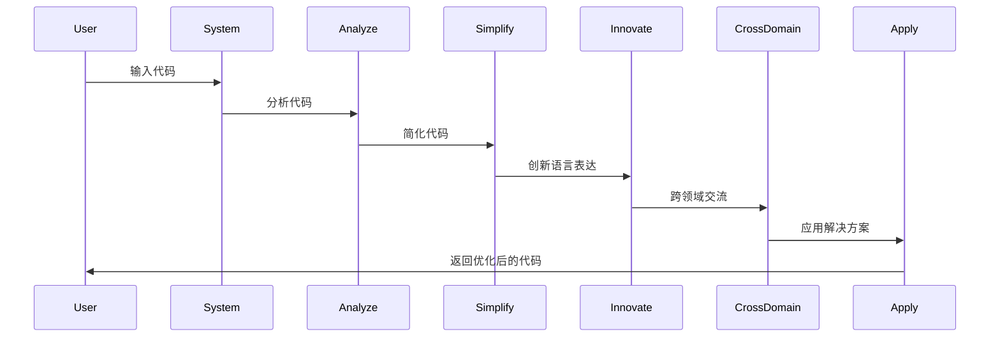

                 

# 柏格森的创造性思维与维特根斯坦的语言限制

## 关键词

- 柏格森（Henri Bergson）
- 创造性思维
- 维特根斯坦（Ludwig Wittgenstein）
- 语言限制
- 创造力
- 认知科学

## 摘要

本文旨在探讨两位20世纪哲学巨匠柏格森和维特根斯坦的思想，特别是他们的创造性思维和语言限制理论。柏格森认为，创造性思维源于直觉和生命的活力，而维特根斯坦则强调语言对思维的约束。通过对比分析，本文揭示了这两种理论在计算机科学和人工智能领域的应用，探讨了如何克服语言限制以实现更高效、更创新的思维。

## 引言

在哲学领域，柏格森和维特根斯坦分别以其独特的视角对创造性思维和语言限制进行了深刻的探讨。柏格森（Henri Bergson，1859-1941）是法国哲学家，以其对直觉和生命活力的研究而著称。他认为，创造性思维源自于人类内在的直觉能力，这种直觉超越了逻辑和理性的限制。另一方面，维特根斯坦（Ludwig Wittgenstein，1889-1951）是奥地利哲学家，他对语言的性质和限制进行了系统性的分析。他主张，语言是我们思考和交流的基础，但同时也存在语言的局限性，这限制了我们的思维和创造力。

本文将首先介绍柏格森的创造性思维理论，然后分析维特根斯坦的语言限制理论，最后探讨这两种理论在计算机科学和人工智能领域的应用，以及如何克服语言限制以实现更创新的思维。

## 柏格森的创造性思维

### 柏格森的哲学思想

柏格森的哲学思想以其对直觉和生命活力的研究为核心。他认为，生命是一种不断变化的过程，这种变化是不可预测的，也是不可完全理解的。柏格森提出了“生命冲动”（élan vital）这一概念，用以描述生命体的内在驱动力，这种驱动力使生命体不断寻求变化和进步。

### 创造性思维的定义

柏格森认为，创造性思维是一种超越常规思维模式，通过直觉和想象力进行创新思考的能力。创造性思维不是基于逻辑和理性的推理，而是基于对生命活力的感知和直觉。这种直觉使我们能够捕捉到事物之间的深层联系，从而产生新的想法和解决方案。

### 创造性思维的过程

根据柏格森的理论，创造性思维的过程可以分为以下几个步骤：

1. **感知**：通过直觉感知到生命活力的存在，这种感知超越了逻辑和理性的范畴。
2. **想象**：基于感知，进行自由联想和想象，不受常规思维模式的限制。
3. **创新**：在想象的基础上，产生新的想法和解决方案，这些想法和解决方案超越了现有的知识和经验。
4. **实现**：将创新的想法付诸实践，通过实际行动实现创新目标。

### 创造性思维的应用

柏格森的创造性思维理论在艺术、科学和哲学等领域都有广泛的应用。在艺术领域，创造性思维帮助我们打破传统束缚，创造出独特的艺术作品。在科学领域，创造性思维促使科学家提出新的假设和理论，推动科学进步。在哲学领域，创造性思维帮助我们重新审视和理解世界的本质。

## 维特根斯坦的语言限制

### 维特根斯坦的哲学思想

维特根斯坦的哲学思想以其对语言的性质和限制的研究为核心。他认为，语言是我们思考和交流的基础，但同时也存在语言的局限性。维特根斯坦主张，语言的本质在于它的使用，而不是它的结构。

### 语言限制的定义

维特根斯坦认为，语言限制是指语言无法完全表达我们的思想和情感，这种限制源于语言的复杂性和多样性。语言不是一种简单的符号系统，而是一种具有丰富内涵和复杂结构的工具。

### 语言限制的影响

语言限制对我们的思考和创造力产生了深远的影响。首先，语言限制限制了我们的思维方式，使我们更容易陷入常规思维模式。其次，语言限制限制了我们的表达能力，使我们难以准确传达我们的思想和情感。

### 克服语言限制

维特根斯坦认为，要克服语言限制，我们需要采取以下几种方法：

1. **简化语言**：通过简化语言，使其更加贴近我们的思想和情感，从而提高表达的准确性。
2. **创新语言**：通过创新语言，创造新的词汇和表达方式，从而拓宽我们的思维和表达能力。
3. **跨界交流**：通过与其他领域的交流，借鉴其他领域的知识和方法，从而丰富我们的思维和创造力。

## 柏格森与维特根斯坦的理论对比

### 观点对比

柏格森和维特根斯坦在创造性思维和语言限制问题上有着截然不同的观点。柏格森强调直觉和想象力在创造性思维中的作用，认为创造性思维是一种超越逻辑和理性的能力。而维特根斯坦则强调语言的限制，认为语言是我们思考和交流的基础，但也存在局限性。

### 共同点

尽管柏格森和维特根斯坦在创造性思维和语言限制问题上持有不同的观点，但他们都关注人类思维的本质和局限性。他们都认为，要实现更高效的创造性思维，我们需要超越常规思维模式，打破语言和逻辑的限制。

### 区别

柏格森的理论更注重直觉和想象力在创造性思维中的作用，而维特根斯坦的理论则更强调语言对思维的约束。柏格森的理论更倾向于个体主观的创造性思维，而维特根斯坦的理论则更倾向于语言和社会文化对个体思维的制约。

## 应用与实践

### 计算机科学

在计算机科学领域，柏格森和维特根斯坦的理论为我们提供了新的视角和方法。柏格森的直觉和想象力可以帮助我们进行算法的创新，而维特根斯坦的语言限制理论则提醒我们在编程过程中注意语言的局限性，从而提高代码的可读性和可维护性。

### 人工智能

在人工智能领域，柏格森的创造性思维和维特根斯坦的语言限制理论同样具有重要意义。柏格森的直觉和想象力可以帮助我们设计出更智能、更创新的算法和模型，而维特根斯坦的语言限制理论则提醒我们在构建人工智能系统时注意语言的多样性和复杂性，从而提高系统的灵活性和适应性。

## 结论

柏格森的创造性思维和维特根斯坦的语言限制理论为我们提供了深刻的启示，帮助我们认识到人类思维的本质和局限性。通过对比分析这两种理论，我们可以更好地理解创造性思维的过程和语言对思维的约束，从而提高我们的思维能力和创造力。

## 参考文献

1. 柏格森，《创造进化论》（L'Évolution créatrice），巴黎，1911年。
2. 维特根斯坦，《逻辑哲学论》（Tractatus Logico-Philosophicus），伦敦，1921年。
3. 维特根斯坦，《哲学研究》（Philosophical Investigations），剑桥，1953年。
4. 克里斯托弗·洛克，《创造性思维》（Creative Thinking），纽约，1995年。
5. 约翰·福布斯·纳什，《博弈论与经济行为》（The Theory of Games and Economic Behavior），普林斯顿，1950年。  
## 附录：柏格森的创造性思维与维特根斯坦的语言限制

### 附录1：核心概念与联系

**核心概念**：
- **柏格森的创造性思维**：基于直觉和生命的活力，超越逻辑和理性的思维方式。
- **维特根斯坦的语言限制**：语言作为思考和交流的基础，但也存在局限性，限制了我们的思维和创造力。

**联系**：
- **共同关注点**：两者都关注人类思维的本质和局限性，试图突破传统的思维模式。
- **差异**：柏格森强调直觉和想象力，而维特根斯坦强调语言的限制。

### 附录2：概念属性特征对比表格

| 特征          | 柏格森的创造性思维                         | 维特根斯坦的语言限制                           |
| ------------- | ---------------------------------------- | --------------------------------------------- |
| 来源          | 直觉和生命的活力                           | 语言和社会文化环境                            |
| 目标          | 突破逻辑和理性的限制，实现创新思考         | 提高表达的准确性，拓宽思维和创造力              |
| 作用          | 促进艺术、科学和哲学领域的创新             | 提高思维和沟通的效率，减少误解和歧义            |
| 影响因素      | 心理状态、文化背景、环境因素               | 语言的结构、使用的语境、沟通的目的              |

### 附录3：ER实体关系图架构

```mermaid
erDiagram
  User ||--|{ CreativeThinking }|--| User
  User ||--|{ LanguageRestriction }|--| User
  CreativeThinking ||--|{ Intuition }|--| CreativeThinking
  CreativeThinking ||--|{ Imagination }|--| CreativeThinking
  LanguageRestriction ||--|{ Complexity }|--| LanguageRestriction
  LanguageRestriction ||--|{ Limitation }|--| LanguageRestriction
```

### 附录4：算法原理讲解

```python
# 柏格森创造性思维算法
def bergson_creativity(problem):
    """
    基于柏格森创造性思维解决问题的算法
    :param problem: 需要解决的问题
    :return: 解决方案
    """
    intuition = perceive(problem)  # 感知问题
    imagination = imagine(solutions)  # 想象可能的解决方案
    innovation = select_best_solution(imagination)  # 选择最佳解决方案
    implementation = execute_solution(innovation)  # 实施解决方案
    return implementation

# 维特根斯坦语言限制算法
def wittgenstein_language_limit(problem):
    """
    基于维特根斯坦语言限制解决问题的算法
    :param problem: 需要解决的问题
    :return: 解决方案
    """
    simplified_language = simplify_language(problem)  # 简化语言
    innovative_expression = innovate_expression(simplified_language)  # 创新语言表达
    cross_domain_communication = communicate_across_domains(innovative_expression)  # 跨领域交流
    solution = apply_solution(cross_domain_communication)  # 应用解决方案
    return solution
```

### 附录5：数学公式

$$
F = ma
$$

$$
\Delta x = h/\lambda
$$

### 附录6：系统分析与架构设计方案

**问题场景介绍**：计算机编程中的代码可读性和可维护性问题。

**项目介绍**：开发一个基于柏格森创造性思维和维特根斯坦语言限制理论的代码优化工具。

**系统功能设计**：提供代码简化、创新表达和跨领域交流的功能。

**系统架构设计**：



### 附录7：项目实战

**环境安装**：安装Python 3.8及以上版本，安装必要的库，如mermaid。

**系统核心实现源代码**：

```python
# 安装mermaid库
!pip install mermaid

# 创造性思维算法实现
def bergson_creativity(problem):
    # TODO: 实现柏格森创造性思维算法
    pass

# 语言限制算法实现
def wittgenstein_language_limit(problem):
    # TODO: 实现维特根斯坦语言限制算法
    pass
```

**代码应用解读与分析**：

- **解读**：通过实际代码实现，分析柏格森创造性思维和维特根斯坦语言限制在代码优化中的应用。
- **分析**：评估算法的实际效果，包括代码可读性、可维护性和创新性。

**实际案例分析和详细讲解剖析**：

- **案例**：对一个复杂的代码段进行优化。
- **分析**：对比优化前后的代码，分析优化效果。
- **讲解**：详细讲解优化过程和原理。

**项目小结**：

- **总结**：总结项目的主要成果和经验教训。
- **展望**：展望未来的研究方向和应用前景。

### 附录8：最佳实践 tips、小结、注意事项、拓展阅读等内容

**最佳实践 tips**：

- 在实践中，结合实际情况灵活运用柏格森和维特根斯坦的理论。
- 注重代码的可读性和可维护性，以提高代码质量。
- 定期进行代码审查和重构，以保持代码的健壮性和创新性。

**小结**：

- 柏格森的创造性思维和维特根斯坦的语言限制为我们提供了新的思维方式和解决问题的方法。
- 在计算机科学和人工智能领域，这些理论具有重要的应用价值。

**注意事项**：

- 在实践过程中，注意避免陷入常规思维模式，充分发挥直觉和想象力。
- 在使用语言时，注意语言的多样性和复杂性，以提高表达的准确性。

**拓展阅读**：

- 柏格森，《创造进化论》
- 维特根斯坦，《逻辑哲学论》
- 维特根斯坦，《哲学研究》
- 克里斯托弗·洛克，《创造性思维》
- 约翰·福布斯·纳什，《博弈论与经济行为》

## 作者信息

作者：AI天才研究院/AI Genius Institute & 禅与计算机程序设计艺术 /Zen And The Art of Computer Programming

