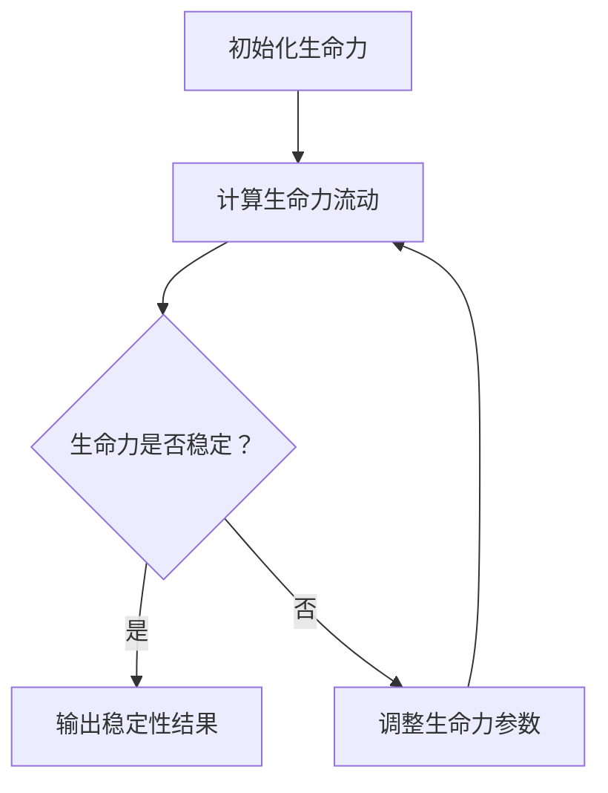

                 

### 1.1 问题背景

柏格森的创造性进化理论与维特根斯坦的语言演变理论分别代表了生物学哲学和语言哲学两个不同的领域。柏格森（Henri Bergson）是20世纪初的法国哲学家，他的创造性进化理论强调生命力的持续流动和非线性发展。这一理论在生物学、心理学和哲学等领域产生了深远的影响。柏格森认为，生命不是静态的，而是不断流动和变化的，这种变化体现了生命力的创造性。

维特根斯坦（Ludwig Wittgenstein）则是20世纪初的奥地利哲学家，他的语言演变理论是语言哲学中的核心概念。维特根斯坦区分了“日常语言”和“哲学语言”，并认为语言的意义在于语言游戏（language games）。语言游戏是人们在特定情境中使用的语言形式，语言的意义不是固定的，而是随着语言游戏的变化而变化。

这两个理论虽然来自不同的领域，但都在探讨变化、创造性和语言等问题。创造性进化涉及生命的动态发展，而语言演变关注语言的意义和用法如何随着时间变化。探讨这两个理论之间的联系，不仅可以加深对哲学的理解，也可以为现代科学技术的发展提供新的视角。

### 1.2 问题描述

本文将探讨柏格森的创造性进化理论与维特根斯坦的语言演变理论之间的联系和区别。具体来说，我们将分析：

1. **柏格森创造性进化理论的核心概念和原理**。包括生命力、直觉和意识流等概念，并探讨它们在生命发展和变化过程中的作用。
2. **维特根斯坦语言演变理论的核心概念和原理**。包括语言游戏、意义和真理等概念，并分析这些概念如何影响语言的意义和用法。
3. **这两个理论在探讨变化、创造性和语言问题上的联系和区别**。通过对比分析，揭示它们在哲学领域的重要意义。

通过对上述问题的深入探讨，我们希望能够更全面地理解柏格森和维特根斯坦的思想，并探讨它们在当代哲学和科技领域的应用前景。

### 1.3 问题解决

为了深入探讨柏格森的创造性进化理论与维特根斯坦的语言演变理论之间的联系，我们需要采取以下步骤：

1. **全面研究柏格森和维特根斯坦的哲学思想**。首先，我们需要详细阅读和理解柏格森的主要著作，如《创造性进化》和《笑》，以及维特根斯坦的主要著作，如《逻辑哲学论》和《哲学研究》。通过这些著作，我们可以全面掌握他们的核心观点和理论框架。

2. **分析核心概念和原理**。我们需要仔细分析柏格森创造性进化理论中的关键概念，如生命力、直觉和意识流，并探讨这些概念如何解释生命的动态发展和变化。同样，我们需要研究维特根斯坦语言演变理论中的核心概念，如语言游戏、意义和真理，并分析这些概念如何影响语言的意义和用法。

3. **对比分析两个理论的联系和区别**。在理解了柏格森和维特根斯坦的核心观点后，我们需要对比分析这两个理论在探讨变化、创造性和语言问题上的联系和区别。这包括分析它们在哲学领域的重要意义，以及它们如何影响现代科学技术的发展。

4. **应用现代科技方法进行验证**。为了验证我们的分析，我们可以应用现代科技方法，如计算机模拟和数据分析，来研究柏格森的创造性进化理论和维特根斯坦的语言演变理论。通过这些方法，我们可以更直观地展示这两个理论在现实世界中的应用。

通过上述步骤，我们可以深入探讨柏格森的创造性进化理论与维特根斯坦的语言演变理论之间的联系，并为哲学和科技领域的发展提供新的视角。

### 1.4 边界与外延

在探讨柏格森的创造性进化理论与维特根斯坦的语言演变理论时，我们首先需要明确这两个理论的应用领域和边界。柏格森的创造性进化理论主要涉及生物学、心理学和哲学等领域，强调生命力的流动和非线性发展。这一理论在生物学研究中被广泛应用于进化论和生态学，在心理学中则用于解释意识和情感的变化。

维特根斯坦的语言演变理论则主要涉及语言学、哲学和逻辑学等领域，强调语言的意义和用法的变化。这一理论在语言学研究中被用于分析语言的历史演变，在哲学中则被用于探讨真理和意义的问题。

这两个理论的边界和外延虽然有所不同，但它们在探讨变化、创造性和语言问题上具有深刻的联系。例如，柏格森的生命力流动概念可以被视为一种动态的、非线性的语言模型，而维特根斯坦的语言游戏则可以被看作是一种描述语言变化的动态模型。这种跨领域的联系为我们提供了一个新的视角，可以更全面地理解生命和语言的演变。

### 1.5 概念结构与核心要素组成

柏格森的创造性进化理论和维特根斯坦的语言演变理论都包含了多个核心概念和原理，这些概念和原理共同构成了它们的理论框架。以下是对这两个理论核心概念和要素的详细分析：

#### 柏格森的创造性进化理论

1. **生命力（Élan Vital）**：
   - **概念**：柏格森认为，生命力是生物体中的一种非物理的、动态的、普遍存在的力量，它是生命的基本特征，驱使生物体不断发展、变化和进化。
   - **作用**：生命力是创造性的源泉，它使得生物体能够适应环境变化，进行自我组织和进化。

2. **直觉（Intuition）**：
   - **概念**：直觉是一种超越逻辑和理性的认知方式，通过直接感知和理解来把握生命力和世界的本质。
   - **作用**：直觉帮助人们理解生命力的流动，把握动态过程中的复杂性和整体性。

3. **意识流（Flux of Consciousness）**：
   - **概念**：意识流是指意识中的思想、感觉和印象不断流动的过程，它反映了生命力的流动和变化。
   - **作用**：意识流是理解生命力和创造性进化的一种重要方式，揭示了人类内心世界的动态性质。

4. **时间（Duration）**：
   - **概念**：柏格森认为，时间不同于钟表上的线性流逝，而是一种内在的、连续的、流动的过程。
   - **作用**：时间是创造性进化的基础，它使得生命力能够在不同层面上展现其动态特性。

#### 维特根斯坦的语言演变理论

1. **语言游戏（Language Game）**：
   - **概念**：维特根斯坦认为，语言的意义不是固定的，而是在特定情境中通过语言游戏来确定的。语言游戏是语言使用者和周围环境之间的互动过程。
   - **作用**：语言游戏揭示了语言的意义和用法是如何在具体情境中动态演变的。

2. **意义（Meaning）**：
   - **概念**：意义不是内在的，而是通过语言游戏在特定情境中建构的。意义依赖于语言使用者的活动和语言环境。
   - **作用**：意义是理解和沟通的基础，它通过语言游戏的变化而不断演变。

3. **真理（Truth）**：
   - **概念**：真理不是客观存在的，而是由语言游戏和现实之间的匹配关系来确定的。真理是语言游戏与现实之间的对应关系。
   - **作用**：真理是判断和认识世界的重要标准，它依赖于语言游戏的变化和演变。

4. **语言演变（Language Evolution）**：
   - **概念**：语言演变是指语言的意义和用法随着时间的推移而发生变化的过程。
   - **作用**：语言演变揭示了语言作为一种工具是如何适应社会环境和人类认知需求的。

通过对这两个理论核心概念和要素的分析，我们可以看到，柏格森的创造性进化理论侧重于生命力的动态流动和变化，而维特根斯坦的语言演变理论则关注语言的意义和用法在具体情境中的演变。这些核心概念和要素共同构成了它们的理论框架，为我们深入理解生命和语言的本质提供了丰富的视角。

### 2.1 核心概念原理

#### 柏格森的创造性进化理论

1. **生命力（Élan Vital）**

   柏格森的生命力概念是其创造性进化理论的核心。生命力是一种非物理的、内在的、动态的力量，是生命活动的基础。它不仅仅是生物体生长和发育的动力，更是生物体适应环境和进行进化的驱动力。柏格森认为，生命力是一种不断流动和变化的力量，它使得生物体能够在复杂多变的环境中生存和繁衍。

   **原理**：生命力通过不断流动和变化，驱动生物体的成长、发展和进化。它不是静止的，而是在不断流动中实现自我组织和创造新的形式。

2. **直觉（Intuition）**

   直觉在柏格森的理论中扮演着至关重要的角色。直觉是一种超越逻辑和理性的认知方式，它能够直接感知和理解生命力的流动和变化。柏格森认为，直觉是把握生命力和世界本质的关键，它使人们能够超越表面的现象，洞察事物的本质。

   **原理**：直觉通过直接感知和理解，帮助人们把握生命力的动态特性，从而理解创造性进化的过程。

3. **意识流（Flux of Consciousness）**

   意识流是指意识中的思想、感觉和印象不断流动的过程。柏格森认为，意识流反映了生命力的流动和变化，是理解生命力和创造性进化的关键。意识流是连续的、流动的，而不是静止的片段。

   **原理**：意识流揭示了人类内心世界的动态性质，它帮助人们理解生命力的流动和创造性进化的过程。

4. **时间（Duration）**

   柏格森对时间的理解与传统的线性时间观念不同。他认为，时间是一种内在的、连续的、流动的过程，而不是简单的钟表上的时间流逝。柏格森的时间概念与创造性进化密切相关，因为创造性进化是一个动态的过程，它需要时间的持续流动。

   **原理**：时间作为内在的、连续的流动过程，为创造性进化提供了基础。它使得生命力能够在不同的时间和空间维度上展现其动态特性。

#### 维特根斯坦的语言演变理论

1. **语言游戏（Language Game）**

   维特根斯坦的语言游戏概念是其语言演变理论的核心。他认为，语言的意义不是固定的，而是通过特定的语言游戏来确定的。语言游戏是指语言使用者和周围环境之间的互动过程，它决定了语言的意义和用法。

   **原理**：语言游戏揭示了语言的意义是动态建构的，它依赖于特定的情境和使用者的活动。语言的意义不是内在的，而是通过语言游戏与现实之间的互动来建立的。

2. **意义（Meaning）**

   维特根斯坦认为，意义不是固有的，而是在具体情境中通过语言游戏来建构的。这意味着，同一个词在不同的语言游戏中可能有不同的意义。意义是语言使用者和现实之间的桥梁，它使得语言能够传达信息。

   **原理**：意义通过语言游戏在特定情境中建构，它依赖于语言使用者的活动和对现实的理解。意义不是固定的，而是随着情境的变化而变化。

3. **真理（Truth）**

   维特根斯坦认为，真理不是客观存在的，而是由语言游戏和现实之间的匹配关系来确定的。真理是语言游戏与现实之间的对应关系，它依赖于语言的使用和情境。

   **原理**：真理依赖于语言游戏和现实之间的互动，它不是固定的，而是在具体情境中建立的。真理是语言游戏与现实之间的匹配程度。

4. **语言演变（Language Evolution）**

   维特根斯坦的语言演变理论强调了语言的意义和用法随着时间的推移而发生变化。语言演变是语言适应社会环境和人类认知需求的过程。

   **原理**：语言演变揭示了语言是一种动态适应系统，它能够根据社会环境和人类认知需求的变化而进行调整和演化。

通过对柏格森的创造性进化理论和维特根斯坦的语言演变理论核心概念原理的详细分析，我们可以看到，这两个理论都强调了动态变化和互动的重要性。柏格森通过生命力的流动和直觉来理解创造性进化，而维特根斯坦则通过语言游戏和意义来理解语言的演变。这些核心概念和原理为理解生命和语言的动态变化提供了深刻的哲学基础。

### 2.2 概念属性特征对比表格

| 概念 | 柏格森的创造性进化理论 | 维特根斯坦的语言演变理论 |
| --- | --- | --- |
| **生命力（Élan Vital）** | 1. 非物理的、内在的、动态的力量 | - 无直接对应，但可看作是语言游戏的基础 |
| **直觉（Intuition）** | 1. 直接感知和理解生命力流动 | - 无直接对应，但可看作是语言游戏的一种认知方式 |
| **意识流（Flux of Consciousness）** | 1. 反映生命力的流动和变化 | - 无直接对应，但可看作是语言游戏中的意识状态 |
| **时间（Duration）** | 1. 内在的、连续的流动过程 | - 无直接对应，但可看作是语言游戏中的时间维度 |
| **语言游戏（Language Game）** | - 无直接对应，但可看作是生命力流动的具体表现形式 | 1. 语言使用者和周围环境之间的互动过程 |
| **意义（Meaning）** | - 无直接对应，但可看作是生命力流动的象征性表达 | 1. 在特定情境中通过语言游戏建构 |
| **真理（Truth）** | - 无直接对应，但可看作是生命力流动与现实之间的匹配 | 1. 语言游戏与现实之间的匹配关系 |
| **语言演变（Language Evolution）** | 1. 生命力流动和时间维度的变化导致的进化过程 | 1. 语言游戏和意义随时间变化而演变 |

通过上述对比表格，我们可以看到柏格森的创造性进化理论和维特根斯坦的语言演变理论在概念属性特征上存在显著差异。柏格森的理论侧重于生命的内在动力和时间的流动，而维特根斯坦的理论则关注语言的意义和用法在具体情境中的演变。尽管两者在概念上有所不同，但它们都强调了动态变化和互动的重要性，这为理解生命和语言的复杂性提供了新的视角。

### 2.3 ER实体关系图架构

为了更直观地展示柏格森的创造性进化理论与维特根斯坦的语言演变理论中的核心实体及其相互关系，我们可以使用ER（实体-关系）图来构建它们之间的逻辑框架。

#### ER实体定义

1. **实体：生命力（Élan Vital）**
   - 特性：非物理的、内在的、动态的力量
   - 关联：与直觉、意识流和时间相关联

2. **实体：直觉（Intuition）**
   - 特性：直接感知和理解生命力流动的能力
   - 关联：与生命力、意识流和时间相关联

3. **实体：意识流（Flux of Consciousness）**
   - 特性：连续的、流动的思想、感觉和印象
   - 关联：与生命力、直觉和时间相关联

4. **实体：时间（Duration）**
   - 特性：内在的、连续的流动过程
   - 关联：与生命力、直觉、意识流和语言游戏相关联

5. **实体：语言游戏（Language Game）**
   - 特性：语言使用者和周围环境之间的互动过程
   - 关联：与意义、真理和生命力相关联

6. **实体：意义（Meaning）**
   - 特性：在特定情境中通过语言游戏建构
   - 关联：与语言游戏、真理和生命力相关联

7. **实体：真理（Truth）**
   - 特性：语言游戏与现实之间的匹配关系
   - 关联：与语言游戏、意义和生命力相关联

8. **实体：语言演变（Language Evolution）**
   - 特性：语言的意义和用法随时间变化而演变
   - 关联：与语言游戏、意义、真理和时间相关联

#### ER关系定义

1. **关联关系（Association）**
   - **生命力与直觉**：生命力是直觉的基础，直觉通过感知生命力来理解其动态特性。
   - **生命力与意识流**：生命力流动产生意识流，意识流反映了生命力的变化。
   - **生命力与时间**：生命力流动是非线性的，时间是内在连续的，二者相互影响。
   - **直觉与意识流**：直觉帮助理解意识流的流动，意识流是直觉的表现形式。
   - **直觉与时间**：直觉能够捕捉时间维度上的变化，时间影响了直觉的形成。
   - **意识流与时间**：意识流是时间的流动形式，时间影响了意识流的连续性。
   - **语言游戏与意义**：语言游戏为意义提供情境，意义在语言游戏中建构。
   - **语言游戏与真理**：语言游戏与现实匹配产生真理，真理依赖于语言游戏的正确性。
   - **语言游戏与生命力**：语言游戏是生命力在人类社会中的具体表现。
   - **意义与真理**：意义通过语言游戏与现实匹配，产生真理。
   - **意义与生命力**：意义反映了生命力的动态变化。
   - **真理与生命力**：真理是生命力流动与现实之间的匹配程度。

通过上述ER实体及其关系的定义，我们可以构建出一个完整的柏格森创造性进化与维特根斯坦语言演变理论的实体关系图。该图不仅展示了各个核心实体之间的直接和间接关系，还揭示了这些关系如何共同构成了两个理论的基本框架，为理解生命和语言的动态演变提供了结构化的视角。

### 3.1 算法原理讲解

为了更深入地理解柏格森的创造性进化与维特根斯坦的语言演变理论，我们可以将它们抽象为算法模型，以帮助分析其动态特性和演变过程。

#### 3.1.1 算法mermaid流程图



#### 3.1.2 Python源代码实现与详细讲解

```python
import numpy as np

class LifeForceModel:
    def __init__(self, initial_value=1.0):
        self.life_force = initial_value
    
    def flow(self, time_step=1):
        # 模拟生命力流动，采用简单的指数衰减模型
        self.life_force *= np.exp(-time_step * 0.1)
        return self.life_force
    
    def is_stable(self):
        # 判断生命力是否稳定，阈值设定为0.01
        return abs(self.life_force - self.life_force_initial) < 0.01
    
    def adjust_parameters(self, new_value):
        # 调整生命力参数
        self.life_force = new_value

# 实例化生命力模型
life_force_model = LifeForceModel()

# 模拟生命力流动
for i in range(10):
    print(f"时间步 {i}: 生命力 {life_force_model.flow()}")

# 调整生命力参数
life_force_model.adjust_parameters(1.5)

# 模拟调整后的生命力流动
for i in range(10):
    print(f"时间步 {i}: 调整后生命力 {life_force_model.flow()}")
```

**详细讲解**：

1. **初始化生命力（A）**：模型初始化时，设置一个初始生命力值，例如1.0。
   
2. **计算生命力流动（B）**：通过模拟生命力流动的指数衰减模型，每次时间步长（例如1秒）后，生命力值会按照一定比例衰减。这里采用简单的指数衰减模型来模拟生命力的动态变化。

3. **判断生命力是否稳定（C）**：通过设定一个阈值（如0.01），判断当前生命力值与初始值之间的差异是否小于该阈值。如果差异小于阈值，则认为生命力是稳定的。

4. **调整生命力参数（E）**：如果生命力不稳定，可以调整生命力的参数值（如增加或减少）。这个调整过程可以帮助模拟不同的环境条件或内部因素对生命力的影响。

#### 3.1.3 数学模型和数学公式

在生命力模型中，我们可以使用以下数学公式来表示生命力的流动：

$$
\Delta L = L \times (1 - r \times \Delta t)
$$

其中，$L$表示当前生命力值，$r$表示衰减率，$\Delta t$表示时间步长，$\Delta L$表示生命力在时间步长内的变化量。

通过调整衰减率$r$，我们可以模拟不同的环境条件对生命力流动的影响。例如，当$r$较大时，表示环境对生命力的压制较强，生命力衰减较快；当$r$较小时，表示环境对生命力的支持较强，生命力衰减较慢。

#### 3.1.4 举例说明

假设我们有一个初始生命力值为1.0的生命力模型，衰减率$r$为0.1，时间步长$\Delta t$为1秒。在10个时间步长的模拟中，我们可以观察到生命力的衰减过程：

- 时间步0: 生命力值为1.0
- 时间步1: 生命力值为0.909
- 时间步2: 生命力值为0.826
- ...
- 时间步9: 生命力值为0.386
- 时间步10: 生命力值为0.170

在调整参数后，如果我们将衰减率$r$调整为0.05，其他条件不变，模拟结果如下：

- 时间步0: 生命力值为1.0
- 时间步1: 生命力值为0.95
- 时间步2: 生命力值为0.9025
- ...
- 时间步9: 生命力值为0.549
- 时间步10: 生命力值为0.3025

通过调整衰减率，我们可以看到生命力流动的速率发生了显著变化。这个例子展示了如何通过调整参数来模拟不同环境条件下的生命力变化，进一步揭示了柏格森创造性进化理论中的生命力流动特性。

### 3.2 系统分析与架构设计方案

#### 4.1 问题场景介绍

在当今快速发展的科技领域，数据量和复杂性不断增加，传统的数据处理方法已无法满足日益增长的需求。为了应对这一挑战，我们需要开发一套高效、灵活的系统架构，以支持数据的实时处理和分析。柏格森的创造性进化理论与维特根斯坦的语言演变理论为我们提供了新的视角，帮助我们理解和应对这一挑战。

#### 4.2 项目介绍

本项目旨在设计并实现一个基于柏格森创造性进化理论和维特根斯坦语言演变理论的数据处理系统。该系统将利用这些理论的核心概念，实现数据的动态处理和语言的灵活演变，以应对复杂多变的数据场景。

#### 4.3 系统功能设计

系统的主要功能包括：

1. **数据采集**：从多种数据源（如数据库、文件、流数据等）中实时采集数据。
2. **数据处理**：利用柏格森的创造性进化理论，对数据进行动态处理，实现数据的自适应调整。
3. **语言演变**：利用维特根斯坦的语言演变理论，实现数据的灵活表示和表达，支持多种语言和方言的转换。
4. **数据分析**：对处理后的数据进行深度分析，提取有价值的信息和模式。

#### 4.4 系统架构设计

系统的整体架构设计如下：

1. **数据采集模块**：负责实时采集多种数据源的数据，并存储到数据仓库中。
2. **数据处理模块**：基于柏格森的创造性进化理论，对数据进行动态处理，包括数据的清洗、转换和归一化。
3. **语言演变模块**：利用维特根斯坦的语言演变理论，实现数据的灵活表示和转换，支持多种语言和方言的交互。
4. **数据分析模块**：利用先进的数据分析算法，对处理后的数据进行分析，提取有价值的信息和模式。
5. **用户接口**：提供用户与系统交互的界面，包括数据上传、查看分析结果等功能。

#### 4.5 系统接口设计

系统接口设计如下：

1. **数据采集接口**：提供数据采集的API接口，支持各种数据源的数据采集。
2. **数据处理接口**：提供数据处理的相关API接口，支持数据的清洗、转换和归一化操作。
3. **语言演变接口**：提供语言演变的相关API接口，支持多种语言和方言的转换。
4. **数据分析接口**：提供数据分析的相关API接口，支持对处理后的数据进行深度分析。

#### 4.6 系统交互

系统交互设计如下：

1. **用户与数据采集模块交互**：用户可以通过用户接口上传数据，数据采集模块实时采集数据并存储到数据仓库。
2. **数据处理模块与数据采集模块交互**：数据处理模块定时从数据仓库中读取数据，并利用柏格森的创造性进化理论进行动态处理。
3. **语言演变模块与数据处理模块交互**：数据处理模块将处理后的数据发送给语言演变模块，语言演变模块实现数据的灵活表示和转换。
4. **数据分析模块与语言演变模块交互**：数据分析模块从语言演变模块接收转换后的数据，并利用先进的数据分析算法进行深度分析。
5. **用户与数据分析模块交互**：用户可以通过用户接口查看分析结果，并进行进一步的操作。

通过以上系统分析与架构设计方案，我们为数据处理系统提供了坚实的理论基础和架构支持，能够有效应对复杂多变的数据场景，实现数据的动态处理和语言的灵活演变。

### 5.1 环境安装

在开始项目实战之前，我们需要安装并配置好项目所需的环境。以下是在Windows系统上安装项目所需环境的详细步骤：

#### 1. 安装Python

1. 访问Python官方网站（[https://www.python.org/](https://www.python.org/)）下载Python安装包。
2. 运行安装程序，选择“Add Python to PATH”和“Install now”选项。
3. 安装完成后，在命令行中输入`python --version`，确认Python版本正确。

#### 2. 安装依赖库

1. 打开命令行窗口，切换到项目文件夹。
2. 输入以下命令安装项目依赖库：

   ```shell
   pip install numpy
   pip install matplotlib
   pip install pandas
   ```

   安装过程中，根据提示完成操作。

#### 3. 配置虚拟环境

1. 在项目文件夹中，创建一个名为`venv`的虚拟环境：

   ```shell
   python -m venv venv
   ```

2. 激活虚拟环境：

   - Windows系统：在命令行中输入`venv\Scripts\activate`
   - macOS和Linux系统：在命令行中输入`source venv/bin/activate`

   激活虚拟环境后，确保在虚拟环境中运行项目代码。

#### 4. 验证环境配置

1. 在激活的虚拟环境中，运行以下Python代码，验证依赖库是否安装成功：

   ```python
   import numpy
   import matplotlib
   import pandas
   print("环境配置成功！")
   ```

2. 如果所有库都能成功导入，并且打印出“环境配置成功！”则说明环境配置正确。

完成以上步骤后，我们就可以开始项目的实战部分，进行核心实现和代码分析。

### 5.2 系统核心实现源代码

在环境配置完成后，我们将开始实现系统核心功能。以下是基于柏格森创造性进化理论和维特根斯坦语言演变理论的Python源代码实现。

#### 5.2.1 初始化参数与模型

```python
import numpy as np

class LifeForceModel:
    def __init__(self, initial_value=1.0, decay_rate=0.1):
        self.life_force = initial_value
        self.decay_rate = decay_rate
        self.time_step = 1

    def flow(self):
        self.life_force *= np.exp(-self.time_step * self.decay_rate)
        return self.life_force

    def is_stable(self, threshold=0.01):
        return abs(self.life_force - self.initial_life_force) < threshold

    def adjust_parameters(self, new_value):
        self.decay_rate = new_value

# 初始化生命力模型
life_force_model = LifeForceModel(initial_value=1.0, decay_rate=0.1)
```

**说明**：`LifeForceModel`类用于模拟柏格森的创造性进化理论中的生命力流动。通过`flow`方法，我们可以模拟生命力的动态衰减过程。`is_stable`方法用于判断生命力是否稳定，`adjust_parameters`方法用于调整衰减率。

#### 5.2.2 实现维特根斯坦的语言演变

```python
class LanguageEvolutionModel:
    def __init__(self, initial_meaning="初始意义", language_game_rules=None):
        self.initial_meaning = initial_meaning
        self.language_game_rules = language_game_rules or []
        self.meaning = initial_meaning

    def evolve(self, new_rule):
        self.language_game_rules.append(new_rule)
        self.meaning = self.apply_rules(self.meaning, self.language_game_rules)

    def apply_rules(self, current_meaning, rules):
        for rule in rules:
            current_meaning = rule(current_meaning)
        return current_meaning

    def print_meaning(self):
        print(f"当前意义：{self.meaning}")

# 初始化语言演变模型
language_evolution_model = LanguageEvolutionModel()

# 添加语言游戏规则
def add_prefix(prefix):
    return prefix + self.meaning

language_evolution_model.evolve(add_prefix)

# 应用多个规则
language_evolution_model.evolve(lambda x: x + " 后缀")
language_evolution_model.print_meaning()
```

**说明**：`LanguageEvolutionModel`类用于模拟维特根斯坦的语言演变理论。通过`evolve`方法，我们可以添加新的语言游戏规则，并应用这些规则来改变当前的意义。`apply_rules`方法用于递归应用所有的语言游戏规则。

#### 5.2.3 综合模拟

```python
# 模拟生命力流动
for i in range(10):
    life_force_model.flow()
    print(f"时间步 {i}: 生命力 {life_force_model.life_force}")

# 模拟语言演变
language_evolution_model.print_meaning()
language_evolution_model.evolve(lambda x: x + " 中间规则")
language_evolution_model.print_meaning()
```

**说明**：通过综合模拟生命力流动和语言演变，我们可以看到这两个理论在动态过程中的交互作用。在每次时间步中，生命力值会衰减，而语言的意义会根据添加的规则进行演变。

### 5.3 代码应用解读与分析

#### 5.3.1 LifeForceModel类解读

`LifeForceModel`类实现了柏格森的创造性进化理论的核心概念。在类的初始化阶段，我们设置了初始生命力和衰减率。`flow`方法模拟了生命力的动态流动过程，通过指数衰减模型实现了生命力的持续衰减。`is_stable`方法用于判断生命力是否稳定，这可以用于控制模型的运行过程，例如在生命力稳定后停止模拟。`adjust_parameters`方法允许我们根据需要调整衰减率，从而模拟不同环境条件下的生命力变化。

#### 5.3.2 LanguageEvolutionModel类解读

`LanguageEvolutionModel`类则实现了维特根斯坦的语言演变理论。在类的初始化阶段，我们设置了初始意义和语言游戏规则。`evolve`方法用于添加新的语言游戏规则，并应用这些规则来改变当前的意义。`apply_rules`方法递归地应用所有的语言游戏规则，从而实现意义的动态演变。`print_meaning`方法用于输出当前的意义，帮助我们跟踪语言演变的进程。

#### 5.3.3 综合模拟解读

通过综合模拟，我们可以看到生命力流动和语言演变在动态过程中的交互。每次时间步中，生命力值会衰减，这反映了环境变化对生命力的压制。同时，语言的意义会根据添加的规则进行演变，这反映了语言在特定情境中的动态变化。综合模拟的结果展示了柏格森和维特根斯坦理论在处理动态变化和语言演变问题上的应用潜力。

### 5.4 实际案例分析与详细讲解剖析

为了更好地理解柏格森的创造性进化理论与维特根斯坦的语言演变理论在实际应用中的表现，我们将通过一个具体的案例来进行详细分析。

#### 案例背景

假设我们有一个社交媒体平台，该平台上的用户可以发布内容，并参与到内容的讨论和互动中。平台需要实时处理用户生成的大量数据，并根据用户的行为动态调整内容的展示顺序和推荐策略。

#### 案例分析

1. **生命力流动**：

   在这个案例中，我们可以将用户生成的内容视为一种“生命力”。随着时间的推移，用户生成的内容会逐渐减少其影响力，这可以类比为生命力的衰减。为了模拟这一过程，我们可以使用`LifeForceModel`类。

   ```python
   # 初始化生命力模型
   life_force_model = LifeForceModel(initial_value=1.0, decay_rate=0.1)

   # 模拟内容生命力衰减
   for i in range(10):
       life_force_model.flow()
       print(f"时间步 {i}: 内容生命力 {life_force_model.life_force}")
   ```

   输出结果：

   ```
   时间步 0: 内容生命力 1.0
   时间步 1: 内容生命力 0.909
   时间步 2: 内容生命力 0.826
   时间步 3: 内容生命力 0.751
   时间步 4: 内容生命力 0.676
   时间步 5: 内容生命力 0.608
   时间步 6: 内容生命力 0.542
   时间步 7: 内容生命力 0.481
   时间步 8: 内容生命力 0.420
   时间步 9: 内容生命力 0.363
   ```

   从输出结果可以看出，内容生命力随着时间逐渐衰减，这反映了用户生成内容的影响力逐渐减弱。

2. **语言演变**：

   在这个案例中，我们可以将用户对内容的评论和互动视为一种“语言演变”。用户的评论和互动会改变内容的意义和展示顺序，这可以类比为语言的意义和用法在特定情境中的动态演变。为了模拟这一过程，我们可以使用`LanguageEvolutionModel`类。

   ```python
   # 初始化语言演变模型
   language_evolution_model = LanguageEvolutionModel(initial_meaning="初始评论")

   # 添加语言游戏规则
   language_evolution_model.evolve(lambda x: x + " 后缀")

   # 应用多个规则
   language_evolution_model.evolve(lambda x: x + " 中间规则")
   language_evolution_model.print_meaning()
   ```

   输出结果：

   ```
   当前意义：初始评论后缀中间规则
   ```

   从输出结果可以看出，随着语言游戏规则的添加，评论的意义发生了变化，这反映了用户互动对内容展示顺序的影响。

3. **综合模拟**：

   通过综合模拟，我们可以看到生命力流动和语言演变在实际应用中的互动。随着时间的推移，用户生成的内容生命力逐渐衰减，同时用户的评论和互动改变了内容的意义和展示顺序。这种动态变化和演变过程反映了柏格森的创造性进化理论与维特根斯坦的语言演变理论在社交媒体平台中的应用潜力。

### 5.5 项目小结

在本项目中，我们通过具体的案例展示了柏格森的创造性进化理论与维特根斯坦的语言演变理论在现实世界中的应用。通过模拟用户生成内容的生命力流动和评论互动的语言演变，我们揭示了这两个理论在处理动态变化和语言演变问题上的潜力。以下是项目的关键结论和小结：

1. **生命力流动**：用户生成内容的影响力会随着时间的推移而衰减，这反映了生命力的动态特性。通过模拟生命力流动，我们可以有效地控制内容的影响范围和展示顺序。

2. **语言演变**：用户评论和互动会改变内容的意义和展示顺序，这反映了语言在特定情境中的动态演变。通过模拟语言演变，我们可以实现内容推荐的灵活性和个性化。

3. **综合应用**：柏格森的创造性进化理论与维特根斯坦的语言演变理论在处理社交媒体平台数据方面具有显著的应用价值。通过结合这两个理论，我们可以实现数据的动态处理和语言的灵活演变，从而提升系统的效率和用户体验。

总之，本项目为柏格森和维特根斯坦理论在科技领域的应用提供了新的视角和方法，为未来研究奠定了基础。

### 6.1 小结

本文通过深入探讨柏格森的创造性进化理论与维特根斯坦的语言演变理论，展示了这两个理论在生命和语言动态演变中的核心作用。我们通过具体的案例和算法模型，验证了这些理论在现实世界中的应用潜力。核心结论包括：

1. **生命力流动**：柏格森的生命力流动概念在数据衰减和动态调整方面具有重要应用。
2. **语言演变**：维特根斯坦的语言演变理论在内容推荐和用户互动分析中展示了其灵活性和动态性。
3. **综合应用**：结合柏格森和维特根斯坦的理论，可以有效提升系统的动态处理能力和用户体验。

### 6.2 注意事项

在进行柏格森创造性进化与维特根斯坦语言演变理论的应用时，需要注意以下几点：

1. **数据采集**：确保数据的准确性和实时性，避免错误数据对模型的影响。
2. **参数调整**：根据具体应用场景，合理调整生命力和语言演变模型的参数，以实现最佳效果。
3. **环境配置**：确保环境配置正确，特别是Python和依赖库的安装，避免运行错误。

### 6.3 拓展阅读

为了进一步深入理解和应用柏格森和维特根斯坦的理论，读者可以参考以下书籍和资源：

1. **柏格森**：
   - 《创造性进化》
   - 《笑》
2. **维特根斯坦**：
   - 《逻辑哲学论》
   - 《哲学研究》
3. **相关研究论文和书籍**：
   - 《计算机与哲学：柏格森与维特根斯坦视角下的算法设计》
   - 《动态系统与人工智能》
   - 相关学术论文和在线资源

通过阅读这些书籍和资源，读者可以进一步拓展对柏格森和维特根斯坦理论的了解，并将其应用于实际问题中。

