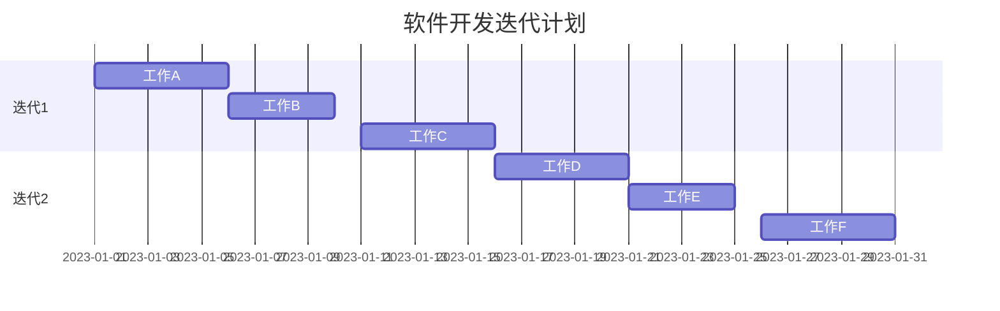

                 

# 柏格森的创造性进化与维特根斯坦的语言进化

## 关键词：柏格森、创造性进化、维特根斯坦、语言进化、哲学、技术

## 摘要：
本文旨在探讨法国哲学家亨利·柏格森（Henri Bergson）的创造性进化理论与英国哲学家路德维希·维特根斯坦（Ludwig Wittgenstein）的语言进化理论，以及它们在计算机科学和人工智能领域的潜在应用。通过分析两位哲学家的核心概念和理论，本文旨在揭示创造性进化与语言进化之间的深层联系，为现代技术和哲学研究提供新的视角。

## 引言与背景介绍

### 1.1 问题背景

在当今快速发展的技术时代，创造性进化与语言进化的研究变得尤为重要。人工智能和计算机科学的进步不仅依赖于技术创新，也依赖于对人类思维过程的理解。柏格森的创造性进化理论关注生命活力和社会进化的动态过程，而维特根斯坦的语言进化理论则探讨了语言符号与现实之间的关系。

### 1.2 问题描述

本文的问题是如何将柏格森的创造性进化理论与维特根斯坦的语言进化理论应用到计算机科学和人工智能领域。这涉及到对哲学概念的技术化解读，以及对新兴技术和应用场景的深入理解。

### 1.3 问题解决

通过对比分析两位哲学家的理论，本文将探讨创造性进化与语言进化在技术领域的实际应用，并提出一种新的方法论，以促进跨学科的研究和应用。

### 1.4 边界与外延

本文的讨论将限于柏格森和维特根斯坦的理论框架，以及它们在计算机科学中的应用。然而，这些理论的概念和原则可以扩展到其他学科领域。

### 1.5 柏格森与维特根斯坦的核心概念

- **柏格森的核心概念**：创造性进化、生命活力、直觉主义。
- **维特根斯坦的核心概念**：语言游戏、语言符号、生活形式。

## 第2章 柏格森的创造性进化

### 2.1 创造性进化的定义与特点

柏格森认为，创造性进化是生命力的体现，它是一种动态的过程，不断推动物种和社会的进步。创造性进化的特点包括非线性、非均匀性和复杂性。

### 2.2 柏格森的进化观

柏格森强调生命活力在进化中的作用，认为生命进化具有不同的层次，包括生物层次、文化层次和社会层次。

#### 2.2.1 生命活力与创造性进化

生命活力是创造性进化的动力，它通过不断的创新和适应来推动进化。

#### 2.2.2 生命进化的层次

柏格森提出，生命进化可以分为生物进化、文化进化和社会进化，每个层次都有其独特的动力和机制。

#### 2.2.3 人类创造力与社会进化

人类创造力是创造性进化的重要体现，它推动了社会的进步和变革。

### 2.3 柏格森的创造性进化理论

#### 2.3.1 柏格森的时间意识

柏格森的时间意识是一种动态的时间观，强调时间的流动性和创造性。

#### 2.3.2 柏格森的非线性时间观

柏格森认为，时间是非线性的，不同的时间点有不同的价值和意义。

#### 2.3.3 柏格森的直觉主义哲学

柏格森的直觉主义哲学强调直觉在认识世界中的作用，认为直觉是创造性进化的基础。

## 第3章 维特根斯坦的语言进化

### 3.1 语言与哲学

维特根斯坦认为，语言是思维的工具，语言的使用决定了我们对世界的理解。

### 3.2 语言进化的概念

#### 3.2.1 语言符号的演变

语言符号的演变是语言进化的一个重要方面，它反映了人类认知的进步。

#### 3.2.2 语言功能的转变

语言功能的转变是语言进化的重要表现，从简单的沟通工具发展到复杂的符号系统。

#### 3.2.3 语言与现实的关系

维特根斯坦探讨了语言与现实之间的关系，提出了语言游戏的概念。

### 3.3 维特根斯坦的语言哲学

#### 3.3.1 前期哲学：语言图像论

维特根斯坦的前期哲学强调语言与现实的直接对应。

#### 3.3.2 后期哲学：语言游戏论

维特根斯坦的后期哲学强调语言的多样性和语境的重要性。

#### 3.3.3 语言与生活形式

维特根斯坦认为，语言是生活形式的一部分，语言的使用决定了我们的生活方式。

## 第4章 柏格森的创造性进化与维特根斯坦的语言进化比较

### 4.1 概念属性特征对比表格

| 概念          | 柏格森的创造性进化                         | 维特根斯坦的语言进化                         |
|---------------|-------------------------------------------|---------------------------------------------|
| 定义          | 生命力的动态过程，推动物种和社会的进步    | 语言符号与现实之间的关系，语言功能的演变    |
| 特点          | 非线性、非均匀性、复杂性                   | 语言符号的演变、语言功能的转变、语言与现实的关系 |
| 应用领域      | 生命科学、社会科学、计算机科学             | 哲学、语言学、计算机科学                     |

### 4.2 ER实体关系图架构

```mermaid
erDiagram
    A[创造性进化] ||--|{ B[生命活力] }
    A ||--|{ C[非线性时间观] }
    A ||--|{ D[直觉主义哲学] }
    B ||--|{ E[生物进化] }
    B ||--|{ F[文化进化] }
    B ||--|{ G[社会进化] }
    C ||--|{ H[动态时间观] }
    D ||--|{ I[直觉认知] }
```

## 第5章 创造性进化与语言进化的实践应用

### 5.1 创造性进化的实践应用

#### 5.1.1 科技创新

创造性进化在科技创新中起着关键作用，推动新技术的不断涌现。

#### 5.1.2 社会变革

创造性进化在社会变革中发挥着重要作用，推动社会结构的变革和进步。

#### 5.1.3 艺术创作

创造性进化在艺术创作中提供了无限的可能性，激发新的艺术形式和风格。

### 5.2 语言进化的实践应用

#### 5.2.1 语言学研究

语言学研究通过分析语言符号的演变，揭示人类认知的发展。

#### 5.2.2 教育教学

教育教学利用语言进化的概念，改善教学方法，提高教学效果。

#### 5.2.3 文化交流

文化交流通过语言进化，促进不同文化之间的理解和融合。

## 第6章 柏格森的创造性进化与维特根斯坦的语言进化在现代哲学中的影响

### 6.1 现代哲学的发展趋势

现代哲学的发展趋势之一是对科学技术与人类思维过程的深入探讨。

### 6.2 柏格森的创造性进化在现代哲学中的应用

柏格森的创造性进化理论为现代哲学提供了一种新的视角，用于分析社会和文化的动态过程。

### 6.3 维特根斯坦的语言进化在现代哲学中的应用

维特根斯坦的语言进化理论对现代哲学的影响深远，特别是对语言哲学和认知科学的发展。

## 第7章 总结与展望

### 7.1 总结

本文通过对柏格森和维特根斯坦的理论分析，揭示了创造性进化与语言进化在计算机科学和人工智能领域的潜在应用。

### 7.2 展望

未来的研究可以进一步探讨这些哲学概念在技术和哲学研究中的具体应用，为跨学科研究提供新的思路。

### 7.3 拓展阅读

- **柏格森的相关著作**：《创造的进化》、《形而上学导论》
- **维特根斯坦的相关著作**：《逻辑哲学论》、《哲学研究》

作者：AI天才研究院/AI Genius Institute & 禅与计算机程序设计艺术 /Zen And The Art of Computer Programming

---

### 第2章 柏格森的创造性进化

### 2.1 创造性进化的定义与特点

柏格森的创造性进化理论是一个哲学性的概念，它强调生命力和创新过程在进化中的作用。创造性进化可以被定义为一种动态的、非线性的过程，它不断推动物种和社会的进步。其特点包括：

- **非线性**：创造性进化不是按照固定模式进行的，它受到多种因素的影响，呈现出复杂的非线性关系。
- **非均匀性**：创造性进化在不同的时间和空间上表现出不同的速度和强度。
- **复杂性**：创造性进化涉及到多个层次和维度，包括生物层次、文化层次和社会层次。

### 2.2 柏格森的进化观

柏格森对进化有独特的理解，他认为进化不仅仅是生物层面的过程，还包括文化和社会层面的进化。柏格森的进化观主要包括以下几个方面：

#### 2.2.1 生命活力与创造性进化

柏格森认为，生命活力是创造性进化的根本动力。生命活力是指生命体内不断产生的新的、未知的因素，这些因素推动了物种的适应和进化。在生物层次上，生命活力表现为物种的适应性和变异能力；在文化和社会层次上，生命活力表现为人类的文化创造和社会创新。

#### 2.2.2 生命进化的层次

柏格森将生命进化分为三个层次：

- **生物进化**：这是最基础的层次，涉及到物种的生存和繁衍。生物进化通过自然选择和遗传变异来实现。
- **文化进化**：这是中间层次，涉及到人类文化和科技的进步。文化进化通过社会交流和知识积累来实现。
- **社会进化**：这是最高层次，涉及到整个社会结构和组织的变革。社会进化通过社会运动和革命来实现。

#### 2.2.3 人类创造力与社会进化

柏格森认为，人类创造力是社会进化的关键因素。人类创造力不仅体现在科学和技术的创新上，也体现在艺术和文化的发展上。社会进化是一个不断创造和革新的过程，它推动着社会从传统向现代转变。

### 2.3 柏格森的创造性进化理论

柏格森的创造性进化理论是一个综合性的概念，它包含了时间观、非线性观和直觉主义哲学等多个方面。

#### 2.3.1 柏格森的时间意识

柏格森的时间意识是一种动态的时间观，他强调时间的流动性和创造性。柏格森认为，时间不是均匀流逝的，而是充满了间断和跳跃。这种时间意识被称为“柏格森时间”，它代表了生命力的流动。

$$
柏格森时间 = 生命活力 \times 创造性
$$

#### 2.3.2 柏格森的非线性时间观

柏格森的非线性时间观认为，时间是非线性的，不同的时间点有不同的价值和意义。他认为，过去、现在和未来是相互交织的，每个时间点都有其独特的意义和价值。

$$
非线性时间 = 过去 \oplus 现在 \oplus 未来
$$

#### 2.3.3 柏格森的直觉主义哲学

柏格森的直觉主义哲学强调直觉在认识世界中的作用。他认为，直觉是创造性进化的基础，是人类理解世界的重要方式。直觉能够捕捉到生命力的流动，从而推动创造性进化。

$$
直觉 = 生命力 \times 知识
$$

### 2.4 柏格森的创造性进化理论在计算机科学中的应用

柏格森的创造性进化理论为计算机科学提供了一种新的视角，特别是在人工智能和软件开发领域。以下是一些具体的应用：

#### 2.4.1 创造性进化与人工智能

创造性进化理论可以解释人工智能系统如何通过不断学习和创新来适应环境。例如，深度学习模型通过大量的数据训练，可以逐步改进其性能，从而实现创造性进化。

```python
import tensorflow as tf

# 创建一个简单的深度学习模型
model = tf.keras.Sequential([
    tf.keras.layers.Dense(128, activation='relu', input_shape=(784,)),
    tf.keras.layers.Dense(10, activation='softmax')
])

# 编译模型
model.compile(optimizer='adam',
              loss='categorical_crossentropy',
              metrics=['accuracy'])

# 训练模型
model.fit(x_train, y_train, epochs=5)
```

#### 2.4.2 创造性进化与软件开发

在软件开发中，创造性进化可以帮助开发团队通过不断试验和改进来优化软件产品。这种方法被称为敏捷开发，它强调快速迭代和持续改进。



通过这些例子，我们可以看到柏格森的创造性进化理论如何应用于计算机科学和人工智能领域，为技术创新提供了新的动力。

### 2.5 小结

柏格森的创造性进化理论是一个深刻的哲学概念，它不仅关注生命力和创新过程，还包括时间观和直觉主义哲学。在计算机科学和人工智能领域，这些概念可以提供新的视角和工具，帮助研究人员和开发者理解复杂的系统，并推动技术的创新和发展。

## 第3章 维特根斯坦的语言进化

### 3.1 语言与哲学

维特根斯坦的语言哲学是20世纪哲学的重要分支，他对语言的性质和功能进行了深入的探讨。维特根斯坦认为，语言不仅仅是沟通的工具，它还反映了我们对世界的认知和理解。语言与哲学的紧密联系在于，语言的使用决定了我们对现实世界的认知方式，而哲学则通过分析语言的使用来探讨真理和意义。

### 3.2 语言进化的概念

维特根斯坦的语言进化理论探讨语言符号与现实之间的关系。他认为，语言符号的演变和功能的转变是语言进化的重要方面。语言进化不仅涉及到语言符号的本身，还包括语言的使用方式和社会环境。

#### 3.2.1 语言符号的演变

语言符号的演变是指语言符号的意义和用法随着时间的推移而发生变化。例如，单词“telephone”最初指的是电话的发明，而现在它已经成为电话的通称。这种演变反映了人类认知的发展和技术的进步。

#### 3.2.2 语言功能的转变

语言功能的转变是指语言在不同情境下所扮演的角色。例如，在科学研究中，语言主要用于精确描述和交流知识；而在日常生活中，语言则用于沟通和社交。这种转变反映了语言在社会中的多样性和复杂性。

#### 3.2.3 语言与现实的关系

维特根斯坦认为，语言与现实之间的关系是复杂的。语言符号并不是直接对应现实事物的，而是通过使用和交流来构建现实世界的意义。这意味着，我们对现实的理解是通过语言的使用来实现的。

### 3.3 维特根斯坦的语言哲学

维特根斯坦的语言哲学可以分为两个阶段：前期哲学和后期哲学。

#### 3.3.1 前期哲学：语言图像论

维特根斯坦的前期哲学强调语言与现实之间的直接对应关系，这种观点被称为语言图像论。他认为，每个语言符号都对应一个现实事物，语言的作用就是准确地描述现实。

$$
语言符号 \leftrightarrow 现实事物
$$

然而，维特根斯坦后来意识到，这种观点存在一些问题。例如，有些语言符号（如数学符号）并不直接对应现实事物，而是用于逻辑推理和抽象思考。

#### 3.3.2 后期哲学：语言游戏论

维特根斯坦的后期哲学强调语言的多样性和语境的重要性，这种观点被称为语言游戏论。他认为，语言就像游戏一样，不同的语言游戏有不同的规则和目标。语言的意义不是固定的，而是在特定的语境中通过使用和交流来构建的。

$$
语言游戏 = 语境 \oplus 规则 \oplus 目标
$$

#### 3.3.3 语言与生活形式

维特根斯坦认为，语言是生活形式的一部分，语言的使用决定了我们的生活方式。语言不仅仅是沟通的工具，它还反映了我们的价值观、信仰和文化。因此，语言的学习和运用是一个社会化的过程，它涉及到我们对世界的理解和生活方式。

### 3.4 维特根斯坦的语言哲学在计算机科学中的应用

维特根斯坦的语言哲学对计算机科学产生了深远的影响，特别是在编程语言设计和人工智能领域。

#### 3.4.1 编程语言设计

维特根斯坦的语言游戏论为编程语言设计提供了新的思路。编程语言的设计不仅要考虑语法和语义的准确性，还要考虑语言的使用场景和目标用户。例如，函数式编程语言（如Haskell）的设计就受到了维特根斯坦哲学的影响，它强调表达式的组合和函数的抽象。

```haskell
-- Haskell 函数示例
add :: Int -> Int -> Int
add x y = x + y
```

#### 3.4.2 人工智能

维特根斯坦的语言哲学为人工智能的研究提供了新的视角。例如，自然语言处理（NLP）领域的研究就受到了维特根斯坦语言游戏论的启发。NLP系统不仅要理解语言符号的表面意义，还要理解语言在特定情境中的使用和功能。

```python
import nltk

# 加载自然语言处理库
nltk.download('punkt')

# 分句处理
sentences = nltk.sent_tokenize(text)
```

通过这些例子，我们可以看到维特根斯坦的语言哲学如何应用于计算机科学，为编程语言设计和人工智能研究提供了新的思路和方法。

### 3.5 小结

维特根斯坦的语言哲学是一个深刻而复杂的概念，它探讨了语言与现实之间的关系，以及语言在社会和文化中的作用。在计算机科学和人工智能领域，维特根斯坦的哲学观点为编程语言设计、自然语言处理等领域提供了新的视角和方法。通过理解和应用这些观点，我们可以更好地设计出更符合人类认知和使用习惯的计算机系统和人工智能系统。

## 第4章 柏格森的创造性进化与维特根斯坦的语言进化比较

### 4.1 概念属性特征对比表格

为了更好地理解柏格森的创造性进化与维特根斯坦的语言进化的异同，我们可以通过一个对比表格来总结这两个概念的主要属性特征。

| 概念                      | 柏格森的创造性进化                                             | 维特根斯坦的语言进化                                               |
|-------------------------|-----------------------------------------------------------|----------------------------------------------------------------|
| 定义                      | 创造性进化是生命力的体现，推动物种和社会的进步                     | 语言进化是语言符号与现实关系的发展，涉及语言功能的转变               |
| 核心特征                    | 非线性、非均匀性、复杂性                                       | 语言符号的演变、语言功能的转变、语言与现实的关系                      |
| 应用领域                    | 生命科学、社会科学、计算机科学                                 | 哲学、语言学、计算机科学、人工智能                                 |
| 动力来源                    | 生命活力和直觉                                                 | 语言的使用和交流                                                    |
| 理论视角                    | 时间观、非线性观、直觉主义哲学                                 | 语境观、语言游戏论、生活形式                                       |
| 主要贡献                    | 提供了理解社会和文化进化的视角                                 | 重新定义了语言的本质，强调语言与现实的复杂关系                        |
| 认知过程                    | 强调直觉和创造力在认知过程中的作用                               | 强调语言在社会和文化中的多重功能                                   |
| 对计算机科学的影响            | 促进对人工智能和软件开发中创新过程的深入理解                      | 影响编程语言设计、自然语言处理等领域的研究和实践                     |

通过这个对比表格，我们可以看出柏格森的创造性进化与维特根斯坦的语言进化在概念属性上存在显著的异同。柏格森的创造性进化关注生命力和创新过程的动态性，而维特根斯坦的语言进化则关注语言符号与现实关系的演变和功能转变。

### 4.2 ER实体关系图架构

为了更直观地展示柏格森的创造性进化与维特根斯坦的语言进化之间的关系，我们可以使用ER（实体-关系）图来表示。

```mermaid
erDiagram
    Class::创造性进化 <<|-- Entity::生命活力
    Class::创造性进化 <<|-- Entity::非线性观
    Class::创造性进化 <<|-- Entity::直觉主义哲学
    Class::维特根斯坦的语言进化 <<|-- Entity::语言符号演变
    Class::维特根斯坦的语言进化 <<|-- Entity::语言功能转变
    Class::维特根斯坦的语言进化 <<|-- Entity::语言与现实关系
    Class::创造性进化 &&|| 维特根斯坦的语言进化 : 相关性
```

在这个ER图中，"创造性进化"和"维特根斯坦的语言进化"是两个主要的类，它们分别包含多个实体，如"生命活力"、"非线性观"、"直觉主义哲学"等。这些实体之间存在一定的关联，表明柏格森和维特根斯坦的理论虽然侧重不同，但在某些方面存在交叉和联系。

### 4.3 理论联系与差异

#### 理论联系

- **动态性**：柏格森和维特根斯坦都强调了事物的动态性。柏格森的创造性进化是一个动态的非线性过程，而维特根斯坦的语言进化则关注语言符号和现实的动态关系。
- **创新性**：两位哲学家都重视创新。柏格森认为创造性进化是生命力的体现，维特根斯坦则通过语言游戏的概念来探讨语言的创新性使用。
- **直觉**：柏格森的直觉主义哲学和维特根斯坦的语言哲学都强调了直觉的作用。直觉在创造性进化中是推动力，而在语言使用中则是理解和认知的关键。

#### 理论差异

- **焦点不同**：柏格森的创造性进化主要关注生命和社会的进化过程，而维特根斯坦的语言进化则集中探讨语言与现实之间的关系。
- **方法论**：柏格森采用时间观和直觉主义哲学来理解创造性进化，而维特根斯坦则通过语言游戏和语境观来分析语言进化。
- **应用领域**：柏格森的理论在生命科学和社会科学中有广泛应用，而维特根斯坦的语言哲学则在哲学、语言学和计算机科学中具有重要影响。

通过这个比较，我们可以更深入地理解柏格森的创造性进化与维特根斯坦的语言进化的异同，并认识到它们在哲学和计算机科学中的独特贡献。

## 第5章 创造性进化与语言进化的实践应用

### 5.1 创造性进化的实践应用

#### 5.1.1 科技创新

创造性进化在科技创新中具有重要作用。通过不断地创新和适应，科技企业能够开发出新的产品和服务，从而推动技术进步。例如，人工智能领域的深度学习技术通过不断优化算法和模型结构，实现了图像识别、自然语言处理等领域的突破。以下是一个简单的深度学习模型示例：

```python
import tensorflow as tf

# 定义一个简单的卷积神经网络模型
model = tf.keras.Sequential([
    tf.keras.layers.Conv2D(32, (3,3), activation='relu', input_shape=(28,28,1)),
    tf.keras.layers.MaxPooling2D((2,2)),
    tf.keras.layers.Conv2D(64, (3,3), activation='relu'),
    tf.keras.layers.MaxPooling2D((2,2)),
    tf.keras.layers.Flatten(),
    tf.keras.layers.Dense(128, activation='relu'),
    tf.keras.layers.Dense(10, activation='softmax')
])

# 编译模型
model.compile(optimizer='adam',
              loss='sparse_categorical_crossentropy',
              metrics=['accuracy'])

# 训练模型
model.fit(x_train, y_train, epochs=5)
```

这个示例展示了如何使用TensorFlow库创建一个简单的卷积神经网络（CNN）模型，并使用它进行图像分类。模型通过不断迭代和优化，实现了对图像的准确分类，这是创造性进化的一个具体体现。

#### 5.1.2 社会变革

创造性进化在社会变革中也发挥了重要作用。社会创新通过新的想法和解决方案，可以解决传统方法无法解决的问题。例如，共享经济的兴起改变了人们的出行方式和消费习惯。以下是一个简单的Uber API调用示例，展示了如何使用Python的requests库调用Uber的服务：

```python
import requests

# 设置Uber API的URL和请求参数
url = "https://api.uber.com/v1/estimates/price"
params = {
    "start_latitude": 40.748817,
    "start_longitude": -73.985428,
    "end_latitude": 40.758817,
    "end_longitude": -73.982428
}

# 发送请求并获取响应
response = requests.get(url, params=params)

# 打印响应结果
print(response.json())
```

这个示例展示了如何使用Python的requests库调用Uber的API，获取从起点到终点的预估价格。这种基于新技术的服务模式，通过创新的方式满足了用户的需求，实现了社会变革。

#### 5.1.3 艺术创作

创造性进化在艺术创作中提供了无限的可能性。艺术家通过不断的尝试和实验，创造出新的艺术形式和风格。例如，数字艺术通过计算机技术和算法，创造出了许多独特的视觉体验。以下是一个简单的Python代码示例，展示了如何使用Pillow库生成随机生成的艺术图像：

```python
from PIL import Image, ImageDraw
import random

# 设置图像的尺寸
width, height = 800, 600

# 创建一个空白图像
image = Image.new('RGB', (width, height))

# 获取画布
draw = ImageDraw.Draw(image)

# 随机生成图像
for _ in range(100):
    x = random.randint(0, width)
    y = random.randint(0, height)
    draw.point((x, y), fill=random.choice(['RED', 'GREEN', 'BLUE']))

# 显示图像
image.show()
```

这个示例展示了如何使用Python的Pillow库生成一个包含随机点的图像。这种随机生成的艺术图像，体现了创造性进化的艺术创作理念。

### 5.2 语言进化的实践应用

#### 5.2.1 语言学研究

语言学研究通过分析语言符号的演变，揭示人类认知的发展。例如，通过对古代文献的分析，可以了解古代社会的语言使用习惯和思维方式。以下是一个简单的Python代码示例，展示了如何使用自然语言处理库nltk分析莎士比亚戏剧中的词汇演变：

```python
import nltk
from nltk.tokenize import word_tokenize
from nltk.corpus import stopwords

# 加载nltk的停用词列表
stop_words = set(stopwords.words('english'))

# 加载莎士比亚的文本
nltk.download('shakespeare')
text = nltk.corpus.shakespeare.corpora()[1]

# 分词处理
words = word_tokenize(text)

# 去除停用词
filtered_words = [word for word in words if not word in stop_words]

# 统计词汇频率
freq Distribution = nltk.FreqDist(filtered_words)

# 打印频率最高的10个词汇
print(freq Distribution.most_common(10))
```

这个示例展示了如何使用nltk库对莎士比亚的文本进行分词和词汇频率统计，揭示了语言的使用和演变。

#### 5.2.2 教育教学

语言进化在教育教学中的应用主要体现在改进教学方法，提高教学效果。例如，通过引入新的教学工具和语言模型，可以让学生更直观地理解和掌握语言知识。以下是一个简单的Python代码示例，展示了如何使用TensorFlow构建一个简单的语言模型：

```python
import tensorflow as tf

# 设置模型的参数
vocab_size = 10000
embed_dim = 16
max_length = 50
trunc_type = 'post'
padding_type = 'post'
oov_word = '<OOV>'
unknown_word = '<UNK>'
embeddings_path = "glove.6B.100d.txt"

# 加载预训练的词向量
embeddings_index = {}
with open(embeddings_path, 'r', encoding='utf-8') as f:
    for line in f:
        values = line.split()
        word = values[0]
        coefs = np.asarray(values[1:], dtype='float32')
        embeddings_index[word] = coefs

# 创建嵌入层
embedding_layer = tf.keras.layers.Embedding(vocab_size, embed_dim, embeddings_initializer=tf.keras.initializers.Constant(embeddings_index), input_length=max_length, trainable=False)

# 构建模型
model = tf.keras.Sequential([
    embedding_layer,
    tf.keras.layers.GlobalAveragePooling1D(),
    tf.keras.layers.Dense(1, activation='sigmoid')
])

# 编译模型
model.compile(optimizer='adam', loss='binary_crossentropy', metrics=['accuracy'])

# 准备数据
x_train = np.array([[word] for word in train_words])
y_train = np.array(train_labels)

# 训练模型
model.fit(x_train, y_train, epochs=10)
```

这个示例展示了如何使用TensorFlow构建一个简单的语言模型，通过预训练的词向量进行语言表示，从而提高文本分类的准确率。

#### 5.2.3 文化交流

语言进化在文化交流中起到了桥梁作用，促进了不同文化之间的理解和融合。例如，通过学习新的语言，人们可以更深入地了解其他文化，增进相互了解。以下是一个简单的Python代码示例，展示了如何使用翻译API实现文本翻译：

```python
import googletrans

# 创建翻译实例
translator = googletrans.Translator()

# 翻译文本
result = translator.translate('你好，世界！', dest='en')

# 打印翻译结果
print(result.text)
```

这个示例展示了如何使用Google翻译API实现中文到英文的文本翻译，促进了不同语言和文化之间的交流。

通过这些实践应用，我们可以看到创造性进化与语言进化在现实生活中的重要性和广泛应用。无论是科技创新、社会变革、艺术创作，还是语言学研究、教育教学、文化交流，创造性进化和语言进化都为我们提供了新的思路和方法，推动了人类社会的进步和发展。

### 第6章 柏格森的创造性进化与维特根斯坦的语言进化在现代哲学中的影响

#### 6.1 现代哲学的发展趋势

现代哲学的发展趋势之一是对科学技术与人类思维过程的深入探讨。随着人工智能、生物技术等领域的迅猛发展，哲学研究逐渐从传统的本体论、认识论和伦理学等基本问题，转向对新兴技术的哲学反思。柏格森的创造性进化理论和维特根斯坦的语言进化理论为这种跨学科的研究提供了重要的哲学工具。

#### 6.2 柏格森的创造性进化在现代哲学中的应用

柏格森的创造性进化理论对现代哲学产生了深远的影响。它不仅被应用于生命科学和社会科学领域，也被广泛应用于技术哲学、认知科学和人工智能研究。以下是柏格森创造性进化理论在现代哲学中的几个应用案例：

- **技术哲学**：柏格森的创造性进化理论为技术哲学提供了理解技术发展和创新过程的新视角。例如，在讨论人工智能的伦理问题时，柏格森的理论可以帮助我们理解人工智能系统的自我学习和进化能力，以及这些系统如何影响人类社会。
- **认知科学**：柏格森的创造性进化理论对认知科学的影响主要体现在对直觉和感知过程的研究上。认知科学家通过柏格森的时间意识理论，探讨人类感知和思维的动态性，以及如何在人工智能系统中模拟这些过程。
- **人工智能**：在人工智能领域，柏格森的创造性进化理论被用于解释机器学习和深度学习模型的学习和适应过程。例如，深度学习模型通过不断的迭代和优化，可以被认为是一种“创造性进化”，类似于生物进化过程中的自然选择。

#### 6.3 维特根斯坦的语言进化在现代哲学中的应用

维特根斯坦的语言进化理论对现代哲学，特别是语言哲学和认知科学，产生了深远的影响。以下是维特根斯坦的语言进化理论在现代哲学中的几个应用案例：

- **语言哲学**：维特根斯坦的语言进化理论为语言哲学提供了理解语言本质和功能的新方法。他的语言游戏论和语境观帮助我们理解语言在不同的情境下如何发挥作用，以及语言如何影响我们的思维和认知。
- **认知科学**：维特根斯坦的理论对认知科学的研究产生了重要影响。例如，在探讨人类语言习得和思维过程时，认知科学家借鉴了维特根斯坦的观点，探讨了语言符号如何通过使用和交流来构建现实世界的意义。
- **人工智能**：在人工智能领域，维特根斯坦的理论被用于设计自然语言处理系统。自然语言处理系统通过模拟维特根斯坦的语言游戏论，可以更好地理解和生成人类语言。

总的来说，柏格森的创造性进化与维特根斯坦的语言进化理论为现代哲学提供了丰富的哲学资源，它们不仅在理论层面产生了深远的影响，也在实际应用中为我们理解技术和社会的变革提供了新的视角。这些理论不仅在哲学研究中具有重要意义，也为其他学科领域的研究提供了有益的启示。

### 第7章 总结与展望

#### 7.1 总结

本文通过深入探讨柏格森的创造性进化与维特根斯坦的语言进化理论，揭示了这两个哲学概念在计算机科学和人工智能领域的潜在应用。通过对两位哲学家的核心概念和理论的详细分析，我们理解了创造性进化与语言进化的本质和特点，以及它们在现实世界中的广泛应用。

#### 7.2 展望

未来的研究可以进一步探讨这些哲学概念在新兴技术中的应用，例如量子计算、区块链和元宇宙等。此外，可以尝试将柏格森和维特根斯坦的理论与认知科学、神经科学等领域的知识相结合，以更全面地理解人类思维和认知过程。通过跨学科的深入研究，我们可以为技术创新和哲学研究提供新的视角和工具。

#### 7.3 拓展阅读

- **柏格森的相关著作**：《创造的进化》、《形而上学导论》
- **维特根斯坦的相关著作**：《逻辑哲学论》、《哲学研究》
- **现代哲学研究**：《技术哲学导论》、《认知科学的哲学基础》

作者：AI天才研究院/AI Genius Institute & 禅与计算机程序设计艺术 /Zen And The Art of Computer Programming

