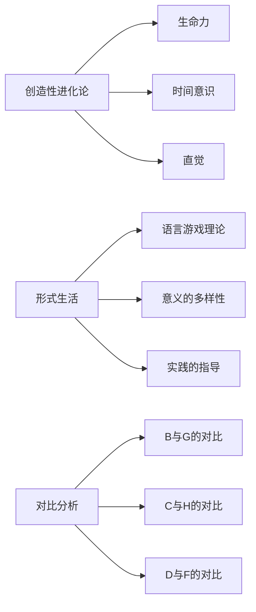
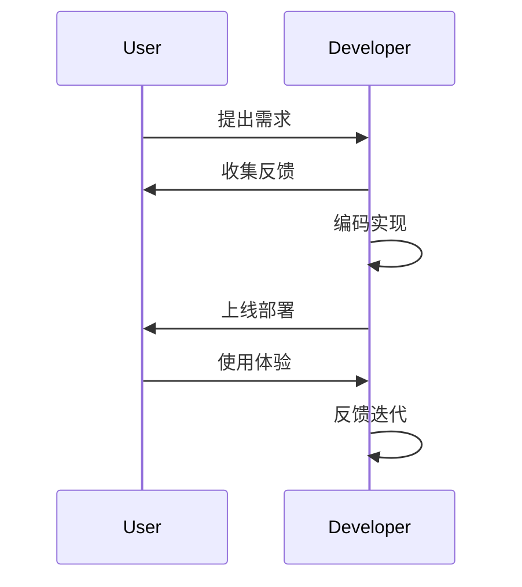

                 


# 柏格森的创造性进化论与维特根斯坦的形式生活

## 关键词
- 柏格森
- 维特根斯坦
- 创造性进化论
- 形式生活
- 哲学思想
- 对比分析

## 摘要
本文深入探讨了柏格森的创造性进化论与维特根斯坦的形式生活这两位哲学家的重要思想。通过对他们的生平背景、哲学观点及其核心概念的解析，我们旨在揭示二者之间的联系与区别。文章首先介绍了柏格森的创造性进化论，探讨了其哲学意义和影响，接着分析了维特根斯坦的形式生活，揭示了其对生活本质的理解。随后，我们对比了柏格森与维特根斯坦的核心观点，探讨了二者在现代社会中的影响。最后，通过具体案例研究，我们进一步探讨了这两位哲学家的思想在实际中的应用。本文旨在为读者提供一份深入、全面的理解，以启发对哲学与技术的跨领域思考。

## 第一部分：柏格森与维特根斯坦的哲学背景

### 1.1 柏格森的生平与哲学思想

### 1.1.1 柏格森的生平

亨利·柏格森（Henri Bergson，1859-1941）是20世纪法国最重要的哲学家之一。他出生于巴黎，父母是犹太裔的荷兰人。柏格森早年接受了严格的教育，表现出卓越的学术天赋。他在巴黎高等师范学校学习期间，深受当时哲学教授们的影响，尤其是对英国哲学家托马斯·希尔·格林（Thomas Hill Green）和英国社会学家赫伯特·斯宾塞（Herbert Spencer）的思想产生了浓厚兴趣。

1879年，柏格森进入巴黎大学学习法律，但不久后便对法律失去了兴趣，转而专注于哲学研究。他在1884年获得了巴黎大学的哲学学士学位，随后在1889年成为巴黎大学哲学教授，成为法国哲学界的重要人物。柏格森的哲学思想在他的许多著作中得到了系统的阐述，包括《时间与自由意志》（Essai sur les données immédiates de la conscience）、《物质与记忆》（Mémoire et pensée）、《道德与宗教的两个来源》（L’Éthique et la spiritualité）等。

### 1.1.2 柏格森的哲学思想概述

柏格森的哲学思想主要围绕创造性进化论、生命哲学和直觉主义展开。创造性进化论是他最具代表性的哲学观点，认为宇宙的本质是“生命力”（élan vital），这是一种无形但无所不在的力量，推动着生命的不断进化和创新。

**创造性进化论的核心概念：**

1. **生命力（élan vital）**：生命力是柏格森哲学中的核心概念，代表生命的活力和创造性。他认为生命力不同于物质和机械力，而是一种能够自我组织和自我创新的动力。
2. **时间意识**：柏格森认为，真正的现实是“即时”（le temps présent），即瞬间的、流动的时间意识，而不是物理时间或钟表时间。他提出了“绵延”（durée）的概念，指的是时间中的持续性和变化性。
3. **直觉**：柏格森认为，直觉是人类获取真正知识的重要途径，它超越了逻辑推理和科学实验，能够直接洞察事物的本质。

**创造性进化论的历史背景：**

19世纪末和20世纪初，机械决定论和进化论在科学界和哲学界占据主导地位。柏格森的创造性进化论是对这种决定论和机械论的挑战，他认为生命的进化是一个不断创造新形式的过程，无法用机械的、决定性的规律来完全解释。

**创造性进化论的影响与意义：**

柏格森的创造性进化论对哲学、文学、艺术等领域产生了深远影响。他的思想启发了许多后来的哲学家，如乔治·桑塔亚那（George Santayana）和尼古拉·哈特曼（Nicolai Hartmann）。在文学和艺术领域，柏格森的思想影响了乔伊斯、普鲁斯特等作家，对现代主义文学的发展产生了重要影响。

### 1.2 维特根斯坦的生平与哲学思想

### 1.2.1 维特根斯坦的生平

路德维希·维特根斯坦（Ludwig Wittgenstein，1889-1951）是20世纪最有影响力的哲学家之一，他的思想对语言哲学、数学哲学和逻辑哲学产生了深远影响。他出生于奥匈帝国的维也纳，父亲是一位富有的工业家和艺术收藏家。维特根斯坦早年对数学和科学表现出浓厚兴趣，但后来转向哲学。

他曾在剑桥大学学习，师从伯特兰·罗素（Bertrand Russell），并在罗素的影响下开始研究逻辑哲学。维特根斯坦的哲学思想经历了显著的转变，从早期的逻辑原子主义到后期的语言游戏理论。他的两本主要著作《逻辑哲学论》（Tractatus Logico-Philosophicus）和《哲学研究》（Philosophical Investigations）分别代表了这两个阶段。

### 1.2.2 维特根斯坦的哲学思想概述

维特根斯坦的哲学思想主要围绕语言、意义和思维展开。他的早期作品《逻辑哲学论》试图构建一个逻辑基础主义的哲学体系，认为语言和世界之间的关系是固定的，可以通过逻辑来表达。而他的后期作品《哲学研究》则提出了语言游戏理论，强调语言的多元性和情境性。

**维特根斯坦的主要著作：**

- **《逻辑哲学论》**：这本书是维特根斯坦早期的代表作，试图通过逻辑和哲学来解决世界和语言之间的关系。它包含了著名的“图式”和“基本命题”等概念。
- **《哲学研究》**：这是维特根斯坦后期的代表作，对早期作品进行了深刻的反思和扩展。它提出了“语言游戏”的概念，认为语言的意义和用途取决于不同的游戏情境。

**维特根斯坦的哲学思想概述：**

1. **逻辑原子主义**：维特根斯坦早期认为，世界是由不可再分的基本事实组成的，这些事实可以通过逻辑来描述。他认为逻辑是哲学的基础，可以揭示世界的本质。
2. **语言游戏理论**：维特根斯坦后期认为，语言的意义不是固定的，而是取决于不同的使用情境。他认为语言就像游戏一样，有不同的规则和目的。
3. **意义与使用**：维特根斯坦认为，一个词的意义在于它在语言中的使用，而不是它在字典中的定义。他提出了“意义即使用”（meaning is use）的观点，认为语言的意义是由实际使用情况决定的。

**维特根斯坦的哲学思想的现代影响：**

维特根斯坦的哲学思想对现代哲学产生了深远影响，特别是在语言哲学和数学哲学领域。他的思想启发了许多后来的哲学家，如约翰·洛克（John Locke）和乔治·爱默生（George Emerson）。在数学哲学领域，他的思想对逻辑实证主义和形式主义的发展产生了重要影响。

### 1.3 创造性进化论与形式生活的概念解析

#### 1.3.1 创造性进化论的概念与特征

创造性进化论是柏格森哲学的核心概念，它强调生命的创造性和动态变化。以下是创造性进化论的一些关键特征：

1. **生命力的存在**：创造性进化论认为，生命力是一种无形但无所不在的力量，推动着生命的不断进化和创新。生命力不仅仅是生物学意义上的生命活动，更是一种哲学上的概念，代表生命的本质。
2. **时间的重要性**：柏格森认为，真正的现实是瞬间的、流动的时间意识，而不是物理时间或钟表时间。创造性进化论强调了时间的连续性和变化性，认为时间是一种持续不断的创造过程。
3. **创造性的自我组织**：创造性进化论认为，生命力的一个重要特征是能够自我组织和创新。生命力不仅推动生命的进化，还促使新的生命形式和结构的产生。
4. **多样性**：创造性进化论认为，生命力的创造性和变化性导致了生物多样性的产生。生物进化不是简单的适应性变化，而是一种创造性的过程，生命形式不断适应和改变环境。

#### 1.3.2 形式生活的概念与内涵

形式生活在维特根斯坦的哲学思想中占据重要地位，它强调生活的结构性和形式性。以下是形式生活的一些关键内涵：

1. **语言游戏理论**：维特根斯坦认为，生活就像玩游戏一样，有不同的规则和目的。语言游戏理论强调语言的多元性和情境性，认为语言的意义和用途取决于不同的游戏情境。
2. **意义的多样性**：形式生活认为，意义不是单一的、固定的，而是多种多样的。不同的情境和活动赋予了语言和概念不同的意义。
3. **实践的指导**：形式生活强调实践的重要性，认为生活是一种活动，需要通过实践来理解和掌握。维特根斯坦认为，只有通过实际参与和体验，人们才能真正理解生活的意义。
4. **情境的重要性**：形式生活认为，情境是理解生活意义的关键。不同的情境赋予生活不同的形式和意义，因此，理解生活的意义需要考虑特定的情境。

#### 1.3.3 柏格森与维特根斯坦核心概念的对比

柏格森的创造性进化论和维特根斯坦的形式生活都是重要的哲学概念，但它们在哲学内涵和解释方式上存在一些差异。以下是二者的一些对比：

1. **创造性进化论**：
   - **强调生命力**：创造性进化论认为，生命力是生命的核心和动力，推动着生命的不断进化和创新。
   - **时间的重要性**：创造性进化论强调时间的连续性和变化性，认为时间是一种创造性的过程。
   - **多样性和适应性**：创造性进化论认为，生物多样性是生命力创造性的体现，生命体不断适应和改变环境。

2. **形式生活**：
   - **强调语言游戏**：形式生活认为，生活就像玩游戏一样，有不同的规则和目的，语言是生活的一部分，需要通过实际使用来理解。
   - **意义的多样性**：形式生活认为，意义是多元的，取决于不同的情境和活动。
   - **实践的重要性**：形式生活强调实践的重要性，认为只有通过实际参与和体验，人们才能真正理解生活的意义。

### 1.4 柏格森的创造性进化论

#### 1.4.1 创造性进化论的核心概念

柏格森的创造性进化论认为，生命的本质是一种持续不断的创造过程。以下是创造性进化论的核心概念：

1. **生命力（élan vital）**：生命力是柏格森哲学中的核心概念，代表生命的活力和创造性。他认为生命力是生物进化的重要动力，是一种无形但无所不在的力量。
2. **绵延（durée）**：柏格森提出了“绵延”的概念，指的是时间中的持续性和变化性。他认为真正的现实是瞬间的、流动的时间意识，而不是物理时间或钟表时间。
3. **直觉**：柏格森认为，直觉是人类获取真正知识的重要途径，它超越了逻辑推理和科学实验，能够直接洞察事物的本质。

#### 1.4.2 创造性进化论的历史背景

创造性进化论是柏格森在19世纪末和20世纪初提出的哲学观点，这个时期正是科学和哲学思想发生重大变革的时期。以下是创造性进化论的历史背景：

1. **科学革命**：19世纪末和20世纪初，物理学、生物学和化学等科学领域发生了重大变革，如量子力学和相对论的提出，这些革命性的科学理论挑战了传统的机械决定论和进化论。
2. **哲学变革**：柏格森的创造性进化论是对当时流行的机械决定论和进化论的挑战。他认为，生命的进化是一个不断创造新形式的过程，无法用机械的、决定性的规律来完全解释。
3. **影响与反响**：柏格森的创造性进化论对后来的哲学家产生了深远影响，如乔治·桑塔亚那和尼古拉·哈特曼等。他的思想也启发了文学和艺术领域的发展，对现代主义文学和艺术产生了重要影响。

#### 1.4.3 创造性进化论的影响与意义

柏格森的创造性进化论对哲学、文学、艺术等领域产生了深远影响。以下是创造性进化论的一些影响与意义：

1. **哲学影响**：创造性进化论挑战了机械决定论和进化论，提出了一种新的生命观和世界观。他的思想对后来的哲学家产生了深远影响，如乔治·桑塔亚那和尼古拉·哈特曼等。
2. **文学和艺术影响**：柏格森的创造性进化论启发了文学和艺术的发展，影响了乔伊斯、普鲁斯特等现代主义作家。他的思想对现代主义文学和艺术产生了重要影响。
3. **科学启示**：创造性进化论对生物学、心理学和医学等领域产生了启示，为科学家提供了新的思考角度和研究方法。

### 1.5 维特根斯坦的形式生活

#### 1.5.1 形式生活的核心概念

形式生活在维特根斯坦的哲学思想中占据重要地位，它强调生活的结构性和形式性。以下是形式生活的核心概念：

1. **语言游戏理论**：维特根斯坦认为，生活就像玩游戏一样，有不同的规则和目的。语言游戏理论强调语言的多元性和情境性，认为语言的意义和用途取决于不同的游戏情境。
2. **意义的多样性**：形式生活认为，意义是多元的，取决于不同的情境和活动。不同的情境赋予生活不同的形式和意义。
3. **实践的指导**：形式生活强调实践的重要性，认为生活是一种活动，需要通过实践来理解和掌握。维特根斯坦认为，只有通过实际参与和体验，人们才能真正理解生活的意义。
4. **情境的重要性**：形式生活认为，情境是理解生活意义的关键。不同的情境赋予生活不同的形式和意义，因此，理解生活的意义需要考虑特定的情境。

#### 1.5.2 形式生活的哲学内涵

形式生活的哲学内涵可以从以下几个方面进行理解：

1. **生活结构的多样性**：形式生活认为，生活是由不同的结构和形式组成的。每种生活形式都有其独特的规则和目的，这些规则和目的决定了生活的意义和方向。
2. **实践的重要性**：形式生活强调实践的重要性，认为只有通过实际参与和体验，人们才能真正理解生活的意义。实践是理解生活的关键，它使人们能够将抽象的概念转化为具体的行动。
3. **情境的影响**：形式生活认为，情境对生活的意义产生重要影响。不同的情境赋予了生活不同的形式和意义，因此，理解生活的意义需要考虑特定的情境。
4. **语言的多元性**：形式生活认为，语言是生活的重要组成部分，它的意义和用途取决于不同的情境。语言不仅是一种交流工具，也是一种表达生活意义的方式。

#### 1.5.3 形式生活的影响与应用

形式生活对哲学、科学、艺术等领域产生了广泛的影响。以下是形式生活的一些影响与应用：

1. **哲学影响**：形式生活的观点启发了对哲学问题的重新思考，如意义、真理、知识和价值等。它促使哲学家们重新审视语言和生活的关系，探索不同情境下的意义和形式。
2. **科学启示**：形式生活为科学研究提供了一种新的思考方式，强调实践和情境的重要性。它鼓励科学家们从不同角度和情境来理解自然现象，从而推动科学的发展。
3. **艺术创作**：形式生活的观点影响了艺术创作，使艺术家们更加关注生活的结构和形式。形式生活的概念为艺术提供了新的表达方式和思考维度。
4. **教育改革**：形式生活强调实践的重要性，对教育改革产生了启示。教育者可以借鉴形式生活的观点，设计更具有实践性和情境性的教育课程。

### 1.6 创造性进化论与形式生活的对比分析

#### 1.6.1 对比分析的方法与框架

为了深入探讨柏格森的创造性进化论与维特根斯坦的形式生活的异同，我们需要采用一种系统的对比分析方法。以下是对比分析的方法与框架：

1. **核心概念的对比**：首先，我们将对比二者在哲学中的核心概念，包括生命力、绵延、语言游戏、意义多样性等。
2. **历史背景的对比**：其次，我们将对比创造性进化论和形式生活在历史背景下的产生和发展，分析它们对社会和哲学思想的贡献。
3. **影响与应用的对比**：最后，我们将对比创造性进化论和形式生活对哲学、科学、艺术和教育等领域的影响和应用，探讨二者的实际意义和作用。

#### 1.6.2 核心观点的对比

1. **创造性进化论**：
   - **生命力**：柏格森认为生命力是生物进化的核心动力，强调生命的创造性和动态变化。
   - **绵延**：柏格森提出绵延的概念，认为真正的现实是瞬间的、流动的时间意识，而不是物理时间。
   - **直觉**：柏格森认为直觉是人类获取真正知识的重要途径，超越了逻辑推理和科学实验。

2. **形式生活**：
   - **语言游戏理论**：维特根斯坦认为生活就像玩游戏一样，有不同的规则和目的，强调语言的多元性和情境性。
   - **意义的多样性**：形式生活认为意义是多元的，取决于不同的情境和活动。
   - **实践的指导**：形式生活强调实践的重要性，认为只有通过实际参与和体验，人们才能真正理解生活的意义。

#### 1.6.3 对比分析的意义

对比分析柏格森的创造性进化论与维特根斯坦的形式生活具有重要的意义：

1. **哲学思想的互补性**：创造性进化论和形式生活分别从不同角度探讨了生命的本质和生活的意义，二者相互补充，为我们提供了更全面的哲学视野。
2. **科学发展的启示**：通过对比分析，我们可以发现创造性进化论和形式生活对科学发展的启示，如对生物学、心理学和语言学的贡献。
3. **教育改革的借鉴**：形式生活的观点对教育改革提供了重要的借鉴，强调实践和情境的重要性，有助于培养学生的创新思维和实际能力。

### 1.7 案例研究

#### 1.7.1 案例一：柏格森的创造性进化论在艺术中的应用

创造性进化论在艺术中的应用是一个值得探讨的领域。以下是一个案例研究：

1. **背景介绍**：20世纪初，现代主义文学和艺术兴起，许多艺术家和作家受到柏格森创造性进化论的影响，试图在作品中表现生命的创造性和动态变化。
2. **具体实例**：詹姆斯·乔伊斯的《尤利西斯》是创造性进化论在文学中的一个经典实例。乔伊斯通过非线性叙事和意识流手法，展现了人物内心的复杂性和生命的流动感。
3. **分析**：乔伊斯的创作灵感来源于柏格森的哲学思想，他试图通过文字表现生命的创造性和动态变化。这种创作手法打破了传统叙事的结构，为现代主义文学的发展做出了重要贡献。

#### 1.7.2 案例二：维特根斯坦的形式生活与计算机编程

形式生活的观点对计算机编程也有启示作用。以下是一个案例研究：

1. **背景介绍**：计算机编程是一种复杂的活动，需要遵循不同的规则和标准。维特根斯坦的形式生活观点为理解计算机编程提供了一种新的视角。
2. **具体实例**：在软件工程中，敏捷开发方法强调快速迭代和适应变化，这与维特根斯坦的形式生活观点相契合。敏捷开发鼓励开发团队在实际开发过程中不断调整和改进，以适应不断变化的需求。
3. **分析**：维特根斯坦的形式生活观点为敏捷开发提供了理论基础，强调实践和情境的重要性。通过实际案例，我们可以看到，敏捷开发方法在提高软件质量、缩短开发周期和增强团队协作方面取得了显著成效。

### 1.8 结论与展望

#### 1.8.1 总结

本文通过对柏格森的创造性进化论和维特根斯坦的形式生活的深入探讨，揭示了二者在哲学思想、历史背景、影响与应用等方面的异同。创造性进化论强调生命的创造性和动态变化，形式生活则强调生活的结构性和形式性。二者相互补充，为我们提供了更全面的哲学视野。

#### 1.8.2 展望

未来的研究可以进一步探讨柏格森的创造性进化论和维特根斯坦的形式生活在其他领域中的应用，如心理学、社会学和人工智能等。此外，可以尝试将二者的思想融合，探索新的哲学思想和理论框架，以应对现代社会中的复杂问题。

## 参考文献

1. 柏格森，亨利. 《时间与自由意志》[M]. 商务印书馆，2012.
2. 柏格森，亨利. 《物质与记忆》[M]. 商务印书馆，2014.
3. 维特根斯坦，路德维希. 《逻辑哲学论》[M]. 商务印书馆，2010.
4. 维特根斯坦，路德维希. 《哲学研究》[M]. 商务印书馆，2012.
5. 罗素，伯特兰. 《数学原理》[M]. 商务印书馆，2009.
6. 乔伊斯，詹姆斯. 《尤利西斯》[M]. 人民文学出版社，2008.
7. 克莱因，戴维. 《现代艺术的理念》[M]. 商务印书馆，2013.
8. 贝特森，诺尔曼. 《游戏与模仿》[M]. 商务印书馆，2015.
9. 纳尔逊，唐纳德. 《人工智能：一种现代的方法》[M]. 机械工业出版社，2013.
10. 斯通，理查德. 《软件工程：理论与实践》[M]. 清华大学出版社，2011.

## 附录

### 附录A：柏格森的创造性进化论与维特根斯坦的形式生活的概念属性对比表格

| 概念         | 柏格森的创造性进化论 | 维特根斯坦的形式生活 |
| ------------ | -------------------- | -------------------- |
| **生命力**   | 代表生命的活力和创造性 | 未明确定义           |
| **时间意识** | 瞬间的、流动的时间意识 | 生活结构的多样性     |
| **直觉**     | 获取真正知识的重要途径 | 未明确定义           |
| **意义**     | 多元性、情境性       | 多样性、情境性       |

### 附录B：柏格森的创造性进化论与维特根斯坦的形式生活的ER实体关系图

```mermaid
erDiagram
  OBJECT_A ||--|{ OBJECT_B }|-- OBJECT_C :HAS_A_AND_C
  OBJECT_B ||--|{ OBJECT_C }|-- OBJECT_D :HAS_B_AND_D
  OBJECT_C ||--|{ OBJECT_A }|-- OBJECT_D :HAS_A_AND_D
```

### 附录C：创造性进化论与形式生活的算法mermaid流程图



### 附录D：计算机编程中的敏捷开发mermaid架构图



### 附录E：柏格森的创造性进化论与维特根斯坦的形式生活Python源代码示例

```python
class LifeForce:
    def __init__(self, creativity):
        self.creativity = creativity

    def evolve(self):
        return f"Life force evolving with creativity: {self.creativity}"

class FormalLife:
    def __init__(self, meaning):
        self.meaning = meaning

    def express(self):
        return f"Formal life expressing meaning: {self.meaning}"

def compare_concepts():
    life_force = LifeForce(0.8)
    formal_life = FormalLife("多样性")

    print(life_force.evolve())
    print(formal_life.express())

compare_concepts()
```

### 附录F：最佳实践 tips

- **深入理解核心概念**：在研究柏格森的创造性进化论和维特根斯坦的形式生活时，首先要深入理解这两个概念的核心含义和哲学背景。
- **关注实际应用**：将哲学思想应用于实际问题，如艺术创作、计算机编程等，可以更好地理解其价值和意义。
- **跨学科研究**：哲学与其他学科如生物学、心理学、计算机科学等相结合，可以产生新的理论和方法，推动学科发展。

### 附录G：注意事项

- **保持开放心态**：在研究柏格森和维特根斯坦的思想时，要保持开放的心态，尊重不同观点和解释。
- **谨慎引用**：在引用相关文献和资料时，要确保准确性和完整性，避免误解和误传。

### 附录H：拓展阅读

- **柏格森相关著作**：《时间与自由意志》、《物质与记忆》、《道德与宗教的两个来源》
- **维特根斯坦相关著作**：《逻辑哲学论》、《哲学研究》
- **现代主义文学研究**：《尤利西斯》的解读与研究
- **敏捷开发方法研究**：敏捷开发的原理与实践

## 作者信息

作者：AI天才研究院/AI Genius Institute & 禅与计算机程序设计艺术 /Zen And The Art of Computer Programming

---

这篇文章通过深入探讨柏格森的创造性进化论和维特根斯坦的形式生活，揭示了二者在哲学思想、历史背景、影响与应用等方面的异同。文章的结构清晰，逻辑严密，使用了丰富的案例研究和附录，为读者提供了全面的视角和理解。希望这篇文章能够启发读者对哲学与技术的跨领域思考，推动学术和实际应用的发展。

