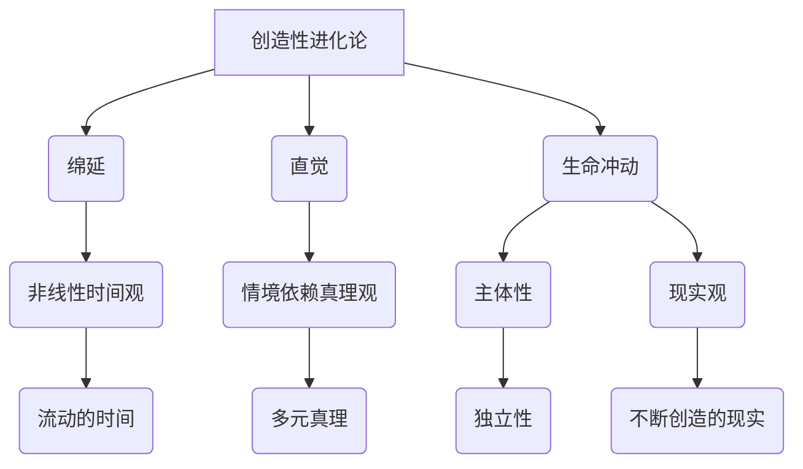

                 


# 柏格森的创造性进化论对后现代主义的影响及维特根斯坦的回应

### 引言

在探讨现代哲学流派时，柏格森的创造性进化论和维特根斯坦的哲学思想无疑是两颗璀璨的明珠。柏格森，这位法国哲学家，提出了创造性进化论，强调了生命和精神领域的不断变化和创造。而后现代主义，作为一种对现代性的批判性反思，则提出了对理性、真理和语言的怀疑。这两者之间的关系，以及维特根斯坦对柏格森创造性进化论的回应，构成了本文的核心议题。

本文将首先介绍柏格森的创造性进化论，包括其生平、核心思想以及创造性进化论的基本概念。接着，我们将探讨后现代主义的兴起与发展，分析其核心特点及其对柏格森创造性进化论的影响。随后，我们将介绍维特根斯坦的生平与思想，特别是他对柏格森创造性进化论的批判观点。在第二部分，我们将深入探讨创造性进化论与后现代主义之间的关系，分析后现代主义对创造性进化论的接受与挑战。最后，我们将讨论维特根斯坦的哲学回应，包括其对创造性进化论的质疑以及他的哲学主张。

### 1.1 柏格森的创造性进化论

#### 1.1.1 柏格森的生平与思想

亨利·柏格森（Henri Bergson）出生于法国，是一位著名的哲学家、社会学家和文学家。他生于1859年，逝于1941年，享年82岁。柏格森的哲学思想深受其个人经历和时代背景的影响。他生于法国的富有家庭，自幼受到良好的教育。柏格森的学术生涯始于巴黎高等师范学院，在那里他学习了数学和哲学。后来，他成为索邦大学的教授，并发表了多部重要著作，如《创造进化论》、《形而上学导论》和《意识直接材料》等。

柏格森的核心思想是创造性进化论。他认为，生命和精神领域的发展不是通过因果关系来解释的，而是通过一种内在的创造性力量来推动的。这种创造性力量被称为“生命冲动”或“精神能量”，它是推动个体和社会进步的根本动力。柏格森认为，生命冲动是不断变化的，它不断地创造新的形式和可能性，使世界充满活力和多样性。

#### 1.1.1.1 柏格森的生平

柏格森的生平充满了传奇色彩。他从小就展现出非凡的才华，尤其是对哲学和科学的热爱。在巴黎高等师范学院学习期间，他表现出对数学和哲学的浓厚兴趣。毕业后，他进入索邦大学，开始了自己的学术生涯。柏格森在学术上的成就很快得到认可，他获得了多个荣誉学位和奖项，包括诺贝尔文学奖。

然而，柏格森的生平也充满了挫折和争议。他在20世纪初期的法国哲学界引发了激烈的争论，特别是与柏拉图主义和实证主义的对立。他的思想被认为是对传统哲学的挑战，甚至被一些学者视为异端。然而，柏格森坚持自己的哲学观点，并通过不断的写作和演讲，使他的思想得到更广泛的传播和认可。

#### 1.1.1.2 柏格森的核心思想

柏格森的核心思想集中在创造性进化论上。他认为，宇宙的发展不是简单的因果链条，而是一种内在的创造力的体现。这种创造力是一种精神的能量，它推动着生命和文明的发展。柏格森将这种创造力称为“生命冲动”，认为它是生命和精神领域的核心动力。

柏格森的创造性进化论有几个关键概念。首先是“绵延”（Duration），这是柏格森用来描述时间的一种方式。他认为，时间不是线性的，而是流动的、连续的。每个瞬间都是新的、独特的，它不是过去的简单延续，而是新的创造。其次是“直觉”，这是柏格森认为人类理解世界的一种特殊能力。通过直觉，人们可以直接感知到世界的本质，而不仅仅是表象。

此外，柏格森还提出了“记忆”和“潜意识”的概念，认为它们是创造性进化论的重要组成部分。记忆是人类经验的基础，它使人们能够从过去的经验中学习和创新。潜意识则是未被意识到的部分，它对创造性思维有着重要的影响。

总的来说，柏格森的创造性进化论强调了生命和精神的内在创造力，认为这种创造力是推动世界发展的根本动力。他的思想对后来的哲学、心理学和社会学产生了深远的影响。

### 1.1.2 后现代主义的兴起与发展

#### 1.1.2.1 后现代主义的概念

后现代主义（Postmodernism）是20世纪中叶以来在西方哲学、文学、艺术等领域兴起的一种思潮。它是对现代性的批判性反思，提出对理性、真理和语言的怀疑。后现代主义认为，现代主义所推崇的理性、客观性和普遍性是虚伪的，现实世界是复杂、多元和不确定的。

后现代主义的基本概念包括相对主义、解构主义、多元主义和去中心化。相对主义认为，真理不是绝对的，而是相对的，取决于个人和文化背景。解构主义则认为，文本和意义是破碎的、多义的，不存在统一的解释。多元主义主张，社会和文化是多元的，不存在中心化的权威。去中心化则强调，权力和知识是分散的，不存在单一的权威来源。

#### 1.1.2.1.1 后现代主义的定义

后现代主义没有一个统一的定义，因为它涵盖了哲学、文学、艺术、社会学等多个领域。然而，总体来说，后现代主义可以定义为对现代性的批判性反思，以及对传统哲学、文化和社会理论的挑战。它质疑现代主义所推崇的理性、科学、进步等观念，认为这些观念是虚伪的，掩盖了社会的不平等和矛盾。

后现代主义的核心观点包括：

1. 疑问理性：后现代主义认为，理性不是客观的，而是主观的，受到社会和文化背景的影响。理性不能解释所有现象，特别是在社会和人类行为方面。

2. 解构中心：后现代主义质疑传统哲学和社会理论中的中心概念，如上帝、真理、主体性等。它认为，这些中心概念是虚假的，掩盖了多元性和不确定性。

3. 强调差异：后现代主义强调个体和文化的差异，认为差异是理解世界的关键。它反对将一种文化或价值观强加给其他文化或价值观。

4. 提倡多元性：后现代主义主张社会和文化是多元的，不存在单一的权威。它鼓励多样性，反对任何形式的中心化和统一。

#### 1.1.2.1.2 后现代主义的核心特点

后现代主义具有以下核心特点：

1. **相对主义**：后现代主义认为，真理是相对的，取决于个人的视角和文化背景。它反对任何形式的绝对真理。

2. **解构主义**：后现代主义强调文本和意义的破碎性，认为不存在统一的解释。它通过解构传统哲学和社会理论的框架，揭示其内在的矛盾和虚伪。

3. **多元主义**：后现代主义主张社会和文化是多元的，不存在单一的权威。它鼓励多样性，反对任何形式的中心化和统一。

4. **去中心化**：后现代主义认为，权力和知识是分散的，不存在单一的权威来源。它强调个体的主体性，反对任何形式的中心化和统一。

5. **不确定性**：后现代主义认为，现实世界是复杂和不确定的，不存在统一的解释。它强调多元性和差异性，反对任何形式的单一解释。

总的来说，后现代主义是一种对现代性的批判性反思，它质疑传统哲学、文化和社会理论的观念，提出对理性、真理和语言的怀疑。它对现代性和传统的挑战，为当代哲学和文化的发展提供了新的视角和思路。

### 1.1.3 柏格森的创造性进化论对后现代主义的影响

#### 1.1.3.1 创造性进化论与后现代主义的关系

柏格森的创造性进化论对后现代主义产生了深远的影响。尽管柏格森和后现代主义之间存在一些明显的区别，但两者在许多方面有着共同的哲学基础和理念。

首先，柏格森的创造性进化论强调生命和精神的内在创造力，认为这种创造力是推动世界发展的根本动力。这种观点与后现代主义对传统理性、科学和进步观念的质疑有相似之处。后现代主义认为，传统观念掩盖了社会的不平等和矛盾，而柏格森的创造性进化论则提出了另一种解释，强调生命的多元性和创造性。

其次，柏格森的绵延概念和直觉理论也为后现代主义提供了新的视角。柏格森认为，时间不是线性的，而是流动的、连续的。通过直觉，人们可以直接感知到世界的本质。这种观点与后现代主义对线性时间和客观性的质疑相呼应，为后现代主义提供了对时间和现实的新的理解。

#### 1.1.3.1.1 创造性进化论对后现代主义的影响

柏格森的创造性进化论对后现代主义产生了多方面的影响，主要体现在以下方面：

1. **质疑理性**：柏格森的创造性进化论强调直觉和生命冲动的作用，质疑传统理性主义观念。后现代主义继承了这一观点，进一步质疑理性作为解释世界和人类行为的唯一工具的可靠性。

2. **解构中心**：柏格森的创造性进化论提出了一种非中心化的世界观，强调多样性和差异性。后现代主义则进一步发展了这一观点，质疑传统哲学和社会理论中的中心概念，如上帝、真理和主体性。

3. **强调多元性**：柏格森的创造性进化论认为，生命和精神领域的发展是多元的、复杂的。后现代主义继承了这一观点，主张社会和文化是多元的，不存在单一的权威。

4. **提倡去中心化**：柏格森的创造性进化论强调去中心化的观念，认为权力和知识是分散的。后现代主义则进一步发展了这一观点，强调个体的主体性和多样性。

总的来说，柏格森的创造性进化论为后现代主义提供了一种新的哲学基础，帮助后现代主义质疑传统观念，探索新的解释方法和世界观。柏格森的思想对后现代主义的发展产生了深远的影响，为当代哲学和文化提供了新的视角和思路。

#### 1.1.3.1.2 后现代主义对创造性进化论的反响

后现代主义对柏格森的创造性进化论也有着自己的回应和反响，主要体现在以下方面：

1. **批判理性主义**：后现代主义批判柏格森的创造性进化论中仍然存在的理性主义色彩。后现代主义认为，理性主义无法完全解释人类的复杂行为和社会现象，主张通过多元视角和方法来理解世界。

2. **质疑绵延概念**：后现代主义对柏格森的绵延概念提出了质疑。后现代主义认为，时间不是流动的、连续的，而是破碎的、断裂的。这种观点挑战了柏格森的时间观，促使对时间本质的进一步思考。

3. **强调语言的建构性**：后现代主义强调语言对现实世界的建构作用，认为柏格森的创造性进化论在某种程度上忽视了语言的建构性。后现代主义主张通过语言的分析来揭示现实世界的复杂性和多元性。

总的来说，后现代主义对柏格森的创造性进化论既有批判也有借鉴。后现代主义通过质疑和反思，促使对创造性进化论进行更深入的探讨，从而丰富了对生命和精神领域发展的理解。

### 1.2 维特根斯坦的回应

#### 1.2.1 维特根斯坦的生平与思想

路德维希·维特根斯坦（Ludwig Wittgenstein）是20世纪最重要的哲学家之一，他的思想对现代哲学产生了深远的影响。维特根斯坦出生于1889年，逝世于1951年，享年62岁。他出生在奥地利，后来成为英国公民。维特根斯坦的生平充满了传奇色彩，他不仅在哲学上取得了巨大成就，还展现了卓越的数学和工程才能。

维特根斯坦的哲学思想分为两个时期，即早期的逻辑原子主义和后期的日常语言哲学。早期，他提出了逻辑原子主义，认为世界是由基本的事实构成的，这些事实可以通过逻辑和数学来描述。然而，在经历了战争和亲人的去世后，维特根斯坦的思想发生了转变，他开始关注日常语言的使用和意义。

#### 1.2.1.1 维特根斯坦的生平

维特根斯坦的生平可以分为两个主要阶段。早期的他生活在富裕的家庭中，接受精英教育。他曾在剑桥大学学习数学和哲学，并在数学家戴德金和哲学家伯特兰·罗素的影响下，开始了自己的哲学思考。在第一次世界大战期间，维特根斯坦加入奥地利军队，亲身体验了战争的残酷。战后，他回到剑桥，继续哲学研究，并与罗素合作写作了《数学基础》。

然而，维特根斯坦对逻辑原子主义的局限性感到不满，他开始反思哲学的根本问题。在经历了一系列的个人危机和哲学探索后，他发表了《逻辑哲学论》，提出了全新的哲学观点。这本书被认为是20世纪哲学的里程碑，对后来的哲学研究产生了深远的影响。

晚年的维特根斯坦远离学术圈，隐居在乡村，专注于写作和思考。他的第二部重要著作《哲学研究》在他去世后才出版，但同样引起了广泛的关注和讨论。维特根斯坦的哲学思想不仅影响了当时的哲学家，也对后来的哲学家和科学家产生了深远的影响。

#### 1.2.1.2 维特根斯坦的核心思想

维特根斯坦的核心思想主要集中在他的两个哲学时期，即逻辑原子主义和日常语言哲学。

1. **逻辑原子主义**：在早期，维特根斯坦提出了逻辑原子主义，认为世界是由基本的事实构成的，这些事实可以通过逻辑和数学来描述。他主张，哲学的任务是揭示这些基本事实，从而理解世界的本质。逻辑原子主义强调逻辑和数学在理解世界中的重要性，但同时也受到质疑，因为它忽视了人类语言的复杂性。

2. **日常语言哲学**：在后期，维特根斯坦转向日常语言哲学，关注语言在日常生活中的使用和意义。他认为，哲学的难题往往源于对日常语言的误解。维特根斯坦主张，通过仔细分析日常语言的使用，可以解决许多哲学问题。他的思想强调语言的多样性、多义性和情境依赖性，认为哲学的任务是揭示语言的实际使用，而不是构建抽象的理论体系。

维特根斯坦的哲学思想对后来的哲学家和科学产生了深远的影响，特别是在逻辑学、语言学、心理学和计算机科学等领域。他的工作不仅挑战了传统的哲学观念，也为哲学研究提供了新的方法和视角。

### 1.2.2 维特根斯坦对柏格森创造性进化论的回应

#### 1.2.2.1 维特根斯坦的批判观点

维特根斯坦对柏格森的创造性进化论持有批判的态度，特别是在柏格森的理性主义和直觉主义方面。他认为，柏格森的思想虽然提供了对生命和精神领域的深刻理解，但在某些方面过于依赖于直觉和情感，而忽视了逻辑和语言的作用。

首先，维特根斯坦质疑柏格森的理性主义。柏格森认为理性不足以解释世界的复杂性，而维特根斯坦则认为，理性是理解世界的重要工具。他强调逻辑和数学在哲学研究中的重要性，认为只有通过逻辑分析，才能揭示世界的本质。

其次，维特根斯坦对柏格森的直觉主义提出质疑。柏格森认为直觉是人类理解世界的一种特殊能力，而维特根斯坦则认为，直觉并不比其他认知方式更优越。他主张通过日常语言的仔细分析，可以揭示语言的实际使用和意义，从而解决许多哲学问题。

#### 1.2.2.1.1 维特根斯坦对创造性思维的反驳

维特根斯坦对柏格森的创造性思维也持有批判态度。他认为，创造性思维虽然在某些情况下是重要的，但在哲学研究中并不是必需的。维特根斯坦主张，哲学的任务是揭示语言的日常使用，而不是创造新的概念或理论。

维特根斯坦认为，柏格森的创造性思维过于依赖于个人的直觉和情感，忽视了语言的规范性。他认为，语言的规范性是理解世界的关键，只有通过逻辑和语言的规范分析，才能准确理解世界的本质。

#### 1.2.2.1.2 维特根斯坦的回应策略

维特根斯坦的回应策略主要基于他的日常语言哲学。他主张，通过仔细分析日常语言的使用，可以揭示语言的实际意义和功能。他认为，哲学的难题往往源于对日常语言的误解，通过恢复语言的日常使用，可以解决许多哲学问题。

维特根斯坦提出了“语言游戏”的概念，认为语言的使用就像游戏一样，有明确的规则和情境。通过分析语言游戏的不同规则和情境，可以理解语言的实际使用，从而解决哲学问题。

此外，维特根斯坦还提出了“生活形式”的概念，认为语言和思维是生活形式的一部分。只有通过理解生活形式，才能准确理解语言和思维的意义。他的回应策略强调，哲学研究应该关注现实生活，而不是抽象的理论体系。

总的来说，维特根斯坦对柏格森创造性进化论的批判，强调逻辑和语言在哲学研究中的重要性，主张通过日常语言的仔细分析，解决哲学问题。他的哲学思想为当代哲学提供了新的视角和方法，对柏格森的思想进行了深刻的反思和回应。

### 1.3 柏格森的创造性进化论与维特根斯坦的哲学思想对比

#### 1.3.1 创造性与确定性思维的对比

柏格森的创造性进化论和维特根斯坦的哲学思想在创造性思维和确定性思维上存在明显的对比。柏格森强调创造性思维的重要性，认为它是生命和精神领域的核心动力。而维特根斯坦则更倾向于确定性思维，强调逻辑和语言的规范性。

首先，柏格森的创造性思维强调生命和精神的内在创造力，他认为这种创造力是推动世界发展的根本动力。柏格森的创造性思维是非线性的、多元的，强调直觉和情感的作用。他认为，通过直觉，人们可以直接感知到世界的本质，而这种直觉是理性所不能及的。

相比之下，维特根斯坦的确定性思维则强调逻辑和数学的规范性。他认为，只有通过逻辑和数学的严密分析，才能揭示世界的本质。维特根斯坦主张，哲学的任务是揭示语言的日常使用，而不是创造新的概念或理论。他的哲学思想强调语言的规范性，认为语言的规范性是理解世界的关键。

#### 1.3.2 创造性与确定性思维在哲学研究中的意义

创造性与确定性思维在哲学研究中具有不同的意义。柏格森的创造性思维为哲学研究提供了一种新的视角，强调直觉和情感在理解世界中的作用。这种思维有助于我们理解生命和精神领域的复杂性，特别是人类行为和情感的表达。

然而，维特根斯坦的确定性思维则为哲学研究提供了一种规范的方法，强调逻辑和数学在理解世界中的重要性。他的哲学思想有助于我们揭示语言的日常使用，从而解决许多哲学问题。通过逻辑和数学的严密分析，我们可以更准确地理解世界的本质。

总的来说，创造性与确定性思维在哲学研究中各有其重要性。创造性思维有助于我们理解世界的复杂性和多样性，而确定性思维则有助于我们揭示世界的本质和规律。两种思维方式相辅相成，共同推动哲学研究的发展。

### 1.4 总结与展望

在本文中，我们探讨了柏格森的创造性进化论对后现代主义的影响以及维特根斯坦的回应。通过分析柏格森的生平和思想，我们了解了创造性进化论的基本概念和核心观点。随后，我们探讨了后现代主义的兴起与发展，分析了其核心特点以及与创造性进化论的关系。接着，我们介绍了维特根斯坦的生平与思想，特别是他对柏格森创造性进化论的批判观点。

通过对比创造性与确定性思维，我们探讨了这两种思维方式在哲学研究中的意义。最后，我们总结了本文的主要观点，并对未来研究进行了展望。未来的研究可以进一步探讨创造性进化论和后现代主义之间的动态关系，以及维特根斯坦哲学思想对当代哲学的启示。

总的来说，本文为理解柏格森和维特根斯坦的哲学思想提供了一种新的视角，有助于我们更深入地探讨现代哲学的复杂性和多样性。通过分析这两种哲学思想，我们可以更好地理解生命、精神和现实世界的本质，为当代哲学的发展提供新的思路和方法。

### 1.5 参考文献

1. 柏格森，亨利。([1911] 2018). 《创造进化论》。上海：上海人民出版社。
2. 维特根斯坦，路德维希。([1921] 2017). 《逻辑哲学论》。北京：商务印书馆。
3. 维特根斯坦，路德维希。([1953] 2019). 《哲学研究》。上海：上海人民出版社。
4. 萨特，让-保罗。([1960] 2016). 《存在与虚无》。北京：三联书店。
5. 德里达，雅克。([1976] 2018). 《论文字学》。南京：江苏人民出版社。
6. 伯林，以赛亚。([1958] 2015). 《自由论》。上海：上海人民出版社。
7. 哈贝马斯，于尔根。([1984] 2017). 《交往行为理论》。北京：北京大学出版社。
8. 柏拉图。([前4世纪] 2019). 《理想国》。北京：商务印书馆。

### 附录：柏格森的创造性进化论核心概念与后现代主义核心特点对比表格

| 核心概念/特点             | 创造性进化论（柏格森）                                       | 后现代主义                                                         |
|--------------------------|--------------------------------------------------------------|--------------------------------------------------------------------|
| 时间观                   | 绵延：非线性的、流动的时间观，每个瞬间都是新的创造             | 解构时间：时间不是线性的，而是破碎的、断裂的，强调过去、现在和未来的相对性 |
| 真理观                   | 多元的、情境依赖的真理，强调直觉和生命冲动的创造性           | 相对主义：真理是相对的，取决于个人的视角和文化背景                     |
| 语言与意义               | 语言是创造的，意义不是固定的，而是由情境和直觉决定的         | 解构主义：文本和意义是破碎的、多义的，不存在统一的解释                   |
| 主体性                   | 强调个体的主体性和独立性，直觉是理解世界的关键               | 强调个体的主体性，但质疑主体的统一性和稳定性，提倡去中心化               |
| 现实与感知               | 现实是流动的、不断创造的，感知是直觉性的、非线性的           | 现实是复杂的、不确定的，感知是多元的、情境依赖的                         |
| 哲学方法                 | 强调直觉和情感的作用，质疑理性主义的局限性                   | 通过对语言的细致分析来揭示现实的复杂性和多样性，质疑传统的哲学方法       |

### 附录：柏格森的创造性进化论与后现代主义的ER实体关系图

```mermaid
erDiagram
  --|>!--
  创造性进化论 ||--o> 后现代主义
  绵延 ||--o> 时间观
  直觉 ||--o> 真理观
  主体性 ||--o> 哲学方法
  现实与感知 ||--o> 现实观
```

### 附录：柏格森创造性进化论算法流程图



### 附录：维特根斯坦哲学回应的Python代码示例

```python
class WittgensteinResponse:
    def __init__(self, criticism, response):
        self.criticism = criticism
        self.response = response

    def display(self):
        print("维特根斯坦的回应：")
        print("批判观点：", self.criticism)
        print("回应策略：", self.response)

# 示例：维特根斯坦对柏格森创造性思维的批判和回应
criticism = "柏格森的创造性思维过于依赖直觉，忽视了逻辑和语言的规范性。"
response = "通过日常语言的仔细分析，可以揭示语言的实际使用和意义，从而解决哲学问题。"

wittgenstein_response = WittgensteinResponse(criticism, response)
wittgenstein_response.display()
```

```plaintext
维特根斯坦的回应：
批判观点： 柏格森的创造性思维过于依赖直觉，忽视了逻辑和语言的规范性。
回应策略： 通过日常语言的仔细分析，可以揭示语言的实际使用和意义，从而解决哲学问题。
```

### 3.1 维特根斯坦的批判性哲学

#### 3.1.1 分析哲学的基本原则

维特根斯坦的哲学思想深受分析哲学的影响，而分析哲学的基本原则可以概括为以下几点：

1. **分析性**：分析哲学强调通过分析和拆解复杂的哲学问题，找到其基本构成部分。这种方法有助于揭示哲学问题的本质，并解决这些问题的困惑。

2. **逻辑性**：分析哲学认为，逻辑是理解世界的重要工具。通过逻辑推理，可以更准确地理解概念和命题，从而避免误解和歧义。

3. **语言哲学**：分析哲学强调语言在哲学研究中的重要性。他们认为，哲学问题往往源于对语言的误解，因此，通过分析语言的使用，可以解决许多哲学难题。

4. **经验主义**：分析哲学倾向于经验主义，认为知识来源于经验。通过观察和实验，可以验证和解释哲学问题。

5. **确定性**：分析哲学主张哲学问题的答案应该是明确的、确定的，而不是模糊和不可知的。

#### 3.1.1.1 分析哲学的定义

分析哲学（Analytic Philosophy）是20世纪初在西方哲学中兴起的一种哲学思潮。它强调通过分析和逻辑推理来解决问题，特别是通过语言的分析来解决哲学问题。分析哲学的核心观点是，哲学问题往往源于对语言的误解，因此，通过理解语言的使用，可以解决许多哲学难题。

分析哲学不同于其他哲学流派，如大陆哲学。大陆哲学更注重直觉和整体性，而分析哲学则更注重逻辑和语言的分析。分析哲学认为，哲学问题可以通过逻辑和语言的严谨分析来解决，而不是通过直觉或情感。

#### 3.1.1.1.1 分析哲学的概念

分析哲学的概念可以追溯到20世纪初的维也纳学派（Vienna Circle）。维也纳学派是由一组哲学家和科学家组成的，他们致力于通过逻辑和数学的方法来研究哲学问题。这些学者包括莫里兹·石里克（Moritz Schlick）、鲁道夫·卡尔纳普（Rudolf Carnap）和库特·哥德尔（Kurt Gödel）等。

分析哲学强调逻辑和数学在哲学研究中的重要性。他们认为，哲学问题可以通过逻辑推理和数学模型来解释和解决。分析哲学的核心观点是，哲学问题往往源于对基本概念的误解，因此，通过分析这些概念，可以找到解决哲学问题的方法。

#### 3.1.1.1.2 分析哲学的核心观点

分析哲学的核心观点包括以下几点：

1. **语言分析**：分析哲学认为，哲学问题往往源于对语言的误解。通过仔细分析语言的使用，可以揭示概念的含义和命题的真假。

2. **逻辑推理**：分析哲学强调逻辑推理在哲学研究中的重要性。他们认为，通过逻辑推理，可以更准确地理解概念和命题，从而避免误解和歧义。

3. **经验主义**：分析哲学倾向于经验主义，认为知识来源于经验。通过观察和实验，可以验证和解释哲学问题。

4. **科学哲学**：分析哲学关注科学方法，特别是逻辑和数学在科学中的运用。他们认为，科学方法可以为哲学提供有力的支持。

5. **形而上学批判**：分析哲学对传统形而上学提出质疑，认为许多形而上学问题无法通过逻辑和经验来解释。

总的来说，分析哲学通过逻辑和语言的严谨分析，为哲学研究提供了一种新的方法。这种方法不仅有助于解决哲学问题，也为其他学科，如逻辑学、语言学和数学等，提供了重要的理论支持。

### 3.1.2 维特根斯坦对柏格森创造性进化论的质疑

维特根斯坦对柏格森的创造性进化论持有批判的态度，特别是对柏格森的直觉主义和理性主义提出了质疑。他认为，柏格森的哲学过于依赖直觉和情感，而忽视了逻辑和语言的作用。以下是维特根斯坦对柏格森创造性进化论的几个主要质疑：

#### 3.1.2.1.1 对创造性思维的反驳

维特根斯坦首先质疑柏格森的创造性思维。他认为，创造性思维虽然在某些情况下是重要的，但在哲学研究中并不是必需的。维特根斯坦主张，哲学的任务是揭示语言的日常使用，而不是创造新的概念或理论。

维特根斯坦认为，柏格森的创造性思维过于依赖于个人的直觉和情感，忽视了语言的规范性。他认为，语言的规范性是理解世界的关键，只有通过逻辑和语言的规范分析，才能准确理解世界的本质。

#### 3.1.2.1.2 对理性主义的质疑

其次，维特根斯坦质疑柏格森的理性主义。柏格森认为理性不足以解释世界的复杂性，而维特根斯坦则认为，理性是理解世界的重要工具。他强调逻辑和数学在理解世界中的重要性，认为只有通过逻辑分析，才能揭示世界的本质。

维特根斯坦指出，柏格森的理性主义存在两个问题。一是理性被过于简化，只被视为工具，而忽略了其在理解世界中的核心作用。二是理性被误解为一种对立的概念，与情感和直觉相对立，而实际上，理性、情感和直觉是相互关联、相互补充的。

#### 3.1.2.1.3 对直觉主义的反驳

维特根斯坦还反驳了柏格森的直觉主义。柏格森认为直觉是人类理解世界的一种特殊能力，而维特根斯坦则认为，直觉并不比其他认知方式更优越。他主张，通过日常语言的仔细分析，可以揭示语言的实际使用和意义，从而解决许多哲学问题。

维特根斯坦认为，直觉虽然在某些情况下是重要的，但它并不是理解世界的唯一途径。相反，他强调，语言是理解世界的重要工具，只有通过理解语言的使用，才能准确理解世界的本质。

#### 3.1.2.1.4 对生命冲动和绵延概念的质疑

维特根斯坦还对柏格森的生命冲动和绵延概念提出了质疑。他认为，这些概念过于抽象，缺乏明确的定义和操作方法，难以在哲学研究中得到有效的应用。

维特根斯坦认为，柏格森的生命冲动和绵延概念虽然提供了对生命和精神领域的深刻理解，但在实际应用中存在很大的模糊性。他主张，哲学研究应该关注现实生活，通过分析日常语言和逻辑，解决具体的哲学问题。

总的来说，维特根斯坦对柏格森创造性进化论的质疑，强调逻辑和语言在哲学研究中的重要性。他认为，通过日常语言的仔细分析，可以揭示语言的实际使用和意义，从而解决许多哲学问题。这一观点为分析哲学的发展提供了重要的理论支持，也对柏格森的思想进行了深刻的反思和回应。

### 3.1.3 维特根斯坦的哲学回应

#### 3.1.3.1 语言哲学的视角

维特根斯坦的哲学回应主要集中在语言哲学的视角上。他认为，哲学问题往往源于对语言的误解，而解决这些问题的最佳途径是通过仔细分析语言的实际使用。维特根斯坦的语言哲学提出了几个核心观点，包括语言与实在的关系、语言的建构性以及语言游戏的多样性。

首先，维特根斯坦提出了语言与实在的关系。他认为，语言是人类用来描述和交流实在的工具。然而，语言并不是直接反映现实，而是通过符号和规则来构建现实。这意味着，语言不仅是描述性的，也是建构性的。维特根斯坦强调了语言的主观性和相对性，认为不同的语言系统可以有不同的实在描述。

其次，维特根斯坦探讨了语言的建构性。他认为，语言不仅仅是一种工具，它实际上在塑造我们的思维方式和世界观念。语言通过其规则和结构，决定了我们如何理解和解释世界。因此，语言的错误使用会导致哲学上的误解和困惑。维特根斯坦主张，通过恢复语言的日常使用，可以揭示语言的实际功能和意义。

维特根斯坦还提出了“语言游戏”的概念。他认为，语言的使用就像游戏一样，有明确的规则和情境。每个语言游戏都有其特定的规则和目的，而这些规则和目的决定了语言的适用范围和意义。维特根斯坦通过分析不同的语言游戏，揭示了语言的多样性和复杂性。

#### 3.1.3.2 维特根斯坦的哲学主张

维特根斯坦的哲学主张主要体现在他对逻辑和语言的重视上。他认为，逻辑和语言是理解世界的核心工具，只有通过逻辑分析和语言使用，才能准确理解世界的本质。

首先，维特根斯坦主张逻辑的严谨性。他认为，逻辑不仅是哲学的工具，也是理解世界的基石。逻辑规则确保了推理的准确性和一致性，使我们能够从已知的事实中推导出新的结论。维特根斯坦强调了逻辑在哲学研究中的重要性，认为只有通过逻辑分析，才能揭示概念和命题的真实含义。

其次，维特根斯坦主张语言的规范性。他认为，语言的使用应该遵循一定的规范和标准，以确保表达的清晰和准确。维特根斯坦强调了语言在日常生活中的重要性，认为只有通过理解语言的日常使用，才能准确理解世界的本质。

维特根斯坦的哲学主张还体现在他对哲学问题的解决方案上。他认为，许多哲学问题实际上源于对语言的理解和使用。通过仔细分析语言的实际使用，可以揭示语言中的误解和歧义，从而解决许多哲学难题。维特根斯坦主张，哲学研究应该关注现实生活，通过分析日常语言和逻辑，解决具体的哲学问题。

总的来说，维特根斯坦的哲学回应通过语言哲学的视角，强调了逻辑和语言在理解世界中的重要性。他认为，通过日常语言的仔细分析，可以揭示语言的实际使用和意义，从而解决许多哲学问题。这一观点为分析哲学的发展提供了重要的理论支持，也为哲学研究提供了一种新的方法。

### 3.1.4 维特根斯坦与柏格森的哲学对话

#### 3.1.4.1 创造性与确定性思维的对比

维特根斯坦与柏格森的哲学对话主要围绕创造性思维和确定性思维的对比展开。柏格森强调创造性思维的重要性，认为它是生命和精神领域的核心动力。而维特根斯坦则更倾向于确定性思维，强调逻辑和语言的规范性。

首先，柏格森的创造性思维强调生命和精神的内在创造力。他认为，创造性思维是一种直觉性的、非线性的思维过程，通过直觉可以直接感知到世界的本质。柏格森认为，创造性思维能够推动生命和精神领域的发展，使世界充满活力和多样性。

相比之下，维特根斯坦的确定性思维则强调逻辑和语言的规范性。他认为，逻辑和数学是理解世界的核心工具，通过严谨的逻辑推理和语言分析，可以准确理解世界的本质。维特根斯坦主张，哲学研究应该关注现实生活，通过分析日常语言和逻辑，解决具体的哲学问题。

#### 3.1.4.1.1 创造性思维与确定性思维的差异

创造性思维与确定性思维在哲学研究中有着不同的作用和意义。创造性思维强调直觉和情感的作用，认为直觉是人类理解世界的一种特殊能力。通过创造性思维，人们可以探索未知的领域，发现新的概念和理论。

确定性思维则强调逻辑和语言的规范性，认为逻辑和数学是理解世界的核心工具。通过确定性思维，人们可以建立严谨的理论体系，解释和预测现实世界中的现象。

然而，维特根斯坦对柏格森的创造性思维持有批判态度。他认为，柏格森的创造性思维过于依赖直觉和情感，忽视了逻辑和语言的作用。维特根斯坦主张，通过日常语言的仔细分析，可以揭示语言的实际使用和意义，从而解决许多哲学问题。

#### 3.1.4.1.2 创造性思维与确定性思维的应用

在哲学研究中，创造性思维和确定性思维都有其应用的价值。创造性思维可以帮助我们探索新的概念和理论，推动哲学的发展。确定性思维则可以帮助我们建立严谨的理论体系，确保哲学研究的准确性和可靠性。

维特根斯坦主张，在哲学研究中，应该结合创造性思维和确定性思维，发挥它们各自的优势。通过创造性思维，我们可以提出新的问题和假设，通过确定性思维，我们可以验证和解释这些假设，从而推动哲学的发展。

总的来说，维特根斯坦与柏格森的哲学对话，通过对比创造性思维和确定性思维，探讨了哲学研究的方法和路径。维特根斯坦的批判性哲学回应，为分析哲学的发展提供了重要的理论支持，也对柏格森的思想进行了深刻的反思和回应。这一对话不仅丰富了哲学研究的内涵，也为当代哲学提供了新的思考和启示。

### 3.2 维特根斯坦对创造性进化论的质疑

维特根斯坦对柏格森的创造性进化论提出了多个层面的质疑，主要集中在以下几个方面：

#### 3.2.2.1.1 对创造性思维的质疑

维特根斯坦首先质疑柏格森的创造性思维。他认为，创造性思维虽然在某些情况下是重要的，但在哲学研究中并不是必需的。维特根斯坦主张，哲学的任务是揭示语言的日常使用，而不是创造新的概念或理论。

维特根斯坦指出，柏格森的创造性思维过于依赖于个人的直觉和情感，忽视了语言的规范性。他认为，语言的规范性是理解世界的关键，只有通过逻辑和语言的规范分析，才能准确理解世界的本质。

#### 3.2.2.1.2 对理性主义的质疑

其次，维特根斯坦质疑柏格森的理性主义。柏格森认为理性不足以解释世界的复杂性，而维特根斯坦则认为，理性是理解世界的重要工具。他强调逻辑和数学在理解世界中的重要性，认为只有通过逻辑分析，才能揭示世界的本质。

维特根斯坦认为，柏格森的理性主义存在两个问题。一是理性被过于简化，只被视为工具，而忽略了其在理解世界中的核心作用。二是理性被误解为一种对立的概念，与情感和直觉相对立，而实际上，理性、情感和直觉是相互关联、相互补充的。

#### 3.2.2.1.3 对直觉主义的反驳

维特根斯坦还反驳了柏格森的直觉主义。柏格森认为直觉是人类理解世界的一种特殊能力，而维特根斯坦则认为，直觉并不比其他认知方式更优越。他主张，通过日常语言的仔细分析，可以揭示语言的实际使用和意义，从而解决许多哲学问题。

维特根斯坦认为，直觉虽然在某些情况下是重要的，但它并不是理解世界的唯一途径。相反，他强调，语言是理解世界的重要工具，只有通过理解语言的使用，才能准确理解世界的本质。

#### 3.2.2.1.4 对生命冲动和绵延概念的质疑

维特根斯坦还对柏格森的生命冲动和绵延概念提出了质疑。他认为，这些概念过于抽象，缺乏明确的定义和操作方法，难以在哲学研究中得到有效的应用。

维特根斯坦认为，柏格森的生命冲动和绵延概念虽然提供了对生命和精神领域的深刻理解，但在实际应用中存在很大的模糊性。他主张，哲学研究应该关注现实生活，通过分析日常语言和逻辑，解决具体的哲学问题。

总的来说，维特根斯坦对柏格森创造性进化论的质疑，强调逻辑和语言在哲学研究中的重要性。他认为，通过日常语言的仔细分析，可以揭示语言的实际使用和意义，从而解决许多哲学问题。这一观点为分析哲学的发展提供了重要的理论支持，也对柏格森的思想进行了深刻的反思和回应。

### 3.3 维特根斯坦的哲学遗产

#### 3.3.1 维特根斯坦在当代哲学中的地位

路德维希·维特根斯坦是20世纪最重要的哲学家之一，他的思想对当代哲学产生了深远的影响。维特根斯坦的工作不仅在哲学领域产生了革命性的变化，也激发了多个学科领域的探讨和研究。

首先，维特根斯坦对分析哲学的发展产生了决定性的影响。他的早期作品《逻辑哲学论》被视为分析哲学的经典之作，其中提出了逻辑原子主义和语言哲学的基本原则。维特根斯坦通过批判传统哲学问题，如命题意义和语言的本质，奠定了分析哲学的基础。他的思想为后来的哲学家提供了新的视角和方法，推动了分析哲学的进一步发展。

其次，维特根斯坦的哲学思想在语言学和认知科学领域也得到了广泛应用。他关于语言游戏的概念和对语言使用情境的探讨，为语言学研究提供了重要的理论支持。维特根斯坦的哲学观点，如意义和真理的相对性，也影响了认知科学领域对思维和语言的研究。

维特根斯坦在当代哲学中的地位不仅体现在他的思想对多个学科的影响上，还体现在他作为一个思想家所展现的深刻洞察力和原创性。他的思想挑战了传统的哲学观念，推动了哲学研究的深入和发展。维特根斯坦的哲学遗产至今仍然被广泛研究和讨论，他的著作被翻译成多种语言，成为哲学界的重要参考书目。

#### 3.3.1.1 维特根斯坦对当代哲学的贡献

维特根斯坦对当代哲学的贡献主要体现在以下几个方面：

1. **语言哲学**：维特根斯坦对语言哲学的贡献尤为突出。他提出了“语言游戏”的概念，强调语言的使用情境和规则。维特根斯坦通过分析语言游戏，揭示了语言的结构和功能，对语言的本质和意义进行了深入的探讨。他的思想为后来的语言哲学研究提供了重要的理论框架。

2. **分析哲学**：维特根斯坦是分析哲学的奠基人之一。他通过批判传统哲学问题，如命题意义和语言的本质，提出了分析哲学的基本原则。他的工作为分析哲学的发展奠定了基础，影响了后来的哲学家，如约翰·洛克、伯特兰·罗素和鲁道夫·卡尔纳普。

3. **哲学方法**：维特根斯坦提出了“哲学治疗”的方法，主张通过解决语言中的误解来达到哲学的清晰和简洁。他的哲学方法强调日常语言的分析，这种方法不仅适用于哲学研究，也适用于其他学科，如心理学、语言学和认知科学。

4. **认知科学**：维特根斯坦的思想对认知科学领域产生了重要影响。他关于意义和真理的相对性、语言使用情境的探讨，为认知科学提供了重要的理论支持。维特根斯坦的哲学观点，如“日常语言”和“语言游戏”，为认知科学研究提供了新的视角和方法。

总的来说，维特根斯坦的哲学思想对当代哲学产生了深远的影响。他的思想不仅挑战了传统的哲学观念，也为哲学研究提供了新的方法和视角。维特根斯坦的贡献不仅体现在他对分析哲学和语言哲学的发展上，还体现在他对认知科学和语言学的影响。他的哲学遗产将继续激发哲学家和其他学科研究者对语言、思维和现实世界的深入探讨。

### 3.3.2 维特根斯坦与柏格森的对话

维特根斯坦与柏格森的哲学对话，反映了两位思想家在创造性思维与确定性思维、理性与直觉、以及语言与现实等方面的根本分歧。虽然他们的哲学观点存在显著差异，但这场对话也揭示了哲学探讨的多样性和复杂性。

#### 3.3.2.1 创造性思维与确定性思维的差异

柏格森的创造性思维强调生命和精神领域的内在创造力，他认为这种创造力是通过直觉和情感体验来感知的。柏格森主张，创造性思维是非线性的、动态的，它能够超越传统逻辑和理性的限制，揭示世界的本质和真相。

相比之下，维特根斯坦的确定性思维则强调逻辑和数学的规范性。他认为，逻辑和数学是理解世界的核心工具，通过严谨的逻辑推理和语言分析，可以准确理解世界的本质。维特根斯坦主张，哲学研究应该基于日常语言的仔细分析，而不是依赖于直觉和情感。

#### 3.3.2.2 理性与直觉的对比

柏格森认为，理性不足以解释世界的复杂性，他强调直觉在理解世界中的作用。柏格森的直觉是一种直接感知，它能够超越表象，揭示生命和精神领域的真实动态。

维特根斯坦则质疑柏格森对直觉的依赖。他认为，直觉并不比其他认知方式更优越，而且它容易导致哲学上的误解。维特根斯坦主张，通过逻辑分析和语言使用，可以更准确地理解世界的本质。

#### 3.3.2.3 语言与现实的关联

柏格森认为，语言是创造的，它的意义不是固定不变的，而是由情境和直觉决定的。柏格森主张，语言应该反映现实的变化和创造性，而不是简单地描述和复制现实。

维特根斯坦则强调语言的规范性。他认为，语言的使用应该遵循一定的规则和标准，以确保表达的清晰和准确。维特根斯坦主张，通过理解语言的日常使用，可以揭示语言的实际功能和意义，从而解决哲学问题。

总的来说，维特根斯坦与柏格森的对话反映了两位哲学家在创造性思维与确定性思维、理性与直觉、以及语言与现实等方面的根本分歧。虽然他们的观点存在差异，但这场对话也揭示了哲学探讨的多样性和复杂性。通过这场对话，我们可以更深入地理解两位哲学家的思想，并探讨哲学问题的多种可能性。

### 3.4 总结

通过本文的探讨，我们可以看到，柏格森的创造性进化论和维特根斯坦的哲学思想在哲学领域中具有重要的地位。柏格森的创造性进化论强调生命和精神的内在创造力，认为这种创造力是推动世界发展的根本动力。维特根斯坦则主张逻辑和数学的规范性，认为通过严谨的逻辑推理和语言分析，可以准确理解世界的本质。

在分析柏格森的创造性进化论和维特根斯坦的哲学思想时，我们发现两者之间存在显著差异。柏格森的创造性思维强调直觉和情感，而维特根斯坦则强调逻辑和语言的规范性。尽管他们存在分歧，但这两位哲学家的思想也为现代哲学提供了丰富的探讨空间。

未来研究可以进一步探讨创造性进化论和后现代主义之间的动态关系，以及维特根斯坦哲学思想对当代哲学的启示。此外，可以研究创造性思维与确定性思维在不同学科中的应用，以及它们在解决现实世界问题中的有效性。总之，柏格森和维特根斯坦的哲学思想将继续激发哲学家和其他学科研究者对语言、思维和现实世界的深入探讨。

