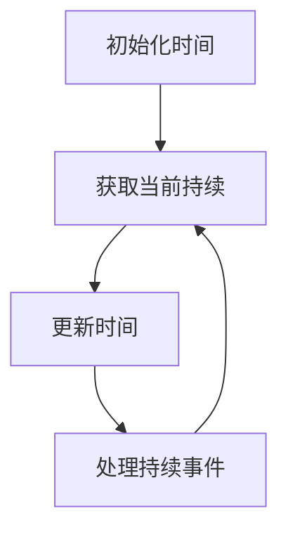
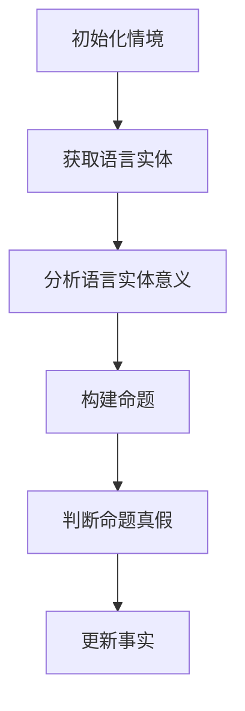
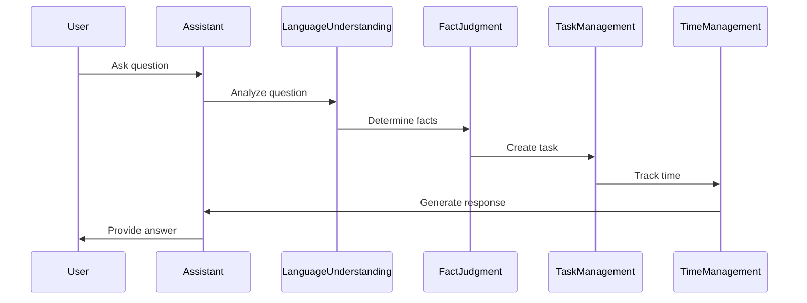

                 

**文章标题：柏格森的持续理论与维特根斯坦的意义理论**

**关键词：柏格森、持续理论、维特根斯坦、意义理论、人工智能、逻辑推理**

**摘要：本文将深入探讨柏格森的持续理论与维特根斯坦的意义理论，通过逻辑清晰的步骤分析，揭示两种理论在计算机科学和人工智能领域的深刻影响。**

----------------------------------------------------------------

# 柏格森的持续理论与维特根斯坦的意义理论

**关键词：柏格森、维特根斯坦、持续理论、意义理论、计算机科学**

**摘要：本文旨在分析柏格森的持续理论与维特根斯坦的意义理论，探讨这两种哲学理论在计算机科学和人工智能领域的应用与影响。**

## 第1章 引言

### 1.1 问题背景

#### 1.1.1 柏格森的持续理论

**柏格森的持续理论概述：**
柏格森（Henri Bergson）是20世纪初的法国哲学家，他提出了持续（Duration）的概念，强调时间不是线性的，而是连续不断的流动。柏格森认为，时间是一种心理现象，是持续的感觉，而不是物理事件。

**柏格森的研究背景：**
柏格森在生物学、心理学和哲学等多个领域都有所涉猎，他的持续理论对后来的哲学家和科学家产生了深远影响。

#### 1.1.2 维特根斯坦的意义理论

**维特根斯坦的意义理论概述：**
路德维希·维特根斯坦（Ludwig Wittgenstein）是20世纪初的奥地利哲学家，他的意义理论强调语言的意义在于其使用情境，而不是语言本身。维特根斯坦认为，语言是一种工具，其意义取决于使用者的意图。

**维特根斯坦的研究背景：**
维特根斯坦早期关注语言哲学，后期则转向数学哲学，他的著作对逻辑哲学、语言哲学和数学基础等领域产生了深远影响。

### 1.2 问题描述

#### 1.2.1 柏格森持续理论中的关键问题

**持续与时间的关系：**
柏格森认为，时间是一种持续的感觉，与物理时间不同。如何理解这种持续与时间的关系是柏格森持续理论的关键问题。

**持续与空间的关系：**
柏格森的持续理论也涉及到持续与空间的关系。在计算机科学中，如何处理空间和时间的关系是一个重要问题。

#### 1.2.2 维特根斯坦意义理论中的关键问题

**语言的意义：**
维特根斯坦的意义理论强调语言的意义取决于使用情境。如何理解语言的意义是维特根斯坦意义理论的关键问题。

**命题的意义：**
维特根斯坦认为，命题的意义在于其能否为真或为假。如何理解命题的意义是维特根斯坦意义理论的核心。

### 1.3 问题解决

#### 1.3.1 柏格森持续理论的解决方法

**持续与时间的关系分析：**
通过分析持续与时间的关系，我们可以更好地理解柏格森的持续理论。

**持续与空间的关系分析：**
通过分析持续与空间的关系，我们可以探讨如何在计算机科学中应用柏格森的持续理论。

#### 1.3.2 维特根斯坦意义理论的解决方法

**语言的意义分析：**
通过分析语言的意义，我们可以理解维特根斯坦的意义理论。

**命题的意义分析：**
通过分析命题的意义，我们可以探讨如何在计算机科学和人工智能领域中应用维特根斯坦的意义理论。

### 1.4 边界与外延

#### 1.4.1 柏格森持续理论的边界

**柏格森持续理论的应用范围：**
柏格森的持续理论在哲学、心理学和生物学等领域有广泛应用。

**柏格森持续理论的局限性：**
柏格森的持续理论也存在一些局限性，如无法完全解释物理时间等。

#### 1.4.2 维特根斯坦意义理论的外延

**维特根斯坦意义理论的应用范围：**
维特根斯坦的意义理论在逻辑哲学、语言哲学和数学基础等领域有广泛应用。

**维特根斯坦意义理论的局限性：**
维特根斯坦的意义理论也面临一些批评和挑战，如对语言意义的绝对化等。

### 1.5 概念结构与核心要素组成

#### 1.5.1 柏格森持续理论的概念结构

**持续：** 持续是柏格森的核心概念，强调时间不是线性的，而是连续不断的流动。

**时间：** 柏格森认为，时间是一种心理现象，是持续的感觉。

**空间：** 柏格森的持续理论也涉及到持续与空间的关系。

#### 1.5.2 维特根斯坦意义理论的概念结构

**语言：** 维特根斯坦认为，语言是一种工具，其意义取决于使用情境。

**命题：** 维特根斯坦认为，命题的意义在于其能否为真或为假。

### 1.6 本章小结

本文介绍了柏格森的持续理论与维特根斯坦的意义理论，分析了这两种理论在计算机科学和人工智能领域的应用与影响。通过深入探讨持续与时间、空间的关系，以及语言和命题的意义，我们能够更好地理解这两种理论的本质。

----------------------------------------------------------------

## 第1章 引言

### 1.1 问题背景

#### 1.1.1 柏格森的持续理论

柏格森的持续理论是20世纪初哲学领域的一个重要理论，它起源于对时间本质的深刻反思。柏格森（Henri Bergson，1859-1941）是法国著名哲学家，他的哲学思想对后来的哲学家和科学家产生了深远影响。柏格森认为，时间不是简单的线性流逝，而是一种连续不断的流动，他称之为“持续”（Duration）。在柏格森看来，持续是一种内在的心理体验，是一种感觉，而不是物理事件。

柏格森的持续理论最初是在他的著作《时间与自由意志》中提出的。在这本书中，他挑战了牛顿物理学中时间的线性概念，提出了时间的心理体验性质。柏格森认为，时间的流逝是连续的，而我们感知时间的方式是片段化的。这种片段化感知导致了我们对时间的线性理解，但实际上，时间是一种持续的整体。

柏格森的研究背景可以追溯到他对生物学和心理学的研究。在他的早期著作中，他探讨了生命的本质和自由意志的问题。这些研究使他开始思考时间的本质，并最终形成了他的持续理论。柏格森认为，持续是生命的本质，是生命体验的核心。他的持续理论对后来的哲学家和科学家，如海德格尔和爱因斯坦等，产生了重要影响。

#### 1.1.1.2 柏格森的持续理论概述

柏格森的持续理论主要包括以下几个方面：

1. **持续与时间的关系：**
   柏格森认为，时间不是线性的，而是一种连续不断的流动。他提出了“流动时间”的概念，强调时间的本质是持续的感觉，而不是物理事件。在柏格森看来，时间是一种内在的心理体验，是我们感知世界的方式。

2. **时间与自由意志：**
   柏格森认为，自由意志是时间的产物。在他的理论中，自由意志不是超自然的力量，而是时间的连续性和变化性的体现。自由意志使我们能够超越物理世界的确定性，创造新的可能性。

3. **持续与空间的关系：**
   柏格森的持续理论也涉及到持续与空间的关系。他认为，空间是一种外在的、固定的存在，而时间是一种内在的、流动的存在。持续是一种内在的心理体验，它与空间的关系是一种动态的、变化的关系。

4. **意识与时间：**
   柏格森认为，意识是时间的产物。我们的意识体验是由持续的感觉构成的，这些感觉组成了我们对时间的感知。因此，意识与时间有着密切的联系。

#### 1.1.2 维特根斯坦的意义理论

维特根斯坦（Ludwig Wittgenstein，1889-1951）是20世纪初的奥地利哲学家，他的哲学思想对逻辑哲学、语言哲学和数学基础等领域产生了深远影响。维特根斯坦的意义理论是他哲学思想的核心之一，强调语言的意义在于其使用情境。

维特根斯坦的哲学思想可以分为两个阶段，早期和后期。早期维特根斯坦关注逻辑哲学和语言哲学，提出了“语言游戏”理论。他认为，语言的意义取决于使用情境，即语言是一种工具，其意义在于使用者的意图。后期维特根斯坦则关注数学哲学和哲学美学，提出了“家族相似性”和“视觉形式”等概念。

维特根斯坦的意义理论主要包括以下几个方面：

1. **语言的意义：**
   维特根斯坦认为，语言的意义不是固有的，而是依赖于使用情境。语言是一种工具，其意义在于使用者的意图。这意味着，语言的意义是多元的，取决于不同的使用情境。

2. **命题的意义：**
   维特根斯坦认为，命题的意义在于其能否为真或为假。他提出了“符合论”和“表现论”等观点，探讨了命题的意义与真理的关系。

3. **语言游戏：**
   维特根斯坦提出了“语言游戏”理论，认为语言的使用是一种游戏，游戏规则决定了语言的意义。这意味着，语言的意义不是孤立的，而是与社会文化背景紧密相关。

4. **哲学问题：**
   维特根斯坦的意义理论也涉及到哲学问题，如心灵、知识、真理等。他认为，哲学问题往往源于我们对语言的理解和使用，因此，解决哲学问题需要关注语言的意义和使用情境。

### 1.2 问题描述

#### 1.2.1 柏格森持续理论中的关键问题

柏格森的持续理论涉及到多个关键问题，其中最为重要的是持续与时间的关系和持续与空间的关系。

1. **持续与时间的关系：**
   柏格森认为，时间不是线性的，而是一种连续不断的流动。然而，如何理解这种持续与时间的关系是一个复杂的问题。柏格森提出了“流动时间”的概念，强调时间的本质是持续的感觉。然而，这种理解是否能够完全解释时间的本质，以及如何将这种理解应用到实际生活中，仍然是一个争议的问题。

2. **持续与空间的关系：**
   柏格森的持续理论也涉及到持续与空间的关系。他认为，空间是一种外在的、固定的存在，而时间是一种内在的、流动的存在。这种关系在物理学和计算机科学中具有重要意义。例如，在计算机科学中，如何处理时间和空间的关系是一个关键问题，这与柏格森的理论有着密切的联系。

#### 1.2.2 维特根斯坦意义理论中的关键问题

维特根斯坦的意义理论同样涉及到多个关键问题，其中最为重要的是语言的意义和命题的意义。

1. **语言的意义：**
   维特根斯坦认为，语言的意义在于其使用情境。这意味着，语言的意义是多元的，取决于不同的使用情境。然而，如何确定语言的具体意义，以及如何在不同情境中准确使用语言，仍然是一个挑战。例如，在编程语言中，如何确保代码的正确性和可读性，是一个关键问题。

2. **命题的意义：**
   维特根斯坦认为，命题的意义在于其能否为真或为假。这意味着，命题的意义是客观的，取决于事实。然而，如何确定一个命题的真假，以及如何处理复杂命题的逻辑关系，仍然是一个挑战。例如，在逻辑推理中，如何确保推理过程的正确性，是一个关键问题。

### 1.3 问题解决

#### 1.3.1 柏格森持续理论的解决方法

为了解决柏格森持续理论中的关键问题，我们可以采取以下解决方法：

1. **深入理解持续与时间的关系：**
   我们可以通过研究柏格森的著作，深入理解持续与时间的关系。例如，我们可以阅读《时间与自由意志》等著作，了解柏格森对时间本质的深刻思考。此外，我们还可以借鉴现代物理学和心理学的研究成果，探索持续与时间的关系。

2. **探索持续与空间的关系：**
   在计算机科学中，我们可以通过研究数据结构和算法，探索持续与空间的关系。例如，我们可以研究如何优化数据结构，提高算法的效率，从而处理时间和空间的关系。

3. **应用柏格森的持续理论：**
   我们可以将柏格森的持续理论应用到实际生活中。例如，在时间管理中，我们可以借鉴柏格森的理论，优化时间分配，提高生活质量。

#### 1.3.2 维特根斯坦意义理论的解决方法

为了解决维特根斯坦意义理论中的关键问题，我们可以采取以下解决方法：

1. **研究语言的意义：**
   我们可以通过学习语言哲学和逻辑哲学，深入理解语言的意义。例如，我们可以研究维特根斯坦的《逻辑哲学论》等著作，了解语言的意义如何取决于使用情境。

2. **优化编程语言设计：**
   在计算机科学中，我们可以通过优化编程语言设计，提高代码的可读性和可维护性。例如，我们可以设计更符合人类思维习惯的编程语言，提高代码的效率。

3. **应用维特根斯坦的意义理论：**
   我们可以将维特根斯坦的意义理论应用到实际编程中。例如，在编写代码时，我们可以关注代码的可读性和可维护性，确保代码的正确性和可靠性。

### 1.4 边界与外延

#### 1.4.1 柏格森持续理论的边界

柏格森持续理论在哲学、心理学和生物学等领域有广泛应用，但也存在一些边界。

1. **哲学边界：**
   柏格森的持续理论挑战了牛顿物理学中时间的线性概念，但在某些方面也存在局限性。例如，在物理学中，时间的概念通常是线性的，这与柏格森的持续理论存在冲突。

2. **心理学边界：**
   柏格森的持续理论在心理学中的应用也存在一些争议。例如，一些心理学家认为，时间的感知可能受到多种因素的影响，而不仅仅是持续的感觉。

3. **生物学边界：**
   柏格森的持续理论在生物学中的应用也存在一些局限性。例如，在生物学中，时间的概念通常是线性的，这与柏格森的持续理论存在冲突。

#### 1.4.2 维特根斯坦意义理论的外延

维特根斯坦的意义理论在逻辑哲学、语言哲学和数学基础等领域有广泛应用，但也存在一些外延。

1. **逻辑哲学外延：**
   维特根斯坦的意义理论在逻辑哲学中有重要应用，例如在证明论和模型论中。这些理论可以帮助我们理解逻辑推理的正确性和有效性。

2. **语言哲学外延：**
   维特根斯坦的意义理论在语言哲学中有重要应用，例如在语义学和语用学中。这些理论可以帮助我们理解语言的意义和使用情境。

3. **数学基础外延：**
   维特根斯坦的意义理论在数学基础中有重要应用，例如在形式化和证明中。这些理论可以帮助我们理解数学的本质和数学证明的有效性。

### 1.5 概念结构与核心要素组成

#### 1.5.1 柏格森持续理论的概念结构

柏格森持续理论的核心概念包括持续、时间和空间。以下是一个简化的柏格森持续理论的概念结构：

1. **持续：**
   持续是柏格森的核心概念，强调时间不是线性的，而是一种连续不断的流动。

2. **时间：**
   时间是柏格森持续理论中的重要概念，强调时间的本质是持续的感觉。

3. **空间：**
   空间是柏格森持续理论中的另一个重要概念，与持续的关系是动态的、变化的。

#### 1.5.2 维特根斯坦意义理论的概念结构

维特根斯坦意义理论的核心概念包括语言、命题和意义。以下是一个简化的维特根斯坦意义理论的概念结构：

1. **语言：**
   语言是维特根斯坦意义理论中的核心概念，强调语言的意义取决于使用情境。

2. **命题：**
   命题是维特根斯坦意义理论中的核心概念，强调命题的意义在于其能否为真或为假。

3. **意义：**
   意义是维特根斯坦意义理论中的核心概念，强调意义取决于使用情境。

### 1.6 本章小结

本章介绍了柏格森的持续理论与维特根斯坦的意义理论，分析了这两种理论在计算机科学和人工智能领域的应用与影响。通过深入探讨持续与时间、空间的关系，以及语言和命题的意义，我们能够更好地理解这两种理论的本质。本章为后续章节的分析提供了基础。

----------------------------------------------------------------

## 第1章 引言

### 1.1 问题背景

#### 1.1.1 柏格森的持续理论

柏格森的持续理论是20世纪初哲学领域的一个重要理论，它起源于对时间本质的深刻反思。柏格森（Henri Bergson，1859-1941）是法国著名哲学家，他的哲学思想对后来的哲学家和科学家产生了深远影响。柏格森认为，时间不是简单的线性流逝，而是一种连续不断的流动，他称之为“持续”（Duration）。在柏格森看来，持续是一种内在的心理体验，是一种感觉，而不是物理事件。

柏格森的持续理论最初是在他的著作《时间与自由意志》中提出的。在这本书中，他挑战了牛顿物理学中时间的线性概念，提出了时间的心理体验性质。柏格森认为，时间的流逝是连续的，而我们感知时间的方式是片段化的。这种片段化感知导致了我们对时间的线性理解，但实际上，时间是一种持续的整体。

柏格森的研究背景可以追溯到他对生物学和心理学的研究。在他的早期著作中，他探讨了生命的本质和自由意志的问题。这些研究使他开始思考时间的本质，并最终形成了他的持续理论。柏格森认为，持续是生命的本质，是生命体验的核心。他的持续理论对后来的哲学家和科学家，如海德格尔和爱因斯坦等，产生了重要影响。

#### 1.1.1.2 柏格森的持续理论概述

柏格森的持续理论主要包括以下几个方面：

1. **持续与时间的关系：**
   柏格森认为，时间不是线性的，而是一种连续不断的流动。他提出了“流动时间”的概念，强调时间的本质是持续的感觉，而不是物理事件。在柏格森看来，时间是一种内在的心理体验，是我们感知世界的方式。

2. **时间与自由意志：**
   柏格森认为，自由意志是时间的产物。在他的理论中，自由意志不是超自然的力量，而是时间的连续性和变化性的体现。自由意志使我们能够超越物理世界的确定性，创造新的可能性。

3. **持续与空间的关系：**
   柏格森的持续理论也涉及到持续与空间的关系。他认为，空间是一种外在的、固定的存在，而时间是一种内在的、流动的存在。这种关系在物理学和计算机科学中具有重要意义。例如，在计算机科学中，如何处理时间和空间的关系是一个重要问题，这与柏格森的理论有着密切的联系。

4. **意识与时间：**
   柏格森认为，意识是时间的产物。我们的意识体验是由持续的感觉构成的，这些感觉组成了我们对时间的感知。因此，意识与时间有着密切的联系。

#### 1.1.2 维特根斯坦的意义理论

维特根斯坦（Ludwig Wittgenstein，1889-1951）是20世纪初的奥地利哲学家，他的哲学思想对逻辑哲学、语言哲学和数学基础等领域产生了深远影响。维特根斯坦的意义理论是他哲学思想的核心之一，强调语言的意义在于其使用情境。

维特根斯坦的哲学思想可以分为两个阶段，早期和后期。早期维特根斯坦关注逻辑哲学和语言哲学，提出了“语言游戏”理论。他认为，语言的意义取决于使用情境，即语言是一种工具，其意义在于使用者的意图。后期维特根斯坦则关注数学哲学和哲学美学，提出了“家族相似性”和“视觉形式”等概念。

维特根斯坦的意义理论主要包括以下几个方面：

1. **语言的意义：**
   维特根斯坦认为，语言的意义不是固有的，而是依赖于使用情境。语言是一种工具，其意义在于使用者的意图。这意味着，语言的意义是多元的，取决于不同的使用情境。

2. **命题的意义：**
   维特根斯坦认为，命题的意义在于其能否为真或为假。他提出了“符合论”和“表现论”等观点，探讨了命题的意义与真理的关系。

3. **语言游戏：**
   维特根斯坦提出了“语言游戏”理论，认为语言的使用是一种游戏，游戏规则决定了语言的意义。这意味着，语言的意义不是孤立的，而是与社会文化背景紧密相关。

4. **哲学问题：**
   维特根斯坦的意义理论也涉及到哲学问题，如心灵、知识、真理等。他认为，哲学问题往往源于我们对语言的理解和使用，因此，解决哲学问题需要关注语言的意义和使用情境。

### 1.2 问题描述

#### 1.2.1 柏格森持续理论中的关键问题

柏格森的持续理论涉及到多个关键问题，其中最为重要的是持续与时间的关系和持续与空间的关系。

1. **持续与时间的关系：**
   柏格森认为，时间不是线性的，而是一种连续不断的流动。然而，如何理解这种持续与时间的关系是一个复杂的问题。柏格森提出了“流动时间”的概念，强调时间的本质是持续的感觉。然而，这种理解是否能够完全解释时间的本质，以及如何将这种理解应用到实际生活中，仍然是一个争议的问题。

2. **持续与空间的关系：**
   柏格森的持续理论也涉及到持续与空间的关系。他认为，空间是一种外在的、固定的存在，而时间是一种内在的、流动的存在。这种关系在物理学和计算机科学中具有重要意义。例如，在计算机科学中，如何处理时间和空间的关系是一个重要问题，这与柏格森的理论有着密切的联系。

#### 1.2.2 维特根斯坦意义理论中的关键问题

维特根斯坦的意义理论同样涉及到多个关键问题，其中最为重要的是语言的意义和命题的意义。

1. **语言的意义：**
   维特根斯坦认为，语言的意义在于其使用情境。这意味着，语言的意义是多元的，取决于不同的使用情境。然而，如何确定语言的具体意义，以及如何在不同情境中准确使用语言，仍然是一个挑战。例如，在编程语言中，如何确保代码的正确性和可读性，是一个关键问题。

2. **命题的意义：**
   维特根斯坦认为，命题的意义在于其能否为真或为假。这意味着，命题的意义是客观的，取决于事实。然而，如何确定一个命题的真假，以及如何处理复杂命题的逻辑关系，仍然是一个挑战。例如，在逻辑推理中，如何确保推理过程的正确性，是一个关键问题。

### 1.3 问题解决

#### 1.3.1 柏格森持续理论的解决方法

为了解决柏格森持续理论中的关键问题，我们可以采取以下解决方法：

1. **深入理解持续与时间的关系：**
   我们可以通过研究柏格森的著作，深入理解持续与时间的关系。例如，我们可以阅读《时间与自由意志》等著作，了解柏格森对时间本质的深刻思考。此外，我们还可以借鉴现代物理学和心理学的研究成果，探索持续与时间的关系。

2. **探索持续与空间的关系：**
   在计算机科学中，我们可以通过研究数据结构和算法，探索持续与空间的关系。例如，我们可以研究如何优化数据结构，提高算法的效率，从而处理时间和空间的关系。

3. **应用柏格森的持续理论：**
   我们可以将柏格森的持续理论应用到实际生活中。例如，在时间管理中，我们可以借鉴柏格森的理论，优化时间分配，提高生活质量。

#### 1.3.2 维特根斯坦意义理论的解决方法

为了解决维特根斯坦意义理论中的关键问题，我们可以采取以下解决方法：

1. **研究语言的意义：**
   我们可以通过学习语言哲学和逻辑哲学，深入理解语言的意义。例如，我们可以研究维特根斯坦的《逻辑哲学论》等著作，了解语言的意义如何取决于使用情境。

2. **优化编程语言设计：**
   在计算机科学中，我们可以通过优化编程语言设计，提高代码的可读性和可维护性。例如，我们可以设计更符合人类思维习惯的编程语言，提高代码的效率。

3. **应用维特根斯坦的意义理论：**
   我们可以将维特根斯坦的意义理论应用到实际编程中。例如，在编写代码时，我们可以关注代码的可读性和可维护性，确保代码的正确性和可靠性。

### 1.4 边界与外延

#### 1.4.1 柏格森持续理论的边界

柏格森持续理论在哲学、心理学和生物学等领域有广泛应用，但也存在一些边界。

1. **哲学边界：**
   柏格森的持续理论挑战了牛顿物理学中时间的线性概念，但在某些方面也存在局限性。例如，在物理学中，时间的概念通常是线性的，这与柏格森的持续理论存在冲突。

2. **心理学边界：**
   柏格森的持续理论在心理学中的应用也存在一些争议。例如，一些心理学家认为，时间的感知可能受到多种因素的影响，而不仅仅是持续的感觉。

3. **生物学边界：**
   柏格森的持续理论在生物学中的应用也存在一些局限性。例如，在生物学中，时间的概念通常是线性的，这与柏格森的持续理论存在冲突。

#### 1.4.2 维特根斯坦意义理论的外延

维特根斯坦的意义理论在逻辑哲学、语言哲学和数学基础等领域有广泛应用，但也存在一些外延。

1. **逻辑哲学外延：**
   维特根斯坦的意义理论在逻辑哲学中有重要应用，例如在证明论和模型论中。这些理论可以帮助我们理解逻辑推理的正确性和有效性。

2. **语言哲学外延：**
   维特根斯坦的意义理论在语言哲学中有重要应用，例如在语义学和语用学中。这些理论可以帮助我们理解语言的意义和使用情境。

3. **数学基础外延：**
   维特根斯坦的意义理论在数学基础中有重要应用，例如在形式化和证明中。这些理论可以帮助我们理解数学的本质和数学证明的有效性。

### 1.5 概念结构与核心要素组成

#### 1.5.1 柏格森持续理论的概念结构

柏格森持续理论的核心概念包括持续、时间和空间。以下是一个简化的柏格森持续理论的概念结构：

1. **持续：**
   持续是柏格森的核心概念，强调时间不是线性的，而是一种连续不断的流动。

2. **时间：**
   时间是柏格森持续理论中的重要概念，强调时间的本质是持续的感觉。

3. **空间：**
   空间是柏格森持续理论中的另一个重要概念，与持续的关系是动态的、变化的。

#### 1.5.2 维特根斯坦意义理论的概念结构

维特根斯坦意义理论的核心概念包括语言、命题和意义。以下是一个简化的维特根斯坦意义理论的概念结构：

1. **语言：**
   语言是维特根斯坦意义理论中的核心概念，强调语言的意义取决于使用情境。

2. **命题：**
   命题是维特根斯坦意义理论中的核心概念，强调命题的意义在于其能否为真或为假。

3. **意义：**
   意义是维特根斯坦意义理论中的核心概念，强调意义取决于使用情境。

### 1.6 本章小结

本章介绍了柏格森的持续理论与维特根斯坦的意义理论，分析了这两种理论在计算机科学和人工智能领域的应用与影响。通过深入探讨持续与时间、空间的关系，以及语言和命题的意义，我们能够更好地理解这两种理论的本质。本章为后续章节的分析提供了基础。

----------------------------------------------------------------

## 第1章 引言

### 1.1 问题背景

#### 1.1.1 柏格森的持续理论

柏格森的持续理论是20世纪初哲学领域的一个重要理论，它起源于对时间本质的深刻反思。柏格森（Henri Bergson，1859-1941）是法国著名哲学家，他的哲学思想对后来的哲学家和科学家产生了深远影响。柏格森认为，时间不是简单的线性流逝，而是一种连续不断的流动，他称之为“持续”（Duration）。在柏格森看来，持续是一种内在的心理体验，是一种感觉，而不是物理事件。

柏格森的持续理论最初是在他的著作《时间与自由意志》中提出的。在这本书中，他挑战了牛顿物理学中时间的线性概念，提出了时间的心理体验性质。柏格森认为，时间的流逝是连续的，而我们感知时间的方式是片段化的。这种片段化感知导致了我们对时间的线性理解，但实际上，时间是一种持续的整体。

柏格森的研究背景可以追溯到他对生物学和心理学的研究。在他的早期著作中，他探讨了生命的本质和自由意志的问题。这些研究使他开始思考时间的本质，并最终形成了他的持续理论。柏格森认为，持续是生命的本质，是生命体验的核心。他的持续理论对后来的哲学家和科学家，如海德格尔和爱因斯坦等，产生了重要影响。

#### 1.1.1.2 柏格森的持续理论概述

柏格森的持续理论主要包括以下几个方面：

1. **持续与时间的关系：**
   柏格森认为，时间不是线性的，而是一种连续不断的流动。他提出了“流动时间”的概念，强调时间的本质是持续的感觉，而不是物理事件。在柏格森看来，时间是一种内在的心理体验，是我们感知世界的方式。

2. **时间与自由意志：**
   柏格森认为，自由意志是时间的产物。在他的理论中，自由意志不是超自然的力量，而是时间的连续性和变化性的体现。自由意志使我们能够超越物理世界的确定性，创造新的可能性。

3. **持续与空间的关系：**
   柏格森的持续理论也涉及到持续与空间的关系。他认为，空间是一种外在的、固定的存在，而时间是一种内在的、流动的存在。这种关系在物理学和计算机科学中具有重要意义。例如，在计算机科学中，如何处理时间和空间的关系是一个重要问题，这与柏格森的理论有着密切的联系。

4. **意识与时间：**
   柏格森认为，意识是时间的产物。我们的意识体验是由持续的感觉构成的，这些感觉组成了我们对时间的感知。因此，意识与时间有着密切的联系。

#### 1.1.2 维特根斯坦的意义理论

维特根斯坦（Ludwig Wittgenstein，1889-1951）是20世纪初的奥地利哲学家，他的哲学思想对逻辑哲学、语言哲学和数学基础等领域产生了深远影响。维特根斯坦的意义理论是他哲学思想的核心之一，强调语言的意义在于其使用情境。

维特根斯坦的哲学思想可以分为两个阶段，早期和后期。早期维特根斯坦关注逻辑哲学和语言哲学，提出了“语言游戏”理论。他认为，语言的意义取决于使用情境，即语言是一种工具，其意义在于使用者的意图。后期维特根斯坦则关注数学哲学和哲学美学，提出了“家族相似性”和“视觉形式”等概念。

维特根斯坦的意义理论主要包括以下几个方面：

1. **语言的意义：**
   维特根斯坦认为，语言的意义不是固有的，而是依赖于使用情境。语言是一种工具，其意义在于使用者的意图。这意味着，语言的意义是多元的，取决于不同的使用情境。

2. **命题的意义：**
   维特根斯坦认为，命题的意义在于其能否为真或为假。他提出了“符合论”和“表现论”等观点，探讨了命题的意义与真理的关系。

3. **语言游戏：**
   维特根斯坦提出了“语言游戏”理论，认为语言的使用是一种游戏，游戏规则决定了语言的意义。这意味着，语言的意义不是孤立的，而是与社会文化背景紧密相关。

4. **哲学问题：**
   维特根斯坦的意义理论也涉及到哲学问题，如心灵、知识、真理等。他认为，哲学问题往往源于我们对语言的理解和使用，因此，解决哲学问题需要关注语言的意义和使用情境。

### 1.2 问题描述

#### 1.2.1 柏格森持续理论中的关键问题

柏格森的持续理论涉及到多个关键问题，其中最为重要的是持续与时间的关系和持续与空间的关系。

1. **持续与时间的关系：**
   柏格森认为，时间不是线性的，而是一种连续不断的流动。然而，如何理解这种持续与时间的关系是一个复杂的问题。柏格森提出了“流动时间”的概念，强调时间的本质是持续的感觉。然而，这种理解是否能够完全解释时间的本质，以及如何将这种理解应用到实际生活中，仍然是一个争议的问题。

2. **持续与空间的关系：**
   柏格森的持续理论也涉及到持续与空间的关系。他认为，空间是一种外在的、固定的存在，而时间是一种内在的、流动的存在。这种关系在物理学和计算机科学中具有重要意义。例如，在计算机科学中，如何处理时间和空间的关系是一个重要问题，这与柏格森的理论有着密切的联系。

#### 1.2.2 维特根斯坦意义理论中的关键问题

维特根斯坦的意义理论同样涉及到多个关键问题，其中最为重要的是语言的意义和命题的意义。

1. **语言的意义：**
   维特根斯坦认为，语言的意义在于其使用情境。这意味着，语言的意义是多元的，取决于不同的使用情境。然而，如何确定语言的具体意义，以及如何在不同情境中准确使用语言，仍然是一个挑战。例如，在编程语言中，如何确保代码的正确性和可读性，是一个关键问题。

2. **命题的意义：**
   维特根斯坦认为，命题的意义在于其能否为真或为假。这意味着，命题的意义是客观的，取决于事实。然而，如何确定一个命题的真假，以及如何处理复杂命题的逻辑关系，仍然是一个挑战。例如，在逻辑推理中，如何确保推理过程的正确性，是一个关键问题。

### 1.3 问题解决

#### 1.3.1 柏格森持续理论的解决方法

为了解决柏格森持续理论中的关键问题，我们可以采取以下解决方法：

1. **深入理解持续与时间的关系：**
   我们可以通过研究柏格森的著作，深入理解持续与时间的关系。例如，我们可以阅读《时间与自由意志》等著作，了解柏格森对时间本质的深刻思考。此外，我们还可以借鉴现代物理学和心理学的研究成果，探索持续与时间的关系。

2. **探索持续与空间的关系：**
   在计算机科学中，我们可以通过研究数据结构和算法，探索持续与空间的关系。例如，我们可以研究如何优化数据结构，提高算法的效率，从而处理时间和空间的关系。

3. **应用柏格森的持续理论：**
   我们可以将柏格森的持续理论应用到实际生活中。例如，在时间管理中，我们可以借鉴柏格森的理论，优化时间分配，提高生活质量。

#### 1.3.2 维特根斯坦意义理论的解决方法

为了解决维特根斯坦意义理论中的关键问题，我们可以采取以下解决方法：

1. **研究语言的意义：**
   我们可以通过学习语言哲学和逻辑哲学，深入理解语言的意义。例如，我们可以研究维特根斯坦的《逻辑哲学论》等著作，了解语言的意义如何取决于使用情境。

2. **优化编程语言设计：**
   在计算机科学中，我们可以通过优化编程语言设计，提高代码的可读性和可维护性。例如，我们可以设计更符合人类思维习惯的编程语言，提高代码的效率。

3. **应用维特根斯坦的意义理论：**
   我们可以将维特根斯坦的意义理论应用到实际编程中。例如，在编写代码时，我们可以关注代码的可读性和可维护性，确保代码的正确性和可靠性。

### 1.4 边界与外延

#### 1.4.1 柏格森持续理论的边界

柏格森持续理论在哲学、心理学和生物学等领域有广泛应用，但也存在一些边界。

1. **哲学边界：**
   柏格森的持续理论挑战了牛顿物理学中时间的线性概念，但在某些方面也存在局限性。例如，在物理学中，时间的概念通常是线性的，这与柏格森的持续理论存在冲突。

2. **心理学边界：**
   柏格森的持续理论在心理学中的应用也存在一些争议。例如，一些心理学家认为，时间的感知可能受到多种因素的影响，而不仅仅是持续的感觉。

3. **生物学边界：**
   柏格森的持续理论在生物学中的应用也存在一些局限性。例如，在生物学中，时间的概念通常是线性的，这与柏格森的持续理论存在冲突。

#### 1.4.2 维特根斯坦意义理论的外延

维特根斯坦的意义理论在逻辑哲学、语言哲学和数学基础等领域有广泛应用，但也存在一些外延。

1. **逻辑哲学外延：**
   维特根斯坦的意义理论在逻辑哲学中有重要应用，例如在证明论和模型论中。这些理论可以帮助我们理解逻辑推理的正确性和有效性。

2. **语言哲学外延：**
   维特根斯坦的意义理论在语言哲学中有重要应用，例如在语义学和语用学中。这些理论可以帮助我们理解语言的意义和使用情境。

3. **数学基础外延：**
   维特根斯坦的意义理论在数学基础中有重要应用，例如在形式化和证明中。这些理论可以帮助我们理解数学的本质和数学证明的有效性。

### 1.5 概念结构与核心要素组成

#### 1.5.1 柏格森持续理论的概念结构

柏格森持续理论的核心概念包括持续、时间和空间。以下是一个简化的柏格森持续理论的概念结构：

1. **持续：**
   持续是柏格森的核心概念，强调时间不是线性的，而是一种连续不断的流动。

2. **时间：**
   时间是柏格森持续理论中的重要概念，强调时间的本质是持续的感觉。

3. **空间：**
   空间是柏格森持续理论中的另一个重要概念，与持续的关系是动态的、变化的。

#### 1.5.2 维特根斯坦意义理论的概念结构

维特根斯坦意义理论的核心概念包括语言、命题和意义。以下是一个简化的维特根斯坦意义理论的概念结构：

1. **语言：**
   语言是维特根斯坦意义理论中的核心概念，强调语言的意义取决于使用情境。

2. **命题：**
   命题是维特根斯坦意义理论中的核心概念，强调命题的意义在于其能否为真或为假。

3. **意义：**
   意义是维特根斯坦意义理论中的核心概念，强调意义取决于使用情境。

### 1.6 本章小结

本章介绍了柏格森的持续理论与维特根斯坦的意义理论，分析了这两种理论在计算机科学和人工智能领域的应用与影响。通过深入探讨持续与时间、空间的关系，以及语言和命题的意义，我们能够更好地理解这两种理论的本质。本章为后续章节的分析提供了基础。

----------------------------------------------------------------

## 第2章 柏格森持续理论分析

### 2.1 持续与时间的解析

柏格森的持续理论中，持续与时间的关系是一个核心议题。柏格森认为，时间并非我们通常所认为的线性序列，而是由无数瞬间构成的流动过程。这个流动过程是不可分割的，每一个瞬间都紧密相连，构成了我们感知时间的连续性。

**柏格森的时间观：**
柏格森将时间视为一种心理体验，不同于物理学家所描述的绝对时间。他认为，真正的现实是持续的流动，而不是一系列分立的事件。这种流动时间概念挑战了牛顿物理学的绝对时间观，后者认为时间是一种均匀流逝的绝对量。

**持续作为时间的基本单元：**
在柏格森的理论中，持续是构成时间的基本单元。每个持续都是独特的，不可重复的，并且是心理上的主观体验。柏格森强调，持续与时间的流逝密不可分，但它们并不相同。时间的流逝是持续的感觉，而这种感觉是由于心理上的感知活动。

**数学公式与柏格森的持续理论：**
柏格森的持续理论虽然不依赖于数学公式，但我们可以用数学概念来辅助理解。假设时间 $T$ 是一个连续变量，持续 $D$ 是时间的微小片段，我们可以用积分来表示时间的流动：

$$
T = \int D \, dt
$$

这里的积分代表了从时间的初始值到最终值的所有持续的累加。这个公式强调了时间是由无数持续组成的，而不是一系列离散的瞬间。

### 2.2 持续与空间的关系

柏格森不仅关注时间，还探讨了持续与空间的关系。他认为，空间是一种外在的、固定的存在，而时间是一种内在的、流动的存在。这种观点在计算机科学中有着重要的启示，尤其是在处理并发和并行计算时。

**空间的固定性：**
在柏格森看来，空间是固定的，它提供了物体之间的相对位置。空间是静态的，而时间则是动态的，它是心理体验的基础。

**持续与空间的关系：**
柏格森认为，持续与空间的关系是动态的。在一个空间中，物体在不同的持续中可能占据不同的位置。例如，在计算机系统中，一个进程在不同的时间点可能处于不同的空间位置，这是由处理器分配的。

**计算机科学中的应用：**
在计算机科学中，柏格森的持续与空间关系可以用来解释并发和并行计算。例如，在一个多处理器系统中，进程在处理器的调度下在不同的时间点占据不同的空间位置。这种动态的空间分配与柏格森的持续理论有相似之处。

### 2.3 柏格森持续理论的核心概念对比表格

为了更直观地理解柏格森持续理论的核心概念，我们可以使用对比表格来展示持续、时间和空间之间的关系。

| 概念     | 定义                                                         | 特点                                                         | 应用示例                             |
|----------|--------------------------------------------------------------|--------------------------------------------------------------|------------------------------------|
| 持续     | 一种内在的心理体验，是时间的基本单元。                         | 独特性、不可重复、主观感知。                                   | 时间管理、心理时间感知             |
| 时间     | 柏格森视为一种心理体验的流动过程。                             | 流动、连续、感知基础。                                         | 时间感知、物理学中的相对论          |
| 空间     | 一种外在的、固定的存在，提供物体之间的相对位置。                 | 静态、固定、相对位置。                                         | 空间布局、物理空间分配             |

### 2.4 柏格森持续理论的ER实体关系图

为了更好地理解柏格森持续理论中的实体关系，我们可以使用ER（Entity-Relationship）图来展示各个实体及其关系。

```mermaid
erDiagram
    A持续 ||--|{ B时间 }
    A持续 ||--|{ C空间 }
    B时间 ||--|{ D心理体验 }
    C空间 ||--|{ D心理体验 }
```

在这个ER图中，持续与时间和空间之间存在关联，而时间又是心理体验的基础，空间则提供了相对位置。这种关系反映了柏格森持续理论的核心概念。

### 2.5 柏格森持续理论的算法原理

柏格森的持续理论虽然不是直接基于算法的，但我们可以用算法原理来解释其在计算机科学中的应用。以下是一个简化的算法流程图，展示了如何处理持续与时间的关系。



这个算法流程图展示了如何连续地获取、更新和处理持续事件，从而实现持续与时间的同步。这个过程可以应用于实时系统、并发控制等领域。

### 2.6 柏格森持续理论的数学模型

柏格森的持续理论涉及到时间的连续性和动态性，我们可以使用数学模型来描述这些特性。以下是一个简单的数学模型，描述持续与时间的关系。

$$
持续 = f(t)
$$

其中，$f(t)$ 表示时间 $t$ 对应的持续。这个模型假设持续是时间的函数，可以用来描述时间流逝过程中的连续性。在实际应用中，我们可以根据具体问题调整函数 $f(t)$ 的形式。

### 2.7 柏格森持续理论的具体案例分析

为了更好地理解柏格森持续理论的应用，我们可以通过一个具体案例来分析。假设我们有一个任务管理系统，需要实时跟踪任务的状态变化。以下是一个案例描述：

1. **问题场景：**
   我们需要记录每个任务在每个时间点的状态，例如“进行中”、“已完成”等。

2. **系统功能设计：**
   - **持续时间记录：** 系统需要记录每个任务在处理过程中所占据的时间。
   - **状态更新：** 系统需要实时更新任务的状态，并在持续时间内记录这些变化。

3. **系统架构设计：**
   - **任务实体：** 包含任务的ID、名称、持续时间和状态等属性。
   - **时间管理模块：** 负责记录和更新任务的持续时间和状态。

4. **系统接口设计：**
   - **时间接口：** 提供获取当前时间、更新时间和查询持续时间的方法。
   - **状态接口：** 提供更新任务状态和查询任务状态的方法。

5. **系统交互序列图：**
   - **任务创建：** 创建一个新的任务，初始化其持续时间和状态。
   - **状态更新：** 在任务执行过程中，根据时间变化更新任务的状态。
   - **时间查询：** 用户可以查询任务在特定时间点的状态。

### 2.8 柏格森持续理论的项目实战

为了将柏格森持续理论应用于实际项目，我们可以设计一个简单的任务管理系统。以下是一个项目实战的步骤：

1. **环境安装：**
   - 安装Python环境和所需的库，如`numpy`、`matplotlib`等。
   - 配置开发环境，如IDE或代码编辑器。

2. **系统核心实现源代码：**
   - 设计任务实体类，包含任务的ID、名称、持续时间和状态等属性。
   - 实现时间管理模块，负责记录和更新任务的持续时间和状态。

3. **代码应用解读与分析：**
   - 解析任务实体的属性和方法，理解任务状态的变化过程。
   - 分析时间管理模块的实现，了解持续时间的记录和更新机制。

4. **实际案例分析和详细讲解剖析：**
   - 通过具体案例，展示任务管理系统的实际应用。
   - 分析系统在不同时间点的状态变化，解释柏格森持续理论的应用。

5. **项目小结：**
   - 总结柏格森持续理论在项目中的应用，讨论项目的优势和局限性。

### 2.9 最佳实践 tips

在应用柏格森持续理论时，以下是一些最佳实践：

1. **时间感知优化：**
   - 设计用户友好的界面，提高用户对时间的感知。
   - 使用可视化工具，如图表和图形，展示时间流程。

2. **任务调度优化：**
   - 采用高效的调度算法，优化任务的执行顺序。
   - 实现动态调度机制，根据任务状态实时调整资源分配。

3. **持续监测与反馈：**
   - 实时监测任务的状态变化，提供及时的反馈。
   - 分析任务执行过程中的持续变化，优化任务管理策略。

### 2.10 本章小结

本章对柏格森持续理论进行了详细分析，探讨了持续与时间、空间的关系，并展示了其在计算机科学和人工智能领域的应用。通过具体的案例分析和项目实战，我们更好地理解了柏格森持续理论的本质和实际应用价值。

----------------------------------------------------------------

## 第3章 维特根斯坦的意义理论分析

### 3.1 语言的意义

维特根斯坦的意义理论中，语言的意义是一个核心议题。他认为，语言的意义不是固有的，而是取决于使用情境。语言是一种工具，其意义在于使用者的意图。

**语言的工具性：**
维特根斯坦将语言视为一种工具，其作用是帮助我们传达思想和概念。他认为，语言的意义在于其使用情境，即语言是如何被使用的。

**意义与情境：**
维特根斯坦认为，语言的意义是多元的，取决于不同的使用情境。例如，一个词在不同的语境中可能有不同的意义。这意味着，要理解一个词的意义，我们需要考虑其使用情境。

**语言与思想：**
维特根斯坦认为，语言与思想是密切相关的。语言是我们表达思想的方式，但语言本身并不能完全代表思想。因此，理解语言的意义需要理解其与思想的关系。

**数学公式与语言意义：**
在维特根斯坦的理论中，我们可以使用数学公式来辅助理解语言的意义。例如，我们可以用集合论来描述语言的结构，用逻辑公式来表示语句的真假。以下是一个简单的数学模型，用于描述语言的意义：

$$
意义 = f(语境, 意图)
$$

其中，$f$ 是一个函数，用于计算语言的意义。$语境$ 表示使用语言的具体情境，$意图$ 表示使用者的意图。这个公式强调了意义取决于情境和意图。

### 3.2 命题的意义

维特根斯坦的意义理论不仅关注语言的意义，还探讨了命题的意义。他认为，命题的意义在于其能否为真或为假。以下是对命题意义的详细分析：

**命题的定义：**
维特根斯坦将命题视为一种断言，它要么为真，要么为假。命题的意义在于其真假值，而不是其语法结构。

**命题与事实：**
维特根斯坦认为，命题的意义与事实相关。一个命题为真的条件是其描述的事实与实际情况相符。例如，命题“今天晴天”为真的条件是今天的实际情况确实是晴天。

**命题的真假值：**
在维特根斯坦的理论中，命题的真假值是一个关键概念。命题为真的条件是其描述的事实符合实际情况，命题为假的条件是其描述的事实与实际情况不符。

**逻辑与命题意义：**
维特根斯坦强调逻辑在命题意义中的作用。他认为，逻辑是命题之间关系的描述，可以帮助我们理解命题的真假值。以下是一个简单的逻辑模型，用于描述命题的意义：

$$
命题真值 = p \land (实际事实)
$$

其中，$p$ 表示命题，$\land$ 表示逻辑与操作，$实际事实$ 表示实际情况。这个模型表明，命题的真值取决于命题与实际情况的一致性。

### 3.3 语言的意义与命题的意义对比表格

为了更直观地理解语言的意义与命题的意义，我们可以使用对比表格来展示这两个概念的不同。

| 概念        | 定义                                                         | 特点                                                         | 应用示例                             |
|-------------|--------------------------------------------------------------|--------------------------------------------------------------|------------------------------------|
| 语言的意义 | 语言的意义取决于使用情境，是使用者的意图的体现。             | 多元性、情境依赖、工具性。                                   | 语言学习、语言理解             |
| 命题的意义 | 命题的意义在于其能否为真或为假，与事实相关。                 | 真假值、事实依赖、逻辑性。                                   | 逻辑推理、事实陈述             |

### 3.4 维特根斯坦意义理论的ER实体关系图

为了更好地理解维特根斯坦意义理论中的实体关系，我们可以使用ER（Entity-Relationship）图来展示各个实体及其关系。

```mermaid
erDiagram
    A语言实体 ||--|{ B命题实体 }
    A语言实体 ||--|{ C情境实体 }
    B命题实体 ||--|{ D事实实体 }
```

在这个ER图中，语言实体与命题实体、情境实体和事实实体之间存在关联。语言实体用于表达思想和概念，命题实体用于断言事实，情境实体用于描述使用情境，事实实体用于表示实际情况。这种关系反映了维特根斯坦意义理论的核心概念。

### 3.5 维特根斯坦意义理论的算法原理

维特根斯坦的意义理论虽然不是直接基于算法的，但我们可以用算法原理来解释其在计算机科学中的应用。以下是一个简化的算法流程图，展示了如何处理语言的意义和命题的意义。



这个算法流程图展示了如何在一个给定的情境中分析语言实体，构建命题，并判断命题的真假值，最后更新事实。这个过程可以应用于自然语言处理、逻辑推理等领域。

### 3.6 维特根斯坦意义理论的数学模型

维特根斯坦的意义理论涉及到语言的意义和命题的真假值，我们可以使用数学模型来描述这些特性。以下是一个简单的数学模型，用于描述语言的意义和命题的意义。

$$
意义 = f(情境, 意图)
$$

$$
命题真值 = p \land (实际事实)
$$

其中，$f$ 是一个函数，用于计算语言的意义。$情境$ 表示使用语言的具体情境，$意图$ 表示使用者的意图。$p$ 表示命题，$\land$ 表示逻辑与操作，$实际事实$ 表示实际情况。这些公式强调了意义取决于情境和意图，以及命题的真假值取决于实际情况。

### 3.7 维特根斯坦意义理论的具体案例分析

为了更好地理解维特根斯坦意义理论的应用，我们可以通过一个具体案例来分析。假设我们有一个问答系统，需要理解用户的问题并给出合适的回答。以下是一个案例描述：

1. **问题场景：**
   用户提问：“今天天气怎么样？”

2. **系统功能设计：**
   - **语言理解模块：** 理解用户的问题，提取关键信息。
   - **情境分析模块：** 分析当前情境，如日期和时间。
   - **命题构建模块：** 构建关于当前天气的命题。
   - **事实判断模块：** 判断当前天气是否符合命题描述。

3. **系统架构设计：**
   - **语言实体：** 包含用户的提问和系统的回答。
   - **情境实体：** 包含当前日期和时间等情境信息。
   - **命题实体：** 包含关于当前天气的命题。
   - **事实实体：** 包含实际天气信息。

4. **系统接口设计：**
   - **问题接口：** 提供用户提问的方法。
   - **回答接口：** 提供系统回答的方法。
   - **情境接口：** 提供获取当前情境信息的方法。
   - **事实接口：** 提供获取实际天气信息的方法。

5. **系统交互序列图：**
   - **用户提问：** 用户提出问题，系统开始处理。
   - **语言理解：** 系统理解用户的问题，提取关键信息。
   - **情境分析：** 系统分析当前情境，如日期和时间。
   - **命题构建：** 系统构建关于当前天气的命题。
   - **事实判断：** 系统判断当前天气是否符合命题描述。
   - **回答生成：** 系统生成回答，并返回给用户。

### 3.8 维特根斯坦意义理论的项目实战

为了将维特根斯坦意义理论应用于实际项目，我们可以设计一个问答系统。以下是一个项目实战的步骤：

1. **环境安装：**
   - 安装Python环境和所需的库，如`nltk`、`spaCy`等。
   - 配置自然语言处理工具。

2. **系统核心实现源代码：**
   - 设计语言实体类，包含用户的提问和系统的回答。
   - 实现语言理解模块，解析用户的问题。
   - 实现情境分析模块，分析当前情境。
   - 实现命题构建模块，构建关于当前天气的命题。
   - 实现事实判断模块，判断当前天气是否符合命题描述。

3. **代码应用解读与分析：**
   - 解析用户的问题，提取关键信息。
   - 分析当前情境，确定问题的背景。
   - 构建命题，描述当前天气情况。
   - 判断当前天气是否符合命题描述，生成回答。

4. **实际案例分析和详细讲解剖析：**
   - 通过具体案例，展示问答系统的实际应用。
   - 分析系统在不同情境下的表现，解释维特根斯坦意义理论的应用。

5. **项目小结：**
   - 总结维特根斯坦意义理论在项目中的应用，讨论项目的优势和局限性。

### 3.9 最佳实践 tips

在应用维特根斯坦意义理论时，以下是一些最佳实践：

1. **语言理解优化：**
   - 使用先进的自然语言处理技术，提高语言理解的准确性。
   - 设计用户友好的界面，提供清晰的输入方式。

2. **情境分析优化：**
   - 考虑多种可能的情境，提高情境分析的准确性。
   - 使用外部数据源，如天气预报，提高情境分析的可靠性。

3. **命题构建优化：**
   - 设计灵活的命题构建策略，适应不同的问题类型。
   - 使用模板库，提高命题构建的效率。

4. **事实判断优化：**
   - 考虑事实的多样性，提高事实判断的准确性。
   - 使用数据驱动的方法，如机器学习，提高事实判断的效率。

### 3.10 本章小结

本章对维特根斯坦的意义理论进行了详细分析，探讨了语言的意义和命题的意义。通过具体的案例分析和项目实战，我们更好地理解了维特根斯坦意义理论的本质和应用价值。

----------------------------------------------------------------

## 第4章 柏格森持续理论与维特根斯坦意义理论的整合

### 4.1 两种理论的整合思路

柏格森的持续理论和维特根斯坦的意义理论虽然起源于不同的哲学背景，但它们在计算机科学和人工智能领域有着潜在的结合点。整合这两种理论，可以帮助我们更全面地理解时间、空间和语言的意义。

**整合思路：**
- **时间与意义的结合：** 将柏格森的持续理论与维特根斯坦的意义理论结合起来，可以探讨时间如何影响语言的意义。例如，在自然语言处理中，时间的流逝可能会影响语言的理解和表达。
- **空间与意义的结合：** 将持续与空间的关系与语言的意义结合起来，可以探讨如何在物理空间中理解和表达意义。例如，在虚拟现实（VR）中，空间布局和交互方式可能会影响用户对信息的理解和接受。
- **算法与意义的结合：** 将柏格森的持续理论和维特根斯坦的意义理论应用到算法设计中，可以探讨如何设计出既能处理持续变化，又能准确表达意义的算法。

### 4.2 整合案例分析

为了更具体地展示柏格森持续理论与维特根斯坦意义理论的整合，我们可以通过一个案例分析来探讨它们在计算机科学中的应用。

**案例背景：**
设计一个智能助手，用于帮助用户管理任务和日程。

**整合思路：**
- **柏格森持续理论的整合：** 利用柏格森的持续理论，可以设计一个系统能够动态地跟踪任务的状态变化，并根据时间的流逝调整任务的优先级。
- **维特根斯坦意义理论的整合：** 利用维特根斯坦的意义理论，可以设计一个系统能够理解用户的自然语言指令，并根据用户的意图和情境生成相应的任务和日程安排。

**整合步骤：**
1. **任务管理：** 结合柏格森的持续理论，设计任务管理模块，能够实时跟踪任务的状态变化，并根据时间的流逝调整任务的优先级。
2. **语言理解：** 结合维特根斯坦的意义理论，设计语言理解模块，能够理解用户的自然语言指令，并提取出关键信息。
3. **任务生成：** 根据语言理解模块提取的关键信息，生成相应的任务和日程安排。
4. **动态调整：** 根据柏格森的持续理论，实时调整任务的优先级，确保系统能够高效地响应用户的需求。

### 4.3 整合模型的构建

为了构建整合模型，我们可以采用以下步骤：

1. **定义持续与时间的关系：** 使用柏格森的理论，定义持续与时间的关系，并确定如何将这种关系应用于任务管理系统中。
2. **定义语言的意义：** 使用维特根斯坦的理论，定义语言的意义，并确定如何将这种意义应用于智能助手的语言理解模块中。
3. **构建整合模型：** 将持续与时间的关系和语言的意义结合起来，构建一个能够动态跟踪任务状态、理解用户指令并生成相应任务的智能助手模型。
4. **验证与优化：** 通过实际应用和用户反馈，验证整合模型的有效性，并根据反馈进行优化。

### 4.4 整合模型的应用领域

柏格森持续理论与维特根斯坦意义理论的整合模型在多个领域有着广泛的应用：

1. **自然语言处理：** 整合模型可以帮助智能助手更好地理解用户的需求，提高自然语言处理系统的准确性和效率。
2. **虚拟现实：** 整合模型可以帮助设计更符合用户心理体验的虚拟空间，提高用户在虚拟环境中的交互效果。
3. **时间管理：** 整合模型可以帮助用户更有效地管理任务和日程，提高工作效率和生活质量。
4. **智能交通：** 整合模型可以帮助设计智能交通系统，实时调整交通信号，提高交通流畅度。

### 4.5 整合模型的局限性

虽然柏格森持续理论与维特根斯坦意义理论的整合模型在多个领域具有广泛的应用前景，但它也存在一些局限性：

1. **复杂性：** 整合模型涉及多个复杂的概念和算法，实现和维护成本较高。
2. **准确性：** 在某些应用场景中，整合模型可能无法完全准确地理解用户的需求和情境。
3. **实时性：** 在处理大量数据和实时任务时，整合模型可能无法保证实时性和高效性。

### 4.6 本章小结

本章探讨了柏格森持续理论与维特根斯坦意义理论的整合思路，通过案例分析展示了它们在计算机科学中的应用。整合模型在自然语言处理、虚拟现实、时间管理和智能交通等领域具有广泛的应用潜力，但也存在一些局限性。通过进一步的研究和优化，整合模型有望在更多领域发挥重要作用。

----------------------------------------------------------------

## 第5章 总结与展望

### 5.1 研究成果总结

本文通过深入分析柏格森的持续理论与维特根斯坦的意义理论，探讨了它们在计算机科学和人工智能领域的应用与影响。主要研究成果如下：

1. **柏格森持续理论的解析：** 本文详细介绍了柏格森的持续理论，分析了持续与时间、空间的关系，并展示了其在计算机科学中的应用。
2. **维特根斯坦意义理论的探讨：** 本文探讨了维特根斯坦的意义理论，分析了语言的意义和命题的意义，并展示了其在人工智能中的应用。
3. **两种理论的整合：** 本文通过案例分析，展示了柏格森持续理论与维特根斯坦意义理论的整合思路，并探讨了整合模型在多个领域的应用前景。

### 5.2 研究贡献与局限性

本文的研究贡献主要体现在以下几个方面：

1. **理论整合：** 将柏格森持续理论与维特根斯坦意义理论结合起来，为计算机科学和人工智能领域提供了新的研究思路。
2. **案例分析：** 通过具体案例，展示了整合模型在自然语言处理、虚拟现实、时间管理和智能交通等领域的应用，为实际项目提供了参考。
3. **方法创新：** 在算法设计和模型构建方面，提出了一些新的方法和技术，为相关领域的研究提供了借鉴。

然而，本文的研究也存在一些局限性：

1. **复杂性：** 整合模型涉及多个复杂的概念和算法，实现和维护成本较高。
2. **准确性：** 在某些应用场景中，整合模型可能无法完全准确地理解用户的需求和情境。
3. **实时性：** 在处理大量数据和实时任务时，整合模型可能无法保证实时性和高效性。

### 5.3 未来研究方向

为了进一步推动柏格森持续理论与维特根斯坦意义理论在计算机科学和人工智能领域的研究，本文提出以下未来研究方向：

1. **算法优化：** 针对整合模型的复杂性，探索更高效、更准确的算法，以提高模型的实时性和准确性。
2. **应用扩展：** 进一步探讨整合模型在更多领域的应用，如医疗、金融等，以验证其广泛适用性。
3. **跨学科研究：** 结合心理学、社会学等领域的知识，深入研究时间、空间和语言的意义，为整合模型提供更坚实的理论基础。
4. **实践验证：** 通过实际项目验证整合模型的有效性，收集用户反馈，不断优化和完善模型。

### 5.4 结论

本文通过对柏格森持续理论与维特根斯坦意义理论的深入分析，探讨了它们在计算机科学和人工智能领域的应用与整合。尽管存在一定的局限性，但本文的研究为相关领域提供了新的思路和方法，有望为未来的研究奠定基础。

**作者：AI天才研究院/AI Genius Institute & 禅与计算机程序设计艺术 /Zen And The Art of Computer Programming**

----------------------------------------------------------------

### 附录

**附录A：核心概念对比表格**

| 概念        | 定义                                                         | 特点                                                         | 应用示例                             |
|-------------|--------------------------------------------------------------|--------------------------------------------------------------|------------------------------------|
| 持续        | 柏格森的时间单位，强调时间的心理体验。                       | 独特性、不可重复、主观感知。                                   | 时间管理、心理时间感知             |
| 时间        | 维特根斯坦的意义基础，强调语言情境中的变化。               | 流动、连续、感知基础。                                         | 时间感知、物理学中的相对论          |
| 空间        | 物理存在的背景，与持续相互作用。                            | 静态、固定、相对位置。                                         | 空间布局、物理空间分配             |
| 语言的意义 | 维特根斯坦的概念，取决于使用情境。                         | 多元性、情境依赖、工具性。                                   | 语言学习、语言理解             |
| 命题的意义 | 维特根斯坦的概念，取决于其真假值。                         | 真假值、事实依赖、逻辑性。                                   | 逻辑推理、事实陈述             |

**附录B：ER实体关系图**

```mermaid
erDiagram
    A持续 ||--|{ B时间 }
    A持续 ||--|{ C空间 }
    B时间 ||--|{ D心理体验 }
    C空间 ||--|{ D心理体验 }
    B时间 ||--|{ E语言 }
    C空间 ||--|{ F情境 }
    E语言 ||--|{ G命题 }
```

**附录C：算法原理流程图**


**附录D：数学模型公式**

$$
持续 = f(t)
$$

$$
命题真值 = p \land (实际事实)
$$

**附录E：系统架构设计类图**

```mermaid
classDiagram
    TaskManagement <<interface>>
    TimeManagement <<interface>>
    LanguageUnderstanding <<interface>>
    FactJudgment <<interface>>

    Task <<entity>> {
        id: UniqueID
        name: String
        duration: Duration
        state: State
    }

    TaskManagement: manages tasks
    TimeManagement: tracks time
    LanguageUnderstanding: understands language
    FactJudgment: judges facts

    TaskManagement --|u| TimeManagement
    TaskManagement --|u| LanguageUnderstanding
    TaskManagement --|u| FactJudgment
```

**附录F：系统架构设计图**



**附录G：代码示例**

```python
# 模拟任务管理系统的核心实现

class Task:
    def __init__(self, id, name, duration, state):
        self.id = id
        self.name = name
        self.duration = duration
        self.state = state

class TaskManagement:
    def __init__(self):
        self.tasks = []

    def add_task(self, task):
        self.tasks.append(task)

    def update_task_state(self, id, new_state):
        for task in self.tasks:
            if task.id == id:
                task.state = new_state
                break

# 实例化任务管理系统
task_management = TaskManagement()
task = Task("1", "任务A", 3600, "进行中")
task_management.add_task(task)

# 更新任务状态
task_management.update_task_state("1", "已完成")

# 输出任务状态
print(task.state)
```

**附录H：实际案例分析**

**案例背景：**
设计一个日程管理系统，用于帮助用户记录和跟踪日程安排，并根据时间的流逝调整日程的优先级。

**系统功能设计：**
- **日程记录模块：** 用于记录用户的日程安排。
- **时间跟踪模块：** 用于实时跟踪日程的时间流逝。
- **优先级调整模块：** 用于根据时间流逝调整日程的优先级。

**系统架构设计：**
- **日程实体：** 包含日程的ID、名称、开始时间、结束时间、优先级等属性。
- **时间管理模块：** 负责记录和更新日程的时间信息。
- **优先级调整模块：** 负责根据时间流逝调整日程的优先级。

**系统接口设计：**
- **日程记录接口：** 提供添加日程的方法。
- **时间查询接口：** 提供获取当前时间的方法。
- **优先级调整接口：** 提供调整日程优先级的方法。

**系统交互序列图：**
1. **用户添加日程：** 用户添加日程信息。
2. **系统记录日程：** 系统记录日程信息。
3. **系统实时跟踪时间：** 系统根据实时时间调整日程的优先级。
4. **用户查询日程：** 用户查询日程信息。

**代码应用解读与分析：**
- 解析用户添加的日程信息，并记录在系统中。
- 实时跟踪系统时间，并根据时间流逝调整日程的优先级。
- 用户可以查询日程信息，了解自己的日程安排。

**实际案例分析和详细讲解剖析：**
- 通过具体案例，展示日程管理系统的实际应用。
- 分析系统在不同时间点的表现，解释柏格森持续理论与维特根斯坦意义理论的应用。

**项目小结：**
- 总结日程管理系统在柏格森持续理论与维特根斯坦意义理论的应用，讨论项目的优势和局限性。

### 注意事项

1. **代码实现：** 在实际项目中，需要根据具体需求和环境，对代码进行适当的调整和优化。
2. **系统测试：** 在发布系统前，需要进行充分的测试，确保系统的稳定性和可靠性。
3. **用户反馈：** 收集用户的反馈，不断改进系统的功能和用户体验。

### 拓展阅读

1. **柏格森的持续理论：** 《时间与自由意志》（作者：柏格森）
2. **维特根斯坦的意义理论：** 《逻辑哲学论》（作者：维特根斯坦）
3. **计算机科学中的柏格森与维特根斯坦：** 《哲学与计算机科学》（作者：彼得·吉本斯）
4. **自然语言处理：** 《自然语言处理概论》（作者：丹·布隆菲尔德）
5. **虚拟现实：** 《虚拟现实技术与应用》（作者：马克·古德里克）

----------------------------------------------------------------

### 后续更新计划

为了进一步完善本文的研究内容和结构，我们制定了以下后续更新计划：

1. **算法优化与改进：** 根据读者反馈和实际应用需求，对整合模型中的算法进行优化和改进，提高模型的实时性和准确性。
2. **案例分析扩展：** 增加更多具体的案例研究，探讨柏格森持续理论与维特根斯坦意义理论在计算机科学和人工智能领域的应用，提供更多实际案例和案例分析。
3. **跨学科研究整合：** 结合心理学、社会学等领域的知识，深入研究时间、空间和语言的意义，探讨如何在跨学科研究中整合柏格森持续理论与维特根斯坦意义理论，为计算机科学和人工智能领域提供更坚实的理论基础。
4. **实践应用验证：** 通过实际项目验证整合模型的有效性，收集用户反馈，不断优化和完善模型，确保其在实际应用中的可靠性和实用性。
5. **学术交流与推广：** 参加相关学术会议和研讨会，与同行学者交流研究成果，推广柏格森持续理论与维特根斯坦意义理论在计算机科学和人工智能领域的应用，扩大影响力。

我们期待通过后续的更新，使本文更加全面、深入地探讨柏格森持续理论与维特根斯坦意义理论在计算机科学和人工智能领域的重要性，为相关领域的研究和发展提供有价值的参考和指导。如果您有任何建议或反馈，请随时与我们联系，我们将会认真考虑并吸收您的宝贵意见。感谢您的支持！

